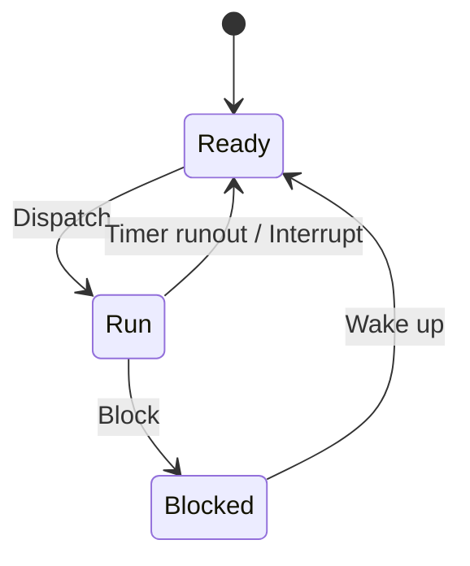

# 디지털 포렌식을 위한 컴퓨터 구조와 프로세스 (Computer Structure and Process)

[[01.basic]]에서 다룬 저장 매체·파일 시스템·레지스트리·해시·시그니처는 **디스크(또는 이미지) 위 정적 아티팩트**를 분석하는 데 초점이 맞춰져 있다. 본 문서는 그 아래층인 **하드웨어·운영체제·프로세스** 개념을 정리한다. 메모리 덤프 분석, 라이브 포렌식, 실행 중 프로세스·PCB 관련 아티팩트를 읽을 때 필요한 전제 지식이다.

---

## 1. 컴퓨터 세대와 구조적 진화

컴퓨터는 집적도·처리 방식·사용 목적에 따라 세대별로 구분한다. 포렌식 분석 대상이 되는 현대 PC·서버는 4~5세대 이후 구조(개인용 보급, 네트워크, GUI, 병렬 처리)를 전제로 한다.

| 세대 | 핵심 소자·기술 | 크기·성능 | 처리 방식 | 주요 용도·언어 |
|------|----------------|-----------|-----------|----------------|
| 1세대 (진공관) | 진공관 | 매우 큼, 열·전력 소모 큼 | **일괄 처리** — 일정량 또는 일정 기간 데이터를 모아 한 번에 처리 | 수치 계산·통계, 기계어·어셈블리어 |
| 2세대 (트랜지스터) | 트랜지스터(TR) | 기억 용량·연산 속도 증가, 소형화 | **다중 프로그래밍** — 하나의 CPU·주기억장치로 여러 프로그램을 동시에 처리. 운영체제 개념 도입 | 과학 계산·일반 사무, FORTRAN·ALGOL·COBOL. 보조 기억: 자기 드럼·자기 디스크 |
| 3세대 (집적회로) | 집적회로(IC) | 가격 하락·소형화 | **시분할·멀티프로그래밍** — 여러 사용자가 동시에 시스템 사용, CPU가 프로그램을 번갈아 처리해 각 사용자에게 독립 PC를 쓰는 느낌 제공 | C, BASIC, PASCAL |
| 4세대 (대규모 집적회로) | 고밀도 집적회로(LSI) | 개인용 보급, 소형화 | **실시간 처리** — 데이터 처리 요구를 즉시 처리해 결과 산출 | 개인 컴퓨터 대중화, 네트워크·인터넷 등장 |
| 5세대 (초고밀도 집적회로) | 초고밀도 집적회로(VLSI) | 초미니·초고속 | **다중·병렬 처리** — 작업을 여러 프로세서에 분배해 동시 수행. **GUI** | 자연어·인공지능어 프로그래밍 |

### 1.1 1세대와 폰 노이만 구조

1세대에서 **폰 노이만**이 제안한 **프로그램 내장** 개념이 도입되었다. 명령어와 데이터가 **같은 메모리 버스**를 통해 CPU에 전달되는 방식이다. 이후 대부분의 범용 컴퓨터가 따르는 구조의 출발점이다.

> 디스크 이미지 분석은 저장 장치(보조 기억)와 파일 시스템에, 메모리 포렌식은 주기억장치·실행 중 프로세스에 초점이 맞춰진다. 둘 다 동일한 “프로그램 내장·버스” 모델 위에서 동작한다.

---

## 2. 프로세스

### 2.1 정의

**프로세스**는 운영체제에서 **수행 중인 프로그램**을 말한다. 디스크에 있는 실행 파일을 읽어 메모리에 적재한 뒤 CPU가 명령을 실행하는 단위이다.

### 2.2 프로세스 상태와 전이

프로세스는 **준비(Ready) → 실행(Run) → 보류(Blocked)** 의 세 상태를 오간다.

| 전이 | 이름 | 설명 |
|------|------|------|
| Dispatch | 디스패치 | 여러 프로세스 중 하나를 선정해 CPU에 할당 |
| Timer runout / Interrupt | 타임아웃·인터럽트 | 타임아웃, 입출력 등으로 **현재 실행 프로세스**를 준비 상태로 내리고 해당 작업을 우선 처리 |
| Block | 블록 | 실행 중 프로세스가 입출력·이벤트 처리를 위해 **대기(보류) 상태**로 전환 |
| Wake up | 웨이크업 | 입출력·이벤트가 끝난 프로세스를 다시 **준비 상태**로 올려 스케줄러가 선택할 수 있게 함 |

### 2.3 프로세스 제어 블록 (PCB)

**PCB(Process Control Block)** 는 운영체제가 프로세스를 제어하기 위해 정보를 저장하는 자료구조이다.

- 프로세스 **생성 시** 만들어져 **주기억장치**에 저장되고, 프로세스 **완료 시** 함께 제거된다.

| PCB 항목 | 설명 |
|----------|------|
| 프로세스 현재 상태 | Ready / Run / Blocked 등 |
| 프로세스 이름 | 식별용 이름 |
| 프로세스 우선순위 | 스케줄링 우선순위 |
| 메모리 주소 | 프로세스에 할당된 메모리 영역 정보 |
| 프로그램 카운터 (PC) | **다음에 실행할 명령어의 주소** |
| CPU 레지스터 | 프로세스 실행을 위해 저장·복원해야 할 레지스터 값 |
| CPU 스케줄링 정보 | CPU 스케줄러에 의해 중단된 시각 등 |
| I/O 상태 정보 | 프로세스에 할당된 I/O 디바이스 목록 |

### 2.4 프로세스 관련 작업

| 작업 | 설명 |
|------|------|
| **Creation (생성)** | 새 프로세스 생성. 운영체제가 **보조기억장치**에 저장된 프로그램을 선택하며, 이때 **새 PCB**가 생성된다 |
| **Destroy (종료)** | 수행 중 프로세스 종료. **PCB 회수**, 필요 시 보조기억장치에 프로그램을 다시 저장. **부모 프로세스 종료 시 자식 프로세스도 자동 소멸** |
| **Suspend (일시 정지)** | 실행 중 프로세스가 작업을 멈추고 대기. (Windows에서는 해당 창이 옅은 색으로 표시되는 등 UI로 구분되기도 함) |
| **Resume (재개)** | Suspend 상태 프로세스가 활동을 재개 |

---

## 3. [[01.basic]]과의 연계

| 본 문서 개념 | [[01.basic]]에서의 포렌식 연결 |
|-------------|-------------------------------|
| 보조기억장치·프로그램 적재 | §4 저장 매체(섹터·클러스터), §8.1 디스크 브라우징 — **디스크 이미지** 분석 |
| 프로세스·PCB·CPU 상태 | §9 Volatility — **메모리 덤프**에서 프로세스·네트워크 연결·악성코드 흔적 추출 |
| 입출력·이벤트(Block/Wake up) | §8.3 타임라인(MAC 타임) — 파일·이벤트의 **시간 순 재구성** |
| 운영체제·레지스트리 | §5 레지스트리·하이브 — Windows **설정·사용 이력** 아티팩트 |

---

## 4. 선수지식 및 범위

- 기술적 기반(원칙·저장 매체·레지스트리·해시·시그니처·분석 기법·도구): [[01.basic]]
- 법률과 절차(형사소송법·통신비밀보호법·수사 절차)는 별도 절차 문서의 범위다.
