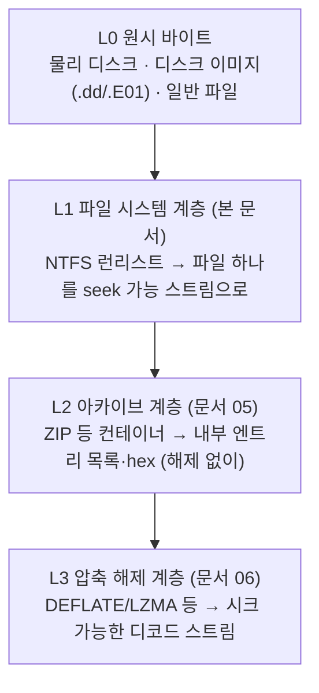

# 물리 디스크에서 NTFS 런리스트로 파일 스트림 만들기 (Raw Disk to NTFS Runlist Stream)

[[01.basic]] §4에서 저장 매체가 데이터를 **섹터·클러스터**에 물리적으로 배치한다는 것을, §8에서 이미지를 브라우징한다는 것을 다뤘다. 본 문서는 그 사이에 있는 질문에 답한다 — **운영체제의 파일 열기 API를 거치지 않고**, 디스크(또는 이미지) 위의 원시 바이트만으로 특정 파일 하나를 어떻게 읽는가? 답은 파일 시스템 메타데이터(NTFS의 런리스트)를 직접 해석해 파일을 **랜덤 액세스 가능한 가상 스트림**으로 노출하는 것이다. 이 문서는 그 스택의 최하위 계층(L1)을 다룬다.

---

## 1. 전체 그림: 스택형 가상 파일 시스템(VFS)

핵심 아이디어는 **스트림을 계층으로 쌓는 것**이다. 각 계층은 "바이트를 seek/read 할 수 있는 무언가"(스트림)를 입력으로 받아, 그 위에서 구조를 해석하고, 다시 "seek/read 할 수 있는 무언가"를 출력한다. 아래 계층은 위 계층이 무엇인지 모르고, 위 계층은 아래가 물리 디스크인지 파일인지 신경 쓰지 않는다.



각 계층이 독립 스트림이므로 조합이 자유롭다. 예를 들어 "디스크 안(L1)의 ZIP 파일(L2) 안에 든, DEFLATE로 압축된 문서(L3)"를, **어느 것도 디스크로 풀지 않고** 필요한 바이트 범위만 읽어낼 수 있다. 본 문서의 목표는 L0을 받아 L1을 만드는 것, 즉 파일 시스템 구조를 해석해 파일 하나를 스트림으로 바꾸는 일이다.

---

## 2. 디스크는 물리에, 파일 시스템은 포인터에

정확한 멘탈 모델은 이렇다. **파일의 내용 바이트는 볼륨의 데이터 영역(물리 섹터)에 쓰여 있고, 파일 시스템은 "그 바이트가 어디 있는지"를 가리키는 메타데이터일 뿐이다.** 파일을 "연다"는 것은 이 포인터를 따라가 물리 위치를 계산하는 일이다.

주소 단위는 세 층위로 나뉜다.

| 단위 | 정의 | 관계 |
|------|------|------|
| 섹터 (Sector) | 저장 장치가 읽고 쓰는 최소 물리 단위 (전통적 512 B, AF 4096 B) | 하드웨어가 정함 ([[01.basic]] §4.1) |
| 클러스터 (Cluster) | 파일 시스템이 공간을 할당하는 최소 단위 | `클러스터 크기 = 섹터 크기 × 섹터/클러스터` |
| 바이트 오프셋 | 볼륨 시작점 기준 절대 위치 | `바이트 오프셋 = LCN × 클러스터 크기 (+ 파티션 시작 오프셋)` |

여기서 **LCN(Logical Cluster Number)** 은 볼륨 전체에서 클러스터의 일련번호이고, **VCN(Virtual Cluster Number)** 은 한 파일 안에서 클러스터의 일련번호(0, 1, 2, …)이다. L1 계층이 하는 일의 본질은 결국 **VCN → LCN → 바이트 오프셋** 변환이다.

> 물리 매체 수준에서는 SSD/NVMe의 FTL이나 SMR이 논리 블록 주소(LBA)를 다시 가상화하지만, 포렌식 도구가 실제로 다루는 층위는 그 위인 **논리 블록/클러스터**다. 이 계층에서의 "물리 위치"는 LBA/클러스터 기준으로 정확하다.

---

## 3. NTFS 구조 훑기

NTFS에서 파일의 위치 정보를 담는 자료구조는 **MFT(Master File Table)** 이다.

### 3.1 볼륨 부트 레코드 (VBR)

파티션 첫 섹터에 있으며, 클러스터 크기와 MFT 위치를 계산하는 데 필요한 값을 담는다.

| 필드 | VBR 내 오프셋 | 크기 | 의미 |
|------|--------------|------|------|
| Bytes Per Sector | 0x0B | 2 B | 섹터당 바이트 (보통 512) |
| Sectors Per Cluster | 0x0D | 1 B | 클러스터당 섹터 (보통 8 → 4KB 클러스터) |
| MFT Cluster Number | 0x30 | 8 B | $MFT가 시작하는 LCN |

`클러스터 크기 = Bytes Per Sector × Sectors Per Cluster`. 이 값이 이후 모든 LCN→바이트 변환의 상수가 된다.

### 3.2 MFT와 레코드·속성

- MFT는 볼륨의 **모든 파일·디렉터리마다 하나씩** 레코드를 가진다. 레코드 크기는 보통 **1 KB** 고정이다.
- 각 MFT 레코드는 여러 **속성(Attribute)** 의 나열이다. 파일명은 `$FILE_NAME`, 타임스탬프 등은 `$STANDARD_INFORMATION`, 그리고 우리가 찾는 **파일 내용은 `$DATA` 속성**에 들어 있다.

---

## 4. `$DATA` 속성: 상주 vs 비상주

`$DATA` 속성이 파일 내용을 담는 방식은 두 가지다. 이 구분이 L1 구현의 첫 분기점이다.

| 구분 | 조건 | 내용 위치 | 스트림 구현 |
|------|------|-----------|-------------|
| **상주 (Resident)** | 내용이 작아 MFT 레코드(1KB) 안에 들어감 (대략 ≤ 700~900 B) | MFT 레코드 **내부**에 그대로 | MFT 레코드 바이트에 대한 범위 스트림. 런리스트 없음 |
| **비상주 (Non-resident)** | 내용이 커서 별도 클러스터에 저장 | 볼륨 데이터 영역의 클러스터들 | **런리스트**로 위치를 기술 → RunlistStream |

속성 헤더의 한 플래그(non-resident flag)가 둘을 구분한다. **작은 파일은 런리스트가 아예 없다**는 점이 중요하다 — 상주 파일을 런리스트로 읽으려 하면 실패한다. 실제 구현은 이 플래그를 먼저 검사해 분기해야 한다.

---

## 5. 런리스트 (Data Runs)

비상주 `$DATA`의 내용은 볼륨 여기저기에 흩어진 여러 조각(extent)일 수 있다. **런리스트는 "이 파일은 이런 클러스터 조각들의 리스트로 구성된다"를 인코딩한 것**이다. 사용자 표현 그대로, **파일 하나가 (조각) 리스트로 구성된다.**

### 5.1 런 하나의 인코딩

런리스트는 여러 개의 **런(run)** 이 연속으로 붙은 가변 길이 바이트열이다. 각 런은 다음 형식이다.

```
[헤더 1바이트] [길이 필드 L바이트] [오프셋 필드 O바이트]
```

- **헤더 바이트**: 상위 니블 = 오프셋 필드 바이트 수(O), 하위 니블 = 길이 필드 바이트 수(L).
- **길이 필드**(L바이트, 리틀엔디언): 이 런의 길이를 **클러스터 수**로.
- **오프셋 필드**(O바이트, 리틀엔디언, **부호 있음**): 시작 LCN. 단, **절대값이 아니라 직전 런의 시작 LCN 기준 상대 델타**다. 첫 런만 클러스터 0 기준(=절대).
- 헤더 바이트가 **0x00** 이면 런리스트 종료.

### 5.2 두 가지 함정

- **상대 델타 (필수 이해)**: 각 런의 시작 LCN은 `이전 런 LCN + 이번 오프셋 델타`로 누적 계산한다. 델타는 음수일 수 있어(뒤로 점프) 부호 확장이 필요하다. "오프셋 = 절대 클러스터 번호"로 오해하면 첫 런 이후 전부 틀어진다.
- **희소 런 (Sparse)**: 오프셋 필드 크기 O가 **0** 이면, 이 런은 디스크에 실제 클러스터가 없는 **구멍**이다. 해당 VCN 범위는 물리 위치가 없으며, 읽을 때 **0으로 채운다**. 압축·희소 파일에서 나타난다.

### 5.3 디코딩 예제

바이트열 `21 04 00 00 01 04 00` 을 디코딩하면:

| 단계 | 헤더 | 길이(L) | 오프셋 델타(O) | 계산 | 결과 런 |
|------|------|---------|----------------|------|---------|
| 런 1 | `0x21` → O=2, L=1 | `04` = 4 | `00 00` = 0 | LCN = 0 + 0 = 0 | VCN 0–3 → LCN 0 |
| 런 2 | `0x01` → O=0, L=1 | `04` = 4 | (O=0) | **희소** | VCN 4–7 → 구멍(0으로 채움) |
| 종료 | `0x00` | — | — | 런리스트 종료 | — |

> `0x00` 종료 바이트를 만나면 파싱을 멈춘다. 핵심은 (1) 헤더 니블 분해, (2) 길이는 절대 클러스터 수, (3) 오프셋은 이전 런 기준 부호 있는 델타, (4) O=0이면 희소라는 네 규칙이다.

### 5.4 VCN → LCN → 바이트 오프셋

런리스트를 파싱하면 `(VCN 시작, 클러스터 길이, LCN 시작 또는 희소)` 튜플의 리스트를 얻는다. 파일 내 임의 바이트 위치 `pos`를 물리 오프셋으로 바꾸는 절차:

1. `target_vcn = pos / 클러스터 크기`, `within = pos % 클러스터 크기`
2. 리스트에서 `target_vcn`을 포함하는 런을 찾는다.
3. 희소 런이면 → 0 반환.
4. 아니면 `lcn = 런.LCN시작 + (target_vcn - 런.VCN시작)`
5. `물리 바이트 오프셋 = lcn × 클러스터 크기 + within + 파티션 시작 오프셋`

---

## 6. RunlistStream: 파일을 스트림으로

이제 런리스트를 `read(pos, len)` / `seek()` 를 지원하는 스트림으로 감싼다. 이것이 사용자가 말한 "**데이터 리스트의 위치를 가서 읽는 VFS 블록**"이다. 아래 계층 스트림(`base`, L0)과 파싱된 런리스트만 있으면 된다.

```text
function read(pos, len):
    result = empty buffer
    remaining = len
    while remaining > 0:
        run = find_run_containing(pos / cluster_size)   # §5.4
        if run is None: break                            # 파일 끝
        run_byte_start = run.vcn_start * cluster_size
        run_byte_end   = (run.vcn_start + run.length) * cluster_size
        chunk = min(remaining, run_byte_end - pos)       # 런 경계를 넘지 않게 자름
        if run.is_sparse:
            result += zeros(chunk)                       # 희소 → 0으로 채움
        else:
            disk_off = run.lcn_start * cluster_size + (pos - run_byte_start)
            result += base.read_at(disk_off + partition_base, chunk)
        pos       += chunk
        remaining -= chunk
    return result
```

핵심은 **런 경계를 넘는 읽기를 조각으로 나눠 처리**하는 것이다. 한 번의 `read`가 여러 런에 걸치면 각 런마다 물리 오프셋을 다시 계산해 이어 붙인다. seek는 단순히 `pos`를 옮기는 것이며, 다음 read에서 해당 런을 찾으므로 O(런 개수)로 임의 위치 접근이 된다.

상주 파일은 §4의 분기에 따라 이 스트림 대신 MFT 레코드 내부 바이트에 대한 단순 범위 스트림으로 처리한다.

> 성능을 위해 실무 구현은 이 위에 **블록 캐시**(예: 1MB 블록 LRU)를 한 겹 더 둔다. 상위 계층이 작은 read를 반복해도 물리 I/O는 블록 단위로 모여 효율적이다. 이 캐시 계층 역시 "스트림을 받아 스트림을 내놓는" 같은 규약을 따른다.

---

## 7. 위·아래 계층과의 접점

- **아래(L0)**: `base.read_at(offset, len)` 만 제공하면 무엇이든 된다 — 물리 디스크 핸들, `.dd`/`.E01` 이미지, 심지어 다른 스트림. 그래서 이미지 파일에도 실디스크에도 동일 코드가 동작한다.
- **위(L2)**: RunlistStream이 내놓는 것은 결국 "파일 하나의 논리적 바이트열"이다. 그 파일이 ZIP이면 아카이브 VFS의 입력이 된다.
- **NTFS 내장 압축**: 파일이 NTFS 압축 속성을 가지면 런리스트가 가리키는 것은 **압축된 바이트**다. 이때는 런리스트 위에 LZNT1 해제 계층(L3의 특수 사례)이 한 겹 더 필요하다.

---

## 8. 구현 시 주의점

표준 스펙 기준으로 반드시 지켜야 할 경계 조건이다.

| 항목 | 주의 | 근거 |
|------|------|------|
| 런 필드 크기 상한 | 길이·오프셋 필드는 각각 **최대 8바이트**까지 가능. 4바이트로 가정하면 대용량 볼륨의 긴 런에서 값이 **조용히 절단**된다 | NTFS 런 인코딩 규격 |
| 상대 델타·부호 | 오프셋 델타는 부호 있는 값. 음수 델타(뒤로 점프) 부호 확장 필수 | §5.2 |
| 상주 파일 | non-resident 플래그를 먼저 검사. 상주 파일에 런리스트 파싱을 적용하면 오작동 | §4 |
| 조각화 초과 | 극단적으로 조각난 파일은 런리스트가 한 MFT 레코드를 넘어 `$ATTRIBUTE_LIST`로 여러 레코드에 분산. VCN 범위로 이어 붙여야 함 | NTFS $ATTRIBUTE_LIST |
| raw ≠ 논리 | 압축·암호화·희소 파일은 디스크의 원시 바이트가 파일의 논리 내용과 다르다 | §7 |
| 파티션 베이스 | LCN→오프셋은 **볼륨 시작 기준**. 전체 디스크 오프셋은 파티션 시작 오프셋을 더해야 함 | §2 |
| 검증 | 재구성한 스트림의 정합은 **알려진 파일의 해시 대조**로 확인 ([[01.basic]] §1 무결성 원칙) | 재현 가능성 원칙 |

---

## 9. 더 읽을거리 (표준 참조)

- **The Sleuth Kit (TSK)**: 파일 시스템 구조를 직접 파싱해 마운트 없이 파일을 읽는 대표 오픈소스 포렌식 라이브러리. 런리스트를 일반화한 실행(run) 리스트로 다룬다.
- **Fox-IT dissect**: 원시 컨테이너 → 볼륨 → 파일 시스템을 스트림으로 쌓는 프레임워크. 본 문서의 RunlistStream과 같은 개념을 구현한다.
- **Brian Carrier, 『File System Forensic Analysis』**: NTFS MFT·속성·런리스트의 표준 레퍼런스.

---

## 10. 선수지식

- 저장 매체·섹터·클러스터·디스크 브라우징의 기초: [[01.basic]]
