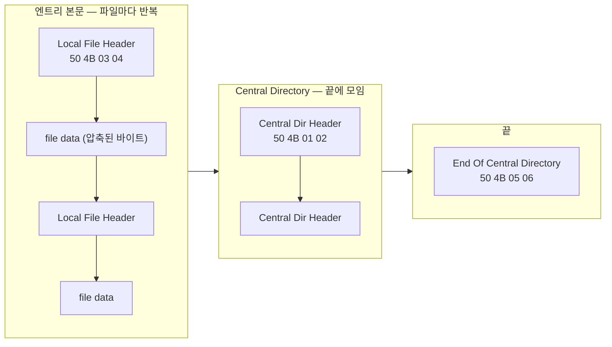

# 압축을 풀지 않고 아카이브 내부 읽기 (Archive VFS Without Extraction)

[[04.raw-disk-ntfs-runlist-stream]]에서 디스크 위 파일 하나를 **seek 가능한 스트림**으로 만들었다. 그 파일이 ZIP 같은 **아카이브**라면, 이제 그것을 하나의 작은 파일 시스템처럼 다뤄 **전체를 풀지 않고** 내부 목록·메타데이터·원시 hex에 랜덤 액세스할 수 있다. 본 문서는 스택의 아카이브 계층(L2)을 다룬다. 여기서 얻은 엔트리의 **압축된 내용을 실제로 디코드하고 그 안에서 seek** 하는 방법은 [[06.seekable-decompression-index]]로 이어진다.

핵심 결론을 먼저 짚는다. **아카이브의 "목록"과 "원시 hex"를 얻는 데는 압축 해제가 전혀 필요 없다.** 반면 엔트리의 **디코드된 내용**을 읽으려면 그 엔트리만 즉석에서 풀어야 한다. 즉 이 기법은 "디스크로 전체를 풀지 않는다(no full extraction)"는 것이지 "압축 해제가 0(zero decompression)"이라는 뜻이 아니다. 이 구분이 문서 전체의 축이다.

---

## 1. 왜 가능한가: 인덱스의 위치가 전부다

아카이브는 여러 파일을 하나로 묶은 **컨테이너**다. "풀지 않고 내부를 안다"가 가능한지는 오직 하나에 달려 있다 — **어디에 무엇이 있는지 적어 둔 목차(directory/index)가 컨테이너 안에 있는가, 그리고 어디에 있는가.**

| 포맷 | 내부 목차 | 랜덤 액세스 |
|------|-----------|-------------|
| ZIP | **있음** — 파일 끝의 Central Directory | 목차 위치만 알면 seek 한 번으로 전체 목록 |
| TAR | **없음** — 각 파일 앞에 헤더가 순차 배치 | 전체를 훑어 인덱스를 **직접 만들어야** 함 |

ZIP이 "풀지 않고 목록"의 교과서적 사례인 이유는 목차가 **파일 끝에 통째로** 모여 있기 때문이다. 이하 ZIP을 기준으로 설명하고, TAR 대조는 §5에서 다룬다.

---

## 2. ZIP 파일 레이아웃

ZIP은 세 종류의 구조가 이 순서로 배치된다.



각 구조의 시그니처와 핵심 필드:

| 구조 | 시그니처 | 위치 | 핵심 필드 |
|------|----------|------|-----------|
| End Of Central Directory (EOCD) | `0x06054b50` (`PK\x05\x06`) | 파일 **맨 끝** | 엔트리 총 개수, **Central Directory 시작 오프셋**, 코멘트 길이 |
| Central Directory File Header | `0x02014b50` (`PK\x01\x02`) | EOCD 앞, 엔트리마다 1개 | 파일명, 압축 방식, **압축 크기·원본 크기**, **로컬 헤더 오프셋** |
| Local File Header | `0x04034b50` (`PK\x03\x04`) | 각 엔트리 데이터 앞 | 파일명, 압축 방식, (경우에 따라) 크기, extra field |
| Data Descriptor | `0x08074b50` (`PK\x07\x08`) | (스트리밍 생성 시) 데이터 뒤 | CRC·압축/원본 크기 |

> **압축 방식(compression method)** 은 여기서 반복 등장하는 핵심 값이다. `0` = **STORED**(무압축, 원본 그대로 저장), `8` = **DEFLATE**(가장 흔함). 이 값이 §4의 "내용 읽기에 해제가 필요한가"를 결정한다.

---

## 3. 무해제 목록 알고리즘

목록을 얻는 절차는 압축 해제를 한 번도 하지 않는다.

```text
function list_entries(stream):
    # 1) 파일 끝에서 EOCD 찾기 (코멘트가 있으면 EOCD가 끝에서 밀려 있음)
    tail = stream.read_at(size - MAX_TAIL, MAX_TAIL)   # 최소 22B, 코멘트 대비 여유
    eocd = rfind(tail, 0x06054b50)                     # 뒤에서부터 시그니처 스캔
    cd_offset = eocd.central_directory_offset
    count     = eocd.total_entries

    # 2) Central Directory를 순회하며 엔트리 메타만 읽기
    entries = []
    pos = cd_offset
    for i in 0 .. count-1:
        h = parse_central_dir_header(stream.read_at(pos, ...))   # 시그니처 0x02014b50
        entries.append({
            name:            h.filename,
            method:          h.compression_method,   # 0=STORED, 8=DEFLATE
            compressed_size: h.compressed_size,
            size:            h.uncompressed_size,
            local_offset:    h.local_header_offset,  # 엔트리 데이터 위치
        })
        pos += h.total_length
    return entries
```

EOCD를 **뒤에서부터 스캔**하는 이유는 ZIP 끝에 가변 길이 코멘트가 붙을 수 있어 EOCD가 정확히 파일 끝 22바이트가 아닐 수 있기 때문이다. 목차만 읽으므로 아무리 큰 아카이브라도 목록화 비용은 목차 크기에만 비례한다.

---

## 4. 원시 hex vs 디코드된 내용

이 계층이 제공하는 "내부 접근"은 두 종류이고, 압축 해제 필요 여부가 다르다.

| 작업 | 압축 해제 | 방법 |
|------|-----------|------|
| 엔트리 **목록**·메타데이터 | **불필요** | Central Directory 읽기 (§3) |
| 엔트리의 **원시(raw) hex** | **불필요** | 로컬 헤더로 seek → 헤더 크기만큼 건너뜀 → `compressed_size` 바이트를 그대로 read |
| 엔트리의 **디코드된 내용** | **필요** (해당 엔트리만) | 위 raw 바이트를 압축 방식대로 해제 → [[06.seekable-decompression-index]] |
| 예외: **STORED(method 0)** 엔트리 | 불필요 | raw 바이트 = 원본. 해제 없이 내용까지 획득 |

원시 hex를 얻는 경로는 순수 파일 I/O다.

```text
function raw_entry_stream(stream, entry):
    lfh = parse_local_file_header(stream.read_at(entry.local_offset, ...))
    data_start = entry.local_offset + lfh.header_size    # 이름·extra 길이 포함
    return SubRangeStream(stream, data_start, entry.compressed_size)  # 하위 범위 뷰
```

여기서 `SubRangeStream`은 아래 스트림의 `[data_start, data_start+len)` 구간만 노출하는 **부분 범위 뷰**로, 이 역시 "스트림을 받아 스트림을 내놓는" 계층이다. 이 뷰가 곧 L3(압축 해제)의 입력이 된다.

> **왜 "hex는 되는데 내용은 해제가 필요"한가?** 목차와 로컬 헤더는 평문 메타데이터라 그냥 읽힌다. 하지만 DEFLATE 엔트리의 데이터 바이트는 압축된 상태이며, 사람이 읽는 원본으로 되돌리려면 반드시 디코드해야 한다. "풀지 않고 내용을 본다"는 흔한 표현은 **"아카이브 전체를 디스크에 풀어 두지 않고, 필요한 엔트리만 메모리에서 즉석 해제한다"** 로 정확히 옮겨야 한다.

---

## 5. TAR 대조: 인덱스가 없으면 만들어야 한다

TAR은 Central Directory가 없다. 각 파일이 512바이트 헤더 + 데이터로 **순차 나열**될 뿐이라, N번째 파일의 위치를 알려면 앞의 모든 헤더를 거쳐야 한다. 따라서 TAR에서 랜덤 액세스를 하려면 한 번 전체를 훑어 **`(파일명 → 오프셋·크기)` 인덱스를 직접 구축**하고, 이를 사이드카(예: 별도 인덱스 파일)로 저장·재사용한다.

| | ZIP | TAR |
|---|-----|-----|
| 목차 | 파일 끝에 내장 | 없음 |
| 목록 비용 | seek 한 번 + 목차 읽기 | 전체 스캔 1회 후 인덱스 구축 |
| 랜덤 액세스 | 즉시 | 인덱스 구축 후 가능 |

`tar.gz`처럼 TAR을 다시 gzip으로 감싼 경우는 **두 문제가 겹친다** — 순차 TAR + 시크 불가 압축. 이때는 압축 스트림에도 인덱스(액세스 포인트)가 필요하며, 이는 [[06.seekable-decompression-index]]의 주제다.

---

## 6. ZIP64와 경계 조건

원래 ZIP 필드는 32비트라 4 GB / 65535 엔트리에서 한계에 부딪힌다. 이를 넘으면 **ZIP64** 확장이 쓰인다.

- 크기·오프셋 필드가 `0xFFFFFFFF`(또는 개수가 `0xFFFF`)이면, 실제 값은 **extra field의 ZIP64 레코드**에 64비트로 들어 있다.
- 파일 끝에는 EOCD 앞에 **ZIP64 EOCD Record**와 이를 가리키는 **ZIP64 EOCD Locator**가 추가된다.

구현 시 자주 놓치는 지점:

| 항목 | 주의 |
|------|------|
| EOCD 스캔 범위 | 코멘트 최대 65535바이트까지 밀릴 수 있으므로 파일 끝 충분한 구간을 뒤에서 스캔 |
| ZIP64 | 큰 아카이브에서 32비트 필드의 `0xFFFFFFFF` 센티넬을 반드시 확인해 extra field로 폴백 |
| Data Descriptor | 스트리밍 생성된 ZIP은 로컬 헤더의 크기·CRC가 0이고 실제 값은 데이터 뒤 descriptor 또는 Central Directory에 있음. **Central Directory 값을 신뢰**할 것 |
| 암호화 | 전통 ZIP 암호화·AES는 데이터가 추가로 암호화됨. raw hex는 읽히나 내용은 복호 필요 |
| 파일명 인코딩 | 플래그에 따라 CP437 또는 UTF-8. 잘못 디코드하면 목록 파일명이 깨짐 |

---

## 7. 아카이브 VFS 인터페이스와 계층 적층

아카이브 계층을 스트림 규약에 맞춰 두 연산으로 노출하면 스택에 자연스럽게 끼워진다.

- `list() → [entry…]` : 목록 (§3)
- `open(name) → stream` : 해당 엔트리의 (raw 또는, L3과 결합 시 디코드된) 스트림

이 인터페이스의 힘은 **중첩(nesting)** 에서 드러난다. `open()`이 돌려주는 엔트리 스트림 자체가 또 하나의 아카이브일 수 있으므로, **아카이브 안의 아카이브**를 재귀적으로 열 수 있다.


목록을 깊이 우선으로 재귀 순회하면(중첩 아카이브를 만나면 다시 `list()`), 전체를 풀지 않고 **가상 트리**로 내부 구조 전체를 열거할 수 있다. 이때 무한 재귀·압축 폭탄(zip bomb)을 막기 위해 **깊이 상한**과 **누적 크기 상한**을 둔다.

---

## 8. 실제 패턴 (표준 참조)

같은 개념을 구현한 공개 사례들이다. 위키의 개념을 코드로 확인할 때 참고한다.

| 도구/라이브러리 | 성격 |
|-----------------|------|
| Python `zipfile` | Central Directory를 읽어 `ZipFile.open()`으로 엔트리를 스트림으로 노출 (표준 라이브러리) |
| fuse-zip / mount-zip | ZIP을 파일 시스템으로 마운트(FUSE), 추출 없이 탐색 |
| archivemount | libarchive 기반. 다양한 포맷 마운트. 단 libarchive는 순차형이라 true 시크 미지원(접근마다 앞에서 재해제) |
| ratarmount | TAR의 위치를 스캔해 **SQLite 인덱스**로 랜덤 액세스. 압축 스트림엔 시크 포인트 인덱스 |
| fsspec / PyFilesystem2 / Apache Commons VFS | 아카이브 파일 시스템을 다른 파일 시스템 위에 **적층**하는 추상화. `zip::s3://…`, `tar:gz:…!/…` 같은 계층 URI |

---

## 9. 다음 문서

- 엔트리의 **압축된 내용을 시크하며 디코드**하기 (DEFLATE·BGZF·xz·zstd·NTFS LZNT1): [[06.seekable-decompression-index]]
- 이 계층의 입력이 되는 **디스크 파일 스트림** 만들기: [[04.raw-disk-ntfs-runlist-stream]]
