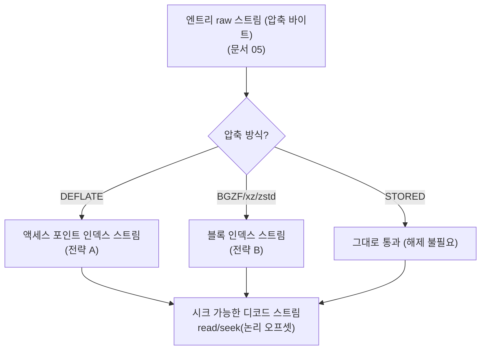

# 압축 스트림 랜덤 액세스: 액세스 포인트와 인덱스 (Seekable Decompression via Access Points)

[[05.archive-vfs-no-extract]]에서 아카이브 엔트리의 **압축된 바이트 범위**를 스트림으로 얻었다. 이제 마지막 질문이다 — 그 압축 데이터를 **디코드**하고, 나아가 디코드된 내용의 **임의 위치로 seek** 하려면? 스트림 압축(gzip/DEFLATE 등)은 태생적으로 랜덤 액세스가 되지 않는다. 이를 가능하게 하는 것이 **액세스 포인트(access point) 인덱스**, 사용자가 "체크포인트"라 부른 개념이다. 본 문서는 스택의 최상위 압축 해제 계층(L3)을 다룬다.

---

## 1. 왜 DEFLATE는 랜덤 액세스가 안 되는가

DEFLATE(gzip·ZIP·zlib의 공통 알고리즘, RFC 1951)는 **LZ77 슬라이딩 윈도우**로 중복을 제거한다. 반복되는 문자열을 `<길이, 뒤로-거리(distance)>` 쌍으로 표현하는데, 이 거리가 **최대 32 KB(32768바이트) 전까지**를 가리킬 수 있다.


문제는 여기서 나온다. 스트림 중간의 어떤 지점을 디코드하려면, 그 지점의 back-reference가 참조할 수 있는 **직전 32 KB의 출력(사전, dictionary)** 을 이미 재구성해 두어야 한다. 그런데 그 32 KB를 알려면 또 그 앞을 디코드해야 하고… 결국 **처음부터 순차 디코드**하지 않으면 임의 지점의 상태를 알 수 없다. 이것이 스트림 압축이 시크 불가인 근본 이유다.

---

## 2. 두 가지 전략

랜덤 액세스를 얻는 방법은 압축 포맷의 성격에 따라 갈린다.

| 전략 | 대상 포맷 | 핵심 아이디어 |
|------|-----------|---------------|
| **A. 외부 인덱스(액세스 포인트)** | gzip / DEFLATE 등 **상태 연속형** 스트림 | 시크할 수 없는 스트림을, 중간중간 **디코더 상태 스냅샷**(32KB 윈도우)을 저장한 인덱스로 사후 시크 가능하게 만든다 |
| **B. 내장 블록 인덱스** | BGZF / xz / zstd / bzip2 등 **블록 구조형** 포맷 | 애초에 **독립적으로 디코드 가능한 블록/프레임**으로 나눠 압축하고, 블록 위치 목록(시크 테이블)을 함께 저장한다 |

전략 A는 이미 만들어진 gzip 파일을 건드리지 않고 인덱스만 따로 만드는 것이고, 전략 B는 압축할 때부터 시크를 염두에 두고 포맷을 설계한 것이다.

---

## 3. 전략 A — 액세스 포인트 인덱스 (zran 방식)

zlib 저자 Mark Adler의 `zran.c`가 정립한 방식으로, `indexed_gzip` 등이 이를 따른다.

### 3.1 액세스 포인트가 저장하는 것

인덱스는 일정 간격(`SPAN`, 예: 압축 해제 기준 1 MB)마다 **DEFLATE 블록 경계**에 하나씩 찍은 **액세스 포인트**의 목록이다. 각 포인트는 그 지점에서 디코드를 재개하는 데 필요한 최소 상태를 담는다.

| 필드 | 의미 |
|------|------|
| 압축 해제 오프셋 | 이 포인트가 대응하는 **원본(디코드된)** 위치 |
| 압축 바이트 오프셋 | 압축 스트림에서의 바이트 위치 |
| 압축 비트 오프셋 | DEFLATE는 바이트 정렬이 아니므로 **비트 단위** 위치까지 필요 |
| **32 KB 윈도우** | 이 지점 직전 32 KB의 디코드된 출력(= 사전) 스냅샷 |

포인트 하나의 비용은 사실상 이 **윈도우 크기(~32 KB)** 다.

### 3.2 인덱스 구축과 시크

```text
# 구축: 전체를 한 번만 순차 디코드하며 SPAN 간격으로 포인트 기록
function build_index(comp_stream, SPAN):
    index = []
    inflate_init()
    while not end:
        out = inflate_next_chunk(comp_stream)
        if 블록 경계 도달 and (마지막 포인트 이후 SPAN 이상 진행):
            index.append({
                uncomp_off:  현재 원본 오프셋,
                comp_off:    현재 압축 바이트 오프셋,
                comp_bits:   현재 비트 오프셋,
                window:      직전 32KB 출력 스냅샷,
            })
    return index

# 시크: 목표 이전의 가장 가까운 포인트에서 재개해 전방으로만 디코드
function seek_and_read(comp_stream, index, target, len):
    p = 목표(target)보다 작거나 같은 마지막 포인트
    inflate_reset()
    inflatePrime(p.comp_bits, ...)         # 비트 정렬 복원
    inflateSetDictionary(p.window)         # 32KB 사전 주입 → 상태 복원
    skip = target - p.uncomp_off
    discard(skip); return read(len)        # 포인트~목표 구간만 전방 디코드
```

### 3.3 공간·속도 트레이드오프

핵심은 **포인트를 얼마나 촘촘히 찍는가**다.

- `SPAN`이 작을수록 → 목표에 가까운 포인트가 있어 시크가 빠르지만(평균 `SPAN/2`만 디코드) 인덱스가 커진다(포인트당 ~32 KB).
- `SPAN`이 클수록 → 인덱스는 작지만 시크할 때 더 많이 디코드해야 한다.
- 예: `SPAN` = 1 MB면, 임의 위치 접근 시 평균 약 512 KB만 디코드하면 된다.

> 인덱스는 한 번 만들어 파일로 저장해 두면 재사용된다. 압축 파일은 그대로 두고 인덱스만 곁에 두는 방식이라, 원본을 재압축하거나 변형하지 않는다.

---

## 4. 전략 B — 블록 구조 포맷

이 포맷들은 **독립 블록** 덕분에 원리적으로 전략 A의 "32 KB 윈도우 저장"이 필요 없다. 블록 경계에서 상태가 초기화되므로, 블록 시작점만 알면 그 블록을 홀로 디코드할 수 있다.

| 포맷 | 블록/프레임 | 인덱스 | 특징 |
|------|-------------|--------|------|
| **BGZF** (Blocked GZip) | gzip 호환 블록, 압축·해제 후 각 ≤ 64 KiB | 각 블록의 gzip 헤더에 `BSIZE` 필드 | 64비트 **가상 오프셋** = `압축블록오프셋 << 16 \| 블록내오프셋`. samtools/htslib(BAM·VCF.gz)의 기반 |
| **xz / LZMA2** | 독립 압축 블록 여러 개 | 파일 끝에 **인덱스**(블록별 압축·원본 크기) | 디코드는 **블록 경계에서만** 시작. 시크하려면 인코딩 시 블록을 충분히 작게 |
| **zstd seekable** | 독립 zstd 프레임 여러 개 | 끝의 **skippable frame**에 **시크 테이블**(프레임별 크기) — footer 매직 `0x8F92EAB1` | 시크 테이블을 모르는 디코더는 skippable frame을 그냥 건너뜀(하위 호환) |
| **bzip2** | 독립 블록(100~900 KB) | **내장 인덱스 없음** | 블록이 **비트 정렬**이라 블록 매직을 스캔하거나 외부 오프셋 인덱스를 만들어야 함 |

BGZF의 가상 오프셋이 좋은 예다. 상위 32비트로 "어느 압축 블록"을, 하위 16비트로 "그 블록을 푼 뒤 몇 번째 바이트"를 가리킨다(블록이 ≤ 64 KiB라 16비트로 충분). 이 하나의 64비트 정수로 압축 스트림 어디로든 점프한다.

---

## 5. 특수 사례: NTFS 내장 압축(LZNT1)

[[04.raw-disk-ntfs-runlist-stream]] §7에서 예고한 대로, NTFS 자체 압축 파일은 런리스트가 **압축된 바이트**를 가리킨다. LZNT1은 사실 전략 B와 같은 원리로 랜덤 액세스에 유리하다 — 파일을 **압축 유닛(compression unit)** 단위로 나눠 **유닛마다 독립적으로** 압축하기 때문이다.

- NTFS의 압축 유닛은 전형적으로 **16 클러스터**(4 KB 클러스터라면 64 KB)이며, 이 크기는 파일 시스템 파라미터로 정의된다.
- 유닛이 독립이므로, 파일 오프셋 `pos`가 속한 유닛만 골라 그 유닛만 해제하면 된다 → 전방 재디코드 없이 유닛 단위 랜덤 액세스.
- 런리스트에서 유닛의 압축 여부는 유닛 내 실제 할당 클러스터 수로 판별한다(전부 할당 = 비압축 저장, 일부만 할당 = 압축 + 나머지는 희소).

> 압축 유닛 크기(16 클러스터)는 통상값이며 파일 시스템 설정·버전에 의존한다. 재구현 시 이 값을 상수로 하드코딩하지 말고 볼륨·속성에서 읽어 계산해야 일반성이 유지된다. 바이트 단위 정합은 반드시 **알려진 NTFS 압축 파일의 실제 내용과 대조**해 검증한다.

---

## 6. 용어 정리

"체크포인트"는 직관적이지만 **어느 포맷 스펙에도 없는 관용어**다. 재구현·문헌 검색 시 정확한 용어는 다음과 같다.

| 개념(관용어 "체크포인트") | 정식 용어 | 출처 |
|---------------------------|-----------|------|
| gzip/DEFLATE 상태 스냅샷 | **access point**(개별) / **index**(전체) | Mark Adler `zran.c` |
| indexed_gzip의 포인트 | **seek point** / **index** | indexed_gzip |
| BGZF 위치 지정 | **virtual (file) offset** | SAM/BAM 규격 |
| xz의 시크 단위 | **block** + **index** | xz format 규격 |
| zstd의 시크 단위 | **frame** + **seek table** | zstd seekable format |

즉 문서·코드에서는 "체크포인트" 대신 상황에 맞는 정식 용어(access point/index, virtual offset, seek table)를 쓴다.

---

## 7. 디코더 VFS 인터페이스와 스택 완성

L3은 **압축된 스트림 + (포맷별) 인덱스 → 시크 가능한 디코드 스트림**을 내놓는 계층이다. [[05.archive-vfs-no-extract]] §4의 `SubRangeStream`(엔트리의 raw 바이트)을 입력으로 받아, 위 전략 중 포맷에 맞는 것으로 감싼다.



이로써 스택이 완성된다 — **물리 디스크(L0) → NTFS 파일 스트림(L1) → 아카이브 엔트리(L2) → 디코드 스트림(L3)** 을 통해, 어느 단계도 디스크로 풀지 않고 최종 논리 바이트의 임의 위치를 읽는다.

---

## 8. 구현 시 주의점

| 항목 | 주의 |
|------|------|
| 비트 vs 바이트 정렬 | DEFLATE 액세스 포인트는 **비트 오프셋**까지 저장해야 함. 바이트 단위만 저장하면 재개가 어긋남 |
| 인덱스 지속성 | 인덱스 구축은 전체 1회 디코드 비용이 크므로 파일로 저장·재사용. 원본 변경 시 무효화 |
| 메모리 | 포인트당 32 KB 윈도우가 쌓이면 인덱스가 커짐. `SPAN`으로 크기·속도 균형 조절 |
| 포맷 판별 | 매직 바이트로 gzip/xz/zstd/bzip2를 먼저 식별해 전략 A/B를 선택 |
| STORED 통과 | ZIP STORED(method 0) 엔트리는 해제 계층 없이 raw 스트림을 그대로 노출 |
| 검증 | 시크 후 디코드 결과가 처음부터 순차 디코드한 결과와 **바이트 단위로 일치**하는지 대조 |

---

## 9. 더 읽을거리 (표준 참조)

- **Mark Adler, `zran.c`** (zlib `examples/`): 액세스 포인트 인덱스의 정본 구현.
- **indexed_gzip**: `zran.c`를 파이썬으로 감싼 라이브러리. 32 KB 시크 포인트·인덱스 저장.
- **htslib / SAM 규격**: BGZF와 가상 오프셋.
- **xz format 규격**, **zstd seekable format 규격**: 블록·프레임 인덱스의 스펙.
- **RFC 1951** (DEFLATE): 32 KB 윈도우·back-reference의 근거.

---

## 10. 다음 문서

- 이 계층의 입력이 되는 **아카이브 엔트리 스트림** 만들기: [[05.archive-vfs-no-extract]]
- 그 아래, 디스크에서 **파일 스트림** 만들기: [[04.raw-disk-ntfs-runlist-stream]]
