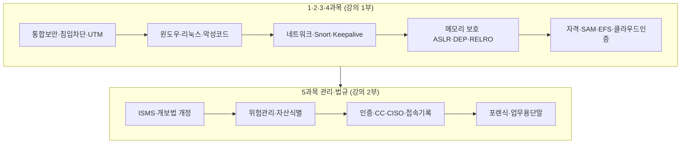

# 정보보안기사 필기 2023년 2회 — 개념·키워드·기출 복원

| 항목 | 내용 |
|------|------|
| 시험일 | 2023-06-17 (토) |
| 형식 | 1형, 100문항 (과목당 20문항) |
| 본 문서 역할 | **학습용 정리** — 개념·키워드·복원 가능 기출 |
| 원본 스크립트 | [[2023년 2회 기출풀이-스크립트-원본]] (인베스트 강의 자막) |

---

## 1. 출처와 확보 수준

| 자료 | 확보 수준 | 용도 |
|------|-----------|------|
| [Baba Yetu 문제 PDF](https://babayetu.tistory.com/232) | 문제 원문 **PDF**(스캔) | 지문·4지선다 **전문** SoT |
| [Baba Yetu 최종답안 PDF](https://babayetu.tistory.com/238) | 최종답안·정답률 **PDF**(스캔) | 공식 정답 SoT |
| [cordinghouse 키워드](https://cordinghouse.tistory.com/274) | 키워드·한 줄 해설 | 문항 주제 교차 검증 |
| 강의 스크립트 | 풀이 스크립트 (일부 문항 번호·선지 불완전) | 해설·개념 SoT |
| `cs/information-security/study/`, `05.management-and-law/` 등 | 정리본 | 개념 보강·링크 |

**제한**: PDF는 `pdftotext`로 텍스트가 추출되지 않아(이미지 스캔), 아래 **§5 기출 복원**은 스크립트·키워드에서 **확인된 문항만** 기출 형식으로 옮겼다. 지문·보기 4개 전문은 PDF를 직접 보며 대조할 것. 전체 회차·PDF 링크는 [[기출문제_수집_인덱스#2023년-2회-필기]].

**킬러 문항**(Baba Yetu, 정답률 10% 미만): 9(8%), 19(7%), 28(9%), 69(9%), **100(5%)**.

---

## 2. 학습 지도 (과목·논리 순서)

| 과목 | 강의 커버리지 | 저장소 보강 |
|------|---------------|-------------|
| 1 시스템 | DLL 인젝션, SAM, EFS, SUID, BSM, 쉘·syscall | `study/01.system-security/` |
| 2 네트워크 | UTM, TCP Keepalive, Snort, promiscuous, IDS | `study/02.network-security/08.security-solutions-and-monitoring.md` |
| 3·4 | Tabnabbing, Credential stuffing, RELRO·ASLR·DEP | `study/03.application-security/`, `study/04.security-general/` |
| 5 | ISMS, 위험 5단계, 개보법 2023.9.15, CISO, 접속기록 | `study/05.management-and-law/` |

---

## 3. 핵심 개념 (논리 구성)

### 3.1 통합 보안·침입 대응·UTM

| 개념 | 정의·판단 | 시험 포인트 |
|------|-----------|-------------|
| **침입 차단·탐지** | 개인정보처리시스템은 **침입차단·침입탐지** 운영 (개인정보 보호법 **시행령**) | “방” = 차단·탐지 의무 |
| **VPN** | 터널링; 인터넷망 경유 **관리자 페이지**는 **2단계 인증** | UTM에 VPN·방화벽이 묶여 출제 |
| **UTM** | Unified Threat Management — 방화벽·VPN·(이론상 AV 등) **통합** | 실무·시험: **방화벽 + VPN** 중심 |
| **통합 보안 솔루션** | 여러 보안 기능·**로그 통합 분석** | 대표: **SSO**, **UTM**, **ESM**(로그 수집·관제) |

→ 정확본: [[cs/information-security/study/02.network-security/08.security-solutions-and-monitoring#📖-에피소드-7--보안-솔루션-13-종-5-분류]]

### 3.2 DLL 인젝션 (윈도우)

**정상**: `a.exe`가 자신의 `a.dll`을 `LoadLibrary`로 로드.

**인젝션**: 악성 `b.dll`을 **실행 중인 타 프로세스** 메모리에 삽입.

| 단계 | API·동작 |
|------|----------|
| 1 | `VirtualAllocEx` — 타 프로세스에 메모리 할당 |
| 2 | `WriteProcessMemory` — `b.dll` 경로·코드 기록 |
| 3 | `LoadLibrary` 주소 획득 → `CreateRemoteThread`로 **원격 실행** |

**DLL Injector**: 위 과정을 수행하는 **도구·프로그램** (괄호 채우기 출제).

**코드 인젝션**: 목적이 DLL이 아니라 **셸코드·실행 코드**를 넣는 경우 (개념 구분).

### 3.3 TCP Keepalive

- **맥락**: 텔넷 등 **TCP** 세션이 원격 장애로 끊겼는데 세션이 남는 문제.
- **Keepalive**: 일정 시간 후 살아 있는지 검사, 무응답이면 **연결 해제**.
- 네트워크 장비·백본에서 자주 사용.

### 3.4 Snort (NIDS)

| 항목 | 내용 |
|------|------|
| 정체 | 오픈소스 **침입 탐지** (일부 IPS 기능·세션 차단) |
| 룰 프로토콜 | **TCP, UDP, ICMP** 등 (ARP만 단독 룰 ❌ 등 함정) |
| **틀린 보기 패턴** | “사전 공격으로 암호 강도·암호문 해독” → **무차별 대입·웹 프록시(Burp 등)** 영역, Snort ❌ |
| 로그 | `-l` 로그 디렉터리; Windows: `snort.log`, `alert.ids` 등 |

→ [[cs/information-security/study/02.network-security/08.security-solutions-and-monitoring#📖-에피소드-3--snort-정의·헤더·바디·threshold]]

### 3.5 리눅스 바이너리·메모리 보호

| 기법 | 요약 | 시험 |
|------|------|------|
| **ASLR** | 스택·힙·라이브러리 **주소 무작위** (`/proc/sys/kernel/randomize_va_space` 0/1/2) | 2 = 스택+힙+라이브러리 |
| **DEP / W^X** | 데이터 영역 **실행 금지** — 힙 스프레이·셸코드 실행 억제 | “NX”, No eXecute |
| **RELRO** | **REL**ocation **RO** — GOT 등 재배치 섹션 **쓰기 방지** | 2023 2회 키워드·강의 |
| **PIE** | Position Independent Executable — 로드 주소 랜덤 | ASLR과 연동 |
| **Stack Canary** | 스택 버퍼 오버플로 시 **리턴 주소** 보호 | |

### 3.6 SAM·자격 증명·EFS

| 개념 | 내용 |
|------|------|
| **SAM** | 윈도우 **계정·패스워드 해시** 저장; 노출 시 크리덴셜 탈취 |
| **SAM 접근 권한** | **Administrator**, **SYSTEM** (UAC: 일반 사용자 vs 시스템 권한 분리) |
| **Credential Stuffing** | **이미 탈취한 ID/PW**를 다른 사이트에 **대량 시도** |
| **EFS** | NTFS **파일·폴더** 암호화; `cipher` 상태 표시; 폴더 암호화 시 **신규 파일 자동 암호화** |
| **BitLocker** | **볼륨** 암호화; 키는 often **TPM** 칩에 저장 |

### 3.7 악성코드·IDS·리눅스 기초

| 구분 | 판별 |
|------|------|
| **트로이목마** | **자기 복제 안 함** (기출 반복) |
| **웜** | 네트워크 등으로 **자기 복제·전파** |
| **HIDS / NIDS** | 호스트 로그·에이전트 vs **네트워크 패킷** |
| **쉘** | 사용자 명령 **해석·실행** |
| **시스템 콜** | **유저 모드** → **커널 모드**로 하드웨어·OS 서비스 요청 |
| **SUID(4000)** | **실행 권한(x)** 이 있어야 의미; `chmod` 예: `4755` → others 실행 가능 시 `r-x` |

### 3.8 SCADA·Stuxnet·산업제어

| 용어 | 연결 |
|------|------|
| **PLC** | 공장·인프라 **제어** |
| **SCADA** | 원격 감시·제어 (공항 baggage 등 비유) |
| **Stuxnet** | **지멘스 SCADA** 등 산업 시스템 공격; **Modbus** 등 |
| **주요정보통신기반시설** | 원자력·발전 등 **국가 기반시설** 보호 대상 |

### 3.9 클라우드 보안 인증 (KISA)

| 서비스 | 유효기간 (암기) |
|--------|-----------------|
| **IaaS, DaaS** | **5년** |
| **SaaS** (표준) | **5년** |
| **SaaS** (간편 등급) | **3년** |

### 3.10 Tabnabbing·웹 에디터

- **Tabnabbing**: 여러 탭 사용 시, 입력 팝업 뒤 **배경 페이지를 피싱 URL로 교체**.
- **대응**: `rel="noopener noreferrer"` (강의: 노 오프너·노 리퍼러).
- 근거: **웹 에디터 보안 가이드라인**(2022.12) — 실기·필기 연계.

### 3.11 BSM (솔라릭스 계열)

- **BSM**: Basic Security Module — **커널 기반** 감사 로깅.
- **부하** 때문에 **집중 감사 필요 시**만 사용 (함정: “대부분의 정보를 syslog로” ❌).

### 3.12 정보보호 관리·법규 (5과목)

#### ISMS·개인정보 (2023.9.15 개정)

| 주제 | 핵심 |
|------|------|
| ISMS **기대효과 아님** | “사고로부터 **100% 안전**” — 상식 오답 |
| **안전성 확보조치** | 개보법 용어; 구 “기술적·관리적 보호조치”(정통망법 쪽 표현)와 **혼동 금지** |
| **암호화 대상** | 고유식별정보·여권·운전면허·외국인등록·신용카드·계좌·**생체인식** 등 (개정 후 7류 암기) |
| **무결성** | 비인가 **생성·변경·삭제**로부터 **정확성·완전성** 보장 |

#### 침해사고 대응 **절차 순서**

- **오답 패턴**: “초동 대응”이 “탐지”보다 **앞**에 오는 선지.
- **기억**: 사전 준비 → **탐지** → **초동 대응** → … → 사고 조사·보고 (포렌식 4단계·7단계와 병행 학습).

→ [[cs/information-security/study/05.management-and-law/04.incident-response-and-forensics]]

#### 위험 관리 (2023 출제 경향 **주의**)

| 구분 | 내용 |
|------|------|
| **잘못된 용어** | “**자산 분석법**” — ISMS·KISA·기존 기출에 **없던 표현** (23년 2회 오답) |
| **KISA 5단계** | 전략·계획 → **분석** → **평가** → 대책 선정 → 이행·**감시·재검토** |
| **강의·일부 교재 순서** | **자산 식별** → 위협·취약 → 위험 분석·평가 → 보호대책 → 감시·검토 |
| **오답** | “위험 평가 시 **외부 컨설턴트 반드시**” — **② 오답** (강의) |

→ 정확본: [[cs/information-security/05.management-and-law/02.risk-assessment]] · 학습본: [[cs/information-security/study/05.management-and-law/02.risk-assessment]]

#### 인증·CC·CISO·접속기록

| 주제 | 핵심 |
|------|------|
| **정보제품 평가인증** | **정책·법령** = **과기정통부**; **인증기관** = 평가결과 승인·인증서·평가기관 관리 |
| **CC / 실시인증** | **EAL** — **Element → Component → Package**; 공공·주요기반시설 **CC·실시인증** 제품 구매 |
| **ISP 심사원** (90번) | 자격 **발급·관리 = KISA** (금융권 근본 ❌) |
| **심사원 보→선임** | 보: 시험 합격; 선임: ISMS **3회/15일**, ISMS-P **4회/20일** (강의 암기) |
| **접속기록 필수** | **접속 일시**, **접속지(IP 등)**, **수행 업무** — **마지막 로그아웃 시각 필수 아님** → **②** (강의) |
| **프라이버시 vs 개인정보** | 프라이버시 = **인격권**; 개인정보 = **식별 가능한 개인** 관련 정보 |
| **CISO 겸직 금지** | 정보통신 **서비스 제공자** + 자산 **5조 이상** + ISMS 의무 + **5천억 이상** 등 (조건형) |
| **CISO 자격** | 정보보호·IT **석사+** 등 (학사 3년·전문학사 5년·경력 10년·ISMS 심사원 등) |

#### 포렌식·업무 단말 (98번 등)

| 명령·주제 | 내용 |
|-----------|------|
| `net start` | 서비스 **시작** |
| `sc query` | **서비스 목록** 조회 |
| **업무용 단말** | 접근통제 **적절성 점검** — “하지 않아도 된다” ❌ |
| **개인정보 유출 방지** | **화면보호기만**으로 충분 ❌ → **③** (강의) |

---

## 4. 키워드 인덱스 (2회 + cordinghouse)

| 키워드 | 한 줄 | 연관 § |
|--------|--------|--------|
| UTM | 방화벽·VPN 등 통합 | §3.1 |
| DLL Injector | 타 프로세스에 DLL 강제 로드 | §3.2 |
| TCP Keepalive | 유휴 TCP 세션 생존 확인·해제 | §3.3 |
| RELRO | ELF 재배치 영역 쓰기 보호 | §3.5 |
| Credential Stuffing | 탈취 자격증명 대량 재사용 | §3.6 |
| Tabnabbing | 탭 피싱·noopener | §3.10 |
| 클라우드 보안인증 | IaaS/DaaS 5년, SaaS 5/3년 | §3.9 |
| BSM | 커널 감사·선택적 사용 | §3.11 |
| 자산 분석법 | **오답용 함정** (표준 용어 아님) | §3.12 |
| Stuxnet / SCADA / Modbus | 산업제어 | §3.8 |
| Metasploit | 모의해킹·CVE 악용 도구 (강의) | §5 |
| OllyDbg / Ghidra / xsser | 역공학·스캐너 (cordinghouse) | — |
| GRE | **암호화 없음**, 사이트·사이트 터널 | cordinghouse |
| ElasticSearch | character filter → tokenizer → token filter | cordinghouse |
| ModSecurity | SecRuleEngine / SecAuditEngine | cordinghouse |

---

## 5. 기출문제 복원 (스크립트·키워드 기반)

> **표기**: `문항 번호`는 강의에서 **명시된 경우만** 기재. 미명시는 `S-순번`(스크립트 순).  
> **보기 전문**은 PDF 대조 필수. 정답은 **강의 기준**; 최종답은 Baba Yetu PDF가 SoT.

---

### 5.1 시스템·네트워크·응용·일반 (강의 1부)

#### S-01. 통합 보안·개인정보 침입 대응

**[문항 유형]** 개념 연결 (지문 PDF 미전사)

**지문 요약**: 침입 차단 시스템·개인정보 처리 시스템·VPN·UTM·통합 보안 솔루션의 관계.

**핵심 정리**

1. 개인정보처리시스템 → **침입차단·침입탐지** 운영 (개보법 시행령).
2. **VPN** + 인터넷 경유 관리자 접근 **2단계 인증**.
3. **UTM** ≈ 방화벽 + VPN (+ 이론상 통합 기능).
4. **통합 보안 솔루션** 예: **SSO**, **UTM**, **ESM**.

**학습 링크**: §3.1 · [[cs/information-security/study/02.network-security/08.security-solutions-and-monitoring]]

---

#### S-02. DLL 인젝션 (괄호 채우기)

**[문항 유형]** 지문 빈칸 — “DLL 인젝션은 … 프로세스의 메모리 영역에 … 로드한다.”

**정답 방향**: **실행 중인(원하는) 프로세스** + **DLL(코드)** — **DLL Injector**가 수행.

**해설 요약**: `VirtualAllocEx` → `WriteProcessMemory` → `CreateRemoteThread` + `LoadLibrary`. **코드 인젝션**은 셸코드 삽입으로 구분.

---

#### S-03. TCP Keepalive

**[문항 유형]** “텔넷 등 TCP 연결이 비정상 종료되어도 세션이 남을 때, 연결을 해제하게 하는 기능은?”

**정답 키워드**: **TCP Keepalive** (강의: “라이브”)

---

#### S-04. Snort 설명 (오답 찾기)

**[문항 유형]** “Snort에 대한 설명으로 **틀린 것**은?”

**정답 (강의)**: **③** — “사전 공격으로 비밀번호 강도·암호문 해독”은 **Snort가 아님** (Burp·웹 프록시·무차별 대입 영역).

**맞는 설명 방향**: 룰 기반 탐지, TCP/UDP/ICMP 분석, `-l` 로그, IPS적 세션 차단 등.

---

#### S-05. RELRO

**[문항 유형]** “리눅스 바이너리 **섹션 메모리 변조**를 막기 위한 기법은?”

**정답 키워드**: **RELRO**

**연관**: ASLR, DEP/NX, PIE, Stack Canary — §3.5

---

#### S-06. nmap · promiscuous mode

**[문항 유형]** Passive OS / **무차별 모드(promiscuous)** — 목적지 MAC이 **자신이 아니어도** 수신.

---

#### S-07. SAM 접근 권한

**[문항 유형]** “SAM에 접근할 수 있는 그룹은?”

**정답 방향**: **Administrator**, **SYSTEM**

---

#### S-08. Credential Stuffing

**[문항 유형]** “공격자가 **확보한 로그인 자격**을 **다른 인증 시스템**에 무작위 대입”

**정답 키워드**: **Credential Stuffing** (크리덴셜 스터핑)

---

#### S-09. EFS / BitLocker (기출 재출제)

**[문항 유형]** EFS·BitLocker·`cipher`·TPM·암호화 폴더에 파일 추가 시 **자동 암호화** — **기존 기출과 동일 지문** (강의).

---

#### S-10. 트로이목마

**[문항 유형]** “트로이목마의 설명”

**핵심**: **자기 복제하지 않음** — 같은 회차 **다른 문항**과 논리 연계 출제 (강의 지적).

---

#### S-11. IDS 구분

| 설치·관측 대상 | 유형 |
|----------------|------|
| 컴퓨터·로그 | **HIDS** |
| 네트워크 패킷 | **NIDS** |

---

#### S-12. 쉘 · 시스템 콜 · 리눅스 구성

| 용어 | 역할 |
|------|------|
| **Shell** | 명령 **해석** |
| **syscall** | 유저 모드 → 커널 모드 |
| 리눅스 | 커널·쉘·파일시스템 |

---

#### S-13. 악성코드 설명 (오답)

**[문항 유형]** “악성코드 설명으로 **틀린 것**”

**정답 (강의)**: **③** — “웜과 트로이목마는 **다른 파일을 감염**”류 서술 **오류** (트로이는 자기복제·감염 패턴 다름). **S-10과 동일 논지**.

---

#### S-14. SUID · chmod

**[문항 유형]** 유닉스 **SUID(4000)** — **실행 권한**이 있어야 의미; 예 `chmod 4755` → others **x** 필요.

---

#### S-15. PLC · SCADA · Stuxnet

| 질문 | 답 |
|------|-----|
| 지멘스 **SCADA** 공격 웜 | **Stuxnet** |
| 공항 baggage 등 **감시제어** | **SCADA** |
| PLC·제어 | **Modbus** 등 (강의) |

---

#### 16번. TMOUT · CVE · exploit 도구

**[강의 명시: 16번]**

**지문 방향**: Linux **일정 시간 미로그인** 시 세션 종료 — `/etc/profile` **`TMOUT`**.

**연관**: “알려진 취약점(CVE) 공격에 쓰이는 **도구**” — 강의: **그대로 외울 것**(MSF·Metasploit 언급, Snort와 구분).

---

#### S-17. 클라우드 보안 인증

**[문항 유형]** IaaS/DaaS/SaaS **인증 유효기간**

| 구분 | 기간 |
|------|------|
| IaaS, DaaS | 5년 |
| SaaS 표준 | 5년 |
| SaaS 간편 | 3년 |

---

#### S-18. Tabnabbing

**[문항 유형]** 웹 에디터·다중 탭·피싱 페이지 전환

**정답 키워드**: **Tabnabbing** · 대응 **noopener / noreferrer**

---

#### S-19. BSM (오답) — 킬러 후보 19번(7%)

**[문항 유형]** Solaris **BSM** 설명 중 **틀린 것**

**오답 방향**: “시스템 **대부분의 정보**를 수집해 **syslog**…” — BSM은 **커널 감사**, **필요 시만** 집중 사용.

---

#### S-20. 기타 (cordinghouse만 확인·강의 미풀이)

아래는 **키워드만** 확보; 지문·정답은 PDF·CBT로 확인.

| 키워드 | 메모 |
|--------|------|
| Code Red / Slammer | 웜·DoS 유형 |
| Metasploit / Ghidra | 모의해킹·역컴파일 |
| Tabnabbing | §3.10 |
| 폐색부 | 좁은 채널·모니터링 |
| IP 클래스 A/B/C/D/E | A=0, B=10, C=110, D=1110, E=1111 |
| UFW `allow 22/tcp` | 방화벽 허용 예 |

**킬러**: **28번**(9%, 네트워크), **69번**(9%, 정보보안 일반) — PDF·정답률표 대조.

---

### 5.2 정보보호 관리 및 법규 (강의 2부)

#### S-21. ISMS 기대효과

**[문항 유형]** “ISMS 인증 **기대효과가 아닌 것**”

**오답**: “정보 유출·침해사고로부터 **100% 안전**”

---

#### S-22. 안전성 확보조치 · 암호화 대상 (2023.9.15)

**[문항 유형]** 개보법 **안전성 확보조치** · **암호화** 대상 7류

**주의**: 정통망법식 “기술적·관리적 보호조치” 표현과 **선지 혼동**.

→ [[cs/information-security/study/05.management-and-law/08.privacy-law]]

---

#### S-23. 무결성 정의

**[문항 유형]** “비인가 생성·변경·삭제로부터 **정확성·완전성**” → **무결성**

---

#### S-24. 침해사고 대응 절차

**[문항 유형]** “절차로 **옳지 않은 것**”

**오답 패턴**: **탐지**보다 **초동 대응**이 **앞**서는 순서.

---

#### S-25. 인증기관 vs 정책기관

**[문항 유형]** “정보제품 **인증기관**의 **의무가 아닌 것**”

**오답**: **정책·법령 제·개정** — **과기정통부(정부)**

---

#### S-26. 위험 평가 방법 (오답)

**[문항 유형]** “위험 평가 **방법**으로 **틀린 것**”

**정답 (강의)**: **자산 분석 방법** — 표준·기존 기출에 **없는 표현**

**올바른 흐름**: §3.12 · [[cs/information-security/05.management-and-law/02.risk-assessment]]

---

#### S-27. 위험 분석 · 외부 컨설턴트

**[문항 유형]** “위험 분석·평가 설명으로 **틀린 것**”

**정답 (강의)**: **②** — “**반드시** 외부 보안 컨설턴트” ❌

---

#### S-28. 접속기록 · 로그 위변조

**[문항 유형]** “로그를 **수정할 수 없다**” 류 — **틀린 설명** (강의: 접근기록 관련 함정)

---

#### S-29. 계약·NDA

**[문항 유형]** (맥락 생략)

**정답 (강의)**: **③**

---

#### S-30. CC · EAL · 실시인증

**[문항 유형]** 정보보호 **제품 실시 인증** · **CC** 계층

**구조**: Element · Component · Package · (Protection Profile)

**대상**: 중앙행정·**주요정보통신기반시설** 등 — **CC·실시인증** 제품 구매

→ [[cs/information-security/study/05.management-and-law/05.certifications]]

---

#### 90번. ISP 인증 심사원

**[강의 명시: 90번]** “ISP 인증 심사원 설명으로 **틀린 것**”

**정답 (강의)**: **③** — 심사원 **자격 발급·관리**는 **KISA** (금융권 근본 ❌)

**암기**: 심사원 보 → 선임: ISMS **3회/15일**, ISMS-P **4회/20일**

---

#### S-31. 개인정보 취급자 교육

**[문항 유형]** “개인정보 **취급자** 역할” — **교육 계획을 취급자가 수립** ❌ → **처리자(관리자)** 책임

---

#### S-32. 접속기록 필수 항목

**[문항 유형]** “접속 기록에 **반드시** 포함”

**포함**: 접속 **일시**, 접속지(**IP** 등), **수행 업무**

**불필요 (강의)**: **마지막 로그아웃 시각** → **②**

---

#### S-33. 프라이버시 vs 개인정보

**[문항 유형]** “옳은 설명”

- **프라이버시**: **인격권** 자체  
- **개인정보**: 식별 가능한 **개인**에 관한 정보 — 침해 시 보호 대상

---

#### S-34. CISO 겸직 금지 · 자격

**[문항 유형]** 정보통신 **서비스 제공자** · 자산 규모 · ISMS 의무 등 **조건부 겸직 금지**

**자격**: 정보보호·IT **석사+** (학사 3년·전문학사 5년·경력 10년·ISMS 심사원 등)

→ [[cs/information-security/05.management-and-law/01.security-management-overview]]

---

#### S-35. 위험관리 절차 순서 (23년 표현)

**[문항 유형]** “올바른 **순서**”

**강의 정답 흐름**: **자산 식별** → 위협·취약 → **위험 분석·평가** → **보호대책** → **감시·검토**

**주의**: 구 기출 “위험 분석·평가”만 쓰던 표현과 **다름** — §3.12

---

#### 98번. Windows 서비스 · 포렌식

**[강의 명시: 98번]**

| 명령 | 의미 |
|------|------|
| `net start` | 서비스 **시작** |
| `sc query` | **서비스 목록** 조회 |

---

#### S-36. 업무용 단말기

**[문항 유형]** “업무용 단말기 접근통제 **적절성 점검**을 **하지 않아도 된다**” → **오답** (강의: 점수용)

---

#### S-37. 개인정보 침해사고 방지 (오답)

**[문항 유형]** “**틀린 것**” — “**화면보호기 설정**만으로 침해사고 방지 가능”

**정답 (강의)**: **③**

---

#### 100번. 킬러 (5%)

**[Baba Yetu]** 5과목 **100번** — 정답률 **최저**. 지문·보기는 **최종답안 PDF** 필수. 강의 스크립트 말미는 “1과목 풀이 완료”로 **100번 해설 없음**.

---

## 6. 학습 체크리스트

- [ ] Baba Yetu **문제 PDF**에서 §5 문항 번호·지문 대조
- [ ] **최종답안 PDF**로 강의 정답(③, ② 등) 검증
- [ ] 킬러 **9, 19, 28, 69, 100** — PDF에서 오답 선지 분석
- [ ] 위험관리: **자산 분석법** 함정 · **5단계 vs 자산식별 순서** 정리
- [ ] `study/` 정확본과 충돌 시 **날짜(2023.6.17)** 기준으로 판단

---

## 7. 변경 이력

| 날짜 | 내용 |
|------|------|
| 2026-05-21 | 스크립트 원본 분리; 개념·키워드·기출 부분 복원본 작성 |
