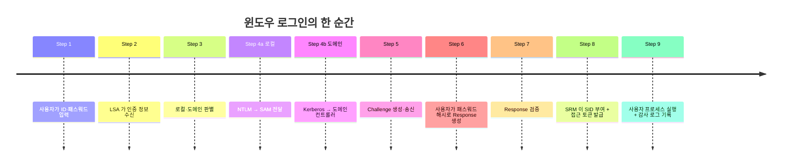
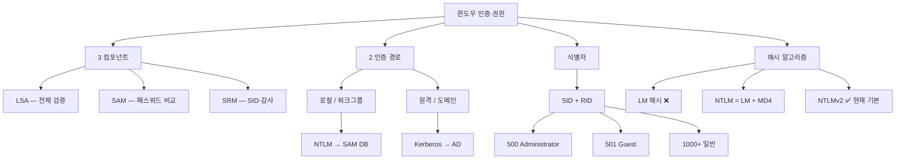
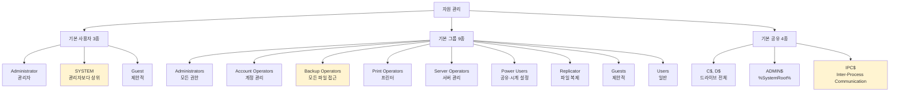
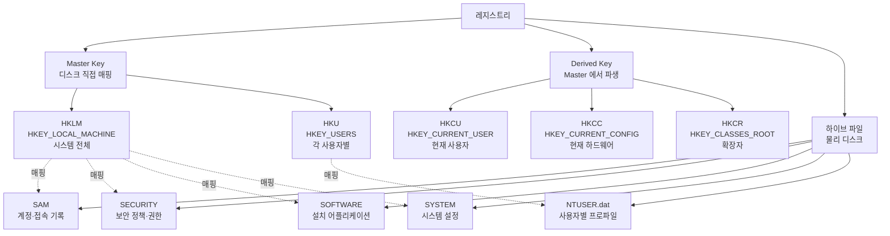
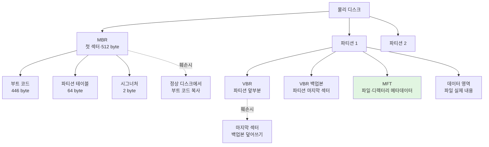

# 01. 윈도우 기본 — 만화책처럼 읽는 윈도우 보안의 토대

> **이 문서를 읽는 법**: 만화책 한 권을 펼쳤다고 생각하세요. *에피소드*를 따라 "누가 검증하고 → 어디로 흐르며 → 무엇으로 식별되고 → 어떻게 검증하는가" 를 따라가면 *왜* 윈도우가 그렇게 설계됐는지 자연스럽게 외워집니다.
> 정확한 정의·플래그·식별자는 정확본을 참조: [[cs/information-security/01.system-security/01.windows-basic|정확본 01. 윈도우 기본]]

> **연결 단원**: 본 단원은 윈도우 보안의 *공용 어휘*다. [[cs/information-security/01.system-security/02.windows-management|02. 윈도우 관리]] 의 보안 정책은 모두 이 위에 설정되고, [[cs/information-security/01.system-security/06.system-attacks|06. 시스템 공격기법]] 은 이 구조의 *허점* 을, [[cs/information-security/01.system-security/07.system-defense|07. 시스템 보안]] 의 분석 도구는 이 구조의 *흔적* 을 읽는다.

---

## 🎯 시작 전에 — 이미 쓰고 있는 윈도우 보안

개발하면서 매일 마주치는 것들이 사실 다 이 단원의 주인공입니다.

| 매일 보는 것 | 사실은 이 단원의 |
|---|---|
| 윈도우 로그인 화면 | LSA·SAM·SRM 3대 컴포넌트 협업 |
| 회사 PC `MYDOMAIN\username` | 도메인 인증 (Kerberos·AD) |
| `\\HOST\C$` 관리자 공유 경로 | 기본 공유 (숨김 공유 `$`) |
| 노트북 분실 대비 디스크 잠금 | BitLocker (전체 볼륨) |
| 파일 우클릭 → 속성 → 고급 → 암호화 | EFS (개별 파일·폴더) |
| 이벤트 뷰어 (`eventvwr.msc`) | 응용·보안·시스템 3종 로그 |
| `regedit` 5개 루트 키 | 레지스트리 (Master·Derived) |
| `.exe` `.dll` 더블클릭 | PE 포맷 (Header·Section Header·Section) |
| 디스크 첫 섹터 (부팅 영역) | MBR 512 byte |
| `wmic useraccount list` | SID·RID 조회 |

> **이 단원의 본질**: 시스템 보안의 모든 통제는 *"누가, 어떤 자원에, 어떻게 접근할 수 있는가"* 에 답하는 일이다. 12 토픽은 이후 단원이 *공통으로 참조할 어휘* — 외울 단편 지식이 아니라 *언어 그 자체*.

---

## 📖 에피소드 1 — 윈도우 보안의 3대 컴포넌트: LSA·SAM·SRM

### 장면. 로그인 화면 뒤편의 분업

사용자가 ID·패스워드를 입력하는 순간, 윈도우 내부에서는 *세 컴포넌트가 분업*한다.

| 컴포넌트 | 풀이 | 역할 |
|---|---|---|
| **LSA** | Local Security Authority | 모든 계정 로그인을 *검증*. 로컬·원격 모두 포함. 시스템 자원 접근 권한 검사 |
| **SAM** | Security Account Manager | 입력 패스워드를 *SAM 파일의 패스워드*와 비교해 인증. 계정·그룹·패스워드 관리 |
| **SRM** | Security Reference Monitor | 인증된 사용자에게 *SID 부여*. 파일·디렉터리 접근 허용·거부 결정. 감사 메시지 생성 |

### 분업 한 줄 요약

> *전체 검증* = LSA / *패스워드 비교* = SAM / *SID·감사* = SRM

### 왜 SAM 파일이 핵심 보호 대상인가

> SAM 파일에 *모든 계정의 해시*가 모여 있다 → SAM 한 번 노출 = 전 계정 해시 노출. SAM 파일 보호 = 인증 시스템 보호.

### 시험 함정

- "패스워드 검증 → ?" → **SAM**
- "권한 부여·감사 → ?" → **SRM**
- "전체 인증 검증 → ?" → **LSA**
- "SAM 파일이 노출되면?" → 모든 계정 해시 노출

---

## 📖 에피소드 2 — 두 갈래 인증 경로: 워크그룹 vs 도메인

### 장면 1. 단일 PC — 워크그룹

> **로컬(워크그룹) 인증**: 입력 ID·패스워드 → LSA 가 받음 → **NTLM 모듈**에 전달 → NTLM 이 **SAM** 으로 전달 → 로그인 처리.
> *계정 정보는 SAM 데이터베이스에 저장*.

### 장면 2. 회사 PC — 도메인

> **원격(도메인) 인증**: LSA 가 받음 → 로컬 vs 도메인 인증 판별 → 도메인이면 **Kerberos 프로토콜** 로 도메인 컨트롤러에 인증 요청 → DC 가 **접근 토큰(Access Token)** 발급 → 사용자 프로세스 실행.
> *계정 정보는 액티브 디렉터리(AD) 에 저장*.

### 두 경로 비교

| 측면 | 로컬 (워크그룹) | 원격 (도메인) |
|---|---|---|
| **저장소** | SAM 데이터베이스 (각 PC) | 액티브 디렉터리 (AD) |
| **프로토콜** | NTLM | **Kerberos** |
| **중앙 관리** | ❌ 각 PC 자체 | ✅ 도메인 컨트롤러 |
| **규모** | 소규모 | 대규모 기업 환경 |

### 관련 용어

- **워크그룹 (Workgroup)**: 중앙 인증 서버 없이 *각 PC 가 자체 SAM*. 소규모 네트워크.
- **도메인 (Domain)**: 도메인 컨트롤러 (DC) 가 *AD 로 계정·정책 일괄 관리*.
- **Kerberos**: 티켓 기반 네트워크 인증 프로토콜. AD 환경의 표준 인증 프로토콜 (RFC 4120).

### 시험 함정

- "로컬 인증 저장소?" → **SAM**
- "도메인 인증 프로토콜?" → **Kerberos**
- "AD 의 역할?" → 도메인 *계정·정책 일괄 관리*

---

## 📖 에피소드 3 — SID 와 RID: 이름이 아니라 번호로 식별한다

### 장면. 윈도우는 *이름*을 안 본다

> **SID (Security Identifier)**: 사용자·그룹의 *고유 식별번호*. *이름이 아니라 SID 로 권한 판단*. SAM 파일에 저장.

같은 이름이라도 SID 가 다르면 다른 주체. 계정을 삭제·재생성해도 SID 가 바뀌므로 *이전 권한이 살아나지 않는다*.

### SID 구조

```
[ 시스템 ][ 도메인 컨트롤러 또는 단독 시스템 ][ 시스템 고유 식별자 ][ 사용자 식별자(RID) ]
```

### RID — 마지막 자리의 의미

| RID 값 | 의미 |
|---|---|
| **500** | **Administrator (관리자)** |
| **501** | **Guest (게스트)** |
| **1000 이상** | 일반 사용자 |

### 보안 함의

> **Administrator 의 *이름* 을 변경해도 RID 500 은 바뀌지 않는다** — 공격자는 이름이 아닌 RID 로 관리자 계정을 식별할 수 있다. 계정 이름 변경만으로는 방어 불충분.

### 명령어 — SID 확인

```cmd
> wmic
wmic:root\cli> useraccount list brief
```

WMIC (Windows Management Instrumentation Console).

### 시험 함정

- "RID 500 = ?" → **Administrator** (단골 출제)
- "RID 501 = ?" → **Guest**
- "RID 1000 이상 = ?" → 일반 사용자
- "Administrator 계정 이름을 바꾸면 안전?" → ❌. RID 500 은 그대로

---

## 📖 에피소드 4 — Challenge & Response: 비밀을 직접 보내지 않는다

### 장면. 평문 패스워드 = 도청 무방비

평문 패스워드를 네트워크로 전송하면 *도청 한 번에 모든 게 끝*. 윈도우는 *비밀 자체*가 아니라 *비밀로 가공한 응답*만 주고받는다.

### 4단계 흐름

```
1. 인증 요청 — 사용자가 윈도우에 인증 요청
2. Challenge 생성·전송 — 윈도우가 임의 Challenge 값 생성 → 사용자에게 송신
3. Response 생성·전송 — 사용자가 자신의 패스워드 해시로 Challenge 가공 → Response 송신
4. Response 검증 — 윈도우가 자체 계산 결과와 비교 → 성공·실패 통보
```

### 핵심 발상

> **패스워드 자체는 절대 네트워크에 등장하지 않는다.** "Challenge 에 대한 Response" 만 오간다.

### 시험 함정

- "Challenge & Response 핵심?" → 패스워드 자체가 아니라 *응답값*을 전송
- "단계 수?" → **4단계** (요청 → Challenge → Response → 검증)

---

## 📖 에피소드 5 — 인증 알고리즘의 진화: LM → NTLM → NTLMv2

### 장면. 호환성의 대가

윈도우는 *호환성 유지*를 위해 약한 알고리즘을 오랫동안 남겼다. 약한 인증 → 패스워드 크래킹 위험으로 직결.

### 알고리즘 4총사

| 알고리즘 | 정체 | 상태 |
|---|---|---|
| **LM 해시** | Vista *이전* OS 가 사용. 구조적 취약 | ❌ 현재 사용 안 함 |
| **NTLM 해시** | LM 해시 + **MD4 해시** 추가 형태 | 약함 |
| **NTLMv2 해시** | Vista *이후* 기본 인증 프로토콜 | ✅ **현재 기본** |
| **Lan Manager** | 네트워크 파일·프린터 공유 인증 서비스 | NTLMv2 강제 권장 |

### NTLMv2 강제 설정 경로

```
로컬 보안 정책 → 보안 설정 → 로컬 정책 → 보안 옵션
  → "LAN Manager 인증 수준" → NTLMv2 사용
```

### 시간선 — 무엇이 무엇을 대체했나

```
Vista 이전          Vista 이후 (현재)
─────────         ───────────────
LM 해시 (취약)  →   NTLMv2 (현재 기본)
NTLM (LM+MD4)
```

### 시험 함정

- "현재 윈도우 기본 인증 프로토콜?" → **NTLMv2**
- "NTLM 의 구성?" → LM 해시 + **MD4** 추가
- "LM 해시는?" → ❌ 비활성화 권장 (Vista 이전 잔재)

---

## 📖 에피소드 6 — 기본 사용자 3총사: Administrator·SYSTEM·Guest

### 장면. OS 설치 시 자동 생성된 세 계정

운영체제 설치만 해도 *표준화된 기본 계정* 3개가 자동 생성된다.

| 계정 | 정체 | RID |
|---|---|---|
| **Administrator** | 관리자 권한 계정 | 500 |
| **SYSTEM** | **로컬에서 관리자보다 상위 권한**. 직접 로그인 불가, OS·서비스가 사용 | — |
| **Guest** | 매우 제한적 권한. 외부 사용자 임시 접근용. *보안상 사용 안 함 권장* | 501 |

### SYSTEM 의 정체 — 시험 1순위

> **SYSTEM** 은 "관리자보다 상위 권한". 일반 사용자가 *직접 로그인 불가*. OS 와 서비스가 시스템 작업을 수행할 때 사용. *서비스 권한 상승 (privilege escalation) 의 종착점*.

### 시험 함정

- "관리자보다 상위 권한 계정?" → **SYSTEM**
- "SYSTEM 으로 직접 로그인 가능?" → ❌
- "Guest 사용 권장?" → ❌

---

## 📖 에피소드 7 — 기본 그룹 9종: 권한의 분담

### 장면. 그룹 단위 권한 부여

운영체제는 *개인이 아니라 그룹 단위*로 권한을 부여한다. 윈도우는 OS 설치 시 *9개 표준 그룹*을 자동 생성.

### 9 그룹 한 표

| 그룹 | 권한 범위 |
|---|---|
| **Administrators** | **도메인 자원·로컬 컴퓨터 모든 권한** |
| **Account Operators** | 사용자·그룹 계정 관리 |
| **Backup Operators** | 시스템 백업 위해 *모든 시스템 파일·디렉터리 접근* |
| **Guests** | 도메인 사용 권한 제한 |
| **Print Operators** | 도메인 프린터 접근 |
| **Power Users** | 디렉터리·네트워크 공유, 공용 프로그램 그룹 생성, 컴퓨터 시계 설정 |
| **Replicator** | 도메인 파일 복제 |
| **Server Operators** | 도메인 서버 관리 |
| **Users** | 도메인·로컬 컴퓨터 일반 사용 |

### 함정 1순위 — Backup Operators

> Backup Operators 는 *백업 목적*이지만 실질적으로 *모든 파일을 읽을 수 있는 강력한 권한*. 백업 = 읽기. 공격자가 노리는 그룹.

### 시험 함정

- "관리자보다 상위 권한 *계정*?" → **SYSTEM** (그룹 아님)
- "백업 명목으로 모든 파일 읽기 가능 *그룹*?" → **Backup Operators**
- "Power Users 의 권한?" → 디렉터리·네트워크 공유, 공용 프로그램 그룹 생성, *컴퓨터 시계 설정*

---

## 📖 에피소드 8 — 기본 공유 4총사: C$·D$·ADMIN$·IPC$

### 장면. OS 설치만 해도 자동 생성되는 숨김 공유

윈도우는 *관리·원격 작업*을 위해 OS 설치 시 *기본 공유 폴더* 4종을 자동 생성. 일반 사용자에게 *보이지 않지만* 인증된 관리자가 네트워크 경로로 접근 가능.

### 4 공유 한 표

| 공유명 | 정체 |
|---|---|
| **C$, D$ 등** | 해당 *드라이브 전체* 관리 목적 공유 |
| **ADMIN$** | 윈도우 *설치 폴더* (`%SystemRoot%`) 관리 목적 공유 |
| **IPC$** | **Inter-Process Communication**. 동시 수행 프로그램 생성·관리 인터페이스. *명명된 파이프*를 통한 *원격 관리* 사용 |

### `$` 접미사의 의미

> **`$` = 숨김 공유 (hidden share)**. 네트워크 탐색 목록에 노출 안 됨. 단 *경로를 직접 입력*하면 접근 가능 — `\\HOST\C$`.

### 침해 시나리오

> 인증된 관리자 자격이 노출되면 → 공격자가 `\\victim\C$` 로 *네트워크 너머에서 디스크 전체 접근*. 기본 공유 비활성화는 [[cs/information-security/01.system-security/02.windows-management|02 단원]] 에서 다룸.

### 시험 함정

- "기본 공유 4종?" → **C$, D$ (드라이브) / ADMIN$ (윈도우 폴더) / IPC$ (프로세스 간 통신)**
- "IPC$ 의 의미?" → Inter-Process Communication. *명명된 파이프*
- "`$` 의 의미?" → 숨김 공유

---

## 📖 에피소드 9 — 파일 암호화: EFS vs BitLocker

### 장면. 노트북 분실 시나리오

저장 매체가 *물리적으로 탈취*되면 OS 인증을 우회한 *오프라인 분석*이 가능하다. 윈도우는 *두 단계의 디스크 암호화*로 대응.

### 2 솔루션 한 표

| 솔루션 | 풀이 | 보호 범위 |
|---|---|---|
| **EFS** | Encrypting File System | *개별 파일* 또는 특정 폴더 안 모든 파일 암호화 |
| **BitLocker** | — | **전체 시스템 볼륨**의 모든 데이터 암호화 |

### 적용 단위로 외우기

> 단일 파일·폴더 단위 = **EFS** / 볼륨 전체 = **BitLocker**

### 시험 함정

- "노트북 통째로 암호화?" → **BitLocker**
- "특정 폴더만 암호화?" → **EFS**

---

## 📖 에피소드 10 — 이벤트 로그 3종: 응용·보안·시스템

### 장면. 침해사고 분석 = "무엇이 언제 일어났나"

침해사고 분석은 결국 *흔적 찾기*. 윈도우는 로그를 *3 카테고리*로 분리해 *응용 결함·보안 이벤트·시스템 컴포넌트 이슈*를 따로 본다.

### 3 로그 한 표

| 로그 | 기록 내용 |
|---|---|
| **응용 프로그램 로그** | 응용 프로그램이 기록한 다양한 이벤트 |
| **보안 로그** | 유효·유효하지 않은 *리소스 사용* (로그온 성공·실패, 권한 사용) |
| **시스템 로그** | 윈도우 시스템 *구성요소* 이벤트 (드라이버 로드 실패, 서비스 시작·중지) |

### 분리의 의미

> 응용 결함 ≠ 보안 이벤트 ≠ OS 이슈. 분석가가 *세 영역을 분리해서 보도록* OS 가 미리 카테고리를 나눠 둔다.

### 감사 정책과의 관계

> *어떤 이벤트를 어디까지 기록할지* 결정하는 감사 정책은 [[cs/information-security/01.system-security/02.windows-management|02 단원]] 에서 다룸.

### 시험 함정

- "로그온 성공·실패 기록?" → **보안 로그**
- "드라이버 로드 실패 기록?" → **시스템 로그**
- "응용 프로그램 자체 이벤트?" → **응용 프로그램 로그**

---

## 📖 에피소드 11 — PE 포맷: 윈도우 실행 파일의 해부

### 장면. `.exe` `.dll` 의 내부

악성코드 분석·역공학은 윈도우 실행 파일의 *내부 구조*를 알아야 시작된다. 윈도우 실행 파일 (`.exe`, `.dll`) 은 모두 동일한 **PE (Portable Executable)** 포맷을 따른다.

### PE 의 3부 구성

| 부분 | 정체 |
|---|---|
| **PE Header** | 모든 PE 파일이 *동일하게 갖는 머리말*. 파일 종류·아키텍처·섹션 개수 등 메타데이터 |
| **Section Header** | 각 섹션 데이터를 메모리에 *로딩하고 속성 설정*에 필요한 정보 (메모리 주소·크기·권한) |
| **Section** | 가상 주소 공간에 로드된 후 *실행 코드·데이터·리소스* 를 배치하는 영역 |

### Section Header 와 Section 은 PE 파일마다 다르다

> Header 는 *공통*, Section Header 와 Section 은 *PE 파일마다 다른 내용*. 분석가는 Section Header 부터 읽는다.

### 9 섹션 한 표

| 분류 | 섹션명 | 용도 |
|---|---|---|
| 코드 | `.text` | 프로그램 *실행 코드* |
| 데이터 | `.data` | *읽기·쓰기 가능* 데이터 |
| 데이터 | `.rdata` | *읽기 전용* 데이터 |
| 데이터 | `.bss` | *초기화되지 않은 전역변수* |
| Import API | `.idata` | *임포트할* DLL·API/함수 정보 |
| Import API | `.didat` | 지연 로딩 임포트 데이터 |
| Export API | `.edata` | *익스포트할* DLL·API/함수 정보 |
| 리소스 | `.rsrc` | 윈도우 어플리케이션 리소스 (아이콘·문자열 테이블) |
| 재배치 | `.reloc` | 실행 파일 *기본 재배치 정보* |

### 데이터 섹션 3종 외우는 방법

> **`.data` (읽고 쓰기) ↔ `.rdata` (읽기 전용) ↔ `.bss` (초기화 안 됨)** — 세 단어가 *데이터의 세 상태*. 글자 그대로 읽으면 외워진다.

### 임포트 ↔ 익스포트

> `.idata` = **i**mport / `.edata` = **e**xport — 글자 첫 자가 곧 방향.

### 관련 용어

- **DLL (Dynamic Link Library)**: 여러 프로그램이 *공유 사용*하는 함수·자원 묶음. 임포트 (`.idata`) ·익스포트 (`.edata`) 섹션이 DLL 함수 호출 메타데이터 보관.
- **재배치 (Relocation)**: 실행 파일이 *빌드 시 가정 주소가 아닌 다른 주소*에 로드될 때 주소 보정. ASLR 과 직접 연관.

### 시험 함정

- "실행 코드 섹션?" → **`.text`**
- "읽기 전용 데이터?" → **`.rdata`**
- "초기화되지 않은 전역변수?" → **`.bss`**
- "임포트 vs 익스포트?" → `.idata` 임포트 / `.edata` 익스포트
- "PE 3 구성?" → Header / Section Header / Section

---

## 📖 에피소드 12 — 레지스트리: 윈도우의 모든 설정 데이터베이스

### 장면. 사고 분석가가 처음 보는 곳

레지스트리 = *윈도우 거의 모든 설정*의 계층적 데이터베이스. OS 부팅·서비스 시작·계정 정보·악성코드 자동 실행 등록까지 *전부 흔적이 남는다*. 사고 분석에서 *공격자 자취 찾는 첫 위치*.

### 2단계 단순 구조

| 요소 | 설명 |
|---|---|
| **키 (Key)** | 최상위 *루트 키* + 하위 서브 키 |
| **값 (Value)** | *이름 + 데이터 유형 + 데이터* |

### 5 루트 키 — 모든 설정의 입구

| 약어 | 풀이 | 용도 |
|---|---|---|
| **HKCR** | HKEY_CLASSES_ROOT | 파일 *확장자 ↔ 연결 프로그램* |
| **HKCU** | HKEY_CURRENT_USER | *현재 로그인 사용자* 환경설정·프로파일 |
| **HKLM** | HKEY_LOCAL_MACHINE | *시스템 전체* 하드웨어·응용 프로그램 설정 |
| **HKU** | HKEY_USERS | *각 사용자별* 환경설정·프로파일 |
| **HKCC** | HKEY_CURRENT_CONFIG | *현재 사용 중*인 윈도우 하드웨어 프로필 |

### Master Key vs Derived Key

| 분류 | 키 |
|---|---|
| **Master Key** (디스크에서 직접 읽음) | **HKLM, HKU** |
| **Derived Key** (Master 에서 파생, 메모리에만 존재) | **HKCU, HKCC, HKCR** |

### 외우는 방법

> *오직* HKLM·HKU 만 *디스크 하이브 파일* 직접 매핑 → **Master**. 나머지 셋은 *Master 에서 동적 파생* → **Derived**.

### 하이브 파일 5종 — 디스크의 물리 파일

레지스트리 정보를 *디스크에 저장한 물리 파일*. 부팅 시 하이브 → 메모리 레지스트리. *오프라인 비활성 시스템 분석*에 활용.

| 하이브 파일 | 저장 정보 |
|---|---|
| **SAM** | 계정 정보 + 접속 기록 |
| **SECURITY** | 시스템 보안 정책·권한 정보 |
| **SOFTWARE** | 시스템 설치 *모든 어플리케이션 정보* |
| **SYSTEM** | 시스템 관련 *설정 정보* |
| **NTUSER.dat** | *사용자별 환경설정·프로파일* |

### 시험 함정

- "Master 키 2개?" → **HKLM, HKU**
- "Derived 키 3개?" → **HKCU, HKCC, HKCR**
- "계정 정보 하이브?" → **SAM**
- "사용자별 환경설정 하이브?" → **NTUSER.dat**
- "오프라인 디스크 분석은 무엇으로?" → 하이브 파일

---

## 📖 에피소드 13 — NTFS: 디스크의 해부도

### 장면. 디스크 손상 복구·포렌식

NTFS (New Technology File System) = Windows NT 계열 이후 *기본 파일시스템*. 디스크의 *어디에 부트 코드가 있고, 어디에 메타데이터가 있는지* 알아야 *손상 복구·포렌식*을 할 수 있다.

### 3 용어 — 파티션·파일시스템·포맷

| 용어 | 정의 |
|---|---|
| **파티션 (Partition)** | 디스크를 *구획화*하여 나눈 영역 |
| **파일시스템 (File System)** | 파일 관리용 *자료구조* |
| **포맷 (Format)** | 파티션에 *파일시스템을 구성*하는 작업 |

### 파일시스템 4 구성요소

| 구성요소 | 위치·크기 |
|---|---|
| **MBR (마스터 부트 레코드)** | 물리 디스크 **첫 번째 섹터**, **512 byte** |
| **VBR (볼륨 부트 레코드)** | 파티션 *가장 앞부분*, *마지막 섹터에 백업본* |
| **MFT (마스터 파일 테이블)** | 볼륨 내 **모든 파일·디렉터리 정보**. NTFS 가장 중요 영역 |
| **데이터 영역** | 파일의 *실제 내용* 저장 |

### MBR 의 내부 — 512 byte = 446 + 64 + 2

```
┌────────────────────┬──────────────┬──────────┐
│  부트 코드 446B   │ 파티션테이블 64B │ 시그너처 2B │
└────────────────────┴──────────────┴──────────┘
              총 512 byte
```

| 영역 | 크기 | 용도 |
|---|---|---|
| **부트 코드** | 446 byte | 부팅 시 실행 코드 |
| **파티션 테이블** | 64 byte | 파티션 구조 정보 |
| **시그너처** | 2 byte | MBR 식별자 |

### 디스크 파괴형 악성코드 복구

| 손상 영역 | 복구 방법 |
|---|---|
| **MBR 훼손** | 정상 디스크에서 *부트 코드 복사* + *파티션 정보 수집* |
| **VBR 훼손** | *마지막 섹터의 백업본*을 덮어써서 복구 |

### MFT 의 정체

> MFT 는 NTFS 의 *카탈로그*. 모든 파일·디렉터리 메타데이터 (이름·크기·위치·권한) 가 여기. NTFS 분석은 MFT 분석부터.

### 시험 함정

- "MBR 위치·크기?" → **첫 번째 섹터, 512 byte**
- "MBR 의 446 + 64 + 2?" → **부트 코드 + 파티션 테이블 + 시그너처**
- "VBR 백업 위치?" → 파티션 *마지막 섹터*
- "NTFS 가장 중요 영역?" → **MFT** (모든 파일·디렉터리 메타데이터)
- "MBR ↔ VBR 위치 차이?" → MBR = 디스크 첫 섹터 / VBR = 파티션 첫 부분

---

## 📑 윈도우 보안 종합 비교 (에피소드 1~13 정리)

시험 직전 *한눈에* 보는 view.

| 분류 | 핵심 |
|---|---|
| **인증 컴포넌트 3종** | LSA (검증) · SAM (패스워드 비교) · SRM (SID·감사) |
| **인증 경로 2종** | 로컬 → SAM·NTLM / 도메인 → Kerberos·AD |
| **식별자** | SID + RID (500 관리자 / 501 게스트 / 1000+ 일반) |
| **인증 절차** | Challenge & Response 4단계 — 패스워드 직접 송신 ❌ |
| **알고리즘 진화** | LM → NTLM (LM+MD4) → **NTLMv2** (현재 기본) |
| **기본 사용자 3종** | Administrator (RID 500) · **SYSTEM** (관리자 위) · Guest (RID 501) |
| **기본 그룹 9종** | Administrators · Account/Backup/Print/Server Operators · Power Users · Replicator · Guests · Users |
| **기본 공유 4종** | C$, D$ (드라이브) / **ADMIN$** (윈도우 폴더) / **IPC$** (프로세스 간) |
| **암호화 2종** | **EFS** (파일·폴더) / **BitLocker** (볼륨 전체) |
| **이벤트 로그 3종** | 응용 / **보안** (로그온) / 시스템 (드라이버) |
| **PE 포맷** | Header + Section Header + Section + 9 섹션 (.text·.data·.rdata·.bss·.idata·.didat·.edata·.rsrc·.reloc) |
| **레지스트리** | Master (HKLM, HKU) ↔ Derived (HKCU, HKCC, HKCR) + 5 하이브 (SAM·SECURITY·SOFTWARE·SYSTEM·NTUSER.dat) |
| **NTFS** | MBR (512B = 446+64+2) / VBR (앞 + 마지막 백업) / MFT / 데이터 영역 |

---

## 🗺️ 마인드맵 1 — 인증 흐름 시간선



**읽는 법**: 한 번의 로그인이 *9 단계*. LSA 가 *받고*, NTLM/Kerberos 가 *경로 정함*, SAM/AD 가 *비교*, SRM 이 *SID 부여*. 각 컴포넌트의 *순서가 곧 책임*.

---

## 🗺️ 마인드맵 2 — 윈도우 인증·권한 분류 트리



---

## 🗺️ 마인드맵 3 — 계정·그룹·공유 분류 트리



**읽는 법**: 노란색 = *시험 1순위*. SYSTEM (관리자 위) / Backup Operators (백업 명목 모든 파일) / IPC$ (명명된 파이프 원격 관리).

---

## 🗺️ 마인드맵 4 — 레지스트리 5 루트 키 + 하이브 매핑



---

## 🗺️ 마인드맵 5 — NTFS 디스크 해부도



**읽는 법**: 녹색 = *NTFS 가장 중요*. MBR 은 *디스크 단위*, VBR 은 *파티션 단위*, MFT 는 *파일 단위*.

---

## 🗂️ 키워드 클러스터

### 인증 컴포넌트·경로

```
LSA  (Local Security Authority)        — 전체 검증
SAM  (Security Account Manager)        — 패스워드 비교
SRM  (Security Reference Monitor)      — SID·감사
NTLM (NT LAN Manager)                  — 로컬·LM+MD4
Kerberos                               — 도메인 표준 (RFC 4120)
AD   (Active Directory)                — 도메인 계정·정책 일괄 관리
```

### 식별자·RID

```
SID  (Security Identifier)             — 사용자·그룹 고유 식별번호
RID 500   = Administrator
RID 501   = Guest
RID 1000+ = 일반 사용자
```

### 해시 알고리즘 진화

```
LM 해시        — Vista 이전 (취약, 사용 ❌)
NTLM 해시      — LM + MD4
NTLMv2 해시    — Vista 이후 기본 ✅
Lan Manager   — 네트워크 공유 인증 서비스
```

### 기본 그룹·계정·공유

```
3 사용자  : Administrator (500) · SYSTEM (상위) · Guest (501)
9 그룹    : Administrators · Account/Backup/Print/Server Operators
            Power Users · Replicator · Guests · Users
4 공유    : C$ · D$ · ADMIN$ · IPC$
```

### PE 섹션 9종

```
.text    — 실행 코드
.data    — 읽기·쓰기 데이터
.rdata   — 읽기 전용 데이터
.bss     — 초기화되지 않은 전역변수
.idata   — Import API
.didat   — 지연 로딩 임포트
.edata   — Export API
.rsrc    — 리소스 (아이콘·문자열)
.reloc   — 재배치 정보
```

### 레지스트리 키·하이브

```
Master  : HKLM · HKU            (디스크 직접)
Derived : HKCU · HKCC · HKCR    (Master 파생)
하이브  : SAM · SECURITY · SOFTWARE · SYSTEM · NTUSER.dat
```

### NTFS 영역·수치

```
MBR  — 첫 섹터·512 byte (446 + 64 + 2)
VBR  — 파티션 앞 + 마지막 섹터 백업
MFT  — NTFS 가장 중요 (모든 파일·디렉터리 메타)
데이터 영역 — 파일 실제 내용
```

### 헷갈리는 짝 (시험 1순위)

| 짝 | 차이 |
|---|---|
| **LSA ↔ SAM ↔ SRM** | 전체 검증 ↔ 패스워드 비교 ↔ SID·감사 |
| **로컬 ↔ 도메인** | NTLM·SAM ↔ Kerberos·AD |
| **Administrator ↔ SYSTEM** | RID 500 관리자 ↔ 관리자보다 *상위*, 직접 로그인 ❌ |
| **EFS ↔ BitLocker** | 파일·폴더 ↔ 볼륨 전체 |
| **`.data` ↔ `.rdata` ↔ `.bss`** | 읽기·쓰기 ↔ 읽기 전용 ↔ 초기화 안 됨 |
| **`.idata` ↔ `.edata`** | 임포트 ↔ 익스포트 |
| **Master ↔ Derived 키** | HKLM, HKU ↔ HKCU, HKCC, HKCR |
| **MBR ↔ VBR** | 디스크 첫 섹터 (512B) ↔ 파티션 앞 + 마지막 백업 |
| **NTLM ↔ NTLMv2** | LM + MD4 ↔ Vista 이후 *현재 기본* |

---

## 🃏 회상 30문항

> 답을 가린 뒤 자가 채점. 틀린 것만 정확본으로 깊이 학습.

**A. 인증 컴포넌트·경로 (1~6)**
1. 윈도우 인증 3대 컴포넌트와 각 역할은?
2. 패스워드 검증을 담당하는 컴포넌트는?
3. SID 부여·감사 메시지 생성 컴포넌트는?
4. 로컬 인증의 저장소와 프로토콜은?
5. 도메인 인증의 저장소와 프로토콜은?
6. SAM 파일이 노출되면 발생하는 위험은?

**B. SID·인증 절차 (7~12)**
7. SID 의 정체와 저장 위치는?
8. RID 500·501·1000 이상의 의미는?
9. Administrator 이름을 변경하면 안전한가?
10. Challenge & Response 4단계는?
11. 패스워드 자체가 네트워크에 등장하는가?
12. SID 확인 명령은?

**C. 알고리즘·계정·그룹 (13~18)**
13. LM·NTLM·NTLMv2 의 진화는?
14. NTLM 해시의 구성은?
15. 현재 윈도우 기본 인증 프로토콜은?
16. 관리자보다 상위 권한 *계정*은?
17. 백업 명목으로 모든 파일 접근 가능 *그룹*은?
18. Power Users 의 권한 범위는?

**D. 공유·암호화·로그 (19~22)**
19. 기본 공유 4종과 각 용도는?
20. `$` 접미사의 의미는?
21. EFS ↔ BitLocker 의 적용 단위 차이는?
22. 보안 로그 ↔ 시스템 로그의 기록 대상 차이는?

**E. PE 포맷 (23~26)**
23. PE 의 3 구성 요소는?
24. PE 섹션 9종을 분류별로?
25. `.idata` ↔ `.edata` 의 차이는?
26. `.data` ↔ `.rdata` ↔ `.bss` 의 차이는?

**F. 레지스트리·NTFS (27~30)**
27. Master 키 2개와 Derived 키 3개는?
28. 하이브 파일 5종과 각 저장 정보는?
29. MBR 의 위치·크기·내부 구성은?
30. VBR 백업 위치와 MFT 의 정체는?

---

## ⚠️ 시험 함정 모음

| 함정 | 정답 |
|---|---|
| 인증 3 컴포넌트? | **LSA · SAM · SRM** |
| 패스워드 검증? | **SAM** |
| SID 부여·감사? | **SRM** |
| 로컬 인증 프로토콜? | **NTLM** (저장소 SAM) |
| 도메인 인증 프로토콜? | **Kerberos** (저장소 AD) |
| RID 500? | **Administrator** |
| RID 501? | **Guest** |
| RID 1000+? | 일반 사용자 |
| Administrator 이름 변경 = 안전? | ❌. RID 500 그대로 |
| Challenge & Response 단계? | **4단계** |
| 패스워드 자체가 네트워크에? | ❌. *Response 만* 송신 |
| 현재 기본 인증? | **NTLMv2** |
| NTLM 의 구성? | LM 해시 + **MD4** |
| LM 해시 상태? | ❌ 사용 ❌ (Vista 이전) |
| 관리자보다 상위 *계정*? | **SYSTEM** (직접 로그인 ❌) |
| 백업 명목 모든 파일 *그룹*? | **Backup Operators** |
| 도메인 자원 모든 권한 *그룹*? | **Administrators** |
| 기본 공유 4종? | **C$ · D$ · ADMIN$ · IPC$** |
| `$` 의미? | 숨김 공유 |
| ADMIN$ 경로? | **`%SystemRoot%`** (윈도우 폴더) |
| IPC$ 의미? | **Inter-Process Communication** |
| 단일 파일·폴더 암호화? | **EFS** |
| 볼륨 전체 암호화? | **BitLocker** |
| 로그온 성공·실패 로그? | **보안 로그** |
| 드라이버 로드 실패 로그? | **시스템 로그** |
| PE 3 구성? | Header / Section Header / Section |
| `.text` 정체? | 실행 코드 |
| `.rdata` 정체? | 읽기 전용 데이터 |
| `.bss` 정체? | 초기화되지 않은 전역변수 |
| `.idata` ↔ `.edata`? | 임포트 ↔ 익스포트 |
| Master 키 2개? | **HKLM · HKU** |
| Derived 키 3개? | **HKCU · HKCC · HKCR** |
| 계정 정보 하이브? | **SAM** |
| 사용자별 프로파일 하이브? | **NTUSER.dat** |
| MBR 위치·크기? | 첫 섹터 · **512 byte** |
| MBR 내부 구성? | 부트 코드 446 + 파티션 테이블 64 + 시그너처 2 |
| VBR 백업 위치? | 파티션 *마지막 섹터* |
| NTFS 가장 중요 영역? | **MFT** |
| MBR 훼손 복구? | 정상 디스크에서 부트 코드 복사 + 파티션 정보 수집 |
| VBR 훼손 복구? | 마지막 섹터 백업본 덮어쓰기 |

---

## 🔗 정확본 매핑표

| 본 노트 에피소드 | 정확본 § |
|---|---|
| 에피소드 1 (3 컴포넌트) | [[cs/information-security/01.system-security/01.windows-basic#1. 윈도우 인증 구성요소\|정확본 §1]] |
| 에피소드 2 (워크그룹·도메인) | [[cs/information-security/01.system-security/01.windows-basic#2. 윈도우 인증 방법\|정확본 §2]] |
| 에피소드 3 (SID·RID) | [[cs/information-security/01.system-security/01.windows-basic#3. 보안 식별자(SID)\|정확본 §3]] |
| 에피소드 4 (Challenge & Response) | [[cs/information-security/01.system-security/01.windows-basic#4. 인증 구조 — Challenge & Response\|정확본 §4]] |
| 에피소드 5 (LM·NTLM·NTLMv2) | [[cs/information-security/01.system-security/01.windows-basic#5. 인증 암호 알고리즘\|정확본 §5]] |
| 에피소드 6 (기본 사용자) | [[cs/information-security/01.system-security/01.windows-basic#6. 계정과 그룹\|정확본 §6 기본 사용자]] |
| 에피소드 7 (기본 그룹 9종) | [[cs/information-security/01.system-security/01.windows-basic#6. 계정과 그룹\|정확본 §6 기본 그룹]] |
| 에피소드 8 (기본 공유) | [[cs/information-security/01.system-security/01.windows-basic#7. 기본 공유 폴더\|정확본 §7]] |
| 에피소드 9 (EFS·BitLocker) | [[cs/information-security/01.system-security/01.windows-basic#8. 파일 암호화 — EFS · BitLocker\|정확본 §8]] |
| 에피소드 10 (이벤트 로그 3종) | [[cs/information-security/01.system-security/01.windows-basic#9. 이벤트 로그\|정확본 §9]] |
| 에피소드 11 (PE 포맷) | [[cs/information-security/01.system-security/01.windows-basic#10. 실행 파일 포맷 — PE\|정확본 §10]] |
| 에피소드 12 (레지스트리) | [[cs/information-security/01.system-security/01.windows-basic#11. 레지스트리\|정확본 §11]] |
| 에피소드 13 (NTFS) | [[cs/information-security/01.system-security/01.windows-basic#12. NTFS 파일시스템\|정확본 §12]] |

---

## 📅 학습 흐름

```
[1주]   에피소드 1·2 (LSA·SAM·SRM + 인증 경로) — 마인드맵 1·2
[2주]   에피소드 3·4·5 (SID·RID·Challenge&Response·해시 진화)
[3주]   에피소드 6·7·8 (사용자·그룹·공유) — 마인드맵 3
[4주]   에피소드 9·10 (EFS·BitLocker·이벤트 로그)
[5주]   에피소드 11 (PE 포맷·9 섹션) — 분류·이름 매칭
[6주]   에피소드 12 (레지스트리) — 마인드맵 4
[7주]   에피소드 13 (NTFS) — 마인드맵 5 + MBR 446+64+2
[8주]   회상 30문항 → 틀린 것만 정확본 깊이 학습
[9주]   함정 모음 매일 1회 + 정확본 1회 정독
```

---

> **다음 단원**: [[cs/information-security/01.system-security/02.windows-management|02. 윈도우 관리]] — 본 단원의 *구조* 위에 *어떤 보안 정책을 어떻게 설정하는가*. 패스워드 정책·계정 잠금·감사 정책·기본 공유 비활성화·UAC 가 등장.
