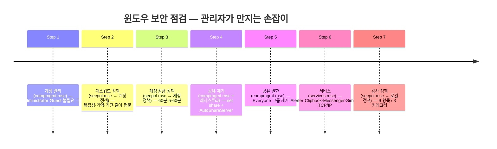
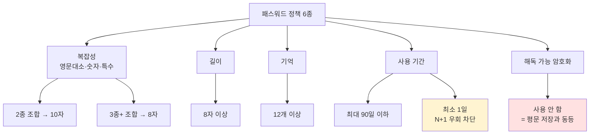
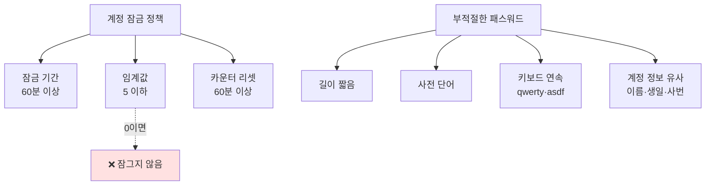
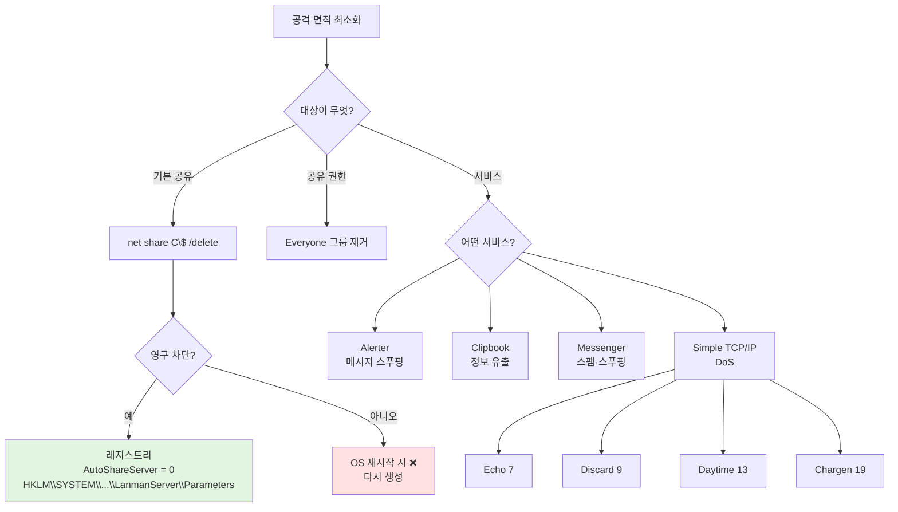
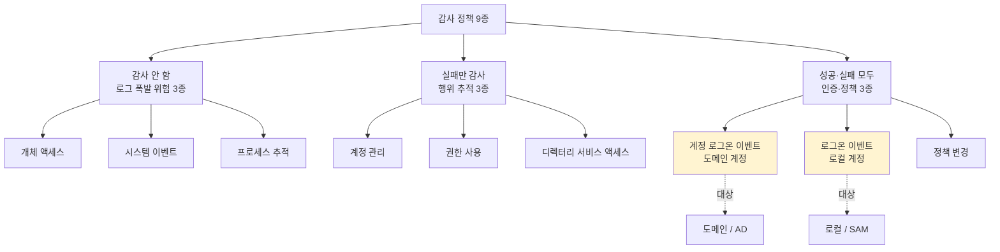

# 02. 윈도우 관리 — 만화책처럼 읽는 윈도우 보안 설정의 표준

> **이 문서를 읽는 법**: 만화책 한 권을 펼쳤다고 생각하세요. *에피소드*를 따라 "기본값은 왜 위험한가 → 어떤 정책으로 막는가 → 권장 수치는 왜 그 값인가" 를 따라가면 자연스럽게 외워집니다.
> 정확한 권장 수치·키 이름·경로는 정확본을 참조: [[cs/information-security/01.system-security/02.windows-management|정확본 02. 윈도우 관리]]

> **연결 단원**: 본 단원은 [[cs/information-security/01.system-security/01.windows-basic|01. 윈도우 기본]] 의 *구조* 위에 *어떤 정책을 어떻게 설정하는가*. 01 의 SAM·SID·기본 공유·이벤트 로그가 모두 다시 등장하지만, 이번엔 *관리자가 만지는 손잡이* 형태로.

---

## 🎯 시작 전에 — 이미 쓰고 있는 윈도우 보안 정책

| 매일 보는 것 | 사실은 이 단원의 |
|---|---|
| 회사 PC 90일마다 패스워드 변경 알림 | 암호 최대 사용 기간 (90일) |
| "이전에 사용한 암호와 다른 암호" 경고 | 최근 암호 기억 (12개) |
| 패스워드에 영문·숫자·특수문자 조합 강제 | 암호 복잡성 만족 |
| 5번 틀리면 계정이 잠긴다 | 계정 잠금 임계값 (5) |
| 이벤트 뷰어의 *감사 성공·실패* 항목 | 감사 정책 9종 |
| 공유 폴더 권한 탭의 Everyone | 공유 권한 — Everyone 제거 대상 |
| `\\HOST\C$` 가 살아 있는지 확인 | 기본 공유 제거 + `AutoShareServer = 0` |
| 윈도우 *서비스* 콘솔에서 *사용 안 함* | 불필요한 서비스 제거 |

> **이 단원의 본질**: 윈도우의 보안 수준은 *OS 가 제공하는 기능*보다 *관리자가 그 기능을 어떻게 설정했는가*에 더 크게 좌우된다. 정확본은 *관리자가 만지는 6 영역* (계정·패스워드·계정 잠금·공유·서비스·감사) 을 다룬다. 시험은 *권장 수치 그대로* 출제한다 — 8자 / 12개 / 90일 / 1일 / 60분 / 5 / 0.

---

## 📖 에피소드 1 — 관리의 본질: 기능 ≠ 안전

### 장면. NTLMv2 가 안전해도, LM 호환을 켜 두면 무력하다

> 윈도우의 보안 수준은 **OS 가 제공하는 기능 자체** 가 아니라 **관리자가 그 기능을 어떻게 설정했는가** 에 좌우된다.

NTLMv2 가 강해도 관리자가 LM 호환을 켜 두면 *약한 알고리즘으로 다운그레이드 공격* 가능. Administrator 이름이 그대로면 *무차별 대입의 표적*.

### 두 진입 경로

| 콘솔 | 명령어 | 다루는 것 |
|---|---|---|
| **로컬 보안 정책** | `secpol.msc` | 계정 정책 · 로컬 정책 · 감사 정책 등 *보안 설정의 중심* |
| **컴퓨터 관리** | `compmgmt.msc` | 사용자·그룹·공유 폴더·서비스 등 *객체 관리* |

### 외우는 방법

> *정책*을 만진다 = `secpol.msc` / *객체*를 만진다 = `compmgmt.msc`

### 표준 정합

> 본 단원의 권장 수치는 **KISA 의 *주요정보통신기반시설 기술적·관리적 보호조치 기준*** 의 윈도우 점검 항목과 정합한다. 시험은 권장값을 *그대로* 출제.

### 시험 함정

- "보안 정책 콘솔 명령?" → **`secpol.msc`**
- "객체 관리 콘솔 명령?" → **`compmgmt.msc`**

---

## 📖 에피소드 2 — 계정 관리 4총사: 표면 줄이기

### 장면. 모든 윈도우에 동일하게 존재하는 표적

> 기본 계정과 그룹은 *어떤 윈도우 시스템에나 동일한 이름·SID 로 존재*. 공격자에게는 *표적 위치가 미리 알려진 상태*.

→ 관리의 첫 단계는 *표적 노출 줄이기 + 강한 그룹의 인원 최소화*.

### 4 항목 한 표

| # | 항목 | 설정 경로 |
|---|---|---|
| 1 | **Administrator 계정 이름 변경** | 로컬 보안 정책 → 로컬 정책 → 보안 옵션 → "계정: Administrator 계정 이름 바꾸기" |
| 2 | **Guest 계정 사용 안 함** | 컴퓨터 관리 → 로컬 사용자 및 그룹 → 사용자 → Guest → 계정 사용 안 함 |
| 3 | **불필요한 계정 제거** | 컴퓨터 관리 → 로컬 사용자 및 그룹 → 사용자 → 삭제 또는 사용 안 함 |
| 4 | **관리자 그룹 최소화** | 컴퓨터 관리 → 로컬 사용자 및 그룹 → 그룹 → Administrators → 불필요 계정 제거 |

### Administrator 이름 변경의 한계

> [[cs/information-security/01.system-security/01.windows-basic|01 단원 §3]] 에서 본 대로 **RID 500 은 변경되지 않는다**. 이름 변경은 *자동화된 일반 공격*을 떨어뜨리는 *1차 방어선*. RID 기반 식별 공격은 여전히 가능.

### Guest 가 위험한 이유

> Guest 는 소프트웨어·하드웨어 설치, 설정 변경, 암호 만들기 *불가*. 외부 사용자 임시 접근용. 그러나 *불특정 사용자의 시스템 접근을 허용*하는 취약 계정 → **사용 안 함 권장**. 임시 접근이 필요해도 *별도 일반 사용자 계정*을 새로 만든다.

### 관리자·일반 분리

> *관리 업무 계정* 과 *일반 업무 계정* 을 분리하라. Administrators 그룹은 *최소 인원* 만 포함.

### 시험 함정

- "기본 계정 보안 1단계 4항목?" → **Administrator 이름 변경 / Guest 비활성화 / 불필요 계정 제거 / 관리자 그룹 최소화**
- "Administrator 이름만 바꾸면 안전?" → ❌. RID 500 은 그대로
- "Guest 임시 접근?" → ❌. 별도 일반 계정 생성 권장

---

## 📖 에피소드 3 — 패스워드 정책 1편: 복잡성 만족

### 장면. 인증 강도를 결정하는 가장 단순한 통제

> 패스워드 정책은 *인증 시스템 강도를 결정하는 가장 단순하고 효과적인 통제*. 약하면 *무차별·사전·재사용* 공격이 *모두 성립*.

### 진입 경로 (공통)

```
로컬 보안 정책 → 계정 정책 → 암호 정책
```

### "암호는 복잡성을 만족해야 함" — 핵심 수치

| 조합 종류 | 최소 길이 |
|---|---|
| 영문 대/소문자·숫자·특수문자 중 **2종 조합** | **10자리 이상** |
| **3종 이상 조합** | **8자리 이상** |

### 외우는 방법

> *조합 종류가 많아질수록* 길이를 줄여 준다. **2종 = 10자, 3종+ = 8자**. 단순 산수가 아니라 *경우의 수가 폭증*하기 때문.

### 시험 함정

- "복잡성 만족의 조합 종류?" → 영문 대/소문자 · 숫자 · 특수문자
- "2종 조합 최소 길이?" → **10자**
- "3종 이상 조합 최소 길이?" → **8자**

---

## 📖 에피소드 4 — 패스워드 정책 2편: 기억·사용 기간

### 장면. 변경의 의미를 보존하라

세 항목이 *함께* 동작해야 패스워드 변경이 *의미 있는 변경*이 된다.

### 3 항목 한 표

| 항목 | 권장값 | 의미 |
|---|---|---|
| **최근 암호 기억** | **12개 이상** | 직전 N개 암호 *재사용 불가*. 변경의 의미를 보존 |
| **암호 최대 사용 기간** | **90일 이하** | 유출된 암호의 유효기간 제한. *계정 속성의 "암호 사용 기간 제한 없음" 해제* 후 적용 |
| **암호 최소 사용 기간** | **1일** | 사용자가 *즉시 N+1번 변경*해 "최근 암호 기억"을 우회하는 것 차단 |

### "최소 사용 기간" 의 함정

> *왜 1일?* — 최소 사용 기간이 0이면, 사용자가 *연속으로 13번 즉시 변경*해 *예전 암호로 되돌아갈 수 있다*. "최근 12개 기억"을 *루프로 돌려 우회*.

→ 1일 잠금이 *우회 비용을 13일로* 끌어올린다.

### "암호 사용 기간 제한 없음" 해제

> 계정 속성의 *"암호 사용 기간 제한 없음"* 옵션이 켜져 있으면 *최대 사용 기간 정책이 적용 안 됨*. 정책을 적용하려면 이 옵션을 *반드시 해제*.

### 시험 함정

- "최근 암호 기억 권장값?" → **12개 이상**
- "최대 사용 기간?" → **90일 이하**
- "최소 사용 기간이 0이면?" → 사용자가 N+1번 즉시 변경해 *이전 암호로 복귀 가능*
- "최대 사용 기간 정책이 적용 안 되는 조건?" → 계정 속성 "암호 사용 기간 제한 없음" 이 켜져 있을 때

---

## 📖 에피소드 5 — 패스워드 정책 3편: 길이·평문 위험

### 장면. 마지막 두 항목

| 항목 | 권장값 | 의미 |
|---|---|---|
| **암호 최소 길이** | **8자 이상** | 무차별 공격 시간 증가 |
| **해독 가능한 암호화 사용** | **사용 안 함** | 일부 호환성 외에는 사용 ❌. 사용 시 *패스워드를 사실상 평문으로 보관*하는 효과 |

### "해독 가능한 암호화" 의 위험

> 이름이 "암호화" 라 안전해 보이지만, *해독이 가능*하다는 건 *시스템이 평문을 복원할 수 있다*는 뜻. **평문 저장과 동등한 위험**. 호환성 목적 외 절대 사용 금지.

### 패스워드 정책 6종 종합

| # | 항목 | 권장값 |
|---|---|---|
| 1 | 암호는 복잡성을 만족해야 함 | 사용 |
| 2 | 최근 암호 기억 | 12개 이상 |
| 3 | 암호 최대 사용 기간 | 90일 이하 |
| 4 | 암호 최소 사용 기간 | 1일 |
| 5 | 암호 최소 길이 | 8자 이상 |
| 6 | 해독 가능한 암호화 사용 | 사용 안 함 |

### 시험 함정

- "암호 최소 길이?" → **8자 이상** (3종 이상 조합 시)
- "해독 가능한 암호화의 위험?" → **평문 저장과 동등**

---

## 📖 에피소드 6 — 부적절한 패스워드: 피해야 할 4종

### 장면. 사전 공격이 즉시 통하는 패스워드

복잡성·길이를 만족해도 *사람이 기억하기 좋은 패턴*은 사전 공격에 즉시 노출.

### 피해야 할 4종

| # | 패턴 | 사례 |
|---|---|---|
| 1 | **길이가 짧은 것** | 6자 미만 |
| 2 | **사전 단어·단어 조합** | `password`, `welcome123` |
| 3 | **키보드 자판 연속 문자** | `qwerty`, `asdf`, `1qaz` |
| 4 | **사용자 계정 정보 유사 단어** | 이름·생일·사번 |

### 사전 공격이란

> 공격자가 *사전·키보드 패턴·계정 정보 변형*을 미리 만들어 둔 *후보 목록*으로 시도. 무차별 대입보다 *훨씬 빠르다*. 정책으로 *복잡성·길이*를 강제해도 위 4종은 사전 후보에 포함된다.

### 시험 함정

- "키보드 연속 문자 패스워드 예?" → `qwerty`, `asdf`
- "복잡성 만족만으로 충분?" → ❌. 사전·키보드 패턴 추가 회피 필요

---

## 📖 에피소드 7 — 계정 잠금 정책: 시도 횟수 상한

### 장면. 무차별 공격의 전제 깨기

> 암호 정책이 *재료*라면, 계정 잠금은 *시도 횟수의 상한*. 무차별 공격은 *수많은 시도*를 전제 → 일정 횟수 실패에 *계정 잠금* 시 공격 자체가 성립 불가.

### 진입 경로

```
로컬 보안 정책 → 계정 정책 → 계정 잠금 정책
```

### 3 항목 한 표

| 항목 | 권장값 | 의미 |
|---|---|---|
| **계정 잠금 기간** | **60분 이상** | 잠긴 계정이 자동 해제되기까지 시간 |
| **계정 잠금 임계값** | **5 이하** | 연속 로그인 실패 횟수 도달 시 잠김 |
| **다음 시간 후 계정 잠금 수를 원래대로 설정** | **60분 이상** | 실패 카운터를 0으로 되돌리기까지 경과 시간 |

### 임계값 0 의 의미 — 함정

> **임계값을 0 으로 두면 "계정을 잠그지 않음"** 을 의미. 정책이 무력화된다. *0 = 무한대*가 아니라 *0 = 비활성화*. 시험 단골.

### 외우는 방법

> *60 / 5 / 60* — 잠금 기간과 카운터 리셋 시간이 같다. 가운데 5만 다르다.

### 시험 함정

- "계정 잠금 임계값 권장?" → **5 이하**
- "임계값 0 의 의미?" → 계정을 *잠그지 않음* (정책 무력화)
- "계정 잠금 기간?" → **60분 이상**
- "카운터 리셋 시간?" → **60분 이상** (잠금 기간과 동일 권장)

---

## 📖 에피소드 8 — 기본 공유 제거: net share + 레지스트리 영구 적용

### 장면. C$ 가 살아 있다면

[[cs/information-security/01.system-security/01.windows-basic|01 단원 §7]] 의 기본 공유 4종 (C$, D$, ADMIN$, IPC$) 은 *OS 설치 시 자동 생성*. 인증된 관리자 자격이 노출되면 *네트워크 너머 디스크 전체 접근*. 운영자는 *공격 면적 최소화*를 위해 제거한다.

### 3 단계 제거

| 단계 | 방법 |
|---|---|
| **GUI** | 컴퓨터 관리 → 시스템 도구 → 공유 폴더 → 공유 |
| **명령어** | `net share C$ /delete` |
| **레지스트리 영구 적용** | `AutoShareServer = 0` (DWORD) |

### 왜 레지스트리까지?

> `net share` 로 중지해도 **운영체제가 재시작하면 다시 생성**된다. 영구 차단은 *레지스트리* 만이 답.

### 레지스트리 키 위치

```
HKEY_LOCAL_MACHINE
  \SYSTEM
   \CurrentControlSet
    \Services
     \LanmanServer
      \Parameters
       AutoShareServer (DWORD) = 0
```

### 키 이름 함정

> 일부 자료는 `AuthShareServer` 로 잘못 표기. 정확본은 *Microsoft 공식 표기 `AutoShareServer`* 를 채택. 시험에서 *Auth* 와 *Auto* 를 흔든다.

### 시험 함정

- "기본 공유 제거 명령?" → **`net share C$ /delete`**
- "OS 재시작 후 다시 생성됨 — 영구 차단?" → 레지스트리 **`AutoShareServer = 0`**
- "레지스트리 경로?" → `HKLM\SYSTEM\CurrentControlSet\Services\LanmanServer\Parameters`

---

## 📖 에피소드 9 — 공유 권한: Everyone 그룹 제거

### 장면. 익명 접근의 구멍

> 공유 폴더에 **Everyone 그룹**이 포함되면 *익명 사용자 접근 가능*. 공유 폴더 보안의 *1차 항목 = Everyone 제거*.

### 설정 경로

```
컴퓨터 관리 → 시스템 도구 → 공유 폴더 → 공유 →
  [리소스 속성 → Everyone 그룹 제거]
```

### Everyone 의 정체

> Windows 의 특수 그룹. 인증 여부 *불문* 시스템 접근하는 *모든 사용자*를 자동 포함. 익명·게스트 포함.

### 시험 함정

- "공유 폴더 보안 1차 항목?" → **Everyone 그룹 제거**
- "Everyone 의 의미?" → 인증 여부 불문 모든 사용자

---

## 📖 에피소드 10 — 취약 서비스 4종: 공격 면적 줄이기

### 장면. 디폴트로 켜진 공격 지점

> 취약한 서비스가 *디폴트로 설치·실행*되면 공격 지점. 사용자 환경에 *불필요한 서비스는 중지·사용 안 함* 처리.

### 대표 취약 서비스

| 서비스 | 위험성 |
|---|---|
| **Alerter** | 관리자 알림용. 메시지 *스푸핑·악용* |
| **Clipbook** | 클립보드 공유. *정보 유출 경로* |
| **Messenger** | 네트워크 메시징. *스팸·스푸핑 악용* |
| **Simple TCP/IP Services** | 4 서비스 묶음. **DoS 공격에 악용** |

### 설정 경로

```
서비스 → [불필요한 서비스] → 속성 → 일반 →
  시작 유형: 사용 안 함
  서비스 상태: 중지
```

### 시험 함정

- "메시지 스푸핑 위험 서비스?" → **Alerter**
- "클립보드 공유 위험?" → **Clipbook**
- "DoS 악용 가능한 서비스 묶음?" → **Simple TCP/IP Services**

---

## 📖 에피소드 11 — Simple TCP/IP 4 포트: 7·9·13·19

### 장면. 묶음 안의 4종 + Quote of the Day

Simple TCP/IP Services 는 *5 가지 작은 서비스*가 들어 있는 *서비스 묶음*.

### 5 서비스 한 표 — 포트 매칭이 시험 1순위

| 서비스 | 포트 | 동작 |
|---|---|---|
| **Echo** | **7/tcp** | 받은 패킷을 *그대로 되돌림* |
| **Discard** | **9/tcp** | 받은 패킷을 *버림* |
| **Daytime** | **13/tcp** | *현재 시각 텍스트* 응답 |
| **Character Generator** (Chargen) | **19/tcp** | *임의 문자열 생성·전송* |
| **Quote of the Day** | — | 짧은 *인용문 응답* |

### 4 포트 외우는 방법

> **7 → 9 → 13 → 19** — 모두 *작은 한 자리·두 자리 수*. 포트 번호 자체를 시험에서 직접 묻는다. *7 Echo, 9 Discard, 13 Daytime, 19 Chargen* 짝짓기.

### DoS 악용 시나리오

> Echo (7) 와 Chargen (19) 을 *서로 가리키게* 만들면 *무한 패킷 루프* — 고전적 DoS 기법. 그래서 묶음 자체를 *비활성화*.

### 시험 함정

- "Echo 포트?" → **7/tcp**
- "Chargen 포트?" → **19/tcp**
- "Daytime 포트?" → **13/tcp**
- "Discard 포트?" → **9/tcp**

---

## 📖 에피소드 12 — 감사 정책 9종: 세 카테고리 분류

### 장면. 너무 많아도 너무 적어도 안 된다

> 감사 정책 = *어떤 보안 이벤트를 어디까지 기록할지* 정의하는 규칙.
> *너무 높으면* — 로그 폭발 + 진짜 중요 이벤트 묻힘 + 성능 저하.
> *너무 낮으면* — 사고 시 원인 파악 ❌ + 법적 증거 ❌.

→ 균형이 핵심.

### 진입 경로

```
로컬 보안 정책 → 보안 설정 → 로컬 정책 → 감사 정책
```

### 9 항목을 3 카테고리로 묶어 외우기

| 카테고리 | 항목 (3개씩) |
|---|---|
| **감사 안 함** | 개체 액세스 / 시스템 이벤트 / 프로세스 추적 |
| **실패에 대해서만 감사** | 계정 관리 / 권한 사용 / 디렉터리 서비스 액세스 |
| **모두 감사 (성공 · 실패)** | 계정 로그온 이벤트 / 로그온 이벤트 / 정책 변경 |

### 9 항목 권장값 한 표

| 항목 | 권장 | 비고 |
|---|---|---|
| 개체 액세스 | 감사 안 함 | 활성화 시 로그 폭발 |
| 계정 관리 | 실패 | 계정 생성·삭제·변경 실패 추적 |
| 계정 로그온 이벤트 | 성공·실패 | **도메인 계정** 로그온 |
| 권한 사용 | 실패 | 권한 행사 실패 |
| 디렉터리 서비스 액세스 | 실패 | AD 객체 접근 실패 |
| 로그온 이벤트 | 성공·실패 | **로컬 계정** 로그온 |
| 시스템 이벤트 | 감사 안 함 | 시스템 시작·종료, 보안 로그 관련 |
| 정책 변경 | 성공·실패 | 보안 정책 자체 변경 |
| 프로세스 추적 | 감사 안 함 | 활성화 시 로그 폭발 |

### 외우는 방법

> *3·3·3* 분포. **감사 안 함 = 폭발 위험 3종 (개체·시스템·프로세스)** / **실패만 = 행위 추적 3종 (계정관리·권한·디렉터리)** / **모두 = 인증·정책 3종 (계정로그온·로그온·정책변경)**.

### 시험 함정

- "9 항목을 3 카테고리로?" → **감사 안 함 / 실패만 / 모두**
- "감사 안 함 카테고리 3종?" → **개체 액세스 · 시스템 이벤트 · 프로세스 추적**
- "감사 정책 너무 높으면?" → 로그 폭발 + 노이즈 + 성능 저하
- "감사 정책 너무 낮으면?" → 사고 원인 파악 불가 + 증거 부족

---

## 📖 에피소드 13 — 헷갈림 1순위: 계정 로그온 vs 로그온

### 장면. 이름이 비슷해서 함정 단골

| 항목 | 대상 |
|---|---|
| **계정 로그온 이벤트** | **도메인 계정** 로그온 성공·실패 |
| **로그온 이벤트** | **로컬 계정** 로그온 |

### 외우는 방법

> "**계정** 로그온" 의 *계정* = *원격 계정 시스템 (도메인 / AD)*. 그냥 "로그온" = *로컬*.
>
> 또는: *접두사가 더 긴 쪽이 더 큰 범위 (도메인)*.

### 매핑이 곧 시험

> [[cs/information-security/01.system-security/01.windows-basic|01 단원 §2]] 의 두 인증 경로 (로컬 SAM ↔ 도메인 Kerberos·AD) 가 *감사 정책 항목 이름에도 그대로 반영*.

### 시험 함정

- "계정 로그온 이벤트 = ?" → **도메인 계정**
- "로그온 이벤트 = ?" → **로컬 계정**
- "헷갈리지 마라" — *계정* 접두사가 *도메인*

---

## 📑 윈도우 관리 종합 비교 (에피소드 1~13 정리)

시험 직전 *한눈에* 보는 view.

| 영역 | 핵심 수치·키 |
|---|---|
| **진입 경로** | `secpol.msc` (정책) / `compmgmt.msc` (객체) |
| **계정 관리 4종** | Administrator 이름 변경 + Guest 비활성 + 불필요 계정 제거 + 관리자 그룹 최소화 |
| **패스워드 6종** | 복잡성 (2종 10자 / 3종 8자) + 최근 12개 + 90일 + 1일 + 8자 + 해독 가능 ❌ |
| **계정 잠금 3종** | 60분 / **5 이하** / 60분 (임계값 0 = 잠그지 않음) |
| **부적절 4종** | 짧음 + 사전 단어 + 키보드 연속 + 계정 정보 유사 |
| **공유 제거** | `net share /delete` + 레지스트리 **`AutoShareServer = 0`** |
| **공유 권한** | **Everyone 그룹 제거** |
| **취약 서비스** | Alerter / Clipbook / Messenger / Simple TCP/IP |
| **Simple TCP/IP 포트** | Echo **7** / Discard **9** / Daytime **13** / Chargen **19** |
| **감사 정책 3 카테고리** | 안 함 (개체·시스템·프로세스) / 실패 (계정관리·권한·디렉터리) / 모두 (계정로그온·로그온·정책) |
| **계정 로그온 vs 로그온** | 도메인 vs 로컬 |

---

## 🗺️ 마인드맵 1 — 6 영역 진입 경로 시간선



**읽는 법**: 6 영역의 *콘솔이 다르다* — 정책은 `secpol.msc`, 객체는 `compmgmt.msc`, 서비스는 `services.msc`. 진입 경로 매칭이 시험 1순위.

---

## 🗺️ 마인드맵 2 — 패스워드 정책 6종 분류 트리



**읽는 법**: 빨간색 = *반드시 사용 안 함* / 노란색 = *함정 1순위 (왜 1일?)*.

---

## 🗺️ 마인드맵 3 — 계정 잠금 + 부적절 패스워드



---

## 🗺️ 마인드맵 4 — 공유·서비스 제거 결정 트리



---

## 🗺️ 마인드맵 5 — 감사 정책 9종 = 3 카테고리



**읽는 법**: 노란색 = 헷갈림 1순위. *계정 로그온 = 도메인 / 로그온 = 로컬*.

---

## 🗂️ 키워드 클러스터

### 콘솔 명령

```
secpol.msc       — 로컬 보안 정책 (계정·암호·잠금·감사 정책)
compmgmt.msc     — 컴퓨터 관리 (사용자·그룹·공유·서비스)
services.msc     — 서비스 콘솔
```

### 패스워드 정책 권장값 (시험 직출)

```
복잡성        — 2종 10자 / 3종+ 8자
최근 암호 기억 — 12개 이상
최대 사용 기간 — 90일 이하
최소 사용 기간 — 1일
최소 길이      — 8자 이상
해독 가능 암호 — 사용 안 함
```

### 계정 잠금 정책 권장값

```
잠금 기간      — 60분 이상
임계값        — 5 이하  (0 = 잠그지 않음)
카운터 리셋    — 60분 이상
```

### 기본 공유 제거

```
명령어         : net share C$ /delete
영구 차단 키   : AutoShareServer = 0  (DWORD)
레지스트리 위치: HKLM\SYSTEM\CurrentControlSet\Services\LanmanServer\Parameters
```

### 취약 서비스 + Simple TCP/IP 포트

```
Alerter            — 메시지 스푸핑
Clipbook           — 클립보드 정보 유출
Messenger          — 스팸·스푸핑
Simple TCP/IP      — DoS 묶음
  Echo                 7/tcp   (받은 패킷 되돌림)
  Discard              9/tcp   (받은 패킷 버림)
  Daytime             13/tcp   (현재 시각)
  Character Generator 19/tcp   (임의 문자열)
  Quote of the Day    —
```

### 감사 정책 9종 분류

```
감사 안 함 (로그 폭발 위험)   : 개체 액세스 · 시스템 이벤트 · 프로세스 추적
실패만 감사 (행위 추적)       : 계정 관리 · 권한 사용 · 디렉터리 서비스 액세스
성공·실패 모두 (인증·정책)    : 계정 로그온 이벤트(도메인) · 로그온 이벤트(로컬) · 정책 변경
```

### 헷갈리는 짝 (시험 1순위)

| 짝 | 차이 |
|---|---|
| **secpol.msc ↔ compmgmt.msc** | 정책 ↔ 객체 |
| **Administrator 이름 변경 ↔ RID 500** | 이름 변경 가능 ↔ RID 불변 |
| **2종 조합 ↔ 3종+ 조합** | 10자 ↔ 8자 |
| **최대 사용 기간 ↔ 최소 사용 기간** | 90일 ↔ 1일 (N+1 우회 차단) |
| **임계값 0 의 의미** | 잠그지 않음 (정책 무력화) |
| **net share /delete ↔ AutoShareServer** | 일시 ↔ 영구 |
| **계정 로그온 이벤트 ↔ 로그온 이벤트** | 도메인 ↔ 로컬 |
| **감사 안 함 ↔ 모두 감사** | 폭발 위험 ↔ 인증·정책 |
| **Echo 7 ↔ Discard 9 ↔ Daytime 13 ↔ Chargen 19** | Simple TCP/IP 4 포트 |

---

## 🃏 회상 30문항

> 답을 가린 뒤 자가 채점.

**A. 진입 경로·계정 관리 (1~6)**
1. 보안 정책 콘솔 명령은?
2. 객체 관리 콘솔 명령은?
3. 계정 관리 4 항목은?
4. Administrator 이름만 변경하면 안전한가? 이유는?
5. Guest 사용 안 함 권장 이유는?
6. 관리자 그룹 최소화의 의미는?

**B. 패스워드 정책 (7~12)**
7. 패스워드 정책 6 항목은?
8. 복잡성 만족 — 2종/3종 조합 최소 길이는?
9. 최근 암호 기억 권장값은?
10. 최대 사용 기간·최소 사용 기간 권장값은?
11. 최소 사용 기간이 0이면 가능한 우회는?
12. 해독 가능한 암호화의 위험은?

**C. 부적절 패스워드·계정 잠금 (13~17)**
13. 부적절한 패스워드 4 패턴은?
14. 키보드 연속 문자 예시는?
15. 계정 잠금 정책 3 항목과 권장값은?
16. 계정 잠금 임계값 0 의 의미는?
17. 사전 공격이 무엇인가?

**D. 공유·서비스 (18~23)**
18. 기본 공유 제거 명령은?
19. OS 재시작 후 다시 생성됨 — 영구 차단 방법은?
20. AutoShareServer 레지스트리 경로는?
21. 공유 권한에서 제거할 그룹은?
22. 대표 취약 서비스 4종은?
23. Simple TCP/IP 4 포트 매칭은?

**E. 감사 정책 (24~30)**
24. 감사 정책 진입 경로는?
25. 9 항목을 3 카테고리로 분류하면?
26. "감사 안 함" 카테고리 3 항목은?
27. "실패만 감사" 카테고리 3 항목은?
28. "성공·실패 모두 감사" 카테고리 3 항목은?
29. 계정 로그온 이벤트 ↔ 로그온 이벤트의 차이는?
30. 감사 정책이 너무 높을 때·너무 낮을 때 문제는?

---

## ⚠️ 시험 함정 모음

| 함정 | 정답 |
|---|---|
| 보안 정책 콘솔? | **`secpol.msc`** |
| 객체 관리 콘솔? | **`compmgmt.msc`** |
| 계정 관리 4종? | Administrator 이름 변경 / Guest 비활성 / 불필요 제거 / 관리자 그룹 최소화 |
| Administrator 이름 변경하면 안전? | ❌. **RID 500 그대로** |
| 복잡성 2종 조합 길이? | **10자 이상** |
| 복잡성 3종+ 조합 길이? | **8자 이상** |
| 최근 암호 기억? | **12개 이상** |
| 최대 사용 기간? | **90일 이하** |
| 최소 사용 기간? | **1일** |
| 최소 사용 기간 0 의 위험? | N+1 즉시 변경 → 이전 암호 복귀 |
| 최대 사용 기간이 적용 안 되는 조건? | 계정 속성 *"암호 사용 기간 제한 없음"* 켜짐 |
| 최소 길이? | **8자 이상** |
| 해독 가능한 암호화? | **평문 저장과 동등** |
| 부적절 패스워드 4종? | 짧음 / 사전 단어 / 키보드 연속 / 계정 정보 유사 |
| 키보드 연속 예? | `qwerty`, `asdf` |
| 계정 잠금 기간? | **60분 이상** |
| 계정 잠금 임계값? | **5 이하** |
| 임계값 0? | **잠그지 않음** (정책 무력화) |
| 카운터 리셋? | **60분 이상** |
| 기본 공유 제거 명령? | **`net share C$ /delete`** |
| OS 재시작 후 차단? | 레지스트리 **`AutoShareServer = 0`** |
| AutoShareServer 경로? | `HKLM\SYSTEM\CurrentControlSet\Services\LanmanServer\Parameters` |
| Auth ↔ Auto? | **`AutoShareServer`** (Auto 가 정확) |
| 공유 권한 제거 그룹? | **Everyone** |
| 메시지 스푸핑 위험 서비스? | **Alerter** |
| 클립보드 공유? | **Clipbook** |
| 스팸·스푸핑? | **Messenger** |
| DoS 묶음? | **Simple TCP/IP Services** |
| Echo 포트? | **7/tcp** |
| Discard 포트? | **9/tcp** |
| Daytime 포트? | **13/tcp** |
| Chargen 포트? | **19/tcp** |
| 감사 정책 진입? | 로컬 보안 정책 → 보안 설정 → 로컬 정책 → 감사 정책 |
| 감사 안 함 3종? | 개체 액세스 / 시스템 이벤트 / 프로세스 추적 |
| 실패만 3종? | 계정 관리 / 권한 사용 / 디렉터리 서비스 액세스 |
| 성공·실패 모두 3종? | 계정 로그온 / 로그온 / 정책 변경 |
| 계정 로그온 이벤트? | **도메인 계정** |
| 로그온 이벤트? | **로컬 계정** |
| 감사 정책 너무 높음? | 로그 폭발 + 노이즈 + 성능 저하 |
| 감사 정책 너무 낮음? | 사고 원인 파악 ❌ + 증거 ❌ |

---

## 🔗 정확본 매핑표

| 본 노트 에피소드 | 정확본 § |
|---|---|
| 에피소드 1 (관리의 본질) | [[cs/information-security/01.system-security/02.windows-management#0. 들어가며 — 왜 "관리" 가 별도 단원인가\|정확본 §0]] |
| 에피소드 2 (계정 관리 4종) | [[cs/information-security/01.system-security/02.windows-management#1. 계정 관리\|정확본 §1]] |
| 에피소드 3 (복잡성) | [[cs/information-security/01.system-security/02.windows-management#2-1. 정책 항목과 권장값\|정확본 §2-1 복잡성]] |
| 에피소드 4 (기억·기간) | [[cs/information-security/01.system-security/02.windows-management#2-1. 정책 항목과 권장값\|정확본 §2-1 기억·기간]] |
| 에피소드 5 (길이·평문 위험) | [[cs/information-security/01.system-security/02.windows-management#2-1. 정책 항목과 권장값\|정확본 §2-1 길이·해독]] |
| 에피소드 6 (부적절 4종) | [[cs/information-security/01.system-security/02.windows-management#2-2. 부적절한 패스워드 — 피해야 할 예시\|정확본 §2-2]] |
| 에피소드 7 (계정 잠금 3종) | [[cs/information-security/01.system-security/02.windows-management#3. 계정 잠금 정책\|정확본 §3]] |
| 에피소드 8 (공유 제거) | [[cs/information-security/01.system-security/02.windows-management#4-1. 하드디스크 기본 공유 제거\|정확본 §4-1]] |
| 에피소드 9 (Everyone 제거) | [[cs/information-security/01.system-security/02.windows-management#4-2. 공유 권한 및 사용자 그룹 설정\|정확본 §4-2]] |
| 에피소드 10 (취약 서비스 4종) | [[cs/information-security/01.system-security/02.windows-management#4-3. 불필요한 서비스 제거\|정확본 §4-3]] |
| 에피소드 11 (Simple TCP/IP 4 포트) | [[cs/information-security/01.system-security/02.windows-management#4-3. 불필요한 서비스 제거\|정확본 §4-3 포트]] |
| 에피소드 12 (감사 정책 9종) | [[cs/information-security/01.system-security/02.windows-management#5. 감사 정책 설정\|정확본 §5]] |
| 에피소드 13 (계정 로그온 vs 로그온) | [[cs/information-security/01.system-security/02.windows-management#5-2. 계정 로그온 이벤트 vs 로그온 이벤트\|정확본 §5-2]] |

---

## 📅 학습 흐름

```
[1주]   에피소드 1·2 (진입 경로·계정 관리) — 마인드맵 1
[2주]   에피소드 3·4·5 (패스워드 6종) — 마인드맵 2 + 권장값 직접 암기
[3주]   에피소드 6·7 (부적절 + 계정 잠금) — 마인드맵 3
[4주]   에피소드 8·9 (공유 제거 + Everyone) — AutoShareServer 키 정확히
[5주]   에피소드 10·11 (취약 서비스·Simple TCP/IP 4 포트)
[6주]   에피소드 12·13 (감사 정책 9종 = 3 카테고리) — 마인드맵 5
[7주]   회상 30문항 → 틀린 것만 정확본 깊이 학습
[8주]   함정 모음 매일 1회 + 정확본 1회 정독
[9주]   01 ↔ 02 통합 — 01 의 SAM·기본 공유·이벤트 로그가 02 에서 *손잡이* 형태로 다시 등장하는 흐름 확인
```

---

> **다음 단원**: [[cs/information-security/01.system-security/03.linux-basic|03. 리눅스 기본]] — 이제 윈도우를 떠나 리눅스로. 사용자·권한·파일시스템·SUID·umask 등 *완전히 다른 어휘*가 등장하지만, 본질은 같다 — *누가, 무엇에, 어떻게 접근하는가*.
