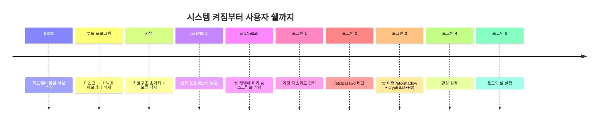
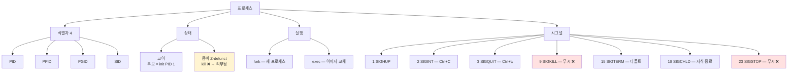

# 03. 리눅스 기본 — 만화책처럼 읽는 리눅스 보안의 토대

> **이 문서를 읽는 법**: 만화책 한 권을 펼쳤다고 생각하세요. *에피소드*를 따라 "시스템이 켜진다 → 사용자가 들어온다 → 자원에 접근한다 → 프로세스가 돈다 → 외부와 통신한다 → 흔적이 남는다" 의 흐름을 따라가면 자연스럽게 외워집니다.
> 정확한 필드·옵션·경로는 정확본을 참조: [[cs/information-security/01.system-security/03.linux-basic|정확본 03. 리눅스 기본]]

> **연결 단원**: 본 단원은 [[cs/information-security/01.system-security/01.windows-basic|01·02 윈도우]] 와 *완전히 다른 어휘* 를 쓰지만 본질은 같다 — *누가, 무엇에, 어떻게 접근하는가*. 이 단원의 사용자·권한·프로세스·로그 어휘는 [[cs/information-security/01.system-security/04.linux-management|04 리눅스 관리]] 의 운영 정책과 [[cs/information-security/01.system-security/06.system-attacks|06 시스템 공격]] 의 BoF·레이스 컨디션이 *공통으로 참조*.

---

## 🎯 시작 전에 — 이미 쓰고 있는 리눅스

| 매일 보는 것 | 사실은 이 단원의 |
|---|---|
| `cat /etc/passwd` | 7 필드 사용자 계정 정보 |
| `sudo` 명령어 | `/etc/sudoers` 정책 |
| `chmod 644 file.txt` | 8진수 권한 (파일 666 - umask 022 = 644) |
| `ps -ef` 출력 | 프로세스 자료구조 (PCB·FDT) |
| `kill -9 PID` | SIGKILL 시그널 (무시 불가) |
| `ssh user@host` | SSH 22/tcp + `/etc/ssh/sshd_config` |
| `crontab -e` 정기 작업 | cron 6 필드 (분/시/일/월/요일/명령) |
| `tail -f /var/log/messages` | syslog 시스템 로그 |
| `last`, `lastlog`, `lastb` | utmp / wtmp / btmp / lastlog |
| `df -h`, `du -sh` | 파일시스템 용량 확인 |

> **이 단원의 본질**: 시험 1과목에서 *분량이 가장 크고 출제 비중도 가장 높은* 영역. 4 층위 (시스템 시작·사용자/자원·실행 단위·운영 인프라) 의 *공용 어휘*를 만든다. 외울 게 많아 보이지만 *4 층위로 묶어 외우면* 매핑이 보인다.

---

## 📖 에피소드 1 — 로그인 5단계 + 부팅 4단계

### 장면 1. 시스템이 켜진다 — 부팅 4단계

| 단계 | 위치 | 작업 |
|---|---|---|
| 1. **BIOS** | 하드웨어 | 기본 하드웨어 점검 + 정보 수집 |
| 2. **부트 프로그램** | 하드디스크 | 디스크에서 *커널을 메모리에 적재* + 제어권을 커널에 |
| 3. **커널** | 메모리 | 운영체제 구동 시작. *내부 자료구조 초기화* + 커널 모듈 적재 |
| 4. **init 프로세스** | 프로세스 | 커널이 생성하는 *첫 번째 프로세스 (PID = 1)*. *모든 유닉스 프로세스의 부모* |

### 외우는 방법

> *위치*가 곧 *순서*: **하드웨어 → 디스크 → 메모리 → 프로세스**.

### 장면 2. 사용자가 로그인한다 — 5단계

shadow 정책을 사용하는 현재 리눅스의 5단계.

```
1. 사용자가 계정명·패스워드 입력
2. 로그인 프로그램이 입력 패스워드 ↔ /etc/passwd 의 해당 필드 비교
3. /etc/passwd 2번째 필드가 'x' 이면 → /etc/shadow 에서 비교
       비교 절차: 입력 패스워드 → H0 → 암호문 1
                → crypt(Salt + 암호문 1) → 암호문 2
4. /etc/passwd 의 해당 필드에서 계정 정보 가져와 초기 환경 설정
5. 모든 절차가 끝나면 *로그인 쉘* 실행
```

### init = PID 1

> **init 프로세스 = PID 1, 모든 프로세스의 부모.** 단골 출제.

### 관련 용어

- **BSD 유닉스 계열** (US 버클리): 싱글 유저 + 멀티 유저 *두 모드*만 지원
- **System V 계열** (AT&T): *런 레벨*로 분류 + `/etc/inittab` 에 정의
- **shutdown**: 안전 종료 또는 런 레벨 변경
- **sync**: 시스템 버퍼 데이터를 디스크에 저장. 종료 전 *무결성 유지*

### 시험 함정

- "init 프로세스 PID?" → **1**
- "고아 프로세스의 부모?" → **init**
- "부팅 4단계 위치?" → 하드웨어 → 디스크 → 메모리 → 프로세스

---

## 📖 에피소드 2 — 런 레벨 8단계: 유닉스 ↔ 리눅스 함정

### 장면. /etc/inittab 이 정한 운영 상태

> **런 레벨 (Run Level)**: 시스템 *운영 상태*를 숫자·문자로 표현. `init` 이 `/etc/inittab` 정의에 따라 `/etc/rc.d/rc*.d` 스크립트를 실행해 시스템 상태 구성.

### 8 레벨 한 표

| 레벨 | 의미 |
|---|---|
| **0** | 시스템 정지 (유닉스 PROM 모드) |
| **S, s** | 싱글 유저 모드. 유지보수용. root 패스워드 필요. **로컬 파일시스템 마운트 ❌** |
| **1** | 싱글 유저 모드. **로컬 파일시스템 마운트 ✅** |
| **2** | 멀티 유저 (NFS 클라이언트) |
| **3** | 멀티 유저 (NFS 서버). *유닉스 기본* 런 레벨 |
| **4** | 사용 안 함 |
| **5** | 유닉스: *시스템 전원 종료* / **리눅스: X 윈도우 환경 멀티 유저** |
| **6** | 시스템 리부팅 |

### 함정 1순위 — 5의 의미가 *유닉스와 리눅스에서 정반대*

> **NFS (Network File System)**: 원격 디렉터리를 네트워크로 마운트하는 파일시스템. 위 표의 NFS 클라이언트/서버는 *로컬 파일시스템 종류*가 아니라, 해당 런 레벨에서 NFS 관련 서비스가 어디까지 동작하는지를 가리킨다.

> **유닉스 5 = 전원 종료 / 리눅스 5 = X 윈도우 GUI 멀티 유저**. 시험에서 *흔드는 항목 1위*.

### 명령

| 명령 | 동작 |
|---|---|
| `who -r` 또는 `runlevel` | 현재 런 레벨 확인 |
| `init [모드번호]` | 런 레벨 변경 (예: `init 5`) |

### 시험 함정

- "유닉스 런 레벨 5 = ?" → **시스템 전원 종료**
- "리눅스 런 레벨 5 = ?" → **X 윈도우 GUI 멀티 유저**
- "S/s ↔ 1 의 차이?" → 로컬 파일시스템 마운트 여부
- "유닉스 *기본* 런 레벨?" → **3** (NFS 서버)
- "런 레벨 변경 명령?" → **`init [번호]`**

---

## 📖 에피소드 3 — /etc/passwd 7필드 + /etc/group 4필드

### 장면. 사용자 정보의 두 그릇

리눅스는 사용자·그룹 정보를 *콜론(`:`) 으로 구분된 텍스트 파일*에 저장. 사람이 직접 읽을 수 있다.

### 3-1. /etc/passwd — 7 필드

```
계정명 : 패스워드 : UID : GID : 설명 : 홈 디렉터리 : 로그인 쉘
```

| # | 필드 | 의미 |
|---|---|---|
| 1 | **계정명** | 사용자 계정명 |
| 2 | **패스워드** | **`x` 이면 shadow 정책 사용** |
| 3 | **UID** | 사용자 ID (시스템 내 *유일한 정수*) |
| 4 | **GID** | 사용자의 *기본 그룹 ID* |
| 5 | **설명** | 사용자 설명 (주석) |
| 6 | **홈 디렉터리** | 사용자 홈 위치 |
| 7 | **로그인 쉘** | 사용자 로그인 쉘 |

### 두 번째 필드 `x` 의 의미

> **2번째 필드 = `x` → shadow 패스워드 정책 사용**. 실제 패스워드는 `/etc/shadow` 에 있다.

### 3-2. /etc/group — 4 필드

```
그룹명 : 그룹 패스워드 : GID : 소속 계정
```

```
예) bin:x:1:root,bin,daemon
```

### 그룹 패스워드 = `x`

> 그룹 *암호화 패스워드*는 일반적으로 *사용 안 함*. 보통 `x` 로 기재.

### 시험 함정

- "passwd 필드 개수?" → **7**
- "group 필드 개수?" → **4**
- "passwd 2번째 필드 `x` 의미?" → shadow 정책 활성

---

## 📖 에피소드 4 — /etc/shadow 9필드 + 해시 ID + 솔트

### 장면. root 만 읽을 수 있는 파일

> **`/etc/shadow`**: 암호화된 패스워드 저장. **root 만 접근 가능**. 패스워드 보안의 핵심 파일.

### 9 필드

```
계정명 : 암호화된 패스워드 : 마지막 변경일 : 최소 사용기간 : 최대 사용기간
       : 경고 : 비활성화 : 만료일 : 예약
```

| # | 필드 | 의미 |
|---|---|---|
| 1 | 계정명 | 사용자 계정명 |
| 2 | **암호화된 패스워드** | `$ID$Salt$encrypted_password` 형식 |
| 3 | 마지막 변경일 | 1970년 1월 1일 기준 일수 |
| 4 | **`minlife`** 최소 사용기간 | 변경 후 다시 변경 불가 일수 (없으면 *최근 암호 기억 우회* 가능) |
| 5 | **`maxlife`** 최대 사용기간 | 만료 일수 (90일 권장) |
| 6 | `warn` 경고 | 만료 이전 경고 일수 |
| 7 | `inactive` 비활성화 | 만료 이후 잠기기 전까지 비활성 일수 |
| 8 | `expires` 만료일 | 1970년 1월 1일 기준 계정 만료일 |
| 9 | 예약 필드 | 사용 안 함 |

### 암호화된 패스워드 — `$ID$Salt$encrypted_password`

| 구성 | 의미 |
|---|---|
| **ID** | 일방향 해시 알고리즘 식별자 |
| **Salt** | 패스워드 강도 강화용 *임의 값*. **레인보우 테이블 공격에 효과적 대응** |
| **encrypted_password** | 패스워드 + 솔트 → 해시화 결과 |

### ID 매핑 — 시험 직출

| ID | 알고리즘 |
|---|---|
| **`$1$`** | MD5 |
| **`$2$`** | BlowFish |
| **`$5$`** | **SHA-256** |
| **`$6$`** | **SHA-512** |

### 외우는 방법

> *1·2·5·6* 만 외운다. 1=MD5, 2=BlowFish, 5=SHA-256, 6=SHA-512. 표준은 `crypt(3)` 의 `man 3 crypt`.

### 솔트의 효과

| 효과 | 의미 |
|---|---|
| **서로 다른 솔트** | 동일 패스워드라도 *암호화 결과가 다르다* — 두 사용자의 해시가 같아 보이는 위험 차단 |
| **해시값 비교** | 암호화된 패스워드를 알아내도 *솔트와 조합된 해시*라 평문 추출 어려움 |

### 패스워드 특수 표기 5종

| 표기 | 의미 |
|---|---|
| **`*` (별표)** | 패스워드 *잠긴 상태*. 일반 로그인 ❌, *별도 인증 방식*은 가능 |
| **`!!`** | 계정 생성 후 *비밀번호 미갱신 상태*. 모든 로그인 ❌ |
| **빈 값** | 패스워드 *미설정*. **비밀번호 없이 로그인 가능 (매우 위험)** |
| **`NP`** | No Password. *시스템·애플리케이션 계정* |
| **`*LK*`** | Lock. 패스워드 잠긴 상태 |

### 패스워드 정책 명령

| 명령 | 효과 |
|---|---|
| `pwconv` | shadow 활성화 (`/etc/shadow` 에 저장) |
| `pwunconv` | shadow 비활성화 (`/etc/passwd` 에 함께 저장) |
| `passwd -l [계정]` | 패스워드 잠금 |
| `passwd -u [계정]` | 패스워드 잠금 해제 |

### 시험 함정

- "shadow 필드 개수?" → **9**
- "`$5$` ↔ `$6$`?" → SHA-256 / SHA-512
- "솔트의 효과?" → **레인보우 테이블 공격 대응**
- "빈 값 패스워드?" → 비밀번호 없이 로그인 *가능* (위험)
- "shadow 활성화 명령?" → **`pwconv`**

---

## 📖 에피소드 5 — 파일시스템: 부트·슈퍼·inode·데이터 + MAC Time

### 장면. 디스크 안의 4 영역

> 물리 디스크는 *논리적 파티션*으로 구분, 파티션마다 *고유 파일시스템*. 파일시스템 = 4 구성요소.

### 디스크·파티션·파일시스템의 층위

```text
물리 디스크
→ 파티션 또는 논리 볼륨
→ 파일시스템 생성 (ext4 · XFS 등)
→ 특정 디렉터리에 마운트
```

> **ext4 · XFS** 는 *로컬 디스크용 파일시스템*. **NFS** 는 원격 디렉터리를 네트워크로 마운트하는 *네트워크 파일시스템*. 즉 NFS 서버의 실제 디스크는 ext4/XFS 일 수 있지만, 클라이언트에는 `nfs` 타입으로 보인다.

### 4 구성요소

| 구성 | 설명 |
|---|---|
| **부트 블록** | OS 부팅·초기화용 *부트스트랩 코드* |
| **슈퍼 블록** | 파일시스템 *관리 정보* (크기·블록 수) |
| **아이노드 리스트 (inode list)** | 파일들의 *속성 정보 inode 구조체 리스트* |
| **데이터 블록** | 실제 *파일 데이터* 저장 영역 |

### inode — 파일 속성 정보

| 정보 | 내용 |
|---|---|
| inode number | 고유 번호 |
| 파일 타입 | 일반·디렉터리·장치 |
| 접근 권한 | rwx |
| linkcount | 하드링크 개수 |
| 소유자·소유 그룹 | UID·GID |
| 파일 크기 | byte |
| **MAC Time** | *3 시각 정보* |
| block index | 데이터 위치 |

### MAC Time 3종 — 시험 1순위

| 약어 | 풀이 | 트리거 |
|---|---|---|
| **M time** | **M**odification | 파일 *내용*이 마지막으로 수정 |
| **A time** | **A**ccess | 파일을 마지막으로 *접근* |
| **C time** | **C**hange | 파일의 *속성*이 마지막으로 변경 |

### 외우는 방법

> *내용 = M / 접근 = A / 속성 = C*. *내용 ≠ 속성*이 핵심.

### inode 의 핵심 — *파일명이 없다*

> **inode 에는 파일명이 없다.** 파일명은 *디렉터리*가 관리. 단골 함정.

### 확인 명령

```bash
stat [파일명]
```

### 시험 함정

- "파일시스템 4 구성요소?" → **부트·슈퍼·inode 리스트·데이터 블록**
- "inode 에 파일명이 있다?" → ❌. *디렉터리가 관리*
- "내용 변경 시 갱신되는 시간?" → **M time**
- "속성 변경 시?" → **C time**

---

## 📖 에피소드 6 — 파일 종류 7종 + 마운트·용량·동기화

### 장면. `ls -l` 의 첫 글자

| 표기 | 종류 |
|---|---|
| **`-`** | 일반 정규 파일 |
| **`d`** | 디렉터리 |
| **`b`** | 블록 장치 파일 (블록 단위, 버퍼링) |
| **`c`** | 문자 장치 파일 (문자 단위, 비버퍼링) |
| **`l`** | 심볼릭 링크 |
| **`p`** | 네임드 파이프 |
| **`s`** | 유닉스 도메인 소켓 |

### b vs c — 함정

> **b = 블록 단위 + 버퍼링** / **c = 문자 단위 + 비버퍼링**. 단어 순서 그대로 외운다.

### 마운트·용량·동기화 5 명령

| 명령 | 의미 |
|---|---|
| **`mount`** | 보조기억장치 파일시스템을 *특정 디렉터리에 논리적 연결*. **`/etc/mtab`** 에 기록 |
| **`umount`** | 마운트 해제. *`device is busy`* 시 `fuser -ck [경로]` |
| **`du`** | 디렉터리 *하드디스크 사용량* (`-a` 하위파일·`-s` 총량·`-k` KB) |
| **`df`** | 파일시스템 *전체·사용 가능 공간* |
| **`sync`** | 시스템 버퍼 데이터를 디스크에 저장. *종료 전 필수* |

### `df` = disk free

> **`df`** 는 *disk free*. 마운트된 파일시스템 단위로 전체 크기·사용량·남은 공간을 보여준다. 디렉터리별 사용량은 **`du`** (*disk usage*) 로 본다.

### `/etc/mtab` ↔ `/etc/fstab`

> **`/etc/mtab`** = *현재* 마운트 정보 / **`/etc/fstab`** = *부팅 시 마운트할* 파일시스템 정의.

### 시험 함정

- "파일 종류 7종?" → `-`·`d`·`b`·`c`·`l`·`p`·`s`
- "블록 ↔ 문자 장치?" → b 블록·버퍼링 / c 문자·비버퍼링
- "마운트 정보 기록?" → **`/etc/mtab`**
- "부팅 시 마운트 정의?" → **`/etc/fstab`**

---

## 📖 에피소드 7 — 입출력 재지정 + 링크 (하드 vs 심볼릭)

### 장면 1. 입출력 재지정

> 키보드 입력을 *파일에서 받도록* 대체하거나, 명령의 *결과·에러*를 *화면 대신 파일로* 받는 것.

| 형태 | 의미 |
|---|---|
| `command [0]< file` | 입력 재지정 |
| `command [1]> file` | 표준 출력 (1 생략 가능) |
| `command 2> file` | 표준 에러 |
| `command >> file` | 출력 *추가* (덮어쓰기 ❌) |
| `command 2>&1` | 표준 에러를 표준 출력으로 합침 |

### 예시 — cron 의 무음 처리

```bash
0 3 * * 0 /bin/rm -rf /tmp/* >/dev/null 2>&1
# 매주 일요일 03:00 /tmp 하위 전체 삭제
# 표준출력은 /dev/null 로, 표준에러도 표준출력과 같은 곳으로 → 모두 /dev/null
```

### `/dev/null`

> 특수 장치 파일. 출력이 *모두 버려진다*. *윈도우 휴지통과 유사 역할*.

### 장면 2. 링크 — 하드 vs 심볼릭

| 종류 | 명령 | 특징 |
|---|---|---|
| **하드 링크** | `ln [대상] [링크명]` | *동일 inode number* 공유. **동일 파일시스템 내**, **디렉터리 ❌** |
| **심볼릭 링크** | `ln -s [대상] [링크명]` | 원본 *경로를 내용으로 갖는* 새 파일. *파일시스템 제한 ❌, 디렉터리 ✅* |

### 결정적 차이 한 줄

> **동일 inode = 하드 / 경로 보존 = 심볼릭**. 디렉터리에 *하드 링크 불가*는 함정 1순위.

### `ls -F` 출력 표시

| 표시 | 의미 |
|---|---|
| `/` | 디렉터리 |
| `*` | 실행 파일 |
| `@` | 심볼릭 링크 |

### 시험 함정

- "동일 inode 공유 링크?" → **하드 링크**
- "디렉터리에 하드 링크?" → ❌
- "파일시스템 제한 없는 링크?" → **심볼릭** (`ln -s`)
- "표준 에러를 표준 출력으로?" → **`2>&1`**

---

## 📖 에피소드 8 — 권한·umask + SUID·SGID·Sticky + RUID·EUID

### 장면 1. 8진수 권한과 umask

| 대상 | 기본 생성값 |
|---|---|
| **파일** | **666** (`rw-rw-rw-`) |
| **디렉터리** | **777** (`rwxrwxrwx`) |

### umask 의 역할 — 제거할 권한

```
파일:    666 - 022 = 644 (rw-r--r--)
디렉터리: 777 - 022 = 755 (rwxr-xr-x)
```

> **umask = *제거할 권한* 명시.** `/etc/profile` 에 두면 시스템 전체 일관 적용 (보통 `022`).

### 디렉터리 권한 메모

> 디렉터리는 **`x` 권한이 있어야 `cd` 진입 가능**. 일반 파일과 다른 점.

### 장면 2. 특수 권한 3종

> 프로세스가 *실행되는 동안의 권한*을 제어하는 *세 비트*.

| 권한 | 약어 | 8진수 | 의미 |
|---|---|---|---|
| **SUID** | **Set User ID** (`s`) | **4** | 실행 중 *실행 파일 소유자 권한*으로 자원 접근 |
| **SGID** | **Set Group ID** (`s`) | **2** | 실행 중 *실행 파일 소유 그룹 권한*으로 자원 접근 |
| **Sticky-bit** | (`t`) | **1** | 디렉터리 내 *누구나 생성 가능*, **삭제·이름 변경은 소유자/root 만** |

### RUID/EUID/RGID/EGID — 실행자 vs 소유자

| 식별자 | 풀네임 | 의미 |
|---|---|---|
| **RUID** | **Real User ID** | 프로세스를 *실행시킨 실제 사용자* UID |
| **EUID** | **Effective User ID** | 파일·자원 접근 권한 판단에 *실제로 쓰이는* UID |
| **RGID** | **Real Group ID** | 프로세스를 *실행시킨 실제 사용자의 그룹* GID |
| **EGID** | **Effective Group ID** | 파일·자원 접근 권한 판단에 *실제로 쓰이는* GID |

> 핵심은 **Real = 누가 실행했는가**, **Effective = 누구 권한으로 검사받는가**. 일반 실행은 Real 과 Effective 가 같지만, SUID/SGID 실행 파일은 Effective 값이 *파일 소유자/소유 그룹*으로 바뀐다.

### SUID/SGID 의 효과

| 상태 | RUID·RGID | EUID·EGID |
|---|---|---|
| **미설정** | 실행자 | 실행자 (동일) |
| **설정** | 실행자 | **실행 파일 소유자/그룹** ← *잠시 권한 상승* |

### Sticky-bit 의 활용 — `/tmp`

| 환경 | 명령 |
|---|---|
| 리눅스 | `chmod o+t /tmp` |
| 유닉스 | `chmod u+t /tmp` |

### SUID/SGID 보안 점검

```bash
find / -user root -type f \( -perm -4000 -o -perm -2000 \) -exec ls -al {} \;
```

> *root 권한이 필요 없는 프로그램*에 root SUID 가 있으면 *권한 상승 위험*. 주기 점검 필수. 제거: **`chmod -s [실행파일]`**.

### 대표 SUID 파일

> **`/usr/bin/passwd`** — 사용자가 *자신의 패스워드를 변경*할 때 일시적으로 root 권한이 필요해 SUID 설정.

```text
일반 사용자가 /usr/bin/passwd 실행
RUID = 일반 사용자          # 누가 실행했는가
EUID = root                 # /etc/shadow 접근 권한 판단 기준
```

> 그래서 일반 사용자가 자기 비밀번호를 바꿀 수 있다. 단, SUID 프로그램에 취약점이 있으면 *root 권한 상승*으로 이어질 수 있어 점검 대상이다.

### 시험 함정

- "파일 기본?" → **666**, "디렉터리 기본?" → **777**
- "umask 022 적용 시?" → 파일 644 / 디렉터리 755
- "SUID·SGID·Sticky 8진수?" → **4 / 2 / 1**
- "RUID ↔ EUID?" → 실행자 ↔ 소유자(SUID 설정 시)
- "SUID 검색?" → `find / -perm -4000`
- "대표 SUID 파일?" → **`/usr/bin/passwd`**

---

## 📖 에피소드 9 — 프로세스: PID·PPID·PGID·SID + 고아·좀비 + fork·exec

### 장면. 프로세스의 5 기본 조건

```
1. boot 프로세스 (PID 0) 제외 모든 프로세스는 부모 프로세스를 가진다
2. 자식 살아있는데 부모 종료 → 고아 프로세스
3. 고아의 부모 = init (PID 1)
4. 종료 시 부모에게 종료 정보 (pid·exit code·cpu time) 반환해야 정상 소멸
5. 부모가 종료 정보 미확인 → 좀비
```

### 4 식별자

| 식별자 | 의미 |
|---|---|
| **PID** | 프로세스 고유 ID |
| **PPID** | 부모 프로세스 ID |
| **PGID** | 프로세스 그룹 ID (그룹 리더의 PID) |
| **SID** | 세션 식별자 (세션 리더 PID) |

### 좀비 프로세스 — `Z` / `defunct`

| 특징 | 의미 |
|---|---|
| 상태 | `Z` 또는 `defunct` |
| 원인 | 부모가 종료 정보 미확인 |
| 위험 | 과도하면 *더 이상 프로세스 생성 ❌* |
| 처치 | **`kill` 시그널로도 ❌** → 시스템 *리부팅* 으로 커널 정보 초기화 |

### 좀비를 못 죽이는 이유

> **이미 죽었기 때문**. `kill` 은 *살아있는 프로세스에 시그널을 보내는 것*. 좀비는 *프로세스 테이블 항목만 남은 시체*.

### 터미널 제어권 — 포그라운드 vs 백그라운드

| 모드 | 의미 |
|---|---|
| **포그라운드** | 터미널 제어권을 *가지고* 동작 |
| **백그라운드** | 터미널 제어권 *없이* 동작 (`&`) |

### 프로세스 자료구조 3종

| 구조 | 풀이 | 내용 |
|---|---|---|
| **PCB** | Process Control Block | 개별 프로세스 *제어 블록* (상태·PID·PC·레지스터·메모리) |
| **FDT** | File Descriptor Table | 개별 프로세스 *오픈 파일 관리* (`stdin`·`stdout`·`stderr` + FD) |
| **System open-file table** | — | 커널이 *시스템 전체 오픈 파일* 관리 (open_mode·offset·reference_count) |

### FD = File Descriptor

> **FD (File Descriptor)** 는 프로세스가 파일·터미널·파이프·소켓을 다룰 때 사용하는 *번호표*. 프로세스마다 FDT 에 FD 번호와 실제 오픈 파일 정보의 연결이 저장된다.

### 표준 입출력 3종

| 이름 | FD |
|---|---|
| `stdin` | 0 |
| `stdout` | 1 |
| `stderr` | 2 |

### 프로세스 실행 4단계

```
1. 프로그램 실행
2. fork() — 자식 프로세스 생성 (제어권이 자식으로)
3. exec() — 새 프로세스 생성 ❌, 현재 이미지만 새 프로그램으로 *교체*
4. 종료 — 제어권을 쉘로 반환
```

### `fork()` ↔ `exec()` 의 결정적 차이

> **`fork()`** = *새 프로세스 생성* (PID 새로) / **`exec()`** = *이미지 교체* (PID 유지). 시험 단골.

### `ps` 명령 — `ps -l` / `ps -ef`

`ps -l` 주요 필드:

| 필드 | 의미 |
|---|---|
| **F** | 플래그 (`1` fork만 / `4` 슈퍼유저) |
| **S** | 상태 (`R` 실행 / `S` 인터럽트 가능 sleep / `D` 인터럽트 불가 sleep / `T` 정지 / `Z` 좀비) |
| **PRI** | 우선순위 (낮을수록 *높음*) |
| **NI** | nice 값 |
| **ADDR** | 메모리 주소 |
| **SZ** | 메모리 크기 |
| **WCHAN** | sleep 대기 커널 함수 |

`ps -ef` 추가 필드: STIME (시작) · TTY (터미널, `?` 미연결) · TIME (CPU) · CMD.

### 시험 함정

- "init PID?" → **1** / "boot PID?" → **0**
- "고아의 부모?" → **init**
- "좀비를 `kill` 로 죽일 수 있나?" → ❌
- "fork ↔ exec?" → 새 프로세스 ↔ 이미지 교체
- "stdin/stdout/stderr FD?" → **0/1/2**
- "ps -ef 가 가장 많이?" → ✅

---

## 📖 에피소드 10 — 시그널 10종: 9·23 무시 불가

### 장면. 소프트웨어 인터럽트

> **시그널 (Signal)**: 유닉스가 지원하는 *소프트웨어 인터럽트*. 다른 프로세스에 *이벤트 전달하는 IPC* 수단.

### 시그널 발생 4 경로

| 경로 | 예시 |
|---|---|
| 외부 | 키보드 입력 (`Ctrl+C`) |
| 에러 | 커널의 *메모리 위반 감지* |
| 이벤트 | `alarm()` 만료, 프로세스 종료 |
| 인위적 | `kill()` 함수, `kill` 명령 |

### 시그널 정책 4종

> 무시 / 보류 / 특정 함수 호출 / 디폴트 (일반적으로 종료).

### 주요 시그널 10종 한 표

| 번호 | 이름 | 의미 |
|---|---|---|
| **1** | **SIGHUP** | 터미널 연결 끊김. 최근에는 *환경설정 파일 재로드* |
| **2** | **SIGINT** | `Ctrl+C` — 포그라운드 그룹 종료 |
| **3** | **SIGQUIT** | `Ctrl+\` — 종료 + *core 파일 생성* |
| **8** | **SIGFPE** | 산술 연산 에러 |
| **9** | **SIGKILL** | **무시·임의 처리 ❌**. 무조건 종료 |
| **11** | **SIGSEGV** | 잘못된 메모리 참조 |
| **14** | **SIGALRM** | `alarm()` 타이머 만료 |
| **15** | **SIGTERM** | 디폴트 종료 시그널 (옵션 생략 시) |
| **18** | **SIGCHLD** | 자식 종료·정지 시 부모에게 |
| **23** | **SIGSTOP** | **무시·임의 처리 ❌**. 프로세스 정지 |

### 9·23 만 *무시 불가*

> **SIGKILL (9) · SIGSTOP (23)** — *절대로 무시·재정의 불가*. 받은 프로세스는 *무조건 종료·정지*.

### 명령 예시

```bash
kill -9 3000        # PID 3000 에 SIGKILL
kill -KILL 3000     # 동일
```

### 외우는 방법

> *번호와 이름의 짝짓기*가 시험. **9 = KILL, 15 = TERM, 23 = STOP** 만 외워도 70% 커버.

### 시험 함정

- "기본 종료 시그널?" → **SIGTERM (15)**
- "무시 불가 시그널 2종?" → **SIGKILL (9) · SIGSTOP (23)**
- "Ctrl+C ?" → **SIGINT (2)**
- "Ctrl+\ ?" → **SIGQUIT (3)** + core 파일
- "메모리 위반?" → **SIGSEGV (11)**
- "자식 종료 알림?" → **SIGCHLD (18)**

---

## 📖 에피소드 11 — 스케줄러: cron + at

### 장면. 정기 작업 vs 일시 작업

| 도구 | 용도 |
|---|---|
| **cron** | *정기 스케줄* (반복) |
| **at** | *일시 스케줄* (한 번) |

### crontab 6 필드 — 시험 단골

```
분  시  일  월  요일  작업
(0-59)(0-23)(1-31)(1-12)(0-6, 0=일)(절대경로)
```

### 4 기호

| 기호 | 의미 |
|---|---|
| `*` | 필드 *모든 값* |
| `-` | 값의 *범위* |
| `,` | 값의 *구분* |
| `/` | *간격값* |

### crontab 명령 4종

| 명령 | 동작 |
|---|---|
| `crontab -e` | 자신의 crontab 편집 |
| `crontab -l` | 자신의 crontab 출력 |
| `crontab -r` | 자신의 crontab 삭제 |
| `crontab -u [계정] -e/-l/-r` | 다른 계정 (root 만) |

### crontab 접근 제어 — 화이트/블랙

| 파일 | 방식 |
|---|---|
| **`/etc/cron.allow`** | **화이트리스트** — 등록된 사용자만 *허용* |
| **`/etc/cron.deny`** | **블랙리스트** — 등록된 사용자만 *거부* |

### 우선순위 규칙

| 조건 | 결과 |
|---|---|
| 두 파일 모두 존재 | **`cron.allow` 우선** |
| 두 파일 모두 없음 | **root 만 허용** |

### at — 일시적 스케줄

```bash
at -t [날짜와 시간]
```

> 정해진 시간에 *한 번만* 실행. 처리된 작업은 *작업 목록에서 삭제*.

### 시험 함정

- "crontab 필드 순서?" → **분·시·일·월·요일·작업**
- "두 파일 모두 없으면?" → **root 만**
- "두 파일 모두 있으면?" → `cron.allow` *우선*
- "cron ↔ at?" → 정기 ↔ 일시 (한 번)

---

## 📖 에피소드 12 — 서비스 운영: inetd·xinetd·TCP Wrapper·SSH

### 장면 1. 슈퍼 데몬 — Stand-Alone vs (x)inetd

| 방식 | 특징 |
|---|---|
| **Stand-Alone** | *개별 데몬*이 항상 동작. *빠르지만 자원 多* |
| **(x)inetd** | *슈퍼 데몬*이 요청 받아 *적절한 서비스 호출*. *느리지만 자원 절약* |

> 리눅스는 **`xinetd`** 주로 사용 (`inetd` 의 보안·자원 향상 버전).

### 장면 2. inetd — `/etc/inetd.conf` 7 필드

```
서비스명  소켓타입  프로토콜  플래그  사용자계정  실행경로  실행인수
```

```
ftp  stream  tcp  nowait  root  /usr/sbin/in.ftpd  in.ftpd -l a
```

| 필드 | 의미 |
|---|---|
| 서비스명 | `/etc/services` 의 포트 참조 |
| 소켓타입 | TCP=`stream`, UDP=`datagram` |
| 프로토콜 | `/etc/protocols` 정의 |
| 플래그 | `nowait` 즉시·`wait` 대기 |
| 실행 경로 | 절대 경로 |

### 관련 파일

| 파일 | 의미 |
|---|---|
| **`/etc/services`** | 인터넷 서비스 *포트·프로토콜 정의*. **well-known 0–1023 / registered 1024–49151 / dynamic 49152–65535** |
| **`/etc/protocols`** | 사용 프로토콜·식별 번호 |

### IANA

> 둘 다 **IANA (Internet Assigned Numbers Authority)** 가 관리.

### 장면 3. 비활성화해야 할 취약 서비스

| 서비스군 | 위험 |
|---|---|
| **Simple TCP** — echo(7) · discard(9) · daytime(13) · chargen(19) | DoS |
| **R 계열** — `rlogin`, `rsh`, `rexec` | *인증 없이 원격 접속*. 매우 취약 |
| **불필요 RPC** — `rpc`, `cmsd`, `rusersd` | 다수 *BoF 취약점* |
| `Finger`, `tftp`, `talk` | 정보 노출 + 전송 보안 부재 |

### 처리 — `inetd.conf` 주석

> `inetd.conf` 에서 해당 서비스를 `grep` 후 **`#` 주석 처리** + 데몬 재시작.

### 장면 4. xinetd — `/etc/xinetd.conf` + `/etc/xinetd.d/`

| 파일 | 역할 |
|---|---|
| `/etc/xinetd.conf` | 모든 서비스 *공통 설정* |
| `/etc/xinetd.d/[서비스명]` | *개별 서비스 설정* |

### 일반 설정 옵션

| 옵션 | 의미 |
|---|---|
| `disable` | yes 실행 안 함 / no 실행 |
| `socket_type` | TCP `stream` / UDP `dgram` |
| `wait` | no 즉시 / yes 대기 |
| **`only_from`** | *접근 허용 IP/대역* (CIDR) |
| **`no_access`** | *접근 차단 IP/대역* |
| `access_times` | 예: `09:00-18:00` |
| **`cps`** | **connections per second**. *초당 최대 연결* (예: `50 10` = 초당 50, 초과 시 10초 제한) |
| `instances` | *동시 처리 최대 서버 수* |
| `per_source` | *출발지 IP별 최대 연결 수* |
| `log_on_failure` | 접속 *실패* 기록 |
| `log_on_success` | 접속 *성공* 기록 |

### 장면 5. TCP Wrapper — 호스트 단위 접근 통제

| 파일 | 방식 |
|---|---|
| **`/etc/hosts.allow`** | **화이트리스트** — 허용 |
| **`/etc/hosts.deny`** | **블랙리스트** — 거부 |

### 우선순위

> *`hosts.allow → hosts.deny` 순서로 확인*. 기본은 모두 허용. *일반적 운용*: `hosts.deny` 에 `ALL : ALL` + `hosts.allow` 에 명시 허용.

### 형식

```
서비스리스트 : 클라이언트리스트 [: 쉘 커맨드]
```

```
# /etc/hosts.allow
in.telnetd : .aaa.com EXCEPT www.aaa.com
# www.aaa.com 제외 aaa.com 도메인 전체에 telnet 허용
```

### 쉘 커맨드 — `twist` vs `spawn`

| 명령 | 동작 |
|---|---|
| **`twist`** | 클라이언트에게 *통보* |
| **`spawn`** | 통보 *없이* 백엔드 실행 |

### 장면 6. SSH — 22/tcp

| 항목 | 값 |
|---|---|
| 포트 | **22/tcp** |
| 대안 | `rsh`·`rlogin`·`telnet`·`ftp` (모두 평문 ❌) |
| 설정 | **`/etc/ssh/sshd_config`** |
| root 원격 차단 | **`PermitRootLogin no`** |

### 시험 함정

- "well-known 범위?" → **0–1023**
- "inetd.conf 필드 수?" → **7**
- "xinetd `cps` 의미?" → 초당 최대 연결
- "TCP Wrapper 우선?" → **`hosts.allow`**
- "SSH 포트?" → **22/tcp**
- "SSH root 차단?" → **`PermitRootLogin no`**
- "Simple TCP 4 포트?" → 7·9·13·19
- "R 계열 위험?" → *인증 없이 원격 접속*

---

## 📖 에피소드 13 — PAM + 로깅 (syslog·logrotate·로그 파일)

### 장면 1. PAM — Pluggable Authentication Modules

> **PAM**: 다양한 어플리케이션의 인증을 위해 *제공되는 인증 라이브러리*. 응용 프로그램 *수정 없이* 새 인증 모듈 추가 가능.

### PAM 위치

| 위치 | 역할 |
|---|---|
| `/lib/security/`, `/usr/lib/security/` | PAM 모듈 라이브러리 (`*.so`) |
| `/etc/security/*` | 모듈 실행 추가 설정 |
| `/etc/pam.d/*` | *응용 프로그램별* 설정 (파일명 = 응용명) |

### PAM 설정 형식

```
type   control      module-path   module-arguments
```

### type 4종

| type | 의미 |
|---|---|
| **`account`** | 계정 검증 (만료·잠금) |
| **`auth`** | 패스워드 검증 |
| **`password`** | 패스워드 변경 |
| **`session`** | 세션 시작·종료 |

### control 4종

| control | 의미 |
|---|---|
| **`requisite`** | 실패 시 *즉시 거부* |
| **`required`** | 실패해도 다음 라인은 실행, *최종 결과는 실패* |
| **`sufficient`** | 이전 실패해도 여기서 *성공하면 PAM 인증 성공* |
| **`optional`** | 결과가 인증에 *영향 없음* |

### requisite ↔ required 함정

> *둘 다 실패 = 실패*. 차이는 *다음 라인 실행 여부*. `requisite` = *즉시 중단*, `required` = *계속 실행*.

### 주요 활용 예시

#### root 원격 접속 제한

```
/etc/securetty 파일에서 pts/0 ~ pts/* 제거(또는 주석)
/etc/pam.d/remote 파일에 auth required pam_securetty.so
```

> **`tty`** = 서버 콘솔 직접 / **`pts`** = telnet·SSH 가상 터미널.

#### 계정 잠금 (pam_tally)

```
auth     required  /lib/security/pam_tally.so deny=5 unlock_time=120 no_magic_root
account  required  /lib/security/pam_tally.so no_magic_root reset
```

| 옵션 | 의미 |
|---|---|
| `deny=5` | 5회 실패 시 잠금 |
| `unlock_time=120` | 120초 후 자동 해제 |
| `no_magic_root` | root 미적용 |
| `reset` | 성공 시 카운터 초기화 |

확인·해제: `pam_tally2 -u [계정]` / `pam_tally2 -u [계정] -r`.

#### root su 제한 — wheel 그룹

```
usermod -G wheel [계정]
/etc/pam.d/su 에 auth required pam_wheel.so use_uid debug
```

#### sudo — `/etc/sudoers`

```
계정명  호스트명=(실행권한계정명) [NOPASSWD:] 명령어
```

```
algisa ALL=(ALL) ALL
# algisa 는 sudo 로 모든 호스트에서 root 권한으로 모든 명령
```

### 장면 2. syslog — 로깅 표준

> **syslog**: 메시지 로깅 *표준*. 커널 + 응용 프로그램 로그를 *체계적 생성·관리*.

```
1. 커널·응용이 syslog API 로 로그 생성
2. syslogd 데몬이 /etc/syslog.conf 참조
3. 로그 파일·콘솔·원격 서버에 기록
```

### `/etc/syslog.conf` 형식

```
facility.priority [; facility.priority …]    action(logfile-location)
```

| 항목 | 값 |
|---|---|
| **facility** (생성 서비스) | `*`, `auth/authpriv`, `cron`, `daemon`, `kern`, `lpr`, `mail`, `news`, `uucp`, `user`, `syslog`, `local0~local7` |
| **priority** (수준) | `emerg`, `alert`, `crit`, `err`, `warning`, `notice`, `info`, `debug` (`*`=모두, `none`=기록 안 함) |
| **action** | 파일 경로 / `console`·`/dev` / `@호스트` (원격) / 사용자명 / `*` (모두) |

### syslog 의 한계 + RFC

> 클래식 **BSD syslog (RFC 3164)** 는 *평문 + UDP* — 신뢰성·무결성·기밀성 보장 부족. **RFC 3195** 가 *TCP + BEEP (Blocks Extensible Exchange Protocol)* 로 신뢰 전달 표준화. **rsyslog** = `syslogd` 확장 — `imudp` (UDP 514) · `imtcp` (TCP 514) 모듈로 프로토콜 선택.

### 용어 풀이 — BSD/RFC/BEEP

| 용어 | 풀네임 | 이 문맥의 의미 |
|---|---|---|
| **BSD** | **Berkeley Software Distribution** | 버클리 유닉스 계열. 여기서는 전통적 syslog 형식의 출처 |
| **RFC** | **Request For Comments** | 인터넷 표준·기술 문서 번호. `RFC 3164`, `RFC 3195` 처럼 식별 |
| **BEEP** | **Blocks Extensible Exchange Protocol** | TCP 위에서 메시지를 블록 단위로 안정 전달하기 위한 프레임워크 |

> 암기: **3164 = BSD syslog, UDP 평문** / **3195 = TCP + BEEP, 신뢰 전달**.

### 장면 3. logrotate — 로그 순환

| 파일 | 역할 |
|---|---|
| `/usr/sbin/logrotate` | 데몬 |
| `/etc/logrotate.conf` | 설정 |
| `/etc/logrotate.d` | 개별 설정 |
| `/var/lib/logrotate.status` | 작업 내역 |
| `/etc/cron.daily/logrotate` | 일 단위 cron |

### 주요 옵션

| 옵션 | 의미 |
|---|---|
| `daily`/`weekly`/`monthly` | 순환 주기 |
| `rotate n` | 순환 개수 |
| `create [퍼미션] [소유자] [그룹]` | 새 로그 권한 (예: `create 600 root root`) |
| `dateext` | 날짜 확장자 |
| `compress`/`nocompress` | 압축 |
| `size n` | 크기 도달 시 순환 |
| `missingok` | 부재 시 오류 무시 |
| `notifempty` | 비어있으면 순환 ❌ |
| `sharedscripts` | postrotate 한 번만 |
| `delaycompress` | 압축 1일 지연 |
| `prerotate`/`postrotate` | 작업 전·후 스크립트 |

### 장면 4. 주요 로그 파일 — utmp/wtmp/btmp/lastlog

| 경로 (linux) | 형식 | 명령 | 내용 |
|---|---|---|---|
| **`/var/run/utmp`** | binary | `w`, `who`, `finger` | **현재 로그인** 사용자 |
| **`/var/log/wtmp`** | binary | `last` | **성공 로그인/로그아웃** + boot/shutdown (`reboot` 사용자) |
| **`/var/log/lastlog`** | binary | `lastlog`, `finger` | **가장 최근 성공 로그인** |
| **`/var/log/btmp`** | binary | `lastb` | **실패 로그인** |
| `/var/adm/sulog` | 텍스트 | vi | `su` 결과 (`+` 성공·`-` 실패) |
| **`/var/account/pacct`** | binary | `lastcomm` | 로그인~로그아웃 *모든 명령*. **기본 미생성** — `accton [경로]` 활성화 |
| `~/.쉘종류_history` | 텍스트 | `history` | 계정별 실행 명령 |
| `/var/log/secure` | 텍스트 | vi | 사용자 인증 (su·원격 접속) |
| `/var/log/messages` | 텍스트 | vi | 리눅스 *기본 시스템 로그* |
| `/var/log/dmesg` | 텍스트 | `dmesg` | 부팅 시 모든 메시지 |
| `/var/log/boot.log` | 텍스트 | vi | 부팅 시 데몬 실행 상태 |
| `/var/log/cron` | 텍스트 | vi | cron 정기 작업 |
| `/var/log/maillog` | 텍스트 | vi | 메일 송수신 |
| `/var/log/xferlog` | 텍스트 | vi | FTP 로그 |

### utmp/wtmp/btmp/lastlog — 4 매핑 시험 1순위

> **현재 = utmp / 성공 = wtmp / 실패 = btmp / 최근 = lastlog**.

### 이름으로 외우기

| 파일 | 암기 | 의미 |
|---|---|---|
| **utmp** | **u = user/current** | 현재 로그인 중인 사용자 |
| **wtmp** | **w = who/history** | 누가 로그인·로그아웃했는지 성공 이력 |
| **btmp** | **b = bad** | 실패한 로그인 이력 |
| **lastlog** | **last login log** | 계정별 가장 최근 성공 로그인 |

> `tmp` 는 역사적으로 **temporary** 계열 이름에서 온 접미사처럼 외운다. 현재 의미는 단순 임시파일이 아니라 *로그인 상태·이력 저장용 binary 로그 파일*이다.

### `pacct` 의 함정

> **기본 비활성**. **`accton [경로]`** 명령으로 *활성화 필수*. lastcomm 플래그: `S` 슈퍼유저 / `F` exec 없이 fork / `X` SIGTERM 종료.

### `/var/log/xferlog` 14 필드

```
1. 전송 날짜·시간   2. 소요 시간(초)   3. 원격 호스트
4. 파일 크기(byte)  5. 파일명          6. 전송 유형 a/b
7. 액션 플래그      8. 전송 방향        9. 접근 방식
10. 사용자명       11. 서비스명       12. 인증 방법 0/1
13. 인증 사용자 ID 14. 완료 상태 c/i
```

| 필드 | 값 |
|---|---|
| 전송 유형 | **`a`** 아스키 / **`b`** 바이너리 |
| 액션 | `_` 없음 / `C` 압축 / `U` 압축 해제 / `T` 아카이브 |
| 방향 | **`i`** 업로드 / **`o`** 다운로드 / `d` 삭제 |
| 접근 | `r` 로컬 / `a` 익명 / `g` 게스트 |
| 인증 방법 | `0` 없음 / `1` RFC 931 |
| 완료 | **`c`** 성공 / **`i`** 실패 |

### 로그 모니터링

```bash
tail -f /var/log/messages    # 텍스트 로그 실시간 (binary 는 ❌)
```

### 시험 함정

- "PAM type 4종?" → **account · auth · password · session**
- "PAM control 4종?" → **requisite · required · sufficient · optional**
- "requisite ↔ required?" → *즉시 거부* ↔ *계속 실행, 결과 실패*
- "tty ↔ pts?" → 콘솔 직접 ↔ 원격 가상 터미널
- "현재 로그인 로그?" → **utmp**
- "성공 로그인?" → **wtmp**
- "실패 로그인?" → **btmp**
- "최근 로그인?" → **lastlog**
- "pacct 활성화?" → **`accton`**
- "syslog 한계 RFC?" → 3164 평문 → **3195** TCP+BEEP
- "rsyslog 모듈?" → `imudp` (UDP 514), `imtcp` (TCP 514)

---

## 📑 리눅스 종합 비교 (에피소드 1~13 정리)

시험 직전 *한눈에* 보는 view.

| 영역 | 핵심 |
|---|---|
| **부팅 4단계** | BIOS → 부트 프로그램 → 커널 → init (PID 1) |
| **로그인 5단계** | passwd → shadow → 환경 → 쉘 |
| **런 레벨 함정** | 유닉스 5 = 전원 종료 / **리눅스 5 = X 윈도우** |
| **passwd 7 / group 4 / shadow 9** | 필드 개수 시험 단골 |
| **해시 ID** | $1$ MD5 · $2$ BlowFish · **$5$ SHA-256** · **$6$ SHA-512** |
| **솔트** | 레인보우 테이블 공격 대응 |
| **파일시스템 4** | 부트·슈퍼·**inode 리스트**·데이터 |
| **inode 핵심** | *파일명 없음*. MAC Time (M 내용·A 접근·C 속성) |
| **파일 종류 7** | -·d·b·c·l·p·s |
| **권한** | 파일 666·디렉터리 777·umask 022 → 644·755 |
| **특수 권한** | SUID 4 / SGID 2 / Sticky 1 |
| **RUID·EUID** | 실행자 ↔ 소유자 (SUID 시) |
| **프로세스** | init PID 1 · 좀비 kill ❌ · fork 생성·exec 교체 |
| **시그널 9·23** | 무시 불가 (KILL·STOP) |
| **cron 6 필드** | 분·시·일·월·요일·작업 |
| **cron.allow 우선** | 둘 다 없으면 root 만 |
| **inetd 7 필드** | 서비스·소켓·프로토콜·플래그·계정·경로·인수 |
| **xinetd 옵션** | `only_from`·`no_access`·`cps`·`per_source` |
| **TCP Wrapper** | `hosts.allow` 우선 |
| **SSH** | **22/tcp** · `PermitRootLogin no` |
| **PAM type 4** | account·auth·password·session |
| **PAM control 4** | requisite·required·sufficient·optional |
| **로그 4 매핑** | 현재 utmp · 성공 wtmp · 실패 btmp · 최근 lastlog |
| **pacct** | 기본 미생성 → **`accton`** 활성화 |

---

## 🗺️ 마인드맵 1 — 부팅·로그인 시간선



**읽는 법**: 위에서 아래로 *시간순*. 부팅 4단계 + 로그인 5단계 = 9 이벤트. 각 이벤트의 *위치 (BIOS=하드웨어·부트=디스크·커널=메모리·init=프로세스)* 가 시험 1순위.

---

## 🗺️ 마인드맵 2 — 사용자·자원 분류 트리

```mermaid
graph TD
  A[사용자·자원]
  A --> U[계정 파일]
  A --> F[파일시스템]
  A --> P[권한]

  U --> U1[/etc/passwd<br/>7 필드]
  U --> U2[/etc/group<br/>4 필드]
  U --> U3[/etc/shadow<br/>9 필드<br/>root only]

  U3 --> U3a[$1$ MD5]
  U3 --> U3b[$2$ BlowFish]
  U3 --> U3c[$5$ SHA-256]
  U3 --> U3d[$6$ SHA-512]
  U3 --> U3e[Salt = 레인보우 테이블 대응]

  F --> F1[부트 블록]
  F --> F2[슈퍼 블록]
  F --> F3[inode 리스트<br/>파일명 없음<br/>MAC Time]
  F --> F4[데이터 블록]

  P --> P1[기본<br/>파일 666·디렉터리 777]
  P --> P2[umask 022]
  P --> P3[SUID 4<br/>SGID 2<br/>Sticky 1]
  P --> P4[RUID 실행자<br/>EUID 소유자<br/>SUID 시]

  style U3 fill:#fff4d1
  style F3 fill:#fff4d1
  style P3 fill:#fff4d1
```

**읽는 법**: 노란색 = 함정 1순위. shadow root 전용 / inode 파일명 없음 / 특수 권한 8진수.

---

## 🗺️ 마인드맵 3 — 프로세스·시그널 분류 트리



**읽는 법**: 빨간색 = *무시 불가 시그널 9·23* / 노란색 = *좀비 처치 = 리부팅*.

---

## 🗺️ 마인드맵 4 — 서비스·접근통제 결정 트리

```mermaid
graph TD
  Q[외부 연결 통제]
  Q --> Q1{서비스 운영 방식?}
  Q1 -- 항상 동작 --> S1[Stand-Alone<br/>빠름·자원 多]
  Q1 -- 슈퍼 데몬 --> S2[xinetd<br/>느림·자원 ↓]

  Q --> Q2{차단할 서비스?}
  Q2 --> SV1[Simple TCP<br/>7·9·13·19 — DoS]
  Q2 --> SV2[R 계열<br/>rlogin·rsh·rexec<br/>인증 ❌]
  Q2 --> SV3[RPC<br/>cmsd·rusersd<br/>BoF]
  Q2 --> SV4[Finger·tftp·talk]

  Q --> Q3{호스트 단위 통제?}
  Q3 --> TW1[hosts.allow<br/>화이트 / 우선]
  Q3 --> TW2[hosts.deny<br/>블랙]
  TW2 -.기본 권장.-> TW3[ALL : ALL]

  Q --> Q4{원격 쉘?}
  Q4 --> SH1[SSH 22/tcp]
  SH1 --> SH2[/etc/ssh/sshd_config<br/>PermitRootLogin no]

  style SV1 fill:#ffe1e1
  style SV2 fill:#ffe1e1
  style SH2 fill:#e1f5e1
```

---

## 🗺️ 마인드맵 5 — PAM·로깅 분류 트리

```mermaid
graph TD
  R[인증·로깅]
  R --> P[PAM]
  R --> S[syslog]
  R --> L[logrotate]
  R --> F[로그 파일]

  P --> P1[type 4]
  P1 --> P1a[account]
  P1 --> P1b[auth]
  P1 --> P1c[password]
  P1 --> P1d[session]

  P --> P2[control 4]
  P2 --> P2a[requisite<br/>즉시 거부]
  P2 --> P2b[required<br/>계속·결과 실패]
  P2 --> P2c[sufficient<br/>여기 성공 = 인증]
  P2 --> P2d[optional]

  S --> S1[/etc/syslog.conf<br/>facility.priority action]
  S --> S2[BSD syslog RFC 3164<br/>UDP 평문]
  S --> S3[RFC 3195<br/>TCP+BEEP 신뢰]
  S --> S4[rsyslog<br/>imudp 514·imtcp 514]

  L --> L1[/etc/logrotate.conf]
  L --> L2[daily/weekly/monthly]
  L --> L3[rotate·compress·size]

  F --> F1[utmp 현재]
  F --> F2[wtmp 성공]
  F --> F3[btmp 실패]
  F --> F4[lastlog 최근]
  F --> F5[pacct — accton 활성화]

  style F1 fill:#fff4d1
  style F2 fill:#fff4d1
  style F3 fill:#fff4d1
  style F4 fill:#fff4d1
```

**읽는 법**: 노란색 = 4 로그 매핑 (현재·성공·실패·최근) — 시험 1순위.

---

## 🗂️ 키워드 클러스터

### 부팅·로그인

```
부팅 4단계 : BIOS → 부트 프로그램 → 커널 → init (PID 1)
로그인 5단계 : 입력 → /etc/passwd → /etc/shadow → 환경 → 쉘
init      : 모든 프로세스의 부모
shutdown  : 안전 종료 + 런 레벨 변경
sync      : 버퍼 → 디스크 동기화
```

### 런 레벨

```
0   = 정지
S/s = 싱글, 마운트 ❌
1   = 싱글, 마운트 ✅
2   = 멀티 (NFS 클라)
3   = 멀티 (NFS 서버) ← 유닉스 기본
4   = 미사용
5   = 유닉스 전원 종료 / 리눅스 X 윈도우
6   = 리부팅
```

### 계정 파일 필드 (시험 직출)

```
/etc/passwd : 계정 · 패스워드 · UID · GID · 설명 · 홈 · 쉘  (7)
/etc/group  : 그룹 · 패스워드 · GID · 소속                    (4)
/etc/shadow : 계정 · 암호화 · 변경일 · minlife · maxlife
              · warn · inactive · expires · 예약              (9)
```

### 해시 ID 매핑

```
$1$ = MD5
$2$ = BlowFish
$5$ = SHA-256
$6$ = SHA-512
```

### 패스워드 특수 표기

```
*     = 잠긴 상태, 일반 로그인 ❌ (별도 인증 ✅)
!!    = 미갱신, 모든 로그인 ❌
빈 값 = 미설정, 비밀번호 없이 로그인 가능 (위험)
NP    = No Password (시스템 계정)
*LK*  = Lock
```

### 파일시스템·inode

```
4 구성   : 부트 / 슈퍼 / inode 리스트 / 데이터 블록
inode    : 속성 정보 (파일명 ❌)
MAC Time : M 내용 / A 접근 / C 속성
파일 종류: -·d·b·c·l·p·s
mtab     : 현재 마운트
fstab    : 부팅 시 마운트
```

### 권한 산수

```
파일       기본 666 - umask 022 = 644 (rw-r--r--)
디렉터리   기본 777 - umask 022 = 755 (rwxr-xr-x)
SUID 4 / SGID 2 / Sticky 1
RUID·RGID = 실행자
EUID·EGID = 소유자 (SUID 설정 시)
```

### 시그널 (번호와 이름 짝짓기)

```
1  SIGHUP   터미널 끊김 / 재로드
2  SIGINT   Ctrl+C
3  SIGQUIT  Ctrl+\ + core
8  SIGFPE   산술 에러
9  SIGKILL  무시 ❌
11 SIGSEGV  메모리 위반
14 SIGALRM  alarm 만료
15 SIGTERM  디폴트 종료
18 SIGCHLD  자식 종료
23 SIGSTOP  무시 ❌
```

### cron·at

```
crontab 6 필드 : 분·시·일·월·요일·작업
기호           : *  -  ,  /
명령           : crontab -e/-l/-r [-u]
접근 제어      : cron.allow (화이트, 우선) ↔ cron.deny (블랙)
둘 다 없음     : root 만
at -t          : 일시·한 번
```

### inetd·xinetd 옵션

```
inetd.conf 7 필드 : 서비스·소켓·프로토콜·플래그·계정·경로·인수
포트 범위         : well-known 0–1023 / registered 1024–49151 / dynamic 49152–65535
xinetd 핵심 옵션  : disable · only_from · no_access · cps · per_source · access_times
xinetd 로그       : log_on_failure · log_on_success
```

### TCP Wrapper

```
hosts.allow (화이트, 우선) ↔ hosts.deny (블랙)
형식  : 서비스 : 클라이언트 [: 쉘]
쉘    : twist (통보) · spawn (백엔드)
```

### SSH

```
포트 22/tcp
설정 /etc/ssh/sshd_config
root 차단 : PermitRootLogin no
대안 대상 : rsh · rlogin · telnet · ftp (모두 평문)
```

### 비활성화 대상 서비스

```
Simple TCP : echo 7 / discard 9 / daytime 13 / chargen 19   (DoS)
R 계열     : rlogin · rsh · rexec                           (인증 ❌)
RPC        : rpc · cmsd · rusersd                            (BoF)
기타       : Finger · tftp · talk                            (정보 노출)
```

### PAM

```
type     : account · auth · password · session
control  : requisite · required · sufficient · optional
모듈     : pam_securetty · pam_tally · pam_wheel
파일     : /etc/securetty · /etc/pam.d/* · /etc/sudoers
```

### syslog

```
/etc/syslog.conf  형식 : facility.priority action
facility 예 : auth/authpriv · cron · daemon · kern · mail · user · local0~7
priority    : emerg · alert · crit · err · warning · notice · info · debug
RFC 3164    : 전통 BSD syslog (UDP·평문)
RFC 3195    : 신뢰 전달 (TCP + BEEP)
rsyslog     : imudp 514 · imtcp 514
```

### logrotate

```
설정 : /etc/logrotate.conf · /etc/logrotate.d
주기 : daily / weekly / monthly
옵션 : rotate n · create · dateext · compress · size · missingok
       notifempty · sharedscripts · delaycompress · prerotate · postrotate
```

### 로그 파일 매핑 (4종 시험 1순위)

```
현재 로그인 = utmp        (w · who · finger)
성공 로그인 = wtmp        (last)
실패 로그인 = btmp        (lastb)
최근 로그인 = lastlog     (lastlog · finger)

pacct     = lastcomm  (기본 미생성 → accton 활성화)
```

### 헷갈리는 짝 (시험 1순위)

| 짝 | 차이 |
|---|---|
| **유닉스 5 ↔ 리눅스 5** | 전원 종료 ↔ X 윈도우 |
| **passwd ↔ shadow** | 계정 정보 ↔ 암호 (root only) |
| **$5$ ↔ $6$** | SHA-256 ↔ SHA-512 |
| **M ↔ A ↔ C time** | 내용 ↔ 접근 ↔ 속성 |
| **하드 ↔ 심볼릭 링크** | inode 동일·디렉토리 ❌ ↔ 경로·디렉토리 ✅ |
| **SUID ↔ SGID ↔ Sticky** | 4 ↔ 2 ↔ 1 |
| **RUID ↔ EUID** | 실행자 ↔ 소유자 (SUID 시) |
| **fork ↔ exec** | 새 PID ↔ PID 유지 이미지 교체 |
| **9 SIGKILL ↔ 23 SIGSTOP** | 종료 ↔ 정지 (둘 다 무시 ❌) |
| **15 SIGTERM ↔ 9 SIGKILL** | 디폴트 종료 ↔ 무시 불가 |
| **cron ↔ at** | 정기 ↔ 일시 |
| **cron.allow ↔ cron.deny** | 화이트(우선) ↔ 블랙 |
| **inetd ↔ xinetd** | 단순 ↔ 보안·접근통제 |
| **hosts.allow ↔ hosts.deny** | 화이트(우선) ↔ 블랙 |
| **tty ↔ pts** | 콘솔 직접 ↔ 원격 가상 |
| **requisite ↔ required** | 즉시 거부 ↔ 계속·결과 실패 |
| **utmp ↔ wtmp ↔ btmp ↔ lastlog** | 현재 ↔ 성공 ↔ 실패 ↔ 최근 |
| **RFC 3164 ↔ 3195** | BSD UDP 평문 ↔ TCP + BEEP 신뢰 |

---

## 🃏 회상 30문항

> 답을 가린 뒤 자가 채점.

**A. 부팅·로그인·런 레벨 (1~5)**
1. 부팅 4단계와 각 위치는?
2. init 프로세스의 PID 와 역할은?
3. 로그인 5단계 흐름은?
4. 런 레벨 5 의 유닉스·리눅스 의미 차이는?
5. 런 레벨 변경 명령은?

**B. 계정 파일 (6~10)**
6. /etc/passwd 7 필드 순서는?
7. passwd 두 번째 필드 `x` 의미는?
8. /etc/shadow 9 필드는?
9. `$1$ / $5$ / $6$` 매핑은?
10. 솔트의 효과 2가지는?

**C. 파일시스템·권한 (11~15)**
11. 파일시스템 4 구성요소는?
12. inode 에 *없는* 정보는?
13. MAC Time 3종의 트리거는?
14. 파일 666 + umask 022 = ? / 디렉터리 777 + umask 022 = ?
15. SUID·SGID·Sticky 의 8진수와 효과는?

**D. 프로세스·시그널 (16~20)**
16. 좀비 프로세스를 `kill` 로 죽일 수 있는가? 이유는?
17. 고아 프로세스의 부모는?
18. fork 와 exec 의 차이는?
19. 무시 불가 시그널 2종은?
20. SIGTERM·SIGKILL·SIGSTOP 의 번호는?

**E. cron·서비스 (21~25)**
21. crontab 6 필드 순서는?
22. cron.allow 와 cron.deny 가 둘 다 없으면?
23. inetd.conf 7 필드는?
24. SSH 포트와 root 원격 차단 옵션은?
25. TCP Wrapper 의 우선 파일은?

**F. PAM·로깅 (26~30)**
26. PAM type 4 와 control 4는?
27. requisite ↔ required 의 차이는?
28. utmp / wtmp / btmp / lastlog 매핑은?
29. pacct 활성화 명령은?
30. RFC 3164 ↔ 3195 의 전송 방식 차이는?

---

## ⚠️ 시험 함정 모음

| 함정 | 정답 |
|---|---|
| 부팅 4단계? | BIOS → 부트 프로그램 → 커널 → init |
| init PID? | **1** |
| boot PID? | **0** |
| 고아의 부모? | **init** |
| 유닉스 런 레벨 5? | 시스템 *전원 종료* |
| 리눅스 런 레벨 5? | **X 윈도우 GUI 멀티 유저** |
| 유닉스 기본 런 레벨? | **3** |
| /etc/passwd 필드 수? | **7** |
| /etc/group 필드 수? | **4** |
| /etc/shadow 필드 수? | **9** |
| passwd 2번째 필드 `x`? | shadow 사용 |
| `$5$`? | **SHA-256** |
| `$6$`? | **SHA-512** |
| 솔트 효과? | 레인보우 테이블 대응 |
| 빈 값 패스워드? | **비밀번호 없이 로그인 가능** |
| 파일시스템 4 구성? | 부트·슈퍼·inode·데이터 |
| inode 에 파일명 있음? | ❌ (디렉터리가 관리) |
| M time? | 파일 *내용* 변경 |
| C time? | 파일 *속성* 변경 |
| 파일 종류 7? | -·d·b·c·l·p·s |
| 마운트 정보 기록? | **/etc/mtab** |
| 부팅 시 마운트 정의? | **/etc/fstab** |
| 동일 inode 링크? | **하드 링크** |
| 디렉터리 하드 링크? | ❌ |
| 파일 666 + umask 022? | **644** |
| SUID·SGID·Sticky? | **4 / 2 / 1** |
| EUID 의 의미 (SUID 시)? | 실행 파일 소유자 |
| 대표 SUID 파일? | **/usr/bin/passwd** |
| 좀비 처치? | *리부팅* (kill ❌) |
| fork ↔ exec? | 새 PID ↔ 이미지 교체 |
| stdin/stdout/stderr FD? | **0/1/2** |
| 무시 불가 시그널? | **9 SIGKILL · 23 SIGSTOP** |
| 디폴트 종료 시그널? | **15 SIGTERM** |
| Ctrl+C? | **2 SIGINT** |
| Ctrl+\\? | **3 SIGQUIT** + core |
| crontab 6 필드 순서? | 분·시·일·월·요일·작업 |
| cron.allow 우선? | 두 파일 모두 있을 때 |
| 두 파일 모두 없으면? | root 만 |
| at 의 특성? | 일시·한 번 |
| Stand-Alone vs xinetd? | 빠름·자원 多 ↔ 느림·자원 ↓ |
| inetd.conf 필드 수? | **7** |
| well-known 포트? | **0–1023** |
| Simple TCP 4 포트? | 7·9·13·19 |
| R 계열 위험? | *인증 없이 원격 접속* |
| TCP Wrapper 우선? | **hosts.allow** |
| SSH 포트? | **22/tcp** |
| SSH root 차단? | **PermitRootLogin no** |
| PAM type 4? | account·auth·password·session |
| PAM control 4? | requisite·required·sufficient·optional |
| requisite ↔ required? | 즉시 거부 ↔ 계속·결과 실패 |
| tty ↔ pts? | 콘솔 직접 ↔ 원격 가상 |
| 현재 로그인? | **utmp** |
| 성공 로그인? | **wtmp** |
| 실패 로그인? | **btmp** |
| 최근 로그인? | **lastlog** |
| pacct 활성화? | **accton** |
| syslog 한계 RFC? | 3164 (UDP 평문) |
| 신뢰 전달 RFC? | 3195 (TCP + BEEP) |
| rsyslog 모듈? | imudp · imtcp |

---

## 🔗 정확본 매핑표

| 본 노트 에피소드 | 정확본 § |
|---|---|
| 에피소드 1 (로그인+부팅) | [[cs/information-security/01.system-security/03.linux-basic#1. 로그인과 시스템 부팅\|정확본 §1-1·§1-3]] |
| 에피소드 2 (런 레벨) | [[cs/information-security/01.system-security/03.linux-basic#1-2. 런 레벨 (Run Level)\|정확본 §1-2]] |
| 에피소드 3 (passwd·group) | [[cs/information-security/01.system-security/03.linux-basic#2-1. /etc/passwd — 사용자 계정 정보\|정확본 §2-1·§2-2]] |
| 에피소드 4 (shadow·해시·솔트) | [[cs/information-security/01.system-security/03.linux-basic#2-3. /etc/shadow — 암호화된 패스워드 저장\|정확본 §2-3·§2-4·§2-5]] |
| 에피소드 5 (파일시스템·MAC Time) | [[cs/information-security/01.system-security/03.linux-basic#3. 파일시스템\|정확본 §3-1·§3-2]] |
| 에피소드 6 (파일 종류·마운트) | [[cs/information-security/01.system-security/03.linux-basic#3-3. 파일 종류\|정확본 §3-3·§3-4]] |
| 에피소드 7 (재지정·링크) | [[cs/information-security/01.system-security/03.linux-basic#4. 입출력 재지정과 링크\|정확본 §4]] |
| 에피소드 8 (권한·umask·SUID) | [[cs/information-security/01.system-security/03.linux-basic#5. 권한과 umask\|정확본 §5]] |
| 에피소드 9 (프로세스) | [[cs/information-security/01.system-security/03.linux-basic#6. 프로세스\|정확본 §6]] |
| 에피소드 10 (시그널) | [[cs/information-security/01.system-security/03.linux-basic#6-5. 시그널\|정확본 §6-5]] |
| 에피소드 11 (cron·at) | [[cs/information-security/01.system-security/03.linux-basic#7. 스케줄러 — cron · at\|정확본 §7]] |
| 에피소드 12 (서비스 운영) | [[cs/information-security/01.system-security/03.linux-basic#8. 서비스 운영\|정확본 §8]] |
| 에피소드 13 (PAM·로깅) | [[cs/information-security/01.system-security/03.linux-basic#9. 인증 모듈 — PAM\|정확본 §9·§10]] |

---

## 📅 학습 흐름

```
[1주]   에피소드 1·2 (부팅·로그인·런 레벨) — 마인드맵 1
[2주]   에피소드 3·4 (계정 파일·해시·솔트) — 필드 개수 직접 암기
[3주]   에피소드 5·6 (파일시스템·MAC Time·파일 종류) — 마인드맵 2
[4주]   에피소드 7·8 (재지정·링크·권한·SUID) — 8진수 산수
[5주]   에피소드 9·10 (프로세스·시그널) — 마인드맵 3, 시그널 번호 짝짓기
[6주]   에피소드 11 (cron·at) — crontab 6 필드 + 접근 제어
[7주]   에피소드 12 (서비스 운영) — 마인드맵 4, well-known 포트
[8주]   에피소드 13 (PAM·로깅) — 마인드맵 5, utmp/wtmp/btmp/lastlog
[9주]   회상 30문항 → 틀린 것만 정확본 깊이 학습
[10주]  함정 모음 매일 1회 + 정확본 1회 정독
[11주]  01·02 (윈도우) ↔ 03 (리눅스) 통합 — *공용 어휘 대응표* 만들기
```

---

> **다음 단원**: [[cs/information-security/01.system-security/04.linux-management|04. 리눅스 관리]] — 본 단원의 *구조* 위에 *어떤 정책을 어떻게 설정하는가*. 패스워드 정책·login.defs·계정 점검·find 활용·system 점검이 등장.
