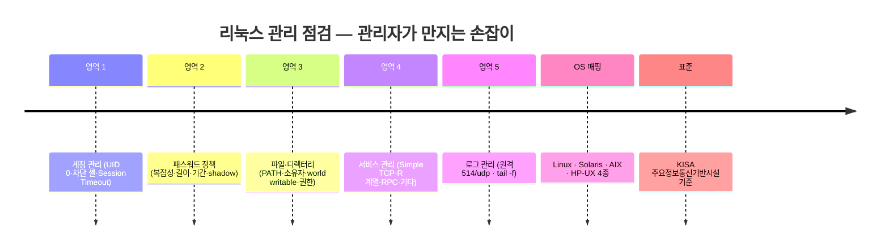
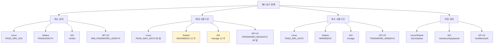
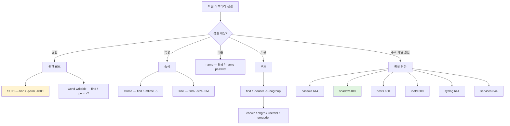
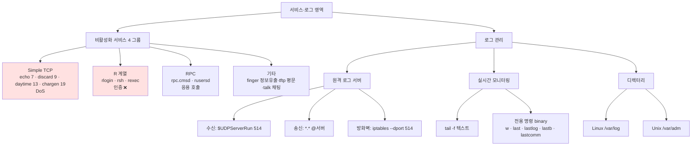

# 04. 리눅스 관리 — 만화책처럼 읽는 리눅스 보안 설정의 표준

> **이 문서를 읽는 법**: 만화책 한 권을 펼쳤다고 생각하세요. *에피소드*를 따라 "기본값은 왜 위험한가 → 어떤 정책으로 막는가 → 권장 수치·OS별 옵션은 무엇인가" 를 따라가면 자연스럽게 외워집니다.
> 정확한 권장 수치·옵션·경로는 정확본을 참조: [[cs/information-security/01.system-security/04.linux-management|정확본 04. 리눅스 관리]]

> **연결 단원**: 본 단원은 [[cs/information-security/01.system-security/03.linux-basic|03. 리눅스 기본]] 의 *구조* 위에 *어떤 정책을 어떻게 설정하는가*. 03 의 `/etc/passwd`·`/etc/shadow`·권한 비트·`xinetd`·PAM·syslog 가 *관리자가 만지는 손잡이* 형태로 다시 등장.

---

## 🎯 시작 전에 — 이미 쓰고 있는 리눅스 보안 정책

| 매일 보는 것 | 사실은 이 단원의 |
|---|---|
| `cat /etc/passwd` 로 root 외 UID 0 확인 | UID 0 유일성 |
| `/sbin/nologin` 로 끝나는 시스템 계정 | 로그인 차단 셸 |
| 10분 방치하면 자동 로그아웃 | `TMOUT=600` |
| 90일마다 패스워드 변경 알림 | `PASS_MAX_DAYS 90` |
| `ls -l /etc/shadow` → `-r--------` | shadow 400 권장 |
| 회사 정책 "패스워드 9자 이상" | 국가기관 권장 |
| 중앙 로그 서버 운영 | 원격 syslog 514/udp |
| `tail -f /var/log/messages` | 실시간 로그 모니터링 |
| `find / -perm -4000` SUID 점검 | 주기 보안 점검 |

> **이 단원의 본질**: 리눅스 보안 수준은 *OS 가 제공하는 기능*보다 *관리자가 어떻게 설정했는가*에 좌우된다. KISA *주요정보통신기반시설 기술적·관리적 보호조치 기준* 의 UNIX 서버 점검 항목과 *1:1 대응*. 시험은 *권장 수치·OS별 옵션 매핑·find 옵션·주요 파일 권한*을 직접 출제. **4 OS** (Linux · Solaris · AIX · HP-UX) 매핑은 자격증 1과목의 *시그니처 출제 패턴*.

---

## 📖 에피소드 1 — 관리의 5 영역 + KISA 정합 + 4 OS 매핑

### 장면. 03 단원의 구조가 무력화되는 한순간

> `/etc/passwd` · `/etc/shadow` · 권한 비트 · `xinetd` · PAM · syslog 가 *아무리 잘 설계되어 있어도* — 패스워드 복잡성 비활성 + `/etc/shadow` 가 644 로 노출 → *모두 무력화*.

### 5 영역 한 표

| 영역 | 핵심 포인트 |
|---|---|
| **계정 관리** | UID 0 유일성 · 로그인 차단 셸 · Session Timeout |
| **패스워드 정책** | 복잡성 · 최소 길이 · 최대/최소 사용기간 · shadow 보호 |
| **파일·디렉터리** | PATH 환경변수 · 소유자/소유그룹 · world writable · 주요 파일 권한 |
| **서비스 관리** | Simple TCP · R 계열 · RPC · 익명 FTP 비활성화 |
| **로그 관리** | 원격 로그 서버 운영 (514/udp) · 실시간 모니터링 |

### KISA 정합

> 본 단원의 항목은 **KISA *주요정보통신기반시설 기술적·관리적 보호조치 기준*** 의 UNIX 서버 점검 항목과 *1:1 대응*. 자격증은 KISA 점검 기준을 그대로 출제.

### 4 OS 매핑 — 1과목 시그니처

> 정확본은 **SOLARIS · LINUX · AIX · HP-UX** 의 *4 OS 매핑*을 표로 보존. 자격증에서 *매핑 자체가 출제 포인트*.

### 시험 함정

- "리눅스 보안 점검 5 영역?" → 계정 / 패스워드 / 파일·디렉터리 / 서비스 / 로그
- "리눅스 점검 표준?" → **KISA *주요정보통신기반시설 기술적·관리적 보호조치 기준***
- "4 OS 매핑?" → SOLARIS · LINUX · AIX · HP-UX

---

## 📖 에피소드 2 — UID 0 유일성: root 외 UID 0 금지

### 장면. 이름이 root 가 아니어도 UID 0 이면 root

> 리눅스는 사용자를 *이름이 아닌 UID 로 식별* ([[cs/information-security/01.system-security/03.linux-basic|03 §2]] 참조). root 와 동일한 **UID 0 을 가진 다른 계정**이 있으면, *이름이 무엇이든 root 권한*으로 시스템 접근 가능. *침해 시 추가 공격 통로*.

### 점검 — `awk` 한 줄

```bash
awk -F: '$3 == 0 {print $1}' /etc/passwd
```

### `awk` 명령 풀이

> `awk` = 줄 단위 텍스트를 *필드로 나누어 조건에 맞는 줄만 출력*. 이름은 개발자 *Aho · Weinberger · Kernighan* 이니셜.

| 부분 | 의미 |
|---|---|
| `-F:` | 필드 구분자 = `:` (passwd 형식) |
| `$3` | 세 번째 필드 (UID) |
| `$3 == 0` | UID 0 인 줄만 |
| `{print $1}` | 첫 필드 (계정명) 출력 |

### 조치 — `usermod -u`

```bash
usermod -u [UID 500 이상] [계정명]
```

### 4 OS 일반 사용자 UID 범위 + 변경 명령

| OS | 일반 사용자 UID | 변경 명령 |
|---|---|---|
| **Linux** | **500 이상** | `usermod -u 2016 algisa` |
| **Solaris / HP-UX** | **100 이상** | `usermod -u 2016 algisa` |
| **AIX** | **100 이상** | **`chuser id=2016 algisa`** |

### AIX 의 함정 — `chuser`

> *AIX 만 명령이 다르다*. `usermod` 가 아니라 **`chuser id=...`**. 시험 단골.

### 시험 함정

- "UID 0 의 위험?" → 이름 무관 *root 권한 접근*
- "Linux 일반 사용자 UID?" → **500 이상**
- "Solaris/HP-UX 일반 사용자 UID?" → **100 이상**
- "AIX UID 변경 명령?" → **`chuser id=...`** (`usermod` 아님)
- "UID 0 점검 명령?" → **`awk -F: '$3 == 0 {print $1}' /etc/passwd`**

---

## 📖 에피소드 3 — 로그인 차단 셸: /bin/false vs /sbin/nologin

### 장면. 시스템 계정이 셸 로그인 가능하면

> 서비스 운영용 계정 (`bin`, `daemon`, `nobody`, `apache`) 은 *대화형 로그인 불필요*. 셸 로그인 가능하면 *침해 시 추가 공격 통로*.

### 왜 계정 자체를 삭제하지 않는가

> 시스템·패키지가 *파일·프로세스 소유 UID* 로 계속 사용. 계정 삭제 시 *남은 파일이 `nouser` 가 되거나*, *데몬 기동 실패*. → **계정·UID/GID 유지 + 대화형 셸만 제거**.

### 조치

> `/etc/passwd` 의 *마지막 필드 (로그인 셸)* 을 **`/bin/false`** 또는 **`/sbin/nologin`** 으로 변경.

```
algisa:x:500:500::/home/algisa:/sbin/nologin
```

### 로그인 셸의 정의

> "로그인 셸" 은 bash 만 의미하지 않는다. *그 계정으로 로그인 성공 시 커널이 실행하는 첫 프로그램*. `false`/`nologin` 은 *즉시 종료되는 프로그램*이라 로그인 자체가 무의미해진다.

### `/bin` ↔ `/sbin` 의 차이

| 경로 | 역할 (관례) | 예시 |
|---|---|---|
| **`/bin`** | 모든 사용자·복구 모드용 *일반 명령*. 일반 사용자 PATH 에 자주 포함 | `ls`·`cat`·`sh` |
| **`/sbin`** | *시스템 관리·부팅* 용. 예전엔 root PATH 위주 | `ifconfig`·`fdisk`·`init` |

### `s` = `system`

> **`s`** = *system* (시스템 관리용 바이너리 디렉터리) — 관례적 암기.

### 계정 삭제 명령 — `passwd` 아님

> *주의*: `passwd` 는 **비밀번호 설정·변경** 명령. *계정 삭제는* **`userdel`** / `deluser`. 그룹은 **`groupdel`**. 시험 함정.

### 시험 함정

- "로그인 차단 셸 2종?" → **`/bin/false` · `/sbin/nologin`**
- "왜 계정을 삭제하지 않나?" → 시스템·패키지가 UID 사용 + 데몬 기동 실패
- "계정 삭제 명령?" → **`userdel`** (`passwd` 아님)
- "`/sbin` 의 `s`?" → **system** (시스템 관리용)

---

## 📖 에피소드 4 — Session Timeout: TMOUT 600 / autologout 10

### 장면. 자리를 비운 사이의 위험

> 계정 접속 상태로 *방치*되면 권한 없는 사용자에게 시스템 노출 → 악용 가능. 일정 시간 *이벤트 없으면 연결 종료*.

### 셸별 설정

| 셸 | 설정 파일 | 설정 형식 |
|---|---|---|
| `sh` · `ksh` · **`bash`** | `/etc/profile` 또는 `/etc/.profile` | **`TMOUT=600`** + `export TMOUT` (**초** 단위) |
| **`csh`** | `/etc/csh.login` 또는 `/etc/csh.cshrc` | **`set autologout=10`** (**분** 단위) |

### 권장값

> **600초 (= 10분)** 이내.

### 단위 차이 — 함정 1순위

> **bash 는 *초* 단위 (600), csh 는 *분* 단위 (10)**. 같은 *10분*을 표현하지만 *수치가 60배 다르다*. 시험에서 *흔드는 핵심*.

### 설정 예시

```bash
# /etc/profile
TMOUT=600
export TMOUT
```

### 시험 함정

- "Session Timeout 권장값?" → **600초 (= 10분)**
- "bash Session Timeout 변수?" → **`TMOUT`** (초 단위)
- "csh Session Timeout?" → **`autologout`** (분 단위)
- "TMOUT=600 ↔ autologout=10?" → 둘 다 *10분*

---

## 📖 에피소드 5 — 패스워드 복잡성: pam_pwquality + 2종 10자 / 3종 8자

### 장면. 유추하기 쉬운 패스워드의 위험

> 사용자 계정 암호를 *유추하기 쉽게* 설정하면 *비인가자의 시스템 접근* 허용.

### 1과목 권장 기준

> 영문 대/소문자·숫자·특수문자 *4종 조합*:
> - **2종류 조합** → 최소 **10자리 이상**
> - **3종류 이상 조합** → 최소 **8자리 이상**
> - 주기적 변경 + 시스템마다 다른 패스워드

### Linux 의 복잡성 — `pam_pwquality`

> Linux 는 **`pam_pwquality`** 모듈 사용. 설정 파일: **`/etc/security/pwquality.conf`**. [[cs/information-security/01.system-security/03.linux-basic|03 §9]] 의 PAM (`type=password` + `control=requisite`) 흐름의 *실제 구현체*.

### 5 옵션 한 표

| 옵션 | 의미 | 통합자료 권장값 |
|---|---|---|
| **`minlen`** | 최소 길이 | `8` |
| **`lcredit`** | *소문자* 최소 개수 (음수 = 강제) | `-1` (소문자 최소 1개) |
| **`ucredit`** | *대문자* 최소 개수 | `-1` |
| **`dcredit`** | *숫자* 최소 개수 | `-1` |
| **`ocredit`** | *특수문자* 최소 개수 | `-1` |

### 음수의 의미

> **`-1` = 최소 1개 강제**. 양수는 *상한*, 음수는 *하한*. 시험에서 부호의 의미를 묻는다.

### 외우는 방법 — 4 영문 첫 글자

> **`l` (lower) · `u` (upper) · `d` (digit) · `o` (other/special)**. + `credit`. 글자 그대로 의미.

### 시험 함정

- "복잡성 2종 조합 길이?" → **10자**
- "복잡성 3종+ 조합 길이?" → **8자**
- "Linux 복잡성 모듈?" → **`pam_pwquality`**
- "복잡성 설정 파일?" → **`/etc/security/pwquality.conf`**
- "`-1` 의 의미?" → 최소 1개 *강제*
- "특수문자 옵션?" → **`ocredit`** (other)

---

## 📖 에피소드 6 — 패스워드 최소 길이: 4 OS 매핑

### 장면. 무차별·추측 공격 대응

> 무작위 공격·추측 공격 대응을 위해 *최소 길이 강제*. **일반 시스템 8자 이상 / 국가기관 9자 이상**.

### 4 OS 매핑 — 시험 직출

| OS | 설정 파일 | 옵션 |
|---|---|---|
| **Linux** | **`/etc/login.defs`** | **`PASS_MIN_LEN 8`** |
| **Solaris** | `/etc/default/passwd` | **`PASSLENGTH=8`** |
| **AIX** | `/etc/security/user` | **`minlen=8`** |
| **HP-UX** | `/etc/default/security` | **`MIN_PASSWORD_LENGTH=8`** |

### 외우는 방법

> *길이*는 4 OS 모두 영어 단어로 표현 — `LEN` (Linux) / `LENGTH` (Solaris·HP-UX) / `len` (AIX). *PASSLENGTH 와 MIN_PASSWORD_LENGTH* 의 *단어 순서 차이* 가 시험 함정.

### 국가기관 9자

> 자격증에서 *국가기관 = 9자 이상* 매핑 출제.

### 시험 함정

- "Linux 최소 길이 옵션?" → **`PASS_MIN_LEN`**
- "Solaris 최소 길이?" → **`PASSLENGTH`**
- "AIX 최소 길이?" → **`minlen`**
- "HP-UX 최소 길이?" → **`MIN_PASSWORD_LENGTH`**
- "국가기관 권장?" → **9자 이상**

---

## 📖 에피소드 7 — 패스워드 사용기간: 최대 90일·12주 + 최소 1일

### 장면 1. 최대 사용기간 — 권장 90일 (= 12주)

> 최대 사용기간 미설정 → *유출된 패스워드로 계속 접속 가능*. 주기적 변경 강제.

### 4 OS 최대 사용기간

| OS | 설정 파일 | 옵션 |
|---|---|---|
| **Linux** | `/etc/login.defs` | **`PASS_MAX_DAYS 90`** (일) |
| **Solaris** | `/etc/default/passwd` | **`MAXWEEKS=12`** (주) |
| **AIX** | `/etc/security/user` | **`maxage=12`** (주) |
| **HP-UX** | `/etc/default/security` | **`PASSWORD_MAXDAYS=90`** (일) |

### 단위 함정 — 일 vs 주

> **Linux·HP-UX = 일 단위 (90)** / **Solaris·AIX = 주 단위 (12)**. *같은 90일*을 표현하지만 *수치가 다르다*. 시험에서 흔든다.

### 장면 2. 최소 사용기간

> 최소 사용기간 미설정 → 사용자가 *익숙한 패스워드로 즉시 되돌릴 수 있음*. 패스워드 *재사용* → 정기 변경 무의미.

### 4 OS 최소 사용기간

| OS | 설정 파일 | 옵션 |
|---|---|---|
| **Linux** | `/etc/login.defs` | **`PASS_MIN_DAYS 1`** (또는 90) |
| **Solaris** | `/etc/default/passwd` | **`MINWEEKS=12`** |
| **AIX** | `/etc/security/user` | **`minage=12`** |
| **HP-UX** | `/etc/default/security` | **`PASSWORD_MINDAYS=90`** |

### 권장값의 의미

> 통합자료는 `PASS_MIN_DAYS 1`, 1과목.txt 는 `90`. 정책마다 다름. **시험은 "최소 1일 이상"** 의 *의미*만 묻는다.

### 외우는 방법 — `MAX` ↔ `MIN`

> 최대 = `MAXWEEKS` · `maxage` · `MAX_DAYS` · `MAXDAYS` / 최소 = `MINWEEKS` · `minage` · `MIN_DAYS` · `MINDAYS`. *대칭 구조*.

### 시험 함정

- "최대 사용기간 권장?" → **90일 (= 12주)**
- "Linux 최대 사용기간 옵션?" → **`PASS_MAX_DAYS`**
- "Solaris 단위?" → **주 (`MAXWEEKS=12`)**
- "AIX 단위?" → **주 (`maxage=12`)**
- "최소 사용기간 의미?" → 최소 1일 *재변경 불가*

---

## 📖 에피소드 8 — 패스워드 파일 보호: shadow + pwconv + 4 OS 매핑

### 장면. 평문 저장의 위험

> 패스워드를 *평문 저장*하면 *정보 유출 피해* 발생. **암호화 저장 필수**. 03 §2 의 shadow 메커니즘이 그 답.

### 점검 절차

```bash
# 1. /etc/passwd 의 패스워드 필드가 x 인지 확인
cat /etc/passwd

# 2. shadow 패스워드 정책 활성화
pwconv
```

### 4 OS 패스워드 저장 위치

| OS | 저장 위치 |
|---|---|
| **Linux / Solaris** | **`/etc/shadow`** (`/etc/passwd` 2번째 필드 = `x`) |
| **AIX** | **`/etc/security/passwd`** (기본 암호화) |
| **HP-UX** | **`/tcb/files/auth/[계정 이니셜]/[계정명]`** (trustmode 전환 시) |

### HP-UX 의 trustmode

> HP-UX 는 *trustmode 전환 시* `/tcb/files/auth/...` 에 저장. *계정 이니셜*로 디렉터리를 나눈다 — 시험에서 *경로의 정확한 형태* 묻는다.

### `pwconv` ↔ `pwunconv`

> `pwconv` = shadow *활성화* (passwd → shadow) / `pwunconv` = *비활성화* (shadow → passwd 통합). 03 §2-4 참조.

### 시험 함정

- "Linux 패스워드 저장 위치?" → **`/etc/shadow`**
- "AIX 저장 위치?" → **`/etc/security/passwd`**
- "HP-UX 저장 위치?" → **`/tcb/files/auth/[계정 이니셜]/[계정명]`**
- "shadow 활성화 명령?" → **`pwconv`**
- "passwd 2번째 필드 `x`?" → shadow 사용 중

---

## 📖 에피소드 9 — root PATH 환경변수: `.` 의 위험 + 셸별 환경설정

### 장면. PATH 에 `.` 이 앞에 있으면

> root PATH 환경변수에 *현재 디렉터리 (`.`)* 가 *앞이나 중간*에 있으면, 관리자가 의도 안 한 *현재 디렉터리의 명령어*가 실행된다. 공격자가 *현재 디렉터리에 동일 이름의 악성 `ls`* 를 심어두면 → root 가 `ls` 입력 순간 *악성코드가 root 권한으로 실행*.

### 점검·조치

```bash
# 1. PATH 경로 확인
echo $PATH

# 2. /etc/profile 또는 $HOME/.bash_profile 에서 $PATH 변수 설정
#    "." 을 제거하거나 PATH 의 마지막으로 이동
```

### 셸별 환경설정 파일 4종

| 셸 | 환경설정 파일 |
|---|---|
| **`bin/sh`** | `/etc/profile` · `$HOME/.profile` |
| **`bin/bash`** | `/etc/profile` · **`$HOME/.bash_profile`** |
| **`bin/ksh`** | `/etc/profile` · `$HOME/.profile` · **`$HOME/.kshrc`** |
| **`bin/csh`** | **`/etc/.login`** · **`$HOME/.cshrc`** · `$HOME/.login` |

### 외우는 방법

> *셸 이름 + rc 또는 profile* — `.bash_profile` (bash) · `.kshrc` (ksh) · `.cshrc` (csh) · `.profile` (sh).

### 시험 함정

- "root PATH 의 `.` 위치?" → 제거 또는 *마지막*
- "bash 환경설정?" → **`/etc/profile` · `$HOME/.bash_profile`**
- "csh 환경설정?" → **`/etc/.login` · `$HOME/.cshrc` · `$HOME/.login`**

---

## 📖 에피소드 10 — 소유자/소유그룹: nouser·nogroup + chown·chgrp

### 장면. 사라진 주인의 흔적

> 파일에는 *계정 이름이 아니라 숫자 UID·GID*가 저장. `ls -l` 이 *이름*을 보여주는 건 `/etc/passwd`·`/etc/group` 에서 *역조회*하기 때문.

### `nouser` / `nogroup` 의 의미

> 저장된 UID/GID 가 *현재 시스템의 passwd/group 에 없는 상태*. 대표 원인:

| 원인 | 예시 |
|---|---|
| 1. 계정·그룹을 *삭제했는데 파일만 남음* | UID 1000 사용자 삭제 → `/home/old` 소유 = 숫자 1000 |
| 2. 백업 복원·아카이브 해제·*다른 호스트에서 복사* | 이기종·구 계정 체계 UID/GID |
| 3. *관리 소홀* — 잘못된 소유로 생성 |

### 위험

> *누구 소유인지 추적 불가* → 권한 정리·감사 시 *잡음*.

### 점검·조치 명령

```bash
# 1. 소유자/소유그룹 부재 검색
find / \( -nouser -o -nogroup \) -exec ls -al {} \;

# 2. 소유자 변경
chown [계정명] [파일명]

# 3. 소유그룹 변경
chgrp [그룹명] [파일명]
```

### 계정·그룹 삭제 명령

| 작업 | 명령 |
|---|---|
| 사용자 계정 삭제 | **`userdel`** (또는 `deluser`) |
| 그룹 삭제 | **`groupdel`** |

### `passwd` ≠ 계정 삭제

> *주의*: `passwd` 는 **비밀번호 설정·변경**. *계정 삭제 아님*.

### 시험 함정

- "`-nouser`·`-nogroup` 의 의미?" → passwd/group 에 *항목 없는* UID/GID
- "계정 삭제 명령?" → **`userdel`**
- "소유자 변경?" → **`chown`**
- "소유그룹 변경?" → **`chgrp`**

---

## 📖 에피소드 11 — World Writable + 주요 파일 권한

### 장면 1. World Writable 의 위험

> 모든 사용자 (`other`) 에게 *쓰기 권한* (`w`) 부여 → *실수·악의로 주요 정보 변경 가능*. 시스템 장애·추가 공격에 활용.

### 점검·조치

```bash
# 1. other 쓰기 검색 (-2 = -0002 와 동일)
find / -perm -2 -exec ls -al {} \;

# 2. other 쓰기 제거
chmod o-w [파일명]
```

### `-perm -2` 의 의미

> **`-2` = `-0002` 와 동일**. *other 비트의 `w` (쓰기)*. 시험 단골.

### 장면 2. 주요 파일 권한 — 시험 직출

| 파일 | 역할 | 소유자 | 권장 권한 |
|---|---|---|---|
| **`/etc/passwd`** | 사용자 정보 | root | **644 이하** |
| **`/etc/shadow`** | 암호화 패스워드 | root | **400 이하** |
| **`/etc/hosts`** | IP ↔ 호스트명 | root | **600 이하** (일부 규정 644) |
| **`/etc/(x)inetd.conf`** | (x)inetd 데몬 설정 | root | **600 이하** |
| **`/etc/syslog.conf`** | syslogd 데몬 설정 | root | **644 이하** |
| **`/etc/services`** | 서비스 ↔ 포트/프로토콜 | root | **644** |

### 권한 숫자의 *근거*

| 파일 | 권한 | 근거 |
|---|---|---|
| `/etc/shadow` | **400** | 암호화 패스워드 노출 시 무차별 공격 → root 만 *읽기*만 |
| `/etc/(x)inetd.conf` | **600** | 외부 불법 등록 시 *root 권한으로 실행* 위험 |
| `/etc/syslog.conf` | **644** | 변경 시 *로그 미기록* → 침입 흔적·오류 분석 ❌ |

### 권한 외우는 패턴

| 권한 | 패턴 | 의미 |
|---|---|---|
| **644** (`rw-r--r--`) | 일반 사용자도 *읽기 OK* | 도구·로그인 공통 참조 |
| **600** (`rw-------`) | root 만 *읽기·쓰기* | 변조 영향 큰 매핑·슈퍼데몬 |
| **400** (`r--------`) | root 만 *읽기*, 쓰기 ❌ | shadow |

### 시험 함정

- "world writable 검색?" → **`find / -perm -2`**
- "`-perm -2` 의 의미?" → other 의 *쓰기 비트* (`-0002`)
- "world writable 제거?" → **`chmod o-w`**
- "`/etc/passwd` 권장 권한?" → **644 이하**
- "`/etc/shadow` 권장 권한?" → **400 이하**
- "`/etc/(x)inetd.conf` 권장?" → **600 이하**
- "`/etc/syslog.conf` 권장?" → **644 이하**

---

## 📖 에피소드 12 — find 명령 8 옵션: 시스템 점검의 만능 도구

### 장면. find = 점검의 만능 도구

> `find` = 시스템 점검에서 *가장 광범위하게 활용*되는 명령. 자격증 *옵션 매핑* 단골.

### 명령 골격

```
find [시작경로] [표현식 …] [액션]
```

> 표현식은 *앞에서부터 순서대로 평가*.

### 8 옵션 한 표

| 옵션 | 의미 |
|---|---|
| **`-type f` / `-type d`** | 정규 파일만 / 디렉터리만 |
| **`-name "패턴"`** | 파일 *이름* 일치 |
| **`-mtime -5`** | 내용 수정 시각 *현재로부터 5일 미만* |
| **`-size -5M`** | 크기 *5MB 미만* |
| **`-perm -4000`** | 권한 *비트에 SUID 포함* (다른 비트 ON 도 잡음) |
| **`-perm -2`** | other 에 *쓰기 (0002)* (world-writable) |
| **`-nouser` / `-nogroup`** | passwd/group 에 *없는 UID/GID* |
| **`-exec 명령 {} \;`** | 찾은 경로를 `{}` 에 넣어 *명령 반복 실행* (`\;` 로 종료) |

### 6 검색 시나리오

| 시나리오 | 명령 |
|---|---|
| **권한 (SUID)** | `find / -perm -4000` |
| **속성 (수정일)** | `find / -type f -mtime -5` |
| **이름** | `find / -name "passwd"` |
| **크기** | `find / -type f -size -5M` |
| **소유자/그룹 부재** | `find / \( -nouser -o -nogroup \) -exec ls -al {} \;` |
| **other 쓰기** | `find / -perm -2 -exec ls -al {} \;` |

### `-perm 4000` ↔ `-perm -4000` 의 차이

> **`4000`** = *정확히 SUID 만* / **`-4000`** = *SUID 비트가 포함되면* (다른 비트 ON 도 잡음). *점검에는 `-4000` 형태가 흔하다*.

### `-exec ... \;` 의 `\;`

> `\;` = `-exec` 절 *끝남*. 셸이 `;` 를 명령 구분자로 해석하지 않게 *이스케이프*.

### 시험 함정

- "정규 파일만 검색?" → **`-type f`**
- "5일 미만 수정?" → **`-mtime -5`**
- "5MB 미만?" → **`-size -5M`**
- "SUID 검색?" → **`-perm -4000`**
- "world writable 검색?" → **`-perm -2`**
- "소유자·그룹 부재?" → **`-nouser` / `-nogroup`**
- "각 결과에 명령 실행?" → **`-exec ... {} \;`**

---

## 📖 에피소드 13 — 서비스 관리 + 로그 관리 (원격 514/udp + tail -f)

### 장면 1. 4 위험 서비스 그룹

[[cs/information-security/01.system-security/03.linux-basic|03 §8]] 의 서비스 운영 위에서, 운영자는 *4 그룹*을 비활성화한다.

| 그룹 | 위험 | 대상 |
|---|---|---|
| **Simple TCP** | DoS | `echo` (7) · `discard` (9) · `daytime` (13) · `chargen` (19) |
| **R 계열** | 인증 없이 관리자 원격 | `rlogin` · `rsh` · `rexec` |
| **RPC** | 응용 프로그램 작업 호출 | `rpc.cmsd` · `rusersd` |
| **기타 평문/취약** | 정보 유출 · 인증 부재 · 평문 | `finger` · `tftp` · `talk` |

### 4 그룹 위험 매핑

| 서비스 | 위험 |
|---|---|
| **`finger`** | *원격 사용자 정보 조회* (로그인명·마지막 접속) — 정보 유출 |
| **`tftp`** | *인증 없는 평문 FTP* — 부팅 시점 외 비활성화 |
| **`talk`** | 암호화·보안 부족한 *실시간 채팅* |

### 점검 명령

```bash
# (x)inetd 기반 — 설정 파일에서 # 주석 처리
vi /etc/xinetd.conf
vi /etc/xinetd.d/[서비스명]

# 활성 포트 확인
netstat -anp | grep LISTEN

# Stand-Alone 인 경우
systemctl disable [서비스명]
```

### 장면 2. 원격 로그 서버 — 514/udp

> 침해 시 *로컬 로그 파일이 변조·삭제* 위험 → *별도 원격 서버로 송신* 보존. 전통적 syslog 원격 전달은 **UDP 514** 일반적. `rsyslog` 는 UDP·TCP 모듈 모두 가능 ([[cs/information-security/01.system-security/03.linux-basic|03 §10-1]] RFC 3195·BEEP·TCP 참고).

### 받는 서버 (수집 서버) 설정 4단계

```bash
# 1. /etc/rsyslog.conf 에 UDP 수신 활성화
$UDPServerRun 514

# 2. rsyslogd 데몬 구동 확인
ps -ef | grep rsyslogd

# 3. 514/udp 포트 오픈 확인
netstat -enup | grep rsyslogd

# 4. 방화벽에서 514/udp 허용
iptables -A INPUT -p udp --dport 514 -j ACCEPT
```

### 보내는 서버 설정

```bash
# /etc/rsyslog.conf — 모든 facility · priority 의 로그를 원격으로
*.* @[받는 서버 주소]
```

### `*.*` 의 의미

> **`*.*`** = `facility.priority` 의 *모든 facility · 모든 priority*. *@* = 원격 송신 prefix.

### 장면 3. 실시간 모니터링 — tail -f

```bash
# 텍스트 로그 실시간 (binary 는 ❌)
tail -f /var/log/[로그파일]
```

### binary 로그는 전용 명령

> binary 로그 (`utmp`, `wtmp`, `lastlog`, `btmp`, `pacct`) 는 [[cs/information-security/01.system-security/03.linux-basic|03 §10-3]] 의 *전용 명령* (`w`, `last`, `lastlog`, `lastb`, `lastcomm`) 사용.

### 로그 저장 디렉터리 — Linux ↔ Unix

| OS | 디렉터리 |
|---|---|
| **Linux** | **`/var/log`** |
| **Unix** | **`/var/adm`** |

### 시험 함정

- "Simple TCP 4 포트?" → 7·9·13·19
- "R 계열 위험?" → *인증 없는 관리자 원격 접속*
- "원격 로그 수신 포트?" → **514/udp**
- "rsyslog 수신 활성화?" → **`$UDPServerRun 514`**
- "방화벽 허용?" → `iptables -A INPUT -p udp --dport 514 -j ACCEPT`
- "원격 송신 형식?" → **`*.* @[수신 서버]`**
- "실시간 모니터링?" → **`tail -f`** (텍스트 한정)
- "Linux ↔ Unix 로그 디렉터리?" → `/var/log` ↔ `/var/adm`

---

## 📑 리눅스 관리 종합 비교 (에피소드 1~13 정리)

시험 직전 *한눈에* 보는 view.

| 영역 | 핵심 |
|---|---|
| **5 영역** | 계정·패스워드·파일/디렉터리·서비스·로그 |
| **표준** | KISA *주요정보통신기반시설 기술적·관리적 보호조치 기준* |
| **4 OS 매핑** | Linux · Solaris · AIX · HP-UX |
| **UID 0** | 유일성 (Linux 500 / Solaris·HP-UX·AIX 100 이상). 변경: `usermod -u` (Linux/Solaris/HP-UX) / **`chuser id=`** (AIX) |
| **로그인 차단 셸** | **`/bin/false` · `/sbin/nologin`** |
| **Session Timeout** | **`TMOUT=600`** (bash 초) / **`autologout=10`** (csh 분) |
| **복잡성** | 2종 10자 / 3종 8자 / 국가기관 9자. **`pam_pwquality`** + `lcredit·ucredit·dcredit·ocredit = -1` |
| **최소 길이** | Linux `PASS_MIN_LEN` / Solaris `PASSLENGTH` / AIX `minlen` / HP-UX `MIN_PASSWORD_LENGTH` |
| **최대 사용** | 90일 = 12주. Linux/HP-UX *일* / Solaris/AIX *주* |
| **shadow 위치** | Linux/Solaris `/etc/shadow` / AIX `/etc/security/passwd` / HP-UX `/tcb/files/auth/...` |
| **PATH** | `.` 제거 또는 *마지막* |
| **소유자 부재** | `find -nouser -nogroup` + `chown` / `chgrp` / `userdel` / `groupdel` |
| **주요 파일 권한** | passwd 644 / shadow 400 / hosts 600 / inetd 600 / syslog 644 / services 644 |
| **find 옵션** | `-type` · `-name` · `-mtime` · `-size` · `-perm` · `-nouser` · `-nogroup` · `-exec ... {} \;` |
| **위험 서비스 4 그룹** | Simple TCP · R 계열 · RPC · finger/tftp/talk |
| **원격 로그** | `$UDPServerRun 514` + `*.* @host` + `iptables --dport 514` |
| **모니터링** | **`tail -f`** (텍스트) / 전용 명령 (binary) |

---

## 🗺️ 마인드맵 1 — 5 영역 + 4 OS 매핑



**읽는 법**: 5 영역 = *시간순 점검 흐름*. OS 매핑은 *영역 2·3 에서 결정적*.

---

## 🗺️ 마인드맵 2 — 4 OS 패스워드 옵션 매핑 트리



**읽는 법**: 노란색 = *주 단위 (Solaris·AIX) 함정*. 일·주 단위 차이가 시험 단골.

---

## 🗺️ 마인드맵 3 — 계정·셸·환경설정 트리

```mermaid
graph TD
  A[계정 관리 영역]
  A --> A1[UID 0 유일성]
  A --> A2[로그인 차단 셸]
  A --> A3[Session Timeout]
  A --> A4[셸별 환경설정]

  A1 --> A1a[Linux 500+]
  A1 --> A1b[Solaris·HP-UX 100+]
  A1 --> A1c[AIX 100+ chuser]

  A2 --> A2a[/bin/false]
  A2 --> A2b[/sbin/nologin]

  A3 --> A3a[bash TMOUT=600 초]
  A3 --> A3b[csh autologout=10 분]

  A4 --> A4a[bash<br/>.bash_profile]
  A4 --> A4b[ksh<br/>.kshrc]
  A4 --> A4c[csh<br/>.cshrc + .login]
  A4 --> A4d[sh<br/>.profile]

  style A3a fill:#fff4d1
  style A3b fill:#fff4d1
  style A1c fill:#ffe1e1
```

**읽는 법**: 빨강 = AIX 만 명령 다름 (`chuser`) / 노랑 = bash·csh 단위 함정 (초 vs 분).

---

## 🗺️ 마인드맵 4 — 파일 권한 + find 결정 트리



**읽는 법**: 녹색 = *shadow 400* (가장 엄격) / 노랑 = SUID 점검 1순위.

---

## 🗺️ 마인드맵 5 — 서비스·로그 결정 트리



---

## 🗂️ 키워드 클러스터

### 5 영역

```
1. 계정 관리       — UID 0 · 차단 셸 · Session Timeout
2. 패스워드 정책   — 복잡성 · 길이 · 기간 · 보호
3. 파일·디렉터리   — PATH · 소유자 · world writable · 권한
4. 서비스 관리     — Simple TCP · R · RPC · 기타
5. 로그 관리       — 원격 514/udp · tail -f
```

### UID 0 + 4 OS 변경

```
Linux  500+          : usermod -u 2016 algisa
Solaris/HP-UX 100+   : usermod -u 2016 algisa
AIX    100+          : chuser id=2016 algisa     ← AIX 만 명령 다름

awk 점검:
  awk -F: '$3 == 0 {print $1}' /etc/passwd
```

### 로그인 차단 셸

```
/bin/false       — 즉시 종료 프로그램
/sbin/nologin    — 로그인 거부 메시지 + 종료

/bin   = 일반 명령 (ls·cat·sh)
/sbin  = system 관리 (ifconfig·fdisk·init)
```

### Session Timeout

```
bash·sh·ksh : /etc/profile      TMOUT=600          (초)
csh         : /etc/csh.login    set autologout=10  (분)
권장        : 600초 = 10분
```

### 패스워드 복잡성 (pam_pwquality)

```
파일 : /etc/security/pwquality.conf
모듈 : pam_pwquality

minlen   = 8
lcredit  = -1   (소문자 최소 1)
ucredit  = -1   (대문자 최소 1)
dcredit  = -1   (숫자 최소 1)
ocredit  = -1   (특수문자 최소 1)

복잡성  : 2종 10자 / 3종 8자 / 국가기관 9자
```

### 4 OS 길이·기간 매핑 (시험 직출)

```
                Linux                Solaris          AIX               HP-UX
파일            /etc/login.defs      /etc/default/    /etc/security/    /etc/default/
                                     passwd           user              security
최소 길이       PASS_MIN_LEN 8       PASSLENGTH=8     minlen=8          MIN_PASSWORD_LENGTH=8
최대 사용기간   PASS_MAX_DAYS 90 일  MAXWEEKS=12 주   maxage=12 주      PASSWORD_MAXDAYS=90 일
최소 사용기간   PASS_MIN_DAYS        MINWEEKS         minage            PASSWORD_MINDAYS
```

### 4 OS shadow 저장 위치

```
Linux/Solaris : /etc/shadow                          (passwd 2번째 = x)
AIX           : /etc/security/passwd                  (기본 암호화)
HP-UX         : /tcb/files/auth/[이니셜]/[계정명]    (trustmode)

활성화 : pwconv     비활성화 : pwunconv
```

### 셸 환경설정 파일

```
sh    : /etc/profile · $HOME/.profile
bash  : /etc/profile · $HOME/.bash_profile
ksh   : /etc/profile · $HOME/.profile · $HOME/.kshrc
csh   : /etc/.login · $HOME/.cshrc · $HOME/.login
```

### 주요 파일 권한 (시험 직출)

```
/etc/passwd        644 이하
/etc/shadow        400 이하   (root 만 읽기)
/etc/hosts         600 이하   (일부 규정 644)
/etc/(x)inetd.conf 600 이하
/etc/syslog.conf   644 이하
/etc/services      644
```

### find 8 옵션

```
-type f / -type d           정규 파일 / 디렉터리
-name "패턴"                 이름 일치
-mtime -5                   수정 5일 미만
-size -5M                   5MB 미만
-perm -4000                 SUID 비트 포함
-perm -2                    other 쓰기 (world-writable)
-nouser / -nogroup           소유자/그룹 부재
-exec 명령 {} \;             각 결과에 명령 실행
```

### 위험 서비스 4 그룹

```
Simple TCP : echo 7 · discard 9 · daytime 13 · chargen 19  (DoS)
R 계열     : rlogin · rsh · rexec                          (인증 ❌)
RPC        : rpc.cmsd · rusersd                             (응용 호출)
기타       : finger (정보유출) · tftp (평문) · talk (채팅)
```

### 원격 로그 서버

```
수신 : /etc/rsyslog.conf  $UDPServerRun 514
       ps -ef | grep rsyslogd
       netstat -enup | grep rsyslogd
       iptables -A INPUT -p udp --dport 514 -j ACCEPT

송신 : /etc/rsyslog.conf  *.* @[수신 서버 주소]

모니터 : tail -f /var/log/[로그파일]   (텍스트만)
디렉터리 : /var/log (Linux) · /var/adm (Unix)
```

### 헷갈리는 짝 (시험 1순위)

| 짝 | 차이 |
|---|---|
| **`usermod -u` ↔ `chuser id=`** | Linux/Solaris/HP-UX ↔ **AIX 만** |
| **`/bin/false` ↔ `/sbin/nologin`** | 즉시 종료 ↔ 거부 메시지 + 종료 |
| **`TMOUT=600` ↔ `autologout=10`** | bash 초 ↔ csh 분 |
| **`-1` ↔ 양수** | 최소 강제 ↔ 상한 |
| **`PASS_MAX_DAYS 90` ↔ `MAXWEEKS=12`** | 일 ↔ 주 |
| **passwd ↔ shadow ↔ pwconv** | 일반 ↔ 암호화 ↔ 활성화 |
| **`userdel` ↔ `passwd`** | 계정 삭제 ↔ 비밀번호 변경 |
| **`-perm -4000` ↔ `-perm 4000`** | SUID 포함 (다른 비트 OK) ↔ 정확히 SUID 만 |
| **`-perm -2` ↔ `-perm 2`** | other 쓰기 포함 ↔ 정확히 other 쓰기만 |
| **`-mtime -5` ↔ `-mtime +5`** | 5일 미만 ↔ 5일 초과 |
| **passwd 644 ↔ shadow 400** | 일반 사용자 읽기 ↔ root 만 |
| **inetd 600 ↔ syslog 644** | 외부 등록 위험 ↔ 로그 미기록 |
| **`finger` ↔ `tftp` ↔ `talk`** | 정보 유출 ↔ 평문 ↔ 채팅 |
| **`/var/log` ↔ `/var/adm`** | Linux ↔ Unix |

---

## 🃏 회상 30문항

> 답을 가린 뒤 자가 채점.

**A. 5 영역·UID·셸 (1~6)**
1. 리눅스 관리 5 영역은?
2. KISA 표준의 정식 명칭은?
3. UID 0 점검 명령 (awk)은?
4. 4 OS 일반 사용자 UID 와 변경 명령은?
5. 로그인 차단 셸 2종은?
6. `/bin` ↔ `/sbin` 의 차이는?

**B. Session Timeout·복잡성 (7~12)**
7. bash · csh 의 Session Timeout 변수와 단위는?
8. 권장 Session Timeout 값은?
9. 패스워드 복잡성 권장 (2종·3종·국가기관)은?
10. Linux 복잡성 모듈과 설정 파일은?
11. `lcredit/ucredit/dcredit/ocredit` 의 의미는?
12. `-1` 의 의미는?

**C. 패스워드 정책·shadow (13~18)**
13. 4 OS 최소 길이 옵션은?
14. 4 OS 최대 사용기간 옵션과 단위는?
15. 4 OS 최소 사용기간 옵션은?
16. 4 OS shadow 저장 위치는?
17. shadow 활성화 명령은?
18. `passwd` 와 `userdel` 의 차이는?

**D. 파일·find (19~24)**
19. PATH 의 `.` 위치 권장은?
20. 셸별 환경설정 파일 4종은?
21. `nouser/nogroup` 의 의미와 처리는?
22. world writable 검색 명령은?
23. 주요 파일 6종 권장 권한은?
24. find 8 옵션은?

**E. 서비스·로그 (25~30)**
25. 위험 서비스 4 그룹과 각 위험은?
26. Simple TCP 4 포트 매핑은?
27. R 계열 위험은?
28. 원격 로그 수신 활성화 (rsyslog) 4 단계는?
29. 원격 로그 송신 형식은?
30. 텍스트 ↔ binary 로그 모니터링 명령 차이는?

---

## ⚠️ 시험 함정 모음

| 함정 | 정답 |
|---|---|
| 5 영역? | 계정·패스워드·파일/디렉터리·서비스·로그 |
| 표준? | KISA *주요정보통신기반시설 기술적·관리적 보호조치 기준* |
| UID 0 점검? | `awk -F: '$3 == 0 {print $1}' /etc/passwd` |
| Linux 일반 UID? | **500 이상** |
| Solaris/HP-UX UID? | 100 이상 |
| AIX UID 변경 명령? | **`chuser id=`** (`usermod` 아님) |
| 로그인 차단 셸? | **`/bin/false` · `/sbin/nologin`** |
| 계정 삭제 명령? | **`userdel`** (`passwd` 아님) |
| `/sbin` 의 `s`? | system |
| bash Session Timeout? | **`TMOUT=600`** (초) |
| csh Session Timeout? | **`autologout=10`** (분) |
| 권장값? | 600초 = 10분 |
| 복잡성 2종? | **10자** |
| 복잡성 3종+? | **8자** |
| 국가기관? | **9자** |
| 복잡성 모듈? | **`pam_pwquality`** |
| 복잡성 설정 파일? | **`/etc/security/pwquality.conf`** |
| `ocredit` 의미? | **other (특수문자)** 최소 개수 |
| `-1` 의미? | 최소 1개 *강제* |
| Linux 최소 길이? | **`PASS_MIN_LEN`** |
| Solaris 최소 길이? | **`PASSLENGTH`** |
| AIX 최소 길이? | **`minlen`** |
| HP-UX 최소 길이? | **`MIN_PASSWORD_LENGTH`** |
| Linux 최대 사용 단위? | **일** (`PASS_MAX_DAYS 90`) |
| Solaris/AIX 단위? | **주** (`MAXWEEKS=12` / `maxage=12`) |
| HP-UX 최대 사용? | **`PASSWORD_MAXDAYS=90`** (일) |
| Linux/Solaris shadow? | **`/etc/shadow`** |
| AIX shadow? | **`/etc/security/passwd`** |
| HP-UX shadow? | **`/tcb/files/auth/[이니셜]/[계정]`** |
| shadow 활성화? | **`pwconv`** |
| PATH `.` 위치? | 제거 또는 *마지막* |
| bash 환경설정? | `/etc/profile` · `$HOME/.bash_profile` |
| csh 환경설정? | `/etc/.login` · `$HOME/.cshrc` · `$HOME/.login` |
| nouser/nogroup 처리? | `chown`/`chgrp`/`userdel`/`groupdel` |
| world writable 검색? | **`find / -perm -2`** |
| `-2` 의미? | `-0002` other 쓰기 |
| world writable 제거? | `chmod o-w` |
| `/etc/passwd` 권한? | **644 이하** |
| `/etc/shadow` 권한? | **400 이하** |
| `/etc/hosts` 권한? | **600 이하** (일부 644) |
| `/etc/(x)inetd.conf` 권한? | **600 이하** |
| `/etc/syslog.conf` 권한? | **644 이하** |
| `/etc/services` 권한? | **644** |
| SUID 검색? | **`find / -perm -4000`** |
| `-perm 4000` ↔ `-perm -4000`? | 정확히 SUID ↔ SUID 포함 |
| `-mtime -5`? | 수정 5일 미만 |
| `-size -5M`? | 5MB 미만 |
| `-exec ... \;`? | 각 결과에 명령 실행 |
| Simple TCP 4 포트? | **7·9·13·19** |
| R 계열? | `rlogin`·`rsh`·`rexec` (인증 ❌) |
| RPC? | `rpc.cmsd`·`rusersd` |
| finger 위험? | 정보 유출 |
| tftp 위험? | 평문 |
| talk 위험? | 채팅 보안 부재 |
| 원격 로그 수신? | **`$UDPServerRun 514`** |
| 원격 로그 송신? | **`*.* @[서버]`** |
| 방화벽 허용? | `iptables -A INPUT -p udp --dport 514 -j ACCEPT` |
| 텍스트 모니터링? | **`tail -f`** |
| binary 모니터링? | 전용 명령 (`w`·`last`·`lastlog`·`lastb`·`lastcomm`) |
| Linux 로그 디렉터리? | **`/var/log`** |
| Unix 로그 디렉터리? | **`/var/adm`** |

---

## 🔗 정확본 매핑표

| 본 노트 에피소드 | 정확본 § |
|---|---|
| 에피소드 1 (5 영역·KISA) | [[cs/information-security/01.system-security/04.linux-management#0. 들어가며 — 왜 "관리" 가 별도 단원인가\|정확본 §0]] |
| 에피소드 2 (UID 0) | [[cs/information-security/01.system-security/04.linux-management#1-1. root 이외의 UID 0 금지\|정확본 §1-1]] |
| 에피소드 3 (차단 셸) | [[cs/information-security/01.system-security/04.linux-management#1-2. 로그인이 불필요한 계정의 로그인 차단\|정확본 §1-2]] |
| 에피소드 4 (Session Timeout) | [[cs/information-security/01.system-security/04.linux-management#1-3. Session Timeout 설정\|정확본 §1-3]] |
| 에피소드 5 (복잡성) | [[cs/information-security/01.system-security/04.linux-management#2-1. 패스워드 복잡성 설정\|정확본 §2-1]] |
| 에피소드 6 (최소 길이) | [[cs/information-security/01.system-security/04.linux-management#2-2. 패스워드 최소 길이 설정\|정확본 §2-2]] |
| 에피소드 7 (사용기간) | [[cs/information-security/01.system-security/04.linux-management#2-3. 패스워드 최대 사용기간 설정\|정확본 §2-3·§2-4]] |
| 에피소드 8 (shadow 보호) | [[cs/information-security/01.system-security/04.linux-management#2-5. 패스워드 파일 보호\|정확본 §2-5]] |
| 에피소드 9 (PATH) | [[cs/information-security/01.system-security/04.linux-management#3-1. root 홈·PATH 환경변수 설정\|정확본 §3-1]] |
| 에피소드 10 (소유자/그룹) | [[cs/information-security/01.system-security/04.linux-management#3-2. 파일 및 디렉터리 소유자/소유그룹 설정\|정확본 §3-2]] |
| 에피소드 11 (world writable·주요 권한) | [[cs/information-security/01.system-security/04.linux-management#3-3. World Writable 파일 점검\|정확본 §3-3·§3-4]] |
| 에피소드 12 (find) | [[cs/information-security/01.system-security/04.linux-management#3-5. find 명령 활용\|정확본 §3-5]] |
| 에피소드 13 (서비스·로그) | [[cs/information-security/01.system-security/04.linux-management#4. 서비스 관리\|정확본 §4·§5]] |

---

## 📅 학습 흐름

```
[1주]   에피소드 1·2·3 (5 영역·UID·차단 셸) — 마인드맵 1·3
[2주]   에피소드 4·5 (Session Timeout·복잡성) — pam_pwquality 5 옵션
[3주]   에피소드 6·7·8 (4 OS 패스워드 매핑) — 마인드맵 2 직접 암기
[4주]   에피소드 9·10 (PATH·소유자) — 셸 환경설정 4종
[5주]   에피소드 11 (주요 파일 권한) — 644/400/600 매핑
[6주]   에피소드 12 (find 8 옵션) — 마인드맵 4
[7주]   에피소드 13 (서비스·로그) — 마인드맵 5, 514/udp
[8주]   회상 30문항 → 틀린 것만 정확본 깊이 학습
[9주]   함정 모음 매일 1회 + 정확본 1회 정독
[10주]  03 (구조) ↔ 04 (관리) 통합 — 손잡이 매핑표 완성
```

---

> **다음 단원**: [[cs/information-security/01.system-security/05.mobile-os|05. 모바일 OS]] — 데스크톱·서버 OS 를 떠나 *모바일 단말 보안*. Android·iOS·Embedded OS 의 보안 모델 (샌드박싱·Code Signing·권한 모델) 이 등장.
