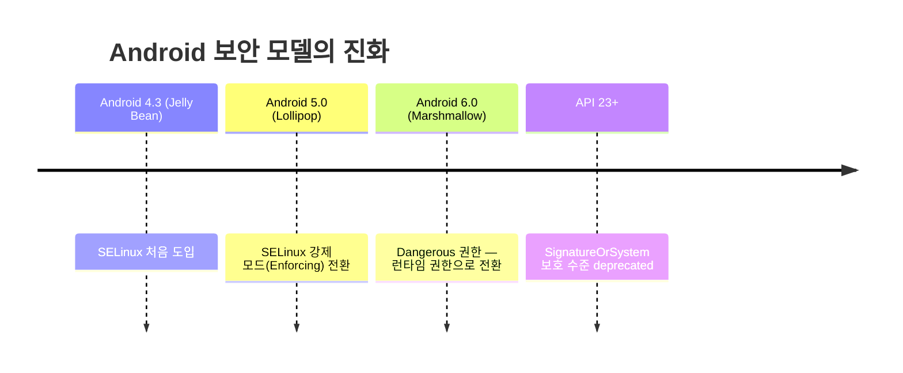
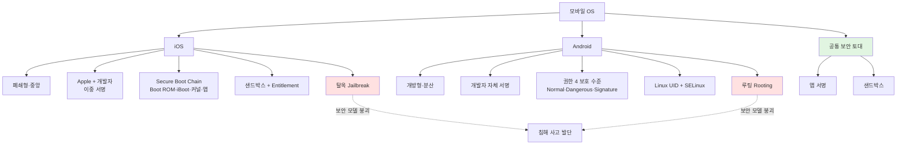
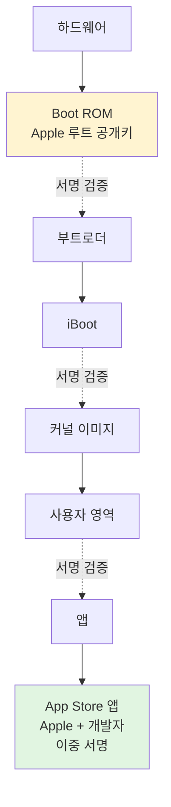
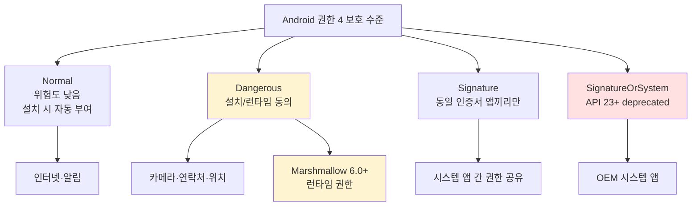
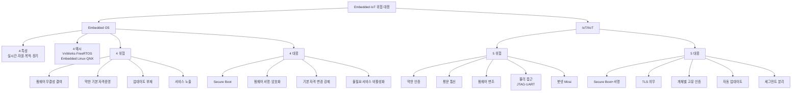

# 05. 모바일 OS — 만화책처럼 읽는 모바일·임베디드·IoT 보안

> **이 문서를 읽는 법**: 만화책 한 권을 펼쳤다고 생각하세요. *에피소드*를 따라 "왜 모바일은 다른가 → iOS 폐쇄형 → Android 개방형 → 임베디드 → IoT/IIoT" 의 흐름을 따라가면 자연스럽게 외워집니다.
> 정확한 정의·표준·버전 표기는 정확본을 참조: [[cs/information-security/01.system-security/05.mobile-os|정확본 05. 모바일 OS]]

> **연결 단원**: 본 단원은 [[cs/information-security/01.system-security/01.windows-basic|01·02 윈도우]] · [[cs/information-security/01.system-security/03.linux-basic|03·04 리눅스]] 와 *근본적으로 다른 모델*. 데스크톱·서버 OS = *관리자가 보안 설정을 적용*. 모바일 OS = *OS 가 자체적으로 강제하는 보안 모델*. 사용자·관리자가 *임의로 풀 수 없는 영역*이 더 많다.

---

## 🎯 시작 전에 — 이미 쓰고 있는 모바일 보안

| 매일 보는 것 | 사실은 이 단원의 |
|---|---|
| 앱 설치 시 권한 동의 | Android 권한 모델 (Normal·Dangerous·Signature) |
| 앱 사용 중 카메라 허용 묻는 팝업 | Android 6.0 런타임 권한 |
| App Store 앱만 설치 가능 | iOS 폐쇄형 + Apple 서명 |
| 탈옥·루팅된 폰의 위험 경고 | 코드 서명·샌드박스 우회 |
| IoT 카메라 기본 ID/PW 변경 권장 | Embedded OS 약한 기본 자격증명 |
| 공장 PLC 전용 네트워크 분리 | IIoT 세그먼트 분리 |

> **이 단원의 본질**: 시험은 *두 모델의 차이*와 *공통 보안 토대*를 묻는다. 두 토대 = **앱 서명 + 샌드박스**. 이 토대 우회 = iOS 의 **탈옥** / Android 의 **루팅** — *침해 사고의 가장 큰 발단*. 분량은 짧지만 *비교형 출제*가 많다.

---

## 📖 에피소드 1 — 모바일 OS 의 차별성: 두 모델 + 공통 토대

### 장면. 데스크톱과는 정반대

> 01~04 단원의 Windows · Linux 는 *관리자가 보안 설정을 직접 적용*하는 OS. 모바일 OS 는 *그 반대* — **OS 가 자체적으로 강제하는 보안 모델**이 보안 수준의 중심. 사용자·관리자가 *임의로 풀 수 없는 영역*이 더 많다.

### 두 모델 한 표

| 모델 | OS | 핵심 |
|---|---|---|
| **폐쇄형 / 중앙 관리** | **iOS** | Apple 이 앱·OS 모두 *서명·배포·검증* |
| **개방형 / 분산 관리** | **Android** | Google 이 *표준 제공*, 제조사·개발자가 *개별 서명* |

### 두 OS 공통 보안 토대

> 어떤 앱이든 실행되려면 *2 조건* 만족 필수:
> 1. **신뢰할 수 있는 주체가 서명**했는가
> 2. **다른 앱·시스템 영역과 격리**되어 있는가
>
> = **앱 서명 + 샌드박스**.

### 보안 모델 우회 행위

| OS | 우회 행위 | 결과 |
|---|---|---|
| **iOS** | **탈옥 (Jailbreak)** | 코드 서명 + 샌드박스 우회 → root 권한 |
| **Android** | **루팅 (Rooting)** | 동일 |

### 침해 사고의 가장 큰 발단

> *탈옥·루팅된 기기*. 보안 모델의 전제가 무너지므로 모든 후속 방어가 무력화.

### 시험 함정

- "모바일 OS 의 보안 중심?" → *OS 가 강제하는 보안 모델*
- "두 모델?" → 폐쇄형 (iOS) ↔ 개방형 (Android)
- "공통 보안 토대 2종?" → **앱 서명 + 샌드박스**
- "보안 모델 우회 = ?" → 탈옥 / 루팅

---

## 📖 에피소드 2 — iOS 개요: 폐쇄형 + 중앙집중식

### 장면. Apple 이 모든 것을 통제

> **iOS** = Apple 이 개발한 **폐쇄형 모바일 운영체제**. 보안성을 *최우선으로 설계*. Apple 이 철저히 관리하는 **중앙집중식 업데이트 + 앱 배포 체계**.

### iOS 핵심 원칙 2가지

| # | 원칙 |
|---|---|
| 1 | 보안 문제는 대부분 **탈옥(Jailbreak) 한 기기**에서 발생 |
| 2 | 모든 소프트웨어는 **Apple 암호화 로직의 서명된 방식**으로 *무결성 확인 후*에만 동작 |

### 폐쇄형의 장점

> Apple 이 *일괄 통제*하므로 *문제에 즉각 대응* 가능. 분산 관리 (Android) 의 *지연* 이 없음.

### 시험 함정

- "iOS 의 모델?" → **폐쇄형 + 중앙집중식**
- "iOS 보안 사고의 대부분?" → *탈옥된 기기*
- "iOS 에서 모든 SW 동작 조건?" → *Apple 서명 + 무결성 확인*

---

## 📖 에피소드 3 — iOS 보안 특징 3종

### 장면. 통합자료의 3 특징

| 특징 | 설명 |
|---|---|
| **시스템 소프트웨어 개인화** | 모든 SW 를 Apple 의 *아이튠즈를 통해 일괄 배포*. 문제에 즉각 대응 |
| **응용 프로그램 서명** | 모든 앱은 **Apple 서명 요구**. *코드 무결성*이 확인 안 되면 *설치 불가* |
| **샌드박스 활용** | *프로그램 간 데이터 통신 통제* |

### 외우는 방법

> **개인화 → 서명 → 샌드박스** — *배포 → 검증 → 격리* 의 순서.

### 시험 함정

- "iOS 보안 특징 3종?" → 시스템 SW 개인화 / 앱 서명 / 샌드박스
- "iOS 의 일괄 배포 채널?" → *아이튠즈*
- "코드 무결성 미확인 시?" → 설치 *불가*

---

## 📖 에피소드 4 — iOS Secure Boot Chain 4단계

### 장면. 부팅의 가장 깊은 곳에서

> iOS 는 **부팅에서 앱 실행에 이르는 모든 단계에서 코드 서명을 검증** ([Apple Platform Security] 근거). 신뢰의 *최상위 근원*은 **Boot ROM 에 내장된 Apple 루트 공개키** — *변경 불가 하드웨어 키*.

### 4단계 검증 체인

| 단계 | 검증 주체 |
|---|---|
| 1. **Boot ROM** | 하드웨어 내장 *Apple 루트 공개키* 로 *부트로더 서명 검증* |
| 2. **iBoot** | *커널 이미지*의 서명 검증 |
| 3. **커널** | *사용자 영역에서 실행되는 모든 바이너리·앱* 의 서명 검증 |
| 4. **앱 실행** | App Store 앱은 *Apple 서명* + *개발자 인증서* (이중 서명) |

### Secure Boot Chain — 핵심

> *변경할 수 없는 하드웨어 키*가 *최상위*. 부팅 단계부터 무결성 보장. = **Secure Boot Chain**.

### 4단계 외우는 방법

> *하드웨어 → 부트로더 → 커널 → 사용자 영역* 의 *위에서 아래로*. 각 단계가 *다음 단계의 서명을 검증*하는 *체인 구조*.

### 시험 함정

- "Secure Boot 의 신뢰 근원?" → **Boot ROM 에 내장된 Apple 루트 공개키**
- "체인 4단계?" → Boot ROM → iBoot → 커널 → 앱
- "App Store 앱의 서명?" → **Apple 서명 + 개발자 인증서** (이중)

---

## 📖 에피소드 5 — iOS 샌드박스 + Entitlement

### 장면. 컨테이너 안의 앱

> iOS 의 *모든 서드파티 앱*은 *자기만의 컨테이너 (샌드박스)* 에서 실행. 다른 앱의 *데이터 디렉터리 접근 불가*.

### 2 격리 원칙

| 원칙 | 의미 |
|---|---|
| **앱별 데이터 격리** | 다른 앱의 컨테이너에 *직접 접근 불가* |
| **시스템 자원 접근 제한** | 카메라·연락처·위치 등 *민감 자원*은 **사용자 동의 + Entitlement 필요** |

### Entitlement

> Apple 이 정의한 *권한 목록*. 시스템 자원 접근에 *명시적 권한 선언* 필수. 단순 사용자 동의만으로 부족 — *Entitlement 권한이 명시되어야* 한다.

### 보충 — Entitlement 의 정확한 의미

| 구분 | 설명 |
|------|------|
| **정체** | 앱이 특정 **권능(capability)** 을 쓸 수 있음을 **개발 단계에서 선언**하고, 그 선언이 **코드 서명(무결성)에 묶인** 메타데이터다. (용어상 *자격·권한 부여 목록* 으로 외운다.) |
| **위치** | Xcode·빌드 과정에서 **entitlements** 로 지정되며, 서명된 앱 번들에 포함된다. 시험에서는 *“Apple 이 정의한 권한 목록 + 서명과 결합”* 으로 이해하면 충분하다. |
| **민감 자원과의 관계** | 카메라·연락처 등은 **사용자 동의(TCC 등)** 와 **Entitlement 선언**이 함께 요구되는 경우가 많다 → 문서 표현 *“사용자 동의 + Entitlement”*. |

### 시험 함정

- "iOS 샌드박스 핵심?" → 앱별 *컨테이너 격리*
- "민감 자원 접근 조건?" → *사용자 동의 + Entitlement*
- "Entitlement 의 정체?" → Apple 정의 *권한 목록*
- "Entitlement 기술적 의미?" → *권능 선언 + 코드 서명에 포함* (시험 심화 대비)

---

## 📖 에피소드 6 — iOS 탈옥 (Jailbreak): 보안 모델 붕괴

### 장면. 전제가 무너진 후

> 탈옥 = **OS 의 코드 서명 검증과 샌드박스 격리를 우회**해 *root 권한 획득*. iOS 보안 모델의 전제 *2 조건 (코드 무결성 + 샌드박스)* 가 *동시에 무너진다*.

### 탈옥 후 노출되는 위험 3종

| 위험 | 결과 |
|---|---|
| 비공식(서명 ❌) 앱 설치 | **악성 코드 유입** |
| 시스템 영역 접근 | **키체인·암호화 키 유출** |
| 보안 패치 자동 업데이트 차단 가능 | 영구 취약 |

### 핵심 한 줄

> **탈옥 = 모든 후속 방어 무력화**. 사용자가 *의도적으로* 보안 모델을 깨뜨린 상태.

### 시험 함정

- "탈옥의 정의?" → 코드 서명 + 샌드박스 *우회*해 root 획득
- "탈옥 후 위험 3종?" → 악성 코드 / 키체인 유출 / 패치 차단
- "iOS 보안 모델의 전제 2종?" → 코드 무결성 + 샌드박스

---

## 📖 에피소드 7 — Android 개요 + 보안 특징 3종

### 장면. 오픈소스의 자유

> **Android** = Google 이 개발한 **오픈소스 기반 모바일 OS**. *다양한 제조사와 앱 개발자에게 개방*되어 *유연*. 핵심 위험: **루팅(Rooting) 을 통해 최상위 권한 획득 가능** — iOS 탈옥과 *동일한 위험*.

### Android 보안 특징 3종 — 통합자료

| 특징 | 설명 |
|---|---|
| **응용 프로그램 권한 관리** | 사용자 데이터 접근 시 *모든 사항을 응용 사양에 명시* + *접근 시 사용자 동의* |
| **응용 프로그램 서명** | 응용 프로그램의 **개발자가 서명** |
| **샌드박스 활용** | *상대적으로 자유로운* 형태의 어플리케이션 실행 가능 |

### iOS 와의 결정적 차이

> Android = **개발자가 서명** (Apple 검증 단계 *없음*). iOS = **Apple + 개발자 이중 서명**.

### 시험 함정

- "Android 의 모델?" → 오픈소스 + 분산 관리
- "Android 보안 특징 3종?" → 권한 관리 / 서명 / 샌드박스
- "Android 앱 서명 주체?" → **개발자**
- "iOS ↔ Android 서명 차이?" → 이중 (Apple+개발자) ↔ 단일 (개발자)

---

## 📖 에피소드 8 — Android 권한 4 보호 수준

### 장면. 앱이 요청, 사용자가 허용

> Android 권한 모델 = **앱이 요청하고, 사용자가 허용** ([Android Open Source Project] 근거). 권한은 *보호 수준 (Protection Level)* 별 분류.

### 4 보호 수준 한 표

| 보호 수준 | 의미 | 예시 |
|---|---|---|
| **Normal** | 위험도 낮음. *설치 시 자동 부여* | 인터넷 접속, 알림 |
| **Dangerous** | 사용자 데이터·자원에 영향. *설치 시 또는 런타임 동의 필요* | 카메라, 연락처, 위치 |
| **Signature** | *동일한 인증서로 서명된 앱끼리만* 부여 | 시스템 앱 간 권한 공유 |
| **SignatureOrSystem** (API 23+ deprecated) | 시스템 영역 또는 동일 서명 앱 | OEM 시스템 앱 |

### Marshmallow 의 변화

> **Android 6.0 (Marshmallow) 부터 Dangerous 권한이 런타임 (Runtime) 권한**으로 전환. 사용자가 *앱 사용 중*에 허용·거부 가능. 그 전에는 *설치 시 일괄 동의*였다.

### 외우는 방법

> *Normal → Dangerous → Signature* 의 *위험도 순서*. **Signature 는 같은 개발자만**이 핵심. **Marshmallow = 6.0 = 런타임 권한**.

### 시험 함정

- "Android 권한 4 보호 수준?" → Normal / Dangerous / Signature / SignatureOrSystem
- "사용자 동의 필요?" → **Dangerous**
- "동일 개발자 앱끼리만?" → **Signature**
- "런타임 권한 도입 버전?" → **Android 6.0 (Marshmallow)**
- "deprecated 된 보호 수준?" → **SignatureOrSystem** (API 23+)

---

## 📖 에피소드 9 — Android 앱 서명 + Play App Signing

### 장면. 개발자 자체 인증서로 서명

> iOS 와 달리 Android 는 **개발자 자체 인증서로 앱 서명** (Apple 검증 단계 *없음*).

### 서명의 효과

| 효과 | 의미 |
|---|---|
| **앱 가로채기 방지** | 동일 패키지명 앱 업데이트 시 **이전 버전과 동일한 서명** 필요 → *다른 개발자가 임의로 가로챌 수 없다* |
| **출처 인증** | 앱이 *동일 개발자에게서* 왔음을 증명 |

### Google Play 의 두 옵션

| 옵션 | 설명 |
|---|---|
| **Play App Signing** | **Google 이 마스터 키 보관** |
| **개발자 자체 키** | 개발자가 키를 직접 관리 |

### 시험 함정

- "Android 앱 서명 주체?" → **개발자**
- "동일 패키지 업데이트?" → *이전 서명과 동일* 필수
- "Play App Signing 의 키 관리?" → **Google 이 마스터 키 보관**

---

## 📖 에피소드 10 — Android 샌드박스: Linux UID + SELinux

### 장면. Linux 의 권한 위에 SELinux 를 얹다

> Android 의 앱 격리 = **Linux 의 UID 기반 권한 모델 위에 구축**.

> **Q. 안드로이드에도 샌드박스가 있나?** → **있다.** 에피소드 1 의 공통 토대(**앱 서명 + 샌드박스**) 와 에피소드 7 표의 *“샌드박스 활용”* 이 바로 그것이다. iOS 가 *컨테이너 모델* 이라면, Android 는 **Linux 다 사용자(UID) 격리 + SELinux(MAC)** 로 같은 *앱 간 격리* 를 구현한다.

### Linux UID 기반 격리

| 단계 | 동작 |
|---|---|
| 1 | 각 앱은 설치 시 **고유 UID 할당** |
| 2 | 앱은 *자기 UID 로 실행* |
| 3 | 다른 UID 의 *파일에 직접 접근 불가* |

### SELinux 의 진화 — 두 버전

| 버전 | 변화 |
|---|---|
| **Android 4.3 (Jelly Bean)** | SELinux **처음 도입** |
| **Android 5.0 (Lollipop)** | **모든 도메인이 강제 모드 (Enforcing) 로 전환** |

### 결과

> UID 기반 격리 *위에* 추가로 **MAC (강제적 접근통제)** 정책 작동. *2 층 방어*.

### iOS 샌드박스와의 차이

> iOS = *iOS 자체 컨테이너 모델* / Android = **Linux UID + SELinux**. *기반 운영체제의 차이*.

### 시험 함정

- "Android 샌드박스 토대?" → **Linux UID + SELinux**
- "각 앱은 어떻게 격리?" → *고유 UID 할당*
- "SELinux 도입 버전?" → **Android 4.3 (Jelly Bean)**
- "강제 모드 전환 버전?" → **Android 5.0 (Lollipop)**
- "SELinux 가 작동시키는 정책?" → MAC (강제적 접근통제)

---

## 📖 에피소드 11 — Android 루팅 + iOS vs Android 종합 비교

### 장면. 루팅의 위험 3종

> 루팅 = Android 의 *root 권한 획득* 행위. iOS 탈옥과 *동일한 위험*.

| 위험 | 결과 |
|---|---|
| 다른 앱 데이터 디렉터리 접근 가능 | **인증 토큰·결제 정보 유출** |
| 시스템 영역 변조 가능 | **부트로더·커널 무결성 우회** |
| 보안 패치 적용 거부·지연 가능 | 영구 취약 |

### iOS vs Android 종합 비교 — 7 항목

| 비교 항목 | **iOS** | **Android** |
|---|---|---|
| **개발 주체** | Apple | Google (오픈소스) |
| **배포 체계** | 폐쇄형 (App Store 전용) | 개방형 (Google Play + *사이드로딩 가능*) |
| **앱 서명 주체** | **Apple + 개발자 (이중 서명)** | **개발자 (단일 서명)** |
| **권한 부여 시점** | 사용자 동의 + Entitlement | 설치 시 또는 런타임 (Marshmallow 이후) |
| **샌드박스 토대** | iOS 자체 컨테이너 | **Linux UID + SELinux** |
| **최상위 권한 우회** | **탈옥 (Jailbreak)** | **루팅 (Rooting)** |
| **업데이트 통제** | Apple 일괄 (*즉각 대응*) | 제조사·통신사 분산 (*지연 가능*) |

### 보충 — 사이드 로딩 (Side loading)

| 항목 | 설명 |
|------|------|
| **정의** | **공식 앱 마켓(예: Google Play)이 아닌 경로**로 앱 패키지(대표적으로 **APK**)를 받아 **설치**하는 것. 브라우저·메신저·USB·ADB·기업용 MDM 등이 경로가 될 수 있다. |
| **왜 Android 에서 가능한가** | **개방형·분산 모델**: Google 이 AOSP 로 **스토어 외 설치** 가능한 OS 구조를 허용하고, 제조사·사용자가 *“출처를 알 수 없는 앱 설치”* 를 기기 설정에서 허용할 수 있다(버전·제조사별 UI·정책 차이). iOS 는 **폐쇄형** 이라 일반 사용자는 App Store 외 대량 배포 설치가 사실상 제한된다. |
| **보안 함의** | 서명 검증은 하더라도 **스토어 심사·평판·Google Play Protect** 와 분리된 경로이므로 **악성·변조 APK** 유입 위험이 커진다 — 시험에서는 *“개방형 = 사이드 로딩 가능”* 과 짝으로 외운다. |

### 가장 본질적 차이

> **폐쇄형/중앙 vs 개방형/분산**. 이 한 줄이 *나머지 6 항목을 결정*.

### 공통점 한 줄

> 두 OS 모두 **앱 서명 + 샌드박스**가 보안 토대 / **최상위 권한 획득 = 보안 모델 무력화**.

### 시험 함정

- "두 OS 의 가장 본질적 차이?" → **폐쇄형/중앙 vs 개방형/분산**
- "두 OS 공통 보안 토대?" → 앱 서명 + 샌드박스
- "두 OS 공통 위험?" → 최상위 권한 획득 (탈옥/루팅)
- "사이드로딩 가능?" → **Android** 만
- "사이드 로딩 정의?" → *스토어 외*(APK 등) **앱 설치**
- "이중 서명?" → **iOS** (Apple + 개발자)

---

## 📖 에피소드 12 — Embedded OS: 4 특성 + 4 위협 + 4 대응

### 장면. 공장·차량·라우터 안의 OS

> **Embedded OS** = 임베디드 기기 (공장 제어기·의료기기·차량·라우터·가전) 에서 동작하는 OS. 데스크톱·서버 OS 와 다른 *4 특성*.

### Embedded OS 4 특성

| 특성 | 의미 |
|---|---|
| **실시간성** | 정해진 시간 안에 응답 (**RTOS, Real-Time OS**) |
| **자원 제약** | 메모리·CPU·전력이 *제한적* |
| **단일 목적** | *특정 기능 전용*. 범용 응용 실행 ❌ |
| **장기 운영** | 한 번 설치되면 *수년~수십 년 무중단* |

### 대표 예시 4종

> **VxWorks · FreeRTOS · Embedded Linux · QNX**

### 보안 위협 4종

| 위협 | 설명 |
|---|---|
| **펌웨어 무결성 결여** | 부팅 시 펌웨어 *서명 검증 없음* → 변조 펌웨어 실행 가능 |
| **약한 기본 자격증명** | 출하 시 기본 ID/PW (`admin/admin`) 가 변경되지 않음 |
| **업데이트 부재** | 보안 패치 미제공 또는 미적용 |
| **서비스 노출** | 진단·관리 포트 (텔넷·SNMP) 가 *외부에 그대로 노출* |

### 대응 원칙 4종 (NIST 권고)

| 원칙 | 적용 |
|---|---|
| **Secure Boot** | 부트로더 → 커널 → 응용까지 *서명 검증 체인* |
| **펌웨어 서명·암호화** | 업데이트 펌웨어에 *디지털 서명 + 무결성 검증* |
| **기본 자격증명 변경 강제** | *최초 부팅 시* 기본 ID/PW 변경 강제 |
| **불필요 서비스 비활성화** | [[cs/information-security/01.system-security/04.linux-management|04 §4]] 의 서비스 관리 원칙 동일 |

### 외우는 방법 — 특성·위협·대응의 대응 관계

> *자원 제약·단일 목적 → 약한 기본 자격증명 + 서비스 노출* / *장기 운영 → 업데이트 부재* / *대응 4종은 위협 4종에 1:1*.

### 시험 함정

- "Embedded OS 4 특성?" → 실시간성 / 자원 제약 / 단일 목적 / 장기 운영
- "RTOS 의 의미?" → Real-Time OS
- "대표 예시 4종?" → VxWorks · FreeRTOS · Embedded Linux · QNX
- "Embedded 위협 4종?" → 펌웨어 무결성 / 약한 자격 / 업데이트 부재 / 서비스 노출
- "최초 부팅 시 강제 작업?" → *기본 ID/PW 변경*
- "Secure Boot 의 의미?" → 부트로더~응용 *서명 검증 체인*

---

## 📖 에피소드 13 — IoT/IIoT: 위협 5종 + 대응 5종

### 장면. IoT vs IIoT

| 구분 | 정의 |
|---|---|
| **IoT** (Internet of Things) | 인터넷에 연결된 *일반 사물* — 스마트 가전·웨어러블·홈 카메라 |
| **IIoT** (Industrial IoT) | *산업 환경의 IoT* — 공장 자동화 PLC·센서·제어기 |

### Embedded OS 와의 관계

> 두 영역 모두 **OS 가 임베디드 OS인 경우가 많다** → §12 의 위협 *그대로 상속*.

### IoT 단말 보안 위협 5종 (KISA IoT 보안 가이드)

| 위협 | 설명 |
|---|---|
| **약한 인증** | 기본 ID/PW, 추측 가능한 인증 정보 |
| **암호화 부재 통신** | HTTP·Telnet 등 *평문 프로토콜* |
| **펌웨어 변조** | *서명 없는* 펌웨어 업데이트 경로 |
| **물리적 접근** | 단말이 외부 노출 → *디버그 포트 (JTAG·UART)* 직접 접근 |
| **봇넷 가담** | 침해된 IoT 단말이 **봇넷(Botnet)** 의 **좀비(bot)** 로 편입되어, 공격자·C&C 의 명령으로 **대량 DDoS** 등에 **릴레이** 되는 상태 ([[cs/information-security/02.network-security/05.dos-ddos-drdos|02 단원 05]] 의 *봇넷·C&C* 와 같은 개념). |

### Mirai

> 침해된 IoT 기기로 구성된 *봇넷*의 대표 사례. *기본 자격증명* 으로 침투해 DDoS 공격에 활용.

### 보충 — 봇넷 가담 한 줄 정리

> **침해 → 원격 제어 악성코드/펌웨어 백도어 설치 → C&C 에 연결 → 수만 대 단말이 동시에 트래픽 발생**(DDoS 등). IoT 는 **패치 지연·약한 기본 비밀번호** 때문에 **봇넷 노드** 로 쓰이기 쉽다는 점이 기출 포인트다.

### IoT 대응 원칙 5종

| 원칙 | 적용 |
|---|---|
| **Secure Boot · 펌웨어 서명** | §12-3 동일 |
| **TLS 통신 의무화** | *단말 ↔ 서버 통신 평문 금지* |
| **개체별 고유 인증** | 단말마다 *고유 키·인증서* (공장 출하 시 주입) |
| **취약점 공시·자동 업데이트** | 제조사 패치 배포 + 단말 자동 적용 |
| **세그먼트 분리** | IoT/IIoT 트래픽을 *일반 사용자 네트워크와 격리* |

### 외우는 방법 — 위협·대응 5:5 매핑

> 약한 인증 → *고유 인증* / 평문 → *TLS* / 펌웨어 변조 → *서명* / 물리적 접근 → *세그먼트 분리* / 봇넷 → *자동 업데이트*.

### 시험 함정

- "IoT vs IIoT 차이?" → 산업 환경 여부
- "IoT 위협 5종?" → 약한 인증 / 평문 통신 / 펌웨어 변조 / 물리 접근 / 봇넷 가담
- "디버그 포트 2종?" → **JTAG · UART**
- "DDoS 봇넷 대표?" → **Mirai**
- "봇넷 가담 의미?" → *침해 단말이 봇넷 노드로 편입·C&C 명령에 따름* (DDoS 등)
- "IoT + OSI/TCP 4계층 같이?" → **`02.network-fundamentals` 01** (본 05 아님)
- "IoT 대응 5종?" → Secure Boot+서명 / TLS / 개체별 고유 인증 / 자동 업데이트 / 세그먼트 분리
- "단말 ↔ 서버 통신 의무?" → **TLS** (평문 금지)

---

## 📑 모바일·임베디드·IoT 종합 비교 (에피소드 1~13 정리)

시험 직전 *한눈에* 보는 view.

| 영역 | 핵심 |
|---|---|
| **두 모델** | 폐쇄형 (iOS·Apple 중앙) ↔ 개방형 (Android·Google 분산) |
| **공통 보안 토대** | **앱 서명 + 샌드박스** |
| **보안 모델 우회** | iOS *탈옥 (Jailbreak)* / Android *루팅 (Rooting)* |
| **iOS 보안 특징 3** | 시스템 SW 개인화 / 앱 서명 / 샌드박스 |
| **iOS Secure Boot 4단계** | Boot ROM (Apple 루트 공개키) → iBoot → 커널 → 앱 |
| **iOS 샌드박스** | 컨테이너 격리 + **Entitlement** |
| **Android 보안 특징 3** | 권한 관리 / 앱 서명 / 샌드박스 |
| **Android 권한 4** | Normal / **Dangerous** / Signature / SignatureOrSystem |
| **런타임 권한** | **Android 6.0 (Marshmallow)** 이후 |
| **Android 서명** | 개발자 자체 + Play App Signing (Google 마스터 키) |
| **Android 샌드박스** | Linux UID + **SELinux** (4.3 도입 / 5.0 강제 모드) |
| **iOS vs Android** | 폐쇄형/중앙 ↔ 개방형/분산 + 이중 서명 ↔ 단일 서명 |
| **Embedded 4 특성** | 실시간성 (RTOS) / 자원 제약 / 단일 목적 / 장기 운영 |
| **Embedded 예시** | VxWorks / FreeRTOS / Embedded Linux / QNX |
| **Embedded 위협 4** | 펌웨어 무결성 / 약한 자격 / 업데이트 부재 / 서비스 노출 |
| **Embedded 대응 4** | Secure Boot / 펌웨어 서명 / 기본 자격 변경 강제 / 서비스 비활성화 |
| **IoT/IIoT 위협 5** | 약한 인증 / 평문 통신 / 펌웨어 변조 / 물리 접근 (JTAG·UART) / 봇넷 (Mirai) |
| **IoT 대응 5** | Secure Boot+서명 / TLS / 고유 인증 / 자동 업데이트 / 세그먼트 분리 |

---

## 🗺️ 마인드맵 1 — 모바일 OS 시간선 (Android 버전 진화)



**읽는 법**: Android 의 *3 버전 변곡점*이 시험 직출. *4.3 도입 / 5.0 강제 / 6.0 런타임*.

---

## 🗺️ 마인드맵 2 — iOS vs Android 분류 트리



**읽는 법**: 빨강 = *보안 모델 우회 행위* / 녹색 = *공통 토대*.

---

## 🗺️ 마인드맵 3 — iOS Secure Boot Chain



**읽는 법**: 노랑 = *변경 불가 신뢰 근원* / 녹색 = *최종 실행 단위*. 화살표는 *서명 검증의 방향*.

---

## 🗺️ 마인드맵 4 — Android 권한 4 보호 수준



**읽는 법**: 노랑 = *런타임 권한 (Marshmallow 시험 1순위)* / 빨강 = *deprecated*.

---

## 🗺️ 마인드맵 5 — Embedded·IoT 위협·대응 매핑



---

## 🗂️ 키워드 클러스터

### 두 모델

```
폐쇄형 / 중앙 관리 — iOS  (Apple 일괄 서명·배포·검증)
개방형 / 분산 관리 — Android (Google 표준, 제조사·개발자 개별 서명)

공통 보안 토대 : 앱 서명 + 샌드박스
보안 모델 우회 : 탈옥 (Jailbreak) · 루팅 (Rooting)
```

### iOS

```
보안 특징 3 : 시스템 SW 개인화 (아이튠즈 일괄 배포)
              · 응용 프로그램 서명 (Apple 서명)
              · 샌드박스 활용

Secure Boot Chain (4단계):
  Boot ROM (Apple 루트 공개키)
   → iBoot → 커널 → 앱
   App Store 앱 = Apple + 개발자 이중 서명

샌드박스 : 컨테이너 격리 + Entitlement
탈옥 위험 : 악성 코드 / 키체인·암호화 키 유출 / 패치 차단
```

### Android

```
보안 특징 3 : 권한 관리 + 앱 서명 + 샌드박스

권한 4 보호 수준:
  Normal              — 자동 부여 (인터넷·알림)
  Dangerous           — 설치/런타임 동의 (카메라·연락처·위치)
  Signature           — 동일 인증서 앱끼리만
  SignatureOrSystem   — API 23+ deprecated

런타임 권한 : Android 6.0 (Marshmallow) 이후
앱 서명     : 개발자 자체 + Play App Signing (Google 마스터 키)
샌드박스    : Linux UID + SELinux
SELinux     : 4.3 (Jelly Bean) 도입 → 5.0 (Lollipop) 강제 모드
루팅 위험   : 인증 토큰·결제 정보 / 부트로더 변조 / 패치 거부
```

### iOS vs Android 7 비교 항목

```
                iOS                          Android
개발 주체       Apple                        Google (오픈소스)
배포 체계       폐쇄형 App Store             개방형 Google Play (사이드로딩 가능)
앱 서명         Apple + 개발자 (이중)        개발자 (단일)
권한 부여 시점  Entitlement + 사용자 동의    설치 / 런타임 (Marshmallow+)
샌드박스 토대   iOS 자체 컨테이너            Linux UID + SELinux
최상위 권한 우회 탈옥 Jailbreak               루팅 Rooting
업데이트 통제   Apple 일괄 (즉각 대응)       제조사·통신사 분산 (지연 가능)
```

### Embedded OS

```
4 특성   : 실시간성 (RTOS) · 자원 제약 · 단일 목적 · 장기 운영
4 예시   : VxWorks · FreeRTOS · Embedded Linux · QNX
4 위협   : 펌웨어 무결성 / 약한 기본 자격 / 업데이트 부재 / 서비스 노출
4 대응   : Secure Boot / 펌웨어 서명·암호화 / 기본 자격 변경 강제 / 불필요 서비스 비활성화
```

### IoT / IIoT

```
구분 : IoT (일반 사물)  ↔  IIoT (산업 환경 — PLC·센서·제어기)

5 위협 :
  약한 인증 (기본 ID/PW)
  암호화 부재 통신 (HTTP·Telnet 평문)
  펌웨어 변조 (서명 없는 업데이트)
  물리적 접근 (JTAG·UART 디버그 포트)
  봇넷 가담 (DDoS — Mirai 류)

5 대응 :
  Secure Boot · 펌웨어 서명
  TLS 의무 (평문 금지)
  개체별 고유 인증 (공장 출하 시 키 주입)
  취약점 공시·자동 업데이트
  세그먼트 분리 (IoT/IIoT ↔ 사용자 네트워크)
```

### 헷갈리는 짝 (시험 1순위)

| 짝 | 차이 |
|---|---|
| **iOS ↔ Android** | 폐쇄/중앙 ↔ 개방/분산 |
| **탈옥 ↔ 루팅** | 같은 위험 (보안 모델 붕괴), OS 만 다름 |
| **이중 서명 ↔ 단일 서명** | iOS Apple+개발자 ↔ Android 개발자만 |
| **Normal ↔ Dangerous ↔ Signature** | 자동 ↔ 동의 ↔ 동일 서명 |
| **Marshmallow 6.0 ↔ 그 이전** | 런타임 권한 ↔ 설치 시 일괄 |
| **Jelly Bean 4.3 ↔ Lollipop 5.0** | SELinux 도입 ↔ 강제 모드 |
| **iOS 컨테이너 ↔ Android UID** | iOS 자체 ↔ Linux UID + SELinux |
| **Boot ROM ↔ iBoot ↔ 커널 ↔ 앱** | Secure Boot Chain 4단계 |
| **IoT ↔ IIoT** | 일반 사물 ↔ 산업 환경 |
| **JTAG ↔ UART** | 디버그 포트 2종 (물리 접근) |
| **VxWorks·FreeRTOS·QNX** | Embedded OS 대표 예시 |

---

## 🃏 회상 30문항

> 답을 가린 뒤 자가 채점.

**A. 모델·iOS (1~6)**
1. 모바일 OS 의 두 모델은?
2. 두 OS 의 공통 보안 토대 2종은?
3. iOS 의 모델과 핵심 원칙 2가지는?
4. iOS 보안 특징 3종은?
5. iOS Secure Boot Chain 4단계는?
6. iOS 샌드박스의 시스템 자원 접근 조건은?

**B. iOS 탈옥·Android 개요 (7~12)**
7. 탈옥의 정의와 위험 3종은?
8. iOS 보안 모델의 전제 2 조건은?
9. Android 의 모델과 보안 특징 3종은?
10. iOS ↔ Android 앱 서명 차이는?
11. Android 권한 4 보호 수준은?
12. Marshmallow 의 의미와 버전은?

**C. Android 권한·서명·샌드박스 (13~18)**
13. Dangerous 권한 예시는?
14. Signature 의 의미는?
15. Android 앱 서명 — 동일 패키지 업데이트 조건은?
16. Play App Signing 의 키 관리 주체는?
17. Android 샌드박스 토대는?
18. SELinux 도입·강제 모드 버전은?

**D. 비교·Embedded (19~24)**
19. iOS ↔ Android 비교 7 항목은?
20. 두 OS 의 가장 본질적 차이는?
21. Embedded OS 4 특성은?
22. RTOS 의 의미는?
23. Embedded OS 대표 예시 4종은?
24. Embedded OS 위협 4종은?

**E. IoT/IIoT (25~30)**
25. IoT vs IIoT 의 차이는?
26. IoT 위협 5종은?
27. 디버그 포트 2종은?
28. DDoS 봇넷 대표 사례는?
29. IoT 대응 5종은?
30. 단말 ↔ 서버 통신 의무는?

---

## ⚠️ 시험 함정 모음

| 함정 | 정답 |
|---|---|
| 두 모델? | 폐쇄형 (iOS) / 개방형 (Android) |
| 공통 보안 토대? | **앱 서명 + 샌드박스** |
| 보안 모델 우회? | iOS 탈옥 / Android 루팅 |
| iOS 핵심 원칙 2종? | 탈옥 시 위험 + Apple 서명 무결성 |
| iOS 보안 특징 3종? | 시스템 SW 개인화 · 앱 서명 · 샌드박스 |
| iOS Secure Boot 1단계? | **Boot ROM (Apple 루트 공개키)** |
| Secure Boot 4단계 순서? | Boot ROM → iBoot → 커널 → 앱 |
| App Store 앱 서명 주체? | **Apple + 개발자 (이중)** |
| iOS 샌드박스 권한? | **Entitlement** + 사용자 동의 |
| Entitlement 정체? | Apple 정의 **권능(capability) 선언** + **코드 서명에 포함** |
| 탈옥의 정의? | 코드 서명 + 샌드박스 *우회* |
| iOS 보안 전제 2 조건? | 코드 무결성 + 샌드박스 |
| Android 모델? | 오픈소스 + 분산 관리 |
| Android 앱 서명 주체? | **개발자** (단일) |
| Android 권한 4 보호 수준? | Normal / Dangerous / Signature / SignatureOrSystem |
| 사용자 동의 필요 권한? | **Dangerous** |
| 동일 개발자 앱끼리만? | **Signature** |
| 런타임 권한 도입 버전? | **Android 6.0 (Marshmallow)** |
| deprecated 보호 수준? | **SignatureOrSystem** (API 23+) |
| 동일 패키지 업데이트 조건? | *이전 버전과 동일 서명* |
| Play App Signing 키 관리? | **Google** (마스터 키) |
| Android 샌드박스 토대? | **Linux UID + SELinux** |
| SELinux 도입 버전? | **Android 4.3 (Jelly Bean)** |
| SELinux 강제 모드 버전? | **Android 5.0 (Lollipop)** |
| SELinux 정책? | MAC (강제적 접근통제) |
| 본질적 차이? | 폐쇄형/중앙 vs 개방형/분산 |
| 사이드 로딩? | **스토어 외 경로**(APK 등)로 앱 설치 |
| 사이드로딩 가능 OS? | **Android** |
| Embedded OS 4 특성? | 실시간성·자원 제약·단일 목적·장기 운영 |
| RTOS 풀이? | Real-Time OS |
| Embedded OS 4 예시? | VxWorks · FreeRTOS · Embedded Linux · QNX |
| Embedded 위협 4종? | 펌웨어 무결성 / 약한 기본 자격 / 업데이트 부재 / 서비스 노출 |
| Embedded 대응 4종? | Secure Boot / 펌웨어 서명 / 기본 자격 변경 강제 / 불필요 서비스 비활성화 |
| IoT vs IIoT? | 일반 사물 ↔ 산업 환경 |
| IoT 위협 5종? | 약한 인증 / 평문 통신 / 펌웨어 변조 / 물리 접근 / 봇넷 |
| 디버그 포트 2종? | **JTAG · UART** |
| DDoS 봇넷 대표? | **Mirai** |
| 봇넷 가담? | 침해 단말이 **봇넷 노드**로 편입·**C&C** 가 DDoS 등 명령 |
| IoT 대응 5종? | Secure Boot+서명 / TLS / 고유 인증 / 자동 업데이트 / 세그먼트 분리 |
| 단말 ↔ 서버 통신? | **TLS** 의무 (평문 금지) |
| 개체별 고유 인증? | 단말마다 *고유 키·인증서* (공장 출하) |

---

## 🔗 정확본 매핑표

| 본 노트 에피소드 | 정확본 § |
|---|---|
| 에피소드 1 (모델·공통 토대) | [[cs/information-security/01.system-security/05.mobile-os#0. 들어가며 — 모바일 OS 가 다른 단원과 다른 점\|정확본 §0]] |
| 에피소드 2 (iOS 개요) | [[cs/information-security/01.system-security/05.mobile-os#1-1. 개요\|정확본 §1-1]] |
| 에피소드 3 (iOS 보안 특징 3종) | [[cs/information-security/01.system-security/05.mobile-os#1-2. iOS 보안 특징 (통합자료)\|정확본 §1-2]] |
| 에피소드 4 (Secure Boot Chain) | [[cs/information-security/01.system-security/05.mobile-os#1-3. 코드 서명과 무결성 (외부 보강)\|정확본 §1-3]] |
| 에피소드 5 (iOS 샌드박스) | [[cs/information-security/01.system-security/05.mobile-os#1-4. 샌드박스 (외부 보강)\|정확본 §1-4]] |
| 에피소드 6 (탈옥) | [[cs/information-security/01.system-security/05.mobile-os#1-5. 탈옥(Jailbreak)\|정확본 §1-5]] |
| 에피소드 7 (Android 개요·특징) | [[cs/information-security/01.system-security/05.mobile-os#2-1. 개요\|정확본 §2-1·§2-2]] |
| 에피소드 8 (권한 4 보호 수준) | [[cs/information-security/01.system-security/05.mobile-os#2-3. 권한 모델 (외부 보강)\|정확본 §2-3]] |
| 에피소드 9 (Android 앱 서명) | [[cs/information-security/01.system-security/05.mobile-os#2-4. 앱 서명 (외부 보강)\|정확본 §2-4]] |
| 에피소드 10 (Linux UID·SELinux) | [[cs/information-security/01.system-security/05.mobile-os#2-5. 샌드박스 — Linux 권한 기반 (외부 보강)\|정확본 §2-5]] |
| 에피소드 11 (루팅·종합 비교) | [[cs/information-security/01.system-security/05.mobile-os#2-6. 루팅(Rooting)\|정확본 §2-6·§3]] |
| 에피소드 12 (Embedded OS) | [[cs/information-security/01.system-security/05.mobile-os#4. Embedded OS (외부 보강)\|정확본 §4]] |
| 에피소드 13 (IoT/IIoT) | [[cs/information-security/01.system-security/05.mobile-os#5. IoT / IIoT 단말 보안 (외부 보강)\|정확본 §5]] |

---

## 📅 학습 흐름

```
[1주]   에피소드 1·2·3 (모델·iOS 개요·보안 특징) — 마인드맵 2
[2주]   에피소드 4·5·6 (Secure Boot·샌드박스·탈옥) — 마인드맵 3
[3주]   에피소드 7·8 (Android 개요·권한 4 보호 수준) — 마인드맵 4
[4주]   에피소드 9·10·11 (서명·Linux UID+SELinux·종합 비교) — Android 버전 표
[5주]   에피소드 12 (Embedded OS) — 마인드맵 5
[6주]   에피소드 13 (IoT/IIoT) — 5:5 위협·대응 매핑
[7주]   회상 30문항 → 틀린 것만 정확본 깊이 학습
[8주]   함정 모음 매일 1회 + 정확본 1회 정독
```

---

> **다음 단원**: [[cs/information-security/01.system-security/06.system-attacks|06. 시스템 공격기법]] — 이제 *공격자의 관점*. BoF·레이스 컨디션·포맷 스트링 등 *시스템 보안위협 + 공격기법*. 본 단원의 *탈옥·루팅·물리 접근* 같은 *보안 모델 우회 패턴*이 06 의 *권한 상승 공격*에 다시 등장.
