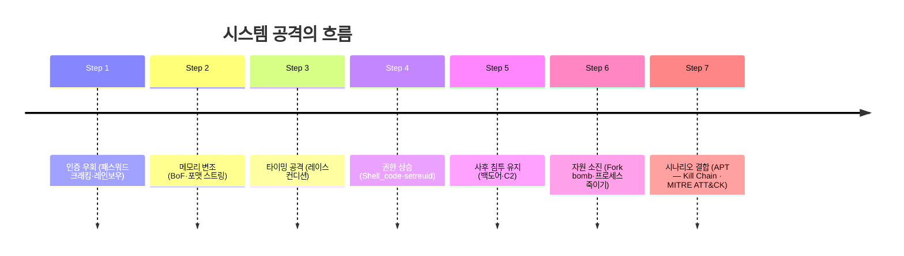
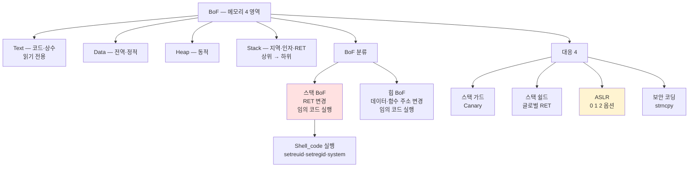
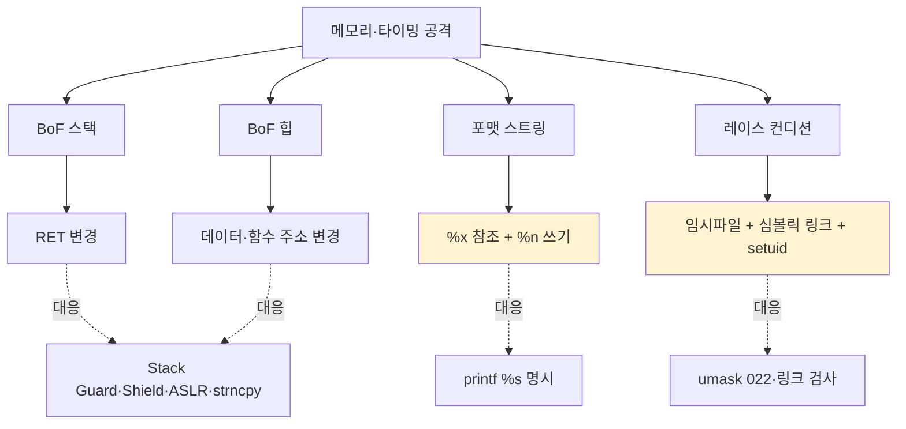
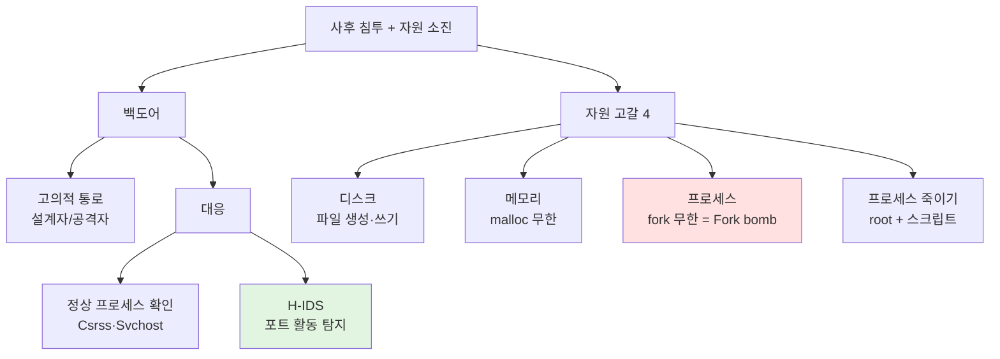
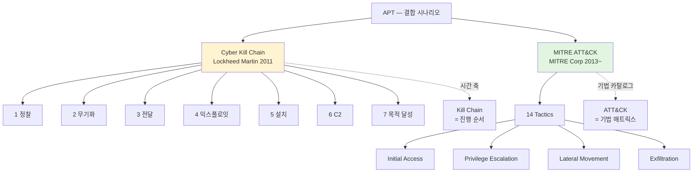

# 06. 시스템 공격기법 — 만화책처럼 읽는 공격자의 도구 상자

> **이 문서를 읽는 법**: 만화책 한 권을 펼쳤다고 생각하세요. *에피소드*를 따라 "공격자가 어디를 노리는가 → 어떤 메커니즘으로 뚫는가 → 어떻게 막는가" 를 따라가면 자연스럽게 외워집니다.
> 정확한 정의·옵션·수치는 정확본을 참조: [[cs/information-security/01.system-security/06.system-attacks|정확본 06. 시스템 공격기법]]

> **연결 단원**: 본 단원은 [[cs/information-security/01.system-security/01.windows-basic|01·02 윈도우]] · [[cs/information-security/01.system-security/03.linux-basic|03·04 리눅스]] 의 *구조의 약점*을 노린다. 레이스 컨디션의 **umask 022** 권장은 03 §5 와 직결, 백도어 탐지의 **포트 활동 점검**은 04 §4 의 서비스 관리에 기반.

---

## 🎯 시작 전에 — 이미 들어본 공격 이름들


| 매일 듣는 것           | 사실은 이 단원의                  |
| ----------------- | -------------------------- |
| 패스워드 무차별 공격       | 사전 / 무차별 / 혼합 / 레인보우 테이블   |
| `printf` 위험 코드 경고 | 포맷 스트링 공격 (`%n`)           |
| 스택 오버플로우          | BoF — RET 변경               |
| `fork bomb`       | 가용 프로세스 자원 고갈              |
| ASLR 활성화          | BoF 대응 (메모리 주소 난수화)        |
| 침해사고 보고서의 "APT"   | 장기·은밀·표적 시나리오              |
| MITRE ATT&CK 매트릭스 | 14 Tactics × 수백 Techniques |


> **이 단원의 본질**: 시스템 공격은 *5 갈래* (인증·메모리·타이밍·사후 침투·자원) 로 분류. 각 공격은 *정의·메커니즘·대응*의 *3 축*으로 시험에 나온다. APT 시나리오는 단일 기법이 아닌 *시간 축으로 결합된 위협*. 자격증 1과목에서 **03·04 와 함께 출제 비중 가장 높음**.

---

## 📖 에피소드 1 — 시스템 공격 5 갈래

### 장면. 어디를 노리는가

> 01~04 단원이 시스템의 *구조와 보안 설정*을 다뤘다면, 이 단원은 *그 구조의 약점*을 노린다.

### 5 갈래 한 표


| 갈래           | 노리는 약점          | 대표 공격                    |
| ------------ | --------------- | ------------------------ |
| **인증 우회**    | 약한 패스워드·해시      | 패스워드 크래킹·레인보우 테이블        |
| **메모리 변조**   | 입력 검증 부재·버퍼 경계  | 버퍼 오버플로우 (스택·힙) · 포맷 스트링 |
| **타이밍 공격**   | 임시 파일·심볼릭 링크 처리 | 레이스 컨디션                  |
| **사후 침투 유지** | 미관리 통로·포트       | 백도어                      |
| **자원 소진**    | 디스크·메모리·프로세스 한계 | 시스템 자원 고갈                |


### 단독 사용 vs APT 결합

> 갈래들은 *단독 사용*도 가능하지만, 실제 침해사고에서는 **APT (Advanced Persistent Threat)** 시나리오 안에서 *단계적으로 결합*. §13 에서 MITRE ATT&CK 매트릭스로 정리.

### 대응이 03·04 의 보안 설정과 직결


| 본 단원 공격                 | 03·04 의 대응 기반 |
| ----------------------- | -------------- |
| 레이스 컨디션 → **umask 022** | [[cs/information-security/01.system-security/03.linux-basic|03 리눅스 기본]] §5 (`umask`) |
| 백도어 → **포트 활동 점검**      | [[cs/information-security/01.system-security/04.linux-management|04 리눅스 관리]] §4 (서비스·포트) |


### 시험 함정

- "공격 5 갈래?" → 인증 우회 / 메모리 변조 / 타이밍 / 사후 침투 / 자원 소진
- "APT 의 특성?" → 장기·은밀·표적·*결합 시나리오*

---

## 📖 에피소드 2 — 패스워드 크래킹 4종

### 장면. ID·패스워드를 끊임없이 대입

> 패스워드 크래킹 = *악의적 시스템 침입을 위한 ID·패스워드를 찾는 도구*. 원리: **ID·패스워드를 대입하여 맞는지·틀리는지 지속 수행**.

### 4종 한 표


| 공격                              | 원리                                                                          |
| ------------------------------- | --------------------------------------------------------------------------- |
| **사전 공격** (Dictionary Attack)   | 사전 단어를 *미리 사전 파일*로 만들어 *하나씩 대입*                                             |
| **무차별 공격** (Brute Force Attack) | 패스워드 가능 *모든 문자열 범위*를 생성·대입                                                  |
| **혼합 공격** (Hybrid Attack)       | 사전 + 무차별. *사전 문자열에 문자·숫자 추가 무작위*                                            |
| **레인보우 테이블 공격**                 | **해시 테이블 + R 함수 반복**으로 일치 해시값 찾아 *패스워드 역산*. **윈도우 LM 패스워드를 몇 분 만에** 크래킹해 유명 |


### 레인보우 테이블 — 시험 1순위

> **레인보우 테이블 = 윈도우 LM 해시 크래킹**과 짝지어 출제. *해시값을 역산*하는 *시간-메모리 trade-off* 기법.

### 외우는 방법 — 강도 진화 순서

> *사전 → 무차별 → 혼합* 의 강도 진화. 레인보우는 *해시 역산* 별도 카테고리.

### 시험 함정

- "사전 ↔ 무차별?" → 사전 단어 대입 ↔ 모든 문자열 범위
- "혼합 공격?" → *사전 + 무차별* (단어에 추가 변이)
- "윈도우 LM 해시?" → **레인보우 테이블** 로 몇 분 만에 크래킹
- "레인보우 테이블 핵심?" → 해시 테이블 + **R 함수**

---

## 📖 에피소드 3 — 패스워드 크래킹 도구 6종

### 장면. 도구별 역할이 다르다


| 도구                  | 용도                                  |
| ------------------- | ----------------------------------- |
| **John the Ripper** | 패스워드 점검 도구. *가장 잘 알려진 프로그램 (범용 점검)* |
| **pwdump**          | **윈도우에서 패스워드를 덤프**할 수 있는 도구         |
| **L0phtCrack**      | *원격 및 로컬* 서버·PC 패스워드 점검             |
| **ipccrack**        | 사용자 계정 패스워드를 *원격지에서 추측*             |
| **chntpw**          | **물리적 접근이 가능한 시스템에서 패스워드 리셋**       |
| **ERD Commander**   | 윈도우 시스템 *패스워드 복구*                   |


### 암기 전략 — 역할 축으로 4덩어리 (억지 암기 ❌)

> **원리**: 이름을 6개 따로 외우기보다 *“무엇을 하는 도구인가”* 한 축에 묶는다.

| 축 (역할) | 도구 | 시험에서 잡는 포인트 |
| --------- | --- | ---------------- |
| **범용·대입 크랙 (교과서 대표)** | **John the Ripper** | *가장 널리 알려진* 패스워드 **점검·크랙** |
| **해시 덤프 → 크랙으로 이어짐** | **pwdump** (덤프) + **L0phtCrack** (원격·로컬 점검/크랙) | 윈도우에서 **SAM/해시 덤프** ↔ **원격·로컬** 서버·PC |
| **원격 계정 추측** | **ipccrack** | 사용자 패스워드를 **원격지에서 추측** (IPC 맥락으로 외움) |
| **물리 접근 시 오프라인 조작** | **chntpw** (리셋) · **ERD Commander** (복구) | **물리 접근 가능**한 머신에서 **비번 리셋** vs **복구 미디어** |

> **복습 순서 제안**: John(1순위) → pwdump·L0phtCrack(윈도우 짝) → chntpw·ERD(물리) → ipccrack(보조).

### 매핑 한 줄 정리

> **John the Ripper (범용) / pwdump (윈도우 덤프) / L0phtCrack (원격·로컬) / ipccrack (원격 추측) / chntpw (물리 리셋) / ERD Commander (복구)**.

### 외우는 방법

> *덤프* (pwdump) ↔ *크랙* (L0phtCrack·John) ↔ *원격 IPC 추측* (ipccrack) ↔ *리셋* (chntpw) ↔ *복구* (ERD Commander) 의 *동작 차이*.

### 시험 함정

- "윈도우 패스워드 덤프?" → **pwdump**
- "원격·로컬 점검?" → **L0phtCrack**
- "물리 접근 시 패스워드 리셋?" → **chntpw**
- "패스워드 복구?" → **ERD Commander**
- "가장 잘 알려진 점검 도구?" → **John the Ripper**
- "원격지에서 패스워드 추측?" → **ipccrack**

---

## 📖 에피소드 4 — BoF: 메모리 4영역과 스택 방향

### 장면. 할당 범위를 넘어선 자료

> **버퍼 오버플로우 (BoF)** = 연속 메모리 공간을 사용하는 프로그램에서 *할당된 메모리 범위를 넘어선 위치*에 자료를 *읽거나 쓰려고 할 때* 발생.

### BoF 의 두 결과


| 결과                                   |
| ------------------------------------ |
| 프로그램 *오작동* 유발                        |
| 악의적 코드 실행 → **공격자가 프로그램을 통제할 권한 획득** |


### 메모리 4 영역 한 표


| 영역        | 저장 내용                          | 특성                             |
| --------- | ------------------------------ | ------------------------------ |
| **Text**  | 프로그램 *코드와 상수*                  | **읽기만 가능**                     |
| **Data**  | *전역·정적* 변수                     | 읽기/쓰기                          |
| **Heap**  | *동적 메모리* 호출에 의해 할당             | 사용자가 *동적 할당*                   |
| **Stack** | *함수 인자, 지역 변수, **저장된 복귀 주소(RET)**, 일부 환경에서 프레임 포인터 등* | **상위 메모리 주소 → 하위 메모리 주소** 로 성장 (일반 그림) |

### 보충 — RET 은 “변수”가 아니라 **복귀 주소**

| 질문 | 답 |
| --- | --- |
| **RET 은 복귀 주소인가?** | 네. CPU 가 `call` 할 때 **다음에 실행할 명령 주소(복귀 주소)** 를 스택에 저장하고, `ret` 때 꺼내 점프한다. 시험 표기 **RET = 복귀 주소**. |
| **데이터·코드가 전부 힙인가?** | 아니다. **Text** 에는 **실행 코드(기계어)·상수**, **Data** 에는 **전역/정적** 변수, **Heap** 은 `malloc` 등 **동적** 할당 블록, **Stack** 은 **호출마다 생기는 지역·복귀 주소** 가 올라간다. |
| **“힙 BoF = 데이터·함수 주소”** 의 뜻 | 교재·시험 요약용 표현: 힙 오버플로우는 **힙 메타데이터·객체 내부의 함수 포인터·가상함수 테이블 등 “공격자가 덮어써서 제어 흐름을 바꿀 수 있는 값”** 을 깨뜨린다는 뜻이다. |
| **객체 참조(포인터)는 어디 있나?** | **스택의 지역 변수**나 **레지스터**에 “주소 값”이 올라가고, 그 주소가 가리키는 **본문 데이터는 힙**에 있을 수 있다 — “참조 변수는 스택 / 실체는 힙” 패턴이 흔하다. |


### 스택의 방향 — 시험 1순위

> **스택은 상위 → 하위**로 저장. 일반적인 직관 (낮은 주소부터 채워짐) 과 *반대*. 시험에서 *방향*을 직접 묻는다.

### 외우는 방법 — Text 부터 Stack 까지

> *Text (코드) → Data (전역) → Heap (동적) → Stack (지역)*. *프로그램 시작 시 정해지는 것 → 실행 중 가변* 의 순서.

### 시험 함정

- "메모리 4 영역?" → **Text · Data · Heap · Stack**
- "Text 의 특성?" → **읽기만 가능**
- "Heap 의 정체?" → 동적 할당
- "Stack 의 정체?" → 함수 인자 + 지역 변수 + **RET (반환 주소)**
- "Stack 저장 방향?" → **상위 → 하위**

---

## 📖 에피소드 5 — BoF 분류: 스택 BoF (RET 변경) vs 힙 BoF

### 장면. 어디서 넘쳤느냐가 결과를 결정


| 분류              | 원리                            | 결과                              |
| --------------- | ----------------------------- | ------------------------------- |
| **스택 버퍼 오버플로우** | 스택 할당 버퍼가 *정의된 한계치를 넘는* 경우    | **복귀 주소 (RET) 를 변경** + 임의 코드 실행 |
| **힙 버퍼 오버플로우**  | 힙 할당 버퍼가 *정의된 메모리 사이즈를 넘는* 경우 | **데이터·함수 주소를 변경** + 임의 코드 실행    |


### 두 분류의 결정적 차이

> **스택 BoF = RET 변경 / 힙 BoF = 데이터·함수 주소 변경**. 둘 다 *결과는 임의 코드 실행*이지만 *어떤 값을 변경하느냐가 다르다*.

### 왜 RET 가 핵심인가

> 함수 호출이 끝나면 CPU 가 *RET 주소로 점프*. RET 가 변경되면 *공격자가 원하는 코드 위치로 점프*. → **임의 코드 실행 = 권한 상승**.

### 시험 함정

- "스택 BoF 변경 대상?" → **RET (복귀 주소)**
- "힙 BoF 변경 대상?" → **데이터·함수 주소**
- "RET 변경의 결과?" → 공격자 원하는 임의 코드 실행

---

## 📖 에피소드 6 — BoF 공격 메커니즘: Perl + Shell_code

### 장면. 한 줄 Perl 로 RET 변조


| 용어            | 의미                             |
| ------------- | ------------------------------ |
| **null 문자**   | `0x00` (`\0`) — 문자열의 *끝*       |
| **문자열 정의**    | `ABCD` 4자 → `ABCD\0` (`\0` 붙음) |
| **`argc`**    | 전달 매개변수 *개수*                   |
| **`argv[0]`** | *프로그램 명*                       |
| **`argv[1]`** | *입력 문자열*                       |

### Perl — 정체

> **Perl** 은 **실용 추출·보고 언어(Practical Extraction and Report Language)** 로 널리 쓰이는 **스크립트 언어**다. 본 단원 예시에서 **`perl -e '...'`** 는 **한 줄짜리 스크립트를 즉시 실행**해, BoF 페이로드에 넣을 **바이트열(패딩 `'A' x 16` + 공격자가 지정한 주소)** 을 **정확한 길이로 stdout 에 출력**한다. 즉 *“쉘스크립트”가 아니라 Perl 로 **이진에 가까운 입력을 인쇄**하는 도구*에 가깝다 (bash `echo` 만으로는 `\0` 제어 등이 어려워 예시에 Perl 이 자주 등장).

### Perl 출력 + ASLR

| 질문 | 답 |
| --- | --- |
| **Perl 만으로 RET “변조”가 되나?** | **아니다.** Perl 은 **취약 프로그램에 넣을 입력을 생성**할 뿐, **실제 덮어쓰기는 취약한 `strcpy` 등과 실행 주소공간** 에서 일어난다. |
| **ASLR 켜져 있어도 Perl 이 “문제”인가?** | **페이로드 생성 자체는 가능**하지만, **복귀 주소를 고정 값으로 맞추는 전통적 스택 BoF** 는 **ASLR(특히 `randomize_va_space=2`)** 때문에 **예측이 어려워져 성공률이 떨어진다** = **방어로 기능하는 것이 맞다**. (실무에서는 정보 유출·ROP 등 추가 기법이 필요해진다 — 시험은 **“주소 난수화로 특정 주소 점프 어렵다”** 까지.) |

### Perl 스크립트 공격 예시

```bash
[프로그램] `perl -e 'print "A"x16, "[메모리 주소]"'`
```

> `main` 함수 호출이 끝나면 *RET 영역의 주소를 참조*하여 **Shell_code** 실행 (*root 권한 쉘 획득*).

### Shell_code 예시 (root 쉘 획득)

```c
shell_code()
{
    setreuid(0, 0);     // ruid 와 euid 를 root 로 설정
    setregid(0, 0);     // rgid 와 egid 를 root 그룹으로 설정
    system("/bin/bash"); // root 및 root 그룹으로 쉘 실행
}
```

### 핵심 — `0` 의 의미

> `setreuid(0, 0)` 의 *0* = **root UID**. 03 §2 의 UID 0 = root 매핑이 *공격에서 그대로 활용*된다.

### 시험 함정

- "argv[0] 의 정체?" → **프로그램 명**
- "argv[1] 의 정체?" → 입력 문자열
- "Shell_code 의 목적?" → **root 권한 쉘 획득**
- "`setreuid(0, 0)` 의 0?" → **root UID**

---

## 📖 에피소드 7 — BoF 대응 4종: 스택 가드·스택 쉴드·ASLR·보안 코딩

### 장면. 4 방어 기법


| 대응                                            | 원리                                                                      |
| --------------------------------------------- | ----------------------------------------------------------------------- |
| **스택 가드 (Stack Guard / Canary)**              | 메모리 상에서 복귀 주소와 변수 사이에 **특정 값 (카나리)** 저장 → 변경되면 *프로그램 실행 중단*             |
| **스택 쉴드 (Stack Shield)**                      | 함수 시작 시 RET 를 **글로벌 RET** 라는 *특수 스택*에 저장 → 종료 시 비교, 다르면 *실행 중단*         |
| **ASLR** (Address Space Layout Randomization) | **주소 공간 배치를 난수화** → 실행 시마다 메모리 주소 변경 → *특정 주소 호출 방지*                    |
| **보안 코딩**                                     | 입력 **길이 검사** + 안전한 복사 API (`strncpy` 등, 아래 주의) (`strcpy` 금지) |


### 보충 — 스택 가드 · 스택 쉴드 · 카나리 (한 장에)

| 기법 | 한 줄 직관 | 동작 요지 |
| --- | --- | --- |
| **카나리 (Canary)** | *“복귀 주소 바로 앞에 숨겨둔 비밀 숫자”* | 컴파일러·런타임이 **지역 버퍼와 저장된 복귀 주소 사이**에 **무작위·패턴 값** 을 둔다. BoF 로 버퍼를 넘치면 **카나리가 먼저 깨진다** → 런타임이 **비정상 종료**(또는 오류 처리). **카나리 자체가 곧 스택 가드 계열 기법의 핵심 아이디어**다. |
| **스택 가드 (Stack Guard)** | *“카나리 넣어서 넘침 탐지”* (구현·이름은 교재마다 StackGuard/ProPolice 등 혼용) | 시험에서는 위 표처럼 **“RET 앞 특정 값(카나리) 훼손 시 중단”** 으로 외운다. |
| **스택 쉴드 (Stack Shield)** | *“복귀 주소 백업해 두고 퇴장 때 대조”* | 함수 **입구**에서 스택에 있던 **RET 를 별도 안전한 영역(글로벌 RET 등)** 에 **복사**해 두고, 함수 **출구**에서 **원본 RET 와 백업 값 일치** 여부를 본다. **불일치 = 스택이 변조됐다**고 보고 **중단**. 카나리보다 **구현 오버헤드·호환** 논의는 있으나 시험은 **“글로벌 RET 비교”** 키워드. |

### 카나리 (Canary) 의 어원

> *광산의 카나리 새* — 가스 누출 시 *먼저 죽어 신호*를 보내는 새. 마찬가지로 *카나리 값이 변경되면 BoF 발생 신호*.

### ASLR 활성화 옵션 — 0/1/2 함정

```bash
echo 0 > /proc/sys/kernel/randomize_va_space   # 난수화 안 함
echo 1 > /proc/sys/kernel/randomize_va_space   # 힙 제외 모두 난수화
echo 2 > /proc/sys/kernel/randomize_va_space   # 모두 난수화
```


| 값     | 의미              |
| ----- | --------------- |
| **0** | 난수화 *안 함*       |
| **1** | **힙 제외** 모두 난수화 |
| **2** | **모두 난수화**      |


### 보안 코딩 — `strcpy` ↔ `strncpy`


| 함수 | 위험·의미 |
| --- | --- |
| `strcpy(dest, src)` | **종료 null까지 무제한 복사** → 입력이 길면 **버퍼 초과** (BoF). 시험에서 **금지**로 외운다. |
| `strncpy(dest, src, n)` | **최대 `n` 바이트만** `src` → `dest` 로 복사. 여기서 **`n` = 허용하는 최대 복사 길이(상한)** 이고, 보통 **`sizeof(dest)-1`** 등으로 **널 종료 공간** 을 남긴다. |

> **`n` 의 의미**: “`src` 에서 가져올 수 있는 **최대 문자(바이트) 수**”. 시험 답안: **복사 길이 상한**.  
> **주의 (실무·심화)**: `strncpy` 는 `n` 이 `src` 길이보다 크면 **나머지를 null 로 채우지 않을 수 있어** 종료 문자열이 안 될 수 있다. **시험 범위는 “`strcpy` 대신 길이 제한 복사”** 까지. 더 안전한 API(`snprintf`, `strlcpy` 등)는 별도.

### 시험 함정

- "스택 가드 = ?" → **카나리** 값으로 BoF 탐지
- "스택 쉴드 = ?" → **글로벌 RET** 로 RET 비교
- "ASLR 의 의미?" → **주소 공간 난수화**
- "ASLR 옵션 1?" → **힙 제외 모두 난수화**
- "ASLR 옵션 2?" → 모두 난수화
- "보안 코딩 — `strcpy` 대신?" → **`strncpy`** (길이 상한 `n`)
- "`strncpy` 의 `n`?" → **복사 최대 길이(바이트 상한)**

---

## 📖 에피소드 8 — 레이스 컨디션: 임시파일 + 심볼릭 링크 + setuid

### 장면. 공유자원 동시 접근

> **레이스 컨디션 (Race Condition)** = 둘 이상의 프로세스·스레드가 *공유자원에 동시 접근*할 때, **악의적 프로그램이 그 프로세스의 실행 중에 끼어들어 악의적 행위**. *접근 순서에 따라 비정상 결과* 발생.

### 핵심 용어


| 용어        | 의미                                 |
| --------- | ---------------------------------- |
| **임시 파일** | 실행되는 프로세스가 임시로 만드는 *정상 파일*         |
| **목적 파일** | 프로세스 실행 중에 끼어들어 *임시파일을 심볼릭 링크한 파일* |


### setuid 가 “갑자기” 나오는 이유

> 레이스 컨디션 **단독**이면 *파일 쓰기 순서만* 꼬일 수 있다. 하지만 실전·교재 시나리오는 **SUID( setuid 비트) 로 root 권한이 붙은 프로그램**이 `/tmp/임시파일` 등에 **고권한으로 쓰기**를 수행하는 패턴이 많다. 공격자가 **TOCTOU**(체크와 사용의 시간 차) 에 심볼릭 링크를 끼워 넣으면, **root 가 의도하지 않은 경로(예: `/etc/shadow`)** 에 쓰게 되어 **권한 상승·시스템 치명 손상** 으로 이어진다. → **setuid 는 “왜 이 경쟁 상태가 치명적인가” 를 설명하는 조건**이다.

### setuid 가 결정적

> **setuid(SUID) 비트가 붙은 프로그램**이면 실행 시 **실효 권한이 상승**(예: root)할 수 있어, 위 레이스가 성공했을 때 **고권한 쓰기**가 된다. → 중요 자원 **무결성·기밀 붕괴**. [[cs/information-security/01.system-security/03.linux-basic|03 §5]] 의 SUID 와 직결.

### 공격 4단계

```bash
# 1. 목적파일에 데이터를 쓸 수 있는 소스파일 생성
#    (파일에 데이터를 쓸 수 있는 코드)

# 2. 컴파일 + setuid 설정
chmod 4755 [실행파일]   # 03 §5 의 SUID 4 비트

# 3. 임시파일에 심볼릭 링크 생성
ln -s /etc/shadow /tmp/tmp.dat

# 4. 컴파일한 실행파일 [목적파일] [조작 값]
#    → 목적파일이 가리킨 파일 조작 (예: /etc/shadow 변조)
```

### 핵심 시나리오 — `/etc/shadow` 가 조작된다

> 정상 프로세스가 `/tmp/tmp.dat` 에 *root 권한으로 쓰는* 사이, 공격자가 *그 직전*에 `/tmp/tmp.dat` → `/etc/shadow` 로 *심볼릭 링크*. *root 권한으로 shadow 파일이 변조*된다.

### 대응 4종 — **왜** 하는가


| 대응 | 왜 통하는가 |
| --- | --- |
| **임시 파일 생성 자체를 안 함** | **TOCTOU 창(Window)** 자체가 사라져 링크 끼워넣기 여지 감소. |
| **파일 생성/쓰기 금지** (이미 있으면 생성·열기 실패 등) | 공격자가 **미리** 같은 이름으로 링크·파일을 만들어 둔 뒤, 프로그램이 **그대로 따라가며** 쓰는 것을 막는다. **배타 생성**(같은 경로에 이미 객체가 있으면 **열기·생성 실패**)으로 TOCTOU 창을 줄인다. (POSIX 계열에서는 *이미 존재하면 실패* 플래그 조합으로 구현하는 경우가 많다.) |
| **링크가 걸리면 즉시 중단** | 대상이 **일반 파일인지** 확인하기 전/후에 링크로 바뀌었는지 검사해 **의심 시 쓰기 거부**. |
| **`umask 022`** | 새로 만드는 파일·디렉터리 **기본 퍼미션** 을 내려 **다른 사용자** 가 당신의 임시 객체를 **덮어쓰기·링크 조작** 하기 어렵게 한다. [[cs/information-security/01.system-security/03.linux-basic|03 §5]] 과 동일 선상. |


### umask 022 — 03 §5 와 직접 연결

> 03 §5 에서 권장한 **umask 022** 가 *레이스 컨디션 대응에서도 동일*. *기본 권한 = 644 (파일) / 755 (디렉터리)* 가 다른 사용자의 변조를 막는다.

### 시험 함정

- "레이스 컨디션 정의?" → 공유자원 *동시 접근* + 순서 의존 비정상
- "핵심 3 요소?" → **임시파일 + 심볼릭 링크 + setuid**
- "심각한 문제 조건?" → **setuid(SUID) 설정**
- "대응 — umask?" → **022 이상**

---

## 📖 에피소드 9 — 포맷 스트링: %x · %n · printf

### 장면. 외부 입력을 포맷으로 그대로

> **포맷 스트링 공격** = 외부 입력값을 *검증 없이 입출력 함수의 포맷 스트링으로 사용*할 때 발생. **포맷 스트링** = C 언어 `printf()` 등에서 *입출력 형태를 정의하는 문자열* (= 서식 문자열).

### 공격 시 가능한 행위


| 행위             |
| -------------- |
| 프로세스를 *죽게 만듦*  |
| 프로세스 메모리 *보기*  |
| 임의의 메모리 *덮어쓰기* |


### 6 포맷 문자


| 문자       | 의미                                             |
| -------- | ---------------------------------------------- |
| `%d`     | 10진수 정수 출력                                     |
| `%f`     | 실수 출력                                          |
| `%c`     | 문자 출력                                          |
| `%s`     | 문자열 출력                                         |
| `%x`     | **16진수 정수 출력**                                 |
| `%n`     | **이전까지 출력한 총 바이트 수를 지정 변수에 저장** (*값을 저장하는 용도*) |


### `%n` 의 위험 — 시험 1순위

> **`%n`** = 메모리에 *값을 쓰는* 유일한 포맷 문자 계열로 자주 출제된다. 다른 일반 포맷은 *읽기/출력* 중심. **`%n`** 의 존재가 *RET 변조의 결정적 도구*로 이어질 수 있다.

### 공격 2단계

```
1. %x — 메모리 내용 참조 + 원하는 위치로 이동
2. %n — Return Address 를 악성코드 주소로 변조 → 실행
```

### 대응 — 포맷 스트링 명시 지정

```c
// 취약 코드 — 외부 입력을 포맷 스트링으로 직접 사용
printf(argv[1]);

// 안전 코드 — 포맷 스트링을 "%s" 로 명시 지정
printf("%s", argv[1]);
```

### 핵심 한 줄

> **`printf(argv[1])`** ❌ / **`printf("%s", argv[1])`** ✅. *간접 참조* 가 안전.

### 시험 함정

- "포맷 스트링 정의?" → 외부 입력값을 *검증 없이 포맷 스트링으로 사용*
- "메모리 참조 문자?" → **`%x`**
- "메모리 쓰기 문자?" → **`%n`** (값 저장)
- "공격 2단계?" → `%x` (참조) + `%n` (RET 변조)
- "대응?" → **`printf("%s", argv[1])`** 처럼 명시 지정

---

## 📖 에피소드 10 — 백도어: 고의적 우회 통로 + H-IDS

### 장면. 시스템 설계자가 만든 통로

> **백도어 (Backdoor)** = 시스템 보안을 약화시키고 *비인가자가 시스템에 불법 접근하는 통로*.

### 두 가지 출처


| 출처  | 설명                                                       |
| --- | -------------------------------------------------------- |
| 정상  | *서비스 기술자·유지보수 프로그래머의 접근 편의*를 위해 **시스템 설계자가 고의적으로 만든 통로** |
| 침해  | 침해사고 보고서에서는 **공격자가 침투 후 재접근을 위해 설치한 통로** 도 백도어로 분류       |


### 위험

> *고의적*이든 *침투 후 설치*든, 모두 **인가받지 않은 우회 통로** → 침해사고의 *지속성 (Persistence)* 확보 수단.

### 대응 2종


| 대응                            | 원리                                                  |
| ----------------------------- | --------------------------------------------------- |
| **현재 동작 중인 프로세스 확인**          | 정상 프로세스를 *미리 외워두고* `Csrss`·`Svchost` 등 *의심 프로세스 확인* |
| **H-IDS (Host-based IDS) 사용** | 백도어가 *특정 포트에 대기*하므로 **포트의 활동을 탐지**                  |


### 정상 프로세스 — Csrss·Svchost

> Windows 의 *정상 시스템 프로세스* 예시. **Csrss** (Client/Server Runtime Subsystem) · **Svchost** (Service Host). 이 이름을 *모방*한 악성코드가 흔하므로 *원본 경로·서명 확인*이 핵심.

### H-IDS 의 정체

> **Host-based IDS** = *호스트 단위* 침입 탐지 시스템. *네트워크 IDS (NIDS)* 와 대비. 백도어가 *대기 중인 포트의 활동을 탐지*.

### 헷갈리는 탐지·차단 계열 — 한 표

> **IDS** 는 원칙적으로 **탐지·알림** 이 중심이고, **IPS** 는 **인라인에서 차단**까지 수행하는 경우가 많다 (제품·문서에 따라 경계가 흐릴 수 있음). 시험에서는 **관측 위치**(네트워크 vs 호스트 vs 무선) 로 먼저 가른 뒤, **NIDS ↔ HIDS** 짝을 확실히 한다.

| 구분 | 흔한 영문 | 관측·동작 위치 | 시험에서 기억할 축 |
| --- | --- | --- | --- |
| **NIDS** | Network IDS | **네트워크 트래픽**(패킷·흐름) | 백도어 “포트 활동”만으로는 약할 수 있음 — **호스트 행위** 와 병행 논의 |
| **HIDS** | Host-based IDS | **단일 호스트**(로그·프로세스·파일·포트) | 본 장 백도어 예: **대기 포트·이상 프로세스** |
| **WIDS** | Wireless IDS | **무선 매체**(802.11 등) | 악성 AP·비정상 프레임 — **NIDS 와 혼동 금지** |
| **IPS** | Intrusion Prevention | 네트워크 **인라인** 이 많음 | **탐지 + 차단**. IDS 대비 “**막는다**” 쪽 |
| **HIPS** | Host-based IPS | **호스트 에이전트** | 시스템 콜·행위 **차단** — HIDS 와 “탐지 vs 차단” 대비 |

[[cs/information-security/01.system-security/07.system-defense|07. 시스템 보안]] 에서 EDR·상용 제품명과 다시 맞춰 보면 좋다.

### 시험 함정

- "백도어 정의?" → *고의적 우회 통로*
- "정상 프로세스 예시?" → **Csrss** · **Svchost**
- "백도어 탐지 도구?" → **H-IDS** (포트 활동 탐지)
- "H-IDS 풀이?" → Host-based IDS
- "NIDS vs HIDS?" → **네트워크 패킷** vs **호스트 행위·포트** (관측 위치)
- "IDS vs IPS?" → **탐지 중심** vs **차단까지**(인라인·정책에 따라)

---

## 📖 에피소드 11 — 시스템 자원 고갈 4종: Fork bomb 외

### 장면. 정상 동작 방해

> **시스템 자원 고갈 공격** = **CPU 사용률을 높이거나 메모리를 소모**하도록 하여 시스템의 *정상 동작을 방해*.

### 4 종 한 표


| 종류                | 원리                                                           |
| ----------------- | ------------------------------------------------------------ |
| **가용 디스크 자원 고갈**  | 파일 생성 + 그 파일에 *내용을 계속 써 나감* → 디스크 고갈                         |
| **가용 메모리 자원 고갈**  | **`malloc()`** 로 *메모리 할당만 계속 수행* → 메모리 고갈                  |
| **가용 프로세스 자원 고갈** | **`fork()`** 를 무한대 호출 → 프로세스 고갈 (**Fork bomb**) |
| **프로세스 죽이기 공격**   | 공격자가 **root 권한 획득 상태**에서 *스크립트로 사용 중인 프로세스 죽임* → 서비스 중단      |


### Fork bomb — 가장 유명

> **`fork()` 무한 호출**의 결과 = **Fork bomb**. 자식이 부모, 그 자식의 자식이 부모... *2의 거듭제곱*으로 폭증. 시스템 *프로세스 테이블 고갈*.

### 4 함수 매핑


| 자원       | 함수                       |
| -------- | ------------------------ |
| 디스크      | (파일 쓰기)                  |
| 메모리      | `malloc()`           |
| 프로세스     | `fork()` (Fork bomb) |
| 프로세스 죽이기 | (root + 스크립트)            |


### 시험 함정

- "메모리 고갈 함수?" → **`malloc()`**
- "프로세스 고갈 함수?" → **`fork()`**
- "Fork bomb 의 원리?" → `fork()` 무한 호출
- "프로세스 죽이기 전제?" → **root 권한 + 스크립트**

---

## 📖 에피소드 12 — APT + Cyber Kill Chain 7단계

### 장면. 단일 기법이 아닌 시나리오

> **APT (Advanced Persistent Threat)** = 특정 표적을 대상으로 **장기간에 걸쳐 은밀하게** 침투·잠복·정보 유출하는 *지능형 지속 위협*. §2~§11 의 공격기법이 *단독 사용*되는 것과 달리, APT 는 여러 기법을 **시간 축으로 결합**. 한국어 1차 참조는 *KISA 침해사고 분석 보고서*.

### Cyber Kill Chain — Lockheed Martin 모델 (2011)

> 침해 시나리오를 *7단계로 표준화*. 자격증 1과목 APT 영역의 *핵심 프레임워크*.

### 7단계 한 표


| #   | 단계            | 영문                         | 설명                            |
| --- | ------------- | -------------------------- | ----------------------------- |
| 1   | **정찰**        | Reconnaissance             | 표적 정보 수집 (도메인·IP·인력·기술 스택)    |
| 2   | **무기화**       | Weaponization              | 익스플로잇·악성코드 제작                 |
| 3   | **전달**        | Delivery                   | 표적에 무기 전달 (스피어 피싱·USB·악성 사이트) |
| 4   | **취약점 익스플로잇** | Exploitation               | 취약점 이용해 *코드 실행*               |
| 5   | **설치**        | Installation               | **백도어·악성코드 설치** (§10 참조)      |
| 6   | **명령·통제**     | **Command & Control (C2)** | 외부 C2 서버와 *통신 채널 확립*          |
| 7   | **목적 달성**     | Actions on Objectives      | *정보 유출·시스템 파괴·권한 탈취*          |


### 외우는 방법 — 시간순 흐름

> *정찰 → 무기화 → 전달 → 익스플로잇 → 설치 → C2 → 목적*. *침투 → 유지 → 활용* 의 *생애주기*.

### 시험 함정

- "APT 의 특성?" → 장기·은밀·표적 + *결합 시나리오*
- "Kill Chain 개발 주체?" → **Lockheed Martin (2011)**
- "Kill Chain 7단계 순서?" → 정찰 → 무기화 → 전달 → 익스플로잇 → 설치 → C2 → 목적
- "C2 풀이?" → **Command & Control**
- "5단계 설치 = ?" → 백도어·악성코드 설치

---

## 📖 에피소드 13 — MITRE ATT&CK 14 Tactics + Kill Chain 비교

### 장면. 기법 카탈로그

> **MITRE ATT&CK** = MITRE Corporation 이 제공하는 *공격기법 지식 베이스*. 실제 침해사고에서 *관측된 공격기법*을 **Tactics (전술) × Techniques (기법)** 매트릭스로 정리.

### Kill Chain ↔ ATT&CK 의 차이

> Kill Chain = *시간 축* 모델. ATT&CK = *공격자가 각 단계에서 어떤 기법을 사용하는지의 카탈로그*.

### Enterprise ATT&CK 의 14 Tactics


| #   | 전술                       | 의미                              |
| --- | ------------------------ | ------------------------------- |
| 1   | **Reconnaissance**       | 정찰 — 표적 정보 수집                   |
| 2   | **Resource Development** | 자원 개발 — 인프라·계정·도구 준비            |
| 3   | **Initial Access**       | 초기 접근 — *표적 환경에 첫 진입*           |
| 4   | **Execution**            | 실행 — 악성 코드 실행                   |
| 5   | **Persistence**          | 지속성 — *재부팅 후에도* 접근 유지           |
| 6   | **Privilege Escalation** | 권한 상승 — root/admin 획득           |
| 7   | **Defense Evasion**      | 방어 회피 — 탐지 우회                   |
| 8   | **Credential Access**    | 자격증명 접근 — 패스워드·키 *탈취* (§2 와 연결) |
| 9   | **Discovery**            | 탐색 — 내부 자원·계정·구조 파악             |
| 10  | **Lateral Movement**     | 측면 이동 — *다른 시스템으로 확산*           |
| 11  | **Collection**           | 수집 — 표적 정보 수집                   |
| 12  | **Command and Control**  | 명령·통제 — C2 서버 통신                |
| 13  | **Exfiltration**         | 정보 유출 — *수집 데이터 외부 전송*          |
| 14  | **Impact**               | 영향 — 데이터·시스템 파괴·암호화·서비스 거부      |


### 침해사고 시나리오 표준 흐름

> **Initial Access → Privilege Escalation → Lateral Movement → Exfiltration** 의 *4 핵심 흐름*이 침해사고 시나리오 단계 식별의 *표준 축*.

### Kill Chain ↔ ATT&CK 종합 비교


| 비교 항목     | **Cyber Kill Chain**       | **MITRE ATT&CK**                    |
| --------- | -------------------------- | ----------------------------------- |
| **개발 주체** | **Lockheed Martin** (2011) | **MITRE Corporation** (2013~)       |
| **구성**    | 7단계 *시간 축 모델*              | **14 Tactics × 수백 Techniques** 매트릭스 |
| **관점**    | 공격의 *진행 순서*                | 공격의 *기법 카탈로그*                       |
| **활용**    | 침해 *시나리오 단계 식별*            | 탐지 룰 개발·방어 매핑·Red/Blue Team 훈련      |


### 핵심 한 줄

> **Kill Chain = 시간 축 / ATT&CK = 기법 카탈로그**.

### 암기 범위·전략 (전부 vs 핵심)

- **Cyber Kill Chain**: **7단계 순서**(한글 또는 영문) + **Lockheed Martin · 2011** + **C2 = Command & Control** 는 거의 공통 출제 축이다. 한 번에 외울 때 **“정찰→무기→배달→터뜨림→깔기→외부와 통신→목적”** 의 리듬이 잡히면 영문 단어는 표를 보며 맞추면 된다.
- **MITRE ATT&CK**: **14개 Tactics** “이름 전부”가 나오는 교재·기출이 있으므로, **표 한 번을 위에서 아래로 읽는 연습**을 권장한다. 다만 **실무·요약 시험**에서는 **개수 14** + **Tactics × Techniques 매트릭스** + **4 핵심 흐름**(Initial Access → Privilege Escalation → Lateral Movement → Exfiltration) 만으로도 문턱을 넘는 경우가 많다.
- **본질 구분**은 반드시 말할 수 있어야 한다: Kill Chain = **공격이 시간에 따라 어떻게 진행되는지(단계 모델)** , ATT&CK = **각 전술에 쓰일 수 있는 구체 기법의 목록(지식 베이스)**.

### 시험 함정

- "ATT&CK 개발 주체?" → **MITRE Corporation (2013~)**
- "ATT&CK 의 구성?" → **Tactics × Techniques** 매트릭스
- "ATT&CK Tactics 수?" → **14**
- "Kill Chain ↔ ATT&CK 의 본질 차이?" → 시간 축 ↔ 기법 카탈로그
- "ATT&CK 4 핵심 흐름?" → Initial Access → Privilege Escalation → Lateral Movement → Exfiltration

---

## 📑 시스템 공격 종합 비교 (에피소드 1~13 정리)

시험 직전 *한눈에* 보는 view.


| 영역               | 핵심                                                                        |
| ---------------- | ------------------------------------------------------------------------- |
| **5 갈래**         | 인증 / 메모리 / 타이밍 / 사후 침투 / 자원                                               |
| **패스워드 4**       | 사전 / 무차별 / 혼합 / **레인보우 (LM 해시)**                                          |
| **도구 6**         | John the Ripper · pwdump · L0phtCrack · ipccrack · chntpw · ERD Commander |
| **메모리 4 영역**     | Text (읽기) · Data (전역) · Heap (동적) · Stack (지역·RET, 상위→하위)                 |
| **BoF 분류**       | 스택 (RET 변경) · 힙 (데이터·함수 주소 변경)                                            |
| **BoF 메커니즘**     | Perl + Shell_code + setreuid(0,0)                                         |
| **BoF 대응 4**     | 스택 가드 (카나리) · 스택 쉴드 (글로벌 RET) · ASLR (0/1/2) · `strncpy`                  |
| **레이스 컨디션**      | 임시파일 + 심볼릭 링크 + **setuid**. 대응 = umask 022                                |
| **포맷 스트링**       | `%x` (참조) + `%n` (쓰기). 대응 = `printf("%s", argv[1])`                   |
| **백도어**          | 고의적 통로. 대응 = Csrss·Svchost 확인 + **H-IDS**                                 |
| **IDS·IPS 계열**    | **NIDS**(패킷) · **HIDS**(호스트) · **WIDS**(무선) — **IPS/HIPS** 는 **차단** 강조  |
| **자원 고갈 4**      | 디스크 · 메모리 (`malloc`) · 프로세스 (`fork`/Fork bomb) · 프로세스 죽이기 (root)          |
| **APT**          | 장기·은밀·표적 + 결합 시나리오                                                        |
| **Kill Chain 7** | 정찰 → 무기화 → 전달 → 익스플로잇 → 설치 → C2 → 목적                                      |
| **ATT&CK 14**    | Reconnaissance ~ Impact (Tactics × Techniques)                            |


---

## 🗺️ 마인드맵 1 — 5 갈래 시간선




**읽는 법**: 단일 공격 → *결합 시나리오 (APT)* 로 진화. 각 단계가 *다음 단계의 발판*.

---

## 🗺️ 마인드맵 2 — BoF 분류 트리




**읽는 법**: 빨강 = 가장 흔한 BoF / 노랑 = ASLR 옵션 0/1/2 시험 1순위.

---

## 🗺️ 마인드맵 3 — 메모리 변조 4 공격 비교




---

## 🗺️ 마인드맵 4 — 자원 고갈 + 백도어 결정 트리




---

## 🗺️ 마인드맵 5 — APT: Kill Chain × MITRE ATT&CK




**읽는 법**: 노랑 = *시간 축 모델* / 녹색 = *기법 카탈로그*. 두 모델은 *경쟁 관계가 아닌 보완*.

---

## 🗂️ 키워드 클러스터

### 5 갈래

```
인증 우회       — 패스워드 크래킹·레인보우 테이블
메모리 변조     — BoF·포맷 스트링
타이밍 공격     — 레이스 컨디션
사후 침투 유지  — 백도어
자원 소진       — 시스템 자원 고갈
```

### 패스워드 크래킹

```
4 종     : 사전 · 무차별 · 혼합 · 레인보우 테이블
LM 해시  : 레인보우 테이블 단골 짝
6 도구   : John the Ripper · pwdump · L0phtCrack · ipccrack · chntpw · ERD Commander
```

### BoF — 메모리 4 영역

```
Text   — 코드·상수 (읽기 전용)
Data   — 전역·정적
Heap   — 동적
Stack  — 함수 인자·지역·RET (상위 → 하위)
```

### BoF 분류·메커니즘·대응

```
스택 BoF — RET 변경 → 임의 코드
힙 BoF   — 데이터·함수 주소 변경

Shell_code: setreuid(0,0) + setregid(0,0) + system("/bin/bash")
Perl 공격 : `perl -e 'print "A"x16, "[주소]"'`

대응 4:
  스택 가드 (Canary)
  스택 쉴드 (글로벌 RET)
  ASLR — /proc/sys/kernel/randomize_va_space
        0 = 안 함 / 1 = 힙 제외 / 2 = 모두
  보안 코딩 — strncpy (strcpy 대신)
```

### 레이스 컨디션

```
정의      : 공유자원 동시 접근 + 순서 의존 비정상
3 핵심    : 임시파일 + 심볼릭 링크 + setuid
공격 4단계: 소스 → chmod 4755 → ln -s /etc/shadow → 실행
대응 4    : 임시파일 생성 금지 / 동일 파일 시 금지 / 링크 시 중단 / umask 022
```

### 포맷 스트링

```
6 포맷 문자: %d · %f · %c · %s · %x · %n
%x = 메모리 참조 (16진수)
%n = 메모리 쓰기 (이전 출력 바이트 수 저장)

공격 2단계 : %x 참조 + %n RET 변조
대응       : printf("%s", argv[1])  ← 명시 지정
취약 코드  : printf(argv[1])  ← 외부 입력 직접 사용
```

### 백도어

```
정의      : 고의적 우회 통로 (설계자) + 침투 후 통로 (공격자)
정상 프로세스: Csrss · Svchost (Windows)
대응 2    : 프로세스 확인 + H-IDS (Host-based IDS)
H-IDS 동작: 포트 활동 탐지
```

### 자원 고갈 4

```
디스크         — 파일 생성·쓰기 반복
메모리         — malloc() 무한
프로세스       — fork() 무한 = Fork bomb
프로세스 죽이기 — root 권한 + 스크립트
```

### APT · Kill Chain · ATT&CK

```
APT = 장기·은밀·표적 + 결합 시나리오

Cyber Kill Chain (Lockheed Martin 2011):
  1 Reconnaissance
  2 Weaponization
  3 Delivery
  4 Exploitation
  5 Installation
  6 Command & Control (C2)
  7 Actions on Objectives

MITRE ATT&CK (MITRE Corp 2013~) — 14 Tactics:
  Reconnaissance · Resource Development · Initial Access
  Execution · Persistence · Privilege Escalation
  Defense Evasion · Credential Access · Discovery
  Lateral Movement · Collection · Command and Control
  Exfiltration · Impact

핵심 흐름: Initial Access → Privilege Escalation
        → Lateral Movement → Exfiltration

비교:
  Kill Chain = 시간 축 (7단계)
  ATT&CK     = 기법 카탈로그 (Tactics × Techniques 매트릭스)
```

### 헷갈리는 짝 (시험 1순위)


| 짝                                               | 차이                                                     |
| ----------------------------------------------- | ------------------------------------------------------ |
| **사전 ↔ 무차별**                                    | 사전 단어 ↔ 모든 문자열 범위                                      |
| **레인보우 테이블 ↔ LM 해시**                            | 단골 짝짓기                                                 |
| **Text ↔ Data ↔ Heap ↔ Stack**                  | 코드 ↔ 전역 ↔ 동적 ↔ 지역                                      |
| **스택 BoF ↔ 힙 BoF**                              | RET 변경 ↔ 데이터·함수 주소 변경                                  |
| **Stack Guard ↔ Stack Shield**                  | Canary ↔ 글로벌 RET                                       |
| **ASLR 0/1/2**                                  | 안 함 / 힙 제외 / 모두                                        |
| `strcpy` ↔ `strncpy`                        | 길이 검사 ❌ ↔ 길이 제한 ✅                                      |
| `%x` ↔ `%n`                                 | 16진수 *읽기* ↔ 메모리 *쓰기*                                   |
| `printf(argv[1])` ↔ `printf("%s", argv[1])` | 취약 ↔ 안전                                                |
| `malloc()` ↔ `fork()`                       | 메모리 ↔ 프로세스                                             |
| **Csrss ↔ Svchost**                         | Client/Server Runtime ↔ Service Host (정상 Windows 프로세스) |
| **Kill Chain ↔ ATT&CK**                         | 시간 축 (7단계) ↔ 기법 카탈로그 (14 Tactics)                      |
| **Lockheed Martin ↔ MITRE Corp**                | Kill Chain (2011) ↔ ATT&CK (2013~)                     |


---

## 🃏 회상 30문항

> 답을 가린 뒤 자가 채점.

**A. 5 갈래·패스워드 (1~6)**

1. 시스템 공격 5 갈래는?
2. 패스워드 크래킹 4종은?
3. 레인보우 테이블의 단골 짝은?
4. 패스워드 도구 6종 매핑은?
5. John the Ripper 의 정체는?
6. chntpw 의 용도는?

**B. BoF (7~12)**
7. 메모리 4 영역과 각 특성은?
8. 스택의 저장 방향은?
9. 스택 BoF ↔ 힙 BoF 의 변경 대상은?
10. Shell_code 의 setreuid(0,0) 의미는?
11. BoF 대응 4종은?
12. ASLR 옵션 0/1/2 의 의미는?

**C. 레이스 컨디션·포맷 스트링 (13~18)**
13. 레이스 컨디션 정의와 3 핵심 요소는?
14. setuid 가 결정적인 이유는?
15. 레이스 컨디션 대응 4종은?
16. 포맷 스트링 6 문자는?
17. `%x` ↔ `%n` 의 차이는?
18. 안전 코드 `printf("%s", argv[1])` 의 핵심은?

**D. 백도어·자원 고갈 (19~24)**
19. 백도어의 두 가지 출처는?
20. 정상 프로세스 예시 2개는?
21. H-IDS 의 백도어 탐지 방법은?
22. 자원 고갈 4종은?
23. Fork bomb 의 원리는?
24. 프로세스 죽이기의 전제는?

**E. APT·Kill Chain·ATT&CK (25~30)**
25. APT 의 정의와 특성은?
26. Cyber Kill Chain 7단계 순서와 개발 주체는?
27. C2 풀이는?
28. ATT&CK 개발 주체와 구성은?
29. ATT&CK 14 Tactics 중 핵심 4 흐름은?
30. Kill Chain ↔ ATT&CK 의 본질 차이는?

---

## ⚠️ 시험 함정 모음


| 함정                      | 정답                                                                      |
| ----------------------- | ----------------------------------------------------------------------- |
| 5 갈래?                   | 인증 / 메모리 / 타이밍 / 사후 침투 / 자원                                             |
| 패스워드 4종?                | 사전 / 무차별 / 혼합 / **레인보우 테이블**                                            |
| 레인보우 짝?                 | **윈도우 LM 해시**                                                           |
| 윈도우 패스워드 덤프?            | **pwdump**                                                              |
| 원격·로컬 점검?               | **L0phtCrack**                                                          |
| 물리 접근 리셋?               | **chntpw**                                                              |
| 패스워드 복구?                | **ERD Commander**                                                       |
| 가장 잘 알려진 점검?            | **John the Ripper**                                                     |
| 메모리 4 영역?               | Text · Data · Heap · Stack                                              |
| Text 특성?                | **읽기만 가능**                                                              |
| Stack 저장 방향?            | **상위 → 하위**                                                             |
| 스택 BoF 변경 대상?           | **RET (복귀 주소)**                                                         |
| 힙 BoF 변경 대상?            | 데이터·함수 주소                                                               |
| `setreuid(0, 0)`?       | **root UID** 로 설정                                                       |
| 카나리의 어원?                | 광산의 카나리 새 (BoF 신호)                                                      |
| 스택 쉴드?                  | **글로벌 RET** 와 비교                                                        |
| ASLR 옵션 0?              | 난수화 *안 함*                                                               |
| ASLR 옵션 1?              | **힙 제외** 모두 난수화                                                         |
| ASLR 옵션 2?              | 모두 난수화                                                                  |
| NIDS vs HIDS?             | **네트워크 패킷** 탐지 ↔ **호스트** 행위·포트·로그 탐지                           |
| `strcpy` 대신?            | `strncpy`                                                               |
| 레이스 컨디션 3 핵심?           | 임시파일 + 심볼릭 링크 + **setuid**                                              |
| 레이스 대응 — umask?         | **022**                                                                 |
| `chmod 4755` 의 4?       | **SUID**                                                                |
| 포맷 스트링 메모리 *읽기*?        | `%x`                                                                    |
| 포맷 스트링 메모리 *쓰기*?        | `%n`                                                                    |
| `%n` 의 정의?              | 이전 출력 바이트 수를 변수에 저장                                                     |
| 안전 코드?                  | `printf("%s", argv[1])`                                                 |
| 취약 코드?                  | `printf(argv[1])`                                                       |
| 백도어 정의?                 | *고의적 우회 통로*                                                             |
| 정상 프로세스 예시?             | **Csrss · Svchost**                                                     |
| H-IDS 풀이?               | **Host-based IDS**                                                      |
| H-IDS 백도어 탐지?           | **포트 활동 탐지**                                                            |
| 메모리 고갈 함수?              | `malloc()`                                                              |
| 프로세스 고갈 함수?             | `fork()`                                                                |
| Fork bomb?              | `fork()` 무한 호출                                                          |
| 프로세스 죽이기 전제?            | **root 권한 + 스크립트**                                                      |
| APT 풀이?                 | Advanced Persistent Threat                                              |
| APT 특성?                 | 장기·은밀·표적·*결합 시나리오*                                                      |
| Kill Chain 개발 주체?       | **Lockheed Martin (2011)**                                              |
| Kill Chain 단계 수?        | **7**                                                                   |
| Kill Chain 5단계?         | **설치 (Installation)**                                                   |
| Kill Chain 6단계?         | **C2 (Command & Control)**                                              |
| ATT&CK 개발 주체?           | **MITRE Corporation (2013~)**                                           |
| ATT&CK 구성?              | **Tactics × Techniques** 매트릭스                                           |
| ATT&CK Tactics 수?       | **14**                                                                  |
| 침해사고 핵심 4 흐름?           | Initial Access → Privilege Escalation → Lateral Movement → Exfiltration |
| Kill Chain ↔ ATT&CK 본질? | **시간 축 ↔ 기법 카탈로그**                                                      |


---

## 🔗 정확본 매핑표


| 본 노트 에피소드                  | 정확본 §                                                                                                                     |
| -------------------------- | ------------------------------------------------------------------------------------------------------------------------- |
| 에피소드 1 (5 갈래)              | [[cs/information-security/01.system-security/06.system-attacks#0. 들어가며 — 시스템 공격은 어디를 노리는가|정확본 §0]]                        |
| 에피소드 2 (패스워드 4종)           | [[cs/information-security/01.system-security/06.system-attacks#1-2. 공격 종류|정확본 §1-1·§1-2]]                                 |
| 에피소드 3 (도구 6종)             | [[cs/information-security/01.system-security/06.system-attacks#1-3. 대표 도구|정확본 §1-3]]                                      |
| 에피소드 4 (메모리 4 영역)          | [[cs/information-security/01.system-security/06.system-attacks#2-2. 메모리 구조|정확본 §2-1·§2-2]]                                |
| 에피소드 5 (BoF 분류)            | [[cs/information-security/01.system-security/06.system-attacks#2-3. BoF 분류|정확본 §2-3]]                                     |
| 에피소드 6 (BoF 메커니즘)          | [[cs/information-security/01.system-security/06.system-attacks#2-4. 공격 메커니즘 (관련 용어·문법)|정확본 §2-4]]                         |
| 에피소드 7 (BoF 대응)            | [[cs/information-security/01.system-security/06.system-attacks#2-5. 대응 방안|정확본 §2-5]]                                      |
| 에피소드 8 (레이스 컨디션)           | [[cs/information-security/01.system-security/06.system-attacks#3. 레이스 컨디션 공격 (Race Condition)|정확본 §3]]                    |
| 에피소드 9 (포맷 스트링)            | [[cs/information-security/01.system-security/06.system-attacks#4. 포맷 스트링 공격 (Format String Attack)|정확본 §4]]               |
| 에피소드 10 (백도어)              | [[cs/information-security/01.system-security/06.system-attacks#5. 백도어 (Backdoor)|정확본 §5]]                                 |
| 에피소드 11 (자원 고갈)            | [[cs/information-security/01.system-security/06.system-attacks#6. 시스템 자원 고갈 공격|정확본 §6]]                                   |
| 에피소드 12 (APT + Kill Chain) | [[cs/information-security/01.system-security/06.system-attacks#7-2. Cyber Kill Chain (Lockheed Martin 모델)|정확본 §7-1·§7-2]] |
| 에피소드 13 (ATT&CK + 비교)      | [[cs/information-security/01.system-security/06.system-attacks#7-3. MITRE ATT&CK 매트릭스|정확본 §7-3·§7-4]]                     |


---

## 📅 학습 흐름

```
[1주]   에피소드 1·2·3 (5 갈래·패스워드·도구) — 마인드맵 1
[2주]   에피소드 4·5 (메모리 4 영역·BoF 분류) — 마인드맵 2
[3주]   에피소드 6·7 (BoF 메커니즘·대응) — ASLR 0/1/2 직접 암기
[4주]   에피소드 8 (레이스 컨디션) — 4단계 공격 시나리오
[5주]   에피소드 9 (포맷 스트링) — `%x`/`%n` 매핑
[6주]   에피소드 10·11 (백도어·자원 고갈) — 마인드맵 4
[7주]   에피소드 12 (APT + Kill Chain 7단계) — 시간 축
[8주]   에피소드 13 (ATT&CK 14 Tactics) — 마인드맵 5
[9주]   회상 30문항 → 틀린 것만 정확본 깊이 학습
[10주]  함정 모음 매일 1회 + 정확본 1회 정독
[11주]  03·04 (구조·관리) ↔ 06 (공격) 통합 — *공격 ↔ 대응 매핑표* 완성
```

---

> **다음 단원**: [[cs/information-security/01.system-security/07.system-defense|07. 시스템 보안]] — 본 단원의 *공격*에 대한 *방어 솔루션*. 보안 설정 표준 + 분석 도구 (Nmap·Kali Linux) + 보안 솔루션 (EDR·HIDS) 이 등장.

