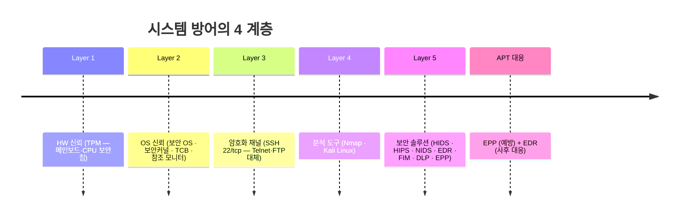
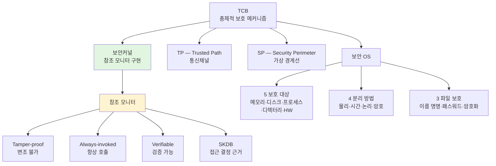
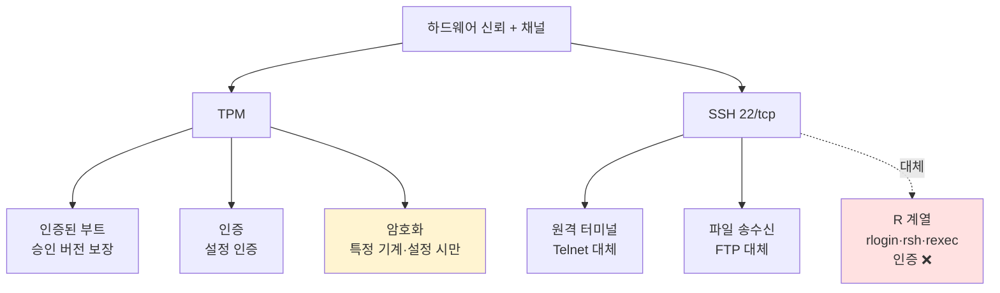
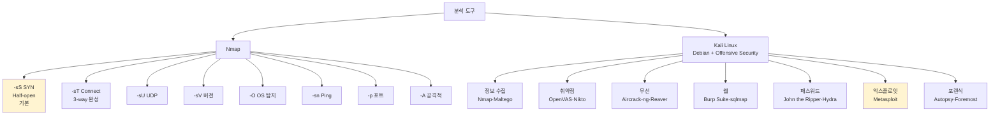
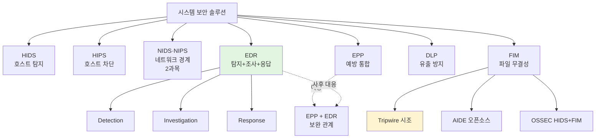

# 07. 시스템 보안 — 만화책처럼 읽는 방어·분석 도구·솔루션

> **이 문서를 읽는 법**: 만화책 한 권을 펼쳤다고 생각하세요. *에피소드*를 따라 "OS 신뢰 → 하드웨어 신뢰 → 암호화 채널 → 분석 도구 → 솔루션" 의 4 계층을 따라가면 자연스럽게 외워집니다.
> 정확한 정의·옵션·약어는 정확본을 참조: [[cs/information-security/01.system-security/07.system-defense|정확본 07. 시스템 보안]]

> **연결 단원**: 본 단원은 [[cs/information-security/01.system-security/06.system-attacks|06 시스템 공격]] 의 *짝*. 06 의 BoF·레이스·포맷 스트링·자원 고갈·APT 가 *방어 도구·솔루션*과 *1:1 대응*. 1과목 7개 단원의 *대응 측면 마무리*.

---

## 🎯 시작 전에 — 이미 들어본 방어 솔루션

| 매일 듣는 것 | 사실은 이 단원의 |
|---|---|
| Windows 11 의 TPM 2.0 요구 | TPM (신뢰 플랫폼 모듈) |
| 회사 PC 에 설치된 EDR 에이전트 | Endpoint Detection and Response |
| 침투 테스트의 Kali Linux | Debian 기반 보안 배포판 |
| `nmap -sS` 포트 스캔 | TCP SYN Half-open Scan |
| `ssh user@host` 22번 포트 | Telnet/FTP 평문 대체 |
| Tripwire 로 파일 변경 감지 | FIM (File Integrity Monitoring) |
| HIDS·HIPS 약어 헷갈림 | 탐지 ↔ 차단 |

> **이 단원의 본질**: 방어는 *4 계층*으로 구성 — **OS 신뢰 (Secure OS·보안커널·TCB·참조 모니터) → 하드웨어 신뢰 (TPM) → 암호화 채널 (SSH) → 분석·솔루션 (Nmap·Kali·HIDS·HIPS·EDR·FIM)**. 자격증 1과목의 *대응 측면 마무리*. 이 단원이 끝나면 **공격(06) ↔ 방어(07)** 의 짝으로 1과목 전체를 회수.

---

## 📖 에피소드 1 — 시스템 방어의 4 계층

### 장면. OS 한 약점 → 다층 방어

> 01~06 단원에서 본 공격 (BoF·레이스·포맷·자원 고갈·APT) 은 *OS 의 한 약점*을 노린다. 따라서 방어도 *OS 자체의 신뢰성*부터 *운영 중 시스템 모니터링*까지 **다층 구성**.

### 4 계층 한 표

| 계층 | 다루는 영역 |
|---|---|
| **OS 의 신뢰 기반** | 보안 OS · 보안커널 · TCB · 참조 모니터 |
| **하드웨어 신뢰 기반** | **TPM (Trusted Platform Module)** |
| **암호화 채널** | SSH |
| **분석·솔루션** | Nmap · Kali Linux · HIDS · HIPS · EDR · FIM |

### 핵심 개념 연결 구조

```
[ 신뢰 컴퓨팅 기반 (TCB) ]
        ├── 보안커널 ── 참조 모니터 ── SKDB
        ├── 신뢰된 경로 (TP)
        └── 보안경계 (SP)

[ 하드웨어 ]
        └── TPM ─ 인증 부트 / 인증 / 암호화 서비스

[ 운영 ]
        └── SSH (22/tcp) ─ Telnet/FTP 대체
```

### 외우는 방법

> *바닥 (HW) → OS 신뢰 → 운영 채널 → 도구·솔루션* 의 *위에서 아래*. 각 계층이 *상위 계층의 토대*.

### 시험 함정

- "방어 4 계층?" → OS 신뢰 / HW 신뢰 / 암호화 채널 / 분석·솔루션
- "TCB 의 위치?" → OS 신뢰 기반의 *총체적 메커니즘*
- "TPM 의 위치?" → 하드웨어 신뢰 기반

---

## 📖 에피소드 2 — 보안 OS: 정의 + 보호 대상 5종

### 장면. 기존 OS 에 보안기능을 통합

> **보안 OS (Secure OS)** = **시스템을 보호하기 위해 기존의 운영체제 내에 보안기능을 통합**한 운영체제. **보안커널을 추가로 이식**한 OS.

### 보호 대상 5종

| 보호 대상 | 의미 |
|---|---|
| **메모리** | 실행 중 메모리의 *무단 접근·변조 차단* |
| **보조기억장치 상의 파일·데이터 집합** | 디스크 파일 *무결성 보호* |
| **메모리상에서 실행 중인 프로그램** | *프로세스 격리* (03 §6 의 RUID·EUID 위) |
| **파일들의 디렉터리** | *디렉터리 권한·소유자* 보호 (03 §3 의 inode 위) |
| **하드웨어 장치** | *직접 하드웨어 접근* 제한 |

### 외우는 방법 — 5 대상의 위치

> *메모리·디스크·프로세스·디렉터리·하드웨어*. *휘발성 → 영속성 → 실행 단위 → 자원 단위 → 물리 단위*.

### 시험 함정

- "보안 OS = ?" → 기존 OS + 보안기능 *통합*
- "보안 OS 의 핵심?" → **보안커널 이식**
- "보호 대상 5종?" → 메모리·보조기억장치·실행 중 프로그램·디렉터리·하드웨어

---

## 📖 에피소드 3 — 보안 OS: 보호 방법 4종 (물리·시간·논리·암호 분리)

### 장면. 4 종류의 분리

| 방법 | 의미 |
|---|---|
| **물리적 분리** | 사용자별로 **별도의 장비만 사용**하도록 제한 |
| **시간적 분리** | 프로세스가 **동일 시간에 하나씩만 실행**되도록 |
| **논리적 분리** | 각 프로세스에 **논리적인 구역 지정** |
| **암호적 분리** | 내부 정보를 외부에서 알 수 없도록 **암호화** |

### 외우는 방법 — 분리의 차원

> *공간 (물리) → 시간 (시간적) → 추상 (논리적) → 의미 (암호적)*. *물리적 → 점점 추상적*.

### 4 분리의 예시

| 방법 | 현실 예시 |
|---|---|
| 물리적 분리 | *별도의 PC* 사용 |
| 시간적 분리 | *Time Sharing* (한 시점 한 프로세스) |
| 논리적 분리 | *프로세스 격리·가상 메모리* |
| 암호적 분리 | *암호화된 저장* (BitLocker·EFS) |

### 시험 함정

- "보호 방법 4종?" → **물리적·시간적·논리적·암호적 분리**
- "별도 장비 사용?" → 물리적 분리
- "한 시점에 하나만?" → 시간적 분리
- "암호화로 격리?" → 암호적 분리

---

## 📖 에피소드 4 — 보안 OS: 파일 보호 기법 3종

### 장면. 파일을 보호하는 3 단계

| 기법 | 의미 |
|---|---|
| **이름 명명** | 파일 이름을 *추측하기 어렵게* 변경 |
| **패스워드 설정** | 패스워드를 알아야만 *파일 이용 가능* |
| **암호화 설정** | 파일 *내용 자체를 암호화* → 인가 사용자만 파악 |

### 보호 강도

> *이름 명명 (낮음) → 패스워드 (중) → 암호화 (높음)*. 강도가 올라갈수록 *우회가 어려움*.

### 시험 함정

- "파일 보호 3종?" → **이름 명명 / 패스워드 / 암호화**
- "이름 명명의 한계?" → *추측이 가능*하면 우회
- "가장 강한 보호?" → **암호화**

---

## 📖 에피소드 5 — 보안커널 + TCB (TP·SP)

### 장면 1. 보안커널 — TCB 의 핵심

> **보안커널 (Security Kernel)** = **TCB 내에 있는 하드웨어·소프트웨어·펌웨어로 구성**. **참조 모니터 개념을 구현하고 집행**.

### 보안커널의 핵심 특성

| 특성 |
|---|
| **주체와 객체 사이의 모든 접근과 기능을 중재** |
| TCB 의 *핵심*. 신뢰할 수 있는 컴퓨터 시스템 구축의 *가장 보편적 사용* |

### 장면 2. TCB — 총제적 보호 메커니즘

> **TCB (Trusted Computing Base)** = OS·하드웨어·펌웨어·소프트웨어 등이 포함된 **컴퓨터 시스템 내의 총제적 보호 메커니즘**.

### TCB 의 두 핵심 개념

| 개념 | 풀이 | 의미 |
|---|---|---|
| **신뢰된 경로 (TP)** | Trusted Path | 사용자·프로그램과 커널과의 **통신채널** |
| **보안경계 (SP)** | Security Perimeter | 시스템 구성요소 중 **신뢰/비신뢰의 경계 (가상 경계선)** |

### TP ↔ SP 함정 — 약어 매칭

> **TP = Trusted Path = 통신채널** / **SP = Security Perimeter = 가상 경계선**. 시험 빈출.

### 시험 함정

- "보안커널 = ?" → **TCB 의 핵심 + 참조 모니터 구현체**
- "TCB = ?" → OS·HW·FW·SW 의 *총제적 보호 메커니즘*
- "TP 풀이?" → **Trusted Path** (통신채널)
- "SP 풀이?" → **Security Perimeter** (가상 경계선)

---

## 📖 에피소드 6 — 참조 모니터: 3대 요건 + SKDB

### 장면. 모든 접근통제의 추상머신

> **참조 모니터 (Reference Monitor)** = **주체의 객체에 대한 모든 접근통제를 담당하는 추상머신**. *보안커널이 이 개념을 구현*.

### 3대 요건

| 요건 | 영문 | 의미 |
|---|---|---|
| **부정조작이 없어야 함** | **Tamper-proof** | 외부에서 *변조 불가* |
| **항상 무시되지 않고 호출되어야 함** | **Always-invoked** | 모든 접근 시 *반드시 거쳐야* |
| **분석·테스트로 확인 가능** | **Verifiable** | 모든 동작을 *분석·테스트로 검증* 가능 |

### 외우는 방법 — Tamper-Always-Verify

> **T-A-V** 순서. *변조 불가 → 항상 호출 → 검증 가능*. 보안의 *3 핵심 요건*.

### SKDB — 접근 결정의 근거

> 참조 모니터는 **SKDB (Security Kernel Database)** 를 참조하여 객체에 대한 **접근 허가 여부**를 결정.

### 03 단원 §1 의 참조 모니터와 동일

> 참조 모니터의 3 요건은 [[cs/information-security/04.security-general/02.access-control|4과목 §2 접근통제]] 의 Anderson 1972 정의와 동일. *접근통제의 보편 원리*.

### 시험 함정

- "참조 모니터 = ?" → 모든 접근통제 *추상머신*
- "3대 요건?" → **Tamper-proof · Always-invoked · Verifiable**
- "접근 결정 근거?" → **SKDB** (Security Kernel Database)

---

## 📖 에피소드 7 — TPM: 신뢰 컴퓨팅의 하드웨어 모듈

### 장면. 메인보드의 보안 칩

> **TPM (Trusted Platform Module)** = **신뢰 컴퓨팅을 위한 하드웨어/소프트웨어 방법에서 핵심이 되는 하드웨어 모듈**. *메인보드에 부착*되거나 *CPU 에 통합*된 보안 칩.

### TPM 의 3대 서비스

| 서비스 | 설명 |
|---|---|
| **인증된 부트 서비스** | 전체 OS 를 *단계적으로 부팅*하고, OS 가 적재될 때 각 부분이 **사용을 위해 승인된 버전임을 보장** |
| **인증 서비스** | TPM 에 의해 설정이 완성되고 로그인 되면, **TPM 이 다른 부분의 설정을 인증** |
| **암호화 서비스** | **특정 기계가 특정 설정으로 되어 있을 때만** 그 기계에서 데이터의 복호화를 수행 |

### iOS Secure Boot Chain 과의 동일 원리

> [[cs/information-security/01.system-security/05.mobile-os|05 §1-3]] 의 iOS Secure Boot Chain (Boot ROM → iBoot → 커널 → 앱) 도 *동일 원리* — *하드웨어 키 → 단계적 검증*. **TPM 은 데스크톱·서버용 일반 표준판**.

### 외우는 방법 — 부트·인증·암호화

> *시스템이 켜질 때 (부트) → 동작할 때 (인증) → 데이터 보호할 때 (암호화)*. *시간 흐름에 따른 3 서비스*.

### 시험 함정

- "TPM = ?" → 신뢰 컴퓨팅의 *하드웨어 모듈*
- "TPM 위치?" → 메인보드·CPU 통합
- "TPM 3대 서비스?" → **인증된 부트 · 인증 · 암호화**
- "특정 기계·특정 설정 시만?" → **암호화 서비스**

---

## 📖 에피소드 8 — SSH 22/tcp: Telnet·FTP 대체

### 장면. 평문 프로토콜의 안전한 대체

> **SSH** = **암호 통신을 이용해 네트워크상 다른 컴퓨터에 접속**하는 응용·프로토콜. *원격 명령 실행·파일 조작*. **포트 22/tcp** ([[cs/information-security/01.system-security/03.linux-basic|03 §8]] 의 잘 알려진 포트).

### SSH 의 두 서비스

| 서비스 | 대체 대상 |
|---|---|
| **원격 터미널** | *암호화된 원격 터미널* — **Telnet 평문 서비스 대체** |
| **파일 송수신** | *암호화된 파일 송수신* — **FTP 평문 서비스 대체** |

### 04 단원과의 연계 — R 계열 ↔ SSH

> [[cs/information-security/01.system-security/04.linux-management|04 §4-2]] 의 R 계열 (`rlogin`·`rsh`·`rexec`) 비활성화는 **SSH 로의 대체**를 전제. R 계열 = *인증 없이* / SSH = *22/tcp 단일 포트*에서 **암호화된 원격 터미널 + 파일 송수신** 모두.

### 대체 매핑

| 평문 (위험) | SSH 대체 |
|---|---|
| **Telnet** | SSH 원격 터미널 |
| **FTP** | SFTP / SCP (SSH 파일 송수신) |
| **rlogin · rsh · rexec** | SSH 원격 명령 |

### 시험 함정

- "SSH 포트?" → **22/tcp**
- "Telnet 대체?" → SSH 원격 터미널
- "FTP 대체?" → SFTP / SCP
- "단일 포트?" → 22/tcp 에서 *모든 서비스* 제공

---

## 📖 에피소드 9 — Nmap: 8 옵션 + 스캔 유형

### 장면. 네트워크 탐색의 만능 도구

> **Nmap (Network Mapper)** = 네트워크 탐색 + 보안 감사 *오픈소스 도구*. 시스템 보안 점검에서 *가장 널리 사용*.

### 8 주요 옵션

| 옵션 | 의미 |
|---|---|
| **`-sS`** | TCP SYN 스캔 (**Half-open scan**) — *기본 스캔, 빠르고 흔적 적음* |
| **`-sT`** | TCP Connect 스캔 — *3-way handshake 완료, 흔적 명확* |
| **`-sU`** | UDP 스캔 |
| **`-sV`** | 서비스 버전 탐지 |
| **`-O`** | 운영체제 탐지 (**OS Fingerprinting**) |
| **`-sn`** | Ping 스캔 (포트 스캔 없이 *호스트 생존 여부*) |
| **`-p [포트]`** | 특정 포트 스캔 (예: `-p 22,80,443`) |
| **`-A`** | 공격적 스캔 (`-sV` + `-O` + 스크립트 + traceroute) |

### `-sS` ↔ `-sT` 의 결정적 차이 — 시험 1순위

| 스캔 | 동작 | 흔적 |
|---|---|---|
| **`-sS`** SYN | **SYN → SYN/ACK → RST** (3-way 미완성) | *적음* |
| **`-sT`** Connect | **SYN → SYN/ACK → ACK** (3-way 완성) | *명확* |

### 사용 예

```bash
# 기본 SYN 스캔
nmap -sS 192.168.1.1

# 1~1024 포트 + 서비스 버전 + OS 탐지
nmap -sS -sV -O -p 1-1024 192.168.1.1

# 네트워크 대역 호스트 생존 확인
nmap -sn 192.168.1.0/24
```

### 외우는 방법 — `s` + 한 글자

> *`-sS`(SYN) · `-sT`(TCP) · `-sU`(UDP) · `-sV`(Version) · `-sn`(Ping no port)* — *`-s` 다음 글자가 종류*.

### 시험 함정

- "기본 스캔?" → **`-sS`** (SYN, Half-open)
- "3-way 완성 스캔?" → **`-sT`**
- "UDP 스캔?" → **`-sU`**
- "서비스 버전?" → **`-sV`**
- "OS 탐지?" → **`-O`**
- "공격적 스캔 (-sV + -O + 스크립트 + traceroute)?" → **`-A`**

---

## 📖 에피소드 10 — Kali Linux: Debian 기반 침투 테스트 배포판

### 장면. Offensive Security 의 도구상자

> **Kali Linux** = **Offensive Security 가 유지보수**하는 **침투 테스트·디지털 포렌식 전용 Debian 기반 배포판**. 600 종 이상 보안 도구 *사전 설치*.

### 7 도구 카테고리

| 카테고리 | 대표 도구 |
|---|---|
| **정보 수집** | Nmap · Maltego · theHarvester |
| **취약점 분석** | OpenVAS · Nikto |
| **무선 공격** | Aircrack-ng · Reaver |
| **웹 애플리케이션 분석** | Burp Suite · OWASP ZAP · sqlmap |
| **패스워드 공격** | **John the Ripper** · Hydra ([[cs/information-security/01.system-security/06.system-attacks|06 §1]] 과 연결) |
| **익스플로잇 프레임워크** | Metasploit |
| **포렌식** | Autopsy · Foremost |

### Kali ↔ 06 단원 도구

> Kali 의 *패스워드 공격* 카테고리에 [[cs/information-security/01.system-security/06.system-attacks|06 단원]] 의 **John the Ripper** 가 포함. *공격기법 학습 → 도구 활용*의 흐름.

### 외우는 방법 — 7 카테고리

> *정보 수집 → 취약점 → 무선 → 웹 → 패스워드 → 익스플로잇 → 포렌식*. *침투 테스트 사이클의 시간 순서*.

### 시험 함정

- "Kali 의 정체?" → **Debian 기반 침투 테스트 배포판**
- "유지보수 주체?" → **Offensive Security**
- "Kali 의 익스플로잇 프레임워크?" → **Metasploit**
- "Kali 의 SQL Injection 도구?" → **sqlmap**
- "Kali 의 무선 공격 도구?" → **Aircrack-ng**

---

## 📖 에피소드 11 — 시스템 보안 솔루션 7 분류

### 장면. 4 축의 분류

> 자격증 1과목의 시스템 보안 솔루션 = **탐지 / 차단 / 응답 / 무결성 검증** 4축 분류. 1차 출처는 *KISA SW 보안 가이드* + *NIST SP 800-94 (Guide to Intrusion Detection and Prevention Systems)*.

### 7 솔루션 한 표

| 솔루션 | 풀이 | 위치 | 핵심 기능 |
|---|---|---|---|
| **HIDS** | Host-based IDS | 호스트 | *호스트 내부 이상 행위* **탐지** (시그니처·이상행위 기반) |
| **HIPS** | Host-based IPS | 호스트 | 탐지 + **차단** 까지 능동 수행 |
| **NIDS / NIPS** | Network-based IDS/IPS | 네트워크 경계 | 네트워크 트래픽 기반 탐지·차단 (2과목 네트워크 보안) |
| **EDR** | Endpoint Detection and Response | 엔드포인트 | **탐지 + 조사 + 응답** 통합 (행위 분석 중심) |
| **FIM** | File Integrity Monitoring | 호스트 | **파일 무결성 변경 감지** (Tripwire·AIDE) |
| **DLP** | Data Loss Prevention | 호스트·네트워크 | *민감 데이터 외부 유출 방지* |
| **EPP** | Endpoint Protection Platform | 엔드포인트 | **백신 + 방화벽 + HIPS** 등 예방 통합 (예방 중심) |

### 외우는 방법 — 약어 풀이

> *H* = Host / *N* = Network / *IDS* = 탐지 / *IPS* = 차단 / *EDR* = 탐지+조사+응답 / *FIM* = 무결성 / *DLP* = 유출 방지 / *EPP* = 예방.

### 시험 함정

- "HIDS 풀이?" → **Host-based IDS** (탐지)
- "HIPS 풀이?" → **Host-based IPS** (차단)
- "EDR 풀이?" → **Endpoint Detection and Response**
- "FIM 풀이?" → **File Integrity Monitoring**
- "DLP 풀이?" → **Data Loss Prevention**
- "EPP 풀이?" → **Endpoint Protection Platform**

---

## 📖 에피소드 12 — HIDS vs HIPS + EDR 3단계

### 장면 1. HIDS ↔ HIPS — 한 글자의 차이

| 항목 | **HIDS** | **HIPS** |
|---|---|---|
| **동작** | *탐지·로깅* (수동) | 탐지 + **차단** (능동) |
| **위험** | 탐지만 → *차단까지 시간 지연* | **오탐 시 정상 동작 차단 가능** |
| **적용** | *모든 호스트* 광범위 | *중요 자산 호스트* 집중 |

### 백도어 대응과의 연계

> [[cs/information-security/01.system-security/06.system-attacks|06 §10]] 의 백도어 대응에서 본 **포트 활동 탐지** 가 *HIDS 의 대표 기능*.

### 장면 2. EDR 의 3단계

> **EDR** = 엔드포인트에서 발생하는 보안 이벤트를 **수집·분석·조사·응답** 하는 통합 솔루션.

| 단계 | 기능 |
|---|---|
| **Detection** | 행위 분석·시그니처로 *위협 탐지* |
| **Investigation** | 침해 *경로·확산 범위 조사* |
| **Response** | *격리·차단·복구 자동화* |

### EPP ↔ EDR 보완 관계

> **EPP** (예방 중심) ↔ **EDR** (사후 대응 중심). APT (06 §12) 같은 *시나리오 위협*에 대해 *EPP 예방 위에 EDR 의 행위 기반 탐지·조사·응답*이 보완 단계.

### 외우는 방법 — D-I-R

> **D-I-R** = Detection · Investigation · Response. *탐지 → 조사 → 응답*. EDR 의 정의 그대로.

### 시험 함정

- "HIDS ↔ HIPS 의 차이?" → 탐지 (수동) ↔ 탐지+차단 (능동)
- "HIPS 의 위험?" → *오탐 시 정상 동작 차단*
- "EDR 3단계?" → **Detection · Investigation · Response**
- "EPP ↔ EDR 관계?" → 예방 ↔ 사후 대응 (보완)
- "APT 대응 핵심 솔루션?" → **EDR**

---

## 📖 에피소드 13 — FIM: Tripwire·AIDE·OSSEC

### 장면. 파일 변경 감지

> **FIM (File Integrity Monitoring)** = **파일·디렉터리·레지스트리의 무결성 변화를 감지**하는 솔루션. *침입 후 변조 행위 탐지*.

### 대표 도구 3종

| 도구 | 플랫폼 | 특징 |
|---|---|---|
| **Tripwire** | Unix/Linux | **FIM 의 시조**. *해시 기반 무결성 검증* |
| **AIDE** (Advanced Intrusion Detection Environment) | Linux | **Tripwire 의 오픈소스 대안** |
| **OSSEC** | 다중 플랫폼 | **HIDS + FIM 통합** |

### Tripwire — FIM 의 시조

> 1992 년 등장. *모든 파일의 해시값을 데이터베이스에 저장*했다가, 주기적으로 *현재 해시와 비교*. 변경되면 *알람*.

### AIDE 풀이

> **A**dvanced **I**ntrusion **D**etection **E**nvironment. *Tripwire 의 오픈소스 버전*. Linux 표준 FIM 도구.

### OSSEC — HIDS + FIM

> *OSSEC* 은 FIM 만 아니라 **HIDS 기능까지 통합**한 솔루션. 다중 플랫폼 (Linux·Windows·macOS).

### FIM 의 위치

> 06 단원 *모든 공격에 대한 사후 탐지*의 핵심. BoF·레이스·포맷 스트링·백도어 *모든 공격이 결국 파일·메모리·레지스트리를 변조*하므로 FIM 이 *최후의 방어선*.

### 외우는 방법 — 시조·오픈소스·통합

> **Tripwire (시조) → AIDE (오픈소스) → OSSEC (HIDS+FIM 통합)**. *진화의 3 단계*.

### 시험 함정

- "FIM 풀이?" → **File Integrity Monitoring**
- "FIM 의 시조?" → **Tripwire**
- "Tripwire 의 오픈소스 대안?" → **AIDE**
- "AIDE 풀이?" → Advanced Intrusion Detection Environment
- "HIDS + FIM 통합 도구?" → **OSSEC**

---

## 📑 시스템 방어 종합 비교 (에피소드 1~13 정리)

시험 직전 *한눈에* 보는 view.

| 영역 | 핵심 |
|---|---|
| **방어 4 계층** | OS 신뢰 / HW 신뢰 / 암호화 채널 / 분석·솔루션 |
| **보안 OS** | 기존 OS + 보안기능 통합 + **보안커널 이식** |
| **보호 대상 5** | 메모리·보조기억장치·실행 중 프로그램·디렉터리·하드웨어 |
| **보호 방법 4** | 물리·시간·논리·암호 분리 |
| **파일 보호 3** | 이름 명명·패스워드·암호화 |
| **TCB** | OS·HW·FW·SW *총체적 보호 메커니즘* |
| **TP·SP** | Trusted Path (통신채널) · Security Perimeter (가상 경계선) |
| **참조 모니터** | 모든 접근통제 추상머신. 3 요건 = **Tamper-proof · Always-invoked · Verifiable** + **SKDB** |
| **TPM** | 메인보드·CPU 통합 보안 칩. 3 서비스 = **인증된 부트 · 인증 · 암호화** |
| **SSH** | **22/tcp** · Telnet·FTP·R 계열 대체 |
| **Nmap 8 옵션** | `-sS`·`-sT`·`-sU`·`-sV`·`-O`·`-sn`·`-p`·`-A` |
| **Kali Linux** | Debian 기반 + **Offensive Security** + 7 도구 카테고리 |
| **솔루션 7** | HIDS·HIPS·NIDS/NIPS·EDR·FIM·DLP·EPP |
| **HIDS ↔ HIPS** | 탐지 (수동) ↔ 차단 (능동) |
| **EDR 3단계** | Detection · Investigation · Response |
| **FIM 도구** | Tripwire (시조) · AIDE (오픈소스) · OSSEC (HIDS+FIM) |

---

## 🗺️ 마인드맵 1 — 4 계층 시간선



**읽는 법**: 아래에서 위로 *바닥부터 운영까지*. *HW → OS → 채널 → 도구 → 솔루션* 의 *신뢰의 사슬*.

---

## 🗺️ 마인드맵 2 — TCB 분류 트리



**읽는 법**: 노랑 = *3 요건이 핵심* / 녹색 = *참조 모니터 = 보안커널이 구현*.

---

## 🗺️ 마인드맵 3 — TPM 3 서비스 + SSH 대체



**읽는 법**: 빨강 = *비활성화 대상 (R 계열)*. SSH 가 그 자리를 대체.

---

## 🗺️ 마인드맵 4 — Nmap 옵션 + Kali 도구 분류



**읽는 법**: 노랑 = *시험 1순위* (`-sS` 기본 / Metasploit 익스플로잇).

---

## 🗺️ 마인드맵 5 — 보안 솔루션 7 분류



**읽는 법**: 녹색 = *APT 대응 핵심* (EDR) / 노랑 = *FIM 시조* (Tripwire).

---

## 🗂️ 키워드 클러스터

### 4 계층

```
1. OS 신뢰 기반     — 보안 OS · 보안커널 · TCB · 참조 모니터
2. HW 신뢰 기반     — TPM
3. 암호화 채널      — SSH 22/tcp
4. 분석·솔루션      — Nmap · Kali · HIDS · HIPS · EDR · FIM
```

### 보안 OS

```
정의       : 기존 OS + 보안기능 통합 + 보안커널 이식

5 보호 대상 : 메모리 · 보조기억장치 (디스크) · 실행 중 프로그램
              · 디렉터리 · 하드웨어 장치

4 보호 방법 : 물리적 · 시간적 · 논리적 · 암호적 분리

3 파일 보호 : 이름 명명 · 패스워드 · 암호화
```

### TCB · 참조 모니터

```
TCB (Trusted Computing Base) — OS·HW·FW·SW 총체적 보호

  TP (Trusted Path)         — 통신채널
  SP (Security Perimeter)   — 가상 경계선

참조 모니터 — 모든 접근통제 추상머신
  3 요건  : Tamper-proof · Always-invoked · Verifiable
  근거 DB : SKDB (Security Kernel Database)
```

### TPM — 3 서비스

```
TPM (Trusted Platform Module) — 메인보드·CPU 통합 보안 칩

  1. 인증된 부트   — 승인 버전 보장
  2. 인증         — 설정 인증
  3. 암호화       — 특정 기계·특정 설정 시만 복호화
```

### SSH

```
포트 : 22/tcp
대체 :
  Telnet 평문 → SSH 원격 터미널
  FTP 평문    → SFTP / SCP
  R 계열 (rlogin·rsh·rexec) → SSH 원격 명령
```

### Nmap 8 옵션

```
-sS  TCP SYN Half-open      (기본·빠르고 흔적 적음)
-sT  TCP Connect            (3-way 완성·흔적 명확)
-sU  UDP
-sV  서비스 버전
-O   OS Fingerprinting
-sn  Ping (포트 스캔 없이)
-p   특정 포트
-A   공격적 (-sV + -O + 스크립트 + traceroute)
```

### Kali Linux 7 카테고리

```
Debian 기반 침투 테스트 배포판 — Offensive Security 유지보수

정보 수집  : Nmap · Maltego · theHarvester
취약점     : OpenVAS · Nikto
무선       : Aircrack-ng · Reaver
웹         : Burp Suite · OWASP ZAP · sqlmap
패스워드   : John the Ripper · Hydra
익스플로잇 : Metasploit
포렌식     : Autopsy · Foremost
```

### 보안 솔루션 7 분류

```
HIDS      Host-based IDS              — 호스트 탐지
HIPS      Host-based IPS              — 호스트 차단
NIDS·NIPS Network-based IDS·IPS       — 네트워크 (2과목)
EDR       Endpoint Detection and Response — 탐지+조사+응답
FIM       File Integrity Monitoring   — 파일 무결성
DLP       Data Loss Prevention        — 유출 방지
EPP       Endpoint Protection Platform — 예방 통합
```

### EDR 3단계 + FIM 도구

```
EDR : Detection (탐지) → Investigation (조사) → Response (응답)

FIM 도구 :
  Tripwire (시조 · 해시 기반 · Unix/Linux)
  AIDE (Tripwire 오픈소스 대안 · Linux)
  OSSEC (HIDS + FIM 통합 · 다중 플랫폼)
```

### 헷갈리는 짝 (시험 1순위)

| 짝 | 차이 |
|---|---|
| **TP ↔ SP** | Trusted Path (통신채널) ↔ Security Perimeter (가상 경계선) |
| **Tamper-proof ↔ Always-invoked ↔ Verifiable** | 변조 불가 ↔ 항상 호출 ↔ 검증 가능 |
| **TPM 3 서비스** | 인증된 부트 · 인증 · 암호화 |
| **SSH ↔ Telnet** | 22/tcp 암호화 ↔ 평문 |
| **`-sS` ↔ `-sT`** | SYN Half-open ↔ 3-way Connect |
| **`-sU` ↔ `-sV` ↔ `-sn`** | UDP / 버전 / Ping |
| **`-O` ↔ `-A`** | OS 탐지 / 공격적 (`-sV`+`-O`+ 스크립트 + traceroute) |
| **HIDS ↔ HIPS** | 탐지 (수동) ↔ 차단 (능동) |
| **NIDS ↔ HIDS** | 네트워크 ↔ 호스트 |
| **EPP ↔ EDR** | 예방 ↔ 사후 대응 |
| **EDR D-I-R** | Detection · Investigation · Response |
| **Tripwire ↔ AIDE ↔ OSSEC** | 시조 ↔ 오픈소스 ↔ HIDS+FIM 통합 |
| **물리 ↔ 시간 ↔ 논리 ↔ 암호 분리** | 4 보호 방법 |
| **이름 명명 ↔ 패스워드 ↔ 암호화** | 3 파일 보호 강도 |

---

## 🃏 회상 30문항

> 답을 가린 뒤 자가 채점.

**A. 4 계층·보안 OS (1~6)**
1. 시스템 방어의 4 계층은?
2. 보안 OS 의 핵심은?
3. 보호 대상 5종은?
4. 보호 방법 4종 (분리)은?
5. 파일 보호 기법 3종은?
6. 보호 방법 중 가장 추상적인 것은?

**B. TCB·참조 모니터·TPM (7~12)**
7. TCB 의 정의와 두 핵심 개념은?
8. TP 와 SP 의 풀이와 차이는?
9. 참조 모니터의 정의와 3대 요건은?
10. SKDB 의 역할은?
11. TPM 의 정체와 위치는?
12. TPM 3대 서비스는?

**C. SSH·Nmap (13~18)**
13. SSH 포트와 대체하는 평문 프로토콜은?
14. R 계열과 SSH 의 관계는?
15. Nmap `-sS` ↔ `-sT` 의 차이는?
16. `-sU` · `-sV` · `-O` 의 의미는?
17. `-sn` 의 용도는?
18. `-A` 가 포함하는 옵션은?

**D. Kali·솔루션 7분류 (19~24)**
19. Kali Linux 의 정체와 유지보수 주체는?
20. Kali 의 익스플로잇 프레임워크는?
21. Kali 7 도구 카테고리는?
22. HIDS · HIPS 의 풀이와 차이는?
23. EDR · FIM · DLP · EPP 의 풀이는?
24. NIDS 의 영역은?

**E. EDR·FIM (25~30)**
25. EDR 의 3단계는?
26. EPP ↔ EDR 의 관계는?
27. FIM 의 정체는?
28. FIM 의 시조는?
29. AIDE 의 풀이와 위치는?
30. OSSEC 의 통합 기능은?

---

## ⚠️ 시험 함정 모음

| 함정 | 정답 |
|---|---|
| 4 계층? | OS 신뢰 / HW 신뢰 / 암호화 채널 / 분석·솔루션 |
| 보안 OS 의 핵심? | **보안커널 이식** |
| 보호 대상 5종? | 메모리·보조기억장치·실행 중 프로그램·디렉터리·하드웨어 |
| 보호 방법 4종? | **물리적 · 시간적 · 논리적 · 암호적 분리** |
| 파일 보호 3종? | 이름 명명 / 패스워드 / 암호화 |
| TCB? | OS·HW·FW·SW *총체적 보호 메커니즘* |
| TP 풀이? | **Trusted Path** (통신채널) |
| SP 풀이? | **Security Perimeter** (가상 경계선) |
| 참조 모니터? | 모든 접근통제 *추상머신* |
| 3 요건? | **Tamper-proof · Always-invoked · Verifiable** |
| SKDB? | Security Kernel Database |
| TPM 풀이? | **Trusted Platform Module** |
| TPM 3 서비스? | **인증된 부트 · 인증 · 암호화** |
| 특정 기계·특정 설정 시만? | **TPM 암호화 서비스** |
| SSH 포트? | **22/tcp** |
| Telnet 대체? | SSH 원격 터미널 |
| FTP 대체? | SFTP / SCP |
| Nmap 기본 스캔? | **`-sS`** (SYN Half-open) |
| `-sT` 의 의미? | TCP Connect (3-way 완성) |
| `-sU`? | UDP |
| `-sV`? | 서비스 버전 |
| `-O`? | **OS Fingerprinting** |
| `-sn`? | Ping (포트 스캔 없이) |
| `-A`? | `-sV` + `-O` + 스크립트 + traceroute |
| Kali = ? | **Debian 기반 침투 테스트 배포판** |
| Kali 유지보수? | **Offensive Security** |
| Kali 익스플로잇? | **Metasploit** |
| Kali SQL Injection? | **sqlmap** |
| Kali 무선? | **Aircrack-ng · Reaver** |
| Kali 패스워드? | John the Ripper · Hydra |
| Kali 정보 수집? | Nmap · Maltego · theHarvester |
| Kali 포렌식? | Autopsy · Foremost |
| HIDS 풀이? | **Host-based IDS** (탐지) |
| HIPS 풀이? | **Host-based IPS** (차단) |
| EDR 풀이? | **Endpoint Detection and Response** |
| FIM 풀이? | **File Integrity Monitoring** |
| DLP 풀이? | **Data Loss Prevention** |
| EPP 풀이? | **Endpoint Protection Platform** |
| HIDS ↔ HIPS? | 수동 탐지 ↔ 능동 차단 |
| HIPS 위험? | *오탐 시 정상 동작 차단* |
| EDR 3단계? | **Detection · Investigation · Response** |
| EPP ↔ EDR? | 예방 ↔ 사후 대응 (보완) |
| APT 대응 핵심? | **EDR** |
| FIM 시조? | **Tripwire** |
| Tripwire 오픈소스 대안? | **AIDE** |
| AIDE 풀이? | Advanced Intrusion Detection Environment |
| HIDS+FIM 통합? | **OSSEC** |

---

## 🔗 정확본 매핑표

| 본 노트 에피소드 | 정확본 § |
|---|---|
| 에피소드 1 (4 계층) | [[cs/information-security/01.system-security/07.system-defense#0. 들어가며 — 시스템 방어의 4 계층\|정확본 §0]] |
| 에피소드 2 (보안 OS·5 보호 대상) | [[cs/information-security/01.system-security/07.system-defense#1-1. 정의\|정확본 §1-1·§1-2]] |
| 에피소드 3 (4 보호 방법) | [[cs/information-security/01.system-security/07.system-defense#1-3. 보호 방법 4종\|정확본 §1-3]] |
| 에피소드 4 (3 파일 보호) | [[cs/information-security/01.system-security/07.system-defense#1-4. 파일 보호기법 3종\|정확본 §1-4]] |
| 에피소드 5 (보안커널·TCB) | [[cs/information-security/01.system-security/07.system-defense#2. 보안커널과 신뢰 컴퓨팅 기반 (TCB)\|정확본 §2]] |
| 에피소드 6 (참조 모니터·SKDB) | [[cs/information-security/01.system-security/07.system-defense#3. 참조 모니터 (Reference Monitor)\|정확본 §3]] |
| 에피소드 7 (TPM) | [[cs/information-security/01.system-security/07.system-defense#4. 신뢰 플랫폼 모듈 (TPM)\|정확본 §4]] |
| 에피소드 8 (SSH) | [[cs/information-security/01.system-security/07.system-defense#5. 보안 쉘 (SSH)\|정확본 §5]] |
| 에피소드 9 (Nmap) | [[cs/information-security/01.system-security/07.system-defense#6-1. Nmap (Network Mapper)\|정확본 §6-1]] |
| 에피소드 10 (Kali) | [[cs/information-security/01.system-security/07.system-defense#6-2. Kali Linux\|정확본 §6-2]] |
| 에피소드 11 (솔루션 7 분류) | [[cs/information-security/01.system-security/07.system-defense#7-1. 솔루션 분류\|정확본 §7-1]] |
| 에피소드 12 (HIDS·HIPS·EDR) | [[cs/information-security/01.system-security/07.system-defense#7-2. HIDS vs HIPS\|정확본 §7-2·§7-3]] |
| 에피소드 13 (FIM) | [[cs/information-security/01.system-security/07.system-defense#7-4. FIM (File Integrity Monitoring)\|정확본 §7-4]] |

---

## 📅 학습 흐름

```
[1주]   에피소드 1·2·3·4 (4 계층·보안 OS·5 보호 대상·4 분리·3 파일 보호) — 마인드맵 1
[2주]   에피소드 5·6 (TCB·TP·SP·참조 모니터·3 요건·SKDB) — 마인드맵 2
[3주]   에피소드 7·8 (TPM 3 서비스·SSH 22/tcp) — 마인드맵 3
[4주]   에피소드 9 (Nmap 8 옵션) — `-sS` ↔ `-sT` 직접 암기
[5주]   에피소드 10 (Kali 7 카테고리) — 마인드맵 4
[6주]   에피소드 11·12 (솔루션 7·HIDS↔HIPS·EDR D-I-R) — 마인드맵 5
[7주]   에피소드 13 (FIM Tripwire·AIDE·OSSEC)
[8주]   회상 30문항 → 틀린 것만 정확본 깊이 학습
[9주]   함정 모음 매일 1회 + 정확본 1회 정독
[10주]  06 (공격) ↔ 07 (방어) 통합 — 공격기법 ↔ 방어 솔루션 매핑표 완성
[11주]  1과목 7 단원 통합 정독 — 윈도우 → 리눅스 → 모바일 → 공격 → 방어
```

---

> **1과목 완료**: 본 단원으로 [[cs/information-security/01.system-security/01.windows-basic|01. 윈도우 기본]] / [[cs/information-security/01.system-security/02.windows-management|02. 윈도우 관리]] / [[cs/information-security/01.system-security/03.linux-basic|03. 리눅스 기본]] / [[cs/information-security/01.system-security/04.linux-management|04. 리눅스 관리]] / [[cs/information-security/01.system-security/05.mobile-os|05. 모바일 OS]] / [[cs/information-security/01.system-security/06.system-attacks|06. 시스템 공격기법]] / **07. 시스템 보안** 7 단원이 모두 완료되었다. 1과목은 *Windows·Linux 구조 → 모바일 → 공격 → 방어* 의 의존성 흐름을 따라 통합 학습을 권장한다.
