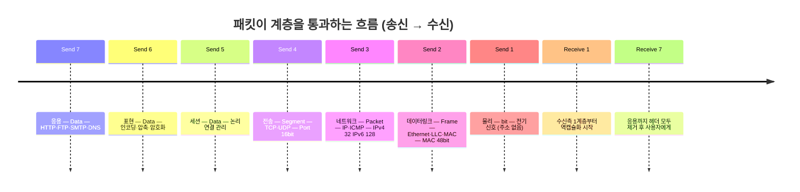
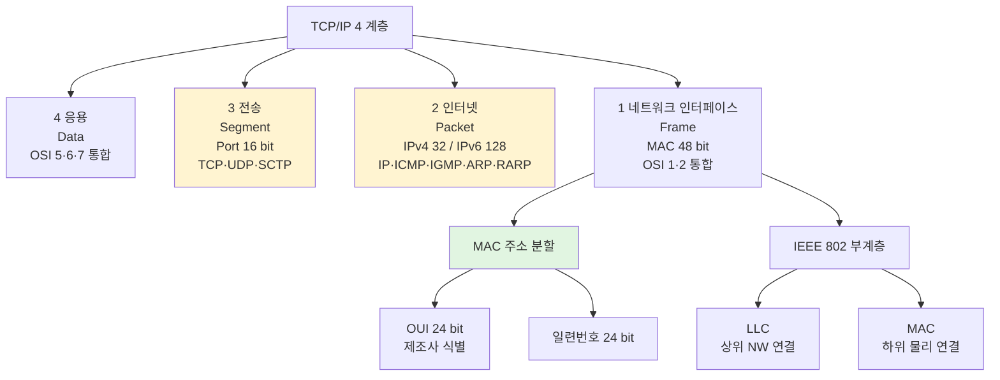
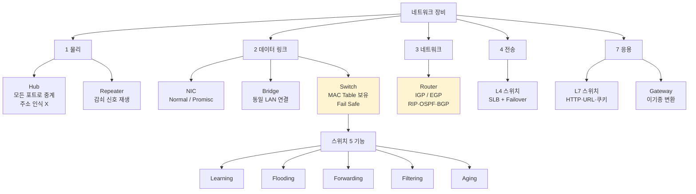
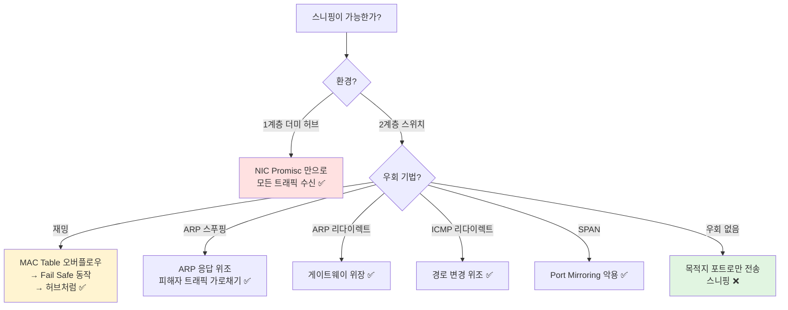
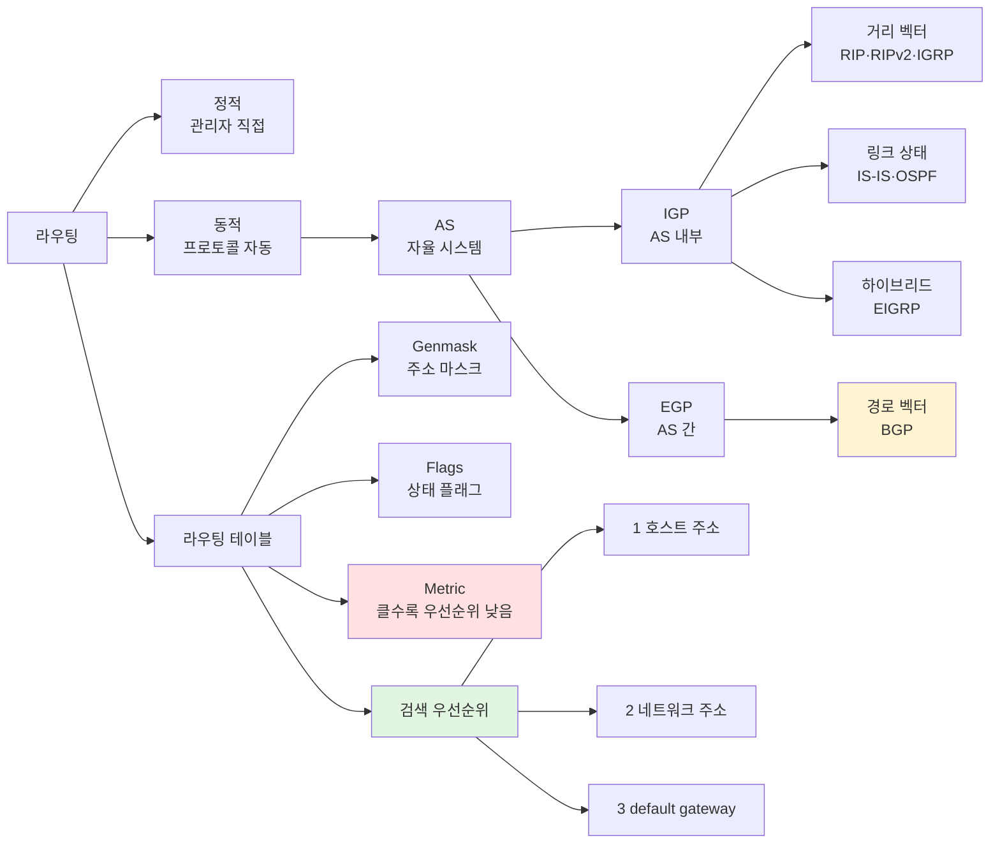

# 01. 네트워크 일반 — 만화책처럼 읽는 OSI / TCP-IP / 네트워크 장비

> **이 문서를 읽는 법**: 만화책 한 권을 펼쳤다고 생각하세요. *에피소드*를 따라 "어느 계층에서 어떤 헤더가 쓰이고 어떤 장비가 그 계층을 책임지는가" 를 따라가면 자연스럽게 외워집니다.
> 정확한 정의·표준 번호·포트 번호는 정확본을 참조: [[cs/information-security/02.network-security/01.network-fundamentals|정확본 01. 네트워크 일반]]

> **연결 단원**: 본 단원의 *계층 모델·장비·MAC 주소·포트* 가 02 (프로토콜) → 04 (스캐닝·스니핑·스푸핑) → 05 (DoS·DDoS) → 07 (IPsec·SSL/TLS) → 08 (방화벽·IDS) 의 *모든 토대*. 1과목 06 의 *시스템 공격* 과는 다른 축 — 본 단원은 *네트워크 계층의 약점*을 다룬다.

---

## 🎯 시작 전에 — 이미 쓰고 있는 네트워크 어휘

개발하면서 매일 마주치는 것들이 사실 다 이 단원의 주인공입니다.

| 매일 보는 것 | 사실은 이 단원의 |
|---|---|
| HTTPS 443/tcp 의 자물쇠 | 7계층 응용 + **6계층 표현 (암호화)** |
| HTTP 80/tcp · FTP 20·21/tcp | 7계층 응용 (well-known 포트) |
| SSH 22/tcp · Telnet 23/tcp | 7계층 응용 (well-known 포트) |
| SMTP 25 · POP3 110 · IMAP 143 | 메일 7계층 well-known 포트 |
| DNS 53 (tcp + udp 둘 다) | 응용 계층 — TCP 와 UDP 동시 사용 단골 |
| MAC 주소 (48 bit) | **2계층 데이터 링크** + OUI 24 + 일련번호 24 |
| Wireshark · tcpdump | NIC **Promiscuous** 모드 + 1계층 더미 허브 |
| OpenFlow · 중앙 컨트롤러 | RFC 7426 의 **Control Plane / Data Plane 분리** |
| Bluetooth · Zigbee | PAN — IEEE **802.15.1** / **802.15.4** |

> **이 단원의 본질**: 시험은 *수학을 묻지 않는다*. *7 계층의 이름·데이터 단위·대표 프로토콜·대표 장비* 의 매칭을 묻는다. 한 번 표를 *세로축으로 줄지어 외우면* 다른 모든 단원의 토대가 된다. 자격증 2과목에서 **출제 빈도 가장 높은 영역**.

---

## 📖 에피소드 1 — 1984년, ISO 의 분할 정복 선언

### 장면. 등장인물

**1984년, 국제표준화기구 (ISO) 사무실**: "이기종 시스템이 통신하려면 *공통 모델*이 필요하다. 한 덩어리 프로토콜로 만들면 누구도 못 쓴다. **분할 정복** — 기능별로 7개 계층으로 쪼개고 각각 표준화한다."

→ **ISO/IEC 7498-1** (Open System Interconnection 기본 참조 모델). **OSI 7 계층**의 탄생.

### 왜 7 계층인가 — 분할 정복

| 한 덩어리 프로토콜 | OSI 7 계층 |
|---|---|
| 한 곳을 고치면 전체 영향 | 한 계층만 수정 |
| 학계 검증 어려움 | 계층별 표준 분리 검증 |
| 다른 시스템과 통신 불가 | *상호 운용성* 보장 |

### 핵심 4 동사 — 외울 게 정해진다

> 7 계층을 외울 때 *각 계층이 무엇을 하는가*는 한 동사로 압축된다:
> - 1 (물리) — *전기 신호*
> - 2 (데이터링크) — *프레임 전송*
> - 3 (네트워크) — *라우팅*
> - 4 (전송) — *프로세스 간 신뢰성*
> - 5·6·7 — *세션 / 표현 / 응용*

### 시험 함정

- "OSI 의 설계 원칙?" → **분할 정복**
- "표준 번호?" → **ISO/IEC 7498-1**
- "OSI 의 풀이?" → Open System Interconnection
- "원본 표기 — Phyical / Physical?" → **Physical** (정확본 §1-1 의 OCR 보정)

---

## 📖 에피소드 2 — OSI 1~4계층: 하위 계층의 4 동사

### 장면. 패킷이 통과하는 첫 4 단계

> 송신 측에서 데이터가 *내려가는 순서*는 7 → 6 → 5 → 4 → 3 → 2 → 1. 본 에피소드는 *하위 4 계층*. *주소 정보·데이터 단위·대표 프로토콜·대표 장비*를 한 번에 외운다.

### 4 계층 한 표 — 시험 1순위

| 계층 | 이름 | 데이터 단위 | 대표 프로토콜 | 대표 장비 |
|---|---|---|---|---|
| 4 | 전송 (Transport) | **Segment** | TCP · UDP · SCTP · SPX | L4 스위치 (SLB·Failover) |
| 3 | 네트워크 (Network) | **Packet** | IP · IPX | **라우터** |
| 2 | 데이터 링크 (Data Link) | **Frame** | Ethernet · TokenRing · FDDI · X.25 · Frame Relay | **스위치 · 브리지** |
| 1 | 물리 (Physical) | **bit** | (전기·전자적 명세) | **허브 · 리피터** |

### 1 계층 — 주소 정보 없음

> 물리 계층은 *전기적·전자적 연결 명세*. **주소 정보가 없어** 모든 노드에 신호가 전달된다. 더미 허브 환경에서 NIC 의 **Promiscuous 모드**가 *왜 스니핑이 가능한가*의 답 (에피소드 9 에서 심화).

### 2 계층 — Frame · MAC 주소

> 데이터 링크는 *인접 노드 간* (node-to-node delivery) 신뢰성 있는 프레임 전송. **MAC 주소 (48 bit)** 로 노드를 식별. 흐름·오류·회선 제어 (에피소드 7 에서 심화).

### 3 계층 — Packet · IP 주소

> 네트워크는 *호스트 간 라우팅*. 논리 주소로 IPv4 (32 bit) 또는 IPv6 (128 bit) 사용.

### 4 계층 — Segment · Port

> 전송은 *프로세스 간* 신뢰성. **Port 주소 (16 bit)** 로 프로세스 식별. TCP 의 흐름·오류·혼잡·연결 제어가 모두 여기.

### 시험 함정

- "데이터 단위 1·2·3·4계층?" → **bit / Frame / Packet / Segment**
- "라우터의 계층?" → **3 계층 (네트워크)**
- "스위치의 계층?" → **2 계층 (데이터 링크)**
- "L4 스위치의 계층?" → **4 계층 (전송)**
- "허브의 계층?" → **1 계층 (물리)**

---

## 📖 에피소드 3 — OSI 5~7계층: 상위 계층의 3 동사

### 장면. Data 라는 같은 이름, 세 가지 역할

> 5·6·7 계층은 데이터 단위가 *모두 Data* 다. 분리는 *역할*로 한다. TCP/IP 4 계층 모델이 이 셋을 *응용 계층 하나*로 통합한 이유 — *역할 분리가 실용에서 모호*.

### 3 계층 한 표

| 계층 | 이름 | 역할 | 대표 프로토콜·기능 |
|---|---|---|---|
| 7 | 응용 (Application) | 사용자 인터페이스 | HTTP · FTP · SMTP · DNS |
| 6 | 표현 (Presentation) | *형식 변환* | 인코딩·디코딩 / 압축·해제 / **암호화·복호화** |
| 5 | 세션 (Session) | *연결 관리* | 어플리케이션 간 *논리적 연결의 생성·관리·종료* |

### 6 계층의 *암호화·복호화* — 시험 함정

> 6 계층 = **표현 계층**의 책임에 *암호화·복호화*가 명시. *7 계층에서 한다고 착각*하기 쉽다. 실무에서는 TLS 가 4~7 계층에 걸쳐 있어 더 헷갈린다 — 시험에서는 *책*에 적힌 OSI 정의 그대로 *6 계층이 정답*.

### 7 계층 장비 — Gateway 와 L7 스위치

| 장비 | 역할 |
|---|---|
| **L7 스위치** | *어플리케이션 컨텐츠 분석* (HTTP 헤더·URL·쿠키 기반 라우팅) |
| **Gateway** | *이기종 프로토콜 변환* (서로 다른 아키텍처 연결) |

### 시험 함정

- "암호화·복호화의 계층?" → **6 (표현)**
- "세션 관리의 계층?" → **5**
- "HTTP·DNS 의 계층?" → **7 (응용)**
- "Gateway 의 계층?" → **7**
- "5·6·7 의 데이터 단위?" → **모두 Data** (시험 함정)

---

## 📖 에피소드 4 — 캡슐화 / 역캡슐화 + 다중화 / 역다중화

### 장면 1. 송신 — 헤더가 쌓인다

> **캡슐화 (Encapsulation)** = 송신 측에서 상위 계층 데이터가 하위 계층으로 보내질 때, 하위 계층 프로토콜이 자신의 기능 수행에 필요한 **헤더** (필요 시 트레일러) 를 추가.

```
[7 응용]    Data
[4 전송]    [TCP 헤더 | Data]                       = Segment
[3 네트워크] [IP 헤더 | TCP 헤더 | Data]              = Packet
[2 데이터링크] [Ether 헤더 | IP | TCP | Data | 트레일러] = Frame
[1 물리]    bit 시퀀스
```

### 장면 2. 수신 — 헤더가 벗겨진다

> **역캡슐화 (Decapsulation)** = 수신 측에서 하위 계층 데이터가 상위 계층으로 보내질 때, 해당 계층의 *헤더 정보를 확인한 후 제거*.

### 장면 3. 다중화 — 하나에 여럿이

> **다중화 (Multiplexing)** = 상위 계층의 *여러 프로토콜*이 하위 계층의 *단일 프로토콜*을 이용해 데이터를 전달. 헤더에 **프로토콜 식별자** 정보 추가.

### 장면 4. 역다중화 — 여럿 중 하나로

> **역다중화 (Demultiplexing)** = 공유하는 기능 (매체) 으로부터 *개별 영역으로 분할*. 하위 계층 프로토콜이 *여러 상위 계층 프로토콜 중 하나를 식별*하여 데이터를 전달.

### 개발자 비유

| 운영체제 개념 | 네트워크 개념 |
|---|---|
| 멀티플렉싱 IO (`select`/`epoll`) — 여러 소켓을 한 스레드가 처리 | 다중화 (Multiplexing) — 여러 상위 프로토콜이 하나의 하위 매체 공유 |
| 패킷 헤더 디스패치 (eBPF·iptables) | 역다중화 (Demultiplexing) — 헤더 식별자로 분기 |

### 시험 함정

| 함정 | 정답 |
|---|---|
| 캡슐화 방향? | **상위 → 하위** (송신) |
| 역캡슐화 방향? | **하위 → 상위** (수신) |
| 다중화 방향? | 여러 상위 → *단일* 하위 |
| 역다중화 방향? | 단일 하위 → *여러 상위 식별* |
| 헤더가 쌓이는 시점? | **캡슐화** |

---

## 📖 에피소드 5 — TCP/IP 4 계층 + 주소 길이 매트릭스

### 장면. 1969년 ARPANET 의 실용 모델

> OSI 7 계층은 *학술 표준*. 실제 인터넷은 **TCP/IP 4 계층**으로 동작. 일부 OSI 계층을 통합한 형태.

### TCP/IP ↔ OSI 매핑

| TCP/IP 계층 | OSI 매핑 | 데이터 단위 / 주소 |
|---|---|---|
| 4. 응용 (Application) | OSI **5·6·7** | Data |
| 3. 전송 (Transport) | OSI 4 | Segment / **Port 주소 (16 bit)** |
| 2. 인터넷 (Internet) | OSI 3 | Packet / **IP 주소 (IPv4 32 / IPv6 128)** |
| 1. 네트워크 인터페이스 (Network Interface) | OSI **1·2** | Frame / **MAC 주소 (48 bit)** |

### 주소 길이 매트릭스 — 외울 게 4개

> **MAC 48 / IPv4 32 / IPv6 128 / Port 16**. 이 *4 숫자*가 시험 1순위. 한 번 외우면 다른 모든 단원에서 그대로 쓰인다.

### MAC 주소의 두 부분 — OUI

| 부분 | bit | 의미 |
|---|---|---|
| 상위 | 24 bit | **OUI** (Organizationally Unique Identifier) — 제조사 식별 코드 |
| 하위 | 24 bit | 제조사가 할당한 **일련번호** |

### 응용 계층 well-known 포트 — 시험 1순위

| 서비스 | 포트 / 프로토콜 |
|---|---|
| **HTTP** (웹) | **80/tcp** |
| **HTTPS** (웹) | **443/tcp** |
| **FTP** | **20/tcp** (데이터) · **21/tcp** (제어) |
| **SSH / SFTP** | **22/tcp** |
| **Telnet** | 23/tcp |
| **SMTP** (메일 전송) | **25/tcp** |
| **POP3** (메일 수신) | **110/tcp** |
| **IMAP** (메일 수신·복사) | **143/tcp** |
| **DNS** | **53/tcp · 53/udp** (둘 다) |
| **DHCP** | 67/udp (서버) · 68/udp (클라이언트) |
| **TFTP** | 69/udp |
| **SNMP** | 161/udp (에이전트) · 162/udp (매니저) |

### 외우는 방법 — 인접 포트 + 동일 함수

> *FTP 20·21* / *SSH 22 · Telnet 23* / *SMTP 25* / *DNS 53 (tcp+udp)* / *HTTP 80 · POP3 110 · IMAP 143* / *HTTPS 443*. *DHCP 67/68 (서버/클라이언트)*. *SNMP 161/162 (에이전트/매니저)*. *동일 그룹은 인접 포트* 패턴.

### 시험 함정

- "FTP 데이터·제어 포트?" → **20 (데이터) / 21 (제어)**
- "DNS 의 두 프로토콜?" → **TCP + UDP 둘 다 53**
- "DHCP 서버·클라이언트?" → **67/udp (서버) / 68/udp (클라이언트)**
- "SNMP 에이전트·매니저?" → **161 (에이전트) / 162 (매니저)**
- "MAC OUI?" → **상위 24 bit** (제조사 식별)

---

## 📖 에피소드 6 — IEEE 802: LLC 와 MAC

### 장면. 1980년, IEEE 의 LAN 분할

> **IEEE 802** LAN/MAN 표준은 데이터 링크 계층을 *두 부계층으로 분할*. 일반 OSI 의 2 계층이 LAN 환경에서는 *2 부계층 구조*가 된다.

### LLC ↔ MAC — 어디와 연결되는가

| 부계층 | 풀이 | 연결 | 역할 |
|---|---|---|---|
| **LLC** | **L**ogical **L**ink **C**ontrol | 상위 (**네트워크 계층**) | 오류 검출 + 상위 프로토콜 타입 확인 |
| **MAC** | **M**edia **A**ccess **C**ontrol | 하위 (**물리 계층**) | 신호 변환 + MAC 주소로 송수신 확인 |

### 외우는 방법 — 위치가 곧 책임

> **LLC = 위 (네트워크)** / **MAC = 아래 (물리)**. 영어 풀이 그대로 *Logical = 논리적 (상위 추상)* / *Media = 매체 (하위 물리)*. 두문자 외울 필요 없음.

### LAN ↔ WAN 프로토콜 — 환경별 분류

| 환경 | 프로토콜 |
|---|---|
| **LAN** | Ethernet · TokenRing · FDDI |
| **WAN** | X.25 · Frame Relay · PPP · SLIP |

### 시험 함정

- "IEEE 802 의 부계층 2종?" → **LLC + MAC**
- "LLC 가 연결되는 계층?" → **상위 네트워크 계층**
- "MAC 이 연결되는 계층?" → **하위 물리 계층**
- "LAN 프로토콜 3종?" → Ethernet · TokenRing · FDDI
- "WAN 프로토콜 4종?" → X.25 · Frame Relay · PPP · SLIP

---

## 📖 에피소드 7 — 데이터 링크의 3 제어: 흐름·오류·회선

### 장면. 2 계층의 3 책임

> 데이터 링크 계층은 *프레임 전송* 외에도 **흐름·오류·회선** 의 *3 제어*를 담당.

### 1. 흐름 제어 — 송수신 속도 차

| 방식 | 동작 |
|---|---|
| **정지-대기** (Stop and Wait) | 프레임 전송 후 *확인 응답을 받을 때까지 대기* |
| **슬라이딩 윈도우** (Sliding Window) | 응답 *받기 전에* 수신 가능 범위 내에서 *여러 프레임* 전송 |

### 2. 오류 제어 — 어떻게 복구

| 방식 | 풀이 | 동작 |
|---|---|---|
| **BEC** (후진 오류 수정) | **B**ackward **E**rror **C**orrection | 오류 검출 부가 정보 → 발견 시 **재전송 요청** (= **ARQ**, Automatic Repeat Request) |
| **FEC** (전진 오류 수정) | **F**orward **E**rror **C**orrection | 오류 검출·**수정**까지 가능한 부가 정보 → *재전송 불필요* |

### 3. 회선 제어 — 두 차원

#### 3-1. 회선 구성

| 방식 | 의미 |
|---|---|
| **Point-to-Point** | 1:1 연결 |
| **Multipoint** | 1:N 다중 연결 |

#### 3-2. 전송 방식

| 방식 | 의미 |
|---|---|
| **Simplex** | 단방향 (한 방향만) |
| **Half Duplex** | 반이중 (양방향 *교대*) |
| **Full Duplex** | 전이중 (양방향 *동시*) |

### 외우는 방법 — 영어 풀이가 곧 동작

> *BEC = Backward (뒤로 = 재전송)*, *FEC = Forward (앞으로 = 자가 수정)*. *ARQ = Automatic Repeat Request — BEC 의 재전송 요청 절차*. *Half ↔ Full = 교대 ↔ 동시*.

### 시험 함정

| 함정 | 정답 |
|---|---|
| ARQ ↔ BEC ↔ FEC? | ARQ = BEC 의 재전송 절차 / FEC = 자가 수정 |
| 슬라이딩 윈도우는 어느 제어? | **흐름 제어** (오류 ❌) |
| 전이중 = ? | **Full Duplex** (양방향 동시) |
| 반이중 = ? | **Half Duplex** (양방향 교대) |
| Point-to-Point ↔ Multipoint? | 1:1 ↔ 1:N |

---

## 📖 에피소드 8 — 네트워크 종류 9가지: 범위로 본다

### 장면. 출제기준 1-1-2 의 9 종류

> 출제기준이 명시한 *9 종류*. **범위가 좁은 것부터 넓은 것**으로 외운다.

### 9 종류 한 표

| 종류 | 풀이·범위 | 핵심 표준·기술 |
|---|---|---|
| **PAN** | **P**ersonal — 개인 주변 수 미터 | **IEEE 802.15.1** (Bluetooth) · **IEEE 802.15.4** (Zigbee) · USB-IF (USB) |
| **HAN** | **H**ome — 가정 IoT | **NIST IR 7628** (스마트 그리드 보안 도메인) |
| **LAN** | **L**ocal — 동일 건물·캠퍼스, 사설 소유 | Ethernet (IEEE 802.3) |
| **CAN** | **C**ampus — 여러 건물에 걸친 LAN 집합 | (단일 표준 정의 없음 — 업계 관행) |
| **Ethernet** | LAN 기술의 *표준* | **IEEE 802.3** · CSMA/CD (현재 스위치 환경에서 미사용) |
| **Intranet** | 기업·기관 *내부 사설망* | (외부와 분리·제한 연결) |
| **Extranet** | Intranet 의 *외부 인가 사용자 확장* | (협력사·고객사) |
| **Internet** | TCP/IP 기반 *전 세계 공중망* | TCP/IP |
| **SDN** | **S**oftware-**D**efined **N**etwork | **RFC 7426** · ONF · OpenFlow |

### 범위 확장 순서 — 시험 1순위

> **PAN < HAN < LAN < CAN < (MAN) < WAN**. 자격증 2과목에서 *LAN < CAN < MAN < WAN* 순서를 묻는 문제 단골.

### SDN — 핵심은 평면 분리

> **SDN** = 네트워크의 **Control Plane** (제어 평면) 과 **Data Plane** (데이터 평면) 을 *분리*하여 *중앙 컨트롤러*가 *소프트웨어*로 네트워크를 제어. **OpenFlow** 가 대표적인 *남향 인터페이스* 프로토콜. **RFC 7426** 이 SDN 계층·용어를 표준 정의.

### Intranet ↔ Extranet — 한 단어 차이

| | 내부 한정 | 외부 인가 사용자 확장 |
|---|---|---|
| **Intranet** | ✅ | ❌ |
| **Extranet** | ✅ | **✅** (확장) |

### 시험 함정

- "범위 확장 순서?" → **LAN < CAN < MAN < WAN**
- "Bluetooth 의 PAN 표준?" → **IEEE 802.15.1**
- "Zigbee 의 PAN 표준?" → **IEEE 802.15.4**
- "Ethernet 의 표준?" → **IEEE 802.3** + **CSMA/CD**
- "SDN 의 핵심?" → **Control Plane ↔ Data Plane 분리** + 중앙 컨트롤러 + OpenFlow
- "SDN 표준?" → **RFC 7426**
- "Intranet ↔ Extranet?" → 내부 한정 ↔ 외부 인가 확장
- "HAN 의 표준 출처?" → **NIST IR 7628** (스마트 그리드 보안 도메인)

---

## 📖 에피소드 9 — 1·2 계층 장비: NIC · Hub · Repeater · Bridge · Switch

### 장면. 신호가 만나는 첫 5 장비

> 실제 패킷이 *물리적으로 통과*하는 1·2 계층 장비 5종. **NIC → Hub/Repeater → Bridge → Switch** 의 진화 순서.

### 5 장비 한 표

| 장비 | 계층 | 역할 |
|---|---|---|
| **NIC** | 1·2 | 회선에 데이터 송수신 — Network Interface Card |
| **Hub** | 1 | 들어오는 신호를 *모든 포트로 전달* (중계) |
| **Repeater** | 1 | *감쇠된 신호*를 새롭게 생성하여 전달 (재생) |
| **Bridge** | 2 | 물리적으로 떨어진 *동일 LAN* 을 연결 |
| **Switch** | 2 | *MAC 주소의 포트로만* 프레임 전달 |

### NIC 의 두 모드 — 시험 1순위

| 모드 | 동작 |
|---|---|
| **Normal** | 자신이 목적지가 *아닌* 패킷은 *모두 폐기* (NIC 에서 걸러짐) |
| **Promiscuous (Promisc)** | *목적지가 아닌 패킷도 모두 수신* → **더미 허브** 환경에서 *스니핑 가능* |

### NIC Promisc + 더미 허브 = 스니핑 성립

> 1 계층 허브는 *주소 정보 없이* 모든 포트에 신호를 전달. NIC 가 Promisc 모드로 *모두 수신*하면 → **스니핑 도구 (Wireshark · tcpdump)** 로 다른 노드의 트래픽을 본다. *2 계층 스위치 환경*에서는 *MAC Table* 때문에 안 됨 (에피소드 10).

### Hub ↔ Repeater 의 차이

| | Hub | Repeater |
|---|---|---|
| 기능 | *중계* (다중 포트) | *재생* (감쇠 신호 → 새 신호) |
| 포트 | 다수 (스타 토폴로지) | 보통 2개 |

### 시험 함정

- "1 계층 장비 2종?" → **Hub · Repeater**
- "2 계층 장비 3종?" → **NIC · Bridge · Switch**
- "스니핑 가능 조건?" → **NIC Promisc + 더미 허브**
- "스니핑 도구 2종?" → **Wireshark · tcpdump**
- "Hub ↔ Repeater 차이?" → 중계 (다중 포트) ↔ 재생 (감쇠 → 새 신호)
- "Bridge 의 역할?" → 물리적으로 떨어진 동일 LAN 연결

---

## 📖 에피소드 10 — 스위치 심화: MAC Table · Fail Safe · 5 기능 · 3 스위칭 방법

### 장면. 스위치는 *왜* 스니핑이 안 되는가

> 스위치는 내부적으로 **MAC Address Table** 을 가지고 있어 *목적지 포트로만* 패킷을 보낸다 → 스니핑 불가. *우회 5 기법*이 04 단원의 주제.

### 스위치 vs 더미 허브 — 본질 차이

| | 더미 허브 (1 계층) | 스위치 (2 계층) |
|---|---|---|
| 주소 인식 | ❌ | ✅ MAC Address Table |
| 전송 범위 | *모든 포트* | *목적지 포트만* |
| 스니핑 | NIC Promisc 만으로 가능 | *우회 기법 필요* |

### 스위치 우회 5 기법 — 04 단원 예고

| 기법 | 원리 |
|---|---|
| **스위치 재밍** | MAC Table 버퍼 오버플로우 → *Fail Safe 동작* → 허브처럼 |
| **ARP 스푸핑** | ARP 응답 위조로 *피해자 트래픽을 공격자에게* |
| **ARP 리다이렉트** | *게이트웨이 위장* |
| **ICMP 리다이렉트** | *경로 변경 메시지* 위조 |
| **SPAN (Port Mirroring)** | *정상 모니터링 기능*을 악용 |

### Fail Safe vs Fail Secure — 가용성 ↔ 보안성

| 정책 | 장애 시 | 적용 |
|---|---|---|
| **Fail Safe** | 모든 기능을 *허용* | **가용성 중시** — 대부분의 네트워크 장비 |
| **Fail Secure** | 모든 기능을 *차단* | **보안성 중시** |

### 스위치 재밍이 가능한 이유

> 스위치는 **Fail Safe** 정책 → MAC Address Table 버퍼를 오버플로우시키면 *장애 상태*로 빠져 *더미 허브처럼* 모든 포트로 패킷을 전달. 이 순간 스니핑 성립.

### 스위칭 방법 3종 — 비트 수치 시험 1순위

| 방법 | 처리 시작 시점 |
|---|---|
| **Store-and-forward** | 들어오는 *프레임 전부* 받은 후 처리 |
| **Cut-Through** | 처음 **48 bit** (목적지 MAC) 만 확인 후 처리 |
| **Fragment-Free** | 처음 **512 bit** 확인 후 처리 (위 두 방식 결합) |

### 외우는 방법 — 검사 양이 곧 지연

> *Cut-Through 48 (가장 빠름·MAC만)* < *Fragment-Free 512 (중간)* < *Store-and-forward (전체·가장 안전)*. *48 ↔ 512* 두 숫자가 시험 함정.

### 스위치 5 기능 — Learning · Flooding · Forwarding · Filtering · Aging

| 기능 | 동작 |
|---|---|
| **Learning** | 프레임의 *출발지 MAC* 을 테이블에 *생성·식별* |
| **Flooding** | MAC 이 테이블에 *없을 경우* 모든 포트로 프레임 전송 |
| **Forwarding** | 테이블 참조 → *목적지 MAC 의 포트로* 프레임 전송 |
| **Filtering** | *목적지 외에는* 프레임 전송 ❌ |
| **Aging** | 테이블에 저장된 MAC 을 *유지하는 시간* |

### 외우는 방법 — 단어 어원이 곧 동작

> *Learn (배움) → Flood (홍수) → Forward (앞으로) → Filter (걸러냄) → Age (노화)*. *학습 → 미지의 경우 홍수 → 알면 전달 → 그 외 거름 → 시간으로 잊음*의 *생애주기*.

### 시험 함정

- "스위치 우회 5 기법?" → 재밍 / ARP 스푸핑 / ARP 리다이렉트 / ICMP 리다이렉트 / **SPAN (Port Mirroring)**
- "스위치 재밍이 되는 이유?" → **Fail Safe** (가용성 중시)
- "Cut-Through 의 비트?" → **48 bit** (MAC 길이)
- "Fragment-Free 의 비트?" → **512 bit**
- "5 기능 순서?" → **Learning · Flooding · Forwarding · Filtering · Aging**
- "MAC 이 테이블에 없을 때?" → **Flooding**

---

## 📖 에피소드 11 — 라우터: AS · IGP/EGP · 라우팅 테이블 · Metric

### 장면. 3 계층의 책임자

> **라우터** = *최적 경로 선정 + 패킷 포워딩*. 데이터 링크의 *브로드캐스트·멀티캐스트는 포워딩 ❌*. 서로 다른 VLAN 간 통신 가능. 기본 보안·QoS 지원.

### 라우팅 두 방식

| 방식 | 동작 |
|---|---|
| **정적 라우팅** | 관리자가 *직접* 라우팅 테이블 설정 |
| **동적 라우팅** | 라우팅 *프로토콜* 로 *자동 경로 탐색* |

### AS — 자율 시스템

> **AS (Autonomous System)** = 하나의 *관리 도메인*에 속한 라우터의 집합. AS *내부* 라우팅은 IGP, AS *간* 라우팅은 EGP.

### IGP ↔ EGP — 알고리즘 분류

| 분류 | 알고리즘 | 프로토콜 |
|---|---|---|
| **IGP** (자율 시스템 *내부*) | **거리 벡터** | **RIP · RIPv2 · IGRP** |
| | **링크 상태** | **IS-IS · OSPF** |
| | **하이브리드** | **EIGRP** |
| **EGP** (자율 시스템 *간*) | **경로 벡터** | **BGP** |

### 외우는 방법 — 알고리즘 종류 = 동작 차이

| 알고리즘 | 동작 |
|---|---|
| 거리 벡터 | 인접 라우터에 *전체 테이블* 주기 전송 (느림·간단) |
| 링크 상태 | *전 네트워크 토폴로지* 공유 (빠름·복잡) |
| 하이브리드 | 둘의 결합 (EIGRP) |
| 경로 벡터 | *경로 자체* 광고 (BGP — 인터넷 전역) |

### 라우팅 테이블 — Genmask · Flags · Metric

| 용어 | 의미 |
|---|---|
| **Genmask** | 목적지 호스트·네트워크·기본 게이트웨이 *식별 마스크* |
| **Flags** | 해당 경로의 *상태정보 플래그* |
| **Metric** | 경로의 *효율성 (우선순위)* — **클수록 비용 큼** = **클수록 우선순위 낮음** |

### IP 라우팅 3 규칙

```
1. 목적지가 *동일 네트워크* 면     → 직접 전송
2. *동일 네트워크 아님* 이면        → 1차 경유지 (게이트웨이) 를 라우팅 테이블에서 찾음
3. 목적지가 *자신* 이면            → 상위 계층으로 전달
```

### 라우팅 테이블 검색 절차

```
1. 목적지 IP & netmask/genmask 의 bit AND (&) 연산
2. 결과를 라우팅 테이블의 destination 필드와 비교
3. 일치 경로 선택 → 패킷 전송
```

### 검색 우선순위 — 시험 1순위

> **호스트 주소 일치 → 네트워크 주소 일치 → default gateway**. 좁은 → 넓은 순서.

### 시험 함정

- "IGP 거리벡터?" → **RIP · RIPv2 · IGRP**
- "IGP 링크상태?" → **IS-IS · OSPF**
- "IGP 하이브리드?" → **EIGRP**
- "EGP?" → **BGP** (경로 벡터)
- "AS 풀이?" → **Autonomous System**
- "Metric 클수록?" → **우선순위 낮음** (비용 큼)
- "검색 우선순위?" → **호스트 → 네트워크 → default gateway**

---

## 📖 에피소드 12 — 4·7 계층 장비 + VLAN

### 장면. 라우터 위의 장비 4종

| 장비 | 계층 | 역할 |
|---|---|---|
| **L4 스위치** | 4 (전송) | **SLB** (Server Load Balancing) + **Failover** (장애조치) |
| **L7 스위치** | 7 (응용) | *어플리케이션 컨텐츠 분석* (HTTP 헤더·URL·쿠키) |
| **Gateway** | 7 (응용) | *이기종 프로토콜·아키텍처 변환* |
| **VLAN** | 2 (논리) | 물리 선이 아닌 *논리적 브로드캐스트 도메인* 분할 |

### L4 스위치 — SLB 와 Failover

> **SLB (Server Load Balancing)** = 서버 트래픽 *부하 분산*. **Failover** = 장애 시 *백업으로 전환*. *4 계층의 포트 정보*를 본다.

### Gateway — *이기종* 변환

> 서로 다른 프로토콜·아키텍처를 *연결*. 응용 계층까지 동작하여 *프로토콜 변환* 수행 가능.

### VLAN — 논리적 그룹화

> **V**irtual **LAN** = 물리적 선과 무관하게 *논리적*으로 브로드캐스트 도메인 분할. *서로 다른 논리 그룹에 다른 보안 정책*. 상세 분류 (Port·MAC·Network·Protocol 기반) 는 [[cs/information-security/02.network-security/08.security-solutions-and-monitoring|08 단원]] 의 주제.

### 기능 정리 — 정확본 §4-1·§4-7·§4-8·§4-9 그대로

| 장비 | 정확본 명시 핵심 기능 |
|---|---|
| **L4 스위치** | *전송 계층에서 동작* + **SLB (서버 부하 분산) + Failover (장애조치)** |
| **L7 스위치** | *어플리케이션 컨텐츠 분석* (응용 계층 동작) |
| **Gateway** | *서로 다른 프로토콜·아키텍처 연결* + **응용 계층까지 동작하여 프로토콜 변환** |
| **VLAN** | *물리 선이 아닌 논리적 브로드캐스트 도메인 분할* + 그룹별 보안 정책 가능 |

### 시험 함정

| 함정 | 정답 |
|---|---|
| L4 스위치 핵심 기능? | **SLB + Failover** |
| L7 스위치가 보는 것? | *HTTP 헤더 · URL · 쿠키* (응용 컨텐츠) |
| Gateway 의 본질? | *이기종 프로토콜 변환* |
| VLAN 의 본질? | *논리적 브로드캐스트 도메인 분할* |

---

## 📖 에피소드 13 — 네트워크 공유 프로토콜: NetBIOS · NetBEUI · P2P

### 장면. 출제기준 1-2-2 의 3 종류

> 출제기준이 명시한 *3 공유 프로토콜*. **NetBIOS (137·138·139)** 의 포트 매핑이 시험 1순위.

### NetBIOS — 3 서비스 + 3 포트

> **NetBIOS (Network Basic Input/Output System)** = PC 가 LAN 환경에서 다른 컴퓨터와 통신하기 위한 API. 현재는 **TCP/IP 위에서 동작**하는 **NBT (NetBIOS over TCP/IP)** 형태. 표준은 **RFC 1001 · RFC 1002**.

| 서비스 | 포트 |
|---|---|
| **NetBIOS Name Service** | **137/udp** |
| **NetBIOS Datagram Service** | **138/udp** |
| **NetBIOS Session Service** | **139/tcp** |

### 외우는 방법 — 인접 3 포트 + Name/Datagram/Session

> *137 · 138 · 139* 인접 3 포트 = NetBIOS. *Session 만 tcp* (연결 지향) / Name·Datagram 은 udp.

### NetBIOS 의 보안 위협

| 위협 | 진입점 |
|---|---|
| **NBNS 스푸핑** | 137 (Name Service) — *NetBIOS Name Server* 위장 |
| **윈도우 공유 폴더 공격** | 139 (Session) — **Null Session · IPC$** |

### NetBEUI — 비라우팅

> **NetBEUI (NetBIOS Extended User Interface)** = NetBIOS 의 *확장 인터페이스*. **IBM · Microsoft** 가 *소규모 LAN 용*으로 설계한 **비라우팅 (non-routable)** 프로토콜. 라우팅 ❌ → *LAN 내부에서만* 사용. 현재는 거의 사용되지 않음.

### NetBEUI ↔ NetBIOS — 한 단어 차이

| | NetBIOS | NetBEUI |
|---|---|---|
| 정체 | API | NetBIOS 의 *확장 인터페이스* |
| 라우팅 | (TCP/IP 위) ✅ | **❌ 비라우팅** |
| 출처 | (다양) | **IBM · Microsoft** |

### P2P — Peer-to-Peer

> **P2P** = *서버-클라이언트 구조 없이* 모든 노드가 *동등한 자격*으로 자원을 공유하는 *분산 네트워크* 모델. **BitTorrent (파일 공유) · 분산 컴퓨팅 · 블록체인** 등.

### P2P 의 3 보안 위협

| 위협 | 설명 |
|---|---|
| **악성코드·랜섬웨어 유포** | P2P 사이트 다운로드 파일이 *감염원* |
| **정보 유출** | 공유 폴더 *오설정* → 민감 정보 외부 노출 |
| **봇넷 C&C** | *분산형 봇넷*이 P2P 통신으로 명령 전파 — *중앙 C&C 서버 없음* |

### 시험 함정

- "NetBIOS 3 서비스·포트?" → **Name 137/udp · Datagram 138/udp · Session 139/tcp**
- "NetBIOS 표준 RFC?" → **RFC 1001 · RFC 1002**
- "NBT 풀이?" → **NetBIOS over TCP/IP**
- "NetBEUI 의 본질?" → **비라우팅 (non-routable)** + IBM·Microsoft + LAN 전용
- "P2P 의 3 위협?" → 악성코드 / 정보 유출 / **분산형 봇넷 C&C**
- "P2P 봇넷의 특징?" → *중앙 C&C 서버 없음*

---

## 📑 종합 비교 (에피소드 1~13 정리)

시험 직전 *한눈에* 보는 view.

| 영역 | 핵심 |
|---|---|
| **OSI 7 계층** | Application(7) · Presentation(6) · Session(5) · Transport(4) · Network(3) · Data Link(2) · Physical(1) |
| **데이터 단위** | Data · Data · Data · **Segment** · **Packet** · **Frame** · **bit** |
| **TCP/IP 4 계층** | 응용 / 전송 / 인터넷 / 네트워크 인터페이스 |
| **OSI ↔ TCP/IP 매핑** | TCP/IP 응용 = OSI **5·6·7** / TCP/IP NW Interface = OSI **1·2** |
| **주소 길이** | **MAC 48 / IPv4 32 / IPv6 128 / Port 16** |
| **MAC 분할** | **OUI 24 (제조사)** + 일련번호 24 |
| **암호화·복호화 계층** | **6 (표현)** |
| **다중화** | 여러 상위 → 단일 하위 (식별자 헤더) |
| **IEEE 802 부계층** | **LLC (상위 NW 연결)** + **MAC (하위 물리 연결)** |
| **흐름 제어** | 정지-대기 / 슬라이딩 윈도우 |
| **오류 제어** | **BEC (재전송 ARQ)** / **FEC (자가 수정)** |
| **회선 제어** | Point-to-Point / Multipoint, **Simplex / Half / Full Duplex** |
| **네트워크 종류** | PAN(802.15) · HAN(NIST IR 7628) · LAN · CAN · Ethernet(802.3) · Intranet · Extranet · Internet · **SDN(RFC 7426)** |
| **범위 순서** | LAN < CAN < MAN < WAN |
| **장비 1계층** | Hub · Repeater |
| **장비 2계층** | NIC · Bridge · Switch |
| **장비 3계층** | **Router** |
| **장비 4계층** | **L4 스위치 (SLB·Failover)** |
| **장비 7계층** | L7 스위치 · Gateway |
| **NIC 모드** | Normal (목적지 외 폐기) / **Promisc (모두 수신)** |
| **스위치 우회 5** | 재밍 / ARP 스푸핑 / ARP 리다이렉트 / ICMP 리다이렉트 / **SPAN** |
| **장애 정책** | **Fail Safe (가용성)** / Fail Secure (보안성) |
| **스위칭 비트** | Cut-Through **48** / Fragment-Free **512** / Store-and-forward 전체 |
| **스위치 5 기능** | Learning · Flooding · Forwarding · Filtering · Aging |
| **IGP 알고리즘** | 거리벡터(RIP·RIPv2·IGRP) / 링크상태(IS-IS·OSPF) / 하이브리드(EIGRP) |
| **EGP** | **BGP (경로 벡터)** |
| **검색 우선순위** | 호스트 → 네트워크 → default gateway |
| **Metric** | **클수록 우선순위 낮음** |
| **NetBIOS 포트** | **137 Name / 138 Datagram (둘 다 udp) / 139 Session (tcp)** |
| **NetBEUI** | **비라우팅** + IBM·Microsoft + LAN 전용 |
| **P2P 위협** | 악성코드 / 정보 유출 / **분산 봇넷 C&C** |
| **well-known port** | **20/21 FTP · 22 SSH · 23 Telnet · 25 SMTP · 53 DNS(둘 다) · 67/68 DHCP · 69 TFTP · 80 HTTP · 110 POP3 · 143 IMAP · 161/162 SNMP · 443 HTTPS** |

---

## 🗺️ 마인드맵 1 — OSI 7 계층 시간 축



**읽는 법**: 송신은 *7 → 1*, 수신은 *1 → 7*. *데이터 단위*가 계층마다 다르고 *주소 길이*가 시험 1순위.

---

## 🗺️ 마인드맵 2 — TCP/IP 4 계층 + 주소 매트릭스



**읽는 법**: 노랑 = 주소 길이 시험 1순위. 녹색 = MAC 분할 (OUI 시험 함정).

---

## 🗺️ 마인드맵 3 — 장비 계층별 분류 트리



**읽는 법**: 노랑 = 출제 빈도 가장 높은 2 장비 (스위치·라우터).

---

## 🗺️ 마인드맵 4 — 스위치 우회 결정 트리 (스니핑이 가능한가)



**읽는 법**: 빨강 = *NIC Promisc 만*으로 충분한 환경 (가장 위험). 노랑 = *재밍 — 정확본 명시 — Fail Safe 본질을 묻는 시험 함정*. 04 단원에서 각 우회 기법 심화.

---

## 🗺️ 마인드맵 5 — 라우팅 IGP/EGP 분류



**읽는 법**: 노랑 = BGP 만 EGP. 빨강 = Metric 함정 (클수록 우선순위 낮음). 녹색 = 검색 우선순위 시험 1순위.

---

## 🗂️ 키워드 클러스터 — 비슷한 이름 모아보기

### 표준 — IEEE 802 시리즈

```
IEEE 802     — LAN/MAN 데이터 링크 부계층 분할 (LLC + MAC)
IEEE 802.2   — LLC
IEEE 802.3   — Ethernet (CSMA/CD)
IEEE 802.15.1 — Bluetooth (PAN)
IEEE 802.15.4 — Zigbee (PAN)
```

### 표준 — RFC

```
RFC 1001 — NetBIOS over TCP/IP 개념
RFC 1002 — NetBIOS over TCP/IP 상세 (137/138/139)
RFC 7426 — SDN 계층·용어 표준
```

### 표준 — ISO / NIST / ONF

```
ISO/IEC 7498-1 — OSI 7 계층 기본 참조 모델
NIST IR 7628   — 스마트 그리드 사이버보안 (HAN 보안 도메인)
ONF SDN        — Control Plane / Data Plane 분리 아키텍처
```

### 데이터 단위 (1~7 계층)

```
1 물리      — bit
2 데이터링크 — Frame
3 네트워크   — Packet
4 전송      — Segment
5·6·7      — Data
```

### 주소 길이 4종

```
MAC   — 48 bit  (OUI 24 + 일련번호 24)
IPv4  — 32 bit
IPv6  — 128 bit
Port  — 16 bit
```

### well-known 포트 (응용 계층)

```
20·21 FTP (데이터·제어)
22    SSH·SFTP
23    Telnet
25    SMTP (메일 전송)
53    DNS (tcp + udp)
67·68 DHCP (서버·클라이언트)
69    TFTP
80    HTTP
110   POP3 (메일 수신)
137·138·139 NetBIOS (Name·Datagram·Session)
143   IMAP (메일 수신·복사)
161·162 SNMP (에이전트·매니저)
443   HTTPS
```

### 데이터 링크 3 제어

```
흐름 — 정지-대기 / 슬라이딩 윈도우
오류 — BEC (Backward = ARQ 재전송) / FEC (Forward = 자가 수정)
회선 — Point-to-Point / Multipoint
       Simplex / Half Duplex / Full Duplex
```

### 네트워크 종류 9 (범위 순)

```
PAN     — 개인 (수 미터, 802.15.1·15.4)
HAN     — 가정 (NIST IR 7628)
LAN     — 동일 건물 (사설)
CAN     — 캠퍼스 (LAN 집합)
Ethernet — LAN 표준 (802.3, CSMA/CD)
Intranet — 기업 내부
Extranet — Intranet + 외부 인가 사용자
Internet — TCP/IP 전 세계 공중망
SDN     — Control / Data Plane 분리 (RFC 7426, OpenFlow)
```

### 장비 매트릭스

```
1계층 — Hub · Repeater
2계층 — NIC · Bridge · Switch
3계층 — Router
4계층 — L4 스위치 (SLB·Failover)
7계층 — L7 스위치 · Gateway
2계층 (논리) — VLAN
```

### 스위치 핵심 어휘

```
MAC Address Table — 목적지 포트 식별 → 스니핑 차단
Fail Safe         — 장애 시 모두 허용 (가용성, 스위치 기본)
Fail Secure       — 장애 시 모두 차단 (보안성)

스위칭 방법 3:
  Store-and-forward — 전체 수신 후 처리
  Cut-Through       — 처음 48 bit (MAC) 만
  Fragment-Free     — 처음 512 bit

스위치 5 기능: Learning · Flooding · Forwarding · Filtering · Aging

스위치 우회 5 기법: 재밍·ARP 스푸핑·ARP 리다이렉트·ICMP 리다이렉트·SPAN
```

### 라우팅

```
AS — Autonomous System (관리 도메인 라우터 집합)

IGP (AS 내부):
  거리 벡터  — RIP · RIPv2 · IGRP
  링크 상태  — IS-IS · OSPF
  하이브리드 — EIGRP

EGP (AS 간):
  경로 벡터  — BGP

라우팅 테이블 용어: Genmask · Flags · Metric (클수록 우선순위 낮음)
검색 우선순위: 호스트 → 네트워크 → default gateway
```

### 헷갈리는 짝 (시험 1순위)

| 짝 | 차이 |
|---|---|
| **OSI 5·6·7 데이터 단위** | *모두 Data* (시험 함정) |
| **암호화·복호화 계층** | **6 (표현)**. 7 ❌ |
| **LLC ↔ MAC** | 상위 (NW 연결) ↔ 하위 (물리 연결) |
| **BEC ↔ FEC** | 후진(재전송 ARQ) ↔ 전진(자가 수정) |
| **Half ↔ Full Duplex** | 양방향 *교대* ↔ *동시* |
| **Hub ↔ Repeater** | 다중 포트 중계 ↔ 감쇠 신호 재생 |
| **Bridge ↔ Switch** | 동일 LAN 연결 ↔ MAC Table 기반 포트별 전송 |
| **Normal ↔ Promisc** | 목적지 외 폐기 ↔ 모두 수신 |
| **Fail Safe ↔ Fail Secure** | 가용성 (허용) ↔ 보안성 (차단) |
| **Cut-Through 48 ↔ Fragment-Free 512** | MAC 길이 ↔ 결합 |
| **Learning ↔ Flooding** | 출발지 학습 ↔ 미지 시 전체 전송 |
| **IGP ↔ EGP** | AS 내부 ↔ AS 간 |
| **거리 벡터 ↔ 링크 상태 ↔ 하이브리드** | RIP/IGRP ↔ IS-IS/OSPF ↔ EIGRP |
| **L4 ↔ L7 스위치** | 포트 기반 SLB ↔ 컨텐츠 기반 |
| **Gateway ↔ L7 스위치** | 이기종 변환 ↔ 컨텐츠 라우팅 |
| **Intranet ↔ Extranet** | 내부 한정 ↔ 외부 인가 사용자 확장 |
| **NetBIOS ↔ NetBEUI** | API (TCP/IP 위) ↔ *비라우팅* 확장 |
| **NetBIOS 137·138·139** | Name·Datagram·Session (Session 만 tcp) |
| **DNS 53** | **tcp + udp 둘 다** |
| **DHCP 67·68** | 서버·클라이언트 |
| **SNMP 161·162** | 에이전트·매니저 |
| **FTP 20·21** | 데이터·제어 |
| **Metric** | 클수록 *우선순위 낮음* (역방향) |

---

## 🃏 회상 30문항

> 답을 가린 뒤 자가 채점.

**A. OSI / TCP-IP (1~6)**
1. OSI 7 계층 이름과 데이터 단위를 7→1 순서로?
2. 6 계층의 역할 3가지는?
3. TCP/IP 4 계층 ↔ OSI 매핑은?
4. MAC / IPv4 / IPv6 / Port 의 비트 길이는?
5. MAC 의 OUI 의 비트와 의미는?
6. 캡슐화 ↔ 역캡슐화 ↔ 다중화 ↔ 역다중화의 방향은?

**B. 데이터 링크 + IEEE 802 (7~10)**
7. IEEE 802 의 두 부계층과 각각의 연결 방향은?
8. 흐름 제어 2종은?
9. 오류 제어 2종과 각각의 동작은? ARQ 는 어디?
10. 회선 제어 — Simplex / Half / Full Duplex 의 차이는?

**C. 네트워크 종류 (11~14)**
11. 출제기준 9 종류는?
12. 범위 확장 순서 (LAN < ? < ? < WAN) 는?
13. PAN 의 두 IEEE 표준 (Bluetooth·Zigbee) 은?
14. SDN 의 핵심 분리·표준 RFC·대표 프로토콜은?

**D. 장비 1~3계층 (15~21)**
15. 1·2·3계층 장비 매핑은?
16. NIC 의 두 모드와 스니핑 가능 조건은?
17. 스니핑 도구 2종은?
18. 스위치가 더미 허브와 다른 본질은?
19. 스위치 우회 5 기법은?
20. Fail Safe ↔ Fail Secure 의 차이와 스위치의 기본 정책은?
21. 스위칭 방법 3종과 각각의 비트 수는?

**E. 스위치 5 기능 + 라우터 (22~26)**
22. 스위치 5 기능과 동작은?
23. AS 풀이와 의미는?
24. IGP 의 3 알고리즘과 각 프로토콜은?
25. EGP 의 알고리즘·프로토콜은?
26. 라우팅 테이블 검색 우선순위와 Metric 의 함정은?

**F. 4·7계층 + 공유 (27~30)**
27. L4 스위치의 두 핵심 기능은?
28. NetBIOS 의 3 서비스·포트와 표준 RFC 는?
29. NetBEUI 의 본질 (라우팅·출처·범위) 은?
30. P2P 의 3 보안 위협과 봇넷의 특수성은?

---

## ⚠️ 시험 함정 모음

| 함정 | 정답 |
|---|---|
| OSI 7 계층 데이터 단위? | Data·Data·Data·**Segment·Packet·Frame·bit** |
| 5·6·7 의 데이터 단위? | *모두 Data* |
| 암호화·복호화 계층? | **6 (표현)** |
| 세션 관리 계층? | **5** |
| TCP/IP 응용 = OSI? | **5·6·7 통합** |
| TCP/IP 네트워크 인터페이스 = OSI? | **1·2 통합** |
| MAC 길이? | **48 bit** |
| MAC OUI? | **상위 24 bit** (제조사) |
| IPv4 길이? | **32 bit** |
| IPv6 길이? | **128 bit** |
| Port 길이? | **16 bit** |
| LLC ↔ 어디? | **상위 (네트워크 계층)** |
| MAC ↔ 어디? | **하위 (물리 계층)** |
| ARQ = ? | BEC (Backward) 의 *재전송 요청 절차* |
| FEC ↔ BEC? | 자가 수정 ↔ 재전송 |
| Full Duplex? | 양방향 *동시* |
| Half Duplex? | 양방향 *교대* |
| 범위 순서? | **LAN < CAN < MAN < WAN** |
| Bluetooth 표준? | **IEEE 802.15.1** |
| Zigbee 표준? | **IEEE 802.15.4** |
| Ethernet 표준·매체 접근? | **IEEE 802.3 + CSMA/CD** |
| HAN 표준 출처? | **NIST IR 7628** |
| SDN 표준 RFC? | **RFC 7426** |
| SDN 의 본질? | Control / Data **Plane 분리** + OpenFlow |
| 1 계층 장비 2? | Hub · Repeater |
| 2 계층 장비 3? | NIC · Bridge · Switch |
| 3 계층 장비? | **Router** |
| 4 계층 장비·기능? | **L4 스위치 — SLB + Failover** |
| 7 계층 장비 2? | L7 스위치 · Gateway |
| Promisc 의미? | *목적지 아닌 패킷도 모두 수신* |
| 스니핑 도구? | **Wireshark · tcpdump** |
| 스위치 우회 5? | 재밍·ARP 스푸핑·ARP 리다이렉트·ICMP 리다이렉트·**SPAN** |
| 스위치 재밍 가능 이유? | **Fail Safe** (가용성 정책) |
| 가용성 정책? | **Fail Safe** |
| 보안성 정책? | **Fail Secure** |
| Cut-Through 비트? | **48 bit** (MAC 길이) |
| Fragment-Free 비트? | **512 bit** |
| 스위치 5 기능? | Learning · Flooding · Forwarding · Filtering · Aging |
| MAC Table 미존재 시? | **Flooding** |
| AS 풀이? | **Autonomous System** |
| IGP 거리벡터? | RIP · RIPv2 · IGRP |
| IGP 링크상태? | IS-IS · OSPF |
| IGP 하이브리드? | **EIGRP** |
| EGP? | **BGP** (경로 벡터) |
| Metric 클수록? | **우선순위 낮음** |
| 검색 우선순위? | 호스트 → 네트워크 → default gateway |
| L4 스위치 기능 2? | **SLB + Failover** |
| Gateway 본질? | *이기종 프로토콜·아키텍처 변환* |
| VLAN 본질? | *논리적 브로드캐스트 도메인 분할* |
| FTP 포트 2? | **20 (데이터) / 21 (제어)** |
| SSH 포트? | 22/tcp |
| SMTP 포트? | 25/tcp |
| DNS 포트? | **53/tcp + 53/udp** |
| DHCP 포트? | **67/udp 서버 · 68/udp 클라이언트** |
| HTTP / HTTPS? | 80 / 443 |
| POP3 / IMAP? | 110 / 143 |
| SNMP? | 161 에이전트 / 162 매니저 |
| NetBIOS Name? | **137/udp** |
| NetBIOS Datagram? | **138/udp** |
| NetBIOS Session? | **139/tcp** (유일하게 tcp) |
| NetBIOS 표준 RFC? | **RFC 1001 · RFC 1002** |
| NBT 풀이? | **NetBIOS over TCP/IP** |
| NetBEUI 본질? | **비라우팅** + IBM·Microsoft + LAN 전용 |
| P2P 위협 3? | 악성코드 / 정보 유출 / **분산 봇넷 C&C** |
| P2P 봇넷 특수성? | *중앙 C&C 서버 없음* |

---

## 🔗 정확본 매핑표

| 본 노트 에피소드 | 정확본 § |
|---|---|
| 에피소드 1 (OSI 도입) | [[cs/information-security/02.network-security/01.network-fundamentals#1. OSI 7 Layer 모델\|정확본 §1]] |
| 에피소드 2 (OSI 1~4계층) | [[cs/information-security/02.network-security/01.network-fundamentals#1-2. 7개 계층 정리\|정확본 §1-2]] |
| 에피소드 3 (OSI 5~7계층) | [[cs/information-security/02.network-security/01.network-fundamentals#1-2. 7개 계층 정리\|정확본 §1-2]] |
| 에피소드 4 (캡슐화·다중화) | [[cs/information-security/02.network-security/01.network-fundamentals#1-4. 캡슐화·역캡슐화\|정확본 §1-4·§1-5]] |
| 에피소드 5 (TCP/IP 4 계층 + 포트) | [[cs/information-security/02.network-security/01.network-fundamentals#2. TCP/IP 4 계층 모델\|정확본 §2-1·§2-2·§2-3]] |
| 에피소드 6 (LLC·MAC·IEEE 802) | [[cs/information-security/02.network-security/01.network-fundamentals#2-4. 네트워크 인터페이스 계층 — LLC / MAC / IEEE 802\|정확본 §2-4]] |
| 에피소드 7 (흐름·오류·회선 제어) | [[cs/information-security/02.network-security/01.network-fundamentals#1-3. 데이터 링크 계층의 흐름·오류·회선 제어\|정확본 §1-3]] |
| 에피소드 8 (네트워크 종류 9) | [[cs/information-security/02.network-security/01.network-fundamentals#3. 네트워크 종류\|정확본 §3]] |
| 에피소드 9 (1·2계층 장비) | [[cs/information-security/02.network-security/01.network-fundamentals#4-2. NIC (Network Interface Card)\|정확본 §4-2·§4-3·§4-4]] |
| 에피소드 10 (스위치 심화) | [[cs/information-security/02.network-security/01.network-fundamentals#4-5. 스위치(Switch)\|정확본 §4-5]] |
| 에피소드 11 (라우터) | [[cs/information-security/02.network-security/01.network-fundamentals#4-6. 라우터(Router)\|정확본 §4-6]] |
| 에피소드 12 (4·7계층 + VLAN) | [[cs/information-security/02.network-security/01.network-fundamentals#4-7. 게이트웨이(Gateway)\|정확본 §4-7·§4-8·§4-9]] |
| 에피소드 13 (네트워크 공유) | [[cs/information-security/02.network-security/01.network-fundamentals#5. 네트워크 공유 프로토콜\|정확본 §5]] |

---

## 📅 학습 흐름

```
[1주]   에피소드 1·2·3 (OSI 7 계층 + 데이터 단위) — 마인드맵 1 통째로 외우기
[2주]   에피소드 4·5 (캡슐화·다중화 + TCP/IP 4 계층 + 주소 매트릭스) — MAC 48 / IPv4 32 / IPv6 128 / Port 16 직접 암기
[3주]   에피소드 6·7 (LLC·MAC + 3 제어) — IEEE 802 부계층 분할 정복
[4주]   에피소드 8 (네트워크 종류 9) — 표준 매핑 (802.15.1·15.4·NIST IR 7628·RFC 7426)
[5주]   에피소드 9·10 (1·2계층 장비 + 스위치 심화) — 5 기능·5 우회·48/512 비트
[6주]   에피소드 11 (라우터) — IGP/EGP 매트릭스 + Metric 함정
[7주]   에피소드 12·13 (4·7계층 + 공유) — well-known 포트 + NetBIOS 137/138/139
[8주]   회상 30문항 → 틀린 것만 정확본 깊이 학습
[9주]   함정 모음 매일 1회 + 정확본 1회 정독
[10주]  02 단원 (프로토콜) 진입 준비 — 본 단원의 *주소 길이*·*포트 매트릭스*가 02 의 출발점
```

---

> **다음 단원**: [[cs/information-security/02.network-security/02.network-protocols-and-addressing|02. 네트워크 프로토콜과 주소체계]] — 본 단원의 *3·4계층 헤더 위치*가 02 의 *ARP·IP·TCP·UDP 헤더 필드*와 직결. *MAC ↔ IP 변환*은 ARP 의 본질.
