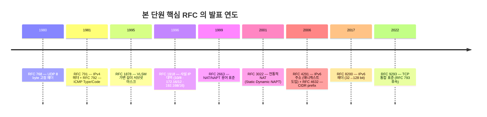
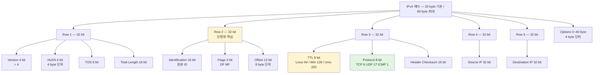
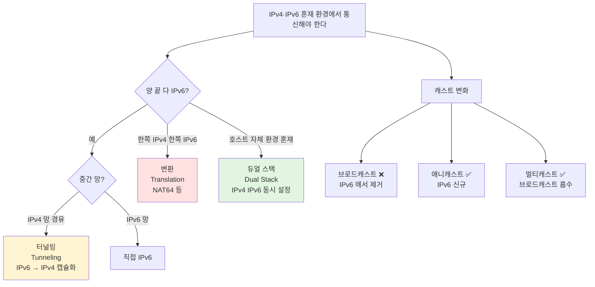
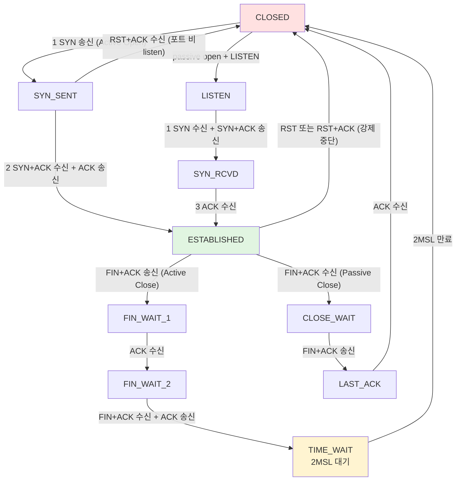
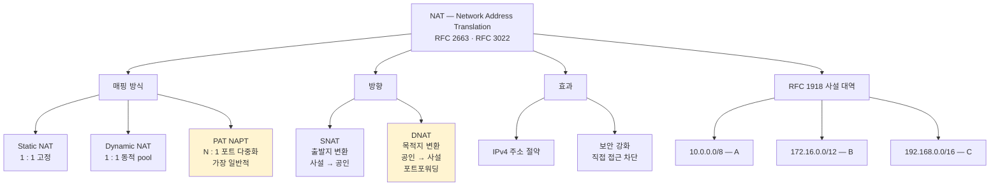

# 02. 네트워크 프로토콜과 주소체계 — 만화책처럼 읽는 ARP / IP / ICMP / TCP / UDP / NAT

> **이 문서를 읽는 법**: 만화책 한 권을 펼쳤다고 생각하세요. *에피소드*를 따라 *헤더 필드 → 동작 시퀀스 → 시험 함정* 의 흐름으로 외우면 자연스럽게 정착됩니다.
> 정확한 헤더 비트·RFC 번호·플래그 표기는 정확본을 참조: [[cs/information-security/02.network-security/02.network-protocols-and-addressing|정확본 02. 네트워크 프로토콜과 주소체계]]

> **연결 단원**: 본 단원의 *3·4계층 헤더*가 [[cs/information-security/02.network-security/04.scanning-sniffing-spoofing|04 스캐닝·스니핑·스푸핑]] 의 토대 — *ARP 스푸핑·ICMP Redirect 공격·TCP 세션 하이재킹*. *IP 단편화·TCP Flags*가 [[cs/information-security/02.network-security/05.dos-ddos-drdos|05 DoS·DDoS]] 의 *Tiny Fragment·SYN Flood* 의 직접 도구. *01 단원의 주소 길이 매트릭스 (MAC 48 / IPv4 32 / IPv6 128 / Port 16)* 가 본 단원의 출발점.

---

## 🎯 시작 전에 — 이미 쓰고 있는 프로토콜 어휘

| 매일 보는 것 | 사실은 이 단원의 |
|---|---|
| `arp -a` 의 출력 | 2계층 ↔ 3계층 매핑 (IP→MAC) |
| `ping example.com` | **ICMP Type 8 Echo Request → Type 0 Echo Reply** |
| `traceroute` 의 hop 수 | **TTL** 1씩 증가 시키며 ICMP Type 11 받기 |
| `netstat -an` 의 ESTABLISHED·TIME_WAIT | TCP **상태 다이어그램** (RFC 9293) |
| 공유기 뒤판의 사설 IP `192.168.x.x` | **RFC 1918** + **PAT (NAPT)** |
| HTTPS 443/tcp · DNS 53/tcp+udp | TCP·UDP 16bit Port |
| `MTU 1500` 이더넷 표준 | IP **단편화** 기준 |
| `Window Size` Wireshark 컬럼 | TCP **흐름제어** (슬라이딩 윈도우) |
| `SYN Flood`·`Tiny Fragment` 침해 보고서 | TCP **SYN 플래그** + IP **MF 비트** 악용 |

> **이 단원의 본질**: 2과목 출제 문제의 상당수는 *이 패킷이 어느 계층의 어떤 프로토콜이며 헤더의 어느 필드가 어떤 값일 때 무슨 의미인가*를 묻는다. 즉 *헤더 필드 길이·플래그 비트·시퀀스 다이어그램·포트 번호*를 *정량으로 외우는* 것이 목표.

---

## 📖 에피소드 1 — 1982년, ARP 의 등장: IP 를 MAC 으로

### 장면. 첫 통신의 문제

> "IP 주소만으로는 같은 네트워크 안의 어떤 NIC 가 받아야 하는지 알 수 없다. *MAC 주소*가 필요하다."

→ **ARP (Address Resolution Protocol)** 의 탄생. *3계층 IP 주소 → 2계층 MAC 주소* 변환.

### ARP 동작 3 단계

```
1. 송신자 (목적지 MAC 모름)
   → ARP Request 를 *브로드캐스트*
   → 2계층 이더넷 목적지 MAC = FF:FF:FF:FF:FF:FF (48bit 모두 1)

2. 해당 IP 의 노드
   → 자신의 MAC 을 담아 ARP Reply 를 *유니캐스트* 응답

3. 송신자
   → 알아낸 MAC 을 ARP Cache 에 *1~2분* 저장
```

### Request ↔ Reply — 캐스트 방향이 다르다

> **ARP Request = 브로드캐스트** (모두에게 묻기) / **ARP Reply = 유니캐스트** (당사자만 응답). 두 방향이 *반대*.

### 브로드캐스트 MAC — `FF:FF:FF:FF:FF:FF`

> 48 bit 가 *전부 1* = 6 바이트 모두 0xFF. 같은 LAN 의 *모든 노드*가 수신.

### 시험 함정

- "ARP 변환 방향?" → **IP → MAC**
- "ARP Request 캐스트?" → **브로드캐스트**
- "ARP Reply 캐스트?" → **유니캐스트**
- "이더넷 브로드캐스트 MAC?" → **`FF:FF:FF:FF:FF:FF`** (48 bit 모두 1)
- "ARP Cache TTL?" → **1~2 분 (dynamic)**

---

## 📖 에피소드 2 — RARP · GARP · ARP Cache + 통신 4종

### 장면. ARP 의 형제 둘과 캐스트 4 종

> ARP 의 변형 RARP·GARP, 그리고 *통신 방식 4종* (유니·브로드·멀티·애니캐스트) 을 한 번에 정리한다.

### RARP — MAC → IP

> **RARP (Reverse ARP)** = ARP 의 *역방향*. **MAC → IP**. *디스크리스 워크스테이션*처럼 자신의 IP 를 모르는 노드가 사용. 현재는 **DHCP 가 RARP 의 역할을 대체**.

### GARP — 자신의 정보 announce

> **GARP (Gratuitous ARP)** = *불필요한 ARP*. 출발지 IP 와 *목적지 IP 가 동일*한 ARP 요청. 자신의 MAC 정보를 *동일 네트워크에 알림 (announce)*.

| 용도 | 동작 |
|---|---|
| **IP 충돌 감지** | 자신의 IP 가 이미 쓰이는지 확인 |
| **ARP Cache 갱신** | 수신측이 자신의 ARP Cache 매핑 갱신 |
| **재부팅·IP 변경 시** | GARP 패킷 자동 생성 |

### ARP Cache — dynamic ↔ static

| 타입 | 설명 |
|---|---|
| **dynamic** | ARP 요청으로 알아낸 MAC. *1~2 분* 후 만료 |
| **static** | 관리자가 *직접 설정*. 삭제·종료 전까지 유지 |

### ARP 명령어 3종

```
arp -a              # ARP Cache 테이블 내용 확인
arp -d              # 캐시 삭제 (Linux: 뒤에 IP 명시)
arp -s [IP] [MAC]   # static 항목 설정
```

### 통신 4 캐스트 — 시험 1순위

| 캐스트 | 풀이 | 의미 | IPv4 / IPv6 |
|---|---|---|---|
| **유니캐스트** | Unicast | 1 : 1 전송 | IPv4 ✅ / IPv6 ✅ |
| **브로드캐스트** | Broadcast | 1 : 로컬 *모든 노드* (이더넷 MAC `FF:FF:FF:FF:FF:FF`) | IPv4 ✅ / **IPv6 ❌ (제거)** |
| **멀티캐스트** | Multicast | 1 : *원하는 다수* (IPv4 클래스 D `224.0.0.0~239.255.255.255`) | IPv4 ✅ / IPv6 ✅ (브로드캐스트 역할 흡수) |
| **애니캐스트** | Anycast | 1 : *가장 가까운 1 노드* | **IPv4 ❌ / IPv6 ✅ (도입)** |

### IPv6 의 변화 — 시험 함정

> *IPv6 는 브로드캐스트를 제거*하고 그 역할을 *멀티캐스트*로 흡수. *애니캐스트는 IPv6 에서 신규 도입*. **RFC 4291** 명시.

### 시험 함정

| 함정 | 정답 |
|---|---|
| RARP 변환 방향? | **MAC → IP** |
| RARP 의 현재 대체? | **DHCP** |
| GARP 풀이? | **Gratuitous ARP** |
| GARP 출발지·목적지 IP? | **같음** (자신 announce) |
| GARP 용도? | IP 충돌 감지 / ARP Cache 갱신 / 재부팅·IP 변경 |
| ARP 명령어 3? | `arp -a` / `arp -d` / `arp -s [IP] [MAC]` |
| IPv6 가 제거한 캐스트? | **브로드캐스트** |
| IPv6 가 도입한 캐스트? | **애니캐스트** |
| 클래스 D 멀티캐스트 대역? | **`224.0.0.0` ~ `239.255.255.255`** |

---

## 📖 에피소드 3 — IP 의 본질: 비연결형 + IPv4 헤더 12 필드

### 장면. 1981년, RFC 791 의 IP

> **IP** = *인터넷 계층*의 대표 프로토콜. **RFC 791** (1981) 표준화. *목적지 주소 기반 라우팅*이 본업.

### IP 의 두 본질 특성

| 특성 | 의미 |
|---|---|
| **비연결형** | 연결 상태를 *유지하지 않음* → *전송 순서 보장 ❌* |
| **비신뢰적** | *재전송·확인 응답 없음* → 신뢰성 ❌ |

> 이 두 특성이 *왜 TCP 가 필요한가*의 답. IP 는 *목적지로 보낼 뿐* 도착·순서·중복은 *상위 (TCP) 의 일*.

### IPv4 헤더 — 기본 20 byte (옵션 포함 최대 60 byte)

| 필드 | 길이 | 의미 |
|---|---|---|
| **Version** | 4 bit | IP 버전 (IPv4 = 4) |
| **HLEN** (Header Length) | 4 bit | 헤더 길이 (4 byte 단위) |
| **TOS** (Type of Service) | 8 bit | QoS 우선순위 |
| **Total Length** | 16 bit | 헤더 + 데이터 *전체 길이* |
| **Identification** | 16 bit | 단편화 전 *원본 IP 데이터그램 식별 ID* |
| **Flags** | **3 bit** | 단편화 제어 (1번째 미사용 / 2번째 **DF** / 3번째 **MF**) |
| **Fragmentation Offset** | **13 bit** | 현재 단편의 *상대 위치 (8 byte 단위)* |
| **TTL** (Time To Live) | 8 bit | 생존 시간 (라우터 통과마다 1 감소, 0 → 폐기) |
| **Protocol** | 8 bit | 상위 프로토콜 식별 (TCP=6 / UDP=17 / ICMP=1) |
| **Header Checksum** | 16 bit | IP 헤더 *오류 검증* |
| **Source IP** | **32 bit** | 송신자 |
| **Destination IP** | **32 bit** | 수신자 |
| Options | 0~40 byte | 옵션 |

### 외우는 방법 — 32 bit 행 단위

> *Source/Destination IP 가 각 32 bit*. *TTL + Protocol + Checksum* 이 한 행 (8 + 8 + 16 = 32 bit). *헤더 전체가 32 bit 행 단위로 정렬*.

### Protocol 필드 3 값 — 시험 1순위

> **TCP = 6 / UDP = 17 / ICMP = 1**. 다른 프로토콜 식별자보다 *이 셋*이 시험 1순위.

### 시험 함정

- "IP 두 특성?" → **비연결형 + 비신뢰적**
- "IPv4 헤더 기본 길이?" → **20 byte**
- "IPv4 헤더 최대?" → **60 byte** (옵션 40)
- "IP 표준 RFC?" → **RFC 791**
- "Identification 길이?" → **16 bit**
- "Flags 길이?" → **3 bit** (DF + MF + 미사용)
- "Fragmentation Offset 길이·단위?" → **13 bit · 8 byte 단위**
- "Source/Destination IP 길이?" → **각 32 bit**
- "Protocol 필드 — TCP·UDP·ICMP 값?" → **6 · 17 · 1**

---

## 📖 에피소드 4 — IP 단편화: TTL · DF · MF · MTU · tcpdump

### 장면. MTU 의 벽

> 이더넷 **MTU = 1500 byte**. IP 패킷이 1500 보다 크면 *분할*해서 보내야 한다 → **단편화 (Fragmentation)**.

### MTU·캡슐화·단편화·재조합

| 용어 | 의미 |
|---|---|
| **MTU** (Maximum Transmission Unit) | 물리 프레임의 *데이터부 최대 크기*. *이더넷 = 1500 byte* |
| **캡슐화** | IP 패킷 → 프레임으로 캡슐화 → MTU *초과 불가* |
| **단편화** | IP 패킷이 MTU 초과 시 *1500 이하로 분할* |
| **재조합** | 중계 라우터 *재조합 ❌* / **최종 목적지에서만 재조합** |

### Flags 비트 의미 — DF 와 MF

| 플래그 | 풀이 | 1 일 때 | 0 일 때 |
|---|---|---|---|
| **DF** | **D**on't **F**ragment | *단편화 금지* — 라우터가 ICMP `Fragmentation needed` 반환 | 단편화 허용 |
| **MF** | **M**ore **F**ragments | *추가 단편 더 있음* | **마지막 단편** |

### tcpdump 단편 형식 — Payload 3008 byte 분할 예시

| 단편 | tcpdump | Payload | Offset | MF |
|---|---|---|---|---|
| 1 | `frag 22666:1480@0+` | 1480 | 0 | 1 (`+`) |
| 2 | `frag 22666:1480@1480+` | 1480 | 1480 | 1 (`+`) |
| 3 | `frag 22666:48@2960` | 48 | 2960 | **0** (`+` 없음 = 마지막) |

### 형식 규칙

> `frag "단편ID":"크기(IP헤더 제외)"@"오프셋"+`. *`+` 가 있으면 추가 단편 있음 (MF=1)*, *`+` 없으면 마지막 (MF=0)*.

### 단편 손실 — ICMP `Fragment reassembly time exceeded`

> 단편 손실 시 → **ICMP Type 11 Code 1** 메시지를 최초 출발지로 전송 → *재조합 실패한 모든 단편 폐기*. (에피소드 7 ICMP 와 직결)

### TTL 초기값 — OS 핑거프린팅

| OS | TTL 초기값 |
|---|---|
| **Linux** | **64** |
| **Windows** | **128** |
| **Unix** | **255** |

> OS 별 *서로 다른 TTL 초기값*이 *OS 핑거프린팅* 도구.

### 시험 함정

| 함정 | 정답 |
|---|---|
| 이더넷 MTU? | **1500 byte** |
| 재조합 위치? | **최종 목적지에서만** |
| DF=1 의미? | *단편화 금지* |
| MF=1 의미? | *추가 단편 더 있음* |
| MF=0 의미? | *마지막 단편* |
| `+` 가 있는 tcpdump? | MF=1 (추가 단편) |
| TTL 초기값 — Linux? | **64** |
| TTL 초기값 — Windows? | **128** |
| TTL 초기값 — Unix? | **255** |
| 단편 손실 시 ICMP? | **Type 11 Code 1** (`Fragment reassembly time exceeded`) |

---

## 📖 에피소드 5 — IPv4 주소체계: 클래스 · CIDR/VLSM · 사설(RFC 1918) · 정적/동적

### 장면. 32 bit 가 어떻게 분배되는가

> IPv4 32 bit 주소를 *효율적으로 분배*하기 위한 4 차원 — 클래스 · CIDR/VLSM · 공인/사설 · 정적/동적.

### 1. 클래스 5종

| 클래스 | 첫 옥텟 범위 | 기본 마스크 | 용도 |
|---|---|---|---|
| **A** | 0 ~ 127 | /8 (255.0.0.0) | 대규모 |
| **B** | 128 ~ 191 | /16 (255.255.0.0) | 중규모 |
| **C** | 192 ~ 223 | /24 (255.255.255.0) | 소규모 |
| **D** | **224 ~ 239** | — | **멀티캐스트** |
| **E** | **240 ~ 255** | — | **연구·예약 (reserved)** |

### 외우는 방법 — 첫 옥텟 경계 4개

> *0·128·192·224·240*. *128 = 클래스 A 의 끝 + 1*, *192 = B 의 끝 + 1*, *224 = C 의 끝 + 1 = D 시작 (멀티캐스트)*, *240 = D 의 끝 + 1 = E 시작 (예약)*.

### 2. CIDR · VLSM · Subnetting

| 개념 | 풀이 | 의미 |
|---|---|---|
| **CIDR** | **C**lassless **I**nter-**D**omain **R**outing | 클래스 *무시* + prefix 표기 (`192.168.0.0/24`). **RFC 4632** |
| **VLSM** | **V**ariable-**L**ength **S**ubnet **M**ask | *서로 다른 길이*의 서브넷 마스크 사용. **RFC 1878** |
| **Subnetting** | — | 하나의 네트워크를 *여러 서브넷으로 분할* |

### CIDR ↔ VLSM — 본질 차이

> **CIDR = 클래스 무시 + prefix 표기 (전역 라우팅)** / **VLSM = 서브넷마다 다른 마스크 (내부 분할)**. CIDR 은 *외부 ASBR 향*, VLSM 은 *내부 분할 효율*.

### 3. 공인 주소 vs 사설 주소

| 구분 | 의미 | 대표 |
|---|---|---|
| **공인주소** | 인터넷 *고유 식별*. ICANN/IANA 관리 | (전역 유일) |
| **사설주소** | 사설망 내부 전용 + *인터넷 라우팅 ❌*. **RFC 1918** | A: **`10.0.0.0/8`** / B: **`172.16.0.0/12`** / C: **`192.168.0.0/16`** |

### RFC 1918 사설 대역 3개 — 시험 1순위

> **10/8 · 172.16/12 · 192.168/16**. *NAT (에피소드 13)* 와 함께 묶여 출제.

### 4. 정적 vs 동적 할당

| 방식 | 설명 |
|---|---|
| **정적 (Static)** | 관리자 수동 할당 |
| **동적 (Dynamic)** | DHCP 등 자동 할당 — *임대 시간 (lease time)* 동안 사용 |

### 시험 함정

- "클래스 D 대역?" → **224.0.0.0 ~ 239.255.255.255** (멀티캐스트)
- "클래스 E 대역?" → **240.0.0.0 ~ 255.255.255.255** (예약)
- "CIDR 표준 RFC?" → **RFC 4632**
- "VLSM 표준 RFC?" → **RFC 1878**
- "사설 주소 RFC?" → **RFC 1918**
- "사설 A 대역?" → **10.0.0.0/8**
- "사설 B 대역?" → **172.16.0.0/12**
- "사설 C 대역?" → **192.168.0.0/16**
- "DHCP 의 임대 개념?" → **lease time**

---

## 📖 에피소드 6 — IPv6: 128 bit + 5 특징 + 전환 3종

### 장면. 32 bit 의 고갈

> IPv4 32 bit 주소가 *고갈* → **IPv6** (RFC 8200, 2017) 도입. **128 bit** + *16 bit 단위 콜론 표기*.

### IPv6 의 5 특징

| 특징 | 설명 |
|---|---|
| **확대된 주소 공간** | 32 bit → **128 bit** (2^128 주소) |
| **단순해진 헤더** | IPv4 의 *불필요 필드 제거* → *빠른 처리* |
| **간편해진 주소 설정** | *내장된 자동 설정* (SLAAC) — 플러그 앤 플레이 |
| **강화된 보안성** | **IPsec 기본 제공** |
| **개선된 모바일 IP** | 헤더에서 *이동성 지원* |

### IPv6 전송방식 — 4 → 3종

> IPv6 는 *브로드캐스트 제거* + *애니캐스트 도입*.

| 방식 | IPv4 | IPv6 |
|---|---|---|
| 유니캐스트 | ✅ | ✅ |
| 브로드캐스트 | ✅ | **❌ (제거)** |
| 멀티캐스트 | ✅ | ✅ (브로드캐스트 흡수) |
| 애니캐스트 | ❌ | **✅ (도입)** |

### IPv4 ↔ IPv6 전환 3 종

| 기술 | 동작 |
|---|---|
| **듀얼 스택** (Dual Stack) | IPv4·IPv6 *동시 설정* → 통신 상대에 따라 선택 |
| **터널링** (Tunneling) | IPv6 패킷을 IPv4 패킷으로 *캡슐화* → IPv4 망 경유 |
| **주소·헤더 변환** (Translation) | IPv4 ↔ IPv6 *상호 변환* (NAT64 등) |

### 외우는 방법 — 동시·캡슐·변환

> *듀얼 스택 = 둘 다 켜둠* / *터널링 = 안에 다른 패킷을 감쌈* / *변환 = 한쪽을 다른 쪽으로 바꿈*. *영문 동사 그대로*가 동작.

### 시험 함정

- "IPv6 길이?" → **128 bit**
- "IPv6 표기?" → *16 bit 단위 16진수 콜론*
- "IPv6 표준 RFC?" → **RFC 8200**
- "IPv6 보안 기본 기능?" → **IPsec 기본 제공**
- "IPv6 가 제거한 것?" → **브로드캐스트**
- "IPv6 가 도입한 것?" → **애니캐스트**
- "전환 3 기술?" → 듀얼 스택 / 터널링 / 주소·헤더 변환
- "IPv6 자동 주소 설정?" → **SLAAC**

---

## 📖 에피소드 7 — ICMP: Type + Code + ping + traceroute

### 장면. IP 의 빈틈을 메우는 메신저

> **ICMP (Internet Control Message Protocol)** = IP 의 *비신뢰성 보완* 메신저. **RFC 792**. 헤더 = **Type + Code**.

### ICMP 메시지 2 분류

| 분류 | 용도 |
|---|---|
| **Error-Reporting Message** | 전송 오류 발생 시 에러 메시지 |
| **Query Message** | 네트워크 상태 *진단* |

### Error-Reporting 3 종 — 시험 1순위

| Type | 이름 | 의미 |
|---|---|---|
| **3** | Destination Unreachable | 목적지 도달 불가 |
| **5** | **Redirection** | 새 경로 알림 — *공격에 악용* (04 단원) |
| **11** | Time Exceeded | 타임아웃 발생 |

### Type 3 — Destination Unreachable Code

| Code | 의미 |
|---|---|
| 1 (Host Unreachable) | 라우터가 호스트로 전송 실패 |
| 2 (Protocol Unreachable) | 호스트가 해당 프로토콜 미사용 |
| **3** (Port Unreachable) | **UDP 포트가 닫힘** (TCP 는 RST 반환) |
| 4 (Fragmentation needed and DF was set) | DF=1 인데 단편화 필요 |

### Type 11 — Time Exceeded Code

| Code | 의미 |
|---|---|
| **0** (TTL exceeded in Transit) | TTL 0 도달 → 폐기. **`traceroute` 가 활용** |
| **1** (Fragment reassembly time exceeded) | 단편 재조합 타임아웃 → 모든 단편 폐기 |

### Query 2 종 — ping 의 본질

| Type | 이름 | 용도 |
|---|---|---|
| **8** | **Echo Request** | `ping` *송신* |
| **0** | **Echo Reply** | `ping` *응답* |

### TCP 닫힘 ↔ UDP 닫힘 — 응답 다름

| 프로토콜 | 포트 닫힘 시 응답 |
|---|---|
| **TCP** | **RST** 반환 |
| **UDP** | **ICMP Type 3 Code 3** (Port Unreachable) |

### ICMP Redirect 공격 예고

> Type 5 Redirection 은 *정상*적으로는 라우터 간 경로 재설정에 쓰이지만, *공격자*가 이를 위조하면 **ICMP Redirect 공격** = *희생자의 라우팅 테이블 변조* → 패킷 스니핑. [[cs/information-security/02.network-security/04.scanning-sniffing-spoofing|04 단원]] 의 주제.

### 시험 함정

- "ICMP 헤더 구조?" → **Type + Code**
- "ICMP 표준 RFC?" → **RFC 792**
- "Echo Request Type?" → **8**
- "Echo Reply Type?" → **0**
- "Destination Unreachable Type?" → **3**
- "Redirection Type?" → **5**
- "Time Exceeded Type?" → **11**
- "TCP 포트 닫힘?" → **RST**
- "UDP 포트 닫힘?" → **ICMP Type 3 Code 3**
- "traceroute 가 쓰는 ICMP?" → **Type 11 Code 0** (TTL 0)

---

## 📖 에피소드 8 — TCP 의 5 특성: 연결지향·순서·스트림·신뢰적·전이중

### 장면. IP 의 비신뢰를 메우는 4계층

> **TCP** = *프로세스 간 신뢰성*. **RFC 9293** (2022). IP 의 비연결·비신뢰를 *흐름·오류·혼잡 제어*로 보완.

### 5 본질 특성 — 시험 1순위

| 특성 | 영문 | 설명 |
|---|---|---|
| **연결지향** | Connection-Oriented | *가상 회선* 설정 후 통신 |
| **순서제어** | — | 논리적 연결통로로 *전송순서 보장* |
| **스트림 기반** | Stream | *임의 크기로 분할* + 연속 전송 |
| **신뢰적** | Reliable | **흐름·오류·혼잡 제어** |
| **전이중** | Full Duplex | *양방향 동시* |

### 신뢰성 보장 메커니즘 3종

| 메커니즘 | 동작 |
|---|---|
| **흐름 제어** | **슬라이딩 윈도우** — 윈도우 사이즈 내에서 ACK 기다리지 않고 *연속 전송* |
| **오류 제어** | 오류·누락 시 *재전송* |
| **혼잡 제어** | 데이터 누락 → *혼잡 상태 판단* → 전송량 *조절* |

### TCP 의 본질 — *프로세스-대-프로세스*

> *호스트 간 통신*은 IP 의 일. *프로세스 간 통신*이 TCP·UDP 의 일. 16 bit Port 로 식별.

### 시험 함정

- "TCP 5 특성?" → **연결지향 / 순서제어 / 스트림 / 신뢰적 / 전이중**
- "신뢰성 메커니즘 3?" → 흐름 / 오류 / 혼잡
- "흐름 제어 알고리즘?" → **슬라이딩 윈도우**
- "TCP 표준 RFC?" → **RFC 9293**
- "전이중 영문?" → **Full Duplex**

---

## 📖 에피소드 9 — TCP 헤더 + 6 Control Flags

### 장면. 20 byte 안에 신뢰성을 담다

> **TCP 헤더 기본 = 20 byte** (옵션 포함 최대 60 byte).

### TCP 헤더 11 필드

| 필드 | 길이 | 의미 |
|---|---|---|
| **Source Port** | 16 bit | 송신자 포트 |
| **Destination Port** | 16 bit | 수신자 포트 |
| **Sequence Number** | **32 bit** | 송신 데이터 *순서 번호* |
| **Acknowledgment Number** | **32 bit** | *상대방이 다음 보낼 순서번호* |
| **HLEN (Data Offset)** | 4 bit | 헤더 길이 (4 byte 단위) |
| Reserved | 6 bit | 예약 |
| **Control Flags** | **6 bit** | URG·ACK·PSH·RST·SYN·FIN |
| **Window Size** | 16 bit | *흐름제어용* 수신 버퍼 여유 |
| Checksum | 16 bit | 오류 검증 |
| **Urgent Pointer** | 16 bit | URG 시 긴급 데이터 위치 |
| Options | 0~40 byte | MSS · Window Scale 등 |

### 6 Control Flags — 비트 표기

| 플래그 | 비트 | 의미 |
|---|---|---|
| **FIN** | `000001` | 정상 연결 종료 |
| **SYN** | `000010` | 연결 설정 (순서번호 *동기화*) |
| **RST** | `000100` | 연결 *중단 (강제)* |
| **PSH** | `001000` | 송수신 버퍼 *즉시 처리* |
| **ACK** | `010000` | 수신 *확인 응답* |
| **URG** | `100000` | 긴급 데이터 |

### 외우는 방법 — F·S·R·P·A·U

> *비트 위치는 1 → 6 자리* 순서. 영문 풀이 그대로 *Finish · Synchronize · Reset · Push · Acknowledge · Urgent*.

### Sequence Number ↔ Acknowledgment Number

> Seq.Num 은 *내가 보내는 데이터의 순서*, Ack.Num 은 *상대방이 다음에 보낼 순서*. 즉 Ack.Num 은 *방금 받은 마지막 byte + 1*.

### 시험 함정

- "TCP 헤더 기본?" → **20 byte**
- "TCP 헤더 최대?" → **60 byte**
- "Sequence·Ack 길이?" → **각 32 bit**
- "Window Size 길이·용도?" → **16 bit · 흐름제어**
- "Urgent Pointer 트리거?" → **URG 플래그**
- "6 Control Flags?" → **URG · ACK · PSH · RST · SYN · FIN**
- "FIN 비트 표기?" → `000001`
- "SYN 비트 표기?" → `000010`

---

## 📖 에피소드 10 — 3-way Handshake: SYN → SYN+ACK → ACK + 포트 분류

### 장면. 가상 회선의 3 단계 설정

> TCP *연결지향*의 시작. **Active Open (클라이언트)** ↔ **Passive Open (서버)**.

### 3-way 시퀀스 — 시험 1순위

```
1. 클라이언트 (SYN) → 서버
   Seq.Num = 1000, Ack.Num = —
2. 서버 (SYN+ACK) → 클라이언트
   Seq.Num = 2000, Ack.Num = 1001  (← 클라이언트가 다음 보낼 순서)
3. 클라이언트 (ACK) → 서버
   Seq.Num = 1001, Ack.Num = 2001
```

### 상태 변화

```
SYN_SENT → SYN_RCVD → ESTABLISHED
```

### Active Open ↔ Passive Open

| 측 | 역할 |
|---|---|
| 클라이언트 | **Active Open** (능동 시작) |
| 서버 | **Passive Open** (수동 대기) |

### 초기 순서번호 (ISN) — 랜덤

> *ISN = Initial Sequence Number*. *랜덤한 값*으로 시작 → *세션 하이재킹* 방지 (04 단원).

### Port 분류 — IANA 표준

| 분류 | 범위 | 용도 |
|---|---|---|
| **Well-known port** | **0 ~ 1023** | 표준 서비스 (HTTP 80·SSH 22 등). *관리자 권한 필요* |
| **Registered port** | **1024 ~ 49151** | DBMS 등 등록 서비스 |
| **Dynamic / Private port** | **49152 ~ 65535** | 일반 클라이언트 *임시 포트* |

### 외우는 방법 — 1024 · 49152

> *1024 = 2^10 = Well-known 의 끝 + 1*. *49152 = 2^15 + 2^14 = Registered 의 끝 + 1*. *65535 = 2^16 - 1 = 16 bit Port 의 최대*.

### 시험 함정

- "3-way 순서?" → **SYN → SYN+ACK → ACK**
- "Active Open 측?" → 클라이언트
- "Passive Open 측?" → 서버
- "ISN?" → **랜덤** 값
- "ESTABLISHED 까지 상태?" → **SYN_SENT → SYN_RCVD → ESTABLISHED**
- "Well-known 범위?" → **0 ~ 1023**
- "Registered 범위?" → **1024 ~ 49151**
- "Dynamic 범위?" → **49152 ~ 65535**
- "Port 표준 관리?" → **IANA**

---

## 📖 에피소드 11 — 4-way Handshake + 거부·중단 + 2MSL

### 장면. 정상 종료의 4 단계

> 연결 *종료*는 4 단계가 필요. *양방향 가상 회선*이라 *양쪽 모두 종료 신호*를 보내야.

### 4-way 시퀀스

```
1. 클라이언트 (FIN+ACK) → 서버
2. 서버 (ACK)         → 클라이언트
3. 서버 (FIN+ACK)     → 클라이언트
4. 클라이언트 (ACK)    → 서버
```

### Active Close ↔ Passive Close

| 측 | 역할 |
|---|---|
| 능동 종료 | **Active Close** |
| 수동 종료 | **Passive Close** |

### 상태 변화 — RFC 9293 §3.3.2

```
Active Close 측:
  ESTABLISHED → FIN_WAIT_1 → FIN_WAIT_2 → TIME_WAIT → CLOSED

Passive Close 측:
  ESTABLISHED → CLOSE_WAIT → LAST_ACK → CLOSED
```

### TIME_WAIT 의 2MSL — 시험 함정

> *Active Close 측*은 마지막 ACK 전송 후 *즉시 종료하지 않고* **2MSL 시간 대기**. *마지막 ACK 분실 → 서버가 FIN+ACK 재전송*하는 경우 대비.

### 연결 거부 ↔ 연결 중단

| 상황 | 패킷 흐름 | 상태 변화 |
|---|---|---|
| **연결 요청 거부 (강제 종료)** : 서버 포트 *비 listen* | SYN → **RST+ACK** | `SYN_SENT → CLOSED` |
| **연결 중단 (abort)** : ESTABLISHED 에서 즉시 끊기 | **RST+ACK** 또는 **RST** | `ESTABLISHED → CLOSED` |

### 4-way ↔ 거부 ↔ 중단 — 응답 차이

| 상황 | 핵심 응답 |
|---|---|
| 정상 종료 | **FIN+ACK** (4번 교환) |
| 거부 (포트 비 listen) | **RST+ACK** (1번) |
| 중단 (ESTABLISHED 강제 종료) | **RST+ACK** 또는 **RST** |

### 시험 함정

- "4-way 순서?" → **FIN+ACK → ACK → FIN+ACK → ACK**
- "Active Close 상태?" → ESTABLISHED → FIN_WAIT_1 → FIN_WAIT_2 → **TIME_WAIT** → CLOSED
- "Passive Close 상태?" → ESTABLISHED → **CLOSE_WAIT** → **LAST_ACK** → CLOSED
- "TIME_WAIT 대기 시간?" → **2MSL**
- "2MSL 이유?" → 마지막 ACK 분실 대비
- "연결 거부 응답?" → **RST+ACK** (서버 포트 비 listen)
- "연결 중단 응답?" → **RST+ACK** 또는 **RST**

---

## 📖 에피소드 12 — MSS · 빠른 재전송 · UDP

### 장면. TCP 의 마지막 어휘들 + UDP 의 단순함

### MSS — Maximum Segment Size

> **MSS = MTU − IP 헤더 (20) − TCP 헤더 (20)**.

| 환경 | 계산 |
|---|---|
| 이더넷 (MTU 1500) | **1500 − 40 = 1460 byte** |

> 연결 설정 SYN 의 *TCP 옵션 헤더 MSS 필드*로 상호 *MSS 협상*.

### 재전송 vs 빠른 재전송

| 메커니즘 | 동작 | 혼잡 판단 |
|---|---|---|
| **재전송** (Retransmission) | 재전송 타이머 만료 후 재전송 | *매우 혼잡* |
| **빠른 재전송** (Fast Retransmit) | *동일 ACK 3회* 수신 시 즉시 재전송 | *덜 혼잡* |

### 빠른 재전송의 메커니즘

> 수신측이 *기대하지 않은 순서번호* 세그먼트 수신 → *기대하는 순서번호 ACK 즉시 전송*. 송신측이 *동일 ACK 3회* 받으면 누락으로 간주 → 즉시 재전송.

### UDP — 8 byte 고정

> **UDP** = *비연결형·비신뢰적 데이터그램*. **RFC 768**. 헤더 = **8 byte 고정** (4 필드 × 16 bit).

### UDP 헤더 4 필드

| 필드 | 길이 | 의미 |
|---|---|---|
| Source Port | 16 bit | 송신자 |
| Destination Port | 16 bit | 수신자 |
| **Total Length** | 16 bit | UDP 헤더 + 데이터 *전체* |
| Checksum | 16 bit | 오류 검증 |

### UDP 4 특성

| 특성 | 설명 |
|---|---|
| **비연결형** | 데이터그램마다 주소 정보 설정 |
| **비신뢰적** | 오류·혼잡 제어 ❌ |
| **데이터그램 기반** | *고정 크기* 전송 |
| **가벼움·빠름** | 최소 오버헤드 |

### UDP 사용 서비스 — 단발 패킷

> **DNS · NTP · DHCP · TFTP · SNMP · RIP**. 한 번의 패킷으로 끝나는 서비스에 적합.

### TCP 헤더 ↔ UDP 헤더 — 분량 차이

| | TCP | UDP |
|---|---|---|
| 기본 길이 | **20 byte** (옵션 60) | **8 byte 고정** |
| Sequence/Ack | ✅ (각 32 bit) | ❌ |
| Flags | ✅ (6 bit) | ❌ |
| Window Size | ✅ (16 bit) | ❌ |

### 시험 함정

| 함정 | 정답 |
|---|---|
| MSS 계산식? | **MTU − IP(20) − TCP(20)** |
| 이더넷 MSS? | **1460 byte** |
| 빠른 재전송 트리거? | **동일 ACK 3회** |
| 빠른 재전송 ↔ 재전송 — 혼잡 판단? | 빠른 재전송이 *덜 혼잡* |
| UDP 헤더 길이? | **8 byte 고정** |
| UDP 표준 RFC? | **RFC 768** |
| UDP 4 필드? | Source / Destination / Total Length / Checksum |
| UDP 사용 서비스? | DNS · NTP · DHCP · TFTP · SNMP · RIP |

---

## 📖 에피소드 13 — NAT: Static · Dynamic · PAT + SNAT/DNAT

### 장면. 사설 IP 가 인터넷으로 나가려면

> *사설 주소 (RFC 1918)*는 *인터넷 라우팅 ❌*. **NAT (Network Address Translation)** 가 *사설 ↔ 공인* 변환. **RFC 2663 · RFC 3022**.

### NAT 의 두 효과

| 효과 | 설명 |
|---|---|
| **IPv4 주소 절약** | 다수 사설 IP 가 *소수 공인 IP 공유* |
| **보안 강화** | 외부 → 내부 *직접 접근 차단* → 자연스러운 패킷 필터링 |

### NAT 분류 — 매핑 방식 3종

| 분류 | 매핑 |
|---|---|
| **Static NAT** | 사설 IP : 공인 IP = **1 : 1 (고정)** |
| **Dynamic NAT** | 사설 IP : 공인 IP = **1 : 1 (동적, pool)** |
| **PAT** (Port Address Translation, **NAPT**) | 사설 *N* : 공인 *1* — **포트 번호로 구분**. *가장 일반적* |

### PAT 가 일반적인 이유

> *공인 IP 1 개*에 *수많은 사설 클라이언트*를 *포트 번호로 다중화*. 가정용 공유기·기업 방화벽의 표준 동작.

### SNAT ↔ DNAT — 방향 분류

| 분류 | 풀이 | 변환 대상 | 방향·용도 |
|---|---|---|---|
| **SNAT** | **S**ource NAT | **출발지 IP** | 내부 → 외부 (사설 → 공인) |
| **DNAT** | **D**estination NAT | **목적지 IP** | 외부 → 내부 (공인 → 사설). **포트포워딩** |

### 외우는 방법 — Source vs Destination

> *SNAT = 보내는 사람 변환 (밖으로 나갈 때)* / *DNAT = 받는 사람 변환 (안으로 들어올 때)*. *포트포워딩 = DNAT*.

### 시험 함정

| 함정 | 정답 |
|---|---|
| NAT 두 효과? | IPv4 주소 절약 + **보안 강화** |
| Static / Dynamic / PAT 의 매핑? | 1:1 고정 / 1:1 동적 / **N:1 포트 다중화** |
| PAT 의 다른 이름? | **NAPT** |
| 가장 일반적 NAT? | **PAT** |
| SNAT 변환 대상? | **출발지 IP** (사설→공인) |
| DNAT 변환 대상? | **목적지 IP** (공인→사설) |
| 포트포워딩 = ? | **DNAT** |
| NAT 표준 RFC? | **RFC 2663 · RFC 3022** |
| NAT 와 묶이는 사설 RFC? | **RFC 1918** |

---

## 📑 종합 비교 (에피소드 1~13 정리)

시험 직전 *한눈에* 보는 view.

| 영역 | 핵심 |
|---|---|
| **ARP** | IP→MAC. Request 브로드캐스트 / Reply 유니캐스트 |
| **이더넷 브로드캐스트 MAC** | **`FF:FF:FF:FF:FF:FF`** (48 bit 모두 1) |
| **RARP** | MAC→IP. *DHCP 가 대체* |
| **GARP** | 자신 announce. 출발지·목적지 IP *동일*. IP 충돌 감지 |
| **ARP Cache** | dynamic (1~2분) / static (관리자) |
| **통신 4 캐스트** | 유니 / 브로드 (IPv6 ❌) / 멀티 (IPv4 클래스 D) / **애니 (IPv6 도입)** |
| **IP 두 특성** | 비연결형 + 비신뢰적 |
| **IPv4 헤더** | **20 byte 기본** (옵션 60). RFC 791 |
| **핵심 4 필드** | Identification 16 / Flags 3 (DF·MF) / Offset 13 / TTL 8 |
| **Protocol 값** | **TCP 6 / UDP 17 / ICMP 1** |
| **이더넷 MTU** | **1500 byte** |
| **DF / MF** | DF=1 단편화 금지 / MF=1 추가 단편 / MF=0 마지막 |
| **재조합 위치** | **최종 목적지에서만** |
| **TTL 초기값** | Linux **64** / Windows **128** / Unix **255** |
| **클래스 D 멀티캐스트** | **224.0.0.0 ~ 239.255.255.255** |
| **클래스 E 예약** | 240.0.0.0 ~ 255.255.255.255 |
| **CIDR / VLSM** | RFC 4632 (클래스 무시 prefix) / RFC 1878 (가변 마스크) |
| **사설 RFC 1918** | **10/8 · 172.16/12 · 192.168/16** |
| **IPv6** | **128 bit**. RFC 8200. **IPsec 기본** |
| **IPv6 변화** | 브로드캐스트 ❌ / 애니캐스트 ✅ |
| **IPv4↔IPv6 전환** | 듀얼 스택 / 터널링 / 변환 |
| **ICMP** | Type + Code. RFC 792 |
| **Error 3종** | Type **3** (Dest Unreach) / **5** (Redirect) / **11** (Time Exceeded) |
| **Query 2종** | Type **8** (Echo Request) / **0** (Echo Reply) |
| **TCP 닫힘 ↔ UDP 닫힘** | TCP **RST** / UDP **ICMP Type 3 Code 3** |
| **TCP 5 특성** | 연결지향 / 순서제어 / 스트림 / 신뢰적 / 전이중 |
| **신뢰성 메커니즘** | 흐름 (슬라이딩 윈도우) / 오류 (재전송) / 혼잡 |
| **TCP 헤더** | **20 byte 기본**. RFC 9293 |
| **6 Control Flags** | URG · ACK · PSH · RST · SYN · FIN |
| **Sequence/Ack** | 각 **32 bit** |
| **Window Size** | 16 bit (흐름제어) |
| **3-way** | **SYN → SYN+ACK → ACK** |
| **3-way 상태** | SYN_SENT → SYN_RCVD → ESTABLISHED |
| **4-way** | **FIN+ACK → ACK → FIN+ACK → ACK** |
| **4-way Active Close** | ESTABLISHED → FIN_WAIT_1 → FIN_WAIT_2 → **TIME_WAIT** → CLOSED |
| **4-way Passive Close** | ESTABLISHED → CLOSE_WAIT → LAST_ACK → CLOSED |
| **TIME_WAIT** | **2MSL 대기** (마지막 ACK 분실 대비) |
| **연결 거부** | SYN → **RST+ACK** (서버 포트 비 listen) |
| **연결 중단** | **RST+ACK** 또는 **RST** |
| **MSS** | MTU − IP(20) − TCP(20) = **1460 byte (이더넷)** |
| **빠른 재전송** | **동일 ACK 3회** → 즉시 재전송 |
| **Port 분류** | Well-known **0~1023** / Registered **1024~49151** / Dynamic **49152~65535** |
| **UDP 헤더** | **8 byte 고정** (4 필드 × 16 bit). RFC 768 |
| **UDP 사용** | DNS · NTP · DHCP · TFTP · SNMP · RIP |
| **NAT 분류** | Static / Dynamic / **PAT (N:1, NAPT)** |
| **NAT 방향** | **SNAT (출발지)** / **DNAT (목적지, 포트포워딩)** |
| **NAT RFC** | RFC 2663 · RFC 3022 |

---

## 🗺️ 마인드맵 1 — 프로토콜 RFC 시간선



**읽는 법**: *1980년대 = 기초 (IP·ICMP·UDP)* → *1990년대 = 효율 (CIDR·VLSM·사설 IP)* → *2000년대 = 확장 (NAT·IPv6·CIDR 후속)* → *2020년대 = 통합 표준 (TCP RFC 9293)* 의 *문제 해결 진화*.

---

## 🗺️ 마인드맵 2 — IPv4 헤더 12 필드 트리



**읽는 법**: 노랑 = *단편화 핵심 3 필드* + TTL (시험 1순위). 녹색 = Protocol 값 (6·17·1).

---

## 🗺️ 마인드맵 3 — IPv4 ↔ IPv6 전환 결정 트리



**읽는 법**: 녹색 = 호스트 *동시 설정* / 노랑 = *캡슐화* / 빨강 = *상호 변환*. 시험에서 *어떤 환경에 어떤 기술*을 묻는다.

---

## 🗺️ 마인드맵 4 — TCP 상태 다이어그램 (3-way + 4-way + 거부·중단)



**읽는 법**: 녹색 = 안정 상태 (ESTABLISHED). 노랑 = TIME_WAIT (2MSL 시험 함정). 빨강 = 종료 도달. 정상 4-way + 거부 (SYN→RST+ACK) + 중단 (RST) 한 그림에.

---

## 🗺️ 마인드맵 5 — NAT 분류 트리 (매핑 × 방향)



**읽는 법**: 노랑 = *시험 1순위* — PAT (N:1) + DNAT (포트포워딩).

---

## 🗂️ 키워드 클러스터 — 비슷한 이름 모아보기

### RFC 표준 — 본 단원 12개

```
RFC 768   — UDP (1980, 8 byte 고정 헤더)
RFC 791   — IPv4 (1981, 헤더 20 byte 기본)
RFC 792   — ICMP (1981, Type/Code)
RFC 1878  — VLSM
RFC 1918  — 사설 IP 대역 (10/8 · 172.16/12 · 192.168/16)
RFC 2663  — NAT/NAPT 용어
RFC 3022  — 전통적 NAT
RFC 4291  — IPv6 주소 (애니캐스트 도입)
RFC 4632  — CIDR
RFC 8200  — IPv6 (128 bit)
RFC 9293  — TCP 통합 표준
IANA      — Port 분류 (0~1023 / 1024~49151 / 49152~65535)
```

### 변환 프로토콜 — ARP 가족

```
ARP   — IP → MAC (Request 브로드캐스트, Reply 유니캐스트)
RARP  — MAC → IP (DHCP 가 대체)
GARP  — 자신 announce (IP 충돌 감지·재부팅·IP 변경)
```

### IPv4 헤더 — 단편화 4 필드

```
Identification 16 bit — 원본 ID
Flags 3 bit          — 미사용 + DF + MF
Offset 13 bit        — 8 byte 단위 위치
TTL 8 bit            — Linux 64 / Windows 128 / Unix 255
```

### IPv4 주소 — 클래스 5종

```
A — 0~127     /8    대규모
B — 128~191   /16   중규모
C — 192~223   /24   소규모
D — 224~239   —     멀티캐스트
E — 240~255   —     예약 (reserved)
```

### 사설 RFC 1918 — 3 대역

```
A — 10.0.0.0/8       (10.0.0.0  ~ 10.255.255.255)
B — 172.16.0.0/12    (172.16.0.0 ~ 172.31.255.255)
C — 192.168.0.0/16   (192.168.0.0 ~ 192.168.255.255)
```

### IPv6 — 5 특징

```
128 bit                  — 32 → 128 (2^128)
단순 헤더                 — 불필요 필드 제거
SLAAC                    — 자동 주소 설정
IPsec 기본 제공            — 강화된 보안성
모바일 IP                 — 헤더에서 이동성 지원
```

### IPv4 ↔ IPv6 전환 — 3 기술

```
듀얼 스택  — IPv4·IPv6 동시 설정 (호스트)
터널링    — IPv6 → IPv4 캡슐화 (망 경유)
변환     — IPv4 ↔ IPv6 상호 (NAT64)
```

### ICMP — Type / Code

```
Error 3종:
  Type 3  Destination Unreachable
    Code 1 Host Unreach / 2 Protocol / 3 Port (UDP) / 4 Frag needed + DF
  Type 5  Redirection (공격 악용)
  Type 11 Time Exceeded
    Code 0 TTL exceeded (traceroute) / 1 Fragment reassembly

Query 2종:
  Type 8 Echo Request (ping 송신)
  Type 0 Echo Reply (ping 응답)
```

### TCP — 6 Control Flags

```
URG  100000   긴급 데이터
ACK  010000   수신 확인 응답
PSH  001000   버퍼 즉시 처리
RST  000100   강제 중단
SYN  000010   연결 설정 (순서번호 동기화)
FIN  000001   정상 종료
```

### TCP — 3-way / 4-way 시퀀스

```
3-way: SYN → SYN+ACK → ACK
       SYN_SENT → SYN_RCVD → ESTABLISHED
       Active Open (클라이언트) / Passive Open (서버)
       ISN 랜덤

4-way: FIN+ACK → ACK → FIN+ACK → ACK
       Active Close: ESTABLISHED → FIN_WAIT_1 → FIN_WAIT_2 → TIME_WAIT (2MSL) → CLOSED
       Passive Close: ESTABLISHED → CLOSE_WAIT → LAST_ACK → CLOSED

거부:  SYN → RST+ACK    (포트 비 listen)
중단:  RST 또는 RST+ACK (ESTABLISHED 강제 종료)
```

### Port — IANA 분류

```
Well-known   0     ~ 1023    HTTP 80 · SSH 22 등
Registered   1024  ~ 49151   DBMS 등
Dynamic      49152 ~ 65535   클라이언트 임시
```

### MSS / 재전송

```
MSS = MTU − IP(20) − TCP(20)
    = 이더넷 1500 − 40 = 1460 byte

재전송       — 타이머 만료 (매우 혼잡)
빠른 재전송   — 동일 ACK 3회 (덜 혼잡)
```

### UDP

```
헤더 8 byte 고정:
  Source Port · Destination Port · Total Length · Checksum
  (모두 16 bit)

사용 서비스: DNS · NTP · DHCP · TFTP · SNMP · RIP
```

### NAT — 매핑 × 방향

```
매핑:
  Static  — 1 : 1 고정
  Dynamic — 1 : 1 동적 (pool)
  PAT (NAPT) — N : 1 (포트 다중화, 가장 일반적)

방향:
  SNAT — 출발지 변환 (사설 → 공인)
  DNAT — 목적지 변환 (공인 → 사설, 포트포워딩)
```

### 헷갈리는 짝 (시험 1순위)

| 짝 | 차이 |
|---|---|
| **ARP ↔ RARP** | IP→MAC ↔ MAC→IP |
| **ARP Request ↔ Reply** | 브로드캐스트 ↔ 유니캐스트 |
| **dynamic ↔ static (Cache)** | 1~2분 ↔ 영구 |
| **DF ↔ MF** | 단편화 금지 ↔ 추가 단편 있음 |
| **MF=1 ↔ MF=0** | 추가 단편 ↔ 마지막 |
| **클래스 D ↔ E** | 멀티캐스트 ↔ 예약 |
| **CIDR ↔ VLSM** | 클래스 무시 prefix ↔ 가변 마스크 |
| **공인 ↔ 사설** | 인터넷 라우팅 ✅ ↔ ❌ (NAT 필요) |
| **IPv4 브로드 ↔ IPv6 멀티** | IPv6 가 흡수 |
| **유니 ↔ 애니** | 1:1 ↔ 1:가장 가까운 1 (IPv6 도입) |
| **TCP RST ↔ UDP ICMP T3 C3** | 포트 닫힘 응답 |
| **Type 8 ↔ Type 0** | ping 송신 ↔ 응답 |
| **3-way ↔ 4-way** | SYN/SYN+ACK/ACK ↔ FIN+ACK 4번 |
| **Active Open ↔ Passive Open** | 클라이언트 ↔ 서버 |
| **Active Close ↔ Passive Close** | TIME_WAIT 2MSL ↔ CLOSE_WAIT/LAST_ACK |
| **연결 거부 ↔ 연결 중단** | SYN→RST+ACK ↔ ESTABLISHED→RST |
| **재전송 ↔ 빠른 재전송** | 타이머 ↔ 동일 ACK 3회 |
| **TCP 20 ↔ UDP 8** | 기본 헤더 길이 |
| **Static ↔ Dynamic ↔ PAT** | 1:1 고정 ↔ 1:1 동적 ↔ N:1 |
| **SNAT ↔ DNAT** | 출발지 (밖으로) ↔ 목적지 (안으로) |
| **Linux 64 ↔ Windows 128 ↔ Unix 255** | TTL 초기값 (OS 핑거프린팅) |

---

## 🃏 회상 30문항

> 답을 가린 뒤 자가 채점.

**A. ARP·RARP·GARP + 캐스트 (1~6)**
1. ARP 변환 방향과 Request·Reply 의 캐스트 차이는?
2. 이더넷 브로드캐스트 MAC 의 비트 표기는?
3. RARP 의 변환 방향과 현재 대체 프로토콜은?
4. GARP 의 출발지·목적지 IP 관계와 3 용도는?
5. ARP 명령어 3종은?
6. 통신 4 캐스트의 IPv4·IPv6 지원 차이는?

**B. IP 본질·헤더·단편화 (7~12)**
7. IP 의 두 본질 특성과 그 결과는?
8. IPv4 헤더 기본·최대 길이와 표준 RFC 는?
9. 단편화 핵심 4 필드의 길이는?
10. Protocol 필드의 TCP·UDP·ICMP 값은?
11. DF·MF 비트의 의미와 MF=0 의 뜻은?
12. TTL 초기값 — Linux·Windows·Unix 는?

**C. IPv4 주소 + IPv6 (13~18)**
13. 클래스 A·B·C·D·E 의 첫 옥텟 범위는?
14. CIDR·VLSM·Subnetting 의 본질 차이는?
15. RFC 1918 사설 3 대역은?
16. IPv6 길이·표기·표준 RFC 는?
17. IPv6 의 5 특징은?
18. IPv4 ↔ IPv6 전환 3 기술과 각각의 동작은?

**D. ICMP (19~22)**
19. ICMP 헤더 구조와 표준 RFC 는?
20. Error-Reporting 3종 Type 과 의미는?
21. Echo Request·Reply Type 은?
22. TCP 포트 닫힘 ↔ UDP 포트 닫힘 응답은?

**E. TCP (23~28)**
23. TCP 5 본질 특성은?
24. 신뢰성 메커니즘 3종은?
25. TCP 헤더 기본 길이와 6 Control Flags 는?
26. 3-way 시퀀스와 상태 변화는?
27. 4-way 시퀀스와 Active Close 의 TIME_WAIT 2MSL 이유는?
28. MSS 계산식과 이더넷 MSS 값은?

**F. UDP·NAT (29~30)**
29. UDP 헤더 길이와 4 필드, 표준 RFC 는?
30. NAT 분류 (Static·Dynamic·PAT) 와 방향 (SNAT·DNAT) 의 차이는?

---

## ⚠️ 시험 함정 모음

| 함정 | 정답 |
|---|---|
| ARP 방향? | **IP → MAC** |
| ARP Request 캐스트? | **브로드캐스트** |
| ARP Reply 캐스트? | **유니캐스트** |
| 이더넷 브로드캐스트 MAC? | **`FF:FF:FF:FF:FF:FF`** |
| RARP 방향? | **MAC → IP** |
| RARP 의 현재 대체? | **DHCP** |
| GARP 출발지·목적지 IP? | **같음** (자신 announce) |
| ARP Cache TTL (dynamic)? | **1~2 분** |
| IPv6 가 제거한 캐스트? | **브로드캐스트** |
| IPv6 가 도입한 캐스트? | **애니캐스트** |
| 클래스 D 대역? | **224.0.0.0 ~ 239.255.255.255** |
| 클래스 E 대역? | **240.0.0.0 ~ 255.255.255.255** |
| IP 두 특성? | **비연결형 + 비신뢰적** |
| IPv4 헤더 기본? | **20 byte** |
| IPv4 헤더 최대? | **60 byte** |
| IPv4 표준 RFC? | **RFC 791** |
| Identification 길이? | **16 bit** |
| Flags 길이·구성? | **3 bit (미사용 + DF + MF)** |
| Offset 길이·단위? | **13 bit · 8 byte 단위** |
| Source/Destination IP 길이? | **각 32 bit** |
| Protocol — TCP / UDP / ICMP? | **6 / 17 / 1** |
| 이더넷 MTU? | **1500 byte** |
| 재조합 위치? | **최종 목적지에서만** |
| DF=1? | *단편화 금지* |
| MF=0? | *마지막 단편* |
| TTL Linux / Windows / Unix? | **64 / 128 / 255** |
| `+` tcpdump 의미? | MF=1 (추가 단편) |
| CIDR RFC? | **RFC 4632** |
| VLSM RFC? | **RFC 1878** |
| 사설 RFC? | **RFC 1918** |
| 사설 A 대역? | **10.0.0.0/8** |
| 사설 B 대역? | **172.16.0.0/12** |
| 사설 C 대역? | **192.168.0.0/16** |
| IPv6 길이? | **128 bit** |
| IPv6 표준 RFC? | **RFC 8200** |
| IPv6 보안 기본? | **IPsec 기본 제공** |
| IPv6 자동 주소? | **SLAAC** |
| IPv6 주소 RFC? | **RFC 4291** |
| 전환 3 기술? | 듀얼 스택 / 터널링 / 변환 |
| ICMP 헤더 구조? | **Type + Code** |
| ICMP RFC? | **RFC 792** |
| Echo Request? | **Type 8** |
| Echo Reply? | **Type 0** |
| Destination Unreachable? | **Type 3** |
| Redirection? | **Type 5** |
| Time Exceeded? | **Type 11** |
| Port Unreachable Code? | **Type 3 Code 3** |
| TTL exceeded Code? | **Type 11 Code 0** |
| Fragment reassembly Code? | **Type 11 Code 1** |
| TCP 포트 닫힘? | **RST** |
| UDP 포트 닫힘? | **ICMP Type 3 Code 3** |
| TCP 5 특성? | 연결지향 / 순서제어 / 스트림 / 신뢰적 / 전이중 |
| 흐름 제어 알고리즘? | **슬라이딩 윈도우** |
| 신뢰성 3 메커니즘? | 흐름 / 오류 / 혼잡 |
| TCP RFC? | **RFC 9293** |
| TCP 헤더 기본? | **20 byte** |
| Sequence·Ack 길이? | **각 32 bit** |
| Window Size 길이·용도? | **16 bit · 흐름제어** |
| 6 Control Flags? | URG · ACK · PSH · RST · SYN · FIN |
| FIN 비트? | `000001` |
| SYN 비트? | `000010` |
| URG 비트? | `100000` |
| 3-way 순서? | **SYN → SYN+ACK → ACK** |
| 3-way 상태 변화? | SYN_SENT → SYN_RCVD → ESTABLISHED |
| Active Open 측? | 클라이언트 |
| Passive Open 측? | 서버 |
| ISN? | **랜덤** |
| 4-way 순서? | **FIN+ACK → ACK → FIN+ACK → ACK** |
| Active Close 상태? | ESTABLISHED → FIN_WAIT_1 → FIN_WAIT_2 → **TIME_WAIT** → CLOSED |
| Passive Close 상태? | ESTABLISHED → **CLOSE_WAIT** → **LAST_ACK** → CLOSED |
| TIME_WAIT 대기? | **2MSL** |
| 2MSL 이유? | 마지막 ACK 분실 대비 |
| 연결 거부 패킷? | **SYN → RST+ACK** |
| 연결 중단 패킷? | **RST+ACK** 또는 **RST** |
| MSS 계산? | **MTU − IP(20) − TCP(20)** |
| 이더넷 MSS? | **1460 byte** |
| 빠른 재전송 트리거? | **동일 ACK 3회** |
| Well-known 범위? | **0 ~ 1023** |
| Registered 범위? | **1024 ~ 49151** |
| Dynamic 범위? | **49152 ~ 65535** |
| Port 표준 관리? | **IANA** |
| UDP 헤더 길이? | **8 byte 고정** |
| UDP RFC? | **RFC 768** |
| UDP 4 필드? | Source / Destination / Total Length / Checksum |
| UDP 사용 서비스? | DNS · NTP · DHCP · TFTP · SNMP · RIP |
| NAT 두 효과? | IPv4 절약 + 보안 강화 |
| PAT 매핑? | **N : 1** (포트 다중화) |
| PAT 다른 이름? | **NAPT** |
| 가장 일반적 NAT? | **PAT** |
| SNAT 변환? | **출발지 IP** |
| DNAT 변환? | **목적지 IP** |
| 포트포워딩 = ? | **DNAT** |
| NAT RFC? | **RFC 2663 · RFC 3022** |

---

## 🔗 정확본 매핑표

| 본 노트 에피소드 | 정확본 § |
|---|---|
| 에피소드 1 (ARP) | [[cs/information-security/02.network-security/02.network-protocols-and-addressing#1-1. 정의\|정확본 §1-1·§1-2]] |
| 에피소드 2 (RARP·GARP·캐스트 4) | [[cs/information-security/02.network-security/02.network-protocols-and-addressing#1-3. RARP 동작 방식\|정확본 §1-3·§1-4·§1-5·§1-6·§1-7]] |
| 에피소드 3 (IP 본질 + 헤더) | [[cs/information-security/02.network-security/02.network-protocols-and-addressing#2-1. 정의·특성\|정확본 §2-1·§2-2]] |
| 에피소드 4 (단편화·MTU·TTL) | [[cs/information-security/02.network-security/02.network-protocols-and-addressing#2-4. IP 단편화 / MTU\|정확본 §2-4·§2-2-1·§2-2-2]] |
| 에피소드 5 (IPv4 주소체계) | [[cs/information-security/02.network-security/02.network-protocols-and-addressing#2-3. IPv4 주소체계\|정확본 §2-3]] |
| 에피소드 6 (IPv6) | [[cs/information-security/02.network-security/02.network-protocols-and-addressing#2-5. IPv6\|정확본 §2-5]] |
| 에피소드 7 (ICMP) | [[cs/information-security/02.network-security/02.network-protocols-and-addressing#3. ICMP (Internet Control Message Protocol)\|정확본 §3]] |
| 에피소드 8 (TCP 5 특성) | [[cs/information-security/02.network-security/02.network-protocols-and-addressing#4-1. 정의·서비스\|정확본 §4-1]] |
| 에피소드 9 (TCP 헤더 + 6 Flags) | [[cs/information-security/02.network-security/02.network-protocols-and-addressing#4-2. TCP 헤더 구조\|정확본 §4-2·§4-4]] |
| 에피소드 10 (3-way + Port 분류) | [[cs/information-security/02.network-security/02.network-protocols-and-addressing#4-5. 3-way Handshake — 연결 설정\|정확본 §4-3·§4-5]] |
| 에피소드 11 (4-way + 거부·중단) | [[cs/information-security/02.network-security/02.network-protocols-and-addressing#4-6. 4-way Handshake — 연결 종료\|정확본 §4-6·§4-7]] |
| 에피소드 12 (MSS·재전송·UDP) | [[cs/information-security/02.network-security/02.network-protocols-and-addressing#4-8. MSS — 분할과 재조합\|정확본 §4-8·§4-9·§5]] |
| 에피소드 13 (NAT) | [[cs/information-security/02.network-security/02.network-protocols-and-addressing#6. NAT (Network Address Translation) — 외부 보강\|정확본 §6]] |

---

## 📅 학습 흐름

```
[1주]   에피소드 1·2 (ARP 가족 + 통신 4 캐스트) — 마인드맵 1 (RFC 시간선)
[2주]   에피소드 3·4 (IP 본질·IPv4 헤더·단편화·TTL) — 마인드맵 2 (헤더 트리)
[3주]   에피소드 5 (IPv4 주소체계) — 클래스 + RFC 1918 + CIDR/VLSM 통째 암기
[4주]   에피소드 6 (IPv6) + 마인드맵 3 (전환 결정 트리)
[5주]   에피소드 7 (ICMP) — Type 3·5·11 + 8·0 + UDP 닫힘 ↔ TCP 닫힘 매핑
[6주]   에피소드 8·9 (TCP 5 특성 + 헤더 + 6 Flags) — 비트 표기 직접 암기
[7주]   에피소드 10·11 (3-way·4-way + 거부·중단) — 마인드맵 4 (상태 다이어그램)
[8주]   에피소드 12 (MSS·빠른 재전송·UDP) — Port 분류 통째 암기
[9주]   에피소드 13 (NAT) — 마인드맵 5 (매핑 × 방향)
[10주]  회상 30문항 → 틀린 것만 정확본 깊이 학습
[11주]  함정 모음 매일 1회 + 정확본 1회 정독
[12주]  04 단원 (스캐닝·스니핑·스푸핑) 진입 준비 — 본 단원의 *ARP / ICMP Redirect / TCP Flags* 가 04 의 직접 도구
```

---

> **다음 단원**: [[cs/information-security/02.network-security/03.network-tools-and-wireless|03. 네트워크 도구·무선]] — 본 단원의 *ARP·ICMP·TCP·UDP* 가 03 의 *ping·traceroute·netstat·tcpdump 명령어*로 *직접 사용*. 무선랜 (WEP·WPA·WPA2·EAP) 은 *2계층 데이터 링크 프레임 암호화*.
