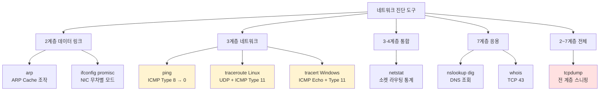
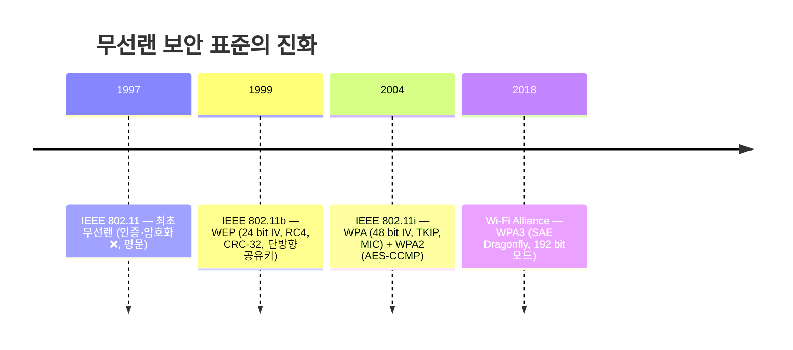
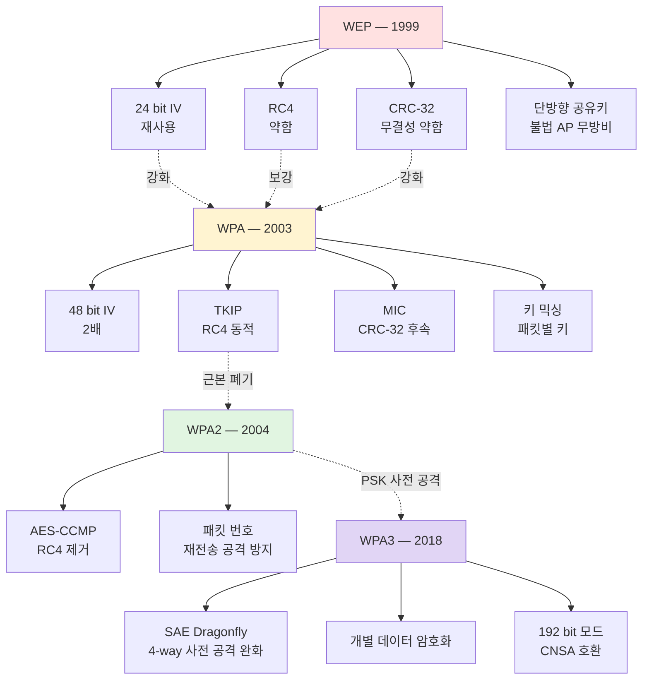
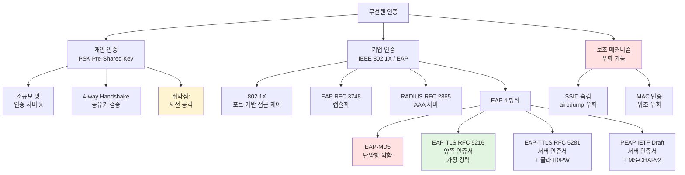
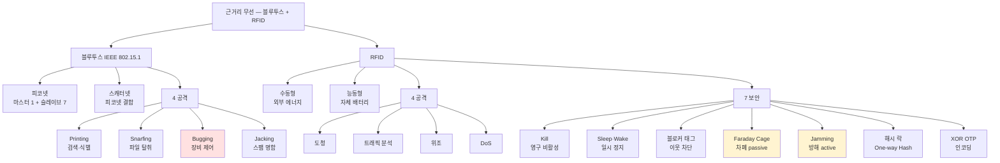

# 03. 네트워크 도구·무선 — 만화책처럼 읽는 진단 도구·블루투스·RFID·무선랜

> **이 문서를 읽는 법**: 만화책 한 권을 펼쳤다고 생각하세요. *에피소드*를 따라 *도구가 어느 계층의 어느 헤더를 읽는가* + *무선 표준의 약점 → 다음 강화 흐름*을 따라가면 자연스럽게 외워집니다.
> 정확한 옵션·표준 번호·RFC 는 정확본을 참조: [[cs/information-security/02.network-security/03.network-tools-and-wireless|정확본 03. 네트워크 도구·무선]]

> **연결 단원**: 본 단원의 *진단 도구* (ping·traceroute·netstat·tcpdump·arp) 는 [[cs/information-security/02.network-security/02.network-protocols-and-addressing|02 단원]] 의 *ARP·ICMP·TCP·UDP* 를 *명령어로 직접 활용*. *tcpdump·iwconfig 모니터 모드*는 [[cs/information-security/02.network-security/04.scanning-sniffing-spoofing|04 단원]] 의 스니핑 토대. *무선랜 인증 4-way Handshake* 는 02 단원의 *TCP 4-way 와 다른 메커니즘* — 혼동 주의.

---

## 🎯 시작 전에 — 이미 쓰고 있는 도구·표준

| 매일 보는 것 | 사실은 이 단원의 |
|---|---|
| `ping example.com` | **ICMP Echo Request (Type 8) → Echo Reply (Type 0)** |
| `traceroute / tracert` 의 hop | **TTL 1부터 증가** + ICMP Time Exceeded |
| `netstat -an` 의 ESTABLISHED | 4계층 소켓 상태 |
| `netstat -rn` 의 Metric · Genmask | 3계층 라우팅 테이블 |
| `tcpdump -i eth0` | 2~7계층 *전 계층 패킷 도청* (스니핑 도구) |
| `ifconfig wlan0 promisc` | NIC *무차별 모드* — 더미 허브 환경 스니핑 |
| Wi-Fi 공유기의 *SSID 숨김* 옵션 | 보조 메커니즘 (도구로 우회 가능) |
| Wi-Fi 패스워드 입력 후 *4-way Handshake* | **WPA-PSK / WPA2-PSK** 인증 |
| 회사 Wi-Fi 의 *기업 인증서·계정 인증* | **EAP / IEEE 802.1X / RADIUS** |
| 블루투스 페어링 시 *마스터·슬레이브* | 피코넷 (마스터 1 + 슬레이브 7) |

> **이 단원의 본질**: *도구*는 어느 *계층의 어느 헤더*를 읽는지 묻고, *무선 표준*은 *각 표준의 약점 → 다음 표준의 강화* 흐름을 묻는다. **WEP → WPA → WPA2 → WPA3 의 진화 인과**가 시험 1순위.

---

## 📖 에피소드 1 — ping: ICMP Echo 의 왕복

### 장면. 종단 도달성 진단의 표준

> **ping** = 종단 노드 간 *네트워크 상태 관리* 명령. **ICMP Echo Request (Type 8) 와 Echo Reply (Type 0)** 를 이용 → 대상 시스템의 *접근성·속도·품질* 검사.

### 동작 2 단계

```
1. 로컬 → 대상 : ICMP Type 8 (Echo Request) 전송
2. 대상 → 로컬 : ICMP Type 0 (Echo Reply) 응답 → 접근성 확인
```

### 플랫폼별 옵션 — 시험 1순위

| 플랫폼 | 명령 예시 | `-c`/`-n` (횟수) | `-s`/`-l` (크기) |
|---|---|---|---|
| **Windows** | `ping -n 5 -l 128 www.google.com` | **`-n`** | **`-l`** |
| **Linux** | `ping -c 5 -s 128 www.google.com` | **`-c`** | **`-s`** |

### 외우는 방법 — Windows 는 *number/length*, Linux 는 *count/size*

> *Windows = number (-n) / length (-l)* / *Linux = count (-c) / size (-s)*. 영어 풀이 그대로.

### 시험 함정

- "ping 이 사용하는 ICMP Type?" → **8 (요청) / 0 (응답)**
- "Windows ping 횟수 옵션?" → **`-n`**
- "Linux ping 횟수 옵션?" → **`-c`**
- "Windows ping 크기 옵션?" → **`-l`**
- "Linux ping 크기 옵션?" → **`-s`**

---

## 📖 에피소드 2 — traceroute / tracert: TTL 의 마법

### 장면. 1 부터 증가하는 TTL

> **traceroute (Linux) / tracert (Windows)** = 종단 노드 사이 *중계 노드 경로 추적*. **TTL 필드를 1 부터 점차 증가**시키며 패킷 송신 → *각 라우터의 ICMP Time Exceeded* 응답으로 경로 역추적.

### 동작 5 단계

```
1. 라우터가 패킷 수신 시 TTL 1 감소
2. TTL = 0 → 패킷 폐기
3. ICMP Time Exceeded (Type 11) 를 *최초 출발지*로 반환
4. 출발지가 TTL 값을 계속 증가시켜 다음 라우터까지 도달
5. 최종 목적지 도달 → 도달 알림 → 종료
```

### Linux ↔ Windows — 패킷 종류가 다르다

| 도구 | 사용 패킷 | 최종 목적지 응답 |
|---|---|---|
| **traceroute** (Linux) | **UDP** (TTL 1부터 증가) | 닫힌 UDP 포트 → ICMP `Destination Unreachable` (Type 3) |
| **tracert** (Windows) | **ICMP Echo Request** (TTL 1부터 증가) | ICMP `Echo Reply` (Type 0) |

### `*` 표시의 의미

> 보안상 라우터에서 *ICMP 응답을 차단*하면 → traceroute 결과에 `*` 출력. 정상 침묵.

### 외우는 방법 — UDP 는 닫혀 있어 ICMP T3, ICMP 는 응답 ICMP T0

> *Linux UDP* → *닫힌 포트가 ICMP Type 3 Code 3 반환* (Port Unreachable, [[cs/information-security/02.network-security/02.network-protocols-and-addressing|02 단원]] 와 직결) / *Windows ICMP* → *Echo Reply 로 응답*.

### 시험 함정

| 함정 | 정답 |
|---|---|
| traceroute (Linux) 패킷? | **UDP** |
| tracert (Windows) 패킷? | **ICMP Echo Request** |
| 둘의 공통점? | **TTL 1 부터 증가** |
| 중간 라우터 응답? | **ICMP Time Exceeded (Type 11)** |
| Linux 최종 목적지 응답? | **ICMP Destination Unreachable (Type 3)** |
| Windows 최종 목적지 응답? | **ICMP Echo Reply (Type 0)** |
| `*` 의미? | 라우터의 ICMP 응답 차단 |

---

## 📖 에피소드 3 — netstat: 소켓·라우팅·통계 한 명령

### 장면. 만능 진단 도구

> **netstat** = 시스템의 *네트워크 관련 다양한 상태정보* 관리. **소켓 / 라우팅 / 인터페이스 / 프로토콜 통계** 를 한 명령으로.

### 옵션 8 종 — 시험 1순위

| 옵션 | 동작 |
|---|---|
| (없음) | *연결된* 소켓 상태 |
| **`-a`** | **모든** 소켓 상태 |
| `-i` | 네트워크 인터페이스 정보 |
| **`-r`** | **라우팅 테이블** 정보 |
| **`-s`** | 프로토콜별 **통계** |
| `-t` | TCP 소켓 정보 |
| `-u` | UDP 소켓 정보 |
| **`-n`** | 네트워크 주소를 *숫자 형식*으로 |
| **`-p`** | 소켓의 *프로세스명·PID* |

### 외우는 방법 — 영문 풀이

> *all (-a)* / *interface (-i)* / *route (-r)* / *statistics (-s)* / *tcp/udp (-t/-u)* / *numeric (-n)* / *process (-p)*. 영어 첫 글자 그대로.

### 소켓 상태 출력 6 필드 (`netstat -t`)

| 필드 | 의미 |
|---|---|
| **Proto** | 프로토콜 종류 |
| **Recv-Q** | 원격 호스트 → 수신 버퍼에 저장된 데이터 |
| **Send-Q** | 송신 버퍼에 저장된 데이터 |
| **Local Address** | 로컬 호스트 소켓 주소 |
| **Foreign Address** | 원격 호스트 소켓 주소 |
| **State** | 소켓 상태 (ESTABLISHED·TIME_WAIT 등) |

### 라우팅 테이블 출력 6 필드 (`netstat -rn`)

| 필드 | 의미 |
|---|---|
| **Destination** | 목적지 호스트·네트워크 |
| **Gateway** | 1차 경유지 주소 |
| **Genmask** | 목적지 식별 *서브넷 마스크* |
| **Flags** | 경로 상태 플래그 |
| **Metric** | 경로 효율성 — **클수록 비용↑·우선순위↓** |
| **Iface** | 사용할 네트워크 인터페이스 |

### Metric 함정 — 02 단원과 동일

> **Metric 은 클수록 우선순위 낮음**. 검색 우선순위 *호스트 → 네트워크 → default gateway* 는 [[cs/information-security/02.network-security/02.network-protocols-and-addressing|02 단원 §2-6]] 에서 정리.

### 시험 함정

- "모든 소켓 옵션?" → **`-a`**
- "라우팅 테이블 옵션?" → **`-r`**
- "프로토콜 통계 옵션?" → **`-s`**
- "숫자 형식 옵션?" → **`-n`**
- "PID 표시 옵션?" → **`-p`**
- "Recv-Q 의 의미?" → 수신 버퍼 데이터 크기
- "Metric 함정?" → **클수록 우선순위 낮음**

---

## 📖 에피소드 4 — 인터페이스·스니핑·부가 도구: ifconfig·tcpdump·arp·dig·whois

### 장면. 도구 세트의 나머지

> 진단 도구 세트의 *나머지 6 도구*를 한 번에 정리.

### ifconfig (Linux) ↔ ipconfig (Windows)

| 도구 | 핵심 옵션 |
|---|---|
| **ifconfig** | `ifconfig [인터페이스] promisc` 로 **무차별 모드 전환** / `-promisc` 해제 |
| **ipconfig** | `ipconfig /all` 상세 / `ipconfig /displaydns` DNS 캐시 조회 / `ipconfig /flushdns` DNS 캐시 삭제 |

### ifconfig 의 promisc 모드 — 스니핑 도구

> `ifconfig wlan0 promisc` = NIC 를 *무차별 모드*로 전환. *목적지가 자신이 아닌 패킷도 모두 수신*. [[cs/information-security/02.network-security/01.network-fundamentals|01 단원 §NIC]] + [[cs/information-security/02.network-security/04.scanning-sniffing-spoofing|04 단원 스니핑]] 의 도구.

### tcpdump — 전 계층 패킷 스니퍼

> **tcpdump** = 네트워크 인터페이스 *모든 패킷의 내용 출력*. *스니핑 도구의 일종* + 공격자 추적·공격 유형 분석에 활용.

```bash
tcpdump -i eth0                  # eth0 인터페이스 트래픽 모니터링
tcpdump -i eth0 host 1.2.3.4     # 특정 IP 만
tcpdump -i eth0 port 80          # 특정 포트만
```

### arp / nslookup / dig / whois — 부가 도구 4종

| 도구 | 용도 |
|---|---|
| **arp** | `arp -a` 조회 / `arp -d` 삭제 / `arp -s [IP] [MAC]` 정적 설정 (02 단원 §1-6) |
| **nslookup** | DNS 레코드 조회 |
| **dig** | nslookup 의 *후속 도구* — 유닉스·리눅스 *기본 설치* |
| **whois** | 도메인 등록정보 / 소유정보 / 네임서버 / IP 대역 *관리 대행자* 조회 |

### 도구 → 계층·프로토콜 매핑표 — 시험 1순위

| 도구 | 계층/프로토콜 | 핵심 용도 |
|---|---|---|
| **ping** | 3 (ICMP) | 도달성 진단 (Type 8/0) |
| **traceroute / tracert** | 3 (UDP+ICMP / ICMP) | TTL 기반 경로 추적 |
| **netstat** | 4 / 3 | 소켓·라우팅·통계 |
| **ifconfig / ipconfig** | 2/3 | 인터페이스 설정 |
| **tcpdump** | **2 ~ 7** | *전 계층* 스니핑·분석 |
| **arp** | 2/3 (ARP) | ARP Cache 조작 |
| **nslookup / dig** | 7 (DNS) | DNS 레코드 조회 |
| **whois** | 7 (TCP/43) | 도메인·IP 등록정보 |

### 시험 함정

- "ifconfig 의 promisc 옵션 구문?" → `ifconfig [인터페이스] promisc`
- "DNS 캐시 조회 (Windows)?" → **`ipconfig /displaydns`**
- "DNS 캐시 삭제 (Windows)?" → **`ipconfig /flushdns`**
- "tcpdump 의 동작 계층?" → **2 ~ 7 (전 계층)**
- "whois 의 포트?" → **TCP/43**
- "dig 의 정체?" → nslookup *후속 도구* (유닉스 기본 설치)

---

## 📖 에피소드 5 — 블루투스: 피코넷 1+7 + 4 공격

### 장면. 짧은 거리 무선의 표준

> **블루투스** = 짧은 거리 무선 LAN. 전화기·노트북·컴퓨터 등을 연결. **마스터-슬레이브** 방식. **IEEE 802.15.1**.

### 링크 형태 2종

| 형태 | 설명 |
|---|---|
| **피코넷 (Piconet)** | 마스터 1대 + 슬레이브 *최대 **7대*** |
| **스캐터넷 (Scatternet)** | 피코넷 *여러 개의 결합* — 계층적·규모 큰 네트워크 |

### 외우는 방법 — 7 의 의미

> *피코넷 = pico (작은) net + 마스터 1 + 슬레이브 7*. *스캐터넷 = 피코넷의 모음 (Scatter = 흩어진)*.

### 블루투스 4대 공격 — 영문 동사로 외우기

| 공격 | 영문 어원 | 의미 |
|---|---|---|
| **블루프린팅** (BluePrinting) | Print = 발자국 | *공격 장치 검색* (식별 단계) |
| **블루스나핑** (BlueSnarfing) | Snarf = 훔치기 | *임의 파일 접근* (탈취) |
| **블루버깅** (BlueBugging) | Bug = 도청·통제 | *장비 제어* (취약 연결 관리 악용) |
| **블루재킹** (BlueJacking) | Hijack = 가로채기 | *명함 스팸 전송* (익명) |

### 외우는 방법 — 단어 어원이 곧 동작

> *Print (식별) → Snarf (탈취) → Bug (제어) → Jack (스팸)*. *공격의 강도 순*이기도 함 (식별 → 정보 탈취 → 통제 → 부수적 스팸).

### 시험 함정

- "피코넷 슬레이브 최대?" → **7대**
- "스캐터넷의 정체?" → 피코넷 *여러 개의 결합*
- "블루투스 표준?" → **IEEE 802.15.1**
- "장비 제어 공격?" → **BlueBugging**
- "파일 탈취 공격?" → **BlueSnarfing**
- "장치 검색 공격?" → **BluePrinting**
- "스팸 명함 공격?" → **BlueJacking**

---

## 📖 에피소드 6 — RFID: 수동/능동 + 4 공격 + 7 보안 메커니즘

### 장면. 무선 주파수로 ID 식별

> **RFID** (Radio-Frequency Identification) = *무선 주파수*로 ID 식별. *태그가 송신하는 전파의 에너지원 차이*로 두 종류.

### RFID 분류 2종

| 분류 | 에너지원 |
|---|---|
| **수동형 (Passive)** | 리더기로부터 받은 *전파 에너지*를 사용 (자체 전원 ❌) |
| **능동형 (Active)** | *자체 배터리*로 전파 송신 |

### RFID 4 공격

| 공격 | 설명 |
|---|---|
| **도청 (Eavesdropping)** | 적극적 (공격자 리더기로 태그 스캐닝) + 수동적 (리더-태그 통신 도청) |
| **트래픽 분석** | *트래픽 양 분석*으로 정보 추정 |
| **위조 (Spoofing)** | 데이터 항목 *지우거나 대신* → 잘못된 데이터 교환 |
| **서비스 거부 (DoS)** | *수많은 질의*로 응답 자원 소진 |

### RFID 7 보안 메커니즘 — 시험 1순위

| 보안 기법 | 동작 |
|---|---|
| **Kill 명령어** | 태그를 *영구 비활성화* (재활용 ❌) |
| **Sleep / Wake 명령어** | *잠시 정지* + 안전한 곳에서 *재동작* |
| **블로커 태그 (Blocker Tag)** | 전용 IC 태그를 소지 → *주변 IC 태그 ID 읽기 차단* |
| **Faraday Cage** | *금속성 박막*으로 무선 신호 *차폐 (passive)* |
| **Jamming** | *강한 방해 신호*로 불법 리더기 접근 차단 *(active)* |
| **해시 락 (Hash Lock)** | One-way 해시 함수 기반 접근제어 |
| **XOR 기반 OTP** | XOR 같은 *간단 연산*으로 태그 데이터 인코딩 |

### Faraday Cage ↔ Jamming — 헷갈림 1순위

| | Faraday Cage | Jamming |
|---|---|---|
| 방식 | *차폐 (수동)* | *방해 신호 송신 (능동)* |
| 비유 | *금속 상자에 가둠* | *시끄러운 소음 발생기* |

### 외우는 방법 — Kill / Sleep·Wake / 블로커 / 차폐 / 방해 / 해시 / 인코딩

> *Kill (영구 차단)* → *Sleep·Wake (일시)* → *블로커 (이웃 차단)* → *Cage (차폐 passive)* → *Jamming (방해 active)* → *Hash Lock (암호 기반)* → *XOR OTP (인코딩)* 의 *7 단계*.

### 시험 함정

- "수동형 ↔ 능동형 RFID 차이?" → 자체 *배터리* 유무
- "RFID 4 공격?" → 도청 / 트래픽 분석 / 위조 / DoS
- "Faraday Cage ↔ Jamming?" → 차폐 (passive) ↔ 방해 신호 (active)
- "Kill 명령어 결과?" → *영구 비활성화 (재활용 ❌)*
- "블로커 태그 동작?" → 주변 IC 태그 *읽기 차단*
- "해시 락 기반?" → **One-way 해시 함수**

---

## 📖 에피소드 7 — 무선랜 일반: SSID·BSSID·ESS·DS·Beacon + 표준 변천

### 장면. IEEE 802.11 의 어휘

> **무선랜 (IEEE 802.11)** = 무선 신호로 두 대 이상의 장치를 연결. *근거리 + 이동성*. 핵심 어휘 6 + 환경 4 + 특성 4 + 표준 변천.

### 핵심 어휘 6 — 시험 1순위

| 용어 | 의미 |
|---|---|
| **SSID** (Service Set Identifier) | *무선랜 식별 이름* — **32 byte** |
| **BSS** (Basic Service Set) | 가장 *기본 망 단위* — AP + 그 AP 의 클라이언트 |
| **BSSID** | BSS 식별 ID — *AP 의 **48 bit MAC 주소*** |
| **ESS** (Extended Service Set) | *여러 BSS 의 묶음* (다수 AP 의 논리 집합) |
| **ESSID** | ESS 식별 ID — 복수 AP 환경 |
| **DS** (Distribution System) | AP 가 연결된 *유선 네트워크* (AP 이후 반드시 유선) |

### Beacon 프레임 + 무선 브리지

| 어휘 | 의미 |
|---|---|
| **Beacon 프레임** | AP 가 자신의 *무선랜 존재를 정기 알림* (브로드캐스트) |
| **무선 브리지** | *2개 이상의 무선랜* 연결 — 떨어진 두 무선랜에 각각 위치 |

### 헷갈리는 짝 — SSID ↔ BSSID ↔ ESSID

| | 의미 | 길이·정체 |
|---|---|---|
| **SSID** | 무선랜 *이름* | 32 byte |
| **BSSID** | 단일 BSS *ID* | **AP 의 MAC (48 bit)** |
| **ESSID** | 다수 BSS *묶음 ID* | 복수 AP 환경 |

### 무선랜 환경 4종

| 환경 | 운영 |
|---|---|
| **상용 무선랜** | 이동통신사 고객 서비스 |
| **공중 무선랜** | 호텔·카페 등 *불특정 다수* |
| **사설 무선랜** | 일반 사용자 *공유기* |
| **기업 무선랜** | 기업 *내부 업무* |

### 무선랜 4 특성 (전파 특성)

| 특성 | 의미 |
|---|---|
| **감쇠 (Attenuation)** | 신호가 *모든 방향으로 퍼져* 강도 급격 감소 |
| **간섭 (Interference)** | *같은 주파수* 다른 송신자 신호 받음 |
| **다중경로 전달** | 장애물 반사로 *같은 송신자에게서 여러 신호* |
| **오류** | 유선보다 *오류·오류 감지가 더 심각* |

### IEEE 802.11 보안 표준 변천 — 시험 1순위

| 표준 | 연도 | 도입 |
|---|---|---|
| **IEEE 802.11** | 1997 | *최초 무선랜* — *인증·암호화 ❌, 평문 전송* |
| **IEEE 802.11b** | 1999 | **WEP** 규정 (암호화·인증 도입) |
| **IEEE 802.11i** | 2004 | **WPA · WPA2** 규정 (강화 암호화·인증) |

### 외우는 방법 — 1997·1999·2004

> *1997 = 최초·평문 시대* / *1999 = WEP* / *2004 = WPA·WPA2 (802.11i 완성)*. *2018 = WPA3 (외부 보강)*.

### 시험 함정

- "SSID 길이?" → **32 byte**
- "BSSID = ?" → **AP 의 MAC 주소 (48 bit)**
- "ESSID 의 본질?" → 다수 BSS 의 *논리 묶음*
- "Beacon 프레임?" → AP 가 자신을 *정기 알림 (브로드캐스트)*
- "DS = ?" → AP 가 연결된 *유선 네트워크*
- "무선랜 4 특성?" → 감쇠 / 간섭 / 다중경로 / 오류
- "IEEE 802.11 보안 변천?" → 802.11 (평문) → 802.11b (WEP) → 802.11i (WPA·WPA2)

---

## 📖 에피소드 8 — 무선랜 보안 취약점: 물리·기술·관리 3 분류

### 장면. 보안 취약점이 어디에 있는가

> 무선랜의 *근본 약점*은 *전파의 브로드캐스트 특성*. 이를 3 분류로 정리.

### 3 분류 한 표

| 분류 | 취약점 |
|---|---|
| **물리적** | 외부 노출 AP *도난·파손* / *리셋 버튼* 초기화 / *전원 케이블 분리* / LAN 케이블 절체 |
| **기술적** | **도청** (브로드캐스트 → 스니핑 취약) / **DoS** (대량 무선 패킷 → 무선랜 무력화) / **불법 AP** (불법 AP 설치 → 접속 유도) |
| **관리적** | 장비 관리 미흡 / 사용자 보안 의식 부족 / *전파 출력 관리 미흡* (외부 유출) |

### 핵심 취약점 — 기술적 3종

| 기술적 취약점 | 본질 |
|---|---|
| **도청** | 무선의 *브로드캐스트 특성* — 유선과 본질 차이 |
| **DoS** | *대량 무선 패킷*으로 무력화 |
| **불법 AP** | 정상 AP 처럼 *위장 설치* → 클라이언트 접속 유도 |

### 외우는 방법 — 물리·기술·관리 3 축

> *물리 = 하드웨어 노출* / *기술 = 프로토콜 약점* / *관리 = 사람의 실수*. 보안 분류의 *3 표준 축*.

### 시험 함정

- "무선랜 취약점 3 분류?" → **물리적 / 기술적 / 관리적**
- "기술적 취약점 3종?" → 도청 / DoS / **불법 AP**
- "도청이 가능한 본질?" → 무선의 *브로드캐스트 특성*
- "리셋 버튼은 어느 분류?" → **물리적**
- "전파 출력 관리 미흡?" → **관리적**

---

## 📖 에피소드 9 — WEP: 24 bit IV + RC4 + CRC-32 의 첫 시도

### 장면. 1999년, IEEE 802.11b 의 첫 보안

> **WEP** (Wired Equivalent Privacy) = *유선급 사생활*. **IEEE 802.11b** 표준에서 처음 적용. *암호화 + 인증* 둘 다 제공.

### WEP 구성 4 요소

| 요소 | 설명 |
|---|---|
| **WEP 암호키** | 고정된 *공유키* + *24 bit 초기벡터 (IV)* 조합 |
| **RC4 알고리즘** | WEP 암호키의 *키 스트림 생성* |
| **공유키 인증** | 서로 같은 *공유키*를 가진 사용자가 인증·통신 |
| **CRC-32** | *평문 무결성 보장* 알고리즘 |

### 외우는 방법 — 4 요소가 곧 4 약점

> *WEP 의 4 요소는 모두 약점 → 다음 표준 (WPA) 의 강화 항목*. *IV 24 → 48 bit / RC4 → TKIP / CRC-32 → MIC / 공유키 단방향 → 4-way Handshake*.

### WEP 암호화 4 문제점

| 문제점 | 본질 |
|---|---|
| **짧은 IV (24 bit)** | IV *재사용 가능성* 높음 |
| **불완전한 RC4** | *암호키 노출* 가능 |
| **짧은 암호키** | *공격 가능성* |
| **암호키 노출 시** | 무선 데이터 *전체 노출* |

### WEP 인증 2 문제점

| 문제점 | 본질 |
|---|---|
| **단방향 인증** | *불법 AP 인지 알 수 없음* (피해 발생) |
| **고정 공유키** | *동일 키 사용* → 외부 유출 시 전체 위험 |

### 핵심 약점 한 줄

> *짧은 IV + 약한 RC4 + 약한 CRC-32 + 단방향 인증 + 고정 공유키*. *5 약점이 모여 WEP 의 종말*.

### 시험 함정

| 함정 | 정답 |
|---|---|
| WEP 표준? | **IEEE 802.11b** |
| WEP IV 길이? | **24 bit** |
| WEP 암호 알고리즘? | **RC4** |
| WEP 무결성 알고리즘? | **CRC-32** |
| WEP 인증의 약점? | **단방향 + 고정 공유키** |
| WEP 의 5 약점? | 짧은 IV / 약한 RC4 / 짧은 키 / 단방향 / 고정 키 |

---

## 📖 에피소드 10 — WPA: 48 bit IV + TKIP + MIC, 그러나 RC4 잔존

### 장면. 2003년, WEP 의 응급 패치

> **WPA** (Wi-Fi Protected Access) = WEP 취약성 보완. **IEEE 802.11i** 표준. 암호 알고리즘은 **RC4-TKIP**.

### WPA 강화 4 요소

| 요소 | 설명 |
|---|---|
| **길어진 IV** | WEP 24 bit → **48 bit** *2배* 확장 |
| **TKIP** (Temporal Key Integrity Protocol) | 공유 비밀키 *동적 생성* + *무선 구간 패킷 암호화* |
| **키 믹싱 (Key Mixing)** | *각 패킷마다 별도 암호키* 적용 함수 |
| **MIC** (Message Integrity Code) | *CRC-32 보다 안전*한 메시지 무결성 검사 |

### WEP ↔ WPA — 한 표 매칭

| 요소 | WEP | WPA |
|---|---|---|
| IV | 24 bit | **48 bit** |
| 암호 알고리즘 | RC4 (정적 키) | **RC4 + TKIP** (동적 키) |
| 무결성 | CRC-32 | **MIC** |
| 키 사용 | *고정 공유키* | *키 믹싱 + 패킷별 별도 키* |

### 그래도 남는 3 문제점

| 문제점 | 본질 |
|---|---|
| **불완전한 RC4** | *여전히 RC4* — 근본 약점 잔존 |
| **키 관리** | 키 관리 *방법 미제공* + 키 크랙 공격 취약 |
| **소프트웨어** | *소프트웨어 처리* → 암·복호화 시간 지연 |

### 핵심 한 줄

> *WPA = WEP 의 *겉을 강화*. RC4 의 *근본*은 그대로*. → 다음 표준 (WPA2) 에서 RC4 자체 제거 필요.

### 시험 함정

| 함정 | 정답 |
|---|---|
| WPA 표준? | **IEEE 802.11i** |
| WPA IV 길이? | **48 bit** (WEP 24 의 2배) |
| WPA 암호 알고리즘? | **RC4 + TKIP** |
| WPA 무결성? | **MIC** (CRC-32 의 후속) |
| WPA 가 못 푼 약점? | *RC4 자체* |
| TKIP 풀이? | **Temporal Key Integrity Protocol** |
| MIC 풀이? | **Message Integrity Code** |

---

## 📖 에피소드 11 — WPA2 (AES-CCMP) + WPA3 (SAE)

### 장면. 2004년, RC4 와의 결별

> **WPA2** = WPA 의 *후속*. **IEEE 802.11i 의 완전 구현**. 암호 알고리즘은 **AES-CCMP** (AES + Counter Mode with CBC-MAC). *RC4 의존성 제거*.

### WPA2 의 핵심

| 요소 | 설명 |
|---|---|
| **AES-CCMP** | AES 기반 블록 암호 + 메시지 인증 코드 결합 — *검증된 보안성* |
| **TKIP 와 유사한 키 관리** | *패킷 번호*로 **재전송 공격 방지** |

### AES-CCMP 풀이

> **CCMP** = **C**ounter Mode with **C**BC-**M**AC **P**rotocol. *AES + CTR 모드 + CBC-MAC 인증*. [[cs/information-security/04.security-general/05.crypto-algorithms|4과목 §5-7]] 의 *CCM 인증 암호*가 무선랜에 적용된 형태.

### WPA3 (2018) — Wi-Fi Alliance

> **WPA3** = Wi-Fi Alliance 2018 발표. **SAE (Simultaneous Authentication of Equals, Dragonfly)** 키 교환 도입 → *PSK 사전 공격 취약성 완화*.

### WPA3 강화 3 영역

| 영역 | 설명 |
|---|---|
| **SAE 키 교환** | 4-way Handshake *사전 공격 완화* |
| **개별 데이터 암호화** | 공중 네트워크에서도 *클라이언트별 암호화* |
| **192 bit 보안 모드** | *정부·금융·국방용* 강화 모드 (CNSA 호환) |

### WEP → WPA → WPA2 → WPA3 — 한 표

| | IV | 암호 | 무결성 | 인증 | 약점 |
|---|---|---|---|---|---|
| **WEP** | **24 bit** | RC4 | CRC-32 | 단방향 공유키 | 5 약점 |
| **WPA** | **48 bit** | RC4 + **TKIP** | **MIC** | 4-way Handshake | RC4 잔존 |
| **WPA2** | — | **AES-CCMP** | AES-CCMP | 4-way Handshake | PSK 사전 공격 |
| **WPA3** | — | AES-CCMP / GCMP-256 | 동일 | **SAE Dragonfly** | (강화) |

### 핵심 진화 한 줄

> *WEP = RC4 부족 → WPA = RC4 보강 → WPA2 = RC4 폐기 + AES-CCMP → WPA3 = PSK 사전 공격 차단 + SAE*. *각 단계가 이전 단계의 약점을 해결*.

### 시험 함정

| 함정 | 정답 |
|---|---|
| WPA2 암호 알고리즘? | **AES-CCMP** |
| AES-CCMP 풀이? | AES + Counter Mode + CBC-MAC |
| WPA2 표준? | IEEE 802.11i 완전 구현 |
| WPA3 키 교환? | **SAE (Dragonfly)** |
| WPA3 발표? | **Wi-Fi Alliance, 2018** |
| WPA3 의 192 bit 모드? | *정부·금융·국방용* (CNSA 호환) |
| RC4 의존 제거 시점? | **WPA2** |

---

## 📖 에피소드 12 — 무선랜 인증: PSK 사전 공격 + EAP / 802.1X / RADIUS

### 장면. 두 인증 방식 — 개인 vs 기업

> WPA·WPA2 의 인증 방식은 *환경에 따라 둘로 분기*. **개인 (PSK)** vs **기업 (EAP / 802.1X / RADIUS)**.

### 개인 인증 — PSK (Pre-Shared Key)

> PSK = *인증 서버가 설치되지 않은 소규모 망*. AP 와 단말기가 *동일한 공유키* 보유 여부를 **4-way Handshake** 로 확인.

### PSK 사전 공격 6 단계 — 시험 1순위

```
1. 공격자가 4-way Handshake 과정을 *스니핑*
2. 사전 파일 단어로 PSK *추측·생성*
3. 추측 PSK + 스니핑 파라미터로 PTK (Pairwise Transient Key) 생성
4. PTK 로 MIC 값 생성 → 스니핑한 MIC 값과 *비교*
5. 일치 → 추측 패스워드 = 접속·인증 패스워드
6. 불일치 → 다른 단어로 *반복*
```

### PSK 의 핵심 취약점

> *추측 가능한 공유키*면 사전 공격으로 *손쉽게 크랙*. → WPA3 의 SAE 가 이를 완화 (에피소드 11).

### 기업 인증 — IEEE 802.1X / EAP

> *대규모 망*에서는 **IEEE 802.1X** 표준의 EAP 인증 사용. **RADIUS 서버**가 AAA (인증·인가·과금) 처리.

### 기업 인증 3 요소

| 요소 | 풀이 | 역할 |
|---|---|---|
| **EAP** | **E**xtensible **A**uthentication **P**rotocol | *캡슐화 프로토콜* — 다양한 인증 방법 *전송* (자체는 인증 ❌). RFC 3748 |
| **IEEE 802.1X** | *Port-Based Network Access Control* | *포트 기반* 접근 제어 — 인증되지 않은 장치 차단 |
| **RADIUS 서버** | **R**emote **A**uthentication **D**ial **I**n **U**ser **S**ervice | AAA 인증 서버. EAP 메시지 처리. RFC 2865 |

### EAP 4 방식 — 시험 1순위

| 방식 | 인증 방식 | 표준 |
|---|---|---|
| **EAP-MD5** | MD5 챌린지 — *단방향, 보안 약함* | (deprecated) |
| **EAP-TLS** | *클라이언트·서버 모두 인증서* — **가장 강력한 상호 인증** | **RFC 5216** |
| **EAP-TTLS** | 서버는 인증서, 클라이언트는 *ID/패스워드* (TLS 터널 내부) | **RFC 5281** |
| **PEAP** | 서버는 인증서, 클라이언트는 *MS-CHAPv2 등* (TLS 터널 내부) | IETF Draft (de facto) |

### EAP 4 방식 헷갈림 — 인증서·패스워드 매트릭스

| 방식 | 서버 | 클라이언트 |
|---|---|---|
| **MD5** | — | MD5 |
| **TLS** | 인증서 | **인증서** |
| **TTLS** | 인증서 | ID/패스워드 |
| **PEAP** | 인증서 | MS-CHAPv2 |

> *TLS 만 양쪽 인증서*. *TTLS·PEAP 는 서버만 인증서 + 클라이언트 패스워드 (TLS 터널 안)*.

### PEAP 의 표준 위치 — 시험 함정

> **PEAP 는 RFC 표준화 단계 도달 ❌**. *IETF Draft* + *Microsoft·Cisco 의 사실상 표준 (de facto)*. *유일하게 RFC 가 없는 EAP 방식*.

### SSID·MAC 보조 메커니즘 — 우회 가능

| 인증 기술 | 장점 | 우회 |
|---|---|---|
| **SSID 설정 접속 제한** | SSID 모르면 접속 ❌ | *airodump-ng* 같은 분석 도구로 알아냄 |
| **MAC 주소 인증** | 등록 단말만 접속 | *인증된 MAC 위조* |

### 핵심 한 줄

> SSID 숨김·MAC 필터링은 *보조 메커니즘* — *반드시 우회 가능*. *주 메커니즘*은 PSK (소규모) 또는 EAP/802.1X (기업).

### 무선랜 보안 대책 — 환경 3 분류 (정확본 §6-4)

> 무선랜 보안 적용은 *환경*에 따라 권고가 분기. **기업 / 개인·SOHO / 무선 AP 물리·관리** 3 영역.

| 환경 | 권고 |
|---|---|
| **기업 네트워크** | 무선 단말 인증 — **WPA2-기업의 RADIUS 서버를 활용한 EAP 기반 인증** / 전송데이터 암호화 — *검증된 WPA2 보안규격의 **AES-CCMP** 방식* |
| **개인·SOHO 사업자** | 사설망 인증 — **WPA2-개인의 PSK 인증** + *안전한 인증 패스워드* / 전송데이터 암호화 — WPA2 **AES-CCMP** / 무선랜 사업자의 인증서버 통한 단말 인증 사용 |
| **무선 AP 물리·관리** | **SSID 변경 및 브로드캐스트 금지** (초기 SSID 변경·숨김 설정) / 무선 AP 의 **기본 패스워드 변경** (추측 어려운 패스워드·주기적 변경) / 무선 AP 의 *물리적 접근 제한* (보호 케이스·리셋 버튼 차단) |

### 외우는 방법 — 환경별 *주 메커니즘 1 + 암호 1*

| 환경 | 주 인증 | 암호 |
|---|---|---|
| **기업** | WPA2-기업 (EAP + RADIUS) | AES-CCMP |
| **개인** | WPA2-개인 (PSK + 강력 패스워드) | AES-CCMP |
| **물리·관리** | SSID 변경·숨김 + 기본 패스워드 변경 | (물리 접근 제한) |

> *기업 = EAP / 개인 = PSK / 물리 = SSID·패스워드·접근*. *암호화는 모두 AES-CCMP*.

### 시험 함정

| 함정 | 정답 |
|---|---|
| 소규모 인증? | **PSK** |
| 기업 인증? | **EAP / IEEE 802.1X** |
| PSK 사전 공격 1단계? | 4-way Handshake *스니핑* |
| PSK 사전 공격에서 생성되는 키? | **PTK** |
| 기업 무선랜 권고 인증·암호? | **WPA2-기업 (EAP + RADIUS) + AES-CCMP** |
| 개인 무선랜 권고 인증·암호? | **WPA2-개인 (PSK + 강력 패스워드) + AES-CCMP** |
| 무선 AP 물리·관리 3 권고? | SSID 변경·숨김 / 기본 패스워드 변경 / 물리 접근 제한 |
| MIC 비교 후? | 일치 → 패스워드 / 불일치 → 다른 단어 반복 |
| EAP 표준 RFC? | **RFC 3748** |
| EAP-TLS 표준 RFC? | **RFC 5216** |
| EAP-TTLS 표준 RFC? | **RFC 5281** |
| PEAP 의 표준? | **IETF Draft** (사실상 표준) |
| 가장 강력한 EAP? | **EAP-TLS** (양쪽 인증서) |
| RADIUS 표준 RFC? | **RFC 2865** |
| RADIUS 의 역할? | **AAA** (인증·인가·과금) |
| 802.1X 의 본질? | **포트 기반 접근 제어** |
| SSID 숨김의 한계? | *분석 도구로 우회 가능* |
| MAC 인증의 한계? | *MAC 위조로 우회 가능* |

---

## 📖 에피소드 13 — WAP / WTLS + aircrack-ng + iwconfig

### 장면 1. WAP — 모바일을 위한 표준

> **WAP** (Wireless Application Protocol) = 모바일 단말기용 *무선 응용 표준*. **WAP2** 가 *종단-대-종단 보안* 제공. IP·XML·HTML·HTTP 와 호환.

### WAP 6 컴포넌트 — 시험 1순위

| 컴포넌트 | 풀이 | 역할 |
|---|---|---|
| **WDP** | **W**ireless **D**atagram **P**rotocol | 상위 WAP 프로토콜을 *모바일 노드 ↔ WAP 게이트웨이*에 적합하게 변형 |
| **WTP** | **W**ireless **T**ransaction **P**rotocol | *브라우징·전자상거래 트랜잭션* 요청·응답 |
| **WSP** | **W**ireless **S**ession **P**rotocol | 응용 프로그램에 *세션 서비스 인터페이스* |
| **WML** | **W**ireless **M**arkup **L**anguage | 제한된 통신·화면·입력 환경의 *콘텐츠·양식 표현* |
| **WAE** | **W**ireless **A**pplication **E**nvironment | 모바일·PDA 의 *응용 프레임워크* 규격화 |
| **WTLS** | **W**ireless **T**ransport **L**ayer **S**ecurity | *전송 계층 보안* — TLS 기반. 두 개 계층 구성 |

### WTLS 의 정체

> **WTLS = 무선 환경의 TLS**. SSL/TLS 와 동등한 역할. WAP 의 *유일한 보안 컴포넌트*.

### 외우는 방법 — D·T·S·M·A·L 의 영어 풀이

> *Datagram (전송) → Transaction (트랜잭션) → Session (세션) → Markup (마크업) → Application Environment (응용 환경) → Transport Layer Security (보안)*. 영문 풀이 그대로.

### 장면 2. aircrack-ng 도구 모음

> 무선랜 접속·인증 *패스워드 크래킹*. **WEP / WPA / WPA2-PSK** 인증 패스워드 크래킹 가능.

### 5 도구 한 표

| 도구 | 역할 |
|---|---|
| **airmon-ng** | 무선랜 인터페이스를 *모니터 모드*로 전환 |
| **airodump-ng** | 무선 패킷 *수집·저장* |
| **aireplay-ng** | 무선 네트워크에 패킷 *삽입* |
| **airdecap-ng** | 암호화된 패킷 덤프 *복호화* |
| **aircrack-ng** | 패스워드 *크랙* 출력 |

### 외우는 방법 — 단계 순서 그대로

> *모니터 모드 (airmon)* → *수집 (airodump)* → *삽입 (aireplay)* → *복호화 (airdecap)* → *크랙 (aircrack)* 의 *5 단계*. *공격 흐름이 곧 도구 순서*.

### 장면 3. iwconfig — 무선랜 인터페이스 모드

| 모드 | 동작 |
|---|---|
| **관리 (Managed) 모드** | *자신에게 전송된 패킷만* 수신 |
| **모니터 (Monitor) 모드** | **주변 모든 무선 패킷 수신** (= 유선의 *Promisc 모드*) |

### Monitor ↔ Promisc — 무선의 동등 모드

> *유선 NIC 의 promisc 모드 = 무선 NIC 의 monitor 모드*. 동일 *원리, 다른 이름*.

### 시험 함정

| 함정 | 정답 |
|---|---|
| WAP 의 종단-대-종단 보안? | **WAP2** |
| WAP 6 컴포넌트? | WDP / WTP / WSP / WML / WAE / **WTLS** |
| WTLS 의 정체? | *무선용 TLS* (전송 계층 보안) |
| 모니터 모드 전환? | **airmon-ng** |
| 패킷 수집? | **airodump-ng** |
| 패킷 삽입? | **aireplay-ng** |
| 패킷 복호화? | **airdecap-ng** |
| 패스워드 크랙? | **aircrack-ng** |
| iwconfig 모니터 모드 = ? | 유선 *promisc 모드* |
| 관리 모드 ↔ 모니터 모드? | 자신만 수신 ↔ 주변 모두 수신 |

---

## 📑 종합 비교 (에피소드 1~13 정리)

시험 직전 *한눈에* 보는 view.

| 영역 | 핵심 |
|---|---|
| **ping** | ICMP **Type 8 → Type 0**. Win `-n -l` / Linux `-c -s` |
| **traceroute (Linux)** | **UDP** + TTL 1↑. 최종 → ICMP **Type 3** |
| **tracert (Windows)** | **ICMP Echo** + TTL 1↑. 최종 → ICMP **Type 0** |
| **netstat 옵션 8** | `-a -i -r -s -t -u -n -p` |
| **netstat 라우팅 6 필드** | Destination · Gateway · Genmask · Flags · **Metric** · Iface |
| **Metric 함정** | 클수록 *우선순위 낮음* |
| **ifconfig promisc** | `ifconfig [iface] promisc` (해제 `-promisc`) |
| **ipconfig DNS** | `/displaydns` (조회) / `/flushdns` (삭제) |
| **tcpdump** | **전 계층 (2~7)** 패킷 스니핑 |
| **arp 명령어** | `-a` 조회 / `-d` 삭제 / `-s` 정적 |
| **whois 포트** | TCP/43 |
| **블루투스 표준** | **IEEE 802.15.1** |
| **피코넷** | 마스터 1 + 슬레이브 **7대** |
| **스캐터넷** | 피코넷 *여러 개의 결합* |
| **블루투스 4 공격** | Printing (검색) / Snarfing (탈취) / Bugging (제어) / Jacking (스팸) |
| **RFID 분류** | 수동형 (외부 에너지) / 능동형 (자체 배터리) |
| **RFID 4 공격** | 도청 / 트래픽 분석 / 위조 / DoS |
| **RFID 7 보안** | Kill / Sleep·Wake / 블로커 / **Faraday Cage** / **Jamming** / 해시 락 / XOR OTP |
| **Cage ↔ Jamming** | 차폐 (passive) ↔ 방해 신호 (active) |
| **무선랜 표준** | **IEEE 802.11** |
| **SSID** | 무선랜 *이름* (32 byte) |
| **BSSID** | AP 의 **MAC (48 bit)** |
| **ESSID** | 다수 BSS 묶음 |
| **DS** | AP 가 연결된 *유선 망* |
| **Beacon 프레임** | AP 가 자신을 *정기 알림* |
| **무선랜 4 특성** | 감쇠 / 간섭 / 다중경로 / 오류 |
| **표준 변천** | 802.11 (1997 평문) → **802.11b (1999 WEP)** → **802.11i (2004 WPA·WPA2)** → WPA3 (2018) |
| **무선랜 취약점 3 분류** | 물리적 / 기술적 / 관리적 |
| **기술적 취약점 3** | 도청 / DoS / **불법 AP** |
| **WEP** | **24 bit IV** + RC4 + **CRC-32** + 단방향 공유키 |
| **WPA** | **48 bit IV** + **TKIP (RC4 동적)** + **MIC** |
| **WPA2** | **AES-CCMP** (RC4 폐기) |
| **WPA3** | **SAE Dragonfly** + 192 bit 모드 |
| **PSK 사전 공격** | 4-way 스니핑 → PSK 추측 → **PTK** → **MIC 비교** |
| **EAP** | RFC 3748 — *캡슐화* (자체는 인증 ❌) |
| **EAP-TLS** | **RFC 5216** — *양쪽 인증서* (가장 강력) |
| **EAP-TTLS** | RFC 5281 — 서버 인증서 + 클라 ID/PW |
| **PEAP** | **IETF Draft** (de facto) — 서버 인증서 + MS-CHAPv2 |
| **IEEE 802.1X** | *포트 기반* 접근 제어 |
| **RADIUS** | **RFC 2865** — AAA 서버 |
| **SSID·MAC 보조** | *우회 가능* (분석 도구·MAC 위조) |
| **WAP 6 컴포넌트** | WDP / WTP / WSP / WML / WAE / **WTLS** |
| **WTLS** | 무선용 TLS (전송 계층 보안) |
| **WAP2** | 종단-대-종단 보안 |
| **aircrack-ng 5 도구** | airmon → airodump → aireplay → airdecap → aircrack |
| **iwconfig 모드** | Managed (자신만) / **Monitor (모두 = 무선 promisc)** |

---

## 🗺️ 마인드맵 1 — 도구 → 계층·프로토콜 분포 트리



**읽는 법**: 노랑 = ping·traceroute 시험 1순위. 빨강 = tcpdump 의 *전 계층* 특수성 (스니핑 도구).

---

## 🗺️ 마인드맵 2 — 무선랜 보안 표준 시간선



**읽는 법**: *각 표준은 이전 표준의 약점에 대한 응답*. 1997 평문 → 1999 WEP → 2004 WPA(RC4 잔존) → 2004 WPA2 (RC4 제거 + AES) → 2018 WPA3 (PSK 사전 공격 차단). *21년 진화*.

---

## 🗺️ 마인드맵 3 — WEP → WPA → WPA2 → WPA3 약점·강화 결정 트리



**읽는 법**: *각 단계의 약점 → 다음 단계의 강화*. WEP (빨강·취약) → WPA (노랑·과도기) → WPA2 (녹색·안정) → WPA3 (보라·최신).

---

## 🗺️ 마인드맵 4 — 무선랜 인증 분류 + EAP 4 방식 매트릭스



**읽는 법**: 녹색 = EAP-TLS (가장 강력). 빨강 = EAP-MD5 (약함) + 보조 메커니즘 (우회). 노랑 = PSK 사전 공격 (시험 1순위).

---

## 🗺️ 마인드맵 5 — 블루투스 + RFID 공격·보안 매트릭스



**읽는 법**: 노랑 = Faraday Cage ↔ Jamming 헷갈림 1순위. 빨강 = 블루투스 *Bugging (장비 제어)* 가 가장 위험.

---

## 🗂️ 키워드 클러스터 — 비슷한 이름 모아보기

### 표준·RFC

```
IEEE 802.11    — 무선랜 (1997)
IEEE 802.11b   — WEP 도입 (1999)
IEEE 802.11i   — WPA·WPA2 (2004)
IEEE 802.15.1  — 블루투스
IEEE 802.1X    — 포트 기반 접근 제어

RFC 2865 — RADIUS (AAA)
RFC 3748 — EAP 프레임워크
RFC 5216 — EAP-TLS
RFC 5281 — EAP-TTLS
PEAP     — IETF Draft (RFC 미달)
```

### 도구·계층 매트릭스

```
ping              — 3 (ICMP Type 8 → 0)
traceroute Linux  — 3 (UDP + ICMP Type 11)
tracert Windows   — 3 (ICMP Echo + Type 11)
netstat           — 4 / 3
ifconfig·ipconfig — 2 / 3
tcpdump           — 2 ~ 7 (전 계층)
arp               — 2 / 3
nslookup·dig      — 7 (DNS)
whois             — 7 (TCP 43)
```

### ping 옵션

```
Windows: -n 횟수 / -l 크기
Linux:   -c 횟수 / -s 크기
```

### traceroute ↔ tracert

```
Linux traceroute  — UDP + TTL 1↑ — 최종 → ICMP Type 3
Win   tracert     — ICMP + TTL 1↑ — 최종 → ICMP Type 0
공통: TTL 1 부터 증가, 중간 → ICMP Type 11
*: 라우터 ICMP 차단으로 응답 없음
```

### netstat 옵션 8

```
(없음) — 연결된 소켓
-a    — 모든 소켓
-i    — 인터페이스
-r    — 라우팅
-s    — 통계
-t    — TCP / -u UDP
-n    — 숫자
-p    — 프로세스 PID
```

### netstat 출력 필드

```
소켓 (-t):
  Proto · Recv-Q · Send-Q · Local Address · Foreign Address · State

라우팅 (-r):
  Destination · Gateway · Genmask · Flags · Metric · Iface
```

### 블루투스

```
표준: IEEE 802.15.1
링크: 피코넷 (마스터 1 + 슬레이브 7) / 스캐터넷 (피코넷 결합)

4 공격:
  BluePrinting  — 검색·식별
  BlueSnarfing  — 파일 탈취
  BlueBugging   — 장비 제어
  BlueJacking   — 스팸 명함
```

### RFID

```
분류: 수동형 (외부 에너지) / 능동형 (자체 배터리)

4 공격:
  도청 · 트래픽 분석 · 위조 · DoS

7 보안 메커니즘:
  Kill · Sleep/Wake · 블로커 태그 · Faraday Cage · Jamming · 해시 락 · XOR OTP

  Cage    = 차폐 (passive)
  Jamming = 방해 신호 (active)
```

### 무선랜 어휘

```
SSID    — 무선랜 이름 (32 byte)
BSS     — 기본 망 단위 (AP + 클라이언트)
BSSID   — BSS 식별 ID = AP MAC (48 bit)
ESS     — 여러 BSS 묶음
ESSID   — ESS 식별 ID
DS      — AP 가 연결된 유선 망
Beacon  — AP 가 자신을 정기 알림 (브로드캐스트)
무선 브리지 — 2개 이상의 무선랜 연결
```

### 무선랜 환경 / 4 특성 / 표준 변천

```
환경 4종: 상용 / 공중 / 사설 / 기업

4 전파 특성: 감쇠 · 간섭 · 다중경로 · 오류

표준 변천:
  IEEE 802.11  (1997) — 평문
  IEEE 802.11b (1999) — WEP
  IEEE 802.11i (2004) — WPA · WPA2
  Wi-Fi Alliance (2018) — WPA3
```

### 무선랜 보안 취약점 3 분류

```
물리적 — 도난·파손, 리셋 버튼, 전원·LAN 케이블
기술적 — 도청 · DoS · 불법 AP
관리적 — 장비 관리 미흡 · 보안 의식 · 전파 출력
```

### WEP / WPA / WPA2 / WPA3 매트릭스

```
WEP   — 24 bit IV + RC4 + CRC-32 + 단방향 공유키
WPA   — 48 bit IV + TKIP (RC4 동적) + MIC + 키 믹싱
WPA2  — AES-CCMP (RC4 폐기)
WPA3  — SAE Dragonfly + 192 bit 모드 + 개별 데이터 암호화
```

### 무선랜 인증

```
개인 PSK:
  소규모 망 + 4-way Handshake
  사전 공격: 스니핑 → 추측 → PTK → MIC 비교

기업 EAP / 802.1X:
  EAP RFC 3748        — 캡슐화 (자체 인증 X)
  IEEE 802.1X         — 포트 기반 접근 제어
  RADIUS RFC 2865     — AAA 서버

EAP 4 방식:
  MD5    — 단방향 약함
  TLS    — 양쪽 인증서 (가장 강력) RFC 5216
  TTLS   — 서버 인증서 + 클라 ID/PW   RFC 5281
  PEAP   — 서버 인증서 + MS-CHAPv2    IETF Draft
```

### 보조 메커니즘 (우회 가능)

```
SSID 숨김    — airodump-ng 같은 분석 도구로 알아냄
MAC 주소 인증 — 인증된 MAC 위조로 우회
```

### WAP / WTLS

```
WAP  — 모바일 단말기용 표준
WAP2 — 종단-대-종단 보안

6 컴포넌트:
  WDP   — Wireless Datagram Protocol
  WTP   — Wireless Transaction Protocol
  WSP   — Wireless Session Protocol
  WML   — Wireless Markup Language
  WAE   — Wireless Application Environment
  WTLS  — Wireless Transport Layer Security (= 무선용 TLS)
```

### aircrack-ng + iwconfig

```
5 도구 (공격 단계 순):
  airmon-ng    — 모니터 모드 전환
  airodump-ng  — 패킷 수집
  aireplay-ng  — 패킷 삽입
  airdecap-ng  — 패킷 복호화
  aircrack-ng  — 패스워드 크랙

iwconfig:
  Managed 모드  — 자신에게만
  Monitor 모드  — 주변 모두 (= 유선 promisc)
```

### 헷갈리는 짝 (시험 1순위)

| 짝 | 차이 |
|---|---|
| **traceroute Linux ↔ Windows** | UDP ↔ ICMP Echo |
| **ping Win ↔ Linux 옵션** | -n/-l ↔ -c/-s |
| **Recv-Q ↔ Send-Q** | 수신 버퍼 ↔ 송신 버퍼 |
| **Genmask ↔ Metric** | 마스크 ↔ 우선순위 (클수록 낮음) |
| **ifconfig promisc ↔ iwconfig monitor** | 유선 무차별 ↔ 무선 무차별 |
| **블루투스 BluePrinting ↔ BlueSnarfing** | 검색·식별 ↔ 파일 탈취 |
| **블루투스 BlueBugging ↔ BlueJacking** | 장비 제어 ↔ 스팸 명함 |
| **피코넷 ↔ 스캐터넷** | 1+7 ↔ 피코넷 결합 |
| **수동형 ↔ 능동형 RFID** | 외부 에너지 ↔ 자체 배터리 |
| **Faraday Cage ↔ Jamming** | 차폐 (passive) ↔ 방해 신호 (active) |
| **Kill ↔ Sleep·Wake** | 영구 ↔ 일시 |
| **SSID ↔ BSSID ↔ ESSID** | 이름 ↔ AP MAC ↔ 다수 BSS 묶음 |
| **BSS ↔ ESS ↔ DS** | 단일 AP 망 ↔ 다수 AP 묶음 ↔ 유선 망 |
| **WEP IV ↔ WPA IV** | 24 bit ↔ 48 bit |
| **WEP RC4 ↔ WPA TKIP ↔ WPA2 AES-CCMP** | RC4 → RC4 동적 → AES |
| **WEP CRC-32 ↔ WPA MIC** | 약한 무결성 ↔ 강화 |
| **WPA2 PSK ↔ WPA3 SAE** | 사전 공격 취약 ↔ 완화 (Dragonfly) |
| **PSK ↔ EAP/802.1X** | 소규모 ↔ 기업 |
| **EAP-TLS ↔ EAP-TTLS** | 양쪽 인증서 ↔ 서버 인증서 + 클라 PW |
| **EAP-TTLS ↔ PEAP** | TLS 터널 + 다양 ↔ TLS 터널 + MS-CHAPv2 |
| **PEAP** | *RFC 미달 — IETF Draft (de facto)* |
| **WAP WTP ↔ WSP ↔ WTLS** | 트랜잭션 ↔ 세션 ↔ 보안 |
| **iwconfig Managed ↔ Monitor** | 자신만 ↔ 주변 모두 |

---

## 🃏 회상 30문항

> 답을 가린 뒤 자가 채점.

**A. 진단 도구 (1~7)**
1. ping 이 사용하는 ICMP Type 2종은?
2. ping 옵션 — Windows·Linux 의 횟수·크기 옵션 4개는?
3. traceroute (Linux) 와 tracert (Windows) 의 사용 패킷·최종 응답은?
4. traceroute 결과의 `*` 의미는?
5. netstat 옵션 8종과 각 동작은?
6. netstat 라우팅 테이블의 6 필드는?
7. tcpdump 의 동작 계층과 본질은?

**B. 부가 도구 + 블루투스 (8~12)**
8. ifconfig 의 promisc 옵션 구문은?
9. ipconfig 의 DNS 캐시 조회·삭제 명령은?
10. 블루투스 표준과 피코넷 슬레이브 최대 수는?
11. 블루투스 4 공격의 영문 어원과 동작은?
12. dig 의 정체는?

**C. RFID (13~16)**
13. RFID 수동형 ↔ 능동형의 본질 차이는?
14. RFID 4 공격은?
15. RFID 7 보안 메커니즘은?
16. Faraday Cage ↔ Jamming 의 본질 차이는?

**D. 무선랜 일반 + 표준 (17~20)**
17. SSID·BSSID·ESSID·DS 각각의 정체는?
18. Beacon 프레임의 본질은?
19. 무선랜 4 특성은?
20. IEEE 802.11·802.11b·802.11i 의 보안 도입 시점은?

**E. WEP/WPA/WPA2/WPA3 (21~25)**
21. WEP 의 4 구성 요소와 5 약점은?
22. WPA 의 4 강화 요소와 못 푼 약점은?
23. WPA2 의 암호 알고리즘은?
24. WPA3 의 키 교환 방식과 발표 주체는?
25. WEP → WPA → WPA2 → WPA3 의 약점·강화 인과는?

**F. 인증 + WAP + 크래킹 (26~30)**
26. PSK 사전 공격 6 단계는?
27. EAP 의 본질과 4 방식의 인증서·패스워드 매트릭스는?
28. IEEE 802.1X·RADIUS 의 역할은?
29. WAP 6 컴포넌트와 WTLS 의 정체는?
30. aircrack-ng 5 도구의 단계 순서와 iwconfig 모니터 모드의 동등 모드는?

---

## ⚠️ 시험 함정 모음

| 함정 | 정답 |
|---|---|
| ping 의 ICMP Type? | **8 (요청) / 0 (응답)** |
| Windows ping 횟수·크기? | **`-n` / `-l`** |
| Linux ping 횟수·크기? | **`-c` / `-s`** |
| traceroute (Linux) 패킷? | **UDP** |
| tracert (Windows) 패킷? | **ICMP Echo Request** |
| traceroute 중간 응답? | **ICMP Type 11 (Time Exceeded)** |
| traceroute 최종 (Linux)? | ICMP Type 3 (Destination Unreachable) |
| traceroute 최종 (Windows)? | ICMP Type 0 (Echo Reply) |
| `*` 의미? | 라우터의 ICMP 응답 차단 |
| netstat 모든 소켓? | **`-a`** |
| netstat 라우팅? | **`-r`** |
| netstat 통계? | **`-s`** |
| netstat 숫자? | **`-n`** |
| netstat PID? | **`-p`** |
| Recv-Q? | 수신 버퍼 데이터 |
| Metric 함정? | **클수록 우선순위 낮음** |
| ifconfig promisc 구문? | `ifconfig [iface] promisc` |
| ipconfig DNS 캐시 조회? | **`/displaydns`** |
| ipconfig DNS 캐시 삭제? | **`/flushdns`** |
| tcpdump 동작 계층? | **2 ~ 7 (전 계층)** |
| 블루투스 표준? | **IEEE 802.15.1** |
| 피코넷 슬레이브 최대? | **7대** |
| 스캐터넷? | 피코넷 *여러 개의 결합* |
| BluePrinting? | 검색·식별 |
| BlueSnarfing? | 파일 탈취 |
| BlueBugging? | 장비 제어 |
| BlueJacking? | 스팸 명함 |
| RFID 수동형? | 외부 에너지 |
| RFID 능동형? | 자체 배터리 |
| RFID 4 공격? | 도청 / 트래픽 분석 / 위조 / DoS |
| Kill 명령어 결과? | **영구 비활성** (재활용 ❌) |
| Faraday Cage? | **차폐 (passive)** |
| Jamming? | **방해 신호 (active)** |
| 해시 락 기반? | **One-way Hash** |
| 무선랜 표준? | **IEEE 802.11** |
| SSID 길이? | **32 byte** |
| BSSID = ? | **AP MAC (48 bit)** |
| ESSID? | 다수 BSS 묶음 |
| DS = ? | AP 가 연결된 *유선 망* |
| Beacon 프레임? | AP 가 자신을 *정기 알림 (브로드캐스트)* |
| 무선랜 4 특성? | 감쇠 / 간섭 / 다중경로 / 오류 |
| 무선랜 표준 변천? | 802.11 (평문) → 802.11b (WEP) → 802.11i (WPA·WPA2) |
| 무선랜 취약점 3 분류? | 물리·기술·관리 |
| 기술적 취약점 3? | 도청 / DoS / **불법 AP** |
| WEP 표준? | **IEEE 802.11b** |
| WEP IV? | **24 bit** |
| WEP 암호? | **RC4** |
| WEP 무결성? | **CRC-32** |
| WEP 인증 약점? | 단방향 + 고정 공유키 |
| WPA 표준? | **IEEE 802.11i** |
| WPA IV? | **48 bit** |
| WPA 암호? | **RC4 + TKIP** |
| WPA 무결성? | **MIC** |
| WPA 가 못 푼 약점? | **RC4 자체** |
| WPA2 암호? | **AES-CCMP** |
| AES-CCMP 풀이? | AES + Counter Mode + CBC-MAC |
| WPA3 키 교환? | **SAE (Dragonfly)** |
| WPA3 발표? | **Wi-Fi Alliance, 2018** |
| WPA3 192 bit 모드? | 정부·금융·국방 (CNSA) |
| RC4 의존 제거 시점? | **WPA2** |
| 소규모 무선 인증? | **PSK** |
| 기업 무선 인증? | **EAP / 802.1X / RADIUS** |
| PSK 사전 공격 1단계? | **4-way Handshake 스니핑** |
| PSK 공격에서 생성 키? | **PTK** |
| PSK 공격 비교 대상? | **MIC** |
| EAP 표준 RFC? | **RFC 3748** |
| EAP-TLS RFC? | **RFC 5216** |
| EAP-TTLS RFC? | **RFC 5281** |
| PEAP 표준? | **IETF Draft** (de facto) |
| 가장 강력한 EAP? | **EAP-TLS** (양쪽 인증서) |
| EAP-TTLS 클라 인증? | ID/패스워드 |
| PEAP 클라 인증? | **MS-CHAPv2** |
| 802.1X 본질? | **포트 기반 접근 제어** |
| RADIUS 표준 RFC? | **RFC 2865** |
| RADIUS 역할? | **AAA** |
| SSID 숨김 우회 도구? | **airodump-ng** |
| MAC 인증 우회? | MAC *위조* |
| WAP 종단-대-종단 보안? | **WAP2** |
| WAP 6 컴포넌트? | WDP / WTP / WSP / WML / WAE / **WTLS** |
| WTLS 정체? | **무선용 TLS** |
| 모니터 모드 전환? | **airmon-ng** |
| 패킷 수집? | **airodump-ng** |
| 패킷 삽입? | **aireplay-ng** |
| 패킷 복호화? | **airdecap-ng** |
| 패스워드 크랙? | **aircrack-ng** |
| iwconfig 모니터 모드 = ? | 유선 *promisc 모드* |

---

## 🔗 정확본 매핑표

| 본 노트 에피소드 | 정확본 § |
|---|---|
| 에피소드 1 (ping) | [[cs/information-security/02.network-security/03.network-tools-and-wireless#1-1. ping — ICMP Echo Request/Reply 기반 도달성 진단\|정확본 §1-1]] |
| 에피소드 2 (traceroute / tracert) | [[cs/information-security/02.network-security/03.network-tools-and-wireless#1-2. traceroute (Linux) / tracert (Windows) — TTL 기반 경로 추적\|정확본 §1-2]] |
| 에피소드 3 (netstat) | [[cs/information-security/02.network-security/03.network-tools-and-wireless#1-3. netstat — 시스템 네트워크 상태정보\|정확본 §1-3]] |
| 에피소드 4 (인터페이스·tcpdump·부가) | [[cs/information-security/02.network-security/03.network-tools-and-wireless#1-4. ifconfig (Linux/Unix) / ipconfig (Windows) — 인터페이스 설정\|정확본 §1-4·§1-5·§1-6·§1-7]] |
| 에피소드 5 (블루투스) | [[cs/information-security/02.network-security/03.network-tools-and-wireless#2. 블루투스 (Bluetooth)\|정확본 §2]] |
| 에피소드 6 (RFID) | [[cs/information-security/02.network-security/03.network-tools-and-wireless#3. RFID (Radio-Frequency Identification)\|정확본 §3]] |
| 에피소드 7 (무선랜 일반) | [[cs/information-security/02.network-security/03.network-tools-and-wireless#4. 무선랜 (IEEE 802.11) 일반\|정확본 §4-1·§4-2·§4-3·§4-4]] |
| 에피소드 8 (무선랜 보안 취약점) | [[cs/information-security/02.network-security/03.network-tools-and-wireless#4-5. 무선랜 보안 취약점\|정확본 §4-5]] |
| 에피소드 9 (WEP) | [[cs/information-security/02.network-security/03.network-tools-and-wireless#5-1. WEP (Wired Equivalent Privacy)\|정확본 §5-1]] |
| 에피소드 10 (WPA) | [[cs/information-security/02.network-security/03.network-tools-and-wireless#5-2. WPA (Wi-Fi Protected Access)\|정확본 §5-2]] |
| 에피소드 11 (WPA2 + WPA3) | [[cs/information-security/02.network-security/03.network-tools-and-wireless#5-3. WPA2 — AES-CCMP\|정확본 §5-3·§5-4]] |
| 에피소드 12 (PSK + EAP) | [[cs/information-security/02.network-security/03.network-tools-and-wireless#6. 무선랜 접속 인증 기술\|정확본 §6]] |
| 에피소드 13 (WAP·aircrack·iwconfig) | [[cs/information-security/02.network-security/03.network-tools-and-wireless#7. 무선 응용 프로토콜 — WAP / WTLS\|정확본 §7·§8]] |

---

## 📅 학습 흐름

```
[1주]   에피소드 1·2 (ping·traceroute) — ICMP Type 매핑 + Win/Linux 옵션 직접 암기
[2주]   에피소드 3·4 (netstat·부가 도구) — 옵션 8종 + 도구 계층 매트릭스 (마인드맵 1)
[3주]   에피소드 5 (블루투스) — 피코넷 1+7 + 4 공격 영문 어원
[4주]   에피소드 6 (RFID) — 4 공격 + 7 보안 (Cage ↔ Jamming 함정)
[5주]   에피소드 7·8 (무선랜 일반·취약점) — SSID/BSSID/ESSID 매트릭스 + 표준 변천 시간선 (마인드맵 2)
[6주]   에피소드 9·10 (WEP·WPA) — 24 bit ↔ 48 bit / RC4 ↔ TKIP / CRC-32 ↔ MIC 매핑
[7주]   에피소드 11 (WPA2·WPA3) — AES-CCMP + SAE Dragonfly + 결정 트리 (마인드맵 3)
[8주]   에피소드 12 (PSK·EAP·802.1X) — PSK 사전 공격 6 단계 + EAP 4 방식 매트릭스 (마인드맵 4)
[9주]   에피소드 13 (WAP·aircrack·iwconfig) — WAP 6 컴포넌트 + 도구 5 단계 순서
[10주]  회상 30문항 → 틀린 것만 정확본 깊이 학습
[11주]  함정 모음 매일 1회 + 정확본 1회 정독
[12주]  04 단원 (스캐닝·스니핑·스푸핑) 진입 준비 — 본 단원의 *tcpdump·iwconfig monitor* 가 04 의 직접 도구
```

---

> **다음 단원**: [[cs/information-security/02.network-security/04.scanning-sniffing-spoofing|04. 스캐닝·스니핑·스푸핑]] — 본 단원의 *tcpdump·iwconfig monitor 모드*가 04 의 *스니핑 도구*. *ARP 명령*이 04 의 *ARP 스푸핑·ARP 리다이렉트*. *ICMP Type 5 Redirection* 이 04 의 *ICMP 리다이렉트 공격*.
