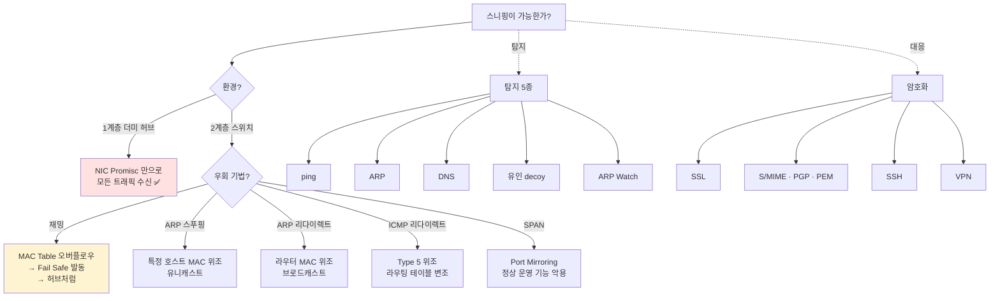
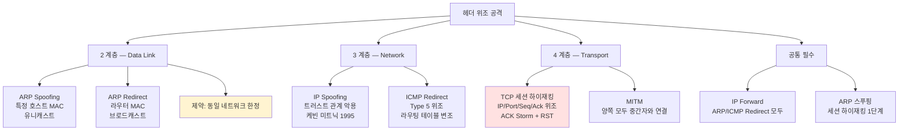
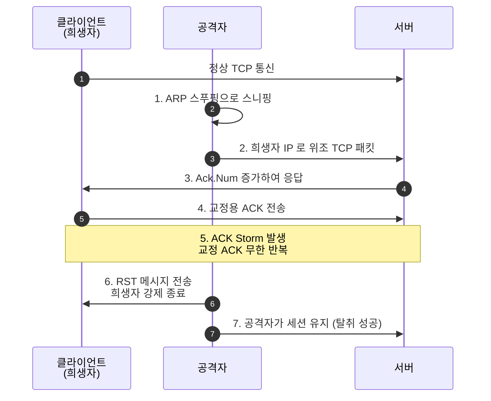
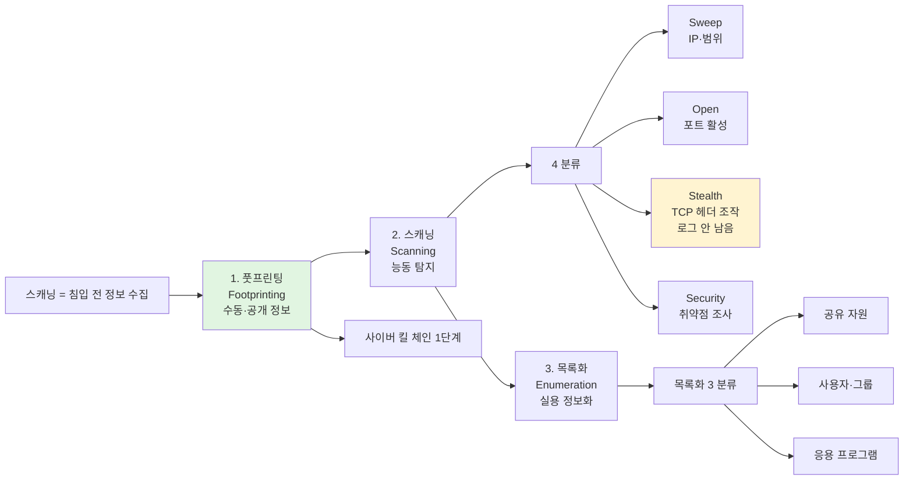
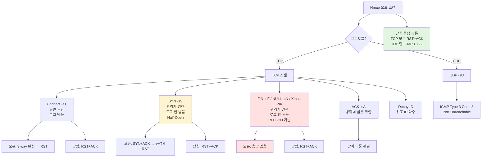

# 04. 스캐닝·스니핑·스푸핑 — 만화책처럼 읽는 트래픽 단위 공격

> **이 문서를 읽는 법**: 만화책 한 권을 펼쳤다고 생각하세요. *에피소드*를 따라 *어떤 헤더 필드를 위조 → 어떤 식별이 깨짐 → 어떻게 탐지·대응* 의 3 단계로 외우면 자연스럽게 정착됩니다.
> 정확한 옵션·표준 번호·시퀀스는 정확본을 참조: [[cs/information-security/02.network-security/04.scanning-sniffing-spoofing|정확본 04. 스캐닝·스니핑·스푸핑]]

> **연결 단원**: 본 단원은 [[cs/information-security/02.network-security/02.network-protocols-and-addressing|02 단원]] 의 *ARP·ICMP·TCP·IP 헤더*를 *위조·악용*하는 공격. *수동 (스니핑) → 능동 (스푸핑·세션 탈취) → 사전 정찰 (스캐닝)* 의 흐름. *NIC Promisc 모드*는 [[cs/information-security/02.network-security/03.network-tools-and-wireless|03 단원]] 의 *tcpdump·iwconfig monitor 모드*와 직결. **TCP 세션 하이재킹**의 *Sequence/Acknowledgment Number 위조*는 02 단원의 *3-way Handshake* 가 토대.

---

## 🎯 시작 전에 — 이미 들어본 공격 이름들

| 매일 듣는 것 | 사실은 이 단원의 |
|---|---|
| Wireshark / tcpdump | **스니퍼 (Sniffer)** + NIC **Promisc 모드** |
| 회사 *MITM* 사고 보고서 | TCP 세션 하이재킹 + ARP 스푸핑 결합 |
| `nmap -sS target` | TCP **SYN Scan (Half-Open)** — 로그 안 남음 |
| `nmap -sT target` | TCP **Connect Scan** — 시스템 로그 *기록됨* |
| `iptables -A INPUT -j DROP` vs `REJECT` | **응답 없음** ↔ ICMP `Destination Unreachable` |
| `arp -s` 정적 캐시 | ARP Spoofing 대응 |
| `sysctl net.ipv4.conf.all.accept_redirects=0` | **ICMP Redirect 공격 차단** |
| 공격 대상 *동일 네트워크 한정* | ARP 공격 (라우터 못 넘음) |
| *ACK Storm* 침해사고 키워드 | TCP 세션 하이재킹의 부수 현상 |
| `/etc/hosts.equiv` · `$HOME/.rhosts` | IP Spoofing 의 *트러스트 관계* |
| 케빈 미트닉 (Kevin Mitnick, 1995) | IP Spoofing + 세션 하이재킹의 *역사적 사례* |

> **이 단원의 본질**: *수동 vs 능동*, *어느 헤더의 어느 필드를 위조하는가*, *탐지·대응이 가능한가*의 3 축. **스니핑 = 수동 / 스푸핑·하이재킹 = 능동**, *ARP 위조 → 2계층 / IP 위조 → 3계층 / TCP 위조 → 4계층*. **ARP 공격은 동일 네트워크 한정 (라우터 못 넘음)** 이 시험 1순위.

---

## 📖 에피소드 1 — 스니핑: 수동적 공격의 본질 + Promisc 모드

### 장면. *영향 없이* 본다

> **스니핑 (Sniffing)** = 네트워크에서 *은밀하게 패킷 도청*. *어떤 영향도 미치지 않으므로* **수동적 (passive) 공격 기법**.

### 핵심 용어 2개

| 용어 | 의미 |
|---|---|
| **스니퍼 (Sniffer)** | 스니핑 도구 (Wireshark · tcpdump 등) |
| **스니핑 탐지 원리** | 스니퍼가 NIC 의 **Promisc 모드**에서 작동한다는 점을 이용 |

### Promisc 모드 = 스니핑의 토대

> NIC 가 *목적지가 자신이 아닌 패킷도 모두 수신*하는 모드. *01 단원 §NIC* + *03 단원 §1-4·§4-2* 와 직결. 이 모드 없이는 스니핑 ❌.

### 수동 vs 능동 — 본 단원의 2 축

| | 수동 (passive) | 능동 (active) |
|---|---|---|
| 정의 | *영향 없이 도청* | 헤더 *위조 + 송신* |
| 대표 | **스니핑** | **스푸핑 · 하이재킹** |
| 탐지 | *어려움* (트래픽 변화 적음) | *상대적 탐지 가능* (트래픽 변화) |

### 시험 함정

| 함정 | 정답 |
|---|---|
| 스니핑의 분류? | **수동적 공격** |
| 스니퍼 도구 2종? | **Wireshark · tcpdump** |
| 스니핑 탐지 원리? | NIC **Promisc 모드** |
| Promisc 의 의미? | *목적지 아닌 패킷도 모두 수신* |

---

## 📖 에피소드 2 — 환경별 스니핑: 허브 vs 스위치 5 우회 기법

### 장면. 환경이 모든 것을 결정

> 스니핑 기법은 *환경*에 따라 다르다. **허브 환경 = Promisc 만으로 충분**. **스위치 환경 = 5 우회 기법 필요**.

### 환경별 기법 한 표

| 환경 | 기법 | 동작 |
|---|---|---|
| **허브** | **Promisc 모드** | 자신이 목적지가 아닌 패킷도 모두 수신 (허브가 모든 포트로 신호 전달 → NIC 가 받기만 하면 됨) |
| **스위치** | **스위치 재밍** | MAC Address Table 버퍼 *오버플로우* → **Fail Safe 정책**으로 *허브처럼 동작* |
| | **ARP 스푸핑** | 특정 호스트로 나가는 패킷을 *공격자로 향하게* |
| | **ARP 리다이렉트** | *라우터/게이트웨이*로 나가는 패킷을 공격자로 향하게 |
| | **ICMP 리다이렉트** | 희생자의 *라우팅 테이블*을 변조하여 패킷 스니핑 |
| | **SPAN / Port Mirroring** | 스위치 *통과 모든 트래픽*을 분석 장비로 *자동 복사* (정상 운영 기능 악용) |

### 왜 스위치는 우회가 필요한가

> 스위치는 **MAC Address Table** 로 *목적지 포트로만* 프레임 전송 (01 단원 §스위치). Promisc 만으로는 *자신 외 트래픽 수신 ❌*. → *우회 기법 필요*.

### 5 우회 기법 — 어디를 변조하는가

| 기법 | 변조 대상 | 계층 |
|---|---|---|
| **재밍** | MAC Address Table (Fail Safe 트리거) | 2 |
| **ARP 스푸핑** | ARP Cache (특정 호스트) | 2 |
| **ARP 리다이렉트** | ARP Cache (라우터) | 2 |
| **ICMP 리다이렉트** | 라우팅 테이블 | 3 |
| **SPAN** | (스위치 정상 기능 악용) | 운영 |

### 외우는 방법 — 스니핑 5 가지의 *위치 다양성*

> *재밍 (스위치 자체 장애 유도)* / *ARP 2종 (캐시 변조)* / *ICMP 리다이렉트 (라우팅 변조)* / *SPAN (운영 기능 악용)* 의 *4 다른 층위*. *공격이 2계층 → 3계층 → 운영*으로 확산.

### 시험 함정

| 함정 | 정답 |
|---|---|
| 허브 스니핑? | **Promisc 만으로 가능** |
| 스위치 우회 5 기법? | 재밍 / ARP 스푸핑 / ARP 리다이렉트 / ICMP 리다이렉트 / **SPAN** |
| 재밍 가능 이유? | **Fail Safe** 정책 (가용성) |
| SPAN 의 정체? | **Port Mirroring** — 정상 운영 기능 악용 |

---

## 📖 에피소드 3 — 스니핑 탐지 5 + 대응 = 암호화

### 장면. 수동 공격의 탐지

> 스니퍼가 *Promisc 모드*에서 동작한다는 점을 이용. **탐지 5 기법**.

### 탐지 5 기법

| 탐지 | 동작 |
|---|---|
| **ping 을 이용** | *위조된 MAC 주소*로 ping → ICMP Echo Reply 수신 여부 (Promisc NIC 는 자신의 MAC 이 아닌 패킷도 응답) |
| **ARP 를 이용** | *위조된 ARP Request* → ARP Response 수신 여부 |
| **DNS 를 이용** | 원격에서 *Ping Sweep* + *Inverse-DNS Lookup* 감시 — 스니퍼가 IP→도메인 변환 시도하는지 |
| **유인 (decoy)** | *가짜 계정·패스워드* 뿌리고 공격자가 접속 시도하는지 |
| **ARP Watch** | 초기 *MAC ↔ IP 매칭 저장* + 트래픽 모니터링으로 변경 감지 |

### 탐지의 본질 — 위조 + Promisc 응답

> *위조된 패킷에 응답*하면 = *Promisc 모드 동작 중 = 스니퍼*. ping·ARP·DNS·유인 모두 *위조 미끼*.

### 대응 = 암호화 (4 영역)

| 대응 | 적용 영역 |
|---|---|
| **SSL** | *암호화된 웹 서핑* (HTTPS) |
| **PGP / PEM / S/MIME** | *이메일 암호화* (07 단원) |
| **SSH** | *Telnet 같은 평문 서비스* 대체 |
| **VPN** | *공용 회선의 사설 암호화 망* |

### 핵심 한 줄

> 스니핑은 *수동*이라 막을 수 없으면 *훔쳐 가도* 모름. → **암호화로 가져가도 못 읽게**.

### 시험 함정

| 함정 | 정답 |
|---|---|
| 탐지 5 기법? | ping / ARP / DNS / 유인 / **ARP Watch** |
| ARP Watch 의 동작? | 초기 MAC↔IP 저장 + 변경 감지 |
| Inverse-DNS Lookup 감시? | DNS 탐지법 |
| 유인 (decoy) 미끼? | *가짜 계정·패스워드* |
| 대응 공통 키워드? | **암호화** |
| 대응 4 도구? | **SSL / S·MIME / SSH / VPN** |

---

## 📖 에피소드 4 — ARP Spoofing: 특정 호스트 MAC + 유니캐스트 + IP Forward

### 장면. 2 계층의 캐시를 변조한다

> **ARP Spoofing (= ARP Cache Poisoning)** = 2 계층 공격. *특정 호스트의 MAC 주소를 자신의 MAC 으로 위조한 ARP Reply* 를 희생자에게 *지속 전송*.

### 라우터 못 넘는 이유 — 2 계층 한계

> ARP 는 *2 계층 프로토콜* → *서로 다른 네트워크로 라우팅 ❌*. **공격 대상도 동일 네트워크 대역에 있어야** 한다.

### ARP Spoofing 5 단계

```
1. 특정 호스트 MAC 을 자신의 MAC 으로 *위조한 ARP Reply* 생성
2. 희생자에게 *지속적으로 유니캐스트 전송*
3. 희생자 ARP Cache Table 의 MAC 정보 → 공격자 MAC 으로 *지속 변경*
4. 정상 통신 유지를 위해 공격자가 **IP Forward 활성화**
5. 희생자 → 특정 호스트 패킷이 *공격자로 향함* → 스니핑
```

### IP Forward 의 정체 — 시험 1순위

> **IP Forward** = 자신이 목적지가 아닌 패킷을 *폐기하지 않고* **라우터처럼 목적지 주소로 전달**. *ARP/ICMP 리다이렉트 공격 모두에 필수*.

### 양방향 스니핑

> A → B 트래픽만 보면 부족. *B 에게도* 변조된 ARP Reply 전송 → *양쪽 ARP Cache 모두 변경* → 양방향 스니핑 성립.

### 시험 함정

| 함정 | 정답 |
|---|---|
| ARP Spoofing 의 다른 이름? | **ARP Cache Poisoning** |
| 동작 계층? | **2 계층** |
| 공격 대상의 위치 제약? | *동일 네트워크 대역* |
| 위조 대상 MAC? | **특정 호스트의 MAC** |
| 송신 방식? | **유니캐스트 (희생자 1명)** |
| 정상 통신 유지를 위한 활성화? | **IP Forward** |
| 양방향 스니핑 조건? | A·B *양쪽 ARP Cache* 변경 |

---

## 📖 에피소드 5 — ARP Redirect + ARP 공격 대응

### 장면. 라우터의 가면

> **ARP Redirect** = ARP Spoofing 의 일종. *라우터/게이트웨이 MAC 으로 위조*한 ARP Reply 를 *대상 네트워크 전체에 브로드캐스트*. 모든 호스트의 ARP Cache 에서 *라우터 MAC*이 *공격자 MAC* 으로 변경.

### ARP Spoofing ↔ ARP Redirect — 시험 1순위

| | ARP Spoofing | ARP Redirect |
|---|---|---|
| **위조 대상 MAC** | *특정 호스트* MAC | *라우터/게이트웨이* MAC |
| **전송 방식** | *유니캐스트* (희생자 1명) | **브로드캐스트** (네트워크 전체) |
| **목표** | 희생자 ↔ 특정 호스트 스니핑 | 호스트들 ↔ 라우터 스니핑 |

### 외우는 방법 — Spoofing 좁고 Redirect 넓고

> *Spoofing = 1:1* (특정 호스트 + 유니캐스트) / *Redirect = 1:N* (라우터 + 브로드캐스트). *공격 범위*가 바로 *송신 방식*.

### ARP 공격 대응 2종 — 완벽한 방어 없음

> ARP 프로토콜 자체에 *인증 ❌*. 완벽한 방어 ❌.

| 대응 | 동작 |
|---|---|
| **캐시 정적 설정** | `arp -s [대상 IP] [대상 MAC]` → ARP Cache 정적 → *Reply 수신해도 갱신 ❌* |
| **ARP 트래픽 모니터링** | IP↔MAC 매핑 감시 + 변경 즉시 확인 (**ARP Watch**) |

### 시험 함정

| 함정 | 정답 |
|---|---|
| ARP Redirect 위조 대상? | **라우터/게이트웨이 MAC** |
| ARP Redirect 송신 방식? | **브로드캐스트** |
| ARP Spoofing ↔ Redirect 차이 (한 줄)? | *특정 호스트·유니캐스트* ↔ *라우터·브로드캐스트* |
| ARP 정적 캐시 명령? | **`arp -s [IP] [MAC]`** |
| 변조 모니터링 도구? | **ARP Watch** |
| 완벽 방어 가능? | **❌** (ARP 자체에 인증 없음) |

---

## 📖 에피소드 6 — IP Spoofing: 트러스트 관계 악용 + 1995 케빈 미트닉

### 장면 1. 1995년, 케빈 미트닉의 사례

> **IP Spoofing** = IP 를 *속이고 통신*하는 공격. **1995년 케빈 미트닉 (Kevin Mitnick)** 이 이를 이용해 실제 해킹 시도하여 *널리 알려진 공격*. *시스템 간 트러스트 관계* 이용.

### 트러스트 관계의 정체

> **트러스트 (Trust) 관계** = *ID/패스워드 기반 로그인 ❌* + *IP 주소로 인증* + *로그인 없이 접속 가능*. 보안상 *취약하여 사용 비권장*.

### 트러스트 설정 파일

| 파일 | 범위 |
|---|---|
| **`/etc/hosts.equiv`** | *시스템 전체* 신뢰 호스트 |
| **`$HOME/.rhosts`** | *사용자별* 신뢰 호스트 |

### r 계열 서비스 — 트러스트 의존

> **rlogin · rsh · rcp** = 트러스트 관계로 *원격 로그인·쉘·복사*. 보안 취약 → *SSH 가 대체*.

### IP Spoofing 공격 3 단계

```
1. *트러스트 관계가 맺어진* 서버와 클라이언트 확인
2. 신뢰 관계 클라이언트를 *연결 불가능 상태*로 만듦 (DoS 공격 등)
3. 공격자가 *클라이언트의 IP 로 위조* → 서버 접속
```

### IP Spoofing 대응 2종

| 대응 | 동작 |
|---|---|
| **MAC 주소 정적 구성** | 단순 IP 위조 접속 차단 |
| **트러스트 파일 관리** | *`+` 기호 제거* + 필요 계정만 등록 / *소유자 root + 권한 600 이하* |

### 트러스트 파일의 위험 — `+` 기호

> `/etc/hosts.equiv` · `.rhosts` 에 `+` 가 있으면 *모든 호스트 신뢰* → 공격자 IP 위조 시 *바로 접속*. 반드시 *`+` 제거 + 필요 계정만 명시*.

### 시험 함정

| 함정 | 정답 |
|---|---|
| IP Spoofing 의 역사적 사례? | **1995 케빈 미트닉** |
| 악용하는 관계? | **트러스트 관계** |
| 트러스트 파일 2개? | **`/etc/hosts.equiv` (시스템) / `$HOME/.rhosts` (사용자)** |
| 트러스트 의존 서비스? | **r 계열 (rlogin · rsh · rcp)** |
| `+` 기호 처리? | *반드시 제거* |
| `.rhosts` 권한? | *소유자 root + 600 이하* |
| 대체 권장 서비스? | **SSH** |

---

## 📖 에피소드 7 — ICMP Redirect 공격 + ARP Redirect ↔ ICMP Redirect 비교

### 장면. Type 5 의 악용

> **ICMP Redirect 메시지 (Type 5)** = 호스트-라우터 또는 라우터 간 *경로 재설정용*. 공격자는 이를 *위조* → *희생자 라우팅 테이블 변조*.

### 공격 3 단계

```
1. *라우팅 경로를 자신 주소로 위조*한 ICMP Redirect 메시지 생성
2. 희생자에게 전송
3. 희생자의 *라우팅 테이블* 변조 → *IP Forward* 로 패킷 스니핑
```

### 대응 — sysctl 명령

```bash
sysctl -w net.ipv4.conf.all.accept_redirects=0
```

### ARP Redirect ↔ ICMP Redirect — 시험 1순위

| 항목 | ARP Redirect | ICMP Redirect |
|---|---|---|
| **변조 대상** | **ARP Cache Table** | **라우팅 테이블** |
| **위조 패킷** | 자신을 라우터로 위장한 *ARP Reply* | 라우팅 경로 위조한 *ICMP Type 5* |
| **계층** | **2 (Data Link)** | **3 (Network)** |

### 외우는 방법 — *캐시 vs 테이블*

> *ARP Redirect = ARP Cache (2계층)* / *ICMP Redirect = 라우팅 테이블 (3계층)*. *변조 대상의 계층*이 곧 공격 분류.

### 공통점 — IP Forward 필수

> 두 공격 모두 *희생자 패킷을 가로챈 후 정상 목적지로 전달*해야 *눈치 못 챔*. → **IP Forward** 활성화 필수.

### 시험 함정

| 함정 | 정답 |
|---|---|
| ICMP Redirect = ICMP Type? | **5** |
| ICMP Redirect 변조 대상? | **라우팅 테이블** |
| ICMP Redirect 대응 명령? | **`sysctl -w net.ipv4.conf.all.accept_redirects=0`** |
| ARP Redirect 변조 대상? | **ARP Cache Table** |
| ARP Redirect ↔ ICMP Redirect 계층? | **2 ↔ 3** |
| 두 공격 공통 필수? | **IP Forward 활성화** |

---

## 📖 에피소드 8 — TCP 세션 하이재킹: 7 단계 + ACK Storm + RST

### 장면. 케빈 미트닉의 또 다른 발자국

> **TCP 세션 하이재킹 (TCP Session Hijacking)** = *TCP 세션 관리 취약점* 이용. **케빈 미트닉**이 사용했던 공격 중 하나. TCP 의 *상호 인식*은 **IP · Port · Sequence Number · Acknowledgment Number** 로 이루어짐 → *이 4 필드를 위조*.

### 핵심 식별 정보 4

| 정보 | 의미 |
|---|---|
| **IP** | 호스트 식별 |
| **Port** | 프로세스 식별 |
| **Sequence Number** | 송신 데이터 *순서 번호* (32 bit) |
| **Acknowledgment Number** | 수신 *확인 응답 번호* (32 bit) |

### 공격 7 단계 — 시험 1순위

```
1. 공격자: ARP 스푸핑으로 클라이언트-서버 *TCP 통신 스니핑*
2. 공격자: 희생자 IP 로 *위조된 TCP 패킷*을 서버로 전송
3. 서버: 정상 패킷으로 간주 → *Ack.Num 증가* 응답
4. 희생자: Ack.Num 증가 응답 받음 → *교정용 ACK* 패킷을 서버로
5. 서버·희생자: 교정용 ACK 응답 *상호 반복* → **ACK Storm** 유발
6. 공격자: 희생자에게 *RST 메시지* 전달 → 연결 *강제 종료*
7. 공격자: 서버와의 *세션 유지* (탈취 성공)
```

### ACK Storm — 부수 현상

> *서버와 희생자가 서로 교정 ACK 만 무한 반복*하는 상태. *공격이 일어났다는 신호* + *대역폭 소모*.

### 1단계 + 2단계 = ARP 스푸핑 + IP 스푸핑 결합

> 본 단원의 모든 공격이 *결합*된 종합 공격. *스니핑 (수동) + 스푸핑 2종 (능동) + 세션 탈취*.

### 대응 3 종

| 대응 | 동작 |
|---|---|
| **지속적 인증** | 특정 행동 또는 시간 경과 시 *재인증 요청* |
| **암호화** | 전송 데이터 암호화 → *Sequence Number 추측 어렵게* (SSL/TLS · SSH · IPsec) |
| **ACK Storm 감지** | 교정 ACK 반복 패턴 탐지 |

### 시험 함정

| 함정 | 정답 |
|---|---|
| 공격자의 역사적 사례? | **케빈 미트닉** |
| 핵심 식별 정보 4? | **IP / Port / Seq.Num / Ack.Num** |
| 1단계 공격? | **ARP 스푸핑** (스니핑) |
| 2단계 공격? | **IP 스푸핑** (위조 패킷) |
| 5단계 부수 현상? | **ACK Storm** |
| 6단계 종료 방법? | **RST 메시지** |
| 대응 3종? | 지속 인증 / **암호화** / ACK Storm 감지 |
| 암호화 도구 3? | SSL/TLS · SSH · IPsec |

---

## 📖 에피소드 9 — MITM: 중간자 공격

### 장면. 양쪽 모두 정상이라 믿는다

> **MITM (Man-In-The-Middle, 중간자 공격)** = 네트워크 통신 *조작 + 도청*. 두 사람은 각각 *상대방과 정상 연결*되었다고 생각하지만, *실제로는 모두 중간자와 연결*됨. 중간자가 *한쪽 정보 → 도청·조작 → 다른 쪽 전달*.

### MITM 의 두 시각

```
[정상 통신 (믿음)]
A ←─────────→ B

[실제 통신]
A ←──→ Attacker ←──→ B
```

### MITM ↔ TCP 세션 하이재킹

> *세션 하이재킹*은 *희생자를 탈락시키고 공격자가 그 자리를 차지*. *MITM*은 *양쪽 통신을 그대로 유지하면서 중간에서 도청·조작*. 둘 다 *능동 공격*이지만 *희생자 인식 차이*.

### 방어 — SSL/TLS 인증서 검증

> *SSL/TLS 의 인증서 검증·서명 메커니즘*이 MITM 방어의 *핵심*. *우회 공격* (예: SSL Stripping) 과 SSL/TLS 취약점은 [[cs/information-security/02.network-security/07.security-protocols|07 단원]] 의 주제.

### 시험 함정

| 함정 | 정답 |
|---|---|
| MITM 풀이? | Man-In-The-Middle |
| 두 사람의 인식? | *각각 상대와 정상 연결* (실제는 중간자) |
| MITM ↔ 세션 하이재킹? | 도청·조작 (양쪽 유지) ↔ 탈취 (한쪽 탈락) |
| 핵심 방어 메커니즘? | **SSL/TLS 인증서 검증** |
| SSL Stripping 같은 우회 공격은? | 07 단원 주제 |

---

## 📖 에피소드 10 — 스캐닝 3 단계: 풋프린팅·스캐닝·목록화 + 4 분류

### 장면. 침입 전에 무엇을 하는가

> **스캐닝** = 시스템 침입 전 *정보 수집* 활동. *사이버 킬 체인의 첫 단계*. **풋프린팅 → 스캐닝 → 목록화** 의 3 순차 단계.

### 3 단계 정의 — 시험 1순위

| 단계 | 정의 | 활동 |
|---|---|---|
| **풋프린팅** (Footprinting) | 공격대상에 대한 *다양한 정보 수집* | 사회공학 비밀번호 가로채기 / *공개 정보 수집* |
| **스캐닝** (Scanning) | 실제 공격방법 결정·이용 가능한 *네트워크 구조·서비스* 정보 획득 | Sweep / Open / Stealth / Security |
| **목록화** (Enumeration) | 수집 정보를 *실용적 정보로 변환* | 공유 자원 / 사용자·그룹 / 응용 프로그램 목록화 |

### 외우는 방법 — Footprint·Scan·Enumerate

> *Footprint = 발자국 (수동)* / *Scan = 능동 탐지* / *Enumerate = 목록화 (정리)*. *수동 → 능동 → 정리*의 *작업 흐름*.

### 스캐닝 4 분류

| 종류 | 의미 |
|---|---|
| **Sweep** | IP 주소·네트워크 *범위 조사* |
| **Open Scan** | 시스템·포트 *활성화 여부* 확인 |
| **Stealth Scan** | TCP 헤더 *조작* + *은밀하게* + *로그 안 남음* |
| **Security Scan** | 시스템 *보안 취약점* 조사 |

### Stealth Scan 의 본질

> **TCP 헤더 조작** + **스캔 대상에 로그가 남지 않음**. 에피소드 12·13 의 *FIN·NULL·Xmas Scan* 이 대표.

### 스캐닝으로 수집되는 정보 5종

```
1. 공격대상 네트워크의 보안장비 사용 현황
2. 우회 가능 네트워크 구조
3. 시스템 플랫폼 형태
4. 시스템 운영체제·커널 버전
5. 제공 서비스의 종류
```

### 목록화 3 분류

```
1. 공유 자원 목록화
2. 사용자·그룹 목록화
3. 응용 프로그램 목록화
```

### 시험 함정

| 함정 | 정답 |
|---|---|
| 스캐닝 3 단계 순서? | **풋프린팅 → 스캐닝 → 목록화** |
| 풋프린팅의 본질? | *공개 정보 수집* (수동) |
| 목록화 영문? | **Enumeration** |
| 스캐닝 4 분류? | Sweep / Open / **Stealth** / Security |
| Stealth Scan 의 본질? | TCP 헤더 *조작* + *로그 안 남음* |
| 목록화 3 분류? | 공유 자원 / 사용자·그룹 / 응용 프로그램 |

---

## 📖 에피소드 11 — Nmap 옵션 + iptables DROP/REJECT

### 장면. 스캐닝의 표준 도구

> **Nmap** = 대상 포트·서비스 스캔 *표준 도구*. 침입 전 *취약점 분석* 사전 작업.

### Nmap 핵심 옵션 12 — 시험 1순위

| 옵션 | 동작 |
|---|---|
| **`-sS`** | TCP **SYN Scan (Half-Open)** — *관리자 권한 필요, 로그 안 남음* |
| **`-sT`** | TCP **Connect Scan** — *일반 사용자 권한, 시스템 로그에 IP 기록* |
| **`-sU`** | UDP Scan |
| **`-sF`** | TCP **FIN Scan** — *FIN 비트만* |
| **`-sX`** | TCP **Xmas Scan** — *URG + PSH + FIN* |
| **`-sN`** | TCP **NULL Scan** — *제어비트 설정 없음* |
| **`-sA`** | TCP **ACK Scan** — *방화벽 룰셋 (필터링 정책) 확인용* |
| `-sP` | Ping 호스트 활성화 확인 (현재는 `-sn`) |
| **`-D`** | **Decoy 스캔** — *위조 IP 다수* |
| `-b` | FTP Bounce 스캔 |
| **`-O`** | 대상 호스트 *운영체제 정보* 출력 |
| `-F` | 빠른 네트워크 스캐닝 |
| `-T0 ~ T5` | 아주 느리게 (0) ~ 아주 빠르게 (5) |

### 권한·로그 매트릭스

| 옵션 | 권한 | 로그 |
|---|---|---|
| **`-sT` Connect** | *일반* | **남음** |
| **`-sS` SYN** | *관리자* | **안 남음** |
| **`-sF/N/X` Stealth** | 관리자 | 안 남음 |

### 외우는 방법 — `s` + 첫 글자

> *`-s` + 스캔 종류 첫 글자*. *S = SYN / T = Connect (TCP) / U = UDP / F = FIN / X = Xmas / N = NULL / A = ACK*. 일관된 명명.

### iptables DROP vs REJECT — 응답 차이

| 정책 | 공격자 → 방화벽 | 방화벽 응답 |
|---|---|---|
| **DROP** | 스캔 패킷 | **응답 없음** (들어온 패킷 무시) |
| **REJECT** | 스캔 패킷 | **ICMP `Destination Unreachable`** (거부 메시지) |

### 보안 관행 — DROP 권장

> *일반적으로 보안상 DROP 정책 사용*. REJECT 는 *공격자에게 정보 노출* (방화벽 존재 + 정책 응답).

### 포트 스캔 대응 4

| 대응 | 동작 |
|---|---|
| **패킷 차단** | 불필요 패킷 차단 (방화벽 설정) |
| **포트 점검** | *불필요 서비스 종료* |
| **스캔 탐지** | **IDS** 사용 |
| **로그 감사** | 시스템 로그 감사 |

### 시험 함정

| 함정 | 정답 |
|---|---|
| `-sS` 의미·권한·로그? | SYN (Half-Open) / 관리자 / **안 남음** |
| `-sT` 의미·권한·로그? | Connect / 일반 / **남음** |
| `-sA` 의미? | **방화벽 룰셋 확인용** |
| `-D` 의미? | **Decoy** (위조 IP 다수) |
| `-O` 의미? | OS 핑거프린팅 |
| Xmas Scan 비트? | **URG + PSH + FIN** (3 비트) |
| iptables DROP 응답? | **응답 없음** |
| iptables REJECT 응답? | **ICMP Destination Unreachable** |
| 보안상 권장? | **DROP** |

---

## 📖 에피소드 12 — TCP Connect / SYN / FIN / NULL / Xmas Scan: 5 종 응답 패턴

### 장면. 응답 패턴이 곧 스캔 분류

> 각 스캔의 *포트 오픈/닫힘 응답 패턴*을 정확히 외워야 한다. *RFC 793 의 비정상 TCP 처리 규약*이 Stealth Scan 의 동작 토대.

### 1. TCP Connect Scan (`-sT`) — 3-way 완성 + 로그 기록

> *일반 사용자 권한*. **Connect 시스템 호출**로 *정상 TCP 연결설정*. → *시스템 로그에 스캐너 IP 기록*.

```
포트 오픈:
  공격자 → SYN
  타겟서버 → SYN+ACK
  공격자 → ACK     (시스템 로그에 IP 기록)
  공격자 → RST+ACK (포트 오픈 확인 후 즉시 중단)

포트 닫힘:
  공격자 → SYN
  타겟서버 → RST+ACK (해당 포트가 닫혀 있음)
```

### 2. TCP SYN Scan (`-sS`) — Half-Open + 로그 안 남음

> *관리자 권한*. TCP 패킷 *직접 조작*. *3-way 미완성* → *스캔 대상 시스템에 로그 안 남음*.

```
포트 오픈:
  공격자 → SYN
  타겟서버 → SYN+ACK
  공격자 → RST     (강제 종료, 연결 미수립)

포트 닫힘:
  공격자 → SYN
  타겟서버 → RST+ACK
```

### 3. TCP FIN / NULL / Xmas Scan (`-sF` / `-sN` / `-sX`)

> *관리자 권한*. TCP 패킷 직접 조작. **3-way 미완성 → 로그 안 남음**. **RFC 793 기준** *닫힌 포트만 RST 응답*해야 한다는 규약 이용.

### 비트 설정 차이

| 스캔 | 설정 비트 |
|---|---|
| **TCP FIN** | **FIN** |
| **TCP NULL** | (제어비트 *설정 없음*) |
| **TCP Xmas** | **URG + PSH + FIN** |

### 응답 패턴 — 시험 1순위

```
포트 오픈:
  공격자 → FIN / No Flags / URG+PSH+FIN
  타겟서버 → 응답 없음        ← 시험 함정!

포트 닫힘:
  공격자 → FIN / No Flags / URG+PSH+FIN
  타겟서버 → RST+ACK
```

### Connect ↔ SYN ↔ FIN/NULL/Xmas — 핵심 차이

| | Connect | SYN | FIN/NULL/Xmas |
|---|---|---|---|
| 권한 | 일반 | 관리자 | 관리자 |
| 3-way | *완성* | *미완성* | *미완성* |
| 로그 | **남음** | **안 남음** | **안 남음** |
| 포트 오픈 응답 | 3-way 완성 후 RST | SYN+ACK → 공격자 RST | **응답 없음** |
| 포트 닫힘 응답 | RST+ACK | RST+ACK | RST+ACK |

### 외우는 방법 — *오픈은 다 다르고 닫힘은 다 RST+ACK*

> *포트 오픈*: Connect (3-way 완성) / SYN (SYN+ACK) / FIN·NULL·Xmas (응답 없음). *포트 닫힘*: **모두 RST+ACK**.

### Xmas 의 어원

> Xmas 는 *Christmas tree*. *URG·PSH·FIN 3 비트 설정*이 *불 켜진 트리*처럼 보인다고 해서 붙여진 이름.

### 시험 함정

| 함정 | 정답 |
|---|---|
| Connect 권한·로그? | 일반 / **남음** |
| SYN 권한·로그? | 관리자 / **안 남음** |
| SYN Scan 의 별칭? | **Half-Open** |
| FIN Scan 비트? | **FIN** |
| NULL Scan 비트? | **(설정 없음)** |
| Xmas Scan 비트? | **URG + PSH + FIN** |
| FIN/NULL/Xmas 포트 오픈 응답? | **응답 없음** |
| FIN/NULL/Xmas 포트 닫힘 응답? | **RST+ACK** |
| Stealth Scan 의 RFC 근거? | **RFC 793** |

---

## 📖 에피소드 13 — TCP ACK Scan + UDP Scan + Decoy + 정리표

### 장면 1. TCP ACK Scan (`-sA`) — 방화벽 룰 판별

> *대상 포트 오픈 여부 판별 X* + **방화벽 룰셋 (필터링 정책) 알아내기**. 방화벽의 *차단·허용 상태*를 확인.

```
포트 차단 상태 (방화벽이 막음):
  공격자 → ACK
  방화벽 → 응답 없음 또는 ICMP Unreachable

포트 허용 상태 (방화벽 통과):
  공격자 → ACK
  방화벽 → 포트 허용으로 통과
  타겟서버 → RST   (정상 TCP 동작)
```

### ACK Scan 의 핵심 — *포트 판별 ❌, 방화벽 판별 ✅*

> 다른 스캔과 달리 *포트 오픈 여부*가 *목적이 아님*. **방화벽 정책 자체**를 판별. 시험에서 *목적 차이*를 묻는다.

### 장면 2. UDP Scan (`-sU`) — ICMP Type 3 Code 3 활용

> 닫힌 UDP 포트로 패킷 수신 시 **ICMP 에러 메시지 (Type 3 Code 3 — Port Unreachable)** 로 응답한다는 점 이용.

```
포트 오픈:
  공격자 → UDP
  타겟서버 → 응답 없음

포트 닫힘:
  공격자 → UDP
  타겟서버 → 응답 없음 또는 ICMP Unreachable (Type 3 Code 3)
```

### UDP Scan 의 신뢰성 한계

> *오픈 시 응답 없음 + 닫힘 시 ICMP 또는 응답 없음* → *판별 모호*. UDP 스캔이 TCP 보다 *느리고 부정확*한 이유.

### 장면 3. Decoy Scan (`-D`) — 위조 IP 다수

> *대상 호스트에서 실제 스캐너 주소 식별 어렵게* + *위조 IP 다수*로 스캔. *추적 회피*.

```
포트 오픈:
  공격자 → TCP SYN Scan (스캔 타입) + RND (Decoy 옵션)
  타겟서버 → SYN+ACK
  공격자 → RST    (강제 종료, 연결 미수립)

포트 닫힘:
  공격자 → TCP SYN Scan + RND
  타겟서버 → RST+ACK
```

### 6 스캔 방식 정리표 — 시험 직전 view

| 스캔 | 권한 | 로그 남음 | 포트 오픈 응답 | 포트 닫힘 응답 |
|---|---|---|---|---|
| **TCP Connect** (`-sT`) | 일반 | **남음** | 3-way 완성 후 RST | RST+ACK 즉시 |
| **TCP SYN** (`-sS`) | 관리자 | 안 남음 | SYN+ACK → 공격자 RST | RST+ACK |
| **TCP FIN/NULL/Xmas** | 관리자 | 안 남음 | **응답 없음** | RST+ACK |
| **TCP ACK** (`-sA`) | 관리자 | — | (포트 오픈 판별 ❌) | (방화벽 룰 판별) |
| **UDP** (`-sU`) | — | — | 응답 없음 | 응답 없음 또는 ICMP **Type 3 Code 3** |
| **Decoy** (`-D`) | 관리자 | (위조됨) | SYN+ACK → 공격자 RST | RST+ACK |

### 외우는 방법 — *닫힘 시 RST+ACK 가 표준*

> TCP 스캔 5종 *모두 닫힘 시 RST+ACK*. UDP 만 *ICMP Type 3 Code 3*. 02 단원 §ICMP 와 직결.

### 시험 함정

| 함정 | 정답 |
|---|---|
| ACK Scan 의 목적? | **방화벽 룰셋 판별** (포트 오픈 ❌) |
| UDP 닫힘 응답? | **ICMP Type 3 Code 3** (Port Unreachable) |
| UDP 오픈 응답? | **응답 없음** |
| Decoy Scan 의 목적? | *추적 회피* (위조 IP 다수) |
| TCP 닫힘 응답 공통? | **모두 RST+ACK** |
| Stealth Scan (FIN/NULL/Xmas) 오픈 응답? | **응답 없음** |
| RFC 근거? | **RFC 793** |

---

## 📑 종합 비교 (에피소드 1~13 정리)

시험 직전 *한눈에* 보는 view.

| 영역 | 핵심 |
|---|---|
| **스니핑 분류** | **수동적 공격** (영향 ❌) |
| **스니퍼 도구** | Wireshark · tcpdump |
| **스니핑 토대** | NIC **Promisc 모드** |
| **허브 환경** | Promisc 만으로 가능 |
| **스위치 우회 5** | 재밍 / ARP 스푸핑 / ARP 리다이렉트 / ICMP 리다이렉트 / **SPAN** |
| **재밍 가능 이유** | **Fail Safe** 정책 |
| **탐지 5** | ping / ARP / DNS / 유인 / **ARP Watch** |
| **대응 = 암호화** | **SSL · S/MIME · SSH · VPN** |
| **ARP Spoofing** | *특정 호스트 MAC* + *유니캐스트* + IP Forward |
| **ARP Redirect** | *라우터 MAC* + *브로드캐스트* |
| **ARP 공격 한계** | *동일 네트워크 대역* (라우터 못 넘음) |
| **ARP 대응** | `arp -s [IP] [MAC]` + ARP Watch |
| **IP Spoofing 사례** | **1995 케빈 미트닉** |
| **트러스트 파일** | `/etc/hosts.equiv` (시스템) / `$HOME/.rhosts` (사용자) |
| **r 계열** | rlogin · rsh · rcp |
| **트러스트 권한** | *root + 600 이하 + `+` 제거* |
| **ICMP Redirect** | **Type 5** + 라우팅 테이블 변조 |
| **ICMP Redirect 대응** | `sysctl -w net.ipv4.conf.all.accept_redirects=0` |
| **ARP ↔ ICMP Redirect 계층** | **2 ↔ 3** |
| **두 공격 공통 필수** | **IP Forward** |
| **TCP 세션 하이재킹 사례** | **케빈 미트닉** |
| **핵심 식별 정보 4** | IP / Port / **Seq.Num / Ack.Num** |
| **공격 7 단계** | ARP 스푸핑 → IP 위조 → Ack 응답 → 교정 ACK → **ACK Storm** → **RST** → 세션 유지 |
| **하이재킹 대응** | 지속 인증 / **암호화** / ACK Storm 감지 |
| **MITM** | 양쪽 모두 *중간자와 연결* |
| **MITM 방어 핵심** | **SSL/TLS 인증서 검증** |
| **스캐닝 3 단계** | **풋프린팅 → 스캐닝 → 목록화** |
| **스캐닝 4 분류** | Sweep / Open / **Stealth** / Security |
| **Stealth 본질** | TCP 헤더 *조작* + *로그 안 남음* |
| **목록화 3 분류** | 공유 자원 / 사용자·그룹 / 응용 프로그램 |
| **Nmap `-sS`** | SYN Half-Open / 관리자 / 로그 안 남음 |
| **Nmap `-sT`** | Connect / 일반 / 로그 남음 |
| **Nmap `-sU`** | UDP |
| **Nmap `-sF·sN·sX`** | Stealth (FIN / NULL / **URG+PSH+FIN**) |
| **Nmap `-sA`** | **방화벽 룰셋 확인** |
| **Nmap `-D`** | **Decoy** (위조 IP) |
| **Nmap `-O`** | OS 핑거프린팅 |
| **iptables DROP** | **응답 없음** |
| **iptables REJECT** | **ICMP Destination Unreachable** |
| **권장 정책** | **DROP** |
| **TCP 스캔 닫힘 응답** | **모두 RST+ACK** |
| **TCP Stealth 오픈 응답** | **응답 없음** (FIN/NULL/Xmas) |
| **UDP 닫힘 응답** | **ICMP Type 3 Code 3** |
| **Stealth 의 RFC 근거** | **RFC 793** |

---

## 🗺️ 마인드맵 1 — 스니핑 환경 결정 트리 (허브 vs 스위치 + 5 우회)



**읽는 법**: 빨강 = *가장 위험* (Promisc 만으로 끝). 노랑 = *재밍의 Fail Safe 본질*. 탐지·대응은 *별도 분기*.

---

## 🗺️ 마인드맵 2 — ARP/IP/ICMP 공격 비교 매트릭스 (계층별)



**읽는 법**: 노랑 = *ARP 의 한계 (동일 네트워크)*. 빨강 = *세션 하이재킹의 결합 공격*.

---

## 🗺️ 마인드맵 3 — TCP 세션 하이재킹 7 단계 시퀀스



**읽는 법**: *7 단계*가 모두 *ARP 스푸핑 (1) + IP 스푸핑 (2) + RST 종료 (6)* 의 *결합 공격*. *5 단계 ACK Storm 이 부수 현상*.

---

## 🗺️ 마인드맵 4 — 스캐닝 3 단계 + 4 분류 (시간 흐름)



**읽는 법**: 녹색 = *수동 정찰*. 노랑 = *Stealth Scan (시험 1순위)*. *3 → 4 → 3 단계의 깊어지는 정보 수집*.

---

## 🗺️ 마인드맵 5 — TCP/UDP 스캔 응답 패턴 결정 트리



**읽는 법**: 빨강 = *Stealth Scan (FIN/NULL/Xmas) — 오픈 시 응답 없음 함정*. 노랑 = *SYN Half-Open 의 핵심 위치*. 녹색 = *닫힘 응답 공통 규칙*.

---

## 🗂️ 키워드 클러스터 — 비슷한 이름 모아보기

### 수동 vs 능동 공격

```
수동 (passive) — 스니핑 (영향 없음)
능동 (active) — 스푸핑 / 세션 하이재킹 / MITM (헤더 위조 + 송신)
```

### 스니퍼 도구 + 토대

```
도구: Wireshark · tcpdump
토대: NIC Promisc 모드
```

### 스위치 우회 5 기법

```
재밍              — MAC Table 오버플로우 (Fail Safe)
ARP 스푸핑         — 특정 호스트 MAC + 유니캐스트
ARP 리다이렉트     — 라우터 MAC + 브로드캐스트
ICMP 리다이렉트   — Type 5 + 라우팅 테이블
SPAN              — Port Mirroring 악용
```

### 스니핑 탐지 5

```
ping     — 위조 MAC 으로 ping → ICMP Echo Reply 여부
ARP      — 위조 ARP Request → Response 여부
DNS      — Ping Sweep + Inverse-DNS Lookup 감시
유인     — 가짜 계정·패스워드
ARP Watch — MAC↔IP 변경 감지
```

### 스니핑 대응 = 암호화 4

```
SSL              — 웹 (HTTPS)
PGP·PEM·S/MIME    — 이메일
SSH              — Telnet 평문 대체
VPN              — 공용 회선의 사설 암호화 망
```

### ARP / IP / ICMP 공격 매트릭스

```
ARP Spoofing
  계층: 2
  위조: 특정 호스트 MAC
  송신: 유니캐스트 (희생자 1)
  목표: 희생자 ↔ 특정 호스트 스니핑
  대응: arp -s 정적, ARP Watch

ARP Redirect
  계층: 2
  위조: 라우터/게이트웨이 MAC
  송신: 브로드캐스트 (네트워크 전체)
  목표: 호스트들 ↔ 라우터 스니핑
  공통: 동일 네트워크 한정 + IP Forward

IP Spoofing
  계층: 3
  악용: 트러스트 관계 (hosts.equiv·.rhosts·r 계열)
  사례: 1995 케빈 미트닉
  대응: MAC 정적 + + 기호 제거 + root 600

ICMP Redirect
  계층: 3
  위조: ICMP Type 5
  변조: 라우팅 테이블
  대응: sysctl net.ipv4.conf.all.accept_redirects=0
```

### IP Forward — 공통 필수

```
정의: 자신이 목적지가 아닌 패킷도 라우터처럼 전달
필수: ARP Spoofing / ARP Redirect / ICMP Redirect 모두
```

### TCP 세션 하이재킹

```
사례: 케빈 미트닉
핵심 식별: IP / Port / Sequence Number / Acknowledgment Number

7 단계:
  1. ARP 스푸핑 (스니핑)
  2. IP 위조 TCP 패킷
  3. 서버 Ack.Num 증가 응답
  4. 희생자 교정 ACK
  5. ACK Storm 유발
  6. 희생자에게 RST
  7. 세션 유지

대응: 지속 인증 / 암호화 (SSL·SSH·IPsec) / ACK Storm 감지
```

### MITM

```
정의: 양쪽 모두 중간자와 연결
방어: SSL/TLS 인증서 검증
세션 하이재킹과 차이: 양쪽 유지 ↔ 한쪽 탈락
```

### 스캐닝 3 단계 + 4 분류 + 목록화 3

```
3 단계:
  1. 풋프린팅 (Footprinting) — 수동·공개 정보
  2. 스캐닝 (Scanning)        — 능동 탐지
  3. 목록화 (Enumeration)     — 실용 정보화

스캐닝 4 분류:
  Sweep · Open · Stealth · Security

목록화 3 분류:
  공유 자원 · 사용자·그룹 · 응용 프로그램

수집 정보 5종:
  보안장비 / 우회 구조 / 플랫폼 / OS·커널 / 서비스
```

### Nmap 옵션 12

```
-sS  TCP SYN (Half-Open)        관리자 / 로그 안 남음
-sT  TCP Connect                 일반 / 로그 남음
-sU  UDP
-sF  TCP FIN                     Stealth
-sX  TCP Xmas (URG+PSH+FIN)      Stealth
-sN  TCP NULL (No Flags)         Stealth
-sA  TCP ACK                     방화벽 룰셋 확인
-sP  Ping (현재 -sn)
-D   Decoy (위조 IP 다수)
-b   FTP Bounce
-O   OS 핑거프린팅
-F   빠른 스캐닝
-T0~T5  타이밍 0 (느림) ~ 5 (빠름)
```

### iptables DROP vs REJECT

```
DROP   — 응답 없음 (보안 권장)
REJECT — ICMP Destination Unreachable
```

### TCP/UDP 스캔 응답 매트릭스

```
TCP Connect (-sT)   오픈: 3-way 완성 후 RST     닫힘: RST+ACK 즉시
TCP SYN (-sS)       오픈: SYN+ACK → 공격자 RST  닫힘: RST+ACK
TCP FIN/NULL/Xmas   오픈: 응답 없음             닫힘: RST+ACK
TCP ACK (-sA)       포트 판별 X (방화벽 룰 판별)
UDP (-sU)           오픈: 응답 없음             닫힘: 응답 없음 또는 ICMP T3 C3
Decoy (-D)          위조 IP 동반, 응답은 SYN 동일
```

### 헷갈리는 짝 (시험 1순위)

| 짝 | 차이 |
|---|---|
| **수동 ↔ 능동** | 스니핑 ↔ 스푸핑·하이재킹 |
| **허브 ↔ 스위치 환경** | Promisc 만 ↔ 5 우회 기법 |
| **재밍 ↔ ARP 스푸핑** | MAC Table ↔ ARP Cache |
| **ARP Spoofing ↔ Redirect** | 특정·유니 ↔ 라우터·브로드 |
| **ARP Redirect ↔ ICMP Redirect** | 2계층 ARP Cache ↔ 3계층 라우팅 테이블 |
| **IP Spoofing ↔ TCP 하이재킹** | 트러스트 악용 ↔ Seq/Ack 위조 |
| **MITM ↔ 세션 하이재킹** | 양쪽 유지 ↔ 한쪽 탈락 |
| **풋프린팅 ↔ 스캐닝 ↔ 목록화** | 수동 ↔ 능동 ↔ 정리 |
| **Sweep ↔ Open ↔ Stealth ↔ Security** | 범위 ↔ 활성 ↔ 은밀 ↔ 취약점 |
| **`-sT` ↔ `-sS`** | 일반·로그 남음 ↔ 관리자·로그 안 남음 |
| **Stealth 3 (FIN/NULL/Xmas)** | FIN ↔ 비트 없음 ↔ URG+PSH+FIN |
| **Stealth 오픈 ↔ 닫힘** | 응답 없음 ↔ RST+ACK |
| **`-sA`** | 방화벽 룰 판별 (포트 X) |
| **`-sU` 닫힘** | ICMP Type 3 Code 3 |
| **`-D`** | Decoy (위조 IP) |
| **DROP ↔ REJECT** | 응답 없음 ↔ ICMP Unreachable |
| **TCP 닫힘 공통** | 모두 RST+ACK |
| **케빈 미트닉** | IP Spoofing + 세션 하이재킹 사례 |

---

## 🃏 회상 30문항

> 답을 가린 뒤 자가 채점.

**A. 스니핑 (1~6)**
1. 스니핑은 수동·능동 어느 분류이며 그 이유는?
2. 스니퍼 도구 2종과 동작 토대는?
3. 허브 환경 ↔ 스위치 환경의 스니핑 차이는?
4. 스위치 우회 5 기법은?
5. 스니핑 탐지 5 기법은?
6. 스니핑 대응 = 암호화 4 도구는?

**B. ARP/IP/ICMP 공격 (7~13)**
7. ARP Spoofing 의 다른 이름은?
8. ARP Spoofing 의 위조 대상·송신 방식·필수 활성화는?
9. ARP Spoofing ↔ ARP Redirect 의 본질 차이는?
10. ARP 공격이 라우터를 못 넘는 이유는?
11. ARP 대응 2 종은?
12. IP Spoofing 의 트러스트 파일 2개와 r 계열 서비스는?
13. ICMP Redirect 의 Type·변조 대상·대응 명령은?

**C. TCP 세션 하이재킹 + MITM (14~17)**
14. TCP 세션 하이재킹의 핵심 식별 정보 4는?
15. 7 단계 공격 절차는?
16. ACK Storm 의 정체와 감지의 의미는?
17. MITM ↔ 세션 하이재킹의 차이는?

**D. 스캐닝 3 단계 + 4 분류 (18~21)**
18. 스캐닝 3 단계 정의·순서는?
19. 스캐닝 4 분류와 의미는?
20. Stealth Scan 의 본질 (TCP 헤더 + 로그) 은?
21. 목록화 3 분류는?

**E. Nmap + iptables (22~26)**
22. Nmap 옵션 — `-sS` / `-sT` / `-sU` / `-sF` / `-sX` / `-sN` / `-sA` / `-D` / `-O` 의 의미는?
23. `-sS` 와 `-sT` 의 권한·로그 차이는?
24. Xmas Scan 의 비트 조합은?
25. iptables DROP ↔ REJECT 응답 차이는?
26. 보안상 권장 정책은?

**F. TCP/UDP 스캔 응답 (27~30)**
27. TCP Connect / SYN / FIN/NULL/Xmas 의 포트 오픈 응답은?
28. TCP 5 종 공통의 포트 닫힘 응답은?
29. UDP Scan 의 닫힘 응답 ICMP Type/Code 는?
30. ACK Scan 의 목적과 Decoy Scan 의 목적은?

---

## ⚠️ 시험 함정 모음

| 함정 | 정답 |
|---|---|
| 스니핑 분류? | **수동적 공격** |
| 스니퍼 도구? | Wireshark · tcpdump |
| 스니핑 토대? | NIC **Promisc 모드** |
| 허브 환경 스니핑? | **Promisc 만으로 가능** |
| 스위치 우회 5? | 재밍 / ARP 스푸핑 / ARP 리다이렉트 / ICMP 리다이렉트 / **SPAN** |
| SPAN 의 정체? | **Port Mirroring** (정상 운영 기능 악용) |
| 재밍 가능 이유? | **Fail Safe** 정책 |
| 탐지 5? | ping / ARP / DNS / 유인 / **ARP Watch** |
| ARP Watch 동작? | 초기 MAC↔IP 저장 + 변경 감지 |
| 대응 4 도구? | **SSL · S/MIME · SSH · VPN** |
| ARP Spoofing 별칭? | **ARP Cache Poisoning** |
| ARP Spoofing 동작 계층? | **2 (Data Link)** |
| ARP 공격 위치 제약? | *동일 네트워크 대역* |
| ARP Spoofing 위조 대상? | **특정 호스트 MAC** |
| ARP Spoofing 송신? | **유니캐스트** |
| ARP Spoofing 필수 활성화? | **IP Forward** |
| ARP Redirect 위조 대상? | **라우터/게이트웨이 MAC** |
| ARP Redirect 송신? | **브로드캐스트** |
| ARP 정적 캐시 명령? | **`arp -s [IP] [MAC]`** |
| ARP 모니터링 도구? | **ARP Watch** |
| ARP 완벽 방어? | **❌** (인증 없음) |
| IP Spoofing 사례? | **1995 케빈 미트닉** |
| 트러스트 시스템 파일? | **`/etc/hosts.equiv`** |
| 트러스트 사용자 파일? | **`$HOME/.rhosts`** |
| r 계열 3? | rlogin · rsh · rcp |
| `+` 기호 처리? | *반드시 제거* |
| `.rhosts` 권한? | *root + 600 이하* |
| ICMP Redirect Type? | **5** |
| ICMP Redirect 변조? | **라우팅 테이블** |
| ICMP Redirect 대응? | **`sysctl -w net.ipv4.conf.all.accept_redirects=0`** |
| ARP Redirect ↔ ICMP Redirect 변조? | ARP Cache ↔ **라우팅 테이블** |
| 두 Redirect 공통 필수? | **IP Forward** |
| TCP 세션 하이재킹 사례? | **케빈 미트닉** |
| 핵심 식별 정보 4? | **IP / Port / Seq.Num / Ack.Num** |
| 1단계 공격? | **ARP 스푸핑** |
| 2단계 공격? | **IP 스푸핑** |
| 5단계 부수 현상? | **ACK Storm** |
| 6단계 종료? | **RST** |
| 7단계? | 공격자 *세션 유지* |
| 하이재킹 대응 3? | 지속 인증 / **암호화** / ACK Storm 감지 |
| 암호화 도구 3? | SSL/TLS · SSH · IPsec |
| MITM 풀이? | Man-In-The-Middle |
| MITM 본질? | *양쪽 모두 중간자와 연결* |
| MITM 방어 핵심? | **SSL/TLS 인증서 검증** |
| 스캐닝 3 단계 순서? | **풋프린팅 → 스캐닝 → 목록화** |
| 풋프린팅 본질? | *공개 정보 수집* (수동) |
| 목록화 영문? | **Enumeration** |
| 스캐닝 4 분류? | Sweep / Open / **Stealth** / Security |
| Stealth 본질? | TCP 헤더 *조작* + *로그 안 남음* |
| 목록화 3 분류? | 공유 자원 / 사용자·그룹 / 응용 프로그램 |
| `-sS` 의미? | TCP **SYN (Half-Open)** |
| `-sT` 의미? | TCP **Connect** |
| `-sU` 의미? | UDP |
| `-sF` 의미? | TCP **FIN** |
| `-sX` 의미·비트? | **Xmas** — URG+PSH+FIN |
| `-sN` 의미·비트? | **NULL** — 비트 설정 없음 |
| `-sA` 의미? | **방화벽 룰셋 확인** |
| `-D` 의미? | **Decoy** (위조 IP 다수) |
| `-O` 의미? | OS 핑거프린팅 |
| `-sS` 권한·로그? | 관리자 / **안 남음** |
| `-sT` 권한·로그? | 일반 / **남음** |
| iptables DROP 응답? | **응답 없음** |
| iptables REJECT 응답? | **ICMP Destination Unreachable** |
| 권장 정책? | **DROP** |
| TCP Connect 오픈 응답? | 3-way 완성 후 RST |
| TCP SYN 오픈 응답? | SYN+ACK → 공격자 RST |
| TCP FIN/NULL/Xmas 오픈 응답? | **응답 없음** |
| TCP 5 종 닫힘 공통? | **모두 RST+ACK** |
| UDP 닫힘 응답? | **ICMP Type 3 Code 3** |
| Stealth 의 RFC 근거? | **RFC 793** |
| Decoy 목적? | *추적 회피* |
| ACK Scan 목적? | *방화벽 룰 판별* (포트 오픈 ❌) |

---

## 🔗 정확본 매핑표

| 본 노트 에피소드 | 정확본 § |
|---|---|
| 에피소드 1 (스니핑 정의·Promisc) | [[cs/information-security/02.network-security/04.scanning-sniffing-spoofing#1-1. 정의\|정확본 §1-1]] |
| 에피소드 2 (환경별 5 우회) | [[cs/information-security/02.network-security/04.scanning-sniffing-spoofing#1-2. 환경별 스니핑 기법\|정확본 §1-2]] |
| 에피소드 3 (탐지 5 + 대응) | [[cs/information-security/02.network-security/04.scanning-sniffing-spoofing#1-3. 스니핑 탐지\|정확본 §1-3·§1-4]] |
| 에피소드 4 (ARP Spoofing) | [[cs/information-security/02.network-security/04.scanning-sniffing-spoofing#2-1. ARP Spoofing (= ARP Cache Poisoning)\|정확본 §2-1]] |
| 에피소드 5 (ARP Redirect + 대응) | [[cs/information-security/02.network-security/04.scanning-sniffing-spoofing#2-2. ARP Redirect\|정확본 §2-2·§2-3]] |
| 에피소드 6 (IP Spoofing + 트러스트) | [[cs/information-security/02.network-security/04.scanning-sniffing-spoofing#2-4. IP Spoofing\|정확본 §2-4]] |
| 에피소드 7 (ICMP Redirect + 비교) | [[cs/information-security/02.network-security/04.scanning-sniffing-spoofing#2-5. ICMP Redirect 공격\|정확본 §2-5·§2-6]] |
| 에피소드 8 (TCP 세션 하이재킹) | [[cs/information-security/02.network-security/04.scanning-sniffing-spoofing#3-1. TCP 세션 하이재킹\|정확본 §3-1]] |
| 에피소드 9 (MITM) | [[cs/information-security/02.network-security/04.scanning-sniffing-spoofing#3-2. MITM (Man-In-The-Middle, 중간자 공격)\|정확본 §3-2]] |
| 에피소드 10 (스캐닝 3 단계 + 4 분류) | [[cs/information-security/02.network-security/04.scanning-sniffing-spoofing#4. 스캐닝 (Scanning) — 풋프린팅·스캐닝·목록화\|정확본 §4]] |
| 에피소드 11 (Nmap + iptables) | [[cs/information-security/02.network-security/04.scanning-sniffing-spoofing#5. 포트 스캐닝 도구 — Nmap / 방화벽 정책\|정확본 §5]] |
| 에피소드 12 (Connect/SYN/FIN/NULL/Xmas) | [[cs/information-security/02.network-security/04.scanning-sniffing-spoofing#6-1. TCP Connect (Open) Scan — `-sT`\|정확본 §6-1·§6-2·§6-3]] |
| 에피소드 13 (ACK + UDP + Decoy + 정리) | [[cs/information-security/02.network-security/04.scanning-sniffing-spoofing#6-4. TCP ACK Scan — `-sA`\|정확본 §6-4·§6-5·§6-6·§6-7]] |

---

## 📅 학습 흐름

```
[1주]   에피소드 1·2·3 (스니핑 정의·환경·탐지·대응) — 마인드맵 1 (환경 결정 트리)
[2주]   에피소드 4·5 (ARP Spoofing·Redirect) — 유니/브로드 + 위조 대상 매트릭스
[3주]   에피소드 6 (IP Spoofing) — 트러스트 파일 hosts.equiv·.rhosts·r 계열·케빈 미트닉
[4주]   에피소드 7 (ICMP Redirect) — Type 5 + sysctl + ARP↔ICMP 비교 (마인드맵 2)
[5주]   에피소드 8·9 (세션 하이재킹·MITM) — 7 단계 시퀀스 + ACK Storm (마인드맵 3)
[6주]   에피소드 10 (스캐닝 3 단계·4 분류) — 마인드맵 4 (시간 흐름)
[7주]   에피소드 11 (Nmap·iptables) — 옵션 12 + DROP/REJECT 매핑
[8주]   에피소드 12 (Connect/SYN/FIN/NULL/Xmas) — 응답 패턴 직접 암기
[9주]   에피소드 13 (ACK·UDP·Decoy + 정리표) — 마인드맵 5 (응답 결정 트리)
[10주]  회상 30문항 → 틀린 것만 정확본 깊이 학습
[11주]  함정 모음 매일 1회 + 정확본 1회 정독
[12주]  05 단원 (DoS·DDoS) 진입 준비 — 본 단원의 *IP Spoofing·TCP 헤더 위조*가 05 의 *Smurf·Land·SYN Flood* 의 직접 도구
```

---

> **다음 단원**: [[cs/information-security/02.network-security/05.dos-ddos-drdos|05. DoS · DDoS · DRDoS]] — 본 단원의 *IP Spoofing*이 05 의 *Smurf·Land 공격* 의 핵심. *TCP 플래그 위조*가 *SYN Flood* 의 도구. *스캐닝* 이 DDoS 봇넷 구축의 사전 정찰.
