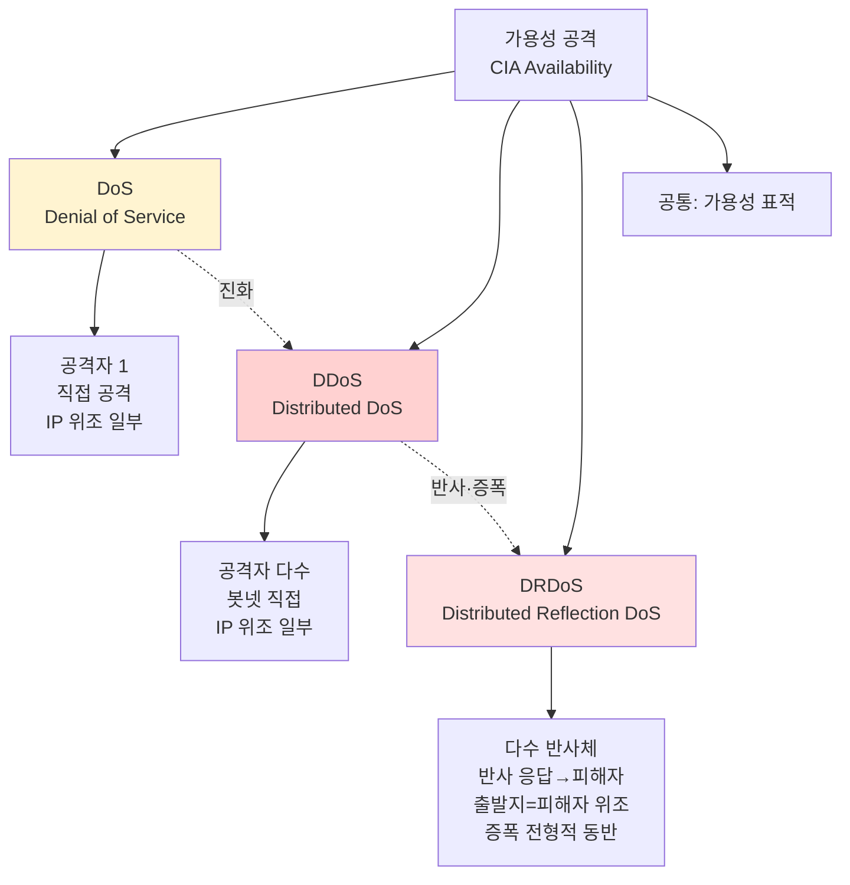
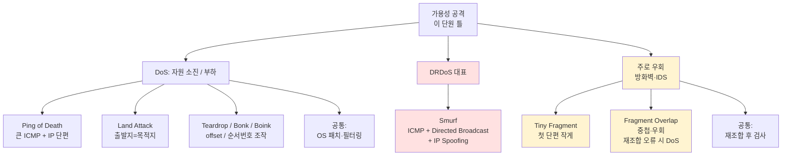
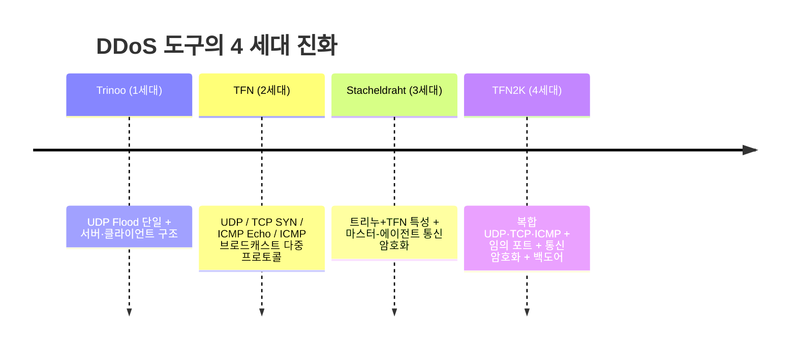
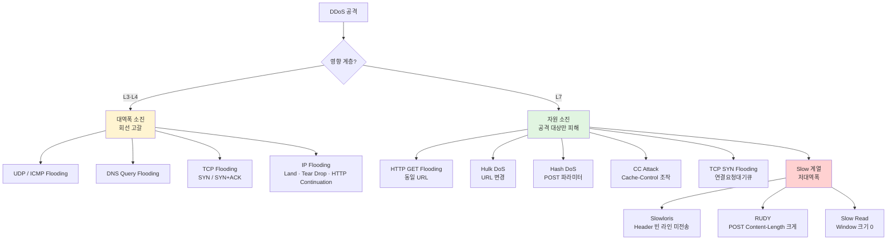
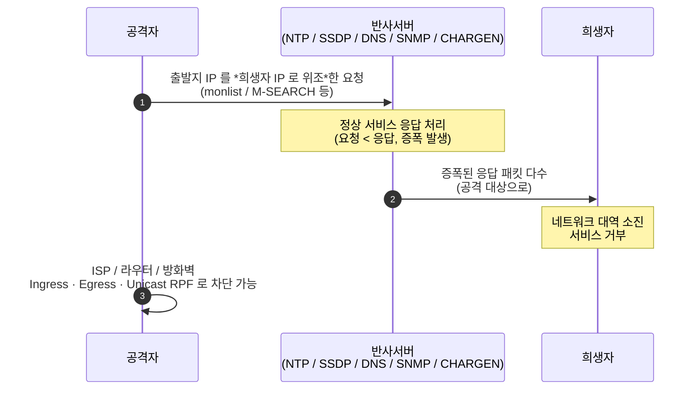

# 05. DoS · DDoS · DRDoS — 만화책처럼 읽는 가용성 공격

> **이 문서를 읽는 법**: 만화책 한 권을 펼쳤다고 생각하세요. *에피소드*를 따라 *어떤 가용성 자원이 고갈되는가 → 어떤 헤더·프로토콜을 악용 → 어떻게 대응* 의 3 단계로 외우면 자연스럽게 정착됩니다.
> 정확한 명령·옵션·RFC 는 정확본을 참조: [[cs/information-security/02.network-security/05.dos-ddos-drdos|정확본 05. DoS·DDoS·DRDoS]]

> **연결 단원**: 본 단원은 **가용성 (Availability) 공격** 단원이다. *Ping of Death*는 [[cs/information-security/02.network-security/02.network-protocols-and-addressing|02 단원]] 의 *ICMP·IP 단편화*가 토대. ***Smurf*** 는 같은 맥락에서 **ICMP + Directed Broadcast + IP Spoofing** 을 쓰는 **대표적 DRDoS** 로 이해한다. *TCP SYN Flooding*은 02 단원의 *3-way Handshake* 악용·**TCP 연결요청대기큐** 고갈. *IP Spoofing 출발지 위조*는 [[cs/information-security/02.network-security/04.scanning-sniffing-spoofing|04 단원]] 의 *IP Spoofing*. *DNS 싱크홀*은 봇넷 *C&C* 차단 기법. *Tiny Fragment / Fragment Overlap*은 **주로** 방화벽·IDS **우회**로 출제되나, *Fragment Overlap* 이 **Teardrop** 처럼 **재조합 오류**를 유발하면 **DoS 와 연결**될 수 있다.

---

## 🎯 시작 전에 — 이미 들어본 공격 이름들

| 매일 듣는 것 | 사실은 이 단원의 |
|---|---|
| *Ping of Death* | **ICMP + IP 단편화 재조합** 부하 |
| *Land Attack* | **출발지 IP = 목적지 IP** |
| *Smurf Attack* | **ICMP + Directed Broadcast + IP Spoofing** — **대표적 DRDoS** (반사·증폭) |
| *SYN Flood* | TCP **연결요청대기큐** 소진 |
| `sysctl -w net.ipv4.tcp_syncookies=1` | **SYN Cookie** mitigation (RFC 4987) |
| *Slowloris·RUDY* | **저대역폭** L7 자원 소진 |
| *봇넷 / 좀비 PC* | **C&C 서버** 명령 제어 |
| *Conficker · WannaCry* | **DGA** (도메인 동적 생성) |
| *NTP `monlist` 증폭* | **DRDoS** (반사·증폭) |
| `no ip directed-broadcast` | **Smurf 대응** 라우터 설정 |
| KISA *사이버대피소·DNS 싱크홀* | DDoS 대응·봇넷 명령 차단 |

> **이 단원의 본질**: **DoS/DDoS/DRDoS 단원 = 가용성 공격 단원** (*CIA* 의 **Availability**). **DDoS** = *다수의 좀비 PC(봇넷)* 가 **피해자에게 직접** 공격하는 구조. **DRDoS** = **출발지 IP 를 피해자로 위조**해 **반사 서버(반사체)의 응답**을 **피해자에게 몰아넣는** 구조(반사가 핵심; Smurf·NTP 등에선 **증폭**까지 동반해 시험에 자주 묶임). ***Smurf*** = **ICMP + Directed Broadcast + IP Spoofing** 기반 **대표적 DRDoS**. ***SYN Flood*** = **TCP 연결요청대기큐** 고갈. *Tiny Fragment·Fragment Overlap* = **주로** 방화벽·IDS **우회** 출제 — 다만 *Fragment Overlap* 이 **Teardrop** 식 **재조합 오류**를 일으키면 **DoS 로도 연결**될 수 있음.

---

## 📖 에피소드 1 — DoS · DDoS · DRDoS 3 분류 매트릭스

### 장면. 가용성을 무너뜨리는 3 형태

> 모든 공격이 *CIA 3 요소* 중 **가용성 (Availability)** 을 표적. *공격자 수*와 *경유 방식*의 2 축으로 3 분류.

### 3 분류 매트릭스 — 시험 1순위

| 구분 | 풀이 | 공격 주체·규모 | 직접/간접 | 위조 IP | 증폭 |
|---|---|---|---|---|---|
| **DoS** | **D**enial **o**f **S**ervice | **1** | 피해자에게 **직접** | 일부 공격에서 사용 | 공격별 상이 |
| **DDoS** | **D**istributed **D**oS | *다수 **좀비 PC·봇넷*** | 피해자에게 **직접** | 일부 사용 | 거의 없음 (대역폭·자원 소진이 목적) |
| **DRDoS** | **D**istributed **R**eflection **D**oS | *다수 **반사 서버·반사체*** | **반사 응답**이 피해자에게 | **피해자를 출발지로 위조** (핵심) | Smurf·NTP 등 **전형적으로 동반** (시험에 많이 출제) |

### 외우는 방법 — *직접(DDoS 좀비) vs 반사(DRDos 위조+반사체)*

> *DoS* = 단일 출발점에서 **직접**. *DDoS* = **좀비가 직접** 피해자를 때림. *DRDoS* = **위조된 출발지(피해자)** 를 걸어 **반사체 응답**이 피해자에게 쏟아짐 — *이름의 D·R 은 ‘분산된 반사’ 쪽 암기*에 쓰면 된다.

### DoS 공격 분류 — 자원 소진 vs 우회 공격

| 분류 | 공격명 | 핵심 원리 |
|---|---|---|
| **시스템 자원 소진 / 부하 유발** | Ping of Death | ICMP + IP 단편화 재조합 부하 |
| | Land | 출발지 IP = 목적지 IP |
| | Teardrop / Bonk / Boink | IP fragment offset 조작 (Teardrop: **중첩** → 재조합 오류·DoS) |
| **DRDoS (반사·증폭) 대표** | Smurf | **ICMP + Directed Broadcast + IP Spoofing** — Echo Request 를 브로드캐스트로 쏘고 **출발지=피해자** → 다수 **Echo Reply 가 피해자에게** |
| **패킷 필터링 우회 (시험 주 출제)** | Tiny Fragment | 첫 단편을 *작게* + 목적지 포트 숨김 — **주로 우회** |
| | Fragment Overlap | 단편 오프셋 *중첩*으로 포트 덮어쓰기 — **주로 우회**; Teardrop 처럼 **재조합 오류**를 내면 **DoS 와 연결** 가능 |

### Tiny Fragment / Fragment Overlap — 시험 함정

> *DoS/DDoS/DRDoS 표 옆에 붙어* 나오는 경우가 많다. **주된 출제 포인트**는 *방화벽·IDS **우회***. **Tiny Fragment** 는 *우회* 쪽으로 기억. **Fragment Overlap** 은 우회가 **전부는 아님** — **Teardrop** 과 같이 **재조합 오류·불안정**을 유발하면 **가용성(DoS)** 문제로도 이어질 수 있다.

### 시험 함정

| 함정 | 정답 |
|---|---|
| CIA 중 표적? | **가용성 (Availability)** |
| DoS 풀이? | Denial of Service |
| DDoS 풀이? | Distributed Denial of Service |
| DRDoS 풀이? | **Distributed Reflection** Denial of Service |
| DRDoS 의 IP 위조? | **피해자 출발지 위조** — 반사 구조의 **필수** |
| DRDoS 와 증폭? | **반사**가 핵심; Smurf·NTP 등에선 **증폭**까지 **전형적으로 동반** (시험 연결 多) |
| Tiny Fragment 분류? | **주로** 방화벽·IDS **우회** |
| Fragment Overlap 분류? | **주로 우회**; 재조합 오류 유발 시 **DoS 연결 가능** |

---

## 📖 에피소드 2 — Ping of Death + Land: ICMP·IP 단편화·자기 응답

### 장면 1. 거대한 ping

> **Ping of Death** = `ping` 명령으로 *정상보다 아주 큰 ICMP 패킷*을 전송 → MTU 에 의해 *다수 IP 단편 발생* → 수신측 *재조합 과정에서 부하 또는 재조합 버퍼 오버플로우*.

### 공격 원리 + 탐지 + 패치

| 항목 | 내용 |
|---|---|
| 공격 원리 | 큰 ICMP 패킷 → MTU 에 의해 *다수 IP 단편* → *재조합 부하* |
| **공격 탐지** | **ICMP 패킷은 본래 분할하지 않으므로** *분할 ICMP 자체가 공격 단서* |
| 보안 패치 | 대부분 시스템은 *Ping of Death 시 ICMP 무시* |

### MTU — 02 단원과 직결

> **MTU (Maximum Transmission Unit)** = 물리 프레임 *데이터부 최대 크기*. 이더넷 = *IP 헤더 20 byte 제외 1480 byte*. (02 단원 §2-4)

### 장면 2. 자기 자신에게 응답하는 시스템

> **Land Attack** = *출발지와 목적지 IP 가 같은* 패킷을 만들어 전송 → *수신자가 자기 자신에게 응답* → **무한 루프** 상태 → 시스템 자원 소모.

### 대응

| 위치 | 대응 |
|---|---|
| 보안 패치 | 대부분 시스템 *Land Attack 패치 적용* |
| 패킷 필터링 | **출발지 IP = 목적지 IP 면 차단** |

### 외우는 방법 — Death (큰 ping) ↔ Land (자기 자신)

> *Ping of Death = ICMP 가 분할되었다 = 비정상* / *Land = 출발지=목적지 = 무한 루프*. *탐지 단서가 명확*.

### 시험 함정

| 함정 | 정답 |
|---|---|
| Ping of Death 탐지 단서? | **분할된 ICMP** (본래 ICMP 는 분할 ❌) |
| Ping of Death 공격 원리? | 큰 ICMP → IP 단편 → 재조합 부하 |
| 이더넷 MTU? | **1500 byte** (데이터부 1480) |
| Land Attack 핵심? | **출발지 IP = 목적지 IP** |
| Land Attack 결과? | *무한 루프* 자원 소모 |
| Land 대응? | 패킷 필터링 (출발지=목적지 차단) |

---

## 📖 에피소드 3 — Smurf: ICMP + Directed Broadcast + IP Spoofing (대표적 DRDoS) + `no ip directed-broadcast`

### 장면. 한 번 ping 으로 1000 응답

> **Smurf Attack** = **ICMP Echo Request + Directed Broadcast + IP Spoofing(출발지=피해자)** 의 **대표적 DRDoS**. *증폭 네트워크*에 브로드캐스트한 요청에 대해 *다수 호스트*가 **Echo Reply 를 피해자(가짜 출발지)** 로 보냄 — **반사·증폭**으로 서비스 거부.

### 핵심 어휘 2

| 용어 | 의미 |
|---|---|
| **Directed Broadcast** | *원격지 호스트 ID 비트를 모두 1*로 설정 → 브로드캐스트 전송 |
| **증폭 네트워크** | 희생자에게 *다수의 증폭된 ICMP Echo Reply* 를 전송하는 네트워크 |

### 공격 흐름

```
공격자 ─(ICMP Echo Request, 출발지 IP=희생자)→ 증폭 네트워크 (Directed Broadcast)
   ↓
증폭 네트워크의 모든 호스트
   ↓
   각각 ICMP Echo Reply →→→→→→→→→→→→→→→→→→ 희생자
                                                (다수의 응답으로 자원 소진)
```

### 대응 3 종 — 시험 1순위

| 위치 | 대응 |
|---|---|
| **보안 장비** | 동일한 ICMP Echo Reply 다량 발생 → *모두 차단* |
| **라우터** | **`no ip directed-broadcast`** (증폭 네트워크 사용 방지) |
| **시스템** | 브로드캐스트 *ICMP Echo Request* 에 대해 *응답 ❌* |

### `no ip directed-broadcast` — 시험 1순위

> Smurf 의 *대표 대응 명령*. *Directed Broadcast 자체를 차단* → 증폭 네트워크 형성 ❌.

### 시험 함정

| 함정 | 정답 |
|---|---|
| Smurf 의 성격? | **DRDoS** 대표 (ICMP + Directed Broadcast + IP Spoofing) |
| Smurf 의 출발지 IP? | **희생자 IP 로 위조** |
| Directed Broadcast? | *호스트 ID 비트 모두 1* |
| Smurf 가 사용하는 ICMP? | Echo Request / **Echo Reply 증폭** |
| 라우터 대응 명령? | **`no ip directed-broadcast`** |
| 시스템 대응? | 브로드캐스트 ICMP Echo Request 응답 ❌ |

---

## 📖 에피소드 4 — Teardrop · Bonk · Boink + Tiny Fragment · Fragment Overlap

### 장면. IP fragment offset 의 어둠

> *IP 단편의 오프셋·순서번호*를 *조작*하여 수신측에 *오류·부하* 유발하거나 *패킷 필터링 우회*.

### 자원 소진 3 변형 — Teardrop · Bonk · Boink

| 변형 | 단편 순서번호 조작 |
|---|---|
| **Teardrop** | offset 을 서로 *중첩* 되도록 조작 |
| **Bonk** | 처음 1번 → 다음부터 *모두 1번*으로 조작 |
| **Boink** | 1 → 100 → 200 *정상*으로 보내다가 *중간에 비정상* |

### 외우는 방법 — Tear (찢기) · Bonk (반복) · Boink (변덕)

> *Teardrop = 중첩된 단편 (찢김)* / *Bonk = 모두 같은 번호 (반복)* / *Boink = 정상 후 비정상 (변덕)*. 영문 어원이 *조작 패턴*.

### 대응 — 보안 패치

| 항목 | 내용 |
|---|---|
| 보안 패치 | 운영체제 보안패치 적용 → OS 취약점 해소 |

### 우회 공격 2 — Tiny Fragment + Fragment Overlap (주로 우회, Overlap 은 DoS 로도 연결 가능)

> **시험에서는 대개** *방화벽·IDS **우회***로 출제된다. *IP fragment* 조작이 공통. **Fragment Overlap** 은 **Teardrop** 처럼 **재조합 단계 오류**를 일으키면 **DoS(가용성)** 와 **연결**될 수 있음 — 선택지에 *“항상 DoS 아님”* 식 **절대화는 함정**에 빠지기 쉽다.

### Tiny Fragment — 첫 단편 작게

| 단계 | 내용 |
|---|---|
| 1. 첫 번째 단편 | 목적지 포트 **없음** |
| 2. 두 번째 단편 | 목적지 포트 **있음** |
| 3. 재조합 시 | 공격자가 원하는 *목적지 포트* 연결 |

> 헤더를 *작게 쪼개* 첫 단편에 목적지 포트 *없게* + 두 번째 단편으로 포트 연결 → *허용 안 된 서비스 접근*.

### Fragment Overlap — 단편 중첩

| 단계 | 내용 |
|---|---|
| 1. 첫 번째 단편 | **허용** 목적지 포트 |
| 2. 두 번째 단편 | **우회** 목적지 포트 (재조합 시 첫 단편 *덮어씀*) |
| 3. 재조합 시 | TCP 헤더 *중첩* → 공격자 원하는 포트 |

### 단편 공격 공통 대응

> **단편화된 패킷을 재조합 후 검사하는 방화벽·IDS 사용**. 우회 공격 탐지 가능한 패킷 필터링 장비 적용.

### 시험 함정

| 함정 | 정답 |
|---|---|
| Teardrop 조작? | offset *중첩* |
| Bonk 조작? | 순서번호 *모두 1* |
| Boink 조작? | 정상 후 *중간 비정상* |
| 단편 3 자원 소진 대응? | **OS 보안 패치** |
| Tiny Fragment 분류? | **주로** 방화벽·IDS **우회** |
| Fragment Overlap 분류? | **주로 우회**; 재조합 오류 시 **DoS** |
| 우회 공격 공통 대응? | *재조합 후 검사*하는 방화벽·IDS |

---

## 📖 에피소드 5 — DDoS 정의·구조: 봇넷 + C&C + 5 단계 절차

### 장면. 분산된 좀비 군단

> **DDoS** = *분산된 다수 **좀비 PC·봇넷*** 이 **피해자를 직접** 공격해 서비스를 마비한다. **DoS 와 차이**는 *단일 출발점 ❌*. **DRDoS 와 차이**는 *좀비가 곧바로 트래픽을 쏘는 **직접 공격** 구조* (vs 출발지 위조 + **반사체 응답**).

### 구성 요소 6 — 시험 1순위

| 용어 | 정의 | 별칭 |
|---|---|---|
| **공격자** | C&C 서버에 공격 명령 전달 | **Bot Master** |
| **C&C 서버** (Command & Control) | 공격 명령을 다수 좀비 PC 에게 전달 | — |
| **좀비 PC** | 명령 실행 + 공격 수행 | **Bot · Agent · Slave** |
| **공격대상** | 공격 대상 시스템 | **Victim** |
| **봇 (Bot)** | 보안 결함으로 *원격 제어 가능*한 프로그램 | — |
| **봇넷 (Botnet)** | 봇 감염 *다수 좀비 PC 의 네트워크* | — |

### 봇의 정체 — 다양한 악성코드 복합

> 봇은 *웜·바이러스·백도어·스파이웨어·루트킷* 등 다양한 악성코드 특성을 *복합 보유*. *정보 유출 / 스팸메일 / DDoS / 트래픽 스니핑 / 키 로깅* 등 다양 공격 수행.

### 공격 절차 5 단계

```
1. C&C 서버 구축       — 공격자가 봇을 관리·명령하는 서버 구축
2. 봇 배포            — 불특정 다수 PC 에 봇 배포·감염 시도
3. 봇 감염            — 사용자가 봇 실행 → 봇넷의 일원
4. 명령 전달          — 공격자 → C&C 서버 → 좀비 PC
5. 공격 수행          — 좀비 PC 가 공격대상에게 다양한 공격
```

### 외우는 방법 — *구축 → 배포 → 감염 → 명령 → 공격*

> *서버 만들기 → 좀비 만들기 → 좀비 모집 → 명령 → 실행*. *시간 순*이 곧 *5 단계*.

### 시험 함정

| 함정 | 정답 |
|---|---|
| 공격자 별칭? | **Bot Master** |
| C&C 풀이? | **Command & Control** |
| 좀비 PC 별칭? | Bot · Agent · **Slave** |
| 공격대상 별칭? | **Victim** |
| 봇넷의 정체? | 봇 감염 좀비 PC *네트워크* |
| 5 단계 순서? | 구축 → 배포 → 감염 → 명령 → 공격 |

---

## 📖 에피소드 6 — DDoS 도구 4 진화: Trinoo → TFN → Stacheldraht → TFN2K

### 장면. 4세대 진화

> *각 도구가 이전 도구의 한계를 강화*. *Trinoo → TFN → Stacheldraht → TFN2K* 의 *기능 추가 흐름*.

### 4 도구 매트릭스 — 시험 1순위

| 도구 | 사용 프로토콜 | 특수 기능 |
|---|---|---|
| **Trinoo** (트리누) | **UDP Flood** *단일* | 서버 + 다수 클라이언트 구조 |
| **TFN** | **UDP Flood / TCP SYN Flood / ICMP Echo / ICMP 브로드캐스트** | 다수 소스 → 1+ 목표 |
| **Stacheldraht** | Trinoo + TFN 의 특성 | **마스터-에이전트 통신 암호화** |
| **TFN2K** | **UDP / TCP / ICMP 복합** | *암호화* + *임의 포트* + **백도어** + 특정 포트 미사용 |

### 진화 인과 한 줄

> *Trinoo (UDP 만)* → *TFN (4 프로토콜 추가)* → *Stacheldraht (암호화 추가)* → *TFN2K (복합 + 암호화 + 임의 포트 + 백도어)*. *기능이 누적*.

### Stacheldraht 의 핵심 — 통신 암호화

> 마스터 시스템 ↔ *자동 업데이트되는 에이전트 데몬* 사이 통신 *암호화*. *탐지 차단 회피*.

### TFN2K 의 핵심 — 4 강화

| 강화 | 의미 |
|---|---|
| 암호화 | 통신 암호화 (Stacheldraht 계승) |
| **복합 사용** | UDP·TCP·ICMP *동시* |
| **임의 포트** | 특정 포트 ❌ → 임의 결정 |
| **백도어** | 지정 TCP 포트에 백도어 실행 가능 |

### 시험 함정

| 함정 | 정답 |
|---|---|
| 트리누 사용 프로토콜? | **UDP Flood 단일** |
| TFN 사용 프로토콜? | UDP / TCP SYN / ICMP Echo / ICMP 브로드캐스트 |
| Stacheldraht 의 핵심? | **통신 암호화** |
| TFN2K 의 핵심 4? | 암호화 / **복합** / 임의 포트 / **백도어** |

---

## 📖 에피소드 7 — 봇넷 명령 제어 + 보안장비 우회 3: Fast Flux · DGA · Domain Shadowing

### 장면 1. 중앙집중 vs 분산

> 봇넷의 *C&C 명령 전달 방식*은 두 가지. *중앙집중*은 단일 C&C 의존, *분산*은 멤버 모두 C&C.

### 봇넷 명령 제어 2 방식

| 방식 | 설명 | 대표 봇넷 |
|---|---|---|
| **중앙 집중형** | 멤버들이 *C&C 서버와 연결* + 명령 수행. *C&C 탐지·차단 시 전체 중단 가능성* | **IRC 봇넷 / HTTP 봇넷** (Rbot 등) |
| **분산형** | 멤버들 *모두 C&C 역할* + 그룹에 명령 전파. *별도 도메인·서버 ❌ + 탐지·차단 어려움* | **P2P 봇넷** (Storm · Peacomm 등) |

### IRC = Internet Relay Chat

> **IRC** = 인터넷에서 *채팅용 프로토콜*. 봇 마스터는 *IRC 서버를 C&C 로 활용*.

### 장면 2. 보안장비 우회 3 기법

> *KISA 가 C&C 도메인·IP 목록을 업데이트*하면 봇넷이 *탐지·차단됨* → 우회 기법 3 가지.

### 우회 3 기법 — 시험 1순위

| 기법 | 설명 | 운용 |
|---|---|---|
| **Fast Flux** | 하나의 C&C 도메인에 *다수 IP 할당* + DNS 질의 시마다 *IP 변경* | 도메인 질의 시마다 IP 변경 |
| **DGA** (Domain Generation Algorithm) | 약속된 규칙으로 *C&C 도메인 동적 생성* → 도메인 기반 탐지·차단 우회 | 생성 도메인 중 하나를 DNS 등록 |
| **Domain Shadowing** | *합법 도메인의 서브 도메인*을 C&C 로 사용 | 합법 도메인에 서브 도메인 등록 |

### 외우는 방법 — *IP 변경 / 도메인 생성 / 서브 탈취*

> *Fast Flux = 도메인 동일 + IP 변경* / *DGA = 도메인 자체 동적 생성* / *Domain Shadowing = 합법 도메인의 **서브** 탈취*. *어느 부분을 변경하는가*가 곧 분류.

### DGA 의 사례 — 정확본 명시

| 사례 | 설명 |
|---|---|
| **Conficker** 웜 | DGA 가 *처음 알려진* 사례 |
| **Locky** 랜섬웨어 | *시스템 날짜 기반* 도메인 생성 |
| **WannaCry** 랜섬웨어 | DGA 사용 |

### Domain Shadowing 의 동작

> *합법 도메인 관리자의 개인정보 탈취* → 도메인 소유자 *몰래* 다수의 서브 도메인 등록·사용. *DBD 경유지*로도 사용.

### 시험 함정

| 함정 | 정답 |
|---|---|
| 중앙집중 봇넷 대표? | **IRC · HTTP** |
| 분산 봇넷 대표? | **P2P** |
| IRC 풀이? | Internet Relay Chat |
| Fast Flux 동작? | *도메인 동일 + IP 변경* |
| DGA 동작? | *도메인 자체 동적 생성* |
| DGA 첫 사례? | **Conficker 웜** |
| Domain Shadowing 동작? | *합법 도메인의 서브* 도메인 탈취 |

---

## 📖 에피소드 8 — 대역폭 소진: UDP/ICMP Flooding + TCP SYN Flooding

### 장면. L3·L4 의 회선을 메운다

> DDoS 공격은 *대역폭 소진 (L3·L4)* 와 *자원 소진 (L7)* 으로 분류. 본 에피소드는 *대역폭 소진* 대표.

### 대역폭 ↔ 자원 분류

| 구분 | 대역폭 소진 (L3·L4) | 자원 소진 (L7) |
|---|---|---|
| 영향 계층 | 3·4 (IP·ICMP·IGMP·UDP·TCP) | 7 (HTTP·DNS·SMTP) |
| 영향 범위 | **회선 대역폭 고갈** — *동일 네트워크 모든 서비스* 영향 | *공격 대상 시스템만* 피해 |
| 공격 대상 | 네트워크 인프라 | 웹서버 / 정보보호 장비 |
| 대표 | UDP/ICMP Flooding · DNS Query · TCP SYN/SYN+ACK · IP Flooding (Land · Tear Drop · HTTP Continuation) | HTTP GET (CC) · HTTP Header/Option (Slowloris·Pyloris) · TCP (TCP session·SYN·Slow Read) · L7 Service (Hash·Hulk·FTP·SMTP) |

### UDP / ICMP Flooding — 대역폭 소진

> 다량 UDP 또는 ICMP 패킷을 서버로 → *서버 보유 네트워크 대역폭 소진*.

```
1. 공격자: 출발지 IP 위조한 다량 UDP/ICMP → 대상 서버
2. 대상 서버: 대량 트래픽 → 서비스 불가
3. 정상 클라이언트: 접속 원활 ❌
```

### TCP SYN Flooding — 자원 소진 (연결요청대기큐)

> SYN 패킷을 서버로 전송 → *서버 TCP 연결 자원 소진*. **자원 소진 공격**으로 분류.

### 4 단계 + 핵심 어휘

```
1. 공격자: 출발지 IP 를 *도달 불가능 IP 로 위조*한 SYN 요청 → 서버
2. 서버: SYN+ACK 송신 + 연결설정 완료까지 *연결요청대기큐* 저장 (SYN_RECV)
3. 큐가 *꽉 참* → 더 이상 연결 요청 ❌
4. 정상 클라이언트: 서비스 이용 ❌
```

### 핵심 — *ACK 가 안 옴*

> 02 단원 §4-5 의 *3-way Handshake (SYN → SYN+ACK → ACK)* 에서 *ACK 가 안 와* 큐에 *SYN_RECV 만 누적*. *큐 = 연결요청대기큐 (= incomplete connection queue)*.

### TCP SYN Flooding 대응 5 — 시험 1순위

| 대응 | 명령 / 설정 |
|---|---|
| **SYN Cookie 설정** | **`sysctl -w net.ipv4.tcp_syncookies=1`** (RFC 4987 mitigation) |
| **보안 장비 (connlimit)** | `iptables -A INPUT -p tcp --dport 80 --syn -m connlimit --connlimit-above 5 -j DROP` |
| **First SYN Drop** | 첫 SYN 을 *Drop* + *재요청* 패킷 도착 여부 확인 → *IP 위조 파악* |
| **연결요청대기큐 크기 증가** | `sysctl -w net.ipv4.tcp_max_syn_backlog = 1024` |
| **대기 시간 단축** | SYN+ACK 대기 시간 *축소* |

### SYN Cookie 의 본질 — RFC 4987

> *적절한 ACK 를 받을 때까지* 연결요청대기큐에 *연결요청정보 저장 ❌*. → 큐 소진 자체를 막음.

### 시험 함정

| 함정 | 정답 |
|---|---|
| 대역폭 소진 계층? | **L3·L4** |
| 자원 소진 계층? | **L7** |
| 대역폭 ↔ 자원 영향 범위? | *동일 네트워크 모든 서비스* ↔ *공격 대상만* |
| UDP/ICMP Flooding 분류? | **대역폭 소진** |
| TCP SYN Flooding 분류? | **자원 소진** (연결요청대기큐) |
| SYN_RECV 누적 큐? | **연결요청대기큐** (incomplete connection queue) |
| SYN Cookie 명령? | **`sysctl -w net.ipv4.tcp_syncookies=1`** |
| SYN Cookie RFC? | **RFC 4987** |
| First SYN Drop 목적? | *IP 위조 여부* 파악 |
| 큐 크기 증가? | `tcp_max_syn_backlog = 1024` |

---

## 📖 에피소드 9 — L7 자원 소진: HTTP GET · Hulk · Hash · CC

### 장면. 7 계층의 4 가지 GET 변종

> *L7 자원 소진* 4 종은 모두 *HTTP 요청 처리 부하* 유발. *동일 URL / 변경 URL / POST 파라미터 / 캐시 옵션* 의 4 변형.

### 4 종 매트릭스 — 시험 1순위

| 공격 | 핵심 |
|---|---|
| **HTTP GET Flooding** | *동일 URL* 에 대량 GET → 서버 자원 과다 사용 |
| **Hulk DoS** | *URL 을 지속 변경* + 대량 GET → 임계치 기반 차단 무력화 |
| **Hash DoS** | 조작된 파라미터 *대량 POST* → 해시 충돌 → CPU 자원 고갈 |
| **CC Attack** | *Cache-Control 옵션 조작* → 캐싱서버 무력화 → 웹서버 직접 처리 |

### 외우는 방법 — *동일 / 변경 / POST / 캐시*

> *GET 동일 → Hulk 변경 → Hash POST → CC 캐시*. *어떤 부분을 변경하는가*가 분류.

### HTTP GET Flooding — 동일 URL

```
1. 공격자: 동일한 동적 컨텐츠에 다량 HTTP GET 요청
2. 대상 서버: 요청 처리 + 서버 자원 *과다 사용*
3. 정상 클라이언트: 서비스 이용 ❌
```

### 분석 도구 — ngrep + access log

```bash
ngrep -qtW byline | grep GET                                                     # GET 요청 헤더 ASCII
cat access_log-20160214 | grep "GET /home/index.php" | awk '{print $1}' | sort | uniq -c | sort -rn   # 출발지 IP 별 횟수
```

### Hulk DoS — 동적 변경

> *대상서버 주소를 지속 변경*하면서 GET → *URL 임계치 기반*의 차단 장비가 *서로 다른 주소로 인식* → 정상 차단 ❌.

### Hash DoS — POST 파라미터 + 해시 충돌

```
1. 공격자: 조작된 *많은 파라미터*를 POST 로 대상서버 전달
2. 대상서버: *다수 해시 충돌*
3. 정상 파라미터 조회 시 *CPU 자원 과다 소모*
```

### Hash DoS 의 본질 — 해시테이블 특성 악용

> 해시테이블이 *충돌 시 선형 탐색*하는 특성을 *악용*. 의도적으로 *충돌하는 파라미터*를 다수 보내 *연산 시간 폭증*.

### CC Attack — Cache-Control 옵션 조작

> 웹서버 부하 감소를 위해 *캐싱서버* 운영 → *캐시 옵션 조작*으로 *캐싱서버 우회* → 웹서버 직접 처리.

```
1. 공격자: HTTP 메시지의 *캐시 옵션 조작*
2. 캐싱서버 우회 → 웹서버가 직접 처리
3. 캐싱서버 무력화 + 웹서버 자원 소모
```

### CC = HTTP GET Flooding with Cache-Control

> *CC = HTTP GET Flooding 의 변형*. *캐시 동작을 우회*하는 GET Flooding.

### 시험 함정

| 함정 | 정답 |
|---|---|
| HTTP GET Flooding URL? | **동일** |
| Hulk DoS URL? | **지속 변경** |
| Hash DoS 메서드? | **POST** |
| Hash DoS 본질? | **해시 충돌** → CPU 자원 고갈 |
| CC Attack 의 정체? | *Cache-Control 조작*하여 캐싱서버 우회 |
| CC Attack 풀이? | HTTP GET Flooding with **Cache-Control** |
| L7 자원 소진 4? | GET / Hulk / Hash / CC |

---

## 📖 에피소드 10 — Slow 계열: Slowloris · RUDY · Slow Read (저대역폭)

### 장면. 트래픽이 작아도 자원이 소진된다

> *Slow 계열*의 특징은 **저대역폭** 공격. *다량 트래픽 ❌, 연결 상태 지속 ✅*. 연결 자원만 소진.

### Slow 3 변형 — 시험 1순위

| 변형 | 동작 원리 | 본질 |
|---|---|---|
| **Slow HTTP Header DoS** (= **Slowloris**) | *빈 라인 (CRLF CRLF) 미전송* + 지속 천천히 헤더 전달 → 헤더 *완료 인식 ❌* | 서버가 *헤더 전체 수신*까지 연결 유지 |
| **Slow HTTP POST DoS** (= **RUDY**, *R-U-Dead-Yet*) | `Content-Length` *비정상 크게* + 매우 소량 데이터 *천천히* 전송 | 서버가 *명시 크기까지 수신*하기 위해 연결 유지 |
| **Slow HTTP Read DoS** | TCP **윈도우 크기 0**으로 조작 + 지속 전달 | 서버가 *응답 미전송* + 연결 유지 |

### Slow Read 의 동작 근거 — TCP 흐름 제어

> *수신측 버퍼 여유 = 0* → **Window 필드 = 0** 으로 **Zero Window Packet** 전달. *송신측은 일정 시간 대기 후 **Zero Window Probe Packet*** 발송. 공격자가 이를 *악용*하여 응답 *무한 대기*.

### Slowloris·RUDY·Slow Read — 어디를 천천히 하는가

| 변형 | 천천히 하는 부분 |
|---|---|
| Slowloris | *헤더 라인* (빈 라인 미전송) |
| RUDY | *POST 본문* (Content-Length 크게 + 소량 송신) |
| Slow Read | *읽기 응답* (Window 크기 0) |

### 외우는 방법 — *Header / Body / Read*

> *Slowloris = Header 천천히* / *RUDY = Body 천천히* / *Slow Read = Read 천천히*. *HTTP 트랜잭션의 3 단계*가 곧 3 변형.

### Slow 계열 대응 3 — 시험 1순위

| 대응 | 명령 / 설정 |
|---|---|
| **동시 연결 임계치** | `iptables -A INPUT -p tcp --dport 80 -m connlimit --connlimit-above 30 -j DROP` |
| **연결 타임아웃** | `/etc/httpd/conf/httpd.conf` 의 `Timeout 120` (완벽 ❌) |
| **읽기 타임아웃** | `<IfModule reqtimeout_module> RequestReadTimeout header=5 body=10 </IfModule>` |

### `RequestReadTimeout` 의 핵심

> *요청 헤더·바디*가 *특정 시간 이내 수신 ❌* → *오류 응답*. Slow 공격 *근본 대응*.

### 시험 함정

| 함정 | 정답 |
|---|---|
| Slow 계열 특징? | **저대역폭** 공격 |
| Slowloris 의 정식명? | **Slow HTTP Header DoS** |
| Slowloris 동작? | *빈 라인 미전송* |
| RUDY 풀이? | **R-U-Dead-Yet** |
| RUDY 의 정식명? | **Slow HTTP POST DoS** |
| RUDY 동작? | *Content-Length 크게* + 소량 데이터 천천히 |
| Slow Read 동작? | *TCP Window 크기 0* |
| Slow Read 의 TCP 메커니즘? | **Zero Window Packet** + Zero Window Probe |
| Slow 대응 — 읽기 타임아웃 모듈? | **`reqtimeout_module`** + `RequestReadTimeout` |

---

## 📖 에피소드 11 — DDoS 종합 대응: 사이버대피소 + NIST SP 800-61

### 장면. 예방 + 자체 방어 + 외부 서비스

> DDoS 대응은 *예방* + *자체 방어 준비* + *외부 서비스 활용* 의 3 축.

### 예방 대책 3

| 항목 | 내용 |
|---|---|
| **DDoS 대응 서비스 가입** | ISP / 클라우드 DDoS 방어 + **KISA 사이버대피소** |
| **백업 서버 구축** | 중요 서버 *서로 다른 회선*에 이중화 |
| **공격 대상 최소화** | 내부용 서버 외부 노출 ❌ + *망 분리* |

### KISA 사이버대피소 — 시험 1순위

> *KISA 가 운영하는 무료 DDoS 대응 서비스*. *중소기업 대상*. ISP 협력으로 공격 트래픽을 *KISA 보호 회선으로 우회*.

### 방어 대책 — 자체 vs 외부

| 분류 | 항목 |
|---|---|
| **자체 방어 준비** | TCP 기반 DDoS 방어 / 이상 트래픽 모니터링 / **화이트리스트 방식 방화벽** / 서버 분산 |
| **DDoS 대응서비스 활용** | 전문 방어 서비스 + 즉각 대응 프로세스 (NIST SP 800-61) |

### NIST SP 800-61 — 침해사고 대응 4 단계

> **NIST SP 800-61 Rev.2** = *Computer Security Incident Handling Guide*. DDoS 포함 침해사고 대응 *4 단계 표준 절차*: *Preparation → Detection & Analysis → Containment, Eradication & Recovery → Post-Incident Activity*.

### 시험 함정

| 함정 | 정답 |
|---|---|
| KISA 운영 서비스? | **사이버대피소** |
| 사이버대피소 대상? | *중소기업* |
| 방어 화이트리스트? | *자체 방어 준비* |
| 침해사고 대응 표준? | **NIST SP 800-61 Rev.2** |
| 망 분리·이중화? | *예방 대책* |

---

## 📖 에피소드 12 — DRDoS: 반사·증폭 + NTP `monlist` + SSDP + Ingress/Egress/Unicast RPF

### 장면. 정상 서비스를 무기로 만든다

> **DRDoS** = 출발지 IP 를 *공격 대상 IP 로 위조* + 다수 **반사서버 (Reflector)** 로 요청 → 반사서버가 *공격 대상에 응답* → 서비스 거부.

### DoS 와의 차이 3 축

| 차이 | 설명 |
|---|---|
| **반사 서버** | *직접 공격 ❌, 정상 서비스를 증폭·반사용으로 악용* |
| **근원지 파악** | 출발지 IP 위조 + *다수 반사서버 경유* → 추적 어려움 |
| **트래픽 효율** | *요청 < 응답* → 공격 트래픽 효율 *증가* |

### 프로토콜별 DRDoS

| 프로토콜 | 동작 |
|---|---|
| **TCP** | *위조 출발지 SYN* → 반사서버 *SYN+ACK 응답이 공격 대상으로*. ACK 미수신 → *재전송 다수* → 증폭 |
| **ICMP** | *위조 출발지 Echo Request* → 반사서버 *Echo Reply 가 공격 대상으로* |
| **UDP** | UDP 서비스 (**DNS · NTP · SNMP · CHARGEN**) → 응답 패킷이 공격 대상으로 |

### NTP DRDoS — `monlist` 명령 + UDP 123

> **NTP `monlist`** 명령 이용 → *대규모 증폭·반사 DDoS*. NTP = 시간 동기화 + **UDP 123 번 포트** (RFC 5905). 증폭 비율 약 **200 배** (US-CERT TA14-013A, CVE-2013-5211).

### NTP DRDoS 4 단계

```
1. 출발지 IP 를 *희생자 IP 로 변조*
2. 취약 NTP 서버에 *monlist 명령 다수 질의*
3. NTP 서버: *접속 호스트 정보 증폭 응답* → 변조된 출발지 (희생자) 로
4. 희생자: 증폭 응답 수신 → 네트워크 대역 소진 → 서비스 거부
```

### NTP DRDoS 대응

| 대응 | 명령 / 설정 |
|---|---|
| 버전 업그레이드 | `ntpd --version` 확인 |
| **`monlist` 해제** | **`/etc/ntp.conf` 에 `disable monlist`** |
| 점검 | `ntpdc -n -c monlist [점검 대상 NTP 서버]` |
| 보안장비 차단 | `iptables -A OUTPUT -p udp --sport 123 -m length --length 100: -j DROP` |

### SSDP DRDoS — M-SEARCH + UDP 1900

> **SSDP** (Simple Service Discovery Protocol) = 네트워크 *서비스·정보 검색* 프로토콜. *프린터·스캐너 등 IoT* 탐색. **UDP 1900 번 포트** 사용. 증폭 비율 약 **30 배** (CISA TA14-017A).

### SSDP DRDoS 4 단계

```
1. M-SEARCH 요청의 출발지 IP 를 *희생자로 변조*
2. SSDP 지원 *IoT 기기*로 요청 패킷 전송
3. IoT 기기: *대량 응답 패킷* 생성 (트래픽 증폭 반사)
4. 희생자: 증폭 응답으로 네트워크 부하 → 서비스 거부
```

### DRDoS 공통 대응 — Ingress / Egress / Unicast RPF

| 위치 | 기법 | 동작 |
|---|---|---|
| **ISP 인입단** | **Ingress 필터링** (BCP 38 / RFC 2827) | *외부에 존재할 수 없는 IP 위조* 차단 |
| **라우터 출구단** | **Egress 필터링** | *내부 → 외부* 패킷 중 *내부 IP 가 아닌 출발지* 위조로 판단 차단 |
| **라우터 라우팅 테이블 기반** | **Unicast RPF** (Reverse Path Forwarding, RFC 3704 / BCP 84) | 유입 패킷 출발지 IP 가 *유입 인터페이스로 다시 전송되는지* 라우팅 테이블 검증 |

### 외우는 방법 — In/Out/Reverse

> *Ingress = 들어오는 차단 (ISP)* / *Egress = 나가는 차단 (라우터 출구)* / *Unicast RPF = 역방향 검증*. *위치와 방향*이 곧 분류.

### 시험 함정

| 함정 | 정답 |
|---|---|
| DRDoS 의 IP 위조? | **피해자를 출발지로 위조** — 반사 구조의 **필수** |
| DRDoS 와 증폭? | **반사**가 핵심; Smurf·NTP 등에 **증폭 전형적 동반** |
| NTP 포트? | **UDP 123** |
| NTP 표준 RFC? | **RFC 5905** |
| NTP DRDoS 명령? | **`monlist`** |
| NTP DRDoS CVE? | **CVE-2013-5211** |
| `monlist` 해제 설정? | `/etc/ntp.conf` + `disable monlist` |
| SSDP 풀이? | Simple Service Discovery Protocol |
| SSDP 포트? | **UDP 1900** |
| SSDP 요청? | **M-SEARCH** |
| Ingress 필터링 표준? | **BCP 38 / RFC 2827** |
| Unicast RPF 표준? | **RFC 3704 / BCP 84** |
| Ingress 위치? | **ISP 인입단** |
| Egress 위치? | *라우터 출구단* |
| Unicast RPF 동작? | *역방향 라우팅 테이블 검증* |

---

## 📖 에피소드 13 — DNS 싱크홀: KISA 운영 + C&C 차단

### 장면. 도메인 응답을 가짜 서버로

> **DNS 싱크홀** = 악성 봇 감염 PC 가 *C&C 서버 접속 시도* 시 → **C&C 서버 대신 싱크홀 서버로 우회** → 좀비 PC 가 *명령을 받지 못함*.

### KISA 운영 — 시험 1순위

> **한국인터넷진흥원 (KISA)** 이 *국내 주요 ISP 업체 및 가입기관과 협력*하여 *DNS 싱크홀* 운영.

### 동작 5 단계

```
1. C&C 서버 도메인·IP 가 알려짐 → KISA 가 *C&C 서버 목록 배포*
2. ISP·가입기관의 DNS 서버에 *주기적 업데이트*
3. 좀비 PC: C&C 서버 도메인 *질의*
4. DNS 서버: *싱크홀 서버 IP 반환*
5. 좀비 PC: C&C 가 아닌 *싱크홀 서버로 접속* → 명령 수신 차단
```

### 핵심 한 줄

> *DNS 응답을 조작해 C&C 도메인 → 싱크홀 IP 로 우회*. *좀비 PC 의 명령 수신 차단*. **감염 자체를 치유 ❌**.

### 외우는 방법 — *블랙리스트 + DNS 응답 조작*

> *KISA 가 C&C 도메인 블랙리스트 운영* + *DNS 가 블랙리스트 도메인 → 싱크홀 IP 응답*. *6 단원 봇넷 우회 (Fast Flux·DGA·Domain Shadowing) 와 정반대 방향*.

### DNS 싱크홀 ↔ 봇넷 우회 — 정반대 방향

| | DNS 싱크홀 (방어) | 봇넷 우회 (공격) |
|---|---|---|
| 주체 | KISA·DNS 운영자 | 봇 마스터 |
| 동작 | C&C 도메인 *블랙리스트화* | C&C 도메인·IP *변경·생성* |
| 결과 | 좀비 PC 명령 수신 *차단* | 탐지·차단 *우회* |

### 시험 함정

| 함정 | 정답 |
|---|---|
| DNS 싱크홀의 운영 주체? | **KISA** (한국인터넷진흥원) |
| DNS 싱크홀의 본질? | *DNS 응답 조작* — C&C 도메인 → 싱크홀 IP |
| 좀비 PC 의 결과? | *명령 수신 차단* (감염 치유 ❌) |
| 봇넷 우회 ↔ DNS 싱크홀? | *방향 정반대* (공격 ↔ 방어) |

---

## 📑 종합 비교 (에피소드 1~13 정리)

시험 직전 *한눈에* 보는 view.

| 영역 | 핵심 |
|---|---|
| **CIA 표적** | **가용성 (Availability)** |
| **DoS / DDoS / DRDoS** | 1 / **좀비 직접** / **위조 출발지 + 반사 응답** |
| **DRDoS 의 IP 위조·증폭** | **출발지=피해자** 필수; 증폭은 **전형적 동반** (Smurf·NTP 등) |
| **DoS 자원 소진** | Ping of Death · Land · Teardrop · Bonk · Boink |
| **DRDoS 대표** | **Smurf** (ICMP + Directed Broadcast + IP Spoofing) |
| **우회 (주로)** | **Tiny Fragment**; **Fragment Overlap** (*재조합 오류 시 DoS*) |
| **Ping of Death 탐지** | *분할된 ICMP* (본래 분할 ❌) |
| **이더넷 MTU** | **1500 byte** |
| **Land Attack** | *출발지 IP = 목적지 IP* |
| **Smurf 핵심** | **ICMP + Directed Broadcast + IP Spoofing** — **대표적 DRDoS** |
| **Smurf 라우터 대응** | **`no ip directed-broadcast`** |
| **Teardrop / Bonk / Boink** | offset 중첩 / 모두 1 / 중간 비정상 |
| **DDoS 구성 6** | 공격자 (Bot Master) · C&C · 좀비 (Bot·Slave) · 공격대상 (Victim) · 봇 · 봇넷 |
| **DDoS 5 단계** | 구축 → 배포 → 감염 → 명령 → 공격 |
| **DDoS 도구 4** | Trinoo (UDP) → TFN (4 프로토콜) → **Stacheldraht (암호화)** → **TFN2K (복합·임의·백도어)** |
| **봇넷 명령 제어** | 중앙집중 (IRC·HTTP) ↔ 분산 (P2P) |
| **봇넷 우회 3** | Fast Flux (IP 변경) / **DGA (도메인 동적)** / Domain Shadowing (서브 탈취) |
| **DGA 사례** | Conficker · Locky · WannaCry |
| **DDoS 분류** | **대역폭 (L3·L4)** ↔ **자원 (L7)** |
| **UDP/ICMP Flooding** | 대역폭 |
| **TCP SYN Flooding** | 자원 (연결요청대기큐 + SYN_RECV) |
| **SYN Cookie 명령** | **`sysctl -w net.ipv4.tcp_syncookies=1`** (RFC 4987) |
| **First SYN Drop** | *IP 위조 파악* |
| **HTTP GET / Hulk / Hash / CC** | 동일 / 변경 / POST / 캐시 |
| **CC Attack 풀이** | HTTP GET Flooding with **Cache-Control** |
| **Slow 계열 특징** | **저대역폭** |
| **Slowloris** | Slow HTTP **Header** DoS — 빈 라인 미전송 |
| **RUDY** | **R-U-Dead-Yet** — Slow HTTP POST — Content-Length 크게 + 소량 |
| **Slow Read** | TCP Window 0 — **Zero Window Packet** + Probe |
| **Slow 대응** | connlimit 30 / `Timeout 120` / **`RequestReadTimeout`** |
| **DDoS 예방** | 사이버대피소 / 백업 / *망 분리* |
| **KISA 사이버대피소** | *무료* DDoS 대응 서비스 (중소기업) |
| **NIST SP 800-61** | 침해사고 대응 4 단계 |
| **DRDoS 정의** | 출발지=피해자 위조 + 반사체 응답이 피해자에게 (+ 전형적 증폭) |
| **NTP DRDoS** | **`monlist`** + **UDP 123** + RFC 5905 |
| **NTP CVE** | **CVE-2013-5211** (~200 배 증폭) |
| **SSDP DRDoS** | **M-SEARCH** + **UDP 1900** + ~30 배 증폭 |
| **DRDoS 공통 대응** | **Ingress** (BCP 38·RFC 2827) / **Egress** / **Unicast RPF** (RFC 3704·BCP 84) |
| **DNS 싱크홀** | KISA 운영. *C&C 도메인 → 싱크홀 IP* DNS 응답 조작 |
| **DNS 싱크홀 ↔ 봇넷 우회** | 정반대 방향 (방어 ↔ 공격) |

---

## 🗺️ 마인드맵 1 — DoS · DDoS · DRDoS 3 분류 매트릭스



**읽는 법**: 노랑 → 빨강으로 *진화*. **DDoS** = 좀비가 *직접* / **DRDoS** = *위조 출발지 + 반사 응답* (증폭은 전형적으로 동반).

---

## 🗺️ 마인드맵 2 — 가용성 공격 분류 트리 (DoS · DRDoS · 우회)



**읽는 법**: **Smurf 는 DRDoS** 로 따로. 노랑 = *주로 우회* — **Overlap 은 재조합 오류 시 DoS** 도 가능.

---

## 🗺️ 마인드맵 3 — DDoS 도구 4 진화 시간선



**읽는 법**: *Trinoo (단일 UDP) → TFN (4 프로토콜) → Stacheldraht (+암호화) → TFN2K (+복합·임의·백도어)*. *기능이 누적되며 진화*.

---

## 🗺️ 마인드맵 4 — DDoS 공격 분류 결정 트리 (대역폭 vs 자원)



**읽는 법**: 노랑 = 대역폭 (회선). 녹색 = 자원 (대상만). 빨강 = *Slow 계열의 저대역폭 함정*.

---

## 🗺️ 마인드맵 5 — DRDoS 반사·증폭 시퀀스



**읽는 법**: *반사서버는 정상 서비스* + *공격자는 IP 위조로 응답을 희생자에게* + *증폭 발생*. *대응은 ISP/라우터에서 위조 IP 차단*.

---

## 🗂️ 키워드 클러스터 — 비슷한 이름 모아보기

### 3 분류 매트릭스

```
DoS    — 공격자 1, 피해자에게 직접
DDoS   — 다수 좀비(봇넷), 피해자에게 직접
DRDoS  — 출발지=피해자 위조, 반사체 응답이 피해자에게
         (반사 핵심; 증폭은 전형적 동반 — Smurf·NTP 등)
```

### DoS·DRDoS·우회 — 이름 정리

```
자원 소진 / 부하 (DoS 쪽):
  Ping of Death  — ICMP + IP 단편 재조합
  Land           — 출발지 IP = 목적지 IP
  Teardrop       — fragment offset 중첩 → 재조합 오류·DoS
  Bonk           — 순서번호 모두 1
  Boink          — 정상 후 중간 비정상

DRDoS 대표:
  Smurf          — ICMP + Directed Broadcast + IP Spoofing

주로 방화벽·IDS 우회 (시험):
  Tiny Fragment      — 첫 단편 작게 + 포트 숨김
  Fragment Overlap   — 단편 중첩으로 포트 덮어씀
                       (Teardrop 식 재조합 오류 시 DoS 로도 연결 가능)
```

### Smurf 대응 3

```
보안 장비   — 동일 ICMP Echo Reply 다량 차단
라우터     — no ip directed-broadcast
시스템     — 브로드캐스트 ICMP Echo Request 응답 ❌
```

### DDoS 구성 요소

```
공격자       — Bot Master
C&C 서버     — Command & Control
좀비 PC      — Bot · Agent · Slave
공격대상     — Victim
봇 (Bot)    — 원격 제어 가능 프로그램
봇넷 (Botnet) — 봇 감염 좀비 PC 네트워크
```

### DDoS 5 단계 절차

```
1. C&C 구축
2. 봇 배포
3. 봇 감염
4. 명령 전달
5. 공격 수행
```

### DDoS 도구 4 진화

```
Trinoo (트리누)   — UDP Flood 단일
TFN              — UDP / TCP SYN / ICMP Echo / ICMP 브로드캐스트
Stacheldraht     — 트리누 + TFN + 통신 암호화
TFN2K            — 복합 + 임의 포트 + 암호화 + 백도어
```

### 봇넷 명령 제어

```
중앙집중형 — IRC 봇넷 (Rbot) / HTTP 봇넷 — C&C 단일 의존
분산형     — P2P 봇넷 (Storm · Peacomm) — 멤버 모두 C&C
```

### 봇넷 우회 3 기법

```
Fast Flux         — 도메인 동일 + IP 변경 (DNS 질의 시마다)
DGA              — 도메인 자체 동적 생성
                   사례: Conficker · Locky · WannaCry
Domain Shadowing — 합법 도메인의 서브 도메인 탈취
```

### DDoS 분류 — 대역폭 vs 자원

```
대역폭 소진 (L3·L4):
  UDP / ICMP Flooding · DNS Query Flooding
  TCP SYN/SYN+ACK Flooding · IP Flooding
  영향: 회선 대역폭 → 동일 네트워크 모든 서비스

자원 소진 (L7):
  HTTP GET Flooding · Hulk · Hash · CC Attack
  TCP SYN Flooding (연결요청대기큐)
  Slow 계열 (Slowloris · RUDY · Slow Read)
  영향: 공격 대상 시스템만
```

### TCP SYN Flooding 대응 5

```
SYN Cookie               — sysctl tcp_syncookies=1 (RFC 4987)
보안 장비 connlimit       — iptables connlimit-above 5 -j DROP
First SYN Drop           — 첫 SYN Drop + 재요청 확인 (IP 위조 파악)
연결요청대기큐 크기 증가  — sysctl tcp_max_syn_backlog=1024
대기 시간 단축            — SYN+ACK 대기 시간 축소
```

### L7 자원 소진 4

```
HTTP GET Flooding — 동일 URL 대량 GET
Hulk DoS         — URL 지속 변경 (임계치 우회)
Hash DoS         — POST 파라미터 + 해시 충돌
CC Attack        — Cache-Control 조작 (캐싱서버 우회)
                   = HTTP GET Flooding with Cache-Control
```

### Slow 계열 3 (저대역폭)

```
Slowloris (Slow HTTP Header DoS)  — 빈 라인 (CRLF CRLF) 미전송
RUDY (Slow HTTP POST DoS)         — Content-Length 크게 + 소량 송신
                                    R-U-Dead-Yet
Slow Read (Slow HTTP Read DoS)    — TCP Window 크기 0
                                    Zero Window Packet + Probe
```

### Slow 대응 3

```
동시 연결 임계치    — iptables connlimit-above 30 -j DROP
연결 타임아웃       — httpd.conf Timeout 120
읽기 타임아웃       — reqtimeout_module RequestReadTimeout
                    header=5 body=10
```

### DDoS 종합 대응

```
예방:
  KISA 사이버대피소 (무료, 중소기업)
  백업 서버 (이중화)
  망 분리

자체 방어:
  TCP 기반 DDoS 방어
  이상 트래픽 모니터링
  화이트리스트 방화벽
  서버 분산

외부:
  DDoS 대응 서비스 + NIST SP 800-61 Rev.2
```

### DRDoS 프로토콜·포트

```
TCP   — 위조 SYN → 반사서버 SYN+ACK → 희생자 (재전송 다수 → 증폭)
ICMP  — 위조 Echo Request → 반사서버 Echo Reply → 희생자
UDP   — DNS / NTP / SNMP / CHARGEN 응답 → 희생자

NTP DRDoS:
  명령: monlist
  포트: UDP 123 (RFC 5905)
  CVE: CVE-2013-5211 (~200 배 증폭)
  대응: /etc/ntp.conf disable monlist

SSDP DRDoS:
  요청: M-SEARCH
  포트: UDP 1900
  ~30 배 증폭
  대응: 임계치 기반 UDP 차단
```

### DRDoS 공통 대응 — Ingress / Egress / Unicast RPF

```
Ingress 필터링 (BCP 38 / RFC 2827)
  ISP 인입단에서 외부에 존재할 수 없는 IP 위조 차단

Egress 필터링
  라우터 출구단에서 내부 → 외부 패킷 중
  내부 IP 가 아닌 출발지 위조 차단

Unicast RPF (RFC 3704 / BCP 84)
  라우팅 테이블 기반 역방향 검증
  유입 인터페이스로 다시 전송되지 않으면 위조
```

### DNS 싱크홀

```
운영: KISA + ISP·가입기관
원리: C&C 도메인 질의 → 싱크홀 IP 응답
결과: 좀비 PC 명령 수신 차단 (감염 치유 ❌)

봇넷 우회 ↔ DNS 싱크홀:
  공격: Fast Flux · DGA · Domain Shadowing (도메인·IP 변경)
  방어: DNS 싱크홀 (도메인 블랙리스트화)
```

### 헷갈리는 짝 (시험 1순위)

| 짝 | 차이 |
|---|---|
| **DoS ↔ DDoS ↔ DRDoS** | 1 직접 / 좀비 직접 / 위조+반사 |
| **DRDoS IP 위조·증폭** | 출발지=피해자 **필수**; 증폭 **전형적 동반** |
| **Ping of Death ↔ Land** | 큰 ICMP+단편 ↔ 출발지=목적지 |
| **Smurf의 Directed Broadcast** | 호스트 ID 비트 모두 1 |
| **Teardrop ↔ Bonk ↔ Boink** | offset 중첩 / 모두 1 / 중간 비정상 |
| **자원 소진 3 ↔ 우회 2** | Teardrop·Bonk·Boink ↔ Tiny Frag.·Frag. Overlap (Overlap 은 DoS 연결 가능) |
| **Bot ↔ Botnet ↔ Bot Master** | 프로그램 ↔ 네트워크 ↔ 공격자 |
| **C&C ↔ Slave** | 명령 ↔ 좀비 PC |
| **Trinoo ↔ TFN ↔ Stacheldraht ↔ TFN2K** | 단일 UDP ↔ 4 프로토콜 ↔ 암호화 ↔ 복합·백도어 |
| **중앙집중 ↔ 분산** | IRC·HTTP (단일 의존) ↔ P2P (멤버 모두 C&C) |
| **Fast Flux ↔ DGA ↔ Domain Shadowing** | IP 변경 ↔ 도메인 생성 ↔ 서브 탈취 |
| **대역폭 ↔ 자원 소진** | L3·L4 (회선) ↔ L7 (대상만) |
| **UDP/ICMP Flooding ↔ TCP SYN Flooding** | 대역폭 ↔ 자원 (연결요청대기큐) |
| **HTTP GET ↔ Hulk** | 동일 ↔ 변경 |
| **Hash ↔ CC** | POST 파라미터 ↔ 캐시 옵션 |
| **Slowloris ↔ RUDY ↔ Slow Read** | Header ↔ Body ↔ Read |
| **NTP `monlist` ↔ SSDP M-SEARCH** | UDP 123 ↔ UDP 1900 |
| **Ingress ↔ Egress ↔ Unicast RPF** | ISP 인입 ↔ 라우터 출구 ↔ 역방향 검증 |
| **DNS 싱크홀 ↔ Fast Flux/DGA** | 방어 (블랙리스트) ↔ 공격 (변경·생성) |

---

## 🃏 회상 30문항

> 답을 가린 뒤 자가 채점.

**A. DoS·DDoS·DRDoS 분류 + 대표 공격 (1~7)**
1. CIA 중 DoS 의 표적과 3 분류 (DoS·DDoS·DRDoS) 의 차이는?
2. Ping of Death 의 공격 원리와 탐지 단서는?
3. Land Attack 의 핵심과 대응은?
4. Smurf 의 Directed Broadcast 와 라우터 대응 명령은?
5. Teardrop·Bonk·Boink 의 조작 차이는?
6. Tiny Fragment·Fragment Overlap 은 시험에서 주로 무엇으로 분류하며, Fragment Overlap 이 DoS 와 연결되는 경우는?
7. 단편 공격 공통 대응 (재조합 검사) 은?

**B. DDoS 구조 + 도구 + 봇넷 (8~13)**
8. DDoS 6 구성 요소 (공격자·C&C·좀비·공격대상·봇·봇넷) 와 별칭은?
9. DDoS 5 단계 절차는?
10. Trinoo·TFN·Stacheldraht·TFN2K 의 4 진화는?
11. 중앙집중형 (IRC·HTTP) ↔ 분산형 (P2P) 봇넷의 차이는?
12. Fast Flux·DGA·Domain Shadowing 의 차이는?
13. DGA 사례 (Conficker·Locky·WannaCry) 와 동작은?

**C. DDoS 분류 + 대응 (14~19)**
14. 대역폭 소진 (L3·L4) ↔ 자원 소진 (L7) 의 영향 범위 차이는?
15. UDP/ICMP Flooding 분류와 TCP SYN Flooding 분류 차이는?
16. TCP SYN Flooding 의 핵심 (연결요청대기큐·SYN_RECV) 과 대응 5 종은?
17. SYN Cookie 명령과 RFC 는?
18. HTTP GET·Hulk·Hash·CC 의 4 변형 차이는?
19. Slow 계열 3 변형 (Slowloris·RUDY·Slow Read) 과 대응은?

**D. KISA + DRDoS + DNS 싱크홀 (20~25)**
20. KISA 사이버대피소의 정체와 대상은?
21. NIST SP 800-61 의 침해사고 대응 4 단계는?
22. DRDoS 가 일반 DoS 와 다른 3 차이는?
23. NTP DRDoS 의 명령·포트·CVE 와 대응은?
24. SSDP DRDoS 의 요청·포트·증폭 비율은?
25. Ingress·Egress·Unicast RPF 의 위치·동작 차이는?

**E. 종합 (26~30)**
26. Ingress 필터링·Unicast RPF 의 표준 RFC·BCP 는?
27. DNS 싱크홀의 동작 5 단계와 KISA 의 역할은?
28. DNS 싱크홀 ↔ 봇넷 우회 (Fast Flux·DGA) 의 방향 차이는?
29. Slowloris 의 빈 라인 의미와 RUDY 의 Content-Length 의미는?
30. Slow Read 의 Zero Window Packet·Probe 메커니즘은?

---

## ⚠️ 시험 함정 모음

| 함정 | 정답 |
|---|---|
| CIA 표적? | **가용성** |
| DoS·DDoS·DRDoS 풀이? | Denial / Distributed DoS / **Distributed Reflection DoS** |
| DRDoS IP 위조·증폭? | 위조 **필수**; 증폭 **전형적 동반** |
| Ping of Death 탐지? | *분할된 ICMP* (본래 분할 ❌) |
| 이더넷 MTU? | **1500 byte** |
| Land Attack? | **출발지 IP = 목적지 IP** |
| Smurf 출발지? | *희생자 IP 로 위조* |
| Smurf 사용 ICMP? | Echo Request / **Echo Reply 증폭** |
| Smurf 라우터 명령? | **`no ip directed-broadcast`** |
| Teardrop 조작? | offset *중첩* |
| Bonk 조작? | 순서번호 *모두 1* |
| Boink 조작? | 정상 후 *중간 비정상* |
| Tiny Fragment·Fragment Overlap? | **주로** 우회; **Overlap** 은 재조합 오류 시 **DoS** |
| 단편 공격 공통 대응? | *재조합 후 검사* 방화벽·IDS |
| Bot Master? | 공격자 |
| C&C 풀이? | Command & Control |
| 좀비 PC 별칭? | Bot · Agent · **Slave** |
| 공격대상 별칭? | Victim |
| DDoS 5 단계? | 구축 → 배포 → 감염 → 명령 → 공격 |
| 트리누 프로토콜? | **UDP Flood 단일** |
| TFN 프로토콜? | UDP / TCP SYN / ICMP Echo / ICMP 브로드캐스트 |
| Stacheldraht 핵심? | **통신 암호화** |
| TFN2K 핵심 4? | 복합 / 임의 포트 / 암호화 / **백도어** |
| 중앙집중 봇넷? | **IRC · HTTP** (Rbot 등) |
| 분산 봇넷? | **P2P** (Storm · Peacomm) |
| IRC 풀이? | Internet Relay Chat |
| Fast Flux 동작? | *도메인 동일 + IP 변경* |
| DGA 동작? | *도메인 자체 동적 생성* |
| DGA 첫 사례? | **Conficker 웜** |
| Locky 의 DGA? | *시스템 날짜 기반* |
| WannaCry 의 DGA? | 사용 (랜섬웨어) |
| Domain Shadowing? | *합법 도메인의 서브 탈취* |
| 대역폭 소진 계층·범위? | **L3·L4** / 동일 네트워크 모든 서비스 |
| 자원 소진 계층·범위? | **L7** / 공격 대상만 |
| UDP/ICMP Flooding 분류? | **대역폭** |
| TCP SYN Flooding 분류? | **자원** (연결요청대기큐) |
| SYN_RECV 의 큐? | **연결요청대기큐** (incomplete connection queue) |
| SYN Cookie 명령? | **`sysctl -w net.ipv4.tcp_syncookies=1`** |
| SYN Cookie RFC? | **RFC 4987** |
| First SYN Drop 목적? | *IP 위조 파악* |
| connlimit-above 5? | 동일 IP 연결 임계치 |
| `tcp_max_syn_backlog`? | 큐 크기 증가 |
| HTTP GET Flooding URL? | **동일** |
| Hulk DoS URL? | **지속 변경** |
| Hash DoS 메서드·본질? | **POST** + 해시 충돌 |
| CC Attack 정체? | *Cache-Control 조작* — 캐싱서버 우회 |
| CC 풀이? | HTTP GET Flooding with **Cache-Control** |
| Slow 계열 특징? | **저대역폭** |
| Slowloris 정식명? | **Slow HTTP Header DoS** |
| Slowloris 동작? | *빈 라인 (CRLF CRLF) 미전송* |
| RUDY 풀이·정식명? | **R-U-Dead-Yet** / Slow HTTP POST DoS |
| RUDY 동작? | *Content-Length 크게* + 소량 |
| Slow Read 동작? | *TCP Window 크기 0* |
| Slow Read TCP 메커니즘? | **Zero Window Packet** + Zero Window Probe |
| Slow 대응 모듈? | **`reqtimeout_module`** + `RequestReadTimeout` |
| KISA 사이버대피소? | *무료* DDoS 대응 (*중소기업*) |
| 침해사고 대응 표준? | **NIST SP 800-61 Rev.2** |
| NIST 800-61 4 단계? | Preparation / Detection·Analysis / Containment·Eradication·Recovery / Post-Incident |
| DRDoS 반사서버? | *정상 서비스* 악용 |
| NTP 포트·RFC? | **UDP 123 / RFC 5905** |
| NTP DRDoS 명령? | **`monlist`** |
| NTP DRDoS CVE? | **CVE-2013-5211** |
| NTP DRDoS 증폭? | *~200 배* |
| `monlist` 해제? | `/etc/ntp.conf` + `disable monlist` |
| SSDP 풀이·포트? | **Simple Service Discovery Protocol / UDP 1900** |
| SSDP DRDoS 요청? | **M-SEARCH** |
| SSDP DRDoS 증폭? | *~30 배* |
| Ingress 표준? | **BCP 38 / RFC 2827** |
| Unicast RPF 표준? | **RFC 3704 / BCP 84** |
| Ingress 위치? | **ISP 인입단** |
| Egress 위치? | *라우터 출구단* |
| Unicast RPF 동작? | *역방향 라우팅 테이블 검증* |
| DNS 싱크홀 운영? | **KISA** |
| DNS 싱크홀 본질? | DNS *응답 조작* — C&C 도메인 → 싱크홀 IP |
| DNS 싱크홀 결과? | *명령 수신 차단* (감염 치유 ❌) |
| DNS 싱크홀 ↔ 봇넷 우회? | *방향 정반대* |

---

## 🔗 정확본 매핑표

| 본 노트 에피소드 | 정확본 § |
|---|---|
| 에피소드 1 (3 분류 + DoS 분류) | [[cs/information-security/02.network-security/05.dos-ddos-drdos#1. DoS — 정의와 분류\|정확본 §0·§1]] |
| 에피소드 2 (Ping of Death + Land) | [[cs/information-security/02.network-security/05.dos-ddos-drdos#2-1. Ping of Death Attack\|정확본 §2-1·§2-2]] |
| 에피소드 3 (Smurf) | [[cs/information-security/02.network-security/05.dos-ddos-drdos#2-3. Smurf Attack\|정확본 §2-3]] |
| 에피소드 4 (Teardrop·Bonk·Boink + Tiny Fragment·Fragment Overlap) | [[cs/information-security/02.network-security/05.dos-ddos-drdos#2-4. Teardrop / Bonk / Boink\|정확본 §2-4·§2-5·§2-6]] |
| 에피소드 5 (DDoS 정의·구조·5 절차) | [[cs/information-security/02.network-security/05.dos-ddos-drdos#3. DDoS — 정의와 구조\|정확본 §3]] |
| 에피소드 6 (DDoS 도구 4) | [[cs/information-security/02.network-security/05.dos-ddos-drdos#4. DDoS 공격 도구 — 4세대 분류\|정확본 §4]] |
| 에피소드 7 (봇넷 명령 제어 + 우회 3) | [[cs/information-security/02.network-security/05.dos-ddos-drdos#5. 봇넷 명령 제어 방식 / 보안장비 우회 기법\|정확본 §5]] |
| 에피소드 8 (대역폭 + TCP SYN Flooding) | [[cs/information-security/02.network-security/05.dos-ddos-drdos#6. DDoS 공격 분류 — 대역폭 소진 vs 자원 소진\|정확본 §6-1·§6-2·§6-3]] |
| 에피소드 9 (HTTP GET·Hulk·Hash·CC) | [[cs/information-security/02.network-security/05.dos-ddos-drdos#6-4. HTTP GET Flooding 공격\|정확본 §6-4·§6-5·§6-6·§6-7]] |
| 에피소드 10 (Slow 계열) | [[cs/information-security/02.network-security/05.dos-ddos-drdos#6-8. Slow 계열 공격\|정확본 §6-8]] |
| 에피소드 11 (DDoS 종합 대응) | [[cs/information-security/02.network-security/05.dos-ddos-drdos#7. DDoS 대응 방안 (종합)\|정확본 §7]] |
| 에피소드 12 (DRDoS + NTP + SSDP + Ingress/Egress/Unicast RPF) | [[cs/information-security/02.network-security/05.dos-ddos-drdos#8. DRDoS — Distributed Reflection DoS\|정확본 §8]] |
| 에피소드 13 (DNS 싱크홀) | [[cs/information-security/02.network-security/05.dos-ddos-drdos#9. DNS 싱크홀\|정확본 §9]] |

---

## 📅 학습 흐름

```
[1주]   에피소드 1 (3 분류 + DoS 분류) — DoS·DDoS·DRDoS 매트릭스 + 우회 공격 함정
[2주]   에피소드 2·3 (Ping of Death·Land·Smurf) — Smurf 라우터 명령 직접 암기
[3주]   에피소드 4 (Teardrop·Bonk·Boink·Tiny Fragment·Fragment Overlap) — 마인드맵 2
[4주]   에피소드 5·6 (DDoS 구조·도구 4) — 마인드맵 3 (시간선)
[5주]   에피소드 7 (봇넷 명령 제어·우회 3) — Fast Flux·DGA·Domain Shadowing 매트릭스
[6주]   에피소드 8 (대역폭·TCP SYN Flooding) — SYN Cookie 명령 + RFC 4987
[7주]   에피소드 9 (HTTP GET·Hulk·Hash·CC) — 4 변형 매트릭스
[8주]   에피소드 10 (Slow 계열) — Slowloris·RUDY·Slow Read 매트릭스
[9주]   에피소드 11 (DDoS 종합 대응) — KISA 사이버대피소 + NIST 800-61
[10주]  에피소드 12 (DRDoS + NTP·SSDP + Ingress/Egress/Unicast RPF) — 마인드맵 5 (시퀀스)
[11주]  에피소드 13 (DNS 싱크홀) — 봇넷 우회와 정반대 방향 비교
[12주]  회상 30문항 → 틀린 것만 정확본 깊이 학습
[13주]  함정 모음 매일 1회 + 정확본 1회 정독
[14주]  06 단원 (원격접속·악성코드·APT) 진입 준비 — 본 단원의 *봇넷·C&C·DGA*가 06 의 *APT·랜섬웨어*와 직결
```

---

> **다음 단원**: [[cs/information-security/02.network-security/06.remote-access-and-malware-tools|06. 원격접속·악성코드·APT]] — 본 단원의 *봇넷·C&C·DGA*가 06 의 *APT 침투 단계*. *Locky·WannaCry*가 06 의 *랜섬웨어 사례*. *DNS 싱크홀*과 *DDoS 대응*이 06 의 *침해사고 대응*과 결합.
