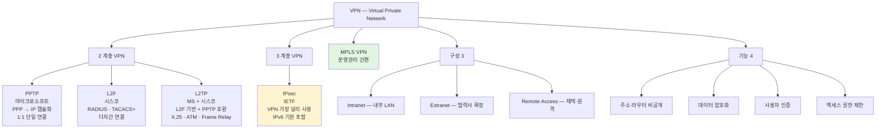
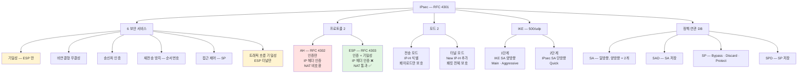
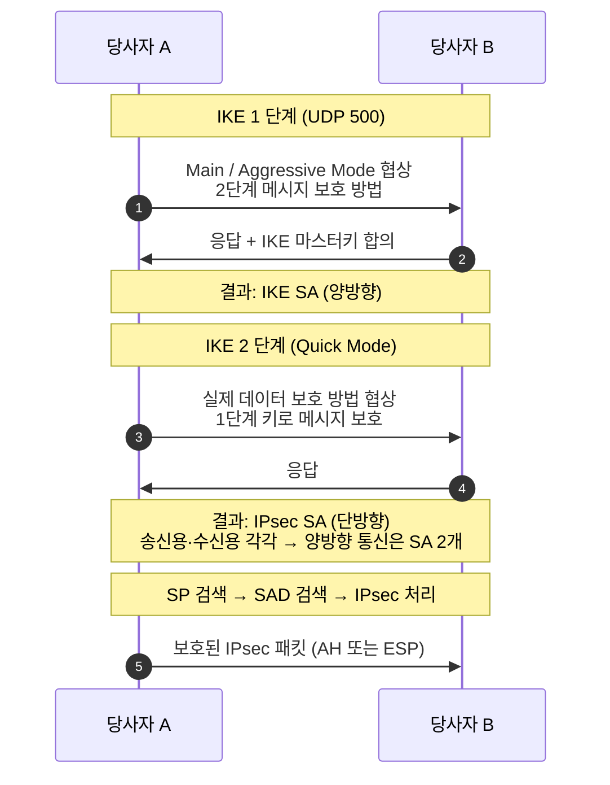
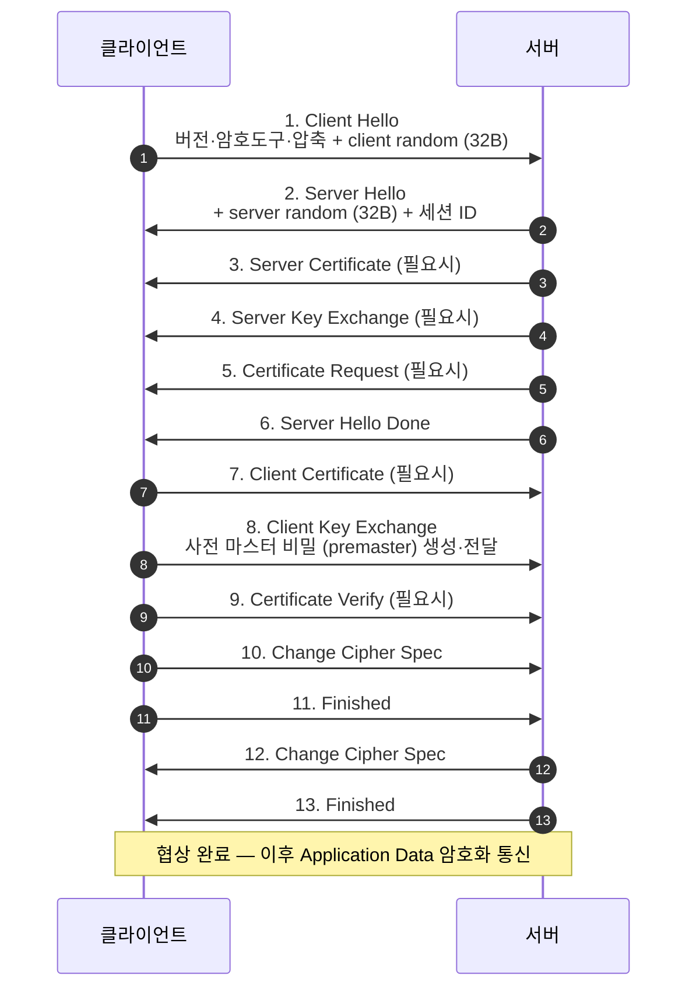
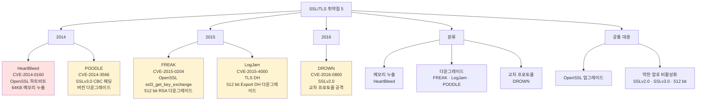

# 07. 보안 프로토콜 — 만화책처럼 읽는 VPN / IPsec / SSL·TLS / SSH

> **이 문서를 읽는 법**: 만화책 한 권을 펼쳤다고 생각하세요. *에피소드*를 따라 *어느 계층에서 보안 → 어떤 헤더·메시지 → 어떤 취약점* 의 흐름으로 외우면 자연스럽게 정착됩니다.
> 정확한 RFC·CVE·시퀀스는 정확본을 참조: [[cs/information-security/02.network-security/07.security-protocols|정확본 07. 보안 프로토콜]]

> **연결 단원**: 본 단원은 [[cs/information-security/02.network-security/02.network-protocols-and-addressing|02 단원 §4 TCP]] 의 *3-way Handshake* 와 [[cs/information-security/02.network-security/01.network-fundamentals|01 단원 §1 OSI]] 의 *계층 구조*가 토대. *2계층 / 3계층 / 전송 계층 보안* 의 위치 차이가 핵심. *MITM 방어* (04 단원) 는 *SSL/TLS 인증서 검증*. **HeartBleed**(*OpenSSL* **Heartbeat** 구현 오류 → 메모리 누출)은 본 단원 **SSL/TLS 취약점**(에피소드 12)의 대표 예이다. **ShellShock**(*GNU Bash* 환경변수 처리 → 원격 명령 실행)은 [[cs/information-security/02.network-security/06.remote-access-and-malware-tools|06 단원]]에서 다루는 **별개 취약점**이다.

---

## 🎯 시작 전에 — 이미 쓰고 있는 보안 프로토콜

| 매일 보는 것 | 사실은 이 단원의 |
|---|---|
| `https://example.com` 주소창 자물쇠 | **TLS 1.2 / 1.3** + 인증서 검증 |
| `ssh user@host -L 8080:localhost:80` | **SSH 로컬 포트 포워딩** |
| 회사 VPN 클라이언트 | **L2TP/IPsec** — **L2TP**(2계층 PPP·프레임 터널) + **IPsec**(3계층 — 인증·기밀성·무결성 등으로 **그 터널·패킷 보호**) |
| `ipsec status` 의 SA 정보 | **Security Association** (양방향 = 2개) |
| TLS Handshake `ClientHello` / `ServerHello` | **TLS 1.2** 교재식 *완전 협상*의 **1·2** (*선택 메시지·**TLS 1.3** 이면 구성이 다름*) |
| `ECDHE-RSA-AES256-GCM-SHA384` cipher suite | **PFS + DHE/ECDHE** |
| HeartBleed·FREAK·POODLE 침해 보고서 | SSL/TLS 취약점 5 종 |
| OpenSSL 의 `s3_clnt.c` 함수 | **FREAK** (CVE-2015-0204) |
| RADIUS·TACACS+ 인증 | **L2F** 의 인증 메커니즘 |

> **이 단원의 본질**: *어느 계층에서 보안을 제공하는가* + *어떤 헤더·메시지를 주고받는가* + *어떤 다운그레이드·메모리·CBC 패딩 약점이 있는가* 의 3 축. **VPN 2계층 (PPTP·L2F·L2TP) ↔ 3계층 (IPsec)** + **L2TP/IPsec = 터널(L2) + 보호(IPsec)** + **AH 인증만 ↔ ESP 인증+기밀성** + **TLS 1.2 핸드셰이크(교재 13·단축은 Hello 2 중심 — 선택 메시지·Random 32바이트·TLS 1.3 별도)** + **5 취약점 다운그레이드 / 메모리 누출 / 패딩 오라클** 이 시험 1순위.

---

## 📖 에피소드 1 — VPN: 4 종 + 기능 4 + 구성 3 + MPLS

### 장면. 공중망 위의 사설 전용선

> **VPN (Virtual Private Network, 가상 사설망)** = 인터넷 같은 *공중망*을 이용해 *사설망 서비스*를 제공하는 망. **공중망 내에서 마치 단일 회사만 사용하는 전용선처럼** 사용.

### VPN 4 종 — 계층별 분류

| 프로토콜 | 풀이 | 계층 | 설계자·특징 |
|---|---|---|---|
| **PPTP** | **P**oint-to-**P**oint **T**unneling **P**rotocol | **2** | 마이크로소프트 설계 / *PPP Packet → IP Packet 캡슐화* / **하나의 터널에 하나의 연결만 (1:1)** |
| **L2F** | **L**ayer **2** **F**orwarding | **2** | 시스코 제안 / *하나의 터널에 여러 연결 (다자간)* / PPP 사용 / 인증 = **RADIUS · TACACS+** / home site 에서 주소 할당 |
| **L2TP** | **L**ayer **2** **T**unneling **P**rotocol | **2** | 마이크로소프트 + 시스코 합작 / L2F 기반 + PPTP 호환 / WAN (X.25·ATM·Frame Relay) / IP·IPX·AppleTalk 지원 |
| **IPsec** | **IP** **Sec**urity | **3** | IETF 제안 / **VPN 구현에 가장 널리 사용** / IP 데이터그램 인증·무결성·기밀성 / **IPv6 에서 기본 포함** |

### 외우는 방법 — 2계층 3 + 3계층 1

> *2계층 = PPTP·L2F·L2TP (3종)* / *3계층 = IPsec (1종, 가장 대표적)*. *PPTP 는 1:1, L2F·L2TP 는 다자간*.

### VPN 기능 4

| 기능 | 의미 |
|---|---|
| **주소·라우터 비공개** | 내부 주소 체계 외부 노출 방지 |
| **데이터 암호화** | 페이로드 보호 |
| **사용자 인증** | RADIUS·TACACS+ 등 |
| **사용자 액세스 권한 제한** | 접근 제어 |

### 핵심 어휘 2

| 용어 | 의미 |
|---|---|
| **터널링** | 송수신자 사이 *외부 침입 차단 파이프* |
| **페이로드** | *터널링되는 데이터* (캡슐화 후 전송) |

### VPN 구성 3 — 사용 환경별

| 형태 | 설명 |
|---|---|
| **Intranet VPN** | 기업 *내부 LAN 연결*. 넓게는 지사까지 |
| **Extranet VPN** | 고객사·협력업체 → *Intranet 확장* |
| **Remote Access VPN** | 재택 근무자 / 원격 접속자 → *ISP 의 NAS 접속* |

### MPLS VPN

> **MPLS (Multi-Protocol Label Switching) VPN** = MPLS 통신 네트워크로 VPN 제공. 다른 VPN 구조 대비 **서비스 도입·운영 관리가 간단·편리**.

### 시험 함정

| 함정 | 정답 |
|---|---|
| VPN 풀이? | **Virtual Private Network** |
| 2계층 VPN 3? | **PPTP / L2F / L2TP** |
| 3계층 VPN? | **IPsec** (가장 대표적) |
| PPTP 의 연결 수? | **1:1 (단일 연결)** |
| L2F · L2TP 인증? | **RADIUS · TACACS+** |
| L2TP 합작? | 마이크로소프트 + 시스코 |
| L2TP 지원 WAN? | X.25 · ATM · Frame Relay |
| VPN 기능 4? | 비공개 / 암호화 / 인증 / 액세스 제한 |
| VPN 구성 3? | **Intranet / Extranet / Remote Access** |
| Remote Access 의 접속점? | *ISP 의 NAS* |
| MPLS VPN 의 강점? | *서비스 도입·운영 관리 간편* |

---

## 📖 에피소드 2 — IPsec: 정의 + 6 보안 서비스

### 장면. 3 계층의 표준 보안

> **IPsec (IP Security)** = IETF 가 *IP 보안* 위한 개방형 구조 표준. **IP 계층 (3계층) 보안** 안정·표준 기초 제공. **IPv6 에 기본 포함**. **RFC 4301**.

### IPsec 6 보안 서비스 — 시험 1순위

| 서비스 | 의미 | 비고 |
|---|---|---|
| **기밀성** (Confidentiality) | 메시지 도청되어도 내용 알 수 없음 | 대칭 암호 / **AH 미지원, ESP 전용** |
| **비연결형 무결성** | 메시지 위·변조 ❌ | MAC, IP 패킷별 |
| **송신처 인증** (Data Origin Authentication) | 메시지가 올바른 송신처로부터 옴 | MAC |
| **재전송 공격 방지** (Protection Against Replays) | IP 패킷별 *순서번호*로 방지 | SA 에서 순서번호 유지·검증 |
| **접근 제어** | 송수신 IP 패킷에 대한 *시스템 접근 제어* | SP — Bypass / Discard / Protect |
| **제한된 트래픽 흐름의 기밀성** | 원본 IP 헤더 암호화로 기밀성 보장 | **ESP 터널 모드만** 제공 |

### 기밀성 = ESP 전용 — 시험 1순위

> **AH 는 기밀성 미제공 / ESP 만 기밀성 제공**. *AH = 인증·무결성만* / *ESP = 인증·무결성·기밀성 다*.

### 외우는 방법 — *기밀·무결·인증·재전송·접근·트래픽 흐름*

> *기밀성 (ESP) → 무결성 → 송신처 인증 → 재전송 방지 → 접근 제어 → 트래픽 흐름 기밀성 (ESP 터널)*. *6 가지 모두 보안의 다른 차원*.

### 시험 함정

| 함정 | 정답 |
|---|---|
| IPsec 표준 RFC? | **RFC 4301** |
| IPsec 동작 계층? | **3 (네트워크)** |
| IPv6 와의 관계? | *기본 포함* |
| 기밀성 제공 프로토콜? | **ESP 만** (AH ❌) |
| 트래픽 흐름 기밀성 모드? | **ESP 터널 모드** |
| 접근 제어 정책? | **SP (Bypass / Discard / Protect)** |
| 재전송 방지 메커니즘? | *IP 패킷별 순서번호* |

---

## 📖 에피소드 3 — IPsec 모드: 전송 vs 터널

### 장면. 페이로드만 vs 패킷 전체

> IPsec 의 *2 모드*는 **보호 범위**가 다르다. *전송 모드*는 *페이로드만*, *터널 모드*는 *IP 패킷 전체*.

### 모드 매트릭스 — 시험 1순위

| 모드 | 보호 범위 | 식별 헤더 | 패킷 구조 |
|---|---|---|---|
| **전송 모드** (Transport) | 종단 노드 구간 — *페이로드만* 보호 | **IP-H** | `[ IP-H ][ IPsec-H ][ IP Payload ][ IPsec-T ]` |
| **터널 모드** (Tunnel) | 게이트웨이 구간 — *IP 패킷 전체* 보호 | **New IP-H** | `[ New IP-H ][ IPsec-H ][ IP-H ][ IP Payload ][ IPsec-T ]` |

### 터널 모드 시나리오 2

| 시나리오 | 환경 |
|---|---|
| **터널·게이트웨이 간 보호** | 본·지점 사이 (다수 사용자 호스트·서버 VPN) |
| **종단노드 ↔ 터널·게이트웨이** | 외부 사용자 호스트 ↔ 본·지점 VPN |

### 전송 ↔ 터널 한 줄 비교

> *전송 = 끝과 끝 (호스트 ↔ 호스트), 페이로드만, IP-H 식별* / *터널 = 게이트웨이 ↔ 게이트웨이, 패킷 전체, New IP-H 추가*.

### 외우는 방법 — *전송 = 페이로드 / 터널 = 새 헤더*

> *전송 모드는 IP-H 그대로* / *터널 모드는 New IP-H 추가하여 원본 IP 헤더까지 감춤*. *터널 = 새 헤더 + 원본 보호*.

### 시험 함정

| 함정 | 정답 |
|---|---|
| 전송 모드 식별 헤더? | **IP-H** |
| 터널 모드 식별 헤더? | **New IP-H** |
| 전송 모드 보호 범위? | *페이로드만* |
| 터널 모드 보호 범위? | *IP 패킷 전체* |
| 본·지점 VPN 모드? | **터널 모드** |
| 외부 호스트 ↔ 본사 VPN 모드? | **터널 모드** |

---

## 📖 에피소드 4 — AH 프로토콜: 인증만 + IP 헤더 인증 + NAT 비호환

### 장면. 인증 전담 헤더

> **AH (Authentication Header)** = MAC 으로 *인증·송신처 인증* 제공. **기밀성 미제공**. **RFC 4302**.

### AH 모드별 패킷 구조

| 모드 | 패킷 구조 | 인증 범위 |
|---|---|---|
| **AH 전송** | `[ IP-H ][ AH-H ][ IP Payload ]` | IP 헤더의 *변경 가능 필드 제외* + IP 패킷 전체 |
| **AH 터널** | `[ New IP-H ][ AH-H ][ IP-H ][ IP Payload ]` | New IP 헤더의 *변경 가능 필드 제외* + New IP 패킷 전체 |

### AH 주요 헤더 필드 3

| 필드 | 의미 |
|---|---|
| **SPI** (Security Parameter Index) | 현재 연결의 *보안연관 식별자* |
| **순서번호** | *재전송 공격 방지* — 일련번호 1씩 증가 |
| **인증 데이터 (ICV, Integrity Check Value)** | IP 헤더 변경 가능 필드 제외 + IP 패킷 전체 MAC |

### AH 의 약점 — NAT 비호환

> **AH 는 IP 헤더 자체를 인증** → *NAT 환경에서 source IP 변경* → *인증 데이터 검증 실패* → 장애. **ESP 는 IP 헤더 인증 X → NAT 통과 가능**.

### 변경 가능한 IP 헤더 필드

| 필드 | 변경 이유 |
|---|---|
| **TTL** | 라우터 통과마다 1 감소 |
| **Header Checksum** | TTL 변경에 따라 재계산 |
| **Source IP** (NAT 환경) | NAT 가 변경 |

### 외우는 방법 — *Authentication Header = 인증 전용*

> *AH = 인증·무결성만, 기밀성 X*. *NAT 환경에서 source IP 변경으로 검증 실패*. *NAT 호환은 ESP*.

### 시험 함정

| 함정 | 정답 |
|---|---|
| AH 풀이? | **Authentication Header** |
| AH 표준 RFC? | **RFC 4302** |
| AH 가 제공 ❌? | **기밀성** |
| AH 인증 범위? | IP 헤더 *변경 가능 필드 제외* + IP 패킷 전체 |
| AH 의 NAT 환경 약점? | source IP 변경으로 *인증 실패* |
| ICV 풀이? | **Integrity Check Value** |
| AH 변경 가능 필드 3? | TTL · Header Checksum · Source IP |

---

## 📖 에피소드 5 — ESP 프로토콜: 인증 + 기밀성 + NAT 통과

### 장면. 암호화까지 다

> **ESP (Encapsulating Security Payload)** = MAC + 암호화로 *인증·송신처 인증·기밀성* 제공. *인증·암호화 선택 적용 가능*. **IP 헤더 인증 ❌** → NAT 통과. **RFC 4303**.

### ESP 모드별 패킷 구조

| 모드 | 패킷 구조 | 동작 |
|---|---|---|
| **ESP 전송** | `[ IP-H ][ ESP-H ][ IP Payload ][ ESP-T ][ ESP Auth ]` | IP 페이로드 + ESP 트레일러 *암호화* / 암호화된 데이터 + ESP 헤더 *인증* |
| **ESP 터널** | `[ New IP-H ][ ESP-H ][ IP-H ][ IP Payload ][ ESP-T ][ ESP Auth ]` | 원본 IP 패킷 전체 + ESP 트레일러 *암호화* / 암호화된 데이터 + ESP 헤더 *인증* |

### ESP 주요 헤더 필드 4

| 필드 | 의미 |
|---|---|
| **SPI** | 보안연관 식별자 |
| **일련번호** | 재전송 방지 |
| **ESP 트레일러** | 블록 암호 *패딩 정보* + *페이로드 프로토콜 타입* |
| **ESP Auth** | *인증 데이터* |

### AH ↔ ESP — 시험 1순위 매트릭스

| | AH | ESP |
|---|---|---|
| **인증** | ✅ | ✅ |
| **무결성** | ✅ | ✅ |
| **송신처 인증** | ✅ | ✅ |
| **기밀성** | **❌** | **✅** |
| **IP 헤더 인증** | **✅** | **❌** |
| **NAT 통과** | **❌** | **✅** |
| 표준 RFC | RFC 4302 | RFC 4303 |

### 외우는 방법 — *Encapsulating = 감싸서 암호화*

> *ESP = E**ncapsulating** S**ecurity** P**ayload* = *페이로드를 캡슐화하여 암호화*. *기밀성·NAT 통과 모두 ESP*.

### 시험 함정

| 함정 | 정답 |
|---|---|
| ESP 풀이? | **Encapsulating Security Payload** |
| ESP 표준 RFC? | **RFC 4303** |
| ESP 가 인증 ❌? | **IP 헤더** |
| ESP 가 NAT 통과 가능? | ✅ (IP 헤더 인증 안 하므로) |
| ESP 트레일러 의 정보? | 패딩 + 프로토콜 타입 |
| ESP Auth? | 인증 데이터 |
| AH ↔ ESP 핵심 차이? | *기밀성* + *NAT 통과* |

---

## 📖 에피소드 6 — IKE: 500/udp + 1·2단계 + Main/Aggressive/Quick

### 장면. 키를 어떻게 협상할 것인가

> **IKE (Internet Key Exchange)** = 보안 관련 설정 *생성·협상·관리* 프로토콜. **500/udp 포트** 사용. **RFC 7296** (IKEv2). **IPsec 의 양 당사자 간 논리적 연결정보·보안 설정**을 **SA (Security Association, 보안연관)** 라 함.

### IKE 1·2 단계 — 시험 1순위

| 단계 | 협상 내용 | 결과 SA | 모드 |
|---|---|---|---|
| **1단계** | *2단계 메시지 보호 방법* 협상. **IKE 용 마스터키 생성** | **IKE SA** (**양방향**) | **Main Mode** (세션 ID 암호화 — 보안 ↑) / **Aggressive Mode** (세션 ID 비암호화 — 보안 ↓) |
| **2단계** | *실질적 데이터 보호 방법* 협상. *1단계 키로 메시지 보호* | **IPsec SA** (**단방향**, 송신용·수신용 각각) | **Quick Mode** |

### Main ↔ Aggressive — 보안성 차이

| 모드 | 세션 ID | 보안 | 속도 |
|---|---|---|---|
| **Main** | *암호화* | **높음** | 느림 |
| **Aggressive** | *비암호화* | 낮음 | 빠름 |

### IKE 1단계 SA ↔ 2단계 SA

| | IKE SA (1단계) | IPsec SA (2단계) |
|---|---|---|
| 방향 | **양방향** | **단방향 (송신·수신 각각)** |
| 모드 | Main / Aggressive | Quick |
| 용도 | 2단계 메시지 보호 | *실제 데이터 보호* |

### IKE 의 NAT-T (NAT Traversal)

> RFC 7296 의 IKEv2 는 *NAT-T 시 UDP 4500 포트* 사용. *500/udp* 와 *4500/udp* 의 두 포트.

### 외우는 방법 — *Main = 보안 / Aggressive = 속도 / Quick = 빠른 데이터 협상*

> *Main = 본격 협상 (느림·암호화)* / *Aggressive = 공격적 (빠름·비암호화)* / *Quick = 빠른 (2단계 데이터 협상)*. *영문 어원이 곧 동작*.

### 시험 함정

| 함정 | 정답 |
|---|---|
| IKE 풀이? | **Internet Key Exchange** |
| IKE 포트? | **500/udp** (NAT-T 시 4500/udp) |
| IKEv2 RFC? | **RFC 7296** |
| 1단계 결과 SA? | **IKE SA (양방향)** |
| 1단계 모드 2? | **Main / Aggressive** |
| Main ↔ Aggressive 보안? | 암호화 ↔ 비암호화 |
| 2단계 결과 SA? | **IPsec SA (단방향)** |
| 2단계 모드? | **Quick Mode** |
| 양방향 통신 SA 개수? | **2개** (송신용·수신용) |

---

## 📖 에피소드 7 — SA · SAD · SP · SPD + 송수신 절차

### 장면. 보안연관과 보안정책의 데이터베이스

> IPsec 의 *상태 관리*는 **SA + SAD** (보안연관·DB) + **SP + SPD** (보안정책·DB) 의 4 어휘.

### 4 어휘 매트릭스

| 용어 | 풀이 | 정의 | 핵심 |
|---|---|---|---|
| **SA** | **S**ecurity **A**ssociation | 둘 사이 *논리적 연결 상태*의 보안 설정 정보 | **일방향성** — A→B / B→A 각각 SA 필요 → **2개** |
| **SAD** | **SA D**atabase | 여러 SA 저장 DB | 필드: SPI · Sequence Number Counter · Anti-Replay Window · AH/ESP · Lifetime · Mode · Path MTU |
| **SP** | **S**ecurity **P**olicy | 송수신 시 *적용할 보안의 종류* | 정책 3: **Bypass / Discard / Protect** |
| **SPD** | **SP D**atabase | 보안 정책 저장 DB | — |

### SP 정책 3 — 시험 1순위

| 정책 | 의미 |
|---|---|
| **Bypass** | IP 패킷 *허용* (보안 처리 없이 통과) |
| **Discard** | IP 패킷 *거부* (폐기) |
| **Protect** | IP 패킷 *보호* — **SAD 검색**하여 IPsec 적용 |

### IPsec 송신 절차 4 단계

```
1. 전송할 패킷에 대해 SPD 검색
2. 일치 엔트리 ❌ → 패킷 삭제
3. 일치 엔트리 ✅ → 첫 엔트리 정책 적용
   - Discard → 폐기
   - Bypass  → 송신
   - Protect → SAD 검색
4. Protect 인 경우 SAD 검색
   - 일치 → IPsec 처리 후 전송
   - 불일치 → IKE 수행하여 SA 생성
```

### IPsec 수신 절차 3 단계

```
1. IP 프로토콜 protocol 필드 조사 → 보호 안 된 IP 패킷인지 IPsec 패킷인지 판별
2. 보호 안 된 IP 패킷 → SPD 검색
   - 첫 일치 엔트리가 허용 → 상위 계층 전달
   - 폐기·보호 → 삭제
3. IPsec 패킷 → SAD 검색
   - 불일치 → 삭제
   - 일치 → IPsec 처리 후 상위 계층 전달
```

### 외우는 방법 — *SP/SPD = 정책 / SA/SAD = 연관*

> *SP/SPD = 정책 (Bypass·Discard·Protect)* / *SA/SAD = 연관 (양 당사자 보안 설정)*. *송신은 SPD → SAD 순*, *수신은 protocol 판별 → SPD 또는 SAD*.

### 시험 함정

| 함정 | 정답 |
|---|---|
| SA 의 방향성? | **일방향** (양방향 통신은 2개 SA) |
| SP 정책 3? | **Bypass / Discard / Protect** |
| Protect 정책의 동작? | **SAD 검색** |
| SAD 필드? | SPI · Sequence Number Counter · Anti-Replay Window 등 |
| 송신 절차 — SAD 불일치? | **IKE 수행하여 SA 생성** |
| 수신 절차 — IPsec 패킷? | **SAD 검색** |

---

## 📖 에피소드 8 — SSL/TLS: 7 버전 + 5 세부 프로토콜 + Record

### 장면. TCP 위·응용 아래의 4.5 계층

> **SSL/TLS (Secure Sockets Layer / Transport Layer Security)** = 클라이언트·서버 환경에서 *TCP 기반 어플리케이션*에 대한 **종단 간 보안 서비스** 제공. *전송 계층 보안 프로토콜*. 애플리케이션 프로토콜이 SSL 사용 시 *고유 well-known 포트* 할당 (**HTTPS=443·IMAPS=993·POP3S=995**).

### SSL/TLS 보안 서비스 3

| 서비스 | 메커니즘 |
|---|---|
| **기밀성** | 송수신 메시지 *암호화* (대칭키) |
| **무결성** | 위·변조 확인 (MAC) |
| **인증** | 서버·클라이언트 상호 인증 (**공개키 인증서**) |

### SSL/TLS 7 버전 — 시험 1순위

| 버전 | 발표 | 특징·취약점 |
|---|---|---|
| **SSL 1.0** | — | 첫 버전 (다양 취약점, **공개되지 않음**) |
| **SSL 2.0** | **1995** | 여전히 많은 취약점 |
| **SSL 3.0** | **1996** | **POODLE·DROWN** 알려짐 |
| **TLS 1.0** | **1999** | **BEAST·CRIME** 알려짐 |
| **TLS 1.1** | **2006** | 일부 취약점 |
| **TLS 1.2** | **2008** | *효율적 Handshake* — **RFC 5246** |
| **TLS 1.3** | **2018** | 트래픽 정보 기밀성 — **PFS** 제공 — **RFC 8446** |

### SSL/TLS 세부 프로토콜 5 — 시험 1순위

> SSL/TLS = **상위 4 + 하위 1** = 2 계층 구조.

| 계층 | 프로토콜 | 기능 |
|---|---|---|
| **상위** | **Handshake** | 종단 간 *보안 파라미터 협상* |
| | **Change Cipher Spec** | 협상 파라미터 *적용·변경 알림* |
| | **Alert** | *오류 통보* |
| | **Application Data** | *어플리케이션 데이터 전달* |
| **하위** | **Record** | *실제 암호화·무결성·압축* |

### Record 프로토콜 동작 5 단계 — 시험 1순위

| 방향 | 단계 |
|---|---|
| **송신** | 단편화 → 압축 → MAC 추가 → 암호화 → Record 헤더 추가 |
| **수신** | Record 헤더 제거 → 복호화 → MAC 확인 → 압축 해제 → 재조합 |

### 외우는 방법 — *송신 5: 단·압·M·암·헤*

> *단편화 → 압축 → MAC → 암호화 → 헤더*. *수신은 역순*. *MAC 추가 후 암호화* (**MAC-then-Encrypt**) 가 SSL/TLS 의 표준.

### 시험 함정

| 함정 | 정답 |
|---|---|
| SSL/TLS 동작 계층? | *전송 계층 보안* (TCP 위·응용 아래) |
| HTTPS 포트? | **443** |
| TLS 1.2 RFC? | **RFC 5246** |
| TLS 1.3 RFC? | **RFC 8446** |
| TLS 1.3 핵심 기능? | **PFS 필수** |
| 상위 프로토콜 4? | Handshake / Change Cipher Spec / Alert / **Application Data** |
| 하위 프로토콜? | **Record** |
| Record 송신 5 단계? | 단편화 → 압축 → MAC → 암호화 → 헤더 |
| SSL 3.0 취약점? | **POODLE · DROWN** |
| TLS 1.0 취약점? | BEAST · CRIME |

---

## 📖 에피소드 9 — TLS 1.2 완전 협상(교재 13) + 세션 재사용(교재 Hello 2)

### 장면. 완전 vs 단축

> SSL/TLS 는 **상태 유지 프로토콜**. *완전 협상*으로 *세션* 생성 + 세션 정보 공유하는 다수의 *연결*을 *단축 협상*으로 생성.

> **정확한 이해 (시험 + RFC)**
>
> - **TLS 1.2**: *CertificateRequest·클라 인증서·CertificateVerify* 등은 **상황에 따라 생략**될 수 있다 (RFC 5246 의 **선택** 메시지). 아래 **13** 은 교재·시험에서 흔히 세는 **전형적 전체 패턴**이지 “항상 고정”이 아니다.
> - **TLS 1.3**: 메시지 구성이 **1.2와 다름** — 같은 숫자로 섞어 외우면 위험하다.
> - **세션 재사용(단축)**: 본질은 *기존 세션 상태*로 핸드셰이크를 줄이는 것. 교재는 **ClientHello·ServerHello** 만 단계로 세는 경우가 많지만, 실제 1.2 에서는 **ChangeCipherSpec·Finished** 등이 **이어서** 오간다.
> - **Random**: `ClientHello` / `ServerHello` 의 random 필드는 **32바이트**(256비트 규모) — **32비트가 아니다**.

### 상태 정보 5 — 시험 1순위

| 정보 | 설명 |
|---|---|
| **세션 상태 정보** | *완전 협상*으로 생성 — 다수 연결이 사용 (대칭 암호 알고리즘·HMAC 해시) |
| **연결 상태 정보** | *단축 협상*으로 생성 — 실제 통신 단위 (암호키·인증키) |
| **사전 마스터 비밀** (premaster secret) | *완전 협상* 결과 |
| **마스터 비밀** | 사전 마스터 비밀 + 클라이언트·서버 난수 *해시화* |
| **키 블럭** | 단축 협상 시 클라이언트·서버 난수 + 마스터 비밀 *해시화* |

### 키 파생 흐름

```
사전 마스터 비밀 (완전 협상)
    ↓ + client·server random 해시
마스터 비밀
    ↓ + client·server random 해시
키 블럭 (암호키·인증키)
```

### 완전 협상 13 메시지 — 시험·교재 통설 (TLS 1.2 전형)

| # | 메시지 | 설명 |
|---|---|---|
| 1 | **Client Hello** | 지원 SSL/TLS 버전·암호도구·압축 + **client random (32바이트)** + 세션 ID (완전협상 = 빈 값) |
| 2 | **Server Hello** | 사용 버전·도구·압축 + **server random (32바이트)** + 세션 ID |
| 3 | **Server Certificate** | (필요시) *서버 인증서* 전달 |
| 4 | **Server Key Exchange** | (필요시) *키 교환 정보* 전달 |
| 5 | **Certificate Request** | (필요시) *클라이언트 인증서 요청* |
| 6 | **Server Hello Done** | Server Hello *종료 알림* |
| 7 | **Client Certificate** | (필요시) *클라이언트 인증서* 전달 |
| 8 | **Client Key Exchange** | **사전 마스터 비밀 생성·서버 전달** (RSA: 서버 공개키로 암호화 / DH: DH 공개키로 공통 premaster) |
| 9 | **Certificate Verify** | (필요시) 보낸 인증서 *개인키 보유 증명* |
| 10 | **Change Cipher Spec** | 클라이언트 → 서버. 협상 암호 명세 *적용 알림* |
| 11 | **Finished** | 클라이언트 → 서버. *협상 완료 알림* |
| 12 | **Change Cipher Spec** | 서버 → 클라이언트 |
| 13 | **Finished** | 서버 → 클라이언트. *협상 완료 알림* |

### 단축 협상 — 세션 재사용 (교재: Hello 2 + 실무: CCS·Finished)

> *이전 완전 협상 거친 세션* 다시 사용 시.

| # | 메시지 | 설명 |
|---|---|---|
| 1 | **Client Hello** | 사용할 *session id* + *client random* 서버에 전달 |
| 2 | **Server Hello** | *server random* 클라이언트에 전달 |
| (이후) | **ChangeCipherSpec** · **Finished** 등 | 프로토콜상 **계속** 오감 (교재는 위 **Hello 2** 만 단계로 세기도 함) |

### 외우는 방법 — *Hello → Cert → Key → Done → Cert → Key → Verify → Spec → Finished × 2*

> *완전 협상*은 *6 (서버 측) + 6 (클라이언트 측) + 1 (초기)* 의 *13* **(TLS 1.2 교재·시험 통설, 선택 메시지로 실제는 짧아질 수 있음)**. *단축*은 **Hello 2** 를 중심으로 외우되 **CCS·Finished** 까지가 한 세트라는 점을 잊지 않는다. **TLS 1.3** 은 따로 잡는다.

### 시험 함정

| 함정 | 정답 |
|---|---|
| 완전 협상 단계 수? | **13** (TLS **1.2** 교재·시험 통설; *선택 메시지* 로 줄어듦 / **1.3** 은 다름) |
| 단축 협상? | *세션 재사용* — 교재 **Hello 2** + 실제 **ChangeCipherSpec·Finished** |
| Client/Server Hello 의 random 길이? | **32바이트** (32비트 ❌) |
| 8 단계의 본질? | **사전 마스터 비밀 (premaster secret) 생성** |
| RSA 키 교환의 8 단계? | *서버 공개키로 premaster 암호화* |
| DH 키 교환의 8 단계? | *DH 공개키로 공통 premaster 생성* |
| 키 파생 순서? | premaster → 마스터 비밀 → 키 블럭 |
| 단축 협상의 본질? | *세션 재사용* + *연결 새로 생성* |

---

## 📖 에피소드 10 — PFS: DHE / ECDHE 임시 키 교환

### 장면. 서버 개인키가 새도 통신 내용은 안전하게

> **PFS (Perfect Forward Secrecy, 순방향 비밀성)** = 키 교환에 사용되는 *서버 개인키 노출되어도 이전 트래픽의 세션키·비밀키 기밀성 유지*되어 통신 내용을 알 수 없는 암호학적 성질.

### 서버 개인키 노출 시 문제 (PFS 없을 때)

```
1. 서버 공개키·개인키로 키 교환 수행
2. 공격자: MITM 으로 트래픽 가로챔
3. 서버 개인키로 세션키·비밀키·송수신 데이터 모두 복호화
   → 이전 통신 내용 노출
```

### PFS 구현 — 임시 디피-헬만 키 교환

> *키 교환 시마다 클라이언트·서버가 새로운 Diffie-Hellman 개인키 생성* → **임시 디피-헬만 키 교환** → 클라이언트·서버 *공통 비밀값* 생성. *서버 개인키*는 **DH 파라미터 인증 목적만**.

### 핵심 cipher suite 2 — 시험 1순위

| Cipher Suite | 풀이 | 의미 |
|---|---|---|
| **DHE** | **D**iffie-**H**ellman **E**phemeral | *임시* DH 키 교환 |
| **ECDHE** | **E**lliptic **C**urve **D**HE | *타원 곡선* 임시 DH 키 교환 (성능 ↑) |

### PFS 의 트레이드오프

> *RSA 대비 처리 속도 느림* → 일부 환경에서 DHE/ECDHE *비활성화*하거나 *RSA 와 함께 사용* (브라우저 호환성).

### TLS 1.3 = PFS 필수

> **TLS 1.3 (RFC 8446)** 부터는 *정적 RSA 키 교환 제거* + **PFS 필수** + AEAD 만 허용.

### 외우는 방법 — *Ephemeral = 임시*

> *DHE = Ephemeral = 매번 새로운 키* / *서버 개인키는 DH 파라미터 인증만*. *DH 공통 비밀은 별도 생성*.

### 시험 함정

| 함정 | 정답 |
|---|---|
| PFS 풀이? | **Perfect Forward Secrecy** |
| PFS 정의? | *서버 개인키 노출 시에도 이전 트래픽 기밀성 유지* |
| 핵심 cipher suite 2? | **DHE · ECDHE** |
| Ephemeral 의 의미? | *임시* (매번 새로운 키) |
| TLS 1.3 의 PFS? | **필수** |
| TLS 1.3 정적 RSA 키 교환? | **제거** |
| TLS 1.3 가 허용하는 암호? | **AEAD 만** |

---

## 📖 에피소드 11 — SSH 포트 포워딩: 로컬 vs 리모트

### 장면. SSH 연결을 다른 어플리케이션에 빌려준다

> **SSH 포트 포워딩** = SSH 클라이언트가 SSH 서버에 접속해 만든 연결을 *다른 어플리케이션이 이용해 통신*하는 기술. **RFC 4254**.

### 로컬 vs 리모트 — 시험 1순위

| 방식 | 리스닝 포트 위치 | 동작 |
|---|---|---|
| **로컬 포트 포워딩** (Local) | **SSH 클라이언트 호스트** | 1) SSH 연결 생성 → 2) 웹 브라우저가 *클라이언트 호스트* 리스닝 포트에 접속 → 3) SSH 연결로 어플리케이션 서버 통신 |
| **리모트 포트 포워딩** (Remote) | **SSH 서버 호스트** | 1) SSH 연결 생성 → 2) 웹 브라우저가 *서버 호스트* 리스닝 포트에 접속 → 3) SSH 연결로 어플리케이션 서버 통신 |

### 핵심 차이 한 줄

> **로컬 = 클라이언트 측 리스너** / **리모트 = 서버 측 리스너**. *어디에 리스닝 포트가 생기느냐*가 분류.

### 외우는 방법 — *Local = 클라이언트 측 / Remote = 서버 측*

> *로컬 (Local)* 의 어원은 *내 (클라이언트) 쪽*. *리모트 (Remote)* 의 어원은 *원격 (서버) 쪽*. *영문 어원이 곧 위치*.

### 시험 함정

| 함정 | 정답 |
|---|---|
| SSH 표준 RFC? | **RFC 4254** |
| 로컬 포트 포워딩의 리스너? | **SSH 클라이언트 호스트** |
| 리모트 포트 포워딩의 리스너? | **SSH 서버 호스트** |
| 두 방식의 공통점? | *SSH 연결로 최종 어플리케이션 서버와 통신* |

---

## 📖 에피소드 12 — SSL/TLS 취약점 1: HeartBleed + FREAK + LogJam

### 장면. 메모리 누출과 다운그레이드

> *2014~2015 의 OpenSSL 취약점 3 종*. **HeartBleed** = 메모리 누출 / **FREAK·LogJam** = 다운그레이드.

### HeartBleed — CVE-2014-0160 (메모리 64KB 누출)

> *OpenSSL 라이브러리의 **하트비트 확장 모듈*** 버그. *클라이언트 하트비트 요청 메시지 처리 시 데이터 검증 ❌* → **시스템 메모리에 저장된 64KB 크기의 데이터** 외부 탈취 가능.

### HeartBleed 대응

| 대응 | 내용 |
|---|---|
| 버전관리 | 취약점 없는 OpenSSL 업데이트 |
| 보안장비 | 공격 탐지·차단 룰 적용 |
| 서비스 관리 | **인증서 재발급** + *비밀번호 재설정* |

### FREAK — CVE-2015-0204 (RSA 다운그레이드)

> SSL 을 통해 *강제로 취약한 RSA 로 다운그레이드*시키는 취약점. *OpenSSL `s3_clnt.c` 의 **`ssl3_get_key_exchange`** 함수에서 발생*. **MITM 공격으로 512 비트 RSA 다운그레이드** 후 정보 유출.

### FREAK 대응

| 대응 | 내용 |
|---|---|
| 버전관리 | OpenSSL 업데이트 |
| 사용자 관리 | OS·브라우저 업그레이드 |

### LogJam — CVE-2015-4000 (DH 다운그레이드)

> 중간자 공격으로 *사용자와 웹·이메일 서버 간 TLS 통신을 다운그레이드*. *TLS 프로토콜 취약점* + 공격자가 *임시 디피-헬만 키 교환 사용* → **TLS 연결을 512 비트 수출 버전 암호화로 다운그레이드**.

### LogJam 대응

| 대응 | 내용 |
|---|---|
| 사용자 관리 | 최신 브라우저 사용 |
| Export 키 제한 | *Export 용 cipher suite 사용 ❌* |
| 안전한 cipher suite | **2048 bit DH 그룹** 또는 **타원 곡선 디피-헬만 (ECDHE)** |

### FREAK ↔ LogJam — 시험 1순위 비교

| | FREAK | LogJam |
|---|---|---|
| 표적 | **RSA** | **DH** |
| 다운그레이드 | 512 bit RSA | 512 bit Export DH |
| 위치 | OpenSSL `ssl3_get_key_exchange` | TLS 프로토콜 자체 |
| CVE | **CVE-2015-0204** | **CVE-2015-4000** |
| 대응 | OpenSSL·OS·브라우저 업데이트 | ECDHE 사용 |

### 외우는 방법 — *FREAK = RSA / LogJam = DH*

> *FREAK 은 RSA 다운그레이드, LogJam 은 DH 다운그레이드*. *FREAK 의 F = Factoring (RSA 토대) / LogJam 의 Log = 이산로그 (DH 토대)*.

### 시험 함정

| 함정 | 정답 |
|---|---|
| HeartBleed CVE? | **CVE-2014-0160** |
| HeartBleed 표적? | **OpenSSL 하트비트 확장** |
| HeartBleed 누출 크기? | **64KB** |
| HeartBleed 대응 핵심? | OpenSSL 업데이트 + **인증서 재발급** |
| FREAK CVE? | **CVE-2015-0204** |
| FREAK 함수? | **`ssl3_get_key_exchange`** |
| FREAK 다운그레이드? | **512 bit RSA** |
| LogJam CVE? | **CVE-2015-4000** |
| LogJam 다운그레이드? | **512 bit Export DH** |
| LogJam 대응 cipher? | **2048 bit DH 또는 ECDHE** |

---

## 📖 에피소드 13 — SSL/TLS 취약점 2: POODLE + DROWN

### 장면. 옛 SSL 버전을 강제로

> *2014·2016 의 SSL 옛 버전 취약점*. **POODLE** = SSLv3.0 CBC 패딩 / **DROWN** = SSLv2.0 교차 프로토콜.

### POODLE — CVE-2014-3566 (SSLv3.0 CBC 패딩)

> SSL/TLS 협상 시 **버전 다운그레이드 공격** → **SSLv3.0** 강제 → *MITM 으로 암호화된 쿠키·데이터 추출*.
> *SSLv3.0 의 **CBC 모드** 사용 시 **패딩된 암호 블록이 MAC 에 의해 보호되지 않는 취약점*** (= 패딩 오라클).

### POODLE 다운그레이드 시나리오 4 단계

```
1. 클라이언트 → TLS 1.2 연결 요청 → 공격자가 거부
2. 클라이언트 → TLS 1.1 연결 요청 → 공격자가 거부
3. 클라이언트 → TLS 1.0 연결 요청 → 공격자가 거부
4. 클라이언트 → SSL 3.0 연결 요청 → 공격자 허용 + 스니핑
```

### POODLE 대응

| 대응 | 내용 |
|---|---|
| SSL 설정 | **SSLv3.0 사용 ❌** (웹서버 SSL 설정) |
| 버전 관리 | OpenSSL 업그레이드 |

### DROWN — CVE-2016-0800 (SSLv2.0 교차 프로토콜)

> **SSLv2.0** 사용 서버에 *악성 패킷 전송* → *인증서 키값 알아냄* → 키값으로 *암호화된 통신 내용 복호화* → 주요 정보 탈취. **SSLv2.0 취약점을 악용한 *교차 프로토콜 공격* (Cross-protocol attack)**.

### DROWN 대응

| 대응 | 내용 |
|---|---|
| SSL 설정 | **SSLv2.0 사용 ❌** |
| 버전 관리 | OpenSSL 업그레이드 |

### POODLE ↔ DROWN — 시험 1순위 비교

| | POODLE | DROWN |
|---|---|---|
| 표적 SSL 버전 | **SSLv3.0** | **SSLv2.0** |
| 핵심 취약점 | **CBC 패딩 오라클** | **교차 프로토콜 공격** |
| CVE | **CVE-2014-3566** | **CVE-2016-0800** |
| 대응 | SSLv3.0 비활성화 | SSLv2.0 비활성화 |

### 외우는 방법 — *POODLE = 3.0 / DROWN = 2.0*

> *POODLE = SSLv3.0 다운그레이드 + CBC 패딩* / *DROWN = SSLv2.0 교차 프로토콜*. *낮은 버전일수록 더 위험*.

### 5 취약점 종합 정리표 — 시험 1순위

| 취약점 | CVE | 표적 | 핵심 동작 |
|---|---|---|---|
| **HeartBleed** | **CVE-2014-0160** | OpenSSL 하트비트 확장 | *64KB 메모리 무제한 탈취* |
| **FREAK** | **CVE-2015-0204** | OpenSSL `ssl3_get_key_exchange` | **512 bit RSA 다운그레이드** (MITM) |
| **LogJam** | **CVE-2015-4000** | TLS DH 키 교환 | **512 bit Export DH 다운그레이드** |
| **POODLE** | **CVE-2014-3566** | **SSLv3.0** CBC 패딩 | 버전 다운그레이드 → SSLv3.0 강제 → 패딩 오라클 |
| **DROWN** | **CVE-2016-0800** | **SSLv2.0** | 교차 프로토콜 공격으로 TLS 통신 복호화 |

### 공통 대응

> *OpenSSL 버전 업그레이드* + *약한 암호·구버전 비활성화*. **DHE/ECDHE cipher suite + 2048 bit 이상 키 + AEAD** 가 현대 표준.

### 시험 함정

| 함정 | 정답 |
|---|---|
| POODLE CVE? | **CVE-2014-3566** |
| POODLE 표적? | **SSLv3.0 CBC 모드** |
| POODLE 본질? | *버전 다운그레이드 + 패딩 오라클* |
| DROWN CVE? | **CVE-2016-0800** |
| DROWN 표적? | **SSLv2.0** |
| DROWN 공격명? | **교차 프로토콜 공격** |
| 5 취약점 공통 대응? | **OpenSSL 업그레이드 + 약한 암호 비활성화** |

---

## 📑 종합 비교 (에피소드 1~13 정리)

시험 직전 *한눈에* 보는 view.

| 영역 | 핵심 |
|---|---|
| **VPN 풀이** | Virtual Private Network |
| **2계층 VPN 3** | PPTP (1:1, MS) / L2F (다자간, 시스코, RADIUS·TACACS+) / L2TP (MS+시스코) |
| **3계층 VPN** | **IPsec** — IPv6 기본 포함 |
| **VPN 기능 4** | 비공개 / 암호화 / 인증 / 액세스 제한 |
| **VPN 구성 3** | **Intranet / Extranet / Remote Access** |
| **MPLS VPN** | 운영관리 *간편* |
| **IPsec 표준** | **RFC 4301** |
| **IPsec 6 서비스** | 기밀성 (ESP만) / 무결성 / 송신처 인증 / 재전송 방지 / 접근 제어 / 트래픽 흐름 기밀성 (ESP 터널) |
| **IPsec 모드** | 전송 (IP-H 식별·페이로드만) / 터널 (New IP-H·패킷 전체) |
| **AH** | RFC 4302 — 인증만 / IP 헤더 인증 / NAT ❌ |
| **ESP** | RFC 4303 — 인증 + 기밀성 / IP 헤더 인증 ❌ / **NAT 통과 ✅** |
| **AH 변경 가능 필드** | TTL · Header Checksum · Source IP (NAT) |
| **IKE** | **500/udp** (NAT-T 시 4500/udp) — RFC 7296 |
| **IKE 1단계** | IKE SA *양방향* / Main (보안↑) · Aggressive (속도↑) |
| **IKE 2단계** | IPsec SA *단방향* (양방향 = 2개) / Quick |
| **SA / SP** | SA = 일방향성 / SP 정책 3 = **Bypass · Discard · Protect** |
| **송신 절차** | SPD → SAD → IPsec 처리 / 불일치 시 IKE |
| **SSL/TLS 동작 계층** | *전송 계층 보안* (TCP 위·응용 아래) |
| **HTTPS 포트** | **443** |
| **TLS 1.2** | RFC 5246 |
| **TLS 1.3** | RFC 8446 — **PFS 필수 + AEAD** |
| **상위 4** | Handshake / Change Cipher Spec / Alert / Application Data |
| **하위 1** | **Record** |
| **Record 송신 5** | **단편화 → 압축 → MAC → 암호화 → 헤더** |
| **완전 협상** | **13** 메시지 (TLS **1.2** 교재·시험 통설; 선택 생략 가능) |
| **단축 협상** | *세션 재사용* — 교재 **Hello 2** + **CCS·Finished** (실제 왕복) |
| **키 파생** | premaster → 마스터 비밀 → 키 블럭 |
| **client/server random** | **각 32바이트** (32비트 아님) |
| **PFS** | **DHE / ECDHE** 임시 키 교환 |
| **Ephemeral** | *임시* (매번 새로운 키) |
| **TLS 1.3 PFS** | *필수* |
| **SSH 표준** | RFC 4254 |
| **SSH 로컬** | 리스너 = **클라이언트 호스트** |
| **SSH 리모트** | 리스너 = **서버 호스트** |
| **HeartBleed** | CVE-2014-0160 / OpenSSL 하트비트 / **64KB 메모리** |
| **FREAK** | CVE-2015-0204 / `ssl3_get_key_exchange` / **512 bit RSA** |
| **LogJam** | CVE-2015-4000 / TLS DH / **512 bit Export DH** |
| **POODLE** | CVE-2014-3566 / **SSLv3.0 CBC 패딩** / 다운그레이드 |
| **DROWN** | CVE-2016-0800 / **SSLv2.0** / **교차 프로토콜 공격** |
| **5 취약점 공통 대응** | OpenSSL 업그레이드 + 약한 암호·구버전 비활성화 |

---

## 🗺️ 마인드맵 1 — VPN 계층별 분류 트리



**읽는 법**: 노랑 = IPsec (가장 대표적). 녹색 = MPLS (운영 편의). *2계층 3 + 3계층 1 + MPLS = 4 + 1 = 5*.

---

## 🗺️ 마인드맵 2 — IPsec AH/ESP × 전송/터널 매트릭스



**읽는 법**: 녹색 = ESP (인증+기밀성+NAT 통과). 빨강 = AH (인증만, NAT ❌). 노랑 = ESP 만 / ESP 터널만 제공하는 서비스.

---

## 🗺️ 마인드맵 3 — IKE 1·2 단계 시퀀스



**읽는 법**: *1단계 → 2단계*의 시간 순서. *1단계 양방향 SA 1개 → 2단계 단방향 SA 2개*. *Main·Aggressive·Quick* 의 위치.

---

## 🗺️ 마인드맵 4 — TLS 1.2 완전 협상(교재 13) sequenceDiagram



**읽는 법**: *서버 측 6 (1~6) → 클라이언트 측 5 (7~11) → 서버 측 2 (12~13) = 교재·시험 통설 **13** 메시지 (TLS **1.2**)*. *(필요시)* 행은 **생략 가능**. *8 단계의 사전 마스터 비밀 생성*이 키 파생의 출발점. **TLS 1.3**·**단축(세션 재사용)** 은 이 도식과 숫자를 **그대로 대입하지 않는다**.

---

## 🗺️ 마인드맵 5 — SSL/TLS 취약점 5 시간선 + 분류



**읽는 법**: *2014 (HeartBleed·POODLE) → 2015 (FREAK·LogJam) → 2016 (DROWN)* 의 *3 년 진화*. 빨강 = 메모리 누출. 노랑 = 다운그레이드·교차 프로토콜 (4 종).

---

## 🗂️ 키워드 클러스터 — 비슷한 이름 모아보기

### VPN 4 종 + MPLS

```
2 계층:
  PPTP  — Point-to-Point Tunneling Protocol (MS, 1:1)
  L2F   — Layer 2 Forwarding (시스코, 다자간, RADIUS·TACACS+)
  L2TP  — Layer 2 Tunneling Protocol (MS+시스코, X.25·ATM·Frame Relay)

3 계층:
  IPsec — IP Security (IETF, IPv6 기본 포함, 가장 대표적)

기타:
  MPLS VPN — 운영관리 간편

구성 3: Intranet · Extranet · Remote Access
기능 4: 주소·라우터 비공개 / 암호화 / 인증 / 액세스 제한
```

### IPsec 6 서비스

```
기밀성              — ESP 만
비연결형 무결성       — MAC
송신처 인증           — MAC
재전송 방지           — IP 패킷별 순서번호 (SA)
접근 제어            — SP (Bypass / Discard / Protect)
트래픽 흐름 기밀성    — ESP 터널만
```

### IPsec 모드

```
전송 모드 — IP-H 식별 / 페이로드만 보호
            [ IP-H ][ IPsec-H ][ IP Payload ][ IPsec-T ]

터널 모드 — New IP-H 추가 / 패킷 전체 보호
            [ New IP-H ][ IPsec-H ][ IP-H ][ IP Payload ][ IPsec-T ]
            시나리오: 본·지점 게이트웨이 / 외부 호스트 ↔ 본·지점
```

### AH ↔ ESP 매트릭스

```
AH  — RFC 4302
  인증만 / IP 헤더 인증
  NAT 환경 source IP 변경 → 인증 실패
  변경 가능 필드: TTL · Header Checksum · Source IP
  필드: SPI · 순서번호 · ICV

ESP — RFC 4303
  인증 + 기밀성 / IP 헤더 인증 ❌
  NAT 통과 ✅
  필드: SPI · 일련번호 · ESP 트레일러 · ESP Auth
```

### IKE

```
포트: 500/udp (NAT-T 시 4500/udp)
표준: RFC 7296 (IKEv2)

1 단계:
  결과 SA: IKE SA (양방향)
  모드:
    Main      — 세션 ID 암호화 (보안 ↑·느림)
    Aggressive — 세션 ID 비암호화 (보안 ↓·빠름)
  목적: 2단계 메시지 보호 방법 협상 + IKE 마스터키

2 단계:
  결과 SA: IPsec SA (단방향, 송신·수신 각각)
  모드: Quick
  목적: 실제 데이터 보호 방법 협상
```

### SA · SAD · SP · SPD

```
SA  — 일방향 보안 설정 (양방향 = 2개)
SAD — SA 저장 DB (SPI · Sequence Number Counter · Anti-Replay Window · AH/ESP · Lifetime · Mode · Path MTU)
SP  — 보안 정책 (Bypass / Discard / Protect)
SPD — SP 저장 DB

송신: SPD → SAD → IPsec / 불일치 시 IKE
수신: protocol 판별 → SPD 또는 SAD
```

### SSL/TLS 7 버전

```
SSL 1.0  — 첫 버전 (공개 X)
SSL 2.0  — 1995
SSL 3.0  — 1996, POODLE · DROWN
TLS 1.0  — 1999, BEAST · CRIME
TLS 1.1  — 2006
TLS 1.2  — 2008, RFC 5246
TLS 1.3  — 2018, RFC 8446, PFS 필수, AEAD 만
```

### SSL/TLS 5 세부 프로토콜

```
상위 4:
  Handshake          — 보안 파라미터 협상
  Change Cipher Spec — 적용·변경 알림
  Alert              — 오류 통보
  Application Data   — 어플리케이션 데이터

하위 1:
  Record — 실제 암호화·무결성·압축
           송신: 단편화 → 압축 → MAC → 암호화 → 헤더
           수신: 헤더 제거 → 복호화 → MAC 확인 → 압축 해제 → 재조합
```

### 완전 협상 13 + 단축(세션 재사용)

```
완전 협상 13 (TLS 1.2 교재·시험 통설; 일부 행 생략 가능):
  1. Client Hello              + client random (32바이트)
  2. Server Hello              + server random (32바이트)
  3. Server Certificate        (필요시)
  4. Server Key Exchange       (필요시)
  5. Certificate Request       (필요시)
  6. Server Hello Done
  7. Client Certificate        (필요시)
  8. Client Key Exchange       — 사전 마스터 비밀 생성
  9. Certificate Verify        (필요시)
  10. Change Cipher Spec       (C → S)
  11. Finished
  12. Change Cipher Spec       (S → C)
  13. Finished

단축(세션 재사용) — 교재는 보통 Hello 만 2단계로 셈:
  1. Client Hello              — session id + client random
  2. Server Hello              — server random
  → 실제: ChangeCipherSpec · Finished 등 계속 (1.3은 별도)
```

### 키 파생

```
사전 마스터 비밀 (premaster secret) — 완전 협상 8단계 결과
  ↓ + client·server random 해시
마스터 비밀
  ↓ + client·server random 해시
키 블럭 — 암호키·인증키
```

### PFS

```
정의: 서버 개인키 노출 시에도 이전 트래픽 기밀성 유지

구현:
  DHE   — Diffie-Hellman Ephemeral
  ECDHE — Elliptic Curve DHE

서버 개인키는 DH 파라미터 인증 목적만
TLS 1.3 = PFS 필수 + AEAD 만 + 정적 RSA 키 교환 제거
```

### SSH 포트 포워딩

```
표준: RFC 4254

로컬 (Local)   — 리스너 = SSH 클라이언트 호스트
리모트 (Remote) — 리스너 = SSH 서버 호스트

공통: SSH 연결로 최종 어플리케이션 서버 통신
```

### SSL/TLS 취약점 5

```
HeartBleed  — CVE-2014-0160
              OpenSSL 하트비트 / 64KB 메모리 누출
              대응: OpenSSL 업그레이드 + 인증서 재발급 + 비밀번호 재설정

FREAK       — CVE-2015-0204
              OpenSSL ssl3_get_key_exchange
              512 bit RSA 다운그레이드 (MITM)

LogJam      — CVE-2015-4000
              TLS DH 키 교환
              512 bit Export DH 다운그레이드
              대응: 2048 bit DH 또는 ECDHE

POODLE      — CVE-2014-3566
              SSLv3.0 CBC 패딩 (패딩 오라클)
              버전 다운그레이드 → SSLv3.0 강제

DROWN       — CVE-2016-0800
              SSLv2.0 교차 프로토콜 공격
              대응: SSLv2.0 비활성화

공통 대응: OpenSSL 업그레이드 + 약한 암호·구버전 비활성화
```

### 헷갈리는 짝 (시험 1순위)

| 짝 | 차이 |
|---|---|
| **2계층 ↔ 3계층 VPN** | PPTP·L2F·L2TP ↔ **IPsec** |
| **PPTP ↔ L2F** | 1:1 ↔ 다자간 |
| **L2F ↔ L2TP** | 시스코 ↔ MS+시스코 |
| **AH ↔ ESP** | 인증만·NAT ❌ ↔ 인증+기밀성·NAT ✅ |
| **전송 ↔ 터널 모드** | IP-H 식별 ↔ New IP-H 추가 |
| **Main ↔ Aggressive Mode** | 보안↑ ↔ 속도↑ |
| **IKE SA ↔ IPsec SA** | 양방향 (1단계) ↔ 단방향 (2단계, 양방향 = 2개) |
| **Bypass ↔ Discard ↔ Protect** | 허용 ↔ 거부 ↔ SAD 검색 |
| **상위 4 ↔ 하위 1** | Handshake/Spec/Alert/Data ↔ Record |
| **완전 ↔ 단축 협상** | 교재 **13** ↔ **Hello 2** (+ CCS·Finished; 1.3 별도) |
| **사전 마스터 ↔ 마스터 ↔ 키 블럭** | 8단계 결과 ↔ 해시 1차 ↔ 해시 2차 |
| **DHE ↔ ECDHE** | DH 임시 ↔ 타원 곡선 DH 임시 |
| **TLS 1.2 ↔ 1.3** | 효율 Handshake ↔ PFS 필수·AEAD 만 |
| **SSH Local ↔ Remote** | 클라이언트 측 리스너 ↔ 서버 측 리스너 |
| **HeartBleed ↔ FREAK ↔ LogJam** | 메모리 ↔ RSA 다운 ↔ DH 다운 |
| **FREAK ↔ LogJam** | RSA ↔ DH (둘 다 512 bit 다운그레이드) |
| **POODLE ↔ DROWN** | SSLv3.0 CBC ↔ SSLv2.0 교차 |
| **CVE 연도** | 2014 (HeartBleed·POODLE) / 2015 (FREAK·LogJam) / 2016 (DROWN) |

---

## 🃏 회상 30문항

> 답을 가린 뒤 자가 채점.

**A. VPN (1~5)**
1. VPN 풀이와 2계층·3계층 분류는?
2. PPTP·L2F·L2TP 의 설계자·연결 수·인증 방식 차이는?
3. IPsec 의 동작 계층과 IPv6 와의 관계는?
4. VPN 기능 4가지는?
5. VPN 구성 3가지 (Intranet·Extranet·Remote Access) 의 차이와 MPLS VPN 의 강점은?

**B. IPsec 정의·서비스·모드 (6~10)**
6. IPsec 표준 RFC 와 6 보안 서비스는?
7. AH 가 제공하지 않는 서비스는?
8. ESP 터널 모드만 제공하는 서비스는?
9. 전송 모드 ↔ 터널 모드의 식별 헤더와 보호 범위 차이는?
10. AH 변경 가능 필드 3종은?

**C. AH·ESP·IKE (11~16)**
11. AH 의 NAT 환경 약점은?
12. ESP 가 NAT 통과 가능한 이유는?
13. ESP 트레일러의 정보는?
14. IKE 포트와 RFC 는?
15. IKE 1단계·2단계의 결과 SA 와 모드는?
16. Main ↔ Aggressive Mode 의 차이는?

**D. SA·SP + SSL/TLS (17~22)**
17. SA 의 방향성과 양방향 통신 시 SA 개수는?
18. SP 정책 3종은?
19. SSL/TLS 7 버전과 발표 연도는?
20. SSL/TLS 상위 4 + 하위 1 프로토콜은?
21. Record 송신 5 단계 순서는?
22. TLS **1.2** 교재식 완전 협상(통상 **13** 메시지) vs 세션 재사용(교재 **Hello 2** 중심)의 차이는? (*선택 메시지·**TLS 1.3**·CCS/Finished* 참고)

**E. 키 파생 + PFS + SSH (23~26)**
23. 사전 마스터 비밀 → 마스터 비밀 → 키 블럭의 파생 과정은?
24. PFS 정의와 핵심 cipher suite 2종은?
25. TLS 1.3 의 PFS 정책과 허용 암호는?
26. SSH 로컬 ↔ 리모트 포트 포워딩의 리스너 위치 차이는?

**F. SSL/TLS 취약점 5 (27~30)**
27. HeartBleed 의 CVE·표적·누출 크기·대응은?
28. FREAK ↔ LogJam 의 표적·다운그레이드 크기·CVE 차이는?
29. POODLE 의 CVE·표적·핵심 동작은?
30. DROWN 의 CVE·표적·공격명은?

---

## ⚠️ 시험 함정 모음

| 함정 | 정답 |
|---|---|
| VPN 풀이? | **Virtual Private Network** |
| 2계층 VPN 3? | PPTP / L2F / L2TP |
| 3계층 VPN? | **IPsec** |
| PPTP 연결 수? | **1:1** |
| L2F 인증? | **RADIUS · TACACS+** |
| L2TP 합작? | MS + 시스코 |
| L2TP WAN? | X.25 · ATM · Frame Relay |
| L2TP/IPsec 조합? | **L2TP**(2계층 PPP·프레임 **터널**) + **IPsec**(3계층 **보호**) — *전부 3계층 터널* ❌ |
| IPv6 와 IPsec? | *기본 포함* |
| MPLS VPN 강점? | *운영관리 간편* |
| VPN 기능 4? | 비공개 / 암호화 / 인증 / 액세스 제한 |
| VPN 구성 3? | Intranet / Extranet / Remote Access |
| Remote Access 접속점? | *ISP 의 NAS* |
| IPsec RFC? | **RFC 4301** |
| IPsec 동작 계층? | **3** |
| IPsec 6 서비스? | 기밀성·무결성·송신처 인증·재전송 방지·접근 제어·트래픽 흐름 기밀성 |
| 기밀성 제공? | **ESP 만** |
| 트래픽 흐름 기밀성 모드? | **ESP 터널** |
| 전송 모드 식별? | **IP-H** |
| 터널 모드 식별? | **New IP-H** |
| AH RFC? | **RFC 4302** |
| AH 미제공? | **기밀성** |
| AH NAT 비호환 이유? | *IP 헤더 인증* (source IP 변경) |
| ICV 풀이? | Integrity Check Value |
| 변경 가능 필드 3? | TTL · Header Checksum · Source IP |
| ESP RFC? | **RFC 4303** |
| ESP NAT 통과? | ✅ (IP 헤더 인증 ❌) |
| ESP 트레일러? | 패딩 + 프로토콜 타입 |
| ESP Auth? | 인증 데이터 |
| IKE 풀이? | Internet Key Exchange |
| IKE 포트? | **500/udp** (NAT-T = 4500/udp) |
| IKEv2 RFC? | **RFC 7296** |
| 1단계 SA·방향? | IKE SA / **양방향** |
| 1단계 모드 2? | **Main / Aggressive** |
| Main vs Aggressive 보안? | 암호화 ↔ 비암호화 |
| 2단계 SA·방향? | IPsec SA / **단방향** |
| 2단계 모드? | **Quick** |
| 양방향 SA 개수? | **2개** |
| SP 정책 3? | **Bypass / Discard / Protect** |
| Protect 동작? | **SAD 검색** |
| SAD 필드 6? | SPI · Sequence Number Counter · Anti-Replay Window · AH/ESP · Lifetime · Mode · Path MTU |
| 송신 절차? | SPD → SAD → IPsec / 불일치 시 IKE |
| HTTPS 포트? | **443** |
| TLS 1.2 RFC? | **RFC 5246** |
| TLS 1.3 RFC? | **RFC 8446** |
| TLS 1.3 핵심? | **PFS 필수 + AEAD 만** |
| 상위 4? | Handshake / Change Cipher Spec / Alert / Application Data |
| 하위 1? | **Record** |
| Record 송신 5? | **단편화 → 압축 → MAC → 암호화 → 헤더** |
| 완전 협상 단계? | **13** (TLS **1.2** 교재·시험 통설; 선택 생략 / **1.3** 다름) |
| 단축 협상? | *세션 재사용* — 교재 **Hello 2** + 실제 **ChangeCipherSpec·Finished** |
| client/server random 길이? | **32바이트** (32비트 ❌) |
| 사전 마스터 비밀? | 8단계 결과 |
| 키 파생? | premaster → 마스터 → 키 블럭 |
| 8단계 RSA 키 교환? | 서버 공개키로 premaster 암호화 |
| 8단계 DH 키 교환? | DH 공개키로 공통 premaster |
| PFS 풀이? | **Perfect Forward Secrecy** |
| PFS cipher 2? | **DHE / ECDHE** |
| Ephemeral 의미? | *임시* |
| TLS 1.3 의 정적 RSA? | *제거* |
| SSH RFC? | **RFC 4254** |
| 로컬 포트 포워딩 리스너? | **클라이언트 호스트** |
| 리모트 포트 포워딩 리스너? | **서버 호스트** |
| HeartBleed CVE? | **CVE-2014-0160** |
| HeartBleed 표적? | **OpenSSL 하트비트** |
| HeartBleed 크기? | **64KB** |
| HeartBleed 대응 핵심? | OpenSSL 업그레이드 + **인증서 재발급** |
| FREAK CVE? | **CVE-2015-0204** |
| FREAK 함수? | **`ssl3_get_key_exchange`** |
| FREAK 다운? | **512 bit RSA** |
| LogJam CVE? | **CVE-2015-4000** |
| LogJam 다운? | **512 bit Export DH** |
| LogJam 대응? | **2048 bit DH 또는 ECDHE** |
| POODLE CVE? | **CVE-2014-3566** |
| POODLE 표적? | **SSLv3.0 CBC** |
| POODLE 본질? | 버전 다운그레이드 + 패딩 오라클 |
| DROWN CVE? | **CVE-2016-0800** |
| DROWN 표적? | **SSLv2.0** |
| DROWN 공격명? | **교차 프로토콜 공격** |
| 5 취약점 공통 대응? | OpenSSL 업그레이드 + 약한 암호 비활성화 |

---

## 🔗 정확본 매핑표

| 본 노트 에피소드 | 정확본 § |
|---|---|
| 에피소드 1 (VPN) | [[cs/information-security/02.network-security/07.security-protocols#1. VPN — 가상 사설망\|정확본 §1]] |
| 에피소드 2 (IPsec 정의·서비스 6) | [[cs/information-security/02.network-security/07.security-protocols#2-1. 정의\|정확본 §2-1·§2-2]] |
| 에피소드 3 (IPsec 모드) | [[cs/information-security/02.network-security/07.security-protocols#2-3. IPsec 모드 — 전송 모드 vs 터널 모드\|정확본 §2-3]] |
| 에피소드 4 (AH) | [[cs/information-security/02.network-security/07.security-protocols#2-4. AH 프로토콜 — Authentication Header\|정확본 §2-4]] |
| 에피소드 5 (ESP) | [[cs/information-security/02.network-security/07.security-protocols#2-5. ESP 프로토콜 — Encapsulating Security Payload\|정확본 §2-5]] |
| 에피소드 6 (IKE) | [[cs/information-security/02.network-security/07.security-protocols#2-6. IKE — 인터넷 키 교환 프로토콜\|정확본 §2-6]] |
| 에피소드 7 (SA·SP + 송수신) | [[cs/information-security/02.network-security/07.security-protocols#2-7. SA · SAD · SP · SPD\|정확본 §2-7·§2-8]] |
| 에피소드 8 (SSL/TLS 정의·버전·세부) | [[cs/information-security/02.network-security/07.security-protocols#3-1. 정의\|정확본 §3-1·§3-2·§3-3·§3-4]] |
| 에피소드 9 (완전·단축 협상) | [[cs/information-security/02.network-security/07.security-protocols#3-6. 완전 협상 (Full Handshake) — 13 단계\|정확본 §3-5·§3-6·§3-7]] |
| 에피소드 10 (PFS) | [[cs/information-security/02.network-security/07.security-protocols#3-8. PFS — 순방향 비밀성 (Perfect Forward Secrecy)\|정확본 §3-8]] |
| 에피소드 11 (SSH 포트 포워딩) | [[cs/information-security/02.network-security/07.security-protocols#4. SSH 포트 포워딩\|정확본 §4]] |
| 에피소드 12 (HeartBleed·FREAK·LogJam) | [[cs/information-security/02.network-security/07.security-protocols#5-1. HeartBleed — CVE-2014-0160\|정확본 §5-1·§5-2·§5-3]] |
| 에피소드 13 (POODLE·DROWN + 정리표) | [[cs/information-security/02.network-security/07.security-protocols#5-4. POODLE — CVE-2014-3566\|정확본 §5-4·§5-5·§5-6]] |

---

## 📅 학습 흐름

```
[1주]   에피소드 1 (VPN 4 종) — 마인드맵 1 (계층 분류 트리)
[2주]   에피소드 2·3 (IPsec 6 서비스 + 전송/터널 모드) — 마인드맵 2 (매트릭스)
[3주]   에피소드 4·5 (AH·ESP) — NAT 호환성 매트릭스 직접 암기
[4주]   에피소드 6 (IKE 1·2 단계) — 마인드맵 3 (시퀀스) + Main/Aggressive/Quick
[5주]   에피소드 7 (SA·SAD·SP·SPD + 송수신) — Bypass·Discard·Protect 직접 암기
[6주]   에피소드 8 (SSL/TLS 7 버전 + 5 세부) — Record 송신 5 단계 직접 암기
[7주]   에피소드 9 (TLS 1.2 핸드셰이크·교재 13 / 세션 재사용) — 마인드맵 4 (sequenceDiagram)
[8주]   에피소드 10 (PFS·DHE/ECDHE) — 키 파생 흐름 직접 암기
[9주]   에피소드 11 (SSH 포트 포워딩) — 로컬·리모트 리스너 위치 매트릭스
[10주]  에피소드 12 (HeartBleed·FREAK·LogJam) — CVE·표적·다운그레이드 크기 매트릭스
[11주]  에피소드 13 (POODLE·DROWN) — 마인드맵 5 (5 취약점 시간선)
[12주]  회상 30문항 → 틀린 것만 정확본 깊이 학습
[13주]  함정 모음 매일 1회 + 정확본 1회 정독
[14주]  08 단원 (보안 솔루션·모니터링) 진입 준비 — 본 단원의 *VPN·IPsec·SSL/TLS* 가 08 의 *방화벽·IDS/IPS·NAC·EDR·SIEM* 와 결합
```

---

> **다음 단원**: [[cs/information-security/02.network-security/08.security-solutions-and-monitoring|08. 보안 솔루션·모니터링]] — 본 단원의 *IPsec·SSL/TLS* 가 08 의 *VPN 보안 솔루션* + *SSL 오프로드*. *5 취약점*이 08 의 *침입 탐지 룰·CVE 점검*. *Snort 시그너처* (Shell Shock 06 단원·취약점 본 단원) 가 08 의 *IDS·IPS* 와 직결.
