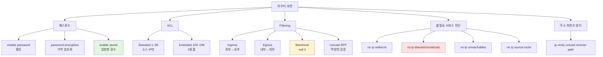
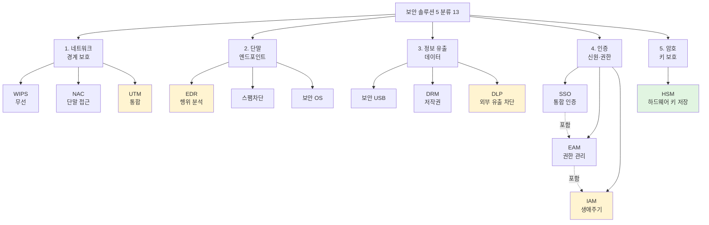
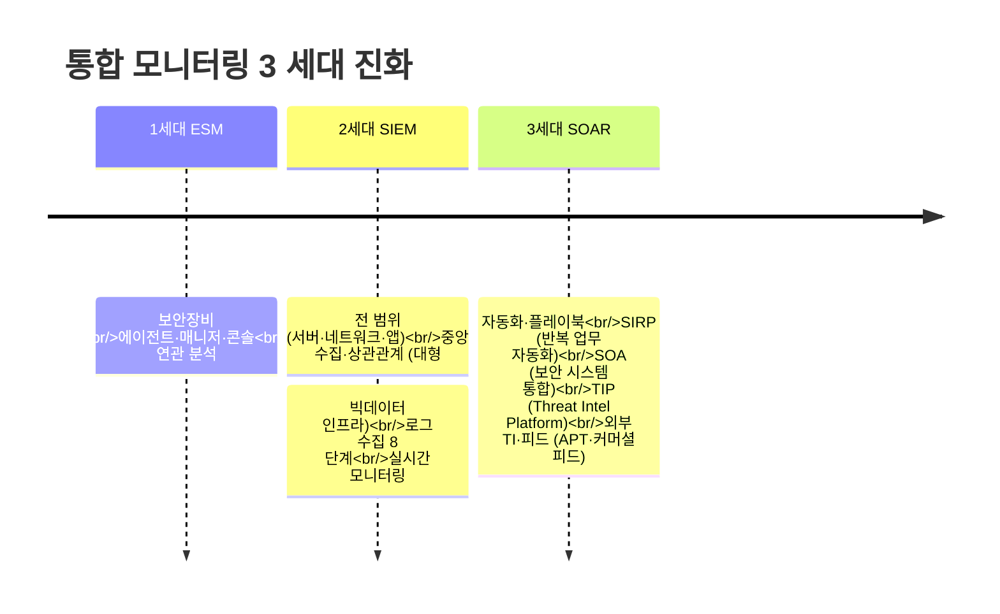

# 08. 보안 솔루션·모니터링 — 만화책처럼 읽는 방화벽 / IDS·IPS / Snort·iptables / SIEM·SOAR / 침해사고 분석 도구

> **이 문서를 읽는 법**: 만화책 한 권을 펼쳤다고 생각하세요. *에피소드*를 따라 *어느 위치 보안 → 어느 도구·솔루션 → 어떻게 모니터링·점검·분류* 의 흐름으로 외우면 자연스럽게 정착됩니다.
> 정확한 명령·옵션·CVE 는 정확본을 참조: [[cs/information-security/02.network-security/08.security-solutions-and-monitoring|정확본 08. 보안 솔루션·모니터링]]

> **연결 단원**: 본 단원은 [[cs/information-security/02.network-security/04.scanning-sniffing-spoofing|04 단원]] 의 *iptables DROP/REJECT*, [[cs/information-security/02.network-security/05.dos-ddos-drdos|05 단원]] 의 *DDoS 대응*, [[cs/information-security/02.network-security/07.security-protocols|07 단원]] 의 *SSL/TLS·VPN* 의 *방어 솔루션 종합*. *루트킷 분석* (06 단원) → *Tripwire·rpm -V·lsattr* 가 본 단원의 점검 도구. *Snort 시그너처* (Shell Shock 06 단원) 가 본 단원의 N-IDS 핵심.

---

## 🎯 시작 전에 — 이미 들어본 보안 솔루션

| 매일 듣는 것 | 사실은 이 단원의 |
|---|---|
| `iptables -A INPUT -j DROP` | **iptables 체인·타겟** (`INPUT` 들어오는 패킷, `DROP` 묵살 타겟. `-A` 는 끝에 추가이므로 앞 규칙에서 이미 처리되면 도달 안 함) |
| `alert tcp any any -> ...` | **Snort 룰** (Martin Roesch) |
| 회사 *방화벽 + IDS + VPN 통합* 장비 | **UTM** (Unified Threat Management) |
| *SOC 의 SIEM 대시보드* | **로그 중앙 수집·대시보드 + 상관관계 분석** *(대형은 빅데이터 인프라로 구현 가능, SIEM 정의의 필수는 아님)* |
| *플레이북 자동화·SOAR* | **SIRP / SOA / TIP / 외부 TI·피드** |
| *EDR 알람* | 엔드포인트 행위 모니터링 |
| 사내 *Single Sign-On* | **SSO ⊂ EAM ⊂ IAM** |
| `/etc/init.d/nessusd restart` (8834/tcp) | **Nessus** (Tenable · **8834/tcp 는 기본값**, 배포 설정에 따라 변경 가능) |
| `chkrootkit -q` 의 INFECTED | 루트킷 점검 (**감염·변조 가능성**, 오탐·미탐 있음 · 확진 아님) |
| *DMZ 영역* | **공개 서버·서비스 완충 구역** — 인터넷 접근은 허용하되 내부망과 **신뢰·네트워크로 분리** (단순 “선상의 중간”이 아님) |
| `CVE-2014-0160` | **CVE** 식별자 (MITRE) |
| *입력 검증·API 오용* | **CWE** 상 *Seven Pernicious Kingdoms* 계열 **7 분류**(시험 암기) |
| *KISA TI 보고서의 위협 인텔리전스* | **TIP**·TI 피드 — SOAR/SIEM 과 **통합·연동**되는 축으로 자주 묶임 *(항상 구조적 “부분 집합”은 아님)* |

> **이 단원의 본질**: *네트워크 보안(2과목) 범위 안에서 솔루션·방어 종합 비중과 출제 빈도가 높은 블록* (**※** NCS 형태 필기 등에서는 보통 과목 간 문항 수가 동일. “크다”는 **이 과목·본 챕터의 분량과 난도**를 뜻함). **(1) 인프라 보안 (VLAN·라우터·SecaaS) + (2) 도구 (Snort·iptables) + (3) 솔루션 13 종 (5 분류) + (4) 모니터링 (ESM→SIEM→SOAR) + (5) 단말 관리 (PMS·EMM·BYOD/CYOD) + (6) 방화벽·IDS/IPS·허니팟 + (7) 점검 도구 8 + (8) CVE/CWE** 의 *8 축*. **솔루션 분류·체인·상태·플래그·플래그번호·플러그인 포트 등 정량 식별자가 시험 1순위**.

---

## 📖 에피소드 1 — VLAN 4 종 + 라우터 패스워드·ACL

### 장면 1. 논리적 브로드캐스트 도메인 분리

> **VLAN (Virtual LAN)** = 물리적인 선이 아닌 *논리적*으로 **브로드캐스트 도메인**을 나누기 위한 기술. 관리자가 *서로 다른 논리적 그룹에 다른 보안 정책*을 사용할 수 있게 함.

### VLAN 4 종 — 시험 1순위

| 종류 | 동작 |
|---|---|
| **Port 기반** | 스위치 *포트를 VLAN 에 할당* |
| **MAC 기반** | 호스트 *MAC 을 VLAN 에 등록* |
| **Network 기반** | *네트워크 주소별*로 VLAN 구성 |
| **Protocol 기반** | *같은 통신 프로토콜* 호스트 간 |

### 외우는 방법 — *Port / MAC / Network / Protocol*

> *어느 식별자를 기준으로 그룹화하느냐*가 분류. *Port (1계층) / MAC (2계층) / Network (3계층) / Protocol (다계층)*.

### 장면 2. 라우터 패스워드 설정 3 명령 — 시험 1순위

| 명령 | 동작 |
|---|---|
| **`enable password asd123`** | 패스워드를 *평문*으로 저장 |
| **`enable password-encryption`** | 평문 패스워드를 *암호화* — *역함수 존재* (가역) |
| **`enable secret asd123`** | 패스워드를 *암호화 저장* — **일방향 함수** (비가역) |

### 보안 강도 — 시험 함정

> *enable secret 만 일방향 함수* (해시) → *복호화 불가능*. *password-encryption 은 역함수 존재* → 복호화 가능. **`enable secret` 권장**.

### 장면 3. ACL — Access Control List

> 정확본 §2-2 표기: `access-list [acl 번호]` — **number** 로 식별.

| 종류 | number | 식별 |
|---|---|---|
| **Standard ACL** | **number 1~99** | *소스 IP* 만 |
| **Extended ACL** | **number 100~199** | *소스 IP + 목적지 IP + 포트 + 프로토콜* |

### 외우는 방법 — *1~99 vs 100~199*

> *Standard = 1~99 = 단순 (소스 IP)* / *Extended = 100~199 = 확장 (5튜플)*. *번호 범위가 곧 기능 차이*.

### 시험 함정

| 함정 | 정답 |
|---|---|
| VLAN 4 종? | **Port / MAC / Network / Protocol** |
| 평문 저장? | **`enable password`** |
| 가역 암호화? | **`password-encryption`** |
| 일방향 함수? | **`enable secret`** |
| Standard ACL 번호? | **1~99** |
| Extended ACL 번호? | **100~199** |
| Extended ACL 식별? | 소스 IP + 목적지 IP + 포트 + 프로토콜 |

---

## 📖 에피소드 2 — 라우터 Filtering 4 + 서비스 차단 4 + SecaaS 10

### 장면 1. Filtering 4 종

| 유형 | 동작 |
|---|---|
| **Ingress Filtering** | 외부 → 내부 *유입 패킷 체크* — *내부 들어오는 출발지 IP* |
| **Egress Filtering** | 내부 → 외부 *나가는 패킷 체크* — *외부 나가는 출발지 IP* |
| **BlackHole Filtering** | 비정상 시도 IP → *가상 쓰레기 인터페이스* (**`interface null 0`**) |
| **Unicast RPF** | IP 지정 없이 *역방향 라우팅 검증* — 인터페이스 들어온 출발지 IP 가 *동일 인터페이스로 다시 나가는지* |

### `null 0` 인터페이스 — 시험 1순위

> **BlackHole Filtering 의 핵심**. *가상 쓰레기 인터페이스*로 보내 *조용히 폐기*. `interface null 0` + `no ip unreachables` + `ip route [차단 IP] 255.255.255.255 null 0`.

### 장면 2. 불필요한 서비스 차단 4 — 시험 1순위

| 항목 | 명령 | 효과 |
|---|---|---|
| **ICMP Redirect 차단** | **`no ip redirects`** | 패킷 방향 변경 방지 |
| **Directed Broadcast 차단** | **`no ip directed-broadcast`** | DoS·DDoS (Smurf) 악용 방지 |
| **ICMP Unreachable 차단** | **`no ip unreachables`** | 상태 정보 노출 방지 |
| **Source Route 중지** | **`no ip source-route`** | 발송자가 *경로 직접 설정* 방지 |

### 외우는 방법 — *redirect / broadcast / unreachable / source-route*

> *4 명령 모두 `no ip ...`* 패턴. *공격에 악용될 정보·기능을 모두 차단*. **05 단원의 Smurf 대응 `no ip directed-broadcast`** 와 직결.

### 입·출력 IP 보안 + 주소 위변조 방지

| 항목 | 명령 |
|---|---|
| **입·출력 IP 보안** | `access-list 15 deny [차단 IP 대역]` + `permit any` + `ip access-group 15 in` |
| **Unicast RPF (주소 위변조 방지)** | **`(config-if) # ip verify unicast reverse-path`** |

### 콘솔·VTY·SSH 설정

```bash
(config) # line vty 0 4
(config-line) # login
(config-line) # password cisco
(config) # access-list 10 permit host [허용 IP]
(config) # access-list 10 deny any
(config) # line vty 0 4
(config-line) # access-class 10 in    # SSH 권장
```

### 장면 3. SecaaS — 클라우드 기반 보안 서비스

> **SecaaS (Security as a Service)** = 기업 내 구축형 ❌ + *클라우드 주문형 방식* 보안 서비스 모델. **Cloud Security Alliance (CSA)** 정의.

### SecaaS 10 분야 — 시험 1순위

```
1. 식별 / 접근 관리        (IAM)
2. 데이터 유출 / 손실 방지 (DLP)
3. 웹 보안
4. 이메일 보안
5. 보안 감사               (제 3 자 감사)
6. 침입 관리
7. 보안 정보 및 이벤트     (SIEM)
8. 암호화
9. 업무 연속성 / 재난 복구 (BCDR)
10. 취약점 검사 / 지속적 모니터링
```

### 외우는 방법 — *IAM·DLP·웹·메일·감사·침입·SIEM·암호화·BCDR·취약점*

> *기존 보안 솔루션의 클라우드 버전*. SOC 의 *모든 영역*이 SecaaS 분야.

### 시험 함정

| 함정 | 정답 |
|---|---|
| Filtering 4? | Ingress / Egress / **BlackHole** / Unicast RPF |
| BlackHole 핵심 명령? | **`interface null 0`** |
| ICMP Redirect 차단? | **`no ip redirects`** |
| Smurf 대응 명령? | **`no ip directed-broadcast`** |
| Source Route 차단? | **`no ip source-route`** |
| 주소 위변조 방지? | **`ip verify unicast reverse-path`** |
| SecaaS 정의 출처? | **Cloud Security Alliance (CSA)** |
| SecaaS 분야 수? | **10** |

---

## 📖 에피소드 3 — Snort 정의·헤더·바디·threshold

### 장면. Martin Roesch 의 침입탐지시스템

> **Snort** = **Martin Roesch** 가 처음 개발한 *네트워크 트래픽 감시·분석 침입탐지시스템*. **Suricata** 가 발전형. 현재는 **Cisco** 가 인수·운영.

### Snort 제공 기능 3

| 기능 | 설명 |
|---|---|
| **패킷 스니퍼** | 네트워크 패킷 스니핑·표시 |
| **패킷 로거** | 모니터링 패킷 *저장·로그* |
| **네트워크 IDS / IPS** | 트래픽 *분석·탐지·차단* |

### Snort Rule 구조 = 헤더 7 + 바디 옵션

```
[헤더] action protocol src_ip src_port direction dst_ip dst_port
       └ 7 요소 ┘

[바디] (msg:; content:; offset:; depth:; distance:; within:; nocase:; ...)
       └ 핵심 옵션 ┘
```

### 헤더 7 요소 — 시험 1순위

| 필드 | 의미 |
|---|---|
| **action** | 처리 방식 (**`alert` 가장 자주 사용**) |
| **protocol** | TCP / UDP / ICMP / IP |
| **src_ip** | 출발지 IP (대역 가능) |
| **src_port** | 출발지 Port |
| **direction** | **`->` 단방향 / `<>` 양방향** |
| **dst_ip** | 목적지 IP |
| **dst_port** | 목적지 Port |

### 바디 핵심 옵션 — 시험 1순위

| 옵션 | 의미 |
|---|---|
| **msg** | alert 발생 시 *이벤트 이름* |
| **content** | 페이로드에서 *검사할 문자열* |
| **offset** | content 검사 *시작 위치* (없을 시 0) |
| **depth** | offset 부터 *몇 바이트까지* 검사 |
| **distance** | 이전 content 매칭 이후 *몇 바이트 떨어진* 위치 |
| **within** | distance 부터 *몇 바이트까지* 검사 |
| **nocase** | 대·소문자 *구별 ❌* |
| **pcre** | *정규표현식* (Perl Compatible Regex) |
| **http_method** | HTTP 메소드 부분 검사 |

### threshold 3 종 — 이벤트 제한

| 옵션 | 형식 | 의미 |
|---|---|---|
| **limit** | `threshold:type limit, ...` | **count 까지만** alert |
| **threshold** | `threshold:type threshold, ...` | **count 마다** alert |
| **both** | `threshold:type both, ...` | **count 이상 + 한 번만** alert |

### threshold 공통 파라미터

| 파라미터 | 값 |
|---|---|
| **track** | `by_src` 출발지 IP 기준 / `by_dst` 목적지 IP 기준 |
| **count** | 몇 번째 / 몇 번 이상 |
| **seconds** | 매 몇 초 |

### 외우는 방법 — *limit (까지) / threshold (마다) / both (시 한번)*

> *limit = 한도 (그 안에서만)* / *threshold = 임계 (도달할 때마다)* / *both = 둘 다 (도달 + 한번)*. *영문 어원이 곧 동작*.

### 시험 함정

| 함정 | 정답 |
|---|---|
| Snort 개발자? | **Martin Roesch** |
| Snort 발전형? | **Suricata** |
| 헤더 7 요소? | action / protocol / src ip / src port / direction / dst ip / dst port |
| `->` ↔ `<>`? | 단방향 ↔ 양방향 |
| nocase? | 대·소문자 *구별 ❌* |
| pcre? | **정규표현식** |
| threshold 3 종? | **limit / threshold / both** |
| count 까지만 alert? | **limit** |
| count 마다 alert? | **threshold** |
| 한 번만 alert? | **both** |

---

## 📖 에피소드 4 — Snort 공격 탐지 룰 + flags

### 장면. 정확본 13 룰 예시

> 정확본 §4-5 의 *공격·비정상 패킷 탐지 룰*. **flags 표기**가 시험 1순위.

### 주요 공격 탐지 룰 — 시험 1순위

| 공격 | 핵심 룰 |
|---|---|
| **FTP root 로그인 시도** | `tcp any any -> 21` + `content:"User root"; nocase;` |
| **Telnet root 로그인 성공** | `tcp 23 -> any` + `content:"login"; pcre:"/root@.*#/";` |
| **Telnet Brute Force** | `tcp 23 -> any` + `content:"Login incorrect"; threshold:type limit, track by_dst, count 1, seconds 5;` |
| **FTP Brute Force** | `tcp 21 -> any` + `count 5, seconds 30; type threshold` |
| **SSH Brute Force** | `tcp -> 22` + `content:"SSH-2.0"; threshold:type both, track by_src, count 5, seconds 30;` |
| **HTTP GET Flooding** | `tcp -> 80` + `content:"GET / HTTP1."; depth:13; threshold:type threshold, track by_src, count 100, seconds 1;` |
| **TCP SYN Flooding** | `tcp -> 80` + **`flags:S;`** + `count 5, seconds 1;` |
| **UDP Flooding** | `udp -> $HOME_NET` + `count 5, seconds 1;` |
| **사설 IP 탐지** | `udp 10.0.0.0/8 -> $HOME_NET` |
| **Land Attack (출발지=목적지)** | `ip -> $HOME_NET` + **`sameIP;`** |
| **SYN_FIN Scan** | `tcp -> any` + **`flags:SF;`** |
| **SYN_FIN+ Scan** | `tcp -> any` + **`flags:SF+;`** |
| **NULL Scan** | `tcp -> any` + **`flags:!UAPRSF;`** |

### flags 표기 — 시험 1순위

| 표기 | 의미 |
|---|---|
| **`S`** | SYN |
| **`SF`** | SYN + FIN (둘 다 켬) |
| **`SF+`** | SYN + FIN + 추가 |
| **`!UAPRSF`** | *모든 플래그 OFF* — **NULL Scan** |

### flags 비트 표기 매트릭스

| 표기 | URG | ACK | PSH | RST | SYN | FIN |
|---|---|---|---|---|---|---|
| `S` | — | — | — | — | **✅** | — |
| `SF` | — | — | — | — | **✅** | **✅** |
| `!UAPRSF` | ❌ | ❌ | ❌ | ❌ | ❌ | ❌ |

### Land Attack 의 `sameIP` 옵션

> 출발지 IP = 목적지 IP 인 패킷을 *Snort 내장 옵션*으로 탐지. **`sameIP;`** 한 줄.

### 외우는 방법 — *S = SYN / SF = SYN+FIN / SF+ = +α / !UAPRSF = NULL*

> *플래그 표기는 켜진 비트의 영문 이니셜*. *`!`는 부정 (모두 OFF)*. *`+`는 +α*.

### 시험 함정

| 함정 | 정답 |
|---|---|
| TCP SYN Flooding 룰의 flags? | **`flags:S;`** |
| Land Attack 옵션? | **`sameIP;`** |
| SYN_FIN Scan flags? | **`flags:SF;`** |
| NULL Scan flags? | **`flags:!UAPRSF;`** |
| SSH Brute Force threshold? | **`type both`** |
| Telnet Brute Force threshold? | **`type limit`** |
| HTTP GET Flooding depth? | **`depth:13`** |

---

## 📖 에피소드 5 — iptables 체인 3 + 타겟 4 + 룰 식별

### 장면. netfilter 의 도구

> **iptables** = 리눅스 *netfilter* 기능을 관리하는 도구. 패킷 필터링 + NAT + 로깅 + *상태 추적* + 확장 모듈. **대소문자 구별**.

### 기본 구문

```
iptables [테이블] [체인] [룰] [타겟]
```

### 정책 명령 6 — 시험 1순위

| 명령 | 동작 |
|---|---|
| **`-A`** | 해당 체인 *마지막에 룰 추가* (Append) |
| **`-I`** | 해당 체인 *첫 행에 추가* (Insert, n 지정 가능) |
| **`-D`** | 해당 룰 *삭제* (Delete) |
| **`-L`** | 룰 리스트 *확인* (`-n` 숫자 형식) |
| **`-F`** | 모든 룰 *삭제* (Flush) |
| **`-P`** | *기본 정책* 지정 (Policy) |

### 체인 3 종 — 시험 1순위

| 체인 | 의미 |
|---|---|
| **INPUT** | 방화벽이 **최종 목적지** |
| **OUTPUT** | 방화벽이 **최초 출발지** |
| **FORWARD** | 방화벽을 **경유** |

### 타겟 4 종 — 시험 1순위

| 타겟 | 동작 |
|---|---|
| **`-j ACCEPT`** | 패킷 *허용* |
| **`-j DROP`** | *차단 (응답 ❌)* |
| **`-j REJECT`** | *차단 + ICMP 에러 응답* |
| **`-j LOG`** | *탐지 로그 기록* |

### DROP ↔ REJECT — 04 단원과 직결

> 04 단원 §iptables 의 *DROP 응답 없음 / REJECT ICMP Destination Unreachable* 와 동일. *보안상 DROP 권장*.

### 룰 식별자 5 — 시험 1순위

| 식별 | 옵션 |
|---|---|
| **호스트 식별** | **`-s [출발지]`** / **`-d [목적지]`** |
| **서비스 식별** | **`--sport [출발지 포트]`** / **`--dport [목적지 포트]`** |
| **메시지 식별** | **`--icmp-type [타입]`** |
| **TCP 플래그 식별** | **`-p tcp --tcp-flags [검사할 플래그] [설정될 플래그]`** |
| **TCP 상태 식별** | **`-m state --state [상태]`** |

### 외우는 방법 — *INPUT (목적지) / OUTPUT (출발지) / FORWARD (경유)*

> *방화벽 입장에서 패킷이 어디로 가는가*. *INPUT = 받는다 / OUTPUT = 보낸다 / FORWARD = 통과시킨다*.

### 시험 함정

| 함정 | 정답 |
|---|---|
| iptables 의 토대? | **netfilter** |
| 마지막에 룰 추가? | **`-A`** |
| 첫 행에 추가? | **`-I`** |
| 모든 룰 삭제? | **`-F`** (Flush) |
| 기본 정책 지정? | **`-P`** |
| 체인 3? | **INPUT / OUTPUT / FORWARD** |
| INPUT? | 방화벽이 **최종 목적지** |
| OUTPUT? | 방화벽이 **최초 출발지** |
| FORWARD? | 방화벽 **경유** |
| 타겟 4? | ACCEPT / **DROP / REJECT** / LOG |
| DROP 응답? | **응답 없음** |
| REJECT 응답? | **ICMP 에러** |

---

## 📖 에피소드 6 — iptables 상태 추적 4 + 확장 모듈 3

### 장면. TCP 상태 추적 + 확장 기능

> iptables 의 **상태 추적 (state tracking)** 은 *모든 패킷의 연결 상태 추적*. **TCP·UDP** 의 상태 식별.

### TCP 상태 4 종 — 시험 1순위

| 상태 | 의미 |
|---|---|
| **NEW** | *최초로 들어온 패킷* |
| **ESTABLISHED** | *연결 정보를 가지고 있는 패킷* |
| **RELATED** | *연관된 연결 정보를 가지고 있는 패킷* |
| **INVALID** | *어떤 상태에도 해당하지 않는 패킷* |

### TCP 패킷 상태 흐름

```
1. SYN 패킷         → NEW (inbound)
2. SYN+ACK 패킷     → ESTABLISHED
3. ACK 패킷 ~ 종료   → ESTABLISHED (마지막 ACK 직전까지)
```

### UDP 상태 흐름

```
1. UDP 패킷 유입       → NEW (inbound)
2. 내부 TTL 유지 동안   → ESTABLISHED
```

### 외우는 방법 — *NEW → ESTABLISHED / RELATED 옆길 / INVALID 외부*

> *NEW = 처음 / ESTABLISHED = 진행 중 / RELATED = 관련 (FTP 데이터 채널 등) / INVALID = 분류 불가*. *4 상태가 곧 모든 트래픽 분류*.

### 확장 모듈 3 — 시험 1순위

| 모듈 | 형식 | 기능 |
|---|---|---|
| **connlimit** | **`--connlimit-above n`** / **`--connlimit-mask mask`** | 동일 IP·대역의 *동시 연결 개수 제한* |
| **limit** | `--limit [n/s \| n/m \| n/h \| n/d]` | *불필요 로그 억제* |
| **recent** | `--name`·`--set`·`--rcheck`·`--update`·`--seconds`·`--hitcount` | *동적 source IP 목록*으로 패킷 제어 |

### connlimit — 05 단원 SYN Flooding 대응

> **`iptables -A INPUT -p tcp --dport 80 --syn -m connlimit --connlimit-above 5 -j DROP`** = SYN Flooding 대응 (05 단원 §6-3) 의 *동일 IP 임계치 제한*.

### 외우는 방법 — *connlimit (개수) / limit (시간) / recent (목록)*

> *connection limit = 동시 연결 개수* / *limit = 시간당 빈도* / *recent = 최근 IP 동적 목록*. *세 모듈이 차단 차원 다름*.

### 시험 함정

| 함정 | 정답 |
|---|---|
| 상태 4 종? | **NEW / ESTABLISHED / RELATED / INVALID** |
| 첫 SYN 패킷 상태? | **NEW** |
| SYN+ACK 상태? | **ESTABLISHED** |
| 분류 불가 상태? | **INVALID** |
| 동시 연결 제한 모듈? | **connlimit** |
| 로그 빈도 제한 모듈? | **limit** |
| 동적 IP 목록 모듈? | **recent** |
| connlimit 옵션? | **`--connlimit-above n`** |

---

## 📖 에피소드 7 — 보안 솔루션 5 분류 13 종

### 장면. 보호 대상 영역으로 분류

> 보안 솔루션은 **보호 대상 영역**을 기준으로 *5 분류 13 종*. *네트워크·단말·정보·인증·암호*.

### 5 분류 13 종 매트릭스 — 시험 1순위

| 분류 | 솔루션 | 풀이 | 핵심 |
|---|---|---|---|
| **1. 네트워크** (경계) | **WIPS** | Wireless IPS | *무선* 침입 방지 |
| | **NAC** | Network Access Control | *단말 접속 시점* 무결성 |
| | **UTM** | Unified Threat Management | *통합 보안* (방화벽+IDS/IPS+VPN+백신) |
| **2. 단말** (엔드포인트) | **EDR** | Endpoint Detection and Response | *행위 모니터링* |
| | **스팸차단** | — | *메일 진입 단계* 필터링 |
| | **보안 OS** | — | *커널 강화* |
| **3. 정보 유출** (데이터) | **보안 USB** | — | *USB 보안 기능* |
| | **DRM** | Digital Rights Management | *저작권 관리* |
| | **DLP** | Data Loss Prevention | *외부 유출 차단* (네트워크 DLP / 단말 DLP) |
| **4. 인증** (신원·권한) | **SSO** | Single Sign-On | *통합 인증* |
| | **EAM** | Enterprise Access Management | *권한 관리* (SSO + 사용자별·그룹별 권한) |
| | **IAM** | Identity and Access Management | *생애주기 관리* (EAM + 정책 + 자동 계정) |
| **5. 암호** (키 보호) | **HSM** | Hardware Security Module | *전용 하드웨어 키 저장* |

### SSO ⊂ EAM ⊂ IAM — 시험 1순위 포함 관계

```
SSO          (한 번 인증으로 여러 시스템 접근)
 ⊂ EAM        (+ 사용자별·그룹별 접근 권한 통제)
   ⊂ IAM      (+ 정책 수립·자동 계정·생애주기·실시간 반영)
```

> *(주의)* **위 ⊂ 표기는 시험·교재형 암시도**입니다. 표준 IAM 정의에는 SSO 유사 기능만 따로 포함되거나, 제품 카탈로그에서는 EAM 과 용어가 겹치지 않게 쓰이기도 합니다 — **직관**으로 받아들되 **수학적 집합포함처럼 엄격히 적용하지 마세요.**

### NAC 의 3 기능

| 기능 | 동작 |
|---|---|
| **접근 제어/인증** | *역할·IP 기반* |
| **무결성 체크** | *백신·패치·자산 관리* |
| **탐지·차단** | *유해 트래픽 탐지·차단·증거 수집* |

### DLP 의 2 분류

| 분류 | 동작 |
|---|---|
| **네트워크 DLP** | *네트워크 통한 유출 방지* |
| **단말 DLP** | *이동식 매체·출력물 통한 유출 방지* |

### UTM 의 통합 기능

> 방화벽 + IDS/IPS + VPN + 안티바이러스 등 *다양한 보안 기능을 하나의 장비로 통합*. **경제성 + 운영 편리**.

### 외우는 방법 — *5 분류 = 보호 대상*

> *경계 (네트워크) → 엔드포인트 (단말) → 데이터 (정보) → 신원 (인증) → 키 (암호)*. *공격이 통과하는 순서*.

### 시험 함정

| 함정 | 정답 |
|---|---|
| 5 분류? | 네트워크 / 단말 / 정보 유출 / 인증 / 암호 |
| 무선 침입 방지? | **WIPS** |
| 단말 접근 제어? | **NAC** |
| 통합 보안? | **UTM** |
| 엔드포인트 행위 분석? | **EDR** |
| 저작권 관리? | **DRM** |
| 외부 유출 차단? | **DLP** |
| DLP 2 분류? | 네트워크 DLP / 단말 DLP |
| 통합 인증? | **SSO** |
| 권한 관리? | **EAM** |
| 신원·접근 통합? | **IAM** |
| SSO ⊂ EAM ⊂ IAM 의미? | *시험용 기능 포함 관계* (하위 ⊂ 상위 · § 해당 절 **주의 각주**) |
| 하드웨어 키 저장? | **HSM** |

---

## 📖 에피소드 8 — 통합 모니터링: ESM → SIEM → SOAR

### 장면. 3 세대 진화

> 통합 모니터링은 **ESM (1세대) → SIEM (2세대, 중앙 수집·상관관계) → SOAR (3세대, 자동화)** 의 *진화 흐름*.

### ESM — Enterprise Security Management

> **ESM** = 다양한 *보안장비*에서 발생하는 *보안정보를 통합 수집·관리* + *상호 연관 분석*.

### ESM 3 구성 요소 — 시험 1순위

| 구성 | 역할 |
|---|---|
| **ESM 에이전트** | 보안 장비에 설치 → *로그·이벤트 수집* + 매니저로 전달 |
| **ESM 매니저** | *수집 데이터 저장·분석* + 콘솔로 결과 전달 |
| **ESM 콘솔** | *시각적 전달·상황 판단·리포팅* + 에이전트·매니저 *제어* |

### SIEM — Security Information and Event Management

> **SIEM** = ESM 의 *진화*. *보안장비 + 서버 + 네트워크 장비 + 어플리케이션* 광범위 **로그·이벤트 중앙 수집** + 정규화 + **상관관계(correlation) 분석** + 대시보드·대응 + 위협 *사전 차단*. *(운영 규모에 따라 빅데이터 스택 위에서 구축되는 경우가 많으나 “빅데이터” 자체가 SIEM 의 정의 필수 조건은 아님.)*

### SIEM 의 8 단계

```
1. 데이터 통합     2. 로그 수집      3. 로그 변환      4. 상관관계 분석
5. 로그 분류       6. 로그 분석      7. 알림           8. 대시보드
```

### SIEM ↔ ESM — 핵심 차이

| | ESM | SIEM |
|---|---|---|
| 범위 | *보안장비 한정* | **전 범위** (서버·네트워크·어플리케이션) |
| 분석 | 상호 연관 | **중앙 수집·상관관계** *(대형: 빅데이터 인프라 활용)* |
| 목적 | 통합 관리 | **위협 사전 차단** |

### SOAR — Security Orchestration, Automation and Response

> **SOAR** = *자동화된 분석·대응 환경* + 보안 인력 효율화 + 분석 정확도 ↑ + 대응 시간 단축.

### SOAR 4 구성 — 시험 1순위

| 구성 | 풀이 | 역할 |
|---|---|---|
| **SIRP** | **S**ecurity **I**ncident **R**esponse **P**latform | *반복 업무 자동화* |
| **SOA** | **S**ecurity **O**rchestration & **A**utomation | *다양한 보안 시스템 통합·자동화* |
| **TIP** | **T**hreat **I**ntelligence **P**latform | IOC·TI 저장·워크플로 등 *TI 운영 플랫폼*으로 판단 보조 |
| **외부 TI·피드** | Threat Intel Feed 등 | 커머셜 TI·CERT·판매 업체 **피드를 수집·반영**해 알려지지 않은 위협·APT 대응 *(TIP 과 역할 분리해서 외운다)* |

### SOAR 핵심 기능 3

| 기능 | 설명 |
|---|---|
| **업무 자동화** | 단순 반복 자동화 → 고차원 업무 집중 |
| **동적 플레이북** | *사전 정의 플레이북*으로 일관 프로세스 |
| **작업·스크립트** | 워크플로우 + 스크립트로 *플랫폼 자동화* |

### 외우는 방법 — *통합 → 상관관계 → 자동화*

> *ESM = 통합 (1세대) → SIEM = 중앙 수집 + 상관관계 (2세대) → SOAR = 오케스트레이션 + 자동화 + 플레이북 (3세대)*. *분석 → 자동 대응*의 진화.

### 시험 함정

| 함정 | 정답 |
|---|---|
| ESM 풀이? | Enterprise Security Management |
| ESM 3 구성? | **에이전트 / 매니저 / 콘솔** |
| ESM 범위? | *보안장비 한정* |
| SIEM 풀이? | Security Information and Event Management |
| SIEM 핵심? | *중앙 수집·정규화·**상관관계 분석**·대시보드* (대형: 빅데이터 스택 활용 가능) |
| SOAR 풀이? | Security Orchestration, Automation and Response |
| SOAR 4 구성? | **SIRP / SOA / TIP / 외부 TI·피드** |
| SIRP 풀이? | Security Incident Response Platform |
| SOAR 핵심 기능? | **자동화 + 플레이북** |

---

## 📖 에피소드 9 — PMS·EMM·BYOD/CYOD

### 장면. 단말 관리의 3 축

> 단말 관리는 **PMS (패치) + EMM (모바일 관리) + BYOD/CYOD (소유 정책)** 의 3 축.

### PMS — Patch Management System

> **PMS** = 사용자 PC 의 OS·어플리케이션 *패치 자동 설치·업그레이드*. 웜·바이러스 공격 방어.

### PMS 2 구성

| 구성 | 역할 |
|---|---|
| **PMS 서버** | *패치 배포* + 정책 위반 PC *강제 적용* |
| **PMS 에이전트** | *서버 패치 적용* + 사용자 PC *상태 점검* + 정책 위반 *서버 보고* |

### EMM — Enterprise Mobility Management

> **EMM** = 모바일 장치·무선 네트워크 + *기밀성·무결성·가용성 보장* 프로세스·기술.

### EMM 의 3 하위 기술 — 시험 1순위

| 하위 기술 | 풀이 | 관리 대상 |
|---|---|---|
| **MDM** | **M**obile **D**evice **M**anagement | *디바이스 자체* (스마트폰·태블릿) |
| **MAM** | **M**obile **A**pplication **M**anagement | *특정 앱*에만 보안 정책 |
| **MCM** | **M**obile **C**ontent **M**anagement | *콘텐츠 (기업 기밀)* 안전 공유 |

### EMM ⊃ MDM·MAM·MCM 포함 관계

```
EMM (Enterprise Mobility Management)
 ├ MDM (디바이스)
 ├ MAM (앱)
 └ MCM (콘텐츠)
```

### BYOD ↔ CYOD — 소유 정책

| 정책 | 풀이 | 소유 | 핵심 |
|---|---|---|---|
| **BYOD** | **B**ring **Y**our **O**wn **D**evice | *개인 소유* | **컨테이너화** (암호화된 별도 공간) + **모바일 가상화** (개인용·업무용 OS 동시) |
| **CYOD** | **C**hoose **Y**our **O**wn **D**evice | *기업 소유* | 표준 SW 탑재 + 보안·액세스 강화 |

### BYOD 의 2 핵심 기술

| 기술 | 동작 |
|---|---|
| **컨테이너화** | *암호화된 별도 공간*에 업무용·개인용 데이터 분리 |
| **모바일 가상화** | *개인용 OS + 업무용 OS 동시 탑재* |

### 외우는 방법 — *PMS (패치) + EMM (디바이스/앱/콘텐츠) + 개인 (BYOD) ↔ 기업 (CYOD)*

> *PMS = OS·앱 패치 자동화* / *EMM = 모바일 3 차원 관리* / *BYOD = 개인 가져옴 / CYOD = 기업이 줌*.

### 시험 함정

| 함정 | 정답 |
|---|---|
| PMS 풀이? | Patch Management System |
| PMS 2 구성? | 서버 / 에이전트 |
| EMM 풀이? | Enterprise Mobility Management |
| EMM 3 하위? | **MDM / MAM / MCM** |
| MDM 대상? | *디바이스* |
| MAM 대상? | *특정 앱* |
| MCM 대상? | *콘텐츠* |
| BYOD 풀이? | **Bring Your Own Device** |
| CYOD 풀이? | **Choose Your Own Device** |
| BYOD 2 핵심 기술? | **컨테이너화 + 모바일 가상화** |

---

## 📖 에피소드 10 — 방화벽 3 분류 + 구축 4 + 허니팟·허니넷

### 장면. 인가된 서비스만 허용

> **방화벽** = 인가된 네트워크 서비스 *허가* + 인가되지 않은 트래픽 *철저 차단*. **NIST SP 800-41 Rev.1**.

### 방화벽 3 분류 — 동작 계층별 (시험 1순위)

| 계층 | 분류 | 동작 |
|---|---|---|
| **네트워크 계층** | 패킷 필터링 | *IP 주소 + 포트* 기반 필터링 (L3·L4) |
| **세션 계층** | **상태 검사** | IP·Port + *프로토콜 연결 상태 정보* 유지·추적 |
| **응용 계층** | **프락시 / 배스천 / ALG / 회선 레벨 게이트웨이** | 애플리케이션 컨텐츠 검사 |

### 응용 계층 4 구성 요소

| 구성 | 역할 |
|---|---|
| **프락시 서비스** | *클라이언트·서버 중개* |
| **배스천 호스트** | *트래픽 분산·가용성·성능* |
| **응용 계층 게이트웨이 (ALG)** | *애플리케이션 간 통신 관리·중개* |
| **회선 레벨 게이트웨이** | *물리적 연결 관리·보안* |

### 방화벽 구축 형태 4 — 시험 1순위

| 형태 | 구성 | 강도 |
|---|---|---|
| **스크리닝 라우터** | *라우터 인터페이스 패킷 필터링* | 약 |
| **듀얼-홈드 호스트** | *두 인터페이스 호스트*가 내·외부 연결 | 중 |
| **스크린드 호스트 게이트웨이** | *듀얼홈드 게이트웨이 + 외부 사이 스크리닝 라우터* | 강 |
| **스크린드 서브넷** | **스크리닝 라우터 2개 + 듀얼홈드 게이트웨이 1** | **가장 강** |

### 스크린드 서브넷 — 가장 강한 구조

> **스크리닝 라우터 2 + 듀얼홈드 게이트웨이 1**. *외부 라우터 → DMZ (게이트웨이) → 내부 라우터*. *3 단 방어*.

### NAT 으로 보안 효과

> *외부 → 내부 직접 접근 불가* → 자연스러운 방어. (02 단원 §NAT)

### 허니팟 (Honeypot)

> *실제 자료를 가진 호스트인 것처럼* 인터넷에 존재 + 해커·악의적 내부자 *유인* + *행동·공격 기법·목적 분석*.

### 허니팟 4 특성

| 특성 | 의미 |
|---|---|
| **조기 경보** | 잠재적 공격자 조기 경보 |
| **보안 전략 결점 파악** | 조직 보안 의식 향상 |
| **예방 통제** | *고의적 취약점*으로 패치 미발표 시점 공격 *사전 탐지* |
| **목적** | 시스템 *논리적 파괴·손실 방지* |

### 허니팟 동작 3 단계

```
1. 중요 시스템 접근 공격자를 *다른 방향으로 돌림*
2. 공격자 *동작 정보 수집*
3. 관리자 반응 가능하도록 공격자 *오랜 시간 머무르게 유도*
```

### 허니넷 (Honeynet)

> **다수의 허니팟으로 구축된 네트워크**. *정상 서비스와 격리* + 여러 시스템 공격 패턴 파악. 공격자는 *허니넷을 정상 네트워크로 인식*.

### 외우는 방법 — *3 분류·4 구축·허니팟·허니넷*

> *방화벽 = 3 분류 (계층별) × 4 구축 (강도별)* / *허니팟 = 단일 / 허니넷 = 다수*. *유인·격리* 가 핵심.

### 시험 함정

| 함정 | 정답 |
|---|---|
| 방화벽 NIST 표준? | **NIST SP 800-41 Rev.1** |
| 3 분류? | 네트워크 / 세션 / 응용 |
| 패킷 필터링? | *네트워크 계층* |
| 상태 검사? | *세션 계층* |
| 프락시·배스천? | *응용 계층* |
| 구축 4? | 스크리닝 라우터 / 듀얼홈드 / 스크린드 호스트 / **스크린드 서브넷** |
| 가장 강한 구조? | **스크린드 서브넷** (라우터 2 + 게이트웨이 1) |
| 허니팟 ↔ 허니넷? | 단일 ↔ 다수 |
| 허니팟 목적? | *유인* + *행동·기법 분석* |

---

## 📖 에피소드 11 — IDS·IPS + 추가 장비 4 + 인라인/미러링

### 장면. 탐지 vs 차단

> **IDS** = 공격 *탐지만*. **IPS** = 공격 *탐지 + 차단*. **NIST SP 800-94**.

### IDS 분류 — H-IDS ↔ N-IDS

| 분류 | 풀이 | 대상 | 도구 |
|---|---|---|---|
| **H-IDS** | **H**ost-based IDS | 호스트 (*Tripwire 등*) | Tripwire |
| **N-IDS** | **N**etwork-based IDS | 네트워크 트래픽 (*Snort 등*) | Snort |

### 탐지 종류 — 오용 ↔ 이상 (시험 1순위)

| 종류 | 영문 | 동작 | 오탐 |
|---|---|---|---|
| **오용 탐지** | Misuse Detection | *알려진 공격 패턴* 기반 | **False Negative ↑** (공격을 탐지 못함) |
| **이상 탐지** | Anomaly Detection | *정상 평균 상태* 기준 → 벗어남 탐지 | **False Positive ↑** (공격 아닌 것을 공격으로 판단) |

### False Negative ↔ False Positive — 시험 함정

| | 의미 | 분류 |
|---|---|---|
| **False Negative** | *공격을 탐지 ❌* (놓침) | **오용 탐지의 약점** |
| **False Positive** | *공격 아닌 것을 공격으로* (오탐) | **이상 탐지의 약점** |

### IDS ↔ IPS — 핵심 차이

| | IDS | IPS |
|---|---|---|
| 동작 | **탐지만** | **탐지 + 차단** |
| 추가 기능 | 알림·보고 | 차단·가로채기·자동 대응 |

### 보안장비 설치 모드 — 인라인 vs 미러링 (시험 1순위)

| 모드 | 설명 | 비고 |
|---|---|---|
| **인라인 모드** | *물리 경로상 설치* + 모든 트래픽 통과 + 탐지·차단 가능 + **장비 장애가 전체 네트워크 장애로 확산** | **IPS 모드** |
| **미러링 모드** | *물리 경로 밖* + **TAP 장비**로 복제 패킷 탐지 + 차단 어려움 + 네트워크 영향 없음 | **IDS 모드** |

### TAP 장비

> *Test Access Point*. **복제된 트래픽 전달 장비**. 미러링 모드의 핵심.

### 추가 보안 장비 4 — 시험 1순위

| 장비 | 위치·핵심 |
|---|---|
| **DDoS 차단** | *네트워크 가장 상단 (인터넷 인입단)*. 05 단원 §DDoS 대응 |
| **SSL 오프로드** | *SSL 트래픽 암·복호화*. **SSL-VA 장비** + **L7-Switch** |
| **APT 대응** | *가상머신 샌드박스*에서 파일 직접 실행 → 행위 분석. 06 단원 §동적 분석의 장비화 |
| **네트워크 포렌식** | *모든 트래픽 raw 패킷 보관*. 대용량 스토리지 필요 |

### 네트워크 구간 3

| 구간 | 정의 |
|---|---|
| **인터넷 구간** | 외부 직접 접근 가능 |
| **DMZ 구간** | *인터넷에 노출된 **공개 서비스 완충 구역**. 내부망과 **신뢰·경계 분리**(단순 “선상 중간”이 아님)* |
| **내부망** | 외부 직접 접근 *불가* (통제·차단) |

### 외우는 방법 — *오용 = FN / 이상 = FP / 인라인 = IPS / 미러링 = IDS*

> *알려진 패턴 기반 = 신종 놓침 (FN)* / *정상 기준 = 정상도 의심 (FP)*. *경로상 = 차단 가능 (IPS) / 경로 밖 = 탐지만 (IDS)*.

### 시험 함정

| 함정 | 정답 |
|---|---|
| IDS·IPS 표준? | **NIST SP 800-94** |
| H-IDS 도구? | **Tripwire** |
| N-IDS 도구? | **Snort** |
| 오용 탐지 약점? | **False Negative ↑** |
| 이상 탐지 약점? | **False Positive ↑** |
| IDS ↔ IPS? | 탐지만 ↔ 탐지 + 차단 |
| IPS 설치 모드? | **인라인** |
| IDS 설치 모드? | **미러링** |
| TAP 장비? | *복제 트래픽 전달* |
| DDoS 차단 위치? | **가장 상단 (인입단)** |
| SSL 오프로드 장비? | **SSL-VA / L7-Switch** |
| APT 대응 핵심? | **샌드박스** |
| 네트워크 포렌식 요구? | **대용량 스토리지** |
| 3 구간? | 인터넷 / DMZ / 내부망 |

---

## 📖 에피소드 12 — 점검 도구 8: Nessus·Nikto·Tripwire·chkrootkit·/proc·Strace·rpm -V·lsattr/chattr

### 장면. 취약점·무결성·루트킷 점검의 표준 도구

> 06 단원 §침해사고 분석의 *도구 모음*이 본 단원에서 *점검 표준화*. **Nessus·Nikto·Tripwire·chkrootkit·/proc·Strace·rpm -V·lsattr/chattr** 의 *8 도구*.

### 점검 도구 8 매트릭스 — 시험 1순위

| 도구 | 영역 | 핵심 |
|---|---|---|
| **Nessus** | 시스템 취약점 | **Tenable 사** / **8834/tcp**(기본, 변경 가능) / 클라이언트·서버 / 플러그인 |
| **Nikto** | 웹 취약점 | **CGI 스캔에 강함** |
| **Tripwire** | 무결성 | **`--init` (해시 생성) → `--check` (검증)** |
| **chkrootkit** | 루트킷 | **`-q` (quiet)** / 결과 **INFECTED** *(가능성, 오탐·미탐)* |
| **`/proc/[pid]/exe·cmdline`** | 히든 프로세스 | exe = 실행파일 / cmdline = 명령·인자 |
| **Strace** | 시스템 콜 | *변조 vs 정상 비교* |
| **`rpm -V`** | 패키지 무결성 | **S·M·5·T** |
| **lsattr / chattr** | 파일 속성 | **i·a·A** |

### Nessus 동작

```bash
/etc/init.d/nessusd restart      # 데몬 기동 (**기본** 8834/tcp, 변경 가능)
ps -ef | grep nessusd            # 동작 확인
```

| 항목 | 정보 |
|---|---|
| 개발 | **Tenable** 사 |
| 포트 | **8834/tcp** *(기본값, 조직별 변경 가능)* |
| 구조 | *클라이언트·서버* |
| 특징 | *플러그인 업데이트 쉬움* + HTML 결과 리포트 |

### Nikto

```bash
nikto -h [웹서버 IP] -output vul.html -Format html
```

> 웹서버 *기본 설치 파일·종류·버전 스캔*. **DB 를 이용한 취약 CGI 파일 스캔이 매우 뛰어남**.

### Tripwire 7 단계

```
1. 정책 설정       → 점검 대상 파일·디렉터리
2. tripwire --init → 초기 해시 생성
3. 해시 DB 저장
4. /var/lib/tripwire/[호스트명].twd
5. tripwire --check → 현재 상태 비교
6. 결과 화면 + report 파일
7. 리포트 확인
```

### chkrootkit

```bash
chkrootkit -q                    # quiet 모드
# 결과에 'INFECTED' → 변조·감염 *가능성* (항상 확정은 아님, 해시 검증 등 추가 확인 권장)
```

### `/proc/[pid]/exe` ↔ `cmdline`

| 경로 | 의미 |
|---|---|
| **`/proc/[pid]/exe`** | 실행파일명·경로 *심볼릭 링크* |
| **`/proc/[pid]/cmdline`** | 프로세스 *명령어·전달인자* |

### /proc 를 이용한 루트킷 탐지 원리

> `ps` 결과 ↔ `/proc` 디렉터리 *비교*. *`/proc` 에 있지만 `ps` 에 없으면* → **히든 프로세스** = 루트킷 의심. *시차로 오탐 가능*.

### 백도어 탐지 시나리오 (정확본 §14-5)

```
1. ps 명령에서 백도어 프로세스 (bdoor) 미출력
2. /proc/15415/exe 통해 bdoor 프로세스 확인
3. 실행파일명·경로 확인
4. cp /proc/15415/exe /tmp/backdoor   # 실행파일 복원
5. cat /proc/15415/cmdline             # 명령·전달인자 확인
```

### Strace

> 특정 프로그램의 *시스템 콜·시그널 추적* 디버깅 도구. *변조 ps vs 정상 ps* 비교 → *변조된 ps 가 특정 파일을 오픈*하는 것을 확인.

### `rpm -V` 4 플래그 — 시험 1순위

| 플래그 | 의미 |
|---|---|
| **S** | 파일 *크기* 변경 |
| **M** | 파일 *퍼미션* 변경 |
| **5** | **MD5 체크섬** 변경 |
| **T** | 파일 *수정 시간* 변경 |

### 06 단원의 S·5·T → 08 단원에서 S·**M**·5·T

> 06 단원 §6 의 `rpm -V` 는 *S·5·T 3 플래그*만 명시. **08 단원 §14-7 은 S·M·5·T 4 플래그**. **M (퍼미션)** 추가가 시험 함정.

### 패키지 재설치 4 단계

```
1. rpm -Uvh --force [패키지]    # 재설치 시 오류
2. lsattr                       # i 속성 확인
3. chattr -i                    # i 속성 제거
4. rpm 재설치
```

### lsattr / chattr 3 속성 — 시험 1순위

| 속성 | 의미 |
|---|---|
| **`i`** | **immutable** (변경·삭제 불가) |
| **`a`** | **append only** (내용 추가만 허용) |
| **`A`** | **Access Time 변경 안 함** (no atime) |

### 외우는 방법 — *Nessus (시스템) / Nikto (웹) / Tripwire (무결성) / chkrootkit (루트킷) / /proc (히든) / Strace (syscall) / rpm -V (패키지) / lsattr (속성)*

> *각 도구가 점검하는 영역이 다름*. *시스템 → 웹 → 파일 무결성 → 루트킷 → 히든 프로세스 → 시스템 콜 → 패키지 → 파일 속성*의 *점검 깊이 진화*.

### 시험 함정

| 함정 | 정답 |
|---|---|
| Nessus 개발사·포트? | **Tenable / 8834/tcp**(기본) |
| Nikto 의 강점? | **CGI 스캔** |
| Tripwire 명령? | **`--init` → `--check`** |
| chkrootkit 결과? | **INFECTED** *(감염·변조 가능성, 오탐·미탐)* |
| /proc 의 exe? | 실행파일·경로 심볼릭 링크 |
| /proc 의 cmdline? | 명령·전달인자 |
| Strace 의 본질? | **시스템 콜 추적** |
| `rpm -V` 4 플래그? | **S / M / 5 / T** |
| 패키지 재설치 오류 시? | **`lsattr` → `chattr -i`** |
| `i` 속성? | **immutable** |
| `a` 속성? | **append only** |
| `A` 속성? | **no atime** |

---

## 📖 에피소드 13 — CVE · CWE 취약점 분류

### 장면. 식별자 vs 약점 분류

> 취약점 정보 분류는 **CVE (식별자)** + **CWE (약점 분류)** 의 *2 체계*. **MITRE Corporation** 운영.

### CVE — Common Vulnerabilities and Exposures

> **CVE** = 공개적으로 알려진 *소프트웨어 보안 취약점*을 *표준화한 식별자 목록*.
> 형식: **`CVE-[해당년도]-[취약점 번호]`** (예: `CVE-2014-0160`)

### CVE 사례 — 본 과목 등장

| 단원 | 사례 |
|---|---|
| 05 단원 NTP DRDoS | **CVE-2013-5211** |
| 06 단원 Shell Shock | **CVE-2014-6271** |
| 07 단원 HeartBleed | **CVE-2014-0160** |
| 07 단원 FREAK | **CVE-2015-0204** |
| 07 단원 LogJam | **CVE-2015-4000** |
| 07 단원 POODLE | **CVE-2014-3566** |
| 07 단원 DROWN | **CVE-2016-0800** |

### CWE — Common Weakness Enumeration

> **CWE** = 소프트웨어에서 *공통적으로 발생하는 약점*을 *체계적으로 분류한 목록*. *개발 과정에서 발생할 수 있는 취약점* (소스 코드 보안 취약점).

### CWE 7 분류 — 시험 1순위 *(MITRE Seven Pernicious Kingdoms 계열 카테고리. CWE 트리 전체를 대표하지는 않음)*

| 분류 | 설명 |
|---|---|
| **입력 데이터 검증 및 표현** | *입력 값 검증 누락·부적절* |
| **보안 기능** | *보안 부적절 구현* |
| **시간 및 상태** | *병렬·다중 프로세스* 시간·상태 관리 부적절 |
| **에러 처리** | *에러 미처리* 또는 *중요 정보 포함* |
| **코드 오류** | *인가되지 않은 사용자에게 데이터 노출* |
| **캡슐화** | *중요 데이터·기능 불충분 캡슐화* |
| **API 오용** | *의도와 반하는 API 사용* 또는 *취약 API 사용* |

### CVE ↔ CWE — 시험 1순위 비교

| | CVE | CWE |
|---|---|---|
| 풀이 | **C**ommon **V**ulnerabilities and **E**xposures | **C**ommon **W**eakness **E**numeration |
| 본질 | **개별 취약점 식별자** | **약점 카테고리 분류** |
| 형식 | CVE-YYYY-NNNN | CWE-NNN |
| 운영 | **MITRE Corporation** | **MITRE Corporation** |
| 데이터베이스 | **NVD** (NIST National Vulnerability Database) — CVSS 점수 부여 | **CWE Top 25** / Pillar / Class / Base / Variant |

### 외우는 방법 — *CVE = 인스턴스 / CWE = 클래스*

> *프로그래밍의 인스턴스 (CVE) ↔ 클래스 (CWE)* 와 같은 관계. *Heartbleed (CVE-2014-0160) 는 CWE-126 (Buffer Over-read) 의 인스턴스*.

### 시험 함정

| 함정 | 정답 |
|---|---|
| CVE 풀이? | Common Vulnerabilities and Exposures |
| CVE 형식? | **CVE-YYYY-NNNN** |
| CWE 풀이? | Common Weakness Enumeration |
| CWE 7 분류? | *Seven Kingdoms 계열 —* 입력 검증 / 보안 기능 / 시간·상태 / 에러 처리 / 코드 오류 / 캡슐화 / API 오용 |
| CVE ↔ CWE? | *식별자 (개별) ↔ 분류 (카테고리)* |
| 운영? | **MITRE Corporation** |
| CVSS 데이터베이스? | **NVD** (NIST National Vulnerability Database) |

---

## 📑 종합 비교 (에피소드 1~13 정리)

시험 직전 *한눈에* 보는 view.

| 영역 | 핵심 |
|---|---|
| **VLAN 4** | Port / MAC / Network / Protocol |
| **라우터 패스워드** | enable password (평문) / password-encryption (가역) / **enable secret (일방향)** |
| **ACL** | Standard 1~99 / Extended 100~199 |
| **Filtering 4** | Ingress / Egress / **BlackHole (`null 0`)** / Unicast RPF |
| **불필요 서비스 차단** | `no ip redirects` / `no ip directed-broadcast` / `no ip unreachables` / `no ip source-route` |
| **주소 위변조 방지** | `ip verify unicast reverse-path` |
| **SecaaS 출처·분야** | **Cloud Security Alliance** / **10 분야** |
| **Snort 개발자·발전형** | **Martin Roesch / Suricata** |
| **Snort 헤더 7** | action / protocol / src ip·port / direction (`->` `<>`) / dst ip·port |
| **Snort 바디** | content / offset·depth / distance·within / nocase / pcre / http_method |
| **Snort threshold 3** | **limit (까지) / threshold (마다) / both (시 한번)** |
| **Snort flags** | `S` (SYN) / `SF` (SYN+FIN) / `SF+` / **`!UAPRSF`** (NULL Scan) |
| **Snort sameIP** | Land Attack 옵션 |
| **iptables 토대** | **netfilter** |
| **iptables 명령 6** | `-A` / `-I` / `-D` / `-L` / `-F` / `-P` |
| **체인 3** | **INPUT (목적지) / OUTPUT (출발지) / FORWARD (경유)** |
| **타겟 4** | ACCEPT / **DROP / REJECT** / LOG |
| **상태 4** | **NEW / ESTABLISHED / RELATED / INVALID** |
| **확장 모듈 3** | connlimit (개수) / limit (시간) / recent (목록) |
| **보안 솔루션 5 분류 13** | 네트워크 (WIPS·NAC·UTM) / 단말 (EDR·스팸차단·보안 OS) / 정보 (보안 USB·DRM·DLP) / 인증 (SSO ⊂ EAM ⊂ IAM) / 암호 (HSM) |
| **DLP 2** | 네트워크 DLP / 단말 DLP |
| **NAC 3 기능** | 접근 제어 / 무결성 체크 / 탐지·차단 |
| **ESM 3 구성** | 에이전트 / 매니저 / 콘솔 |
| **ESM → SIEM → SOAR** | 통합 → 중앙 수집·상관관계 → 자동화·플레이북 |
| **SIEM 8 단계** | 통합 → 수집 → 변환 → 상관 → 분류 → 분석 → 알림 → 대시보드 |
| **SOAR 4 구성** | **SIRP / SOA / TIP / 외부 TI·피드** |
| **PMS 2 구성** | 서버 / 에이전트 |
| **EMM ⊃ MDM·MAM·MCM** | 디바이스 / 앱 / 콘텐츠 |
| **BYOD ↔ CYOD** | 개인 (컨테이너화·가상화) ↔ 기업 (표준 SW) |
| **방화벽 NIST** | **NIST SP 800-41 Rev.1** |
| **방화벽 3 분류** | 네트워크 (패킷) / 세션 (상태 검사) / 응용 (프락시·배스천) |
| **방화벽 구축 4** | 스크리닝 라우터 / 듀얼홈드 / 스크린드 호스트 / **스크린드 서브넷** |
| **허니팟 ↔ 허니넷** | 단일 ↔ 다수 (네트워크) |
| **IDS·IPS NIST** | **NIST SP 800-94** |
| **H-IDS·N-IDS** | Tripwire / **Snort** |
| **오용·이상 탐지** | False Negative ↑ / **False Positive ↑** |
| **IDS ↔ IPS** | 탐지 ↔ 탐지 + 차단 |
| **인라인·미러링** | **IPS (경로상)** / **IDS (TAP)** |
| **추가 장비 4** | DDoS 차단 (상단) / SSL 오프로드 (SSL-VA·L7-Switch) / APT 대응 (샌드박스) / 네트워크 포렌식 (대용량 스토리지) |
| **네트워크 구간 3** | 인터넷 / DMZ (공개·완충) / 내부망 |
| **Nessus** | **Tenable / 8834/tcp**(기본, 변경 가능) |
| **Nikto** | **CGI 스캔** |
| **Tripwire** | `--init → --check` |
| **chkrootkit** | **`-q` / INFECTED** *(가능성)* |
| **/proc** | exe (심볼릭 링크) / cmdline (명령·인자) |
| **Strace** | 시스템 콜 추적 |
| **rpm -V** | **S (크기) / M (퍼미션) / 5 (MD5) / T (시간)** |
| **lsattr/chattr** | **i (immutable) / a (append) / A (no atime)** |
| **CVE** | **CVE-YYYY-NNNN** / MITRE / NVD |
| **CWE 7** | *Seven Kingdoms 계열 시험 분류:* 입력 검증 / 보안 기능 / 시간·상태 / 에러 처리 / 코드 오류 / 캡슐화 / API 오용 |

---

## 🗺️ 마인드맵 1 — 라우터 보안 결정 트리



**읽는 법**: 녹색 = 일방향 함수 (가장 안전). 노랑 = BlackHole `null 0` (시험 1순위). 빨강 = Smurf 대응 명령.

---

## 🗺️ 마인드맵 2 — Snort 룰 구조

```mermaid
graph TD
  S[Snort Rule]

  S --> H[헤더 7 요소]
  H --> H1[action<br/>alert·log·pass]
  H --> H2[protocol<br/>TCP·UDP·ICMP·IP]
  H --> H3[src ip·port]
  H --> H4[direction<br/>-> 단방향 / <> 양방향]
  H --> H5[dst ip·port]

  S --> B[바디 옵션]
  B --> B1[msg — alert 이름]
  B --> B2[content — 검사 문자열]
  B --> B3[offset · depth — 위치·범위]
  B --> B4[distance · within — 이전 매칭 후]
  B --> B5[nocase — 대소문자 무시]
  B --> B6[pcre — 정규표현식]
  B --> B7[http_method — HTTP 메소드]

  S --> T[threshold 3]
  T --> T1[limit — count 까지만]
  T --> T2[threshold — count 마다]
  T --> T3[both — 한 번만]

  S --> F[flags]
  F --> F1[S — SYN]
  F --> F2[SF — SYN+FIN]
  F --> F3[SF+ — +α]
  F --> F4[!UAPRSF — NULL Scan]

  S --> X[기타 옵션]
  X --> X1[sameIP — Land Attack]
  X --> X2[sid — 룰 식별자]

  style T fill:#fff4d1
  style F fill:#ffe1e1
  style X1 fill:#e1f5e1
```



**읽는 법**: 노랑 = threshold 3 종 (시험 1순위). 빨강 = flags 표기. 녹색 = sameIP (Land Attack).

---

## 🗺️ 마인드맵 3 — 보안 솔루션 5 분류 13 종 매트릭스



**읽는 법**: 노랑 = 각 분류 *대표 솔루션*. 녹색 = HSM (하드웨어 전용). *SSO ⊂ EAM ⊂ IAM* 은 시험용 암시도(§ 해당 절 주의 참고).

---

## 🗺️ 마인드맵 4 — ESM → SIEM → SOAR 진화 시간선



**읽는 법**: *통합 (1세대) → 중앙 수집·상관관계 (2세대) → 자동화·플레이북 (3세대)* 의 *진화 흐름*. 시험에서 *세대 차이*와 *각 세대의 핵심 기능*을 묻는다.

---

## 🗺️ 마인드맵 5 — 점검 도구 8 매트릭스

```mermaid
graph TD
  T[점검 도구 8]

  T --> V[취약점 점검]
  V --> V1[Nessus<br/>Tenable<br/>8834/tcp 기본<br/>시스템 취약점]
  V --> V2[Nikto<br/>CGI 강함<br/>웹 취약점]

  T --> I[무결성 점검]
  I --> I1[Tripwire<br/>--init → --check<br/>H-IDS]
  I --> I2[rpm -V<br/>S·M·5·T<br/>패키지 무결성]

  T --> R[루트킷 점검]
  R --> R1[chkrootkit<br/>-q · INFECTED (가능성)]
  R --> R2[/proc/pid/exe<br/>cmdline<br/>히든 프로세스]
  R --> R3[Strace<br/>시스템 콜 추적]

  T --> A[파일 속성]
  A --> A1[lsattr / chattr<br/>i · a · A]

  V1 -.06 단원 cross-ref.-> CR1[침해사고 분석]
  R1 -.06 단원 cross-ref.-> CR1

  style V1 fill:#fff4d1
  style I1 fill:#fff4d1
  style R1 fill:#fff4d1
```

**읽는 법**: 노랑 = *각 영역 대표 도구* (Nessus·Tripwire·chkrootkit). *06 단원 §침해사고 분석*과 *직접 연결*.

---

## 🗂️ 키워드 클러스터 — 비슷한 이름 모아보기

### VLAN + 라우터

```
VLAN 4 종:
  Port · MAC · Network · Protocol

라우터 패스워드:
  enable password (평문)
  password-encryption (가역 암호화)
  enable secret (일방향 함수)

ACL:
  Standard 1~99 — 소스 IP
  Extended 100~199 — 5튜플

Filtering 4:
  Ingress (외부→내부)
  Egress (내부→외부)
  BlackHole (null 0)
  Unicast RPF (역방향 검증)

불필요 서비스 차단:
  no ip redirects · directed-broadcast · unreachables · source-route

주소 위변조 방지:
  ip verify unicast reverse-path
```

### SecaaS 10 분야

```
1. 식별/접근 관리         (IAM)
2. 데이터 유출/손실 방지  (DLP)
3. 웹 보안
4. 이메일 보안
5. 보안 감사
6. 침입 관리
7. 보안 정보 및 이벤트    (SIEM)
8. 암호화
9. 업무 연속성/재난 복구  (BCDR)
10. 취약점 검사/지속적 모니터링

출처: Cloud Security Alliance (CSA)
```

### Snort

```
개발자: Martin Roesch
발전형: Suricata
운영: Cisco

기능 3:
  패킷 스니퍼 · 패킷 로거 · IDS/IPS

헤더 7:
  action · protocol · src ip · src port · direction · dst ip · dst port
  -> (단방향) / <> (양방향)

바디:
  msg · content · offset · depth · distance · within
  nocase · pcre · http_method · sid

threshold 3:
  limit (count 까지만)
  threshold (count 마다)
  both (count 이상 + 한 번만)

  track: by_src · by_dst
  count: 횟수
  seconds: 시간

flags:
  S       — SYN
  SF      — SYN + FIN
  SF+     — +α
  !UAPRSF — NULL Scan (모든 플래그 OFF)

sameIP — Land Attack 옵션
```

### iptables

```
토대: netfilter
구문: iptables [테이블] [체인] [룰] [타겟]
주의: 대소문자 구별

명령 6:
  -A · -I · -D · -L · -F · -P

체인 3:
  INPUT    — 방화벽이 최종 목적지
  OUTPUT   — 방화벽이 최초 출발지
  FORWARD  — 방화벽 경유

타겟 4:
  ACCEPT · DROP · REJECT · LOG

룰 식별 5:
  -s / -d              호스트
  --sport / --dport    서비스
  --icmp-type          메시지
  -p tcp --tcp-flags   TCP 플래그
  -m state --state     TCP 상태

상태 4:
  NEW · ESTABLISHED · RELATED · INVALID

확장 모듈 3:
  connlimit (--connlimit-above n) — 동시 연결 제한
  limit (n/s · n/m · n/h · n/d)   — 로그 빈도
  recent (--name·--set·--seconds·--hitcount) — 동적 IP 목록
```

### 보안 솔루션 5 분류 13

```
1. 네트워크 (경계):
   WIPS — 무선 침입 방지
   NAC  — 네트워크 접근 제어 (접근/무결성/탐지·차단)
   UTM  — 통합 보안

2. 단말 (엔드포인트):
   EDR        — 엔드포인트 행위 분석
   스팸차단    — 메일 진입 단계
   보안 OS

3. 정보 유출 (데이터):
   보안 USB
   DRM — 저작권 관리
   DLP — 외부 유출 차단 (네트워크 / 단말)

4. 인증 (신원·권한):
   SSO ⊂ EAM ⊂ IAM
   SSO — 통합 인증
   EAM — 권한 관리
   IAM — 생애주기 관리

5. 암호 (키 보호):
   HSM — 하드웨어 키 저장
```

### ESM → SIEM → SOAR

```
ESM (1세대):
  보안장비 한정
  에이전트 (수집) · 매니저 (분석) · 콘솔 (시각·통제)
  상호 연관 분석

SIEM (2세대):
  전 범위 (보안장비 + 서버 + 네트워크 + 어플리케이션)
  로그 중앙 수집·정규화·상관관계 분석 (+ 대형: 빅데이터 인프라)
  8 단계: 통합 → 수집 → 변환 → 상관 → 분류 → 분석 → 알림 → 대시보드

SOAR (3세대):
  자동화 + 플레이북
  SIRP (Security Incident Response Platform)
  SOA (Security Orchestration & Automation)
  TIP (Threat Intelligence Platform)
  외부 TI·피드 (Threat Intel feeds)
```

### PMS·EMM·BYOD/CYOD

```
PMS (Patch Management System):
  서버 (배포·강제 적용) / 에이전트 (적용·점검·보고)

EMM (Enterprise Mobility Management) ⊃:
  MDM (Mobile Device Management) — 디바이스
  MAM (Mobile Application Management) — 특정 앱
  MCM (Mobile Content Management) — 콘텐츠

BYOD ↔ CYOD:
  BYOD (Bring Your Own Device) — 개인 소유
    컨테이너화 (암호화 별도 공간)
    모바일 가상화 (개인용·업무용 OS 동시)
  CYOD (Choose Your Own Device) — 기업 소유
    표준 SW 탑재
```

### 방화벽 + 허니팟·허니넷

```
NIST SP 800-41 Rev.1

3 분류 (계층별):
  네트워크 — 패킷 필터링 (IP·Port)
  세션    — 상태 검사 (연결 상태 추적)
  응용    — 프락시 / 배스천 / ALG / 회선 레벨 게이트웨이

구축 4 (강도 순):
  스크리닝 라우터        (라우터)
  듀얼-홈드 호스트       (2 인터페이스 호스트)
  스크린드 호스트 게이트웨이 (게이트웨이 + 라우터)
  스크린드 서브넷         (라우터 2 + 게이트웨이 1) ← 가장 강

NAT — 외부 직접 접근 불가

허니팟 (Honeypot):
  단일 / 유인 / 행동·기법 분석
  4 특성: 조기 경보·결점 파악·예방 통제·논리적 파괴 방지

허니넷 (Honeynet):
  다수의 허니팟 네트워크
  공격자는 정상 네트워크로 인식
```

### IDS·IPS + 추가 장비 + 모드

```
NIST SP 800-94

분류:
  H-IDS — Tripwire
  N-IDS — Snort

탐지:
  오용 (Misuse Detection)   — False Negative ↑
  이상 (Anomaly Detection)  — False Positive ↑

IDS ↔ IPS:
  IDS — 탐지만
  IPS — 탐지 + 차단

설치 모드:
  인라인  — IPS, 경로상, 차단 가능, 장애 위험
  미러링  — IDS, TAP 장비, 차단 어려움, 영향 X

추가 장비 4:
  DDoS 차단         — 가장 상단 (인입단)
  SSL 오프로드       — SSL-VA / L7-Switch
  APT 대응          — 가상머신 샌드박스
  네트워크 포렌식    — 대용량 스토리지 (raw 패킷)

3 구간:
  인터넷 → DMZ (공개 서비스·완충, 내부와 분리) → 내부망
```

### 점검 도구 8

```
Nessus       — Tenable / 8834/tcp(기본, 변경 가능) / 시스템 취약점
Nikto        — CGI 스캔에 강함 / 웹 취약점
Tripwire     — H-IDS / --init → --check
chkrootkit   — -q (quiet) / INFECTED (가능성, 오탐·미탐)
/proc/pid/exe   — 실행파일·경로 심볼릭 링크
/proc/pid/cmdline — 명령·전달인자
Strace       — 시스템 콜 추적 (변조 vs 정상)
rpm -V       — S (크기) / M (퍼미션) / 5 (MD5) / T (시간)
lsattr/chattr — i (immutable) / a (append) / A (no atime)

cf. 06 단원의 rpm -V S/5/T (3 플래그) ↔ 08 단원의 S/M/5/T (4 플래그)
```

### CVE·CWE

```
CVE (Common Vulnerabilities and Exposures):
  형식: CVE-YYYY-NNNN
  운영: MITRE Corporation
  데이터베이스: NVD (NIST National Vulnerability Database)
  점수: CVSS

  사례:
    NTP DRDoS    — CVE-2013-5211
    Shell Shock  — CVE-2014-6271
    HeartBleed   — CVE-2014-0160
    POODLE       — CVE-2014-3566
    FREAK        — CVE-2015-0204
    LogJam       — CVE-2015-4000
    DROWN        — CVE-2016-0800

CWE (Common Weakness Enumeration):
  운영: MITRE Corporation
  계층: Pillar / Class / Base / Variant
  CWE Top 25

  7 분류 (Seven Pernicious Kingdoms 계열, 시험 암기 — CWE 전체 트리 대표는 아님):
    1. 입력 데이터 검증 및 표현
    2. 보안 기능
    3. 시간 및 상태
    4. 에러 처리
    5. 코드 오류
    6. 캡슐화
    7. API 오용
```

### 헷갈리는 짝 (시험 1순위)

| 짝 | 차이 |
|---|---|
| **enable password ↔ password-encryption ↔ enable secret** | 평문 ↔ 가역 ↔ **일방향** |
| **Standard ↔ Extended ACL** | 1~99 ↔ 100~199 |
| **Ingress ↔ Egress ↔ BlackHole ↔ uRPF** | 외부 인입 ↔ 내부 유출 ↔ null 0 ↔ 역방향 |
| **Martin Roesch ↔ Suricata** | Snort 개발자 ↔ Snort 후속 |
| **`->` ↔ `<>`** | 단방향 ↔ 양방향 |
| **threshold limit ↔ threshold ↔ both** | 까지 ↔ 마다 ↔ 시 한번 |
| **flags S ↔ SF ↔ !UAPRSF** | SYN ↔ SYN+FIN ↔ NULL Scan |
| **INPUT ↔ OUTPUT ↔ FORWARD** | 목적지 ↔ 출발지 ↔ 경유 |
| **DROP ↔ REJECT** | 응답 X ↔ ICMP 응답 |
| **NEW ↔ ESTABLISHED ↔ RELATED ↔ INVALID** | 처음 ↔ 진행 ↔ 관련 ↔ 분류 불가 |
| **connlimit ↔ limit ↔ recent** | 개수 ↔ 시간 ↔ 목록 |
| **WIPS ↔ NAC ↔ UTM** | 무선 ↔ 단말 접근 ↔ 통합 |
| **DRM ↔ DLP** | 저작권 ↔ 외부 유출 |
| **SSO ⊂ EAM ⊂ IAM** | 통합 인증 ↔ 권한 ↔ 생애주기 |
| **ESM ↔ SIEM ↔ SOAR** | 통합 수집 ↔ 로그 중앙·상관관계 ↔ 자동화 · 플레이북 |
| **MDM ↔ MAM ↔ MCM** | 디바이스 ↔ 앱 ↔ 콘텐츠 |
| **BYOD ↔ CYOD** | 개인 소유 ↔ 기업 소유 |
| **방화벽 3 분류** | 네트워크 (패킷) ↔ 세션 (상태) ↔ 응용 (프락시) |
| **방화벽 구축 4 강도** | 라우터 < 듀얼홈드 < 스크린드 호스트 < **스크린드 서브넷** |
| **허니팟 ↔ 허니넷** | 단일 ↔ 다수 |
| **H-IDS ↔ N-IDS** | Tripwire ↔ Snort |
| **오용 ↔ 이상 탐지** | False Negative ↑ ↔ False Positive ↑ |
| **IDS ↔ IPS** | 탐지 ↔ 탐지 + 차단 |
| **인라인 ↔ 미러링** | IPS, 경로상, 차단 ↔ IDS, TAP, 탐지만 |
| **인터넷 ↔ DMZ ↔ 내부망** | 외부 ↔ 완충 공개존 ↔ 통제 |
| **Nessus ↔ Nikto** | 시스템 ↔ 웹 (CGI) |
| **rpm -V S·M·5·T** | 크기·퍼미션·MD5·시간 |
| **lsattr i·a·A** | immutable·append·no atime |
| **CVE ↔ CWE** | **인스턴스 ↔ 클래스** (식별자 ↔ 분류) |

---

## 🃏 회상 30문항

> 답을 가린 뒤 자가 채점.

**A. VLAN·라우터·SecaaS (1~5)**
1. VLAN 4 종은?
2. 라우터 패스워드 3 명령과 일방향 함수는?
3. ACL Standard·Extended 번호 범위는?
4. Filtering 4 종과 BlackHole 핵심 명령은?
5. SecaaS 운영 주체와 분야 수는?

**B. Snort·iptables (6~12)**
6. Snort 개발자·발전형은?
7. Snort 헤더 7 요소는?
8. threshold 3 종 차이는?
9. flags 4 표기 (S·SF·SF+·!UAPRSF) 의미는?
10. iptables 체인 3·타겟 4는?
11. iptables 상태 4 종은?
12. 확장 모듈 3 (connlimit·limit·recent) 차이는?

**C. 보안 솔루션·모니터링·단말 관리 (13~19)**
13. 보안 솔루션 5 분류 13 종은?
14. SSO ⊂ EAM ⊂ IAM 의 포함 관계는?
15. NAC 의 3 기능과 DLP 2 분류는?
16. ESM 3 구성과 SIEM 핵심(중앙 수집·상관관계) 은?
17. SOAR 4 구성 (SIRP·SOA·TIP·외부 TI·피드) 역할 차이는?
18. PMS 2 구성과 EMM ⊃ MDM·MAM·MCM은?
19. BYOD ↔ CYOD 의 소유 정책과 BYOD 2 핵심 기술은?

**D. 방화벽·IDS/IPS·추가 장비 (20~25)**
20. 방화벽 3 분류와 구축 4 종 (가장 강한 구조) 은?
21. 허니팟 ↔ 허니넷의 차이와 4 특성은?
22. H-IDS·N-IDS 의 도구와 오용·이상 탐지의 약점은?
23. IDS ↔ IPS의 동작 차이와 인라인·미러링 모드는?
24. 추가 장비 4 (DDoS·SSL 오프로드·APT 대응·포렌식) 의 위치·핵심은?
25. 네트워크 구간 3 (인터넷·DMZ·내부망) 의 정의는?

**E. 점검 도구·CVE/CWE (26~30)**
26. Nessus 개발사·포트와 Tripwire 명령 흐름은?
27. chkrootkit 결과와 /proc/[pid]/exe·cmdline 의 의미는?
28. `rpm -V` 4 플래그 (S·M·5·T) 의미는?
29. lsattr/chattr 3 속성 (i·a·A) 의미는?
30. CVE ↔ CWE 의 본질 차이와 CWE 7 분류 *(Seven Kingdoms 계열 시험 분류)* 는?

---

## ⚠️ 시험 함정 모음

| 함정 | 정답 |
|---|---|
| VLAN 4? | **Port / MAC / Network / Protocol** |
| 일방향 함수 패스워드? | **`enable secret`** |
| 가역 암호화? | **`password-encryption`** |
| Standard ACL 번호? | **1~99** |
| Extended ACL 번호? | **100~199** |
| BlackHole 핵심? | **`interface null 0`** |
| Smurf 대응 명령? | **`no ip directed-broadcast`** |
| Source Route 차단? | **`no ip source-route`** |
| 주소 위변조 방지? | **`ip verify unicast reverse-path`** |
| SecaaS 출처? | **Cloud Security Alliance (CSA)** |
| SecaaS 분야 수? | **10** |
| Snort 개발자? | **Martin Roesch** |
| Snort 발전형? | **Suricata** |
| Snort 헤더 7? | action / protocol / src ip · port / direction / dst ip · port |
| Snort `->` ↔ `<>`? | 단방향 ↔ 양방향 |
| nocase? | 대·소문자 *구별 ❌* |
| pcre? | **정규표현식** |
| limit ↔ threshold ↔ both? | 까지 ↔ 마다 ↔ 시 한번 |
| TCP SYN Flooding flags? | **`flags:S;`** |
| Land Attack 옵션? | **`sameIP;`** |
| NULL Scan flags? | **`flags:!UAPRSF;`** |
| iptables 토대? | **netfilter** |
| 첫 행에 추가? | **`-I`** |
| 모두 삭제? | **`-F`** |
| 기본 정책? | **`-P`** |
| INPUT? | 방화벽이 **최종 목적지** |
| OUTPUT? | 방화벽이 **최초 출발지** |
| FORWARD? | 방화벽 **경유** |
| DROP 응답? | **응답 없음** |
| REJECT 응답? | **ICMP 에러** |
| 상태 4? | **NEW / ESTABLISHED / RELATED / INVALID** |
| connlimit 옵션? | **`--connlimit-above n`** |
| 무선 침입 방지? | **WIPS** |
| 단말 접근 제어? | **NAC** |
| 통합 보안? | **UTM** |
| 엔드포인트 행위? | **EDR** |
| 저작권? | **DRM** |
| 외부 유출 차단? | **DLP** |
| DLP 2 분류? | 네트워크 / 단말 |
| 통합 인증? | **SSO** |
| 권한 관리? | **EAM** |
| 신원·접근 통합? | **IAM** |
| 하드웨어 키? | **HSM** |
| ESM 3 구성? | **에이전트 / 매니저 / 콘솔** |
| SIEM 핵심? | **중앙 수집·정규화·상관관계·대시보드** (대형: 빅데이터 스택) |
| SOAR 4 구성? | **SIRP / SOA / TIP / 외부 TI·피드** |
| PMS 2 구성? | 서버 / 에이전트 |
| EMM 3 하위? | **MDM / MAM / MCM** |
| MDM·MAM·MCM 대상? | 디바이스 / 앱 / 콘텐츠 |
| BYOD 풀이? | Bring Your Own Device |
| CYOD 풀이? | Choose Your Own Device |
| BYOD 2 기술? | **컨테이너화 + 모바일 가상화** |
| 방화벽 NIST? | **NIST SP 800-41 Rev.1** |
| 패킷 필터링? | 네트워크 계층 |
| 상태 검사? | 세션 계층 |
| 프락시·배스천? | 응용 계층 |
| 가장 강한 구축? | **스크린드 서브넷** (라우터 2 + 게이트웨이 1) |
| 허니팟 ↔ 허니넷? | 단일 ↔ 다수 |
| IDS·IPS NIST? | **NIST SP 800-94** |
| H-IDS 도구? | **Tripwire** |
| N-IDS 도구? | **Snort** |
| 오용 탐지 약점? | **False Negative ↑** |
| 이상 탐지 약점? | **False Positive ↑** |
| IDS·IPS 차이? | 탐지 ↔ 탐지 + 차단 |
| 인라인 모드? | **IPS** (경로상 + 차단 + 장애 위험) |
| 미러링 모드? | **IDS** (TAP + 영향 X) |
| TAP? | *복제 트래픽 전달* |
| DDoS 차단 위치? | **가장 상단** |
| SSL 오프로드 장비? | **SSL-VA / L7-Switch** |
| APT 대응 핵심? | **가상머신 샌드박스** |
| 포렌식 요구? | **대용량 스토리지** |
| 3 구간? | 인터넷 / **DMZ** / 내부망 |
| Nessus 개발·포트? | **Tenable / 8834/tcp**(기본, 변경 가능) |
| Nikto 강점? | **CGI 스캔** |
| Tripwire 명령? | **`--init` → `--check`** |
| chkrootkit 결과? | **INFECTED** *(가능성, 오탐·미탐)* |
| /proc/[pid]/exe? | 실행파일·경로 |
| /proc/[pid]/cmdline? | 명령·전달인자 |
| Strace? | **시스템 콜 추적** |
| `rpm -V` 4 플래그? | **S / M / 5 / T** |
| 패키지 재설치 오류 시? | `lsattr` → `chattr -i` |
| `i` 속성? | **immutable** |
| `a` 속성? | **append only** |
| `A` 속성? | **no atime** |
| CVE 형식? | **CVE-YYYY-NNNN** |
| CVE·CWE 운영? | **MITRE Corporation** |
| CVSS 데이터베이스? | **NVD** |
| CWE 7 분류? | *Seven Kingdoms 계열 —* 입력 검증 / 보안 기능 / 시간·상태 / 에러 처리 / 코드 오류 / 캡슐화 / API 오용 |
| CVE ↔ CWE? | **인스턴스 ↔ 클래스** (식별자 ↔ 카테고리) |

---

## 🔗 정확본 매핑표

| 본 노트 에피소드 | 정확본 § |
|---|---|
| 에피소드 1 (VLAN + 라우터 패스워드·ACL) | [[cs/information-security/02.network-security/08.security-solutions-and-monitoring#1. VLAN — Virtual LAN\|정확본 §1·§2-1·§2-2]] |
| 에피소드 2 (Filtering + 서비스 차단 + SecaaS) | [[cs/information-security/02.network-security/08.security-solutions-and-monitoring#2-3. Filtering 유형\|정확본 §2-3·§2-7·§2-8·§3]] |
| 에피소드 3 (Snort 정의·헤더·바디·threshold) | [[cs/information-security/02.network-security/08.security-solutions-and-monitoring#4. Snort\|정확본 §4-1·§4-2·§4-3·§4-4]] |
| 에피소드 4 (Snort 공격 탐지 룰) | [[cs/information-security/02.network-security/08.security-solutions-and-monitoring#4-5. 공격 / 비정상 패킷 탐지 룰 예시\|정확본 §4-5]] |
| 에피소드 5 (iptables 체인·타겟·룰 식별) | [[cs/information-security/02.network-security/08.security-solutions-and-monitoring#5. iptables\|정확본 §5-1·§5-2·§5-3·§5-4·§5-5·§5-6]] |
| 에피소드 6 (iptables 상태 추적·확장 모듈) | [[cs/information-security/02.network-security/08.security-solutions-and-monitoring#5-7. 상태 추적\|정확본 §5-7·§5-8]] |
| 에피소드 7 (보안 솔루션 5 분류 13) | [[cs/information-security/02.network-security/08.security-solutions-and-monitoring#6. 보안 솔루션\|정확본 §6]] |
| 에피소드 8 (ESM·SIEM·SOAR) | [[cs/information-security/02.network-security/08.security-solutions-and-monitoring#7. 통합 모니터링 — ESM / SIEM / SOAR\|정확본 §7]] |
| 에피소드 9 (PMS·EMM·BYOD/CYOD) | [[cs/information-security/02.network-security/08.security-solutions-and-monitoring#8. 패치·모바일 관리\|정확본 §8]] |
| 에피소드 10 (방화벽 + 허니팟·허니넷) | [[cs/information-security/02.network-security/08.security-solutions-and-monitoring#9. 방화벽 / NAT\|정확본 §9·§10]] |
| 에피소드 11 (IDS·IPS + 추가 장비 + 인라인/미러링) | [[cs/information-security/02.network-security/08.security-solutions-and-monitoring#11. IDS · IPS\|정확본 §11·§12·§13]] |
| 에피소드 12 (점검 도구 8) | [[cs/information-security/02.network-security/08.security-solutions-and-monitoring#14. 취약점 점검 / 무결성 / 루트킷 점검 / 파일 속성\|정확본 §14]] |
| 에피소드 13 (CVE·CWE) | [[cs/information-security/02.network-security/08.security-solutions-and-monitoring#15. 취약점 정보 분류 체계 — CVE / CWE\|정확본 §15]] |

---

## 📅 학습 흐름

```
[1주]   에피소드 1·2 (VLAN·라우터 + Filtering·서비스 차단·SecaaS) — 마인드맵 1
[2주]   에피소드 3·4 (Snort 정의·헤더·바디·threshold + 공격 탐지 룰) — 마인드맵 2
[3주]   에피소드 5·6 (iptables 체인·타겟·룰 + 상태·확장 모듈) — connlimit·limit·recent 직접 암기
[4주]   에피소드 7 (보안 솔루션 5 분류 13) — 마인드맵 3 (SSO ⊂ EAM ⊂ IAM 포함 관계)
[5주]   에피소드 8 (ESM → SIEM → SOAR) — 마인드맵 4 (3 세대 진화)
[6주]   에피소드 9 (PMS·EMM·BYOD/CYOD) — MDM·MAM·MCM 대상 매핑
[7주]   에피소드 10 (방화벽 3 분류·구축 4·허니팟·허니넷) — 스크린드 서브넷 직접 암기
[8주]   에피소드 11 (IDS·IPS·추가 장비·모드) — False Negative ↔ False Positive 매핑
[9주]   에피소드 12 (점검 도구 8) — 마인드맵 5 + Nessus·Tripwire·chkrootkit 명령 직접 암기
[10주]  에피소드 13 (CVE·CWE) — CVE 형식·CWE 7 분류 + 본 과목 CVE 사례 통합
[11주]  회상 30문항 → 틀린 것만 정확본 깊이 학습
[12주]  함정 모음 매일 1회 + 정확본 1회 정독
[13주]  2과목 전체 통합 정리 — 01~08 단원 cross-ref 매트릭스 작성
```

---

> **다음 단원**: 2과목 학습 완료. *03 단원의 무선랜 보안* + *07 단원의 SSL/TLS·VPN* + *08 단원의 방화벽·IDS/IPS·SIEM·점검 도구* 가 *방어 솔루션의 종합 매트릭스*. 시험 준비 시 *01 (계층) → 02 (프로토콜) → 04·05·06 (공격) → 07 (프로토콜 보안) → 08 (솔루션·모니터링)* 순서로 *공격·방어 매핑*을 만든다.
