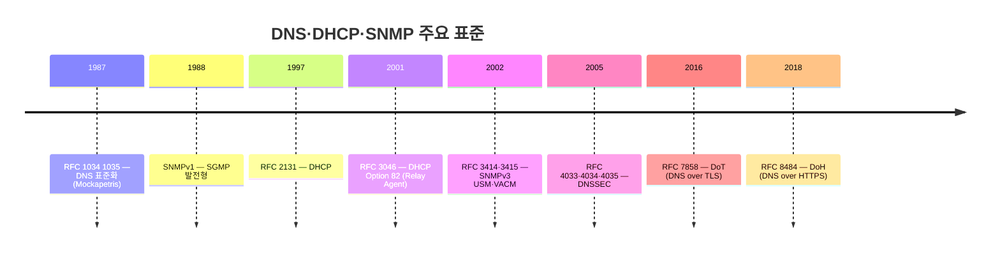
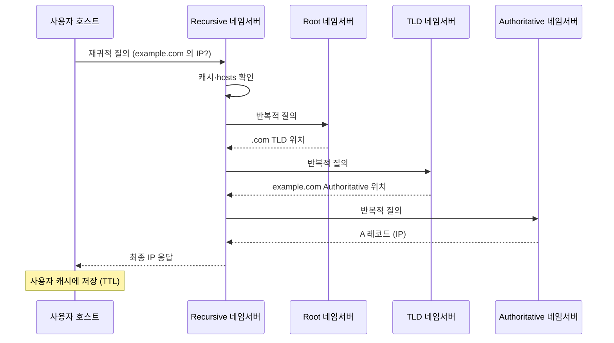
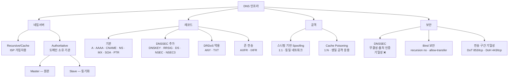
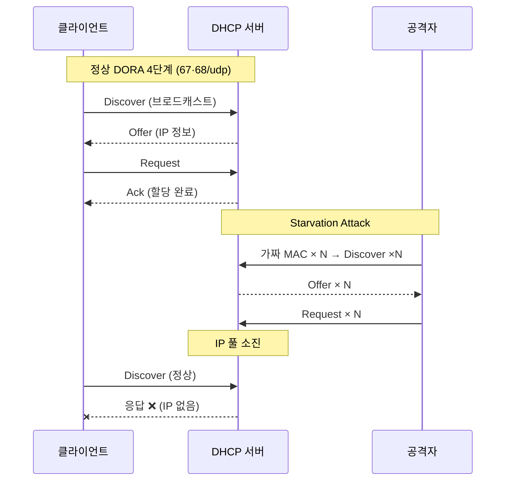
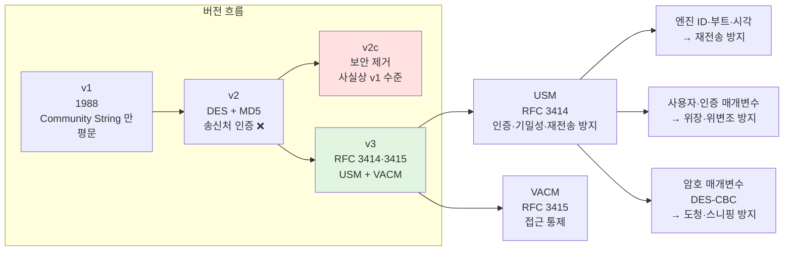

# 01. DNS·DHCP·SNMP — 만화책처럼 읽는 인터넷 기초 인프라

> **이 문서를 읽는 법**: 도메인을 입력하면 *어떻게 IP 가 돌아오는지*, IP 를 *누가 어떻게 나눠 주는지*, 네트워크 장비가 *어떻게 자기 상태를 보고하는지* — 이 세 인프라의 흐름을 시간 순 *에피소드*로 따라가면 보안 위협이 *왜* 거기에 생기는지 자연스럽게 외워집니다.
> 정확한 정의·수치·표준 번호는 정확본을 참조: [[cs/information-security/03.application-security/01.dns-dhcp-snmp|정확본 01. DNS·DHCP·SNMP]]

> **독자 가정**: *백엔드/풀스택 개발자, 인프라는 처음.* 그래서 이미 익숙한 개념(`/etc/hosts`, `dig`, `ipconfig`, 라우터 모니터링) 을 다리로 씁니다.

---

## 🎯 시작 전에 — 이미 쓰고 있는 인프라

개발하면서 매일 마주치는 것들이 사실 다 이 단원의 주인공입니다.

| 매일 보는 것 | 사실은 이 단원의 |
|---|---|
| 브라우저에 `example.com` 입력 → 페이지 로딩 | DNS 재귀적/반복적 질의 (53/udp) |
| `/etc/hosts` 에 추가한 한 줄 | DNS 질의보다 우선순위가 높은 로컬 매핑 |
| `dig +trace example.com` | 루트부터 단계별 위임 추적 |
| `ipconfig /flushdns` | 로컬 DNS 캐시 삭제 |
| 카페 Wi-Fi 잡으면 IP 가 자동 할당 | DHCP DORA 4단계 (67·68/udp) |
| MRTG 그래프 / 라우터 트래픽 모니터링 | SNMP Polling (Agent 161/udp) |
| 장비 장애 알람 | SNMP Trap (Manager 162/udp) |
| `public` / `private` Community String | SNMP v1·v2c 인증 |

> **이 단원의 본질**: 시험은 *인프라 동작*과 *보안 위협 — 그리고 위협이 어디서 왔는지*만 묻는다. 셋 다 *설계 시점에 보안을 고려하지 않은 평문 프로토콜*이라 위협 패턴이 닮아 있고, 그래서 한 묶음으로 외울 수 있다.

---

## 📖 에피소드 1 — 1987년: DNS 의 탄생

### 장면 1. 인터넷이 자랐다

1980년대, 인터넷이 작은 실험실 네트워크에서 *전 세계 분산 시스템*으로 자라고 있었다. 호스트가 늘어나자 *모든 호스트 이름과 IP 의 매핑을 적은 단일 파일* (HOSTS.TXT) 을 모두가 다운로드 받는 옛 방식은 무너지기 시작한다.

**Paul Mockapetris** 의 답: 이름 공간을 *계층 구조*로 나누고, 각 영역을 *위임된 서버*가 관리하게 하자. 1987년 11월, **RFC 1034·1035** 가 표준화된다.

### 장면 2. DNS 의 5가지 본성

DNS 는 분산·계층 구조의 데이터베이스다. 다섯 가지 본성이 *보안 문제의 모든 뿌리*가 된다.

| DNS 의 핵심 특성 | 의미 |
|---|---|
| **비연결** | UDP 기반. 클라이언트와 DNS 서버는 연결 상태를 유지하지 않는다 |
| **응답 특성** | *먼저 수신한 응답을 신뢰*하고 이후 응답은 모두 폐기 |
| **캐시 사용** | 반복 질의 부하를 줄이기 위해 결과를 일정 기간 캐시 |
| **TTL 유지** | 캐시 정보를 일정 시간 동안 유지하는 메커니즘 |
| **질의/응답 식별** | Transaction ID, 출발지/목적지 IP·Port 로 매칭 |

### 장면 3. 두 개의 포트

DNS 는 데이터 크기에 따라 *두 가지 전송 방식*을 쓴다.

| 데이터 크기·용도 | 프로토콜·포트 | 사용 사례 |
|---|---|---|
| 512 byte 이하 | **53/udp** | 일반 도메인 조회 |
| 512 byte 초과 | **53/tcp** | 응답 크기 초과 시 폴백 |
| **존 전송 (Zone Transfer)** | **53/tcp** | 마스터-슬레이브 동기화 (신뢰성 필요) |

> **시험 함정**: "**존 전송은 53/tcp**" — 거의 매 회차 빈출. UDP 가 아닌 이유는 *존 데이터의 신뢰성 있는 동기화*가 필요하기 때문.

### 시험 함정

- "DNS 의 응답 특성?" → *먼저 받은 응답 신뢰* + 이후 응답 폐기. → **DNS Spoofing 의 근본 원인**.
- "DNS 의 전송 계층?" → 보통 UDP, 단 *512 byte 초과·존 전송*은 TCP.

---

## 📖 에피소드 2 — 질의의 두 얼굴: 재귀적 vs 반복적

### 장면 1. 두 종류의 질의

DNS 질의는 *수행 주체와 책임*에 따라 두 가지로 나뉜다. 시험 빈출 변별점.

| 질의 방식 | 수행 주체 | 동작 | 특성 |
|---|---|---|---|
| **재귀적 (Recursive)** | 사용자 호스트 → Recursive 네임서버 | "결과를 *끝까지* 찾아서 알려줘" | 클라이언트는 한 번 요청, 최종 결과만 받음 |
| **반복적 (Iterative)** | Recursive 네임서버 → Authoritative 네임서버 | "네가 모르면 *다음 단계 정보만* 알려줘" | 단계별로 다음 네임서버를 안내받아 진행 |

### 장면 2. 6단계 질의 흐름

사용자가 도메인 입력 후 IP 가 돌아오기까지 — 6단계.

```
[1] 사용자 → 네임서버: "이 도메인의 IP 를 끝까지 찾아줘" (재귀적 질의)
[2] DNS Resolver: 캐시 확인 → hosts 파일 검색
[3] 둘 다 없으면 → 재귀 DNS 서버에 질의
[4] 재귀 DNS 서버: 다른 네임서버에 반복적 질의 → 결과 수집
[5] 사용자: 받은 IP 를 자신의 DNS 캐시에 저장
[6] 해당 IP 로 사이트 접속
```

### 장면 3. 윈도우 호스트의 이름 해석 우선순위

**윈도우 호스트가 도메인을 해석할 때 다음 순서로 검색한다**:

```
로컬 DNS 캐시 → hosts.ics → hosts 파일 → 시스템에 설정된 네임서버
```

`hosts.ics` 는 인터넷 연결 공유 (ICS, Internet Connection Sharing) 사용 시 클라이언트 IP 를 강제 지정하는 기능에 쓴다. 리눅스/유닉스에서는 `/etc/host.conf` 의 `order` 항목 순서로 결정.

> **시험 핵심**: "**hosts 파일은 DNS 질의보다 우선순위가 높다**" — DNS Spoofing 대응의 근거 (중요 사이트는 hosts 파일 등록).

### 시험 함정

- "Recursive 와 Iterative 의 *수행 주체*?" → 재귀적은 사용자→Recursive 서버, 반복적은 Recursive 서버→Authoritative 서버.
- "윈도우 이름 해석 우선순위?" → 캐시 → hosts.ics → hosts → 네임서버.

---

## 📖 에피소드 3 — 네임서버 구성: 두 분류 × 이중화

### 장면 1. 역할에 따른 두 분류

네임서버는 *역할*에 따라 두 종류로 나뉜다. 이 분류는 §5 Bind DNS 보안의 *전제 조건*이다.

| 네임서버 종류 | 역할 | 일반 사용처 |
|---|---|---|
| **Recursive/Cache 네임서버** | 관리·위임받은 도메인이 없고, 사용자 질의를 받아 캐시 또는 반복적 질의로 응답 | ISP 의 가입자용 DNS |
| **Authoritative 네임서버** | *위임받은 도메인*에만 응답 | 도메인 소유 기관의 자체 DNS |

### 장면 2. 이중화: Master / Slave

위 분류와 *직교하는* 이중화 개념. Authoritative 네임서버를 *고가용성*으로 운영하기 위한 구조다.

| 구분 | 역할 |
|---|---|
| **Master** | 원본 존 데이터 관리. 관리자가 직접 운용 |
| **Slave** | Master 로부터 존 데이터를 동기화. 부하 분산·이중화 |

### 장면 3. 리눅스 네임서버 설정 파일 4종

리눅스/유닉스에서 네임서버와 이름 해석에 관여하는 파일 4종.

| 파일 | 용도 |
|---|---|
| `/etc/named.conf` | 네임서버 설정. 존 설정 |
| `/etc/resolv.conf` | 시스템 기본 네임서버 설정 |
| `/etc/hosts` | 도메인/호스트명 ↔ IP 매핑 (네임서버 질의 *전*에 참조) |
| `/etc/host.conf` | DNS 질의 순서 지정 |

### 장면 4. hosts 파일이 무기가 되다 — 파밍 (Pharming)

`/etc/hosts` 는 DNS 질의보다 *우선*이라, *악성코드가 변조하면* 정상 도메인을 입력해도 공격자 사이트로 향한다 — **파밍 (Pharming)** 공격의 근거.

> **시험 함정**: "Recursive ↔ Authoritative ↔ Master ↔ Slave" — 두 차원 (역할·이중화) 의 *직교* 분류. Master/Slave 는 Authoritative 의 하위 개념.

---

## 📖 에피소드 4 — 존 파일과 리소스 레코드

### 장면 1. 존 (Zone) 의 정의

**존** = 네임서버가 관리하는 도메인 영역. **존 파일 (Zone File)** = 그 영역의 정보를 담은 파일. 네임서버 기동 시 이 파일을 읽어 존 데이터를 구성한다.

### 장면 2. 리소스 레코드의 5 필드

존 파일의 한 줄은 *5 필드 형식*을 따른다.

```
host_name [TTL] class record_type data

예시) www 300 IN A 192.168.56.100
     ns1     IN A 192.168.56.10
```

| 필드 | 설명 |
|---|---|
| `host_name` | 등록할 호스트명 |
| `TTL` | 레코드 TTL (미지정 시 default) |
| `class` | 인터넷 클래스 `IN` |
| `record_type` | A, AAAA, MX, NS 등 |
| `data` | 레코드 유형에 따른 데이터 |

### 장면 3. 리버스 존 — IP → 도메인

순방향 (도메인 → IP) 의 *반대 방향*. 리버스 존 파일은 **PTR 레코드**로 IP 주소에 대한 도메인 명을 설정한다. 메일 서버의 SPF 검증·로그 분석에 쓴다.

### 장면 4. 존 전송 (Zone Transfer)

> Master 의 원본 존 데이터를 Slave 가 동기화하는 작업.

신뢰성이 필요해 *53/tcp* 사용. 존 전송 자체가 악용되면 도메인의 *서버 정보가 통째로 노출*되거나 DoS 의 발판이 될 수 있어 §5-4 의 `allow-transfer` 제한이 필수다.

### 장면 5. DNS 캐시 명령

| 명령 | 용도 |
|---|---|
| `ipconfig /displaydns` | 로컬 DNS 캐시 정보 조회 (DNS Spoofing 시 조작된 주소 확인 가능) |
| `ipconfig /flushdns` | 로컬 DNS 캐시 정보 삭제 |

TTL 만료 시 캐시는 자동 삭제. 의심스러운 도메인 접속 시 `flushdns` 후 재접속 — DNS Spoofing 가능성을 점검하는 *1차 절차*.

---

## 📖 에피소드 5 — DNS 레코드 12종: 무엇이 DRDoS 무기가 되는가

### 장면. 12개의 레코드 타입

각 레코드는 *어떤 정보를 질의할지*의 식별자다. 시험은 *용도*와 *DRDoS 악용 가능성*을 묻는다.

| 레코드 | 풀이 | 용도 | 비고 |
|---|---|---|---|
| **A** | Address | 도메인 → IPv4 | 가장 기본 |
| **AAAA** | — | 도메인 → IPv6 | |
| **ANY** | — | 도메인의 *모든 레코드* 질의 | **DRDoS 악용** (응답 거대) |
| **MX** | Mail Exchanger | 도메인의 메일 서버 | |
| **NS** | Name Server | 도메인의 네임 서버 | |
| **SOA** | Start Of Authority | 존의 기본 속성 (버전·존 전송 주기) | 존 파일의 시작 |
| **TXT** | Text | 도메인의 텍스트 정보 | SPF·DKIM·DMARC 등록. **DRDoS 악용** |
| **PTR** | Pointer | IP → 도메인 (A 의 반대) | 리버스 존 |
| **CNAME** | Canonical Name | 호스트의 별명 (alias) | |
| **HINFO** | Host Information | 호스트의 CPU·OS 정보 | |
| **AXFR** | Authoritative Zone Transfer | 존 버전 무관 *무조건 존 전송* 요청 | |
| **IXFR** | Incremental Zone Transfer | 상위 버전일 경우만 *증분 존 전송* 요청 | |

### 왜 ANY·TXT 가 DRDoS 무기인가

> **이유**: 응답 패킷 크기가 질의 패킷 크기보다 *훨씬 크다*. 작은 질의 → 거대한 응답 = 증폭률 (Amplification Factor) 이 크다. 공격자는 *희생자 IP 로 출발지를 위조한 질의*를 다수 DNS 서버에 보내고, 응답이 희생자에게 쏟아진다 → [[cs/information-security/02.network-security/05.dos-ddos-drdos|정확본 02-05 DRDoS]] 와 cross-ref.

### 시험 함정

- "DRDoS 에 악용되는 DNS 레코드?" → **ANY · TXT**.
- "AXFR ↔ IXFR?" → AXFR 은 *전체 무조건*, IXFR 은 *증분*.
- "SOA 의 위치?" → 존 파일의 *시작* 레코드.

---

## 📖 에피소드 6 — DNS 도구 3총사: nslookup·dig·whois

### 장면 1. DNS Lookup 의 두 방향

> **DNS Lookup**: DNS 레코드를 조회할 때 사용하는 명령. 순방향 (forward, 도메인 → IP) 과 역방향 (reverse, IP → 도메인) 으로 구분.

### 장면 2. 3총사

| 도구 | 정체 |
|---|---|
| **nslookup** | 대화형 모드 또는 `nslookup [도메인] [네임서버]` 형식 |
| **dig** | nslookup 의 *대체* 목적. 유닉스/리눅스 기본 설치 |
| **whois** | whois 서버를 통해 *도메인 등록정보·네트워크 할당 정보* 조회 |

### 장면 3. dig 의 쿼리 옵션

`dig` 는 *위임 관계 점검의 표준 도구*다.

```
dig [@네임서버] 도메인 [쿼리유형] [쿼리옵션]
```

| 옵션 | 용도 |
|---|---|
| `+norecurse` | Authoritative 네임서버에 *반복적 질의*만 수행. 정상 응답 여부 점검 |
| `+tcp` | 53/tcp 허용 여부 점검 |
| `+trace` | *최상위 루트* 도메인부터 계층 구조 따라 추적. 위임 상태 점검 |

### 장면 4. whois 의 두 용도

```
whois [도메인 명]    # 도메인의 등록정보·소유정보·네임서버 정보
whois [IP 주소]      # 해당 IP 의 네트워크 대역을 관리하는 대행자 정보
```

### 시험 함정

- "DNS 위임 관계 점검 도구?" → `dig +trace`.
- "53/tcp 허용 점검?" → `dig +tcp`.
- "nslookup 대체 목적의 명령?" → `dig`.

---

## 📖 에피소드 7 — 스니핑 기반 DNS Spoofing: 1:1 공격

### 장면 1. 정의와 표적

> **스니핑 기반 DNS Spoofing**: 희생자에게 전달되는 DNS 응답을 조작하여 희생자가 의도하지 않은 주소로 접속하게 만드는 공격.

표적 = **희생자 1명** (클라이언트). 영향 범위 = 1:1.

### 장면 2. 공격이 작동하는 이유

DNS 의 *두 가지 본성*이 결합되어야 한다.

1. **비연결 (UDP)** — 응답을 가로챌 수 있다.
2. **먼저 수신한 응답 신뢰** — 정상 응답보다 빨리 보내면 이긴다.

### 장면 3. 6단계 공격 흐름

```
[1] 공격자: Promiscuous mode 또는 ARP Spoofing 으로 희생자 트래픽 스니핑
[2] 희생자: DNS 질의 수행 (Transaction ID 트래픽에 노출)
[3] 공격자: IP·Port 조작 + Transaction ID 설정
[4] 정상 응답보다 빠르게 → 조작된 응답 전송
[5] 정상 응답이 늦게 도착 → 폐기 (DNS 응답 특성)
[6] 희생자: 정상 주소를 입력해도 조작된 사이트로 접속
```

### 장면 4. 핵심 — *왜 빠른가*

일반적으로 *동일 네트워크 내*에서 발생하기 때문에, 멀리 떨어진 DNS 서버보다 공격자가 *물리적으로 가깝다* → 빠르게 조작 응답을 보낼 수 있다.

### 시험 함정

- "DNS Spoofing 의 표적?" → 희생자 (클라이언트).
- "공격이 작동하는 *DNS 본성 2가지*?" → UDP 비연결 + 먼저 받은 응답 신뢰.

---

## 📖 에피소드 8 — DNS Cache Poisoning: 1:N 공격

### 장면 1. 정의와 표적

> **DNS Cache Poisoning**: DNS 서버의 캐시 정보를 조작하여, 그 서버에 질의하는 *모든 사용자*가 의도하지 않은 주소로 접속하게 만드는 공격.

표적 = **DNS 서버 1대**. 영향 범위 = **1:N** (그 서버의 모든 사용자). TTL 만료까지 *지속*된다.

### 장면 2. 5단계 공격 흐름

```
[1] 공격자: 공격 대상 DNS 서버에 조작할 도메인 질의를 다수 전송
[2] 공격 대상 DNS 서버: 반복적 질의 시 사용하는 Transaction ID·출발지 Port 를
                       모르기 때문에 정보를 다수 생성하여 임의로 시도
[3] 공격 대상이 반복적 질의를 수행하는 동안
    공격자: 다수의 조작된 DNS 응답을 전송
[4] 정상 응답보다 먼저 일치하는 응답이 캐시에 저장
[5] 이를 질의하는 사용자: 조작된 사이트로 접속
```

### 장면 3. 생일 공격의 응용

**생일 공격 (Birthday Attack)** 응용 — 공격자가 *랜덤한 Transaction ID 를 다수 생성*해서 하나라도 정상 응답과 일치하길 노린다. 우리가 예상하는 확률보다 *실제 충돌 확률이 뜻밖에 높다*는 이론에 기반 ([[cs/information-security/04.security-general/06.hash-and-mac|정확본 04-06 §4-2 생일 공격]] cross-ref).

### 장면 4. 두 공격 1대1 비교

| 구분 | 스니핑 기반 Spoofing | Cache Poisoning |
|---|---|---|
| 공격 대상 | 희생자 (클라이언트) | DNS 서버 |
| 영향 범위 | 1:1 | 1:N |
| 공격 위치 | 동일 네트워크 (스니핑 가능 위치) | 원격 가능 |
| 핵심 기법 | *스니핑*으로 Transaction ID 획득 | Transaction ID *무차별 추측* |
| 지속성 | 1회성 | 캐시 TTL 동안 지속 |

> **시험 핵심**: "공격 대상" (희생자 vs DNS 서버) 과 "영향 범위" (1:1 vs 1:N) 가 시험 변별 핵심.

---

## 📖 에피소드 9 — 2005년: DNSSEC 의 등장

### 장면 1. 근본적 문제

DNS 응답을 *어떻게* 검증할까? 평문 UDP 응답에는 *서명도 인증서도 없다*.

### 장면 2. 2005년, IETF 의 답

**RFC 4033·4034·4035** (2005) — DNSSEC (DNS Security Extensions). *공개키 암호화 방식의 보안 기능을 추가 부여*.

### 장면 3. DNSSEC 가 *주는 것* / *안 주는 것*

| | DNSSEC | 비고 |
|---|---|---|
| **무결성** | ✅ | 응답 위변조 탐지 |
| **출처 인증** | ✅ | 정당한 네임서버에서 왔는지 검증 |
| **기밀성** | ❌ | 응답은 *여전히 평문* |

> **시험 함정 1순위**: "DNSSEC 은 기밀성을 제공하지 않는다." 무결성·출처 인증 ≠ 기밀성.

### 장면 4. 추가 레코드 5종

| 레코드 | 역할 |
|---|---|
| **DNSKEY** | 존이 사용하는 *공개키* 게시 |
| **RRSIG** | 각 RRset 에 대한 *디지털 서명값* |
| **DS** (Delegation Signer) | 부모 존에 자식 존의 KSK 해시 게시 → *신뢰 사슬* 형성 |
| **NSEC** | 도메인이 존재하지 않음을 *인증 가능*한 형태로 응답 |
| **NSEC3** | NSEC 의 해시 강화판 |

### 장면 5. 기밀성이 추가로 필요하면

DNSSEC 은 무결성·출처 인증만. *기밀성*이 필요하면 **DoH** 또는 **DoT** 를 함께 적용한다.

| 표준 | RFC | 포트 | 특성 |
|---|---|---|---|
| **DoT** (DNS over TLS) | RFC 7858 (2016) | **853/tcp** | 별도 포트 — 식별·차단 비교적 쉬움 |
| **DoH** (DNS over HTTPS) | RFC 8484 (2018) | **443/tcp** | HTTPS 트래픽과 구분 ❌ — 차단 회피에 유리 |

**상호 보완**: DNSSEC = 무결성·출처 인증 / DoH·DoT = *전송 구간 기밀성*. 둘은 직교한다.

---

## 📖 에피소드 10 — Bind DNS 운영 보안: 두 가지 설정

### 장면. /etc/named.conf 의 두 핵심 설정

도메인 네임서버 운영의 *가장 중요한 두 보안 설정* — **재귀적 질의 제한**과 **존 전송 제한**. 둘 다 `/etc/named.conf` 에 설정한다.

### 설정 1. 재귀적 질의 제한

악의적 공격자의 과도한 재귀적 질의 요청은 *DoS 의 무기*가 되며, *DNS Cache Poisoning 노출*을 키운다. 그래서 도메인 관리용 (Authoritative) DNS 서버는 *재귀적 질의를 허용하지 않도록* 설정한다.

```
recursion no;                                    // 재귀적 질의 차단
allow-recursion {none;};                         // 재귀적 질의 차단
allow-recursion {127.0.0.1; 192.168.56.0/24;};   // 제한적 허용
allow-recursion {internal;};                     // acl 명으로 제한적 허용
```

### 설정 2. 존 전송 제한

존 전송이 지속 요청되면 *네트워크·시스템 자원 소모* + *서버 정보 노출*. Master 만 운영하면 *전송 차단*, Master·Slave 환경은 *지정한 Slave 만 허용*.

```
allow-transfer {none;};            // 존 전송 차단
allow-transfer {[Slave IP];};      // Slave 만 허용
```

`dig` 의 `axfr` / `ixfr` 질의 유형으로 존 전송 허용 여부를 *테스트*할 수 있다.

### 시험 함정

- "재귀적 질의 차단 지시자?" → `recursion no;` 또는 `allow-recursion {none;};`.
- "존 전송 허용 지시자?" → `allow-transfer`.
- "DoH·DoT 와 DNSSEC 의 관계?" → *상호 보완* (직교). 둘 다 적용 가능.

---

## 📖 에피소드 11 — DHCP DORA: IP 가 자동으로 오는 4단계

### 장면 1. 정의와 포트

> **DHCP (Dynamic Host Configuration Protocol)**: 동적으로 클라이언트의 네트워크 주소를 설정하기 위한 프로토콜. **RFC 2131** 정의.

| 구분 | 포트 |
|---|---|
| DHCP 서버 | **67/udp** |
| DHCP 클라이언트 | **68/udp** |

### 장면 2. DORA 4단계

DHCP 의 IP 할당은 **DORA** 4단계로 표현된다.

| 단계 | 메시지 | 동작 |
|---|---|---|
| 1 | **D**iscover | 클라이언트가 DHCP 서버를 찾는 메시지. *MAC 정보 담아 브로드캐스트* |
| 2 | **O**ffer | 서버 → 클라이언트: IP 정보 제공 |
| 3 | **R**equest | 클라이언트 → 서버: 해당 IP 사용 요청 |
| 4 | **A**ck | 서버 → 클라이언트: 할당 완료 + 테이블 저장 |

### 장면 3. 브로드캐스트의 정체

DHCP Discover 는 *IP 계층에서* `255.255.255.255`, *MAC 계층에서* `FF:FF:FF:FF:FF:FF` 로 전송된다. 클라이언트는 아직 IP 가 없기 때문에 *모두에게 외친다*.

### 장면 4. IP 갱신 명령

| 명령 | 동작 |
|---|---|
| `ipconfig /release` | 할당받은 IP 해제 |
| `ipconfig /renew` | DHCP 서버로부터 새 IP 받음 |

### 장면 5. DHCP Starvation Attack — *서로 다른 MAC 으로 가장*

> **DHCP Starvation Attack**: DHCP 서버의 할당 가능한 IP 를 모두 소진시켜 정상 클라이언트의 IP 할당을 불가능하게 만드는 공격.

```
[1] 공격자: 서로 다른 MAC 주소로 Discover 메시지 대량 전송
[2] DHCP 서버: 가짜 클라이언트들에게 Offer 전송
[3] 공격자: Request 까지 보내고 실제 사용은 ❌
[4] 서버 IP 풀 소진 → 정상 클라이언트는 IP 받지 못함
```

본질은 *서로 다른 MAC 으로 가장한 다수의 가짜 클라이언트*가 IP 를 점유하는 *자원 소진 (Resource Exhaustion)* 공격 — [[cs/information-security/02.network-security/05.dos-ddos-drdos|정확본 02-05 DoS]] 와 패턴 동일.

### 시험 함정

- "DHCP 서버·클라이언트 포트?" → 67/udp · 68/udp.
- "DORA 의 1단계가 *어떻게* 전송?" → 브로드캐스트 (MAC 정보 담아).
- "Starvation 의 본질?" → 자원 소진 + 가짜 MAC 다수.

---

## 📖 에피소드 12 — DHCP 보안: Snooping·Port Security·Option 82

### 장면. 가짜를 어떻게 막을까

DHCP Starvation 과 *Rogue DHCP 서버* (가짜 DHCP 서버) 를 막는 4가지 대응책.

| 대응 | 동작 |
|---|---|
| **DHCP Snooping** | 스위치 단에서 *신뢰할 수 있는 (trusted) 포트*만 DHCP Offer/Ack 송신 허용. Rogue DHCP 서버 차단 |
| **Port Security** | 스위치 포트당 학습되는 *MAC 개수 제한*. 가짜 MAC 대량 생성 차단 |
| **DHCP Option 82** (Relay Agent) | RFC 3046. DHCP 릴레이 에이전트가 요청 패킷에 *자신의 식별 정보 (Circuit ID·Remote ID)* 를 추가 → 서버가 *요청의 출처를 검증* 가능 |
| **고정 IP 운영** | 중요 서버는 DHCP 가 아닌 *정적 할당* |

### 어떤 조합이 *일반 운영 환경*에서 표준인가

> **DHCP Snooping + Port Security** 조합이 가장 일반적인 *기업 LAN 환경* 표준. **Option 82** 는 *ISP·대규모 사업자 환경*에서 사용된다.

### 시험 함정

- "Rogue DHCP 서버 차단?" → DHCP Snooping.
- "MAC 대량 생성 차단?" → Port Security.
- "Option 82 의 RFC?" → **RFC 3046**.

---

## 📖 에피소드 13 — SNMP: 네트워크의 자가보고 시스템

### 장면 1. 정의

> **SNMP (Simple Network Management Protocol)**: 네트워크상의 각 호스트로부터 정기적으로 관리 정보를 *자동 수집*하거나 실시간으로 상태를 *모니터링·설정*할 수 있는 서비스.

응용 계층 프로토콜. 메시지가 단순 요청·응답이라 *전송 계층은 UDP*. SNMP 는 프로토콜일 뿐, 실제 모니터링은 별도 프로그램 (예: **MRTG — Multiple Router Traffic Grapher**) 이 담당.

### 장면 2. NMS 구조 — Manager·Agent

> **NMS (Network Management System)**: 네트워크 자원을 모니터링·제어하는 도구. *Manager — Agent* 구조.

| 구성 | 역할 | 포트 |
|---|---|---|
| **Manager** | Agent 에 정보 요청 | **162/udp** (Trap 수신) |
| **Agent** | 관리 대상 시스템에 설치. 정보 수집·전달 | **161/udp** (Get/Set 수신) |

**최소 일치 사항** — Manager 와 Agent 가 통신하려면 *3가지*가 일치해야:

| 항목 | 의미 |
|---|---|
| **SNMP 버전** | v1·v2·v3 일치 |
| **Community String** | 상호 설정한 패스워드 일치 |
| **PDU** (Protocol Data Unit) | 메시지 유형 일치 |

### 장면 3. 두 가지 데이터 수집 방식

| 방식 | 동작 | 사용 포트 | 특성 |
|---|---|---|---|
| **Polling** | Manager → Agent 요청, Agent 응답 | Agent 161/udp | 주기적 상태 변화 |
| **Event-Reporting** | Agent → Manager *비동기* 알림 | Manager 162/udp | **Trap 메시지** 사용. Polling 보다 빠른 사건 통지 |

### 장면 4. PDU 7종

| PDU | 방향 | 용도 |
|---|---|---|
| **Get Request** | M → A | 객체의 특정 정보 요청 |
| **Get Next Request** | M → A | 다음 정보 요청 |
| **Set Request** | M → A | 값 설정 |
| **Get Response** | A → M | 변수값 전송 |
| **Trap** | A → M | *비동기*로 알림. 유일하게 비동기 |
| **Get Bulk Request** | M → A | (v2 추가) 객체 *범위* 한 번에 요청 |
| **Inform Request** | M ↔ M | (v2 추가) 관리시스템 간 정보 전달 |

### 장면 5. 데이터 모델 — MIB·SMI

SNMP 가 관리하는 정보는 *객체 (Object)* 라 부른다. 객체의 *집합·구조·식별 방식*은 두 표준이 정의.

| 모델 | 설명 |
|---|---|
| **MIB** (Management Information Base) | 관리 객체의 *집합*. *트리 구조*로 구성, **OID (Object Identifier)** 로 식별 |
| **SMI** (Structure of Management Information) | MIB 의 구조·포맷. **ASN.1** (Abstract Syntax Notation One) 언어 사용 |

SMI 가 정의하는 객체의 *3 요소*:

| 요소 | 설명 |
|---|---|
| **name** (OID) | 객체 식별자 |
| **syntax** | 객체의 데이터 유형 |
| **encoding** | 메시지 전송 시 비트 변환 규칙. **BER (Basic Encoding Rules)** |

### 장면 6. Community String — SNMP 의 패스워드

> **Community String**: SNMP 데몬과 클라이언트가 데이터 교환 *전 인증*을 위해 사용하는 일종의 패스워드.

| 권고 | 이유 |
|---|---|
| **초기값 변경** | `public` / `private` 가 그대로면 *패스워드 미사용보다 위험* |
| **RW 자제** | RO·RW 두 모드 — *RW 는 가급적 사용 자제* (쓰기 권한 → 설정 변조) |

### 장면 7. SNMP 버전: v1 → v2 → v2c → v3

| 버전 | 보안 |
|---|---|
| **SNMPv1** | 없음. Community String 만. *평문* — 스니핑 취약 (1988년 SGMP 발전형) |
| **SNMPv2** | 암호화 (DES) + 해시 (MD5) 추가. *송신처 인증 ❌* |
| **SNMPv2c** | v2 의 *복잡한 보안 기능을 제거*한 버전 — 사실상 v1 수준. 가장 많이 쓰임 |
| **SNMPv3** | 데이터 인증·암호·재사용 방지·세분화된 접근통제. *계정·암호 인증* |

> **시험 함정 1순위**: "SNMPv2c 는 v1 수준 보안" — 버전 번호와 보안 강도가 *비례하지 않는다*.

### 장면 8. SNMPv3 의 두 보안 모델

| 보안 모델 | 약자 | RFC | 제공 서비스 |
|---|---|---|---|
| **사용자 기반 보안 모델** | **USM** (User-based Security Model) | RFC 3414 | 재전송 공격 방지 / 위·변조 방지 / 스니핑 방지 |
| **뷰 기반 접근 통제 모델** | **VACM** (View-based Access Control Model) | RFC 3415 | 인가된 사용자의 MIB 접근 통제 |

USM 의 보안 매개변수 (`msgSecurityParameter`) 는 *3가지 위협*에 대응:

| 매개변수 | 보호 대상 |
|---|---|
| Authoritative 엔진 ID·엔진 부트 횟수·엔진 시각 | 재전송 (Replay) 방지 |
| 사용자·인증 매개변수 | 위장·메시지 위변조 방지 |
| 암호 매개변수 (DES-CBC 등) | 도청·스니핑·정보 노출 방지 |

> **시험 핵심**: "**USM = 인증·기밀성·재사용 방지 / VACM = 접근통제**" 의 *역할 분리*. 두 모델은 직교 — 함께 사용. RFC 7860 으로 HMAC-SHA-2 인증 프로토콜이 추가되었다.

---

## 📑 종합 비교 (에피소드 7·8·9·11·13 정리)

위협·대응을 *한 표*로.

| 위협 | 대상 | 영향 | 1차 대응 |
|---|---|---|---|
| **스니핑 기반 DNS Spoofing** | 희생자 (클라이언트) | 1:1 | 스니핑 탐지·차단, hosts 파일 관리 |
| **DNS Cache Poisoning** | DNS 서버 | 1:N | DNSSEC, `recursion no`, 사용자 제한, 최신 Bind |
| **DNS DRDoS (ANY·TXT 증폭)** | 외부 희생자 | 다대일 | 재귀적 질의 제한, 응답 크기 제한 |
| **DHCP Starvation** | DHCP 서버 | LAN 전체 | DHCP Snooping, Port Security |
| **Rogue DHCP** | DHCP 클라이언트들 | LAN 전체 | DHCP Snooping (trusted port) |
| **SNMP Community 노출** | 관리 대상 장비 | 인프라 전체 | 초기값 변경, RW 자제, v3 USM |

> **읽는 법**: *대상*과 *영향 범위*가 위협 분류의 핵심. 시험은 "1:1 vs 1:N" 을 거의 매번 묻는다.

---

## 🗺️ 마인드맵 1 — 시간선



**읽는 법**: 1987 의 DNS 가 *보안 없이* 표준화 → 18년 뒤 (2005) DNSSEC 으로 무결성·출처 인증 추가 → 11~13년 뒤 (2016·2018) 기밀성 추가. *보안은 항상 기능 표준 뒤에 따라온다*.

---

## 🗺️ 마인드맵 2 — DNS 질의 흐름



**읽는 법**: 사용자는 *한 번* 질의 (재귀적) → Recursive 서버가 루트→TLD→Authoritative 를 *단계별* (반복적) 로 추적. DNS Cache Poisoning 은 *Recursive 서버의 캐시*를 노린다.

---

## 🗺️ 마인드맵 3 — DNS 분류 트리



---

## 🗺️ 마인드맵 4 — DHCP DORA + Starvation



---

## 🗺️ 마인드맵 5 — SNMP 보안 모델



---

## 🗂️ 키워드 클러스터

### RFC 묶음

```
DNS 기본       — RFC 1034 (개념·기능) · RFC 1035 (구현·명세)
DNSSEC         — RFC 4033 (소개·요구) · RFC 4034 (리소스 레코드) · RFC 4035 (프로토콜)
DNS 전송 보안  — RFC 7858 (DoT) · RFC 8484 (DoH)
DHCP           — RFC 2131 (DHCP) · RFC 3046 (Option 82)
SNMPv3         — RFC 3414 (USM) · RFC 3415 (VACM) · RFC 7860 (HMAC-SHA-2)
```

### 포트 묶음

```
DNS    — 53/udp (≤512 byte) · 53/tcp (>512 byte, 존 전송)
DHCP   — 67/udp (서버) · 68/udp (클라이언트)
SNMP   — 161/udp (Agent · Get/Set) · 162/udp (Manager · Trap)
DoT    — 853/tcp
DoH    — 443/tcp (HTTPS 와 동일)
```

### "1:N" 가족 — 영향 범위가 다른 위협들

| 위협 | 표적 | 1:N 의 의미 |
|---|---|---|
| DNS Cache Poisoning | DNS 서버 | 그 서버 사용자 모두 |
| DRDoS (ANY·TXT) | 다수 DNS → 1 희생자 | 다대일 증폭 |
| DHCP Starvation | DHCP 서버 | LAN 전체 클라이언트 |
| Rogue DHCP | 클라이언트들 | LAN 전체가 가짜 게이트웨이로 |

### 자주 헷갈리는 약자

| 약자 | 풀이 | 영역 |
|---|---|---|
| **SOA** | Start Of Authority | DNS 존의 시작 레코드 |
| **DS** | Delegation Signer | DNSSEC 부모-자식 신뢰 사슬 |
| **AXFR / IXFR** | (Incremental) Zone Transfer | 존 전송 (전체 / 증분) |
| **DORA** | Discover-Offer-Request-Ack | DHCP 4단계 |
| **MIB / SMI** | Management Information Base / Structure | SNMP 데이터 모델 |
| **USM / VACM** | User-based Security Model / View-based Access Control | SNMPv3 두 모델 |
| **OID** | Object Identifier | MIB 트리 식별자 |
| **BER / ASN.1** | Basic Encoding Rules / Abstract Syntax Notation One | SNMP 인코딩·언어 |

---

## 🃏 회상 30문항

> 답을 가린 뒤 자가 채점. 틀린 것만 정확본으로 깊이 학습.

**A. DNS 동작 (1~7)**
1. DNS 의 5가지 핵심 특성?
2. 53/udp 와 53/tcp 가 *언제* 쓰이는가?
3. 재귀적 vs 반복적 질의 — *수행 주체*는?
4. 윈도우 호스트의 이름 해석 우선순위 4단계?
5. Recursive ↔ Authoritative 네임서버 — *역할*?
6. Master/Slave 와 위 분류의 *직교성*?
7. 리눅스 네임서버 설정 파일 4종?

**B. DNS 레코드·도구 (8~13)**
8. DRDoS 에 악용되는 DNS 레코드 *2종*?
9. AXFR ↔ IXFR — 차이?
10. SOA 의 위치는?
11. `dig +trace` 의 용도?
12. `dig +norecurse` 의 용도?
13. `whois` 의 *두 가지* 용도?

**C. DNS 공격·보안 (14~20)**
14. 스니핑 기반 Spoofing 과 Cache Poisoning 의 *대상·영향 범위*?
15. DNS Spoofing 이 작동하는 *DNS 본성 2가지*?
16. 생일 공격은 *어디서* 등장하는가?
17. DNSSEC 가 *제공하는 것 2가지*와 *제공하지 않는 것 1가지*?
18. DNSSEC 의 추가 레코드 5종?
19. Bind DNS 두 가지 핵심 보안 설정?
20. DoT ↔ DoH — RFC·포트?

**D. DHCP (21~25)**
21. DHCP 서버·클라이언트 포트?
22. DORA 4단계?
23. DHCP Discover 가 *어떻게* 전송되는가?
24. DHCP Starvation 의 본질?
25. DHCP Snooping 과 Port Security 의 역할 분리?

**E. SNMP (26~30)**
26. Manager·Agent 의 포트?
27. SNMP 통신의 최소 일치 *3가지*?
28. PDU 중 *비동기* 메시지는?
29. SNMPv2c 가 v1 수준 보안인 이유?
30. USM 과 VACM 의 *제공 서비스 분리*?

---

## ⚠️ 시험 함정 모음

| 함정 | 정답 |
|---|---|
| DNSSEC 이 *기밀성*도 제공? | ❌. 무결성·출처 인증만 |
| 존 전송 포트? | **53/tcp** |
| DNS 응답 매칭 식별자? | Transaction ID + 출발지/목적지 IP·Port |
| hosts 파일과 DNS 의 우선순위? | hosts 파일이 *우선* |
| Cache Poisoning 의 영향 범위? | 1:N (서버에 질의하는 모든 사용자) |
| DRDoS 악용 DNS 레코드? | ANY · TXT |
| `recursion no;` 의 효과? | 재귀적 질의 차단 — Authoritative 서버에 권장 |
| DoH 와 DoT — *차단 회피*에 유리한 쪽? | DoH (HTTPS 와 구분 ❌) |
| DoH·DoT 와 DNSSEC 의 관계? | *상호 보완* (직교) |
| DHCP Discover 의 전송 방식? | 브로드캐스트 (IP `255.255.255.255` / MAC `FF:FF:FF:FF:FF:FF`) |
| DHCP Starvation 의 본질? | 가짜 MAC 으로 IP 풀 소진 |
| Rogue DHCP 차단? | DHCP Snooping (trusted port) |
| Manager·Agent 포트? | 162/udp · 161/udp |
| SNMP 통신 최소 일치? | 버전 + Community String + PDU |
| 비동기 PDU? | **Trap** |
| SNMPv2c 보안 수준? | 사실상 v1 수준 |
| USM ↔ VACM? | USM = 인증·기밀·재전송 방지 / VACM = 접근통제 |
| Community 초기값 위험? | 기본값 사용은 *패스워드 미사용보다 위험* |

---

## 🔗 정확본 매핑표

| 본 노트 에피소드 | 정확본 § |
|---|---|
| 에피소드 1 (DNS 본성·포트) | [[cs/information-security/03.application-security/01.dns-dhcp-snmp#1. DNS 개요와 동작 원리\|정확본 §1]] |
| 에피소드 2 (재귀·반복 질의) | [[cs/information-security/03.application-security/01.dns-dhcp-snmp#1-3. DNS 질의 과정\|정확본 §1-3·§1-4]] |
| 에피소드 3 (네임서버 구성) | [[cs/information-security/03.application-security/01.dns-dhcp-snmp#2-1. 네임서버의 종류\|정확본 §2-1·§2-2]] |
| 에피소드 4 (존 파일·캐시 명령) | [[cs/information-security/03.application-security/01.dns-dhcp-snmp#2-3. 존(Zone) 데이터와 존 파일\|정확본 §2-3·§2-4·§2-5]] |
| 에피소드 5 (12종 레코드·DRDoS) | [[cs/information-security/03.application-security/01.dns-dhcp-snmp#3. DNS 레코드 타입\|정확본 §3]] |
| 에피소드 6 (nslookup·dig·whois) | [[cs/information-security/03.application-security/01.dns-dhcp-snmp#2-6. DNS 도구\|정확본 §2-6]] |
| 에피소드 7 (스니핑 기반 Spoofing) | [[cs/information-security/03.application-security/01.dns-dhcp-snmp#4-1. 스니핑 기반 DNS Spoofing\|정확본 §4-1]] |
| 에피소드 8 (Cache Poisoning) | [[cs/information-security/03.application-security/01.dns-dhcp-snmp#4-2. DNS Cache Poisoning\|정확본 §4-2·§4-3]] |
| 에피소드 9 (DNSSEC + DoH·DoT) | [[cs/information-security/03.application-security/01.dns-dhcp-snmp#5-3. DNSSEC (DNS Security Extensions)\|정확본 §5-3·§5-5]] |
| 에피소드 10 (Bind 보안) | [[cs/information-security/03.application-security/01.dns-dhcp-snmp#5-4. Bind DNS 보안\|정확본 §5-4]] |
| 에피소드 11 (DHCP DORA·Starvation) | [[cs/information-security/03.application-security/01.dns-dhcp-snmp#6. DHCP (보강)\|정확본 §6-1·§6-2]] |
| 에피소드 12 (DHCP 보안) | [[cs/information-security/03.application-security/01.dns-dhcp-snmp#6-3. DHCP 보안 (외부 보강)\|정확본 §6-3]] |
| 에피소드 13 (SNMP 전체) | [[cs/information-security/03.application-security/01.dns-dhcp-snmp#7. SNMP (보강)\|정확본 §7]] |

---

## 📅 학습 흐름 (8주차 시험 대비 기준)

```
[1주]   에피소드 1~2 (DNS 본성·질의) — 만화책 한 번 통독
[2주]   에피소드 3~6 (구성·레코드·도구) — 도구 직접 실행
[3주]   에피소드 7·8 (Spoofing·Cache Poisoning) — 1:1 vs 1:N 비교표 외움
[4주]   에피소드 9·10 (DNSSEC·Bind 보안) — `recursion no` / `allow-transfer` 외움
[5주]   에피소드 11·12 (DHCP) — DORA + Snooping·Port Security 조합
[6주]   에피소드 13 (SNMP) — v1·v2·v2c·v3 / USM·VACM 분리
[7주]   마인드맵 5장 통합 + 회상 30문항
[8주]   함정 모음 매일 1회 + 정확본 1회 정독
```

---

> **다음 단원**: [[cs/information-security/03.application-security/02.ftp-security|02. FTP 보안]] — 본 단원 §1 의 *평문 프로토콜·UDP 비연결* 패턴이 02 단원의 *제어 채널·데이터 채널 분리*와 직접 연결.
