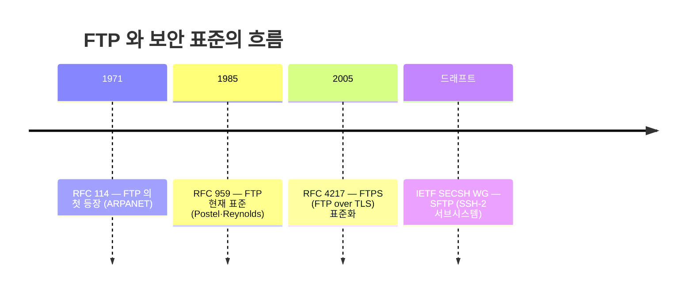
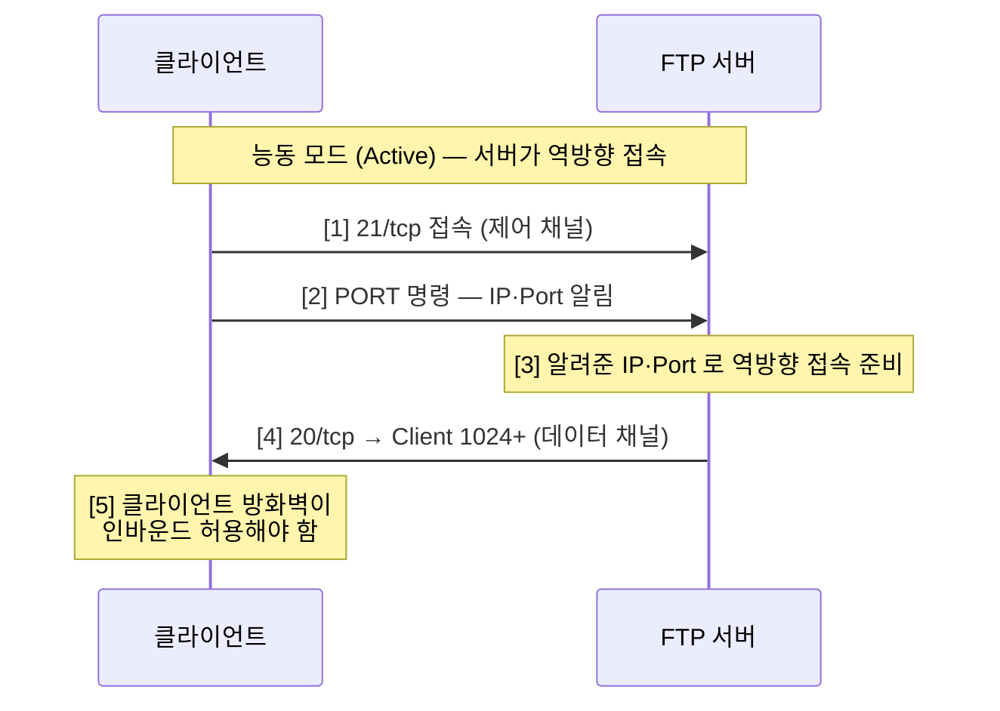
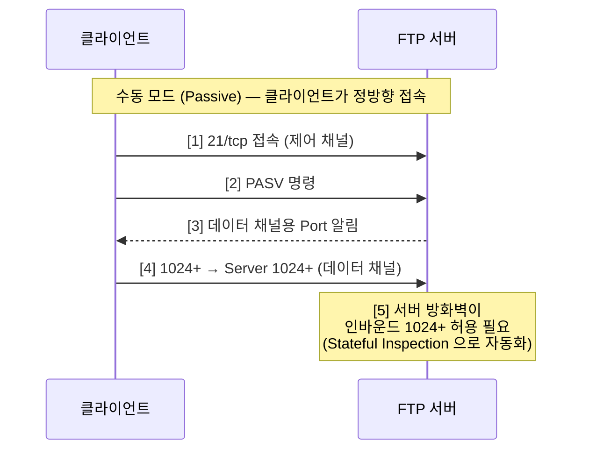
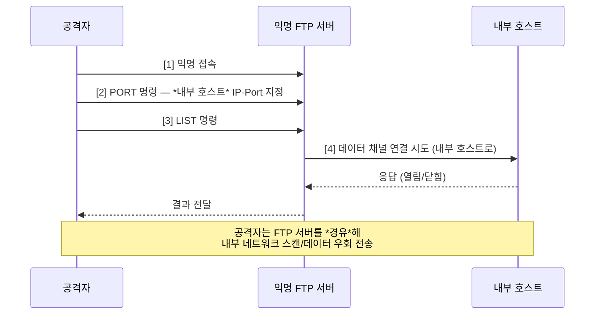
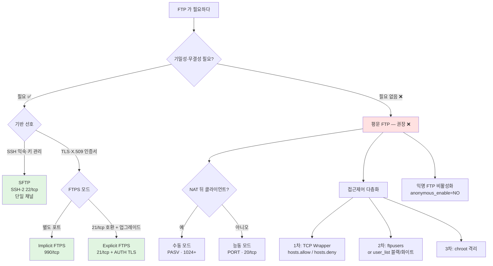

# 02. FTP 보안 — 만화책처럼 읽는 두 채널의 비밀

> **이 문서를 읽는 법**: FTP 가 *왜 두 개의 TCP 연결을 쓰는지*, 그게 *왜 능동/수동 두 모드*로 갈라졌는지, 그리고 *왜 그 분리가 결국 Bounce Attack 의 무기*가 되는지 — 시간 순으로 따라가면 모든 시험 함정이 자연스럽게 풀립니다.
> 정확한 정의·수치·표준 번호는 정확본을 참조: [[cs/information-security/03.application-security/02.ftp-security|정확본 02. FTP 보안]]

> **독자 가정**: *백엔드/풀스택 개발자, 인프라는 처음.* 이미 익숙한 도구 (`scp`, `rsync`, `git push`, FTP 클라이언트 GUI, NAT 환경) 를 다리로 씁니다.

---

## 🎯 시작 전에 — 이미 쓰고 있는 파일 전송

개발하면서 마주치는 *모든 파일 전송*은 사실 이 단원의 후예입니다.

| 매일 보는 것 | 사실은 이 단원의 |
|---|---|
| `scp file user@server:/path/` | SSH 기반 **파일 복사 *명령*** (`scp`). **SFTP 프로토콜·FTP·FTPS** 와는 이름·계층이 다르다 — **시험에서는 네 용어를 구분**. 포트는 보통 **22/tcp** (SSH 공유). *(OpenSSH 는 `scp` 가 내부적으로 SFTP 를 쓰는 경우가 많아도, 용어·객관식에서는 SCP ≠ SFTP 로 본다.)* |
| FTP 클라이언트의 "Active / Passive" 토글 | FTP 능동/수동 모드 |
| 회사 NAT 뒤 FTP 접속이 안 됨 | 능동 모드 + 클라이언트 방화벽 충돌 |
| 라우터에 펌웨어 백업 | TFTP (69/udp) |
| 익명으로 다운로드 가능한 미러 사이트 | 익명 FTP 서비스 (`anonymous`) |
| `/etc/hosts.allow` · `hosts.deny` | **TCP Wrapper** IP 제어 (`hosts.allow`/`hosts.deny`). vsFTP 에서 **`tcp_wrappers=YES`** 이고 **libwrap(TCP Wrapper) 연동 빌드**일 때 적용 *(구현·빌드에 따라 다름 — 시험은 **두 파일 이름·역할** 위주)* |
| `AUTH TLS` 응답이 보이는 21/tcp 세션 | Explicit FTPS |

> **이 단원의 본질**: FTP 의 *모든 시험 포인트*는 *두 채널 분리*에서 파생된다. 채널이 둘이라 → 모드가 둘로 나뉘고 → 모드마다 방화벽 부담이 바뀌고 → 데이터 채널 목적지 미검증이 Bounce Attack 의 무기가 된다. 한 줄로 외우면 끝.

---

## 📖 에피소드 1 — 1971·1985년: FTP 의 탄생과 정착

### 장면 1. 1971년, ARPANET 시절

인터넷의 조상 ARPANET 에서 *파일을 호스트 간에 옮기는 표준*이 필요했다. **RFC 114** (1971) — FTP 의 첫 등장. 단순한 목적이었지만 이때 이미 *두 채널 분리* 설계가 들어간다.

### 장면 2. 1985년, 현재 표준의 정착

**Jon Postel** 과 **Joyce Reynolds** 의 손으로 **RFC 959** (1985.10) 가 발표된다. 지금까지도 *FTP 의 정식 표준*. 두 채널 분리 구조는 그대로 유지된다.

### 장면 3. FTP 의 정의

> **FTP (File Transfer Protocol)**: TCP/IP 기반의 서버와 클라이언트 사이에 파일 전송을 위한 통신 프로토콜.

### 장면 4. 두 채널이라는 정체성

FTP 가 다른 응용 계층 프로토콜과 *결정적으로 다른 점*: **별도의 두 TCP 연결**을 쓴다.

| 채널 | 용도 | 일반 포트 |
|---|---|---|
| **제어 채널 (Control Channel)** | 명령·응답 송수신 (`USER`, `PASS`, `LIST`, `PORT`, `PASV` 등) | **21/tcp** |
| **데이터 채널 (Data Channel)** | 실제 파일 데이터 송수신 | 능동: **20/tcp** / 수동: 1024 이상 임의 포트 |

### 시험 함정

- "FTP 는 한 TCP 연결?" → ❌. *두 개*.
- "FTP 의 표준 RFC?" → **RFC 959** (현재). RFC 114 는 *최초* 등장.

---

## 📖 에피소드 2 — 평문이라는 한계

### 장면. 자격 증명이 *그대로* 흐른다

FTP 서비스는 기본적으로 **평문 송수신**. ID 와 패스워드도 평문으로 흐른다. *간단한 스니퍼*에 의해서도 자격 증명이 쉽게 노출된다.

### 운영 방침

| 권고 | 이유 |
|---|---|
| 반드시 필요한 경우를 *제외하고는 사용하지 않음* | 평문이라 위험 |
| 사용해야 하면 **SFTP·FTPS** 로 대체 | §5 의 암호화 FTP |

> **시험 포인트**: "FTP 는 평문" + "제어·데이터 두 채널 분리" — 이 *두 특성*을 묶어서 외운다. 이 둘이 *모든 공격의 전제*다.

### 시험 함정

- "FTP 가 안전한 프로토콜?" → ❌. 평문.
- "근본 대안?" → SFTP (SSH 기반) 또는 FTPS (TLS 기반).

---

## 📖 에피소드 3 — 능동 모드: 서버가 *역방향*으로 접속한다

### 장면 1. 정의

> **능동 모드 (Active Mode)**: 서버가 클라이언트에게 데이터 연결을 *역방향*으로 요청하는 방식. 클라이언트가 데이터 채널 포트 번호를 지정한다.

### 장면 2. 채널 방향

| 채널 | 연결 방향 |
|---|---|
| 제어 채널 | Client *1024+* → Server **21/tcp** |
| 데이터 채널 | Server **20/tcp** → Client *1024+* |

### 장면 3. 5단계 동작

```
[1] 클라이언트: FTP 서버의 21/tcp 로 접속
[2] 제어 채널 생성 (PORT 명령)
[3] 클라이언트가 서버에게 → 데이터 채널 생성용 IP·Port 알림
[4] 서버: 클라이언트가 알려준 IP·Port 로 *역방향* 접속
[5] 데이터 채널 생성
```

### 장면 4. *왜* "능동" 인가 — 함정 1순위

이름의 함정: "능동" 이지만 *서버가 능동적으로* 데이터 채널을 만든다 (서버가 클라이언트에게 *접속*). 클라이언트는 *받기만* 한다.

### 시험 함정

- "능동 모드의 데이터 채널 *연결 주체*?" → **서버**.
- "능동 모드의 명령?" → **`PORT`**.
- "능동 모드의 서버 데이터 포트?" → **20/tcp**.

---

## 📖 에피소드 4 — 능동 모드의 문제: 클라이언트 방화벽

### 장면. 클라이언트 입장에서는 *외부에서 들어오는 인바운드*

클라이언트에 방화벽이 설치되어 있어 *원격 FTP 서버에서 클라이언트로의 접속*을 허용하지 않으면 데이터 채널 접속이 *불가능*하다. 데이터를 받을 수 없다.

NAT·방화벽 환경에서 *외부에서 자신을 향해 들어오는 인바운드 연결*이 발생하므로 능동 모드는 자주 차단된다.

### 두 가지 대응

| 대응 | 동작 |
|---|---|
| 클라이언트 방화벽 설정 | 원격 FTP 서버의 접속을 허용 |
| **수동 모드 사용** | 클라이언트에서 수동 모드로 원격 서버에 접속 |

### 시험 함정

- "능동 모드의 *방화벽 부담* 측은?" → 클라이언트.
- "NAT 뒤 클라이언트가 자주 쓰는 모드?" → 수동 모드.

---

## 📖 에피소드 5 — 수동 모드: 클라이언트가 *정방향*으로 접속한다

### 장면 1. 정의

> **수동 모드 (Passive Mode)**: 클라이언트가 서버에 데이터 연결을 *순방향*으로 요청하는 방식. 서버가 데이터 채널 포트 번호를 지정한다.

> *(방화벽·NAT)* 클라이언트가 제어·데이터 모두 *서버로 발신* 연결하므로 NAT 뒤에서도 능동 모드보다 다루기 쉽다. **RFC 1579** 등에서 이 패턴을 *방화벽 친화적* FTP 로 정리한다.

### 장면 2. 채널 방향

| 채널 | 연결 방향 |
|---|---|
| 제어 채널 | Client *1024+* → Server **21/tcp** |
| 데이터 채널 | Client *1024+* → Server **1024 이상 임의 포트** |

### 장면 3. 5단계 동작

```
[1] 클라이언트: FTP 서버의 21/tcp 로 접속
[2] 제어 채널 생성 (PASV 명령)
[3] 서버 → 클라이언트: 데이터 채널 생성용 Port 알림
[4] 클라이언트: 서버가 알려준 Port 로 *정방향* 접속
[5] 데이터 채널 생성
```

### 장면 4. 문제점이 *반대 방향*으로 옮겨갔다

서버는 데이터 채널 생성을 위해 *인바운드 트래픽*에 대해 *방화벽의 1024/tcp 이상 포트를 모두 허용*해야 한다 — 능동 모드의 문제 (클라이언트 방화벽) 가 *서버 방화벽 측면*으로 옮겨간 것.

### 장면 5. 대응 — Stateful Inspection 방화벽

| 대응 | 동작 |
|---|---|
| **상태 검사 (Stateful Inspection)** | 방화벽이 *연결 상태를 추적*하여 21/tcp 만 허용하면 데이터 채널을 *자동 허용* |

> **상태 검사 기능**: 방화벽을 통과하는 모든 트래픽에 대해 프로토콜별 연결 상태를 추적하여 패킷 필터링을 수행하는 방화벽 기능. TCP 는 제어 채널 포트 21/tcp 만 허용하면 데이터 채널을 자동으로 허용 ([[cs/information-security/02.network-security/08.security-solutions-and-monitoring|정확본 02-08 §방화벽]] cross-ref).

### 시험 함정

- "수동 모드의 명령?" → **`PASV`**.
- "수동 모드의 *방화벽 부담* 측은?" → 서버.
- "Stateful Inspection 의 효과?" → 21/tcp 허용만으로 데이터 채널 자동 허용.

---

## 📖 에피소드 6 — 능동 vs 수동: 한 표 정리

### 장면. 두 모드 변별 지점

| 구분 | 능동 (Active) | 수동 (Passive) |
|---|---|---|
| 데이터 채널 *연결 주체* | 서버 → 클라이언트 | 클라이언트 → 서버 |
| 서버 데이터 포트 | **20/tcp** | 1024 이상 임의 포트 |
| 클라이언트 데이터 포트 | 1024 이상 임의 포트 | 1024 이상 임의 포트 |
| 사용 명령 | **`PORT`** | **`PASV`** |
| 방화벽 부담 | 클라이언트 측 | 서버 측 |
| 운영 환경 권장 | NAT 뒤가 *아닌* 환경 | NAT/방화벽 뒤 클라이언트 |

### 외우는 한 줄

> **능동 모드** = 서버가 클라이언트로 *역방향* 접속 (20/tcp). **수동 모드** = 클라이언트가 서버로 *정방향* 접속 (1024+).

### 시험 함정

- "이름의 함정 — 누가 능동인가?" → 서버가 데이터 채널을 *능동적으로* 만든다.
- "방화벽 부담 이동?" → 능동 (클라이언트) ↔ 수동 (서버).

---

## 📖 에피소드 7 — FTP Bounce Attack: 채널이 둘이라 생긴 무기

### 장면 1. 정의와 핵심 취약점

> **FTP Bounce Attack**: 공격 대상 네트워크를 스캔하거나 공격자가 원하는 서버로 데이터를 전송하는 공격. *FTP 설계의 구조적 취약점*을 이용해 데이터 채널을 생성할 때 *임의의 목적지를 설정할 수 있는 점*을 악용.

**핵심 취약점**: FTP 능동 모드에서 클라이언트가 서버에게 데이터 채널 연결 대상으로 알려 주는 IP·Port 정보 (`PORT` 명령의 인자) 를 *서버가 검증하지 않는다*.

### 장면 2. 4단계 공격 시나리오

```
[1] 공격자: 익명 FTP 서버에 접속
[2] PORT 명령으로 → *내부 네트워크 호스트* 의 IP·Port 지정
[3] LIST 등 명령 실행 → FTP 서버는 공격자가 아닌 내부 호스트로 연결 시도
[4] 응답으로 내부 호스트 Port 의 열림/닫힘 판별 (포트 스캔)
    또는 공격자가 원하는 서버로 *데이터 우회 전송*
```

### 장면 3. 왜 무서운가

공격자는 FTP 서버를 *경유*해 외부에서 접근할 수 없는 *내부 네트워크*를 스캔하거나 원하는 *내부 서버로 데이터를 전송*할 수 있다.

### 장면 4. 대응 3가지

| 대응 | 동작 |
|---|---|
| **FTP 원래 규약 인정 + 검증** | FTP 원래 규약은 인정하되 *다른 서비스가 20번 port 접속을 요청하면 거절* |
| **익명 FTP 비활성화** | 익명 FTP 서버는 Bounce 의 발판 — 비활성화 |
| **최신 FTP 서버 사용** | PORT 명령의 IP 가 *제어 채널 클라이언트 IP 와 다르면 거부*하는 보호 기능 내장 |

### 시험 함정

- "Bounce 의 핵심 취약점?" → *데이터 채널 목적지 IP 미검증*.
- "Bounce 의 발판이 되는 서비스?" → 익명 FTP.

---

## 📖 에피소드 8 — TFTP Attack: 인증이 *없는* 친척

### 장면 1. TFTP 의 정의

> **TFTP (Trivial File Transfer Protocol)**: 읽기 전용 메모리나 디스크가 없는 워크스테이션에 설치될 수 있을 정도로 *매우 단순*한 파일 송수신 프로토콜. **서버 측 잘 알려진 포트는 69/udp** — RFC 1350 계열.

> *(엄밀)* 최초 `RRQ`/`WRQ` 는 보통 **69/udp** 로 보내고, 세션이 붙으면 서버가 **별도 UDP 포트(TID, Transfer ID)** 를 잡아 이후 패킷을 주고받는다. **시험·암기**는 보통 **「TFTP = UDP 69」** 로 충분하다.

### 장면 2. 어디에 쓰는가

자체 디스크가 없는 워크스테이션에 *부팅 이미지 전달*, 네트워크 장비의 *운영체제 백업·복구*, *설정 정보 저장·조회*.

### 장면 3. 한계 — 인증 없음

> **TFTP 의 가장 큰 보안적 한계**: *별도의 인증 과정이 없다*.

> **TFTP Attack**: 보안 기능이 없는 TFTP 서버에 접속하여 파일에 접근하거나 악의적인 파일을 생성하는 공격. *별도의 인증 과정이 없어 지정한 디렉터리에 접근*할 수 있다.

### 장면 4. 대응 2가지

| 대응 | 동작 |
|---|---|
| **서비스 비활성화** | 서비스 파일에 TFTP 서비스를 *주석 처리*하여 비활성화 |
| **Secure Mode 운영** | 서비스 파일 `server_args` 경로에 `-s` 추가 — *chroot* 기능으로 지정 디렉터리를 *최상위*로 지정. 상위 디렉터리 접근 차단 |

### 시험 함정

- "TFTP 의 포트?" → **69/udp** (FTP 21/tcp 와 *전송 계층도 다르다*). *(세부: 세션 트래픽은 TID 포트로 이어질 수 있음)*
- "TFTP Secure Mode 옵션?" → **`-s`** (chroot 기반).

---

## 📖 에피소드 9 — Anonymous FTP Attack: 비밀번호가 없다

### 장면 1. 익명 FTP 의 정체

> **Anonymous FTP Attack**: 익명 계정으로 FTP 서버에 접속하여 파일에 접근하거나 악의적인 파일을 생성하는 공격. *익명 계정 = ID `anonymous` + 비밀번호 없음*.

### 장면 2. 왜 위험한가

비밀번호 인증 없이 파일 접근 가능 → *Bounce Attack 의 발판*으로도 자주 활용.

### 장면 3. 대응

| 대응 | 동작 |
|---|---|
| **익명 계정 제한** | `/etc/vsftpd.conf` 에 `anonymous_enable=NO` |

### 장면 4. 세 공격 비교

| 구분 | Bounce Attack | TFTP Attack | Anonymous FTP Attack |
|---|---|---|---|
| 대상 프로토콜 | FTP (21/tcp) | TFTP (69/udp) | FTP (21/tcp) |
| 핵심 취약점 | 데이터 채널 목적지 미검증 | 인증 부재 | 익명 계정 허용 |
| 결과 | 내부 네트워크 스캔·데이터 우회 | 파일 무단 접근·생성 | 파일 무단 접근·생성 + Bounce 발판 |

### 시험 함정

- "익명 계정 차단 설정?" → **`anonymous_enable=NO`**.
- "익명 FTP 와 Bounce 의 관계?" → 익명 FTP 가 Bounce *발판*.

---

## 📖 에피소드 10 — 접근제어 ①: ftpusers (블랙리스트 함정)

### 장면 1. ftpusers 의 정체

> **ftpusers**: 접속을 *제한할* 계정정보를 명시하는 파일. *여기에 명시된 계정은 FTP 접속이 차단*된다.

### 장면 2. 블랙리스트 — 함정 1순위

ftpusers 는 **블랙리스트** 방식이다. *명시된 계정이 차단*된다 — 화이트리스트로 잘못 외우면 함정.

| 항목 | 설명 |
|---|---|
| 차단 대상 | root 등 중요 계정을 ftpusers 에 명시 |
| 동작 방식 | **블랙리스트** (명시된 계정 차단) |

### 장면 3. 왜 root 를 차단하나

FTP 의 평문 한계 → root 같은 *중요 계정*의 FTP 접속은 명시적으로 차단해야. 자격 증명이 노출되면 즉시 시스템 장악.

### 시험 함정

- "ftpusers 의 동작 방식?" → **블랙리스트** (화이트리스트 ❌).
- "기본 차단 대상?" → root 등 중요 계정.

---

## 📖 에피소드 11 — 접근제어 ②: user_list + TCP Wrapper

### 장면 1. user_list — vsFTP 전용

> **user_list**: vsFTP 의 접속을 제한할 계정정보를 명시하는 파일.

vsFTP 는 user_list 의 동작 방식을 *설정에 따라* 화이트리스트 또는 블랙리스트로 *모두 운영 가능*하다. (ftpusers 의 *고정 블랙리스트*와 다른 점.)

```
# /etc/vsftpd.conf
userlist_enable=YES   # user_list 파일 사용 활성화
```

### 장면 2. TCP Wrapper 연동 — IP 기반 접근제어

운영체제 단의 `hosts.allow`·`hosts.deny` 로 **TCP Wrapper(libwrap)** 가 IP 화이트/블랙리스트를 걸 수 있고, vsFTP 는 **`tcp_wrappers=YES`** 이며 바이너리가 **libwrap 과 링크되어 있을 때** 이 규칙을 따른다 — 빌드·배포에 따라 없을 수 있으므로 시험에서는 **`hosts.allow`/`hosts.deny` 두 파일의 역할**을 우선 암기한다 ([[cs/information-security/study/01.system-security/06.system-attacks|정확본 01-06 TCP Wrapper]] cross-ref).

```
# /etc/vsftpd.conf
tcp_wrappers=YES      # TCP Wrapper 연동 활성화
```

| 파일 | 역할 |
|---|---|
| `/etc/hosts.allow` | 접속 허용 IP/대역 |
| `/etc/hosts.deny` | 접속 차단 IP/대역 (`ALL: ALL` 로 기본 차단 후 hosts.allow 로 허용) |

### 장면 3. 다층 접근제어 — 실무 운영

실무 환경은 *3계층 조합*이 표준이다.

| 계층 | 메커니즘 | 통제 대상 |
|---|---|---|
| 1차 | TCP Wrapper / 방화벽 | *출발지 IP* |
| 2차 | ftpusers / user_list | *시스템 계정* |
| 3차 | vsFTP `chroot_local_user` / `chroot_list_enable` | *디렉터리 격리* |

### 시험 함정

- "ftpusers 와 user_list 의 차이?" → ftpusers 는 *블랙리스트 고정*, user_list 는 *설정에 따라* 양방향.
- "IP 기반 접근제어 메커니즘?" → TCP Wrapper (`hosts.allow`·`hosts.deny`).

---

## 📖 에피소드 12 — SFTP: SSH 위에서 동작하는 친척

### 장면 1. 정의

> **SFTP (SSH File Transfer Protocol)**: SSH 프로토콜 위에서 동작하는 파일 전송 프로토콜. **22/tcp** 사용.

> *(용어 분리)* **`scp`** 는 SSH 기반 **복사 명령**, **SFTP** 는 **파일 전송 프로토콜**, **FTP·FTPS** 는 별도 스택이다. 시험·객관식에서는 **SCP / SFTP / FTP / FTPS** 를 **이름·포트·채널 수**로 구분해 답한다. (최신 OpenSSH 의 `scp` 가 SFTP 프로토콜을 쓰도록 바뀐 경우가 많아도, *“scp = SFTP 이다”* 로 고르면 위험하다.)

### 장면 2. SSH-2 의 서브시스템

SFTP 는 SSH-2 의 *서브시스템*으로 동작 — SSH 가 제공하는 *인증·기밀성·무결성* 위에서 파일을 전송한다 ([[cs/information-security/study/01.system-security/06.system-attacks|정확본 01-06 SSH]] cross-ref).

### 장면 3. *하나의* TCP 연결

> **하나의 TCP 연결로 모든 통신**이 이루어지므로 능동/수동 모드 구분이 *없다*. 방화벽 친화적.

### 장면 4. 표준 진행 상태

IETF SECSH WG (Secure Shell Working Group) 에서 *드래프트 단계로 표준화 진행*. 정식 RFC 가 아닌 *드래프트* 상태.

### 시험 함정

- "SFTP 의 기반?" → **SSH-2** (TLS 가 아니다).
- "SFTP 의 포트?" → **22/tcp** (SSH 와 동일).
- "SFTP 의 채널?" → *단일 TCP* (능동/수동 구분 없음).
- "`scp` 와 SFTP 동일?" → **아니오** — SCP 는 *명령*, SFTP 는 *프로토콜*. 구현이 같아질 수 있어도 시험 용어는 구분.

## 📖 에피소드 13 — FTPS: FTP 위에 SSL/TLS 를 씌운다

### 장면 1. 정의와 표준

> **FTPS (FTP over SSL/TLS)**: FTP 통신 구간에 SSL/TLS 보안을 적용한 프로토콜. **RFC 4217** (Securing FTP with TLS, 2005) 표준.

### 장면 2. 채널 구조 유지

기존 FTP 의 *두 채널 구조를 그대로 유지*하면서 각 채널에 TLS 를 *씌운* 형태.

### 장면 3. 두 모드

| 모드 | 동작 | 포트 |
|---|---|---|
| **Implicit FTPS** | 연결 시작부터 TLS 협상 — *별도 포트* 사용 | **990/tcp** |
| **Explicit FTPS** | 21/tcp 로 평문 연결 후 `AUTH TLS` 명령으로 *TLS 업그레이드* | **21/tcp** |

### 장면 4. SFTP vs FTPS — 이름은 비슷해도 정체가 다르다

| 구분 | SFTP | FTPS |
|---|---|---|
| 기반 | **SSH-2** | **FTP + TLS** |
| 표준 | IETF SECSH WG (드래프트) | **RFC 4217** |
| 포트 | **22/tcp** | Implicit **990/tcp** / Explicit **21/tcp** |
| 채널 구조 | *단일* TCP | *제어·데이터 두 채널* 모두 TLS |
| 방화벽 친화성 | 높음 | 능동/수동 모드 처리 필요 |
| 인증 방식 | SSH 키·비밀번호 | X.509 인증서·비밀번호 |

> **시험 핵심**: "SFTP = SSH 22/tcp" / "FTPS = SSL/TLS 990 또는 21/tcp" — 이름이 비슷해서 혼동하기 쉬운 *함정 1순위*. **`scp`** 는 SFTP 와 같은 단어가 **아니다** (명령 vs 프로토콜).

### 시험 함정

- "FTPS Implicit 의 포트?" → **990/tcp**.
- "FTPS Explicit 의 *업그레이드 명령*?" → **`AUTH TLS`**.
- "FTPS 의 RFC?" → **RFC 4217** (2005).

---

## 📑 종합 비교 (에피소드 3·5·12·13 정리)

*전송 단위*당 어느 프로토콜·포트·암호화를 쓰는가 — 한 표.

| 프로토콜 | 기반 | 포트 | 암호화 | 채널 | 권장 환경 |
|---|---|---|---|---|---|
| **FTP 능동** | TCP | 21·**20**/tcp | ❌ 평문 | 제어·데이터 분리 | NAT 뒤 *아닌* 환경 |
| **FTP 수동** | TCP | 21·1024+/tcp | ❌ 평문 | 제어·데이터 분리 | NAT 뒤 클라이언트 |
| **TFTP** | UDP | **69/udp** | ❌ + *인증 부재* | — | 자체 디스크 없는 장비 부팅 |
| **SFTP** | SSH-2 | **22/tcp** | ✅ | *단일* | 일반 권장 |
| **FTPS Implicit** | TLS | **990/tcp** | ✅ | 제어·데이터 분리 | TLS 별도 포트 |
| **FTPS Explicit** | TLS | **21/tcp** + `AUTH TLS` | ✅ | 제어·데이터 분리 | 21/tcp 호환 + TLS 업그레이드 |

> **읽는 법**: *기반*이 다르면 *포트도 다르다*. SFTP 는 SSH 의 친척 (22/tcp), FTPS 는 FTP 의 친척 (990 또는 21/tcp). 이름의 유사성에 속지 마라.

---

## 🗺️ 마인드맵 1 — 시간선



**읽는 법**: FTP 는 *1971년에* 두 채널 분리 설계가 정해졌고, 평문이라는 한계 때문에 *34년 뒤 (2005)* 에야 TLS 표준 (FTPS) 이 들어왔다. SFTP 는 SSH 위에서 *드래프트 단계*로 정착.

---

## 🗺️ 마인드맵 2 — 능동 모드 동작 흐름



---

## 🗺️ 마인드맵 3 — 수동 모드 동작 흐름



---

## 🗺️ 마인드맵 4 — FTP Bounce Attack



---

## 🗺️ 마인드맵 5 — FTP 보안 결정 트리



**읽는 법**: 위에서부터 *질문에 답해 내려가면* 정답 보안 구성이 나온다. 평문 FTP 는 *어떤 경로로도 권장되지 않는다* — *시각적 권장 ❌*.

---

## 🗂️ 키워드 클러스터

### RFC 묶음

```
FTP 최초    — RFC 114 (1971)
FTP 현재    — RFC 959 (1985)
Passive FTP — RFC 1579 (방화벽 친화 모드 정리, 1994)
TFTP        — RFC 1350 계열 (잘 알려진 포트 69/udp)
FTPS        — RFC 4217 (2005)
SFTP        — IETF SECSH WG 드래프트 (정식 RFC ❌)
```

### 포트 묶음

```
FTP 제어 채널    — 21/tcp
FTP 능동 데이터  — 20/tcp (서버 → 클라이언트)
FTP 수동 데이터  — 1024+ (양쪽 모두)
TFTP             — 69/udp (세션 TID 별도 UDP 가능 · 시험은 69 중심)
SFTP             — 22/tcp (SSH 와 동일)
FTPS Implicit    — 990/tcp
FTPS Explicit    — 21/tcp + AUTH TLS
```

### 명령 묶음

```
FTP 모드 전환    — PORT (능동) · PASV (수동)
파일 목록        — LIST
TLS 업그레이드   — AUTH TLS (Explicit FTPS)
TFTP Secure     — server_args 에 -s 옵션 (chroot)
```

### 설정 파일·지시자

| 파일·지시자 | 역할 |
|---|---|
| `/etc/ftpusers` | 차단 계정 *블랙리스트* |
| `/etc/vsftpd.conf` `userlist_enable=YES` | user_list 활성화 |
| `/etc/vsftpd.conf` `tcp_wrappers=YES` | TCP Wrapper 연동 |
| `/etc/vsftpd.conf` `anonymous_enable=NO` | 익명 계정 차단 |
| `/etc/hosts.allow` · `hosts.deny` | TCP Wrapper IP 제어 |
| `chroot_local_user` · `chroot_list_enable` | 디렉터리 격리 |

### 자주 헷갈리는 약자

| 약자 | 풀이 | 영역 |
|---|---|---|
| **SFTP** | SSH File Transfer Protocol | SSH-2 22/tcp |
| **FTPS** | FTP over SSL/TLS | 21 또는 990/tcp |
| **TFTP** | Trivial File Transfer Protocol | 69/udp 인증 부재 |
| **PORT** | 능동 모드 명령 | 클라이언트가 IP·Port 알림 |
| **PASV** | 수동 모드 명령 | 서버가 Port 알림 |

---

## 🃏 회상 30문항

> 답을 가린 뒤 자가 채점. 틀린 것만 정확본으로 깊이 학습.

**A. FTP 구조 (1~6)**
1. FTP 가 다른 응용 계층 프로토콜과 구별되는 가장 큰 특성?
2. 제어 채널·데이터 채널의 *일반 포트*?
3. FTP 의 *현재* 표준 RFC?
4. FTP 의 *최초* RFC?
5. FTP 의 *전송 한계*?
6. FTP 사용 권고 (평문 한계)?

**B. 능동·수동 모드 (7~13)**
7. 능동 모드의 *데이터 채널 연결 주체*?
8. 능동 모드의 명령은?
9. 능동 모드의 *방화벽 부담* 측?
10. 수동 모드의 명령은?
11. 수동 모드의 *방화벽 부담* 측?
12. Stateful Inspection 의 효과?
13. 능동·수동 모드의 클라이언트 데이터 포트?

**C. FTP 공격 (14~20)**
14. FTP Bounce Attack 의 핵심 취약점?
15. Bounce Attack 의 4단계 시나리오?
16. Bounce 대응 *3가지*?
17. TFTP 의 포트와 가장 큰 보안적 한계?
18. TFTP Secure Mode 옵션?
19. 익명 FTP 의 ID 와 비밀번호?
20. 익명 FTP 차단 설정?

**D. 접근제어 (21~25)**
21. ftpusers 의 *동작 방식*?
22. user_list 와 ftpusers 의 *차이*?
23. TCP Wrapper 가 사용하는 *2 파일*?
24. vsFTP 의 TCP Wrapper 활성화 지시자?
25. 다층 접근제어 *3 계층*?

**E. SFTP·FTPS (26~30)**
26. SFTP 의 기반·포트?
27. SFTP 의 *채널 구조*?
28. FTPS 의 *RFC*?
29. FTPS Implicit 의 포트는?
30. FTPS Explicit 의 *업그레이드 명령*?

---

## ⚠️ 시험 함정 모음

| 함정 | 정답 |
|---|---|
| "능동" 의 능동 주체? | 서버 (서버가 데이터 채널을 능동적으로 만든다) |
| 능동 모드의 *서버 데이터 포트*? | **20/tcp** |
| 수동 모드의 *서버 데이터 포트*? | 1024 이상 임의 포트 |
| 능동 모드의 명령? | **`PORT`** |
| 수동 모드의 명령? | **`PASV`** |
| 능동 모드의 방화벽 부담? | 클라이언트 |
| 수동 모드의 방화벽 부담? | 서버 |
| Bounce Attack 핵심 취약점? | 데이터 채널 *목적지 IP 미검증* |
| Bounce Attack 발판? | 익명 FTP |
| TFTP 의 포트·전송계층? | **69/udp** (FTP 와 다름). TID 포트로 이어질 수 있음 |
| TFTP Secure Mode? | `-s` 옵션 (chroot) |
| 익명 FTP 차단 설정? | `anonymous_enable=NO` |
| ftpusers 의 *동작 방식*? | **블랙리스트** (화이트 ❌) |
| user_list 의 *동작 방식*? | 설정에 따라 양방향 |
| SFTP 와 FTPS 의 *기반*? | SSH-2 vs SSL/TLS |
| `scp` = SFTP 프로토콜? | **아니오** — `scp` 는 *명령*, SFTP 는 *프로토콜* (시험 구분) |
| SFTP 의 채널? | 단일 TCP (능동/수동 ❌) |
| FTPS Implicit 포트? | **990/tcp** |
| FTPS Explicit 명령? | **`AUTH TLS`** |
| FTPS RFC? | **RFC 4217** (2005) |

---

## 🔗 정확본 매핑표

| 본 노트 에피소드 | 정확본 § |
|---|---|
| 에피소드 1 (FTP 탄생·두 채널) | [[cs/information-security/03.application-security/02.ftp-security#1. FTP 개요\|정확본 §1]] |
| 에피소드 2 (평문 한계) | [[cs/information-security/03.application-security/02.ftp-security#1-1. FTP 의 보안적 한계\|정확본 §1-1]] |
| 에피소드 3 (능동 모드 정의·동작) | [[cs/information-security/03.application-security/02.ftp-security#2-1. 능동 모드 (Active Mode)\|정확본 §2-1]] |
| 에피소드 4 (능동 모드 문제) | [[cs/information-security/03.application-security/02.ftp-security#2-1. 능동 모드 (Active Mode)\|정확본 §2-1 문제점]] |
| 에피소드 5 (수동 모드) | [[cs/information-security/03.application-security/02.ftp-security#2-2. 수동 모드 (Passive Mode)\|정확본 §2-2]] |
| 에피소드 6 (능동 vs 수동) | [[cs/information-security/03.application-security/02.ftp-security#2-3. 능동 모드 vs 수동 모드 비교\|정확본 §2-3]] |
| 에피소드 7 (Bounce Attack) | [[cs/information-security/03.application-security/02.ftp-security#3-1. FTP Bounce Attack\|정확본 §3-1]] |
| 에피소드 8 (TFTP Attack) | [[cs/information-security/03.application-security/02.ftp-security#3-2. TFTP Attack\|정확본 §3-2]] |
| 에피소드 9 (Anonymous FTP) | [[cs/information-security/03.application-security/02.ftp-security#3-3. Anonymous FTP Attack\|정확본 §3-3·§3-4]] |
| 에피소드 10 (ftpusers) | [[cs/information-security/03.application-security/02.ftp-security#4-1. ftpusers 파일\|정확본 §4-1]] |
| 에피소드 11 (user_list·TCP Wrapper) | [[cs/information-security/03.application-security/02.ftp-security#4-2. user_list 파일 (vsFTP)\|정확본 §4-2·§4-3·§4-4]] |
| 에피소드 12 (SFTP) | [[cs/information-security/03.application-security/02.ftp-security#5-1. SFTP (SSH File Transfer Protocol)\|정확본 §5-1]] |
| 에피소드 13 (FTPS) | [[cs/information-security/03.application-security/02.ftp-security#5-2. FTPS (FTP over SSL/TLS)\|정확본 §5-2·§5-3]] |

---

## 📅 학습 흐름 (8주차 시험 대비 기준)

```
[1주]   에피소드 1~2 (FTP 탄생·평문 한계) — 만화책 통독
[2주]   에피소드 3~6 (능동·수동 모드) — sequenceDiagram 직접 그려보기
[3주]   에피소드 7 (Bounce Attack) — 4단계 시나리오 외우기
[4주]   에피소드 8·9 (TFTP·Anonymous) — 세 공격 비교표
[5주]   에피소드 10·11 (접근제어 다층) — 블랙리스트 함정 주의
[6주]   에피소드 12·13 (SFTP·FTPS) — 이름의 유사성 함정 주의
[7주]   마인드맵 5장 통합 + 회상 30문항
[8주]   함정 모음 매일 1회 + 정확본 1회 정독
```

---

> **다음 단원**: [[cs/information-security/03.application-security/03.mail-security|03. 메일 보안]] — 본 단원 §1 의 *평문 응용 프로토콜* 패턴이 03 단원의 *SMTP·POP3·IMAP* 평문 한계와 직접 연결.
