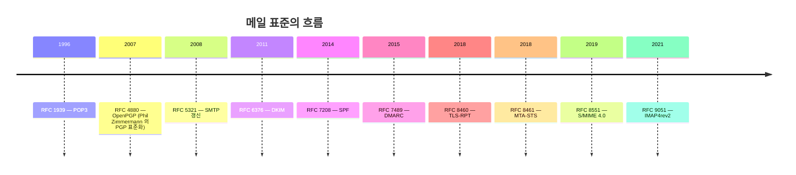
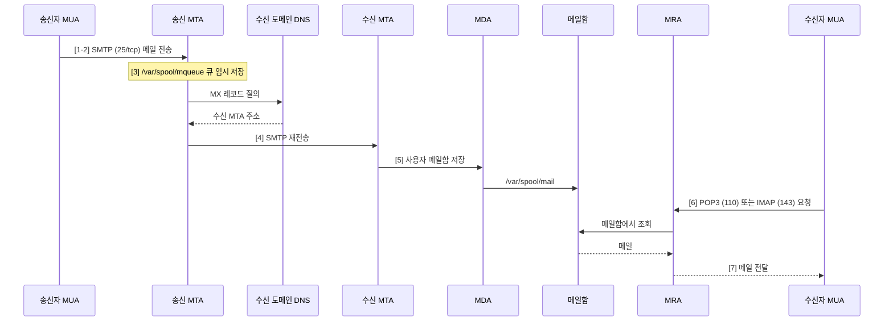
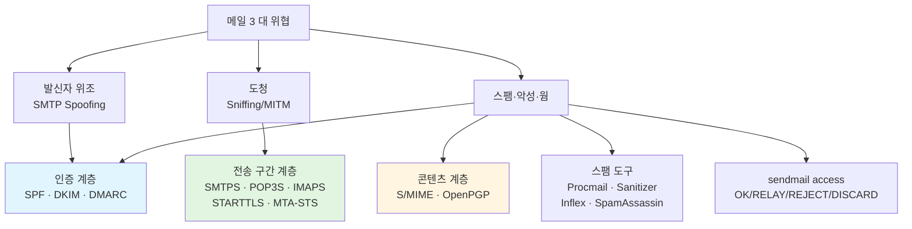
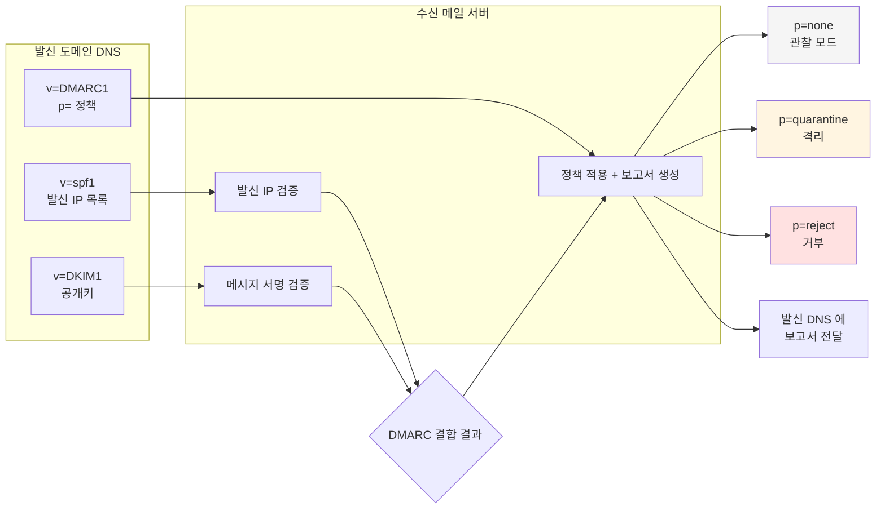
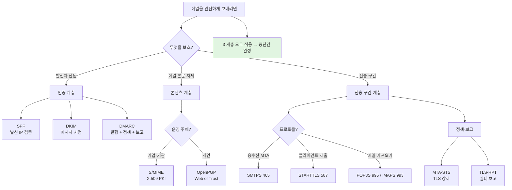

# 03. 메일 보안 — 만화책처럼 읽는 4 에이전트의 협력

> **이 문서를 읽는 법**: 메일 한 통이 *4 명의 에이전트*를 거쳐 도착하는 흐름을 시간 순으로 따라가면, *어디서 누가 위조하고*, *어디서 누가 도청하며*, *어떤 보안 기술이 어디에 끼어드는지*가 자연스럽게 외워집니다.
> 정확한 정의·수치·표준 번호는 정확본을 참조: [[cs/information-security/03.application-security/03.mail-security|정확본 03. 메일 보안]]

> **독자 가정**: *백엔드/풀스택 개발자, 메일 시스템은 처음.* 이미 익숙한 개념 (이메일 클라이언트, DNS TXT 레코드, X.509 인증서, TLS) 을 다리로 씁니다.

---

## 🎯 시작 전에 — 이미 쓰고 있는 메일 보안

개발하면서 마주치는 *모든 메일 동작*은 사실 이 단원의 후예입니다.

| 매일 보는 것 | 사실은 이 단원의 |
|---|---|
| 회사 메일 클라이언트 | MUA (Mail User Agent) |
| 회사 메일 서버 | MTA (Mail Transfer Agent) |
| 메일이 늦게 도착할 때 큐에 쌓인 그것 | `/var/spool/mqueue` |
| 휴대폰·노트북 모두에서 같은 메일 | IMAP (서버 사본 유지) |
| "외부에서 발송된 메일" 경고 배너 | DMARC `p=quarantine` 또는 `p=reject` |
| 도메인 DNS TXT 의 `v=spf1` | SPF |
| 헤더의 `DKIM-Signature` | DKIM |
| 헤더의 `Authentication-Results: spf=pass; dkim=pass` | SPF + DKIM 검증 결과 |
| 결제·계약서 PDF 의 디지털 서명 | S/MIME (X.509) |
| `mailto:` 가 아닌 `mailtos://` 같은 안전 모드 | SMTPS (465/tcp) |

> **이 단원의 본질**: 메일 시스템은 *원래 평문이었다*. 30년에 걸쳐 (1) 발신자 인증 (SPF·DKIM·DMARC), (2) 콘텐츠 암호화 (S/MIME·PGP), (3) 전송 구간 암호화 (SMTPS·POP3S·IMAPS) *세 계층*이 따로따로 추가됐다. *세 계층은 대체가 아니라 보완*이다 — 셋 다 적용해야 완성.

---

## 📖 에피소드 1 — 4 에이전트의 등장: MUA·MTA·MDA·MRA

### 장면 1. 단일 서버가 아니다

이메일 송수신은 *단일 서버*가 아니라 **4 가지 독립 역할 (Agent)** 의 협력으로 이루어진다. 시험은 이 *4 에이전트의 약자와 역할*을 정확히 묻는다.

| Agent | 풀이 | 역할 | 대표 구현 |
|---|---|---|---|
| **MUA** | Mail **U**ser Agent | 사용자가 메일을 송수신하는 *클라이언트 프로그램* | Outlook, Thunderbird |
| **MTA** | Mail **T**ransfer Agent | 메일 *서버* 프로그램. 수신 메일을 분석하여 수신자에게 전송 | Sendmail, Postfix, qmail |
| **MDA** | Mail **D**elivery Agent | 사용자 *메일함에 저장* | Procmail |
| **MRA** | Mail **R**etrieval Agent | 메일함에서 *클라이언트로 전달* | Dovecot |

### 장면 2. 머릿속 그림

```
[송신자]        [송신 MTA]      [수신 MTA]     [MDA]      [메일함]     [MRA]      [수신자]
  MUA  ──SMTP──▶  큐에 저장  ──SMTP──▶  분석   ──저장──▶  파일       ──POP3/IMAP──▶  MUA
                                                                              ↑
                                                                          요청
```

### 장면 3. 외우는 한 줄

> **MUA = 클라이언트** / **MTA = 서버** / **MDA = 저장 담당** / **MRA = 전달 담당**.

### 시험 함정

- "MUA·MTA·MDA·MRA 의 *순서대로* 역할?" → 클라이언트·서버·저장·전달.
- "Procmail 은 어느 Agent?" → **MDA**.
- "Dovecot 은 어느 Agent?" → **MRA**.

---

## 📖 에피소드 2 — 3 프로토콜과 7단계 흐름

### 장면 1. 3 프로토콜

각 에이전트 간 통신은 *3 표준 프로토콜*로.

| 프로토콜 | 용도 | 포트 | 특성 |
|---|---|---|---|
| **SMTP** | MUA ↔ MTA 또는 MTA ↔ MTA *전송* | **25/tcp** | 텍스트 기반 (RFC 5321) |
| **POP3** | 메일을 서버에서 *이동*하여 가져옴 | **110/tcp** | 가져오면 *서버에서 삭제* (RFC 1939) |
| **IMAP** | 메일을 서버에서 *복사*하여 가져옴 | **143/tcp** | *서버에 사본 유지*, 다중 클라이언트 지원 (RFC 9051) |

### 장면 2. POP3 vs IMAP — 한 글자 차이

> **POP3 = 이동** (서버 삭제). **IMAP = 복사** (서버 유지). 한 글자 차이로 의미 *반대*.

### 장면 3. 7단계 메일 송수신 흐름

```
[1] 송신자가 MUA 로 메일 작성
[2] MUA → MTA: SMTP 로 전송
[3] MTA: 메일 큐 (/var/spool/mqueue) 에 임시 저장
[4] MTA: 메일 주소 분석 → 자신이 아니면 해당 도메인의 MTA 로 SMTP 재전송
[5] MDA: 사용자 메일함 (/var/spool/mail) 에 파일로 저장
[6] 수신자가 MUA 로 확인 요청
[7] MRA: POP3 또는 IMAP 으로 클라이언트에 전달
```

### 장면 4. 어디서 DNS 가 끼어드는가

[4] 단계 — 수신자 메일 주소의 도메인을 *MX 레코드 DNS 질의*로 찾는다 ([[cs/information-security/03.application-security/01.dns-dhcp-snmp|정확본 01 §3 MX 레코드]] cross-ref).

### 시험 함정

- "POP3 = ?" → 이동 (110/tcp).
- "IMAP = ?" → 복사 (143/tcp).
- "메일 큐 디렉터리?" → `/var/spool/mqueue`.
- "수신자 도메인 → 메일 서버 찾는 방법?" → **MX 레코드 DNS 질의**.

---

## 📖 에피소드 3 — SMTP 의 두 영역: 봉투 ≠ 메시지

### 장면 1. 두 영역의 분리

SMTP 는 텍스트 기반 프로토콜이며 메일 데이터를 *두 개의 독립 정보 영역*으로 구분한다 — **봉투 (Envelope)** 와 **메시지 (Message)**. *시험 함정의 핵심*.

| 영역 | 용도 | 주요 필드 | 위조 가능? |
|---|---|---|---|
| **봉투 (Envelope)** | MTA 간 송/수신 정보. *수신 메일서버에게 전달* | `MAIL FROM` (발신 MTA) / `RCPT TO` (수신 MTA) | `MAIL FROM` 위조 가능 |
| **메시지 (Message)** | 송/수신자가 확인. *메일 수신자에게 전달* | `From` (발신 MUA) / `To` (수신 MUA) / `Subject` | `From` 위조 가능 |

### 장면 2. *클라이언트가 보는 발신자*는 어느 쪽?

> 메일 클라이언트 화면에 보이는 발신자 주소 = **메시지의 `From`**. 봉투의 `MAIL FROM` 과 *다를 수 있고* 둘 다 위조 가능.

### 장면 3. 왜 이게 *모든 메일 보안의 출발점*인가

`From` 위조 가능 → 누가 보냈는지 신뢰할 수 없음 → §6 의 SMTP Spoofing → §7 의 SPF·DKIM·DMARC 가 해결하려는 *근본 문제*.

### 시험 함정

- "봉투 ≠ 메시지?" → 다른 필드. 둘 다 위조 가능.
- "사용자가 보는 발신자 주소?" → 메시지의 **From** (`MAIL FROM` ❌).
- "발신자 인증의 출발점?" → 이 위조 가능성을 막는 것이 SPF.

---

## 📖 에피소드 4 — SMTP 릴레이: 오픈은 *스팸의 발판*

### 장면 1. SMTP 릴레이의 정체

> **SMTP 릴레이**: 메일 서버 *외부*에서 메일 서버를 *경유*하여 다른 메일 서버로 메일을 발송하는 것.

### 장면 2. 두 종류

| 종류 | 동작 | 보안 결과 |
|---|---|---|
| **오픈 릴레이 (Open Relay)** | *인증 없이* 모든 메일을 릴레이 | 스팸 발신자의 *발신 서버로 악용* |
| **인증된 릴레이 (Authenticated Relay)** | 인증을 통해 발신자 제한 | **SMTP AUTH** 로 발신자 계정 인증 |

### 장면 3. 운영 원칙

> **오픈 릴레이는 모든 환경에서 명시적으로 차단**해야 한다. 스팸 발송 가담 = 신용 추락 + 차단 리스트 (RBL) 등재.

### 시험 함정

- "오픈 릴레이의 위험?" → 스팸 발신 서버로 악용.
- "인증된 릴레이의 메커니즘?" → SMTP AUTH.

---

## 📖 에피소드 5 — sendmail 운영: 7 파일 + access 처리 5종

### 장면 1. sendmail 의 정체

> **sendmail**: 인터넷 전자 메일의 표준 규약인 SMTP 프로토콜을 통해서 메일 서버 간에 메일을 주고받는 역할을 하는 *무료 오픈소스* 소프트웨어. 시험은 *설정 파일·디렉터리 위치*를 직접 묻는다.

### 장면 2. 7 파일·디렉터리

| 경로 | 역할 |
|---|---|
| `/usr/sbin/sendmail` | 주 데몬 실행파일 |
| `/usr/sbin/makemap` | 맵 생성 실행파일 (`access.db` 생성) |
| `/var/spool/mqueue` | 메일 큐 |
| `/var/spool/mail` | 사용자 메일함 |
| `/var/log/maillog` | 로그 파일 |
| `/etc/mail/access` | 스팸·릴레이 차단 설정 |
| `/etc/mail/sendmail.cf` | sendmail 설정 |

### 장면 3. access 파일의 정체

sendmail 8.9 이후 추가된 **access DB** — 특정 메일의 차단·릴레이 제한 설정.

**적용 대상 4 형식**:

| 형식 | 예시 |
|---|---|
| IP | `192.168.1.10` |
| IP 대역 | `192.168.1` |
| 도메인 | `spam-domain.com` |
| 메일 주소 | `spammer@example.com` |

### 장면 4. 처리 방식 5종 — 함정 1순위

| 처리 | 동작 |
|---|---|
| **OK** | 조건 없이 모두 *허용* |
| **RELAY** | 메일 *릴레이 허용* |
| **REJECT** | 모두 거부 + *거부 메시지 송신* |
| **DISCARD** | 모두 폐기 + *폐기 메시지 송신 ❌*. 발신자는 *정상 처리로 인식* |
| **501 message** | 일치 시 거부 + *설정 거부 메시지* 전송 |

> **시험 함정 1순위**: REJECT vs DISCARD — REJECT 는 *발신자에게 알림*이 가지만, DISCARD 는 *알림 없이 폐기*. *스팸 발신자가 차단을 우회하려는 재시도를 막기 위함*.

### 장면 5. 적용 — makemap 으로 DB 변환

access 는 *텍스트 파일* — `makemap` 으로 access.db *DB 변환*해야 정책이 적용된다.

```
makemap hash /etc/mail/access < /etc/mail/access
```

### 시험 함정

- "REJECT vs DISCARD?" → 거부 알림 O / X.
- "access 파일 적용 명령?" → **`makemap hash`**.
- "sendmail 설정 파일?" → `/etc/mail/sendmail.cf`.

---

## 📖 에피소드 6 — 메일 3대 위협: Spoofing·Sniffing·Spam

### 장면. 3 카테고리

메일 시스템의 위협은 *3 카테고리*로 나뉜다. 각 위협이 *어떤 보안 기술*과 짝이 되는지 외우는 것이 핵심.

| 위협 | 정체 | 해결하는 보안 |
|---|---|---|
| **SMTP Spoofing** | 봉투 `MAIL FROM` 위조 → 신뢰 발신자로 가장 | §7 **SPF** (발신 IP 검증) |
| **Sniffing (도청·MITM)** | 평문 메일 가로채기·조작 | §9 **전송 구간 암호화** (SMTPS·POP3S·IMAPS) |
| **스팸·악성·웜** | 콘텐츠 검사 부재 악용 | §5 access 차단 + §10 스팸 도구 + §7 인증 종합 |

### 장면. 메일 보안의 3 계층 — *대체가 아니라 보완*

> **3 계층 모두 적용**해야 종단간 메일 보안 완성:
> (1) **인증** (SPF·DKIM·DMARC) — *누가 보냈는지*
> (2) **콘텐츠** (S/MIME·OpenPGP) — *메일 본문 자체 암호화·서명*
> (3) **전송 구간** (SMTPS·POP3S·IMAPS) — *전송 중 도청 방지*

### 시험 함정

- "Spoofing 의 해결?" → SPF (발신 IP 검증).
- "Sniffing 의 해결?" → 전송 구간 암호화.
- "메일 보안 3 계층의 관계?" → *상호 보완* (대체 ❌).

---

## 📖 에피소드 7 — SPF: 발신 IP 검증

### 장면 1. 정의

> **SPF (Sender Policy Framework)**: 수신한 메일의 *발신자 IP 주소*가 *발신자 메일 주소 도메인의 실제 메일 서버 정보와 일치하는지* 검사하는 기술. **RFC 7208**. *발송자 메일 서버 인증* 또는 *메일 서버 등록제*로 표현.

### 장면 2. 5단계 동작

```
[1] 발신자: 발신 메일 서버 정보를 SPF 형식으로 발신 도메인 DNS 에 TXT 레코드로 등록
[2] 메일을 전송
[3] 수신 메일 서버: 발신 IP 를 발신 DNS 에 질의
[4] 등록된 발신 메일 서버 주소 == 수신받은 메일의 발신 메일 서버 비교
[5] 일치 → 수신, 불일치 → 차단
```

### 장면 3. SPF 레코드 형식

```
"v=spf1 [한정자][메커니즘] [한정자][메커니즘] ... [한정자]all"
```

**한정자 4종**:

| 한정자 | 의미 | 매칭 시 처리 |
|---|---|---|
| `+` | **Pass** (통과). 한정자 미지정 시 *기본* | 메일 통과 |
| `-` | **Fail** (실패) | 메일 거부 (수신 측 스팸함 또는 거부) |
| `~` | **Soft Fail** (가벼운 실패) | 수신 측 정책에 따라 판단 |
| `?` | **Neutral** (중립) | 정책 판단 *보류* |

**메커니즘**:

| 메커니즘 | 의미 |
|---|---|
| `ip4` · `ip6` | IPv4·IPv6 주소·대역 |
| `include` | 다른 도메인의 SPF 레코드 *참조* |
| `all` | 위에 매칭되지 않는 *모든 경우* |

### 장면 4. 예시 두 개

```
v=spf1 ip4:211.252.150.8 ip4:202.30.50.0/24 -all
```

→ 두 IP 매칭 = Pass, 그 외 = Fail.

```
v=spf1 include:_spf.kisa.or.kr ~all
```

→ `_spf.kisa.or.kr` 의 SPF 참조, 그 외 = Soft Fail (수신 측 정책 판단).

### 시험 함정

- "SPF 의 RFC?" → **RFC 7208**.
- "SPF 가 검증하는 것?" → *발신 IP* (메시지 X).
- "한정자 4종?" → `+` (Pass) `-` (Fail) `~` (Soft Fail) `?` (Neutral).

---

## 📖 에피소드 8 — DKIM: 메시지 서명

### 장면 1. 정의

> **DKIM (DomainKeys Identified Mail)**: 발신자가 발신 메일의 *메시지 헤더와 바디에 대한 디지털 서명*을 메일 헤더에 삽입 → 수신된 이메일이 *위변조되지 않았는지* 수신자 측에서 검증하는 인증 기술. **RFC 6376**. *도메인 키 인증 메일*로 표현.

### 장면 2. 5단계 동작

```
[1] 발신 메일 서버: 발신 도메인 DNS 에 *공개키*를 TXT 레코드로 등록
[2] 발신 메일 서버: 메일을 *개인키로 전자서명* + DKIM-Signature 헤더 추가하여 전송
[3] 수신 메일 서버: DKIM-Signature 헤더의 selector·도메인 참조 → 발신 DNS 에 공개키 질의
[4] 공개키로 서명값 검증
[5] 해시 일치 → 수신, 불일치 → 차단
```

### 장면 3. SPF 와의 *결정적 차이*

> **SPF 는 발신 IP 만 검증**. **DKIM 은 메시지 자체의 위변조 검증**. → 메일이 *중간 MTA 를 거치며 변조*되었는지 탐지 가능.

### 시험 함정

- "DKIM 의 RFC?" → **RFC 6376**.
- "DKIM 이 검증하는 것?" → *메시지 자체*의 위변조 (헤더 + 바디).
- "DKIM 헤더 이름?" → **`DKIM-Signature`**.

---

## 📖 에피소드 9 — DMARC: 결합 + 정책 + 보고

### 장면 1. 정의

> **DMARC (Domain-based Message Authentication, Reporting and Conformance)**: 정당한 발신자인지 + 위변조 여부 검사 + *수신 측의 처리 결과*를 발신 측에 *보고*하여 발신 측 모니터링이 가능한 인증 기술. **RFC 7489**. *도메인 기반 이메일 인증*으로 표현.

### 장면 2. 본질 — *결합 + 정책 + 보고*

DMARC 의 본질은 SPF·DKIM 의 *결합 적용* + *정책 처리 결과 보고*.

> **왜 DMARC 가 필요한가**: SPF/DKIM 만 적용하면 인증 실패 시 *어떻게 처리할지가 도메인 소유자가 아닌 수신 서버 정책에 맡겨진다*. DMARC 는 *발신 도메인 소유자가 직접 정책 (`p=`) 을 선언*할 수 있게 한다.

### 장면 3. 5단계 동작

```
[1] 발신자: 발신 메일 서버 정보를 SPF 형식으로 DNS 등록
[2] 발신 메일 서버: DKIM 공개키 등록
[3] 발신 메일 서버: 메일을 개인키로 전자서명 후 전송
[4] 수신 메일 서버: 발신 DNS 에 SPF + DKIM 포함 DMARC 정보 조회
[5] 인증 성공 → 수신 / 실패 → 보고서 작성하여 발신 DNS 에 인증 결과 보고
```

### 장면 4. `p=` 정책 3종

| 정책 | 동작 |
|---|---|
| **`p=none`** | 인증 실패해도 정상 처리. *보고만 수신* (관찰 모드) |
| **`p=quarantine`** | 인증 실패 시 *격리* (스팸함 등) |
| **`p=reject`** | 인증 실패 시 *수신 거부* |

### 장면 5. 세 기술 비교 — 시험 빈출 1순위

| 구분 | SPF | DKIM | DMARC |
|---|---|---|---|
| **인증 대상** | 발신 IP 주소 | 메시지 헤더·바디 | SPF + DKIM 결합 |
| 검증 방식 | 발신 도메인 SPF 레코드 ↔ IP 매칭 | 디지털 서명 검증 | 두 인증 결합 + 정책 + 보고 |
| 위변조 탐지 | ❌ (IP 만) | ✅ (메시지 자체) | ✅ |
| 표준 | RFC 7208 | RFC 6376 | RFC 7489 |
| DNS 레코드 | TXT (`v=spf1`) | TXT (`v=DKIM1`) | TXT (`v=DMARC1`) |

### 시험 함정

- "DMARC 의 RFC?" → **RFC 7489**.
- "DMARC 의 본질 3가지?" → *결합 + 정책 + 보고*.
- "p= 정책 3종?" → none / quarantine / reject.
- "세 기술 모두 등록되는 위치?" → *발신 도메인의 DNS TXT 레코드*.

---

## 📖 에피소드 10 — 메일 헤더 분석: Received 와 인증 결과

### 장면 1. 헤더 3총사

수신한 메일을 *분석*할 때 다음 헤더가 *인증 결과·발송 경로*를 알려준다.

| 헤더 | 역할 |
|---|---|
| **Received** | 실제 메일이 전송된 *경로*. 메일 서버 경유 시마다 추가. *가장 아래쪽 = 처음 발송 서버*, 위로 갈수록 거쳐 온 서버 — *근원지 역추적의 핵심* |
| **Received-SPF** | 수신 측의 SPF 인증 결과 (`pass` / `fail` / `softfail` / `neutral`) |
| **Authentication-Results** | SPF·DKIM·DMARC 인증 결과를 *모두 기록* (`spf=pass`·`dkim=pass`·`dmarc=pass` 등) |

### 장면 2. Received 헤더 형식

```
Received: from <발송 호스트> by <수신 호스트>
          id <메일 고유 식별자> for <수신자 메일주소>
          ; <수신 날짜/시간>
```

### 장면 3. SMTPS 적용 시 Received 헤더의 *TLS Cipher Suite 6 요소*

SMTPS 가 적용되면 Received 헤더에 *TLS 협상 정보*가 함께 기록된다. *Cipher Suite 6 요소*가 풀어진 형태로 나타난다.

| 구성 요소 | 예시 값 | 역할 |
|---|---|---|
| 프로토콜 | TLS 1.2 | TLS 버전 |
| 키 교환 알고리즘 | ECDHE | TLS 통신용 키 교환 |
| 인증/서명 알고리즘 | RSA | 인증서 인증 + 키 교환 매개변수 서명 |
| 대칭키 블록 암호 알고리즘 | AES128 | 대칭키 블록 암호화 |
| 블록암호 운용모드 | GCM | 블록 암호 운용 모드 |
| 메시지 인증 알고리즘 | SHA256 | 메시지 인증용 MAC |

→ 6 요소 조합 = **`ECDHE-RSA-AES128-GCM-SHA256`**. ([[cs/information-security/02.network-security/07.security-protocols|정확본 02-07 SSL/TLS]] / [[cs/information-security/04.security-general/03.key-distribution|정확본 04-03 키 합의]] / [[cs/information-security/04.security-general/05.crypto-algorithms|정확본 04-05 대칭키·운영모드]] / [[cs/information-security/04.security-general/06.hash-and-mac|정확본 04-06 해시]] cross-ref).

### 시험 함정

- "근원지 역추적 헤더?" → **Received**.
- "*가장 처음 발송한* 서버는 Received 의 어디?" → *가장 아래쪽*.
- "DKIM 결과 기록 헤더?" → **Authentication-Results**.

---

## 📖 에피소드 11 — 스팸 방지 4 도구: Procmail·Sanitizer·Inflex·SpamAssassin

### 장면. 4 도구의 정체

리눅스/유닉스 환경의 스팸 차단 *대표 도구 4종*.

| 도구 | 정체 |
|---|---|
| **Procmail** | sendmail.cf 에 포함시키거나 사용자 디렉터리의 `.forward` 파일에 위치시켜 실행. *Plug-In 형식의 메일 처리 도구* |
| **Sanitizer** | 이메일을 이용한 모든 공격에 대응하도록 해주는 *Procmail ruleset* |
| **Inflex** | 로컬·외부로 나가는 이메일에 대해 *Inbound·Outbound 정책* 으로 메일 필터링 |
| **SpamAssassin** | 헤더 내용·화이트리스트·블랙리스트·**RBL** (Realtime Blackhole List) 등 *다양한 분류*로 메일 필터링 |

### 장면. Procmail ↔ Sanitizer 의 *계층 관계*

> **시험 함정**: Procmail 은 sendmail 에 통합되는 *처리 엔진*, Sanitizer 는 그 위에서 동작하는 *룰셋*. *동등한 도구가 아니라 계층 관계*.

### 시험 함정

- "Procmail 의 위치?" → sendmail.cf 또는 `.forward`.
- "Sanitizer 의 정체?" → *Procmail ruleset*.
- "Inflex 의 특성?" → Inbound·Outbound 정책.
- "RBL 이 풀이?" → Realtime Blackhole List (SpamAssassin 분류 중 하나).

---

## 📖 에피소드 12 — 콘텐츠 보안: S/MIME vs OpenPGP

### 장면 1. *왜* 콘텐츠 보안인가

§7~9 의 SPF·DKIM·DMARC 가 *발신자 인증* — 메일 *본문 자체*의 암호화·서명은 다음 두 표준이 담당. 본문을 직접 암호화·서명하므로 *어떤 MTA 를 거치든 종단간 보안 유지* ([[cs/information-security/04.security-general/04.digital-signature-pki|정확본 04-04 디지털서명·PKI]] cross-ref).

### 장면 2. S/MIME — 기업의 PKI 모델

> **S/MIME (Secure/Multipurpose Internet Mail Extensions)**: MIME 형식의 메일 본문을 *X.509 인증서 기반*으로 암호화·서명하는 표준. **RFC 8551** (S/MIME 4.0, 2019).

| 항목 | 내용 |
|---|---|
| 인증서 | **X.509 v3** — 공인 인증기관 (CA) 발급 |
| 암호화 | 대칭키 + 수신자 공개키로 키 래핑 (*하이브리드*) |
| 전자서명 | 발신자 개인키로 본문 해시 서명 |
| 운영 환경 | *기업* — CA 기반 PKI 구축 전제 |

### 장면 3. OpenPGP — 개인의 Web of Trust

> **OpenPGP**: Phil Zimmermann 의 PGP 를 표준화한 메일 보안 프로토콜. **RFC 4880** (2007) / RFC 9580 (2024 갱신).

| 항목 | 내용 |
|---|---|
| 인증서 | *자체 키* (CA 불필요). **Web of Trust** 모델 |
| 암호화 | 하이브리드 (대칭 + 비대칭) |
| 전자서명 | 발신자 개인키로 본문 해시 서명 |
| 운영 환경 | *개인* — 자체 키 관리·신뢰망 운영 |

### 장면 4. 한 표 비교 — *신뢰 모델*이 핵심 차이

| 구분 | S/MIME | OpenPGP |
|---|---|---|
| **신뢰 모델** | **PKI** (CA 계층) | **Web of Trust** (P2P 신뢰) |
| 인증서 표준 | X.509 | OpenPGP 자체 형식 |
| 운영 주체 | 기업·기관 | 개인 |
| 키 배포 | LDAP·CA Repository | 키 서버·직접 교환 |

### 시험 함정

- "S/MIME 의 인증서?" → **X.509 v3**.
- "OpenPGP 의 신뢰 모델?" → **Web of Trust**.
- "PGP 창시자?" → **Phil Zimmermann**.
- "S/MIME 4.0 RFC?" → **RFC 8551** (2019).

---

## 📖 에피소드 13 — 전송 구간 보안: SMTPS·POP3S·IMAPS·STARTTLS·MTA-STS·TLS-RPT

### 장면 1. *왜* 전송 구간 보안인가

§13 콘텐츠 보안이 *종단간 보안*이라면, **전송 구간 보안**은 *서버↔서버, 서버↔클라이언트* TCP 연결을 TLS 로 암호화한다.

### 장면 2. 평문 ↔ 보안 포트 — *외우기 쉬운 패턴*

| 표준 | 평문 프로토콜 | 보안 적용 후 | 보안 포트 |
|---|---|---|---|
| **SMTPS** | SMTP (25/tcp) | SMTP over SSL/TLS | **465/tcp** |
| **POP3S** | POP3 (110/tcp) | POP3 over SSL/TLS | **995/tcp** |
| **IMAPS** | IMAP (143/tcp) | IMAP over SSL/TLS | **993/tcp** |
| **STARTTLS** (Submission) | SMTP | *평문 시작 후 TLS 업그레이드* | **587/tcp** |

### 장면 3. *언제 평문 시작 후 업그레이드*가 필요한가

**STARTTLS** = 메일 클라이언트의 메일 *제출 (Submission)* 용. 평문으로 시작 후 `STARTTLS` 명령으로 TLS 업그레이드. FTPS Explicit 의 `AUTH TLS` 와 패턴 동일 ([[cs/information-security/03.application-security/02.ftp-security|정확본 02 FTPS Explicit]] cross-ref).

### 장면 4. MTA-STS·TLS-RPT — *정책 선언과 보고*

| 표준 | RFC | 역할 |
|---|---|---|
| **MTA-STS** | **RFC 8461** | 수신 도메인이 *자신을 향해 들어오는 SMTP 가 반드시 TLS 사용*하도록 정책 선언 |
| **TLS-RPT** | **RFC 8460** | TLS 협상 실패·인증서 오류 등 전송 구간 보안 문제를 *발신자가 도메인 소유자에게 보고* |

### 장면 5. 메일 보안 3 계층의 완성

> **종단간 메일 보안의 완성 = 3 계층 모두 적용**:
> (1) **인증** SPF·DKIM·DMARC
> (2) **콘텐츠** S/MIME·OpenPGP
> (3) **전송 구간** SMTPS·POP3S·IMAPS·STARTTLS + MTA-STS·TLS-RPT

### 시험 함정

- "SMTPS·POP3S·IMAPS 포트?" → **465 / 995 / 993** (한 자리 차이).
- "STARTTLS 포트와 명령?" → **587/tcp** + `STARTTLS`.
- "MTA-STS 의 RFC·역할?" → **RFC 8461** / 수신 도메인 TLS 강제 정책.
- "메일 보안 3 계층의 관계?" → *상호 보완* (대체 ❌).

---

## 📑 종합 비교 (에피소드 7·8·9·12·13 정리)

3 보안 계층을 *위협 → 해결 기술 → 표준* 순으로.

| 위협 | 보안 계층 | 표준 기술 | 표준 RFC | DNS·포트 |
|---|---|---|---|---|
| 발신자 위조 | (1) 인증 | **SPF** | RFC 7208 | DNS TXT (`v=spf1`) |
| 메시지 위변조 | (1) 인증 | **DKIM** | RFC 6376 | DNS TXT (`v=DKIM1`) + `DKIM-Signature` 헤더 |
| 인증 결과 정책·보고 | (1) 인증 | **DMARC** | RFC 7489 | DNS TXT (`v=DMARC1`) `p=` 정책 |
| 메일 내용 노출 (종단간) | (2) 콘텐츠 | **S/MIME** | RFC 8551 | X.509 / PKI |
| 메일 내용 노출 (종단간) | (2) 콘텐츠 | **OpenPGP** | RFC 4880 | Web of Trust |
| 전송 구간 도청 | (3) 전송 | **SMTPS** | — | 465/tcp |
| 전송 구간 도청 | (3) 전송 | **POP3S** | — | 995/tcp |
| 전송 구간 도청 | (3) 전송 | **IMAPS** | — | 993/tcp |
| 메일 제출 평문 시작 → 업그레이드 | (3) 전송 | **STARTTLS** | — | 587/tcp |
| 수신 도메인 TLS 강제 | (3) 전송 | **MTA-STS** | RFC 8461 | DNS TXT |
| TLS 보안 사고 보고 | (3) 전송 | **TLS-RPT** | RFC 8460 | DNS TXT |

> **읽는 법**: 한 위협을 한 기술이 *완전히* 해결하지 않는다. *위협별로 계층을 골라 조합*해야 종단간 메일 보안이 완성된다.

---

## 🗺️ 마인드맵 1 — 시간선



**읽는 법**: POP3 (1996) 부터 IMAP4rev2 (2021) 까지 *25년 점진 보강*. SPF (2014) → DMARC (2015) 의 *간격 1 년* 은 SPF 만으로는 부족하다는 인식이 빨랐다는 신호.

---

## 🗺️ 마인드맵 2 — 7단계 메일 송수신 흐름



---

## 🗺️ 마인드맵 3 — 3 위협 ↔ 3 보안 계층 매핑



**읽는 법**: 한 위협이 *한 계층만으로는 완전히 해결되지 않는다*. 스팸은 4 군데에서 동시에 대응한다.

---

## 🗺️ 마인드맵 4 — SPF·DKIM·DMARC 결합



---

## 🗺️ 마인드맵 5 — 메일 보안 결정 트리



---

## 🗂️ 키워드 클러스터

### RFC 묶음

```
SMTP·POP3·IMAP    — RFC 5321 (SMTP) · RFC 1939 (POP3) · RFC 9051 (IMAP4rev2)
인증 (SPF·DKIM·DMARC) — RFC 7208 · RFC 6376 · RFC 7489
콘텐츠 (S/MIME·PGP)  — RFC 8551 (S/MIME 4.0) · RFC 4880 (OpenPGP)
전송 구간 정책       — RFC 8461 (MTA-STS) · RFC 8460 (TLS-RPT)
```

### 포트 묶음

```
평문    — SMTP 25 / POP3 110 / IMAP 143
보안    — SMTPS 465 / POP3S 995 / IMAPS 993
업그레이드 — STARTTLS 587 (Submission)
```

### 4 에이전트

```
MUA — Mail User Agent     — 클라이언트 (Outlook, Thunderbird)
MTA — Mail Transfer Agent — 서버      (Sendmail, Postfix, qmail)
MDA — Mail Delivery Agent — 저장      (Procmail)
MRA — Mail Retrieval Agent — 전달     (Dovecot)
```

### sendmail 7 경로

```
실행파일       — /usr/sbin/sendmail · /usr/sbin/makemap
큐·메일함     — /var/spool/mqueue · /var/spool/mail
로그          — /var/log/maillog
설정          — /etc/mail/access · /etc/mail/sendmail.cf
```

### access 처리 5종

| 처리 | 알림 | 효과 |
|---|---|---|
| OK | — | 모두 허용 |
| RELAY | — | 릴레이 허용 |
| REJECT | ✅ | 거부 + 알림 |
| DISCARD | ❌ | 폐기 + *알림 없음* |
| 501 message | ✅ | 거부 + *설정 메시지* |

### SPF 한정자 4종

| 한정자 | 의미 |
|---|---|
| `+` | Pass (기본) |
| `-` | Fail |
| `~` | Soft Fail |
| `?` | Neutral |

### TLS Cipher Suite 6 요소

```
프로토콜 — 키 교환 — 인증/서명 — 대칭키 — 운영모드 — MAC
TLS 1.2 — ECDHE  — RSA      — AES128 — GCM    — SHA256
       = ECDHE-RSA-AES128-GCM-SHA256
```

---

## 🃏 회상 30문항

> 답을 가린 뒤 자가 채점. 틀린 것만 정확본으로 깊이 학습.

**A. 4 에이전트·프로토콜 (1~7)**
1. MUA·MTA·MDA·MRA 의 역할 *순서대로*?
2. 대표 구현 매칭 (Outlook·Postfix·Procmail·Dovecot)?
3. SMTP·POP3·IMAP 의 *포트와 RFC*?
4. POP3 vs IMAP 의 한 글자 차이?
5. 메일 큐 디렉터리 경로?
6. 사용자 메일함 디렉터리 경로?
7. 7단계 송수신 흐름의 *4 단계가 DNS 와 만나는 지점*?

**B. SMTP 봉투·릴레이·sendmail (8~13)**
8. 봉투 ↔ 메시지의 차이?
9. 사용자가 보는 발신자 주소 출처?
10. 오픈 릴레이의 위험과 차단 메커니즘?
11. sendmail access 처리 5종?
12. REJECT vs DISCARD?
13. access 적용 명령?

**C. SPF·DKIM·DMARC (14~21)**
14. SPF 의 인증 대상과 RFC?
15. SPF 한정자 4종과 의미?
16. SPF 메커니즘 3종?
17. DKIM 의 인증 대상과 RFC?
18. DKIM 헤더 이름?
19. DMARC 의 RFC 와 본질 3가지?
20. `p=` 정책 3종?
21. 세 기술의 *공통 등록 위치*?

**D. 헤더·스팸 도구 (22~26)**
22. 근원지 역추적 헤더?
23. SPF·DKIM·DMARC 결과 모두 기록 헤더?
24. TLS Cipher Suite 6 요소?
25. Procmail ↔ Sanitizer 의 *계층 관계*?
26. SpamAssassin 의 RBL 풀이?

**E. 콘텐츠·전송 보안 (27~30)**
27. S/MIME 의 인증서·신뢰 모델·RFC?
28. OpenPGP 의 신뢰 모델·창시자?
29. SMTPS·POP3S·IMAPS 의 *3 포트*?
30. STARTTLS 의 포트와 *명령어*?

---

## ⚠️ 시험 함정 모음

| 함정 | 정답 |
|---|---|
| MUA·MTA·MDA·MRA 의 역할? | 클라이언트·서버·저장·전달 |
| POP3 vs IMAP? | **이동** vs **복사** (한 글자 차이) |
| 사용자가 보는 발신자? | 메시지의 **From** (`MAIL FROM` ❌) |
| REJECT vs DISCARD? | 거부 알림 O / X |
| access 적용 명령? | **`makemap hash`** |
| SPF 의 인증 대상? | *발신 IP* (메시지 ❌) |
| SPF 한정자 4종? | `+ - ~ ?` (Pass·Fail·Soft Fail·Neutral) |
| DKIM 의 인증 대상? | *메시지 자체* (위변조 탐지) |
| DKIM 헤더? | **`DKIM-Signature`** |
| DMARC 의 본질 3가지? | 결합 + 정책 + 보고 |
| `p=` 정책 3종? | none / quarantine / reject |
| SPF·DKIM·DMARC 등록 위치? | *발신 도메인 DNS TXT 레코드* |
| 가장 처음 발송 서버는 Received 의? | *가장 아래* |
| Procmail ↔ Sanitizer 관계? | 처리 엔진 ↔ 룰셋 (계층) |
| RBL 풀이? | Realtime Blackhole List |
| S/MIME 의 인증서? | **X.509 v3** |
| OpenPGP 의 신뢰 모델? | **Web of Trust** |
| PGP 창시자? | **Phil Zimmermann** |
| SMTPS·POP3S·IMAPS 포트? | **465 / 995 / 993** |
| STARTTLS? | 587/tcp + `STARTTLS` 명령 |
| MTA-STS 역할? | 수신 도메인 TLS 강제 (RFC 8461) |
| TLS-RPT 역할? | TLS 보안 사고 보고 (RFC 8460) |
| 3 보안 계층의 관계? | *상호 보완* (대체 ❌) |

---

## 🔗 정확본 매핑표

| 본 노트 에피소드 | 정확본 § |
|---|---|
| 에피소드 1 (4 에이전트) | [[cs/information-security/03.application-security/03.mail-security#1-1. 메일 시스템 4-Agent 구조\|정확본 §1-1]] |
| 에피소드 2 (3 프로토콜·7단계) | [[cs/information-security/03.application-security/03.mail-security#1-2. 주요 메일 프로토콜\|정확본 §1-2·§1-3]] |
| 에피소드 3 (봉투·메시지) | [[cs/information-security/03.application-security/03.mail-security#2-1. SMTP 메일 형식 — 봉투와 메시지\|정확본 §2-1]] |
| 에피소드 4 (SMTP 릴레이) | [[cs/information-security/03.application-security/03.mail-security#2-2. SMTP 릴레이\|정확본 §2-2]] |
| 에피소드 5 (sendmail 운영) | [[cs/information-security/03.application-security/03.mail-security#3-1. sendmail 구성 파일 및 디렉터리\|정확본 §3-1·§3-2]] |
| 에피소드 6 (3 위협) | [[cs/information-security/03.application-security/03.mail-security#4. 메일 서비스 공격 유형\|정확본 §4-1·§4-2·§4-3]] |
| 에피소드 7 (SPF) | [[cs/information-security/03.application-security/03.mail-security#5-1. SPF (Sender Policy Framework)\|정확본 §5-1]] |
| 에피소드 8 (DKIM) | [[cs/information-security/03.application-security/03.mail-security#5-2. DKIM (DomainKeys Identified Mail)\|정확본 §5-2]] |
| 에피소드 9 (DMARC + 비교) | [[cs/information-security/03.application-security/03.mail-security#5-3. DMARC (Domain-based Message Authentication, Reporting and Conformance)\|정확본 §5-3·§5-4]] |
| 에피소드 10 (헤더·Cipher Suite) | [[cs/information-security/03.application-security/03.mail-security#5-5. 메일 헤더 정보\|정확본 §5-5]] |
| 에피소드 11 (스팸 도구 4종) | [[cs/information-security/03.application-security/03.mail-security#6. 스팸메일 방지 보안 도구\|정확본 §6]] |
| 에피소드 12 (S/MIME·OpenPGP) | [[cs/information-security/03.application-security/03.mail-security#7. 메일 콘텐츠 보안 (외부 보강)\|정확본 §7]] |
| 에피소드 13 (전송 구간 보안) | [[cs/information-security/03.application-security/03.mail-security#8. 메일 전송 구간 보안 (외부 보강)\|정확본 §8·§8-1]] |

---

## 📅 학습 흐름 (8주차 시험 대비 기준)

```
[1주]   에피소드 1·2 (4 에이전트·3 프로토콜·7단계) — 만화책 통독
[2주]   에피소드 3·4 (봉투·메시지·릴레이) — 위조 가능성 인식
[3주]   에피소드 5 (sendmail) — REJECT vs DISCARD 외움
[4주]   에피소드 6 (3 위협 ↔ 3 계층 매핑)
[5주]   에피소드 7·8·9 (SPF·DKIM·DMARC) — 인증 대상 차이 중심
[6주]   에피소드 10·11 (헤더 분석·스팸 도구)
[7주]   에피소드 12·13 (콘텐츠·전송 구간) — 3 계층 통합
[8주]   마인드맵 5장 통합 + 회상 30문항 + 함정 모음
```

---

> **다음 단원**: [[cs/information-security/03.application-security/04.http-and-web-client|04. HTTP 와 웹 클라이언트]] — 본 단원 §13 의 *전송 구간 TLS* 패턴이 04 단원 *HTTPS·HSTS* 와 직접 연결.
