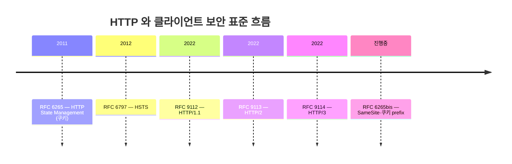
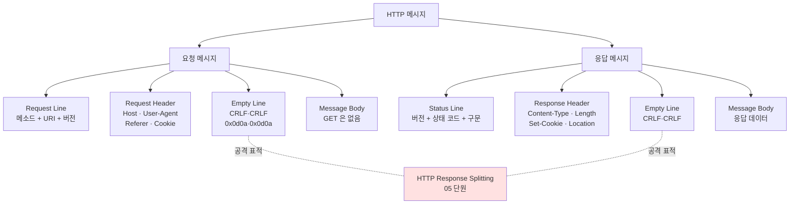
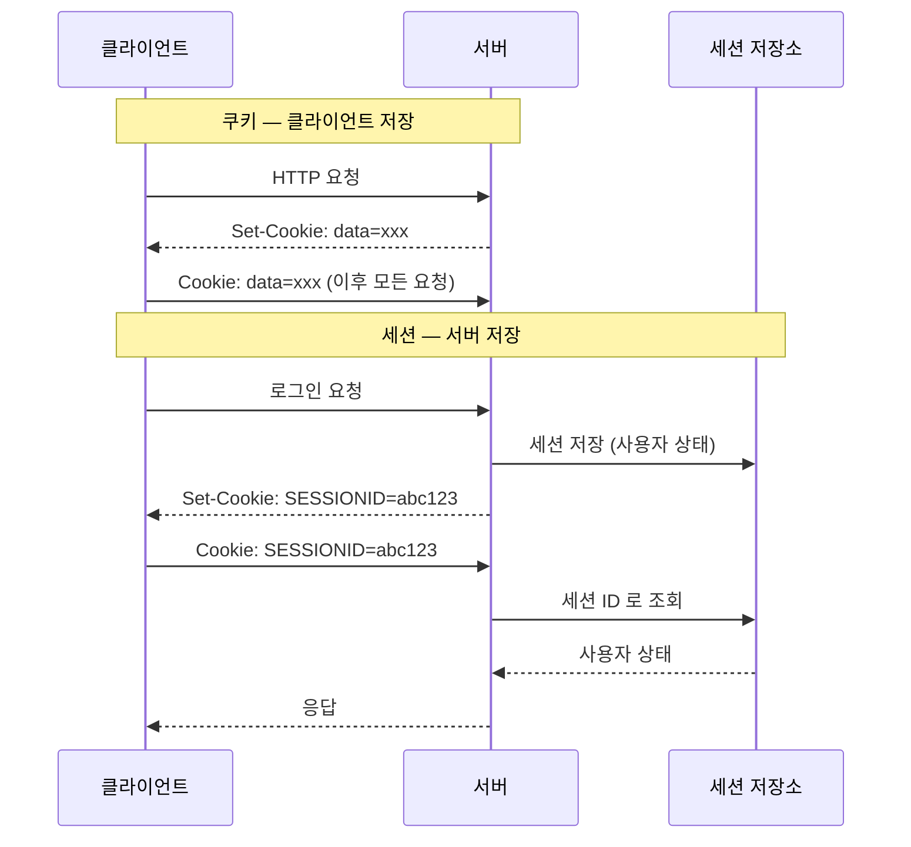
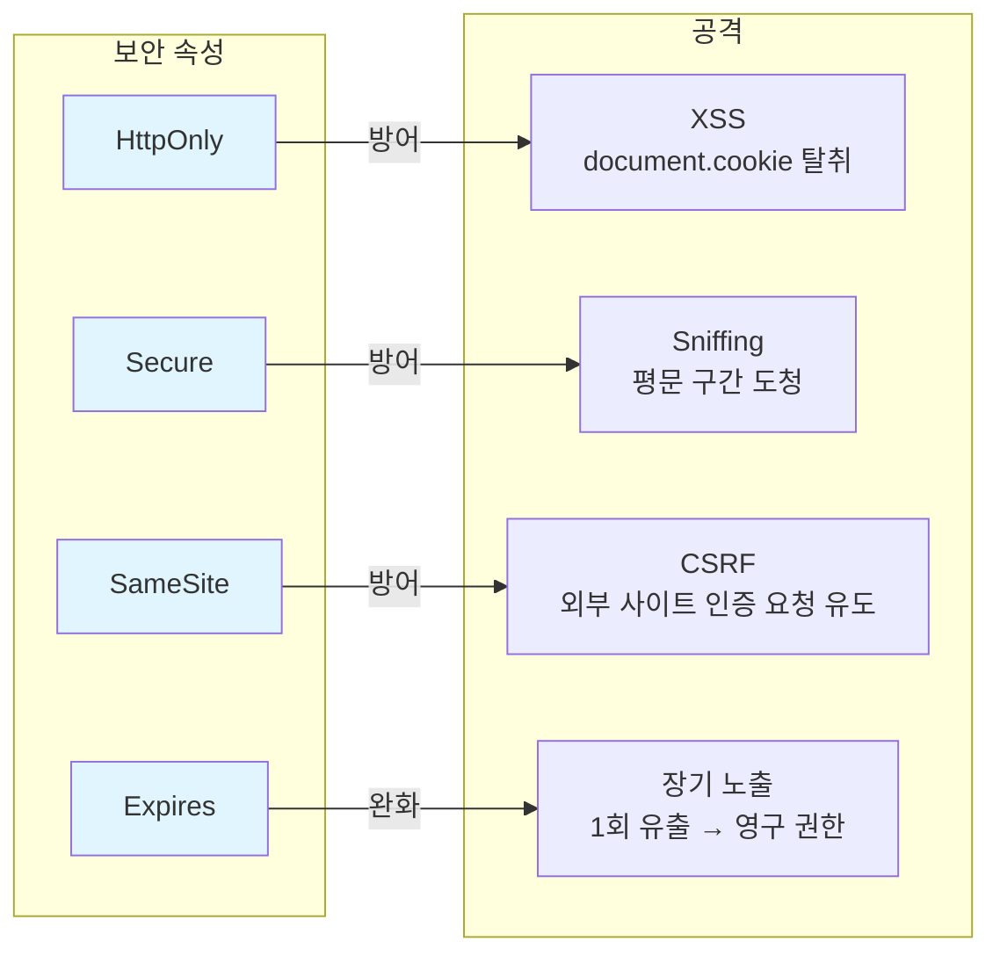
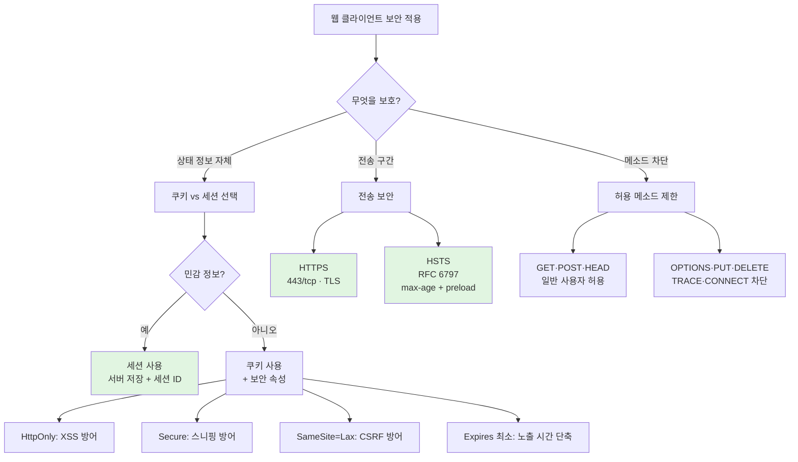

# 04. HTTP 와 웹 클라이언트 보안 — 만화책처럼 읽는 무상태의 한계

> **이 문서를 읽는 법**: HTTP 가 *왜 무상태로 태어났는지*, 그게 *왜 쿠키와 세션을 낳았는지*, 그리고 *왜 그 쿠키가 결국 모든 웹 공격의 핵심 표적*이 되었는지 — 시간 순으로 따라가면 다음 단원 (05) 의 모든 웹 공격이 자연스럽게 풀립니다.
> 정확한 정의·수치·표준 번호는 정확본을 참조: [[cs/information-security/03.application-security/04.http-and-web-client|정확본 04. HTTP 와 웹 클라이언트 보안]]

> **독자 가정**: *백엔드/풀스택 개발자, 웹 보안은 처음.* 이미 익숙한 개념 (`fetch`, `Set-Cookie`, 세션 ID, 401/403, HTTPS) 을 다리로 씁니다.

---

## 🎯 시작 전에 — 이미 쓰고 있는 HTTP

개발하면서 매일 보는 것들이 사실 다 이 단원의 주인공입니다.

| 매일 보는 것 | 사실은 이 단원의 |
|---|---|
| `fetch('/api/...')` 의 응답 헤더 | HTTP 응답 메시지 4 영역 |
| `Set-Cookie: session=...; HttpOnly; Secure` | 쿠키 보안 속성 (§12) |
| 로그인 후 다음 페이지에서도 인식되는 사용자 | 세션 + 세션 ID |
| 로그아웃 안 했는데 다른 PC 에서 자동 로그인 됨 | 영속 쿠키 (`Expires` 설정) |
| 프론트에서 쿠키 못 읽을 때 | `HttpOnly` 적용 |
| HTTP 로 접속해도 자동으로 HTTPS 로 변경 | HSTS (RFC 6797) |
| `401 Unauthorized` vs `403 Forbidden` | 인증 필요 vs 접근 차단 |
| API 가 `OPTIONS` 메소드 응답 | CORS Preflight |
| `curl -I` 가 보내는 메소드 | HEAD |
| `Content-Type: application/json` | 응답 헤더 |

> **이 단원의 본질**: HTTP 는 *원래 무상태 (Stateless)*. 그 한계 때문에 쿠키·세션이 태어났고, *그 쿠키가 웹 공격의 핵심 표적*이 되어 *보안 속성 5~6개*가 추가됐다. 무상태 → 쿠키 → 보안 속성 → 다음 단원의 공격 — *한 줄 인과*로 외운다.

---

## 📖 에피소드 1 — HTTP 의 정체와 무상태라는 본성

### 장면 1. 정의

> **HTTP (HyperText Transfer Protocol)**: 웹 상에서 클라이언트와 서버 간에 통신을 위해 개발된 프로토콜. 주로 **80/tcp** 사용. 클라이언트의 *요청*과 서버의 *응답*으로 이루어진다.

> **하이퍼텍스트 (Hypertext)**: 참조 혹은 링크를 통해 한 문서에서 다른 문서로 접근할 수 있는 문서. 대표적인 예가 **HTML**.

### 장면 2. Stateless — 모든 보안 이슈의 출발점

> **Stateless (무상태)**: *동일 클라이언트의 현재 요청과 이전 요청을 식별하지 못하는* 특성. 현재 연결에 대한 클라이언트의 *어떠한 상태 정보도 유지하지 못한다*.

### 장면 3. 무상태가 가져온 *단순성과 한계*

| 단순성 | 한계 |
|---|---|
| 서버가 클라이언트별 상태를 기억할 필요 X → 확장성 ↑ | 사용자가 로그인 후 다음 페이지로 이동해도 *방금 로그인한 그 사람이 맞는지* 식별 불가능 |

### 장면 4. 그래서 등장한 *상태 유지 기술*

이 한계를 보완하기 위해 §9~10 의 **쿠키**와 **세션**이 등장. 두 기술의 차이는 *상태 정보가 어디에 저장되는가* — 이 차이가 §12 의 보안 속성과 직결.

### 시험 함정

- "HTTP 의 핵심 특성?" → **Stateless**.
- "기본 포트?" → **80/tcp** (HTTPS 는 443).
- "Stateless 의 결과?" → 로그인한 사용자 식별 불가능 → 쿠키·세션의 등장.

---

## 📖 에피소드 2 — HTTP 의 4 버전 진화: 1.0 → 1.1 → 2 → 3

### 장면. 30년의 진화

| 버전 | 특징 | 표준 |
|---|---|---|
| **HTTP/1.0** | HTTP 응답 후 *TCP 연결 즉시 종료*. 매 요청마다 연결 비용 발생 | (1996) |
| **HTTP/1.1** | `Connection: keep-alive` 추가 → TCP 연결 *일정 시간 지속*. **파이프라이닝** 지원 | RFC 9112 |
| **HTTP/2** | *단일 TCP 연결 위 다중 스트림*. 헤더 압축 (**HPACK**). *바이너리 프레임* | RFC 9113 |
| **HTTP/3** | **UDP 기반 QUIC** 위에서 동작 | RFC 9114 |

### 진화의 한 줄

> 1.0 (요청마다 연결) → 1.1 (keep-alive) → 2 (다중 스트림 + HPACK + 바이너리) → 3 (UDP/QUIC).

### 시험 함정

- "HTTP/1.1 의 핵심 추가?" → **`Connection: keep-alive`** + 파이프라이닝.
- "HTTP/2 의 헤더 압축?" → **HPACK**.
- "HTTP/3 의 전송 계층?" → **UDP** (QUIC).

---

## 📖 에피소드 3 — 메시지의 4 영역: 모든 HTTP 의 뼈대

### 장면 1. 4 영역 구조

HTTP 메시지는 *요청·응답 모두* 다음 4 영역으로 구성.

```
[Start Line]            ← 첫 줄
[Header]                ← 여러 헤더 (개행으로 구분)
[Empty Line (CRLF)]     ← 헤더의 끝을 알리는 빈 라인
[Message Body]          ← 데이터
```

### 장면 2. CRLF 의 정체

> **개행 (CRLF)**: Carriage Return + Line Feed = **`0x0d0a`**. 이 개행 문자가 다음 단원의 **HTTP 응답 분할 취약점**의 *핵심 수단*이다.

### 장면 3. 왜 *빈 라인*으로 헤더 끝을 식별하나

헤더의 *개수가 가변*이기 때문에 끝을 미리 알 수 없다 → *빈 라인 (CRLF + CRLF)* 으로 식별. 이 구조적 특성이 [[cs/information-security/03.application-security/05.web-app-attacks|정확본 05 HTTP Response Splitting]] 의 토대.

### 시험 함정

- "헤더 끝을 어떻게 식별?" → *빈 라인 (CRLF·CRLF)*.
- "CRLF 의 hex?" → `0x0d0a`.
- "GET 메소드의 메시지 바디?" → 없음 (쿼리스트링 사용).

---

## 📖 에피소드 4 — 요청 메시지: Start Line 부터 Cookie 헤더까지

### 장면 1. 요청 메시지 4 영역

| 영역 | 설명 |
|---|---|
| **요청라인 (Request Line)** | 한 행. *요청 메소드 + 요청 URI + HTTP 버전* |
| **요청헤더 (Request Header)** | 여러 헤더. 각 정보는 개행 구분 |
| **빈 라인** | 헤더의 끝 |
| **메시지 바디** | 서버로 전송하는 데이터. *GET 은 없음* |

### 장면 2. 요청 헤더 4 총사

| 헤더 | 용도 |
|---|---|
| `Host` | 요청의 대상 서버 *도메인명/호스트명·포트* |
| `User-Agent` | 클라이언트의 *애플리케이션·OS 정보* |
| `Referer` | *현재 요청 URL 정보를 담고 있는 이전 문서의 URL* |
| `Cookie` | 클라이언트가 서버로 전송하는 *쿠키 정보* (§9) |

### 장면 3. Referer 가 *민감 정보 누출*의 통로가 되는 이유

GET 메소드는 데이터를 URL 에 담는다 → 그 URL 이 다음 페이지의 `Referer` 헤더로 *흘러간다*. 그래서 GET 으로 토큰·비밀번호 전송 ❌.

### 시험 함정

- "요청 헤더 4 종?" → Host·User-Agent·Referer·Cookie.
- "GET 의 메시지 바디?" → 없음.
- "Referer 가 누출시키는 것?" → 이전 페이지의 *전체 URL* (쿼리스트링 포함).

---

## 📖 에피소드 5 — 응답 메시지: Status Line 부터 Set-Cookie 까지

### 장면 1. 응답 메시지 4 영역

| 영역 | 설명 |
|---|---|
| **상태라인 (Status Line)** | 한 행. *HTTP 버전 + 상태 코드 + 응답 구문* |
| **응답헤더 (Response Header)** | 여러 헤더. 개행 구분 |
| **빈 라인** | 헤더의 끝 |
| **메시지 바디** | 클라이언트로 전송하는 *응답 데이터* |

### 장면 2. 응답 헤더 4 총사

| 헤더 | 용도 |
|---|---|
| `Content-Type` | 메시지 바디의 *데이터 형식* (MIME 타입) |
| `Content-Length` | 메시지 바디의 *전체 크기* |
| `Set-Cookie` | 서버가 클라이언트에 *쿠키 설정* (§9) |
| `Location` | *리다이렉션* 시 자원의 *변경된 URL* |

### 장면 3. Set-Cookie 의 역할

쿠키는 서버가 *최초 응답*에서 `Set-Cookie` 로 설정 → 이후 클라이언트가 *모든 요청*에 `Cookie` 헤더로 자동 첨부. 이 *짝* 이 §9 의 동작 핵심.

### 시험 함정

- "리다이렉션 헤더?" → **`Location`** (`Referer` 와 혼동 ❌).
- "쿠키 설정 헤더 (서버 → 클라)?" → **`Set-Cookie`**.
- "쿠키 전송 헤더 (클라 → 서버)?" → **`Cookie`**.

---

## 📖 에피소드 6 — 메소드 8종 ①: 쓰는 것 (GET·POST·HEAD)

### 장면 1. 일반 사용자가 쓰는 3 메소드

| 메소드 | 정체 | 메시지 바디 | 보안적 의미 |
|---|---|---|---|
| **GET** | 지정한 자원을 *서버에 요청* | 없음 (쿼리스트링) | URL 에 데이터 노출 → *액세스 로그·브라우저 히스토리·Referer*에 그대로 남음 — *중요 정보 전송 금지* |
| **POST** | 지정한 자원에 *데이터 전달* + 결과 요청 | 있음 | 메시지 바디 사용 → GET 보다 안전. *중요 정보 전송 권장* |
| **HEAD** | GET 과 유사하나 *응답 메시지 바디 제외* | 없음 | URL/링크 *유효성 검증* 용도 |

### 장면 2. GET 의 *4 가지 누출 경로*

> 중요 정보를 GET 으로 보내면 안 되는 이유:
> 1. **URL 자체** — 주소창에 노출
> 2. **서버 액세스 로그** — `192.168.1.1 - GET /login?password=xxx`
> 3. **브라우저 히스토리** — 다른 사용자도 볼 수 있음
> 4. **Referer 헤더** — 다음 페이지로 흘러감

### 시험 함정

- "GET vs POST?" → URL 노출 vs 바디 (보안).
- "HEAD 의 정체?" → 응답 바디 제외 = *URL 유효성 검증*.
- "중요 정보 전송 메소드?" → POST.

---

## 📖 에피소드 7 — 메소드 8종 ②: *차단해야 하는* 5 메소드

### 장면 1. 운영 환경 차단 대상 5종

| 메소드 | 정체 | 위험 |
|---|---|---|
| **OPTIONS** | 서버가 *지원하는 메소드 확인* | `Allow` 응답 헤더로 *지원 메소드 노출* — 불필요 시 차단 |
| **CONNECT** | 클라이언트·서버 *터널링*. 웹서버가 *프록시 역할* | 일반 운영 환경에서는 *차단* |
| **PUT** | 메시지 바디 데이터를 *URI 자원으로 저장* | *무인증 PUT* 허용 시 *임의 파일 업로드* — **반드시 차단** |
| **TRACE** | *수신 메시지를 그대로 반환*. 루프백 테스트 | **XST (Cross-Site Tracing)** 공격 발판 — *차단* |
| **DELETE** | URI 자원을 *서버에서 삭제* | *무인증 DELETE* 허용 시 *자원 삭제* — **반드시 차단** |

### 장면 2. *어떻게* 차단하나

운영 환경 차단은 [[cs/information-security/03.application-security/06.web-server-hardening|정확본 06 §LimitExcept]] 의 `<LimitExcept GET POST>` 지시자로.

### 시험 함정

- "운영 환경에서 일반 사용자용 메소드?" → GET·POST·HEAD 정도.
- "TRACE 의 위험?" → **XST** 공격 발판.
- "PUT·DELETE 의 위험?" → 무인증 시 임의 파일 업로드·자원 삭제.

---

## 📖 에피소드 8 — 상태 코드 5 카테고리

### 장면 1. 5 카테고리

| 카테고리 | 의미 | 대표 코드 | 설명 |
|---|---|---|---|
| **1xx** | 정보 | `100 Continue` | 일부 요청 수신, 나머지 계속 요청 |
| **2xx** | 성공 | `200 OK` / `201 Created` / `202 Accepted` | 정상 처리 |
| **3xx** | 재지정 | `301` / `302` / `304` | 자원 위치 변경 또는 캐시 활용 |
| **4xx** | *클라이언트* 오류 | `400` / `401` / `403` / `404` | 요청 측 문제 |
| **5xx** | *서버* 오류 | `500 Internal Server Error` | 서버 측 문제 |

### 장면 2. 3xx 상세

| 코드 | 의미 |
|---|---|
| **301 Moved Permanently** | 자원이 *영구적*으로 변경. `Location` 헤더로 새 URL 전달 |
| **302 Found** | 자원의 위치가 *임시적*으로 변경 |
| **304 Not Modified** | 자원이 변경되지 않음 → *클라이언트 로컬 캐시 사용* |

### 장면 3. 4xx 상세 — 401 vs 403 (시험 빈출 1순위)

| 코드 | 의미 |
|---|---|
| **400 Bad Request** | 요청 메시지 *문법 오류* |
| **401 Unauthorized** | *인가 필요* — *적절한 권한이 없음* (로그인하면 풀림) |
| **403 Forbidden** | *접근 차단* (권한 부족 또는 명시적 차단) |
| **404 Not Found** | 자원 *존재하지 않음* |

### 장면 4. 한 줄 외우기

> **401** = *로그인하면* 풀림. **403** = *권한 부족 또는 명시적 차단* — 로그인해도 못 들어감.

### 시험 함정

- "401 vs 403?" → 인증 필요 vs 접근 차단.
- "301 vs 302?" → 영구 vs 임시.
- "304 의 정체?" → 캐시 사용 (자원 변경 ❌).

---

## 📖 에피소드 9 — 쿠키: *클라이언트*에 저장되는 상태

### 장면 1. 정의

> **쿠키 (Cookie)**: 개별 클라이언트 상태정보를 HTTP 요청/응답 헤더에 담아서 전달하는 *작은 정보·데이터*. **클라이언트 측에 저장**되는 상태 유지 기술. **RFC 6265** 정의.

### 장면 2. 3단계 동작

```
[1] 클라이언트: HTTP 요청
[2] 서버: Set-Cookie 응답 헤더로 쿠키 설정 → 응답
[3] 클라이언트: 이후 모든 요청에 Cookie 요청 헤더로 쿠키 전달
```

### 장면 3. 두 종류 — 어디에 저장되는가

| 종류 | 저장 위치 | 수명 |
|---|---|---|
| **영속 쿠키 (Persistent Cookie)** | 클라이언트의 **파일** | `Expires` 속성에 따라 유지 |
| **세션 쿠키 (Session Cookie)** | 클라이언트 **메모리** | 세션 유지 동안 — *웹 브라우저 종료 시 소멸* |

### 장면 4. 왜 쿠키는 *그 자체로 위험*한가

> *상태 정보가 클라이언트에 저장*되며 *HTTP 헤더로 전송*된다 → 해킹·스니핑·XSS 에 의한 *변조·외부 노출에 취약*.

→ 중요 정보는 §10 의 세션 사용 권장. 부득이 쿠키 사용 시 §12 의 보안 속성 적용.

### 시험 함정

- "쿠키 저장 위치?" → **클라이언트**.
- "영속 vs 세션 쿠키 저장 위치?" → 파일 vs 메모리.
- "쿠키의 표준 RFC?" → **RFC 6265**.

---

## 📖 에피소드 10 — 세션: *서버*에 저장되는 상태

### 장면 1. 정의

> **세션 (Session)**: 개별 클라이언트 상태정보를 *서버에 저장*하는 기술. 서버는 개별 클라이언트 세션을 식별하기 위해 **세션 ID**를 부여하고, 세션 ID 는 *세션 쿠키*를 이용해 클라이언트와 서버 간 주고받는다.

### 장면 2. 4단계 동작

```
[1] 클라이언트: 로그인 요청
[2] 서버: Set-Cookie 응답 헤더로 *세션 ID* 를 담은 세션 쿠키 설정
[3] 클라이언트: 이후 요청에 Cookie 헤더로 세션 쿠키 (세션 ID) 전달
[4] 서버: 세션 ID 로 자신의 세션 저장소에서 사용자 상태 조회
```

### 장면 3. 세션의 *안전성*과 *남은 위험*

> 세션은 *상태 정보가 서버에* 저장 → 클라이언트 측 *변조·노출 위험이 작다*. **단**, 클라이언트가 보유하는 *세션 ID 자체*가 탈취되면 (XSS 또는 스니핑) **세션 가로채기 (Session Hijacking)** 가 발생 ([[cs/information-security/03.application-security/05.web-app-attacks|정확본 05 세션 관리]] cross-ref).

### 장면 4. 쿠키 vs 세션 — 한 표

| 구분 | 쿠키 | 세션 |
|---|---|---|
| 상태 정보 *저장 위치* | **클라이언트** | **서버** |
| 식별 방식 | 쿠키 데이터 자체 | *세션 ID* (쿠키로 전송) |
| 보안 위험 | 변조·노출 | *세션 ID 탈취 시 권한 도용* |
| 서버 부하 | 작음 | 큼 (세션 저장소 필요) |
| 클라이언트 종료 후 유지 | 영속 쿠키만 | 보통 종료 |

### 장면 5. *세션 ≠ 쿠키 무관계*

> **세션도 클라이언트가 가진 *세션 ID* 는 세션 쿠키로 전송**. 즉 세션은 쿠키 기술 *위에서* 동작 — 둘은 서로 무관하지 않다.

### 시험 함정

- "쿠키 vs 세션 저장 위치?" → 클라이언트 vs 서버.
- "세션 ID 는 어떻게 전달?" → *세션 쿠키* 로.
- "세션도 쿠키와 *무관*?" → ❌. 세션 ID 는 쿠키로 전송됨.

---

## 📖 에피소드 11 — 쿠키 보안 속성 6종 + 공격 매핑

### 장면 1. 6 속성 한 표

쿠키 보안 속성은 *`Set-Cookie` 응답 헤더*에 설정. 각 속성이 *방어하는 공격 시나리오*가 명확히 매핑.

| 속성 | 동작 | 방어 공격 |
|---|---|---|
| **HttpOnly** | 클라이언트의 *스크립트* 가 쿠키 접근 차단 | **XSS** 통한 쿠키 탈취 |
| **Secure** | *HTTPS 통신일 때만* 쿠키 전송 | 평문 구간 **스니핑** |
| **Expires** | 쿠키의 *유효기간* | 길면 노출 위험 ↑ → *최소한*으로 |
| **SameSite** | Cross-Site 요청에 쿠키 전송할지 정책 | **CSRF** |
| **Domain** | 쿠키 유효 *도메인 범위* | 잘못 설정 시 서브도메인 누출 |
| **Path** | 쿠키 유효 *경로 범위* | — |

### 장면 2. 공격 매핑 — 시험 빈출 1순위

> **HttpOnly = XSS** / **Secure = 스니핑** / **SameSite = CSRF**

### 장면 3. 속성 적용·미적용에 따른 공격 가능 조건

| 속성 미적용 | 공격 가능 조건 |
|---|---|
| HttpOnly 미적용 | XSS + JavaScript 의 `document.cookie` 접근 |
| Secure 미적용 | HTTP 통신 또는 *다운그레이드 공격* |
| SameSite 미적용·None | 외부 사이트에서 *인증 필요 요청 유도* |
| Expires 너무 김 | *1차 노출이 영구 노출*로 이어짐 |

### 시험 함정

- "HttpOnly 가 막는 공격?" → **XSS** 쿠키 탈취.
- "Secure 가 막는 공격?" → 평문 구간 *스니핑*.
- "SameSite 가 막는 공격?" → **CSRF**.
- "쿠키 보안 속성을 어디에 설정?" → `Set-Cookie` 응답 헤더.

---

## 📖 에피소드 12 — SameSite 정책 3종

### 장면 1. SameSite 의 정체

`SameSite` 속성은 **RFC 6265bis** 에 도입된 *비교적 최신 보안 속성*. CSRF 공격의 *1차 방어막*.

### 장면 2. 3 정책

| 값 | 동작 |
|---|---|
| **`SameSite=Strict`** | *동일 사이트 요청*에만 쿠키 전송. *외부 링크 클릭 시 쿠키 미전송* |
| **`SameSite=Lax`** | 동일 사이트 요청 + *안전한 메소드 (GET) 의 외부 탐색* 에만 전송. **현대 브라우저 기본값** |
| **`SameSite=None; Secure`** | *모든 Cross-Site 요청*에 쿠키 전송. **반드시 `Secure` 와 함께 설정** |

### 장면 3. 왜 None 은 Secure 와 *반드시 함께*

> SameSite=None 은 모든 Cross-Site 요청에 쿠키를 전송하므로 *전송 구간 보안*이 필수 → `Secure` 강제.

### 시험 함정

- "SameSite 의 RFC?" → **RFC 6265bis**.
- "현대 브라우저의 기본값?" → **Lax**.
- "None 의 필수 조건?" → **반드시 `Secure`** 와 함께.

---

## 📖 에피소드 13 — HTTPS·HSTS·웹 브라우저 4 영역

### 장면 1. HTTPS — 전송 구간 보안

> **HTTPS (HTTP over TLS)**: HTTP 통신을 *TLS 위에서 암호화*한 보안 프로토콜. **443/tcp**.

HTTPS 는 메시지의 *전송 구간 기밀성·무결성·서버 인증*을 제공. *단*, HTTPS *만으로*는 사용자가 *처음 HTTP 로 시작*하면 공격자가 중간에서 HTTPS 업그레이드를 차단하는 **SSL Stripping** 공격이 가능.

### 장면 2. HSTS — 다운그레이드 방지

> **HSTS (HTTP Strict Transport Security)**: 서버가 클라이언트에게 *해당 도메인은 항상 HTTPS 로만 접속하라*고 강제하는 응답 헤더. **RFC 6797**.

```
Strict-Transport-Security: max-age=31536000; includeSubDomains; preload
```

| 디렉티브 | 의미 |
|---|---|
| `max-age=N` | N 초 동안 HTTPS 강제 |
| `includeSubDomains` | 서브도메인에도 적용 |
| `preload` | 브라우저 *HSTS Preload List* 에 등록 — *첫 접속도 HTTPS 강제* |

### 장면 3. HTTPS ↔ HSTS — *보완 관계*

> **HTTPS** 는 *전송 구간 보안*. **HSTS** 는 *프로토콜 다운그레이드 방지*. 둘은 *대체가 아니라 보완*.

### 장면 4. 웹 브라우저 보안 영역 4종 (Internet Explorer 기준)

웹 브라우저는 여러 사이트 유형을 관리하기 위해 *4 영역*을 지원하고, 각 영역에 *ActiveX·스크립트·다운로드 허용 여부*를 별도 설정 가능.

| 영역 | 설명 |
|---|---|
| **인터넷 (Internet)** | 다른 세 영역에 *포함되지 않는* 웹 사이트 (기본값) |
| **로컬 인트라넷 (Local Intranet)** | *사용자의 컴퓨터·네트워크상에 있는* 웹사이트 |
| **신뢰할 수 있는 사이트 (Trusted Sites)** | *사용자가 안전한 콘텐츠를 갖고 있다고 신뢰*하는 페이지 |
| **제한된 사이트 (Restricted Sites)** | *어떤 이유에서든 신뢰할 수 없거나 보안 페이지로 설정할 수 없는* 웹사이트 |

→ 신뢰 사이트는 *완화*, 제한 사이트는 *강화* 의 운영이 가능.

### 시험 함정

- "HTTPS 포트?" → **443/tcp**.
- "SSL Stripping 방어?" → **HSTS**.
- "HSTS 의 RFC?" → **RFC 6797**.
- "preload 디렉티브의 효과?" → 첫 접속도 HTTPS 강제.
- "웹 브라우저 4 영역?" → 인터넷·로컬 인트라넷·신뢰·제한.

---

## 📑 종합 비교 (에피소드 9·10·11·12 정리)

쿠키·세션·보안 속성·공격을 *한 표*로.

| 영역 | 쿠키 | 세션 |
|---|---|---|
| 저장 위치 | 클라이언트 (파일/메모리) | 서버 (저장소) |
| 식별 | 쿠키 데이터 자체 | 세션 ID (세션 쿠키로 전송) |
| 위험 | 변조·노출 (XSS·스니핑) | 세션 ID 탈취 → Hijacking |
| RFC | **6265** (+6265bis SameSite) | — |

| 보안 속성 | 동작 | 방어 |
|---|---|---|
| HttpOnly | 스크립트 접근 차단 | XSS 쿠키 탈취 |
| Secure | HTTPS 에서만 전송 | 평문 스니핑 |
| SameSite | Cross-Site 정책 | CSRF |
| Expires | 유효기간 | 장기 노출 |
| Domain·Path | 유효 범위 | 누출 |

| 전송 보안 | 동작 | 표준 |
|---|---|---|
| HTTPS | TLS 위 HTTP (443/tcp) | TLS RFC |
| HSTS | HTTPS 강제 + Preload | RFC 6797 |

> **읽는 법**: 한 위협이 한 보안 속성으로 다 막히지 않는다. *XSS + CSRF + 스니핑 + Hijacking* 모두에 대응하려면 *6 속성 + HTTPS + HSTS* 를 *함께* 적용해야 완성.

---

## 🗺️ 마인드맵 1 — HTTP 표준 시간선



**읽는 법**: 쿠키 표준 (2011) 이후 *1년 만에* HSTS (2012) 가 추가 — 쿠키만으로는 보안이 부족하다는 인식이 빨랐다는 신호. HTTP/1.1·2·3 모두 *2022년 6월*에 RFC 9112·9113·9114 로 *동시 정비*.

---

## 🗺️ 마인드맵 2 — HTTP 메시지 4 영역 구조



**읽는 법**: 헤더와 바디를 *빈 라인 (CRLF·CRLF)* 으로 구분 → 공격자가 *임의의 CRLF 를 주입*하면 응답을 분할할 수 있다. 다음 단원의 핵심 공격 메커니즘.

---

## 🗺️ 마인드맵 3 — 쿠키 vs 세션 동작 비교



**읽는 법**: *세션도 쿠키를 사용한다* — 단, 세션 ID 만 쿠키로 보내고 *상태 자체는 서버 저장소*에. 이 차이가 보안 위험의 차이.

---

## 🗺️ 마인드맵 4 — 쿠키 보안 속성 ↔ 공격 매핑



**읽는 법**: 한 속성 = 한 공격 방어. *4 속성 모두 적용*해야 4 공격 모두 방어.

---

## 🗺️ 마인드맵 5 — 클라이언트 보안 결정 트리



---

## 🗂️ 키워드 클러스터

### RFC 묶음

```
HTTP 코어        — RFC 9112 (1.1) · RFC 9113 (2) · RFC 9114 (3)
쿠키             — RFC 6265 + RFC 6265bis (SameSite)
HSTS             — RFC 6797
```

### 포트 묶음

```
HTTP   — 80/tcp
HTTPS  — 443/tcp
```

### 메시지 4 영역

```
Start Line (Request Line / Status Line)
Header     (Host·User-Agent·Referer·Cookie / Content-Type·Length·Set-Cookie·Location)
Empty Line (CRLF·CRLF = 0x0d0a·0x0d0a)
Message Body
```

### 메소드 8종

```
일반 사용 — GET (URL 노출) · POST (바디) · HEAD (바디 제외)
운영 차단 — OPTIONS (메소드 노출) · CONNECT (터널링)
            PUT (임의 업로드) · DELETE (자원 삭제) · TRACE (XST)
```

### 상태 코드 한 줄

```
1xx 정보       — 100 Continue
2xx 성공       — 200 OK / 201 Created / 202 Accepted
3xx 재지정     — 301 영구 / 302 임시 / 304 캐시
4xx 클라이언트 — 400 문법 / 401 인증 / 403 차단 / 404 없음
5xx 서버       — 500 Internal Server Error
```

### 쿠키 보안 속성 ↔ 공격

| 속성 | 방어 |
|---|---|
| HttpOnly | XSS 쿠키 탈취 |
| Secure | 평문 스니핑 |
| SameSite | CSRF |
| Expires | 장기 노출 |

### SameSite 정책 3종

```
Strict — 동일 사이트만
Lax    — 동일 사이트 + 안전 메소드 (현대 브라우저 기본)
None   — 모든 Cross-Site (반드시 Secure 동반)
```

---

## 🃏 회상 30문항

> 답을 가린 뒤 자가 채점. 틀린 것만 정확본으로 깊이 학습.

**A. HTTP 본성 (1~6)**
1. HTTP 의 핵심 특성?
2. 기본 포트와 HTTPS 포트?
3. HTTP/1.1 의 주요 추가?
4. HTTP/2 의 헤더 압축?
5. HTTP/3 의 전송 계층?
6. Stateless 의 결과?

**B. 메시지 구조·헤더 (7~12)**
7. HTTP 메시지의 4 영역?
8. CRLF 의 hex?
9. 헤더 끝을 어떻게 식별?
10. 요청 헤더 4 종?
11. 응답 헤더 4 종?
12. 리다이렉션 헤더 이름?

**C. 메소드·상태 코드 (13~18)**
13. GET 의 *4 가지 누출 경로*?
14. 운영 환경 차단 메소드 5종?
15. TRACE 의 위험?
16. 401 vs 403?
17. 301 vs 302 vs 304?
18. 응답 상태 코드 5 카테고리?

**D. 쿠키·세션 (19~24)**
19. 쿠키 vs 세션 *저장 위치*?
20. 영속 쿠키 vs 세션 쿠키?
21. 쿠키 동작 3 단계?
22. 세션 ID 의 전달 수단?
23. Session Hijacking 의 발생 조건?
24. 쿠키 RFC?

**E. 보안 속성·전송 보안 (25~30)**
25. HttpOnly·Secure·SameSite 가 각각 막는 공격?
26. SameSite 3 정책?
27. SameSite=None 의 필수 조건?
28. SSL Stripping 방어?
29. HSTS 의 `preload` 효과?
30. 웹 브라우저 4 영역?

---

## ⚠️ 시험 함정 모음

| 함정 | 정답 |
|---|---|
| HTTP 의 핵심 특성? | **Stateless** |
| GET 의 데이터 위치? | URL (쿼리스트링) |
| GET 으로 중요 정보 전송? | ❌ (URL·로그·히스토리·Referer 노출) |
| HEAD 의 정체? | 응답 바디 제외 — URL 유효성 검증 |
| TRACE 의 위험? | **XST** (Cross-Site Tracing) |
| PUT·DELETE 의 위험? | 무인증 시 임의 파일 업로드·삭제 |
| 401 vs 403? | 인증 필요 vs 접근 차단 |
| 304 의 정체? | 캐시 사용 |
| 헤더 끝 식별? | 빈 라인 (CRLF·CRLF) |
| 쿠키 저장 위치? | **클라이언트** |
| 세션 저장 위치? | **서버** |
| 영속 vs 세션 쿠키? | 파일 vs 메모리 |
| 세션도 쿠키 *무관*? | ❌. 세션 ID 는 쿠키로 전송 |
| HttpOnly 가 막는 공격? | **XSS** 쿠키 탈취 |
| Secure 가 막는 공격? | 평문 *스니핑* |
| SameSite 가 막는 공격? | **CSRF** |
| SameSite 현대 브라우저 기본값? | **Lax** |
| SameSite=None 의 필수? | **Secure** 동반 |
| SSL Stripping 방어? | **HSTS** |
| HSTS RFC? | **RFC 6797** |
| HSTS preload? | 브라우저 Preload List 등록 → 첫 접속도 HTTPS |
| 웹 브라우저 4 영역? | 인터넷·로컬 인트라넷·신뢰·제한 |

---

## 🔗 정확본 매핑표

| 본 노트 에피소드 | 정확본 § |
|---|---|
| 에피소드 1 (HTTP·Stateless) | [[cs/information-security/03.application-security/04.http-and-web-client#1. HTTP 개요\|정확본 §1·§1-2]] |
| 에피소드 2 (4 버전 진화) | [[cs/information-security/03.application-security/04.http-and-web-client#1-1. HTTP 버전별 핵심 차이\|정확본 §1-1]] |
| 에피소드 3 (메시지 4 영역) | [[cs/information-security/03.application-security/04.http-and-web-client#2. HTTP 메시지 구조\|정확본 §2]] |
| 에피소드 4 (요청 메시지) | [[cs/information-security/03.application-security/04.http-and-web-client#2-1. 요청 메시지 구조\|정확본 §2-1]] |
| 에피소드 5 (응답 메시지) | [[cs/information-security/03.application-security/04.http-and-web-client#2-2. 응답 메시지 구조\|정확본 §2-2]] |
| 에피소드 6 (메소드 ① 사용) | [[cs/information-security/03.application-security/04.http-and-web-client#3-1. 주요 요청 메소드\|정확본 §3-1 GET·POST·HEAD]] |
| 에피소드 7 (메소드 ② 차단) | [[cs/information-security/03.application-security/04.http-and-web-client#3-1. 주요 요청 메소드\|정확본 §3-1 OPTIONS·PUT·DELETE·TRACE·CONNECT]] |
| 에피소드 8 (상태 코드 5 카테고리) | [[cs/information-security/03.application-security/04.http-and-web-client#3-2. 주요 응답 상태 코드\|정확본 §3-2]] |
| 에피소드 9 (쿠키) | [[cs/information-security/03.application-security/04.http-and-web-client#4-1. 쿠키 (Cookie)\|정확본 §4-1]] |
| 에피소드 10 (세션) | [[cs/information-security/03.application-security/04.http-and-web-client#4-2. 세션 (Session)\|정확본 §4-2·§4-3]] |
| 에피소드 11 (쿠키 보안 속성 6종) | [[cs/information-security/03.application-security/04.http-and-web-client#5. 쿠키 보안 속성\|정확본 §5·§5-2]] |
| 에피소드 12 (SameSite) | [[cs/information-security/03.application-security/04.http-and-web-client#5-1. SameSite 속성 (외부 보강)\|정확본 §5-1]] |
| 에피소드 13 (HTTPS·HSTS·브라우저 4 영역) | [[cs/information-security/03.application-security/04.http-and-web-client#6. 웹 브라우저 보안 영역\|정확본 §6·§7]] |

---

## 📅 학습 흐름 (8주차 시험 대비 기준)

```
[1주]   에피소드 1·2 (HTTP·4 버전 진화) — 만화책 통독
[2주]   에피소드 3·4·5 (메시지 4 영역·요청·응답) — CRLF 외움
[3주]   에피소드 6·7 (메소드 8종) — 차단 5종 외움
[4주]   에피소드 8 (상태 코드) — 401 vs 403 함정 주의
[5주]   에피소드 9·10 (쿠키·세션) — 저장 위치 차이 외움
[6주]   에피소드 11·12 (보안 속성 + SameSite) — 공격 매핑 표 외움
[7주]   에피소드 13 (HTTPS·HSTS·브라우저 영역)
[8주]   마인드맵 5장 통합 + 회상 30문항 + 함정 모음
```

---

> **다음 단원**: [[cs/information-security/03.application-security/05.web-app-attacks|05. 웹 어플리케이션 공격]] — 본 단원 §11 의 *쿠키 보안 속성 ↔ 공격 매핑*이 05 단원의 *XSS·CSRF·SQL Injection 등 15+ 공격 카테고리*의 토대.
