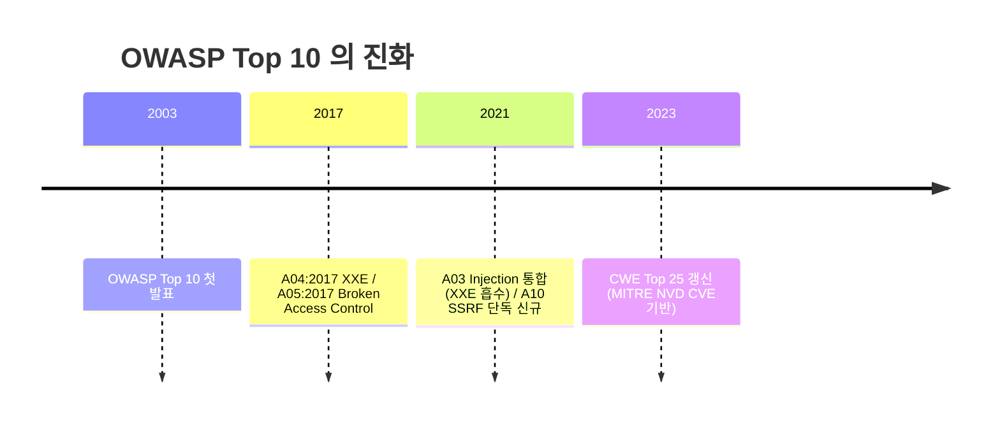
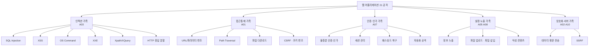
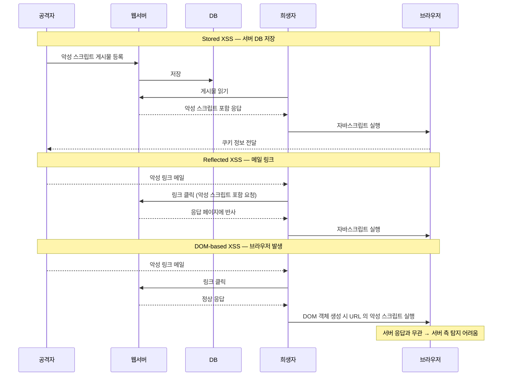
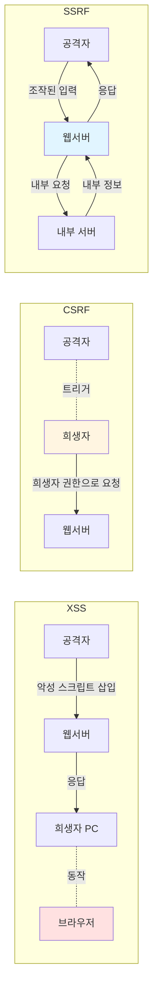
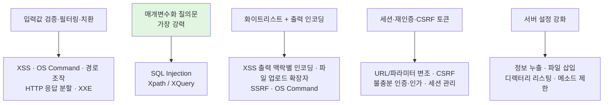

# 05. 웹 어플리케이션 공격과 OWASP — 만화책처럼 읽는 21 공격의 가족 지도

> **이 문서를 읽는 법**: 21 개 공격을 *5 가족*(인젝션·접근통제·인증·설정·암호화) 으로 묶고, 각 공격이 *어디서 발생하고*(클라이언트 / 웹서버 / DB) *어떤 방어로 막히는지*를 시간 순으로 따라가면 외울 게 정리됩니다. XSS·CSRF·SSRF처럼 **한 장소에만 속하지 않는** 공격은 *에피소드 1* 의 **조작된 요청 발생 주체** 기준으로 함께 본다.
> **분류 주의**: 위 *5 가족*은 **OWASP Top 10 (2021) 공식 10개 카테고리와 동일한 분류가 아니다.** 정보보안기사·본 노트 학습용으로 21개 취약점을 묶은 **재분류**이며, 공식 매핑은 *에피소드 1* 의 A01–A10 표를 따른다.
> 정확한 정의·수치·표준 번호는 정확본을 참조: [[cs/information-security/03.application-security/05.web-app-attacks|정확본 05. 웹 어플리케이션 공격과 OWASP]]

> **독자 가정**: *백엔드/풀스택 개발자, 웹 보안은 처음.* 이미 익숙한 개념 (`?id=1`, `<script>`, `Set-Cookie`, 세션 ID, prepared statement) 을 다리로 씁니다.

---

## 🎯 시작 전에 — 이미 쓰고 있는 (혹은 *깰 수 있는*) 것들

| 매일 보는 것 | 사실은 이 단원의 |
|---|---|
| `?id=1` 같은 쿼리스트링 | URL/파라미터 변조 (§13) |
| `prepared statement` / `?` 바인딩 | SQL Injection 의 *표준 방어* (§2) |
| `escape()` / `htmlentities()` 등 | XSS 방어의 *대표 예* — **본질은 출력 맥락별 인코딩**(HTML·속성·JS·URL 등) (§3) |
| 폼 제출 시 hidden 필드의 `_csrf` 토큰 | CSRF 토큰 (§4) |
| `` 자동 GET | CSRF *매개*가 될 수 있음 — **GET이 로그인 세션으로 상태 변경**(이체·삭제·설정 등)을 *일으키면* 특히 위험 (§4) |
| 백엔드의 webhook URL fetch | SSRF 의 *공격 표면* (§5) |
| `system()`·`exec()` | OS Command Injection (§6) |
| 업로드 디렉터리에 `.php` 파일 차단 | 파일 업로드 방어 (§7) |
| URL 의 `..%2f..%2fetc%2fpasswd` | Path Traversal (§9) |
| 카페에서 HTTP 로그인 | 데이터 평문 전송 (§21) |
| 비밀번호 시도 5회 후 캡차 | 자동화 공격 방어 (§20) |

> **이 단원의 본질**: 21 공격은 *공격자가 누구의 손을 빌려 무엇을 깨는가*로 가족을 이룬다. *공격자 → 희생자 (XSS·CSRF) / 공격자 → 서버 (SQLi·OS Cmd·SSRF) / 공격자 → 인증 (세션·인가)* — 한 줄 분류로 21 가지가 정리된다. (*5 가족*은 이 흐름을 외우기 위한 **노트 전용** 묶음이며 OWASP 10개 분류를 대체하지 않는다.)

---

## 📖 에피소드 1 — OWASP Top 10 + CWE Top 25 + XSS·CSRF·SSRF 3 약자

### 장면 1. OWASP Top 10 의 정체

> **OWASP (Open Worldwide Application Security Project) Top 10**: 웹 어플리케이션 보안 위험 중 가장 심각한 *10개*를 비영리 단체 OWASP 가 *주기적으로 발표*하는 목록. **2003년 첫 발표** 이래 약 *4년 주기*로 갱신.

### 장면 2. 2021 카테고리 10종

| 번호 | 카테고리 | 본 단원 매핑 |
|---|---|---|
| **A01:2021** | Broken Access Control | URL/파라미터 변조·불충분 인증·인가 |
| **A02:2021** | Cryptographic Failures | 데이터 평문 전송 |
| **A03:2021** | **Injection** | SQLi·OS Cmd·XXE·Xpath/XQuery |
| **A04:2021** | Insecure Design | 09 단원 시큐어 SDLC |
| **A05:2021** | Security Misconfiguration | 정보 누출, 06 단원 |
| **A06:2021** | Vulnerable and Outdated Components | 06 단원 |
| **A07:2021** | Identification and Authentication Failures | 세션 관리·패스워드 복구·자동화 |
| **A08:2021** | Software and Data Integrity Failures | 악성 컨텐츠 |
| **A09:2021** | Security Logging and Monitoring Failures | 06 단원 §6 웹 로그 |
| **A10:2021** | **Server-Side Request Forgery (SSRF)** | 신규 단독 카테고리 |

### 장면 3. CWE Top 25 (2023)

> **CWE (Common Weakness Enumeration) Top 25**: **MITRE** 가 **NVD CVE** 데이터를 분석하여 가장 위험한 소프트웨어 약점 *25개*를 *매년* 발표.

| CWE ID | 약점 | 본 단원 매핑 |
|---|---|---|
| **CWE-79** | Cross-Site Scripting (XSS) | §4 |
| **CWE-89** | SQL Injection | §2 |
| **CWE-78** | OS Command Injection | §7 |
| **CWE-22** | Path Traversal | §8 |
| **CWE-352** | Cross-Site Request Forgery (CSRF) | §5 |
| **CWE-918** | Server-Side Request Forgery (SSRF) | §6 |
| **CWE-434** | Unrestricted Upload of File with Dangerous Type | §8 |
| **CWE-611** | XML External Entities (XXE) | §9 |
| **CWE-287** | Improper Authentication | §10 |
| **CWE-269** | Improper Privilege Management | §10 |

### 장면 4. *3 약자의 구분* — 시험 빈출 1순위

| 공격 | *조작된 요청 발생 주체* | 공격 위치 | 핵심 메커니즘 |
|---|---|---|---|
| **XSS** | 희생자의 *웹 브라우저* | 클라이언트 | 악성 스크립트가 희생자 측에서 실행 |
| **CSRF** | 희생자 (사용자) | 클라이언트 → 웹서버 | *정상 사용자의 세션을 도용*해 조작된 요청 전송 |
| **SSRF** | *웹서버* (어플리케이션) | 웹서버 → 내부 서버 | 웹서버가 내부 서비스로 조작된 요청 전송 |

> **외우는 한 줄**: **XSS 는 희생자 PC**, **CSRF 는 희생자**, **SSRF 는 웹서버** 가 요청 발생 주체.

### 시험 함정

- "OWASP 첫 발표 연도?" → **2003**.
- "OWASP A10:2021 의 신규 단독 카테고리?" → **SSRF**.
- "본 노트 *5 가족* 이 OWASP Top 10 공식 분류와 동일?" → ❌ — **학습용 재분류**; 공식 10개는 에피소드 1 표.
- "CWE Top 25 발표 주기?" → *매년*.

---

## 📖 에피소드 2 — SQL Injection ①: 4 공격 방식 + 도구 3총사

### 장면 1. 정의

> **SQL Injection**: 웹 어플리케이션에서 *입력받아 데이터베이스로 전달*하는 정상적인 SQL 질의를 *변조·삽입*하여 비정상적인 DB 접근을 시도하는 기법.

### 장면 2. 영향 4종

- 인증 절차 없이 DB 접근 → 무단 *유출/변조*
- 사용자를 *피싱·악성코드 유포 사이트*로 유도
- *저장 프로시저*를 통한 OS 명령어 실행
- DB 의 개인정보 획득

### 장면 3. 무료 스캐너 3총사

| 도구 | 정체 |
|---|---|
| **Nikto** | GNU 기반 오픈소스. 웹서버 + SQL Injection 취약점 점검 (리눅스) |
| **SQLMap** | **Blind SQL Injection** 자동 수행. Python 개발 |
| **Absinthe** | GUI 기반. Blind SQL Injection 자동화 |

### 장면 4. 공격 *방식* 4 분류

| 분류 | 동작 |
|---|---|
| **Form SQL Injection** | HTML Form 인증 질의문의 *조건을 무조건 참*으로 만들어 인증 우회 |
| **Union SQL Injection** | `UNION SELECT` 로 다른 질의 결과를 *결합* |
| **Stored Procedure SQL Injection** | 저장 프로시저로 악의적 SQL 코드 삽입 |
| **Mass SQL Injection** | *한 번의 공격으로 대량의 DB 값 변조* — 홈페이지 치명적 영향 |

### 장면 5. Form SQL Injection — 인증 우회 4단계

```
[1] 공격자: 아이디 파라미터로 *조건절을 무조건 참*으로 만드는 입력값 삽입
[2] PHP 페이지: 파라미터 받아 질의문 수행
[3] ' or 1=1 → 조건 항상 참 → 모든 레코드 SELECT
[4] 주석 (#, --) 으로 그 이하 구문 주석 처리 → 인증 무력화
```

대표 페이로드: `' or 1=1#`, `" or "1"="1"#`, `" "a"="a"#`

### 장면 6. Union SQL Injection — 결과 결합 4단계

> SELECT 문의 *필드 개수가 같아야* 하며 *필드 타입이 호환*해야 한다는 SQL 문법을 이용.

```
[1] ORDER BY 문으로 컬럼 개수 파악 (에러 발생 여부)
[2] ORDER BY 4 에서 에러 → 컬럼 3개임을 판단
[3] 폼에 ' UNION SELECT 'admin','admin','admin'# 삽입
[4] 비밀번호로 admin 전달 → 패스워드를 admin 으로 변경
```

### 시험 함정

- "Form SQL Injection 의 핵심 기법?" → 조건절을 무조건 참 (`' or 1=1`).
- "Union SQL Injection 의 사전 조건?" → 필드 *개수와 타입 호환*.
- "Mass SQL Injection 의 영향?" → 대량 DB 변조 (js·swf·exe 악성코드 유포).

---

## 📖 에피소드 3 — SQL Injection ②: 공격 유형 + 5 대응 + 선처리 질의문

### 장면 1. 공격 *유형* 2 분류

| 분류 | 동작 |
|---|---|
| **Error-Based SQL Injection** | DB 질의 *에러값* 기반으로 점진적 정보 획득. *Union SQLi 의 특수 케이스* |
| **Blind SQL Injection** | *질의 결과의 참/거짓*으로 의도 없는 SQL 실행. *Form·Stored Procedure·Mass* 가 해당 |

### 장면 2. *공격 방식 ↔ 공격 유형* — 직교 분류

> **시험 함정**: *공격 방식 4 분류* (Form·Union·Stored Procedure·Mass) 와 *공격 유형 2 분류* (Error-Based·Blind) 는 **직교**. 같은 공격이 *두 분류 모두에 속할 수 있다*.

### 장면 3. 5 대응

| 대응 | 동작 |
|---|---|
| 사용자 권한 제한 | DB 사용자 권한 *최소화* |
| **선처리 질의문 (Prepared Statement)** | *사전 컴파일된 질의문* 사용. 입력은 *질의문 자체를 변경 불가* + 별도 매개변수로 전달 — **가장 강력한 방어** |
| 문자열 길이 제한 | 입력 길이 제한 + 숫자 입력은 숫자 체크 |
| 확장 프로시저 제거 | MS-SQL 의 `xp_cmdshell`·`xp_startmail`·`xp_sendmail` 제거 |
| 문자열 필터링 | SQL 특수문자·예약어 필터링. PHP 5.4+ 의 `mysql_real_escape_string()` |

### 장면 4. *왜* 선처리 질의문이 *표준 방어*인가

> **본질**: 질의문과 *데이터를 분리*. 입력값이 *코드가 아니라 데이터*로 취급됨 → 어떤 입력으로도 질의문 자체를 바꿀 수 없다.

> **시험 핵심**: SQL Injection 의 표준 방어는 **선처리 질의문**이지 *입력값 필터링이 아니다*. 필터링은 *보조 방어*이며 단독으로는 우회 가능.

### 매핑

| OWASP / CWE | 매핑 |
|---|---|
| OWASP Top 10 | **A03:2021 Injection** |
| CWE | **CWE-89** |

### 시험 함정

- "SQLi 의 *가장 강력한* 방어?" → **선처리 질의문 (Prepared Statement)**.
- "Error-Based 는 어느 *방식 분류*의 특수 케이스?" → **Union**.
- "MS-SQL 에서 제거할 확장 프로시저?" → `xp_cmdshell`·`xp_startmail`·`xp_sendmail`.

---

## 📖 에피소드 4 — XSS: Stored vs Reflected vs DOM-based + HTML Entity 9종

### 장면 1. 정의

> **XSS (Cross-Site Scripting)**: 웹 페이지에 *악성 스크립트를 삽입*할 수 있는 취약점. 사용자 입력값에 대한 필터링 미흡 시 *공격자가 입력*한 악성 스크립트가 *희생자 측에서 동작*.

> **XSS 의 핵심**: *삽입은 공격자가, 동작은 희생자 측에서* — 이 분리가 3 분류의 근거.

### 장면 2. Stored XSS — 서버 DB 에 *저장*

> **Stored XSS**: 공격자가 *취약한 웹서버에 악성 스크립트를 저장* → 클라이언트가 자료 요청 시 *응답 페이지에 악성 스크립트가 포함*되어 클라이언트 측에서 동작. *서버 DB 에 저장된 게시글*의 응답 페이지에서 발생.

```
[1] 공격자: 악성 스크립트 포함 게시물 등록
[2] 웹서버: DB 에 저장
[3] 희생자: 게시물 읽기 요청
[4] 웹서버: 악성 스크립트 포함 응답
[5] 자바스크립트가 희생자 PC 에서 동작
[6] 공격자 서버로 쿠키 정보 전달
```

### 장면 3. Reflected XSS — *URL 파라미터*에 반사

> **Reflected XSS**: 외부의 악성 스크립트가 *희생자 액션*에 의해 취약한 웹서버로 전달 → 응답 페이지에 *반사*되어 희생자 측에서 동작. *메일 링크를 통한 응답 페이지*에서 발생.

```
[1] 공격자: 악성 스크립트 포함 링크를 메일로 전송
[2] 희생자: 링크 클릭 → 악성 스크립트 포함 요청
[3] 웹서버: 악성 스크립트 포함 응답 페이지 생성
[4] 희생자 PC: 응답 페이지에 포함된 악성 스크립트 동작
```

### 장면 4. DOM-based XSS — *서버 응답과 무관하게 브라우저에서*

> **DOM-based XSS**: 희생자의 웹 브라우저에서 응답 페이지의 *자바스크립트가 동작*하면서 DOM 객체를 실행할 때, *URL 등에 포함된 악성 스크립트*가 희생자 측에서 동작. *DOM 객체로 인한 웹 브라우저에서 발생*.

> **DOM (Document Object Model)**: 문서 객체 모델. 웹페이지 내 모든 객체를 *조작·관리할 수 있는 계층 구조 모델*.

> **결정적 차이**: DOM-based XSS 는 *응답 페이지와 관계없이 웹 브라우저에서 발생* → *서버 응답을 검사해도 탐지되지 않을 수 있다*.

### 장면 5. 3 분류 한 표

| 구분 | Stored | Reflected | DOM-based |
|---|---|---|---|
| 악성 스크립트 위치 | *서버 DB* | URL 파라미터 (응답 포함) | URL 등 (*응답과 무관*) |
| 발생 위치 | 서버 응답 페이지 | 서버 응답 페이지 | *클라이언트 브라우저* |
| 영향 범위 | 게시물을 읽는 *모든 사용자* | 링크 클릭한 *희생자* | 링크 클릭한 *희생자* |
| 서버 측 탐지 | 가능 | 가능 | *어려움* |

### 장면 6. 대응 + HTML Entity 9종 (시험 빈출)

| 대응 | 동작 |
|---|---|
| 입력값 검증 | *반드시 서버 단에서* 수행 |
| **입력값 치환 (HTML Entity)** | HTML 코드로 인식될 수 있는 특수문자를 *HTML Entity 로 치환* — **출력 맥락**(본문·속성·스크립트 등)에 맞는 인코딩이 전제 |
| 태그 화이트리스트 | HTML 태그 허용 시 *화이트리스트* |

| 특수 문자 | HTML Entity |
|---|---|
| `<` | `&lt;` |
| `>` | `&gt;` |
| `(` | `&#x28;` |
| `)` | `&#x29;` |
| `&` | `&amp;` |
| `/` | `&#x2F;` |
| `"` | `&quot;` |
| `'` | `&#x27;` |
| `#` | `&#x23;` |

### 매핑

| OWASP / CWE | 매핑 |
|---|---|
| OWASP Top 10 | **A03:2021 Injection** |
| CWE | **CWE-79** |

> **시험 포인트**: XSS 의 공격 대상 정보는 보통 *세션 쿠키* (희생자 인증 정보) — 1차 방어가 [[cs/information-security/03.application-security/04.http-and-web-client|정확본 04 §5 HttpOnly]] 속성.

### 시험 함정

- "DOM-based XSS 가 서버 측 탐지 어려운 이유?" → *응답과 무관*하게 브라우저에서 발생.
- "Stored XSS 의 영향 범위?" → 게시물을 읽는 *모든 사용자*.
- "XSS 의 *핵심* 방어?" → **출력 맥락별 인코딩**이 본질 — HTML 본문 등에서는 **HTML Entity 치환**이 대표.

---

## 📖 에피소드 5 — CSRF: 희생자가 *모르게* 권한을 빌려준다

### 장면 1. 정의

> **CSRF (Cross-Site Request Forgery)**: 정상적인 경로를 통한 요청과 비정상적인 경로의 요청을 서버가 *구분하지 못할 경우*, 공격자가 스크립트 구문을 이용해 *정상 사용자가 조작된 요청을 전송하도록* 하는 취약점.

> **핵심 특성**: *조작된 요청 발생 주체 = 클라이언트(희생자)*. 희생자 모르게 공격자의 의도된 행위 수행. *공격당한 사용자의 권한*을 그대로 사용 → 사용자 권한 수준에 따라 피해 범위 결정.

### 장면 2. 5단계 공격 흐름

```
[1] 공격자: 조작된 요청정보를 담은 게시물을 웹서버에 등록 요청
[2] 웹서버: 조작된 게시물 DB 등록
[3] 희생자: 조작된 게시물 읽기 요청
[4] 웹서버: *희생자의 권한으로* 조작된 요청 처리
[5] 희생자 모르게 → 공격자가 조작한 비밀번호로 변경
```

### 장면 3. *왜 `` 태그가 무서운가*

CSRF 취약점 판단은 입력 가능한 폼에 **`` 태그의 `src` 속성**을 사용해 조작된 요청을 입력하여 진행하는 경우가 많다 — *게시글을 읽기만 해도* 브라우저가 `src` URL 에 대해 **GET** 을 보낸다. **위험한 것은** 그 GET 이 *멱등한 읽기*가 아니라 **로그인된 사용자 권한으로 상태를 바꾸는**(이체·삭제·비밀번호 변경 등) 처리와 결합될 때다. (원칙적으로 상태 변경은 **POST 등** 으로만 두는 것이 안전.)

### 장면 4. 4 대응

| 대응 | 동작 |
|---|---|
| **CSRF 토큰** | 모든 HTTP 요청 내에 *예측할 수 없는 임의의 토큰* 추가 → 정상/비정상 요청 판별 |
| 재인증 | 중요 기능에 대해 *세션 검증 + 재인증* 유도 |
| **XSS 취약점 제거** | XSS 와 공격 방식 유사 — *XSS 가 있으면 CSRF 토큰도 우회 가능* |
| **SameSite 쿠키** | [[cs/information-security/03.application-security/04.http-and-web-client|정확본 04 §5 SameSite]] — Cross-Site 요청에 쿠키 미전송 |

### 매핑

| OWASP / CWE | 매핑 |
|---|---|
| OWASP Top 10 (이전) | A05:2017 Broken Access Control 의 일부 (*2021부터는 별도 카테고리 X*) |
| CWE | **CWE-352** |

### 시험 함정

- "CSRF 의 *발생 주체*?" → *희생자 (사용자)*.
- "CSRF 토큰의 핵심 속성?" → *예측할 수 없는 임의의 토큰*.
- "CSRF 와 ``?" → 브라우저 **GET** 유발 — **상태 변경**이 GET 으로 처리될 때 세션과 결합해 위험.
- "XSS 가 있으면 CSRF 토큰도?" → *우회 가능*.

---

## 📖 에피소드 6 — SSRF: *웹서버*가 공격자의 손이 된다

### 장면 1. 정의

> **SSRF (Server-Side Request Forgery)**: 외부에 노출된 웹서버에 *취약한 어플리케이션이 존재*하는 경우, 공격자가 URL/요청 정보를 *위조*하여 접근통제를 우회 → *보호된 내부 서버의 정보 획득* 또는 비정상 행위 유도.

> **핵심 특성**: *조작된 요청 발생 주체 = 웹서버(어플리케이션)*. 외부에서 직접 접근할 수 없는 *내부 네트워크의 자원*에 웹서버를 *경유*해 접근.

### 장면 2. CSRF vs SSRF — 시험 빈출 1순위

| 구분 | CSRF | SSRF |
|---|---|---|
| 조작된 요청 *발생 주체* | 희생자 (사용자) | **웹서버** (어플리케이션) |
| 공격자의 직접 통신 대상 | 웹서버 (희생자 경유) | 웹서버 |
| 피해 대상 | 정상 사용자 권한의 자원 | **내부 네트워크 자원** |

### 장면 3. 4단계 공격 흐름

```
[1] 공격자: 웹서버의 *내부 요청을 조작*할 수 있도록 사용자 요청 조작
[2] 웹서버: 조작된 *내부 서버 서비스 요청* 수행
[3] 내부 서버: 자신의 내부 정보를 웹서버에 응답
[4] 웹서버: 내부 정보를 공격자에게 응답
```

### 장면 4. 3 대응

| 대응 | 동작 |
|---|---|
| **화이트리스트 설정** | 입력값을 *다른 시스템 서비스 호출*에 사용할 경우 *화이트리스트 필터링* |
| 블랙리스트 선정 | 무작위 입력값 사용 시 *블랙리스트 필터링* |
| 요청 처리 | *동일 내부 네트워크라도* 인증·접근 권한 확인 후 처리 |

### 매핑

| OWASP / CWE | 매핑 |
|---|---|
| OWASP Top 10 | **A10:2021 Server-Side Request Forgery (SSRF)** — *단독 카테고리로 신규 등재* |
| CWE | **CWE-918** |

### 시험 함정

- "SSRF 의 *발생 주체*?" → **웹서버** (어플리케이션).
- "OWASP A10:2021 의 *신규 단독 카테고리*?" → SSRF.
- "SSRF 의 1차 방어?" → *화이트리스트* (블랙리스트는 보조).

---

## 📖 에피소드 7 — OS Command Injection: `system()`·`exec()` 의 함정

### 장면 1. 정의

> **OS Command Injection**: 적절한 검증 없이 *사용자 입력값이 운영체제 명령어의 일부 또는 전부*로 구성되어 실행 → *의도하지 않은 시스템 명령어*가 실행되는 취약점.

`system()`·`exec()` 같은 *시스템 명령어 실행 함수*를 제공하는 웹 어플리케이션에서 입력값 필터링 미흡 시 발생. 공격자는 *시스템 계정 정보 유출, 백도어 설치, 관리자 권한 탈취* 등을 진행할 수 있다.

### 장면 2. 3단계 공격 흐름

```
[1] 공격자: 파라미터에 OS 명령어 삽입하여 웹서버에 요청
[2] 웹서버: 입력값 필터링 미흡 → OS 명령어 실행
[3] 명령어 실행 결과를 공격자에게 응답
```

### 장면 3. 취약점 *판별* 명령

| OS | 판별용 명령 |
|---|---|
| 리눅스/유닉스 | `ls`·`cat` |
| 윈도우 | `dir`·`config` |

### 장면 4. 3 대응

| 대응 | 동작 |
|---|---|
| **문자열 필터링** | 명령어 실행 가능 문자 (`;`·`&&`·`||`·`|`) *필터링/치환* |
| 보안장비 운영 | 보안 장비 룰셋 적용 |
| **화이트리스트 선정** | *허용 명령어 리스트*만 실행 |

### 매핑

| OWASP / CWE | 매핑 |
|---|---|
| OWASP Top 10 | **A03:2021 Injection** |
| CWE | **CWE-78** |

### 시험 함정

- "OS Command 필터링 4 문자?" → `;`·`&&`·`||`·`|`.
- "취약 함수?" → `system()`·`exec()`.

---

## 📖 에피소드 8 — 파일 3총사: 업로드·다운로드·Path Traversal

### 장면 1. 파일 업로드 — *웹쉘의 진입로*

> **파일 업로드 취약점**: 업로드 파일에 적절한 제어가 없을 경우 **웹쉘** 등 허가되지 않은 파일이 업로드되거나 *대량 파일로 시스템 부하/장애 유발*하는 취약점.

> **웹쉘 (Web Shell)**: *악의적 목적으로 웹서버 내 임의의 명령 실행*이 가능한 *서버 사이드 스크립트 파일*. 다양한 언어로 만들어진다.

**3 대응 — 다층 방어**

| 대응 | 동작 |
|---|---|
| 파일 검증 | 파일 타입 + *확장자* 모두 검증 |
| 업로드 크기 제한 | `LimitRequestBody` 지시자 |
| **실행 방지/호출 방지** | 업로드 디렉터리 *서버 사이드 스크립트 실행 차단* + *직접 URL 호출 차단* |

**Apache 환경 설정 예시**

```
# 업로드 크기 제한
<Directory "/var/www/upload">
    LimitRequestBody 5000000
</Directory>

# .htaccess — 실행/호출 차단
<FilesMatch "\.(ph|inc|lib)">
    Order allow, deny
    Deny from all
</FilesMatch>
AddType text/html .html .htm .php
```

> `AddType` 은 *서버 사이드 스크립트 실행 차단*, `FilesMatch` 는 *직접 URL 호출 차단*.

### 장면 2. 파일 다운로드 — *중요 파일* 노출

> **파일 다운로드 취약점**: 파일 다운로드 시 *경로/파일명 파라미터*를 적절히 필터링하지 않으면, 공격자가 조작하여 *허용되지 않은 파일 다운로드* 가능.

→ *시스템 환경설정·소스 코드·DB 연동 파일* 등 중요 파일 노출.

### 장면 3. Path Traversal — `../` 와 인코딩

> **Path Traversal (경로 순회)**: 파일/디렉터리 접근이 통제되지 않아 *웹서버/웹 어플리케이션의 중요 파일·데이터*에 접근·실행 허용되는 취약점.

루트 디렉터리를 벗어나 시스템 주요 파일에 접근 — **상대 경로 참조 (`../`)** 사용.

**경로 조작 문자 + URL 인코딩**

| 문자 | URL 인코딩 |
|---|---|
| `.` (dot) | **`%2e`** |
| `/` (slash) | **`%2f`** |
| `\` (back-slash) | **`%5c`** |

**3 대응**

| 대응 | 동작 |
|---|---|
| 웹 루트 디렉터리 설정 | 시스템 루트로 접근 차단 (**`chroot`**) |
| 문자열 필터링 | 경로 조작 문자 필터링 |
| 보안장비 운영 | 룰셋 적용 |

> **chroot**: Change Root Directory 의 줄임말. 임시 루트 디렉터리 설정. 시스템 루트인 `/` 가 아닌 *임의 디렉터리를 루트인 것처럼* 설정 → *불필요한 루트 접근 차단*.

### 매핑

| 공격 | OWASP | CWE |
|---|---|---|
| 파일 업로드 | A03:2021 (간접) / A04:2021 Insecure Design | **CWE-434** |
| Path Traversal | **A01:2021 Broken Access Control** | **CWE-22** |

### 시험 함정

- "파일 업로드 다층 방어 3 요소?" → *확장자 검증* + *실행 차단* + *직접 URL 호출 차단*.
- "Path Traversal 의 핵심 문자 인코딩?" → `%2e` (.) `%2f` (/) `%5c` (\).
- "chroot 의 풀이?" → Change Root Directory.

---

## 📖 에피소드 9 — File Inclusion + XML 계열 (XXE·Xpath/XQuery)

### 장면 1. 파일 삽입 — LFI vs RFI

> **파일 삽입 취약점**: 공격자가 *악성 서버 스크립트*를 서버에 전달하여 *해당 페이지를 통해 악성코드가 실행*되도록 하는 취약점.

> **include 함수**: *지정한 페이지를 현재 페이지에 포함*해 실행시켜 주는 함수.

**악성 스크립트 위치 기준 2 분류**

| 분류 | 약자 | 동작 |
|---|---|---|
| **LFI** | Local File Inclusion | *서버에 FTP·자료실로 악성 코드 업로드* 후 include |
| **RFI** | Remote File Inclusion | *외부 서버의 악성 코드를 불러와* include |

**3 대응**

| 대응 | 동작 |
|---|---|
| 소스코드 확인 | `include`·`require` 구문/함수 검증 |
| **원격 파일 접근 제한** | 외부 파일이 URL 형태로 include 되지 않도록. PHP `php.ini` 의 **`allow_url_fopen = Off`** |
| 에러 페이지 출력 제한 | PHP `display_errors = Off` |

> **시험 함정**: `allow_url_fopen=Off` 는 **RFI (원격 파일 삽입) 방어**이지 *LFI 방어가 아니다*.

### 장면 2. XXE Injection — 외부 개체의 함정

> **XXE (XML External Entity) Injection**: 취약한 *XML 파서*가 외부 개체를 참조하는 XML 데이터 처리 시, 공격자가 삽입한 *공격 구문이 포함된 외부 개체*가 동작하여 악의적 행위.

> **XML 파서**: XML 문서의 평문 데이터를 읽어 *문법 검사 + XML DOM 객체 등으로 변환*해 주는 도구.

> **DTD (Document Type Definition)**: XML 문서에서 *XML 객체의 정의*를 선언하는 부분. 외부 개체는 **`SYSTEM` 키워드**로 정의.

**3 공격 형태**

| 형태 | 동작 |
|---|---|
| 중요 파일 접근 | 웹서버의 중요파일을 참조하는 *foo 외부 개체* 포함 |
| 내부 서비스 요청 | URL 경로 *서비스 요청 결과*를 참조하는 foo 외부 개체 포함 |
| 서비스 거부 공격 | XML 내 *하나의 개체가 다른 개체를 반복적으로 참조* (**Billion Laughs Attack**) |

**2 대응**

| 대응 | 동작 |
|---|---|
| **외부 개체 비활성화** | XML 파서의 *외부 개체 참조 기능 비활성화*. PHP 의 **`libxml_disable_entity_loader(true)`** |
| DTD 필터링 | 외부 개체 선언 DTD 필터링 |

### 장면 3. Xpath / XQuery Injection

> **Xpath/XQuery Injection**: DB 연동 웹 어플리케이션에서 Xpath/XQuery 질의문 필터링 미흡 시, 공격자가 폼에 *조작된 질의문을 삽입*하여 인증 우회 → 인가되지 않은 데이터 열람.

| 대응 | 동작 |
|---|---|
| 필터링 | 외부 입력 데이터의 *특수문자·예약어 필터링* |
| **인자화된 질의문** | *스트링 연결이 아닌 인자(파라미터)화* 된 질의문 사용 |

> XQuery Injection 방어 패턴은 SQL Injection 의 *선처리 질의문*과 본질 동일 — **질의문과 데이터의 분리**.

### 매핑

| 공격 | OWASP | CWE |
|---|---|---|
| XXE | A03:2021 Injection (이전 *별도 A04:2017 XXE*) | **CWE-611** |

### 시험 함정

- "LFI vs RFI 차이?" → 악성 스크립트 *위치* (로컬 vs 원격).
- "RFI 방어 PHP 설정?" → **`allow_url_fopen = Off`**.
- "Billion Laughs Attack 은 어느 카테고리?" → XXE 의 서비스 거부.
- "XML 외부 개체 키워드?" → **`SYSTEM`**.

---

## 📖 에피소드 10 — 인증·세션·접근통제 군 (URL/파라미터 변조 + 세션 관리 + 인증·인가)

### 장면 1. URL/파라미터 변조 — 모든 입력값 검증 누락의 우산

> **URL/파라미터 변조 취약점**: 실행 경로에 대해 **접근제어·인가(Authorization)** 검증을 하지 않거나 불완전하게 구현하여 공격자가 *URL/파라미터값을 조작*해 본인이 허용되지 않은 자원·기능에 접근하는 경우.

→ *입력값 검증 누락의 모든 상황*을 포함 → SQL Injection·불충분 인증·인가·XSS 에 활용 가능.

```
[1] 공격자: 정보수정 페이지 요청
[2] 웹 프록시로 id 파라미터를 admin 으로 변조
[3] 웹서버: 관리자 정보수정 페이지 응답
```

**2 대응**

| 대응 | 동작 |
|---|---|
| 서버 측 세션 이용 | 파라미터가 아닌 *서버 측 세션 정보* 사용 |
| 페이지 재인증 | 중요 정보 페이지는 *재인증* |

### 장면 2. 불충분한 세션 관리 — HTTP 세션 하이재킹

> **불충분한 세션 관리**: 로그인할 때 *매번 동일한 세션 ID 발급* 또는 *세션 타임아웃이 너무 길게 설정*되었을 경우, 공격자가 *다른 사용자의 세션을 재사용*하여 권한 탈취.

> **HTTP 세션 하이재킹**: 탈취한 세션 ID 로 *다른 브라우저에서 계정 세션 가로채기*.

**4 대응**

| 대응 | 동작 |
|---|---|
| **랜덤 세션 ID** | 로그인마다 *추측 불가능한 랜덤*으로 새 발급 |
| 세션 타임아웃 | PHP `session.gc_maxlifetime = 600` |
| **HttpOnly 쿠키** | `session.cookie_httponly = 1` — 스크립트 참조 차단 |
| **Secure 쿠키** | `session.cookie_secure = 1` — HTTPS 에만 전송 |

### 장면 3. 불충분한 인증 및 인가

> **인증 (Authentication)**: 자신의 신원을 *알리고 정말로 신원이 올바른지 증명*하는 과정.
> **인가 (Authorization)**: 인증에 성공한 사용자를 대상으로 *자원에 대한 접근/사용 허용 결정*.

> **불충분한 인증·인가 취약점**: 개인정보 수정·통합 로그인 등에서 *사용자 인증 미흡* 시, *파라미터 전달값 수정*으로 사용자 도용·개인정보 노출 발생.

**2 대응**

| 대응 | 동작 |
|---|---|
| 아이디 정보 비교 | 로그인 사용자 아이디를 *세션에 저장* + 전달 파라미터 비교 |
| 세션 활용 | *파라미터로 변수 전달 ❌* → *세션을 통한 변수 저장·관리* |

### 매핑

| 공격 | OWASP | CWE |
|---|---|---|
| URL/파라미터 변조 | **A01:2021 Broken Access Control** | CWE-639 |
| 세션 관리 | **A07:2021 Identification and Authentication Failures** | CWE-384·CWE-613 |
| 불충분 인증·인가 | A01:2021 / A07:2021 | **CWE-287·CWE-269** |

### 시험 함정

- "Session Fixation·Insufficient Session Expiration 의 CWE?" → CWE-384·CWE-613.
- "인증 ↔ 인가?" → 신원 증명 vs 자원 접근 허용.
- "파라미터 변조 방어의 본질?" → *서버 측 세션 사용* + **인가(접근 권한) 검증**.

---

## 📖 에피소드 11 — HTTP 응답 분할 + 정보 누출 + 악성 컨텐츠

### 장면 1. HTTP 응답 분할 — CRLF 의 무기화

> **HTTP 응답 분할 (Response Splitting)**: 클라이언트 HTTP 요청에 포함된 파라미터값이 HTTP 응답 헤더에 *그대로 포함*되어 클라이언트에 다시 전달될 때, 파라미터값에 *개행문자 CR + LF* 가 포함되면 응답이 *2개 이상으로 분리*될 수 있는 취약점.

> **본질**: [[cs/information-security/03.application-security/04.http-and-web-client|정확본 04 §2 HTTP 메시지 구조]] 의 *헤더 끝을 빈 라인 (CRLF + CRLF) 으로 식별* 하는 메커니즘 악용. 공격자가 입력값에 **`%0D%0A%0D%0A`** 삽입 → 응답이 둘로 분할 → 두 번째 응답에 악의적 코드 주입 → XSS 수행.

**4단계 흐름**

```
[1] 희생자: cookieValue 파라미터가 조작된 링크 클릭
[2] 요청 메시지가 웹서버에 전달 (개행문자로 두 번째 응답 메시지 포함)
[3] 응답 헤더에 Set-Cookie: nickname 설정
[4] Content-Length: 0 헤더 이후의 개행문자 연속 2개 → 응답 메시지 2개로 분할
```

**대응**: 클라이언트 요청 파라미터가 응답 헤더 (`Set-Cookie`·`Location` 등) 로 사용될 경우 **`%0D`·`%0A` 검사** + 필터링.

### 장면 2. 정보 누출 — 디폴트 페이지·에러 메시지

> **정보 누출 취약점**: 민감한 정보가 *개발자 부주의*로 노출. *주석 구문에 중요 정보* 또는 *에러 페이지·메시지로 불필요한 정보* 노출.

| 노출 형태 | 설명 |
|---|---|
| 디폴트 에러 페이지 | *응답 코드·웹서버 정보* 노출 |
| 에러 메시지 | *시스템·파일 정보* 노출 |

**2 대응**

| 대응 | 동작 |
|---|---|
| **에러 페이지 등록** | `httpd.conf` 의 **`ErrorDocument`** 지시자로 에러 코드별 페이지 등록 |
| 에러 메시지 제한 | `php.ini` 의 `display_errors = Off` |

```
# httpd.conf
ErrorDocument 403 /home/security/error_page.php
ErrorDocument 404 /home/security/error_page.php
```

### 장면 3. 악성 컨텐츠 — *3 취약점의 합성 결과*

> **악성 컨텐츠 취약점**: 입력값 필터링 미흡 시, 공격자가 *악성 컨텐츠 삽입* → 페이지 접속 사용자에게 *악성코드 유포 사이트 자동 호출* → 악성코드 감염.

> **본질**: 악성 컨텐츠는 *SQLi + XSS + 파일 업로드*를 통해 삽입되므로, 본 취약점 대응 = *해당 3 취약점의 제거*.

| 대응 | 참조 |
|---|---|
| SQL Injection 제거 | §2·§3 |
| XSS 제거 | §4 |
| 파일 업로드 제거 | §8 |

### 매핑

| 공격 | OWASP | CWE |
|---|---|---|
| 정보 누출 | **A05:2021 Security Misconfiguration** | CWE-209 |
| 악성 컨텐츠 | **A08:2021 Software and Data Integrity Failures** | — |

### 시험 함정

- "응답 분할 핵심 페이로드?" → **`%0D%0A%0D%0A`**.
- "정보 누출의 1차 방어?" → `ErrorDocument` (httpd.conf).
- "악성 컨텐츠 = ?" → *SQLi + XSS + 파일 업로드 합성*.

---

## 📖 에피소드 12 — 패스워드 복구 + 자동화 + 평문 전송 + 쿠키 변조

### 장면 1. 취약한 패스워드 복구

> **취약한 패스워드 복구 취약점**: 비밀번호 찾기 또는 관리자 임시 비밀번호 발급 시 *사용자 인증 미흡* 또는 *비밀번호를 화면에 즉시 출력*하는 경우, 공격자가 다른 사용자 비밀번호 *획득·변경·복구* 가능.

| 대응 | 동작 |
|---|---|
| 본인인증 메커니즘 | *추측 불가능*하게 구현 |
| 난수 값 사용 | 임시 패스워드 발급 시 *안전한 난수* |

### 장면 2. 자동화 공격 — CAPTCHA

> **자동화 공격 취약점**: 특정 프로세스 *접근시도 횟수 제한 미설정* 시, 공격자가 자동화 도구·봇으로 *1분에 수백 번 접근 시도* 가능 → 시스템 성능 영향.

| 대응 | 동작 |
|---|---|
| **CAPTCHA** | *사람인지 컴퓨터 프로그램인지 구별* |
| 접근시도 횟수 제한 | 일정 횟수 이상 시도 시 *자동화 공격으로 인식*하여 차단 |

> **CAPTCHA (Completely Automated Public Turing test to tell Computers and Humans Apart)**: 사람이 쉽게 인식할 수 있는 *임의의 문자/숫자를 그림으로 변환*. 제시된 문자는 *왜곡·덧칠*되어 기계 자동 인식이 어려운 상태.

### 장면 3. 데이터 평문 전송

> **데이터 평문 전송 취약점**: 민감 데이터가 *평문으로 통신채널 송수신* → 공격자가 *스니핑*으로 획득.

| 대응 | 동작 |
|---|---|
| 송수신 암호화 | 중요 데이터 송수신 시 *암호화* — 감청해도 내용 알 수 없도록 |
| **보안 서버 적용** | 중요 정보 사용 구간에 **SSL** 등 암호화 통신 ([[cs/information-security/03.application-security/06.web-server-hardening|정확본 06 §보안 서버]] cross-ref) |

### 장면 4. 쿠키 변조

> **쿠키 변조 취약점**: 사용자 인증 방식 중 하나인 *쿠키를 변조*하여 *다른 사용자로 전환* 또는 *권한 상승* 가능.

| 대응 | 동작 |
|---|---|
| **세션 방식** | 쿠키 대신 *세션 방식* 권장 |
| 암호화 적용 | 쿠키 사용 필수 시 *암호화* |

### 매핑

| 공격 | OWASP | CWE |
|---|---|---|
| 패스워드 복구 | A07:2021 | — |
| 자동화 | A07:2021 | — |
| 평문 전송 | **A02:2021 Cryptographic Failures** | CWE-319 |
| 쿠키 변조 | A01:2021 / A07:2021 | — |

### 시험 함정

- "CAPTCHA 풀이?" → Completely Automated Public Turing test to tell Computers and Humans Apart.
- "평문 전송 OWASP?" → A02:2021 *Cryptographic Failures*.
- "쿠키 변조 1차 대응?" → 세션 방식.

---

## 📖 에피소드 13 — 방어 패턴 종합: 5 패턴 ↔ 21 공격

### 장면 1. 5 방어 패턴

위 21 개 취약점은 **5 개의 공통 방어 패턴**으로 수렴.

| 방어 패턴 | 적용 공격 |
|---|---|
| **입력값 검증·필터링·치환** | XSS, SQLi (보조), OS Command, 경로 조작, 파일 업로드, HTTP 응답 분할, XXE, Xpath/XQuery, 악성 컨텐츠 |
| **매개변수화 / 인자화 질의문** | SQL Injection, Xpath/XQuery Injection (*가장 강력*) |
| **화이트리스트 + 출력 인코딩** | XSS, 파일 업로드 (확장자), SSRF, OS Command |
| **세션·재인증·CSRF 토큰** | URL/파라미터 변조, CSRF, 불충분 인증·인가, 세션 관리 |
| **서버 설정 강화** | 정보 누출, 파일 삽입, 디렉터리 리스팅 (06 단원), 메소드 제한 (06 단원) |

### 장면 2. *입력값 검증의 한계* — 시험 빈출 함정

> **입력값 검증은 모든 인젝션의 1차 방어이지만 *그것만으로는 충분하지 않다*.**
> - SQL Injection 표준 방어 = *선처리 질의문* (입력값 검증 ❌)
> - XSS 핵심 방어 = *출력 **맥락별** 인코딩* (HTML 본문 등에서는 **HTML Entity 치환**이 대표) (입력만으로 차단 ❌)
> - 모범 사례: **입력 시점이 아닌 출력 시점에 이스케이프** — 맥락(HTML·속성·JS·URL)에 맞게 적용.

### 장면 3. *7 시험 함정 정리*

| # | 함정 | 정답 |
|---|---|---|
| 1 | SQL Injection 표준 방어? | **선처리 질의문** (입력값 필터링 ❌) |
| 2 | XSS 핵심 방어? | **출력 맥락별 인코딩** — HTML 본문 등 **HTML Entity 치환**이 시험 대표 |
| 3 | CSRF ↔ SSRF? | *조작된 요청 발생 주체* (희생자 vs 웹서버) |
| 4 | DOM-based XSS 의 특이점? | *서버 응답과 무관*하게 브라우저 발생 |
| 5 | `allow_url_fopen=Off` 가 막는 것? | **RFI** (LFI 아님) |
| 6 | HTTP 응답 분할의 핵심 수단? | **개행문자 (`%0D`·`%0A`)** |
| 7 | 파일 업로드 방어 핵심? | *확장자 검증* + *실행 차단* + *직접 URL 호출 차단* (다층) |

---

## 📑 종합 비교 (에피소드 2~12 → OWASP·CWE 매핑)

OWASP Top 10 (2021) ↔ 본 단원 21 공격 — *카테고리별로 묶어 본다*.

| OWASP | 본 단원 공격 |
|---|---|
| **A01: Broken Access Control** | URL/파라미터 변조, Path Traversal, 불충분 인증·인가, 쿠키 변조 |
| **A02: Cryptographic Failures** | 데이터 평문 전송 |
| **A03: Injection** | SQLi, OS Command, XXE, Xpath/XQuery, XSS |
| **A04: Insecure Design** | (09 단원 시큐어 SDLC) + 파일 업로드 |
| **A05: Security Misconfiguration** | 정보 누출 (06 단원 §1·§2 함께) |
| **A06: Outdated Components** | (06 단원) |
| **A07: Identification and Authentication Failures** | 세션 관리, 패스워드 복구, 자동화 공격 |
| **A08: Software and Data Integrity Failures** | 악성 컨텐츠 |
| **A09: Logging Failures** | (06 단원 §6 웹 로그) |
| **A10: SSRF** | SSRF (단독 신규) |

---

## 🗺️ 마인드맵 1 — OWASP Top 10 시간선



**읽는 법**: 2017 의 *A04 XXE* 가 2021 에 *A03 Injection 으로 흡수*. 2017 의 CSRF 별도 카테고리는 *2021부터 별도 카테고리 X*. SSRF 는 *2021 에 단독 신규 등재*.

---

## 🗺️ 마인드맵 2 — 21 공격의 5 가족 분류

**읽는 법**: 아래 *5 가족*은 **OWASP Top 10 공식 분류가 아니라** 본 노트의 학습용 재묶음이다. 각 가족 옆 A01·A03 등은 **대응되는 OWASP 카테고리 참고용**이다.



---

## 🗺️ 마인드맵 3 — XSS 3 분류 비교



---

## 🗺️ 마인드맵 4 — XSS·CSRF·SSRF 3 약자 차이



**읽는 법**: 발생 주체가 다르다 — XSS=브라우저 / CSRF=희생자 / SSRF=웹서버.

---

## 🗺️ 마인드맵 5 — 5 방어 패턴 ↔ 공격 매핑



**읽는 법**: 입력값 검증 (D1) 은 *1차 방어이지만 충분하지 않다*. SQLi 는 *D2 (선처리 질의문)*, XSS 는 *D3 (출력 **맥락별** 인코딩 — 대표로 HTML Entity)* 가 표준.

---

## 🗂️ 키워드 클러스터

### OWASP Top 10 2021 카테고리

```
A01 Broken Access Control          — URL 변조 · Path Traversal · 인증·인가
A02 Cryptographic Failures         — 평문 전송
A03 Injection                       — SQLi · XSS · OS Cmd · XXE · Xpath/XQuery
A04 Insecure Design                 — 09 단원 SDLC
A05 Security Misconfiguration       — 정보 누출 · 06 단원
A06 Vulnerable and Outdated Components — 06 단원
A07 Identification and Authentication Failures — 세션 관리 · 패스워드 복구 · 자동화
A08 Software and Data Integrity Failures — 악성 컨텐츠
A09 Logging Failures               — 06 단원 웹 로그
A10 SSRF                            — 단독 신규
```

### CWE 핵심 10 종

```
CWE-79  XSS                    | CWE-89  SQL Injection
CWE-78  OS Command Injection   | CWE-22  Path Traversal
CWE-352 CSRF                   | CWE-918 SSRF
CWE-434 파일 업로드             | CWE-611 XXE
CWE-287 Improper Authentication | CWE-269 Improper Privilege Management
```

### SQL Injection 분류

```
공격 방식 — Form · Union · Stored Procedure · Mass
공격 유형 — Error-Based (Union 의 특수) · Blind (Form·Stored·Mass)
도구    — Nikto · SQLMap · Absinthe
```

### XSS 3 분류

```
Stored      — 서버 DB 저장 (게시판)
Reflected   — URL 파라미터 반사 (메일 링크)
DOM-based   — 브라우저 발생 (서버 응답 무관)
```

### 자주 헷갈리는 3 약자

| 약자 | 발생 주체 | 1차 방어 |
|---|---|---|
| **XSS** | 희생자 브라우저 | HTML Entity 치환 + HttpOnly |
| **CSRF** | 희생자 (사용자) | CSRF 토큰 + SameSite |
| **SSRF** | 웹서버 | 화이트리스트 + 내부 인증 |

### 핵심 PHP 설정

```
php.ini      allow_url_fopen = Off       — RFI 방어
              display_errors = Off         — 에러 메시지 제한
              session.gc_maxlifetime = 600 — 세션 타임아웃
              session.cookie_httponly = 1  — HttpOnly
              session.cookie_secure = 1    — Secure (HTTPS)
              libxml_disable_entity_loader(true) — XXE 방어
```

### URL 인코딩 (Path Traversal·HTTP 응답 분할)

```
%2e — . (dot)        %0D — CR (Carriage Return)
%2f — / (slash)      %0A — LF (Line Feed)
%5c — \ (back-slash) %0D%0A — CRLF (헤더 구분)
%0D%0A%0D%0A — 빈 라인 (HTTP 응답 분할 페이로드)
```

### Apache 지시자

```
LimitRequestBody  — 업로드 크기 제한
FilesMatch        — 직접 URL 호출 차단
AddType           — 서버 사이드 스크립트 실행 차단
ErrorDocument     — 에러 페이지 등록
.htaccess         — 디렉터리별 설정
```

---

## 🃏 회상 30문항

> 답을 가린 뒤 자가 채점. 틀린 것만 정확본으로 깊이 학습.

**A. OWASP·CWE·3 약자 (1~6)**
1. OWASP Top 10 첫 발표 연도와 갱신 주기?
2. OWASP A10:2021 의 *신규 단독 카테고리*?
3. CWE Top 25 발표 주체와 주기?
4. XSS·CSRF·SSRF 의 *발생 주체*?
5. CWE-79·CWE-89·CWE-78 의 약점?
6. 2017 → 2021 카테고리 변화 *2가지*?

**B. SQL Injection (7~12)**
7. SQLi 공격 *방식 4 분류*?
8. SQLi 공격 *유형 2 분류*?
9. Form SQLi 의 대표 페이로드?
10. Union SQLi 의 사전 조건?
11. SQLi 의 *표준 방어*?
12. 무료 스캐너 3총사?

**C. XSS·CSRF·SSRF (13~18)**
13. Stored vs Reflected vs DOM-based 발생 위치?
14. DOM-based XSS 가 *서버 측 탐지 어려운* 이유?
15. XSS 의 핵심 방어(출력 맥락별 인코딩)와 HTML Entity 9종 중 `<`·`>`?
16. CSRF 의 *4 대응*?
17. CSRF vs SSRF *발생 주체*?
18. SSRF 의 1차 방어?

**D. 파일·XML 계열 (19~24)**
19. OS Command 필터링 4 문자?
20. 파일 업로드 *다층 방어 3 요소*?
21. Path Traversal 핵심 문자 인코딩?
22. LFI vs RFI 차이?
23. RFI 방어 PHP 설정?
24. XXE 의 외부 개체 키워드?

**E. 인증·세션·서버 (25~30)**
25. URL/파라미터 변조의 *대응 본질*?
26. Session Fixation 의 CWE?
27. 인증 ↔ 인가의 차이?
28. HTTP 응답 분할의 핵심 페이로드?
29. CAPTCHA 풀이?
30. 5 방어 패턴 중 *가장 강력한* 것?

---

## ⚠️ 시험 함정 모음

| 함정 | 정답 |
|---|---|
| OWASP Top 10 첫 발표? | **2003** |
| 본 노트 *5 가족* = OWASP 공식 10개? | ❌ — **학습용 재분류**; 공식은 A01–A10 표 |
| OWASP A10:2021 신규? | **SSRF** |
| XSS·CSRF·SSRF 발생 주체? | 브라우저·희생자·웹서버 |
| SQLi 공격 방식 4 분류? | Form·Union·Stored Procedure·Mass |
| SQLi 공격 유형 2 분류? | Error-Based·Blind |
| Error-Based 는 어느 *방식*의 특수? | **Union** |
| SQLi 표준 방어? | **선처리 질의문** (Prepared Statement) |
| XSS 3 분류 발생 위치? | DB / 응답 페이지 / 브라우저 |
| DOM-based XSS 탐지? | 서버 측 *어려움* |
| XSS 핵심 방어? | **출력 맥락별 인코딩** — 시험에서는 **HTML Entity 치환**이 정답으로 자주 출제 |
| CSRF 발생 주체? | *희생자* |
| SSRF 발생 주체? | *웹서버* |
| OWASP A10 단독 신규? | SSRF |
| `` 태그가 CSRF 에 쓰일 때? | `src` 가 **GET** 유발 — *세션 쿠키와 함께* **상태 변경 URL** 이면 위험 (읽기 전용 GET 은 상대적으로 덜함) |
| OS Command 필터링 문자? | `;`·`&&`·`||`·`|` |
| 웹쉘 정의? | 서버 사이드 스크립트로 임의 명령 실행 |
| Path Traversal 인코딩? | `%2e`·`%2f`·`%5c` |
| chroot 풀이? | Change Root Directory |
| `allow_url_fopen=Off` 방어? | **RFI** (LFI ❌) |
| Billion Laughs Attack? | XXE 의 *서비스 거부* |
| XML 외부 개체 키워드? | **`SYSTEM`** |
| 응답 분할 페이로드? | **`%0D%0A%0D%0A`** |
| 정보 누출 방어 지시자? | **`ErrorDocument`** |
| 악성 컨텐츠 = ? | SQLi + XSS + 파일 업로드 합성 |
| CAPTCHA 풀이? | Completely Automated Public Turing test... |
| 평문 전송 OWASP? | A02:2021 |
| 가장 강력한 방어 패턴? | *매개변수화 질의문* |

---

## 🔗 정확본 매핑표

| 본 노트 에피소드 | 정확본 § |
|---|---|
| 에피소드 1 (OWASP·CWE·3 약자) | [[cs/information-security/03.application-security/05.web-app-attacks#1. OWASP Top 10 와 CWE Top 25 개요\|정확본 §1]] |
| 에피소드 2 (SQLi ① 방식·도구) | [[cs/information-security/03.application-security/05.web-app-attacks#2. SQL Injection 취약점\|정확본 §2-1·§2-2]] |
| 에피소드 3 (SQLi ② 유형·대응) | [[cs/information-security/03.application-security/05.web-app-attacks#2-3. 공격 유형에 의한 분류\|정확본 §2-3·§2-4]] |
| 에피소드 4 (XSS) | [[cs/information-security/03.application-security/05.web-app-attacks#3. XSS (Cross-Site Scripting) 취약점\|정확본 §3]] |
| 에피소드 5 (CSRF) | [[cs/information-security/03.application-security/05.web-app-attacks#4. CSRF (Cross-Site Request Forgery) 취약점\|정확본 §4]] |
| 에피소드 6 (SSRF) | [[cs/information-security/03.application-security/05.web-app-attacks#5. SSRF (Server-Side Request Forgery) 취약점\|정확본 §5]] |
| 에피소드 7 (OS Command) | [[cs/information-security/03.application-security/05.web-app-attacks#6. OS 명령 실행 (OS Command Injection) 취약점\|정확본 §6]] |
| 에피소드 8 (파일 3총사) | [[cs/information-security/03.application-security/05.web-app-attacks#7. 파일 업로드 취약점\|정확본 §7·§8·§9]] |
| 에피소드 9 (File Inclusion + XML) | [[cs/information-security/03.application-security/05.web-app-attacks#10. 파일 삽입 (File Inclusion) 취약점\|정확본 §10·§11·§12]] |
| 에피소드 10 (인증·세션·접근통제) | [[cs/information-security/03.application-security/05.web-app-attacks#13. URL/파라미터 변조 취약점\|정확본 §13·§14·§18]] |
| 에피소드 11 (응답 분할·정보 누출·악성) | [[cs/information-security/03.application-security/05.web-app-attacks#15. HTTP 응답 분할 (Response Splitting) 취약점\|정확본 §15·§16·§17]] |
| 에피소드 12 (패스워드·자동화·평문·쿠키) | [[cs/information-security/03.application-security/05.web-app-attacks#19. 취약한 패스워드 복구 취약점\|정확본 §19·§20·§21·§22]] |
| 에피소드 13 (방어 패턴 종합) | [[cs/information-security/03.application-security/05.web-app-attacks#23. 방어 패턴 종합\|정확본 §23]] |

---

## 📅 학습 흐름 (8주차 시험 대비 기준)

```
[1주]   에피소드 1 (OWASP·CWE·3 약자) — 만화책 통독
[2주]   에피소드 2·3 (SQLi 두 분류 + 선처리 질의문)
[3주]   에피소드 4 (XSS 3 분류) — HTML Entity 9종 외움
[4주]   에피소드 5·6 (CSRF·SSRF) — 발생 주체 차이 외움
[5주]   에피소드 7·8 (OS Command + 파일 3총사) — Apache 지시자 외움
[6주]   에피소드 9 (File Inclusion + XML 계열) — RFI 방어 외움
[7주]   에피소드 10·11·12 (인증·세션·기타 7 공격)
[8주]   에피소드 13 (5 방어 패턴 종합) + 회상 30문항 + 함정 모음
```

---

> **다음 단원**: [[cs/information-security/03.application-security/06.web-server-hardening|06. 웹 서버 운영 보안]] — 본 단원 §13 의 *서버 설정 강화* 패턴이 06 단원의 *httpd.conf·LimitExcept·로그 분석*으로 확장.
