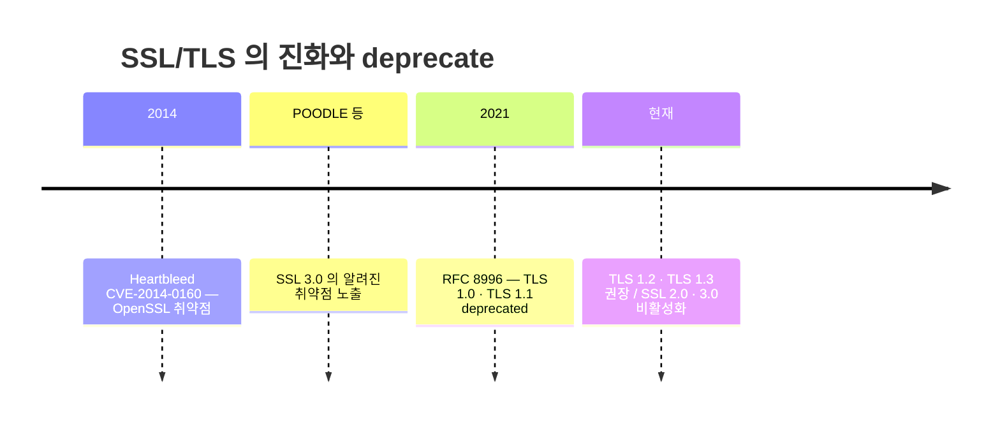
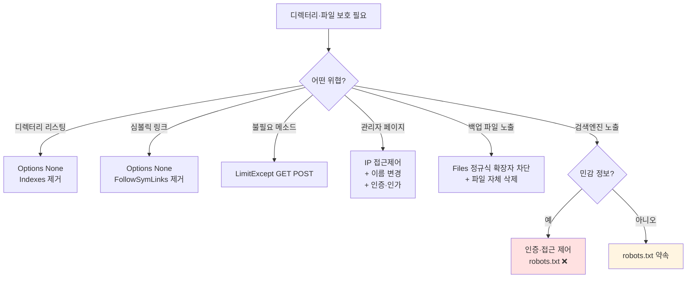
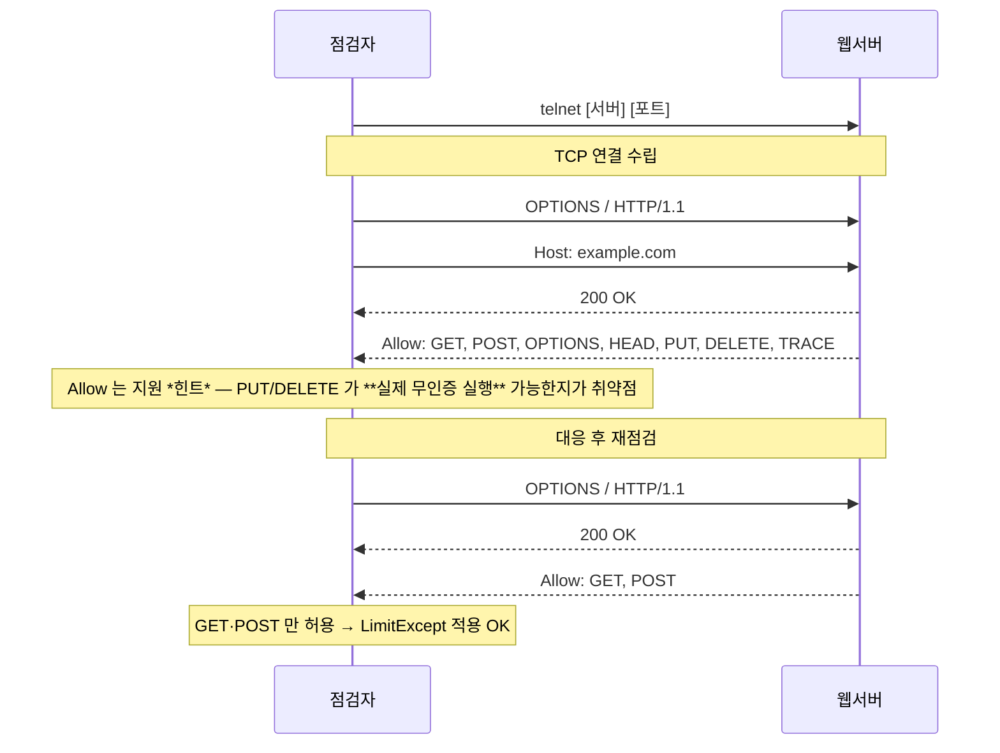
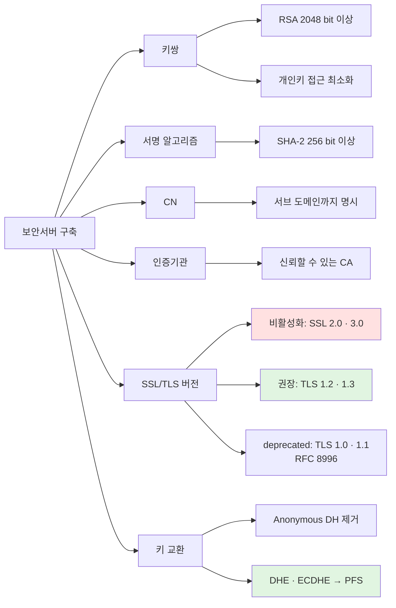

# 06. 웹 서버 보안 운영과 보안서버 구축 — 만화책처럼 읽는 httpd.conf 의 비밀

> **이 문서를 읽는 법**: 05 단원이 *코드 레벨* 취약점이라면, 06 단원은 *운영 환경* 자체의 보안. 교재·시험에서는 보통 **Apache 메인 설정**을 `httpd.conf` 라 통칭하지만, 실제로는 RHEL 계열의 `conf/httpd.conf`·`Include conf.d/*.conf`, Debian/Ubuntu 의 `apache2.conf`·`sites-enabled/`·`mods-enabled/` 처럼 **여러 파일이 `Include` 로 합쳐진 구조**인 경우가 많다. *어느 파일에 두든* **지시자 한 줄**이 *디렉터리 노출*·*메소드 허용*·*관리*·*로그*·*SSL/TLS* 수준을 바꾼다 — **메인·포함 설정 전체**를 따라가면 시험 함정이 풀린다.
> 정확한 정의·수치·표준 번호는 정확본을 참조: [[cs/information-security/03.application-security/06.web-server-hardening|정확본 06. 웹 서버 보안 운영과 보안서버 구축]]

> **독자 가정**: *백엔드/풀스택 개발자, 서버 운영은 처음.* 이미 익숙한 개념 (`apache`·`nginx 설정`·`로그 분석`·`인증서 갱신`) 을 다리로 씁니다.

---

## 🎯 시작 전에 — 이미 만지고 있는 (혹은 *방치하고 있는*) 설정

| 매일 보는 것 | 사실은 이 단원의 |
|---|---|
| `httpd.conf` 등 메인·`Include` 설정 | 본 단원 *Apache 지시자*가 모이는 곳 (경로는 배포판별 상이) |
| 디렉터리 URL 입력 시 파일 목록이 보임 | **디렉터리 리스팅** 취약점 (§2) |
| `OPTIONS` 응답 `Allow:` 에 PUT·DELETE·TRACE 등 | *지원 힌트* — 실제 위험은 **해당 메소드가 무분별 허용·실행**되는지 (§3) |
| `/admin` 등 추측 쉬운 관리 URL + **인증·인가·접근통제** 약함 | 관리자 페이지 노출 (§4) |
| `database.bak` 같은 백업 파일이 다운로드됨 | 위치 공개 (§4) |
| `robots.txt` 에 `/private` 적었으니 안전? | ❌ *약속이지 보안 아님* (§4) |
| `Server: Apache/2.4.x (Debian)` 헤더 | 정보 숨김 미흡 (§5) |
| `192.168.1.100 - - [...] "GET /index.html HTTP/1.1" 200 1024` | NCSA ELF 로그 (§6) |
| 인증서 만료 알림 | SSL/TLS 보안서버 (§7) |
| `SSLv2`·`SSLv3` 활성화 경고 | TLS 1.2·1.3 만 허용 (§7) |

> **이 단원의 본질**: 05 단원이 *코드*라면 06 단원은 *환경*. 같은 어플리케이션이라도 **Apache 설정(메인·`Include` 파일)의 지시자 한 줄**이 보안 수준을 좌우한다. **OWASP A05 (보안 설정 미흡) + A06 (취약 컴포넌트) + A09 (로깅 실패)** 가 이 단원의 표적.

---

## 📖 에피소드 1 — 개발 보안 관리: 코드를 짜기 *전* 의 8 원칙

### 장면 1. 정의

> **개발 보안 관리**: 웹 어플리케이션 개발 시 *사전 작업*으로 서비스에 사용하는 웹서버·어플리케이션 서버의 *환경 설정 보안 강화*.

### 장면 2. 8 원칙

| 원칙 | 의미 |
|---|---|
| 전달된 값을 *재사용*하지 않는다 | 클라이언트 값은 신뢰 ❌, 서버에서 *재검증* |
| 최종 통제는 *서버 단*에서 수행 | 클라이언트 검증은 보조, *모든 보안 결정은 서버* |
| 클라이언트에 *중요 정보 미전송* | 응답에 민감 데이터 포함 ❌ |
| 중요 정보 전송 = **POST + 암호화** | GET 의 *URL 노출·로그 잔존* 방지 ([[cs/information-security/03.application-security/04.http-and-web-client|정확본 04 §3 GET 4 누출]] cross-ref) |
| 중요 트랜잭션 *재확인 절차* 추가 | 비밀번호 재인증 등 |
| 중요 정보 페이지 *캐시 차단* | `Cache-Control: no-cache` 등 |
| **공인된 암호화 알고리즘** | 자체 개발 알고리즘 ❌ |
| 언어·프레임워크 *표준 보안 함수* 이해 후 사용 | — |

### 장면 3. *왜* 자체 개발 암호 알고리즘은 금지인가

> **시험 핵심**: 자체 개발 암호 알고리즘 사용 *금지*. **AES·RSA·SHA-256** 등 *공인된 알고리즘*만 사용 ([[cs/information-security/04.security-general/05.crypto-algorithms|정확본 04-05 암호 알고리즘]] + [[cs/information-security/04.security-general/06.hash-and-mac|정확본 04-06 해시함수]] cross-ref).

이 원칙들은 09 단원의 시큐어 코딩 가이드와 직접 연결.

### 시험 함정

- "최종 보안 통제 위치?" → *서버 단*.
- "중요 정보 전송 메소드?" → POST + 암호화.
- "허용 암호 알고리즘?" → 공인된 알고리즘 (자체 개발 ❌).

---

## 📖 에피소드 2 — 디렉터리 리스팅 차단: Options None 한 줄

### 장면 1. 정의

> **디렉터리 리스팅 (Directory Listing) 취약점**: 웹 서버 미흡한 설정으로 *인덱싱 기능이 활성화*되어 있으면, 공격자가 *강제 브라우징*을 통해 서버 내 *모든 디렉터리·파일 목록*을 볼 수 있는 취약점.

### 장면 2. 3단계 공격 흐름

```
[1] URI 에 특정 페이지가 아닌 *디렉터리 경로* 요청
[2] 웹 브라우저에 해당 디렉터리의 디렉터리/파일 정보 그대로 노출
[3] 디렉터리·파일 클릭 → 백업 파일·소스 파일·미공개 파일 노출
```

### 장면 3. Apache 대응 — `Indexes` 옵션 제거

메인 설정(예: RHEL 계열 `/etc/httpd/conf/httpd.conf`, Debian/Ubuntu 는 `apache2.conf` 등) *및 `Include` 된 섹션*의 *모든 `Directory`* 에서 `Options` 의 **`Indexes` 옵션을 제거**.

```
<Directory />
    Options None              # Indexes 옵션이 없으면 디렉터리 리스팅 비활성화
    AllowOverride None
</Directory>
```

### 장면 4. 환경별 설정

| 환경 | 설정 방법 |
|---|---|
| **Apache** | 메인·포함 설정의 모든 `Directory` 에서 `Indexes` 옵션 제거 (`Options None` 등) |
| **IIS** | "디렉터리 검색" 기능 해제 |
| **Tomcat** | `web.xml` 의 default 서블릿 초기 파라미터 `listings` 를 `false` |

### 시험 함정

- "Apache 디렉터리 리스팅 차단 옵션?" → **`Indexes` 제거** (`Options None`).
- "Tomcat 의 동일 설정?" → `web.xml` 의 `listings = false`.

---

## 📖 에피소드 3 — 심볼릭 링크 차단: FollowSymLinks 의 함정

### 장면 1. 정의

> **심볼릭 링크 사용 설정 취약점**: 아파치 웹서버 설정 파일의 모든 디렉터리 섹션의 `Options` 지시자에 **`FollowSymLinks`** 설정이 되어 있으면 심볼릭 링크가 가능한 취약점.

### 장면 2. *왜 위험한가*

만약 시스템 자체의 루트 디렉터리에 심볼릭 링크를 걸면 *웹서버 구동 시 사용자 권한으로 모든 파일 시스템 파일에 접근* 가능 → **`passwd` 파일 같은 민감한 파일을 누구나 열람**.

### 장면 3. 대응 — 한 줄로 둘 다 차단

```
<Directory />
    Options None              # FollowSymLinks 제거 또는 주석 처리
    AllowOverride All
</Directory>
```

### 장면 4. *Options None* 의 두 효과

> **시험 핵심**: **`Options None`** 한 줄로 **`Indexes` (디렉터리 리스팅)** 와 **`FollowSymLinks` (심볼릭 링크)** *둘 다 비활성화*된다.

운영 패턴: *최상위 디렉터리에 적용* 후 *필요한 하위 디렉터리에서 명시적으로 허용*.

### 시험 함정

- "`Options None` 의 효과?" → Indexes 와 FollowSymLinks *둘 다* 차단.
- "`FollowSymLinks` 의 위험?" → 시스템 루트 심볼릭 링크 → `passwd` 등 노출.

---

## 📖 에피소드 4 — 메소드 제한: LimitExcept 의 *반대 의미*

### 장면 1. 정의

> **웹 서비스 메소드 설정 취약점**: 일반적으로 사용하는 GET·POST 외 *불필요한 메소드 허용* 시, 공격자가 이를 이용해 *악성파일 생성·중요 파일 삭제/수정* 가능.

특히 **PUT·DELETE·TRACE** 의 무인증 허용은 [[cs/information-security/03.application-security/04.http-and-web-client|정확본 04 §3]] 에서 다룬 위험을 그대로 만든다.

`OPTIONS` 응답의 **`Allow` 헤더만으로 서버가 “침해된” 것은 아니다**. 다만 *어떤 메소드를 받아들일 수 있는지* 노출될 수 있으니, 점검에서는 **실제로 PUT/DELETE 등이 인증·인가 없이 동작하는지**(웹서버·WAF·앱 레이어)까지 확인하는 것이 본질이다.

### 장면 2. 메소드 확인 3단계 — `telnet` + `OPTIONS`

```
[1] telnet 으로 대상 웹서버의 서비스 포트로 접속
[2] OPTIONS 메소드 요청 메시지 생성·전송
[3] OK 응답 + Allow 응답 헤더 → 지원 메소드 리스트 확인
```

### 장면 3. 대응 — `LimitExcept` 지시자

`DocumentRoot` 에 해당하는 `<Directory>` 섹션(메인·`Include` 어느 파일이든)에 `LimitExcept` 를 둔다.

```
<LimitExcept GET POST>
    Order allow, deny
    Deny from all
</LimitExcept>
```

### 장면 4. *반대 의미* 함정 1순위

> **시험 빈출 함정**: `LimitExcept GET POST` = *"GET·POST 를 **제외한** 모든 메소드"* 차단. 즉 **GET·POST 만 허용**, 나머지 PUT·DELETE·TRACE 등은 모두 거부.
>
> `Limit` (특정 메소드 *제한*) ↔ `LimitExcept` (특정 메소드 *외* 제한) — *의미 반대*.

### 시험 함정

- "`<LimitExcept GET POST>` 의 효과?" → GET·POST *만 허용* (나머지 차단).
- "`Limit` 와 `LimitExcept` 의 관계?" → *반대 의미*.
- "메소드 점검 명령?" → **telnet + OPTIONS**.
- "`Allow` 에 PUT 이 보이면 무조건 취약?" → ❌ — **실제 무인증 실행** 여부까지 본다.

---

## 📖 에피소드 5 — 관리자 페이지 차단: IP 접근제어 + 이름 변경

### 장면 1. 정의

> **관리자 페이지 노출 취약점**: 관리자 페이지가 *추측 가능한 형태*로 구성되어 있으면, 공격자가 쉽게 접근 + *무작위 대입 공격*으로 관리자 권한 획득. URL 을 바꿔도 **강한 인증·인가·세션/역할 통제**가 없으면 의미가 없다.

### 장면 2. 2 대응

| 대응 | 동작 |
|---|---|
| **관리자 페이지 접근제어** | *IP 기반* 접근제어 (네트워크 레이어 보조) |
| **관리자 페이지 이름 변경** | 추측 어려운 경로 (`/admin` → `/control_panel_xyz123`) + **인증·인가 필수** |

### 장면 3. IP 화이트리스트 설정

```
<Directory "[관리자 페이지 절대경로]">
    Order Deny, Allow
    Deny from all
    Allow from [허용할 IP]
</Directory>
```

### 장면 4. `Order` 지시자 — *뒤가 우선*

> **Apache `Order` 지시자**: `Allow` 와 `Deny` 의 *평가 순서*를 명시. **뒤에 오는 설정이 우선** 적용.
> `Order Deny, Allow` → `Allow` 가 *뒤*이므로 우선 → *허용된 IP 만 접근* 가능 (화이트리스트).

### 시험 함정

- "관리자 페이지 차단 메커니즘 (교재 2가지)?" → IP 접근제어 + 이름 변경.
- "URL만 바꾸면 안전?" → ❌ — **인증·인가·역할** 없으면 의미 제한적.
- "`Order Deny, Allow` 의 효과?" → 화이트리스트 (허용 IP 만).
- "관리자 페이지 공격 기법?" → *무작위 대입 공격*.

---

## 📖 에피소드 6 — 위치 공개 차단: 백업 파일 확장자 막기

### 장면 1. 정의

> **위치 공개 취약점**: *백업 파일·로그 파일·압축 파일*과 같은 파일이 자동 생성되어 웹 어플리케이션상에 노출될 경우, 공격자가 유추 후 *직접 접근 요청*으로 핵심 정보 획득.

### 장면 2. `<Files ~>` + 확장자 차단

```
<Files ~ "\.gz$">
    Order Allow, Deny
    Deny from all
</Files>

<Files ~ "\.bak$">
    Order Allow, Deny
    Deny from all
</Files>
```

### 장면 3. 차단 대상 확장자

| 확장자 | 의미 |
|---|---|
| `.gz` | 압축 파일 |
| `.bak` | 백업 파일 |
| `.swp` | 임시 파일 (vim) |
| `.old` | 옛 버전 파일 |

### 장면 4. *근본 대응*

> 확장자 차단보다 *근본적인* 대응: **불필요한 파일 자체를 웹 루트 디렉터리에서 삭제**.

### 시험 함정

- "위치 공개 차단 확장자?" → `.gz`·`.bak`·`.swp`·`.old`.
- "근본 대응?" → *웹 루트 디렉터리에서 파일 삭제*.

---

## 📖 에피소드 7 — robots.txt: 약속이지 *보안 아니다*

### 장면 1. 정의

> **검색엔진 정보 노출 취약점**: 검색엔진에 의해 웹 사이트 *해킹에 필요한 정보*가 검색되어 해킹 빌미 제공.

### 장면 2. robots.txt 의 본질

> **로봇 배제 표준 (Robots Exclusion Standard)**: 검색 로봇에 대한 웹 사이트의 *디렉터리·파일 검색 조건을 명시*해 놓은 *국제 규약*. **`robots.txt`** 파일에 기술.

### 장면 3. *시험 함정 1순위* — 보안이 아니다

> **robots.txt 는 방지 기술이 아닌 *검색 로봇 운영자 간의 약속*** — 악의적인 검색엔진은 *무시하고 컨텐츠 수집* 가능. 따라서 *접근 제어 수단*으로 사용 ❌. **보안이 필요한 자원은 별도의 인증·접근 제어 메커니즘**으로 보호.

### 장면 4. robots.txt 작성 4 규칙

| 규칙 | 의미 |
|---|---|
| **파일명** | 반드시 `robots.txt` (대소문자 구분) |
| **위치** | 웹 사이트의 *최상위 디렉터리* (하위에 두면 효력 없음) |
| **인코딩** | ASCII 또는 UTF-8 |
| **다중 검색로봇 지정** | 한 줄을 띄워서 구분 |

### 장면 5. 작성 예시

```
# /웹 루트 디렉터리/robots.txt
User-agent: Googlebot
Disallow: /cgi-bin/
Disallow: /private/
Disallow: /*.pdf$
Disallow: /*.gif$

User-agent: Yeti
Disallow: /cgi-bin/
Disallow: /private/
Disallow: /*.pdf$
Disallow: /*.gif$
```

### 장면 6. 패턴 4 종

| 패턴 | 의미 |
|---|---|
| `User-agent: *` + `Disallow: /` | *모든 로봇* — 사이트 *전체* 차단 |
| `Disallow:` (값 없음) | 사이트 *전체 허용* (`Allow: /` 와 동일) |
| `Disallow: /cgi-bin/` | 디렉터리 차단 (반드시 `/` 로 종료) |
| `Disallow: /*.pdf$` | 특정 확장자 차단 |

### 시험 함정

- "robots.txt 의 본질?" → *접근 제어 기술 ❌, 약속*.
- "robots.txt 위치?" → *최상위 디렉터리* (하위 ❌).
- "민감 정보 보호 수단?" → 인증·접근 제어 (robots.txt ❌).

---

## 📖 에피소드 8 — 최소 권한 사용자: root 와 apache 의 두 프로세스

### 장면 1. 정의

> **웹 서비스 최소 권한 사용자 운영**: 웹서버 운영 시 위험을 최소화하기 위해 *최소한의 권한*을 가진 *사용자·그룹*으로 웹서버 프로세스 실행.

웹서버 보안 취약점으로 인한 *권한 탈취* 가능성이 항상 있으므로, *root 권한* 실행 시 침해 시 시스템 전체 위협. → 별도 사용자·그룹 (보통 **`apache`·`nobody`**) 으로 실행.

### 장면 2. 3단계 설정

```
[1] /etc/passwd 에서 웹서버 프로세스 실행 사용자가
    *시스템 로그인 못 하도록* 설정 → 로그인 쉘을 /sbin/nologin 또는 /bin/false 로
[2] 메인 설정(예: RHEL `/etc/httpd/conf/httpd.conf`, Debian/Ubuntu `apache2.conf`) 에서 `User apache` + `Group apache` 설정 (또는 `Include` 된 vhost 파일)
[3] ps -ef | grep httpd 로 서비스 프로세스 확인
```

### 장면 3. *2 종류 프로세스* — 시험 빈출

| 프로세스 | 권한 | 역할 |
|---|---|---|
| **리스닝 프로세스** | **root** | *80/tcp 포트를 열고* 클라이언트 연결 요청 처리 |
| **서버 프로세스** (다수) | **apache** | 다수의 *서비스 요청 처리* |

> **왜 이 분리?** 80 포트 같은 *1024 이하 well-known 포트*를 여는 것은 *root 권한이 필요*. 하지만 실제 요청 처리는 *제한된 권한*으로 — *권한 분리* 패턴.

### 시험 함정

- "Apache 프로세스 *2 종류*?" → 리스닝 (root) + 서버 (apache).
- "왜 nologin 쉘?" → *시스템 로그인 차단*.
- "서비스 프로세스 확인 명령?" → `ps -ef | grep httpd`.

---

## 📖 에피소드 9 — 정보 숨김: ServerTokens·ServerSignature

### 장면 1. 정의

> **웹 서비스 정보 숨김**: 웹서버는 응답 헤더·에러 메시지에 *웹서버 버전·종류·OS 정보·응용 프로그램 버전*을 전송. 공격자가 이 정보로 *알려진 취약점*을 공격하는 것을 차단하기 위해 노출 *최소화*. 다만 **`ServerTokens Prod`** 는 *공격 표면 축소 보조*이며, **패치·취약 버전 제거·전반 설정**이 본체다.

### 장면 2. Apache 2 지시자

| 지시자 | 설정 | 효과 |
|---|---|---|
| **`ServerTokens Prod`** | 응답 헤더 정보 레벨 *최소화* | `Server: Apache` 만 노출 |
| **`ServerSignature Off`** | 응답·에러 메시지를 통한 정보 차단 | 페이지 푸터의 서버 정보 제거 |

### 장면 3. ServerTokens 4 레벨 — *시험 빈출*

| 값 | 노출 내용 |
|---|---|
| **`Prod`** | 웹서버 *종류만* (`Apache`) |
| **`Min`** | 종류 + *버전* |
| **`OS`** | 종류 + 버전 + *운영체제* |
| **`Full`** | 종류 + 버전 + 운영체제 + *모듈 정보* |

> **운영 환경 표준**: **`Prod`**.

### 시험 함정

- "정보 숨김 2 지시자?" → ServerTokens·ServerSignature.
- "운영 환경 표준 ServerTokens 값?" → **`Prod`**.
- "`Full` 의 추가 노출?" → *설치된 모듈 정보*.
- "헤더만 줄이면 끝?" → ❌ — **취약 버전 패치·설정 전반이 우선**.

---

## 📖 에피소드 10 — httpd.conf 주요 지시자: 기본·타임아웃·로그

> **구성 이해**: 실제 배포에서는 **메인 파일 + `Include`** 가 합쳐진다. 아래 지시자는 *파일 위치와 무관하게* 동일하게 동작한다 — 시험은 *이름·역할*이 핵심.

### 장면 1. 기본 설정 9 지시자

| 지시자 | 의미 |
|---|---|
| **`ServerRoot`** | 웹서버 설치 *최상위 디렉터리* (설정·로그·모듈 등) |
| **`Listen [포트]`** | 웹서버의 *리스닝 포트* |
| **`User`** | 서버 프로세스 실행 *사용자* |
| **`Group`** | 서버 프로세스 실행 *그룹* |
| **`ServerTokens`** | HTTP 응답 헤더 Server 필드 정보 레벨 |
| **`ServerSignature`** | 웹 서버 정보 제공 여부 |
| **`ServerAdmin`** | 에러 메시지의 *관리자 메일 주소* |
| **`DocumentRoot`** | 웹 어플리케이션의 *웹 루트 디렉터리* |
| **`DirectoryIndex`** | 기본 페이지 (`index.php index.html`) |

### 장면 2. 타임아웃 5 지시자 — *Slow 계열 DDoS 대응*

| 지시자 | 의미 |
|---|---|
| **`Timeout`** | *아무 메시지 없는 동안* 대기 시간 (초) |
| **`KeepAlive`** | 연결을 *지속하여 다수 요청 처리* 사용 여부 |
| **`MaxKeepAliveRequests`** | 지속 연결 동안 허용 *최대 요청 건수* |
| **`KeepAliveTimeout`** | 지속 연결 동안 *마지막 요청 이후 다음 요청 대기 시간* |
| **`RequestReadTimeout`** | 요청 메시지 *헤더부·바디부 모두 수신 시간* — *Slow HTTP DoS 1차 대응* |

### 장면 3. *왜 RequestReadTimeout 이 Slow 계열의 핵심*

> **시험 핵심**: `RequestReadTimeout` 은 [[cs/information-security/02.network-security/05.dos-ddos-drdos|정확본 02-05]] 의 **Slow 계열 DDoS** (Slowloris·Slow POST·Slow Read) 의 *1차 대응책*. *헤더·바디 수신 타임아웃*을 짧게 설정하여 *느린 연결을 차단*.

### 장면 4. 웹 로그 2 지시자

| 지시자 | 의미 |
|---|---|
| **`ErrorLog`** | 에러 로그파일 경로 |
| **`CustomLog`** | 접속기록 저장 로그파일 경로 |

### 시험 함정

- "Slow HTTP DoS 1차 대응 지시자?" → **`RequestReadTimeout`**.
- "에러 로그 vs 접속 로그 지시자?" → ErrorLog vs CustomLog.
- "웹 루트 지정 지시자?" → **`DocumentRoot`**.

---

## 📖 에피소드 11 — 웹 로그: NCSA CLF·ELF·W3C ELF + 9 필드

### 장면 1. 정의와 가치

> **웹 로그**: 클라이언트가 웹 서버에 접속하면 클라이언트와 웹서버 간 *요청·응답이 지속*. 이 기록을 저장한 로그.

**5 가치**: 행위/취향 분석 / *보안 사고 추적 증거 자료* / *이상 징후·해킹 시도·성공 여부* / 웹 패턴 파악 / *접속 시간·접근 파일·사용자·요청 방식·성공 여부*.

### 장면 2. 2 종류 로그

| 로그 | 의미 |
|---|---|
| **액세스 로그 (Access Log)** | 클라이언트의 요청 + 서버 응답 내용 기록 |
| **에러 로그 (Error Log)** | 클라이언트의 요청 시 *오류 발생 시* 기록 |

### 장면 3. 3 포맷 — 시험 빈출

| 포맷 | 사용 환경 | 추가 필드 |
|---|---|---|
| **NCSA CLF** (Common Log Format) | Apache·Tomcat | 기본 |
| **NCSA ELF** (Extended Log Format) | Apache·Tomcat | + **Referer · User-Agent** |
| **W3C ELF** | IIS | + **Referer · User-Agent · Cookie · 사용자 정보** |

> **외우는 한 줄**: *NCSA CLF + Referer/UA = NCSA ELF*. *NCSA ELF + Cookie/사용자 = W3C ELF*.

> **용어 주의**: Apache `CustomLog` 의 **`combined`** 포맷은 실무에서 “확장 로그”로 쓰이지만, 교재·시험에서 말하는 **NCSA ELF** 와 파일 포맷 문자열이 *항상 1:1 일치하는 것은 아니다*. 시험에서는 *CLF + Referer + User-Agent* 조합을 **NCSA ELF** 로 외운다.

### 장면 4. NCSA ELF 9 필드

| 필드 | 의미 |
|---|---|
| **Host** | 클라이언트 IP/호스트 이름 |
| **Ident** | 클라이언트 인증용 (사용 ❌, 보통 `-`) |
| **Authuser** | 인증된 사용자 이름 (사용 ❌, 보통 `-`) |
| **Date and Time** | 요청 발생 시간 |
| **Request** | 요청 메소드 (GET·POST 등) + 요청 리소스 (URI) |
| **Status** | 응답 상태 코드 |
| **Bytes** | 클라이언트에 전송된 바이트 수 |
| **Referer** | 이전 페이지 URL |
| **User-Agent** | 브라우저·기기 종류·버전·OS |

### 장면 5. 액세스 로그 샘플

```
192.168.1.100 - - [28/Apr/2026:14:30:22 +0900] "GET /index.html HTTP/1.1" 200 1024 "https://google.com" "Mozilla/5.0 ..."
```

→ 한 줄에서 *출발지 IP·요청 시간·메소드·URI·상태 코드·응답 크기·이전 페이지·브라우저* 모두 추출.

### 장면 6. 알려진 공격 패턴

| 패턴 | 의미 |
|---|---|
| **제로보드 공격** | `cmd` 파라미터로 *원격 임의 명령 실행* (제로보드 = PHP 웹 게시판) |
| **테크노트 공격** | `main.cgi` 의 `filename` 파라미터로 *원격 임의 명령 실행* |

→ 알려진 패턴은 *웹 로그 URL/파라미터*에서 식별 가능 → SIEM·정규식 룰셋으로 탐지.

### 시험 함정

- "NCSA CLF → ELF 추가 필드?" → **Referer + User-Agent**.
- "W3C ELF 가 NCSA ELF 와 다른 점?" → + **Cookie + 사용자 정보**.
- "Ident·Authuser 의 실제 값?" → *대부분 `-`*.

---

## 📖 에피소드 12 — 보안서버: 정의·법적 근거·구축 효과

### 장면 1. 정의

> **보안서버**: 인터넷상에서 *정보를 암호화하여 송수신*하는 기능이 구축된 웹서버. *별도 하드웨어 X*, 이미 사용 중인 웹서버에 **SSL/TLS 인증서**나 *암호화 소프트웨어*를 설치하여 암호 통신 지원.

### 장면 2. 3 가지 효과

| 효과 | 의미 |
|---|---|
| **정보 유출 방지** | 중요 정보 암호 통신 |
| **위조/가짜 사이트 방지** (피싱 방지) | SSL/TLS 인증서가 *진짜 사이트임을 증명* |
| **기업 신뢰도 향상** | 개인정보 안전 관리 *가시적 홍보 효과* |

### 장면 3. 법적 근거 — 한국 개인정보보호법령

> **개인정보보호위원회 고시 「개인정보의 안전성 확보조치 기준」**:
> 개인정보처리자는 *고유식별정보 (주민등록번호·여권번호·운전면허번호·외국인등록번호)·비밀번호·생체인식정보*를 정보통신망을 통하여 송신할 경우 이를 *암호화*하여야 한다.

### 장면 4. 보안서버의 *2 가지 구축 방식*

```
[1] 웹서버에 SSL 인증서 설치 → 정보 암호화 송·수신
[2] 웹서버에 암호화 응용 프로그램 설치 → 정보 암호화 송·수신
```

### 시험 함정

- "보안서버는 별도 하드웨어?" → ❌ (기존 웹서버에 *SSL 인증서/암호화 SW 설치*).
- "법적 근거?" → 개인정보보호위원회 고시 *개인정보의 안전성 확보조치 기준*.
- "암호화 의무 정보?" → 고유식별정보·비밀번호·생체인식정보.

---

## 📖 에피소드 13 — SSL/TLS 보안 가이드: 키·서명·버전·Cipher Suite

### 장면 1. 인증서 생성 4 가이드

| 항목 | 가이드 |
|---|---|
| **키쌍 생성** | **2048 bit 이상** RSA. 서버 개인키 접근 *최소화*·안전 관리. *공개키 항목으로 키 길이 확인* |
| **인증서 서명 알고리즘** | **SHA-2 (256 bit) 이상** |
| **주체/소유자 CN (CommonName)** | 서브 도메인까지 정확히 명시 (서브 도메인 미명시 → 임의 서브 도메인 인증서 악용 가능) |
| **인증기관 선택** | *신뢰할 수 있는 CA* (신뢰 못할 CA → 브라우저 경고) |

### 장면 2. OpenSSL 라이브러리 가이드

```
# OpenSSL 버전 확인
openssl version
openssl version -a    # 상세
```

| 가이드 | 의미 |
|---|---|
| **보안 업데이트** | 취약 버전 사용 시 *보안 업데이트* 수행 (예: **Heartbleed CVE-2014-0160**) |

### 장면 3. SSL/TLS 웹서버 설정 (httpd-ssl.conf 또는 ssl.conf)

```
# 취약 프로토콜 제거 — 권장: TLS 1.2·1.3 만 (TLS 1.0·1.1 은 RFC 8996 deprecated)
SSLProtocol -all +TLSv1.2 +TLSv1.3

# 취약한 암호 방식 제거 (예시 — OpenSSL·버전에 따라 튜닝)
SSLCipherSuite HIGH:!aNULL:!MD5:!3DES
```

*(구 교재·구 설정에서 `+TLSv1 +TLSv1.1` 까지 켜 두는 예가 있으나, 본 단원 장면 4·마인드맵 시간선과 **모순**이므로 운영·시험 정합은 **1.2+ 만** 으로 맞춘다.)*

### 장면 4. 5 항목 가이드

| 항목 | 가이드 |
|---|---|
| **비활성화 대상** | **SSL 2.0·SSL 3.0** (POODLE 등 알려진 취약점) |
| **권장 버전** | **TLS 1.2·TLS 1.3** (TLS 1.0·1.1 도 IETF 에서 *deprecated*, **RFC 8996**) |
| **키 교환** | *익명 디피-헬만 (Anonymous DH) 제거*. **임시 DH (DHE/ECDHE) 권장** — 키 교환 과정에서 서버 DH 파라미터를 RSA·DSA 등의 *서명 알고리즘으로 인증* → **PFS** 제공 |
| 주요 지시자 | `SSLProtocol` (지원 버전) / `SSLCipherSuite` (암호 도구 목록) |

### 장면 5. PFS (Perfect Forward Secrecy) 의 정체

> **PFS (Perfect Forward Secrecy)**: 서버 개인키가 *미래에 노출*되더라도 *과거 통신을 복호화할 수 없도록* 매 세션마다 *임시 키 쌍*을 사용하는 특성. **ECDHE·DHE** 키 교환의 핵심 가치 ([[cs/information-security/04.security-general/03.key-distribution|정확본 04-03 §3-4 Forward Secrecy]] + [[cs/information-security/02.network-security/07.security-protocols|정확본 02-07 SSL/TLS]] cross-ref).

### 시험 함정

- "RSA 키 길이 표준?" → **2048 bit 이상**.
- "서명 해시 표준?" → **SHA-256 이상** (SHA-2 256).
- "비활성화 대상?" → **SSLv2·SSLv3** (POODLE).
- "TLS 1.0·1.1 의 표준 상태?" → *deprecated* (RFC 8996, 2021).
- "PFS 제공 키 교환?" → **DHE·ECDHE** (Anonymous DH 제거).

---

## 📑 종합 비교 (에피소드 2~10 정리)

httpd.conf *지시자별 보안 효과*를 한 표로.

| 영역 | 핵심 지시자 | 효과 |
|---|---|---|
| 디렉터리 보호 | `Options None` | Indexes + FollowSymLinks 둘 다 차단 |
| 메소드 제한 | `<LimitExcept GET POST>` | GET·POST 만 허용 |
| 관리자 페이지 | `<Directory>` + `Order Deny, Allow` + `Allow from` | IP 화이트리스트 |
| 위치 공개 | `<Files ~ "\.bak$">` | 백업 파일 확장자 차단 |
| 검색엔진 | `robots.txt` | *약속이지 보안 아님* |
| 최소 권한 | `User apache` + `Group apache` | root 분리 + nologin |
| 정보 숨김 | `ServerTokens Prod` + `ServerSignature Off` | `Server: Apache` 만 노출 |
| Slow DDoS | `RequestReadTimeout` | 헤더·바디 수신 타임아웃 |
| 웹 로그 | `ErrorLog` + `CustomLog` | 에러·접속 로그 경로 |
| SSL/TLS | `SSLProtocol` + `SSLCipherSuite` | TLS 1.2/1.3 + 강력 암호 |

> **읽는 법**: 보통 **`httpd.conf` 라 통칭하는 메인·`Include` 설정 전체**의 지시자가 *웹서버 보안 결정*을 내린다. 시험은 *각 지시자의 정확한 의미*를 묻는다.

---

## 🗺️ 마인드맵 1 — TLS 표준 시간선



**읽는 법**: SSL 시리즈는 모두 *비활성화 대상*. TLS 1.0·1.1 도 2021 RFC 8996 으로 *deprecated*. 현재 권장은 *1.2·1.3 만*.

---

## 🗺️ 마인드맵 2 — httpd.conf 지시자 분류

```mermaid
graph TD
  H[Apache 메인·Include 설정<br/>(통칭 httpd.conf)]

  H --> B[기본 설정]
  B --> B1[ServerRoot · DocumentRoot]
  B --> B2[Listen · ServerAdmin]
  B --> B3[User · Group]
  B --> B4[ServerTokens · ServerSignature]
  B --> B5[DirectoryIndex]

  H --> T[타임아웃 — Slow DDoS 대응]
  T --> T1[Timeout]
  T --> T2[KeepAlive · MaxKeepAliveRequests]
  T --> T3[KeepAliveTimeout]
  T --> T4[RequestReadTimeout<br/>Slow 계열 1차 대응]

  H --> L[웹 로그]
  L --> L1[ErrorLog · CustomLog]

  H --> D[디렉터리 / 메소드 / 파일]
  D --> D1[Options None<br/>Indexes + FollowSymLinks]
  D --> D2[LimitExcept GET POST]
  D --> D3[Order Deny, Allow]
  D --> D4[Files 정규식 — 확장자]

  H --> S[SSL/TLS — ssl.conf]
  S --> S1[SSLProtocol]
  S --> S2[SSLCipherSuite]

  style T4 fill:#ffe1e1
  style D1 fill:#e1f5e1
  style D2 fill:#e1f5e1
```

---

## 🗺️ 마인드맵 3 — 디렉터리 보호 결정 트리



**읽는 법**: 모든 길이 *Apache 지시자*로 끝난다. 단 *민감 정보는 robots.txt 가 아닌 인증·접근 제어*로 보호.

---

## 🗺️ 마인드맵 4 — 메소드 점검 시나리오



---

## 🗺️ 마인드맵 5 — 보안서버 구축 5 가이드



---

## 🗂️ 키워드 클러스터

### Apache 지시자 그룹

```
디렉터리·파일 — Options None · LimitExcept · Order · Files
서버 정보    — ServerTokens · ServerSignature · ServerAdmin · ServerRoot
프로세스    — User · Group · Listen
DocumentRoot · DirectoryIndex
타임아웃    — Timeout · KeepAlive · MaxKeepAliveRequests · KeepAliveTimeout · RequestReadTimeout
로그        — ErrorLog · CustomLog
SSL/TLS    — SSLProtocol · SSLCipherSuite
```

### 환경별 디렉터리 리스팅 차단

```
Apache  — Options 에서 Indexes 제거
IIS     — "디렉터리 검색" 기능 해제
Tomcat  — web.xml 의 listings = false
```

### ServerTokens 4 레벨

```
Prod  — Apache 만
Min   — Apache + 버전
OS    — Apache + 버전 + 운영체제
Full  — Apache + 버전 + 운영체제 + 모듈
```

### 웹 로그 3 포맷

```
NCSA CLF (Apache·Tomcat 기본)
NCSA ELF = NCSA CLF + Referer + User-Agent (Apache·Tomcat)
W3C ELF  = NCSA ELF + Cookie + 사용자 정보 (IIS)
```

### NCSA ELF 9 필드

```
Host · Ident · Authuser · Date and Time · Request · Status · Bytes · Referer · User-Agent
```

### 보안서버 핵심 수치

```
RSA 키          — 2048 bit 이상
서명 해시       — SHA-2 256 bit 이상
비활성화 버전   — SSL 2.0 · SSL 3.0
권장 버전       — TLS 1.2 · TLS 1.3
deprecated     — TLS 1.0 · TLS 1.1 (RFC 8996, 2021)
PFS 키 교환    — DHE · ECDHE
```

### 알려진 공격·취약점

```
Heartbleed     — CVE-2014-0160 (OpenSSL)
POODLE         — SSL 3.0
Slowloris      — Slow HTTP DoS
제로보드 공격   — cmd 파라미터
테크노트 공격   — main.cgi · filename 파라미터
```

---

## 🃏 회상 30문항

> 답을 가린 뒤 자가 채점. 틀린 것만 정확본으로 깊이 학습.

**A. 개발 보안 + 디렉터리·심볼릭 (1~7)**
1. 8 개발 보안 원칙 중 *최종 통제 위치*?
2. 자체 개발 암호 알고리즘?
3. `Options None` 의 *2 효과*?
4. 디렉터리 리스팅 차단 — Apache·IIS·Tomcat 각 설정?
5. `FollowSymLinks` 의 위험?
6. 강제 브라우징의 정의?
7. 디렉터리 보호의 운영 패턴?

**B. 메소드·관리자·위치공개 (8~13)**
8. `LimitExcept GET POST` 의 *정확한 의미*?
9. `Limit` ↔ `LimitExcept` 차이?
10. 메소드 점검 명령어?
11. `Order Deny, Allow` 의 *우선*?
12. 관리자 페이지 차단 *2 대응*?
13. 위치 공개 차단 *4 확장자*?

**C. robots.txt + 최소 권한 + 정보 숨김 (14~20)**
14. robots.txt 의 *본질*?
15. robots.txt 위치?
16. `User-agent: *` + `Disallow: /` 의 효과?
17. Apache 의 *2 종류 프로세스* 와 권한?
18. 왜 nologin 쉘을 사용?
19. ServerTokens 4 레벨?
20. 운영 환경 표준 ServerTokens?

**D. httpd.conf + 웹 로그 (21~25)**
21. `RequestReadTimeout` 의 1차 대응 대상?
22. `ErrorLog` ↔ `CustomLog` 차이?
23. 3 로그 포맷의 *추가 필드*?
24. NCSA ELF 9 필드?
25. 제로보드 공격의 핵심 파라미터?

**E. 보안서버·SSL/TLS (26~30)**
26. RSA 키 표준 길이?
27. 서명 해시 표준?
28. 비활성화 대상 SSL 버전?
29. TLS 1.0·1.1 의 표준 상태와 RFC?
30. PFS 제공 키 교환 *2 방식*?

---

## ⚠️ 시험 함정 모음

| 함정 | 정답 |
|---|---|
| `LimitExcept GET POST` 의미? | GET·POST *만 허용* (역설적) |
| `Options None` 의 *2 효과*? | Indexes + FollowSymLinks *둘 다* 차단 |
| robots.txt 의 본질? | *약속이지 보안 아니다* |
| robots.txt 위치? | *최상위 디렉터리* |
| 자체 개발 암호 알고리즘? | *금지* (공인된 알고리즘만) |
| 보안서버는 별도 HW? | ❌ (기존 서버에 인증서 설치) |
| Apache *2 종류 프로세스*? | 리스닝 (root) + 서버 (apache) |
| ServerTokens 운영 표준? | **`Prod`** |
| `RequestReadTimeout` 대상? | Slow 계열 HTTP DoS |
| NCSA CLF → ELF 추가 필드? | **Referer + User-Agent** |
| W3C ELF 의 추가? | + Cookie + 사용자 정보 |
| Ident·Authuser 의 실제 값? | *대부분 `-`* |
| RSA 키 표준? | **2048 bit 이상** |
| 서명 해시 표준? | **SHA-256 이상** |
| 비활성화 SSL? | **SSL 2.0 · 3.0** |
| TLS 1.0·1.1 상태? | **deprecated** (RFC 8996, 2021) |
| PFS 키 교환? | **DHE · ECDHE** (Anonymous DH ❌) |
| Heartbleed CVE? | **CVE-2014-0160** |
| POODLE 의 표적? | **SSL 3.0** |
| 제로보드 공격? | `cmd` 파라미터 |
| 테크노트 공격? | `main.cgi` 의 `filename` |

---

## 🔗 정확본 매핑표

| 본 노트 에피소드 | 정확본 § |
|---|---|
| 에피소드 1 (개발 보안 8 원칙) | [[cs/information-security/03.application-security/06.web-server-hardening#1. 개발 보안 관리\|정확본 §1]] |
| 에피소드 2 (디렉터리 리스팅) | [[cs/information-security/03.application-security/06.web-server-hardening#2-1. 디렉터리 리스팅 제거\|정확본 §2-1]] |
| 에피소드 3 (심볼릭 링크) | [[cs/information-security/03.application-security/06.web-server-hardening#2-2. 심볼릭 링크 사용 설정 제거\|정확본 §2-2]] |
| 에피소드 4 (메소드 제한) | [[cs/information-security/03.application-security/06.web-server-hardening#3. 웹 서비스 메소드 제한\|정확본 §3]] |
| 에피소드 5 (관리자 페이지) | [[cs/information-security/03.application-security/06.web-server-hardening#4-1. 관리자 페이지 노출 차단\|정확본 §4-1]] |
| 에피소드 6 (위치 공개) | [[cs/information-security/03.application-security/06.web-server-hardening#4-2. 위치 공개 차단\|정확본 §4-2]] |
| 에피소드 7 (robots.txt) | [[cs/information-security/03.application-security/06.web-server-hardening#4-3. 검색엔진 정보 노출 차단\|정확본 §4-3]] |
| 에피소드 8 (최소 권한) | [[cs/information-security/03.application-security/06.web-server-hardening#5-1. 웹 서비스 최소 권한 사용자 운영\|정확본 §5-1]] |
| 에피소드 9 (정보 숨김) | [[cs/information-security/03.application-security/06.web-server-hardening#5-2. 웹 서비스 정보 숨김\|정확본 §5-2]] |
| 에피소드 10 (httpd.conf) | [[cs/information-security/03.application-security/06.web-server-hardening#5-3. httpd.conf 주요 지시자\|정확본 §5-3]] |
| 에피소드 11 (웹 로그·공격 패턴) | [[cs/information-security/03.application-security/06.web-server-hardening#6. 웹 로그 분석\|정확본 §6]] |
| 에피소드 12 (보안서버) | [[cs/information-security/03.application-security/06.web-server-hardening#7-1. 보안서버의 정의\|정확본 §7-1·§7-2]] |
| 에피소드 13 (SSL/TLS 가이드) | [[cs/information-security/03.application-security/06.web-server-hardening#7-3. SSL/TLS 서버 인증서 생성 시 보안 가이드\|정확본 §7-3·§7-4·§7-5]] |

---

## 📅 학습 흐름 (8주차 시험 대비 기준)

```
[1주]   에피소드 1 (개발 보안 8 원칙) — 만화책 통독
[2주]   에피소드 2·3 (디렉터리·심볼릭) — Options None 외움
[3주]   에피소드 4 (메소드 제한) — LimitExcept 함정 외움
[4주]   에피소드 5·6·7 (관리자·백업·robots.txt) — robots.txt 함정 주의
[5주]   에피소드 8·9 (권한·정보 숨김) — 2 프로세스 분리 외움
[6주]   에피소드 10 (httpd.conf 지시자) — RequestReadTimeout 외움
[7주]   에피소드 11 (웹 로그·공격 패턴) — 3 포맷 차이 외움
[8주]   에피소드 12·13 (보안서버·SSL/TLS) — 핵심 수치 외움 + 회상 30
```

---

> **다음 단원**: [[cs/information-security/03.application-security/07.db-security|07. DB 보안]] — 본 단원 §13 의 *암호 알고리즘 가이드*가 07 단원의 *DB 컬럼·블록 암호화 (TDE)* 와 직접 연결.
