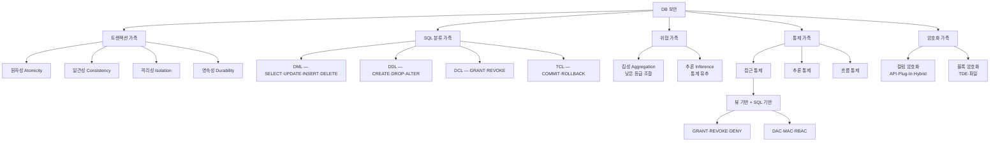
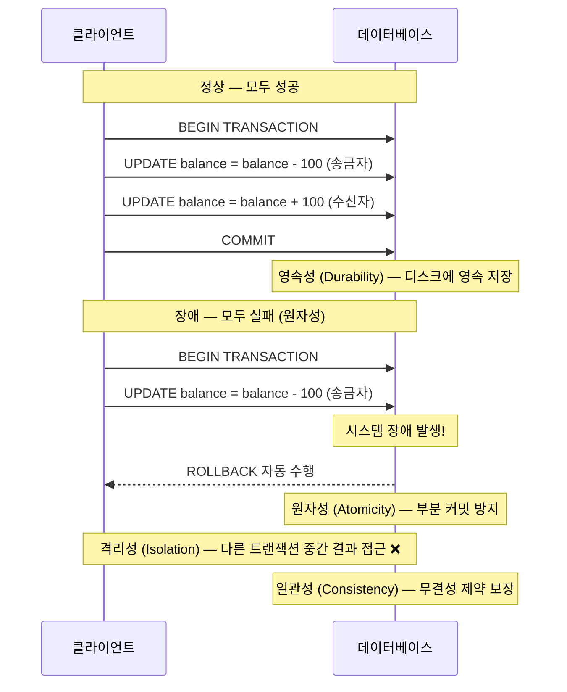
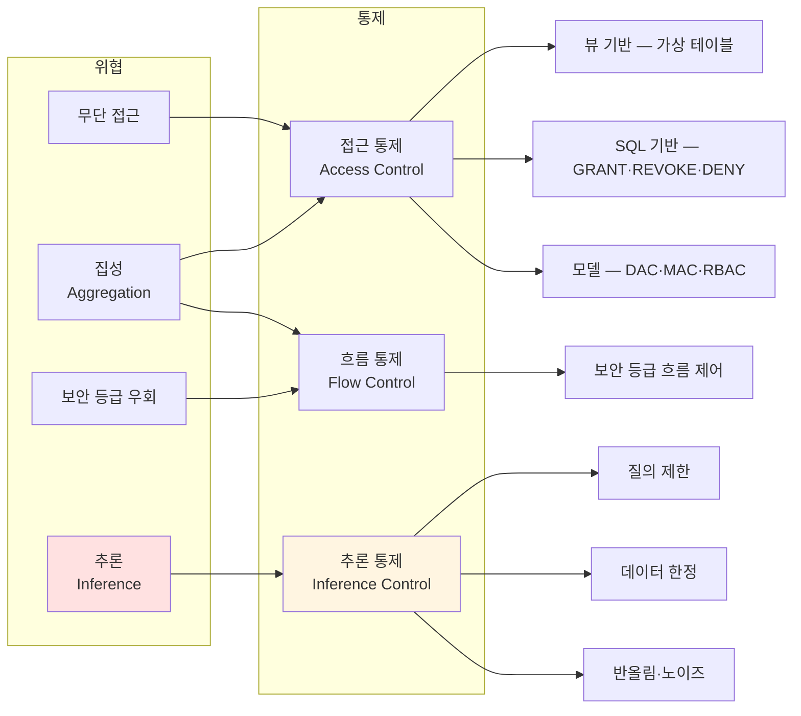
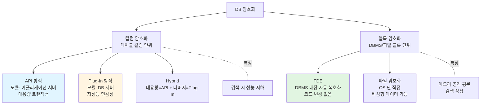
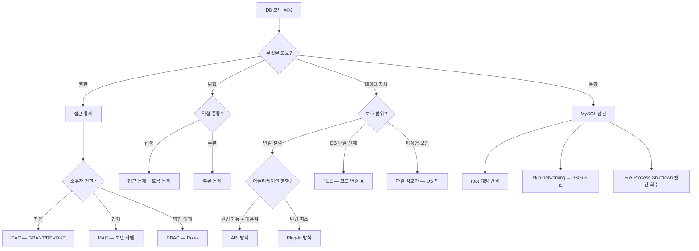

# 07. 데이터베이스 보안 — 만화책처럼 읽는 ACID 와 4 가족 통제

> **이 문서를 읽는 법**: DB 보안의 *5 가족* (트랜잭션·SQL·위협·통제·암호화) 을 시간 순으로 따라가면, 05 단원의 SQL Injection 이 *어플리케이션 입력 검증의 실패* 였다면 본 단원은 *DB 자체의 보안 메커니즘* 임이 자연스럽게 보입니다.
> 정확한 정의·수치·표준 번호는 정확본을 참조: [[cs/information-security/03.application-security/07.db-security|정확본 07. 데이터베이스 보안]]

> **독자 가정**: *백엔드/풀스택 개발자, DB 운영은 처음.* 이미 익숙한 개념 (`SELECT`·`COMMIT`·`GRANT`·트랜잭션·뷰) 을 다리로 씁니다.

---

## 🎯 시작 전에 — 이미 만지고 있는 DB 보안

| 매일 보는 것 | 사실은 이 단원의 |
|---|---|
| 트랜잭션 `BEGIN ... COMMIT;` | TCL — Transaction Control Language (§2) |
| 결제 실패 시 자동 롤백 | ACID 의 **원자성** (§1) |
| `GRANT SELECT ON ... TO ...` | DCL + SQL 기반 접근 통제 (§4·§5) |
| 일반 사용자가 `salary` 컬럼 안 보임 | 뷰 기반 접근 통제 (§4) |
| "30대 남성 평균 연봉" 통계로 1명 노출 | **추론 (Inference) 위협** (§3) |
| 카드번호·주민번호 암호화 컬럼 | API 또는 Plug-In 컬럼 암호화 (§9) |
| 디스크 도난 대비 전체 암호화 | **TDE** (Transparent Data Encryption, §10) |
| MySQL `skip-networking` 옵션 | 3306/tcp 차단 (§13) |
| `WITH GRANT OPTION` 의 의미 | 권한 위임 체인 (§5) |

> **이 단원의 본질**: 05 단원이 *어플리케이션 코드* 라면 07 단원은 *DB 엔진의 메커니즘*. **트랜잭션 (ACID) + SQL 분류 (DML·DDL·DCL·TCL) + 위협 (집성·추론) + 통제 (접근·추론·흐름) + 암호화 (컬럼·블록)** *5 가족*이 핵심.

---

## 📖 에피소드 1 — 트랜잭션과 ACID: 4 속성의 본질

### 장면 1. 트랜잭션의 정의

> **트랜잭션 (Transaction)**: 데이터베이스에서 *하나의 논리적 작업 단위*로 묶이는 일련의 연산. *모두 성공하거나 모두 실패*해야 한다.

### 장면 2. ACID 4 속성

| 속성 | 영문 | 정의 |
|---|---|---|
| **원자성** | **A**tomicity | 트랜잭션 내 모든 연산은 *한꺼번에 완료* 또는 *한꺼번에 취소* |
| **일관성** | **C**onsistency | 트랜잭션 성공 시 *일관성 있는 데이터베이스 상태로 변환* |
| **격리성** | **I**solation | 트랜잭션 실행 중 연산의 *중간 결과는 다른 트랜잭션 접근 ❌* |
| **영속성** | **D**urability | 트랜잭션 성공 시 결과는 *영속적* (시스템 장애에도 유지) |

### 장면 3. ACID 의 *보안적 의미*

| 속성 | 위협 방어 |
|---|---|
| 원자성 | *부분 커밋·부분 롤백*으로 인한 데이터 불일치 방지 |
| 일관성 | *무결성 제약 위반* 방지 |
| 격리성 | **Race Condition** 으로 인한 *권한 우회* 방지 ([[cs/information-security/study/01.system-security/06.system-attacks|정확본 01-06 Race Condition]] cross-ref) |
| 영속성 | *시스템 장애 시 거래 데이터 손실* 방지 |

### 장면 4. 한국어 명칭 함정

> **시험 함정 1순위**: ACID 의 *정확한 한국어 명칭*.
> - **격리성** (Isolation, *분리성* ❌)
> - **영속성** (Durability, *지속성* ❌)

### 시험 함정

- "ACID 4 영문?" → Atomicity·Consistency·Isolation·Durability.
- "Isolation 의 한국어?" → **격리성** (분리성 ❌).
- "Durability 의 한국어?" → **영속성** (지속성 ❌).

---

## 📖 에피소드 2 — SQL 4 분류: DML·DDL·DCL·TCL

### 장면. 분류와 명령어 매핑 — 시험 빈출 1순위

| 분류 | 풀이 | 용도 | 명령어 |
|---|---|---|---|
| **DML** | **D**ata **M**anipulation Language | 데이터 *조작* | **`SELECT`·`UPDATE`·`INSERT`·`DELETE`** |
| **DDL** | **D**ata **D**efinition Language | 객체 *정의·삭제·변경* | **`CREATE`·`DROP`·`ALTER`** |
| **DCL** | **D**ata **C**ontrol Language | *권한 부여·제거* | **`GRANT`·`REVOKE`** |
| **TCL** | **T**ransaction **C**ontrol Language | 트랜잭션 *작업 단위 제어* | **`COMMIT`·`ROLLBACK`** |

### 장면. 분류 함정 1순위

> **시험 함정**: `GRANT`·`REVOKE` 는 **DCL** 이지 *DML 이 아니다*. `COMMIT`·`ROLLBACK` 은 **TCL** 이지 *DDL 이 아니다*.

### 외우는 한 줄

> **DML = 조작**, **DDL = 정의**, **DCL = 권한**, **TCL = 트랜잭션**. 명령어 첫 글자로 묶지 않는다 — *목적*으로 외운다.

### 시험 함정

- "`GRANT` 의 분류?" → **DCL**.
- "`COMMIT` 의 분류?" → **TCL**.
- "`CREATE` 의 분류?" → **DDL**.
- "`SELECT` 의 분류?" → **DML**.

---

## 📖 에피소드 3 — DB 고유 위협: 집성 vs 추론

### 장면 1. 집성 (Aggregation)

> **집성 (Aggregation)**: *낮은 보안 등급의 정보 조각들을 조합*하여 *높은 보안 등급의 정보를 알아내는* 행위.

**예시**: 한 직원의 *이름·부서·직급*은 각각 공개 정보일 수 있지만, 이를 *조합*하여 *누가 어떤 프로젝트에 참여하는지*를 추론.

### 장면 2. 추론 (Inference)

> **추론 (Inference)**: *보안 등급이 없는 일반 사용자*가 *보안으로 분류되지 않은 정보*를 정당하게 접근하여 *기밀 정보를 유추*하는 행위.

추론은 주로 **통계**로부터 발생 → 통계 정보로부터 *개개인에 대한 정보를 추적하지 못하도록* 해야.

**예시**: "30대 남성 직원의 평균 연봉" 통계가 *한 명만 해당*하는 조건이라면 *그 한 명의 연봉이 그대로 노출*.

### 장면 3. 두 위협 비교

| 구분 | 집성 (Aggregation) | 추론 (Inference) |
|---|---|---|
| 기법 | 낮은 등급 정보를 *조합* | 공개 정보로부터 *유추* |
| 데이터 형태 | 개별 데이터 항목 | 주로 *통계 정보* |
| 대응 | *접근 통제 + 흐름 통제* | *추론 통제* |

### 장면 4. *5 단원의 SQL Injection 과의 차이*

> 05 단원의 *SQL Injection* 은 *어플리케이션 입력 검증의 실패*. **본 단원의 집성·추론은 *DB 자체의 메커니즘*에서 발생** — 사용자가 *정당하게 권한이 있어도* 발생 가능한 위협.

### 시험 함정

- "조합으로 정보 도출?" → **집성**.
- "통계로 유추?" → **추론**.
- "추론의 1차 대응?" → **추론 통제**.

---

## 📖 에피소드 4 — 뷰 기반 접근 통제: 가상 테이블의 마법

### 장면 1. 정의

> **뷰 (View)**: *하나 이상의 기본 테이블로부터 유도*되어 만들어지는 **가상의 테이블**. 실제로 존재하지 않고, *조작 요구 시마다 기본 테이블의 데이터를 이용해 만들어짐*.

### 장면 2. 핵심 가치 — *컬럼 은닉*

특정 필드만 접근할 수 있도록 뷰를 생성 + 뷰에만 권한 부여 → *권한 없는 사용자로부터 민감한 정보 은닉*.

### 장면 3. 예시

```sql
-- employees 테이블에서 salary 를 제외한 뷰 생성
CREATE VIEW employees_public AS
SELECT employee_id, name, department FROM employees;

-- 일반 사용자에게는 뷰에만 SELECT 권한 부여
GRANT SELECT ON employees_public TO general_user;
```

### 장면 4. 운영 패턴

> *기본 테이블에 직접 접근을 차단*하면서 *허용한 일부 컬럼만 노출* — 보안과 사용성의 균형.

### 시험 함정

- "뷰의 정체?" → *가상의 테이블* (실제 존재 ❌).
- "뷰의 보안 가치?" → *컬럼 은닉*.
- "뷰는 언제 만들어지나?" → *조작 요구 시마다* 기본 테이블 데이터로.

---

## 📖 에피소드 5 — SQL 기반 접근 통제 ①: GRANT·REVOKE·DENY

### 장면 1. 3 명령

> **SQL 기반 접근 통제**: 데이터베이스 객체에 대한 *작업 권한을 제한*하기 위해 **DCL** 을 사용하여 권한을 부여·회수.

| 명령 | 형식 | 용도 |
|---|---|---|
| **GRANT** | `GRANT [부여할 권한] ON [객체] TO [사용자] [WITH GRANT OPTION]` | 권한 부여 |
| **REVOKE** | `REVOKE [해제할 권한] ON [객체] FROM [사용자]` | 권한 회수 |
| **DENY** | `DENY [거부할 권한] ON [객체] TO [사용자]` | *명시적 거부* (**MS-SQL 전용**) |

### 장면 2. WITH GRANT OPTION — *권한 위임 체인*

`WITH GRANT OPTION` 절을 사용하면 *부여받은 권한을 다른 사용자에게 또 다시 부여 가능*. 권한 위임 체인을 만들 때 사용.

### 장면 3. 부여한 권한 확인 (MySQL)

```sql
SHOW GRANTS FOR 'username';
```

### 장면 4. DENY 의 *MS-SQL 전용* 함정

> **시험 함정**: `DENY` 는 **MS-SQL 의 전용 명령**. *명시적 거부*가 *다른 모든 권한 부여보다 우선*. `GRANT`·`REVOKE` 는 *SQL 표준*이지만 `DENY` 는 *표준 ❌*.

### 시험 함정

- "DENY 의 사용 환경?" → **MS-SQL 전용**.
- "WITH GRANT OPTION 의 효과?" → 권한 *재부여* 가능 (위임 체인).
- "권한 부여 명령의 분류?" → **DCL**.

---

## 📖 에피소드 6 — SQL 기반 접근 통제 ②: DAC·MAC·RBAC 3 모델

### 장면. 3 모델 비교 — NIST SP 800-53 Rev. 5

NIST SP 800-53 Rev. 5 의 AC (Access Control) 패밀리는 DB 접근 통제 모델을 *3가지로 분류* ([[cs/information-security/04.security-general/02.access-control|정확본 04-02 접근통제]] cross-ref).

| 모델 | 풀이 | 핵심 |
|---|---|---|
| **DAC** | **D**iscretionary **A**ccess **C**ontrol | *객체 소유자가 권한을 자율 부여* |
| **MAC** | **M**andatory **A**ccess **C**ontrol | *시스템 정책에 따라 보안 라벨로 강제 부여* |
| **RBAC** | **R**ole-**B**ased **A**ccess **C**ontrol | *역할에 권한 부여 + 사용자에게 역할 부여* |

### 장면. 적용 예시

| 모델 | 예시 |
|---|---|
| DAC | 일반적인 `GRANT` / `REVOKE` |
| MAC | 군·정부 시스템 |
| RBAC | Oracle Roles, PostgreSQL Roles |

### 시험 함정

- "DAC ↔ MAC?" → 자율 vs 강제 (소유자 vs 시스템 정책).
- "RBAC 의 핵심?" → *역할 매개*.
- "Oracle Roles, PostgreSQL Roles 의 모델?" → **RBAC**.

---

## 📖 에피소드 7 — 보안 통제 3종: 접근·추론·흐름

### 장면 1. 3 통제

§3 의 두 위협 (집성·추론) 과 그 외 위협을 통제하기 위해 DB 는 *3가지 보안 통제*를 제공.

| 통제 | 정의 | 대응 위협 |
|---|---|---|
| **접근 통제 (Access Control)** | DB 사용자가 가진 *접근 권한 범위 내*에서 데이터 접근 허용 | *무단 접근, 집성 (1차)* |
| **추론 통제 (Inference Control)** | *통계 정보 등 간접적으로 노출된 데이터*를 통해 *민감/기밀 데이터가 유추되어 공개되는 것을 방지* | *추론* |
| **흐름 통제 (Flow Control)** | 접근 가능한 *객체 간 정보의 흐름을 조정*. *높은 보안 등급 → 낮은 보안 등급* 흐름 제어 | *집성, 보안 등급 우회* |

### 장면 2. 위협 ↔ 통제 매핑

```
집성 (Aggregation)  ─→  접근 통제 + 흐름 통제
추론 (Inference)    ─→  추론 통제
무단 접근            ─→  접근 통제
보안 등급 우회       ─→  흐름 통제
```

### 시험 함정

- "보안 통제 3종?" → 접근·추론·흐름.
- "집성의 대응?" → 접근 통제 + 흐름 통제.
- "추론의 대응?" → 추론 통제 (단독).
- "흐름 통제의 정의?" → *높은 등급 → 낮은 등급* 정보 흐름 제어.

---

## 📖 에피소드 8 — 추론 통제의 구현: 3 기법

### 장면 1. *완벽한 해결책은 없다*

> 추론 통제는 *완벽한 해결책이 존재하지 않지만* 다음 기법을 *조합*한다.

### 장면 2. 3 기법

| 기법 | 동작 |
|---|---|
| **허용 가능한 질의 제한** | 결과 집합 크기가 *너무 작거나 너무 큰 질의 차단* |
| **질의 응답 데이터 한정** | 노출 가능한 *데이터 범위 제한* |
| **반올림·노이즈 추가** | 데이터가 *숫자인 경우 반올림*하거나 *일관성 없는 질의 결과* 제공 |

### 장면 3. *왜 결과 집합 크기*가 핵심 변수인가

> **본질**: 결과 집합이 *1명*이면 그 1명이 *그대로 노출*된다. 결과 집합이 *전체*이면 통계 자체가 무의미. → *적절한 중간 범위*만 허용.

### 시험 함정

- "추론 통제 3 기법?" → 질의 제한·데이터 한정·반올림/노이즈.
- "결과 집합이 *너무 작으면*?" → 차단 (*개인 정보 노출*).
- "추론 통제는 *완벽*?" → ❌. 기법 *조합*으로 완화.

---

## 📖 에피소드 9 — 컬럼 암호화: API vs Plug-In vs Hybrid

### 장면 1. 정의

> **컬럼 암호화 방식**: 테이블의 *컬럼 단위*로 데이터를 암호화하여 저장.

### 장면 2. 3 방식 — *암복호화 모듈 위치*가 핵심

| 방식 | 모듈 위치 |
|---|---|
| **API 방식** | 암/복호화 모듈이 *API 라이브러리* 형태로 *각 어플리케이션 서버*에 설치되어 호출 |
| **Plug-In 방식** | 암/복호화 모듈이 *DB 서버*에 설치되고 DB 서버에서 *플러그인으로 호출* |
| **Hybrid 방식** | *대용량 처리 = API*, 나머지 = Plug-In |

### 장면 3. 외우는 한 줄

> **암복호화 모듈이 어플리케이션이면 API, DB 서버이면 Plug-In**.

### 장면 4. 한 표 비교

| 구분 | API 방식 | Plug-In 방식 |
|---|---|---|
| 암복호화 모듈 위치 | **어플리케이션 서버** | **DB 서버** |
| 어플리케이션 변경 | *필요* (추가 개발 비용 발생) | *최소* |
| 통신 구간 보안 | *어플리케이션 ↔ DB 간 암호화된 데이터 전송* 보장 | DB 서버 부하 |
| 적합 환경 | *대용량 트랜잭션* | *트랜잭션 처리량이 많지 않아 성능 민감성이 낮은 시스템* |

### 장면 5. Plug-In 방식의 *동작 특성*

테이블/컬럼 암호화 시:
- 기존 테이블 이름과 *동일한 뷰* + *변경된 이름의 암호화된 테이블* 생성
- 원본 테이블은 *삭제*
- → 어플리케이션 코드는 *변경 없이* 그대로 작동 (뷰가 기존 테이블을 *대신*).

### 시험 함정

- "API 방식의 모듈 위치?" → 어플리케이션 서버.
- "Plug-In 방식의 모듈 위치?" → DB 서버.
- "API 방식의 적합 환경?" → 대용량 트랜잭션.
- "Plug-In 방식이 *어플리케이션 코드 변경 없이* 가능한 이유?" → *뷰가 기존 테이블 대신*.

---

## 📖 에피소드 10 — 블록 암호화: TDE vs 파일 암호화

### 장면 1. 정의

> **블록 암호화 방식**: *DBMS 블록 또는 파일 블록 단위*로 암호화하여 저장.

### 장면 2. 2 방식

| 방식 | 풀이 | 동작 |
|---|---|---|
| **TDE 방식** | **T**ransparent **D**ata **E**ncryption | *DBMS 에 내장된 암호화 기능*. DB 내부에서 *데이터 파일 저장 시 암호화* + *메모리 영역으로 가져올 때 자동 복호화* |
| **파일 암호화 방식** | — | *운영체제에서 파일을 암호화*. 직접 암호화 수행 → DB 파일뿐만 아니라 *로그·이미지·음성/영상 등 비정형 데이터*도 가능 |

### 장면 3. TDE 의 *3 특성*

- DBMS *커널 수준*에서 처리 → *기존 응용 프로그램 수정 ❌·DB 스키마 변경 거의 ❌*
- DBMS 엔진에 *최적화된 성능*

### 장면 4. 파일 암호화의 *2 특성*

- *DBMS 종류 무관* 사용 가능
- DB 서버에 *추가 부하* 발생 가능

### 장면 5. 외우는 한 줄

> **TDE = DBMS 내장 자동 복호화**, **파일 암호화 = OS 단 직접 암호화**.

### 시험 함정

- "TDE 풀이?" → **Transparent Data Encryption**.
- "TDE 의 *복호화 시점*?" → *메모리 영역으로 가져올 때 자동*.
- "파일 암호화의 *적용 범위*?" → DB 파일 + *비정형 데이터* (로그·이미지·음성·영상).
- "TDE 가 *기존 코드 변경 없는* 이유?" → *DBMS 커널 수준* 처리.

---

## 📖 에피소드 11 — 컬럼 vs 블록 암호화 종합

### 장면. 한 표 종합

| 구분 | 컬럼 암호화 | 블록 암호화 |
|---|---|---|
| **단위** | 테이블 컬럼 | DBMS 블록 / 파일 블록 |
| **적용 대상** | *민감 컬럼* (주민번호·카드번호 등) | *DB 파일 전체* |
| **어플리케이션 변경** | API 방식 *필요*, Plug-In *최소* | *거의 없음* (TDE) |
| **검색 효율** | *암호화 컬럼 검색 시 성능 저하* | *메모리 영역에서는 평문* — 검색 효율 정상 |
| **보호 범위** | 컬럼 단위 | *디스크 저장 데이터 전체* |

### 적용 시나리오

> 시험은 *"어떤 환경에 적합한가"* 를 매칭 형태로 출제:
> - 특정 컬럼만 보호 (주민번호·카드번호) → **컬럼 암호화** (보통 Plug-In)
> - 디스크 도난 대비 전체 보호 → **블록 암호화** (TDE)
> - 비정형 데이터 (이미지·로그) 도 보호 → **파일 암호화**

### 시험 함정

- "암호화 컬럼 검색 *성능*?" → *저하* (블록은 정상).
- "*어플리케이션 변경 거의 없음*?" → TDE.
- "민감 컬럼만 보호?" → 컬럼 암호화.

---

## 📖 에피소드 12 — MySQL 점검: 6 항목 + 위험한 3 권한

### 장면 1. 점검 6 항목

| 점검 항목 | 점검·조치 방법 |
|---|---|
| **디폴트 관리자 패스워드·계정명 변경** | mysql db 의 user 테이블에 *root 사용자 정보 확인* 후 변경 (*Brute Force·Dictionary 공격 방지*) |
| **mysql 계정의 로그인 차단** | `/etc/passwd` 의 mysql 계정. 로그인 쉘을 **`/bin/false`** 또는 **`/sbin/nologin`** 으로 변경 |
| **원격 접속 차단** | mysql 의 **3306/tcp** 포트 차단. `my.cnf` 에 **`skip-networking`** 추가 |
| **사용자별 접속/권한 설정 확인** | user 테이블의 *host 컬럼* 확인 |
| **버전 확인 + 보안 패치 점검** | `mysql -V` 또는 `mysql --version` |
| **데이터 디렉터리 보호** | `my.cnf` 로 *데이터 디렉터리 위치 확인* |

### 장면 2. 위험한 3 권한 — *반드시 회수*

일반 사용자에게 부여 시 *시스템 침입 대상*.

| 권한 | 위험성 |
|---|---|
| **`File_priv`** | 파일에 *데이터를 쓰고 읽을 수 있는 권한* — 파일 시스템 접근 |
| **`Process_priv`** | **`SHOW PROCESSLIST`** 명령으로 *실행 중인 질의를 모니터링* — *다른 사용자의 SQL 노출* |
| **`Shutdown_priv`** | **`mysqladmin shutdown`** 명령어로 *mysql 서버 종료* — *서비스 거부* |

### 장면 3. *왜 SHOW PROCESSLIST 가 위험한가*

> Process_priv 가 있으면 다른 사용자의 *현재 실행 중인 SQL 문 전체*가 노출 → *민감 데이터·접근 패턴·인증 정보*까지 새어나갈 수 있다.

### 시험 함정

- "MySQL 서비스 포트?" → **3306/tcp**.
- "원격 접속 차단 옵션?" → **`skip-networking`**.
- "위험한 3 권한?" → File·Process·Shutdown.
- "mysql 계정 로그인 쉘?" → **`/bin/false`** 또는 **`/sbin/nologin`**.

---

## 📖 에피소드 13 — skip-networking + my.cnf + mysql.sock

### 장면 1. skip-networking 의 의미

```
# /etc/my.cnf
[mysqld]
skip-networking
```

> **`skip-networking`**: *네트워킹 기능 비활성화* → *서비스 포트 (3306/tcp) 미오픈*.

### 장면 2. *왜 로컬은 정상 동작하는가*

로컬에서는 **`mysql.sock` 유닉스 도메인 소켓**으로 통신하므로 *로컬 어플리케이션은 정상 동작*.

### 장면 3. 시험 함정 1순위

> **시험 함정**: `skip-networking` 은 *로컬 통신은 유지하면서 네트워크 포트만 차단*. **완전한 mysql 비활성화 ❌**.

### 장면 4. 운영 패턴

| 환경 | 옵션 |
|---|---|
| 같은 서버에 어플리케이션 + DB | `skip-networking` 적용 가능 (3306 차단) |
| 별도 서버에서 DB 접속 | `bind-address` 로 특정 IP 만 허용 |
| 외부 노출 필요 | 방화벽 + TLS + 사용자 호스트 제한 |

### 시험 함정

- "`skip-networking` 의 효과?" → 3306/tcp 차단 + *로컬 통신 유지*.
- "로컬 통신 수단?" → **`mysql.sock`** 유닉스 도메인 소켓.
- "skip-networking 이 mysql 완전 비활성화?" → ❌.

---

## 📑 종합 비교 (에피소드 1~12 정리)

DB 보안의 *5 가족*을 한 표로.

| 가족 | 핵심 키워드 | 시험 함정 |
|---|---|---|
| **트랜잭션** | ACID 4 속성 | *격리성·영속성* 한국어 |
| **SQL 분류** | DML·DDL·DCL·TCL | GRANT=DCL, COMMIT=TCL |
| **위협** | 집성 (조합) · 추론 (통계) | 메커니즘 차이 |
| **통제** | 접근·추론·흐름 / 뷰·SQL / DAC·MAC·RBAC | *집성=접근+흐름, 추론=추론* |
| **암호화** | 컬럼 (API·Plug-In·Hybrid) / 블록 (TDE·파일) | 모듈 위치 |

---

## 🗺️ 마인드맵 1 — DB 보안 5 가족 분류



---

## 🗺️ 마인드맵 2 — ACID 트랜잭션 흐름



---

## 🗺️ 마인드맵 3 — 위협 ↔ 통제 매핑



---

## 🗺️ 마인드맵 4 — DB 암호화 분류



---

## 🗺️ 마인드맵 5 — DB 보안 결정 트리



---

## 🗂️ 키워드 클러스터

### ACID 4 속성

```
원자성 (Atomicity)    — 모두 성공 / 모두 실패
일관성 (Consistency)  — 무결성 제약 보장
격리성 (Isolation)    — 중간 결과 접근 ❌
영속성 (Durability)   — 시스템 장애에도 유지
```

### SQL 4 분류 ↔ 명령어

```
DML — SELECT · UPDATE · INSERT · DELETE
DDL — CREATE · DROP · ALTER
DCL — GRANT · REVOKE
TCL — COMMIT · ROLLBACK
```

### 접근 통제 모델 (NIST SP 800-53)

```
DAC  — Discretionary Access Control     — 자율 (소유자 부여)
MAC  — Mandatory Access Control         — 강제 (시스템 정책 + 보안 라벨)
RBAC — Role-Based Access Control        — 역할 매개
```

### 보안 통제 ↔ 위협

```
접근 통제 — 무단 접근, 집성 (1차)
추론 통제 — 추론
흐름 통제 — 집성, 보안 등급 우회
```

### 컬럼 암호화 3 방식

```
API     — 어플리케이션 서버 모듈   → 대용량 트랜잭션
Plug-In — DB 서버 모듈            → 저성능 민감성
Hybrid  — 대용량 API + 나머지 Plug-In
```

### 블록 암호화 2 방식

```
TDE      — Transparent Data Encryption   — DBMS 내장
파일      — OS 단 직접                    — 비정형 데이터 가능
```

### MySQL 점검 핵심

```
계정    — root 변경 / mysql 계정 nologin
포트    — 3306/tcp 차단 (skip-networking)
권한    — File · Process · Shutdown 회수
설정    — my.cnf
```

### MS-SQL 전용

```
DENY — 명시적 거부 (다른 권한 부여보다 우선)
```

---

## 🃏 회상 30문항

> 답을 가린 뒤 자가 채점. 틀린 것만 정확본으로 깊이 학습.

**A. 트랜잭션·SQL 분류 (1~6)**
1. ACID 4 영문 속성?
2. Isolation·Durability 의 *정확한 한국어*?
3. ACID 의 보안적 의미 4 가지?
4. SQL 4 분류 + 각 명령어?
5. `GRANT`·`COMMIT` 의 분류?
6. `CREATE`·`SELECT` 의 분류?

**B. DB 위협·통제 (7~12)**
7. 집성 vs 추론 — 메커니즘 차이?
8. 추론은 주로 어디서 발생?
9. 보안 통제 3종?
10. 집성·추론 각각의 대응?
11. 추론 통제 3 기법?
12. 흐름 통제의 정의?

**C. 접근 통제 (13~18)**
13. 뷰의 정체와 보안 가치?
14. `WITH GRANT OPTION` 의 효과?
15. `DENY` 의 사용 환경?
16. DAC·MAC·RBAC 3 모델 구분?
17. Oracle Roles, PostgreSQL Roles 의 모델?
18. *명시적 거부가 다른 부여보다 우선*?

**D. 암호화 (19~24)**
19. API·Plug-In 방식의 *모듈 위치*?
20. API 방식의 적합 환경?
21. Plug-In 방식이 어플리케이션 변경 없는 이유?
22. TDE 풀이?
23. TDE 의 복호화 시점?
24. 파일 암호화의 적용 범위?

**E. MySQL (25~30)**
25. MySQL 서비스 포트?
26. 원격 접속 차단 옵션?
27. 위험한 3 권한?
28. mysql 계정 로그인 쉘?
29. 로컬 통신 수단?
30. `skip-networking` 이 *완전 비활성화*?

---

## ⚠️ 시험 함정 모음

| 함정 | 정답 |
|---|---|
| Isolation 한국어? | **격리성** (분리성 ❌) |
| Durability 한국어? | **영속성** (지속성 ❌) |
| `GRANT`·`REVOKE` 의 분류? | **DCL** (DML ❌) |
| `COMMIT`·`ROLLBACK` 의 분류? | **TCL** (DDL ❌) |
| `CREATE`·`DROP`·`ALTER` 의 분류? | **DDL** |
| 집성 ↔ 추론 차이? | 조합 vs 통계 유추 |
| 집성의 대응? | 접근 통제 + 흐름 통제 |
| 추론의 대응? | 추론 통제 |
| 추론 통제는 *완벽*? | ❌ (기법 조합) |
| 뷰의 정체? | *가상의 테이블* |
| `DENY` 의 환경? | **MS-SQL 전용** |
| `WITH GRANT OPTION`? | 권한 *재부여* (위임 체인) |
| API 방식의 모듈? | *어플리케이션 서버* |
| Plug-In 방식의 모듈? | *DB 서버* |
| API 의 적합 환경? | 대용량 트랜잭션 |
| Plug-In 이 코드 변경 없는 이유? | *뷰가 기존 테이블 대신* |
| TDE 풀이? | **Transparent Data Encryption** |
| TDE 복호화 시점? | *메모리로 가져올 때 자동* |
| TDE 가 코드 변경 없는 이유? | DBMS *커널 수준* 처리 |
| 파일 암호화의 *추가 적용*? | 비정형 데이터 (로그·이미지·음성·영상) |
| MySQL 포트? | **3306/tcp** |
| 원격 차단 옵션? | **`skip-networking`** |
| `skip-networking` 의 효과? | 3306 차단 + *로컬 통신 유지* |
| 로컬 통신 수단? | **`mysql.sock`** |
| 위험한 3 권한? | **File · Process · Shutdown** |
| mysql 계정 로그인 쉘? | `/bin/false` 또는 `/sbin/nologin` |

---

## 🔗 정확본 매핑표

| 본 노트 에피소드 | 정확본 § |
|---|---|
| 에피소드 1 (트랜잭션·ACID) | [[cs/information-security/03.application-security/07.db-security#1. 트랜잭션과 ACID\|정확본 §1]] |
| 에피소드 2 (SQL 4 분류) | [[cs/information-security/03.application-security/07.db-security#2. SQL 분류\|정확본 §2]] |
| 에피소드 3 (집성·추론) | [[cs/information-security/03.application-security/07.db-security#3. 데이터베이스 보안 위협\|정확본 §3]] |
| 에피소드 4 (뷰 기반 접근통제) | [[cs/information-security/03.application-security/07.db-security#4-1. 뷰 기반 접근 통제\|정확본 §4-1]] |
| 에피소드 5 (GRANT·REVOKE·DENY) | [[cs/information-security/03.application-security/07.db-security#4-2. SQL 기반 접근 통제 (GRANT / REVOKE / DENY)\|정확본 §4-2]] |
| 에피소드 6 (DAC·MAC·RBAC) | [[cs/information-security/03.application-security/07.db-security#4-3. DB 접근 통제 모델 (외부 보강)\|정확본 §4-3]] |
| 에피소드 7 (보안 통제 3종) | [[cs/information-security/03.application-security/07.db-security#5. 데이터베이스 보안 통제\|정확본 §5]] |
| 에피소드 8 (추론 통제 3 기법) | [[cs/information-security/03.application-security/07.db-security#5-1. 추론 통제의 구현 방법\|정확본 §5-1]] |
| 에피소드 9 (컬럼 암호화) | [[cs/information-security/03.application-security/07.db-security#6-1. 컬럼 암호화 방식\|정확본 §6-1]] |
| 에피소드 10 (블록 암호화) | [[cs/information-security/03.application-security/07.db-security#6-2. 블록 암호화 방식\|정확본 §6-2]] |
| 에피소드 11 (컬럼 vs 블록 종합) | [[cs/information-security/03.application-security/07.db-security#6-3. 컬럼 vs 블록 암호화 종합 비교\|정확본 §6-3]] |
| 에피소드 12 (MySQL 점검) | [[cs/information-security/03.application-security/07.db-security#7-1. 점검 항목\|정확본 §7-1·§7-2]] |
| 에피소드 13 (skip-networking) | [[cs/information-security/03.application-security/07.db-security#7-3. `skip-networking` 설정\|정확본 §7-3]] |

---

## 📅 학습 흐름 (8주차 시험 대비 기준)

```
[1주]   에피소드 1·2 (ACID·SQL 분류) — 만화책 통독
[2주]   에피소드 3 (집성·추론) — 차이 외움
[3주]   에피소드 4·5·6 (접근 통제 3 가지) — DAC·MAC·RBAC 외움
[4주]   에피소드 7·8 (보안 통제 3종 + 추론 기법)
[5주]   에피소드 9·10 (암호화 두 분류) — 모듈 위치 외움
[6주]   에피소드 11 (컬럼 vs 블록 종합)
[7주]   에피소드 12·13 (MySQL 점검) — 위험한 3 권한 외움
[8주]   마인드맵 5장 통합 + 회상 30문항 + 함정 모음
```

---

> **다음 단원**: [[cs/information-security/03.application-security/08.electronic-commerce-security|08. 전자상거래 보안]] — 본 단원 §9·§10 의 *DB 데이터 암호화*가 08 단원의 *PCI DSS 카드번호 보호*·*전자결제 암호화* 와 직접 연결.
