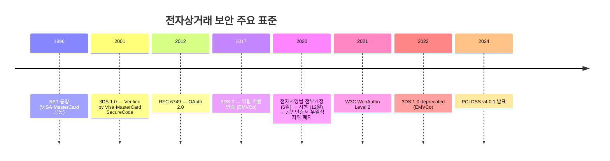
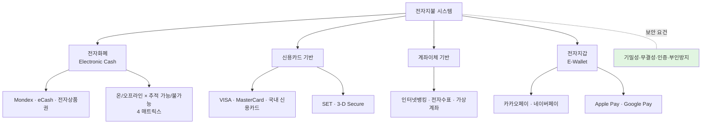
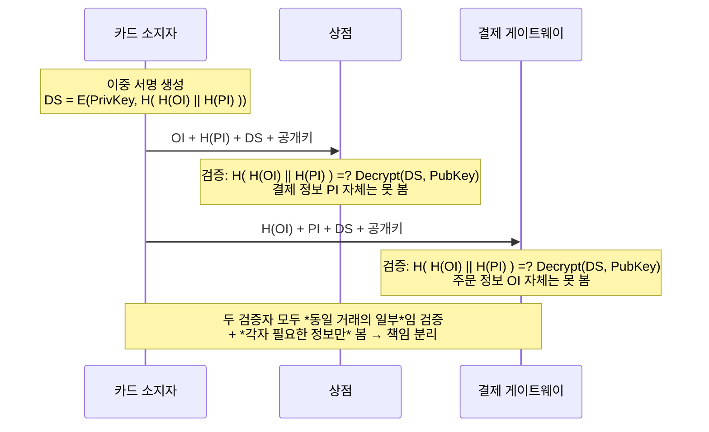
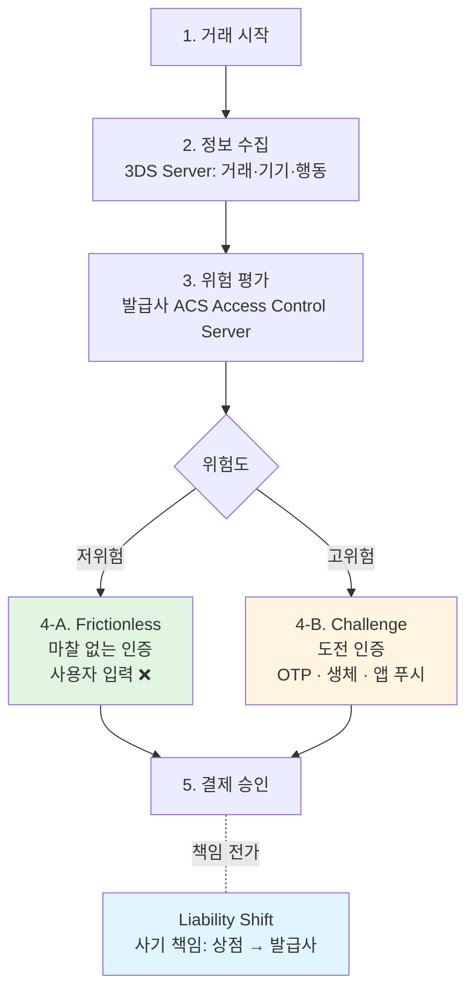
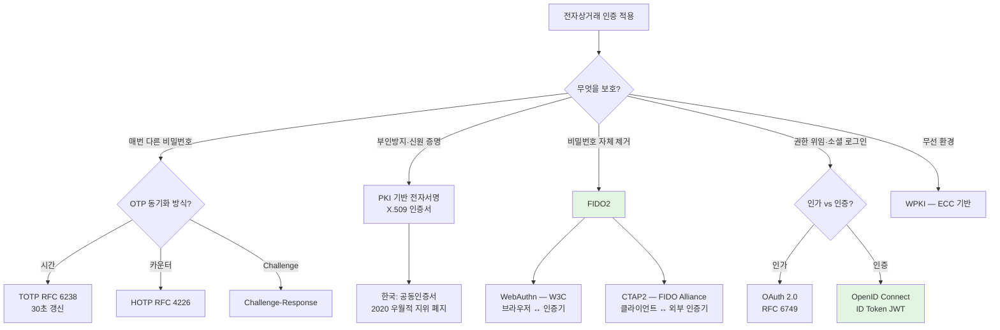

# 08. 전자상거래 보안 — 만화책처럼 읽는 SET·3DS·PCI DSS

> **이 문서를 읽는 법**: **SSL/TLS** 는 *전송 구간* 암호·무결성에 치우치고, **카드 소지자 인증·가맹점/도메인 신뢰·부인방지·PAN 보호(상점 미보관·PCI 등)** 까지 한꺼번에 해결하지는 않는다 — *왜 단순 TLS 만으로는 부족했는지* 가 출발점이다. *SET 의 이중 서명이 어떤 분리를 만들었는지*, *3DS 2 가 어떻게 **위험 기반 인증(RBA)** 으로 바뀌어 저위험은 **Frictionless**·고위험만 **Challenge** 로 나뉘는지* — 시간 순으로 따라가면 시험 함정이 풀립니다.
> 정확한 정의·수치·표준 번호는 정확본을 참조: [[cs/information-security/03.application-security/08.electronic-commerce-security|정확본 08. 전자상거래 보안]]

> **독자 가정**: *백엔드/풀스택 개발자, 결제는 처음.* 이미 익숙한 개념 (`HTTPS 결제 페이지`, `OTP`, `소셜 로그인`, `Apple Pay`) 을 다리로 씁니다.

---

## 🎯 시작 전에 — 이미 쓰고 있는 결제 보안

| 매일 보는 것 | 사실은 이 단원의 |
|---|---|
| HTTPS 결제 페이지 | SSL/TLS *전송 구간* 보안 (§6) — 카드 소지자 인증·PAN 수명주기 전부는 아님 |
| 카드 결제 시 **발급사 페이지**로 이동해 추가 인증 | 3DS **1.0** — 보통 **비밀번호** 체감이 크나 **OTP 등**도 가능 (Verified by Visa·SecureCode) |
| 결제 시 SMS/앱 **OTP** 등 추가 단계 | 3DS 2 **Challenge** — OTP·생체·푸시 등 *고위험 거래* 예시 (§8) |
| 일부 결제는 추가 입력 없이 통과 | 3DS 2 **Frictionless** (저위험·RBA) |
| 카카오페이·네이버페이 간편 결제 | 전자지갑 (§1) |
| Apple Pay·Google Pay 비접촉 결제 | NFC + 토큰화 (§12) |
| 인터넷뱅킹 OTP 토큰 | TOTP·HOTP (§9) |
| 소셜 로그인 (Google·Naver·Kakao) | **많은 구현이** OpenID Connect(+ OAuth 2.0 인가); *전부 OIDC 단정은 불가* (§10) |
| 사설·간편 인증으로 금융 거래 | 전자서명법 **우월적 지위 폐지** (**2020.12.10** 시행) 후 동등 효력 경쟁 (§9) |

> **이 단원의 본질**: 전자상거래는 *결제 + 인증 + 청구 + 이행* 의 *복합 트랜잭션*. 시험은 (1) **SET 의 이중 서명** (2) **3DS 의 3 Domain + 위험 기반 인증** (3) **PCI DSS 12 요구사항** (4) **공인인증서 *우월적 지위* 폐지** *4 핵심* 을 묻는다.

---

## 📖 에피소드 1 — 전자지불 4 분류 + 4 보안 요건 (CIA + 부인방지)

### 장면 1. 전자지불 시스템 4 분류

전자지불 시스템은 *화폐의 형태*와 *결제 흐름*에 따라 4가지로 분류.

| 분류 | 정의 | 대표 사례 |
|---|---|---|
| **전자화폐 (Electronic Cash)** | 디지털 형태로 발행된 가치를 가진 화폐. 발행 기관이 가치를 보증 | Mondex, eCash, 전자상품권 |
| **신용카드 기반** | 신용카드 정보를 인터넷으로 전송하여 결제 | VISA·MasterCard·국내 신용카드, SET, 3-D Secure |
| **계좌이체 기반** | 사용자 은행 계좌에서 직접 이체 | 인터넷뱅킹, 전자수표, 가상계좌 |
| **전자지갑 (E-Wallet)** | 결제 수단을 모바일·웹에 통합 저장하여 *간편 결제* | 카카오페이·네이버페이·Apple Pay·Google Pay |

### 장면 2. 전자상거래 4 보안 요건 — *CIA + 부인방지*

> **시험 핵심**: 일반 정보보호 *3대 목표 (CIA)* 에 **부인방지**가 추가된 **4 요건**이 전자상거래의 표준 보안 목표.

| 요구사항 | 영문 | 적용 기술 |
|---|---|---|
| **기밀성** | Confidentiality | SSL/TLS, 카드번호 암호화 |
| **무결성** | Integrity | 해시, MAC, 전자서명 |
| **인증** | Authentication | 전자서명, 인증서 |
| **부인방지** | Non-repudiation | 전자서명, 타임스탬프 |

### 시험 함정

- "전자상거래 *보안 요건 개수*?" → **4** (CIA 3 + 부인방지).
- "부인방지의 적용 기술?" → 전자서명 + 타임스탬프.
- "전자지갑의 사례?" → 카카오페이·네이버페이·Apple Pay·Google Pay.

---

## 📖 에피소드 2 — 전자화폐 세부: 결제 시점 × 사용자 식별

### 장면 1. 두 분류 축

전자화폐는 *2 차원 매트릭스*로 세분화.

| 분류 축 | 종류 |
|---|---|
| **결제 시점** | 온라인 (Online): 결제 시 발행 기관과 *실시간 통신* / 오프라인 (Offline): 발행 기관 *통신 없이* 결제 |
| **사용자 식별** | 추적 가능 (Identified): 사용자 신원이 결제 정보에 *포함* / 추적 불가능 (Anonymous): 사용자 신원 *미포함* |

### 장면 2. 4 조합 매트릭스

| 결제 시점 × 추적 | 특성 |
|---|---|
| **온라인 + 추적 가능** | 가장 일반적. 신원 확인·이중 사용 방지 모두 가능 |
| **온라인 + 추적 불가능** | 익명성 보장. 발행 기관이 이중 사용 방지 |
| **오프라인 + 추적 가능** | 통신 부담 없음. 사후 정산 |
| **오프라인 + 추적 불가능** | *가장 어려운 구현*. 위조·이중 사용 방지가 핵심 과제 |

### 시험 함정

- "오프라인 + 추적 불가능의 *핵심 과제*?" → 위조·이중 사용 방지.
- "이중 사용 방지가 가능한 조합?" → *온라인* (실시간 통신).

---

## 📖 에피소드 3 — SET 의 등장: 6 참여자

### 장면 1. SET 의 정체

> **SET (Secure Electronic Transaction)**: **1996년** *VISA*와 *MasterCard*가 공동 개발한 신용카드 기반 전자상거래 보안 프로토콜. 인터넷 신용카드 결제를 위해 설계. *카드 소지자·상점·결제 게이트웨이* 간의 *인증서 기반 결제 프로토콜*.

### 장면 2. *시장에서 사장된 이유*

> SET 은 *SSL 의 보급*과 *인증서 발급의 복잡성*으로 실제 시장에서는 **사장**되었으나, 정보보안기사 시험에서는 **이중 서명 (Dual Signature) 메커니즘**이 *빈출 영역*으로 그대로 출제된다.

### 장면 3. 6 참여자

| 참여자 | 역할 |
|---|---|
| **카드 소지자 (Cardholder)** | 신용카드를 소유한 *구매자* |
| **상점 (Merchant)** | 인터넷 상점 운영자. *카드 결제 수락* |
| **발급사 (Issuer)** | 카드 소지자에게 *신용카드 발급* 금융 기관 |
| **매입사 (Acquirer)** | 상점과 계약된 *카드 결제 처리* 금융 기관 |
| **결제 게이트웨이 (PG, Payment Gateway)** | 매입사를 대리하여 카드 결제 처리. *인터넷 ↔ 금융망 연계* |
| **인증기관 (CA)** | 모든 참여자의 *X.509 인증서* 발급·관리 |

### 시험 함정

- "SET 등장 연도와 공동 개발 기업?" → **1996년 / VISA·MasterCard**.
- "SET 참여자 수?" → **6**.
- "PG 의 역할?" → 매입사 대리 + 인터넷 ↔ 금융망 연계.

---

## 📖 에피소드 4 — SET 5 단계 결제 흐름

### 장면. 5 단계

| 단계 | 동작 |
|---|---|
| **1. 카드 소지자 등록** | 카드 소지자가 *인증기관 (CA) 에 등록*하여 인증서 발급 |
| **2. 상점 등록** | 상점이 *매입사·CA 에 등록*하여 상점용 인증서 발급 |
| **3. 결제 요청 (Purchase Request)** | 카드 소지자가 상점에 *주문 + 결제 정보 (이중 서명 적용)* 송신 |
| **4. 결제 승인 (Payment Authorization)** | 상점이 *결제 게이트웨이를 통해 매입사·발급사로 결제 승인* 요청·응답 |
| **5. 결제 캡처 (Payment Capture)** | 상점이 *매입사로 실제 자금 이체 청구* |

### 장면. 외우는 한 줄

> **등록 (1·2) → 요청 (3) → 승인 (4) → 캡처 (5)**. 1·2 단계는 *사전 인증서 등록*, 3·4·5 는 *실제 거래*.

### 시험 함정

- "SET 단계 수?" → **5**.
- "이중 서명 적용 단계?" → **3 (결제 요청)**.
- "5 단계의 의미?" → *결제 캡처* (자금 이체 청구).

---

## 📖 에피소드 5 — 이중 서명 (Dual Signature): SET 의 핵심

### 장면 1. 정의와 동기

> **이중 서명 (Dual Signature)**: SET 의 *핵심 보안 메커니즘*. 하나의 디지털 서명으로 *두 개의 메시지 (주문 정보·결제 정보) 를 동시에 서명*하면서, *상점은 결제 정보를 보지 못하고 결제 게이트웨이는 주문 정보를 보지 못하도록* 하는 분리 서명 기법.

**3 가지 동기**:

- **상점은 결제 정보 (카드번호·CVV) 를 알 필요 ❌** — 상점은 *주문 정보 (상품·금액) 만* 처리.
- **결제 게이트웨이는 주문 정보 (상품 상세) 를 알 필요 ❌** — PG 는 *결제 정보 (카드번호·금액) 만* 처리.
- *두 정보가 연결된 동일한 거래임*은 양측이 *모두 검증 가능*해야 한다.

### 장면 2. 이중 서명 *생성 단계* (카드 소지자)

```
1. 주문 정보 (OI, Order Information) 와 결제 정보 (PI, Payment Information) 를 각각 해시:
   H(OI), H(PI)

2. 두 해시값을 연결 (concatenate) 한 후 다시 해시:
   H( H(OI) || H(PI) )

3. 카드 소지자의 개인키로 위 결합 해시값을 서명 → 이중 서명 (DS):
   DS = E(PrivKey_Cardholder, H( H(OI) || H(PI) ))
```

### 장면 3. 이중 서명 *검증 단계*

| 검증자 | 받는 정보 | 검증 |
|---|---|---|
| **상점** | 주문 정보 OI + 결제 정보 *해시* H(PI) + 이중 서명 DS + 카드 소지자 공개키 | `H( H(OI) || H(PI) )` 가 카드 소지자 공개키로 복호화한 DS 와 일치하는지 검증. **결제 정보 PI 자체는 못 봄** |
| **결제 게이트웨이** | 주문 정보 *해시* H(OI) + 결제 정보 PI + 이중 서명 DS + 카드 소지자 공개키 | 동일 검증. **주문 정보 OI 자체는 못 봄** |

### 장면 4. *왜 마법인가*

> 두 검증자는 *자신이 받은 정보만 보면서도* **두 정보가 동일 거래의 일부임을 검증** 가능. *기밀성 + 책임 분리* 동시 달성.

### 시험 함정

- "이중 서명의 *상점 시야*?" → 주문 정보 + 결제 *해시*만 (PI 자체 못 봄).
- "이중 서명의 *PG 시야*?" → 결제 정보 + 주문 *해시*만 (OI 자체 못 봄).
- "이중 서명 공식?" → `DS = E(PrivKey, H( H(OI) || H(PI) ))`.

---

## 📖 에피소드 6 — SET 보안 서비스 + SSL/TLS 와의 시장 경쟁

### 장면 1. SET 의 4 보안 서비스

| 서비스 | 메커니즘 |
|---|---|
| **기밀성** | DES + RSA *하이브리드 암호화* |
| **무결성** | 해시 (SHA-1) + 디지털 서명 |
| **인증** | X.509 인증서 (모든 참여자) |
| **부인방지** | 디지털 서명 |

> SET 1.0 은 *대칭키 + 비대칭키 하이브리드* 암호화 사용. 대칭키 알고리즘은 SET 1.0 기준 **DES** ([[cs/information-security/04.security-general/05.crypto-algorithms|정확본 04-05 §4]] cross-ref).

### 장면 2. SSL/TLS 기반 결제 — *현재 표준*

> **SSL/TLS 는 SET 의 복잡성을 대체**하여 *현재 전자상거래의 사실상 표준 보안 프로토콜*. 카드 정보는 *SSL/TLS 위에서 결제 게이트웨이로 전송*되며, **상점은 카드 정보를 받지 않는** *Hosted Payment Page* 방식이 일반적 (PCI DSS 부담 경감).

### 장면 3. SET vs SSL/TLS 한 표

| 항목 | SET | SSL/TLS 기반 결제 |
|---|---|---|
| 카드 소지자 인증 | 인증서 *필수* | 인증서 *선택* (3-D Secure 와 결합) |
| 상점 인증 | 인증서 *필수* | 인증서 (서버 인증서) |
| 인증서 발급 부담 | *매우 높음* | 서버 인증서만 |
| 결제 정보 분리 | *이중 서명*으로 분리 | *Hosted Payment Page*로 분리 |
| 시장 점유 | *사실상 사장* | *표준* |

### 장면 4. SSL/TLS 결제 5 단계 흐름

```
[1] 사용자가 상점 사이트에서 결제 버튼 클릭
[2] 상점은 사용자를 결제 게이트웨이의 Hosted Payment Page 로 리다이렉트
[3] 사용자는 *결제 게이트웨이 도메인*의 HTTPS 페이지에서 카드 정보 입력
[4] 결제 게이트웨이는 카드 정보로 매입사·발급사에 승인 요청
[5] 승인 결과를 상점으로 콜백 — *상점은 카드 정보를 보지 못함*
```

### 장면 5. SSL/TLS 4 보안 서비스

| 서비스 | 메커니즘 |
|---|---|
| 기밀성 | TLS 1.2 / 1.3 의 대칭키 암호화 (AES-GCM 등) |
| 무결성 | HMAC 또는 AEAD |
| 서버 인증 | X.509 인증서 |
| 클라이언트 인증 | (선택) X.509 클라이언트 인증서 |

### 시험 함정

- "SET vs SSL/TLS 시장 점유?" → 사장 vs 표준.
- "SSL/TLS 결제의 *상점 시야*?" → 카드 정보 *못 봄* (Hosted Payment Page).
- "SET 1.0 의 대칭키 알고리즘?" → **DES**.

---

## 📖 에피소드 7 — 3DS 1.0 vs 3DS 2: 추가 인증에서 위험 기반으로

### 장면 1. 정의와 *3 Domain*

> **3-D Secure (3DS)**: 카드 결제의 *카드 소지자 인증 단계를 추가*하여 *카드 정보 도용 결제 차단*을 위한 표준. **EMVCo** 가 관리.

> **이름의 *3 Domain***:
> 1. **발급사 도메인** (Issuer Domain)
> 2. **매입사 도메인** (Acquirer Domain)
> 3. **상호운용 도메인** (Interoperability Domain)

### 장면 2. 3DS 1.0 vs 3DS 2 — 시험 빈출 1순위

| 구분 | **3DS 1.0** (2001) | **3DS 2** (2017) |
|---|---|---|
| 인증 방식 | **발급사 ACS** 로 리다이렉트 후 **추가 인증** — 체감상 *비밀번호*가 대표적이나 **OTP 등**도 가능 | **위험 기반 인증 (RBA)** — 거래·기기·결제수단 정보 교환 후 발급사가 판단, *필요 시에만* 추가 인증 (EMVCo 3DS 2) |
| 사용자 경험 | *자주* 리다이렉트·수동 입력 (구매 포기율 ↑) | 저위험 거래는 **마찰 없는 인증 (Frictionless)** — 추가 입력 없이 진행 가능 |
| 추가 인증 방식 | 비밀번호가 흔함 · 발급사 정책에 따라 OTP 등 | OTP·생체·앱 푸시 등 **Challenge** 시 다양 |
| 모바일·앱 지원 | 약함 | 강함 |
| EMVCo 표준화 | 부분 | 완전 (3DS Protocol Specification 2.x) |

### 장면 3. 3DS 1.0 의 *deprecated*

> 3DS 1.0 은 **EMVCo 에 의해 2022년 deprecated**. 현재는 **3DS 2 가 표준**.

### 시험 함정

- "3DS 의 *3 Domain*?" → 발급사·매입사·상호운용.
- "3DS 2 의 핵심 진화?" → **위험 기반 인증** (Risk-Based Authentication).
- "3DS 1.0 deprecated 연도?" → **2022** (EMVCo).
- "3DS 의 표준 관리?" → **EMVCo**.

---

## 📖 에피소드 8 — 3DS 2 인증 흐름 + 책임 전가

### 장면 1. 5 단계 인증 흐름

| 단계 | 동작 |
|---|---|
| **1. 거래 시작** | 사용자가 상점에서 결제 시도 |
| **2. 정보 수집** | **3DS Server** 가 *거래 정보·기기 정보·사용자 행동 정보* 수집 |
| **3. 위험 평가** | 발급사 **ACS (Access Control Server)** 가 위험도 평가 |
| **4-A. 마찰 없는 인증** | *저위험* 거래는 추가 인증 없이 승인 — *사용자 경험 매끄러움* |
| **4-B. 도전 인증 (Challenge)** | *고위험* 거래는 *OTP·생체·앱 푸시* 등 추가 인증 요구 |
| **5. 결제 승인** | 인증 성공 시 결제 게이트웨이가 발급사에 승인 요청 |

### 장면 2. 책임 전가 (Liability Shift) — 3DS 도입의 *상점 동기*

> **책임 전가 (Liability Shift)**: 3DS 의 *부수적 가치*는 *사기 책임의 전가*. 3DS 인증을 거친 거래는 *사기로 판명되어도 상점이 책임지지 않고 발급사가 책임* — 이게 *상점이 3DS 도입의 동기*.

### 시험 함정

- "위험도 평가 주체?" → 발급사 **ACS** (Access Control Server).
- "Frictionless vs Challenge?" → 저위험 매끄러움 vs 고위험 추가 인증.
- "Liability Shift 의 의미?" → 사기 책임을 *상점 → 발급사* 로 이전.

---

## 📖 에피소드 9 — OTP 3 종 + PKI 기반 전자서명 (한국)

### 장면 1. OTP 의 정체

> **OTP (One-Time Password)**: *매번 다른 일회용 비밀번호*를 사용하는 인증 방식. *고정된 비밀번호의 노출·재사용 위협 차단*.

### 장면 2. OTP 3 종

| 종류 | 동작 |
|---|---|
| **시간 동기화 OTP (TOTP, RFC 6238)** | 현재 시각 기반 OTP 생성. *30초마다 갱신* |
| **이벤트 동기화 OTP (HOTP, RFC 4226)** | 카운터 값 기반 OTP 생성. *사용 시마다 카운터 증가* |
| **Challenge-Response OTP** | *서버의 Challenge*에 대한 Response 로 OTP 생성 |

> 한국 인터넷뱅킹·증권 거래에서는 *보안카드 (고정 비밀번호 카드)* 와 *OTP 토큰* 사용.

### 장면 3. PKI 기반 전자서명

> **전자서명 (Digital Signature)**: 발신자의 *개인키*로 서명, 수신자가 *공개키*로 검증. *메시지 무결성·인증·부인방지* 제공 ([[cs/information-security/04.security-general/04.digital-signature-pki|정확본 04-04 디지털서명·PKI]] cross-ref).

### 장면 4. 한국의 *공동인증서* 와 전자서명법

> 한국에서는 **공동인증서** (구 공인인증서) 가 한국 전자상거래 인증의 *표준*으로 광범위 사용. **2020.6 전부개정·2020.12.10 시행** 의 **전자서명법 개정**으로 **공인전자서명 제도 (공인인증서 우월적 지위) 가 폐지**됨. 이후 *사설 인증서·간편 인증·생체 인증* 등이 다양하게 사용.

### 시험 함정

- "TOTP 갱신 주기?" → **30초**.
- "TOTP·HOTP 의 RFC?" → **RFC 6238** / **RFC 4226**.
- "전자서명법 개정 시행일?" → **2020.12.10** (2020.6 전부개정).
- "공인인증서가 *폐지*?" → ❌. **우월적 지위가 폐지**.

---

## 📖 에피소드 10 — FIDO2 / WebAuthn / OAuth 2.0 / OIDC

### 장면 1. FIDO2 — *비밀번호 없는* 인증

> **FIDO2 (Fast IDentity Online 2)**: *FIDO Alliance* 와 *W3C* 가 표준화한 **비밀번호 없는** 인증 표준. *생체 인증 (지문·얼굴) + 보안키 (YubiKey 등)* 가 핵심 메커니즘.

### 장면 2. FIDO2 의 2 표준

| 표준 | 정의처 | 역할 |
|---|---|---|
| **WebAuthn (Web Authentication)** | **W3C** | *브라우저 ↔ 인증기 (Authenticator)* 간 표준 API |
| **CTAP2 (Client to Authenticator Protocol)** | **FIDO Alliance** | *클라이언트 ↔ 외부 인증기* 간 통신 프로토콜 |

> **FIDO2 의 본질**: *공유 비밀 (비밀번호) 자체를 제거* — PKI 기반 전자서명의 사용자 경험 단점을 해결.

### 장면 3. OAuth 2.0 — *인가* 프레임워크

> **OAuth 2.0 (RFC 6749)**: 사용자가 *자격증명을 노출하지 않고* *제3자 어플리케이션이 사용자의 자원에 접근*할 수 있도록 권한을 위임하는 **인가 (Authorization)** 프레임워크.

### 장면 4. OpenID Connect (OIDC) — *인증* 계층

> **OIDC**: *OAuth 2.0 위에 구축된* **인증 (Authentication)** 계층. **ID Token (JWT)** 으로 *사용자 신원 정보* 전달.

### 장면 5. OAuth 2.0 vs OIDC — 시험 빈출 1순위

| 구분 | OAuth 2.0 | OpenID Connect |
|---|---|---|
| **목적** | *인가* (Authorization) | *인증* (Authentication) |
| 토큰 | Access Token | **ID Token (JWT)** + Access Token |
| 표준 | IETF *RFC 6749* | OIDC Foundation |
| 사용 사례 | 소셜 로그인 권한 위임, API 접근 | 소셜 로그인 (Google·Naver·Kakao 등) |

> **시험 핵심**: **OAuth 2.0 = 인가**, **OIDC = 인증**. OIDC 가 OAuth 2.0 *위에서* 동작.

### 시험 함정

- "FIDO2 의 *2 표준*과 정의처?" → WebAuthn (W3C) + CTAP2 (FIDO Alliance).
- "OAuth 2.0 의 RFC?" → **RFC 6749**.
- "OAuth 2.0 ↔ OIDC?" → 인가 vs 인증.
- "OIDC 의 *ID Token 형식*?" → **JWT**.

---

## 📖 에피소드 11 — 무선 플랫폼: WAP·WTLS·WPKI

### 장면 1. WAP 의 정체

> **WAP (Wireless Application Protocol)**: *1990년대 후반 ~ 2000년대 초반* 모바일 인터넷 접근을 위해 설계된 프로토콜 스택. 무선 통신의 *제한된 대역폭·전력·메모리* 환경에 맞춘 *경량* 프로토콜.

> WAP 은 *모바일 브라우저 보급으로 사실상 사장*되었으나 *무선 전자상거래 보안의 역사적 맥락*으로 시험 출제.

### 장면 2. WTLS — 무선 SSL/TLS

> **WTLS (Wireless Transport Layer Security)**: WAP 환경에서 *SSL/TLS 의 역할*을 하는 *무선 전송 계층* 보안 프로토콜. **SSL 3.0 기반**으로 무선 환경에 최적화.

### 장면 3. *WAP Gap* — WTLS 의 결정적 한계

> **WAP Gap**: WTLS 의 *치명적 한계* — *WAP 게이트웨이에서 평문화*. 무선 구간 (단말 ↔ 게이트웨이) 은 *WTLS*, 유선 구간 (게이트웨이 ↔ 서버) 은 *SSL/TLS* 로 **분할 보안** → *게이트웨이에서 일시적으로 평문 노출*.

### 장면 4. WPKI — 경량 PKI

> **WPKI (Wireless Public Key Infrastructure)**: 무선 환경의 PKI. 일반 PKI 와 *호환*되지만 *무선 단말의 제약 (저장 공간·연산 능력) 을 고려한 경량화 버전*.

### 장면 5. WPKI ↔ 일반 PKI

| 일반 PKI | WPKI |
|---|---|
| X.509 v3 인증서 (수 KB) | *압축된 인증서 형식* |
| **RSA** 2048·3072 bit | **ECC 우선** (짧은 키 길이로 동등한 안전성) |
| 고정 회선 통신 | 무선 통신 (간헐적) |

> **WPKI 핵심**: *짧은 키로 동등한 안전성을 제공하는 ECC 기반 PKI*. 무선 환경 제약 대응이 핵심 동기.

### 시험 함정

- "WAP Gap 의 의미?" → 게이트웨이에서 *일시적 평문 노출*.
- "WTLS 의 기반?" → **SSL 3.0**.
- "WPKI 가 ECC 우선인 이유?" → *짧은 키 + 무선 단말 제약*.

---

## 📖 에피소드 12 — EMV·NFC·토큰화·모바일 결제

### 장면 1. EMV — 칩 카드 결제 표준

> **EMV**: **E**uropay·**M**asterCard·**V**isa 가 공동 개발한 *IC 카드 결제 표준*. *칩 카드 인증·결제 표준*.

### 장면 2. NFC — 13.56 MHz 비접촉 통신

> **NFC (Near Field Communication)**: **13.56 MHz** *근거리 무선 통신*. *Apple Pay·Google Pay 의 비접촉 결제 기반*.

### 장면 3. 토큰화 (Tokenization) — *카드번호 보호*

> **토큰화 (Tokenization)**: *카드번호를 토큰으로 대체* → *토큰이 노출되어도 실제 카드번호는 보호*되는 메커니즘.

### 장면 4. Apple Pay / Google Pay — NFC + 토큰화

> **Apple Pay / Google Pay**: **NFC + 토큰화**로 *실제 카드번호 대신 일회성 토큰* 사용.

### 시험 함정

- "EMV 의 풀이?" → **E**uropay·**M**asterCard·**V**isa.
- "NFC 주파수?" → **13.56 MHz**.
- "Apple Pay·Google Pay 의 *결제 메커니즘*?" → **NFC + 토큰화**.
- "토큰화의 가치?" → 토큰 노출 시에도 *카드번호 보호*.

---

## 📖 에피소드 13 — PCI DSS v4 + 한국 법령

### 장면 1. PCI DSS 의 정체

> **PCI DSS (Payment Card Industry Data Security Standard)**: **VISA·MasterCard·American Express·Discover·JCB** 의 **5개 카드 브랜드**가 공동 운영하는 **PCI Security Standards Council** 이 발행하는 *카드 결제 데이터 보안 표준*.

작성 시점 기준 최신 버전은 **PCI DSS v4.0.1** (**2024.6** 발표). *카드 데이터를 처리·저장·전송하는 모든 사업자*에게 적용.

### 장면 2. 6 대 목표 + 12 대 요구사항

| 목표 | 요구사항 (12개) |
|---|---|
| **1. 안전한 네트워크 구축·유지** | 1) 방화벽·라우터 보안 설정 / 2) 기본 패스워드·기본 보안 설정 변경 |
| **2. 카드 소지자 데이터 보호** | 3) 저장된 카드 소지자 데이터 보호 / 4) 공개 네트워크 전송 시 *암호화* |
| **3. 취약점 관리 프로그램 유지** | 5) 안티-맬웨어 / 6) 안전한 시스템·어플리케이션 개발·유지 |
| **4. 강력한 접근 통제 조치** | 7) *알아야 할 필요 (Need-to-know) 에 따른 접근 제한* / 8) 컴퓨터 접근에 대한 식별·인증 / 9) 카드 소지자 데이터에 대한 *물리적 접근 제한* |
| **5. 네트워크 모니터링·테스트** | 10) 네트워크 자원·카드 소지자 데이터 접근 *추적·모니터링* / 11) 보안 시스템·프로세스 *정기 테스트* |
| **6. 정보보안 정책 유지** | 12) 모든 인력에 대한 정보보안 정책 유지 |

> **버전 참고**: 문서 표는 **PCI DSS v4.0.1** 체계에 맞춘 요약이다. **3.x** 대비 세부 문구·번호 체계가 다를 수 있어, 실무·감사 시에는 **적용 중인 공식 문서**를 본다.

### 장면 3. 한국 법령 4 종

| 법령·규정 | 핵심 내용 |
|---|---|
| **전자서명법** | 전자서명의 법적 효력 보장. **2020.6 전부개정 (법률 제17354호)·2020.12.10 시행**으로 *공인인증서 우월적 지위 폐지* — 다양한 사설 인증서가 동등하게 사용 가능 |
| **전자금융거래법** | 전자금융 거래의 *안전성·신뢰성 확보* |
| **전자금융감독규정 (금융위원회 고시)** | 금융회사·전자금융업자의 정보기술 부문·정보보호 등을 위한 *인력·조직·예산 등 인적·물적 보안 사항* 규정 |
| **개인정보보호법** | 카드번호·계좌번호 등 *고유식별정보의 암호화 의무* ([[cs/information-security/03.application-security/06.web-server-hardening|정확본 06 §7-2]] cross-ref) |

### 장면 4. *공인인증서 폐지가 아니다*

> **시험 함정 1순위**: **2020.6 전부개정·2020.12.10 시행** 전자서명법 개정으로 *공인인증서가 폐지된 것이 아니라*, **공인인증서의 우월적 지위가 폐지**된 것이다. *사설 인증서가 동등 효력*을 가지게 되었다.

### 장면 5. PCI DSS 는 법령이 아니다

> **시험 함정**: **PCI DSS 는 카드 결제 데이터 보안 표준**이며 *법령이 아니다* — *카드 브랜드 5사의 자율 규범*.

### 시험 함정

- "PCI DSS 운영 주체?" → **5개 카드 브랜드의 PCI Security Standards Council**.
- "PCI DSS 최신 버전·발표일?" → **v4.0.1 / 2024.6**.
- "PCI DSS 6 목표·12 요구사항?" → 안전 네트워크·데이터 보호·취약점·접근 통제·모니터링·정책.
- "전자서명법 개정?" → 우월적 지위 폐지 (*폐지 아님*).
- "PCI DSS 는 법령?" → ❌ (자율 규범).

---

## 📑 종합 비교 (에피소드 3·6·7 정리)

SET·SSL/TLS·3DS *3 결제 보안 프로토콜* 종합.

| 프로토콜 | 등장 | 목적 | 시장 점유 |
|---|---|---|---|
| **SET** | 1996 (VISA·MasterCard) | 신용카드 결제 + 이중 서명 분리 | *사장* |
| **SSL/TLS 결제** | (TLS 진화) | 전송 구간 보안 + Hosted Payment Page | *표준* |
| **3DS 1.0** | 2001 | 카드 소지자 **추가 인증**(리다이렉트·비밀번호·OTP 등) | 2022 deprecated |
| **3DS 2** | 2017 | *위험 기반* 인증 (Frictionless / Challenge) | *현재 표준* |

> **읽는 법**: SSL/TLS 가 *표준*이지만 카드 정보 도용 위험은 남는다 → *3DS 가 카드 소지자 인증 추가*. 3DS 1.0 은 **리다이렉트·수동 추가 인증**으로 마찰이 컸고 → **3DS 2** 는 **RBA** 로 저위험은 **Frictionless**·고위험만 **Challenge** 로 진화했다.

---

## 🗺️ 마인드맵 1 — 전자상거래 표준 시간선



---

## 🗺️ 마인드맵 2 — 전자지불 시스템 4 분류



---

## 🗺️ 마인드맵 3 — SET 이중 서명 검증 흐름



---

## 🗺️ 마인드맵 4 — 3DS 2 인증 흐름



---

## 🗺️ 마인드맵 5 — 인증 기술 결정 트리



---

## 🗂️ 키워드 클러스터

### 표준 운영 주체

```
SET            — VISA · MasterCard (1996)
3DS            — EMVCo (3DS 1.0 = 2001, 3DS 2 = 2017, 3DS 1.0 deprecated = 2022)
PCI DSS        — PCI Security Standards Council (5 브랜드: VISA·MasterCard·American Express·Discover·JCB)
WebAuthn       — W3C
CTAP2          — FIDO Alliance
OAuth 2.0      — IETF RFC 6749 (2012)
OIDC           — OIDC Foundation
TOTP / HOTP    — RFC 6238 / RFC 4226
EMV            — Europay·MasterCard·Visa
```

### SET 6 참여자

```
Cardholder · Merchant · Issuer · Acquirer · PG (Payment Gateway) · CA
```

### 이중 서명 공식

```
DS = E(PrivKey_Cardholder, H( H(OI) || H(PI) ))

상점 시야: OI + H(PI) + DS  →  PI 자체 못 봄
PG 시야:  H(OI) + PI + DS  →  OI 자체 못 봄
```

### 3DS 2 5 단계

```
거래 시작 → 정보 수집 (3DS Server) → 위험 평가 (ACS) → Frictionless / Challenge → 결제 승인
```

### 무선 플랫폼

```
WAP    — 무선 프로토콜 스택 (사장)
WTLS   — SSL 3.0 기반 무선 TLS (WAP Gap 한계)
WPKI   — ECC 기반 경량 PKI
EMV    — 칩 카드 결제 표준
NFC    — 13.56 MHz 비접촉 통신
토큰화   — 카드번호 → 일회성 토큰
```

### PCI DSS 6 목표

```
1. 안전한 네트워크 구축·유지
2. 카드 소지자 데이터 보호
3. 취약점 관리 프로그램 유지
4. 강력한 접근 통제 조치
5. 네트워크 모니터링·테스트
6. 정보보안 정책 유지
```

### 한국 법령 4 종

```
전자서명법              — 2020.6 전부개정 (법률 17354호) · 2020.12.10 시행 → 공인인증서 우월적 지위 폐지
전자금융거래법           — 전자금융 거래 안전성·신뢰성
전자금융감독규정 (금융위) — 금융회사 인력·조직·예산 등 보안 사항
개인정보보호법          — 고유식별정보 암호화 의무
```

### 전자상거래 4 보안 요건

```
기밀성 · 무결성 · 인증 · 부인방지 (CIA + 부인방지)
```

---

## 🃏 회상 30문항

> 답을 가린 뒤 자가 채점. 틀린 것만 정확본으로 깊이 학습.

**A. 전자지불·보안 요건 (1~6)**
1. 전자지불 시스템 4 분류?
2. 전자지갑 4 사례?
3. 전자상거래 4 보안 요건?
4. 전자화폐 *결제 시점 × 사용자 식별* 매트릭스?
5. *오프라인 + 추적 불가능*의 핵심 과제?
6. 부인방지의 적용 기술?

**B. SET (7~12)**
7. SET 등장 연도와 공동 개발 기업?
8. SET 6 참여자?
9. SET 5 단계 흐름?
10. 이중 서명의 핵심 분리?
11. 이중 서명 공식?
12. SET vs SSL/TLS 시장 점유?

**C. SSL/TLS·3DS (13~18)**
13. SSL/TLS 결제의 *상점 시야*?
14. 3DS 의 *3 Domain*?
15. 3DS 1.0 vs 3DS 2 핵심 차이?
16. 3DS 2 의 *위험 기반 인증* 두 결과?
17. 책임 전가의 의미?
18. 3DS 1.0 deprecated 연도?

**D. 인증·무선 (19~24)**
19. TOTP·HOTP 의 RFC?
20. WebAuthn·CTAP2 정의처?
21. OAuth 2.0 ↔ OIDC 의 차이?
22. WAP Gap 의 의미?
23. WPKI 가 ECC 우선인 이유?
24. EMV 의 풀이?

**E. PCI DSS·법령 (25~30)**
25. PCI DSS 운영 주체와 5 브랜드?
26. PCI DSS 최신 버전·발표일?
27. PCI DSS 6 목표?
28. 전자서명법 개정 시행일?
29. 공인인증서 *폐지*?
30. NFC 주파수?

---

## ⚠️ 시험 함정 모음

| 함정 | 정답 |
|---|---|
| 전자상거래 보안 요건 *3대*? | ❌ **4** (CIA + 부인방지) |
| SET 등장 기업? | VISA + MasterCard (1996) |
| SET 참여자 수? | **6** |
| SET 시장 점유? | *사장* |
| 이중 서명의 *상점 시야*? | OI + H(PI) (PI 자체 ❌) |
| 이중 서명의 *PG 시야*? | H(OI) + PI (OI 자체 ❌) |
| SSL/TLS 결제의 상점 시야? | 카드 정보 *못 봄* (Hosted Payment Page) |
| 3DS 의 *3 Domain*? | 발급사·매입사·상호운용 |
| 3DS 표준 관리? | **EMVCo** |
| 3DS 1.0 deprecated? | **2022** |
| 3DS 2 핵심? | **위험 기반 인증** |
| Frictionless vs Challenge? | 저위험 매끄러움 vs 고위험 추가 인증 |
| Liability Shift? | 사기 책임 *상점 → 발급사* |
| TOTP RFC·갱신? | RFC 6238 / 30초 |
| HOTP RFC? | RFC 4226 |
| WebAuthn 정의처? | **W3C** |
| CTAP2 정의처? | **FIDO Alliance** |
| OAuth 2.0 ↔ OIDC? | 인가 vs 인증 |
| 소셜 로그인 = 항상 OIDC? | ❌ — 서비스마다 **OAuth만** 또는 **OIDC** 혼재; *많은 구현이 OIDC(+ OAuth)* |
| OIDC 의 ID Token? | **JWT** |
| WAP Gap? | 게이트웨이 일시적 평문 |
| WTLS 의 기반? | **SSL 3.0** |
| WPKI 의 키 알고리즘? | **ECC** 우선 |
| EMV 의 풀이? | Europay·MasterCard·Visa |
| NFC 주파수? | **13.56 MHz** |
| 토큰화의 가치? | 토큰 노출에도 카드번호 보호 |
| PCI DSS 운영 주체? | PCI Security Standards Council (5 브랜드) |
| PCI DSS 최신? | **v4.0.1 / 2024.6** |
| PCI DSS 는 법령? | ❌ (자율 규범) |
| 전자서명법 개정? | *우월적 지위 폐지* (폐지 아님) |
| 전자서명법 시행일? | **2020.12.10** |

---

## 🔗 정확본 매핑표

| 본 노트 에피소드 | 정확본 § |
|---|---|
| 에피소드 1 (4 분류 + 4 보안 요건) | [[cs/information-security/03.application-security/08.electronic-commerce-security#1-1. 전자지불 시스템의 4 분류\|정확본 §1-1·§1-3]] |
| 에피소드 2 (전자화폐 매트릭스) | [[cs/information-security/03.application-security/08.electronic-commerce-security#1-2. 전자화폐의 세부 분류\|정확본 §1-2]] |
| 에피소드 3 (SET 6 참여자) | [[cs/information-security/03.application-security/08.electronic-commerce-security#2. SET (Secure Electronic Transaction) 프로토콜\|정확본 §2·§2-1]] |
| 에피소드 4 (SET 5 단계) | [[cs/information-security/03.application-security/08.electronic-commerce-security#2-2. SET 의 5 단계 결제 흐름\|정확본 §2-2]] |
| 에피소드 5 (이중 서명) | [[cs/information-security/03.application-security/08.electronic-commerce-security#2-3. 이중 서명 (Dual Signature) 메커니즘\|정확본 §2-3]] |
| 에피소드 6 (SET 보안 + SSL/TLS) | [[cs/information-security/03.application-security/08.electronic-commerce-security#2-4. SET 의 보안 서비스\|정확본 §2-4·§3]] |
| 에피소드 7 (3DS 1.0 vs 2) | [[cs/information-security/03.application-security/08.electronic-commerce-security#4-1. 3DS 1.0 vs 3DS 2\|정확본 §4·§4-1]] |
| 에피소드 8 (3DS 2 흐름 + 책임 전가) | [[cs/information-security/03.application-security/08.electronic-commerce-security#4-2. 3DS 2 인증 흐름\|정확본 §4-2·§4-3]] |
| 에피소드 9 (OTP + 전자서명) | [[cs/information-security/03.application-security/08.electronic-commerce-security#5-1. OTP (One-Time Password)\|정확본 §5-1·§5-2]] |
| 에피소드 10 (FIDO2 + OAuth/OIDC) | [[cs/information-security/03.application-security/08.electronic-commerce-security#5-3. FIDO2 / WebAuthn (외부 보강)\|정확본 §5-3·§5-4]] |
| 에피소드 11 (WAP·WTLS·WPKI) | [[cs/information-security/03.application-security/08.electronic-commerce-security#6. 무선플랫폼 전자상거래 보안\|정확본 §6-1·§6-2·§6-3]] |
| 에피소드 12 (EMV·NFC·토큰화) | [[cs/information-security/03.application-security/08.electronic-commerce-security#6-4. 모바일 결제 표준 (외부 보강)\|정확본 §6-4]] |
| 에피소드 13 (PCI DSS + 한국 법령) | [[cs/information-security/03.application-security/08.electronic-commerce-security#7. PCI DSS 와 한국 법령\|정확본 §7-1·§7-2]] |

---

## 📅 학습 흐름 (8주차 시험 대비 기준)

```
[1주]   에피소드 1·2 (4 분류 + 4 요건 + 전자화폐 매트릭스) — 만화책 통독
[2주]   에피소드 3·4 (SET 6 참여자·5 단계)
[3주]   에피소드 5 (이중 서명) — 공식·시야 외움
[4주]   에피소드 6 (SET vs SSL/TLS·Hosted Payment Page)
[5주]   에피소드 7·8 (3DS 1.0·2 + 책임 전가) — 위험 기반 인증 외움
[6주]   에피소드 9·10 (OTP·전자서명·FIDO2·OAuth/OIDC) — RFC 외움
[7주]   에피소드 11·12 (WAP·WTLS·WPKI·EMV·NFC·토큰화)
[8주]   에피소드 13 (PCI DSS·법령) — 우월적 지위 폐지 외움 + 회상 30
```

---

> **다음 단원**: [[cs/information-security/03.application-security/09.secure-development|09. 어플리케이션 개발 보안]] — 본 단원 §13 의 *PCI DSS 6 목표*가 09 단원의 *Secure SDLC 5 단계 + KISA 7 대 보안약점*으로 확장.
