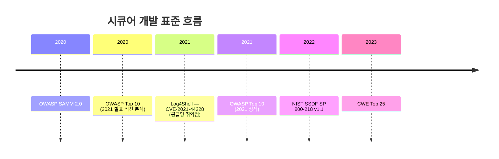
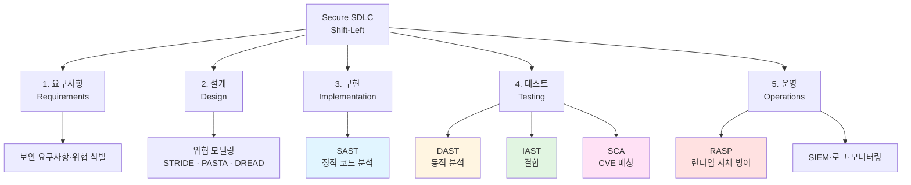
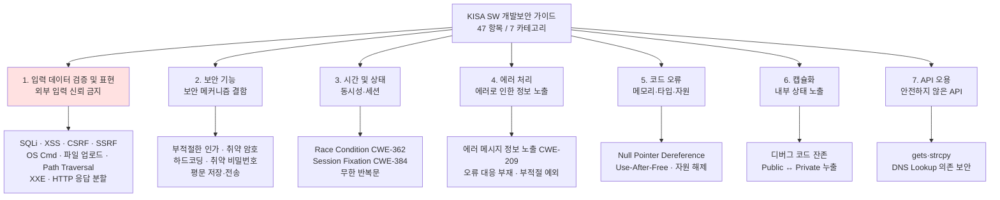
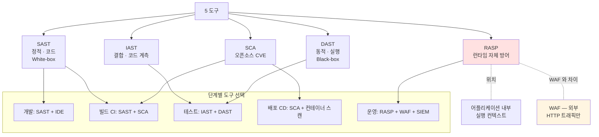

# 09. 어플리케이션 개발 보안 — 만화책처럼 읽는 KISA 7 유형 분류와 점검·방어 5 도구

> **이 문서를 읽는 법**: 05 단원의 21 공격에 맞서 *코드 레벨에서 보안약점을 제거·완화*하는 흐름을 잡는다. **KISA 소프트웨어 보안약점 7개 유형**은 *잘못된 구현을 어떻게 분류하는지*의 체계이고, **SAST·DAST·IAST·SCA·RASP** 는 *애플리케이션 보안 점검·방어 도구(기법) 유형*이다. 둘은 연결돼 이해할 수 있지만 **같은 공식 세트·1:1 고정 매칭처럼 외우면 안 된다**. 시간 순으로 따라가면 시험 함정이 풀립니다.
> 정확한 정의·수치·표준 번호는 정확본을 참조: [[cs/information-security/03.application-security/09.secure-development|정확본 09. 어플리케이션 개발 보안]]

> **독자 가정**: *백엔드/풀스택 개발자, 보안 개발은 처음.* 이미 익숙한 개념 (`SonarQube`·`OWASP ZAP`·`Snyk`·`CI 파이프라인`) 을 다리로 씁니다.

---

## 🎯 시작 전에 — 이미 쓰고 있는 시큐어 개발

| 매일 보는 것 | 사실은 이 단원의 |
|---|---|
| CI 의 SonarQube 단계 | **SAST 계열** 정적 분석 *대표 예*. *모든 SAST가 SonarQube는 아니며*, SonarQube는 *품질·유지보수성 등 보안 외 이슈*도 함께 본다 |
| 로컬 OWASP ZAP·Burp Suite 점검 | **DAST** (실행 중 앱에 외부에서 공격 시뮬). Burp는 *자동 스캔 + 수동 프록시·침투* 성격도 강함 |
| `npm audit` / Dependabot PR | **SCA** (오픈소스·의존성 CVE 매칭) |
| 코드 리뷰 시 `gets()`·`strcpy()` 지적 | 시험 분류는 보통 **⑦ API 오용**; *오버플로 등 결과*는 **① 입력 데이터 검증 및 표현** 맥락으로도 설명되는 교재 있음 |
| `password = "admin123"` 하드코딩 발견 | KISA 7대 ② 보안 기능 (CWE-798) |
| Threat Model 회의에서 STRIDE | 에피소드 2 **위협 모델링** — *설계 단 위협 종류* 분류 (**KISA 7대·구현 약점 분류와 층위가 다름**) |
| 빌드 실패 → "Test before Deploy" | Shift-Left Security |
| 운영에 붙는 **RASP 에이전트** | **RASP** = 앱 *내부* 런타임 탐지·차단. *WAF(경 외부)와 혼동·특정 상품명에만 매몰되지 말 것* |
| Log4Shell 패치 비상 대응 | OWASP **A06** + **SCA** 영역 (구성요소·CVE 대응) |

> **이 단원의 본질**: 05 단원이 *공격·위협*이라면 09 단원은 *보안약점 제거·완화*. **Shift-Left** = 보안을 *개발 흐름의 왼쪽 (앞단)* 으로. **KISA 7 유형** = *무엇이 잘못됐는지* **분류 체계**, **SAST~RASP** = *언제·어떻게 점검·방어할지* **도구 유형** — **서로 다른 축**이라 **7+5를 한 벌의 공식처럼 1:1 매칭해 외우지 말 것**. 시험에서는 **축 구분** + **SAST·DAST** 중심이 핵심.

---

## 📖 에피소드 1 — Secure SDLC: Traditional vs Secure + Shift-Left

### 장면 1. 정의

> **Secure SDLC (Secure Software Development Life Cycle)**: 소프트웨어 개발 *전 단계 (요구사항 → 설계 → 구현 → 테스트 → 운영) 에 걸쳐 보안 활동을 통합*한 개발 라이프사이클.

### 장면 2. *Shift-Left Security*

> **Shift-Left Security**: 보안을 *개발 흐름의 왼쪽 (앞단) 으로 옮긴다*. Traditional SDLC 가 *개발 후 또는 운영 단계*에서만 보안을 고려한 반면, Secure SDLC 는 *모든 단계에 보안 활동을 분산* → *결함을 가능한 가장 이른 단계에서 발견·제거*.

### 장면 3. 단계별 비교 — 5 단계

| SDLC 단계 | Traditional SDLC | Secure SDLC |
|---|---|---|
| **요구사항 (Requirements)** | 기능 요구사항 정의 | + 보안 요구사항 정의·*위협 식별* |
| **설계 (Design)** | 아키텍처·인터페이스 설계 | + **위협 모델링 (Threat Modeling)** + 보안 아키텍처 검토 |
| **구현 (Implementation)** | 코드 작성 | + 시큐어 코딩 가이드 + **SAST** 정적 분석 |
| **테스트 (Testing)** | 기능 테스트·통합 테스트 | + **DAST** 동적 분석 + 침투 테스트 + **SCA** 컴포넌트 점검 |
| **운영 (Operations)** | 배포·유지보수 | + 모니터링·**RASP** + 침해사고 대응 + 보안 패치 |

### 시험 함정

- "Shift-Left 의 의미?" → 보안을 *개발 앞단으로 이동*.
- "Traditional vs Secure SDLC?" → 보안 *분산 vs 후행*.
- "각 단계의 도구?" → 구현 SAST / 테스트 DAST·SCA / 운영 RASP.

---

## 📖 에피소드 2 — 위협 모델링 3 방법론: STRIDE·PASTA·DREAD

### 장면 1. 정의

> **위협 모델링**: 시스템의 *자산·위협·취약점*을 체계적으로 식별하고, *각 위협에 대한 대응*을 *설계 단계에서 결정*하는 활동.

> **STRIDE vs KISA 7대**: **STRIDE** 등은 *설계 단계*에서 **위협(공격 시나리오 성격)** 을 나누는 방법이고, **KISA 7개 유형**은 *구현된 코드*의 **보안약점 분류**다. 같은 레이어가 아니므로 *STRIDE 카테고리 = KISA 카테고리*처럼 섞어 외우지 말 것.

### 장면 2. 3 방법론

| 방법론 | 핵심 |
|---|---|
| **STRIDE** (Microsoft) | *6가지 위협 카테고리* — **S**poofing, **T**ampering, **R**epudiation, **I**nformation Disclosure, **D**enial of Service, **E**levation of Privilege |
| **PASTA** | **P**rocess for **A**ttack **S**imulation and **T**hreat **A**nalysis — *7단계* 위협 분석 프로세스 |
| **DREAD** | 위험도 *정량 평가* — **D**amage, **R**eproducibility, **E**xploitability, **A**ffected Users, **D**iscoverability |

### 장면 3. STRIDE 6 카테고리 외우기

> **풀이**: Spoofing, Tampering, Repudiation, Information Disclosure, Denial of Service, Elevation of Privilege.

| 약자 | 의미 | 대응 보안 속성 |
|---|---|---|
| **S**poofing | 위장 | *인증* (Authentication) |
| **T**ampering | 변조 | *무결성* (Integrity) |
| **R**epudiation | 부인 | *부인 방지* (Non-repudiation) |
| **I**nformation Disclosure | 정보 노출 | *기밀성* (Confidentiality) |
| **D**enial of Service | 서비스 거부 | *가용성* (Availability) |
| **E**levation of Privilege | 권한 상승 | *인가* (Authorization) |

### 시험 함정

- "STRIDE 의 풀이?" → Spoofing·Tampering·Repudiation·Info Disclosure·DoS·Elevation of Privilege.
- "STRIDE 의 정의처?" → **Microsoft**.
- "DREAD 의 첫 번째 D?" → **Damage**.

---

## 📖 에피소드 3 — 표준 프레임워크: NIST SSDF + OWASP SAMM

### 장면 1. NIST SSDF — 실천 중심

> **NIST SSDF (Secure Software Development Framework, SP 800-218)**: 소프트웨어 *공급망 보안*을 위한 *미국 정부 표준 프레임워크*. **2022년** 발표. *모든 SDLC 모델에 적용 가능한 프레임워크 중립* 보안 실천을 정의.

### 장면 2. NIST SSDF 4 실천 그룹

| 그룹 | 풀이 | 핵심 활동 |
|---|---|---|
| **PO** | **P**repare the **O**rganization | 보안 정책·역할·교육 |
| **PS** | **P**rotect the **S**oftware | 코드·릴리스의 *무결성 보호* |
| **PW** | **P**roduce **W**ell-Secured Software | *위협 모델링·시큐어 코딩·코드 리뷰·테스트* |
| **RV** | **R**espond to **V**ulnerabilities | 취약점 *보고 접수·분석·패치* |

### 장면 3. OWASP SAMM — 성숙도 측정 중심

> **OWASP SAMM 2.0 (Software Assurance Maturity Model)**: 조직의 소프트웨어 *보안 활동 성숙도*를 측정·개선하기 위한 프레임워크. **5 개 비즈니스 기능 × 3 단계 성숙도**.

### 장면 4. OWASP SAMM 5 비즈니스 기능

| 기능 | 설명 |
|---|---|
| **Governance** | 전략·정책·교육 |
| **Design** | 위협 평가·보안 요구사항·보안 아키텍처 |
| **Implementation** | 안전한 빌드·안전한 배포·결함 관리 |
| **Verification** | 아키텍처 평가·요구사항 기반 테스트·보안 테스트 |
| **Operations** | 인시던트 관리·환경 관리·운영 관리 |

### 장면 5. 두 표준의 *결정적 차이*

> **시험 핵심**: 둘 다 *프레임워크 중립* 안전 개발 표준이지만,
> - **NIST SSDF** = *실천 (Practice) 중심*
> - **OWASP SAMM** = *성숙도 측정 중심*

### 시험 함정

- "NIST SSDF 의 표준 번호?" → **SP 800-218**.
- "NIST SSDF 4 그룹?" → PO·PS·PW·RV.
- "OWASP SAMM 5 기능?" → Governance·Design·Implementation·Verification·Operations.
- "두 표준의 차이?" → 실천 중심 vs 성숙도 측정 중심.

---

## 📖 에피소드 4 — KISA 카테고리 ①: 입력 데이터 검증 및 표현

### 장면 1. KISA 가이드의 정체

> **KISA SW 개발보안 가이드**: *한국인터넷진흥원*이 발행하는 *전자정부 SW 개발·운영자를 위한 소프트웨어 개발보안 가이드*. **행정안전부·국가정보원**과 공동 운영. 47 개 보안 약점을 **7 대 카테고리**로 분류.

### 장면 2. 카테고리 1 정의

> **입력 데이터 검증 및 표현**: 프로그램 *입력값에 대한 검증 누락·부적절한 검증·잘못된 형식 지정*으로 인해 발생하는 보안 약점.

> **본질**: 47 항목 중 *가장 많은 비중*. 05 단원의 *모든 인젝션 공격*이 여기에 해당.

### 장면 3. 11 대표 약점

| 대표 약점 | 05 단원 § | OWASP / CWE |
|---|---|---|
| **SQL Injection** | §2 | A03:2021 / CWE-89 |
| **XSS** | §3 | A03:2021 / CWE-79 |
| **CSRF** | §4 | A01:2021 / CWE-352 |
| **SSRF** | §5 | A10:2021 / CWE-918 |
| **OS Command Injection** | §6 | A03:2021 / CWE-78 |
| **위험한 형식 파일 업로드** | §7 | A03:2021 / CWE-434 |
| **Path Traversal** | §9 | A01:2021 / CWE-22 |
| **XML Injection** (XXE 포함) | §11 | A03:2021 / CWE-611 |
| **HTTP 응답 분할** | §15 | — / CWE-113 |
| **신뢰되지 않은 URL 자동 접속** | — | — / CWE-601 |
| **부적절한 XML 외부 개체 참조** | §11 | — / CWE-611 |

### 장면 4. 핵심 방어 패턴

> **3 패턴**: *입력값 검증 + 출력 인코딩 + 매개변수화 질의문* ([[cs/information-security/03.application-security/05.web-app-attacks|정확본 05 §23 방어 패턴 종합]] cross-ref).

### 장면 5. *함정 — CSRF·SSRF·파일 업로드도 여기에*

> **시험 함정**: 카테고리 1 에는 *전형적 인젝션 외에도 CSRF·SSRF·파일 업로드*가 포함된다. *CSRF 가 "보안 기능" 카테고리로 잘못 분류되는 함정이 자주 등장* — 카테고리 1.

### 시험 함정

- "CSRF·SSRF 의 KISA 카테고리?" → *입력 데이터 검증 및 표현*.
- "47 항목 중 가장 많은 비중?" → 카테고리 1.
- "핵심 방어 3 패턴?" → 입력값 검증 + 출력 인코딩 + 매개변수화 질의문.

---

## 📖 에피소드 5 — KISA 카테고리 ②: 보안 기능

### 장면 1. 정의

> **보안 기능**: *인증·인가·권한 관리·암호화·세션 관리* 등 *보안 기능 자체의 잘못된 구현*으로 인해 발생하는 보안 약점.

### 장면 2. 8 대표 약점

| 대표 약점 | 05 단원 § | CWE |
|---|---|---|
| **부적절한 인가** | §13, §18 | CWE-285, CWE-639 |
| 중요한 자원에 대한 잘못된 권한 설정 | — | CWE-732 |
| **취약한 암호화 알고리즘 사용** | §21 | CWE-327 |
| 중요정보 평문 저장·전송 | §21 | CWE-311, CWE-319 |
| **하드코딩된 중요정보** | — | CWE-798 |
| 충분하지 않은 키 길이 사용 | — | CWE-326 |
| 취약한 비밀번호 허용 | §19 | CWE-521 |
| 사용자 하드디스크에 저장되는 쿠키 정보 노출 | §22 | — |

### 장면 3. 핵심 방어 패턴

> *검증된 표준 알고리즘 사용 + 키·비밀번호의 분리 관리 + 권한 최소화 원칙*.

### 시험 함정

- "Hard-coded Credentials 의 KISA 카테고리?" → *보안 기능*.
- "취약한 암호화 알고리즘 사용 CWE?" → CWE-327.
- "취약한 비밀번호 허용 CWE?" → CWE-521.

---

## 📖 에피소드 6 — KISA 카테고리 ③·④: 시간 및 상태 + 에러 처리

### 장면 1. 카테고리 3 — 시간 및 상태

> **시간 및 상태**: *동시·다중* 또는 *한정된 시간 동안* 수행되는 작업에서 *시간 흐름·상태 관리의 잘못된 처리*로 발생하는 보안 약점.

| 대표 약점 | CWE |
|---|---|
| **경쟁 조건 (Race Condition)** | CWE-362 ([[cs/information-security/study/01.system-security/06.system-attacks|정확본 01-06 Race Condition]] cross-ref) |
| 종료되지 않는 반복문 또는 재귀 함수 | CWE-835 |
| **세션 고정 (Session Fixation)** | CWE-384 ([[cs/information-security/03.application-security/05.web-app-attacks|정확본 05 §14 세션 관리]] cross-ref) |

> **방어 패턴**: *임계 영역 동기화 (락·뮤텍스) + 세션 ID 갱신*.

### 장면 2. 카테고리 4 — 에러 처리

> **에러 처리**: 에러를 *처리하지 않거나, 불충분하게 처리*하거나, *에러 정보에 중요 정보가 포함*될 때 발생하는 보안 약점.

| 대표 약점 | 05 단원 § | CWE |
|---|---|---|
| **에러 메시지를 통한 정보 노출** | §16 | CWE-209 |
| 오류 상황 대응 부재 | — | CWE-754 |
| 부적절한 예외 처리 | — | CWE-755 |

> **방어 패턴**: *에러 페이지 통일 + 스택 트레이스 사용자 노출 차단 + 로그에만 상세 정보 기록*.

### 시험 함정

- "Race Condition 의 KISA 카테고리?" → **시간 및 상태** (코드 오류 ❌).
- "Session Fixation 의 CWE?" → CWE-384.
- "에러 메시지 정보 노출의 CWE·KISA?" → CWE-209 / 에러 처리.

---

## 📖 에피소드 7 — KISA 카테고리 ⑤·⑥·⑦: 코드 오류 + 캡슐화 + API 오용

### 장면 1. 카테고리 5 — 코드 오류

> **코드 오류**: *코드 자체의 잘못된 구현*으로 발생하는 보안 약점. *메모리 관리·타입 변환·null 처리* 등.

| 대표 약점 | CWE |
|---|---|
| **Null Pointer 역참조** | CWE-476 |
| 부적절한 자원 해제 | CWE-404 |
| **해제된 자원 사용 (Use-After-Free)** | CWE-416 ([[cs/information-security/study/01.system-security/06.system-attacks|정확본 01-06]] cross-ref) |
| 초기화되지 않은 변수 사용 | CWE-457 |

> **방어 패턴**: *정적 분석 도구 (SAST) 활용 + 자원 관리 표준 패턴 (RAII·try-with-resources) + 타입 안전 언어*.

### 장면 2. 카테고리 6 — 캡슐화

> **캡슐화**: *중요한 데이터·기능성을 불충분하게 캡슐화*하여 *인가되지 않은 사용자에게 데이터 누출*이 가능해지는 보안 약점.

| 대표 약점 | CWE |
|---|---|
| 잘못된 세션에 의한 데이터 정보 노출 | CWE-488 |
| **제거되지 않고 남은 디버그 코드** | CWE-489 |
| 시스템 데이터 정보 노출 | CWE-497 |
| Public 메소드로부터 반환된 Private 배열 | CWE-495 |
| Private 배열에 Public 데이터 할당 | CWE-496 |

> **방어 패턴**: *접근 제한자 (private·protected) 적극 사용 + 디버그 코드 릴리즈 전 제거 + 깊은 복사로 내부 상태 보호*.

### 장면 3. 카테고리 7 — API 오용

> **API 오용**: *의도된 사용에 반하는 방법*으로 API 를 사용하거나, *보안에 취약한 API 를 사용*하여 발생할 수 있는 보안 약점.

| 대표 약점 | CWE |
|---|---|
| **DNS Lookup 에 의존한 보안 결정** | CWE-247 (DNS Spoofing 으로 우회 가능 — [[cs/information-security/03.application-security/01.dns-dhcp-snmp|정확본 01 §4]] cross-ref) |
| **취약한 API 사용** | CWE-676 (예: `gets()`, `strcpy()` 등 *안전하지 않은 표준 라이브러리*) |

> **방어 패턴**: *안전한 API 대체본 사용 (`fgets()`, `strncpy()`) + DNS 의존 보안 판단 회피 + 라이브러리·프레임워크 보안 권고 준수*.

### 시험 함정

- "Use-After-Free 의 KISA 카테고리?" → 코드 오류.
- "디버그 코드 잔존의 CWE?" → CWE-489 / 캡슐화.
- "`gets()`·`strcpy()` 의 카테고리?" → API 오용. (*시험 해설·교재에 따라 오버플로 결과를 ①로 설명하는 경우 있음 — 원인 API는 ⑦.*)
- "DNS 의존 보안 결정의 CWE?" → CWE-247.

---

## 📖 에피소드 8 — KISA 7 카테고리 종합 + 분류 함정

### 장면. 7 카테고리 한 표

| # | 카테고리 | 핵심 본질 | 05 단원 매핑 |
|---|---|---|---|
| 1 | **입력 데이터 검증 및 표현** | *외부 입력 신뢰 금지* | §2·§3·§6·§9·§11·§15 |
| 2 | **보안 기능** | *보안 메커니즘 자체의 결함* | §13·§14·§18·§19·§21·§22 |
| 3 | **시간 및 상태** | *동시성·세션 흐름* | §14 |
| 4 | **에러 처리** | *에러로 인한 정보 노출* | §16 |
| 5 | **코드 오류** | *메모리·타입·자원 결함* | (1과목 §6) |
| 6 | **캡슐화** | *내부 상태 노출* | — |
| 7 | **API 오용** | *안전하지 않은 API 사용* | — |

### 시험 빈출 분류 함정

> 시험은 *"X 약점이 어느 카테고리?"* 형태로 출제. 자주 헷갈리는 사례:
> - **Race Condition** → ❌ 코드 오류 (X) → ✅ **시간 및 상태**
> - **하드코딩된 비밀번호** → ❌ 캡슐화 (X) → ✅ **보안 기능**
> - **CSRF** → ❌ 보안 기능 (X) → ✅ **입력 데이터 검증 및 표현**
> - **디버그 코드 잔존** → ❌ 보안 기능 (X) → ✅ **캡슐화**
> - **`gets()` 사용** → ❌ 코드 오류 (X) → ✅ **API 오용**
>
> **`gets()`·불안전 `strcpy()` 등**: *분류 문제*에선 **⑦ API 오용**이 정답인 경우가 많다. 다만 *버퍼 오버플로 등으로 이어지면* **① 입력 데이터 검증 및 표현**(메모리·경계) 맥락으로도 거론된다 — **원인·취약 API = ⑦**, **피해 유형 설명 = ①** 식으로 이중 관점을 헷갈리지 말 것.

### 카테고리 *이름 함정*

> 카테고리 이름은 *정확한 표기*가 핵심:
> - "입력 데이터 검증 *및 표현*" — *"및 표현"* 누락 ❌
> - "시간 *및* 상태" — "시간 *과* 상태" ❌
> - "API *오용*" — "API *남용*" ❌

### 시험 함정

- "47 항목 중 가장 많은 비중 카테고리?" → 1번.
- "분류 기준?" → *공격 메커니즘 기반*.
- "이름의 정확한 표기?" → *및 표현*·*및 상태*·*오용*.

---

## 📖 에피소드 9 — OWASP Top 10 ↔ KISA 7대 매핑

### 장면. 매핑 표

| OWASP Top 10 (2021) | KISA 7대 (주 매핑) |
|---|---|
| **A01** Broken Access Control | 보안 기능 (부적절한 인가) |
| **A02** Cryptographic Failures | 보안 기능 (취약한 암호화·평문 전송) |
| **A03** Injection | **입력 데이터 검증 및 표현** (전체) |
| **A04** Insecure Design | *시큐어 SDLC 설계 단계* — 카테고리 외 |
| **A05** Security Misconfiguration | 에러 처리 / 캡슐화 (디버그 코드) |
| **A06** Vulnerable and Outdated Components | OWASP 기준 *취약·오래된 구성요소* — **1차 대응은 SCA**(버전·CVE 추적). KISA 7대에 끼우면 교재별로 다르며 **`gets` 같은 ⑦ API 오용과는 별 문제** |
| **A07** Identification and Authentication Failures | 보안 기능 (취약한 비밀번호·세션) |
| **A08** Software and Data Integrity Failures | 보안 기능 (무결성) |
| **A09** Security Logging and Monitoring Failures | *운영 단계* — 카테고리 외 |
| **A10** SSRF | 입력 데이터 검증 및 표현 |

### 매핑의 *3 분류 기준 차이*

> **시험 핵심**: 세 표준의 *분류 기준이 다르다*:
> - **KISA 7대** = *공격 메커니즘 기반* 분류
> - **OWASP Top 10** = *위험 영향 기반* 분류
> - **CWE** = *코드 약점 기반* 분류

### 시험 함정

- "A03 Injection 의 KISA 카테고리?" → 입력 데이터 검증 및 표현 (*전체*).
- "A06 Vulnerable Components 의 대응 도구?" → **SCA** (의존성·CVE).
- "A06 을 KISA 7대에만 묻는다면?" → **출제·교재마다 상이** — **⑦ API 오용으로 단정하지 말 것**; OWASP A06 자체는 *구성요소 취약점*·*SCA* 가 핵심.
- "A04 Insecure Design 의 위치?" → KISA *카테고리 외* (시큐어 SDLC 설계 단계).

---

## 📖 에피소드 10 — CWE Top 25 ↔ KISA 7대 매핑

### 장면. CWE 15 종 매핑

| CWE | 약점 | KISA 7대 |
|---|---|---|
| **CWE-787 / CWE-125** | Out-of-bounds Write/Read | *코드 오류* |
| **CWE-79** | XSS | 입력 데이터 검증 및 표현 |
| **CWE-89** | SQL Injection | 입력 데이터 검증 및 표현 |
| **CWE-78** | OS Command Injection | 입력 데이터 검증 및 표현 |
| **CWE-22** | Path Traversal | 입력 데이터 검증 및 표현 |
| **CWE-352** | CSRF | 입력 데이터 검증 및 표현 |
| **CWE-918** | SSRF | 입력 데이터 검증 및 표현 |
| **CWE-434** | Unrestricted File Upload | 입력 데이터 검증 및 표현 |
| **CWE-611** | XXE | 입력 데이터 검증 및 표현 |
| **CWE-287** | Improper Authentication | 보안 기능 |
| **CWE-269** | Improper Privilege Management | 보안 기능 |
| **CWE-362** | Race Condition | *시간 및 상태* |
| **CWE-209** | 에러 메시지 정보 노출 | *에러 처리* |
| **CWE-798** | Hard-coded Credentials | 보안 기능 |
| **CWE-476** | Null Pointer Dereference | *코드 오류* |

### 시험 함정

- "CWE-362 의 KISA?" → 시간 및 상태.
- "CWE-209 의 KISA?" → 에러 처리.
- "CWE-787·125 의 KISA?" → 코드 오류.
- "CWE-798 (하드코딩) 의 KISA?" → **보안 기능** (캡슐화 ❌).

---

## 📖 에피소드 11 — 5 도구 비교: SAST·DAST·IAST·SCA·RASP

> **분류 축**: SAST~RASP 는 **애플리케이션 보안 점검·방어 도구(기법) 유형**이다. **KISA 소프트웨어 보안약점 7개 유형**과 **같은 공식 세트·고정 짝**이 아니다.

### 장면. *동작 시점·분석 대상* 한 표

| 도구 | 풀이 | 동작 시점 | 분석 대상 | 핵심 가치 |
|---|---|---|---|---|
| **SAST** | **S**tatic **A**pplication **S**ecurity **T**esting | 빌드 시점 (코드) | **소스 코드** (정적) | 코드 결함 *조기 발견*. False Positive 多 |
| **DAST** | **D**ynamic **A**pplication **S**ecurity **T**esting | 실행 시점 (배포 후) | **실행 중인 어플리케이션** (동적) | *실제 동작 기반*. 환경 의존 |
| **IAST** | **I**nteractive **A**pplication **S**ecurity **T**esting | 실행 시점 (테스트 중) | **실행 + 코드 계측** | *SAST + DAST 의 장점 결합* |
| **SCA** | **S**oftware **C**omposition **A**nalysis | 빌드·배포 시점 | **오픈소스·외부 라이브러리** | *알려진 취약점 (CVE) 매칭* |
| **RASP** | **R**untime **A**pplication **S**elf-**P**rotection | 런타임 (운영) | **실행 중인 어플리케이션** + *자체 보호* | *공격 발생 시 실시간 차단* |

### 외우는 한 줄

> **SAST = 정적 (코드)** / **DAST = 동적 (실행)** / **IAST = 결합** / **SCA = 오픈소스 CVE** / **RASP = 런타임 자체 방어**.

### 시험 함정

- "SAST vs DAST?" → 정적 코드 vs 동적 실행.
- "IAST 의 위치?" → SAST + DAST 결합 (테스트 단계).
- "SCA 가 검출하는 것?" → *알려진 취약점 (CVE)*. 새로운 취약점 발견 X.
- "RASP 의 위치?" → 런타임 (운영).

---

## 📖 에피소드 12 — SAST·DAST·IAST 상세 + 대표 도구

### 장면 1. SAST — White-box

> **SAST**: 소스 코드·바이트코드·바이너리를 *실행 없이* 분석하여 보안 결함을 찾는 기법. **White-box Testing** 의 일종.

| 장점 | 단점 |
|---|---|
| 개발 *초기 단계*에서 결함 발견 (Shift-Left) | *False Positive (오탐) 多* |
| *모든 코드 경로* 검사 가능 | 런타임 환경·데이터 흐름 미반영 |
| IDE 통합 가능 | 동적 언어·메타프로그래밍 분석 한계 |

**대표 도구**: **SonarQube**, Checkmarx, Fortify, Coverity, Semgrep. (*SonarQube는 보안 전용 SAST만은 아님.*)

### 장면 2. DAST — Black-box

> **DAST**: 실행 중인 어플리케이션에 대해 *외부에서 공격을 시뮬레이션*하여 취약점을 찾는 기법. **Black-box Testing** 의 일종.

| 장점 | 단점 |
|---|---|
| *실제 동작 기반* — False Positive 적음 | 늦은 단계에서 결함 발견 |
| 코드 접근 불필요 | 코드 경로 *일부만* 검사 |
| 환경 설정·배포 결함도 발견 | 결함의 정확한 *위치 식별 어려움* |

**대표 도구**: **OWASP ZAP**, Burp Suite, Acunetix, Netsparker. (*Burp는 자동 스캔뿐 아니라 수동 프록시·침투에 많이 쓰임.*)

### 장면 3. IAST — 코드 계측 + 실행

> **IAST**: 어플리케이션 내부에 *에이전트*를 배치하여 *실행 중 코드 동작·데이터 흐름을 직접 관찰*하면서 보안 결함을 찾는 기법.

> **본질**: SAST 의 *코드 인사이트* + DAST 의 *실행 검증* 결합 → *테스트 단계의 자동화 환경*에서 활용.

**대표 도구**: **Contrast Security**, Synopsys Seeker, HCL AppScan.

### 시험 함정

- "SAST vs DAST 의 테스팅 분류?" → White-box vs Black-box.
- "DAST 의 한계?" → *결함 위치 식별 어려움 + 코드 경로 일부만*.
- "IAST 의 본질?" → SAST 의 코드 + DAST 의 실행 *결합*.

---

## 📖 에피소드 13 — SCA·RASP + WAF vs RASP + 도구 선택 가이드

### 장면 1. SCA — 알려진 CVE 매칭

> **SCA**: *오픈소스 라이브러리·외부 컴포넌트*를 식별하고 *알려진 취약점 (CVE) 데이터베이스와 매칭*하여 위험을 식별하는 도구.

> **OWASP A06:2021 Vulnerable and Outdated Components** 카테고리의 1차 방어 도구. **Log4Shell (CVE-2021-44228)** 같은 *공급망 취약점* 대응의 핵심.

**대표 도구**: **OWASP Dependency-Check**, **Snyk**, WhiteSource (Mend), Black Duck, GitHub Dependabot.

### 장면 2. RASP — 어플리케이션 *내부* 자체 방어

> **RASP**: *운영 중인 어플리케이션 내부에 통합*되어 *실시간으로 공격을 탐지·차단*하는 자체 보호 기술. **방어가 어플리케이션 내부에서 작동**한다는 점이 *WAF 와의 결정적 차이*.

### 장면 3. WAF vs RASP — 시험 빈출 1순위

| 구분 | **WAF** (Web Application Firewall) | **RASP** |
|---|---|---|
| **위치** | 어플리케이션 *외부* (네트워크 경계) | 어플리케이션 *내부* |
| **탐지 정보** | HTTP 트래픽 | *실행 컨텍스트·코드 흐름·데이터 흐름* |
| **오탐** | *다소 많음* (컨텍스트 부족) | *적음* (내부 정보 보유) |
| **보호 범위** | 네트워크 진입점 | 모든 코드 경로 |

**RASP 대표·유사 상품**(시험은 **개념**이 우선 — *앱 내부 런타임 탐지·차단*): Contrast Protect, Fortify Application Defender 등. 벤더마다 WAF·RASP를 함께 제공하기도 함. **Imperva** 등은 문헌·현업에서 **WAF** 연상이 강할 수 있어, *상품명 암기*보다 **RASP vs WAF(경계 외부)** 위치를 확실히 할 것.

### 장면 4. 도구 선택 가이드 — 단계별 매핑

| 단계 | 도구 | 목적 |
|---|---|---|
| **개발 (코드 작성)** | SAST + IDE 플러그인 | 코드 작성 *즉시* 결함 발견 |
| **빌드 (CI)** | SAST + SCA | 빌드 파이프라인 *게이트* |
| **테스트** | IAST + DAST | 통합 테스트 환경 검증 |
| **배포 (CD)** | SCA + 컨테이너 스캔 | 릴리즈 직전 마지막 검증 |
| **운영** | RASP + WAF + SIEM | *실시간 공격 차단 + 모니터링* |

### 시험 함정

- "Log4Shell CVE?" → **CVE-2021-44228**.
- "Log4Shell 대응 도구?" → **SCA**.
- "RASP vs WAF 위치?" → 어플리케이션 내부 vs 외부.
- "RASP 가 오탐 적은 이유?" → *실행 컨텍스트·코드 흐름·데이터 흐름* 보유.

---

## 📑 종합 비교 (에피소드 4~10·11~13 정리)

> **주의**: 아래 표는 *학습용 참고*로 어느 점검 유형이 자주 엮이는지 단순화한 것이지, **KISA가 공식으로 “카테고리 ↔ 도구”를 정한 매칭표가 아니다**. 같은 약점도 SAST·DAST·IAST 등 **여러 경로로 검출**될 수 있다.

| KISA 카테고리 | 참고: 자주 함께 논의되는 점검·방어 유형 | 시점(참고) |
|---|---|---|
| 1 입력 데이터 검증 및 표현 | SAST + DAST | 구현 + 테스트 |
| 2 보안 기능 | SAST + 코드 리뷰 | 구현 |
| 3 시간 및 상태 | SAST (Race 등) + IAST | 구현 + 테스트 |
| 4 에러 처리 | DAST | 테스트 |
| 5 코드 오류 | SAST | 구현 |
| 6 캡슐화 | SAST + 코드 리뷰 | 구현 |
| 7 API 오용 | SAST + SCA | 구현 + 빌드 |

> **읽는 법**: ⑦ 는 *불안전 API(SAST)* 와 *취약 라이브러리(SCA)* 를 **함께** 점검하는 **실무 패턴 예**일 뿐, **7대 유형과 5도구의 고정 짝**이 아니다.

---

## 🗺️ 마인드맵 1 — 표준·취약점 시간선



**읽는 법**: Log4Shell (2021) 같은 *공급망 취약점*이 SCA·SSDF 발전의 직접 동기. NIST SSDF (2022) 와 OWASP SAMM (2020) 은 *프레임워크 중립* 표준으로 발전.

---

## 🗺️ 마인드맵 2 — Secure SDLC 5 단계 + 도구



---

## 🗺️ 마인드맵 3 — KISA 7 카테고리 트리



**읽는 법**: 카테고리 1 이 *압도적 비중*. 시험은 *어느 약점이 어느 카테고리?* 매칭이 빈출.

---

## 🗺️ 마인드맵 4 — 3 표준 매핑 (KISA·OWASP·CWE)

```mermaid
graph LR
  subgraph KISA 7대 — 공격 메커니즘
    K1[입력 검증]
    K2[보안 기능]
    K3[시간 및 상태]
    K4[에러 처리]
    K5[코드 오류]
    K6[캡슐화]
    K7[API 오용]
  end

  subgraph OWASP Top 10 — 위험 영향
    O1[A01 Access Control]
    O2[A02 Crypto]
    O3[A03 Injection]
    O7[A07 Auth Failures]
    O10[A10 SSRF]
  end

  subgraph CWE — 코드 약점
    W79[CWE-79 XSS]
    W89[CWE-89 SQLi]
    W362[CWE-362 Race]
    W798[CWE-798 Hardcoded]
  end

  O3 --> K1
  O1 --> K2
  O7 --> K2
  O10 --> K1

  W79 --> K1
  W89 --> K1
  W362 --> K3
  W798 --> K2

  style K1 fill:#e1f5e1
```

---

## 🗺️ 마인드맵 5 — 5 도구 + 도구 선택 가이드



---

## 🗂️ 키워드 클러스터

### Secure SDLC 5 단계 + 도구

```
요구사항    — 보안 요구사항·위협 식별
설계        — 위협 모델링 (STRIDE·PASTA·DREAD)
구현        — 시큐어 코딩 + SAST
테스트       — DAST + IAST + SCA + 침투 테스트
운영        — RASP + 모니터링·패치
```

### STRIDE 6 카테고리 ↔ 보안 속성

```
S poofing                    ↔ 인증
T ampering                    ↔ 무결성
R epudiation                  ↔ 부인 방지
I nformation Disclosure       ↔ 기밀성
D enial of Service            ↔ 가용성
E levation of Privilege       ↔ 인가
```

### NIST SSDF 4 그룹

```
PO — Prepare the Organization        — 조직 준비 (정책·교육)
PS — Protect the Software             — 소프트웨어 보호 (무결성)
PW — Produce Well-Secured Software   — 안전한 생산 (위협 모델링·코딩·리뷰)
RV — Respond to Vulnerabilities      — 취약점 대응 (보고·분석·패치)
```

### OWASP SAMM 5 비즈니스 기능

```
Governance · Design · Implementation · Verification · Operations
```

### KISA 7 카테고리 (정확한 표기)

```
1. 입력 데이터 검증 및 표현
2. 보안 기능
3. 시간 및 상태
4. 에러 처리
5. 코드 오류
6. 캡슐화
7. API 오용
```

### 5 도구 한 줄 요약

```
SAST — 정적 (코드) — White-box — SonarQube(*대표 예·보안 전용 아님*) · Checkmarx · Fortify · Coverity · Semgrep
DAST — 동적 (실행) — Black-box — OWASP ZAP · Burp Suite(*수동 프록시·침투도*) · Acunetix · Netsparker
IAST — 결합 (코드 계측) — Contrast Security · Synopsys Seeker · HCL AppScan
SCA  — 오픈소스 CVE — OWASP Dependency-Check · Snyk · WhiteSource · Black Duck · GitHub Dependabot
RASP — 런타임 자체 방어 (앱 내부) — Contrast Protect · Fortify Application Defender 등 (*상품명·WAF 혼동 주의*)
```

### Log4Shell

```
CVE-2021-44228 — Log4j 원격 코드 실행 — 공급망 취약점의 대표 사례 — SCA 도구 영역
```

### 분류 함정 핵심

| 약점 | 잘못된 분류 | 정답 |
|---|---|---|
| Race Condition | 코드 오류 ❌ | 시간 및 상태 |
| 하드코딩 비밀번호 | 캡슐화 ❌ | 보안 기능 |
| CSRF | 보안 기능 ❌ | 입력 데이터 검증 및 표현 |
| 디버그 코드 잔존 | 보안 기능 ❌ | 캡슐화 |
| `gets()` 사용 | 코드 오류 ❌ | API 오용 (① 맥락 설명도 有) |

---

## 🃏 회상 30문항

> 답을 가린 뒤 자가 채점. 틀린 것만 정확본으로 깊이 학습.

**A. SDLC·위협 모델링·표준 (1~7)**
1. Shift-Left Security 의 의미?
2. Secure SDLC 5 단계?
3. STRIDE 6 카테고리?
4. STRIDE 의 정의처?
5. PASTA·DREAD 풀이?
6. NIST SSDF 4 그룹?
7. OWASP SAMM 5 비즈니스 기능?

**B. KISA 카테고리 (8~16)**
8. KISA 7 카테고리 *정확한 표기*?
9. 47 항목 중 가장 많은 비중 카테고리?
10. CSRF 의 KISA 카테고리?
11. SSRF 의 KISA 카테고리?
12. Race Condition 의 KISA 카테고리?
13. Hard-coded Credentials 의 KISA?
14. 디버그 코드 잔존의 KISA?
15. `gets()`·`strcpy()` 의 KISA?
16. DNS 의존 보안 결정 CWE?

**C. OWASP·CWE 매핑 (17~22)**
17. A03 Injection 의 KISA?
18. A06 Vulnerable Components 의 **대응 도구**·KISA 매핑 시 주의점?
19. CWE-362·CWE-209·CWE-798 의 KISA?
20. KISA·OWASP·CWE 분류 기준 차이?
21. A04 Insecure Design 의 위치?
22. A09 Logging 의 위치?

**D. 도구 — SAST·DAST·IAST·SCA·RASP (23~28)**
23. 5 도구의 동작 시점·분석 대상?
24. SAST vs DAST 테스팅 분류?
25. IAST 의 본질?
26. SCA 가 검출하는 것?
27. RASP vs WAF 위치 차이?
28. Log4Shell CVE·대응 도구?

**E. 단계별 도구 (29~30)**
29. CI 빌드 단계 도구?
30. 운영 단계 도구?

---

## ⚠️ 시험 함정 모음

| 함정 | 정답 |
|---|---|
| Shift-Left 의미? | 보안을 *개발 앞단으로 이동* |
| STRIDE 정의처? | **Microsoft** |
| STRIDE 6? | Spoofing·Tampering·Repudiation·Info Disclosure·DoS·Elevation |
| NIST SSDF 표준 번호? | **SP 800-218** |
| NIST SSDF 4 그룹? | PO·PS·PW·RV |
| OWASP SAMM 비즈니스 기능 5? | Governance·Design·Implementation·Verification·Operations |
| 두 표준 차이? | 실천 중심 vs 성숙도 측정 중심 |
| KISA 7 카테고리 1? | **입력 데이터 검증 및 표현** (*및 표현* 누락 ❌) |
| 47 항목 중 가장 많은 비중? | 카테고리 1 |
| Race Condition KISA? | **시간 및 상태** (코드 오류 ❌) |
| Hard-coded Credentials KISA? | **보안 기능** (캡슐화 ❌) |
| CSRF KISA? | **입력 데이터 검증 및 표현** (보안 기능 ❌) |
| 디버그 코드 잔존 KISA? | **캡슐화** |
| STRIDE vs KISA 7대? | STRIDE = *설계 단계 위협* / KISA 7 = *구현 약점 유형* — **동일 분류 아님** |
| KISA 7 vs SAST~RASP? | **서로 다른 축**; 7+5 **공식 1:1 매칭 아님** |
| `gets()` KISA? | **API 오용** (*오버플로·① 맥락 有*) |
| A06 대응 도구? | **SCA** (KISA만 단정 금지) |
| DNS 의존 보안 결정 CWE? | **CWE-247** |
| 3 표준 분류 기준? | KISA 메커니즘 / OWASP 영향 / CWE 약점 |
| SAST = ? | 정적 (코드) — White-box |
| DAST = ? | 동적 (실행) — Black-box |
| IAST = ? | SAST + DAST 결합 (코드 계측) |
| SCA = ? | *알려진 CVE* 매칭 (오픈소스) |
| RASP vs WAF 위치? | 내부 vs 외부 |
| RASP 오탐 적은 이유? | 실행 컨텍스트 보유 |
| Log4Shell CVE? | **CVE-2021-44228** |
| Log4Shell 대응 도구? | **SCA** |
| Use-After-Free CWE·KISA? | CWE-416 / 코드 오류 |
| Session Fixation CWE? | **CWE-384** |
| 운영 단계 도구? | RASP + WAF + SIEM |

---

## 🔗 정확본 매핑표

| 본 노트 에피소드 | 정확본 § |
|---|---|
| 에피소드 1 (Secure SDLC + Shift-Left) | [[cs/information-security/03.application-security/09.secure-development#1-1. Secure SDLC 의 정의\|정확본 §1-1·§1-2]] |
| 에피소드 2 (위협 모델링 STRIDE·PASTA·DREAD) | [[cs/information-security/03.application-security/09.secure-development#1-3. 위협 모델링 (Threat Modeling)\|정확본 §1-3]] |
| 에피소드 3 (NIST SSDF + OWASP SAMM) | [[cs/information-security/03.application-security/09.secure-development#1-4. NIST SSDF (Secure Software Development Framework)\|정확본 §1-4·§1-5]] |
| 에피소드 4 (KISA 카테고리 ① 입력 검증) | [[cs/information-security/03.application-security/09.secure-development#2-1. 카테고리 1: 입력 데이터 검증 및 표현\|정확본 §2-1]] |
| 에피소드 5 (KISA 카테고리 ② 보안 기능) | [[cs/information-security/03.application-security/09.secure-development#2-2. 카테고리 2: 보안 기능\|정확본 §2-2]] |
| 에피소드 6 (KISA 카테고리 ③·④ 시간·상태/에러) | [[cs/information-security/03.application-security/09.secure-development#2-3. 카테고리 3: 시간 및 상태\|정확본 §2-3·§2-4]] |
| 에피소드 7 (KISA 카테고리 ⑤·⑥·⑦) | [[cs/information-security/03.application-security/09.secure-development#2-5. 카테고리 5: 코드 오류\|정확본 §2-5·§2-6·§2-7]] |
| 에피소드 8 (7 카테고리 종합 + 함정) | [[cs/information-security/03.application-security/09.secure-development#2-8. 7대 카테고리 종합 정리\|정확본 §2-8]] |
| 에피소드 9 (OWASP ↔ KISA 매핑) | [[cs/information-security/03.application-security/09.secure-development#3-1. OWASP Top 10 (2021) ↔ KISA 7대\|정확본 §3-1]] |
| 에피소드 10 (CWE ↔ KISA 매핑) | [[cs/information-security/03.application-security/09.secure-development#3-2. CWE Top 25 (2023) ↔ KISA 7대 (주요)\|정확본 §3-2]] |
| 에피소드 11 (5 도구 비교) | [[cs/information-security/03.application-security/09.secure-development#4-1. 도구 5종 비교\|정확본 §4-1]] |
| 에피소드 12 (SAST·DAST·IAST 상세) | [[cs/information-security/03.application-security/09.secure-development#4-2. SAST (Static Application Security Testing)\|정확본 §4-2·§4-3·§4-4]] |
| 에피소드 13 (SCA·RASP + WAF·도구 가이드) | [[cs/information-security/03.application-security/09.secure-development#4-5. SCA (Software Composition Analysis)\|정확본 §4-5·§4-6·§4-7]] |

---

## 📅 학습 흐름 (8주차 시험 대비 기준)

```
[1주]   에피소드 1·2 (Secure SDLC + STRIDE) — 만화책 통독
[2주]   에피소드 3 (NIST SSDF + OWASP SAMM)
[3주]   에피소드 4·5 (KISA 카테고리 ①·②) — 함정 외움
[4주]   에피소드 6·7 (KISA 카테고리 ③·④·⑤·⑥·⑦)
[5주]   에피소드 8 (7 카테고리 종합 + 분류 함정)
[6주]   에피소드 9·10 (OWASP·CWE ↔ KISA 매핑)
[7주]   에피소드 11·12 (5 도구 + SAST·DAST·IAST)
[8주]   에피소드 13 (SCA·RASP·WAF·Log4Shell) + 회상 30문항 + 함정 모음
```

---

> **3과목 완료**: 9 단원 학습 종료. 3과목 [[cs/information-security/03.application-security/README|정확본 3과목 README]] 의 학습 가이드에 따른 8주 통합 복습 권장.
