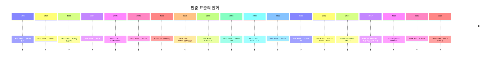
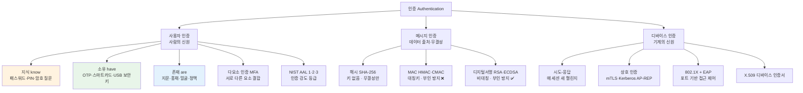
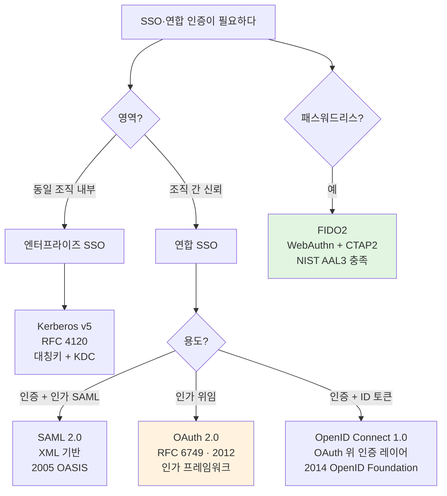
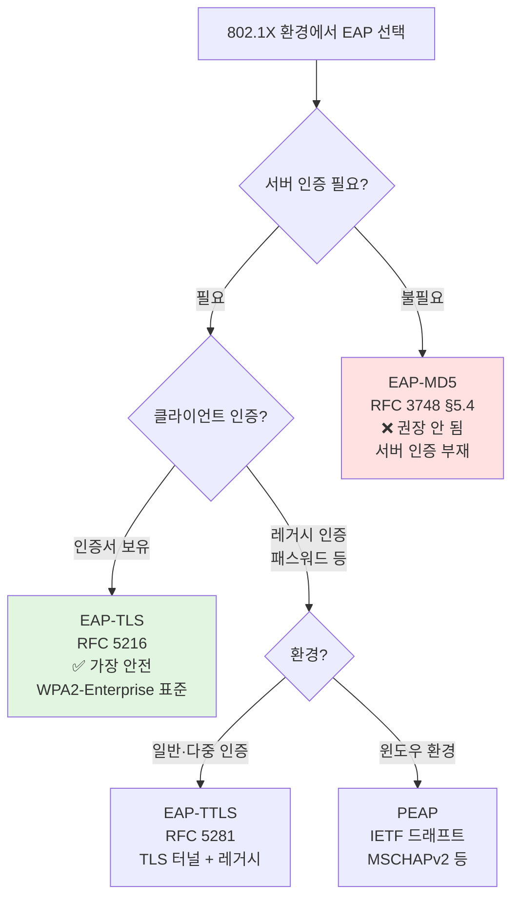

# 01. 인증 — 만화책처럼 읽는 신원 증명의 역사

> **이 문서를 읽는 법**: 만화책처럼 *시간 순*으로 *에피소드*를 따라가면 *왜* 각 인증 방식이 등장했고 *왜* 진화했는지 자연스럽게 외워집니다.
> 정확한 정의·수식·표준 번호는 정확본 참조: [[cs/information-security/04.security-general/01.authentication|정확본 01. 인증]]

> **연결 단원**: 본 단원의 *시도-응답·HMAC*은 [[cs/information-security/04.security-general/05.crypto-algorithms|정확본 05. 암호 알고리즘]] / *해시·HMAC*은 [[cs/information-security/04.security-general/06.hash-and-mac|정확본 06. 해시함수와 MAC]] §5 / *Kerberos 키 분배*는 [[cs/information-security/04.security-general/03.key-distribution|정확본 03. 키 분배 프로토콜]] §2-4 / *X.509·디바이스 인증서*는 [[cs/information-security/04.security-general/04.digital-signature-pki|정확본 04. 디지털서명·PKI]] §3·§4.

---

## 🎯 시작 전에 — 이미 쓰고 있는 인증

| 매일 보는 것 | 사실은 이 단원의 |
|---|---|
| 사이트 로그인 — 이메일 + 비밀번호 | **지식 기반 인증** (단요소) |
| 이메일 + 비밀번호 + OTP 6자리 | **다요소 인증 (MFA)** — 지식 + 소유 |
| Google Authenticator 의 30초 코드 | **TOTP** (RFC 6238) |
| 모바일 지문·얼굴 잠금 해제 | **존재 기반** (생체 인증) |
| Windows AD 도메인 로그인 | **Kerberos v5** (RFC 4120) |
| 회사 SSO 로 여러 SaaS 동시 접근 | **연합 SSO** (SAML 2.0 또는 OIDC) |
| "Google 로 로그인" 버튼 | **OAuth 2.0** + **OIDC** |
| YubiKey 같은 USB 보안키 | **FIDO2** (WebAuthn + CTAP2) |
| 회사 무선랜 WPA2-Enterprise | **802.1X + EAP-TLS** |
| K8s service-to-service mTLS | **상호 인증** (디바이스 인증서) |
| `git push` 시 SSH 키 검증 | **시도-응답 인증** (개인키 기반) |

> **이 단원의 본질**: 인증은 *"누가/무엇이 자신이 주장하는 그것이 맞는가"* 를 검증하는 것. *세 가지 영역*이 있다 — **사용자 인증** (사람) / **메시지 인증** (데이터) / **디바이스 인증** (기계). 표면적으론 다른 문제 같지만, 모두 *공유 비밀·공개키 쌍·해시·디지털서명* 중 하나를 누가 가지고 있는지 검증한다는 점에서 *같은 토대* 위에 있다.

---

## 📖 에피소드 1 — 인증의 3요소 + NIST AAL 등급

### 장면. 사용자가 자신을 증명하는 *세 가지 방법*

> NIST SP 800-63B: 사용자가 시스템에 자신의 신원을 증명할 때 제시할 수 있는 증거를 *세 가지로 분류*.

| 요소 | 영문 | 정의 | 대표 예시 |
|---|---|---|---|
| **지식 기반** | Something you **know** | 사용자가 *기억하는* 비밀 | 패스워드, PIN, 암호 질문, 패턴 |
| **소유 기반** | Something you **have** | 사용자가 *물리적으로 보유* | OTP 토큰, 스마트카드, USB 보안키, 휴대폰 (Push 인증) |
| **존재 기반** | Something you **are** | 사용자의 *생체적·행동적 특성* | 지문, 홍채, 얼굴, 정맥, 음성, 키 입력 패턴, 서명 |

### 위치·행동 기반은 정식 3요소가 아니다

> 위치 기반(GPS·IP) 과 행동 기반(통신 패턴) 은 NIST SP 800-63B 의 *정식 3요소가 아니라 부가 요소*(adaptive·risk-based) 로 분류.

→ "5요소 인증" 표현이 등장하면 *어떤 모델 기준인지* 확인 필요.

### NIST SP 800-63B AAL 등급 (Authenticator Assurance Level)

> NIST SP 800-63B 가 정의한 인증 강도 3단계. 정부·산업의 *공통 언어*.

| AAL | 요구사항 | 인증기 예시 |
|---|---|---|
| **AAL1** | 단요소 허용 (지식 또는 소유 또는 존재 1개) | 패스워드 단독 |
| **AAL2** | *다요소 필수* (서로 다른 2개 요소) | 패스워드 + OTP, 패스워드 + 푸시 인증 |
| **AAL3** | *하드웨어 기반* 다요소 + *검증자 임퍼스네이션 저항* | FIPS 140 검증 하드웨어 보안키 + PIN 또는 생체 |

### 시험 함정

- "5요소 인증?" → NIST 정식은 **3요소**. 위치·행동은 부가 요소
- "AAL3 의 핵심?" → **하드웨어 기반** + 검증자 임퍼스네이션 저항. 사실상 FIDO2·스마트카드·HSM 수준

---

## 📖 에피소드 2 — MFA: "방어 계층의 종류"가 늘어나야 다요소

### 장면. 다요소가 보안을 높이는 *진짜 메커니즘*

> 공격자가 패스워드 한 가지를 탈취해도 *OTP 토큰이라는 물리적 객체*를 동시에 탈취하지 않으면 통과 불가. 즉 공격자가 *돌파해야 하는 방어 계층의 종류*가 늘어나는 것이지 *동일 계층의 강도*가 늘어나는 게 아니다.

### "패스워드 + 비밀 질문" — 이건 다요소인가?

| | 패스워드 | 비밀 질문 |
|---|---|---|
| 요소 | 지식 | **지식** (둘 다) |

→ ❌ **단요소 강화** (strengthened single-factor). 진짜 다요소가 아님.

### 진짜 MFA 조합 4가지

| 조합 | 분류 |
|---|---|
| 패스워드(지식) + OTP(소유) | 가장 일반적 |
| 스마트카드(소유) + PIN(지식) | 금융권 표준 |
| 지문(존재) + PIN(지식) | 모바일 결제 |
| FIDO2 보안키(소유) + 디바이스 잠금 해제 패스워드/지문(지식 또는 존재) | **최신 권장** |

### 시험 함정

- "패스워드 + 비밀 질문 = 다요소?" → ❌ **단요소** (둘 다 지식)
- "MFA 의 본질?" → *서로 다른 요소의 결합*. 같은 요소 반복은 단요소 강화

---

## 📖 에피소드 3 — 패스워드: 가장 오래되고, 그리고 2017년의 반전

### 장면 1. 1960년대 ~ 2010년대 — *통념의 시대*

오랫동안 패스워드 보안의 *통념*이었던 정책:
- 90일마다 강제 변경
- 대문자·숫자·특수문자 의무
- 8자 이상

### 장면 2. 2017년 — NIST SP 800-63B 의 충격적 개정

> NIST SP 800-63B (2017) 가 *과거 통념을 폐지*. 이유는 **사용자 행동 연구**.

### 폐지된 권장 vs 새 권장

| 과거 통념 | NIST 2017 새 권장 |
|---|---|
| 90일 주기 강제 변경 | **침해 증거 없으면 변경 요구 ❌** |
| 대문자·숫자·특수문자 의무 | **복잡도 강제 ❌** |
| 8자 (사용자) | **최소 8자, 검증자는 64자까지 허용** |
| 사전 단어 차단 의식 미비 | **차단 목록(blocklist)** — 사전·노출된 패스워드(HaveIBeenPwned)·컨텍스트 단어 차단 |

### 왜 통념이 틀렸나

> 강제 변경 + 복잡도 규칙 → 사용자가 `Password1!` → `Password2!` → `Password3!` 같은 *예측 가능한 변형*으로 대응 → 오히려 보안 약화. 사용자 행동 연구의 결론.

### 패스워드 저장 — 06 단원 cross-ref

서버는 패스워드를 *평문이 아닌 솔트가 추가된 일방향 해시*로 저장. 권장 알고리즘:
- **Argon2id** (RFC 9106) — 현행 권장
- **bcrypt**
- **scrypt** (RFC 7914)
- **PBKDF2** (NIST SP 800-132)

→ 자세한 내용은 06 단원 §7 참조.

### 시험 함정

- "NIST 2017 권장 패스워드 정책?" → **주기적 변경 폐지 + 복잡도 강제 폐지 + 차단 목록**
- "패스워드 길이?" → 사용자 최소 8자, *검증자는 64자까지 허용*
- "패스워드 저장 권장?" → **Argon2id / bcrypt / scrypt / PBKDF2** + **솔트** 필수

---

## 📖 에피소드 4 — PIN·시도-응답·암호 질문

### PIN — 짧은 비밀 + 재시도 제한

> 일반적으로 4~6자리 숫자. 패스워드보다 *키 공간이 작아 무차별 대입에 취약* → **재시도 횟수 제한과 결합** (예: 3회 실패 시 카드 잠금) 필수.

→ 한국 금융 IC 카드: **4자리 PIN + 카드(소유)** = 2요소 표준.

### 시도-응답(Challenge-Response) 인증

> 서버가 클라이언트에게 *무작위 챌린지(난수)* 를 보내고, 클라이언트는 *비밀(패스워드 해시·대칭키·개인키)* 로 챌린지를 처리한 응답을 회신.

```
서버 → 클라이언트 : "이 난수에 대한 응답을 만드시오"
클라이언트 → 서버 : (비밀 + 챌린지) 처리 결과
서버 : 응답 검증
```

**핵심 보안 속성**: **재전송 공격(replay attack) 방지** — 매 세션마다 챌린지가 다르므로 같은 응답을 재사용 불가.

대표 사례:
- **MS-CHAPv2** (RFC 2759)
- **CRAM-MD5** (RFC 2195)
- **HTTP Digest Authentication** (RFC 7616)

→ 대비: HTTP Basic Authentication (RFC 7617) 은 *평문 패스워드 송신* — 시도-응답이 아님.

### 암호 질문 — *NIST 가 명시적으로 금지*

> "어머니의 결혼 전 성씨는?" 같은 보조 인증.
> NIST SP 800-63B §5.1.1.2 가 **단독 검증자로 사용 금지** (SHALL NOT) 명시.

이유: 답변이 SNS 등에서 *추론 가능*, 한 번 노출되면 *변경 어려움*. **보조적 사용도 권장 안 됨**.

### 시험 함정

- "시도-응답의 핵심?" → **재전송 공격 방지** (매 세션 새 챌린지)
- "암호 질문 사용?" → NIST **단독 검증자 사용 금지**. 보조도 권장 안 됨

---

## 📖 에피소드 5 — HOTP (2005) → TOTP (2011): OTP 의 탄생과 진화

### 장면 1. 2005년, RFC 4226 — HOTP 의 탄생

> **HOTP (HMAC-based One-Time Password)**: HMAC-SHA-1 기반 *카운터 동기 방식* 일회용 패스워드. RFC 4226 (2005).

### HOTP 알고리즘 (RFC 4226 §5.3)

```
HOTP(K, C) = Truncate(HMAC-SHA-1(K, C))
```

```
1. HMAC-SHA-1(K, C) 로 20 바이트 해시 생성
2. 해시의 마지막 바이트 하위 4 비트를 오프셋으로 사용
3. 오프셋 위치에서 4 바이트 추출, 최상위 비트 제거
4. 모듈러 10^d (d = 6, 7, 8) 로 d 자리 십진수 반환
```

- **공유 비밀 K** = 사용자 토큰 ↔ 서버
- **카운터 C** = 인증 성공 시마다 증가
- **동기 윈도우** = 사용자가 토큰을 여러 번 눌러 서버보다 앞서 나간 경우, 서버가 작은 윈도우(예: 10) 내에서 검색

### 장면 2. 2011년, RFC 6238 — TOTP 의 등장

> **TOTP (Time-based One-Time Password)**: HOTP 의 *카운터 C 를 시간 기반으로 대체*. RFC 6238 (2011).

```
T = floor((Current Unix Time - T0) / X)
TOTP(K) = HOTP(K, T)
```

- **T0** = 카운팅 시작 (보통 Unix epoch 0)
- **X** = 시간 간격 (기본 **30초**, RFC 6238 §5.2)
- **시각 동기 필수**, 클라이언트·서버 시계 오차 허용을 위해 **±1 step (=±30초) 윈도우** 검색

### HOTP vs TOTP

| 항목 | HOTP (RFC 4226) | TOTP (RFC 6238) |
|---|---|---|
| 카운터 원천 | **이벤트** (인증 시도) | **시간** |
| 동기화 요구 | 카운터 동기 윈도우 | **시각 동기** (±1 step) |
| 발급 후 미사용 | *무한 유효* (다음 카운터값) | **X 초 후 만료** |
| 권장 자릿수 | 6~8 | 6~8 |

### 보급 구현

> **Google Authenticator, Microsoft Authenticator, Authy** 등 모바일 OTP 앱은 모두 TOTP 구현. RFC 6238 §3 은 SHA-1·SHA-256·SHA-512 모두 허용하나 *실제 보급은 SHA-1*.

### 개발자 비유

- 2FA QR 코드 스캔 → Google Authenticator 등록 = TOTP K 등록
- QR 의 `otpauth://totp/...` URI = K + 알고리즘 + 자릿수 인코딩

### 시험 함정

- "HOTP ↔ TOTP?" → **카운터가 무엇이냐 한 가지** (이벤트 vs 시간). 알고리즘 구조는 *동일* (HMAC + Truncate)
- "TOTP 시간 간격?" → **30초** (RFC 6238 §5.2 권장)
- "TOTP 시각 동기 윈도우?" → **±1 step** (=±30초)

---

## 📖 에피소드 6 — S/Key (1998): 해시 체인의 마법

### 장면. RFC 2289 — 다른 발상에서 출발

> **S/Key**: Bellcore 가 개발. RFC 1760 (1995) 초안 → RFC 2289 (1998) 표준화. *해시 체인의 비가역성*을 이용해 한 번 사용된 OTP 를 *그 이전 시점*의 OTP 추론에 사용 못 하게 함.

### 알고리즘 (RFC 2289 §6)

```
1. 사용자 비밀 패스프레이즈 P + 시드 S 결합 → seed||P
2. seed||P 에 해시함수(MD5/SHA-1) 를 N 번 반복 → H^N(seed||P) 를 서버에 등록
3. 첫 번째 인증 : 사용자가 H^(N-1)(seed||P) 제출
4. 서버 : 제출값에 해시 한 번 더 적용 → 자신이 가진 H^N 과 비교
5. 검증 성공 : 서버가 자신의 값을 H^(N-1) 로 갱신
6. 다음 인증 : H^(N-2) 제출
7. N 이 0 에 도달 → 새 패스프레이즈+시드 재등록
```

### 보안의 핵심

> 공격자가 H^k 를 가로채도 *H^(k-1) 을 계산할 수 없다* (해시의 일방향성).

### S/Key 의 카운터 방향

> S/Key 의 카운터는 **N → 0 으로 감소**. HOTP 의 0 → ∞ 증가와 *반대 방향*.
> S/Key 는 *시간 동기를 요구하지 않는다*.

### 한계

> RFC 2289 가 권장 해시로 MD5·SHA-1 명시 (1998 시점). 두 해시 모두 *충돌 저항성이 깨진 현재* → **학술·시험 대비 가치만 남음**.

### 시험 함정

- "S/Key 의 카운터 방향?" → **N → 0 감소** (HOTP 와 반대)
- "S/Key 의 시간 동기?" → **불필요** (TOTP 와 다름)
- "S/Key 의 권장 해시?" → MD5·SHA-1 (RFC 2289 §6, 1998 시점). 현재는 비추

---

## 📖 에피소드 7 — 생체 인증: FAR·FRR·EER

### 장면. *재발급 불가능*한 비밀

> 생체 인증의 본질: **재발급 불가능성**. 패스워드는 노출 시 변경 가능, *지문이 한 번 노출되면 손가락을 바꿀 수는 없음*.
> → 생체 데이터의 저장·전송에 *패스워드보다 더 엄격한 보호* (템플릿 보호, 디바이스 내 처리 원칙).

### 7가지 생체 인식 기법

| 기법 | 측정 대상 | 특징 |
|---|---|---|
| **지문** | 손가락 마루·골 패턴 (minutiae) | 보급률 1위, 모바일 표준. 절단·복제 위험 |
| **홍채** | 눈동자 무늬 | 정확도 매우 높음. 일란성 쌍둥이도 다름 |
| **얼굴** | 얼굴 특징점·기하 | 비접촉. 조명·각도·마스크에 민감 |
| **정맥** | 손바닥·손가락 정맥 패턴 | 위·변조 어려움. 의료 기기 형태 |
| **음성** | 발화 특성 | 비대면 가능. 녹음 재생 공격 가능 |
| **서명** | 필기 동작·압력·속도 | 행동 기반. 변동성 큼 |
| **키 입력 패턴** | 타이핑 리듬·키 압력 | 행동 기반. 부가 인증 |

### 평가 지표 — FAR·FRR·EER·CER

> 생체 인증 시스템 성능은 *두 가지 오류율*로 표현.

| 지표 | 영문 | 의미 |
|---|---|---|
| **FAR** | False Accept Rate (오인식률) | 타인을 본인으로 잘못 인식 — *보안 위협 직결* |
| **FRR** | False Reject Rate (오거부율) | 본인을 타인으로 잘못 거부 — *사용성 직결* |
| **EER = CER** | Equal Error Rate = Crossover Error Rate | FAR = FRR 인 지점 — *시스템 비교 척도* |

### 트레이드오프 곡선

```
임계치 엄격 → FAR ↓ FRR ↑  (보안 강화, 사용성 약화)
임계치 느슨 → FAR ↑ FRR ↓  (사용성 강화, 보안 약화)

FAR 곡선과 FRR 곡선의 교차점 = EER = CER
EER 이 낮을수록 시스템이 더 정확
```

### 위치·행동 기반 인증

> NIST SP 800-63B 정식 3요소가 *아니라* **부가적 위험 기반 인증** (adaptive·risk-based authentication).
> "평소와 다른 위치에서 접속 → 추가 OTP 요구" 식으로 *본 인증의 보조 신호*로 사용.

### 시험 함정

- "FAR·FRR 트레이드오프?" → 임계치 조정 시 한쪽이 늘면 다른 쪽이 줆 (반비례)
- "EER 과 CER 의 관계?" → **동의어** (Equal Error Rate = Crossover Error Rate)
- "FMR / FNMR?" → FAR / FRR 의 *동의어* (기관에 따라 사용)

---

## 📖 에피소드 8 — Kerberos v5: KDC 의 결정판 (RFC 4120)

### 장면. MIT 의 발상

> **Kerberos**: MIT 가 개발한 *대칭키 기반 네트워크 인증 프로토콜*. v5 는 RFC 4120 (2005).

### 핵심 발상

> *"클라이언트와 서버가 사전에 비밀을 공유하지 않은 상태"* 에서 신뢰할 수 있는 *제3자 (KDC) 가 발급한 티켓*을 통해 상호 인증.
> N 명 사용자 + M 개 서비스 → **N×M 비밀이 아니라 N+M 비밀** (KDC 와 각 주체 간) 만 관리.

### 구성 요소 (RFC 4120 §1.7)

| 요소 | 영문 | 역할 |
|---|---|---|
| 클라이언트(C) | — | 인증 요청 사용자 |
| **AS** | Authentication Server | 사용자 신원 검증 + TGT 발급 |
| **TGS** | Ticket Granting Server | TGT 받아 ST(Service Ticket) 발급 |
| 서비스 서버(S) | — | 사용자가 접근하려는 *실제 응용 서버* |
| **KDC** | Key Distribution Center | **AS + TGS 의 통합 명칭** |
| **TGT** | Ticket Granting Ticket | AS 발급 — "TGS 에 접근할 권한" 티켓 |
| **ST** | Service Ticket | TGS 발급 — "특정 서비스에 접근할 권한" 티켓 |

### 프로토콜 6 단계 (RFC 4120 §3.1·3.2·3.3)

```
[1] AS-REQ : C → AS    : "alice@DOMAIN, 시간 T 의 인증 요청"
[2] AS-REP : AS → C    : { TGT, K_C-TGS } 를 K_C 로 암호화 회신
                          (K_C = 사용자 비밀번호 기반 해시키)
[3] TGS-REQ: C → TGS   : { TGT, Authenticator(K_C-TGS) } + 서비스명
[4] TGS-REP: TGS → C   : { ST, K_C-S } 를 K_C-TGS 로 암호화 회신
[5] AP-REQ : C → S     : { ST, Authenticator(K_C-S) }
[6] AP-REP : S → C     : { 타임스탬프 } 를 K_C-S 로 암호화 (상호 인증 시)
```

### Kerberos 의 핵심 보안 속성

| 속성 | 의미 |
|---|---|
| **사용자 패스워드 미송신** | K_C 는 클라이언트 측 생성. AS 는 자신이 보유한 동일 K_C 로 응답 암호화 |
| **재전송 공격 방지** | Authenticator 에 타임스탬프 포함, KDC·서비스가 *5분 이내* 시각 차이만 허용 → **NTP 필수** |
| **세션 키 분리** | 모든 단계에서 단기 세션 키 (K_C-TGS, K_C-S) 사용 → 장기 키 노출 최소화 |

### Kerberos 의 3대 약점 (시험 빈출)

| 약점 | 의미 |
|---|---|
| **시각 동기 의존** | NTP 필수. NTP 자체가 공격 표적 |
| **KDC 단일 장애점** | KDC 침해 시 *전체 시스템* 침해 |
| **패스워드 사전 공격 취약** | K_C 가 패스워드 해시 기반 → *오프라인 사전 공격* 가능 |

### 개발자 비유

- Windows AD 도메인 로그인 = Kerberos
- Linux PAM 통합 인증 = Kerberos
- `kinit` / `klist` 명령 = TGT 발급·확인
- `clock skew too great` 에러 = NTP 동기 안 맞음

### 시험 함정

- "KDC 의 두 구성요소?" → **AS + TGS**
- "TGT vs ST?" → TGT (TGS 접근 권한) → ST (특정 서비스 접근 권한)
- "Kerberos 약점 3가지?" → 시각 동기 / KDC 단일 장애점 / 패스워드 사전 공격

---

## 📖 에피소드 9 — SAML 2.0 (2005): XML 기반 연합 인증

### 장면. OASIS 의 표준화

> **SAML (Security Assertion Markup Language) 2.0**: XML 기반 *연합 인증·인가 표준*. OASIS 가 2005 표준화.

### SAML 의 3자 모델

| 역할 | 영문 | 의미 |
|---|---|---|
| **IdP** | Identity Provider | 사용자 인증 수행 + SAML Assertion 발급 |
| **SP** | Service Provider | 사용자가 사용하려는 서비스. IdP 의 Assertion 신뢰 |
| 사용자 | User Agent | 일반적으로 *웹 브라우저* |

### SP-initiated SSO 흐름

```
[1] 사용자가 SP 에 접근
[2] SP 가 SAML AuthnRequest 를 IdP 로 리다이렉트
[3] IdP 가 사용자 인증 (패스워드·OTP 등)
[4] IdP 가 SAML Assertion 을 디지털서명하여
    사용자 브라우저를 통해 SP 로 회신 (HTTP POST 바인딩)
[5] SP 가 서명을 검증하고 사용자 세션 생성
```

### SAML Assertion 의 보안

| 보호 | 표준 |
|---|---|
| 디지털서명 | XML Signature |
| 암호화 (선택) | XML Encryption |
| 신뢰 수립 | SP·IdP *사전 메타데이터 교환* |

### Assertion 의 3가지 종류 (시험 빈출)

| 종류 |
|---|
| ① **Authentication Statement** (인증 사실) |
| ② **Attribute Statement** (사용자 속성) |
| ③ **Authorization Decision Statement** (인가 결정) |

### 개발자 비유

- 회사 SSO 와 사내·외부 서비스가 SAML 연동
- IdP 메타데이터 XML 파일 교환 → 신뢰 수립

### 시험 함정

- "SAML 의 3자 모델?" → **IdP / SP / 사용자**
- "SAML Assertion 3종?" → **Authentication / Attribute / Authorization Decision Statement**
- "SAML 의 신뢰 수립?" → 메타데이터 *사전 교환*

---

## 📖 에피소드 10 — OAuth 2.0 (2012): "이건 인가다, 인증이 아니다"

### 장면. RFC 6749 — *명시적 규정*

> **OAuth 2.0**: 사용자의 자원에 대한 *제3자 응용의 제한된 접근*을 위임하는 **인가(authorization) 프레임워크**. RFC 6749 (2012).

### 가장 중요한 사실

> RFC 6749 §1 첫 문단: *"authorization framework"*.
> → **OAuth 2.0 은 인증 프로토콜이 아니다**. 인가 프레임워크.

→ 실무에서는 *인증 용도로 오용*되는 사례가 많아 인증 전용으로 **OIDC**(에피소드 11) 가 등장.

### 4가지 역할 (RFC 6749 §1.1)

| 역할 | 의미 |
|---|---|
| **Resource Owner** | 자원 소유자 (보통 사용자) |
| **Resource Server** | 자원을 호스팅하는 서버 |
| **Client** | 자원에 접근하려는 *제3자 응용* |
| **Authorization Server** | 인증·동의 후 *액세스 토큰 발급* |

### 4가지 권한 부여 방식 (RFC 6749 §1.3·4)

| 방식 | 영문 | 사용 사례 |
|---|---|---|
| **인가 코드** | Authorization Code | 서버측 웹 응용 *(가장 안전·권장)* |
| **암묵적 부여** | Implicit | 브라우저측 SPA — RFC 6749 정의되었으나 OAuth 2.1 에서 *제거 권고* |
| **자원 소유자 패스워드 자격** | Resource Owner Password Credentials | 신뢰 가능한 1자 응용에 한정 *(권장 안 함)* |
| **클라이언트 자격** | Client Credentials | 사용자 컨텍스트 없는 *서버-서버 통신* |

### 액세스 토큰 (RFC 6750)

> 발급된 토큰은 **Bearer Token** 형식. HTTP `Authorization: Bearer <token>` 헤더에 실어 자원 서버에 제출.
> Bearer = *"토큰을 가진 자가 자격이 있다"* → **토큰 누설 = 즉시 권한 도용**.

### 시험 함정

- "OAuth 2.0 의 정체?" → **인가 프레임워크** (인증 ❌)
- "OAuth 4 권한 부여?" → 인가 코드 / 암묵적 / 자원 소유자 패스워드 / 클라이언트 자격
- "Bearer 토큰?" → 토큰 *소유 자체*가 인가 증명. 누설 시 권한 도용

---

## 📖 에피소드 11 — OpenID Connect 1.0 (2014): OAuth 위 인증 레이어

### 장면. OpenID Foundation 의 응답

> **OpenID Connect (OIDC) 1.0**: *OAuth 2.0 위에 인증 레이어를 추가*한 표준. OpenID Foundation 이 2014 표준화.

### 핵심 추가 — ID 토큰

> **id_token**: JWT (JSON Web Token, RFC 7519) 형식. 사용자 신원 정보를 담음. **OP** (OpenID Provider, IdP) 가 디지털서명. **RP** (Relying Party, 클라이언트) 가 OP 공개키로 서명 검증.

### OIDC 흐름 — Authorization Code Flow (Core 1.0 §3.1)

```
[1] RP 가 사용자를 OP 의 인증 엔드포인트로 리다이렉트
    (OAuth 2.0 인가 코드 요청 + scope=openid)
[2] OP 가 사용자 인증
[3] OP 가 RP 로 인가 코드 회신
[4] RP 가 토큰 엔드포인트에 인가 코드 제출
[5] OP 가 액세스 토큰 + ID 토큰 회신
[6] RP 가 ID 토큰의 서명을 OP 의 공개키 (JWKS) 로 검증
```

### ID 토큰의 표준 클레임 (OIDC Core §2)

| 클레임 | 의미 |
|---|---|
| `iss` | Issuer (OP 식별자) |
| `sub` | Subject (사용자 고유 식별자) |
| `aud` | Audience (RP 식별자) |
| `exp` | Expiration (토큰 만료) |
| `iat` | Issued At (발급 시각) |
| `auth_time` | 사용자 인증 시각 |

### OIDC vs OAuth 의 관계

> OIDC 는 OAuth 2.0 의 **확장**. OAuth 2.0 의 *인가 코드 흐름 위*에 *ID 토큰만 추가*된 구조. → OIDC 클라이언트는 *자동으로* OAuth 2.0 클라이언트 (역은 성립 ❌).

### 개발자 비유

- "Google 로 로그인" 버튼 = OIDC (Google 이 OP)
- ID 토큰 = JWT 의 한 종류. `https://jwt.io` 에서 디코드 가능
- JWKS (JSON Web Key Set) = OP 의 공개키 목록 (`/.well-known/jwks.json`)

### 시험 함정

- "OAuth 2.0 ↔ OIDC?" → OAuth = **인가** / OIDC = **인증**
- "OIDC 의 핵심 추가?" → **ID 토큰** (JWT 형식, OP 가 서명)
- "OIDC 클라이언트 = OAuth 클라이언트?" → 역은 성립 ❌ (OIDC 가 OAuth 의 확장)

---

## 📖 에피소드 12 — FIDO2 (2019·2021): 패스워드리스 시대

### 장면. WebAuthn + CTAP2

> **FIDO2**: *패스워드 없는 (passwordless) 강력한 인증* 표준 집합. 두 표준으로 구성:
> - **WebAuthn** (W3C, 2021 Level 2 권고)
> - **CTAP2** (FIDO Alliance, 2019)

### 핵심 발상

> 패스워드 인증의 근본 약점 (서버 침해 시 사용자 비밀 일괄 노출, 피싱 취약) 을 해결.
> **공유 비밀(symmetric secret) 폐지 → 공개키 기반 챌린지-응답 대체**.
> 사용자 디바이스가 *사이트별 별도 키쌍*을 생성. **개인키는 디바이스를 떠나지 않음**. 서버는 공개키만 보관.

### 두 표준의 역할 분담

| 표준 | 영역 | 정의처 |
|---|---|---|
| **WebAuthn** | 브라우저(웹 응용) ↔ 인증기 *JavaScript API* | W3C |
| **CTAP2** | 브라우저(또는 OS) ↔ 외부 인증기 (USB·NFC·BLE) *프로토콜* | FIDO Alliance |

### 등록 흐름 (WebAuthn Level 2 §7.1)

```
[1] RP 가 챌린지·사용자 정보·RP 정보를 브라우저에 전달
[2] 브라우저가 인증기에게 키쌍 생성 요청 (CTAP2 makeCredential)
[3] 인증기가 사용자 인증 (생체·PIN) 수행
[4] 인증기가 키쌍 생성, 개인키는 디바이스 내부 저장
    공개키 + Attestation 을 RP 에 회신
[5] RP 가 공개키와 사용자 식별자를 등록 DB 에 저장
```

### 인증 흐름 (WebAuthn Level 2 §7.2)

```
[1] RP 가 챌린지를 브라우저에 전달
[2] 브라우저가 인증기에게 서명 요청 (CTAP2 getAssertion)
[3] 인증기가 사용자 인증 후 등록된 개인키로 챌린지 + RP origin 등을 서명
[4] RP 가 등록된 공개키로 서명 검증
```

### FIDO2 의 4가지 보안 속성

| 속성 | 의미 |
|---|---|
| **피싱 저항** | 서명에 *RP origin 포함* → 가짜 사이트는 정당한 서명 만들지 못함 |
| **서버 비밀 부재** | 서버 침해 시에도 *공개키만 노출* → 사용자 도용 불가 |
| **재사용 불가** | 매번 새 챌린지 서명 → 재전송 무력화 |
| **사이트별 키 분리** | 사이트마다 별도 키쌍 → 한 사이트 침해가 다른 사이트로 *전파 안 됨* |

### NIST AAL3 충족

> FIDO2 는 NIST SP 800-63B AAL3 의 **"phishing resistance" 요건을 충족**하는 대표 인증기 형태.
> 실무에서 "FIDO2" = USB 보안키 + 디바이스 PIN/생체의 **2요소 조합**. 단요소 FIDO2 도 표준상 가능하지만 *권장 안 됨*.

### 개발자 비유

- YubiKey, SoloKey = USB FIDO2 보안키 (정확본 §3-1 명시)
- 모바일 디바이스의 생체 잠금 해제로 사이트 로그인 = 플랫폼 인증기 (WebAuthn)

### 시험 함정

- "FIDO2 의 두 표준?" → **WebAuthn (W3C) + CTAP2 (FIDO Alliance)**
- "FIDO2 의 피싱 저항 원리?" → 서명에 **RP origin 포함**
- "FIDO2 의 AAL?" → AAL3 의 phishing resistance 충족

---

## 📖 에피소드 13 — 메시지 인증 + 디바이스 인증

### 장면 1. 메시지 인증의 요구사항

> **메시지 인증**: 수신한 메시지가 ① *주장된 송신자로부터 왔으며* (출처 인증), ② *전송 중 변경되지 않았음* (무결성) 을 검증.

| 요구사항 | 의미 |
|---|---|
| **무결성** | 메시지 비트 단위 변경 탐지 |
| **출처 인증** | 메시지가 *주장된 송신자*로부터 왔음 검증 |
| **재전송 방지** | 동일 메시지의 반복 전송 탐지 (타임스탬프·시퀀스 번호·논스 결합 필요) |

### MAC vs 디지털서명 vs 해시 (4과목 단골)

| 메커니즘 | 키 구조 | 무결성 | 출처 인증 | 부인 방지 |
|---|---|---|---|---|
| **해시** (SHA-256) | 키 없음 | ✅ | ❌ | ❌ |
| **MAC** (HMAC·CMAC) | 대칭키 (공유) | ✅ | ✅ (제한) | **❌** |
| **디지털서명** (RSA-PSS·ECDSA) | 비대칭 키쌍 | ✅ | ✅ | **✅** |

### 왜 MAC 은 부인 방지가 안 되나

> 송신자·수신자가 *같은 대칭키 K 공유* → 검증자(수신자)도 자신이 가진 K 로 *동일한 MAC 만들 수 있음* → 어떤 MAC 이 누구의 손에서 나왔는지 *제3자 판별 불가*.
> 부인 방지 = *검증자가 만들 수 없는 증거* 요구 → **개인키만이 만들 수 있는 디지털서명**에서만 성립.

### HMAC — RFC 2104 + FIPS 198-1

> **HMAC**: 임의 암호 해시함수 H 기반 *키-기반 MAC*. RFC 2104 (1997) 정의 + FIPS 198-1 (2008) 미국 정부 표준.

```
HMAC(K, M) = H( (K' XOR opad) || H( (K' XOR ipad) || M ) )
```

- **K'** = K 가 블록 길이보다 짧으면 0 패딩, 길면 H(K) 후 0 패딩
- **ipad** = `0x36` 블록 길이만큼 반복 (inner pad)
- **opad** = `0x5C` 블록 길이만큼 반복 (outer pad)

→ 단순 `H(K || M)` 은 *길이 연장 공격에 취약* (Merkle-Damgård 약점). HMAC 의 *이중 해시 구조*가 차단.

### 장면 2. 디바이스 인증 — 시도-응답·상호 인증·802.1X

#### 시도-응답 인증 (Challenge-Response)

> 디바이스 인증의 거의 모든 프로토콜이 이 패턴 위에 있음. 비밀의 형태:
> - ① **공유 대칭키** → MAC·HMAC 으로 응답
> - ② **비대칭 키쌍 개인키** → 디지털서명으로 응답
> - ③ **패스워드 해시** → 해시 결합으로 응답

#### 상호 인증 (Mutual Authentication)

> 통신 양방향이 *서로의 신원을 동시에 검증*.
> 일방향 인증 (서버만 검증) → 사용자가 *가짜 서버에 자격증명 제공할 위험*.
> 대표 사례: **mTLS** (mutual TLS) — 서버 인증서 + *클라이언트 인증서* 모두 검증.
> Kerberos AP-REP 단계 (§5-2 [6]) 도 상호 인증.

### 802.1X-2020 + EAP — 포트 기반 네트워크 접근 제어

> **IEEE 802.1X-2020**: *포트 기반 네트워크 접근 제어* (PNAC) 표준.
> **EAP (Extensible Authentication Protocol)**: 802.1X 위에서 *다양한 인증 방식 캡슐화*. RFC 3748 (2004).

### 802.1X 의 3자 모델

| 역할 | 의미 |
|---|---|
| **Supplicant** | 인증 요청 디바이스 (PC·스마트폰) |
| **Authenticator** | 네트워크 접근 제어 장치 (스위치·AP) |
| **Authentication Server** | 실제 인증 검증 (보통 RADIUS, RFC 2865) |

### EAP 메서드 비교 (시험 빈출)

| 메서드 | 표준 | 서버 인증 | 클라이언트 인증 | 특징 |
|---|---|---|---|---|
| **EAP-MD5** | RFC 3748 §5.4 | ❌ | 패스워드 해시 (MD5) | 사전 공격·MITM 취약. *권장 ❌* |
| **EAP-TLS** | RFC 5216 | 서버 인증서 | **클라이언트 인증서** | **가장 안전**. PKI 인프라 필요. **WPA2-Enterprise 표준** |
| **EAP-TTLS** | RFC 5281 | 서버 인증서 | 다양 (PAP·CHAP·MSCHAPv2) | TLS 터널 안에서 *레거시 인증 보호* |
| **PEAP** | IETF 드래프트 (Microsoft·Cisco·RSA) | 서버 인증서 | MSCHAPv2 등 | TTLS 와 유사. *윈도우 환경 보급* |

### 디바이스 인증서 — X.509

> 사용자 인증서와 *구조 동일*. 단 **Subject 필드에 디바이스 식별자** (시리얼 번호·MAC 주소·디바이스 ID) 가 들어감.
> EAP-TLS, IPsec IKEv2, mTLS 모두 디바이스 인증서 사용. 자세한 X.509 구조는 04 단원 §3.

### 시험 함정

- "MAC 의 부인 방지?" → ❌ (대칭키 공유)
- "HMAC ipad·opad?" → **ipad=0x36, opad=0x5C** (블록 길이만큼 반복)
- "EAP 메서드 중 가장 안전?" → **EAP-TLS** (양쪽 모두 인증서 = 상호 인증)
- "EAP-MD5?" → 서버 인증 ❌, 사전 공격 취약. *권장 안 됨*
- "802.1X 3자 모델?" → Supplicant / Authenticator / Authentication Server (RADIUS)

---

## 📑 인증 메커니즘 종합 비교 (에피소드 5~13 정리)

시험 직전 *한눈에* 보는 view.

### OTP 3종 (HOTP·TOTP·S/Key)

| | HOTP (RFC 4226) | TOTP (RFC 6238) | S/Key (RFC 2289) |
|---|---|---|---|
| 카운터 | 이벤트 (0→∞) | 시간 (30초) | 해시 체인 (N→0) |
| 동기화 | 카운터 윈도우 | ±1 step (시각) | *불필요* |
| 알고리즘 | HMAC-SHA-1 + Truncate | HOTP 와 동일 | MD5/SHA-1 N회 반복 |

### SSO·연합 인증 5종

| | Kerberos v5 | SAML 2.0 | OAuth 2.0 | OIDC 1.0 | FIDO2 |
|---|---|---|---|---|---|
| 표준 | RFC 4120 (2005) | OASIS (2005) | RFC 6749 (2012) | OIDC Core (2014) | WebAuthn + CTAP2 |
| 영역 | 엔터프라이즈 SSO | 연합 SSO | **인가** | **인증** | 패스워드리스 |
| 키 구조 | 대칭키 (KDC) | 비대칭 (XML Sig) | Bearer 토큰 | JWT (서명) | 비대칭 키쌍 (사이트별) |
| 신뢰 | KDC | IdP·SP 메타데이터 | Authorization Server | OP·RP | RP 등록 |

### 메시지 인증 vs 디바이스 인증 — 같은 도구, 다른 검증 대상

| | 사용자 인증 | 메시지 인증 | 디바이스 인증 |
|---|---|---|---|
| 검증 대상 | "누가 앞에 앉아 있는가" | "방금 도착한 데이터가 누구·그대로인가" | "통신 상대가 정당한 디바이스인가" |
| 도구 | 패스워드/OTP/생체/FIDO2 | HMAC/MAC/디지털서명 | 시도-응답/X.509 인증서/EAP-TLS |

---

## 🗺️ 마인드맵 1 — 시간선



**읽는 법**: 인증의 진화는 *공격에 대한 응답*. OIDC (2014) 가 나온 이유 = OAuth 2.0 (2012) 의 인증 오용. NIST 2017 패스워드 정책 개정 = *사용자 행동 연구*에 따른 통념 폐지. FIDO2 (2019·2021) = 패스워드 약점·피싱의 근본 해결.

---

## 🗺️ 마인드맵 2 — 인증 영역 분류 + 3요소



---

## 🗺️ 마인드맵 3 — OTP 계열 비교

```mermaid
graph TD
  OTP[일회용 패스워드 OTP]
  OTP --> H[HOTP<br/>RFC 4226 · 2005<br/>이벤트 카운터 0→∞]
  OTP --> T[TOTP<br/>RFC 6238 · 2011<br/>시간 카운터 30초]
  OTP --> S[S/Key<br/>RFC 2289 · 1998<br/>해시 체인 N→0]

  H --> H1[HMAC-SHA-1 + Truncate<br/>6~8자리]
  T --> T1[HOTP K, T<br/>T = floor Unix/30]
  S --> S1[H^N seed||P 등록<br/>매 인증 N-k 사용]

  H -.공통.-> ALGO[HMAC + Truncate]
  T -.공통.-> ALGO

  S -.보급 환경.-> S2[학술·시험 대비 가치]
  T -.보급 환경.-> T2[Google/MS/Authy<br/>모바일 OTP 앱]
```

**읽는 법**: HOTP ↔ TOTP 는 *카운터 원천만 다름*. S/Key 는 *완전히 다른 발상* (해시 체인의 비가역성).

---

## 🗺️ 마인드맵 4 — SSO·연합 인증 결정 트리



**읽는 법**: OAuth 2.0 은 *인가만*. 인증 필요하면 OIDC (OAuth 위 ID 토큰). 피싱·서버 침해 위협까지 막으려면 FIDO2.

---

## 🗺️ 마인드맵 5 — EAP 메서드 결정 트리



---

## 🗂️ 키워드 클러스터

### NIST 표준

```
SP 800-63-3·63A·63B·63C — Digital Identity Guidelines (인증 등급 AAL)
FIPS 198-1               — HMAC (2008)
FIPS 180-4               — SHA-2 (2015)
FIPS 202                 — SHA-3 (2015)
SP 800-38B               — CMAC
SP 800-131A              — 알고리즘 폐기 (MD5·SHA-1 HMAC)
```

### IETF RFC

```
RFC 2104 — HMAC
RFC 2195 — CRAM-MD5
RFC 2289 — S/Key
RFC 2759 — MS-CHAPv2
RFC 2865 — RADIUS
RFC 3748 — EAP
RFC 4120 — Kerberos v5
RFC 4226 — HOTP
RFC 5216 — EAP-TLS
RFC 5280 — X.509 PKI
RFC 5281 — EAP-TTLS
RFC 6238 — TOTP
RFC 6287 — OCRA
RFC 6749 — OAuth 2.0
RFC 6750 — OAuth Bearer Token
RFC 7519 — JWT
RFC 7616 — HTTP Digest Authentication
RFC 7617 — HTTP Basic Authentication
```

### W3C·FIDO·OASIS·OpenID·IEEE·ISO

```
W3C            — WebAuthn Level 2 (2021)
FIDO Alliance  — CTAP2 (2019)
OASIS          — SAML 2.0 (2005)
OpenID         — OpenID Connect Core 1.0 (2014)
IEEE           — 802.1X-2020
ISO/IEC 19794 — 생체 데이터 포맷
ISO/IEC 19795 — 생체 성능 평가
```

### 헷갈리는 짝 (시험 1순위)

| 짝 | 차이 |
|---|---|
| 패스워드 + 비밀 질문 ↔ 다요소 인증 | **단요소** (둘 다 지식) ↔ 서로 다른 요소 결합 |
| AAL1 ↔ AAL2 ↔ AAL3 | 단요소 / 다요소 / 하드웨어 + 임퍼스네이션 저항 |
| HOTP ↔ TOTP | 이벤트 카운터 (0→∞) / 시간 카운터 (30초) |
| HOTP/TOTP ↔ S/Key | 0→∞ 증가 / **N→0 감소** |
| FAR ↔ FRR | 오인식 (보안 위협) / 오거부 (사용성) |
| EER ↔ CER | **동의어** (Equal·Crossover) |
| AS ↔ TGS | 사용자 인증 + TGT 발급 / 서비스 티켓 (ST) 발급 |
| TGT ↔ ST | TGS 접근 권한 / 특정 서비스 접근 권한 |
| 엔터프라이즈 SSO ↔ 연합 SSO | 동일 조직 (Kerberos) / 조직 간 (SAML·OIDC) |
| OAuth 2.0 ↔ OIDC | **인가** / **인증** |
| OIDC ↔ SAML | JSON·JWT (모바일 친화) / XML (전통적 SSO) |
| WebAuthn ↔ CTAP2 | 브라우저 ↔ 인증기 *API* / 브라우저 ↔ 외부 인증기 *프로토콜* |
| 해시 ↔ MAC ↔ 디지털서명 | 부인 방지 = 디지털서명만 |
| EAP-MD5 ↔ EAP-TLS | 서버 인증 ❌ / **상호 인증서** (가장 안전) |
| Supplicant ↔ Authenticator ↔ AuthServer | 디바이스 / 스위치·AP / RADIUS |

---

## 🃏 회상 30문항

> 답을 가린 뒤 자가 채점.

**A. 3요소·MFA·AAL (1~6)**
1. NIST SP 800-63B 의 3요소는?
2. 위치·행동 기반은 정식 3요소인가?
3. "패스워드 + 비밀 질문" 은 다요소인가? 이유?
4. AAL1·2·3 의 핵심 차이는?
5. AAL3 이 요구하는 두 속성은?
6. MFA 가 보안을 높이는 *진짜* 메커니즘?

**B. 패스워드·PIN·시도-응답 (7~10)**
7. NIST 2017 의 패스워드 정책 변화 4가지?
8. 패스워드 저장 권장 알고리즘 4종?
9. 시도-응답 인증의 핵심 보안 속성?
10. NIST 가 단독 검증자로 *금지*한 보조 인증?

**C. OTP·S/Key (11~15)**
11. HOTP 알고리즘 수식?
12. TOTP 의 시간 간격 기본값?
13. HOTP 와 TOTP 의 카운터 차이?
14. S/Key 의 카운터 방향과 시간 동기 요구?
15. S/Key 의 비가역성을 보장하는 수학적 원리?

**D. 생체 인증 (16~18)**
16. FAR · FRR 의 정의와 트레이드오프?
17. EER 과 CER 의 관계?
18. 생체 인증의 *재발급 불가능성* 의미?

**E. SSO·연합 인증 (19~25)**
19. Kerberos 의 KDC 구성요소 2가지?
20. TGT 와 ST 의 차이?
21. Kerberos 의 3대 약점?
22. SAML Assertion 의 3종류?
23. OAuth 2.0 의 4가지 권한 부여 방식?
24. OAuth 2.0 vs OIDC 의 본질적 차이?
25. FIDO2 의 두 표준과 정의처?

**F. 메시지·디바이스 인증 (26~30)**
26. MAC 이 부인 방지 못 주는 이유?
27. HMAC 의 ipad·opad 값?
28. EAP 4 메서드의 안전성 순위?
29. 802.1X 의 3자 모델은?
30. mTLS 가 일방향 TLS 와 다른 점?

---

## ⚠️ 시험 함정 모음

| 함정 | 정답 |
|---|---|
| 인증의 정식 3요소? | **지식·소유·존재** (위치·행동은 부가) |
| 패스워드 + 비밀 질문? | **단요소** (둘 다 지식) |
| AAL3 핵심 요건? | 하드웨어 기반 + 검증자 임퍼스네이션 저항 |
| NIST 2017 패스워드? | 주기 변경 폐지 + 복잡도 폐지 + 차단 목록 |
| 패스워드 저장? | **솔트 + Argon2id/bcrypt/scrypt/PBKDF2** |
| 암호 질문? | NIST **단독 검증자 사용 금지** |
| 시도-응답 핵심? | **재전송 공격 방지** (매 세션 새 챌린지) |
| HOTP ↔ TOTP? | 이벤트 카운터 ↔ 시간 카운터. **알고리즘 동일** |
| TOTP 시간 간격? | **30초** (RFC 6238) |
| S/Key 카운터 방향? | **N → 0 감소** (HOTP 와 반대) |
| S/Key 시간 동기? | *불필요* |
| EER ↔ CER? | **동의어** |
| FAR↑ 시 FRR? | ↓ (반비례 트레이드오프) |
| KDC 구성? | **AS + TGS** |
| TGT 용도? | **TGS 에 접근할 권한** 티켓 |
| ST 용도? | **특정 서비스 접근 권한** 티켓 |
| Kerberos 약점 3가지? | NTP 의존 / KDC 단일 장애 / 패스워드 사전 공격 |
| SAML Assertion 3종? | Authentication / Attribute / Authorization Decision |
| OAuth 정체? | **인가 프레임워크** (인증 ❌) |
| OAuth 4 권한 부여? | 인가 코드 / 암묵적 / 자원 소유자 패스워드 / 클라이언트 자격 |
| OAuth Bearer 의미? | 토큰 *소유 자체*가 인가. 누설 = 권한 도용 |
| OAuth ↔ OIDC? | 인가 ↔ **인증** (ID 토큰 추가) |
| OIDC ID 토큰 형식? | **JWT** (RFC 7519) |
| OIDC 표준 클레임? | iss·sub·aud·exp·iat·auth_time |
| FIDO2 두 표준? | **WebAuthn** (W3C) + **CTAP2** (FIDO Alliance) |
| FIDO2 피싱 저항 원리? | 서명에 **RP origin 포함** |
| FIDO2 AAL? | **AAL3** phishing resistance 충족 |
| MAC 부인 방지? | ❌ (대칭키 공유) |
| HMAC ipad·opad? | **ipad=0x36, opad=0x5C**, 블록 길이만큼 반복 |
| HMAC-SHA-256 출력? | **256 bit** = 32 byte |
| EAP 가장 안전? | **EAP-TLS** (양쪽 인증서 = 상호 인증) |
| EAP-MD5 약점? | 서버 인증 ❌, 사전 공격 |
| 802.1X 3자? | Supplicant / Authenticator / Authentication Server (RADIUS) |
| HSM 은 사용자 인증기? | ❌ **서버측 키 보호 장치** |

---

## 🔗 정확본 매핑표

| 본 노트 에피소드 | 정확본 § |
|---|---|
| 에피소드 1 (3요소·AAL) | [[cs/information-security/04.security-general/01.authentication#§1-1. 인증의 3요소\|정확본 §1-1·§1-3]] |
| 에피소드 2 (MFA) | [[cs/information-security/04.security-general/01.authentication#§1-2. 다요소 인증 (MFA)\|정확본 §1-2]] |
| 에피소드 3 (패스워드) | [[cs/information-security/04.security-general/01.authentication#§2-1. 패스워드\|정확본 §2-1]] |
| 에피소드 4 (PIN·시도-응답·암호 질문) | [[cs/information-security/04.security-general/01.authentication#§2-2. PIN·시도-응답·암호 질문\|정확본 §2-2]] |
| 에피소드 5 (HOTP·TOTP) | [[cs/information-security/04.security-general/01.authentication#§3-2. HOTP — RFC 4226\|정확본 §3-2·§3-3]] |
| 에피소드 6 (S/Key) | [[cs/information-security/04.security-general/01.authentication#§3-4. S/Key 일회용 패스워드 — RFC 2289\|정확본 §3-4]] |
| 에피소드 7 (생체 인증) | [[cs/information-security/04.security-general/01.authentication#§4. 생체 기반 인증\|정확본 §4]] |
| 에피소드 8 (Kerberos v5) | [[cs/information-security/04.security-general/01.authentication#§5-2. Kerberos v5 — RFC 4120\|정확본 §5-2]] |
| 에피소드 9 (SAML 2.0) | [[cs/information-security/04.security-general/01.authentication#§5-3. SAML 2.0\|정확본 §5-3]] |
| 에피소드 10 (OAuth 2.0) | [[cs/information-security/04.security-general/01.authentication#§5-4. OAuth 2.0 — RFC 6749\|정확본 §5-4]] |
| 에피소드 11 (OIDC) | [[cs/information-security/04.security-general/01.authentication#§5-5. OpenID Connect 1.0\|정확본 §5-5]] |
| 에피소드 12 (FIDO2) | [[cs/information-security/04.security-general/01.authentication#§5-6. FIDO2 — WebAuthn + CTAP2\|정확본 §5-6]] |
| 에피소드 13 (메시지·디바이스 인증) | [[cs/information-security/04.security-general/01.authentication#§6. 메시지 인증\|정확본 §6·§7]] |

---

## 📅 학습 흐름

```
[1주]   에피소드 1·2·3 (3요소·MFA·AAL·패스워드) — 마인드맵 2 함께
[2주]   에피소드 4·5·6 (시도-응답·OTP·S/Key) — 마인드맵 3
[3주]   에피소드 7 (생체 인증)
[4주]   에피소드 8 (Kerberos v5) — 03 단원 §2-4 와 함께
[5주]   에피소드 9·10·11 (SAML·OAuth·OIDC) — 마인드맵 4
[6주]   에피소드 12 (FIDO2) — AAL3 의 의미와 함께
[7주]   에피소드 13 (메시지·디바이스 인증) — 06 단원 §5 + 04 단원 §3 cross-ref
[8주]   회상 30문항 → 틀린 것만 정확본 깊이 학습
[9주]   함정 모음 매일 1회 + 정확본 1회 정독
[10주]  통합 — Kerberos(01) ↔ KDC 키 분배(03) / X.509 디바이스 인증서(01) ↔ X.509 PKI(04) / HMAC(01) ↔ HMAC 표준(06)
```

---

> **다음 단원**: [[cs/information-security/04.security-general/02.access-control|02. 접근통제]] — 본 단원의 *인증 (Authentication, AuthN)* 다음 단계가 02 단원의 *인가 (Authorization, AuthZ)*. 인증으로 *누구인지* 정해진 후, 접근통제가 *무엇을 할 수 있는지* 결정.
