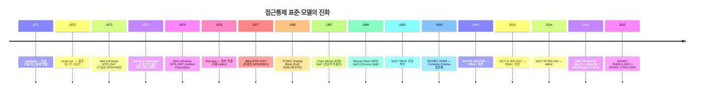
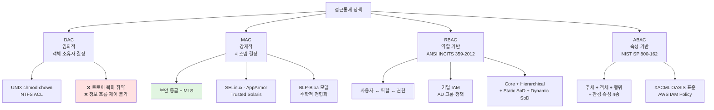
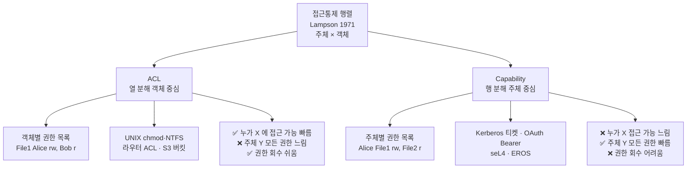
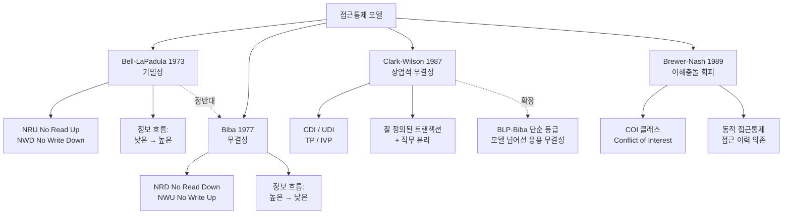
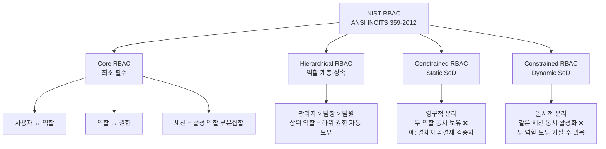

# 02. 접근통제 — 만화책처럼 읽는 권한 모델의 역사

> **이 문서를 읽는 법**: 만화책처럼 *시간 순*으로 *에피소드*를 따라가면 *왜* 각 모델이 등장했고 *왜* 다음 모델이 필요했는지 자연스럽게 외워집니다.
> 정확한 정의·규칙·표준 번호는 정확본 참조: [[cs/information-security/04.security-general/02.access-control|정확본 02. 접근통제]]

> **연결 단원**: 본 단원은 [[cs/information-security/04.security-general/01.authentication|정확본 01. 인증]] 의 *다음 단계*. 인증이 "누구인가" 를 정한 후, 접근통제가 "무엇을 할 수 있는가" 를 정한다. *Capability 모델*은 [[cs/information-security/04.security-general/01.authentication|01 단원]] 의 Kerberos 티켓·OAuth Bearer 와 직접 연결.

---

## 🎯 시작 전에 — 이미 쓰고 있는 접근통제

| 매일 보는 것 | 사실은 이 단원의 |
|---|---|
| `chmod 644 file.txt`, `chown user file.txt` | **DAC** (UNIX/Linux 파일 권한) |
| Windows NTFS 의 *권한* 탭 | **DAC** (NTFS ACL) |
| AWS S3 버킷 정책 | **ACL** (객체 중심) |
| AWS IAM Policy 의 Condition (시간·IP·태그) | **ABAC** (속성 기반) |
| 회사 IAM 시스템의 그룹·역할 | **RBAC** (역할 기반) |
| AD 그룹 정책 | **RBAC** |
| SELinux, AppArmor | **MAC** (강제적 접근통제) |
| Kerberos 티켓 (01 단원) | **Capability 모델** (주체 중심) |
| OAuth 2.0 Bearer 토큰 | **Capability 모델** |
| 회사 보안 등급 분류 (Top Secret 등) | **MAC + BLP 모델** |
| 결재자 ≠ 결재 승인자 | **직무 분리 (SoD)** |
| 코드 작성자 ≠ 코드 리뷰어 | **직무 분리 (SoD)** |

> **이 단원의 본질**: 접근통제는 *"이 주체가 이 객체에 이 행위를 할 수 있는가"* 의 결정. 4 가지 정책 (**DAC · MAC · RBAC · ABAC**) 이 *결정 주체*가 다르고, 4 가지 모델 (**BLP · Biba · Clark-Wilson · Brewer-Nash**) 이 *수학적 정형화*가 다르다. 시험은 둘의 정확한 구분을 묻는다.

---

## 📖 에피소드 1 — 접근통제의 위치 + 참조 모니터·TCB

### 장면. CIA Triad 와 접근통제

> 정보 보호의 세 핵심 목표 (CIA Triad):
> - **기밀성 (Confidentiality)** — 허가된 주체만 읽기 가능 → **BLP 모델** 강제
> - **무결성 (Integrity)** — 허가된 주체만 변경 가능 → **Biba·Clark-Wilson** 강제
> - **가용성 (Availability)** — 접근통제의 직접 목표 아님 (DoS 방어로 간접 보호)

### 접근통제의 5 구성 요소

| 구성 요소 | 영문 | 설명 |
|---|---|---|
| **주체** | Subject | 객체에 접근하려는 *능동적* 개체 (사용자·프로세스·디바이스) |
| **객체** | Object | 보호 대상이 되는 *수동적* 자원 (파일·DB 레코드·네트워크 자원) |
| **접근 권한** | Access Right | 주체가 객체에 수행 가능한 행위 (읽기·쓰기·실행·삭제·변경) |
| **참조 모니터** | Reference Monitor | *모든 접근 요청을 가로채* 정책에 따라 허용·거부 결정하는 추상 머신 |
| **TCB** | Trusted Computing Base | 참조 모니터를 구현한 *하드웨어·펌웨어·소프트웨어* 집합 |

### 참조 모니터의 3대 요건 (Anderson 1972, TCSEC 채택)

| 요건 | 영문 | 의미 |
|---|---|---|
| **격리성** | Isolation (tamperproof) | 변조될 수 없도록 보호 |
| **완전성** | Completeness (always invoked) | 모든 접근을 가로채야 하며 우회 불가 |
| **검증 가능성** | Verifiability | 작고 단순해 분석·검증 가능 |

### 시험 함정

- "참조 모니터 3요건?" → **격리성·완전성·검증 가능성** (tamperproof·complete·verifiable)

---

## 📖 에피소드 2 — 접근통제 4단계: 식별 → 인증 → 인가 → 책임 추적성

### 장면. 직렬 4단계

> 접근통제는 *4단계를 직렬로* 수행.

| 단계 | 영문 | 의미 |
|---|---|---|
| ① **식별** | Identification | 주체가 자신을 누구인지 *주장* (사용자명·UID·디바이스 ID) |
| ② **인증** | Authentication | 주장된 신원이 *사실임을 검증* — [[cs/information-security/04.security-general/01.authentication\|01 단원]] |
| ③ **인가** | Authorization | 인증된 주체가 *요청한 객체·행위에 권한이 있는지* 정책에 따라 결정 |
| ④ **책임 추적성** | Accountability | *모든 접근을 로그*로 남겨 사후 추적·감사 가능 |

### 본 단원의 핵심 = ③ 인가

> 인가는 **두 차원**을 갖는다:
> - **어떤 정책으로 결정할 것인가** → §2 에피소드 3~6 (DAC·MAC·RBAC·ABAC)
> - **어떤 자료구조로 권한을 표현할 것인가** → §3 에피소드 7 (ACL·Capability)

### 시험 함정

- "접근통제 4단계?" → **식별·인증·인가·책임 추적성** (Identification·Authentication·Authorization·Accountability)
- "본 단원의 핵심 단계?" → **인가 (Authorization)**

---

## 📖 에피소드 3 — DAC: 임의적 접근통제

### 장면. "내 파일은 내가 결정한다"

> **DAC (Discretionary Access Control)**: 객체의 *소유자*가 다른 주체에게 자신의 객체에 대한 접근 권한을 *임의로* 부여할 수 있는 정책.

핵심 단어: **"임의적 (discretionary)"** — 객체 소유자가 자기 권한을 다른 주체에게 위임하는 결정을 *자유롭게* 내릴 수 있다.

### 대표 구현

| 구현 | 의미 |
|---|---|
| **UNIX/Linux** `chmod`, `chown` | 파일 소유자가 권한 자유 변경 |
| **Windows NTFS** ACL | 객체별 권한 목록 |

→ 사용자가 자신의 파일에 `chmod 644` 또는 `chmod 777` 자유 결정 = **DAC 의 정수**.

### DAC 의 장단점

| 장점 | 단점 |
|---|---|
| **유연성** — 사용자 자율 권한 관리 | **트로이 목마 취약** — 악성 코드가 사용자 권한으로 실행되면 모든 것 가능 |
| **구현 단순** — UNIX owner/group/other | **정보 흐름 제어 불가** — 권한 위임 후 재위임 막을 수 없음 (권한 전이 문제) |

### MAC 가 등장한 이유

> DAC 의 두 약점 (트로이 목마 + 정보 흐름 제어 불가) → 시스템 차원의 강제 정책 필요 → **MAC** (에피소드 4).

### 시험 함정

- "DAC 의 약점 2가지?" → **트로이 목마** + **정보 흐름 제어 불가**
- "DAC 의 권한 결정 주체?" → **객체 소유자**

---

## 📖 에피소드 4 — MAC: 강제적 접근통제 (DAC 약점에 대한 응답)

### 장면. "시스템이 결정한다, 사용자가 아니다"

> **MAC (Mandatory Access Control)**: *시스템(보안 관리자)* 이 객체와 주체에 보안 등급을 부여하고, *등급 간 정해진 규칙*에 따라 접근을 강제. 객체 소유자라도 정책 변경 *불가*.

핵심 단어: **"강제적 (mandatory)"** — 정책은 *시스템 차원*에서 결정. 개별 사용자가 임의 변경 불가.

### MAC 의 핵심 원리

| 원리 | 의미 |
|---|---|
| **객체·주체에 보안 등급(레이블) 부여** | 예: 문서 = Top Secret, 사용자 = Secret |
| **등급 간 규칙 강제** | 예: BLP 의 "Secret 사용자는 Top Secret 문서 읽기 ❌" |
| **소유자가 변경 불가** | 사용자가 *자신의 등급 또는 객체 등급을* 임의 변경 불가 |
| **다중 레벨 보안 (MLS)** | 서로 다른 등급의 정보가 동일 시스템에서 안전 공존 |

### MAC 의 장단점

| 장점 | 단점 |
|---|---|
| **트로이 목마 방어** — 악성 코드도 등급 규칙 위반 ❌ | **유연성 부족** — 모든 객체·주체에 등급 부여 운영 부담 |
| **정보 흐름 제어** — 등급 규칙이 누설(downgrade) 방지 | **상업 환경 부적합** — 본래 군용 모델 |

### 대표 구현

| 구현 | 환경 |
|---|---|
| **SELinux** | Linux |
| **AppArmor** | Linux |
| **Trusted Solaris** | UNIX |

### DAC vs MAC 비교 (시험 단골)

| 측면 | DAC | MAC |
|---|---|---|
| **권한 결정 주체** | 객체 소유자 | **시스템** |
| **변경 가능성** | 가능 | **불가** |
| **트로이 목마 저항** | 약 | **강** |
| **대표 구현** | UNIX·NTFS | SELinux |

### 시험 함정

- "DAC ↔ MAC 핵심 차이?" → 권한 결정 주체 (소유자 vs 시스템) + 변경 가능성 + 트로이 목마 저항
- "MAC 의 OS 구현?" → **SELinux**, AppArmor, Trusted Solaris

---

## 📖 에피소드 5 — RBAC: 역할 기반 접근통제 (대규모 조직의 응답)

### 장면. N×M 문제 → N+M+R 로 줄이기

> **RBAC (Role-Based Access Control)**: 권한을 *직접 사용자에게 부여하지 않고* **역할(role)** 에 부여한 후, 사용자에게 역할을 할당. **ANSI INCITS 359-2012** 표준.

### 발상의 핵심

| 매핑 | 복잡도 | 100명·50권한 |
|---|---|---|
| 사용자 ↔ 권한 직접 | N×M | 5,000 매핑 |
| **사용자 ↔ 역할 ↔ 권한** | N + M + R | 약 600 (10 역할 거치면) |

### RBAC 의 핵심 모델

| 요소 | 영문 | 의미 |
|---|---|---|
| **사용자** | User | 시스템 사용 주체 |
| **역할** | Role | 직무·책임에 따른 권한 묶음 (관리자·운영자·감사자) |
| **권한** | Permission | 객체에 대한 행위 (파일 X 읽기) |
| **세션** | Session | 사용자가 활성화한 역할의 *부분집합* |

### RBAC 의 장점

| 장점 | 의미 |
|---|---|
| **확장성** | 역할 정의·할당이 권한 직접 부여보다 간결 |
| **직무 분리(SoD) 자연스러움** | 상충 역할 부여 금지를 정책으로 강제 가능 |
| **상업 환경 적합** | 대규모 조직 권한 관리 표준화 |

→ NIST RBAC 표준은 **에피소드 13** 에서 본격 다룸.

### 시험 함정

- "RBAC 의 핵심 매핑?" → **사용자 ↔ 역할 ↔ 권한** (역할이 중간 매개체)
- "RBAC 와 DAC 의 구분?" → 권한 ↔ 역할 매핑 vs 권한 ↔ 사용자 매핑

---

## 📖 에피소드 6 — ABAC: 속성 기반 접근통제 (RBAC 한계의 응답)

### 장면. "근무 시간에 + 회사 IP 에서만 접근 가능"

> **ABAC (Attribute-Based Access Control)**: 주체·객체·환경의 *속성(attribute) 에 대한 정책 표현식*으로 접근을 결정. **NIST SP 800-162** (2014) 표준.

### 4가지 속성 카테고리

| 카테고리 | 예시 |
|---|---|
| **주체 속성** | 부서·직급·정규직 여부·보안 등급 |
| **객체 속성** | 분류·소유자·생성일·민감도 |
| **행위 속성** | 읽기·쓰기·실행 |
| **환경 속성** | 시간·위치·디바이스·네트워크 |

### 정책 예시

```
주체.부서 = '인사팀'
AND 객체.분류 = '인사기록'
AND 환경.시간 ∈ [09:00, 18:00]
AND 환경.위치 = '회사내부'
→ 허용
```

### ABAC 표준 구현

> **XACML (eXtensible Access Control Markup Language)** — OASIS 표준. XML 기반 정책 언어.

### ABAC vs RBAC

> ABAC 는 RBAC 의 *"역할" 만으로는 표현할 수 없는 동적·맥락적 정책*을 속성 조합으로 표현.
> *환경 속성 (시간·위치)* 을 정책에 포함 가능 → RBAC 와 가장 큰 차이.

### 4 정책 종합 비교

| 정책 | 권한 결정 기준 | 대표 구현 |
|---|---|---|
| **DAC** | 객체 소유자의 임의 결정 | UNIX 파일 권한, NTFS ACL |
| **MAC** | 시스템 강제 보안 등급 | SELinux, BLP·Biba 모델 |
| **RBAC** | 사용자가 가진 역할 | 기업 IAM, AD 그룹 정책 |
| **ABAC** | 다차원 속성 조합 정책 | XACML, AWS IAM Policy |

### 시험 함정

- "ABAC ↔ RBAC 차이?" → ABAC 는 **환경 속성** (시간·위치·디바이스) 정책 포함 가능
- "ABAC 표준 정책 언어?" → **XACML** (OASIS, XML 기반)

---

## 📖 에피소드 7 — 1971년 Lampson: 접근통제 행렬 → ACL vs Capability

### 장면. 1971년, Lampson 의 보호 모델

> **접근통제 행렬 (Access Control Matrix)**: 행이 주체, 열이 객체. 각 셀에 해당 주체-객체 쌍의 접근 권한 기록. **Lampson 1971** 의 보호 모델 기반.

### 행렬 예시

| | File1 | File2 | Printer1 |
|---|---|---|---|
| Alice | rw | r | x |
| Bob | r | rw | x |
| Carol | — | r | — |

### 문제 — 행렬은 *대부분 빈 셀*

N×M 의 행렬은 메모리 비효율 → **두 가지 분해 방식** 등장.

### ACL — *열 방향 분해* (객체 중심)

> **ACL (Access Control List)**: 객체별로 "*이 객체에 누가 어떤 권한을 가지는가*" 나열한 목록.

```
File1 의 ACL : { (Alice, rw), (Bob, r) }
File2 의 ACL : { (Alice, r), (Bob, rw), (Carol, r) }
Printer1 의 ACL : { (Alice, x), (Bob, x) }
```

대표 구현: UNIX 파일 권한 (`-rw-r--r--`), Windows NTFS, 라우터 ACL, AWS S3 버킷 정책.

### Capability List — *행 방향 분해* (주체 중심)

> **Capability List (능력 목록)**: 주체별로 "*이 주체가 어떤 객체에 어떤 권한을 가지는가*" 나열.

```
Alice 의 Capability : { (File1, rw), (File2, r), (Printer1, x) }
Bob 의 Capability   : { (File1, r), (File2, rw), (Printer1, x) }
Carol 의 Capability : { (File2, r) }
```

대표 구현: **Kerberos 티켓** ([[cs/information-security/04.security-general/01.authentication|01 단원 §5-2]]), Capability-based OS (EROS·seL4), 분산 시스템 토큰 기반 권한, **OAuth 2.0 Bearer Token** (Capability 적 발상).

### ACL vs Capability 비교

| 측면 | ACL | Capability |
|---|---|---|
| **행렬 분해 방향** | 열 (객체별) | 행 (주체별) |
| **"누가 X 에 접근 가능?"** | 빠름 | 느림 |
| **"주체 Y 의 모든 권한?"** | 느림 | 빠름 |
| **권한 회수** | 쉬움 (객체 ACL 수정) | 어려움 (Capability 추적 필요) |
| **권한 위임** | 어려움 (관리자 개입) | 쉬움 (Capability 전달) |
| **대표 구현** | UNIX·NTFS·라우터·S3 | Kerberos·OAuth Bearer·seL4 |

### 시험 함정

- "ACL ↔ Capability 분해 방향?" → ACL = **열(객체)** / Capability = **행(주체)**
- "Kerberos 티켓·OAuth Bearer 의 모델?" → **Capability**

---

## 📖 에피소드 8 — 1973년 Bell-LaPadula: 기밀성 모델 (NRU + NWD)

### 장면. 1973년, MITRE — 군의 다중 레벨 보안

> **Bell-LaPadula (BLP) Model**: 군·정부의 *다중 레벨 보안 (MLS)* 환경에서 **기밀성 (confidentiality)** 을 강제. **Bell & LaPadula 1973·1976** 가 MITRE 에서 개발.

### BLP 의 두 핵심 규칙

| 규칙 | 영문 | 의미 |
|---|---|---|
| **단순 보안 속성** | Simple Security Property — **No Read Up (NRU)** | 자기보다 *높은 등급* 객체 *읽기 ❌* |
| ***** **속성** | * Property — **No Write Down (NWD)** | 자기보다 *낮은 등급* 객체 *쓰기 ❌* |
| 임의 보안 속성 | Discretionary Security Property | 추가 DAC 정책으로 보완 가능 |

### 왜 NWD 인가?

> Top Secret 사용자가 Secret 파일에 쓰기를 허용하면, 사용자가 *의도적·무의식적으로* Top Secret 정보를 Secret 파일로 복사 가능 (downgrade).
> NWD 가 막는 것: **"정보는 위에서 아래로 흐를 수 없다"** — 기밀성의 직접 구현.

### 보안 등급 (군·정부)

| 등급 | 영문 | 노출 시 영향 |
|---|---|---|
| **Top Secret** | TS | 국가 안보에 매우 심각한 손해 |
| **Secret** | S | 국가 안보에 심각한 손해 |
| **Confidential** | C | 국가 안보에 손해 |
| **Unclassified** | U | 비밀 분류 없음 |

### 예시 (Top Secret > Secret > Confidential > Unclassified)

| Secret 사용자 | 행위 |
|---|---|
| Confidential·Unclassified 파일 | 읽기 ✅ |
| Top Secret 파일 | 읽기 ❌ (NRU) |
| Top Secret 파일 | 쓰기 ✅ (Write Up) |
| Confidential·Unclassified 파일 | 쓰기 ❌ (NWD) |

> **암기 팁**: BLP = "**Read Down, Write Up**" (낮은 거 읽고 높은 데 씀). 정보 흐름은 *낮은 → 높은* 만 허용.

### 시험 함정

- "BLP 두 규칙?" → **NRU (No Read Up)** + **NWD (No Write Down)**
- "BLP 가 강제하는 것?" → **기밀성**
- "BLP 정보 흐름 방향?" → **낮은 → 높은**

---

## 📖 에피소드 9 — 1977년 Biba: 무결성 모델 (NRD + NWU = BLP 의 정반대)

### 장면. 1977년, MITRE — Biba 의 응답

> **Biba Integrity Model**: BLP 와 *정반대 방향*의 규칙으로 **무결성 (integrity)** 을 강제. **Biba 1977** 가 MITRE 에서 개발 (MTR-3153).

### Biba 의 두 핵심 규칙

| 규칙 | 영문 | 의미 |
|---|---|---|
| **단순 무결성 속성** | Simple Integrity Property — **No Read Down (NRD)** | 자기보다 *낮은 등급* 객체 *읽기 ❌* |
| ***** **무결성 속성** | * Integrity Property — **No Write Up (NWU)** | 자기보다 *높은 등급* 객체 *쓰기 ❌* |
| 호출 속성 | Invocation Property | 자기보다 *높은 등급 주체* *호출 ❌* |

### 왜 NRD 인가?

> 신뢰성 *높은* (등급 높은) 주체가 신뢰성 *낮은* (등급 낮은) 객체에서 정보를 가져오면, 신뢰 시스템에 *오염된 정보*가 유입.
> NRD 가 막는 것: **"낮은 신뢰성 정보가 높은 신뢰성 시스템에 침투할 수 없다"**.

### 왜 NWU 인가?

> 등급 낮은 주체가 등급 높은 객체에 쓰면 *신뢰 시스템에 오염 주입*.
> NWU 가 이를 막음.

### BLP vs Biba — *완전히 정반대*

| 모델 | 보호 대상 | 읽기 규칙 | 쓰기 규칙 | 정보 흐름 방향 |
|---|---|---|---|---|
| **BLP** | 기밀성 | NRU (위로 못 읽음) | NWD (아래로 못 씀) | **낮은 → 높은** |
| **Biba** | 무결성 | NRD (아래로 못 읽음) | NWU (위로 못 씀) | **높은 → 낮은** |

### 외우는 방법

> **BLP 는 위로 흐르고 (read down·write up), Biba 는 아래로 흐른다 (read up·write down)** — 그러나 시험에서 "BLP 에서는 NRU" 라는 표현이 직접 출제 → *약어를 통째로* 외우는 게 안전.

### 시험 함정

- "Biba 두 규칙?" → **NRD (No Read Down)** + **NWU (No Write Up)**
- "Biba 가 강제하는 것?" → **무결성**
- "Biba 정보 흐름 방향?" → **높은 → 낮은** (BLP 와 정반대)

---

## 📖 에피소드 10 — 1987년 Clark-Wilson: 상업적 무결성 (CDI·UDI·TP·IVP)

### 장면. 1987년, IEEE S&P — 회계의 컴퓨터화

> **Clark-Wilson Model**: 상업·금융 환경의 무결성을 위한 모델. **Clark & Wilson 1987** (IEEE S&P) 가 *회계 시스템의 부정 방지 원리*에서 도출.

### 발상

> BLP·Biba 의 *단순 등급 모델*을 넘어 **잘 정의된 트랜잭션 (WFT)** 과 **직무 분리 (SoD)** 로 무결성 강제.
> 회계의 *"이중 입력 부기 (double-entry bookkeeping)"* + *"직무 분리"* 원리의 컴퓨터화.

### 핵심 4 구성 요소

| 약어 | 영문 | 의미 |
|---|---|---|
| **CDI** | Constrained Data Item | *무결성 제약을 받는* 데이터 (예: 회계 장부) |
| **UDI** | Unconstrained Data Item | *외부 입력* 등 무결성 검증 전 데이터 |
| **TP** | Transformation Procedure | CDI 를 변경하는 *유일한 합법 절차* (잘 정의된 트랜잭션) |
| **IVP** | Integrity Verification Procedure | CDI 의 *무결성 상태를 검증*하는 절차 |

### 핵심 4 규칙

```
[1] CDI 는 오직 TP 를 통해서만 변경 (직접 접근 ❌)
[2] TP 는 CDI 를 무결한 상태에서 무결한 상태로 변환 (보존)
[3] UDI 는 TP 를 거쳐 검증·변환된 후에만 CDI 가 될 수 있음
[4] 직무 분리 — TP 작성자, 실행자, 검증자는 분리되어야 함
```

### 회계 비유

| 회계 개념 | Clark-Wilson |
|---|---|
| 회계 장부 | CDI |
| 외부 거래 영수증 | UDI |
| 회계 입력·승인 절차 | TP |
| 회계 감사 | IVP |
| 회계사 ≠ 감사인 | 직무 분리 |

### 시험 함정

- "Clark-Wilson 4 요소?" → **CDI · UDI · TP · IVP**
- "Clark-Wilson 키워드 3개?" → ① CDI/UDI/TP/IVP, ② 잘 정의된 트랜잭션 (Well-Formed Transaction), ③ 직무 분리 (Separation of Duty)

---

## 📖 에피소드 11 — 1989년 Brewer-Nash: Chinese Wall (이해충돌 회피)

### 장면. 1989년, IEEE S&P — 영국 금융 규제에서

> **Brewer-Nash Model (Chinese Wall)**: 컨설팅·금융 등에서 **이해충돌 (conflict of interest) 회피**를 위한 *동적 접근통제* 모델. **Brewer & Nash 1989** (IEEE S&P) 가 *영국 금융 규제 (Chinese Wall 정책)* 에서 도출.

### 발상

> 컨설턴트가 한 회사의 정보를 본 후 *그 경쟁사의 정보에 접근하면* **이해충돌 발생**. → "*일단 한 회사를 본 후에는 그 경쟁사 정보를 자동으로 차단*" 하는 동적 정책.

### 모델 구조

| 요소 | 영문 | 의미 |
|---|---|---|
| **객체** | Object | 개별 회사 정보 항목 |
| **회사 데이터셋** | Company Dataset (CD) | 한 회사의 모든 객체 |
| **이해충돌 클래스** | Conflict of Interest Class (COI) | *경쟁 관계*의 회사 데이터셋들 |

### 두 규칙

| 규칙 | 의미 |
|---|---|
| **단순 보안 규칙** | 어떤 객체든 처음에는 접근 가능. *일단 한 CD 의 객체에 접근하면* **같은 COI 클래스의 다른 CD 객체 접근 ❌** |
| ***** **속성 규칙** | 주체가 객체에 *쓰려면*, 그 객체와 *같은 CD 의 객체만 읽었어야* 함 (다른 CD 정보 흘러들어갈 위험 차단) |

### 예시

```
COI 클래스 = 금융권 = { 은행 A, 은행 B, 은행 C }
COI 클래스 = 정유권 = { 정유사 X, 정유사 Y }

컨설턴트가 은행 A 자료 접근
  → 은행 B, 은행 C (같은 COI 클래스) 자료 접근 차단 ❌
  → 정유사 X (다른 COI 클래스) 자료 접근 가능 ✅
```

### 동적 접근통제

> Brewer-Nash 는 *접근 이력에 따라 권한이 변함* — *동적* 접근통제. BLP·Biba 같은 *정적* 규칙과 다른 점.

### 시험 함정

- "Brewer-Nash 의 적용 분야?" → **컨설팅·금융** (이해충돌 발생 환경)
- "Brewer-Nash 핵심 키워드?" → **COI 클래스** + **동적 접근통제**

---

## 📖 에피소드 12 — TCSEC (1985) → Common Criteria (ISO/IEC 15408): 평가 기준의 진화

### 장면 1. 1985년, Orange Book — TCSEC

> **TCSEC (Trusted Computer System Evaluation Criteria)**: 미국 국방부 1983·1985 발표. *책 표지 색상*으로 **"Orange Book"** 으로 불림. **DoD 5200.28-STD**.

### TCSEC 7 단계 (4 등급)

| 등급 | 단계 | 명칭 | 핵심 요구사항 |
|---|---|---|---|
| **D** | D | Minimal Protection | 최소 보호 (실패 등급) |
| **C** | C1 | Discretionary Security Protection | DAC 기본 |
| | **C2** | Controlled Access Protection | **DAC + 감사·식별** |
| **B** | **B1** | Labeled Security Protection | **MAC + 보안 레이블** |
| | B2 | Structured Protection | MAC + 형식 보안 정책 |
| | B3 | Security Domains | MAC + 참조 모니터 강제 |
| **A** | A1 | Verified Design | 형식 검증된 설계 |

→ **C2 = DAC 의 보강** (감사·식별), **B1 = MAC 의 시작** (보안 레이블).

### 장면 2. 1990년대 — TCSEC + ITSEC 통합 → Common Criteria

> 1990 년대 TCSEC 이 ITSEC(유럽) 과 통합되어 현재의 **CC (Common Criteria, ISO/IEC 15408)** 로 대체. 1999 ISO 표준화.

### CC 의 EAL 7 단계

| EAL | 명칭 |
|---|---|
| EAL1 | Functionally Tested |
| EAL2 | Structurally Tested |
| EAL3 | Methodically Tested and Checked |
| **EAL4** | Methodically Designed, Tested, and Reviewed |
| EAL5 | Semiformally Designed and Tested |
| EAL6 | Semiformally Verified Design and Tested |
| EAL7 | Formally Verified Design and Tested |

### 실무 보급 수준

| 수준 | 의미 |
|---|---|
| **EAL4** | **상용 OS·DBMS 표준** 인증 수준 |
| EAL7 | *형식 검증* 요구. 매우 제한적 시스템 (미사일 제어 등) |

### 시험 함정

- "TCSEC 의 MAC 시작 등급?" → **B1** (Labeled Security Protection). C2 까지는 DAC 기반
- "CC 표준 번호?" → **ISO/IEC 15408**
- "CC EAL 범위?" → **EAL1 ~ EAL7**. *EAL4* 가 상용 OS 일반 인증
- "TCSEC 별칭?" → **Orange Book**

---

## 📖 에피소드 13 — NIST RBAC 표준 + 운영 3 원칙

### 장면. ANSI INCITS 359-2012 — RBAC 의 4 컴포넌트

> **NIST RBAC 표준**: NIST 가 1992 년 제안 → 2004 년 INCITS 359-2004 표준화 → 2012 년 개정 (**ANSI INCITS 359-2012**). **4개 컴포넌트** 구성.

### Core RBAC — 최소 필수

| 매핑 | 의미 |
|---|---|
| **사용자(User) ↔ 역할(Role)** | 사용자가 가질 수 있는 역할 |
| **역할(Role) ↔ 권한(Permission)** | 역할이 가지는 권한 |
| **사용자 세션(Session)** | 사용자가 *활성화한 역할의 부분집합*. 세션 단위 권한 행사 |

### Hierarchical RBAC — 역할 계층

> 역할 사이에 *상속 관계*. 상위 역할은 *하위 역할의 모든 권한을 자동으로 보유*.

```
관리자 > 팀장 > 팀원

팀원 권한    = { 보고서 읽기 }
팀장 권한    = 팀원 권한 + { 보고서 작성, 결재 }
관리자 권한  = 팀장 권한 + { 권한 부여, 사용자 생성 }
```

### Constrained RBAC — 직무 분리 (SoD)

| | Static SoD (SSD) | Dynamic SoD (DSD) |
|---|---|---|
| 정의 | *동시에 가질 수 없는* 역할 쌍 | *동일 세션에서 동시 활성화할 수 없는* 역할 쌍 |
| 강도 | **영구적 분리** | **일시적 분리** |
| 예 | "결재자" 와 "결재 검증자" *동일 사용자에게 할당 금지* | 사용자가 두 역할을 모두 *가질 수 있으나* 한 세션에서 둘 중 *하나만* 활성화 |

### 접근통제 운영 3 원칙

#### ① 책임 추적성 (Accountability) — ISO/IEC 27001:2022

> 시스템 내 *모든 행위*가 누구에 의해 수행되었는지 사후 추적 가능해야 한다는 원칙.

| 필수 요소 | 의미 |
|---|---|
| **고유 식별자** | 사용자마다 유일한 ID. 공용 계정 ❌ |
| **로깅** | 모든 접근·변경·삭제 행위 기록 |
| **로그 무결성** | 사후 조작 불가 보호 (WORM 저장, 디지털서명) |
| **시각 동기** | 로그 시각 정확 (NTP 기반) |

#### ② 최소 권한 (Principle of Least Privilege) — Saltzer & Schroeder 1975

> 주체에게 *업무 수행에 필요한 최소한의 권한만* 부여. Saltzer & Schroeder 1975 의 8 대 보안 설계 원칙 중 하나.

| 구현 |
|---|
| 권한 자동 회수 — 직무 변경·퇴직 시 즉시 |
| 임시 권한 (just-in-time access) — 필요 시점·시간에만 |
| 권한 분할 — 큰 권한을 여러 작은 권한으로 |

#### ③ 직무 분리 (Separation of Duties, SoD)

> 한 사용자가 *단독으로 부정·실수가 발생할 수 있는 모든 단계를 수행하지 못하도록*, 한 작업을 여러 단계로 분할.

| 분류 | 정의 |
|---|---|
| **정적 (SSD)** | 영구적 분리 (한 사용자가 두 역할 동시 보유 ❌) |
| **동적 (DSD)** | 일시적 분리 (한 세션에서 두 역할 동시 활성화 ❌) |

| 대표 사례 |
|---|
| 결재 요청자 ≠ 결재 승인자 |
| 코드 작성자 ≠ 코드 리뷰어 |
| 회계 입력자 ≠ 회계 검증자 |

### 시험 함정

- "NIST RBAC 4 컴포넌트?" → **Core / Hierarchical / Static SoD / Dynamic SoD**
- "SSD ↔ DSD?" → SSD = **영구적** (역할 자체 부여 금지) / DSD = **세션 단위** (동시 활성화 금지)
- "운영 3 원칙?" → **책임 추적성 / 최소 권한 / 직무 분리**

---

## 📑 접근통제 모델 종합 비교 (에피소드 8~11 정리)

시험 직전 *한눈에* 보는 view.

| 모델 | 등장 | 보호 대상 | 핵심 규칙 | 정보 흐름 | 적용 분야 |
|---|---|---|---|---|---|
| **Bell-LaPadula** | 1973·1976 (MITRE) | **기밀성** | NRU + NWD | **낮은 → 높은** | 군·정부 MLS |
| **Biba** | 1977 (MITRE) | **무결성** | NRD + NWU | **높은 → 낮은** | 신뢰성 검증 시스템 |
| **Clark-Wilson** | 1987 (IEEE S&P) | **상업적 무결성** | CDI/UDI/TP/IVP + WFT + SoD | (트랜잭션) | 상업·금융·회계 |
| **Brewer-Nash** | 1989 (IEEE S&P) | **이해충돌 회피** | COI 클래스 + 동적 통제 | (접근 이력 따라) | 컨설팅·금융 |

### 핵심 패턴

1. **BLP ↔ Biba**: 정확히 정반대 (기밀성 ↔ 무결성, NRU/NWD ↔ NRD/NWU, 정보 흐름 방향 반대)
2. **단순 등급 모델 (BLP·Biba) → 풍부한 모델 (Clark-Wilson·Brewer-Nash)**: 회계·이해충돌 같은 *복잡한 실무 요건*을 위한 발전
3. **정적 ↔ 동적 통제**: BLP·Biba·Clark-Wilson 은 정적 / **Brewer-Nash 만 동적** (접근 이력 의존)

---

## 🗺️ 마인드맵 1 — 시간선



**읽는 법**: 접근통제 모델은 *각 모델의 한계에 대한 응답*으로 진화. Biba (1977) 가 BLP (1973) 의 *기밀성만으로는 무결성 보장 불가*에 대한 응답. Clark-Wilson (1987) 이 *단순 등급으로 표현 못 하는 상업적 무결성*에 대한 응답. Brewer-Nash (1989) 가 *컨설팅·금융의 이해충돌*에 대한 응답.

---

## 🗺️ 마인드맵 2 — 4 정책 분류 트리



---

## 🗺️ 마인드맵 3 — ACL vs Capability (행렬 분해)



---

## 🗺️ 마인드맵 4 — 접근통제 모델 4종



---

## 🗺️ 마인드맵 5 — NIST RBAC 4 컴포넌트



---

## 🗂️ 키워드 클러스터

### NIST 표준

```
SP 800-53 Rev. 5  — Security and Privacy Controls (2020·2023)
SP 800-162        — ABAC (2014·2019)
```

### ANSI·DoD·OASIS·ISO

```
ANSI INCITS 359-2012        — RBAC
DoD 5200.28-STD             — TCSEC Orange Book (1985)
OASIS                       — XACML (ABAC 정책 언어)
ISO/IEC 15408-1:2022        — Common Criteria
ISO/IEC 27001:2022          — ISMS
```

### 학술 원논문

```
Lampson 1971                              — 접근통제 행렬·보호 모델
Anderson 1972                             — 참조 모니터 3요건
Bell & LaPadula 1973·1976                 — BLP (MTR-2547·MTR-2997)
Saltzer & Schroeder 1975                  — 8 대 보안 설계 원칙
Denning 1976                              — 정보 흐름·Lattice
Biba 1977                                 — 무결성 (MTR-3153)
Clark & Wilson 1987                       — 상업적 무결성 (IEEE S&P)
Brewer & Nash 1989                        — Chinese Wall (IEEE S&P)
```

### TCSEC ↔ CC 매핑

```
TCSEC : D · C1 · C2 · B1 · B2 · B3 · A1
CC    : EAL1 · EAL2 · EAL3 · EAL4 · EAL5 · EAL6 · EAL7
        (EAL4 = 상용 OS 표준)
```

### 헷갈리는 짝 (시험 1순위)

| 짝 | 차이 |
|---|---|
| **DAC ↔ MAC** | 객체 소유자 결정 ↔ 시스템 강제 |
| **DAC ↔ RBAC** | 사용자에 직접 권한 ↔ 역할 통한 매개 |
| **RBAC ↔ ABAC** | 역할만 / + 환경 속성 (시간·위치) |
| **ACL ↔ Capability** | 열(객체 중심) ↔ 행(주체 중심) |
| **BLP ↔ Biba** | 기밀성 ↔ 무결성, NRU/NWD ↔ NRD/NWU |
| **NRU ↔ NRD** | 위로 못 읽음 (BLP) ↔ 아래로 못 읽음 (Biba) |
| **NWD ↔ NWU** | 아래로 못 씀 (BLP) ↔ 위로 못 씀 (Biba) |
| **Clark-Wilson ↔ Brewer-Nash** | 상업적 무결성 (회계) ↔ 이해충돌 회피 (컨설팅) |
| **BLP·Biba·CW ↔ Brewer-Nash** | 정적 통제 ↔ **동적 통제** (접근 이력) |
| **TCSEC ↔ CC** | 7단계 D~A1 (1985) ↔ 7단계 EAL1~7 (1999) |
| **C2 ↔ B1** | DAC + 감사 ↔ **MAC 시작** (보안 레이블) |
| **SSD ↔ DSD** | 영구적 (역할 부여 ❌) ↔ 세션 단위 (동시 활성 ❌) |
| **Top Secret ↔ Secret ↔ Confidential ↔ Unclassified** | 4단계 군·정부 등급 |
| **CDI ↔ UDI** | 무결성 제약 ↔ 외부 입력 (검증 전) |

---

## 🃏 회상 30문항

> 답을 가린 뒤 자가 채점.

**A. 개요·구성 요소 (1~6)**
1. 접근통제의 4단계는?
2. CIA Triad 와 접근통제 모델의 매핑은?
3. 참조 모니터의 3대 요건은?
4. TCB 의 정체는?
5. 본 단원에서 핵심이 되는 단계는?
6. Anderson 1972 의 기여는?

**B. 4 정책 (7~12)**
7. DAC 의 권한 결정 주체와 약점 2가지?
8. MAC 의 권한 결정 주체와 OS 구현 3가지?
9. DAC 와 MAC 의 핵심 차이 3가지?
10. RBAC 의 핵심 매핑 구조와 표준?
11. ABAC 의 4 속성 카테고리?
12. ABAC 가 RBAC 보다 우월한 점?

**C. ACL·Capability (13~15)**
13. 접근통제 행렬의 발명자와 연도?
14. ACL 과 Capability 의 분해 방향과 장단점?
15. Kerberos 티켓·OAuth Bearer 토큰의 모델은?

**D. 4 접근통제 모델 (16~22)**
16. BLP 의 두 핵심 규칙과 보호 대상?
17. BLP 의 정보 흐름 방향?
18. Biba 의 두 핵심 규칙과 보호 대상?
19. BLP 와 Biba 의 관계?
20. Clark-Wilson 의 4 구성 요소?
21. Clark-Wilson 의 3 핵심 키워드?
22. Brewer-Nash 의 적용 분야와 핵심 메커니즘?

**E. 평가 기준·NIST RBAC (23~27)**
23. TCSEC 의 7 단계는?
24. TCSEC 에서 MAC 시작 등급?
25. CC 의 표준 번호와 EAL 범위?
26. 상용 OS 의 일반 EAL 인증 수준?
27. NIST RBAC 의 4 컴포넌트?

**F. 운영 원칙 (28~30)**
28. 접근통제 운영 3 원칙?
29. SSD 와 DSD 의 차이?
30. 책임 추적성을 위한 4 필수 요소?

---

## ⚠️ 시험 함정 모음

| 함정 | 정답 |
|---|---|
| 접근통제 4단계? | **식별·인증·인가·책임 추적성** |
| 참조 모니터 3요건? | **격리성·완전성·검증 가능성** (tamperproof·complete·verifiable) |
| DAC 약점? | **트로이 목마** + **정보 흐름 제어 불가** |
| DAC 권한 결정? | **객체 소유자** |
| MAC 권한 결정? | **시스템 (강제)** |
| MAC OS 구현? | **SELinux**, AppArmor, Trusted Solaris |
| RBAC 매핑? | **사용자 ↔ 역할 ↔ 권한** |
| ABAC vs RBAC? | ABAC = **환경 속성** (시간·위치·디바이스) 정책 포함 |
| ABAC 정책 언어? | **XACML** (OASIS) |
| 행렬 발명? | **Lampson 1971** |
| ACL 분해 방향? | **열 (객체 중심)** |
| Capability 분해 방향? | **행 (주체 중심)** |
| Kerberos 티켓 모델? | **Capability** |
| BLP 두 규칙? | **NRU + NWD**. 기밀성 |
| Biba 두 규칙? | **NRD + NWU**. 무결성 |
| BLP 정보 흐름? | **낮은 → 높은** |
| Biba 정보 흐름? | **높은 → 낮은** |
| Clark-Wilson 4 요소? | **CDI · UDI · TP · IVP** |
| Clark-Wilson 키워드? | CDI/UDI/TP/IVP + **잘 정의된 트랜잭션** + **직무 분리** |
| Brewer-Nash 분야? | **컨설팅·금융** (이해충돌) |
| Brewer-Nash 키워드? | **COI 클래스** + **동적 접근통제** |
| 동적 접근통제 모델? | **Brewer-Nash 만** (BLP·Biba·CW 는 정적) |
| TCSEC 별칭? | **Orange Book** (DoD 5200.28-STD) |
| TCSEC 7 단계? | **D · C1 · C2 · B1 · B2 · B3 · A1** |
| MAC 시작 TCSEC 등급? | **B1** (Labeled Security Protection) |
| C2 의 의미? | **DAC + 감사·식별** |
| CC 표준 번호? | **ISO/IEC 15408** |
| CC EAL 범위? | **EAL1 ~ EAL7** |
| 상용 OS 표준 EAL? | **EAL4** |
| EAL7? | **형식 검증**. 미사일 제어 등 제한적 |
| NIST RBAC 4 컴포넌트? | **Core + Hierarchical + Static SoD + Dynamic SoD** |
| RBAC 표준? | **ANSI INCITS 359-2012** |
| SSD vs DSD? | 영구적 ↔ 세션 단위 |
| 운영 3 원칙? | **책임 추적성·최소 권한·직무 분리** |
| 최소 권한 원리 출처? | **Saltzer & Schroeder 1975** |
| 군·정부 등급 4종? | Top Secret · Secret · Confidential · Unclassified |

---

## 🔗 정확본 매핑표

| 본 노트 에피소드 | 정확본 § |
|---|---|
| 에피소드 1 (참조 모니터·TCB) | [[cs/information-security/04.security-general/02.access-control#§1-2. 구성 요소\|정확본 §1-1·§1-2]] |
| 에피소드 2 (4단계) | [[cs/information-security/04.security-general/02.access-control#§1-3. 접근통제의 일반 원리\|정확본 §1-3]] |
| 에피소드 3 (DAC) | [[cs/information-security/04.security-general/02.access-control#§2-1. DAC — 임의적 접근통제\|정확본 §2-1]] |
| 에피소드 4 (MAC) | [[cs/information-security/04.security-general/02.access-control#§2-2. MAC — 강제적 접근통제\|정확본 §2-2]] |
| 에피소드 5 (RBAC) | [[cs/information-security/04.security-general/02.access-control#§2-3. RBAC — 역할 기반 접근통제\|정확본 §2-3]] |
| 에피소드 6 (ABAC) | [[cs/information-security/04.security-general/02.access-control#§2-4. ABAC — 속성 기반 접근통제\|정확본 §2-4]] |
| 에피소드 7 (행렬·ACL·Capability) | [[cs/information-security/04.security-general/02.access-control#§3. 접근통제 메커니즘\|정확본 §3]] |
| 에피소드 8 (BLP) | [[cs/information-security/04.security-general/02.access-control#§4-1. Bell-LaPadula Model — 기밀성 모델\|정확본 §4-1]] |
| 에피소드 9 (Biba) | [[cs/information-security/04.security-general/02.access-control#§4-2. Biba Model — 무결성 모델\|정확본 §4-2]] |
| 에피소드 10 (Clark-Wilson) | [[cs/information-security/04.security-general/02.access-control#§4-3. Clark-Wilson Model — 상업적 무결성\|정확본 §4-3]] |
| 에피소드 11 (Brewer-Nash) | [[cs/information-security/04.security-general/02.access-control#§4-4. Brewer-Nash Model — Chinese Wall\|정확본 §4-4]] |
| 에피소드 12 (TCSEC·CC) | [[cs/information-security/04.security-general/02.access-control#§5. 보안 등급과 평가 기준\|정확본 §5]] |
| 에피소드 13 (NIST RBAC + 운영 3 원칙) | [[cs/information-security/04.security-general/02.access-control#§6. NIST RBAC 표준 — ANSI INCITS 359-2012\|정확본 §6·§7]] |

---

## 📅 학습 흐름

```
[1주]   에피소드 1·2 (개요·4단계) — 참조 모니터 3요건 외우기
[2주]   에피소드 3·4 (DAC·MAC) — 마인드맵 2 분류 트리
[3주]   에피소드 5·6 (RBAC·ABAC)
[4주]   에피소드 7 (ACL·Capability) — 마인드맵 3
[5주]   에피소드 8·9 (BLP·Biba) — NRU/NWD/NRD/NWU 통째 암기 + 마인드맵 4
[6주]   에피소드 10·11 (Clark-Wilson·Brewer-Nash)
[7주]   에피소드 12 (TCSEC·CC)
[8주]   에피소드 13 (NIST RBAC + 운영 3 원칙) — 마인드맵 5
[9주]   회상 30문항 → 틀린 것만 정확본 깊이 학습
[10주]  함정 모음 매일 1회 + 정확본 1회 정독
[11주]  통합 — 인증(01) ↔ 접근통제(02) / Kerberos·OAuth Bearer ↔ Capability / 디지털서명(04) ↔ 책임 추적성 로그 무결성
```

---

> **4과목 완료**: 본 단원으로 [[cs/information-security/04.security-general/05.crypto-algorithms|05. 암호 알고리즘]] / [[cs/information-security/04.security-general/06.hash-and-mac|06. 해시함수와 MAC]] / [[cs/information-security/04.security-general/03.key-distribution|03. 키 분배]] / [[cs/information-security/04.security-general/04.digital-signature-pki|04. 디지털서명·PKI]] / [[cs/information-security/04.security-general/01.authentication|01. 인증]] / **02. 접근통제** 6개 단원이 모두 완료되었다. 4과목은 *암호 알고리즘 → 해시 → 키 분배 → 디지털서명 → 인증 → 접근통제* 의 의존성 흐름을 따라 통합 학습을 권장한다.
