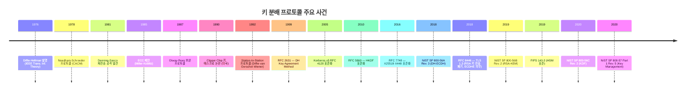
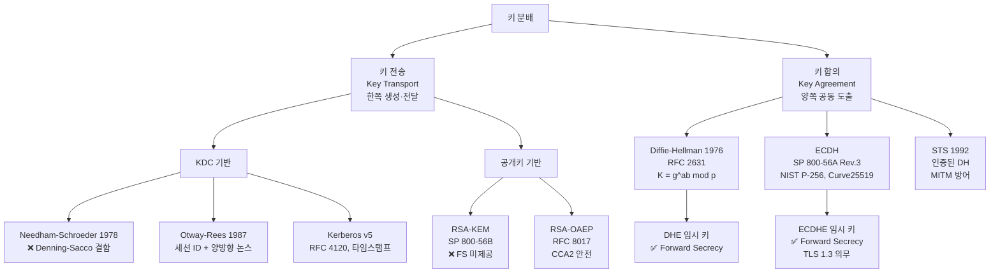
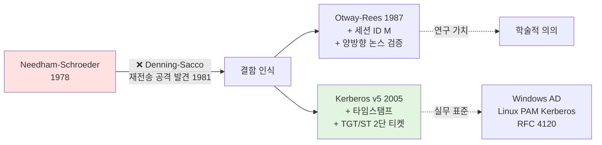
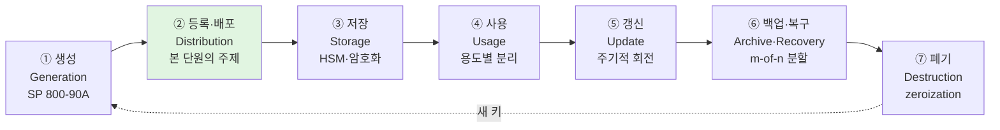

# 03. 키 분배 프로토콜 — 만화책처럼 읽는 키 교환의 역사

> **이 문서를 읽는 법**: 만화책처럼 *시간 순*으로 *에피소드*를 따라가면 *왜* 각 프로토콜이 등장했고 *왜* 깨졌는지 자연스럽게 외워집니다.
> 정확한 정의·수식·표준 번호는 정확본 참조: [[cs/information-security/04.security-general/03.key-distribution|정확본 03. 키 분배 프로토콜]]

> **연결 단원**: 본 단원의 *DH·ECDH 수학적 토대*는 [[cs/information-security/04.security-general/05.crypto-algorithms|정확본 05. 암호 알고리즘]] 의 §8 이산로그 / 본 단원의 *HMAC·KDF*는 [[cs/information-security/04.security-general/06.hash-and-mac|정확본 06. 해시함수와 MAC]] 의 §5·§7 / 본 단원의 *Kerberos·인증서 분배*는 [[cs/information-security/04.security-general/01.authentication|정확본 01. 인증]] 과 [[cs/information-security/04.security-general/04.digital-signature-pki|정확본 04. 디지털서명·PKI]] 와 연결.

---

## 🎯 시작 전에 — 이미 쓰고 있는 키 분배

| 매일 보는 것 | 사실은 이 단원의 |
|---|---|
| HTTPS 서버 접속 시 cipher suite `ECDHE-RSA-AES128-GCM-SHA256` 의 **ECDHE** | 본 단원의 ECDH Ephemeral 키 합의 |
| TLS 1.3 의 *서버 키 한 번 털려도 과거 통신은 안전하다* | **Forward Secrecy** (Perfect Forward Secrecy) |
| 회사 도메인 로그인 (SSO·AD) 의 백엔드 | **Kerberos v5** 키 분배 |
| AWS CloudHSM, YubiHSM | **HSM** (Hardware Security Module) |
| AWS KMS, Vault transit secrets engine | KDC 와 KDF 의 클라우드 구현 |
| 카페 공공 Wi-Fi 에서 HTTPS 가 *왜* 안전한가 | **인증된 DH** + **MITM 방어** |
| Signal·WhatsApp 의 종단간 암호화 | **DHE + Double Ratchet + HKDF** |
| `ssh-keygen -t ed25519` 의 키 파일 | 공개키 기반 분배 (X25519 키 합의) |

> **이 단원의 본질**: 05단원의 모든 알고리즘 (AES·RSA·ECC) 은 *"양쪽이 같은 키를 공유한다" 또는 "한쪽이 다른 쪽의 공개키를 안다"* 는 가정 위에서 동작한다. **그 가정을 어떻게 충족하는가**가 키 분배의 문제다. 키 분배가 실패하면 그 위의 모든 암호화가 무력화된다.

---

## 📖 에피소드 1 — 키 분배가 왜 어렵나

### 장면. N(N-1)/2 의 폭발

대칭키만 쓰는 세계를 상상해보자. 회사 직원 1,000명이 *서로* 통신하려면 — 한 쌍마다 비밀키 1개씩 → **N(N-1)/2 = 499,500개**.

100만 명 통신하면? **약 5천억 개**. 누가 이걸 다 관리하나?

→ 이 폭발 문제가 *모든 키 분배 발명의 동기*다.

### 두 가지 해결 패러다임

| 패러다임 | 영문 | 핵심 메커니즘 | 대표 사례 |
|---|---|---|---|
| **키 전송** | Key Transport | 한쪽이 키를 *생성*하고 다른 쪽에 *안전하게 전달* | RSA-KEM, RSA-OAEP, KDC 기반 분배 |
| **키 합의** | Key Agreement | 양쪽이 정보를 교환하여 *공통 비밀을 함께 도출* (어느 쪽도 단독 결정 안 함) | Diffie-Hellman, ECDH, MQV |

### 왜 이 구분이 중요한가

- **키 전송**: 한쪽(보통 송신자) 의 *난수 품질*에 키 전체 보안이 좌우
- **키 합의**: 양쪽 정보가 결합되어 키가 만들어지므로 *한쪽 단말이 약해도 다른 쪽이 보강*. 또한 **Forward Secrecy** (에피소드 9) 를 자연스럽게 제공 가능

### 시험 함정

- "N명 통신 시 대칭키 개수?" → **N(N−1)/2** (KDC 도입 시 N)
- "키 전송 vs 키 합의 차이?" → 단독 생성·전달 vs 공동 도출

---

## 📖 에피소드 2 — 키의 일생 7단계 (NIST SP 800-57)

### 장면. 키 관리는 "만들기" 가 아니라 "일생 관리"

> 키 관리의 한 단계라도 실패하면 — 예컨대 *폐기 단계에서 키가 디스크에 남아있다면* — 전체 시스템이 그 단일 실패 지점에서 무너진다.

### NIST SP 800-57 의 키 생명주기 7단계

| 단계 | 영문 | 핵심 |
|---|---|---|
| **생성** | Generation | NIST SP 800-90A·B·C 안전한 난수원 |
| **등록·배포** | Distribution | 정당한 주체에 전달 (**본 단원의 핵심 주제**) |
| **저장** | Storage | HSM·키링·암호화 저장 (무단 접근 차단) |
| **사용** | Usage | 정의된 용도로만 (암호화·서명·MAC *분리*) |
| **갱신** | Update | 노출 위험 완화를 위한 주기적 교체 |
| **백업·복구** | Archive·Recovery | 손실 대비 안전 백업 |
| **폐기** | Destruction | zeroization, 매체 파기 |

### 개발자 비유

- **생성** = `crypto.randomBytes(32)` 또는 `openssl rand -base64 32`
- **저장** = AWS Secrets Manager, HashiCorp Vault, `.env` (❌ 평문 위험)
- **사용 분리** = JWT signing key 와 encryption key 를 *다른 키*로 (실제로 자주 위반됨)
- **갱신** = key rotation, AWS KMS 자동 회전
- **폐기** = `shred -u file.key`, HSM zeroization

### 시험 함정

- "키 관리 7단계?" → **생성·배포·저장·사용·갱신·백업·폐기**
- "키 손실 대비?" → 백업 (m-of-n 분할 권장)
- "사용 단계의 원칙?" → 용도별 분리 (한 키로 암호화·서명·MAC 동시 사용 ❌)

---

## 📖 에피소드 3 — KDC 의 발상: "신뢰할 제3자에게 맡기자"

### 장면. 1,000명 → 500,000개 → 1,000개로 줄이기

KDC 가 등장하기 전: 1,000명 → 499,500개의 키 필요.
KDC 등장 후: KDC 와 각 사용자 사이에 *1개씩만* → **N개의 키**. 사용자 간 통신은 KDC 가 *그때그때* 발급한 *세션 키*로.

### KDC 정의

> **KDC (Key Distribution Center)**: 모든 사용자와 사전에 공유한 장기 비밀키를 보유하고, 두 사용자가 통신할 때 *단기 세션 키*를 발급해 주는 신뢰할 수 있는 제3자(TTP).

### 일반 흐름

```
1. Alice → KDC : "Bob 과 통신하고 싶음"
2. KDC → Alice : { 세션 키 K_S, Bob 용 티켓 [K_S]_K_B } 를 K_A 로 암호화
3. Alice → Bob  : Bob 용 티켓 [K_S]_K_B 전달
4. Alice ↔ Bob : K_S 로 암호화된 통신
```

### KDC 의 한계 — 중앙집중의 함정

| 한계 | 설명 |
|---|---|
| **단일 장애점 (SPOF)** | KDC 침해 시 *모든 사용자 키 노출* |
| **온라인 의존** | 매 통신 시작마다 KDC 와 통신 필요 |
| **확장성** | 한 KDC 가 처리 가능한 사용자 수 제한 |

### 개발자 비유

- KDC = SSO IdP (Auth0, Okta, Keycloak) — 모든 사용자가 *공통 신뢰점*
- 단일 장애점 = SSO 가 다운되면 모든 서비스 로그인 불가
- 온라인 의존 = 오프라인 환경에서는 KDC 모델 부적합

→ KDC 의 구체 구현이 **Kerberos** (에피소드 6).

---

## 📖 에피소드 4 — 1978년 → 1981년: Needham-Schroeder 의 등장과 결함

### 장면 1. 1978년, 케임브리지 — Needham 과 Schroeder

영국 케임브리지의 Roger Needham 과 미국의 Michael Schroeder 가 *KDC 기반 키 분배의 효시* 를 발표 (CACM 1978). 핵심 발상: KDC + **재전송 공격 방지를 위한 논스 (nonce, 1회용 난수)**.

### 프로토콜 흐름

```
A = Alice, B = Bob, S = KDC
K_AS, K_BS = 사전 공유 장기 키 (Alice·KDC, Bob·KDC)

1. A → S : A, B, N_A
2. S → A : { N_A, B, K_AB, { K_AB, A }_K_BS }_K_AS
3. A → B : { K_AB, A }_K_BS
4. B → A : { N_B }_K_AB
5. A → B : { N_B − 1 }_K_AB
```

- **N_A, N_B** = 각자 생성한 *논스* (재전송 방지)
- **K_AB** = KDC 가 발급한 세션 키
- 4·5 단계 = 양쪽이 K_AB 보유 *상호 확인*

### 장면 2. 1981년, Denning-Sacco 의 칼

**Dorothy Denning 과 Giovanni Sacco** (1981): "*단계 3 의 메시지에 시간 정보가 없다.*"

```
공격 시나리오:
공격자 M 이 어떤 경로로든 과거 세션의 K_AB 를 노출시킴
M 은 단계 3 메시지 { K_AB, A }_K_BS 를 *재전송*
Bob 은 정당한 K_BS 로 암호화된 메시지라 거부 못 함
→ Bob 은 "Alice 와 지금 새 세션 시작" 으로 착각, M 과 K_AB 로 통신
```

이게 **Denning-Sacco 재전송 공격**. 후속 모든 키 분배 프로토콜이 이 결함을 어떻게 해결하느냐의 영향을 받는다.

### 해결의 방향

| 방향 | 채택 프로토콜 |
|---|---|
| **타임스탬프** 도입 (메시지에 발급 시각 포함) | Kerberos |
| **세션 ID + 양방향 논스 검증** | Otway-Rees |

### 시험 함정

- "Needham-Schroeder 의 결함?" → **Denning-Sacco 재전송 공격** — 단계 3 메시지 신선도 정보 부재
- "어느 단계의 메시지가 문제?" → **단계 3** (`{K_AB, A}_K_BS`) — 타임스탬프 없음
- "후속 보완책 2가지?" → ① 타임스탬프 (Kerberos), ② 세션 ID + 양방향 논스 (Otway-Rees)

---

## 📖 에피소드 5 — 1987년: Otway-Rees 의 보완

### 장면. Otway 와 Rees 의 응답

영국 케임브리지의 David Otway 와 Owen Rees (ACM SIGOPS 1987): "*세션 ID M 을 도입하자. KDC 가 양쪽 논스를 함께 검증하면 재전송이 막힌다.*"

### 프로토콜 흐름

```
M = 세션 ID (모든 메시지에 포함)

1. A → B : M, A, B, { N_A, M, A, B }_K_AS
2. B → S : M, A, B, { N_A, M, A, B }_K_AS, { N_B, M, A, B }_K_BS
3. S → B : M, { N_A, K_AB }_K_AS, { N_B, K_AB }_K_BS
4. B → A : M, { N_A, K_AB }_K_AS
```

### 핵심 개선

| 개선 | 방법 |
|---|---|
| **세션 식별** | 모든 메시지에 같은 M → KDC 가 같은 세션 메시지 검증 |
| **양방향 논스 검증** | KDC 는 M·A·B 가 메시지 *외부와 내부에서 일치*하는지 확인 후 키 발급 |
| **각자 검증** | A·B 각자 자신의 논스 N_A·N_B 를 K_AB 와 함께 받아 KDC 응답이 *같은 세션*임 확인 |

### 시험 함정

- "Otway-Rees 의 N-S 보완책?" → **세션 ID(M)** + **양방향 논스 검증**
- "Otway-Rees 가 Needham-Schroeder 와 다른 점?" → 세션 ID 도입 + 양쪽 논스 모두 KDC 가 검증

---

## 📖 에피소드 6 — Kerberos v5: 키 분배의 결정판

### 장면. RFC 4120 (2005)

[[cs/information-security/04.security-general/01.authentication|정확본 01 단원 §5-2]] 에서 인증 프로토콜로 본 Kerberos v5 를 *키 분배 측면*에서 다시 보면 — **타임스탬프 + TGT/ST 2단 티켓 + 상호 인증**의 결정판.

### 프로토콜 진화 흐름

| 프로토콜 | 핵심 개선 | 도입 연도 |
|---|---|---|
| Needham-Schroeder | KDC + 논스 | 1978 |
| Otway-Rees | + 세션 ID + 양방향 논스 검증 | 1987 |
| **Kerberos v5** | + **타임스탬프** + **TGT/ST 2단 티켓** + **상호 인증** | RFC 4120 (2005) |

### Kerberos 의 핵심 — 타임스탬프 기반 신선도

타임스탬프(±5분 클럭 스큐 허용) 가 Needham-Schroeder 의 재전송 결함을 *근본적으로 해결*. 그러나 **시각 동기 NTP 의존** 이라는 새 운영 부담 도입 — NTP 자체가 공격 표적이 됨.

### 키 분배 관점의 3가지 핵심

```
1. TGT (Ticket Granting Ticket)  ← AS 가 발급, 사용자 인증
2. ST  (Service Ticket)           ← TGS 가 발급, 서비스 접근
3. 단기 세션 키 분리:
   - K_C-TGS (AS 발급, Client ↔ TGS)
   - K_C-S   (TGS 발급, Client ↔ Service)
```

### 개발자 비유

- Windows AD 도메인 로그인 = Kerberos
- `kinit` 으로 받은 TGT = `klist` 명령으로 확인 가능
- NTP 동기 안 맞으면 *"clock skew too great"* 에러 (실제 빈번)

### 시험 함정

- "Kerberos 의 N-S 보완책?" → **타임스탬프** + TGT/ST 2단 티켓
- "Kerberos 키 분배의 3가지 핵심?" → ① TGT/ST 2단 티켓, ② K_C-TGS·K_C-S 단기 세션 키 분리, ③ 타임스탬프 기반 재전송 방지
- "Kerberos 의 새 운영 부담?" → **NTP 시각 동기 의존**

---

## 📖 에피소드 7 — 1976년, 인류 사상 최고의 발명: Diffie-Hellman

### 장면. 스탠포드, 두 수학자의 충격

**Whitfield Diffie 와 Martin Hellman** 이 *IEEE Transactions on Information Theory* 에 발표 (1976): **"두 사람이 *공개된 채널*에서 정보를 주고받기만 해도 *공통 비밀 키*를 만들 수 있다."**

수학자들도 충격: "이게 가능하다고?" → **공개키 암호의 효시**.

### 수학적 토대 — 이산로그 문제의 어려움

> 큰 소수 p, 생성자 g 가 공개되어 있을 때 g^a mod p 를 알아도 *a 를 계산하기 어렵다*.

### 프로토콜 흐름

```
공개 매개변수 (사전 합의): p (큰 소수), g (Z_p* 의 생성자)

Alice                                Bob
─────                                ───
a ← random (개인키)                  b ← random (개인키)
A = g^a mod p (공개키)     ──A──>
                            <──B──   B = g^b mod p (공개키)
K = B^a mod p                        K = A^b mod p
   = g^(ab) mod p                       = g^(ab) mod p

→ 양쪽이 동일한 공유 비밀 K = g^(ab) mod p 도출
```

### 왜 마법인가

- 공격자 Eve 가 채널을 도청해 *p, g, A=g^a, B=g^b 를 다 봐도* — K = g^(ab) 를 *계산할 수 없다* (이산로그 어려움)
- Alice 는 *b* 를 모르고도 K 도출 (자신의 a 와 받은 B 만으로)

### 보안 가정

| 가정 | 의미 |
|---|---|
| **CDH** (Computational Diffie-Hellman) | g, g^a, g^b 가 주어졌을 때 g^(ab) 계산 어려움 |
| **DDH** (Decisional Diffie-Hellman) | g^(ab) 가 임의 g^c 와 구분 어려움 (KDF 결합 시 필요) |

### 권장 매개변수 — NIST SP 800-56A Rev. 3

- 안전 소수 p 길이: **2048 bit 이상** (현재 권장)
- p, g 는 **RFC 3526 표준 그룹** 또는 FIPS 186-5 부록의 검증된 매개변수 사용

### 개발자 비유

- TLS 1.3 의 cipher suite `TLS_AES_128_GCM_SHA256` 의 *키 합의 기본값*이 ECDHE (DH 의 ECC 변형, 에피소드 8)
- Signal Protocol 의 X3DH = X25519(ECDH) 3회 결합

### 시험 함정

- "DH 의 공유 비밀?" → K = **g^(ab) mod p**
- "DH 의 보안 가정?" → **CDH (Computational Diffie-Hellman)** — 이산로그 어려움
- "DH 권장 키 길이?" → **2048 bit 이상** (NIST SP 800-56A Rev. 3)

---

## 📖 에피소드 8 — ECDH: 더 짧은 키로 같은 안전

### 장면. DH 의 곱셈 군을 타원곡선 군으로

> **ECDH (Elliptic Curve Diffie-Hellman)**: DH 의 곱셈 군 (Z_p*) 을 타원곡선 군 (E(F_p)) 으로 대체한 변형. NIST SP 800-56A Rev. 3 가 표준화.

수학적 토대: **타원곡선 이산로그 문제 (ECDLP)** — 일반 이산로그보다 어렵다 → 짧은 키로 같은 안전.

### 보안 강도별 키 길이 (NIST SP 800-57 Part 1 Rev. 5)

| 보안 (대칭 기준) | RSA / DH | ECC |
|---|---|---|
| 80 bit | 1024 | 160 |
| 112 bit | 2048 | 224 |
| **128 bit** | **3072** | **256** |
| 192 bit | 7680 | 384 |
| 256 bit | 15360 | 512 |

### 권장 곡선

| 곡선 | 표준 | 응용 |
|---|---|---|
| **NIST P-256** (secp256r1) | FIPS 186-5 | TLS, 일반 |
| NIST P-384 | FIPS 186-5 | 정부 고보안 |
| NIST P-521 | FIPS 186-5 | 최고 보안 |
| **Curve25519** | RFC 7748 | **TLS 1.3, Signal, SSH** (X25519 키 합의) |
| Curve448 | RFC 7748 | 더 높은 보안 강도 (X448 키 합의) |

### 프로토콜 흐름

```
공개 매개변수: 타원곡선 E, 베이스 포인트 G, 곡선 위수 n

Alice                                Bob
─────                                ───
a ← random (1 ≤ a < n)              b ← random (1 ≤ b < n)
A = a·G (점 곱셈)          ──A──>
                            <──B──   B = b·G
K = a·B = (a·b)·G                   K = b·A = (a·b)·G

→ 공유 비밀 K 의 x 좌표를 KDF 입력으로 사용
```

### 개발자 비유

- `openssl s_client -connect` 출력의 cipher suite 끝 `ECDHE` 가 본 단원
- WireGuard VPN = X25519 (Curve25519) 키 합의 + ChaCha20-Poly1305

### 시험 함정

- "ECDH 256 bit 키 = 몇 bit RSA?" → **3072 bit RSA** (128 bit 대칭 보안)
- "TLS 1.3 의 기본 키 합의?" → ECDHE (Curve25519 또는 NIST P-256)

---

## 📖 에피소드 9 — Forward Secrecy: "과거를 지키는 약속"

### 장면. 만약 서버 키가 털리면?

전통적 RSA 키 전송 시나리오:
```
공격자가 *수년간* TLS 트래픽을 저장만 해 둠
어느 날 서버의 RSA 개인키가 노출됨
→ 저장해둔 *모든 과거 세션이 한꺼번에 복호화됨*
```

이 악몽을 막는 보안 속성이 **Forward Secrecy**.

### 정의

> **Forward Secrecy (FS / PFS, 순방향 비밀성)**: 장기 비밀키가 *사후*에 노출되어도 이전에 수행한 통신의 비밀성이 보장되는 보안 속성.

### DHE / ECDHE — 매 세션 임시 키

DH·ECDH 는 매 세션마다 *새로운 임시(ephemeral) 키쌍*을 생성하면 — DH**E** (DH Ephemeral) · ECD**H**E (ECDH Ephemeral) — 세션 키 K = g^(ab) 는 *세션 종료 후 폐기*되며 장기 키와 무관.

| 키 합의 모드 | 키 수명 | Forward Secrecy |
|---|---|---|
| DH·ECDH (정적) | 장기 (인증서에 고정) | ❌ 장기 키 노출 시 모든 과거 세션 노출 |
| **DHE·ECDHE** (임시) | 세션마다 새로 | ✅ 임시 키는 세션 종료 후 폐기 |

### TLS 1.3 의 결정 (RFC 8446)

> **TLS 1.3 은 모든 키 합의를 (EC)DHE 로만 허용** — RSA 키 전송은 *폐기*. Forward Secrecy 가 사실상 *의무화*.

### 개발자 비유

- TLS 1.2 cipher suite `TLS_RSA_WITH_AES_128_GCM_SHA256` = *RSA 키 전송*, FS ❌
- TLS 1.2 cipher suite `TLS_ECDHE_RSA_WITH_AES_128_GCM_SHA256` = ECDHE, FS ✅
- TLS 1.3 cipher suite `TLS_AES_128_GCM_SHA256` = *항상 ECDHE*, FS 의무

### 시험 함정

- "Forward Secrecy 제공 키 합의?" → **DHE·ECDHE** (임시 키). 정적 DH·RSA 키 전송 ❌
- "TLS 1.3 가 폐기한 키 교환?" → **RSA 키 전송**. FS 미제공이 주된 이유
- "PFS = Perfect Forward Secrecy" → FS 의 동의어

---

## 📖 에피소드 10 — DH 의 약점: MITM 의 위협과 STS

### 장면. DH 단독은 *인증되지 않았다*

DH·ECDH 의 치명적 약점: **MITM (Man-in-the-Middle) 공격**.

```
Alice ────────── (공격자 M 이 끼어듦) ────────── Bob

M 이 Alice 와는 K1 = g^(am) DH 합의
M 이 Bob 과는    K2 = g^(mb) DH 합의

→ Alice 는 "Bob 과 통신" 으로 착각 (사실은 M)
→ Bob 은   "Alice 와 통신" 으로 착각 (사실은 M)
→ M 은 K1·K2 둘 다 알고 있음 → 모든 트래픽 가운데서 보고 변조 가능
```

### 해결책 — *인증된 DH*

DH 매개변수 교환 시 **서명·MAC·PKI 인증서**로 출처를 인증 → TLS, SSH, IKEv2 가 모두 이 방식.

### 1992년, Station-to-Station (STS) 프로토콜

**Diffie · van Oorschot · Wiener** (1992) 가 제안한 *인증된 DH의 표준적 형태*.

```
Cert_A·Cert_B = 사전 발급된 X.509 인증서
Sig_A·Sig_B = 각자의 개인키 서명

1. A → B : g^a
2. B → A : g^b, Cert_B, Sig_B(g^b, g^a)
3. A → B : Cert_A, Sig_A(g^a, g^b)
   (양쪽이 K = g^(ab) 도출 후 MAC 으로 핸드셰이크 검증)
```

### STS 가 MITM 을 막는 원리

서명에 `g^a`·`g^b` *둘 다* 포함 → MITM 이 자신의 g^m 을 끼워넣어도 *정당한 서명을 만들 수 없다* (자기 인증서의 개인키로는 *다른 사람이 보낸 g^a* 에 대한 서명 위조 불가).

### 개발자 비유

- 카페 공공 Wi-Fi 에서 HTTPS 가 안전한 이유 = *인증된 ECDHE* (서버 인증서 검증)
- 자체 서명 인증서 경고를 무시하면 → MITM 위험

### 시험 함정

- "DH 의 MITM 방어?" → **인증된 DH** (STS, TLS, SSH, IKEv2) — 서명·MAC 으로 출처 인증
- "STS 의 핵심?" → 서명에 **양쪽 공개값 (g^a, g^b)** 모두 포함

---

## 📖 에피소드 11 — RSA 키 전송: 옛 표준의 황혼

### 장면. RSA-KEM 의 동작

> **RSA-KEM (Key Encapsulation Mechanism)**: 송신자가 임의 정수 z 를 RSA 로 암호화해 전송, 수신자가 z 를 복호화 후 KDF(z) 로 세션 키 도출. NIST SP 800-56B Rev. 2.

### 흐름

```
1. 송신자 Alice :
   - z ← random
   - c = z^e mod n   (수신자 Bob 의 공개키 (n, e) 로 암호화)
   - K = KDF(z)
   - c 를 Bob 에게 전송
2. 수신자 Bob :
   - z = c^d mod n   (자신의 개인키 d 로 복호화)
   - K = KDF(z)
3. 양쪽이 동일한 K 보유
```

### RSA-OAEP — RSA 암호의 패딩

> **RSA-OAEP (Optimal Asymmetric Encryption Padding)**: RSA 암호문에 OAEP 패딩 적용해 안전성 강화. RFC 8017 (PKCS#1 v2.2) 표준. CCA2 안전성 증명.

### RSA-KEM vs DH·ECDH 비교

| 측면 | RSA-KEM | DH·ECDH |
|---|---|---|
| 키 생성 주체 | **송신자 단독** | **양쪽 공동** |
| Forward Secrecy | ❌ | ✅ (DHE·ECDHE 로) |
| 계산 비용 | RSA 단방향 (송신자만 암호화) | 양쪽 모두 지수승 |
| TLS 1.3 사용 | ❌ **폐기** | ✅ 의무 |

### TLS 1.3 의 결정적 폐기 이유

> RSA 키 전송 = 한쪽(서버)의 *장기 키*가 세션 키를 결정 → 그 장기 키가 *언젠가* 노출되면 *모든 과거 세션이 복호화됨*. → Forward Secrecy 본질적 불가능. → TLS 1.3 가 **완전히 폐기**.

### 개발자 비유

- TLS 1.2 의 옛 cipher `TLS_RSA_WITH_AES_128_CBC_SHA` = RSA 키 전송 → 현대 보안 권장에서 *제외*
- TLS 1.3 cipher suite 명에는 *키 교환 표시 자체가 없음* (항상 ECDHE 라 생략)

### 시험 함정

- "RSA 키 전송의 본질적 약점?" → **Forward Secrecy 미제공**
- "TLS 1.3 가 RSA 키 전송 폐기 이유?" → 위와 같음
- "RSA-KEM vs RSA-OAEP?" → KEM = 키 캡슐화 메커니즘, OAEP = 안전성 강화 패딩 (RFC 8017)

---

## 📖 에피소드 12 — KDF: 원시 비밀에서 실제 키로

### 장면. DH 출력은 *그대로 쓰면 안 된다*

DH 출력 g^(ab) mod p 의 비트는 *균일 분포가 아니다*. 그대로 AES 키로 쓰면 일부 키 공간으로 *편향*된다 → 보안 약화.

### KDF 의 정의

> **KDF (Key Derivation Function)**: 키 합의·전송으로 얻은 *원시 비밀*을 암호 알고리즘에 사용 가능한 *실제 키*로 변환하는 함수. NIST SP 800-56C Rev. 2 표준.

### KDF 가 동시에 수행하는 3가지 기능

| 기능 | 의미 |
|---|---|
| **랜덤성 추출** | 비균일 비밀 → 균일 랜덤 키 추출 |
| **키 분리** | 동일 비밀에서 *암호화 키·MAC 키·IV* 등을 분리 도출 |
| **키 신선도** | 컨텍스트(세션 ID·타임스탬프) 입력에 포함 → 같은 비밀에서 다른 키 |

### 대표 KDF

| KDF | 표준 | 사용처 |
|---|---|---|
| **HKDF** | RFC 5869 | TLS 1.3, Signal Protocol |
| **NIST SP 800-108** | NIST SP 800-108 | KMAC·HMAC·CMAC 기반 |
| **PBKDF2** | NIST SP 800-132 | 패스워드 기반 (06단원 §7) |

### 개발자 비유

- TLS 1.3 의 모든 키 (handshake key, application key) = *HKDF* 로 도출
- Signal Protocol 의 Double Ratchet = HKDF 를 *세션마다* 새로 호출
- AWS KMS 의 envelope encryption = *데이터 키* 를 KDF 로 도출

### 시험 함정

- "KDF 가 필요한 이유?" → DH 출력의 **비균일 분포** → 균일 랜덤 키 추출 + 키 분리
- "TLS 1.3·Signal 의 KDF?" → **HKDF** (RFC 5869, HMAC 기반)

---

## 📖 에피소드 13 — 키 보호 인프라: HSM·백업·에스크로

### 장면 1. HSM — 키를 *물리적으로* 가두다

> **HSM (Hardware Security Module)**: 암호 키의 생성·저장·연산을 수행하는 *전용 하드웨어*. 키가 평문으로 외부에 노출되지 않도록 물리적·논리적 보호.

### HSM 의 핵심 보안 속성

| 속성 | 설명 |
|---|---|
| **키 무반출** | 키는 HSM 내부에서만 생성·사용. *평문으로 외부 전달 불가* |
| **물리적 변조 방지** | 외부 침입 탐지 시 *자가 파괴* (zeroization) |
| **FIPS 140 검증** | NIST FIPS 140-2 / 140-3 인증을 받은 HSM 만 정부·금융 환경 사용 허용 |

### 활용처

- CA 의 루트 키 보호 (가장 중요한 키)
- 금융 결제 시스템의 마스터 키
- 클라우드 KMS 의 신뢰 루트 (AWS CloudHSM, Azure Dedicated HSM, GCP Cloud HSM)

### 장면 2. 키 백업 vs 키 에스크로 — *완전히 다른 개념*

| 개념 | 누가 보관? | 목적 | 사례 |
|---|---|---|---|
| **키 백업** | 키 *소유자 자신* | 키 손실 대비 (m-of-n 분할 권장) | HSM 의 보호된 환경에서 분할 백업 |
| **키 에스크로** | *제3자* (정부·법 집행 기관) | 필요 시 정부가 키 복구 | 1990년대 미국 **Clipper Chip** (큰 논란) |

### 개발자 비유

- HSM = AWS CloudHSM, YubiHSM, Thales Luna
- 키 백업 = AWS KMS 의 키 backup·multi-region
- 키 에스크로 = 1990년대 미국 Clipper Chip 사례 (정확본 §5-2 명시)

### 시험 함정

- "HSM 의 핵심 속성?" → **키 무반출** + 물리적 변조 방지 + FIPS 140 인증
- "키 백업 vs 키 에스크로?" → 백업 = **소유자 자신**의 손실 대비 / 에스크로 = **제3자(정부)**가 복구 권한 보유

---

## 📑 키 분배 프로토콜 종합 비교 (에피소드 3~11 정리)

시험 직전 *한눈에* 보는 view. 종류·연도·보안 토대·Forward Secrecy 가 모두 들어 있다.

| 프로토콜 | 종류 | 연도·표준 | 보안 토대 | Forward Secrecy | TLS 1.3 |
|---|---|---|---|---|---|
| **KDC** | 대칭키·신뢰 제3자 | 일반 발상 | 사전 공유 장기 키 | ❌ | — |
| **Needham-Schroeder** | 대칭키·KDC | 1978 CACM | 사전 공유 + 논스 | ❌ | — |
| **Otway-Rees** | 대칭키·KDC | 1987 SIGOPS | + 세션 ID + 양방향 논스 | ❌ | — |
| **Kerberos v5** | 대칭키·KDC | RFC 4120 (2005) | + 타임스탬프 + TGT/ST | ❌ | — |
| **Diffie-Hellman** | 공개키·합의 | 1976 IEEE | 이산로그 (CDH) | 정적 ❌ / DHE ✅ | — |
| **ECDH** | 공개키·합의 | SP 800-56A Rev. 3 | 타원곡선 이산로그 (ECDLP) | 정적 ❌ / **ECDHE ✅** | **의무** |
| **STS** | 공개키·합의 (인증) | 1992 | 인증된 DH (서명) | DHE 사용 시 ✅ | TLS 의 토대 |
| **RSA-KEM** | 공개키·전송 | SP 800-56B Rev. 2 | 인수분해 (FACT) | ❌ | **폐기** |
| **RSA-OAEP** | 공개키·전송 | RFC 8017 | 인수분해 + OAEP | ❌ | **폐기** |

### 핵심 관찰 패턴

1. **대칭키 KDC 계열** (N-S → OR → Kerberos): *재전송 공격 결함 (Denning-Sacco 1981)* 에 *서로 다른 방식*으로 응답
2. **공개키 계열의 본질 차이**: *합의*는 양쪽 공동 도출 (FS 가능), *전송*은 한쪽 단독 (FS 불가)
3. **TLS 1.3 의 결단** (RFC 8446, 2018): *Forward Secrecy 의무화* → RSA 키 전송 폐기, ECDHE 의무
4. **ECDHE 가 현대 표준**: HW 가속·짧은 키·FS 모두 만족

---

## 🗺️ 마인드맵 1 — 시간선



**읽는 법**: 키 분배 역사는 *공격에 대한 응답*. Otway-Rees 가 1987 에 나온 이유 = 1981 Denning-Sacco 결함. STS 가 1992 에 나온 이유 = DH 의 MITM 약점. TLS 1.3 가 2018 에 RSA 키 전송을 폐기한 이유 = Forward Secrecy 의무화.

---

## 🗺️ 마인드맵 2 — 분류 트리



---

## 🗺️ 마인드맵 3 — 키 합의 vs 키 전송 결정 트리

```mermaid
graph TD
  Q[양방향 키 공유가 필요하다] --> Q1{Forward Secrecy 필요?}
  Q1 -- 필요 ✅ --> KA[키 합의<br/>임시 키 사용]
  Q1 -- 불필요 --> Q2{공개키 사용 가능?}

  KA --> Q3{환경?}
  Q3 -- 일반 --> ECDHE[ECDHE<br/>NIST P-256]
  Q3 -- 모바일·고성능 --> X25[X25519<br/>Curve25519]
  Q3 -- DH 호환 --> DHE[DHE<br/>2048+ bit]

  Q2 -- 예 --> KT2[키 전송 - 공개키]
  Q2 -- 아니오 (사전 공유 비밀) --> KT1[키 전송 - KDC]

  KT2 --> ROAEP[RSA-OAEP<br/>RFC 8017]
  KT1 --> KER[Kerberos v5<br/>RFC 4120]

  Q --> Q4{사전 공유 비밀이 있고 KDC 운영 가능?}
  Q4 -- 예 --> KER

  Q --> Q5{인증서 기반 MITM 방어 필요?}
  Q5 -- 예 --> STS[STS / 인증된 DH<br/>TLS·SSH·IKEv2]

  Q --> NO1{RSA 키 전송?}
  NO1 -.TLS 1.3 폐기.-> X[❌ FS 미제공]
```

**읽는 법**: 위에서부터 *질문에 답해 내려가면* 정답 메커니즘이 나온다. RSA 키 전송은 *어떤 경로로도 권장에 도달 안 됨* — 시각적 폐기.

---

## 🗺️ 마인드맵 4 — 프로토콜 진화 (대칭키 KDC 계열)



**읽는 법**: 두 후속 프로토콜(OR·Kerberos) 이 *동일한 원인 (Denning-Sacco)* 에 *다른 방식*으로 응답. Otway-Rees 는 학술적 의의, Kerberos 는 실무 표준.

---

## 🗺️ 마인드맵 5 — 키 생명주기 7단계



**읽는 법**: 키는 *순환*한다 — 폐기 후 새 키 생성. 본 단원은 ②(배포) 가 핵심이지만 *7단계 모두*가 시험 출제 범위.

---

## 🗂️ 키워드 클러스터

### NIST 표준 (키 관리·키 합의 시리즈)

```
SP 800-57 Part 1 Rev. 5 — Key Management (생명주기·강도표)
SP 800-56A Rev. 3       — DH · ECDH (이산로그 기반 키 합의)
SP 800-56B Rev. 2       — RSA-KEM (인수분해 기반 키 전송)
SP 800-56C Rev. 2       — KDF (키 합의 후 키 도출)
SP 800-90A Rev. 1       — RNG (난수 생성)
SP 800-108              — KDF (KMAC·HMAC·CMAC 기반)
SP 800-132              — PBKDF2 (패스워드 기반 KDF, 06단원)
FIPS 140-3              — HSM 보안 요구사항
FIPS 186-5              — DSS (DSA·ECDSA·EdDSA, 04단원)
```

### IETF RFC

```
RFC 2631 — Diffie-Hellman Key Agreement Method
RFC 3526 — DH 표준 그룹 (More MODP DH groups for IKE)
RFC 4120 — Kerberos v5
RFC 5869 — HKDF
RFC 7748 — X25519·X448 (Curve25519·Curve448)
RFC 8017 — PKCS#1 v2.2 (RSA-OAEP)
RFC 8446 — TLS 1.3
```

### 학술 원논문

```
Diffie & Hellman 1976                    — IEEE Trans. Inf. Theory (DH 발명)
Needham & Schroeder 1978                 — CACM (KDC 효시)
Denning & Sacco 1981                     — N-S 결함 발견
Miller·Koblitz 1985                      — ECC 동시 제안
Otway & Rees 1987                        — ACM SIGOPS (보완 프로토콜)
Diffie·van Oorschot·Wiener 1992          — STS (인증된 DH)
```

### 헷갈리는 짝 (시험 1순위)

| 짝 | 차이 |
|---|---|
| 키 전송 ↔ 키 합의 | 한쪽 단독 생성·전달 ↔ 양쪽 공동 도출 |
| KDC ↔ PKI | 사전 공유 *대칭* 키 기반 ↔ *공개* 키 인증서 기반 |
| Needham-Schroeder ↔ Otway-Rees | 논스만 ↔ 세션 ID + 양방향 논스 검증 |
| Otway-Rees ↔ Kerberos | 세션 ID ↔ 타임스탬프 |
| DH ↔ DHE | 정적 키 ↔ 임시 키 (FS 차이) |
| ECDH ↔ ECDHE | 정적 키 ↔ 임시 키 (FS 차이) |
| RSA-KEM ↔ DH | 키 전송 (FS ❌) ↔ 키 합의 (FS ✅) |
| 키 백업 ↔ 키 에스크로 | 소유자 자신 ↔ 제3자 (정부) |

---

## 🃏 회상 30문항

> 답을 가린 뒤 자가 채점.

**A. 개요·생명주기 (1~6)**
1. N명 통신 시 대칭키 개수? KDC 도입 시는?
2. 키 전송과 키 합의의 차이?
3. 키 관리 7단계는?
4. 키 사용 단계의 핵심 원칙?
5. 키 분배 패러다임 두 가지의 대표 알고리즘 각 2개?
6. KDC 의 3가지 한계?

**B. 대칭키 분배 (7~12)**
7. KDC 의 일반 흐름 4단계?
8. Needham-Schroeder 의 결함 이름과 발견자·연도?
9. 결함이 있는 메시지 단계 번호와 그 메시지?
10. Otway-Rees 의 핵심 개선 2가지?
11. Kerberos 의 키 분배 측면 핵심 3가지?
12. Kerberos 의 새 운영 부담?

**C. 공개키 분배 (13~21)**
13. DH 의 발견 연도·발표지·발명자?
14. DH 의 공유 비밀 수식?
15. DH 의 보안 가정 2가지?
16. DH 권장 키 길이?
17. 128 bit 보안에 필요한 ECC 키 길이?
18. ECDH 의 권장 곡선 3가지?
19. Forward Secrecy 의 정의?
20. (EC)DHE 가 제공하는 것?
21. TLS 1.3 가 폐기한 키 교환 방식과 그 이유?

**D. MITM·STS·RSA 키 전송 (22~25)**
22. DH 의 MITM 공격 시나리오?
23. STS 의 발표 연도·발명자?
24. STS 가 MITM 을 막는 핵심 원리?
25. RSA-KEM 과 DH·ECDH 의 4가지 차이?

**E. KDF·인프라 (26~30)**
26. KDF 가 필요한 3가지 이유?
27. TLS 1.3·Signal 의 KDF 표준 이름과 RFC 번호?
28. HSM 의 3가지 핵심 보안 속성?
29. HSM 사용을 의무화하는 표준?
30. 키 백업과 키 에스크로의 본질적 차이?

---

## ⚠️ 시험 함정 모음

| 함정 | 정답 |
|---|---|
| N명 대칭키? | N(N−1)/2. KDC 도입 시 N |
| 키 분배 두 패러다임? | 키 전송(단독·전달) / 키 합의(공동·도출) |
| 키 생명주기 7단계? | 생성·등록·저장·사용·갱신·백업·폐기 |
| Needham-Schroeder 결함? | **Denning-Sacco 재전송 공격** (1981) — 단계 3 신선도 부재 |
| Otway-Rees 보완? | **세션 ID(M)** + KDC 양방향 논스 검증 |
| Kerberos 보완? | **타임스탬프** + TGT/ST 2단 티켓 (NTP 의존 도입) |
| DH 공유 비밀? | K = **g^(ab) mod p** |
| DH 보안 가정? | **CDH** (Computational Diffie-Hellman) — 이산로그 어려움 |
| DH 권장 키 길이? | 2048 bit 이상 (NIST SP 800-56A Rev. 3) |
| ECDH 256 bit ↔ RSA? | **3072 bit** (NIST SP 800-57) |
| Forward Secrecy 제공? | **DHE·ECDHE** (임시 키). 정적 DH·RSA 키 전송 ❌ |
| TLS 1.3 폐기 키 교환? | **RSA 키 전송**. FS 미제공 |
| DH MITM 방어? | **인증된 DH** (STS·TLS·SSH·IKEv2) — 서명·MAC |
| STS 핵심 원리? | 서명에 **양쪽 공개값(g^a, g^b)** 모두 포함 |
| RSA-KEM 약점? | Forward Secrecy 미제공 |
| KDF 가 필요한 이유? | DH 출력 **비균일 분포** → 균일 추출 + 키 분리 + 신선도 |
| TLS 1.3·Signal KDF? | **HKDF** (RFC 5869) |
| HSM 핵심 속성? | **키 무반출** + 변조 방지 + FIPS 140 인증 |
| HSM 표준? | **FIPS 140-2/140-3** (정부·금융 의무) |
| 키 백업 vs 에스크로? | 백업 = **소유자**의 손실 대비 / 에스크로 = **제3자(정부)**가 복구 권한 |

---

## 🔗 정확본 매핑표

| 본 노트 에피소드 | 정확본 § |
|---|---|
| 에피소드 1 (N(N-1)/2 + 두 패러다임) | [[cs/information-security/04.security-general/03.key-distribution#§1-2. 키 분배의 두 패러다임\|정확본 §1-2]] |
| 에피소드 2 (생명주기 7단계) | [[cs/information-security/04.security-general/03.key-distribution#§1-1. 키 관리 생명주기\|정확본 §1-1]] |
| 에피소드 3 (KDC) | [[cs/information-security/04.security-general/03.key-distribution#§2-1. KDC — Key Distribution Center\|정확본 §2-1]] |
| 에피소드 4 (Needham-Schroeder + Denning-Sacco) | [[cs/information-security/04.security-general/03.key-distribution#§2-2. Needham-Schroeder 대칭키 프로토콜\|정확본 §2-2]] |
| 에피소드 5 (Otway-Rees) | [[cs/information-security/04.security-general/03.key-distribution#§2-3. Otway-Rees 프로토콜\|정확본 §2-3]] |
| 에피소드 6 (Kerberos 키 분배) | [[cs/information-security/04.security-general/03.key-distribution#§2-4. Kerberos 키 분배 측면\|정확본 §2-4]] |
| 에피소드 7 (Diffie-Hellman) | [[cs/information-security/04.security-general/03.key-distribution#§3-2. Diffie-Hellman 키 합의 — RFC 2631\|정확본 §3-2]] |
| 에피소드 8 (ECDH) | [[cs/information-security/04.security-general/03.key-distribution#§3-3. ECDH — 타원곡선 디피-헬만\|정확본 §3-3]] |
| 에피소드 9 (Forward Secrecy + DHE/ECDHE) | [[cs/information-security/04.security-general/03.key-distribution#§3-4. Forward Secrecy 와 DHE/ECDHE\|정확본 §3-4]] |
| 에피소드 10 (MITM + STS) | [[cs/information-security/04.security-general/03.key-distribution#§3-5. MITM 방어 — 인증된 DH 와 STS\|정확본 §3-5]] |
| 에피소드 11 (RSA-KEM·RSA-OAEP) | [[cs/information-security/04.security-general/03.key-distribution#§3-6. RSA 기반 키 캡슐화 — RSA-KEM·RSA-OAEP\|정확본 §3-6]] |
| 에피소드 12 (KDF) | [[cs/information-security/04.security-general/03.key-distribution#§4. 키 도출 함수 (KDF)\|정확본 §4]] |
| 에피소드 13 (HSM·백업·에스크로) | [[cs/information-security/04.security-general/03.key-distribution#§5. 키 보호 인프라\|정확본 §5]] |

---

## 📅 학습 흐름

```
[1주]   에피소드 1·2 (개요·생명주기) — 마인드맵 5 함께
[2주]   에피소드 3·4·5·6 (대칭키 KDC 계열) — 마인드맵 4 진화 흐름
[3주]   에피소드 7·8 (DH·ECDH) — 마인드맵 1 시간선
[4주]   에피소드 9·10 (Forward Secrecy·STS) — 마인드맵 3 결정 트리
[5주]   에피소드 11·12 (RSA 키 전송·KDF)
[6주]   에피소드 13 (HSM·백업·에스크로) + 마인드맵 2 분류 트리
[7주]   회상 30문항 → 틀린 것만 정확본 깊이 학습
[8주]   함정 모음 매일 1회 + 정확본 1회 정독
[9주]   05·06·03 통합 — 이산로그(05 §8) ↔ DH(03 §3) 연결 / HMAC(06 §5) ↔ HKDF(03 §4) 연결 / Kerberos(01 §5) ↔ 키 분배(03 §2-4) 연결
```

---

> **다음 단원**: [[cs/information-security/04.security-general/04.digital-signature-pki|04. 디지털서명·PKI]] — 본 단원의 *공개키 분배 신뢰 인프라* (PKI) 와 *인증서 기반 STS* 가 04 단원의 X.509·CRL·OCSP 와 직접 연결.
