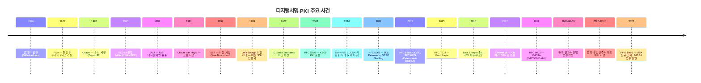
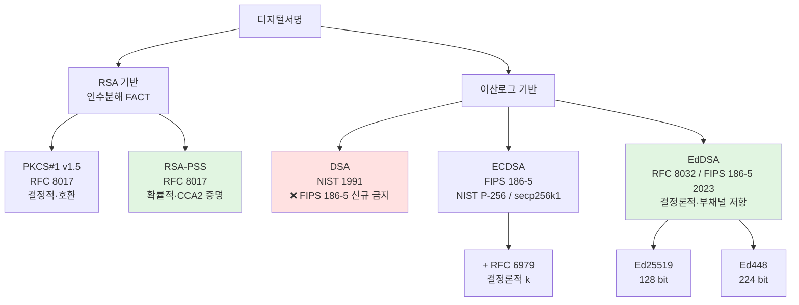
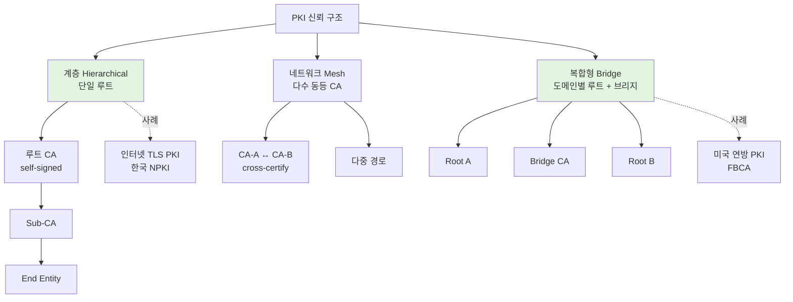
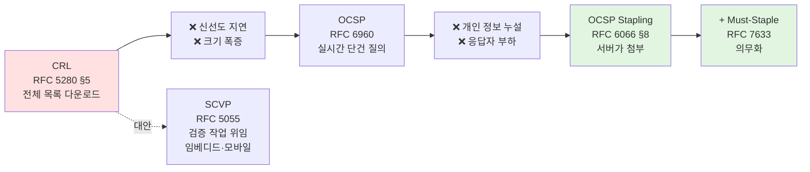
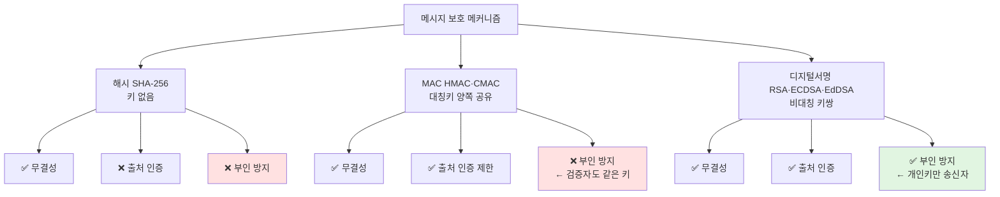

# 04. 디지털서명과 PKI — 만화책처럼 읽는 신뢰의 인프라

> **이 문서를 읽는 법**: 만화책처럼 *시간 순*으로 *에피소드*를 따라가면 *왜* 각 알고리즘·표준이 등장했고 *왜* 폐기되었는지 자연스럽게 외워집니다.
> 정확한 정의·수식·표준 번호는 정확본 참조: [[cs/information-security/04.security-general/04.digital-signature-pki|정확본 04. 디지털서명과 PKI]]

> **연결 단원**: 본 단원의 *RSA·ECDSA·EdDSA 수학적 토대*는 [[cs/information-security/04.security-general/05.crypto-algorithms|정확본 05. 암호 알고리즘]] §7·§8 / *해시함수*는 [[cs/information-security/04.security-general/06.hash-and-mac|정확본 06. 해시함수와 MAC]] §3 / *키 분배의 MITM 방어가 PKI 와 직결*은 [[cs/information-security/04.security-general/03.key-distribution|정확본 03. 키 분배 프로토콜]] §3-5 / *MAC 과 디지털서명 비교의 도입*은 [[cs/information-security/04.security-general/01.authentication|정확본 01. 인증]] §6.

---

## 🎯 시작 전에 — 이미 쓰고 있는 디지털서명·PKI

| 매일 보는 것 | 사실은 이 단원의 |
|---|---|
| HTTPS 주소창 자물쇠 클릭 → "인증서 보기" | **X.509 v3 인증서** |
| `openssl x509 -text -noout -in cert.pem` | X.509 인증서 구조 |
| 와일드카드 인증서 `*.example.com` | **SAN (Subject Alternative Name)** 확장 |
| Let's Encrypt 의 자동 인증서 | **DV (Domain Validated)** 인증서 |
| 옛날 PayPal·은행 사이트의 *녹색 주소창* | **EV (Extended Validation)** 인증서 |
| JWT `RS256` 알고리즘 | **RSA-SHA256 디지털서명** |
| JWT `ES256` 알고리즘 | **ECDSA-P256 디지털서명** |
| JWT `EdDSA` 알고리즘 | **Ed25519 디지털서명** |
| `ssh-keygen -t ed25519` | EdDSA 키쌍 생성 |
| Bitcoin 트랜잭션 서명 | **secp256k1 ECDSA** |
| Bitcoin multisig 지갑 (2-of-3) | **다중 서명 / 임계 서명** |
| nginx 의 `ssl_stapling on` | **OCSP Stapling** |
| certbot 자동 갱신 | Let's Encrypt 자동 발급 |
| 카카오·네이버·PASS 인증서 (구 공인인증서 대체) | **한국 전자서명법 2020 전부개정** |

> **이 단원의 본질**: 디지털서명은 *부인 방지(non-repudiation)* 라는 강력한 속성을 제공하는 *유일한* 메커니즘. 그러나 디지털서명 단독으로는 *"이 공개키가 정말 그 사람의 것인가"* 를 증명할 수 없다. 그 답이 **PKI** 다 — 신뢰할 수 있는 CA 가 *공개키와 신원을 묶어주는* 인프라.

---

## 📖 에피소드 1 — 디지털서명이란 무엇인가

### 장면. 종이 서명 → 디지털 서명

종이 문서의 친필 서명·인감 도장 → 디지털 환경으로 옮긴 것이 디지털서명. 단, *디지털* 환경이라 보장하는 보안 속성이 *더 강하다*.

### 5가지 보안 요구조건

| 요구조건 | 영문 | 의미 |
|---|---|---|
| **위조 불가** | Unforgeable | 서명자의 *개인키 없이는* 정당한 서명 만들 수 없음 |
| **사용자 인증** | Authentic | 서명을 통해 서명자의 *신원 검증* 가능 |
| **부인 방지** | Non-repudiation | 서명자가 *사후에 부인할 수 없음* |
| **변경 불가** | Unalterable | 서명 후 메시지 변경 시 *검증 실패* |
| **재사용 불가** | Non-reusable | 한 메시지의 서명을 *다른 메시지에 재사용 불가* |

→ 5가지 모두 만족해야 종이 서명을 *법적·실무적으로 대체* 할 효력.

### 왜 디지털서명이 종이 서명보다 강한가

종이 서명은 위조 가능 (필체 모방), 사후 부인 가능 (필체 검증의 주관성). 디지털서명은 *수학적으로* 위조 불가능 (개인키 없이는 RSA·ECDSA 서명 위조 = 인수분해·이산로그 깨기 = 사실상 불가).

### 시험 함정

- "디지털서명 5 요건?" → **위조 불가·인증·부인 방지·변경 불가·재사용 불가**

---

## 📖 에피소드 2 — 서명·검증의 흐름: "왜 해시를 서명하는가?"

### 장면. 두 단계의 흐름

**서명 생성 (Signing)**:
```
1. 메시지 M 의 해시 h = H(M) 계산
2. 송신자의 개인키 sk 로 서명 σ = Sign(sk, h)
3. (M, σ) 전송
```

**서명 검증 (Verification)**:
```
1. 수신한 M' 의 해시 h' = H(M') 계산
2. 송신자의 공개키 pk 로 검증 Verify(pk, h', σ) → True/False
3. True → M' = M 이면서 송신자가 서명자임이 검증
```

### 왜 메시지 자체가 아닌 *해시*를 서명하는가?

| 이유 | 설명 |
|---|---|
| **입력 길이 제한** | RSA 같은 공개키 알고리즘은 *모듈러스 크기*로 입력 제한. 큰 메시지 직접 처리 불가 |
| **고정 길이 변환** | 다양한 길이의 메시지를 *같은 알고리즘*으로 처리하려면 고정 길이 변환 필요 |
| **효율성** | 공개키 연산은 느림. 짧은 해시만 서명하면 빠름 |

→ 해시함수가 두 문제를 *동시에* 해결 (임의 길이 → 고정 길이, 일방향성 + 충돌 저항성). 그래서 **모든 디지털서명은 *해시 후 서명* 구조**.

### 개발자 비유

- JWT 의 서명 부분 = `Sign(privateKey, base64(header) + "." + base64(payload))` — 정확히는 헤더+페이로드를 *해시*한 후 서명
- Git 태그 서명 (`git tag -s v1.0`) = SHA-1 해시 후 GPG 키로 서명

### 시험 함정

- "서명 시 메시지 자체를 서명?" → **아니오**. *해시*를 서명. RSA 입력 길이 제한 + 효율성

---

## 📖 에피소드 3 — 해시 vs MAC vs 디지털서명: 부인 방지의 본질

### 한 표로

| 메커니즘 | 키 구조 | 무결성 | 출처 인증 | 부인 방지 | 검증자 |
|---|---|---|---|---|---|
| **해시** (SHA-256) | 키 없음 | ✅ | ❌ | ❌ | 누구나 |
| **MAC** (HMAC·CMAC) | 대칭키 (양쪽 공유) | ✅ | ✅ (제한) | **❌** | 키 보유자만 |
| **디지털서명** (RSA·ECDSA) | 비대칭 키쌍 | ✅ | ✅ | **✅** | 누구나 (공개키) |

### 부인 방지의 본질 — *"검증자가 만들 수 없어야 한다"*

> 부인 방지 = *제3자가* "이건 분명히 X 가 만든 것" 이라고 판정 가능해야 성립.

- **해시**: 누구나 만들 수 있음 → ❌
- **MAC**: 검증자(수신자)도 *같은 키*를 가지고 있어 자기가 만든 것인지 송신자가 만든 것인지 *제3자가 판별 불가* → ❌
- **디지털서명**: *개인키*는 송신자만 가지고 있음 → 그 개인키로 만든 서명은 *오직 송신자만* 만들 수 있음 → ✅

### 개발자 비유

- 파일 다운로드 무결성 (`sha256sum`) → **해시** (다운로드 변조 검증만)
- JWT `HS256` (HMAC) → **MAC** (서버·클라가 같은 secret. 제3자에게 *서버가 발급했음을 증명 못 함*)
- JWT `RS256`·`ES256` (RSA·ECDSA 서명) → **디지털서명** (서버 개인키로 서명. 누구나 *서버 공개키로* 검증)
- 그래서 *공개 API 인증* 에는 RS256 권장 (HS256 은 secret 공유 필요)

### 시험 함정

- "MAC 의 부인 방지?" → **아니오** — 대칭키 공유로 검증자도 만들 수 있음
- "왜 디지털서명만 부인 방지?" → 개인키는 *송신자만* 가짐 → 검증자가 위조 못 함

---

## 📖 에피소드 4 — 1978년: RSA 서명의 발견과 두 패딩 (PKCS#1 v1.5 → PSS)

### 장면 1. 1978년, MIT — RSA 서명의 시작

[[cs/information-security/04.security-general/05.crypto-algorithms|정확본 05]] 에피소드 11 의 RSA 가 *암호화*뿐 아니라 *디지털서명*으로도 사용 가능: **개인키로 처리해 서명, 공개키로 검증**. 인수분해 어려움이 보안 토대.

### 장면 2. RFC 8017 (PKCS#1 v2.2): 두 가지 패딩

> RSA 서명에 *어떻게 메시지를 패딩할지* 가 보안의 핵심. RFC 8017 이 두 패딩을 정의.

#### **RSASSA-PKCS1-v1_5** (RFC 8017 §8.2)

```
서명: σ = (PKCS1-Pad(H(M)))^d mod n
검증: σ^e mod n =?= PKCS1-Pad(H(M))
```

- **결정적**(deterministic) — 같은 메시지는 항상 *같은 서명*
- 단순하지만 — 적응적 선택 평문 공격 안전성 증명이 *약함*

#### **RSASSA-PSS** (RFC 8017 §8.1, *Probabilistic Signature Scheme*)

- 매 서명마다 *무작위 솔트* 추가 → 같은 메시지도 *매번 다른 서명*
- **확률적 서명** — 적응적 선택 평문 공격 안전성 *증명됨*
- **FIPS 186-5 (2023) 가 새 응용에 권장**하는 RSA 서명

### 비교

| | PKCS#1 v1.5 | RSA-PSS |
|---|---|---|
| 결정성 | 결정적 | **확률적** |
| 안전성 증명 | 약함 | **CCA2 안전 증명** |
| FIPS 186-5 | 호환성 목적 유지 | **새 응용 권장** |

### 개발자 비유

- JWT `RS256` = RSASSA-PKCS1-v1_5 (legacy, 호환성)
- JWT `PS256` = RSASSA-PSS (새 표준)
- 새 시스템의 RSA 서명 권장 = RSA-PSS (FIPS 186-5)

### 시험 함정

- "PKCS#1 v1.5 vs PSS?" → **PSS 가 확률적 + 안전성 증명**. FIPS 186-5 새 응용 권장
- "RSA 서명의 보안 토대?" → 인수분해 (FACT)

---

## 📖 에피소드 5 — 1991년 → 2010년: DSA 의 발명과 Sony PS3 의 비극

### 장면 1. 1991년, NIST 의 표준 제안

**NIST**: "ElGamal 서명을 기반으로 *이산로그 문제*에 보안 의존하는 디지털서명 표준을 만들자." → **DSA (Digital Signature Algorithm)** 발표.

### DSA 동작

```
공개 매개변수: p (소수), q (p−1 의 소인수), g (위수 q 의 생성자)
개인 키: x (1 < x < q)
공개 키: y = g^x mod p

서명 (메시지 해시 h):
1. k ← random (1 < k < q)  ← 매 서명마다 *다른* 임시 키
2. r = (g^k mod p) mod q
3. s = k^(−1) (h + x·r) mod q
4. σ = (r, s)
```

### 장면 2. 2010년 — Sony PS3 의 ECDSA 키 유출 사례

> **Sony PS3 의 ECDSA 서명에서 *임시 키 k 를 고정값으로 사용*했다는 사실이 공개됨. 두 서명에서 같은 k 를 쓰면 *수학적으로 즉시* 개인키 복원 가능.**

```
같은 k 를 쓴 두 서명 σ_1 = (r, s_1), σ_2 = (r, s_2)  [같은 k → 같은 r]

s_1 - s_2 = k^(-1) (h_1 - h_2) mod q
→ k = (h_1 - h_2) / (s_1 - s_2) mod q
→ x = (s_1 · k - h_1) / r mod q   [개인키 복원]
```

→ Sony PS3 의 *마스터 서명 키* 유출. *모든 PS3 가 jailbreak 가능*. Sony 가 펌웨어 업데이트로 키를 바꿔도 이미 기존 게임이 옛 키로 서명되어 있어 회복 불가.

### DSA·ECDSA 의 결정적 약점

> **임시 키 k 가 두 서명에서 *재사용*되거나 *예측 가능*하면 → 개인키가 즉시 유출**.

### FIPS 186-5 (2023) 의 결정

> **DSA 는 FIPS 186-5 에서 *신규 사용 금지* (Disallowed for new applications)**. 기존 시스템 검증용으로만 유지.

### 시험 함정

- "DSA 의 약점?" → **임시 키 k 재사용 시 개인키 유출** (Sony PS3 사례)
- "DSA 의 FIPS 186-5 상태?" → **신규 사용 금지**
- "DSA 의 보안 토대?" → 이산로그 (DL)

---

## 📖 에피소드 6 — ECDSA: DSA 의 ECC 변형 + RFC 6979 의 처방

### 장면. ECDSA 의 등장

> **ECDSA**: DSA 의 곱셈 군을 타원곡선 군으로 대체. 동일 보안 강도에서 키·서명이 *짧다*. FIPS 186-5 표준화.

### 권장 곡선

| 곡선 | 표준 | 응용 |
|---|---|---|
| **NIST P-256** | FIPS 186-5 | TLS, JWT ES256 |
| NIST P-384 | FIPS 186-5 | 정부 고보안 |
| NIST P-521 | FIPS 186-5 | 최고 보안 |
| **secp256k1** | SEC 2 (FIPS 186-5 외) | **Bitcoin · Ethereum** |

### 서명 길이 비교 (128 bit 보안 기준)

| | RSA-3072 서명 | ECDSA P-256 서명 |
|---|---|---|
| 길이 | 약 384 byte | 약 64 byte (r·s 각 32 byte) |

### 장면. 2013년, RFC 6979 의 처방

ECDSA 도 DSA 처럼 임시 키 k 재사용 시 개인키 유출. 해결책:

> **RFC 6979 (Pornin, 2013)**: "*결정론적 k* 를 *해시*에서 도출하자. 임시 k 를 무작위로 만들 필요 없이, 메시지 + 개인키의 HMAC 으로 도출하면 *재사용·예측 모두 불가능*."

```
k = HMAC-SHA-256(개인키, 메시지 해시) 를 변형해 도출
```

→ Sony PS3 같은 사고를 *근본적으로 차단*. Bitcoin·OpenSSL·libsodium 모두 RFC 6979 채택.

### 개발자 비유

- JWT `ES256` = ECDSA + P-256 + SHA-256
- Bitcoin 트랜잭션 서명 = ECDSA-secp256k1 (RFC 6979 결정론적 k)

### 시험 함정

- "ECDSA 256 bit ↔ RSA?" → 약 **3072 bit RSA** (128 bit 보안 동등)
- "ECDSA 의 약점 해결책?" → **RFC 6979 결정론적 k 도출** (HMAC 기반)

---

## 📖 에피소드 7 — 2017년: EdDSA 의 등장 (Ed25519·Ed448)

### 장면. RFC 8032 — Bernstein 의 설계

**Daniel J. Bernstein** (Curve25519·ChaCha20 의 그 사람) + Liusvaara, Josefsson: "*비틀린 Edwards 곡선* 을 사용하는 디지털서명 표준화" → **RFC 8032 (2017)**.

### EdDSA 의 핵심 개선

| 개선 | 의미 |
|---|---|
| **결정론적** | 임시 값을 *메시지 해시에서 도출* → k 재사용 위험 *본질적 부재* (DSA·ECDSA 와 결정적 차이) |
| **부채널 저항** | 일정 시간 연산 가능하도록 *곡선 자체* 설계 |
| **빠른 성능** | Curve25519 가 NIST P-256 보다 일반적으로 빠름 |

### 두 변형

| 변형 | 곡선 | 보안 강도 | 키·서명 길이 |
|---|---|---|---|
| **Ed25519** | Edwards25519 | 128 bit | 키 32 byte, 서명 64 byte |
| **Ed448** | Edwards448 | 224 bit | 키 57 byte, 서명 114 byte |

### 장면. 2023년 — FIPS 186-5 의 정부 승인

> **FIPS 186-5 (2023)** 개정에서 **EdDSA 가 처음으로 미국 정부 승인** 알고리즘으로 추가됨. 이전에는 RFC 8032 표준이지만 정부 인증 알고리즘은 *아니었다*.

### FIPS 186-5 4 알고리즘 종합

| 알고리즘 | 보안 토대 | 키 길이 (128 bit 보안) | FIPS 186-5 |
|---|---|---|---|
| **RSA-PSS / PKCS#1 v1.5** | 인수분해 | 3072 bit | 승인 |
| **DSA** | 이산로그 | 3072 bit | **신규 금지** |
| **ECDSA** | 타원곡선 이산로그 | 256 bit | 승인 |
| **EdDSA** (Ed25519) | 타원곡선 이산로그 | 256 bit | **승인 (2023~)** |

### 개발자 비유

- `ssh-keygen -t ed25519` = Ed25519 키쌍 (2024년 SSH 기본 권장)
- JWT `EdDSA` 알고리즘 = Ed25519 서명
- WireGuard VPN = X25519 키 합의 + Ed25519 인증

### 시험 함정

- "EdDSA 의 두 변형?" → **Ed25519 (128 bit)** · **Ed448 (224 bit)**
- "EdDSA 가 DSA·ECDSA 보다 안전한 이유?" → **결정론적** (k 재사용 위험 부재) + 부채널 저항
- "FIPS 186-5 의 4 알고리즘?" → RSA·DSA·ECDSA·EdDSA. **DSA 신규 금지**

---

## 📖 에피소드 8 — X.509 v3 인증서: 신뢰의 데이터 구조

### 장면. ITU-T X.509 + RFC 5280

> **X.509 인증서**: 공개키와 그 소유자의 신원을 결합하고 *CA의 디지털서명*으로 신뢰성을 보증한 데이터 구조. ITU-T X.509 가 원본, 인터넷 환경의 v3 프로파일은 **RFC 5280** (2008) 정의.

### 필수 필드 (RFC 5280 §4.1)

| 필드 | 영문 | 설명 |
|---|---|---|
| 버전 | Version | v1·v2·v3. *현재는 v3 표준* |
| 시리얼 번호 | Serial Number | CA 가 발급한 인증서의 *유일 식별자* |
| 서명 알고리즘 | Signature Algorithm | CA 가 서명에 사용한 알고리즘 (예: `sha256WithRSAEncryption`) |
| 발급자 | Issuer | 발급 CA 의 X.500 DN |
| 유효 기간 | Validity | `notBefore` · `notAfter` |
| 주체 | Subject | 인증서가 보증하는 개체의 X.500 DN |
| 주체 공개키 | SubjectPublicKeyInfo | 알고리즘 + 공개키 값 |
| 확장 | Extensions | v3 에서 추가 (다음 §) |
| CA 서명 | Signature | 위 필드 전체에 대한 *CA 의 디지털서명* |

### v3 의 핵심 — *확장(extensions)* 필드

| 확장 | 의미 |
|---|---|
| **Subject Alternative Name (SAN)** | 주체의 추가 식별자 (DNS·IP·이메일·URI). *현대 TLS 인증서 핵심* |
| **Key Usage** | 공개키의 *허용 용도* (digitalSignature·keyEncipherment·keyCertSign·cRLSign 등) |
| **Extended Key Usage (EKU)** | 추가 용도 (serverAuth·clientAuth·codeSigning·emailProtection·timeStamping) |
| **Basic Constraints** | *CA 여부 + 경로 길이 제약* (cA: TRUE/FALSE) |
| **CRL Distribution Points** | CRL URL |
| **Authority Information Access (AIA)** | OCSP URL + CA 인증서 URL |
| **Certificate Policies** | 발급 정책 OID (DV·OV·EV 구분) |
| Subject Key Identifier | 주체 공개키 식별자 |
| Authority Key Identifier | 발급 CA 의 키 식별자 |

### 두 가지 운영 사실

#### ① 2017년, Chrome 58 — *CN 매칭 폐기*

> 2017 년 Chrome 58 부터 도메인 검증에 **CN (Common Name) 사용 안 함, 오직 SAN 만 검증**.

→ 그래서 현대 인증서는 *반드시* SAN 에 도메인 등록 필수. CN 만 있으면 *invalid* 에러.

#### ② 2002년, IE BasicConstraints 버그

> 2002 년 IE 에 *어떤 인증서든 CA 처럼 동작 가능*한 버그 — `BasicConstraints` 의 `cA` 플래그를 검사 안 했음 → 누구나 자기 서명한 *서브 인증서로 다른 도메인 위조* 가능.

→ 이후 모든 PKI 구현이 `cA=TRUE` 검사 의무화.

### 개발자 비유

- `openssl x509 -text -noout -in cert.pem` 출력에서 보이는 모든 필드가 본 단원
- 와일드카드 인증서 `*.example.com` = SAN 에 `*.example.com` 등록
- 멀티 도메인 인증서 = SAN 에 여러 도메인 등록

### 시험 함정

- "X.509 v3 의 SAN 의미?" → **Subject Alternative Name** — CN 대체. 현대 브라우저 SAN *만* 검증
- "Basic Constraints cA=TRUE 의미?" → 이 인증서는 *CA 인증서* (다른 인증서 서명 가능). cA=FALSE 면 *최종 인증서*

---

## 📖 에피소드 9 — DV·OV·EV: 인증서 종류와 Let's Encrypt 의 혁명

### 장면. CA/Browser Forum 의 분류

> **CA/Browser Forum 의 Baseline Requirements**: 인증서를 *검증 수준*에 따라 3종류로 분류.

| 종류 | 영문 | 검증 수준 | 표시 |
|---|---|---|---|
| **DV** | Domain Validated | *도메인 소유*만 검증 (이메일·DNS·HTTP) | 자물쇠 아이콘 |
| **OV** | Organization Validated | 도메인 + *조직 실재* 검증 | 자물쇠 + 조직명 (인증서 보기) |
| **EV** | Extended Validation | 도메인 + 조직 + *법적 실재* + *수동 검증* | 과거 *녹색 주소창* (현재 폐지) |

### 장면. 2015년, Let's Encrypt 의 등장

> **Let's Encrypt** (2015~): *DV 인증서를 자동·무료로 발급*.

→ HTTPS 채택률 *비약적 상승*. 2015년 약 30% → 2024년 약 95%+ (Chrome 통계 기준).

### 개발자 비유

- `certbot --nginx` = Let's Encrypt 에서 DV 인증서 자동 발급·갱신
- 옛날 PayPal·은행의 녹색 주소창 = EV 인증서 (Chrome 77 이후 폐지)
- AWS Certificate Manager (ACM) = 자체 CA 의 DV 인증서 무료
- 회사 내부망 인증서 = 사내 CA 가 발급 (자체 PKI)

### 시험 함정

- "DV·OV·EV 검증 수준 차이?" → **DV (도메인만) → OV (+ 조직) → EV (+ 법적 실재 + 수동)**
- "녹색 주소창?" → EV 인증서. *현재는 폐지* (브라우저 UI 통일)

---

## 📖 에피소드 10 — PKI: 신뢰의 인프라 + 3가지 신뢰 구조

### 장면. PKI 의 6 구성요소

| 요소 | 영문 | 역할 |
|---|---|---|
| **CA** | Certification Authority | 인증서 *발급* + 폐기 + CRL/OCSP 운영 |
| **RA** | Registration Authority | 인증서 신청자의 *신원 확인* (CA 의 위임) |
| **VA** | Validation Authority | 인증서 *유효성 검증* 서비스 (OCSP·SCVP 응답자) |
| **저장소** | Repository | 발급된 인증서·CRL 의 공개 저장소 (LDAP·HTTP) |
| **구독자** | Subscriber | 인증서를 발급받는 *최종 개체* (사용자·서버·디바이스) |
| **의존자** | Relying Party | 인증서를 *검증하고 사용하는 측* (예: 브라우저) |

### 3가지 신뢰 구조

#### 구조 1. 계층 구조 (Hierarchical)

```
              Root CA
            /    |    \
        Sub-CA  Sub-CA  Sub-CA
         /  \    |       |
       End  End  End     End
```

- **루트 CA** = 최상위 신뢰 앵커. *self-signed root certificate*
- 루트 → 중간 CA(Sub-CA) → 최종 인증서
- 인증 경로 = 하향식 *단일 경로*

| 장점 | 단점 |
|---|---|
| 단순한 신뢰 모델 (루트만 신뢰) | 루트 침해 시 *전체 PKI 붕괴* → 루트는 오프라인 + HSM |
| 확장성 양호 | 도메인 간 신뢰 어려움 |

대표 사례: **인터넷 TLS PKI** (브라우저 루트 저장소), **한국 NPKI** (KISA 가 최상위 루트).

#### 구조 2. 네트워크 구조 (Mesh / Cross-certification)

```
    CA-A ←→ CA-B
     ↕      ↕
    CA-C ←→ CA-D
```

- 동등한 CA 들이 *서로를 상호 인증* (cross-certify)
- 신뢰 경로 *다중 가능*

| 장점 | 단점 |
|---|---|
| 단일 장애점 부재 | 인증 경로 검색 *복잡* |
| 도메인 간 신뢰 자연스러움 | 상호 인증 관리 부담 |

#### 구조 3. 복합형 (Bridge CA)

```
    [Domain A]                [Domain B]
    Root CA-A                  Root CA-B
       |                          |
     Sub-CA  ←── Bridge CA ──→  Sub-CA
       |                          |
      End                        End
```

- 서로 다른 *계층적 PKI 도메인*을 **브리지 CA** 가 연결
- 브리지 CA = 양쪽 도메인 루트 CA 와 상호 인증

대표 사례: **미국 연방 PKI Bridge (FBCA)** — 정부·기업·교육 PKI 간 신뢰 연결.

### 3구조 비교

| 구조 | 신뢰 앵커 | 경로 검색 | 도메인 간 신뢰 |
|---|---|---|---|
| **계층** | 단일 루트 | 단순 | 어려움 |
| **네트워크** | 다수 동등 CA | 복잡 | 자연스러움 |
| **복합형** | 도메인별 루트 + 브리지 | 중간 | 브리지로 연결 |

### 시험 함정

- "PKI 3 구조의 핵심 차이?" → ① **신뢰 앵커 수** (단일/다수/도메인별), ② **인증 경로 단순성**, ③ **도메인 간 신뢰 방식**
- "FBCA 의 정체?" → 미국 연방 PKI **Bridge CA**

---

## 📖 에피소드 11 — 인증서 폐기: CRL → OCSP → Stapling → SCVP

### 장면. 인증서가 만료 전에 폐기되어야 하는 경우

| 사유 |
|---|
| 개인키 노출 |
| 인증서 정보 변경 (예: 직원 퇴직) |
| CA 자체의 침해 |
| 발급 정책 위반 |

→ *어떻게* 폐기를 알릴 것인가? 4가지 메커니즘이 진화했다.

### 메커니즘 1. CRL — *목록 다운로드 시대*

> **CRL (Certificate Revocation List)**: CA 가 폐기한 인증서의 *시리얼 번호 목록*. CA 가 디지털서명. RFC 5280 §5.

| 종류 | 의미 |
|---|---|
| **Full CRL** | *모든* 폐기 인증서 전체 목록 |
| **Delta CRL** | 직전 Base CRL 이후 *변경 분만* |

**한계**:
- **신선도 지연** — 발급 주기 사이 갱신 없음 (보통 24h~1주)
- **크기 폭증** — 수 MB 까지 증가
- **다운로드 부담** — 매 검증 시 전체 다운로드

### 메커니즘 2. OCSP — *실시간 단건 질의*

> **OCSP (Online Certificate Status Protocol)**: 인증서 단위로 폐기 상태를 *실시간 질의*. RFC 6960 (2013).

**응답 상태**:
- `good` — 폐기되지 않음
- `revoked` — 폐기됨 (시각·이유 포함)
- `unknown` — 응답자가 모름

**한계**:
- **개인 정보 누설** — 사용자가 *어떤 사이트* 방문하는지 OCSP 응답자가 알게 됨
- **응답자 부하** — 대규모 트래픽 집중

### 메커니즘 3. OCSP Stapling — *서버가 첨부*

> **OCSP Stapling**: 서버가 *자신의 인증서에 대한 OCSP 응답*을 미리 받아두고 TLS 핸드셰이크에 *함께 전달*. RFC 6066 §8 (Certificate Status Request 확장).

| 효과 |
|---|
| 클라이언트가 OCSP 응답자 *직접 접속 불필요* → **개인 정보 누설 차단** |
| 응답자 부하 분산 |
| TLS 핸드셰이크 *지연 감소* |
| OCSP 응답자 장애 시에도 검증 가능 |

> **Must-Staple** (RFC 7633): "이 인증서는 *반드시* Stapled OCSP 응답과 함께 제시되어야 함" 인증서 확장. Stapling 부재 시 *연결 거부*.

### 메커니즘 4. SCVP — *검증 작업 자체 위임*

> **SCVP (Server-based Certificate Validation Protocol)**: 클라이언트가 *인증서 검증 작업 자체*를 신뢰할 수 있는 서버에 위임. RFC 5055.

→ 임베디드·모바일 환경처럼 *복잡한 체인 검증을 직접 수행하기 어려운* 경우에 유용.

### 4 메커니즘 비교

| 프로토콜 | 표준 | 질의 단위 | 신뢰 모델 |
|---|---|---|---|
| **CRL** | RFC 5280 §5 | CA 단위 (전체 목록) | 분산 — 클라이언트 직접 검증 |
| **OCSP** | RFC 6960 | 인증서 단위 (실시간) | 분산 — 클라이언트 직접 검증 |
| **OCSP Stapling** | RFC 6066 §8 | 인증서 단위 (서버 첨부) | 분산 + 서버 보조 |
| **SCVP** | RFC 5055 | 검증 작업 전체 (위임) | 중앙화 — SCVP 서버 신뢰 |

### 개발자 비유

- nginx `ssl_stapling on; ssl_stapling_verify on;` = OCSP Stapling 활성화
- Chrome 의 CRLSets = CRL 의 변형 (브라우저 차원에서 *작은 부분만* 푸시)

### 시험 함정

- "CRL vs OCSP?" → **CRL = 전체 목록 다운로드** / **OCSP = 실시간 단건 질의**
- "OCSP Stapling 효과?" → 클라이언트의 OCSP 응답자 *직접 접속 불필요* (개인 정보·부하 동시 해결)
- "Must-Staple?" → 인증서 확장. Stapling 부재 시 *연결 거부*

---

## 📖 에피소드 12 — 응용 디지털서명: Chaum 의 은닉 서명 (1982) + SET 의 이중 서명 (1997)

### 장면 1. 1982년, Crypto 학회 — Chaum 의 발명

**David Chaum** (Crypto '82): "*서명자가 메시지 내용을 보지 못한 채로 서명*하는 기법" → **은닉 서명 (Blind Signature)**.

### 발상

> 서명자는 *누구의 서명인지*는 보증하면서도 *서명한 메시지가 무엇인지*는 모르게 → 서명자가 사후에 *메시지와 서명자를 연결할 수 없다*. 전자화폐 익명성, 전자 투표 비밀성에 핵심.

### RSA 기반 은닉 서명 (Chaum 원본)

```
1. Alice (사용자): 메시지 M, 무작위 블라인딩 인자 r 선택
2. Alice → Signer: M' = M · r^e mod n   ← 블라인드된 메시지
3. Signer → Alice: σ' = (M')^d mod n
                       = (M · r^e)^d mod n
                       = M^d · r mod n
4. Alice: σ = σ' · r^(-1) mod n = M^d mod n   ← 블라인딩 제거
5. σ 는 Signer 의 *정당한 서명*이지만 Signer 는 M 을 보지 못함
```

### 응용

| 응용 | 설명 |
|---|---|
| **전자화폐** | 발행 은행이 사용자의 *화폐 시리얼*을 모르도록 (Chaum ecash, 1990s) |
| **전자 투표** | 투표소가 *누가 무엇을 투표했는지* 모르도록 |
| **익명 자격 증명** | 발급자가 *자격 사용처*를 추적할 수 없도록 |

### 장면 2. 1997년 — SET 의 이중 서명

> **SET (Secure Electronic Transaction)**: Visa·Mastercard 가 1997 년 발표한 *전자 결제 보안 프로토콜*. **이중 서명 (Dual Signature)** 이 핵심.

### 시나리오 — 카드 결제의 *프라이버시 분리*

```
Alice (카드 소지자)
  ├ 상점(Merchant) 에 → 주문 정보 OI (Order Information)
  └ 지급 은행(Payment Gateway) 에 → 결제 정보 PI (Payment Information)

상점은 *카드 번호*를 보아서는 안 됨
은행은 *주문 내역*을 보아서는 안 됨
하지만 양쪽 모두 *Alice 가 정당한 결제를 했음*은 검증해야 함
```

### 이중 서명 생성

```
1. PIMD = H(PI)              ← 결제 정보 다이제스트
2. OIMD = H(OI)              ← 주문 정보 다이제스트
3. POMD = H(PIMD || OIMD)    ← 통합 다이제스트
4. DS = Sign(sk_Alice, POMD) ← Alice 가 통합 다이제스트만 서명

상점에게: { OI, PIMD, DS, Alice 인증서 }
은행에게: { PI, OIMD, DS, Alice 인증서 }
```

### 검증 방식 (상점 측)

```
1. 상점이 받은 OI 의 해시 = OIMD' 계산
2. PIMD 는 받은 그대로 사용 (상점은 PI 자체 모름)
3. POMD' = H(PIMD || OIMD') 계산
4. Verify(pk_Alice, POMD', DS) → True 면 정당
```

→ 상점은 *PI 자체를 모르지만* PIMD 로 *결제 정보 무결성 검증* 가능. 은행도 *OI 자체를 모르지만* OIMD 로 *주문 정보 무결성 검증* 가능.

### 그 외 응용 서명 5종

| 서명 | 설명 | 응용 |
|---|---|---|
| **그룹 서명** | 그룹 멤버가 *신원 숨긴 채* 그룹 멤버임을 입증 (Chaum & van Heyst 1991) | 익명 회의록, 익명 신고 |
| **다중 서명** | *여러 서명자가 같은 메시지에 모두 서명*. 모든 동의 필요 | 다중 결재, 멀티시그 지갑 |
| **위임 서명** | 원 서명자가 *대리인에게 서명 권한 위임* | 회사 결재 위임 |
| **임계 서명** | n 명 중 t 명 이상 협력해야 서명 (t-of-n) | 분산 키 관리, 블록체인 멀티시그 |
| **비밀 서명** | 서명자만 검증 가능 (zero-knowledge proof 기반) | 학술 연구 단계 |

### 개발자 비유

- Bitcoin multisig 지갑 (2-of-3) = **임계 서명**
- 회사 결재 시스템에서 *대리 결재* = **위임 서명**
- 익명 신고 시스템 = **그룹 서명**

### 시험 함정

- "은닉 서명 발명자·연도?" → **Chaum 1982 (Crypto '82)**
- "은닉 서명의 핵심?" → 서명자가 *메시지 내용을 보지 못한 채* 서명. 전자화폐 응용
- "이중 서명의 핵심?" → **두 메시지에 한 서명** + 각 수신자는 *자기 관련 메시지만* 봄. SET (1997) 의 핵심

---

## 📖 에피소드 13 — 한국 PKI: 공인인증서의 종말 (2020)

### 장면 1. 1999년 ~ 2020년, 공인인증서의 시대

한국 정부가 *공인인증서* 제도를 운영. 5개 공인인증기관(현 인정사업자) 이 발급.

### 5개 공인인증기관

| 기관 | 영문 |
|---|---|
| 한국정보인증 | KICA / KIICA |
| 한국전자인증 | CrossCert |
| 코스콤 | (구 한국증권전산) |
| 금융결제원 | Yessign |
| 한국무역정보통신 | TradeSign |

### 장면 2. 2020년 6월 9일 / 12월 10일 — 두 시점

> **[전자서명법] 전부개정**: 2020.6.9 *전부개정*, 2020.12.10 *시행*. **공인인증서 제도 폐지** + **전자서명 인정사업자** 제도 도입.

### 핵심 변화

| 변화 | 의미 |
|---|---|
| **공인인증서 우월적 효력 폐지** | 모든 전자서명이 *동등한 법적 효력*. 공인·사설 구분 없음 |
| **국가의 인증서 발급 독점 해제** | 카카오·네이버·PASS·금융결제원 등 *다양한 사설 사업자* 시장 진입 |
| **인정사업자 제도** | KISA 가 일정 기준 충족 사업자를 *인정* (강제 아닌 *선택*) |

→ "공인인증서" 라는 용어 *법률상 사용 안 됨*. 개정 후 발급되는 인증서는 **공동인증서** (구 공인인증서가 명칭 변경) 또는 각 사설 사업자 인증서.

### 한국의 두 PKI — NPKI vs GPKI

| | NPKI | GPKI |
|---|---|---|
| 영문 | National PKI | Government PKI |
| 운영 | KISA 최상위 루트 + 인정사업자 | 행정안전부 |
| 용도 | 민간 (금융·일반) | 정부 기관 간 전자 행정 |
| 일반 시민 사용 | ✅ | ❌ |

→ **NPKI 와 GPKI 는 분리된 PKI**. 일반 시민은 GPKI 를 직접 사용하지 않음.

### KCMVP — 한국의 FIPS 140

> **KCMVP (Korea Cryptographic Module Validation Program)**: KISA 가 운영하는 *암호 모듈 검증 제도*. 정부·금융·공공 기관에 도입되는 암호 모듈은 KCMVP 인증 필수. 미국 NIST FIPS 140-2 / 140-3 와 유사.

→ 국산 암호 알고리즘 (SEED·ARIA·LEA·HIGHT·LSH) 의 *구현 정확성과 보안* 검증.

### 개발자 비유

- 카카오 인증서 = 공인인증서 폐지 후 등장한 사설 인증
- PASS 앱 = 휴대폰 통신 3사가 운영하는 인정사업자 서비스
- AWS CloudHSM (FIPS 140-3 인증) ↔ KCMVP 인증 HSM (한국 정부 도입 시)

### 시험 함정

- "전자서명법 전부개정·시행일?" → **2020.6.9 전부개정 / 2020.12.10 시행**
- "공인인증서 폐지 후?" → **인정사업자 제도** + 공동인증서·사설 인증서
- "NPKI vs GPKI?" → 민간 (KISA 루트) vs 정부 (행안부). *분리된 PKI*
- "KCMVP?" → 한국의 *암호 모듈 검증 제도*. NIST FIPS 140 와 유사

---

## 📑 디지털서명 알고리즘 4종 한 표 종합 (에피소드 4~7 정리)

시험 직전 *한눈에* 보는 view.

| 알고리즘 | 등장 | 보안 토대 | 키 길이 (128 bit 보안) | 결정성 | FIPS 186-5 (2023) |
|---|---|---|---|---|---|
| **RSA-PKCS#1 v1.5** | 1978 (RSA) | 인수분해 | 3072 bit | **결정적** | 호환 유지 |
| **RSA-PSS** | RFC 8017 | 인수분해 | 3072 bit | **확률적** | **새 응용 권장** |
| **DSA** | 1991 NIST | 이산로그 | 3072 bit | 무작위 k | **신규 금지** |
| **ECDSA** | 1990s | 타원곡선 이산로그 | 256 bit | 무작위 k (RFC 6979 결정론적) | 승인 |
| **EdDSA** (Ed25519/Ed448) | RFC 8032 (2017) | 타원곡선 이산로그 | 256/224 bit | **결정론적** | **승인 (2023~)** |

### 핵심 패턴

1. **결정적 vs 확률적**: PKCS#1 v1.5 (결정적) → PSS (확률적, 안전성 증명)
2. **임시 키 k 의 위험**: DSA·ECDSA 의 결정적 약점. EdDSA 가 *결정론적*으로 본질 해결
3. **FIPS 186-5 의 의미**: DSA 신규 금지, EdDSA 새 승인 (2023)
4. **128 bit 보안 키 길이**: RSA 3072 vs ECC 256 → ECC 가 *약 1/12 길이*

---

## 🗺️ 마인드맵 1 — 시간선



**읽는 법**: 디지털서명·PKI 의 역사는 *공격에 대한 응답*. RFC 6979 가 2013 에 나온 이유 = 2010 Sony PS3 사고. Chrome 58 의 SAN 의무화 (2017) = 2002 IE 버그의 교훈. 공인인증서 폐지 (2020) = *국가 독점 → 시장 경쟁* 으로의 정책 전환.

---

## 🗺️ 마인드맵 2 — 디지털서명 알고리즘 분류



---

## 🗺️ 마인드맵 3 — PKI 신뢰 구조 3종



---

## 🗺️ 마인드맵 4 — 인증서 폐기 메커니즘 진화



**읽는 법**: 폐기 메커니즘은 *각 한계에 대한 응답*으로 진화. CRL 의 신선도 → OCSP. OCSP 의 개인 정보 → Stapling. 임베디드 환경 → SCVP.

---

## 🗺️ 마인드맵 5 — 메커니즘 비교 (해시·MAC·디지털서명)



**읽는 법**: 부인 방지(녹색) = *디지털서명만* 제공. JWT HS256 (MAC) 은 *부인 방지 없음*, JWT RS256·ES256·EdDSA 는 부인 방지 있음.

---

## 🗂️ 키워드 클러스터

### NIST 표준 (디지털서명·PKI 시리즈)

```
FIPS 186-5             — DSS (DSA·ECDSA·EdDSA, 2023)
FIPS 140-3             — HSM 보안 요구사항 (2019)
SP 800-57 Part 1 Rev.5 — Key Management
```

### IETF RFC

```
RFC 5055  — SCVP (Server-based Certificate Validation)
RFC 5280  — X.509 PKI Certificate and CRL Profile
RFC 6066  — TLS Extensions (OCSP Stapling)
RFC 6960  — OCSP
RFC 6979  — Deterministic ECDSA·DSA
RFC 7633  — X.509v3 TLS Feature Extension (Must-Staple)
RFC 8017  — PKCS#1 v2.2 (RSA-OAEP·RSA-PSS)
RFC 8032  — EdDSA (Ed25519·Ed448)
```

### X.509 v3 핵심 확장 OID

```
2.5.29.14  — Subject Key Identifier
2.5.29.15  — Key Usage
2.5.29.17  — Subject Alternative Name (SAN)
2.5.29.19  — Basic Constraints (cA flag)
2.5.29.31  — CRL Distribution Points
2.5.29.32  — Certificate Policies
2.5.29.35  — Authority Key Identifier
2.5.29.37  — Extended Key Usage (EKU)
1.3.6.1.5.5.7.1.1 — Authority Information Access (AIA / OCSP URL)
```

### 한국 PKI 핵심

```
[전자서명법]   — 법률 제17354호, 2020.6.9 전부개정·2020.12.10 시행
NPKI          — National PKI (KISA 최상위 + 인정사업자)
GPKI          — Government PKI (행안부)
KCMVP         — Korea Cryptographic Module Validation Program
공동인증서      — 구 공인인증서 (명칭 변경)
인정사업자      — 카카오·네이버·PASS·금융결제원 등
```

### 학술 원논문·산업 표준

```
Diffie & Hellman 1976                        — 공개키 효시 (IEEE Trans. Inf. Theory)
Rivest·Shamir·Adleman 1978                   — RSA (CACM)
Chaum 1982                                    — 은닉 서명 (Crypto '82)
Miller·Koblitz 1985                           — ECC 동시 제안
Chaum & van Heyst 1991                       — 그룹 서명
SET Specification Book 1                      — 이중 서명 (1997)
Sony PS3 2010                                 — ECDSA 임시 키 k 재사용 사례
```

### 헷갈리는 짝 (시험 1순위)

| 짝 | 차이 |
|---|---|
| 해시 ↔ MAC ↔ 디지털서명 | 부인 방지 = *디지털서명만* |
| PKCS#1 v1.5 ↔ RSA-PSS | 결정적 ↔ **확률적** + CCA2 증명 |
| DSA ↔ ECDSA ↔ EdDSA | 곱셈 군 (FIPS 신규 금지) ↔ EC 군 ↔ Edwards 곡선 (결정론적) |
| CN ↔ SAN | Chrome 58 (2017) 부터 **SAN 만** 검증 |
| Basic Constraints cA=TRUE ↔ FALSE | CA 인증서 (서명 가능) ↔ 최종 인증서 |
| CRL ↔ OCSP | 전체 목록 ↔ 실시간 단건 |
| OCSP ↔ Stapling | 클라이언트 직접 ↔ 서버 첨부 |
| OCSP ↔ SCVP | 폐기 상태 질의 ↔ 검증 작업 위임 |
| 계층 ↔ 네트워크 ↔ 복합형 | 단일 루트 ↔ 상호 인증 ↔ 브리지 |
| DV ↔ OV ↔ EV | 도메인만 ↔ + 조직 ↔ + 법적 실재 |
| 공인인증서 ↔ 공동인증서 | 폐지 (2020) ↔ 명칭 변경 후 |
| NPKI ↔ GPKI | 민간 (KISA) ↔ 정부 (행안부) |
| 은닉 서명 ↔ 이중 서명 | Chaum 1982, 메시지 숨김 ↔ SET 1997, 두 메시지 한 서명 |

---

## 🃏 회상 30문항

> 답을 가린 뒤 자가 채점.

**A. 개요·기초 (1~6)**
1. 디지털서명의 5 요건은?
2. 메시지 자체가 아닌 무엇을 서명하는가? 왜?
3. 해시·MAC·디지털서명 중 부인 방지를 제공하는 것은?
4. MAC 이 부인 방지를 못 주는 이유?
5. JWT HS256 vs RS256 의 본질적 차이?
6. 서명 생성과 검증 단계 각각 3 줄 흐름?

**B. 알고리즘 (7~14)**
7. FIPS 186-5 의 4 알고리즘은?
8. PKCS#1 v1.5 와 RSA-PSS 의 차이?
9. RSA-PSS 가 PKCS#1 v1.5 보다 우월한 이유?
10. DSA 의 FIPS 186-5 상태?
11. DSA·ECDSA 의 결정적 약점과 그 사고 사례?
12. RFC 6979 가 해결한 문제?
13. EdDSA 의 두 변형과 보안 강도?
14. EdDSA 가 DSA·ECDSA 보다 안전한 핵심 이유?

**C. X.509 인증서 (15~20)**
15. X.509 v3 핵심 확장 4가지?
16. SAN 의 의미와 도입 이유?
17. Chrome 58 (2017) 의 변화는?
18. Basic Constraints cA 플래그의 의미?
19. DV·OV·EV 의 검증 수준 차이?
20. Let's Encrypt 가 보급한 인증서 종류?

**D. PKI·폐기 (21~25)**
21. PKI 6 구성요소는?
22. PKI 3 신뢰 구조의 특징?
23. CRL 과 OCSP 의 핵심 차이?
24. OCSP Stapling 이 해결한 문제 2가지?
25. SCVP 와 OCSP 의 차이?

**E. 응용·한국 PKI (26~30)**
26. 은닉 서명의 발명자·연도·발표지?
27. SET 의 이중 서명 핵심 메커니즘?
28. 한국 전자서명법 전부개정·시행일?
29. NPKI 와 GPKI 의 차이?
30. KCMVP 가 검증하는 것? 미국의 어느 표준과 유사?

---

## ⚠️ 시험 함정 모음

| 함정 | 정답 |
|---|---|
| 디지털서명 5 요건? | 위조 불가·인증·부인 방지·변경 불가·재사용 불가 |
| 메시지 자체를 서명? | ❌ **해시**를 서명. RSA 입력 길이 제한 + 효율 |
| MAC 의 부인 방지? | ❌ 대칭키 공유로 검증자도 만들 수 있음 |
| FIPS 186-5 4 알고리즘? | RSA·DSA·ECDSA·EdDSA. **DSA 신규 금지** |
| PKCS#1 v1.5 vs PSS? | 결정적 ↔ **확률적** + CCA2 증명 |
| DSA·ECDSA 약점? | **임시 키 k 재사용** 시 개인키 즉시 유출 |
| RFC 6979 해결책? | **결정론적 k** (HMAC 기반) |
| EdDSA 두 변형? | **Ed25519** (128) · **Ed448** (224) |
| EdDSA 의 강점? | **결정론적** + 부채널 저항 |
| FIPS 186-5 (2023) 의 EdDSA? | **처음으로 미국 정부 승인** |
| X.509 v3 SAN? | Subject Alternative Name. **CN 대체** (Chrome 58, 2017) |
| Basic Constraints cA? | TRUE = CA 인증서 / FALSE = 최종 인증서 |
| DV·OV·EV? | 도메인만 / + 조직 / + 법적 실재 + 수동 |
| EV 녹색 주소창? | **현재는 폐지** |
| PKI 6 요소? | CA·RA·VA·저장소·구독자·의존자 |
| PKI 3 구조? | 계층 (단일 루트) / 네트워크 (상호 인증) / 복합형 (브리지) |
| CRL vs OCSP? | 전체 목록 다운로드 ↔ **실시간 단건 질의** |
| OCSP Stapling 효과? | 클라이언트의 OCSP 직접 접속 *불필요* (개인 정보·부하 해결) |
| Must-Staple? | 인증서 확장. Stapling 없으면 *연결 거부* |
| SCVP vs OCSP? | 검증 *작업 위임* ↔ 폐기 *상태 질의* |
| 은닉 서명 발명? | **Chaum 1982 (Crypto '82)** |
| 은닉 서명 응용? | 전자화폐·전자 투표·익명 자격 증명 |
| 이중 서명 출처? | **SET (1997)** |
| 이중 서명 핵심? | 두 메시지에 *한 서명* + 각 수신자는 *자기 관련만* 봄 |
| 그룹 서명? | 신원 숨긴 채 그룹 멤버임 입증 |
| 임계 서명 (t-of-n)? | n명 중 t명 협력 시 서명 (Bitcoin multisig) |
| 한국 전자서명법? | **2020.6.9 전부개정 / 2020.12.10 시행** |
| 공인인증서? | **폐지** (2020.12.10) → 인정사업자 + 공동인증서 |
| NPKI vs GPKI? | 민간 (KISA) ↔ 정부 (행안부). 분리된 PKI |
| KCMVP? | 한국 **암호 모듈 검증**. NIST FIPS 140 와 유사 |

---

## 🔗 정확본 매핑표

| 본 노트 에피소드 | 정확본 § |
|---|---|
| 에피소드 1 (5 요건) | [[cs/information-security/04.security-general/04.digital-signature-pki#§1-1. 보안 요구 조건\|정확본 §1-1]] |
| 에피소드 2 (서명·검증 흐름) | [[cs/information-security/04.security-general/04.digital-signature-pki#§1-2. 디지털서명의 일반 구조\|정확본 §1-2]] |
| 에피소드 3 (해시 vs MAC vs 서명) | [[cs/information-security/04.security-general/04.digital-signature-pki#§1-3. 디지털서명 vs MAC vs 해시\|정확본 §1-3]] |
| 에피소드 4 (RSA·PSS) | [[cs/information-security/04.security-general/04.digital-signature-pki#§2-1. RSA 서명 — PKCS#1 v1.5 와 RSA-PSS\|정확본 §2-1]] |
| 에피소드 5 (DSA + Sony PS3) | [[cs/information-security/04.security-general/04.digital-signature-pki#§2-2. DSA — Digital Signature Algorithm\|정확본 §2-2]] |
| 에피소드 6 (ECDSA + RFC 6979) | [[cs/information-security/04.security-general/04.digital-signature-pki#§2-3. ECDSA — Elliptic Curve DSA\|정확본 §2-3]] |
| 에피소드 7 (EdDSA) | [[cs/information-security/04.security-general/04.digital-signature-pki#§2-4. EdDSA — Edwards-curve DSA\|정확본 §2-4]] |
| 에피소드 8 (X.509 v3 구조) | [[cs/information-security/04.security-general/04.digital-signature-pki#§3-1. X.509 v3 인증서 필드\|정확본 §3-1·§3-2]] |
| 에피소드 9 (DV·OV·EV) | [[cs/information-security/04.security-general/04.digital-signature-pki#§3-3. 인증서 종류 — DV·OV·EV\|정확본 §3-3]] |
| 에피소드 10 (PKI 6요소·3구조) | [[cs/information-security/04.security-general/04.digital-signature-pki#§4-1. PKI 구성요소\|정확본 §4-1·§4-2]] |
| 에피소드 11 (CRL·OCSP·Stapling·SCVP) | [[cs/information-security/04.security-general/04.digital-signature-pki#§4-3. 인증서 폐기 — CRL\|정확본 §4-3 ~ §4-6]] |
| 에피소드 12 (응용 서명) | [[cs/information-security/04.security-general/04.digital-signature-pki#§5. 응용 디지털서명\|정확본 §5]] |
| 에피소드 13 (한국 PKI) | [[cs/information-security/04.security-general/04.digital-signature-pki#§6. 한국 PKI 운영\|정확본 §6]] |

---

## 📅 학습 흐름

```
[1주]   에피소드 1·2·3 (개요·메커니즘 비교) — 마인드맵 5 함께
[2주]   에피소드 4·5·6·7 (4 알고리즘) — 마인드맵 1·2 시간선·분류
[3주]   에피소드 8·9 (X.509·인증서 종류)
[4주]   에피소드 10 (PKI 3구조) — 마인드맵 3
[5주]   에피소드 11 (폐기 4종) — 마인드맵 4 진화 흐름
[6주]   에피소드 12 (은닉·이중·그룹·다중·임계 서명)
[7주]   에피소드 13 (한국 PKI) + 종합 비교표
[8주]   회상 30문항 → 틀린 것만 정확본 깊이 학습
[9주]   함정 모음 매일 1회 + 정확본 1회 정독
[10주]  04·05·06·03 통합 — 인수분해(05) ↔ RSA서명(04) / 이산로그(05) ↔ ECDSA·EdDSA(04) / 해시(06) ↔ 모든 디지털서명(04) / 키 분배(03) ↔ PKI(04)
```

---

> **다음 단원**: [[cs/information-security/04.security-general/01.authentication|01. 인증]] — 본 단원의 *디지털서명·X.509 인증서*가 01단원의 *Kerberos 인증서·SAML 메타데이터·FIDO2 attestation* 과 직접 연결.
