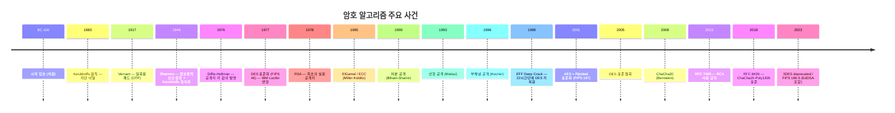
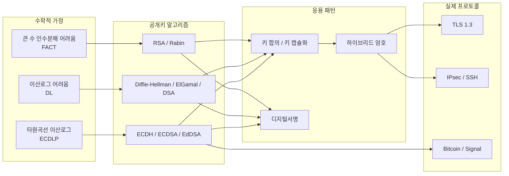
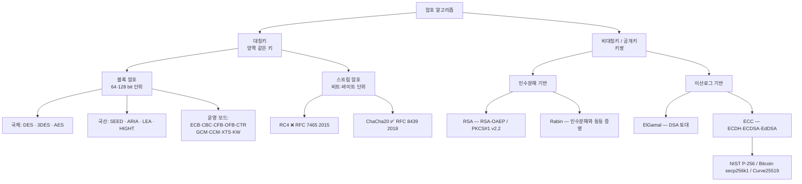
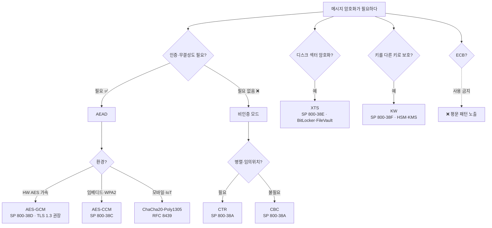
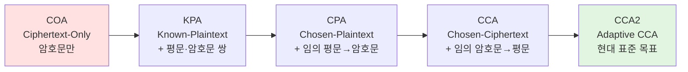

# 05. 암호 알고리즘 — 만화책처럼 읽는 암호의 역사

> **이 문서를 읽는 법**: 만화책 한 권을 펼쳤다고 생각하세요. 시간 순으로 *에피소드*를 따라가다 보면 *왜* 각 알고리즘이 등장했고 *왜* 죽었는지 자연스럽게 외워집니다.
> 정확한 정의·수치·표준 번호는 정확본을 참조: [[cs/information-security/04.security-general/05.crypto-algorithms|정확본 05. 암호 알고리즘]]

> **독자 가정**: *백엔드/풀스택 개발자, 보안은 처음.* 그래서 이미 익숙한 개념(JWT, SSH 키, HTTPS, bcrypt 등)을 다리로 씁니다.

---

## 🎯 시작 전에 — 이미 쓰고 있는 암호들

개발하면서 매일 마주치는 것들이 사실 다 이 단원의 주인공입니다.

| 매일 보는 것 | 사실은 이 단원의 |
|---|---|
| HTTPS 주소창 자물쇠 | TLS 프로토콜 (안에서 AES·ECDH·SHA 다 씀) |
| `git ssh-keygen` 으로 만든 `id_rsa` / `id_ed25519` | RSA / EdDSA (공개키 암호) |
| JWT 의 마지막 점 뒤 부분 (`signature`) | HMAC 또는 RSA 서명 |
| `bcrypt.hash(password)` | 해시함수 (06 단원) |
| AWS KMS, HashiCorp Vault | 키 관리 시스템 (KMS) |
| `aes-256-gcm` Node.js crypto | AES + GCM 운영 모드 |
| Bitcoin 지갑 주소 | secp256k1 타원곡선 |

> **이 단원의 본질**: 시험은 *수학을 묻지 않는다*. 알고리즘 이름·키 길이·라운드 수·운영 모드의 *차이*만 묻는다. 그래서 외울 게 정해져 있고, 시간 순으로 묶으면 *왜* 그렇게 됐는지 인과로 풀린다.

---

## 📖 에피소드 1 — BC 100년 ~ 1949년: 종이와 기계의 시대

### 장면 1. 시저의 군대 (BC 100년경)

**카이사르의 명령**: "암호문을 알파벳 3칸씩 밀어 적어라. `HELLO` → `KHOOR`."

이게 **시저 암호** (치환 암호의 원조). 키 = 이동 칸 수.

문제: 키 공간이 25개뿐. 한 명이 다 시도해도 1분.

### 장면 2. 비제네르의 약속 (16세기)

**약속**: 키워드를 반복해서 더 강하게! `KEY KEY KEY...`. 19세기까지 *해독 불가능*이라 불렸다.

**1863년, Kasiski 의 칼**: "반복되는 키 길이를 빈도로 추정하면 풀린다." → 비제네르 사망.

### 장면 3. Vernam 의 완벽한 암호 (1917)

**아이디어**: 메시지와 *같은 길이*의 *진짜 랜덤* 키를 *한 번만* 써서 XOR.

**Shannon 의 증명** (1949): "이건 무한한 계산력으로도 못 깬다." → **정보론적 보안** (information-theoretic security).

**그런데 왜 안 쓰지?** 키 길이 = 메시지 길이. *키를 안전하게 보내는 비용 = 메시지 자체를 안전하게 보내는 비용*. 외교 핫라인 외엔 비현실적.

### 🧭 정리

| 암호 | 깨진 방법 | 한 줄 |
|---|---|---|
| 시저 | 빈도 분석 | 키 25개, 1분이면 풀림 |
| 비제네르 | Kasiski Test (1863) | "해독 불가" 의 종말 |
| OTP (Vernam) | 깨지지 않음 | 진짜 랜덤 + 키=메시지 길이 + 1회용 → 비현실적 |

> **시험 핵심**: OTP 는 **유일한 정보론적으로 안전한 실용 암호**. 단 *3조건* (랜덤·길이=메시지·1회용) 모두 충족 시. 현대 모든 실용 암호는 *계산론적*으로만 안전.

---

## 📖 에피소드 2 — 1883년: Kerckhoffs 의 선언

### 장면

**1883년, 네덜란드의 군사 암호학자 Auguste Kerckhoffs**: "암호의 안전은 **키의 비밀**에만 의존해야 한다. 알고리즘이 적의 손에 들어가도 안전해야 한다."

66년 후 **Shannon (1949)** 가 같은 사상을 한 문장으로 다시 적었다: "*적이 시스템을 안다고 가정하라.*"

### 왜 이게 중요한가

| 알고리즘을 비밀로 두면 | 결과 |
|---|---|
| 학계 검증을 못 받는다 | 약점이 묻힌다 |
| 한 번 새면 시스템 전체 교체 | 키만 비밀이면 *키만* 교체 |
| 다른 시스템과 통신 불가 | 표준이 있어야 상호 운용 |

### 개발자 비유

> **GitHub 의 코드는 다 공개돼 있어도 안전하죠?** 비밀번호와 토큰만 환경변수로 숨기니까요. 그게 Kerckhoffs.
> "Security through obscurity" (모호함을 통한 보안) = "코드를 비공개로 하면 안전하다" — 이건 *Kerckhoffs 가 반대한* 사상.

→ AES·RSA·SHA 가 모두 RFC·FIPS 로 *공개*된 이유.

---

## 📖 에피소드 3 — 비밀의 4자리: 등장인물 소개

암호 시스템에는 *반드시* 5명의 등장인물이 있다 (Shannon 1949 의 형식 모델).

| # | 등장인물 | 정체 |
|---|---|---|
| 1 | **평문 (P)** | 보호하려는 원본 메시지 |
| 2 | **암호문 (C)** | 변환된 결과 |
| 3 | **키 (K)** | 비밀(또는 공개) 값 |
| 4 | **암호화 함수 (E)** | E: P × K → C |
| 5 | **복호화 함수 (D)** | D: C × K → P, 그리고 D(E(p,k), k) = p |

### 자주 헷갈리는 두 단어

| 단어 | 정의 | 예시 |
|---|---|---|
| **알고리즘 (Algorithm)** | 절차 자체 | AES, RSA, SHA-256 |
| **프로토콜 (Protocol)** | 그 절차를 *어떻게 쓸지* 약속 | TLS, IPsec, S/MIME |

### 개발자 비유

- 알고리즘 = `crypto.createCipheriv('aes-256-gcm', key, iv)` 의 그 함수
- 프로토콜 = HTTPS 의 *handshake → cert → cipher 협상 → record* 흐름

> **시험 함정**: "암호 시스템 구성요소 몇 개?" → **5개** (평문·암호문·키·암호화·복호화). "4자리"라 하면 함수 2개를 합쳐야 5.

---

## 📖 에피소드 4 — 암호의 세 가지 갈래

암호는 *세 차원*으로 나뉜다. 한 알고리즘은 *각 차원에서 한 위치*를 차지한다.

### 갈래 1. 키가 같은가, 다른가?

| | 대칭키 (Symmetric) | 비대칭키 (Public Key) |
|---|---|---|
| 키 구조 | 양쪽이 *같은* 키 | *키쌍* (개인키·공개키) |
| 대표 | AES, DES, SEED, RC4, ChaCha20 | RSA, ElGamal, ECC, DH |
| 개발자 비유 | `aes-256-gcm` 의 key | `id_ed25519` (개인) + `id_ed25519.pub` (공개) |

### 갈래 2. 한 번에 얼마씩 처리?

(*대칭키에만 적용. 비대칭키는 한 번에 한 블록.*)

| | 블록 암호 (Block) | 스트림 암호 (Stream) |
|---|---|---|
| 단위 | 64·128 bit 블록 | 비트·바이트 단위 |
| 대표 | DES, AES, SEED, ARIA | RC4, ChaCha20 |

### 갈래 3. 시대

| | 고전 (Classical) | 현대 (Modern) |
|---|---|---|
| 시대 | 종이·기계 | 컴퓨터 |
| 대표 | 시저, 비제네르, Enigma | DES, AES, RSA |

### 대칭키 vs 비대칭키 — *본질 3가지 차이*

| | 대칭키 | 비대칭키 |
|---|---|---|
| **N명 키 관리** | N(N-1)/2 (KDC 사용 시 N) | N (각자 키쌍 1개) |
| **속도** | 빠름 (HW 가속 GB/s) | 느림 (RSA 서명 ~수 ms) |
| **128 bit 보안 키 길이** | 128 bit | RSA **3072** / ECC **256** |
| **용도** | 대량 데이터 암호화 | 키 교환·디지털서명·인증서 |

### 그래서 실무는

> **하이브리드** — TLS 도 *비대칭으로 세션 키 교환 → 대칭으로 본 데이터 암호화*. *항상 둘 다 쓴다*.

---

## 📖 에피소드 5 — 1977년: DES 의 등장

### 장면 1. 1977년, NBS 사무실

**미국 표준국 (NBS, 현 NIST)**: 민간·금융용 통일 데이터 암호 표준이 필요하다. IBM 이 제출한 *Lucifer* 를 변형한다.

**최종 매개변수**:

| | DES |
|---|---|
| 블록 | 64 bit |
| 키 | **56 bit** (+ 패리티 8 bit) |
| 라운드 | 16 |
| 구조 | **Feistel** |

당시 평가: "56 bit 키 = 2^56 ≈ 7.2 × 10^16. 30년은 안전." → FIPS 46 으로 표준화.

### 장면 2. Feistel 구조의 마법

**구조**: 블록을 좌/우 반으로 나눈다. 한 쪽에 라운드 함수 적용 → 다른 쪽과 XOR. 16 라운드 후 합친다.

**왜 멋진가?** *암호화·복호화 회로가 같다* (라운드 키 순서만 반대로). 하드웨어가 한 종류면 충분.

### 장면 3. 1998년 7월, 샌프란시스코

**EFF 의 차고**: 25만 달러로 만든 "**Deep Crack**" 머신. 가동 22시간 후 — 키가 나왔다.

**신문 헤드라인**: "DES is dead." 56 bit 키의 사망 선고.

**NIST 의 응답**: 새 표준이 필요하다. *5년간 공개 경쟁* (AES Process) 시작.

### 장면 4. 임시방편 — 3DES

DES 를 즉시 못 버리니 *3번 돌려* 키 길이를 늘리자: `C = E_K3(D_K2(E_K1(P)))`.

**왜 EDE 구조 (암호화-복호화-암호화)?** K1=K2=K3 면 *단순 DES 와 같은 결과* → DES 호환성 유지.

| | 3DES |
|---|---|
| 블록 | 64 (DES 와 동일) |
| 키 | 168 bit (실효 ~112) |
| 라운드 | 48 |

→ 2023년 NIST SP 800-67 Rev. 2 로 **deprecated**.

---

## 📖 에피소드 6 — 2001년: AES 의 즉위

### 장면. 5년의 공개 경쟁

전 세계 암호학자가 후보를 제출. 라운드별 분석·공격 시도. 마지막 라운드 — 벨기에의 Daemen·Rijmen 의 "**Rijndael**" 이 선정.

이름이 바뀐다 — Rijndael → **AES** (Advanced Encryption Standard). **FIPS 197** (2001).

### AES 의 매개변수

| | AES |
|---|---|
| 블록 | **128 bit** (키와 무관하게 항상 고정) |
| 키 | **128 / 192 / 256 bit** (3가지) |
| 라운드 | **10 / 12 / 14** |
| 구조 | **SPN** (Substitution-Permutation Network) |

### 라운드 수가 외워지지 않으면 — 공식 하나

> **AES 라운드 수 = (키 bit ÷ 32) + 6**
> - 128 ÷ 32 + 6 = **10**
> - 192 ÷ 32 + 6 = **12**
> - 256 ÷ 32 + 6 = **14**
>
> 외울 게 *공식 1개*면 끝.

### SPN 4단계 — 순서가 곧 의미

매 라운드마다 4단계가 *이 순서로* 일어난다:

| 순서 | 단계 | 무엇을 | 왜 이 순서 |
|---|---|---|---|
| 1 | **SubBytes** | S-box 로 바이트 치환 | **비선형성** 먼저 — 공격자의 선형 분석 차단 |
| 2 | **ShiftRows** | 행 단위 시프트 | **가로 방향 확산** |
| 3 | **MixColumns** | 열 단위 행렬곱 | **세로 방향 확산** |
| 4 | **AddRoundKey** | 라운드 키와 XOR | **마지막에 키 주입** |

→ "비선형 → 가로 확산 → 세로 확산 → 키 주입" 의 순서는 *암호 설계의 자연스러운 흐름*. 두문자 외울 필요 없음. 마지막 라운드는 *MixColumns 생략* (역연산 단순화).

### Feistel vs SPN — 시험 헷갈림 1순위

| | Feistel (DES, SEED) | SPN (AES, ARIA) |
|---|---|---|
| 암복호화 회로 | **같음** (라운드 키 순서만 반대) | **다름** (역연산 회로 필요) |
| 라운드 함수 가역성 | *불필요* (좌·우 XOR 구조라 자동 가역) | *필수* (전체가 가역해야) |
| 병렬화 | 어려움 | 자연스러움 |

### 시험 함정

- AES 의 블록 길이? → **128 bit**. 키 길이와 *무관하게 항상 고정*.
- Rijndael ↔ AES? → **같다**. Rijndael = 후보명, AES = 표준 채택 후 명칭.
- 3DES 의 EDE 가 왜? → DES *호환성*.

---

## 📖 에피소드 7 — 1990년대 후반, 한국의 자립: 4총사

### 장면

미국 표준(DES) 단일 의존이 위험하다. KISA 가 국산 암호를 만들기 시작한다.

| 캐릭터 | 출생 | 정체성 |
|---|---|---|
| 🛡️ **SEED** | 1998, KISA | "한국의 DES 대체" — 1세대, 금융·정부 광범위 사용 |
| ⚔️ **ARIA** | 2004 | "한국의 AES" — Academy·Research·Agency 합작 |
| 🏃 **LEA** | KS X 3246 | "Light·Efficient" — IoT·모바일 경량 |
| 🐜 **HIGHT** | TTAS.KO-12.0040 | "High security & lightweight" — RFID·8bit MCU |

### 매개변수 매트릭스 (시험 1순위)

| | 블록 | 키 | 라운드 | 구조 |
|---|---|---|---|---|
| **SEED** | 128 | **128 고정** | **16** | **Feistel** |
| **ARIA** | 128 | 128/192/**256** | 12/14/**16** | **Involutional SPN** |
| **LEA** | 128 | 128/192/256 | **24/28/32** | **ARX** (Add·Rotate·XOR) |
| **HIGHT** | **64** | **128 고정** | **32** | **Generalized Feistel** (8분할) |

### 외우는 방법 — 매개변수가 *왜* 그런가

**SEED** — DES 대체용이라 DES 와 같은 *16 라운드*. 키는 *고정 단순화 128*. 블록은 강화 (DES 64 → SEED 128).

**ARIA** — AES 와 호환 기준이라 매개변수가 *AES 와 완전히 같다* (128 블록 / 128~256 키 / 12~16 라운드). 단 구조가 *Involutional* SPN (암복호화에 같은 S-box 사용 가능).

**LEA** — AES 와 같은 매개변수지만 *라운드를 2배 이상* (24/28/32). 이유: ARX 는 S-box 없어 한 라운드의 비선형성이 약함 → *라운드 수로 보강*.

**HIGHT** — *유일하게 다른 매개변수*. 8bit MCU·RFID 환경의 RAM·전력 제약 때문 → *블록 64로 양보* + *키 128 고정* + *32 라운드로 보강*.

### 차이점만 외우면 됨

> - **SEED** 만 16 라운드 (DES 의 흔적)
> - **HIGHT** 만 블록 64 (나머지 셋은 128)
> - **LEA** 만 ARX 구조
> - **SEED·HIGHT** 는 키 고정, **ARIA·LEA** 는 키 변동

### 시험 함정

- "SEED 의 키?" → 128 bit *고정* (변동 ❌)
- "HIGHT 의 블록?" → 64 bit (4총사 중 *유일*)
- "LEA 의 구조?" → ARX (Feistel/SPN 아님)
- "ARIA 의 SPN ≠ AES 의 SPN" → ARIA 는 *Involutional* SPN

---

## 📖 에피소드 8 — 한 블록을 어떻게 이어 붙일까: 운영 모드

### 장면. 문제 제기

블록 암호는 한 덩어리(AES 128 bit) 만 처리한다. 실제 메시지는:
- 한 블록보다 길다 → *어떻게 이어붙일까*
- 짧을 때 *마지막 블록을 어떻게 채울까*
- *임의 위치*를 복호화하고 싶다
- 중간에 누가 바꿨는지 *무결성 검증*하고 싶다

→ NIST SP 800-38 시리즈가 *9가지 운영 모드*를 표준화.

### 9가지 모드 한 표

| 모드 | 표준 | 병렬화 | IV/Nonce | 인증 | 용도 |
|---|---|---|---|---|---|
| **ECB** | 38A | ✅ | ❌ | ❌ | **사용 금지** (펭귄 사고) |
| **CBC** | 38A | 복호만 | ✅ | ❌ | TLS 1.0/1.1 (폐기), legacy |
| **CFB** | 38A | 복호만 | ✅ | ❌ | 스트림 모방 (직전 *암호문* 피드백) |
| **OFB** | 38A | ✅ (사전계산) | ✅ | ❌ | 사전계산 키스트림 (직전 *출력* 피드백) |
| **CTR** | 38A | ✅ | ✅ | ❌ | 일반 암호 (인증 없음) |
| **GCM** | 38D | ✅ | ✅ | **✅** | **TLS 1.3 권장** AEAD |
| **CCM** | 38C | 부분 | ✅ | ✅ | WPA2, IoT |
| **XTS** | 38E | ✅ | (Tweak) | ❌ | 디스크 암호 (BitLocker, FileVault) |
| **KW** | 38F | — | — | ✅ | 키 래핑 (HSM, KMS) |

### 장면. ECB 의 펭귄 사건

ECB 모드로 펭귄 *이미지*를 암호화하면 — *윤곽이 그대로 보인다*. 같은 평문 블록 → 같은 암호문 블록이라.

→ NIST SP 800-38A 도 일반 암호화에 *ECB 권장하지 않음*. **사용 금지**.

### 인증 암호 (AEAD) — 현대 표준 3총사

| AEAD | 구성 | 환경 |
|---|---|---|
| **GCM** | CTR + GMAC (Galois MAC) | HW AES 가속 (서버) |
| **CCM** | CTR + CBC-MAC | 임베디드, WPA2 |
| **ChaCha20-Poly1305** | ChaCha20 + Poly1305 | 모바일·IoT (HW 가속 없음) |

→ **TLS 1.3 의 cipher suite 는 이 3종만 허용**. AEAD = 기밀성 + 무결성 + 인증을 *한 번에*.

### 모드 이름이 곧 동작

| 약자 | 풀이 | 동작 |
|---|---|---|
| **E**lectronic **C**ode**B**ook | 전자 코드북 | *블록 → 암호문* 1:1 매핑 |
| **C**ipher **B**lock **C**haining | 암호 블록 연쇄 | 직전 *암호문*과 현재 평문 XOR 후 암호화 |
| **C**ipher **F**eed**B**ack | 암호 피드백 | 직전 *암호문*을 키로 가공 |
| **O**utput **F**eed**B**ack | 출력 피드백 | 직전 *블록 출력*을 키로 가공 |
| **C**oun**T**e**R** | 카운터 | *카운터 값* 암호화 결과를 키스트림으로 |
| **G**alois/**C**ounter **M**ode | 갈루아 카운터 | CTR + GMAC |
| **C**ounter with **C**BC-**M**AC | 카운터+CBC-MAC | CTR + CBC-MAC |

→ 영어 풀어쓰기만 알면 동작이 보인다. 별도 두문자 필요 없음.

### 시험 함정

| 함정 | 정답 |
|---|---|
| ECB 약점? | 같은 평문 = 같은 암호문 → 패턴 노출 |
| CBC 약점? | 패딩 오라클 (POODLE 2014, Lucky 13 2013) + 병렬 ❌ |
| CTR 약점? | **인증 없음** + Nonce 재사용 시 키스트림 노출 |
| CFB ↔ OFB? | CFB = 직전 *암호문* / OFB = 직전 *출력* |
| GCM ↔ CCM? | GCM = CTR + **GMAC** / CCM = CTR + **CBC-MAC** |
| XTS 가 인증 없는 이유? | 디스크 섹터 크기 *고정* — 인증 태그 추가 공간 없음 |

---

## 📖 에피소드 9 — 1987~2018년, 스트림 암호의 흥망: RC4 와 ChaCha20

### 장면 1. 1987년, RSA Security 사내

**Ron Rivest**: "스트림 암호 만들었어. RC4." (사내 비공개로 시작)

→ 1990년대 SSL/TLS·WEP 가 광범위 채택. *익명으로 유출*되어 사실상 공개 알고리즘이 됨.

### 장면 2. 2001년, WEP 해커

**FMS 공격**: RC4 의 *초기 키스트림 편향*으로 WEP 키 복원. 가정용 Wi-Fi 가 뚫린다.

### 장면 3. 2015년, IETF 의 종말 선고

**RFC 7465**: "TLS 에서 RC4 사용 금지." → RC4 시대 끝.

### 장면 4. 2008년 → 2018년, 새로운 챔피언

**Daniel J. Bernstein** (Curve25519 의 그 사람): Salsa20 의 변형 *ChaCha20* 발표.

**RFC 8439** (2018): ChaCha20 + Poly1305 인증 암호 표준화 → **TLS 1.3 cipher suite**.

| | RC4 | ChaCha20 |
|---|---|---|
| 상태 | **금지 (RFC 7465, 2015)** | TLS 1.3 표준 |
| 키 | 40~256 bit | **256 bit** |
| 부채널 저항 | ❌ | ✅ (상수 시간 자연스러움) |
| HW 가속 없는 환경 | — | **AES-GCM 보다 빠름** |

### 왜 ChaCha20

> 모바일·IoT 처럼 *AES-NI HW 가속이 없는 환경*에서는 ChaCha20 이 *AES-GCM 보다 빠르다*. Bernstein 의 "쉬운 안전 구현" 철학 — 부채널을 *설계 단계부터* 막음.

### 시험 함정

- "RC4 가 아직 표준?" → ❌. 2015 RFC 7465 로 *금지*.
- "ChaCha20 단독으로 인증 암호?" → ❌. *Poly1305 와 결합*해야 AEAD.

---

## 📖 에피소드 10 — 공격자의 도구 상자: 5단계 위협 모델

### 장면. *얼마나 강한 적*에 안전한가?

암호의 안전성을 논할 때, *공격자가 무엇을 가졌는가*를 먼저 정해야 한다. 가진 게 많을수록 강한 공격. 강한 공격에 안전하면 자동으로 약한 공격에도 안전.

```
COA  <  KPA  <  CPA  <  CCA  <  CCA2
                              ↑
                      현대 표준의 목표
```

| 모델 | 풀이 | 공격자가 가진 것 |
|---|---|---|
| **COA** | **C**iphertext-**O**nly **A**ttack | 암호문만 |
| **KPA** | **K**nown-**P**laintext **A**ttack | + (평문, 암호문) 쌍 |
| **CPA** | **C**hosen-**P**laintext **A**ttack | + 임의 평문 → 암호문 받기 가능 |
| **CCA** | **C**hosen-**C**iphertext **A**ttack | + 임의 암호문 → 평문 받기 가능 |
| **CCA2** | **A**daptive **CCA** | + 이전 응답 보고 다음 질의 결정 |

### 현대 표준의 황금 기준

> **RSA-OAEP**, **AES-GCM** 모두 **CCA2 안전성**이 증명되어 있다. 이게 현대 암호의 *황금 기준*.

---

## 📖 에피소드 11 — 다섯 가지 공격 기법

### 장면. 차분 vs 선형 — 1990년대의 두 공격기법

| 공격 | 누가·언제 | 핵심 |
|---|---|---|
| **차분 공격** | Biham & Shamir, 1990 | 평문 쌍의 **XOR 차분**이 암호문 차분에 어떻게 전파되는지 통계 분석 |
| **선형 공격** | Matsui, 1993 | 평문·암호문·키 비트 사이의 **선형 근사**를 통계 분석 |

### 부채널 공격 — 수학이 아닌 *물리*

**1996년, Paul Kocher**: "RSA 의 *연산 시간*만 측정해도 개인키를 복원할 수 있다." 부채널 공격의 시작.

| 부채널 | 사례 |
|---|---|
| 타이밍 | Kocher 1996 — RSA 키 복원 |
| 전력 (DPA) | 스마트카드 키 복원 |
| 전자기 (TEMPEST) | 군용 차폐 표준의 동기 |
| 음향 | Genkin 2014 — *CPU 동작음*으로 RSA 키 추출 |
| 캐시 | Spectre · Meltdown (2018) |

**대응책**: **상수 시간 (constant-time) 구현** / 블라인딩 / 물리 차폐. EdDSA (Bernstein) 가 상수 시간을 *명시적 설계 목표*로 삼은 이유.

### 무차별 대입 vs 생일 공격 — 외울 공식 2개

> **무차별 대입**: n bit 키 → 평균 시도 = **2^(n−1)** = 키 공간의 절반
> **생일 공격**: n bit 해시 → **2^(n/2)** 회면 충돌 발견 → 충돌 저항성 = *해시 길이의 절반*
>
> 예: SHA-256 의 충돌 저항성? → **128 bit** (256 ❌). AES-256 무차별 평균? → 2^255.

### 시험 함정

- "차분 ↔ 선형" → 차분은 **XOR 차분 전파** (Biham-Shamir), 선형은 **선형 근사** (Matsui)
- "SHA-256 의 충돌 저항성?" → **128 bit** (n/2 공식)
- "무차별 *최대* 시도?" → 2^n. *평균*은 2^(n−1)

---

## 📖 에피소드 12 — 1976~1978년, 세상이 바뀌다: 공개키의 발견

### 장면 1. 영원한 문제

대칭키만 쓰면 — *N명이 통신하려면 N(N-1)/2 개의 키*가 필요하다. 100명이면 4,950개. 100만명이면? 5천억 개. **키 분배 폭발**.

### 장면 2. 1976년, Diffie 와 Hellman 의 충격

**Diffie-Hellman 키 합의**: "두 사람이 *공개된 채널*에서 정보를 주고받기만 해도 *공통 비밀 키*를 만들 수 있다."

수학자들도 충격: "이게 가능하다고?"

### 장면 3. 1978년, MIT 의 세 사람

**Rivest · Shamir · Adleman**: 첫 실용 공개키 암호 — **RSA**.

**핵심 아이디어**: *큰 두 소수 p, q 를 곱한 n = pq 는 만들기 쉽지만, n 에서 p, q 를 되찾는 건 어렵다.* (FACT 가정)

### RSA 동작 5단계

```
1. 큰 소수 p, q 선택  (각 1024 bit 이상)
2. n = p · q                  (모듈러스, 공개)
3. φ(n) = (p−1)(q−1)          (오일러 토션트, 비밀)
4. e 선택, gcd(e, φ(n)) = 1   (보통 65537)
5. d = e⁻¹ mod φ(n)           (개인키)

공개키 = (n, e), 개인키 = (n, d)

암호화: c = m^e mod n
복호화: m = c^d mod n
```

### 개발자 비유

- `ssh-keygen` 의 `id_rsa` = 개인키 (n, d)
- `id_rsa.pub` = 공개키 (n, e)
- 보통 e = 65537 (`ssh-keygen` 출력에서 보이는 그것)

### 단순 RSA vs RSA-OAEP

| | 단순 RSA | RSA-OAEP |
|---|---|---|
| 결정론성 | **결정론적** (같은 평문 → 같은 암호문) | **확률적** (시드 사용) |
| CCA2 안전성 | ❌ | ✅ (Bellare-Rogaway 1994 증명) |
| 표준 | 사용 금지 | **RFC 8017 (PKCS#1 v2.2)** |

### 양자 위협

**Shor 알고리즘**이 RSA 를 *다항 시간*에 깬다. 양자 컴퓨터가 충분히 커지면 RSA 사망. → **NIST PQC** 표준화 진행 중 (Kyber, Dilithium 등 격자 기반).

### 장면 4. RSA 의 사촌 — Rabin (1979)

**Michael Rabin** (1979) 이 발표한 *RSA 의 형제 알고리즘*. 인수분해 기반은 같지만 *증명 강도가 다르다*.

| | RSA | Rabin |
|---|---|---|
| 보안 토대 | 인수분해 (FACT) | 인수분해 (FACT) |
| 인수분해와의 관계 | RSA 가 *더 쉬울 수도* 있음 (역방향 증명 ❌) | **인수분해와 동등하게 어려움 증명** ✅ |
| 키 | n = pq | n = pq (단, p, q 는 4k+3 형태 소수) |
| 암호화 | c = m^e mod n | c = **m² mod n** |
| 복호화 | m = c^d mod n | 4개 제곱근 중 m 추정 (잉여 정보 필요) |

**왜 안 쓰지?** 한 블록 암호화당 *4개의 가능한 평문* → 어느 게 진짜 m 인지 추가 식별 정보가 필요. 실용 시스템에선 거의 안 쓰이고 *학술적 의의*가 크다.

> **시험 함정**: "RSA ↔ Rabin 차이?" → 둘 다 인수분해 기반이지만 **Rabin 만 인수분해와 *동등 증명***. RSA 는 *어쩌면 인수분해보다 쉬울 수도* 있다 (증명 안 됨).

### 시험 함정

- "단순 RSA 가 안전?" → ❌. 결정론적이라 사전 공격 가능. **OAEP 패딩 필수**.
- "RSA 의 보안 = 인수분해 동등?" → ❌. **Rabin** 만 동등 증명.
- "양자 안전?" → ❌. RSA·ECC·DH 모두 Shor 로 깨짐.

---

## 📖 에피소드 13 — 1985년, 이산로그의 두 얼굴: ElGamal 과 ECC

### 장면 1. ElGamal — DSA 의 토대 (1985)

**Taher ElGamal** 이 발표한 공개키 암호. **이산로그 문제(DL)의 어려움**에 보안 의존. 후일 **DSA(Digital Signature Algorithm)** 의 토대가 된다.

```
공개 매개변수: 큰 소수 p, 생성자 g
개인 키: x  (1 < x < p−1)
공개 키: y = g^x mod p

암호화 (Bob → Alice):
  k ← random
  c₁ = g^k mod p
  c₂ = m · y^k mod p
  c = (c₁, c₂)         ← 암호문이 두 값

복호화 (Alice):
  s = c₁^x mod p  = g^(kx) mod p
  m = c₂ / s mod p
```

**ElGamal 의 단점**: 암호문이 평문의 *2배 길이* (c₁, c₂ 두 값). 그래도 RSA 와 동등한 보안을 가지며, *후속 표준 DSA·ECDSA 의 출발점*.

### 장면 2. ECC 의 마법 — 같은 안전을 더 짧은 키로

**1985년, Neal Koblitz 와 Victor Miller** *동시에* 제안: "타원곡선 위 점들의 군 구조에서의 이산로그 (ECDLP) 가 일반 이산로그보다 어렵다 → *훨씬 짧은 키*로 같은 안전."

### 압축 공식 — 128 bit 보안 기준

> **128 bit 보안에 필요한 키 길이**:
> - AES (대칭) — **128 bit**
> - RSA / DH — **3072 bit**
> - ECC — **256 bit**
>
> ECC = RSA 의 약 **1/12 길이**로 같은 안전. *왜 IoT·모바일이 ECC 를 쓰는가의 답*.

### 보안 강도별 키 길이 (NIST SP 800-57)

| 보안 (대칭 기준) | RSA / DH | ECC |
|---|---|---|
| 80 bit | 1024 | 160 |
| 112 bit | 2048 | 224 |
| **128 bit** | **3072** | **256** |
| 192 bit | 7680 | 384 |
| 256 bit | 15360 | 512 |

### 권장 곡선 — 응용처 매칭이 시험 빈출

| 곡선 | 표준 | 응용 |
|---|---|---|
| **NIST P-256** | FIPS 186-5 | TLS, 일반 |
| NIST P-384 | FIPS 186-5 | 정부 고보안 |
| **secp256k1** | SEC 2 | **Bitcoin · Ethereum** |
| **Curve25519** | RFC 7748 | **TLS 1.3 · Signal · SSH** (X25519 키 합의) |
| **Ed25519** | RFC 8032 | **EdDSA 서명** (Curve25519 의 Edwards 형태) |

### 개발자 비유

- `ssh-keygen -t ed25519` 로 만든 키 = Ed25519 = Curve25519 의 서명 형태
- Bitcoin 지갑 주소 = secp256k1 곡선 위의 공개키
- TLS 1.3 의 키 합의 = X25519 (Curve25519)

### Curve25519 vs Ed25519 — 헷갈림 1순위

> *같은 곡선의 두 표현*. Curve25519 = **Montgomery** 형태로 키 합의(X25519), Ed25519 = **Edwards** 형태로 서명(EdDSA).

### 시험 함정

- 응용 매칭: secp256k1 = Bitcoin / Curve25519 = TLS·Signal / Ed25519 = EdDSA
- "ECC 가 양자 안전?" → ❌. Shor 로 깨짐
- "ECC 가 RSA 보다 안전?" → 동일 보안. *키 길이만 짧다*

---

## 📑 공개키 암호 종합 비교 (에피소드 12·13 정리)

다섯 알고리즘 한 표. *보안 토대 → 키 길이 → 양자 후 안전성* 순으로 본다.

| 알고리즘 | 보안 토대 | 키 길이 (128 bit 보안) | 양자 후 안전 |
|---|---|---|---|
| **RSA** | 인수분해 (FACT) | 3072 | ❌ Shor |
| **Rabin** | 인수분해 (FACT) — *동등 증명* | 3072 | ❌ Shor |
| **ElGamal** | 이산로그 (DL) | 3072 | ❌ Shor |
| **ECC** (ECDH·ECDSA·EdDSA) | 타원곡선 이산로그 (ECDLP) | **256** | ❌ Shor |
| **격자 기반** (Kyber·Dilithium) | LWE·SIS 문제 | NIST PQC 표준화 중 | **✅** |

> **읽는 법**: 위 4개는 모두 *Shor 알고리즘 1개*에 동시에 무너진다 (수학 가정 셋이 같은 종류). 그래서 NIST 가 *완전히 다른 수학*(격자 문제) 기반의 **PQC** 를 추진. *마인드맵 2 (개념 의존성)* 가 이 흐름을 시각화.

---

## 🗺️ 마인드맵 1 — 시간선



**읽는 법**: 모든 알고리즘은 *이전 사건에 대한 응답*이다. AES 가 2001 에 나온 이유 = 1998 DES 가 깨졌기 때문. ChaCha20 이 표준이 된 이유 = AES-NI 없는 모바일 시대 때문.

---

## 🗺️ 마인드맵 2 — 개념 의존성 (무엇이 무엇의 토대인가)



**읽는 법**: 위에서 아래로 — *수학 가정* → *알고리즘* → *응용* → *프로토콜*. 양자 컴퓨터의 Shor 가 *수학 가정 3개를 모두 깨므로* RSA·ECC·DH 가 동시에 무너진다.

---

## 🗺️ 마인드맵 3 — 분류 트리



---

## 🗺️ 마인드맵 4 — 운영 모드 결정 트리



**읽는 법**: 위에서부터 *질문에 답해 내려가면* 정답 모드가 나온다. ECB 는 어떤 경로로도 도달하지 않음 — *시각적 사용 금지*.

---

## 🗺️ 마인드맵 5 — 공격 모델 위계



---

## 🗂️ 키워드 클러스터 — 비슷한 이름 모아보기

### NIST SP 800-38 시리즈 (운영 모드)

```
SP 800-38A — ECB · CBC · CFB · OFB · CTR
SP 800-38B — CMAC
SP 800-38C — CCM
SP 800-38D — GCM · GMAC
SP 800-38E — XTS
SP 800-38F — KW (Key Wrap)
SP 800-38G — FF1 · FF3 (Format-Preserving)
```

### NIST FIPS

```
FIPS 197    — AES (2001)
FIPS 198-1  — HMAC
FIPS 186-5  — DSS (DSA · ECDSA · EdDSA, 2023)
FIPS 180-4  — SHA-1·SHA-2
FIPS 202    — SHA-3 / Keccak
```

### 한국 표준 식별자

```
TTAS.KO-12.0004 — SEED
TTAS.KO-12.0040 — HIGHT
KS X 1213-1     — ARIA
KS X 1213-2     — HIGHT
KS X 3246       — LEA
TTAS.KO-12.0276 — LSH (해시함수, 06단원)
```

### "256" 가족 — 의미 모두 다름 (함정 1순위)

| 256 | 의미 |
|---|---|
| AES-256 | *키* 256 bit, 14 라운드 |
| SHA-256 | *해시 출력* 256 bit (충돌 저항은 128 bit) |
| ECC P-256 | *곡선 매개변수* 256 bit (보안 강도는 128 bit) |
| secp256k1 | Bitcoin 곡선, 128 bit 보안 |
| Curve25519 | RFC 7748, 128 bit 보안 |
| ChaCha20 | *키* 256 bit |

---

## 🃏 회상 30문항

> 답을 가린 뒤 자가 채점. 틀린 것만 정확본으로 깊이 학습.

**A. 기초·분류 (1~6)**
1. Kerckhoffs 원칙을 한 줄로?
2. 암호 시스템 5 구성요소는?
3. 알고리즘과 프로토콜의 차이를 예시 포함해서?
4. 대칭키 N명 키 개수 (KDC 미사용)?
5. 128 bit 보안에 필요한 RSA / ECC 키 길이?
6. 하이브리드 암호의 동작 방식?

**B. 공격 모델·기법 (7~12)**
7. 공격 모델 5단계를 약한 → 강한 순으로?
8. 차분 공격 ↔ 선형 공격의 구분 핵심?
9. n bit 키에 대한 무차별 대입 평균 시도 횟수?
10. n bit 해시의 생일 공격 충돌 저항성?
11. 부채널 공격 5종을 사례와 함께?
12. EdDSA 가 상수 시간 구현을 명시한 이유?

**C. 대칭키 (13~20)**
13. DES 의 4가지 매개변수 (블록·키·라운드·구조)?
14. AES 라운드 수를 *공식*으로?
15. AES SPN 4단계와 *그 순서가 그런 이유*?
16. 3DES 의 EDE 구조가 채택된 이유?
17. SEED·ARIA·LEA·HIGHT 의 매개변수 4쌍?
18. Feistel 과 SPN 의 회로 차이?
19. Rijndael 과 AES 의 관계?
20. AES-128 와 AES-256 의 블록 길이?

**D. 운영 모드 (21~24)**
21. ECB 가 사용 금지된 이유?
22. CBC 의 두 가지 약점?
23. CTR 의 가장 큰 약점?
24. TLS 1.3 cipher suite 3가지?

**E. 공개키·기타 (25~30)**
25. 단순 RSA 의 두 가지 약점?
26. RSA-OAEP 가 보장하는 안전성?
27. Rabin 이 RSA 와 다른 본질적 점?
28. Curve25519 와 Ed25519 의 관계?
29. secp256k1 의 대표 응용?
30. RC4 가 표준에서 금지된 RFC 번호와 연도?

---

## ⚠️ 시험 함정 모음

| 함정 | 정답 |
|---|---|
| Kerckhoffs ↔ Shannon | 같은 원칙의 두 표현 |
| AES 의 블록 길이? | 128 bit (키와 무관 고정) |
| AES 의 구조? | SPN |
| AES 라운드 공식? | 키 bit ÷ 32 + 6 |
| HIGHT 의 블록? | 64 bit (4총사 중 유일) |
| LEA 의 구조? | ARX |
| ECB 약점? | 같은 평문 = 같은 암호문 |
| CBC 약점? | 패딩 오라클 + 병렬 ❌ |
| CTR 약점? | 인증 없음, Nonce 재사용 ❌ |
| AEAD 3종? | GCM · CCM · ChaCha20-Poly1305 |
| TLS 1.3 cipher? | 위 3종만 |
| 양자 후 RSA·ECC? | ❌ Shor |
| 128 bit 보안 키? | AES 128 / RSA 3072 / ECC 256 |
| 공격 모델 위계? | COA < KPA < CPA < CCA < CCA2 |
| 차분 vs 선형? | 차분 = XOR (Biham-Shamir) / 선형 = 선형 근사 (Matsui) |
| 생일 공격 한계? | n bit 해시 → n/2 bit |
| RSA-OAEP 우월? | 확률적 + CCA2 |
| 단순 RSA ↔ Rabin? | RSA 는 인수분해보다 쉬울 수도 / Rabin 은 동등 증명 |
| Curve25519 ↔ Ed25519? | 같은 곡선의 Montgomery / Edwards |
| RC4 표준 상태? | RFC 7465 (2015) 금지 |
| OTP 정보론적 안전 조건? | 진짜 랜덤 + 키=메시지 길이 + 1회용 |

---

## 🔗 정확본 매핑표

| 본 노트 에피소드 | 정확본 § |
|---|---|
| 에피소드 1 (고전 3선) | [[cs/information-security/04.security-general/05.crypto-algorithms#§2. 고전 암호\|정확본 §2]] |
| 에피소드 2 (Kerckhoffs) | [[cs/information-security/04.security-general/05.crypto-algorithms#§1-2. Kerckhoffs 원칙\|정확본 §1-2]] |
| 에피소드 3 (5 구성요소) | [[cs/information-security/04.security-general/05.crypto-algorithms#§1-1. 용어 정의\|정확본 §1-1]] |
| 에피소드 4 (분류 3차원) | [[cs/information-security/04.security-general/05.crypto-algorithms#§1-3. 암호 시스템 분류\|정확본 §1-3]] |
| 에피소드 5 (DES, 3DES) | [[cs/information-security/04.security-general/05.crypto-algorithms#§4-1. DES — Data Encryption Standard\|정확본 §4-1·§4-2]] |
| 에피소드 6 (AES) | [[cs/information-security/04.security-general/05.crypto-algorithms#§4-3. AES — Advanced Encryption Standard\|정확본 §4-3]] |
| 에피소드 7 (국산 4총사) | [[cs/information-security/04.security-general/05.crypto-algorithms#§4-4. SEED — KISA 국산 블록 암호\|정확본 §4-4 ~ §4-8]] |
| 에피소드 8 (운영 모드) | [[cs/information-security/04.security-general/05.crypto-algorithms#§5. 블록 암호 운영 모드\|정확본 §5]] |
| 에피소드 9 (스트림) | [[cs/information-security/04.security-general/05.crypto-algorithms#§6. 스트림 암호\|정확본 §6]] |
| 에피소드 10 (공격자 모델) | [[cs/information-security/04.security-general/05.crypto-algorithms#§3-1. 공격자 모델 — 입력 가용성에 따른 분류\|정확본 §3-1]] |
| 에피소드 11 (공격 기법) | [[cs/information-security/04.security-general/05.crypto-algorithms#§3-2. 차분 공격 (Differential Cryptanalysis)\|정확본 §3-2 ~ §3-5]] |
| 에피소드 12 (RSA·Rabin) | [[cs/information-security/04.security-general/05.crypto-algorithms#§7. 공개키 암호 — 인수분해 기반\|정확본 §7]] |
| 에피소드 13 (ElGamal·ECC) | [[cs/information-security/04.security-general/05.crypto-algorithms#§8. 공개키 암호 — 이산로그 기반\|정확본 §8]] |
| 공개키 종합 비교 | [[cs/information-security/04.security-general/05.crypto-algorithms#§8-4. 공개키 암호 종합 비교\|정확본 §8-4]] |

---

## 📅 학습 흐름 (8주차 시험 대비 기준)

```
[1주]   에피소드 1~4 (시간선 + 분류) — 만화책 한 번 통독
[2주]   에피소드 5~7 (DES → AES → 국산) — 시간선 그림으로
[3주]   에피소드 8 (운영 모드) — 결정 트리 외우기
[4주]   에피소드 9 (스트림) + 에피소드 10·11 (공격)
[5주]   에피소드 12·13 (RSA·ECC) — 개발자 비유로
[6주]   마인드맵 5장 통합 + 키워드 클러스터
[7주]   회상 30문항 → 틀린 것만 정확본 깊이 학습
[8주]   함정 모음 매일 1회 + 정확본 1회 정독
```

---

> **다음 단원**: [[cs/information-security/04.security-general/06.hash-and-mac|06. 해시함수와 MAC]] — 본 단원 에피소드 11 의 *생일 공격*이 06단원의 *충돌 저항성*과 직접 연결.
