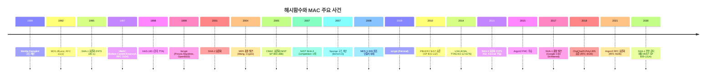
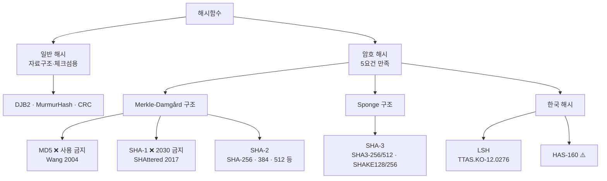
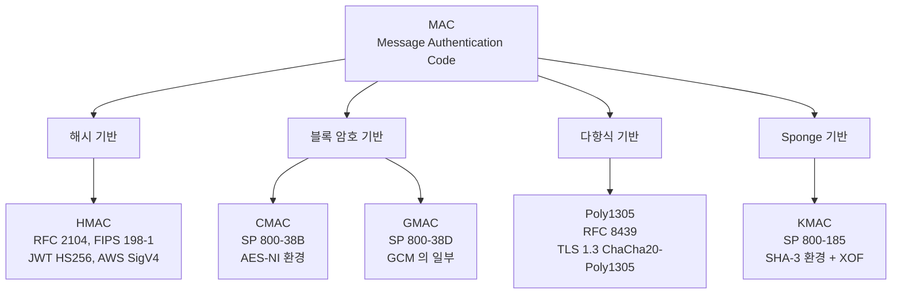
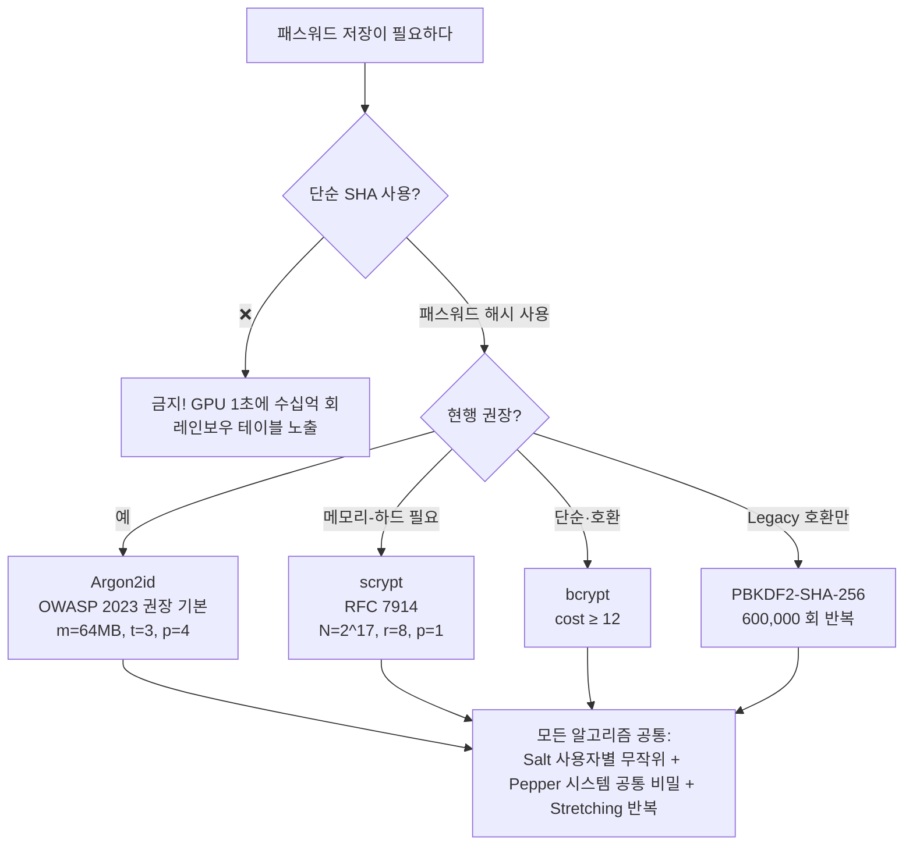
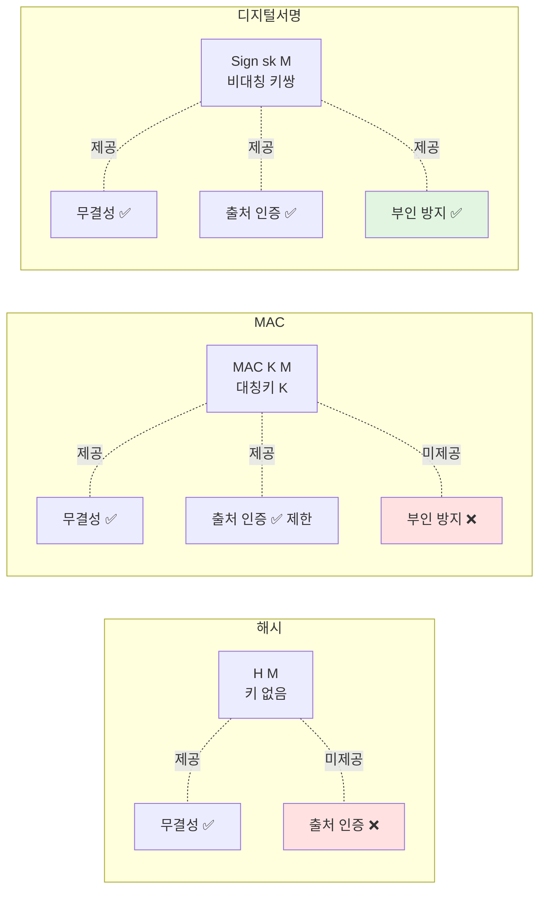

# 06. 해시함수와 MAC — 만화책처럼 읽는 해시의 역사

> **이 문서를 읽는 법**: 만화책처럼 *시간 순*으로 *에피소드*를 따라가면 *왜* 각 해시가 등장했고 *왜* 죽었는지 자연스럽게 외워집니다.
> 정확한 정의·수치·표준 번호는 정확본 참조: [[cs/information-security/04.security-general/06.hash-and-mac|정확본 06. 해시함수와 MAC]]

> **연결 단원**: 본 단원의 *생일 공격·충돌 저항성*은 [[cs/information-security/04.security-general/05.crypto-algorithms|정확본 05. 암호 알고리즘]] 의 §3-5 와 직접 연결.

---

## 🎯 시작 전에 — 이미 쓰고 있는 해시들

| 매일 보는 것 | 사실은 이 단원의 |
|---|---|
| `git rev-parse HEAD` 의 40자 hex | SHA-1 (Git 은 아직 SHA-1 사용) |
| `sha256sum file.iso` 의 무결성 검증 | SHA-256 |
| `npm install` 후 `package-lock.json` 의 `integrity: "sha512-..."` | SHA-512 SRI |
| `bcrypt.hash(password, 12)` | bcrypt (패스워드 해싱) |
| JWT 의 `HS256` 알고리즘 | **HMAC-SHA-256** |
| TLS 1.3 cipher suite `AES_128_GCM_SHA256` 의 `SHA256` | HMAC-SHA-256 (KDF·HKDF 용) |
| Bitcoin 블록 해시 | SHA-256 (이중) |
| `etag: "W/\"abc123\""` HTTP 헤더 | 보통 MD5/SHA-1 약식 해시 |
| AWS S3 객체 ETag | 보통 MD5 (단일 part 업로드 한정) |

> **이 단원의 본질**: 해시는 *암호화*가 아니다. *복호화 불가능*하고 *키도 없다*. 그저 임의 길이 입력 → 고정 길이 다이제스트로 줄이는 *일방향 함수*. 이 단순한 도구가 무결성 검증·서명·MAC·블록체인·패스워드 저장의 토대가 된다.

---

## 📖 에피소드 1 — 해시함수란 무엇인가

### 장면. 정의

**해시함수 H**: 임의 길이의 비트 문자열을 입력받아 *고정 길이 n 의 다이제스트*를 출력하는 함수.

```
H : {0,1}* → {0,1}^n
```

→ "100MB 짜리 파일이든 한 글자든 *항상 같은 길이*로 줄어든다." (SHA-256 이면 256 bit = 32 byte = 64자 hex)

### 두 종류의 해시 — 자료구조용 vs 암호용

| | 일반 해시 | 암호 해시 |
|---|---|---|
| 예시 | DJB2, MurmurHash, CRC | SHA-2, SHA-3 |
| 요구사항 | 빠르고 분산 좋음 | + 5가지 보안 요건 (아래) |
| 용도 | HashMap, 체크섬 | 무결성, 서명, MAC, 패스워드 |

### 암호 해시의 5가지 보안 요건

| # | 이름 | 영문 | 의미 |
|---|---|---|---|
| 1 | **압축성** | Compression | 임의 길이 입력 → 고정 길이 출력 |
| 2 | **계산 효율성** | Efficiency | 입력에서 해시값을 빠르게 계산 |
| 3 | **일방향성** | Preimage Resistance | h 가 주어졌을 때 H(x)=h 인 x 찾기 어려움 |
| 4 | **약한 충돌 저항성** | Second Preimage Resistance | x 주어졌을 때 H(x')=H(x) 인 *다른* x' 찾기 어려움 |
| 5 | **강한 충돌 저항성** | Collision Resistance | H(x)=H(x') 인 *임의의* 두 x≠x' 쌍 찾기 어려움 |

### 위계 — 강한 ≥ 약한 ≥ 일방향

```
강한 충돌 저항성 ≥ 약한 충돌 저항성 ≥ 일방향성
```

- 강한 충돌 저항성이 깨지면 → 약한 충돌도 깨진 것
- 위에서 아래로 *조건이 약해진다*. 강한 게 가장 어려운 보장

### 보안 강도 공식 (생일 공격)

> **n bit 해시의 보안**:
> - 일방향성·약한 충돌 저항성 → **2^n** 시도
> - **강한 충돌 저항성 → 2^(n/2)** ← 생일 공격 때문에 *해시 길이의 절반*
>
> 예: SHA-256 → 일방향 보안 256 bit, **충돌 저항 보안은 128 bit**.

### 시험 함정

- "SHA-256 의 충돌 저항 보안?" → **128 bit** (n/2). 256 ❌
- "약한 충돌 저항이 있으면 강한 충돌 저항도 있다?" → ❌. 위계는 *강한 → 약한* 방향
- "5요건?" → 압축성·계산 효율성·일방향·약한 충돌·강한 충돌

---

## 📖 에피소드 2 — 두 구조의 시대: Merkle-Damgård vs Sponge

해시함수의 *내부 구조*는 두 가지 패러다임으로 나뉜다. 이 차이가 *어떤 공격에 취약한가*를 결정한다.

### 장면 1. 1989년, Merkle-Damgård 의 탄생

**Ralph Merkle 와 Ivan Damgård** 가 *독립적으로* 동시 제안: "압축 함수 *f* 를 반복 적용하면 임의 길이를 고정 길이로 줄일 수 있다."

```
입력 메시지 M → 블록 분할 M_1 || M_2 || ... || M_k (패딩 포함)
초기 상태 H_0 = IV
반복     H_i = f(H_{i-1}, M_i)
출력     H_k
```

**채택 알고리즘**: MD5, SHA-1, SHA-2 (모두 M-D)

**보안 정리**: 압축 함수 f 가 충돌 저항성이 있으면, 전체 해시함수도 충돌 저항성이 있다.

### 장면 2. M-D 의 본질적 약점 — 길이 연장 공격

> H(M) 과 |M| 만 알면 — *M 자체를 몰라도* — H(M || padding || X) 를 임의의 X 에 대해 계산할 수 있다.

```
공격자가 안다: H("secret_password|user=alice")  ← MAC 으로 사용된다 가정
공격자는 모른다: "secret_password" 자체

공격: 공격자가 임의의 "&admin=true" 를 덧붙여
     H("secret_password|user=alice" || padding || "&admin=true")
     를 secret 모르고도 계산 가능 → MAC 위조!
```

→ **MD5·SHA-1·SHA-2 모두 취약**. 그래서 단순 `H(K || M)` MAC 은 위험하고 *HMAC 의 이중 해시*가 필요해졌다 (에피소드 10).

### 장면 3. 2007년, Sponge 의 등장

**Bertoni·Daemen·Peeters·Van Assche** (Daemen 은 AES 의 그 사람): "압축 함수 반복 말고 — *흡수(absorbing)* 와 *짜내기(squeezing)* 두 단계로 가자."

```
상태 = r + c 비트  (r=rate, c=capacity)

흡수 단계: 입력 블록을 r 비트씩 상태와 XOR → 순열 f 적용 (반복)
짜내기 단계: 상태에서 r 비트씩 출력 (필요한 길이만큼 반복)
```

**핵심**: capacity c 비트는 *외부에 절대 노출되지 않는다*. → *내부 상태 추론 불가* → **길이 연장 공격 면역**.

**채택 알고리즘**: SHA-3 (Keccak)

### 두 구조 비교

| 측면 | Merkle-Damgård (MD5·SHA-1·SHA-2) | Sponge (SHA-3) |
|---|---|---|
| 동작 | 압축 함수 반복 | 흡수 + 짜내기 |
| **길이 연장 공격** | ❌ 취약 | ✅ 저항 |
| 가변 출력 (XOF) | 어려움 | 자연스러움 (SHAKE) |
| 보안 정리 | M-D 정리 | Sponge 정리 |

### 시험 함정

- "MD5·SHA-1·SHA-2·SHA-3 중 길이 연장 취약?" → **앞의 셋** (Merkle-Damgård). SHA-3 만 면역.
- "M-D 정리?" → 압축 함수가 충돌 저항성이면 전체도 충돌 저항성

---

## 📖 에피소드 3 — 1992년 → 2004년: MD5 의 죽음

### 장면 1. 1992년, MIT — Rivest 의 발표

**Ron Rivest** (RSA 의 그 사람): "MD4 의 후속, MD5 발표. 128 bit 출력. 빠르고 안전하다." → **RFC 1321**.

| | MD5 |
|---|---|
| 출력 | 128 bit |
| 블록 | 512 bit |
| 라운드 | 64 |
| 구조 | Merkle-Damgård |

→ 1990년대 SSL/TLS·디지털서명·체크섬 표준이 됨.

### 장면 2. 2004년 8월, Crypto 학회 — Wang 의 충격

**중국 산둥대 Xiaoyun Wang 교수** 가 발표: "MD5 의 충돌 쌍을 *실제로* 찾았다. 노트북으로 1시간."

수년 후 (2008): 위조 X.509 인증서를 만들어 *진짜 CA 가 서명한 것처럼 보이게* 하는 공격까지 등장 (MD5CRK 프로젝트).

### 장면 3. 2024년 — 여전히 보이는 MD5

MD5 는 **암호 용도 사용 금지**. 하지만 비암호 용도(*무결성 체크섬*, ETag) 에서는 여전히 보인다.

### 시험 함정

- "MD5 의 출력 길이?" → **128 bit**
- "MD5 의 상태?" → **사용 금지** (Wang 2004 충돌 발견)
- "MD5 가 어떻게 사용 가능?" → 비암호 용도(체크섬)만. 서명·MAC·인증서 ❌

---

## 📖 에피소드 4 — 1995년 → 2017년: SHA-1 의 사망

### 장면 1. 1995년, NIST 의 표준화

**NIST** 가 SHA-0 의 결함을 수정한 SHA-1 을 발표 → **FIPS 180-1**. 160 bit 출력.

| | SHA-1 |
|---|---|
| 출력 | 160 bit |
| 블록 | 512 bit |
| 라운드 | 80 |
| 구조 | Merkle-Damgård |

→ TLS·코드 서명·Git 등에서 광범위 채택.

### 장면 2. 2005년, 이론적 약점 발견

Wang 이 SHA-1 도 분석 — 이론상 2^69 회면 충돌 가능하다고 발표. 그러나 실제 충돌은 *비용이 너무 커* 안 나옴.

### 장면 3. 2017년 2월, Google·CWI 의 SHAttered

**Google 과 네덜란드 CWI 가 공동 발표**: "*같은 SHA-1 해시를 갖는 두 개의 실제 PDF*". 비용 — 약 110 GPU-년 (Google 인프라로 약 9.2펜타플롭/일).

→ 그 날부로 SHA-1 사망 선고. Chrome·Firefox 가 SHA-1 인증서 거부 시작.

### 장면 4. 2030년 — 완전 폐기

NIST SP 800-131A 에 따라 **2030 년부터 모든 용도에서 SHA-1 금지**.

### 개발자 비유

> **Git 의 SHA-1 의문**: Git 은 여전히 SHA-1 사용 (commit hash, blob hash). 충돌이 보안 위협일까?
> Git 의 사용은 *콘텐츠 식별*이지 *서명*이 아니라 위협 수준이 다르다. 그래도 Linus 가 SHA-256 마이그레이션을 진행 중 (`git --object-format=sha256` 옵션).

### 시험 함정

- "SHA-1 의 출력 길이?" → **160 bit**
- "SHA-1 의 상태?" → 2017 SHAttered 충돌 발견. 2030 부터 전면 금지.

---

## 📖 에피소드 5 — 2001년 ~ 현재: SHA-2 의 즉위

### 장면. 2001년, NIST 의 후속 표준

NIST 는 SHA-1 의 약점이 드러나기 *전*에 이미 후속 패밀리 SHA-2 를 표준화 → 2015 개정판이 **FIPS 180-4**.

### SHA-2 패밀리 6 변형

| 변형 | 출력 | 블록 | 워드 | 라운드 |
|---|---|---|---|---|
| SHA-224 | 224 bit | 512 | 32 bit | 64 |
| **SHA-256** | **256 bit** | **512** | **32 bit** | **64** |
| SHA-384 | 384 bit | 1024 | 64 bit | 80 |
| **SHA-512** | **512 bit** | **1024** | **64 bit** | **80** |
| SHA-512/224 | 224 bit | 1024 | 64 bit | 80 |
| SHA-512/256 | 256 bit | 1024 | 64 bit | 80 |

### 두 그룹의 차이

| | SHA-224·256 | SHA-384·512·512/224·512/256 |
|---|---|---|
| 워드 | 32 bit | 64 bit |
| 블록 | 512 | 1024 |
| 라운드 | 64 | 80 |
| 친화 환경 | 32 bit 시스템 | 64 bit 시스템 |

### 개발자 비유

- TLS 1.3 cipher `AES_128_GCM_SHA256` 의 *SHA256* = HMAC-SHA-256 (KDF·HKDF 용)
- Bitcoin 블록 해시 = **SHA-256(SHA-256(블록 헤더))** (이중 해시)
- `package-lock.json` 의 `integrity: "sha512-..."` = SHA-512 SRI (Subresource Integrity)

### 현재 상태

SHA-2 도 *Merkle-Damgård 라 길이 연장 취약*. 그래도 충돌은 발견되지 않음 (2024 기준). **SHA-256 이 가장 널리 보급**.

### 시험 함정

- "SHA-256 의 블록 길이?" → **512 bit**. 출력은 256.
- "SHA-512 의 블록 길이?" → **1024 bit**. 출력은 512. 64 bit 워드.
- "SHA-512/256?" → SHA-512 를 돌린 뒤 256 bit 만 잘라낸 변형. *Truncate 으로 길이 연장 우회* 효과.

---

## 📖 에피소드 6 — 2007년 ~ 2015년: SHA-3 의 등장 (다른 구조의 보험)

### 장면 1. 2007년, NIST 의 결단

NIST: "SHA-2 가 깨질 미래에 대비해 — *완전히 다른 구조*의 해시를 표준화하자." → **SHA-3 Competition** 시작 (5년).

### 장면 2. 2012년, Keccak 의 우승

64개 후보 중 **Keccak (Bertoni·Daemen·Peeters·Van Assche)** 선정. *Sponge 구조*로 이전 모든 표준과 달랐다.

### 장면 3. 2015년, FIPS 202 발표

**FIPS 202** 로 SHA-3 표준화.

### SHA-3 패밀리

| 변형 | 출력 | 비트율 r | 용량 c |
|---|---|---|---|
| SHA3-224 | 224 bit | 1152 | 448 |
| SHA3-256 | 256 bit | 1088 | 512 |
| SHA3-384 | 384 bit | 832 | 768 |
| SHA3-512 | 512 bit | 576 | 1024 |
| **SHAKE128** | **가변** | 1344 | 256 |
| **SHAKE256** | **가변** | 1088 | 512 |

### XOF — Extendable-Output Function

> **SHAKE128 / SHAKE256**: 출력 길이를 *원하는 만큼* 뽑을 수 있는 변형. 대칭키 생성·KDF·DRBG 에 활용.

### SHA-2 와 SHA-3 의 관계 — *후계자가 아니라 대안*

| | SHA-2 | SHA-3 |
|---|---|---|
| 구조 | Merkle-Damgård | Sponge |
| 길이 연장 공격 | ❌ 취약 | ✅ 저항 |
| 표준화 | 2001 | 2015 |
| 권장 용도 | 일반 (가장 보급) | SHA-2 의 보험 + XOF 필요 |

→ 둘은 *경쟁자가 아니라 병행 사용*. SHA-2 가 갑자기 깨지면 SHA-3 로 즉시 전환할 수 있도록.

### 시험 함정

- "SHA-3 의 구조?" → **Sponge** (Keccak)
- "SHA-2 가 깨지면 SHA-3 가 후속?" → ❌. *대안*이지 후계가 아님. 둘은 다른 수학 구조라 같은 공격에 동시에 깨지지 않음.
- "SHAKE 의 의미?" → *Extendable-Output Function (XOF)*. 가변 출력 길이.

---

## 📖 에피소드 7 — 한국 해시: LSH 와 HAS-160

### 장면. KISA 의 국산 해시

**LSH (Lightweight Secure Hash)** — 2014, KISA 발표. TTAS.KO-12.0276 + KS X 3262.

| 변형 | 출력 |
|---|---|
| LSH-256-224 | 224 bit |
| LSH-256-256 | 256 bit |
| LSH-512-224 | 224 bit |
| LSH-512-256 | 256 bit |
| LSH-512-384 | 384 bit |
| LSH-512-512 | 512 bit |

→ KCMVP 인증 모듈. 한국 정부·금융 시스템 사용.

**HAS-160** — 1998, 한국형 SHA-1 변형. 160 bit. SHA-1 과 같은 이유로 *신규 사용 권장 안 함*.

### 시험 함정

- "LSH 의 출력?" → **224 ~ 512 bit** (6 변형)
- "한국 해시 표준 식별자?" → **TTAS.KO-12.0276** (LSH), HAS-160 (TTA)

---

## 📑 해시함수 6종 한 표 종합 (에피소드 3~7 정리)

시험 직전 *한눈에* 보는 view. 출력·표준·구조·상태가 모두 들어 있다.

| 해시 | 출력 | 표준 | 구조 | 상태 |
|---|---|---|---|---|
| **MD5** | 128 | RFC 1321 (1992) | Merkle-Damgård | ❌ 충돌 발견 — 사용 금지 (Wang 2004) |
| **SHA-1** | 160 | FIPS 180-1 (1995) | Merkle-Damgård | ❌ 2030 전면 금지 (SHAttered 2017) |
| **SHA-2** | 224 ~ 512 | FIPS 180-4 (2015) | Merkle-Damgård | ✅ 현행 가장 보급 |
| **SHA-3** | 224 ~ 512 + XOF | FIPS 202 (2015) | Sponge | ✅ 현행 권장 (SHA-2 대안) |
| **LSH** | 224 ~ 512 | TTAS.KO-12.0276 | (자체) | ✅ 한국 KCMVP 인증 |
| **HAS-160** | 160 | TTA (1998) | SHA-1 계열 | ⚠️ 신규 권장 안 함 |

> **핵심 패턴**: *길이 연장 공격*은 위 표의 *Merkle-Damgård 셋* (MD5·SHA-1·SHA-2) 모두에 취약. 그래서 NIST 가 *완전히 다른 구조* (Sponge) 의 SHA-3 를 표준화했다.

---

## 📖 에피소드 8 — 해시 공격 4종

### 공격 1. 무차별 대입 (일방향성 공격)

n bit 해시 → 평균 **2^n** 시도. SHA-256 → 2^256 = 사실상 불가능.

### 공격 2. 생일 공격 (강한 충돌 공격)

> **생일 역설**: 23명만 모이면 두 사람 생일이 같을 확률이 50% 가 넘는다.

n bit 해시 → 약 **2^(n/2)** 회로 충돌 발견.

| 해시 | 일방향 보안 | 충돌 저항 보안 |
|---|---|---|
| SHA-256 | 256 bit | **128 bit** |
| SHA-512 | 512 bit | **256 bit** |

### 공격 3. 길이 연장 공격 (Merkle-Damgård 의 본질 약점)

```
정직한 사용자: MAC = H(secret || message)
공격자: 알 수 있는 것 = (message, H(secret||message), |secret|+|message|)
       알 수 없는 것 = secret

공격: 공격자가 임의 message_extra 를 정해
     H(secret || message || padding || message_extra)
     를 secret 모르고도 계산 → 정당한 MAC 위조
```

**대응 3가지**:
- **HMAC** (RFC 2104, FIPS 198-1) — 이중 해시로 우회
- **SHA-3 사용** — Sponge 구조 자체가 면역
- **SHA-512/256** — Truncate 로 내부 상태 노출 차단

### 공격 4. 레인보우 테이블

> **레인보우 테이블**: 자주 쓰이는 패스워드의 해시값을 미리 계산해 둔 표. *DB 가 털리면* 공격자가 이 표를 조회해 평문 패스워드 추정.

**대응**: **솔트 (salt)** — 사용자별 무작위 값을 패스워드에 추가. 같은 패스워드라도 솔트가 다르면 해시값이 달라 표 무력화. (에피소드 13)

### 시험 함정

- "길이 연장 공격이 가능한 정보?" → **H(M)** 과 **|M|** 만 있으면 가능. *M 자체는 몰라도*.
- "M-D 길이 연장 대응 3가지?" → HMAC / SHA-3 / Truncate 변형 (SHA-512/256)

---

## 📖 에피소드 9 — MAC 의 등장: "해시만으론 부족하다"

### 장면. 문제 제기

해시는 *무결성*은 주지만 *누가 보냈는지*는 모른다. Alice 가 Bob 에게 `(M, H(M))` 을 보내면 — Eve 가 중간에서 `(M', H(M'))` 으로 바꿔도 Bob 은 모른다.

→ **공유 비밀 키 K** 를 추가한 **MAC** (Message Authentication Code) 가 필요.

### MAC 의 보장

| 보장 | 의미 |
|---|---|
| **무결성** | 메시지가 변경되지 않았다 |
| **출처 인증** | *키를 가진 두 사람 중 하나*가 보냈다 |
| **부인 방지** | ❌ 제공 안 함 (둘 다 같은 키라 누가 보냈는지 외부 증명 불가) |

→ 부인 방지가 필요하면 **디지털서명** (04 단원).

### 개발자 비유

> JWT 의 마지막 부분 (`signature`) — `HS256` 알고리즘이면 *HMAC-SHA-256*. 서버와 클라이언트가 같은 secret 을 공유. 따라서 **JWT HS256 은 사실 "디지털서명" 이 아니라 MAC**. 이름만 signature.

---

## 📖 에피소드 10 — 1997년: HMAC 의 탄생

### 장면. 1997년, Bellare·Canetti·Krawczyk

세 암호학자가 발표 — "단순 `H(K||M)` 은 길이 연장에 취약. *이중 해시*로 우회하자." → **RFC 2104**, 후일 **FIPS 198-1**.

### HMAC 공식

```
HMAC(K, M) = H( (K' XOR opad) || H( (K' XOR ipad) || M ) )
```

- **K'**: K 가 블록 길이보다 짧으면 0 패딩, 길면 H(K) 후 0 패딩
- **ipad** = `0x36` 반복 (inner pad)
- **opad** = `0x5C` 반복 (outer pad)

### 왜 이중 해시인가?

> 외부 해시가 내부 결과를 *한 번 더* 처리 → 외부에 노출되는 건 *최종 출력*뿐. 공격자는 내부 상태(*직전 압축 함수의 출력*) 를 알 수 없어 길이 연장 공격이 차단된다.

### 보안 증명

Bellare 2006: HMAC 은 해시함수 H 가 **PRF (의사 랜덤 함수)** 이면 안전. *충돌 저항성보다 약한 가정*으로 안전성 증명. → 그래서 SHA-1 의 충돌이 발견된 후에도 HMAC-SHA-1 은 *상대적으로* 안전했다.

### HMAC 변형 권장

| 변형 | 출력 | 권장 |
|---|---|---|
| HMAC-MD5 | 128 | ❌ 폐기 |
| HMAC-SHA-1 | 160 | ⚠️ 일부 폐기 (서명) |
| **HMAC-SHA-256** | 256 | ✅ 현행 표준 |
| HMAC-SHA-384·512 | 384·512 | ✅ 고보안 |
| HMAC-SHA3-256·512 | 256·512 | ✅ SHA-3 변형 |

### 개발자 비유

- JWT `HS256` = **HMAC-SHA-256**
- AWS Signature V4 = **HMAC-SHA-256** (요청 서명)
- Webhook 서명 검증 (GitHub, Stripe) = **HMAC-SHA-256**

### 시험 함정

- "HMAC 의 ipad·opad?" → **ipad=0x36, opad=0x5C**, 블록 길이만큼 반복
- "HMAC 의 출력 길이?" → 사용한 해시의 출력 길이와 동일 (HMAC-SHA-256 → 256 bit)
- "HMAC 이 길이 연장 공격 안전한 이유?" → **이중 해시**. 내부 상태 노출 안 됨

---

## 📖 에피소드 11 — MAC 4총사: CMAC · GMAC · Poly1305 · KMAC

### 장면. HMAC 외 4가지 MAC

해시 기반 HMAC 외에도 *블록 암호 기반* (CMAC·GMAC), *다항식 기반* (Poly1305), *Sponge 기반* (KMAC) 이 있다.

### MAC 5종 종합

| MAC | 기반 | 표준 | 주요 용도 |
|---|---|---|---|
| **HMAC** | 해시함수 | RFC 2104, FIPS 198-1 | 일반, TLS, IPsec, JWT |
| **CMAC** | 블록 암호 (AES) | NIST SP 800-38B | AES-NI 환경, 임베디드 |
| **GMAC** | 블록 암호 (GCM 의 일부) | NIST SP 800-38D | 인증만 필요 (암호화 없이) |
| **Poly1305** | 다항식 평가 | RFC 8439 | TLS 1.3, ChaCha20-Poly1305 |
| **KMAC** | SHA-3 (Keccak) | NIST SP 800-185 | SHA-3 환경, XOF MAC |

### 각각의 한 줄 요약

- **CMAC** — AES 를 CBC 모드처럼 사용해 MAC 태그 생성. AES-NI 가속이 있는 서버에서 빠름
- **GMAC** — GCM 인증 암호의 *인증 부분만* 떼어낸 것. 데이터는 암호화 없이 무결성·인증만
- **Poly1305** — Bernstein 2005 가 설계. ChaCha20 과 결합해 TLS 1.3 cipher suite 가 됨 (모바일·IoT)
- **KMAC** — Sponge 구조라 *길이 연장 본질 부재*. ipad·opad 같은 트릭 없이 키 흡수 가능

### 시험 함정

- "MAC 5종 매칭?" → HMAC(해시) / CMAC(AES) / GMAC(GCM) / Poly1305(다항식) / KMAC(SHA-3)
- "TLS 1.3 의 MAC?" → 단독 MAC 없이 *AEAD 의 일부*. AES-GCM(GMAC), AES-CCM(CBC-MAC), ChaCha20-Poly1305(Poly1305)

---

## 📖 에피소드 12 — 메커니즘 종합 비교: 해시 vs MAC vs 디지털서명

### 한 표로

| 메커니즘 | 키 구조 | 무결성 | 출처 인증 | 부인 방지 | 검증자 | 속도 |
|---|---|---|---|---|---|---|
| **해시** (SHA-256) | 키 없음 | ✅ | ❌ | ❌ | 누구나 | 빠름 |
| **MAC** (HMAC·CMAC) | 대칭키 (양쪽 공유) | ✅ | ✅ (제한) | **❌** | 키 보유자 | 빠름 |
| **디지털서명** (RSA·ECDSA) | 비대칭 키쌍 | ✅ | ✅ | **✅** | 누구나 (공개키) | 느림 |

### 선택 기준

```
부인 방지 필요?
├─ 예 → 디지털서명 (느리지만 유일한 선택)
└─ 아니오
   ├─ 출처 인증 필요? → MAC (HMAC·CMAC·GMAC·Poly1305)
   └─ 무결성만? → 해시 (SHA-256·SHA-3)
```

### 개발자 비유

- 파일 다운로드 무결성 (`sha256sum`) → **해시**
- JWT (`HS256`), 웹훅 서명 → **MAC** (HMAC)
- TLS 인증서, 코드 서명, 블록체인 트랜잭션 → **디지털서명**

### 시험 함정

- "부인 방지를 제공하는 메커니즘?" → **디지털서명만**. MAC·해시는 ❌
- "JWT HS256 은 디지털서명?" → ❌. *MAC* (HMAC). 이름만 signature

---

## 📖 에피소드 13 — 패스워드 해싱의 진화: 빠른 해시는 *위험*하다

### 장면. 문제 제기 — "왜 SHA-256 으로 패스워드 저장하면 안 되나?"

| | 정상 사용자 | 공격자 |
|---|---|---|
| SHA-256 | 한 번 계산 (밀리초) | 1초에 *수십억 회* (현대 GPU) |
| 시도 횟수 | 1회 | 10⁹ ~ 10¹² |

→ **너무 빠르다**. 그래서 패스워드 해시는 *의도적으로 느리게* 설계된다. 정상 사용자는 1번이라 부담 없고, 공격자는 수십억 후보를 시도해야 하니 비용 폭증.

### 시간선

```
1999  bcrypt (Provos & Mazières, OpenBSD)    — Blowfish 키 스케줄링 활용
2010  PBKDF2 (NIST SP 800-132, RFC 8018)     — HMAC 반복 (Legacy)
2009  scrypt (Percival)                       — 메모리-하드 (RFC 7914, 2016)
2015  Argon2 (PHC 우승 — Biryukov 외)         — 현행 권장 (RFC 9106, 2021)
```

### 알고리즘 4종 비교

| | PBKDF2 | bcrypt | scrypt | **Argon2id** |
|---|---|---|---|---|
| 등장 | 2000 (RFC 2898), 2010 (NIST 132) | 1999 | 2009 | 2015 (PHC) |
| 메모리 비용 | 낮음 | 낮음 (4 KB) | 높음 | **매우 높음** |
| GPU 저항 | ❌ | 부분적 | ✅ | ✅ |
| ASIC 저항 | ❌ | 부분적 | ✅ | ✅ |
| 권장 | Legacy 호환만 | 호환·간단 | GPU 저항 필요 | **OWASP 2023 권장 기본** |

### Argon2 의 3 변형

| 변형 | 메모리 접근 | 권장 용도 |
|---|---|---|
| Argon2d | 데이터 의존적 | 최대 GPU 저항 |
| Argon2i | 데이터 비의존 | 부채널 공격 우려 환경 |
| **Argon2id** | i 와 d 의 혼합 | **OWASP 2023 권장 기본값** |

### OWASP 2023 권장 매개변수

```
Argon2id  : m=64 MB, t=3, p=4   (또는 m=37 MB, t=4)
bcrypt    : cost ≥ 12             (= 4,096 회 반복)
scrypt    : N=2^17, r=8, p=1
PBKDF2-SHA-256 : 600,000 회 반복
```

### Salt · Pepper · Stretching — 3종 무기

| 기법 | 정의 | 효과 |
|---|---|---|
| **Salt** | 사용자별 무작위 값을 패스워드에 추가 후 해시. *DB 에 함께 저장* | 레인보우 테이블·중복 무력화 |
| **Pepper** | *모든 사용자 공통* 비밀 값을 추가. *DB 외부* 보관 | DB 만 노출 시 공격자가 계산 불가 |
| **Stretching** | 해시를 N 회 반복 (= 비용 매개변수) | 무차별 대입 비용 증가 |

### 개발자 비유

- Express/NestJS: `bcrypt.hash(password, 12)` ← cost 12 = 4096 회 반복
- Node `argon2`: `argon2.hash(password, { type: argon2.argon2id })`
- Django: 기본 PBKDF2 (legacy 호환), Argon2 옵션 제공
- Rails: 기본 bcrypt

### 시험 함정

- "패스워드 해싱 권장?" → **Argon2id** (OWASP 2023). scrypt·bcrypt·PBKDF2 도 허용. *단순 SHA-256 ❌*
- "Salt vs Pepper?" → Salt = **사용자별 무작위 (DB 함께 저장)** / Pepper = **시스템 공통 비밀 (DB 외부)**
- "레인보우 테이블 방어?" → **솔트** 추가
- "Argon2 의 3 변형?" → Argon2d (GPU 저항), Argon2i (부채널 저항), **Argon2id (혼합·권장)**
- "PBKDF2 가 Argon2 보다 약한 이유?" → *메모리-하드 아님* → GPU·ASIC 으로 가속 가능

---

## 🗺️ 마인드맵 1 — 시간선



**읽는 법**: 해시의 역사는 *공격에 대한 응답*. SHA-3 가 2015 에 나온 이유 = SHA-2 가 깨질 미래의 보험. HMAC 이 1997 에 나온 이유 = 단순 H(K||M) 의 길이 연장 약점 때문. Argon2 가 2015 에 우승한 이유 = GPU·ASIC 시대에 기존 PBKDF2/bcrypt 가 약해서.

---

## 🗺️ 마인드맵 2 — 해시 분류 트리



**읽는 법**: 시험 문제가 던져지면 *위에서 아래로 좁혀가며* 위치 파악. "SHA-256 의 구조?" → 암호 해시 → Merkle-Damgård → SHA-2.

---

## 🗺️ 마인드맵 3 — MAC 분류 트리



---

## 🗺️ 마인드맵 4 — 패스워드 해싱 결정 트리



**읽는 법**: 신규 프로젝트면 *Argon2id 기본*. Legacy 시스템이면 bcrypt/PBKDF2. *단순 SHA 는 어떤 경로로도 도달 안 됨* — 시각적 사용 금지.

---

## 🗺️ 마인드맵 5 — 메커니즘 비교 (해시 vs MAC vs 디지털서명)



**읽는 법**: 부인 방지(녹색)는 *디지털서명만* 제공. JWT HS256 은 MAC(HMAC) 이라 *부인 방지 없음* — 클라이언트가 위조해도 서버가 부인 못 함.

---

## 🗂️ 키워드 클러스터

### NIST 표준

```
FIPS 180-4 — SHA-1 · SHA-2 (2015 개정)
FIPS 198-1 — HMAC (2008)
FIPS 202   — SHA-3 / Keccak (2015)
SP 800-38B — CMAC
SP 800-38D — GCM · GMAC
SP 800-132 — PBKDF2
SP 800-185 — cSHAKE · KMAC · TupleHash · ParallelHash
```

### IETF RFC

```
RFC 1321 — MD5
RFC 2104 — HMAC
RFC 7914 — scrypt
RFC 8018 — PKCS#5 v2.1 (PBKDF2)
RFC 8439 — ChaCha20-Poly1305
RFC 9106 — Argon2
```

### "256" 가족 (의미가 다 다름 — 함정 1순위)

| 256 | 의미 |
|---|---|
| SHA-256 | *해시 출력* 256 bit (충돌 저항은 **128 bit**) |
| SHA3-256 | SHA-3 의 256 bit 변형 |
| HMAC-SHA-256 | HMAC 의 출력 길이 256 bit |
| AES-256 | *키 길이* 256 bit (05 단원) |
| ChaCha20 | *키 길이* 256 bit (05 단원) |

### 폐기·금지 알고리즘

```
MD5      ❌ 2004 충돌 발견 (Wang) — 암호 용도 금지
SHA-1    ❌ 2017 충돌 발견 (SHAttered) — 2030 전면 금지
HMAC-MD5 ❌ NIST SP 800-131A 폐기
HAS-160  ⚠️ 신규 권장 안 함 (SHA-1 계열)
RC4      ❌ 2015 RFC 7465 (05 단원)
DES      ❌ 2005 철회 (05 단원)
3DES     ❌ 2023 deprecated (05 단원)
```

---

## 🃏 회상 30문항

> 답을 가린 뒤 자가 채점.

**A. 해시 정의·요건 (1~6)**
1. 해시함수의 5가지 보안 요건은?
2. 일방향성·약한 충돌·강한 충돌의 위계?
3. n bit 해시의 강한 충돌 저항성 보안 강도?
4. SHA-256 의 충돌 저항성 보안은 몇 bit?
5. 일반 해시(MurmurHash) 와 암호 해시(SHA-256) 의 차이?
6. 해시는 *암호화*인가? (예/아니오 + 이유)

**B. 구조 (7~10)**
7. Merkle-Damgård 구조의 동작과 채택 알고리즘 3종?
8. Sponge 구조의 두 단계 이름?
9. 길이 연장 공격이 가능한 정보는?
10. M-D 의 길이 연장 약점에 대한 대응 3가지?

**C. 주요 해시 (11~17)**
11. MD5 의 출력·블록·라운드·구조·상태?
12. SHA-1 의 출력·블록·라운드·구조·상태?
13. SHA-256 의 출력·블록·워드 크기·라운드?
14. SHA-512 의 출력·블록·워드 크기·라운드?
15. SHA-3 의 패밀리 6종은?
16. SHAKE 의 의미와 특징?
17. LSH 의 출력 길이 범위와 표준 식별자?

**D. MAC (18~24)**
18. MAC 의 3가지 보장 + 1가지 미제공?
19. HMAC 공식?
20. HMAC 의 ipad·opad 값?
21. HMAC 의 출력 길이?
22. HMAC 이 길이 연장 안전한 이유?
23. MAC 5종(HMAC·CMAC·GMAC·Poly1305·KMAC)의 기반?
24. 부인 방지를 제공하는 메커니즘은?

**E. 패스워드 해싱 (25~30)**
25. SHA-256 으로 패스워드 저장하면 왜 위험?
26. PBKDF2·bcrypt·scrypt·Argon2 의 핵심 차이?
27. Argon2 의 3 변형과 권장은?
28. Salt 와 Pepper 의 차이 (저장 위치 포함)?
29. Stretching 의 의미?
30. 레인보우 테이블 방어 방법?

---

## ⚠️ 시험 함정 모음

| 함정 | 정답 |
|---|---|
| 해시함수의 5요건? | 압축성·계산 효율성·일방향성·약한 충돌·강한 충돌 |
| 강한 충돌 저항 보안 강도? | n bit → **2^(n/2)** (생일 공격) |
| SHA-256 충돌 저항? | **128 bit** (256 ❌) |
| MD5·SHA-1 출력 길이? | MD5=128, SHA-1=160. 둘 다 사용 금지 |
| SHA-256 블록 길이? | **512 bit** (출력은 256) |
| SHA-512 블록 길이? | **1024 bit** (64 bit 워드) |
| Merkle-Damgård vs Sponge? | M-D = MD5/SHA-1/SHA-2 (길이 연장 ❌). Sponge = SHA-3 (저항) |
| 길이 연장 공격에 필요한 정보? | **H(M)** 와 **\|M\|** 만 (M 자체는 몰라도) |
| HMAC 의 ipad·opad? | **ipad=0x36, opad=0x5C**, 블록 길이만큼 반복 |
| HMAC 출력 길이? | 사용한 해시와 동일 (HMAC-SHA-256 → 256) |
| MAC 종류·기반 매칭? | HMAC(해시)/CMAC(AES)/GMAC(GCM)/Poly1305(다항식)/KMAC(SHA-3) |
| 부인 방지 제공? | **디지털서명**만. MAC·해시 ❌ |
| JWT HS256 정체? | **HMAC-SHA-256** (디지털서명 아니라 MAC) |
| 패스워드 해싱 권장? | **Argon2id** (OWASP 2023) |
| 단순 SHA-256 으로 패스워드 저장? | **금지**. GPU 가속·레인보우 테이블 노출 |
| Salt vs Pepper? | Salt=사용자별 무작위(DB 함께) / Pepper=시스템 공통 비밀(DB 외부) |
| 레인보우 테이블 방어? | **솔트** |
| Argon2 의 3변형? | Argon2d (GPU 저항)/Argon2i (부채널)/**Argon2id (혼합·권장)** |
| LSH 의 출력? | 224~512 bit. KISA. KCMVP 인증 |
| SHA-3 가 SHA-2 의 후계? | ❌ 후계가 아니라 *대안*. 다른 구조의 보험 |
| SHA-512/256 의 의미? | SHA-512 결과를 256 bit 로 자른 변형. *Truncate 으로 길이 연장 우회* |

---

## 🔗 정확본 매핑표

| 본 노트 에피소드 | 정확본 § |
|---|---|
| 에피소드 1 (정의·5요건) | [[cs/information-security/04.security-general/06.hash-and-mac#§1. 해시함수 개요와 요구사항\|정확본 §1]] |
| 에피소드 2 (M-D vs Sponge) | [[cs/information-security/04.security-general/06.hash-and-mac#§2. 해시함수의 구조\|정확본 §2]] |
| 에피소드 3 (MD5) | [[cs/information-security/04.security-general/06.hash-and-mac#§3-1. MD5 — Message Digest 5\|정확본 §3-1]] |
| 에피소드 4 (SHA-1) | [[cs/information-security/04.security-general/06.hash-and-mac#§3-2. SHA-1 — Secure Hash Algorithm 1\|정확본 §3-2]] |
| 에피소드 5 (SHA-2) | [[cs/information-security/04.security-general/06.hash-and-mac#§3-3. SHA-2 — Secure Hash Algorithm 2\|정확본 §3-3]] |
| 에피소드 6 (SHA-3) | [[cs/information-security/04.security-general/06.hash-and-mac#§3-4. SHA-3 — Keccak\|정확본 §3-4]] |
| 에피소드 7 (LSH·HAS-160) | [[cs/information-security/04.security-general/06.hash-and-mac#§3-5. LSH·HAS-160 — 한국 해시함수\|정확본 §3-5]] |
| 에피소드 8 (해시 공격 4종) | [[cs/information-security/04.security-general/06.hash-and-mac#§4. 해시 공격\|정확본 §4]] |
| 에피소드 9 (MAC 등장) | [[cs/information-security/04.security-general/06.hash-and-mac#§5. 메시지 인증 코드 (MAC)\|정확본 §5]] |
| 에피소드 10 (HMAC) | [[cs/information-security/04.security-general/06.hash-and-mac#§5-1. HMAC — Hash-based MAC\|정확본 §5-1]] |
| 에피소드 11 (CMAC·GMAC·Poly1305·KMAC) | [[cs/information-security/04.security-general/06.hash-and-mac#§5-2. CMAC — Cipher-based MAC\|정확본 §5-2 ~ §5-4]] |
| 에피소드 12 (메커니즘 비교) | [[cs/information-security/04.security-general/06.hash-and-mac#§6. MAC vs 해시 vs 디지털서명 종합 비교\|정확본 §6]] |
| 에피소드 13 (패스워드 해싱) | [[cs/information-security/04.security-general/06.hash-and-mac#§7. 패스워드 해싱\|정확본 §7]] |

---

## 📅 학습 흐름

```
[1주]   에피소드 1·2 (정의·구조) — 마인드맵 1·2 함께
[2주]   에피소드 3·4·5·6 (MD5·SHA-1·SHA-2·SHA-3) — 시간선 그림으로
[3주]   에피소드 7·8 (한국 해시·해시 공격)
[4주]   에피소드 9·10·11 (MAC) — 마인드맵 3·5
[5주]   에피소드 12 (메커니즘 비교) + 에피소드 13 (패스워드 해싱) — 마인드맵 4·5
[6주]   회상 30문항 → 틀린 것만 정확본 깊이 학습
[7주]   함정 모음 매일 1회 + 정확본 1회 정독
[8주]   05·06 통합 — 생일 공격(05) ↔ 충돌 저항(06) 연결 / GCM(05) ↔ GMAC(06) 연결
```

---

> **다음 단원**: [[cs/information-security/04.security-general/03.key-distribution|03. 키 분배 프로토콜]] — 본 단원의 *HMAC* 이 03 단원의 *Kerberos 티켓 서명* 에 사용. 본 단원의 *해시*가 03 단원의 *키 도출 함수(KDF)* 에 사용.
