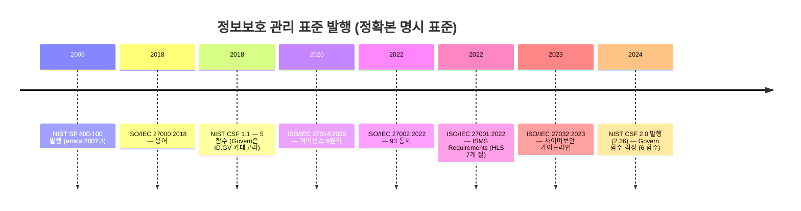
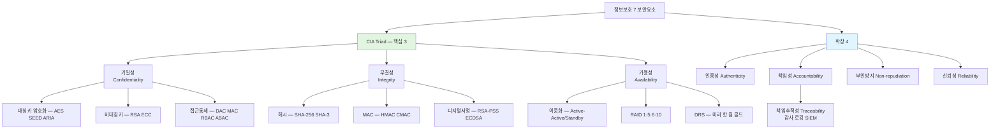
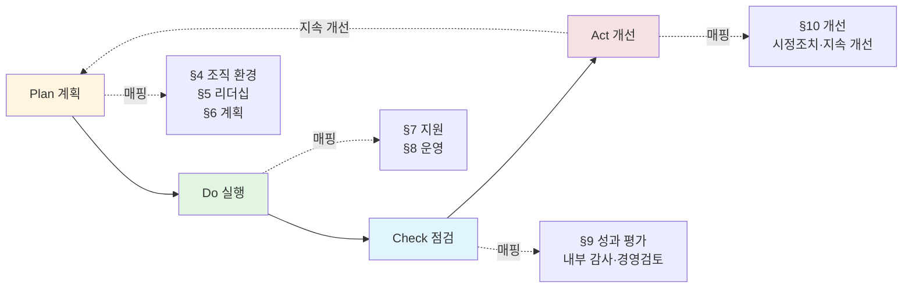
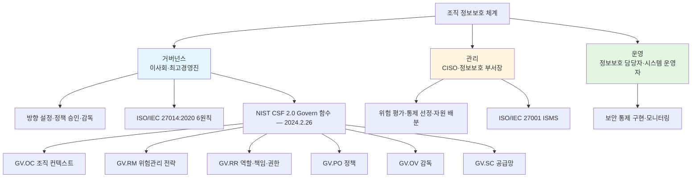

# 01. 정보보호 관리 개요 — 만화책처럼 읽는 CIA·PDCA·거버넌스·CISO

> **이 문서를 읽는 법**: 정보보호가 *왜 IT 부서의 책임이 아닌지*, *CIA 가 어떻게 충돌하는지*, *PDCA 가 왜 사라지지 않는지*, *NIST CSF 2.0 이 왜 Govern 함수를 추가했는지* — 표준 발행 순으로 따라가면 모든 시험 함정이 풀립니다.
> 정확한 정의·수치·표준 번호·법령 조문은 정확본을 참조: [[cs/information-security/05.management-and-law/01.security-management-overview|정확본 01. 정보보호 관리 개요]]

> **독자 가정**: *백엔드/풀스택 개발자, 정보보호 관리는 처음.* 이미 익숙한 개념 (`HTTPS`, `로그인 세션`, `백업`, `이중화`, `감사 로그`) 을 다리로 씁니다.

> **연결 단원**: 본 단원은 5과목 (정보보안 관리 및 법규) 의 토대. 이후 [[cs/information-security/05.management-and-law/02.risk-assessment|02 위험관리]] · [[cs/information-security/05.management-and-law/03.controls-implementation|03 보호대책]] · [[cs/information-security/05.management-and-law/04.incident-response-and-forensics|04 사고대응]] · [[cs/information-security/05.management-and-law/05.certifications|05 인증제도]] 가 모두 본 단원의 *CIA + 인증성·책임성* 보장을 위한 수단.

---

## 🎯 시작 전에 — 이미 쓰고 있는 정보보호

| 매일 보는 것 | 사실은 이 단원의 |
|---|---|
| HTTPS 결제 페이지 | 기밀성 + 무결성 (CIA) |
| 백업 + RAID 1·5·6·10 | 가용성 보호 메커니즘 |
| 로그인 시 OTP·생체 | 인증성 (Authenticity) |
| 모든 API 호출의 감사 로그 | 책임추적성 (Traceability) |
| 디지털서명·전자서명 | 부인방지 (Non-repudiation) |
| 정책·표준·지침·절차 사내 문서 | 4계층 문서체계 (§8) |
| 이사회의 정보보호 결의 | 거버넌스 (§5) |
| CISO·CPO 임명 공시 | 정보보호 조직 (§7) |
| 연 1회 정보보호 정책 재검토 | PDCA 의 Check·Act |
| ISO 27001 인증 마크 | ISMS 국제 표준 |

> **이 단원의 본질**: 정보보호는 *기술 통제 ❌* — *체계·지속·문서·경영 책임* 이 4 핵심. 시험은 (1) **CIA + 인증성·책임성** 분류 (2) **PDCA 사이클** (3) **거버넌스 vs 관리 vs 운영** (4) **CISO·CPO 법적 근거** (5) **4계층 문서 위계** *5 영역*을 묻는다.

---

## 📖 에피소드 1 — 정보보호의 정의: 종이 문서까지 포함하는 상위 개념

### 장면 1. ISO/IEC 27000:2018 의 한 줄

> **정보보호 (Information Security)**: 정보의 *기밀성·무결성·가용성의 보전*. 추가로 *진정성 (authenticity)·책임성 (accountability)·부인방지 (non-repudiation)·신뢰성 (reliability)* 을 포함할 수 있다.

ISO/IEC 27000:2018 §3.28 의 표준 정의. **CIA 가 핵심**이고 *4 가지 확장 요소*가 선택적으로 추가된다.

### 장면 2. *3 형제* — 정보보호 vs 사이버보안 vs 정보보안

| 용어 | 표준·법령 | 범위 |
|---|---|---|
| **정보보호 (Information Security)** | ISO/IEC 27000:2018 §3.28 | *모든 형태의 정보* (디지털·아날로그·구두). **종이 문서·구두 의사소통 포함** |
| **사이버보안 (Cybersecurity)** | ISO/IEC 27032:2023 §3.10 | *사이버 공간 (네트워크·디지털 시스템) 에 한정* |
| **정보보안** ([정보통신망법] §2) | [정보통신망 이용촉진 및 정보보호 등에 관한 법률] §2 | 정보의 수집·저장·검색·송신·수신 중 *훼손·변조·유출 방지를 위한 관리적·기술적 수단* |

> **핵심 포함 관계**: **정보보호 ⊃ 사이버보안**. 정보보호가 *상위*, 사이버보안은 *디지털 한정 부분집합*.

### 장면 3. 정보보호의 5 본질적 특성

정보보호는 단편적 보안 통제의 모음이 아니라 다음 5 가지 본질적 특성을 갖는다.

| 특성 | 의미 |
|---|---|
| **체계성** | 정책 → 표준 → 지침 → 절차의 4계층 문서 + PDCA 사이클로 운영 |
| **지속성** | 위협 환경 변화에 따라 위험 재평가 + 통제 갱신 (ISO/IEC 27001:2022 §10) |
| **위험 기반** | 모든 통제는 식별된 위험에 대응. 위험 ❌ 영역 통제는 비용 낭비 |
| **경영 책임** | 정보보호는 *최고경영진* 의 책임. IT 부서는 *운영 주체* 일 뿐 (ISO/IEC 27001:2022 §5.1) |
| **균형성** | CIA 는 *상호 충돌* 가능 (예: 기밀성 ↑ → 가용성 ↓). 비즈니스 요구에 맞춘 균형 |

### 장면 4. 정보보호의 *3 보호조치*

> **3 보호조치** = **관리적·기술적·물리적**.

[정보통신망법] §2 의 정의문도 동일하게 "관리적·기술적 수단" 을 명시한다. 이후 [[cs/information-security/05.management-and-law/03.controls-implementation|03 단원]] 에서 *관리적·물리적·기술적* 보호대책으로 세 갈래로 나뉜다.

### 시험 함정

- "정보보호는 IT 부서의 책임이다" → ❌ **틀림**. 최고경영진의 책임 (ISO/IEC 27001:2022 §5.1).
- "정보보호 = 사이버보안" → ❌ **틀림**. 정보보호 ⊃ 사이버보안 (포함 관계).
- "종이 문서는 정보보호 영역이 아니다" → ❌ **틀림**. 정보보호는 모든 형태의 정보 포함.
- "정보보호의 *3 보호조치*?" → **관리적·기술적·물리적**.

---

## 📖 에피소드 2 — 기밀성 (Confidentiality): 권한 있는 자만 안다

### 장면 1. 정의

> **기밀성** : 권한 있는 자만이 정보 자산에 접근하여 그 내용을 알 수 있도록 하는 것. 정당하지 않은 자에 의해 정보가 *노출되지 않도록* 보장.

기밀성은 "비밀 유지". 침해 시 **정보 유출·도청·스니핑** 으로 나타난다.

### 장면 2. 4 보호 메커니즘

| 보호 메커니즘 | 적용 사례 |
|---|---|
| **대칭키 암호화** | AES, SEED, ARIA — 데이터 저장·전송 시 암호화 ([[cs/information-security/04.security-general/05.crypto-algorithms|정확본 04-05 §4]]) |
| **비대칭키 암호화** | RSA, ECC — 키 교환·세션키 암호화 ([[cs/information-security/04.security-general/05.crypto-algorithms|정확본 04-05 §6]]) |
| **접근통제** | DAC, MAC, RBAC, ABAC ([[cs/information-security/04.security-general/02.access-control|정확본 04-02]]) |
| **물리적 통제** | 출입통제, 시설 보안 (5과목 03 §5) |

### 장면 3. 침해 사례

> **도청·스니핑** = *기밀성 침해*. 데이터 위변조 ❌ — 데이터를 *훔쳐 보는* 행위.

### 시험 함정

- "도청·스니핑은 무결성 침해?" → ❌ **틀림**. 기밀성 침해.
- "기밀성의 보호 메커니즘 4종?" → 대칭키·비대칭키·접근통제·물리적 통제.

---

## 📖 에피소드 3 — 무결성 (Integrity): 권한 있는 자만 바꾼다

### 장면 1. 정의

> **무결성** : 권한 있는 자만이 정보 자산을 *생성·수정·삭제* 할 수 있도록 보장. 정당하지 않은 자에 의해 정보가 *위·변조되지 않도록* 보장.

ISO/IEC 27000:2018 §3.36 은 무결성을 "**정확성 (accuracy) 과 완전성 (completeness) 의 속성**" 으로 정의한다.

### 장면 2. 4 보호 메커니즘

| 보호 메커니즘 | 적용 사례 |
|---|---|
| **암호학적 해시함수** | SHA-256, SHA-3 — 무결성 검증 ([[cs/information-security/04.security-general/06.hash-and-mac|정확본 04-06 §1]]) |
| **메시지 인증 코드 (MAC)** | HMAC, CMAC — 무결성 + 인증 ([[cs/information-security/04.security-general/06.hash-and-mac|정확본 04-06 §3]]) |
| **디지털서명·전자서명** | RSA-PSS, ECDSA — 무결성 + 인증 + 부인방지 ([[cs/information-security/04.security-general/04.digital-signature-pki|정확본 04-04 §1]]) |
| **접근통제 (쓰기 권한)** | Biba 모델 ([[cs/information-security/04.security-general/02.access-control|정확본 04-02 §4]]) |

### 장면 3. 침해 사례

> **위변조·중간자 공격·랜섬웨어** = *무결성 침해*. 랜섬웨어는 *무결성 + 가용성 동시 침해* (데이터 변조 + 접근 차단).

### 시험 함정

- "무결성의 ISO 27000 정의?" → 정확성 + 완전성.
- "디지털서명은 무엇을 보장?" → 무결성 + 인증 + 부인방지 (3 가지 동시).
- "MAC vs 디지털서명 — 부인방지?" → MAC 은 키 공유 → 부인방지 ❌. 디지털서명만 부인방지 ⭕.

---

## 📖 에피소드 4 — 가용성 (Availability): 필요할 때 쓸 수 있다

### 장면 1. 정의

> **가용성** : 권한 있는 자가 정보 자산에 접근하고자 할 때 *언제든지* 접근할 수 있도록 보장.

가용성 = "필요할 때 사용 가능함". 침해 시 **DoS·DDoS·랜섬웨어 (서비스 중단)·하드웨어 장애·재해** 로 나타난다.

### 장면 2. 5 보호 메커니즘

| 보호 메커니즘 | 적용 사례 |
|---|---|
| **시스템 이중화** | Active-Active, Active-Standby 클러스터 |
| **디스크 RAID** | RAID 1·5·6·10 — 디스크 장애 시 서비스 지속 |
| **백업·소산** | 정기 백업 + 원격지 보관 |
| **재해복구 (DRS)** | 미러·핫·웜·콜드 사이트 ([[cs/information-security/05.management-and-law/03.controls-implementation|정확본 05-03 §4-3]]) |
| **DDoS 대응** | Anti-DDoS 장비, CDN, 트래픽 정제 ([[cs/information-security/02.network-security/05.dos-ddos-drdos|정확본 02-05]]) |

### 장면 3. 침해 사례 — *DDoS·랜섬웨어가 가용성*

> **DDoS** = *가용성 침해*. 데이터 위변조 ❌ — *서비스 중단*.
>
> **랜섬웨어** = *가용성 + 무결성 동시 침해*. 데이터 암호화로 접근 차단 + 데이터 변조.

### 시험 함정

- "DDoS 는 무결성을 침해한다" → ❌ **틀림**. 가용성 침해.
- "백업은 무결성 보호 메커니즘?" → ❌ **틀림**. 가용성 보호 메커니즘.
- "랜섬웨어가 침해하는 보안요소?" → 가용성 + 무결성 (둘 다).

---

## 📖 에피소드 5 — CIA 의 균형과 충돌: *상호 모순*

### 장면 1. 셋이 충돌하는 순간

> **CIA Triad** 의 세 요소는 *서로 보완*인 동시에 *상호 충돌* 가능.

| 충돌 방향 | 예시 |
|---|---|
| **기밀성 ↑ → 가용성 ↓** | 강한 암호화·다중 인증은 인가된 사용자의 접근도 지연시킨다 |
| **무결성 ↑ → 가용성 ↓** | 모든 변경에 디지털서명·승인 절차를 요구하면 업무 처리 시간이 늘어난다 |
| **가용성 ↑ → 기밀성 ↓** | 누구나 접근 가능한 공개 시스템은 가용성은 높지만 기밀성은 보장 어렵다 |

### 장면 2. *균형의 결정 메커니즘*

> 조직은 자산의 **민감도와 비즈니스 요구** 에 따라 균형을 결정. ISO/IEC 27001:2022 §6.1.2 의 **위험 평가 절차** 가 이 균형을 결정하는 *공식 메커니즘*.

[[cs/information-security/05.management-and-law/02.risk-assessment|02 단원 위험관리]] 가 바로 이 균형 결정 절차를 다룬다.

### 장면 3. 사고 ↔ CIA 매핑 (시험 빈출)

| 사고 | 침해 보안요소 |
|---|---|
| 도청·스니핑 | 기밀성 |
| 위·변조 | 무결성 |
| DDoS | 가용성 |
| 랜섬웨어 | 가용성 + 무결성 |
| MITM (중간자 공격) | 무결성 + 기밀성 + 인증성 |
| 신원 도용·스푸핑 | 인증성 |

### 시험 함정

- "MITM 공격이 침해하는 보안요소?" → 무결성 + 기밀성 + 인증성 (셋 다).
- "공개 시스템은 가용성·기밀성 모두 높다" → ❌ **틀림**. 가용성 ↑ 시 기밀성 ↓.
- "CIA 균형 결정의 공식 메커니즘?" → ISO/IEC 27001:2022 §6.1.2 위험 평가 절차.

---

## 📖 에피소드 6 — 인증성 (Authenticity): "누가" 보냈는가

### 장면 1. 정의 + *2 측면*

> **인증성** : 정보 자산에 접근하려는 자의 *신원이 주장된 실체와 일치* 함을 보이는 것. 또한 *메시지가 올바른 상대방이 보낸 메시지* 임을 보장하는 것.

ISO/IEC 27000:2018 §3.6 (authenticity) 의 표준 정의. 인증성은 *2 측면*을 가진다.

| 측면 | 영문 | 메커니즘 |
|---|---|---|
| **사용자 인증** | Entity Authentication | 지식·소유·존재·위치·행위 기반 ([[cs/information-security/04.security-general/01.authentication|정확본 04-01 §1]]) |
| **메시지 인증** | Message Authentication | MAC, 디지털서명·전자서명 ([[cs/information-security/04.security-general/04.digital-signature-pki|정확본 04-04]], [[cs/information-security/04.security-general/06.hash-and-mac|정확본 04-06]]) |

### 장면 2. *인증성 vs 무결성* — 시험 빈출

> **인증성** = "**누가**" 보냈는지의 보장 (송신자 신원).
>
> **무결성** = "**무엇이**" 변경되지 않았는지의 보장 (메시지 내용).

### 장면 3. 침해 사례

> **신원 도용·스푸핑** = *인증성 침해*. 자신의 신원을 위장하여 시스템에 접근.

### 시험 함정

- "인증성 = 무결성?" → ❌ **틀림**. 인증성은 *누가*, 무결성은 *무엇이*.
- "인증성의 *2 측면*?" → 사용자 인증 + 메시지 인증.
- "스푸핑이 침해하는 보안요소?" → 인증성.

---

## 📖 에피소드 7 — 책임성 (Accountability): 책임추적성 + 부인방지

### 장면 1. 정의 + *2 하위 요소*

> **책임성** : 정보 자산에 접근하는 자가 *접근 결과에 대해 책임지도록* 보장.

ISO/IEC 27000:2018 §3.2 (accountability) 의 표준 정의. 책임성은 다음 2 하위 요소로 구분.

| 하위 요소 | 영문 | 정의 | 핵심 메커니즘 |
|---|---|---|---|
| **책임추적성** | Traceability | 주체를 *고유 식별* 하여 행위를 추적할 수 있도록 보장 | 감사·로깅 (Audit Logging), SIEM |
| **부인방지** | Non-repudiation | 주체가 한 행위를 *나중에 부인하지 못하도록* 보장 (ISO/IEC 27000:2018 §3.50) | 디지털서명·전자서명, 타임스탬프 |

### 장면 2. *책임추적성의 전제* — 고유 식별

> **계정 공유는 책임추적성을 무너뜨린다.** 모든 주체가 *고유하게 식별* 되어야 행위 추적 가능.

### 장면 3. *부인방지의 핵심 — 디지털서명*

> **MAC 만으로는 부인방지 ❌** — 둘 다 키를 공유하므로 송신자 특정 불가.
>
> **디지털서명만 부인방지 가능** — 송신자의 *개인키* 로 서명, 공개키로 검증.

### 장면 4. 4 확장 보안요소 종합

| 확장 요소 | 정의 | 핵심 메커니즘 | 침해 사례 |
|---|---|---|---|
| **인증성** | 신원 일치 보장 | 패스워드, OTP, 생체인증, 디지털서명 | 신원 도용, 스푸핑 |
| **책임추적성** | 행위 추적 가능성 | 감사 로깅, SIEM | 로그 미생성·삭제 |
| **부인방지** | 행위 부인 불가 | 디지털서명, 타임스탬프 | 송신/수신 부인 |
| **신뢰성 (Reliability)** | 의도된 동작 보장 (ISO/IEC 27000:2018 §3.55) | 결함 허용, 정합성 검사 | 시스템 오작동 |

### 시험 함정

- "MAC 만으로 부인방지가 가능하다" → ❌ **틀림**. 키 공유로 송신자 특정 불가 → 디지털서명 필요.
- "책임추적성의 전제?" → **고유 식별** (계정 공유 시 무너짐).
- "신뢰성 (Reliability) 의 ISO 27000 정의?" → 의도된 동작 보장 (§3.55).

---

## 📖 에피소드 8 — PDCA 사이클: 정보보호의 시간 축

### 장면 1. ISMS 의 정의

> **정보보호 관리체계 (ISMS, Information Security Management System)** : 조직이 정보보호의 목표를 달성하기 위해 *정책·조직·프로세스·기술* 을 결합한 *체계적·문서화된 관리 시스템*.

ISO/IEC 27001:2022 의 표준 정의. ISMS 는 단편적 통제의 집합 ❌ — **PDCA (Plan-Do-Check-Act) 사이클** 로 운영되는 *지속적 관리 시스템*.

### 장면 2. PDCA 4 단계

| 단계 | 한국어 | ISO/IEC 27001:2022 매핑 | 활동 |
|---|---|---|---|
| **Plan** | 계획 | §4 (조직 환경)·§5 (리더십)·§6 (계획) | 조직·이해관계자 식별 / 범위 결정 / 위험 평가·처리 / 정보보호 목표 수립 |
| **Do** | 실행 | §7 (지원)·§8 (운영) | 자원 확보 / 인식·교육 / 위험 처리 계획 실행 / 통제 운영 |
| **Check** | 점검 | §9 (성과 평가) | 모니터링·측정·분석·평가 / 내부 감사 / 경영검토 |
| **Act** | 개선 | §10 (개선) | 부적합 사항·시정 조치 / 지속적 개선 |

### 장면 3. *2022 개정의 의미*

> **ISO/IEC 27001:2013** 까지는 PDCA 가 *명시적*으로 표준 본문에 등장.
>
> **ISO/IEC 27001:2022** 는 ISO/IEC Management System Standards 통합 구조 (HLS, High Level Structure) 를 따라 PDCA 와 *동등한 7개 절 (§4~§10)* 로 재편성.

PDCA 용어가 사라진 것이 아니라 *7개 절 구조로 흡수*. 시험에서는 *2013 vs 2022* 의 표기 차이를 함정으로 출제.

### 장면 4. PDCA 의 *2 핵심 메시지*

1. **정보보호는 1회성 프로젝트가 아니라 지속적 관리 활동.** 위험 환경이 변하면 통제도 변해야 한다.
2. **계획만으로는 보안이 달성되지 않는다.** 실행·점검·개선의 사이클이 닫혀야 효과.

ISO/IEC 27001:2022 §10.2 는 "**지속적 개선 (Continual Improvement)**" 을 *명시 요구사항*으로 둔다.

### 시험 함정

- "PDCA 의 Plan 에서 무엇을 하는가?" → 위험 평가·정보보호 목표 수립.
- "내부 감사·경영검토는 어느 단계?" → **Check**.
- "시정조치는 어느 단계?" → **Act** (모니터링이 아님).
- "ISO/IEC 27001:2022 는 PDCA 를 직접 사용?" → ❌ HLS 7개 절 (§4~§10) 로 재편 (PDCA 용어 미사용).

---

## 📖 에피소드 9 — 거버넌스: ISO/IEC 27014:2020 6원칙

### 장면 1. 거버넌스의 정체

> **정보보호 거버넌스 (Information Security Governance)** : 조직의 정보보호 활동이 *비즈니스 목표와 정렬* 되고, 위험이 *적절히 관리* 되며, 자원이 *책임감 있게 사용* 되도록 보장하는 **이사회·최고경영진의 활동**.

ISO/IEC 27014:2020 (Governance of Information Security) 의 표준 정의.

### 장면 2. *거버넌스 vs 관리* — 시험 빈출

> **관리 (Management)** = "**어떻게** 운영할지".
>
> **거버넌스 (Governance)** = "**무엇을·왜** 해야 하는지를 결정하고 감독".

### 장면 3. ISO/IEC 27014:2020 거버넌스 6원칙

| 원칙 | 의미 |
|---|---|
| **조직 전반에 걸친 정보보호 수립** | 정보보호를 IT 부서로 한정하지 않고 모든 비즈니스 활동에 통합 |
| **위험 기반 접근** | 모든 의사결정을 식별된 위험에 근거하여 |
| **투자 결정 방향 설정** | 정보보호 투자가 비즈니스 가치 창출에 기여하는 방향으로 |
| **내·외부 요구사항 준수** | 법령·계약·이해관계자 요구사항 준수 |
| **보안 친화적 환경 조성** | 정보보호가 조직 문화의 일부가 되도록 |
| **비즈니스 결과에 대한 성과 검토** | 정보보호 성과를 비즈니스 결과와 연계하여 측정·검토 |

### 시험 함정

- "ISO/IEC 27014 의 정체?" → 거버넌스 표준 (관리 표준 ❌ — 27001).
- "거버넌스 = 관리?" → ❌ **틀림**. 거버넌스는 *방향 설정·감독*, 관리는 *운영*.
- "ISO/IEC 27014:2020 의 거버넌스 원칙 수?" → **6**.

---

## 📖 에피소드 10 — NIST CSF 2.0: Govern 함수의 격상

### 장면 1. NIST CSF 2.0 의 6 함수

> **NIST Cybersecurity Framework (CSF) 2.0** (2024.2.26 발행) 은 기존 5개 함수에 **Govern** 을 추가하여 **6개 함수**로 재편.

| 함수 | 역할 |
|---|---|
| **Govern** (신규 — 2.0) | 거버넌스 — 조직 컨텍스트·전략·역할·정책·감독·공급망 |
| **Identify** | 자산·위험·관리 환경 식별 |
| **Protect** | 보호 통제 적용 |
| **Detect** | 사고 탐지 |
| **Respond** | 사고 대응 |
| **Recover** | 복구 |

### 장면 2. Govern 함수의 6 카테고리

| Govern 카테고리 | 약칭 | 내용 |
|---|---|---|
| Organizational Context | GV.OC | 조직의 사명·이해관계자·법규 환경 이해 |
| Risk Management Strategy | GV.RM | 위험관리 전략·우선순위 수립 |
| Roles, Responsibilities, and Authorities | GV.RR | 사이버보안 역할·책임·권한 정의 |
| Policy | GV.PO | 사이버보안 정책 수립 및 시행 |
| Oversight | GV.OV | 사이버보안 전략·결과의 감독 및 검토 |
| Cybersecurity Supply Chain Risk Management | GV.SC | 공급망 위험관리 |

### 장면 3. *왜 격상되었는가*

> **NIST CSF 1.1** (2018.4) 까지는 거버넌스가 *Identify 함수 하위의 한 카테고리 (ID.GV)* 에 불과.
>
> **2.0** 에서 **별도 최상위 함수로 격상** — 거버넌스가 *다른 모든 함수 (Identify·Protect·Detect·Respond·Recover) 의 토대* 가 됨을 강조.

### 장면 4. 거버넌스 vs 관리 vs 운영 — 3 계층

| 계층 | 주체 | 활동 |
|---|---|---|
| **거버넌스** | 이사회·최고경영진 | 방향 설정, 정책 승인, 감독 |
| **관리** | CISO·정보보호 부서장 | 위험 평가, 통제 선정, 자원 배분 |
| **운영** | 정보보호 담당자·시스템 운영자 | 보안 통제 구현·운영·모니터링 |

### 시험 함정

- "NIST CSF 1.1 의 함수 수?" → **5** (Identify·Protect·Detect·Respond·Recover).
- "NIST CSF 2.0 의 함수 수?" → **6** (Govern 추가).
- "NIST CSF 2.0 발행 시점?" → **2024.2.26**.
- "1.1 의 Govern 위치?" → Identify 하위 카테고리 (ID.GV).

---

## 📖 에피소드 11 — 정보보호 전략 5단계

### 장면 1. 전략의 정체 + *정책과의 차이*

> **정보보호 전략** : 조직의 *비즈니스 목표·법규 환경·위험 환경* 을 고려하여 *정보보호의 방향성과 우선순위* 를 정의한 **중장기 계획**.

전략은 정책 (§8 — 에피소드 13) 의 *상위 개념*.

| 비교 | 전략 | 정책 |
|---|---|---|
| 목적 | "**왜** 그 방향으로 가야 하는지" 를 비즈니스 관점에서 설명 | "**무엇을** 해야 하는지" 를 명문화 |
| 시계 | 중장기 (3~5년) | 통상 연 1회 갱신 |
| 수립 주체 | 이사회·최고경영진 | 정보보호 위원회·CISO |

### 장면 2. 전략 수립 5 단계

NIST SP 800-100 (Information Security Handbook) 와 KISA 정보보호 관리체계 가이드를 종합한 절차.

| 단계 | 활동 |
|---|---|
| **1. 환경 분석** | 비즈니스 환경·이해관계자·법규·위협 동향 분석 |
| **2. 현황 평가** | 현재 정보보호 수준 진단 (Gap Analysis) |
| **3. 목표 설정** | To-Be 정보보호 수준·핵심 성과 지표 (KPI) 정의 |
| **4. 전략 수립** | 우선순위·로드맵·예산·자원 배분 결정 |
| **5. 이행 및 평가** | 전략 실행 + 정기 평가·갱신 |

### 장면 3. 전략 문서의 핵심 구성

정보보호 전략 문서는 일반적으로 다음 요소를 포함.

- 비즈니스 목표와 정보보호의 정렬
- 정보보호 비전·미션
- 정보보호 원칙 (예: Defense in Depth, Least Privilege, Zero Trust)
- 중장기 목표 (3~5년) 와 KPI
- 우선순위 영역 (위험 기반)
- 예산·자원·조직
- 거버넌스·보고 체계

### 시험 함정

- "전략 = 정책?" → ❌ **틀림**. 전략 (왜·중장기) ⊃ 정책 (무엇).
- "전략 수립의 출발점?" → **비즈니스 환경·이해관계자 요구** 분석.
- "전략의 시계?" → 중장기 (3~5년).

---

## 📖 에피소드 12 — CISO·CPO: 정보보호 조직과 법적 근거

### 장면 1. CISO — 정보보호 최고책임자

> **CISO (Chief Information Security Officer, 정보보호 최고책임자)** : 조직의 정보보호 활동을 총괄하는 *임원급 책임자*.

| 구분 | 내용 |
|---|---|
| **법적 근거** | [정보통신망법] §45-3 (정보보호 최고책임자의 지정 등) |
| **지정 의무자** | 일정 규모 이상의 정보통신서비스 제공자 (시행령에 따른 자산·매출·이용자 수 기준) |
| **신고 의무** | 과학기술정보통신부 장관에게 신고 |
| **겸직 제한** | 일정 규모 이상의 사업자는 CISO 가 *다른 직무 겸직 제한* (정보통신망법 §45-3 ②항·③항 — 시행령 기준) |
| **자격 요건** | 정보보호 또는 정보기술 분야 일정 경력 (시행령) |

### 장면 2. CISO 의 5 핵심 책임

- 정보보호 정책·계획 수립·시행
- 정보보호 위험 식별·평가·대응
- 정보보호 사고 대응 총괄
- 임직원 정보보호 교육
- 법규 준수 및 감독기관 보고

### 장면 3. CPO — 개인정보 보호책임자

> **CPO (Chief Privacy Officer, 개인정보 보호책임자)** : 조직의 *개인정보 처리 업무* 를 총괄하는 책임자.

[개인정보보호법] §31 은 개인정보처리자가 CPO 를 지정할 의무를 부과한다. [[cs/information-security/05.management-and-law/08.privacy-law|08 단원 §6]] 에서 상세히 다룬다.

### 장면 4. CISO vs CPO — 시험 빈출 1순위

| 구분 | CISO | CPO |
|---|---|---|
| **법적 근거** | [정보통신망법] §45-3 | [개인정보보호법] §31 |
| **보호 대상** | 정보보호 일반 (CIA) | 개인정보 |
| **임명 의무자** | 정보통신서비스 제공자 | 개인정보처리자 (공공·민간 모두) |
| **겸직 가능 여부** | 일정 규모 이상 겸직 제한 | 법령상 별도 제한 없음 (단 CISO 와 분리 운영 권장) |

### 장면 5. 정보보호 조직 구성 — *분리 원칙*

ISO/IEC 27002:2022 §5.2 와 KISA ISMS-P 인증기준 1.1.2 는 다음을 요구.

- **정보보호 위원회** : 최고경영진·CISO·CPO·관련 부서장. 정책 심의·중요 의사결정.
- **정보보호 실무 조직** : CISO 산하의 전담 조직. 정책 수립·위험 관리·통제 운영.
- **현업 보안 담당자** : 각 부서별로 지정된 보안 담당자.
- **분리 원칙** : 정보보호 부서는 IT 운영 부서와 *조직적으로 분리* — *자가 점검의 객관성 확보*.

### 시험 함정

- "CISO 의 법적 근거?" → [정보통신망법] §45-3.
- "CPO 의 법적 근거?" → [개인정보보호법] §31.
- "CISO 와 CPO 의 법적 근거가 동일?" → ❌ **틀림**. 정보통신망법 vs 개인정보보호법.
- "정보보호 부서는 IT 운영 부서와 같이 두어도 된다" → ❌ **틀림**. *분리* — 객관성·독립성.

---

## 📖 에피소드 13 — 4계층 문서체계: 정책 > 표준 > 지침 > 절차

### 장면 1. 정책의 정체

> **정보보호 정책 (Policy)** : 조직의 정보보호 *목적과 활동* 에 관한 사항을 정의한 **최상위 문서**. 경영진의 의지·방향, 역할과 책임, 대상과 범위, 관리적·기술적·물리적 정보보호 활동의 *근거* 를 포함.

ISO/IEC 27002:2022 §5.1 + KISA ISMS-P 인증기준 1.1.5.

### 장면 2. 4 계층 문서의 정의

| 계층 | 정의 | 강제성 | 작성 단위 |
|---|---|---|---|
| **정책 (Policy)** | 조직의 정보보호 목적·활동에 관한 사항을 정의한 *최상위 문서* | **강제** | 조직 전체 1개 |
| **표준 (Standard)** | 정책 달성을 위한 *세부 요구사항* 을 구체적으로 정의한 규정 | **강제** | 영역별 (예: 패스워드 표준, 암호화 표준) |
| **지침 (Guideline)** | 특정 시스템·분야별로 활동에 *필요하거나 도움이 되는* 세부 요구사항 | **권고** (융통성) | 시스템·환경별 |
| **절차 (Procedure)** | 정책·표준·지침을 준수하기 위해 *어떻게* 수행해야 하는지를 단계적으로 설명한 문서 | **강제** (수행 시) | 업무별 |

### 장면 3. 표준 vs 지침 vs 절차 — 시험 빈출

| 문서 | 답하는 질문 | 강제성 | 예시 |
|---|---|---|---|
| **표준** | "**무엇을 충족**해야 하는가" | 강제 | "패스워드는 12자 이상, 영문·숫자·특수문자 혼합" |
| **지침** | "**어떻게 충족**할 수 있는가" | 권고 (융통성) | "패스워드 관리자 사용을 권장한다. 단, 부득이한 경우 ..." |
| **절차** | "**구체적인 수행 방법**" | 강제 (수행 시) | "1. 시스템 관리자가 신규 계정 생성 → 2. 임시 패스워드 발급 → 3. 첫 로그인 시 강제 변경 ..." |

### 장면 4. 정책의 6 필수 구성요소

정책 문서가 갖추어야 할 핵심 요소.

- **목적과 적용 범위** : 정책이 다루는 영역 및 적용 대상
- **경영진의 의지·약속** : 최고경영진의 정보보호 의지를 명시한 *서명·승인*
- **역할과 책임** : CISO·CPO·정보보호 위원회·임직원의 R&R
- **법적·계약상 요구사항** : 준수해야 할 법령·계약·표준
- **위반 시 조치** : 정책 위반에 대한 징계·법적 대응
- **검토·갱신 주기** : 정기 재검토 주기 (일반적으로 연 1회 이상)

### 장면 5. 정책 검토 주기

ISO/IEC 27001:2022 §7.5.2 + KISA ISMS-P 인증기준 1.1.5 는 정기적 재검토를 요구.

- **정기 검토** : *최소 연 1회*
- **비정기 검토** :
  - 조직·사업의 중대 변경 시
  - 법령 개정 시
  - 신규 위협·취약점 식별 시
  - 침해사고 발생 시
  - 신기술 도입 시

### 시험 함정

- "4계층 문서 위계?" → **정책 > 표준 > 지침 > 절차**.
- "지침은 강제 요구사항이다" → ❌ **틀림**. 지침은 *권고·융통성* (표준이 강제).
- "정책 검토 주기?" → **최소 연 1회**.
- "정책 문서에 경영진 서명이 필요한가?" → ⭕ **필수**.
- "절차의 답하는 질문?" → "*어떻게* 수행" — 단계적 설명.

---

## 📑 종합 비교 (에피소드 2~7 정리)

CIA Triad + 확장 보안요소 *7 보안요소* 종합.

| 보안요소 | 정의 | 핵심 메커니즘 | 침해 사례 |
|---|---|---|---|
| **기밀성** | 권한 있는 자만 *알* 수 있도록 | 암호화 (대칭·비대칭), 접근통제 | 도청·스니핑 |
| **무결성** | 권한 있는 자만 *변경* 할 수 있도록 | 해시, MAC, 디지털서명 | 위·변조, 중간자 공격 |
| **가용성** | *필요할 때 사용 가능* | 이중화, RAID, 백업, DRS, DDoS 대응 | DDoS, 랜섬웨어 |
| **인증성** | *신원 일치* 보장 | 패스워드, OTP, 생체, 디지털서명 | 신원 도용, 스푸핑 |
| **책임추적성** | *행위 추적* 가능성 | 감사 로깅, SIEM | 로그 미생성·삭제 |
| **부인방지** | *행위 부인 불가* | 디지털서명, 타임스탬프 | 송신/수신 부인 |
| **신뢰성** | *의도된 동작* 보장 | 결함 허용, 정합성 검사 | 시스템 오작동 |

> **읽는 법**: CIA 가 *3 핵심*, 확장 4 가지가 *상황별 추가*. 시험은 *사고 → 침해 보안요소* 매핑을 묻는다.

---

## 🗺️ 마인드맵 1 — 정보보호 표준 발행 시간선



---

## 🗺️ 마인드맵 2 — CIA + 확장 4 보안요소



---

## 🗺️ 마인드맵 3 — PDCA ↔ ISO/IEC 27001:2022 매핑



---

## 🗺️ 마인드맵 4 — 거버넌스·관리·운영 3 계층 + NIST CSF 2.0 6 함수



---

## 🗺️ 마인드맵 5 — 4계층 문서체계 결정 트리

```mermaid
graph TD
  Q[정보보호 문서 작성] --> Q1{무엇을 정의?}

  Q1 -- 조직 전체의 목적·방향 --> POL[정책 Policy<br/>최상위 / 강제 / 1개 / 경영진 서명 필수<br/>최소 연 1회 검토]
  Q1 -- 영역별 강제 요구사항 --> STD[표준 Standard<br/>강제 / 영역별<br/>예: 패스워드 12자 이상]
  Q1 -- 시스템·환경별 권고 --> GUI[지침 Guideline<br/>권고 / 융통성<br/>예: 패스워드 관리자 권장]
  Q1 -- 단계적 수행 방법 --> PRO[절차 Procedure<br/>강제 (수행 시) / 업무별<br/>예: 신규 계정 생성 1·2·3 단계]

  POL -.위계.-> STD
  STD -.위계.-> GUI
  GUI -.위계.-> PRO

  style POL fill:#fff5e1
  style STD fill:#e1f5e1
  style GUI fill:#e1f5ff
  style PRO fill:#f5e1f5
```

---

## 🗂️ 키워드 클러스터

### 정보보호 정의

```
ISO/IEC 27000:2018 §3.28        — 정보보호 = CIA 보전 + (인증성·책임성·부인방지·신뢰성)
ISO/IEC 27032:2023 §3.10        — 사이버보안 = 사이버 공간 한정 (정보보호 ⊃ 사이버보안)
[정보통신망법] §2                — 정보보안 = 정보의 훼손·변조·유출 방지 관리적·기술적 수단
3 보호조치                       — 관리적·기술적·물리적
```

### CIA Triad 침해 매핑

```
도청·스니핑           — 기밀성
위·변조              — 무결성
DDoS                — 가용성
랜섬웨어              — 가용성 + 무결성
MITM 중간자          — 무결성 + 기밀성 + 인증성
신원 도용·스푸핑       — 인증성
로그 미생성·삭제       — 책임추적성
송신/수신 부인         — 부인방지
시스템 오작동          — 신뢰성
```

### ISO/IEC 27000 시리즈

```
27000:2018          — 용어 (Vocabulary)
27001:2022          — ISMS Requirements (HLS 7개 절 §4~§10)
27002:2022          — Controls (93개 통제 / 4 카테고리)
27014:2020          — 거버넌스 6원칙
27032:2023          — 사이버보안 가이드라인
```

### NIST 표준

```
SP 800-100 (2006.10, errata 2007.3)  — Information Security Handbook
CSF 1.1 (2018.4)                     — 5 함수 (Govern은 ID.GV 카테고리)
CSF 2.0 (2024.2.26)                  — 6 함수 (Govern 격상 — GV.OC/RM/RR/PO/OV/SC)
```

### PDCA ↔ ISO/IEC 27001:2022

```
Plan  — §4 (조직 환경) · §5 (리더십) · §6 (계획)
Do    — §7 (지원) · §8 (운영)
Check — §9 (성과 평가) · 내부 감사·경영검토
Act   — §10 (개선) · 시정조치·지속 개선
```

### 한국 법령 — CISO·CPO

```
CISO  — [정보통신망법] §45-3 (정보보호 최고책임자의 지정 등) — 일정 규모 이상 정보통신서비스 제공자 의무
CPO   — [개인정보보호법] §31 (개인정보 보호책임자의 지정 등) — 개인정보처리자 (공공·민간) 의무
분리 권장 — CISO 와 CPO 분리 + 정보보호 부서와 IT 운영 부서 분리
```

### 4계층 문서

```
정책 Policy     — 최상위 / 강제 / 1개 / 경영진 서명 / 최소 연 1회 검토
표준 Standard   — 강제 / 영역별 / "무엇을 충족"
지침 Guideline  — 권고 / 시스템·환경별 / "어떻게 충족"
절차 Procedure  — 강제 (수행 시) / 업무별 / "구체적 수행 방법"
```

### 거버넌스 vs 관리 vs 운영

```
거버넌스  — 이사회·최고경영진 / 방향 설정·정책 승인·감독 / "무엇을·왜"
관리     — CISO·정보보호 부서장 / 위험 평가·통제 선정·자원 배분 / "어떻게"
운영     — 정보보호 담당자·시스템 운영자 / 보안 통제 구현·모니터링
```

---

## 🃏 회상 30문항

> 답을 가린 뒤 자가 채점. 틀린 것만 정확본으로 깊이 학습.

**A. 정보보호 정의 (1~5)**
1. ISO/IEC 27000:2018 §3.28 의 정보보호 정의?
2. 정보보호와 사이버보안의 포함 관계?
3. 정보보안 정의를 담은 한국 법령은?
4. 정보보호의 3 보호조치는?
5. 정보보호의 5 본질적 특성?

**B. CIA Triad (6~12)**
6. 기밀성의 4 보호 메커니즘?
7. 무결성의 ISO 27000 정의?
8. 무결성의 4 보호 메커니즘?
9. 가용성의 5 보호 메커니즘?
10. 랜섬웨어가 침해하는 보안요소?
11. MITM 공격이 침해하는 보안요소?
12. CIA 균형 결정의 공식 메커니즘은?

**C. 인증성·책임성 (13~17)**
13. 인증성의 2 측면?
14. 인증성과 무결성의 차이를 한 문장으로?
15. 책임성의 2 하위 요소?
16. MAC 만으로 부인방지가 가능한가?
17. 신뢰성 (Reliability) 의 ISO 27000 정의?

**D. PDCA·ISO 27001:2022 (18~21)**
18. PDCA 4단계?
19. ISO/IEC 27001:2022 의 §4~§10 매핑?
20. 내부 감사·경영검토는 PDCA 의 어느 단계?
21. ISO/IEC 27001:2022 가 PDCA 를 직접 사용하는가?

**E. 거버넌스·NIST CSF (22~25)**
22. ISO/IEC 27014:2020 거버넌스 원칙 수?
23. NIST CSF 1.1 vs 2.0 함수 수?
24. NIST CSF 2.0 발행 시점?
25. Govern 함수의 6 카테고리 약칭?

**F. 조직·문서 (26~30)**
26. CISO 의 법적 근거?
27. CPO 의 법적 근거?
28. 4계층 문서 위계?
29. 정책의 정기 검토 주기?
30. 정보보호 부서와 IT 운영 부서의 관계?

---

## ⚠️ 시험 함정 모음

| 함정 | 정답 |
|---|---|
| 정보보호는 IT 부서의 책임이다 | ❌ 최고경영진의 책임 (ISO/IEC 27001:2022 §5.1) |
| 정보보호 = 사이버보안 | ❌ 정보보호 ⊃ 사이버보안 (포함 관계) |
| 종이 문서는 정보보호 영역이 아니다 | ❌ 정보보호는 모든 형태의 정보 포함 |
| 도청·스니핑은 무결성 침해 | ❌ 기밀성 침해 |
| DDoS 는 무결성 침해 | ❌ 가용성 침해 |
| 백업은 무결성 보호 메커니즘 | ❌ 가용성 보호 메커니즘 |
| 랜섬웨어는 가용성만 침해 | ❌ 가용성 + 무결성 (둘 다) |
| MAC 만으로 부인방지 가능 | ❌ 키 공유로 송신자 특정 불가 → 디지털서명 필요 |
| 인증성 = 무결성 | ❌ 인증성은 *누가*, 무결성은 *무엇이* |
| 계정 공유해도 책임추적성 유지 | ❌ 고유 식별 무너짐 |
| ISO/IEC 27001:2022 는 PDCA 명시 | ❌ HLS 7개 절 (§4~§10) 로 재편 (2013 까지만 명시) |
| 시정조치는 PDCA 의 Check 단계 | ❌ Act 단계 |
| 거버넌스 = 관리 | ❌ 거버넌스 (무엇을·왜·감독) ≠ 관리 (어떻게) |
| ISO/IEC 27014 는 ISMS 표준 | ❌ 거버넌스 표준 (ISMS 표준은 27001) |
| NIST CSF 1.1 의 함수 수는 6 | ❌ **5** (Govern 미존재) |
| NIST CSF 2.0 의 함수 수는 5 | ❌ **6** (Govern 추가) |
| NIST CSF 2.0 은 2024년 1월 발행 | ❌ **2024.2.26** |
| CISO 는 개인정보보호법으로 지정 | ❌ 정보통신망법 §45-3 |
| CPO 는 정보통신망법으로 지정 | ❌ 개인정보보호법 §31 |
| 정보보호 부서는 IT 운영 부서와 함께 | ❌ 분리 — 객관성·독립성 |
| 4계층 위계: 표준 > 정책 > 지침 > 절차 | ❌ 정책 > 표준 > 지침 > 절차 |
| 지침은 강제 요구사항 | ❌ 지침은 권고 (융통성) |
| 정책은 5년에 한 번 검토 | ❌ 최소 연 1회 |
| 정책 문서에 경영진 서명은 선택 | ❌ 필수 구성요소 |
| 전략 = 정책 | ❌ 전략 (왜·중장기) ⊃ 정책 (무엇) |

---

## 🔗 정확본 매핑표

| 본 노트 에피소드 | 정확본 § |
|---|---|
| 에피소드 1 (정보보호 정의·5 특성) | [[cs/information-security/05.management-and-law/01.security-management-overview#§1. 정보보호의 정의와 목적\|정확본 §1]] |
| 에피소드 2 (기밀성) | [[cs/information-security/05.management-and-law/01.security-management-overview#§2-1. 기밀성 (Confidentiality)\|정확본 §2-1]] |
| 에피소드 3 (무결성) | [[cs/information-security/05.management-and-law/01.security-management-overview#§2-2. 무결성 (Integrity)\|정확본 §2-2]] |
| 에피소드 4 (가용성) | [[cs/information-security/05.management-and-law/01.security-management-overview#§2-3. 가용성 (Availability)\|정확본 §2-3]] |
| 에피소드 5 (CIA 균형·충돌) | [[cs/information-security/05.management-and-law/01.security-management-overview#§2-4. CIA 의 균형과 충돌\|정확본 §2-4]] |
| 에피소드 6 (인증성) | [[cs/information-security/05.management-and-law/01.security-management-overview#§3-1. 인증성 (Authenticity)\|정확본 §3-1]] |
| 에피소드 7 (책임성·부인방지·신뢰성) | [[cs/information-security/05.management-and-law/01.security-management-overview#§3-2. 책임성 (Accountability)\|정확본 §3-2]] |
| 에피소드 8 (PDCA + ISO 27001:2022) | [[cs/information-security/05.management-and-law/01.security-management-overview#§4. 정보보호 관리의 개념 — PDCA 사이클\|정확본 §4]] |
| 에피소드 9 (거버넌스·ISO 27014) | [[cs/information-security/05.management-and-law/01.security-management-overview#§5-1. ISO/IEC 27014:2020 거버넌스 6원칙\|정확본 §5-1]] |
| 에피소드 10 (NIST CSF 2.0 Govern) | [[cs/information-security/05.management-and-law/01.security-management-overview#§5-2. NIST CSF 2.0 — Govern 함수\|정확본 §5-2·§5-3]] |
| 에피소드 11 (전략 5단계) | [[cs/information-security/05.management-and-law/01.security-management-overview#§6. 정보보호 전략 수립\|정확본 §6]] |
| 에피소드 12 (CISO·CPO·조직) | [[cs/information-security/05.management-and-law/01.security-management-overview#§7. 정보보호 조직과 역할\|정확본 §7]] |
| 에피소드 13 (4계층 문서·정책 검토) | [[cs/information-security/05.management-and-law/01.security-management-overview#§8. 정보보호 정책·표준·지침·절차 4계층 문서체계\|정확본 §8]] |

---

## 📅 학습 흐름 (8주차 시험 대비 기준)

```
[1주]   에피소드 1 (정보보호 정의·5 특성) — 만화책 통독, 3 형제 (정보보호·사이버보안·정보보안) 외움
[2주]   에피소드 2·3·4 (CIA Triad) — 보호 메커니즘 매핑 외움
[3주]   에피소드 5 (CIA 균형) + 사고 → 보안요소 매핑 외움 (특히 랜섬웨어·MITM)
[4주]   에피소드 6·7 (인증성·책임성·부인방지·신뢰성) — MAC vs 디지털서명 부인방지 차이
[5주]   에피소드 8 (PDCA + ISO 27001:2022 §4~§10) — 매핑 외움
[6주]   에피소드 9·10 (거버넌스·NIST CSF 2.0) — 1.1 vs 2.0 함수 수, Govern 6 카테고리 외움
[7주]   에피소드 11·12 (전략 5단계·CISO·CPO) — 법적 근거 §45-3 vs §31 외움
[8주]   에피소드 13 (4계층 문서) — 정책 > 표준 > 지침 > 절차 위계 + 회상 30
```

---

> **다음 단원**: [[cs/information-security/05.management-and-law/02.risk-assessment|02. 위험관리]] — 본 단원 §2-4 의 *CIA 균형 결정 메커니즘* 이 02 단원의 *위험관리 5단계 + 정량 ALE = SLE × ARO + 정성 4종 + 위험처리 4 (수용·감소·전가·회피)* 로 확장.
