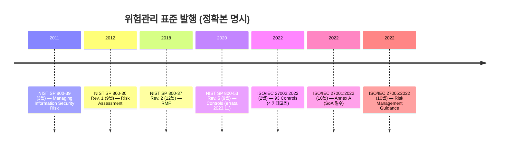
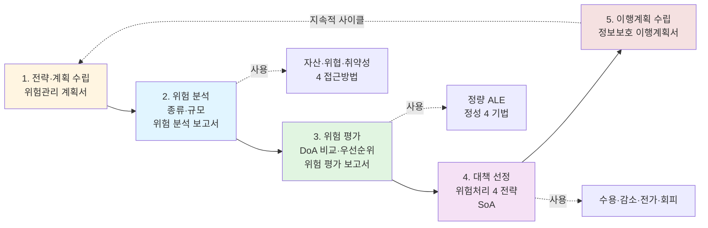
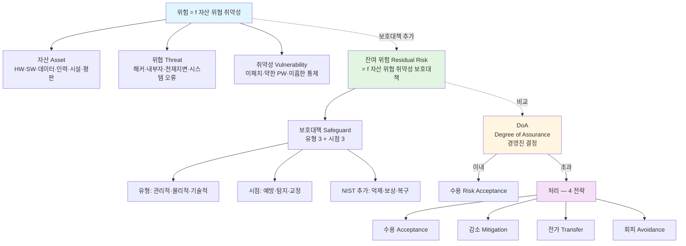
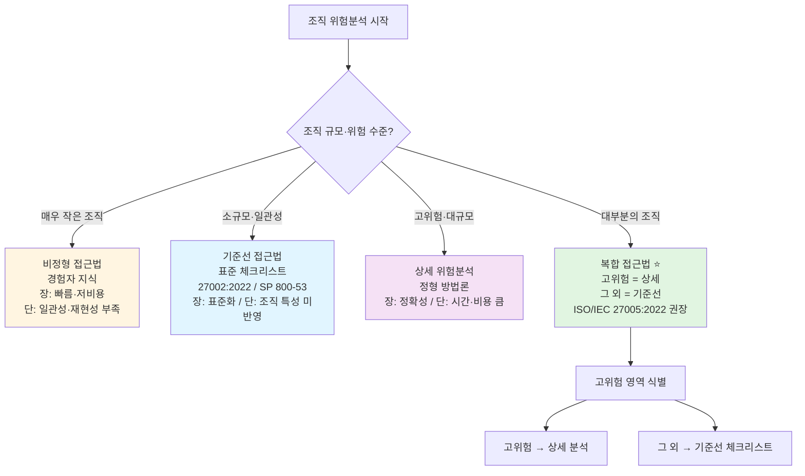
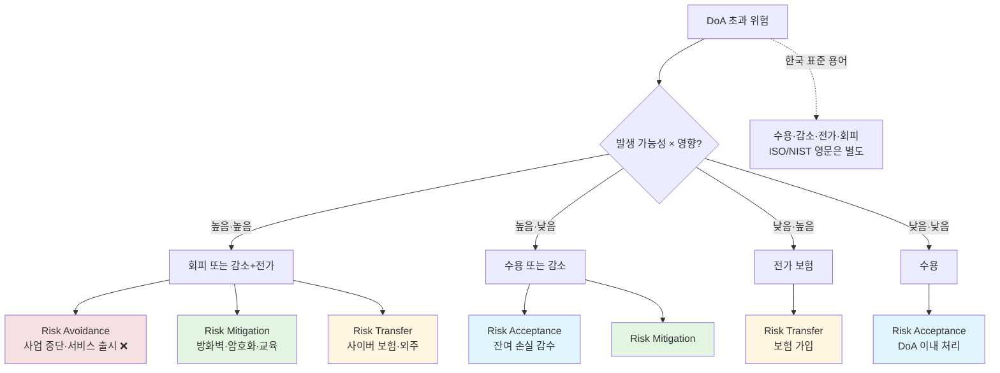

# 02. 위험관리 — 만화책처럼 읽는 ALE·DoA·접근방법 4종·처리 전략 4종

> **이 문서를 읽는 법**: *왜 위협만으로는 위험이 안 되는지*, *왜 ALE = SLE × ARO 인지 (덧셈 ❌)*, *왜 보험 가입이 감소가 아니라 전가인지*, *왜 ISO/IEC 27005 가 복합 접근법을 권장하는지* — 절차의 *순서대로* 따라가면 모든 시험 함정이 풀립니다.
> 정확한 정의·수치·표준 번호·법령 조문은 정확본을 참조: [[cs/information-security/05.management-and-law/02.risk-assessment|정확본 02. 정보보호 위험평가]]

> **독자 가정**: *백엔드/풀스택 개발자, 위험관리는 처음.* 이미 익숙한 개념 (`SLA`, `장애 복구 비용`, `보안 사고 보고`, `보험 가입`) 을 다리로 씁니다.

> **연결 단원**: 본 단원은 [[cs/information-security/05.management-and-law/01.security-management-overview|01 정보보호 관리 개요]] §2-4 의 *CIA 균형 결정 메커니즘* 의 구체적 절차. 이후 [[cs/information-security/05.management-and-law/03.controls-implementation|03 보호대책 구현]] 은 본 단원에서 선정한 통제를 실제로 구현·운영.

---

## 🎯 시작 전에 — 이미 쓰고 있는 위험관리

| 매일 보는 것 | 사실은 이 단원의 |
|---|---|
| 장애 발생 시 매출 손실 추정 | SLE (단일 손실 예상액) |
| 연 평균 보안 사고 횟수 | ARO (연간 발생 빈도) |
| 보안 투자 ROI 계산 | ROSI (Return on Security Investment) |
| 사이버 보험 가입 | 위험 전가 (Risk Transfer) |
| 방화벽·암호화·교육 도입 | 위험 감소 (Risk Mitigation) |
| 위험한 신규 서비스 출시 중단 | 위험 회피 (Risk Avoidance) |
| 발생 빈도·영향 낮아 그냥 두기 | 위험 수용 (Risk Acceptance) |
| 보안 정책 체크리스트 점검 | 기준선 접근법 (Baseline) |
| 핵심 시스템만 깊이 분석 | 복합 접근법 (Combined) |
| 보안 자산 목록 + CIA 등급 | 자산 식별·평가·그룹핑 |
| ISO 27001 인증 심사 SoA | 정보보호 대책명세서 (§8) |

> **이 단원의 본질**: 위험관리는 *보안 사고를 막는 것 ❌* — *DoA (수용 가능한 목표 위험수준) 까지 위험을 낮추는* 의사결정 활동. 시험은 (1) **위험관리 5단계** (2) **3대·4대 구성요소 + 위험 함수** (3) **접근방법 4종 (기준선·비정형·상세·복합)** (4) **ALE = SLE × ARO 정량 공식** (5) **정성 4 기법 (델파이·시나리오·순위·퍼지)** (6) **위험처리 4 전략 (수용·감소·전가·회피)** *6 핵심*을 묻는다.

---

## 📖 에피소드 1 — 위험관리 5단계: 분석으로 시작하지 *않는다*

### 장면 1. 위험관리의 정체

> **위험관리 (Risk Management)** : 조직의 자산에 대한 위험을 *수용 가능한 목표 위험수준 (DoA)* 으로 유지하기 위해 자산에 대한 위험을 분석하고, *비용 대비 효율적* 인 보호대책을 마련하는 일련의 과정.

ISO/IEC 27005:2022 의 표준 정의는 "조직의 위험에 대한 *의사소통, 의사결정, 분석, 평가, 처리, 모니터링, 검토* 활동". **1회성 평가가 아니라 지속적 사이클**.

### 장면 2. 위험관리 5 단계 — *순서가 시험에 직접 출제*

| 단계 | 활동 | 산출물 |
|---|---|---|
| **1. 위험관리 전략 및 계획 수립** | 조직에 적합한 위험관리 *방법 선택* + 비용·시간·인력 등 가용 자원 고려한 *계획 수립* | 위험관리 계획서 |
| **2. 위험 분석** | 자산·위협·취약성·기존 보호대책 분석 → *위험의 종류와 규모* 결정 | 위험 분석 보고서 |
| **3. 위험 평가** | 위험 분석 결과로 위험도 평가 + DoA 와 비교하여 *대응 여부와 우선순위* 결정 | 위험 평가 보고서 |
| **4. 정보보호 대책 선정** | DoA 초과 위험을 감소시키기 위해 *위험처리 전략* 설정 + 통제 선택 | 정보보호 대책명세서 (SoA) |
| **5. 정보보호 계획 수립** | 선정한 보호대책 구현을 위한 *이행 계획* 수립 | 정보보호 이행계획서 |

### 장면 3. *분석 vs 평가* — 시험 빈출

| 활동 | 답하는 질문 |
|---|---|
| **위험 분석** (2단계) | "위험의 *종류와 규모* 가 무엇인가?" |
| **위험 평가** (3단계) | "DoA 와 비교했을 때 *대응할 것인가, 우선순위는?*" |

### 장면 4. ISO/IEC 27005:2022 vs NIST SP 800-39

| ISO/IEC 27005:2022 | NIST SP 800-39 | 핵심 활동 |
|---|---|---|
| Context establishment | Frame | 조직 환경·범위 확립 |
| Risk identification | Identify (Assess 단계 내) | 자산·위협·취약성 식별 |
| Risk analysis | Analyze (Assess 단계 내) | 위험의 가능성·영향 분석 |
| Risk evaluation | Evaluate (Assess 단계 내) | 위험을 기준과 비교하여 우선순위화 |
| Risk treatment | Respond | 위험 대응 (수용·감소·전가·회피) |
| Risk monitoring and review | Monitor | 지속적 모니터링 |

### 시험 함정

- "위험관리 1단계 = 위험 분석" → ❌ **틀림**. 1단계 = *위험관리 전략 및 계획 수립* (분석은 2단계).
- "위험관리의 본질 = 위험 0 만들기" → ❌ **틀림**. *DoA 까지 낮추기*.
- "위험관리는 1회성 평가" → ❌ **틀림**. 지속적·순환적.
- "위험 분석 vs 평가의 차이?" → 분석 = 종류·규모 / 평가 = DoA 비교·우선순위.

---

## 📖 에피소드 2 — 위험의 함수: 자산·위협·취약성·보호대책

### 장면 1. 위험의 정의

> **위험 (Risk)** : 자산의 취약성을 이용한 위협에 의해 *원하지 않는 사건이 발생하여 자산에 손실을 미칠 가능성*.

ISO/IEC 27005:2022 + NIST SP 800-30 Rev. 1 의 정의: 위험 = "*사건의 가능성 (likelihood) × 영향 (impact)*".

### 장면 2. 위험 함수 — *3 인자 + 1 보강*

```
위험 (Risk) = f (자산, 위협, 취약성)
잔여 위험 (Residual Risk) = f (자산, 위협, 취약성, 보호대책)
```

| 구분 | 구성요소 |
|---|---|
| **3대 구성요소** | 자산 / 위협 / 취약성 |
| **4대 구성요소** | 자산 / 위협 / 취약성 / 보호대책 |

### 장면 3. 4 구성요소의 정의

| 요소 | 영문 | 정의 |
|---|---|---|
| **자산** | Asset | 조직이 보호해야 할 *유·무형 대상*. HW·SW·데이터·인력·시설·평판 |
| **위협** | Threat | 자산에 손실을 초래할 수 있는 *원하지 않는 사건의 잠재적 원인*. 해커·내부자·천재지변·시스템 오류 |
| **취약성** | Vulnerability | 위협의 *이용 대상이 되는 자산의 잠재적 속성*. 미패치·약한 패스워드·미흡한 출입통제 |
| **보호대책** | Safeguard / Control | 자산을 위험으로부터 보호하기 위한 *안전 대책 또는 통제* |

### 장면 4. *위협 ≠ 위험* — 시험 1순위 함정

> 위협이 발생한다고 *반드시 자산에 손실이 발생하는 것은 아니다*. 위협이 자산의 *취약성을 이용해야* 비로소 위험이 실현된다. 즉 **취약성이 없는 자산에 대한 위협은 위험이 되지 않는다**.

### 시험 함정

- "위험의 3대 구성요소?" → 자산·위협·취약성 (보호대책 포함하면 4대).
- "위협이 있다 = 위험이 있다" → ❌ **틀림**. 취약성도 함께 있어야 위험.
- "위험 = 사건의 가능성 × 영향" → ⭕ (NIST SP 800-30 Rev. 1 정의).
- "보호대책 추가 시 무엇이 달라지나?" → *잔여 위험* (Residual Risk) 함수가 됨.

---

## 📖 에피소드 3 — DoA 와 4 위험 상태: 0 으로 만들 수 없다

### 장면 1. DoA 의 정체

> **DoA (Degree of Assurance, 수용 가능한 목표 위험수준)** : 조직이 *감수하기로 결정한* 위험의 최대 허용 수준.

DoA 는 *비즈니스 환경·법규·자원·이해관계자 요구* 를 종합하여 **경영진이 결정**. ISO/IEC 27005:2022 §7 은 이를 "**Risk Acceptance Criteria**" 로 명명한다.

### 장면 2. 4 위험 상태

| 위험 상태 | 영문 | 의미 |
|---|---|---|
| **식별된 위험** | Identified Risk | 분석을 통해 도출된 *모든* 위험 |
| **처리 대상 위험** | Treated Risk | DoA 초과로 *처리가 결정된* 위험 |
| **잔여 위험** | Residual Risk | 보호대책 구현 후에도 *남아 있는* 위험 |
| **수용 위험** | Accepted Risk | DoA 이내로 평가되어 *수용 결정된* 위험 |

### 장면 3. *잔여 위험은 0 이 될 수 없다*

> **시험 1순위 함정**: 보호대책을 아무리 강화해도 *잔여 위험 = 0* 은 불가. 보호대책 추가 비용이 *위험 감소 가치를 넘어서는 지점*에서 멈춘다 (이게 ROSI 의 본질 — 에피소드 9 참조).

### 시험 함정

- "DoA 의 풀이?" → **Degree of Assurance** (수용 가능한 목표 위험수준).
- "DoA 결정 주체?" → 경영진 (이사회·CEO).
- "잔여 위험을 0 으로 만들 수 있다" → ❌ **틀림**. 보호대책 후에도 남음.
- "DoA 이내 위험은 어떻게 처리?" → 수용 (Accepted Risk).

---

## 📖 에피소드 4 — 보호대책 유형: 3 + 3 + 3

### 장면 1. 유형에 따른 분류 (3종)

| 유형 | 정의 | 사례 |
|---|---|---|
| **기술적 보호대책** | 보안 솔루션 도입 및 운영 | 방화벽, IPS, 암호화, DLP, EDR |
| **관리적 보호대책** | 보안 정책의 수립 및 시행 관점 | 정책·표준·지침·절차, 교육, 감사 |
| **물리적 보호대책** | 시설물 및 장비 보호 관점 | 출입통제, CCTV, 항온항습, UPS |

### 장면 2. 시점에 따른 분류 (3종)

| 유형 | 영문 | 정의 | 사례 |
|---|---|---|---|
| **예방 통제** | Preventive | 발생할 수 있는 위험을 식별하여 *사전에 대처* 하는 능동적 통제 | 출입통제, 방화벽, 패치 관리, 교육 |
| **탐지 통제** | Detective | 예방 통제를 우회하여 발생하는 위험을 *탐지* 하는 통제 | IDS, 로그 모니터링, CCTV, 침입 탐지 |
| **교정 통제** | Corrective | 탐지된 위험에 *대처하거나 감소* 시키는 통제 | 백업 복구, 사고 대응, 패치 적용, 시정조치 |

### 장면 3. NIST SP 800-53 Rev. 5 의 *3 추가 통제*

NIST SP 800-53 Rev. 5 (2020.9, errata 2023.11) 는 통제를 더 세분화.

| 추가 유형 | 영문 | 정의 | 사례 |
|---|---|---|---|
| **억제 통제** | Deterrent | 위협 행위자가 공격을 시도하지 못하도록 *억제* | 경고 표지, 처벌 규정 |
| **보상 통제** | Compensating | 표준 통제 적용이 불가할 때 *동등한 효과* 를 제공 | 강력한 모니터링으로 약한 인증 보완 |
| **복구 통제** | Recovery | 사고 후 시스템·서비스 *복원* | 재해복구 계획, 백업 |

### 장면 4. *유형 vs 시점* — 시험 함정

> **유형** = "*어떤 영역*의 통제인가" (관리적·물리적·기술적).
>
> **시점** = "*언제* 작용하는 통제인가" (예방·탐지·교정).

### 시험 함정

- "IDS 는 예방 통제" → ❌ **틀림**. *탐지* 통제.
- "백업 복구는 예방 통제" → ❌ **틀림**. *교정* 통제 (또는 NIST 분류상 복구 통제).
- "방화벽·출입통제는 어느 시점 통제?" → 예방.
- "유형 3 + 시점 3?" → 관리적·물리적·기술적 / 예방·탐지·교정.

---

## 📖 에피소드 5 — 위험분석 접근방법 4종: 기준선·비정형·상세·복합

### 장면 1. 기준선 접근법 (Baseline Approach)

> **기준선 접근법** : *체크리스트 형식의 표준화된 보호대책* 을 이용하여 보호의 기본 수준을 정하고 위험분석을 수행하는 방법.

| 장점 | 단점 |
|---|---|
| 시간·비용 절약 | 조직의 특성이 고려되지 않음 |
| 기본적 보호대책 선정 가능 | 과대·과소 보호 가능성 |
| 표준화로 일관성 확보 | 새로운 위험에 대응 부족 |

대표 사례: ISO/IEC 27002:2022 의 93 통제, NIST SP 800-53 Rev. 5 의 통제 카탈로그를 *체크리스트로 활용*.

### 장면 2. 비정형 접근법 (Informal Approach)

> **비정형 접근법** : *경험자의 지식* 을 기반으로 위험분석을 수행하는 방법.

| 장점 | 단점 |
|---|---|
| 작은 규모 조직에 비용 대비 효과적 | 수행자 경험 의존도 높음 |
| 빠른 의사결정 가능 | *경험이 부족한 위험 영역* 누락 가능 |
| 별도 도구·방법론 불필요 | 일관성·재현성 부족 |

### 장면 3. 상세 위험분석 (Detailed Risk Analysis)

> **상세 위험분석** : *정형화되고 구조화된 위험분석 방법론* 에 따라 자산·위협·취약성 등의 각 단계를 통해 조직의 위험을 *모두 상세하게* 분석.

| 장점 | 단점 |
|---|---|
| 조직에 가장 적절한 보호대책 수립 | 전문적 지식 필요 |
| 보안환경 변화에 유연 대응 | 많은 시간·비용·노력 필요 |
| 의사결정에 강력한 근거 | 분석 자체가 부담 |

### 장면 4. 복합 접근법 (Combined Approach) — *ISO/IEC 27005:2022 권장*

> **복합 접근법** : 고위험 영역을 식별하여 *상세 위험분석* 을 수행하고, *그 외 영역은 기준선 접근법* 을 사용하는 방법.

| 장점 | 단점 |
|---|---|
| 위험분석 비용·자원 효과적 사용 | 고위험 영역을 잘못 식별하면 문제 |
| 핵심 자산에 집중적 분석 | 초기 식별 단계 정확성에 의존 |
| **대부분의 조직에 권장됨** | 두 가지 방법 모두 숙지 필요 |

### 장면 5. 4종 비교표

| 접근법 | 정형성 | 시간·비용 | 정확성 | 권장 대상 |
|---|---|---|---|---|
| 기준선 | 표준화 | 낮음 | 보통 | 소규모·일관성 중시 |
| 비정형 | 비공식 | 매우 낮음 | 낮음 (경험 의존) | 매우 작은 조직 |
| 상세 | 정형 | 매우 높음 | 매우 높음 | 고위험·대규모 조직 |
| 복합 | 혼합 | 중간 | 높음 (선택적) | 대부분의 조직 |

### 시험 함정

- "ISO/IEC 27005 권장 방법 = 상세 위험분석" → ❌ **틀림**. *복합 접근법* 권장.
- "복합 접근법 = ?" → *고위험은 상세 + 그 외는 기준선*.
- "정형 방법론을 사용하는 접근법?" → 상세 위험분석만.
- "비정형 접근법의 가장 큰 단점?" → *수행자 경험 부족 영역의 위험 누락*.

---

## 📖 에피소드 6 — 자산 식별·평가·그룹핑

### 장면 1. 3 단계 절차

위험분석의 첫 단계는 자산 식별. *자산의 가치를 알지 못하면 위험의 영향을 산정할 수 없다*.

| 단계 | 활동 |
|---|---|
| **자산 식별** | 조직 내 모든 정보 자산 *목록화* (HW, SW, 데이터, 인력, 시설, 서비스) |
| **자산 가치 평가** | 각 자산의 *기밀성·무결성·가용성 측면* 의 가치 산정 |
| **자산 그룹핑** | 유사한 가치·위협·취약성을 가진 자산을 *그룹으로 묶어* 분석 효율화 |

### 장면 2. ISO/IEC 27002:2022 §5.9 — 자산 6 분류

ISO/IEC 27002:2022 §5.9 (Inventory of information and other associated assets) 는 자산을 6 카테고리로 분류.

| 자산 유형 | 영문 | 사례 |
|---|---|---|
| **정보** | Information | 데이터베이스, 파일, 문서, 매뉴얼, 계약서 |
| **소프트웨어** | Software | 응용 프로그램, 시스템 SW, 개발 도구 |
| **물리적 자산** | Physical | 서버, 통신장비, 매체, 시설 |
| **서비스** | Service | 컴퓨팅 서비스, 통신 서비스, 일반 서비스 (전기·공조) |
| **인력** | People | 직원, 전문가, 외부 위탁 인력 |
| **무형 자산** | Intangible | 평판, 브랜드, 노하우 |

### 장면 3. 자산 가치 평가 기준 — *CIA 측면*

| 평가 기준 | 측정 항목 |
|---|---|
| **기밀성 영향** | 정보 노출 시 비즈니스·법적·평판 손실 |
| **무결성 영향** | 정보 변조 시 의사결정·업무·법적 손실 |
| **가용성 영향** | 정보 사용 불가 시 업무 중단·매출·법적 손실 |

평가 결과는 통상 **3~5단계 척도** (예: 매우 높음·높음·보통·낮음·매우 낮음) 로 표현.

### 시험 함정

- "자산 가치는 매출 기준으로만 평가한다" → ❌ **틀림**. *CIA 측면* 으로 평가.
- "HW·SW 만 자산이다" → ❌ **틀림**. 인력·평판도 자산.
- "자산 그룹핑의 목적?" → *분석 효율화* (개별 분석 부담 감소).

---

## 📖 에피소드 7 — 위협·취약성 평가 + 우려사항

### 장면 1. 위협 평가 — *Likelihood 산정*

위협 평가는 **위협의 발생 가능성 (Likelihood)** 을 산정하는 활동.

| 분류 기준 | 종류 |
|---|---|
| **출처** | 인적 (의도적·비의도적), 자연재해, 환경적 (정전·화재·누수) |
| **행위 의도** | 의도적 (해킹·내부자 악의), 비의도적 (실수·부주의) |
| **영향 대상** | 기밀성 위협, 무결성 위협, 가용성 위협 |

### 장면 2. 취약성 평가

취약성은 *자산이 위협에 노출되는 통로*.

| 취약성 유형 | 사례 |
|---|---|
| **기술적 취약성** | 미패치 OS, 약한 암호 알고리즘, 미암호화 통신 |
| **관리적 취약성** | 미흡한 정책, 교육 부재, 직무 미분리 |
| **물리적 취약성** | 출입통제 미흡, 노후 시설, 환경 통제 부재 |

취약성 평가는 *자동화 도구 (취약점 스캐너 — [[cs/information-security/01.system-security/07.system-defense|정확본 01-07 §3]] 참조) 와 수동 점검 (모의해킹·관리적 점검) 을 병행*.

### 장면 3. 우려사항 — 위협 + 취약성

> **우려사항 (Concern)** : *특정 위협이 특정 취약성을 이용했을 때* 발생할 수 있는 *사건의 시나리오*.

위협만으로 위험이 되지 않으며 취약성만으로도 위험이 되지 않는다. **위협이 취약성을 이용** 할 때 비로소 우려사항이 되고, *자산 가치와 결합* 하여 위험이 산정된다.

```
우려사항 = 위협 × 취약성
위험 = 우려사항 × 자산 가치 = 자산 × 위협 × 취약성
```

### 시험 함정

- "위협이 있다 = 취약성이 있다" → ❌ **틀림**. 별개 개념.
- "취약점 스캐너로 모든 취약성 식별 가능" → ❌ **틀림**. *기술적 취약성* 만. 관리적·물리적 취약성은 별도 점검.
- "우려사항의 정의?" → *위협이 취약성을 이용한 시나리오*.

---

## 📖 에피소드 8 — 정량 위험분석: ALE = SLE × ARO

### 장면 1. 정량 위험분석의 정체

> **정량적 위험분석 (Quantitative Risk Analysis)** : 손실이나 위험의 크기를 *금전적 가치* 로 표현하는 방식.

객관적·수학적 결과 제공. NIST SP 800-30 Rev. 1 (2012.9) 의 핵심 산출 공식.

### 장면 2. 핵심 3 공식 — *시험 빈출 1순위*

```
SLE (Single Loss Expectancy, 단일 손실 예상액)
  = 자산 가치 × EF (Exposure Factor, 노출계수)

ARO (Annual Rate of Occurrence, 연간 발생 빈도)
  = 1년에 사건이 발생할 횟수

ALE (Annual Loss Expectancy, 연간 손실 예상액)
  = SLE × ARO        ← 곱셈! 덧셈 ❌
```

### 장면 3. 5 변수 정의

| 변수 | 영문 | 의미 |
|---|---|---|
| **자산 가치** | Asset Value | 자산의 *금전적 가치* |
| **EF** | Exposure Factor | 사건 발생 시 자산이 *입을 손실 비율* (0~1 또는 0~100%) |
| **SLE** | Single Loss Expectancy | *1회 사건당* 예상 손실액 |
| **ARO** | Annual Rate of Occurrence | *1년에 사건이 발생하는 횟수* (예: 0.5 = 2년에 1번) |
| **ALE** | Annual Loss Expectancy | *연간 평균* 예상 손실액 — *보호대책 투자 결정의 기준* |

### 장면 4. 정량 분석의 장단점

| 장점 | 단점 |
|---|---|
| 객관적 비용 산정 가능 | 모든 손실을 *금전적으로 환산* 어려움 |
| 비용 대비 효과 (ROSI) 분석 가능 | 데이터 수집 비용·시간 큼 |
| 경영진 의사결정에 강한 근거 | 무형 자산 (평판·고객 신뢰) 정량화 어려움 |

### 시험 함정

- "ALE = SLE + ARO" → ❌ **틀림**. SLE **×** ARO (곱).
- "SLE = 자산 가치 × ARO" → ❌ **틀림**. SLE = *자산 가치 × EF*.
- "EF 의 풀이?" → **Exposure Factor** (노출계수, 0~1).
- "ARO 0.5 의 의미?" → *2년에 1번* 발생.
- "정량 분석으로 평판 손실 산정 용이" → ❌ **틀림**. 무형 자산 정량화 어려움.

---

## 📖 에피소드 9 — ROSI: 보호대책 투자수익률

### 장면 1. ROSI 의 정체

> **ROSI (Return on Security Investment)** : 보호대책 투자의 *효율을 측정* 하는 지표.

### 장면 2. ROSI 공식

```
ROSI = (위험 감소량 - 보호대책 비용) / 보호대책 비용
     = (ALE_before - ALE_after - 보호대책 비용) / 보호대책 비용
```

### 장면 3. ROSI 의미

| ROSI 결과 | 의미 |
|---|---|
| **ROSI > 0** | 보호대책 투자가 *비용을 정당화* — 투자 권장 |
| **ROSI = 0** | 손익 분기 |
| **ROSI < 0** | 보호대책 비용이 *위험 감소량보다 큼* — 투자 부적절 |

### 장면 4. *ROSI 의 본질* — 잔여 위험을 0 으로 못 만드는 이유

> ROSI 가 음수가 되는 지점에서 *추가 보호대책 투자는 멈춘다*. 이것이 *잔여 위험이 0 이 될 수 없는 경제적 근거*. 위험을 *완전히 제거* 하려면 무한 비용이 필요하기 때문.

### 시험 함정

- "ROSI > 0 의 의미?" → 투자 정당화.
- "ROSI 의 풀이?" → **Return on Security Investment**.
- "ROSI 분자에 들어가는 항?" → *ALE 감소량 - 보호대책 비용*.

---

## 📖 에피소드 10 — 정성 위험분석: 델파이·시나리오·순위·퍼지

### 장면 1. 정성 위험분석의 정체

> **정성적 위험분석 (Qualitative Risk Analysis)** : 손실이나 위험 크기를 *개략적인 크기* 로 비교하는 방식 (높음·보통·낮음 등 언어 척도).

비교적 간단하고 시간·노력 적게 듦. 단 *객관적 검증 어렵고 평가자 개인에 따라 결과 변동*.

### 장면 2. 정성 4 기법 — 시험 빈출 1순위

| 기법 | 영문 | 설명 |
|---|---|---|
| **델파이** | Delphi | *전문가 집단* 이 *익명 토론* 을 통해 합의에 도달 |
| **시나리오** | Scenario | *어떠한 사건도 기대대로 발생하지 않는다* 는 사실에 근거하여 일정 조건에서 위협의 *발생 가능 결과를 추정* |
| **순위 결정법** | Ranking | *비교 우위 순위 결정표* 에 의해 위험 항목들의 *서술적 순위 결정* |
| **퍼지행렬법** | Fuzzy Matrix | 위험분석 요소들을 *정성적인 언어 (높음·보통·낮음) 로 표현된 값* 으로 *기대 손실 평가* |

### 장면 3. *델파이는 1인이 아니다*

> **시험 함정 1순위**: 델파이 기법은 **전문가 *집단*** 의 *익명* 토론으로 합의 도달. *1인 전문가의 의견이 아니다*. 익명성으로 *권위 편향·동조 압력* 제거.

### 시험 함정

- "정성 4 기법?" → 델파이·시나리오·순위결정·퍼지행렬.
- "델파이 = 1인 전문가" → ❌ **틀림**. *전문가 집단의 익명 토론*.
- "퍼지행렬법은 정량 분석" → ❌ **틀림**. *정성* 분석 (언어 값 사용).
- "정성 분석은 객관적이다" → ❌ **틀림**. 평가자 개인에 따라 변동.

---

## 📖 에피소드 11 — 정량 vs 정성 한 표

### 장면 1. 7 차원 비교

| 비교 항목 | 정량적 | 정성적 |
|---|---|---|
| **표현 방식** | *금전적 가치* (₩, $) | *개략적 크기* (높음·보통·낮음) |
| **객관성** | 높음 | 낮음 |
| **시간·비용** | 큼 | 작음 |
| **데이터 요구** | *많은 양의 정량 데이터* | 전문가 의견 |
| **무형 자산 처리** | 어려움 | *용이* |
| **경영진 의사결정 근거** | *강함 (ROSI 등)* | 보통 |
| **대표 산출** | ALE = SLE × ARO | *위험 수준 (Risk Level)* |

### 장면 2. *언제 무엇을 쓰는가*

| 상황 | 권장 방식 |
|---|---|
| 데이터 풍부 + 경영진 ROI 요구 | 정량 |
| 데이터 부족 + 빠른 평가 필요 | 정성 |
| 무형 자산 (평판·브랜드) 중심 | 정성 |
| 보호대책 투자 결정 | 정량 (ROSI) |
| 일상 위험 점검 | 정성 (체크리스트) |

### 시험 함정

- "정량은 무형 자산 처리에 유리" → ❌ **틀림**. 정성이 무형 자산 처리에 *용이*.
- "정량의 대표 산출?" → ALE = SLE × ARO.
- "정성의 대표 산출?" → 위험 수준 (Risk Level).

---

## 📖 에피소드 12 — 위험처리 4 전략: 수용·감소·전가·회피

### 장면 1. 위험처리의 정체

> **위험처리 (Risk Treatment)** : 위험 평가 결과 *DoA 를 초과하는 위험* 에 대해 *대응 방법을 결정* 하는 활동.

ISO/IEC 27005:2022 + NIST SP 800-39 (2011.3) 의 4 전략.

### 장면 2. 4 전략 — *시험 1순위*

| 전략 | 정의 | 사례 |
|---|---|---|
| **위험 수용** (Risk Acceptance) | 현재의 위험을 받아들이고 *잠재적 손실 비용을 감수* | 발생 빈도·영향이 낮은 위험 / DoA 이내 위험 |
| **위험 감소** (Risk Mitigation / Reduction) | 위험을 감소시킬 수 있는 *보호대책 채택* | 방화벽·암호화·교육·정책 수립 |
| **위험 전가** (Risk Transfer) | 보험이나 외주 등 *제3자에게 이전* | 사이버 보험 가입, 보안 운영 외주 |
| **위험 회피** (Risk Avoidance) | 프로세스나 사업을 *수행하지 않고 포기* | 위험 높은 신규 서비스 출시 중단 |

### 장면 3. 영문 표기 — *한국 vs ISO/NIST 차이*

> ISO/IEC 27005:2022 + NIST SP 800-39 의 영문 용어 표기는 *Risk Avoidance / Risk Modification / Risk Sharing / Risk Retention*. 한국 정보보안기사 시험 + KISA 가이드는 **수용·감소·전가·회피** 의 4분류를 표준 용어로 사용. *시험 답안은 한국 표준 용어*.

### 장면 4. 전략 선택 매트릭스

| 위험 발생 가능성 | 위험 영향 | 권장 전략 |
|---|---|---|
| 높음 | 높음 | **회피** 또는 **감소 + 전가** |
| 높음 | 낮음 | **수용** 또는 **감소** |
| 낮음 | 높음 | **전가** (보험) |
| 낮음 | 낮음 | **수용** |

### 시험 함정

- "보험 가입 = 위험 감소" → ❌ **틀림**. *위험 전가*.
- "방화벽 도입 = 위험 회피" → ❌ **틀림**. *위험 감소*.
- "사업 중단 = 위험 수용" → ❌ **틀림**. *위험 회피*.
- "DoA 이내 위험 = ?" → *수용*.
- "4 전략 모두 암기?" → 수용·감소·전가·회피 (4종 필수).

---

## 📖 에피소드 13 — SoA + ISO/IEC 27002:2022 4 카테고리 93 통제

### 장면 1. SoA 의 정체

> **정보보호 대책명세서 (Statement of Applicability, SoA)** : *위험처리 결정의 결과로 선정된 보호대책 (통제) 의 목록* 과 *적용 여부, 그 사유* 를 문서화한 산출물.

ISO/IEC 27001:2022 §6.1.3 (d) 는 SoA 작성을 ISMS 의 **필수 요구사항** 으로 명시. ISO/IEC 27001 인증 심사의 *핵심 산출물*.

### 장면 2. SoA 의 5 필수 항목

| 항목 | 내용 |
|---|---|
| **통제 식별** | ISO/IEC 27001 Annex A 의 *93개 통제* 각각에 대한 식별 |
| **적용 여부** | 적용 / 미적용 결정 |
| **적용 사유** | 적용한 통제가 *어떤 위험에 대응* 하는지 |
| **미적용 사유** | 미적용한 통제의 *미적용 사유 (정당화)* |
| **구현 상태** | 현재 구현 여부 및 진행 상황 |

### 장면 3. ISO/IEC 27002:2022 — *4 카테고리 93 통제*

ISO/IEC 27002:2022 (2022.2 발행) 는 통제를 *4 카테고리·총 93 통제* 로 재편.

| 카테고리 | 영문 | 통제 수 | 사례 |
|---|---|---|---|
| **조직적 통제** | Organizational | 37개 | 정책·역할·자산관리·접근통제·공급자 관계 |
| **인적 통제** | People | 8개 | 인력 심사·기밀 유지·교육·징계 |
| **물리적 통제** | Physical | 14개 | 출입통제·시설·매체 |
| **기술적 통제** | Technological | 34개 | 인증·암호화·로깅·취약점 관리·안전한 개발 |

### 장면 4. *27002:2013 vs 27002:2022* — 시험 함정

| 항목 | ISO/IEC 27002:2013 | ISO/IEC 27002:2022 |
|---|---|---|
| 카테고리 수 | **14** | **4** |
| 통제 수 | **114** | **93** |

### 시험 함정

- "ISO/IEC 27001 통제 수 = 114개" → ❌ **틀림**. *27002:2022 (27001:2022 Annex A) = 93개*. 27002:2013 = 114개.
- "SoA 는 선택 산출물" → ❌ **틀림**. ISO/IEC 27001:2022 *§6.1.3 (d) 필수 요구사항*.
- "통제 미적용 시 사유 문서화 불필요" → ❌ **틀림**. 미적용 사유도 *정당화* 필요.
- "27002:2022 의 4 카테고리 통제 수?" → 조직 37 / 인적 8 / 물리 14 / 기술 34 (총 93).

---

## 📑 종합 비교 (에피소드 1·5·8·10·12 정리)

위험관리 5 단계 + 접근방법 4종 + 분석 방식 2종 + 처리 전략 4종을 *표 1장* 으로.

| 영역 | 분류 | 핵심 |
|---|---|---|
| **5 단계** | 1·2·3·4·5 | 전략·계획 → 분석 → 평가 → 대책 선정 (SoA) → 이행계획 |
| **접근방법** | 4종 | 기준선·비정형·상세·복합 (ISO/IEC 27005 권장 = 복합) |
| **분석 방식** | 정량 | ALE = SLE × ARO, ROSI |
| | 정성 | 델파이·시나리오·순위결정·퍼지행렬 |
| **처리 전략** | 4종 | 수용·감소·전가·회피 (DoA 초과 위험에 적용) |
| **산출물** | SoA | ISO/IEC 27001:2022 §6.1.3 (d) 필수 — Annex A 93 통제 (4 카테고리) |

> **읽는 법**: 5 단계 → 접근방법 → 분석 방식 → 처리 전략 → SoA 의 *시간 순서*. 이 순서대로 외우면 모든 시험 변형이 풀린다.

---

## 🗺️ 마인드맵 1 — 위험관리 표준 발행 시간선



---

## 🗺️ 마인드맵 2 — 위험관리 5 단계 흐름



---

## 🗺️ 마인드맵 3 — 위험 함수 + 4 구성요소 + DoA



---

## 🗺️ 마인드맵 4 — 접근방법 4종 결정 트리



---

## 🗺️ 마인드맵 5 — 위험처리 4 전략 결정 매트릭스



---

## 🗂️ 키워드 클러스터

### 표준 발행 시점

```
ISO/IEC 27001:2022 (2022.10)        — Annex A · SoA 필수 (§6.1.3 (d))
ISO/IEC 27002:2022 (2022.2)         — 4 카테고리 93 통제
ISO/IEC 27005:2022 (2022.10)        — Risk Management Guidance
NIST SP 800-30 Rev. 1 (2012.9)      — Guide for Conducting Risk Assessments
NIST SP 800-37 Rev. 2 (2018.12)     — Risk Management Framework (RMF)
NIST SP 800-39 (2011.3)             — Managing Information Security Risk
NIST SP 800-53 Rev. 5 (2020.9, errata 2023.11) — Security and Privacy Controls
```

### 위험관리 5 단계

```
1. 위험관리 전략 및 계획 수립   — 위험관리 계획서
2. 위험 분석                  — 위험 분석 보고서 (종류·규모)
3. 위험 평가                  — 위험 평가 보고서 (DoA 비교·우선순위)
4. 정보보호 대책 선정          — SoA (Statement of Applicability)
5. 정보보호 계획 수립          — 정보보호 이행계획서
```

### 위험 구성요소

```
3대  — 자산 · 위협 · 취약성
4대  — + 보호대책
함수 — 위험 = f (자산, 위협, 취약성)
잔여 — 잔여 위험 = f (자산, 위협, 취약성, 보호대책)
DoA  — Degree of Assurance (수용 가능한 목표 위험수준) = Risk Acceptance Criteria (ISO/IEC 27005:2022 §7)
```

### 보호대책 유형·시점 (3+3+3)

```
유형 3      — 관리적 · 물리적 · 기술적
시점 3      — 예방 (Preventive) · 탐지 (Detective) · 교정 (Corrective)
NIST 추가 3 — 억제 (Deterrent) · 보상 (Compensating) · 복구 (Recovery)
```

### 접근방법 4종

```
기준선 (Baseline)         — 표준 체크리스트 (27002·SP 800-53)
비정형 (Informal)         — 경험자 지식
상세 (Detailed)           — 정형 방법론
복합 (Combined) ⭐         — 고위험=상세 + 그 외=기준선 (ISO/IEC 27005:2022 권장)
```

### 정량 위험분석 공식

```
SLE = 자산 가치 × EF                     (Single Loss Expectancy)
ARO = 1년에 사건이 발생하는 횟수            (Annual Rate of Occurrence)
ALE = SLE × ARO                         (Annual Loss Expectancy) ← 곱! 덧셈 ❌

ROSI = (ALE_before - ALE_after - 보호대책 비용) / 보호대책 비용
       ROSI > 0 → 투자 정당화
```

### 정성 4 기법

```
델파이 (Delphi)        — 전문가 집단의 익명 토론 (1인 ❌)
시나리오 (Scenario)    — 일정 조건에서 위협 발생 가능 결과 추정
순위 결정법 (Ranking)  — 비교 우위 순위 결정표
퍼지행렬법 (Fuzzy Matrix) — 정성 언어 (높음·보통·낮음) 로 기대 손실 평가
```

### 위험처리 4 전략

```
수용 (Risk Acceptance)  — DoA 이내 / 발생·영향 낮음
감소 (Risk Mitigation)  — 보호대책 채택 (방화벽·암호화·교육)
전가 (Risk Transfer)    — 보험·외주 (제3자 이전)
회피 (Risk Avoidance)   — 사업·프로세스 중단

한국 표준 — 수용·감소·전가·회피
ISO/NIST 영문 — Risk Avoidance / Modification / Sharing / Retention
```

### ISO/IEC 27002 통제 수 변화

```
27002:2013  — 14 카테고리 / 114 통제
27002:2022  — 4 카테고리 / 93 통제 (조직 37 + 인적 8 + 물리 14 + 기술 34)
```

### 자산 6 카테고리 (ISO/IEC 27002:2022 §5.9)

```
정보 (Information) · 소프트웨어 (Software) · 물리적 자산 (Physical)
서비스 (Service) · 인력 (People) · 무형 자산 (Intangible)
```

### SoA — Statement of Applicability

```
근거 — ISO/IEC 27001:2022 §6.1.3 (d) 필수 요구사항
5 항목 — 통제 식별 · 적용 여부 · 적용 사유 · 미적용 사유 · 구현 상태
대상 — Annex A 93 통제 전체
```

---

## 🃏 회상 30문항

> 답을 가린 뒤 자가 채점. 틀린 것만 정확본으로 깊이 학습.

**A. 5 단계·구성요소 (1~6)**
1. 위험관리 5 단계의 *순서*?
2. 위험관리 1 단계의 산출물?
3. 위험 분석 vs 위험 평가의 차이?
4. 위험의 3대 구성요소?
5. 위험 = f (?)?
6. 잔여 위험 함수의 인자?

**B. DoA·보호대책 (7~12)**
7. DoA 의 풀이?
8. DoA 결정 주체?
9. 잔여 위험을 0 으로 만들 수 있는가?
10. 보호대책 유형 3종?
11. 시점 통제 3종 + NIST 추가 3종?
12. IDS 는 어느 시점 통제?

**C. 접근방법 (13~16)**
13. 접근방법 4종?
14. ISO/IEC 27005:2022 권장 방법?
15. 복합 접근법의 정의?
16. 정형 방법론을 사용하는 접근법?

**D. 자산·위협·취약성 (17~19)**
17. ISO/IEC 27002:2022 §5.9 자산 6 카테고리?
18. 자산 가치 평가 기준 3 측면?
19. 우려사항의 정의?

**E. 정량·정성 (20~26)**
20. SLE 공식?
21. ALE 공식?
22. ARO 의 풀이?
23. EF 의 풀이?
24. ROSI 공식?
25. 정성 4 기법?
26. 델파이 기법은 *몇 인* 의 의견?

**F. 처리 전략·SoA (27~30)**
27. 위험처리 4 전략 (한국 표준 용어)?
28. 사이버 보험 가입은 어느 전략?
29. SoA 의 법적 근거 (ISO 조항)?
30. ISO/IEC 27002:2022 의 *카테고리·통제 수*?

---

## ⚠️ 시험 함정 모음

| 함정 | 정답 |
|---|---|
| 위험관리 1단계 = 위험 분석 | ❌ 1단계 = *위험관리 전략 및 계획 수립* (분석은 2단계) |
| 위험관리의 본질 = 위험 0 만들기 | ❌ *DoA 까지 낮추기* |
| 위험관리는 1회성 평가 | ❌ 지속적·순환적 |
| 위협만 있으면 위험 발생 | ❌ 취약성도 함께 있어야 위험 |
| 잔여 위험 = 0 가능 | ❌ 보호대책 후에도 남음 |
| ALE = SLE + ARO | ❌ ALE = SLE **×** ARO (곱) |
| SLE = 자산 가치 × ARO | ❌ SLE = *자산 가치 × EF* (노출계수) |
| EF = Annual Rate of Occurrence | ❌ EF = *Exposure Factor* (노출계수). ARO 가 Annual Rate of Occurrence |
| 정성적 분석은 객관적 | ❌ 평가자 개인에 따라 변동 |
| 정량 분석은 무형 자산 처리에 유리 | ❌ 정성이 무형 자산 처리에 *용이* |
| 보험 가입 = 위험 감소 | ❌ *위험 전가* (Risk Transfer) |
| 방화벽 도입 = 위험 회피 | ❌ *위험 감소* (Risk Mitigation) |
| 사업 중단 = 위험 수용 | ❌ *위험 회피* (Risk Avoidance) |
| ISO/IEC 27001 통제 수 = 114개 | ❌ 27002:2022 = *93개* (4 카테고리). 27002:2013 = 114개 |
| ISO/IEC 27005 권장 방법 = 상세 | ❌ *복합 접근법* 권장 |
| 델파이 = 1인 전문가 | ❌ *전문가 집단의 익명 토론* |
| 퍼지행렬법은 정량 분석 | ❌ *정성* 분석 (언어 값 사용) |
| SoA 는 선택 산출물 | ❌ ISO/IEC 27001:2022 *§6.1.3 (d) 필수* |
| IDS 는 예방 통제 | ❌ *탐지* 통제 |
| 백업 복구는 예방 통제 | ❌ *교정* 통제 (또는 NIST 분류상 복구 통제) |
| 취약점 스캐너로 모든 취약성 식별 | ❌ *기술적* 취약성만. 관리적·물리적은 별도 점검 |
| HW·SW 만 자산 | ❌ 인력·평판도 자산 (ISO 27002:2022 §5.9 6 카테고리) |
| 4 위험처리 전략 영문 = 한국과 동일 | ❌ ISO/NIST = Avoidance/Modification/Sharing/Retention. 한국 = 수용·감소·전가·회피 |
| ROSI < 0 도 투자 권장 | ❌ ROSI > 0 만 투자 정당화 |
| 자산 가치는 매출 기준 | ❌ *CIA 측면* 으로 평가 |

---

## 🔗 정확본 매핑표

| 본 노트 에피소드 | 정확본 § |
|---|---|
| 에피소드 1 (5 단계 + ISO/NIST 매핑) | [[cs/information-security/05.management-and-law/02.risk-assessment#§1. 위험관리의 정의와 5단계\|정확본 §1·§1-1·§1-2]] |
| 에피소드 2 (위험 함수 + 3·4 구성요소) | [[cs/information-security/05.management-and-law/02.risk-assessment#§2. 위험의 구성요소\|정확본 §2-1·§2-2·§2-3]] |
| 에피소드 3 (DoA + 4 위험 상태) | [[cs/information-security/05.management-and-law/02.risk-assessment#§2-4. 잔여 위험과 DoA\|정확본 §2-4]] |
| 에피소드 4 (보호대책 유형·시점·NIST 추가) | [[cs/information-security/05.management-and-law/02.risk-assessment#§2-5. 보호대책 유형 분류\|정확본 §2-5]] |
| 에피소드 5 (접근방법 4종) | [[cs/information-security/05.management-and-law/02.risk-assessment#§3. 위험분석 접근방법 4종\|정확본 §3-1~§3-5]] |
| 에피소드 6 (자산 식별·평가·그룹핑) | [[cs/information-security/05.management-and-law/02.risk-assessment#§4. 자산 식별·평가·그룹핑\|정확본 §4-1~§4-3]] |
| 에피소드 7 (위협·취약성 + 우려사항) | [[cs/information-security/05.management-and-law/02.risk-assessment#§5. 위협·취약성 평가\|정확본 §5-1~§5-3]] |
| 에피소드 8 (정량 ALE = SLE × ARO) | [[cs/information-security/05.management-and-law/02.risk-assessment#§6-1. 정량적 위험분석\|정확본 §6-1]] |
| 에피소드 9 (ROSI) | [[cs/information-security/05.management-and-law/02.risk-assessment#§6-2. ROSI — 보호대책 투자수익률\|정확본 §6-2]] |
| 에피소드 10 (정성 4 기법) | [[cs/information-security/05.management-and-law/02.risk-assessment#§6-3. 정성적 위험분석\|정확본 §6-3]] |
| 에피소드 11 (정량 vs 정성) | [[cs/information-security/05.management-and-law/02.risk-assessment#§6-4. 정량 vs 정성 비교\|정확본 §6-4]] |
| 에피소드 12 (위험처리 4 전략) | [[cs/information-security/05.management-and-law/02.risk-assessment#§7. 위험처리 전략 4종\|정확본 §7-1·§7-2]] |
| 에피소드 13 (SoA + 27002:2022 4 카테고리 93 통제) | [[cs/information-security/05.management-and-law/02.risk-assessment#§8. 정보보호 대책명세서\|정확본 §8·§8-1]] |

---

## 📅 학습 흐름 (8주차 시험 대비 기준)

```
[1주]   에피소드 1 (5 단계) — 만화책 통독, *분석 vs 평가* 차이 외움
[2주]   에피소드 2·3 (위험 함수 + DoA + 4 위험 상태) — *위협 ≠ 위험* 외움
[3주]   에피소드 4 (보호대책 유형·시점·NIST 추가) — IDS=탐지·백업=교정 매핑 외움
[4주]   에피소드 5 (접근방법 4종) — *복합 권장* 외움 + 4종 비교표 표 1장 통째 외움
[5주]   에피소드 6·7 (자산·위협·취약성·우려사항) — ISO 27002:2022 §5.9 6 카테고리 외움
[6주]   에피소드 8·9 (정량 ALE·ROSI) — 공식 3개 외움 (SLE·ARO·ALE·ROSI), *덧셈 ❌ 곱셈 ⭕*
[7주]   에피소드 10·11 (정성 4 기법 + 비교) — 델파이=*집단* 익명 외움
[8주]   에피소드 12·13 (4 전략 + SoA + 93 통제) — 보험=전가, 사업중단=회피 외움 + 회상 30
```

---

> **다음 단원**: [[cs/information-security/05.management-and-law/03.controls-implementation|03. 보호대책 구현]] — 본 단원 §2-5 의 *보호대책 유형 (관리·물리·기술적) + 시점 통제 (예방·탐지·교정)* 가 03 단원의 *관리적 보호대책 (BCP·BIA) + 물리적 보호대책 (출입통제·항온항습) + 기술적 보호대책 (시스템·네트워크·DB) + DRS 4종 (미러·핫·웜·콜드) + RTO·RPO·MTD·WRT* 로 확장.
