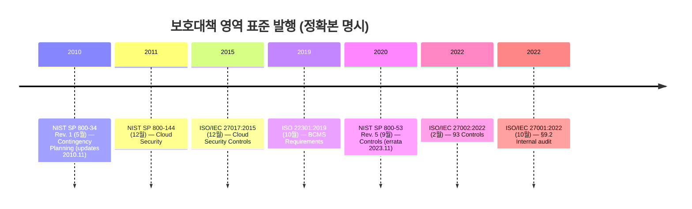
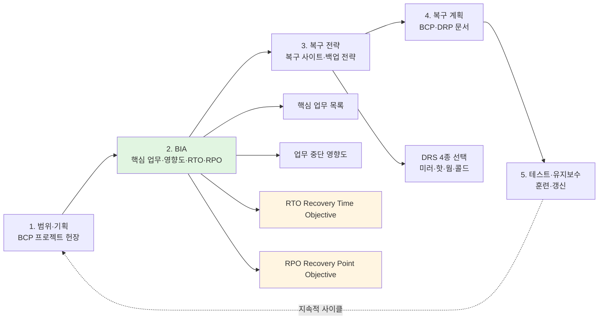
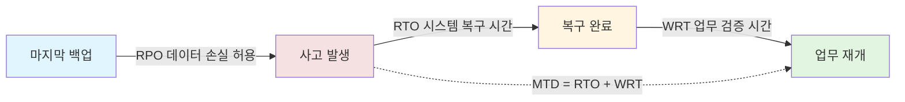
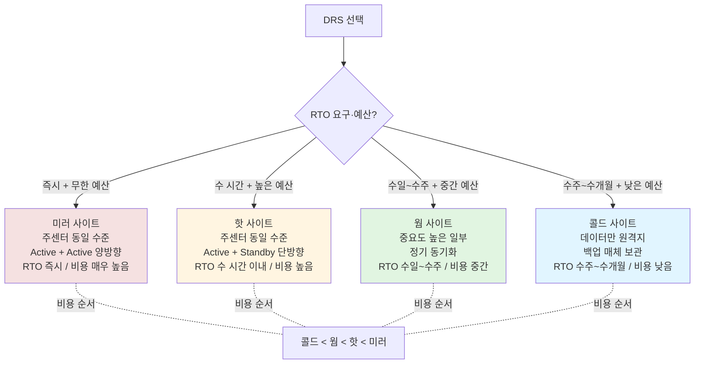
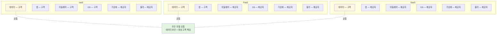

# 03. 보호대책 구현 — 만화책처럼 읽는 BCP·BIA·DRS 4종·RTO·RPO·MTD·WRT

> **이 문서를 읽는 법**: *왜 미러 사이트가 즉시 복구인지*, *왜 RTO 와 RPO 가 다른 시간축인지*, *왜 MTD = RTO + WRT 인지*, *왜 클라우드의 데이터 보안은 *항상 고객 책임* 인지* — 사고 발생 시간선의 *순서대로* 따라가면 모든 시험 함정이 풀립니다.
> 정확한 정의·수치·표준 번호·법령 조문은 정확본을 참조: [[cs/information-security/05.management-and-law/03.controls-implementation|정확본 03. 보호대책 구현 및 운영]]

> **독자 가정**: *백엔드/풀스택 개발자, BCP·DR 처음.* 이미 익숙한 개념 (`서비스 다운타임`, `백업 주기`, `Active-Standby`, `클라우드 책임 모델`) 을 다리로 씁니다.

> **연결 단원**: 본 단원은 [[cs/information-security/05.management-and-law/02.risk-assessment|02 위험관리]] §7 *위험처리 4 전략* 중 *위험 감소* 에 해당하는 보호대책의 실제 *구현·운영*. 이후 [[cs/information-security/05.management-and-law/04.incident-response-and-forensics|04 사고대응]] 은 본 단원의 침해사고 예방 통제가 실패했을 때의 대응.

---

## 🎯 시작 전에 — 이미 쓰고 있는 보호대책

| 매일 보는 것 | 사실은 이 단원의 |
|---|---|
| 입사 시 신원조회 + NDA 서명 | 인력보안 — 입사 전 단계 (§2-1) |
| 연 1회 정보보호 교육 이수 | 정기 교육 (§2-3) |
| 퇴직 직후 사원증·노트북 회수 | 인력보안 — 퇴직 시 |
| 외주 인력 임시 권한 만료일 | 외부 인력 *기한부 + 최소 권한* |
| RPO 5분, RTO 1시간 SLA | BIA 4 산출물 (§3-2) |
| Active-Active 클러스터 | 미러 사이트 |
| Active-Standby DR | 핫 사이트 |
| 백업만 원격지 보관 | 콜드 사이트 |
| 풀 백업 + 일별 증분 백업 | 백업 전략 (§4-4) |
| 서버실 출입카드 + 생체인식 | 출입통제 (§5-1) |
| UPS + 항온항습 | 환경 보안 (§5-3) |
| 클라우드 스토리지의 *고객 측 암호화* | 클라우드 책임 공유 모델 (§6-4) |

> **이 단원의 본질**: 보호대책은 *기술 도입 ❌* — *사람·프로세스·시설·기술의 구현·운영* 사이클. 시험은 (1) **인력 생애주기 3 단계 (입사 전·재직·퇴직)** (2) **BCP 5단계 + BIA 4 산출물** (3) **RTO·RPO·MTD·WRT 시간축** (4) **DRS 4종 (미러·핫·웜·콜드) RTO·동기화·비용** (5) **백업 3종 + 3-2-1 규칙** (6) **보호구역 3 (일반·통제·제한)** (7) **클라우드 책임 공유 — 데이터는 항상 고객** *7 핵심*을 묻는다.

---

## 📖 에피소드 1 — 보호대책 선정 6 단계: 위험처리부터 이행계획까지

### 장면 1. 위험관리 (02 단원) 와의 연결

위험 평가 ([[cs/information-security/05.management-and-law/02.risk-assessment|02 단원]]) 의 결과로 *DoA 초과 위험* 이 도출되면 위험처리 4 전략 (수용·감소·전가·회피) 을 적용. 그 중 **위험 감소** 전략에 해당하는 위험에 대해 본 단원의 *구체적 보호대책* 을 선정.

### 장면 2. 6 단계 절차

| 단계 | 활동 | 산출물 |
|---|---|---|
| **1. 위험처리 결정** | 4 가지 전략 중 선택 | 위험처리 결정서 |
| **2. 통제 후보 도출** | ISO/IEC 27002:2022 / NIST SP 800-53 / KISA 가이드 등에서 후보 통제 식별 | 통제 후보 목록 |
| **3. 비용·효과 분석** | *ROSI 분석* 으로 통제 채택 여부 결정 | 비용·효과 분석서 |
| **4. 통제 우선순위 결정** | 위험 수준·법적 의무·자원 제약 고려 | 우선순위 결정서 |
| **5. 정보보호 대책명세서 (SoA) 작성** | 채택·미채택 통제 목록 + 사유 | SoA |
| **6. 이행계획 수립** | 일정·예산·책임자 명시 | 정보보호 이행계획서 |

### 장면 3. 정보보호 이행계획서 6 구성요소

이행계획서는 다음 요소를 포함.

- **통제별 구현 일정** (단기·중기·장기)
- **예산 및 자원 배분**
- **책임자 (소유자) 및 수행자**
- **성과 측정 지표 (KPI)**
- **위험·이슈 관리 계획**
- **보고 및 검토 주기**

### 시험 함정

- "보호대책 선정 시작점?" → *위험처리 결정* (4 전략 중 *감소* 영역).
- "통제 채택의 정량 근거?" → ROSI > 0.
- "이행계획서에 *책임자* 명시 필수?" → ⭕.

---

## 📖 에피소드 2 — 인력보안: 입사 전·재직·퇴직 3 단계

### 장면 1. 인력 생애주기 — *시험 빈출*

ISO/IEC 27002:2022 §6 (인적 통제) + KISA ISMS-P 인증기준 2.2 (인적 보안) 는 인력 생애주기에 따른 보안 활동을 요구.

| 단계 | 핵심 활동 |
|---|---|
| **입사 전** | 신원 검증 (Background Check), 자격 검증, 채용 계약서에 *비밀유지 (NDA) 조항* 포함 |
| **재직 중** | 정보보호 책임 명확화, 정기 교육·훈련, 직무 변경 시 *권한 재조정*, 위반 시 징계 절차 |
| **퇴직 시** | *즉시 접근권한 회수*, 자산 반납 (사원증·노트북·매체), 비밀유지 의무의 *사후 적용*, 인수인계 |

### 장면 2. *NDA 의 사후 적용* — 시험 함정

> **퇴직 시 회수해야 할 것**: *접근권한·자산* (사원증·노트북·매체).
>
> **퇴직 후에도 유효한 것**: *NDA (비밀유지 의무)*. 퇴직 직후 만료 ❌ — 계약서에 명시된 기간 동안 사후 적용.

### 장면 3. 내·외부 인력 5 차원 비교

| 구분 | 내부 인력 | 외부 인력 (위탁·협력업체) |
|---|---|---|
| **신원 검증** | 채용 시 1회 + 정기 재검증 | 계약 시 검증 + 인력 변경 시 *통지 의무* |
| **비밀유지** | 근로계약서·취업규칙 | 계약서·SLA·NDA |
| **접근통제** | 직무 기반 권한 부여 | **최소 권한·기한부 권한** 부여 |
| **감독** | 정기 감사·로그 모니터링 | 위탁 감독·정기 점검·*계약 종료 시 권한 회수* |
| **법적 근거** | 근로기준법, 취업규칙 | [개인정보보호법] §26 (개인정보 처리업무 위탁) |

### 시험 함정

- "신원 검증은 재직 중 단계" → ❌ **틀림**. *입사 전*.
- "퇴직 시 NDA 즉시 만료" → ❌ **틀림**. *사후 적용*.
- "외부 인력에 무기한 권한 부여" → ❌ **틀림**. *기한부 + 최소 권한*.
- "외부 인력의 법적 근거?" → [개인정보보호법] §26 (개인정보 처리업무 위탁).

---

## 📖 에피소드 3 — 교육 5종 + 내부 감사 4 요구사항 + 침해사고 예방 (관리적)

### 장면 1. 정보보호 교육 5종 + 주기

ISO/IEC 27002:2022 §6.3 (Information security awareness, education and training) 의 요구사항.

| 교육 유형 | 대상 | 주기 |
|---|---|---|
| **정기 정보보호 교육** | 전 임직원 | *최소 연 1회* |
| **직무 특화 교육** | 정보보호 담당자, 시스템 운영자, 개발자 | 직무 변경 시 + 정기 |
| **신규 입사자 교육** | 신규 인력 | *입사 후 즉시* |
| **침해사고 대응 훈련** | 사고 대응 조직 | 최소 연 1회 (*모의훈련 포함*) |
| **BCP·DR 훈련** | 업무연속성 관리 조직 | 최소 연 1회 |

KISA ISMS-P 인증기준 2.2.4 (인식제고 및 교육훈련) 는 *교육 계획·실시·결과 관리·평가* 의 4단계 프로세스를 요구.

### 장면 2. 내부 감사 4 요구사항 — ISO/IEC 27001:2022 §9.2

> **내부 감사 (Internal Audit)** : 조직 내부 인력이 ISMS 의 *준수 상태와 효과성* 을 점검하는 활동.

| 요구사항 | 내용 |
|---|---|
| **감사 계획** | 감사 주기·범위·기준·방법 정의 |
| **감사 독립성** | 감사자는 *자신의 업무를 감사하지 않음* (직무 분리) |
| **감사 결과 보고** | *최고경영진* 에게 보고 |
| **시정 조치** | 부적합 사항에 대한 시정 |

### 장면 3. 침해사고 예방·대응 (관리적 측면)

기술적 측면의 침해사고 대응은 [[cs/information-security/05.management-and-law/04.incident-response-and-forensics|04 단원]] 에서 상세히 다루며, 본 §은 *관리적 측면* 만 다룬다.

| 활동 | 내용 |
|---|---|
| **사고대응 정책 수립** | 사고 정의·심각도·대응 절차·보고 체계 |
| **사고대응 조직 구성** | CISO·CIRT·외부 협력기관 (KISA, 경찰) |
| **사고대응 훈련** | 모의훈련·테이블탑·시나리오 기반 훈련 |
| **사후 분석** | Lessons Learned, 정책·절차 개선 |

### 시험 함정

- "정보보호 교육 = 분기마다" → ❌ **틀림**. *최소 연 1회* (조직 정책으로 더 자주 가능).
- "내부 감사자가 자기 업무도 감사 가능" → ❌ **틀림**. *직무 분리* (자기 업무 미감사).
- "내부 감사의 ISO 조항?" → ISO/IEC 27001:2022 *§9.2*.
- "감사 결과 보고 대상?" → 최고경영진.

---

## 📖 에피소드 4 — BCP 5단계 방법론

### 장면 1. BCP 의 정체

> **BCP (Business Continuity Plan, 업무연속성계획)** : 인재·천재지변·테러 등에 의한 각종 장애 및 재해로부터 업무 중단이 발생할 경우 *최대한 빠른 시간 내에 업무를 복구* 함으로써 *업무 연속성을 유지* 하기 위한 계획.

ISO 22301:2019 (Business Continuity Management Systems) 의 BCMS (업무연속성 관리체계) 의 *핵심 산출물*. NIST SP 800-34 Rev. 1 의 비상계획 (Contingency Planning) 영역과 일치.

### 장면 2. BCP 5 단계 — *시험 빈출*

| 단계 | 활동 | 산출물 |
|---|---|---|
| **1. 프로젝트 범위 설정 및 기획** | BCP 프로젝트의 범위·일정·예산·조직 정의 | BCP 프로젝트 헌장 |
| **2. 사업 영향 평가 (BIA)** | 업무 중단의 영향 분석, *핵심 업무 식별, 복구 우선순위 결정* | BIA 보고서 |
| **3. 복구 전략 개발** | *RTO·RPO 결정*, 복구 사이트·백업 전략 선정 | 복구 전략서 |
| **4. 복구 계획 수립** | 절차·역할·연락처·자원 배분의 *구체적 계획* 작성 | BCP·DRP 문서 |
| **5. 프로젝트 수행 및 테스트·유지보수** | 훈련·점검·갱신 | 훈련 보고서, 갱신 이력 |

### 장면 3. *BIA 의 위치* — 단계 2

> **시험 핵심**: BIA 는 BCP 5 단계 중 *2 단계*. BIA 의 *결과로 RTO·RPO* 가 결정 (3 단계). 즉 BIA → 복구 전략 → 복구 계획 의 *순차적 종속 관계*.

### 시험 함정

- "BCP 5 단계의 *순서*?" → 범위·기획 → BIA → 복구 전략 → 복구 계획 → 테스트·유지.
- "RTO·RPO 결정 단계?" → 3 단계 *복구 전략 개발*.
- "BIA 의 결과로 결정되는 핵심 지표?" → RTO·RPO + 복구 우선순위.

---

## 📖 에피소드 5 — BIA 4 산출물 + RTO·RPO·MTD·WRT 시간축

### 장면 1. BIA 의 정체

> **BIA (Business Impact Analysis, 사업 영향 평가)** : BCP 의 *핵심 절차* 로, 전체 사업에 존재하는 *핵심 업무를 파악* 하고 업무별로 *사업에 미치는 영향도를 분석* 해 *장애 및 재해 시 복구 우선순위를 결정* 하는 과정.

### 장면 2. BIA 4 핵심 산출물

| 산출물 | 정의 |
|---|---|
| **핵심 업무 목록** | 조직 운영에 필수적인 업무의 식별 |
| **업무 중단 영향도** | 업무 중단 시 *시간별·재무적·운영적·법적·평판적 손실* |
| **RTO** (Recovery Time Objective) | 재해로 서비스가 *중단되었을 때 서비스를 복구하는 데까지 걸리는* **최대 허용 시간** |
| **RPO** (Recovery Point Objective) | 재해로 중단된 서비스를 복구했을 때 *유실을 감내할 수 있는* **데이터의 손실 허용 시점** |

### 장면 3. RTO·RPO·MTD·WRT 4 지표

| 지표 | 의미 | 측정 단위 | 결정 기준 |
|---|---|---|---|
| **RTO** | 서비스 복구까지의 *최대 허용 시간* | 시간 | 업무 중단 허용 시간 |
| **RPO** | *유실 허용 데이터의 시점* | 시간 (데이터 손실량) | 백업 주기 |
| **MTD** (Maximum Tolerable Downtime) | 조직이 *생존 가능한 최대 중단 시간* | 시간 | 비즈니스 임계값 |
| **WRT** (Work Recovery Time) | 시스템 복구 후 *정상 업무 재개까지 시간* | 시간 | 업무 검증 시간 |

```
MTD = RTO + WRT
```

### 장면 4. *시간축 그림* — 사고 시점 ↔ 데이터 ↔ 복구 ↔ 업무 재개

```
   ←──── RPO ────→ ●사고 발생 ←──── RTO ────→ ●복구 완료 ←─ WRT ─→ ●업무 재개
   │                │                          │                    │
   마지막 백업                                                       │
                    │←──────────── MTD ───────────────────────────→│
                    (사고 발생 → 업무 재개)
```

### 장면 5. *RTO ≠ RPO 시간축 차이* — 시험 1순위

> **RTO** = 사고 시점 → 복구 시점 (*미래 방향*, 복구까지 시간).
>
> **RPO** = 사고 시점 → 마지막 백업 시점 (*과거 방향*, 데이터 손실량).

### 시험 함정

- "RTO 는 데이터 손실 허용 시점" → ❌ **틀림**. *복구까지 시간*. RPO 가 데이터 손실 시점.
- "MTD = RPO + RTO" → ❌ **틀림**. *MTD = RTO + WRT*.
- "RPO = 0 의 의미?" → 데이터 손실 0 (실시간 복제 필요).
- "BIA 의 4 산출물?" → 핵심 업무 / 영향도 / RTO / RPO.

---

## 📖 에피소드 6 — DRP vs BCP + NIST SP 800-34 Rev. 1 비상계획 7단계

### 장면 1. DRP·DRS 의 정체

> **DRP (Disaster Recovery Plan, 재해복구계획)** : 재해로 인하여 중단된 *정보기술 서비스* 를 재개하기 위한 계획.
>
> **DRS (Disaster Recovery System, 재해복구시스템)** : 재해 복구 계획의 원활한 수행을 지원하기 위하여 *평상시에 확보하여 두는 인적·물적 자원* 과 이들에 대한 지속적 관리체계가 통합된 것.

### 장면 2. *BCP ⊃ DRP* — 시험 빈출 1순위

| 비교 항목 | BCP | DRP |
|---|---|---|
| **범위** | *사업 전체* (인력·시설·공급망 포함) | *IT 서비스* |
| **목적** | 업무 연속성 | 시스템·데이터 복구 |
| **주체** | 비즈니스 부서 + IT | IT 부서 |
| **산출물** | BCP 문서 | DRP 문서 + DRS |
| **표준** | ISO 22301 | ISO/IEC 27031, NIST SP 800-34 |

### 장면 3. NIST SP 800-34 Rev. 1 비상계획 7 단계

NIST SP 800-34 Rev. 1 (Contingency Planning Guide for Federal Information Systems, 2010.5 / updates 2010.11) 의 비상계획 수립 7 단계.

| 단계 | 활동 |
|---|---|
| **1. 비상계획 정책 수립** | 비상계획의 권한·범위·역할 정의 |
| **2. BIA 수행** | 업무 영향 분석으로 RTO·RPO 결정 |
| **3. 예방 통제 식별** | *사고 자체를 예방* 하는 통제 |
| **4. 비상 전략 수립** | 백업·복구 사이트·복구 절차 |
| **5. 정보시스템 비상계획 작성** | 구체적 복구 절차 문서화 |
| **6. 계획 시험·교육·훈련** | 정기적 검증 |
| **7. 계획 유지·갱신** | 환경 변화에 따른 업데이트 |

### 시험 함정

- "BCP 와 DRP 는 같은 개념" → ❌ **틀림**. *BCP ⊃ DRP*.
- "DRP 의 표준?" → ISO/IEC 27031, NIST SP 800-34 Rev. 1.
- "NIST SP 800-34 Rev. 1 비상계획 단계 수?" → **7**.

---

## 📖 에피소드 7 — DRS 4종: 미러·핫·웜·콜드

### 장면 1. 4 사이트 — *시험 1순위*

DRS 는 *복구 수준* 에 따라 4종으로 분류.

| DRS 유형 | 시스템 구축 수준 | RTO | 데이터 동기화 | 비용 |
|---|---|---|---|---|
| **미러 사이트** | 주센터와 *동일한 수준* 의 시스템 | **즉시** (실시간) | Active + Active (*실시간 양방향*) | 매우 높음 |
| **핫 사이트** | 주센터와 *동일한 수준* 의 시스템 | **수 시간 이내** | Active + Standby (*실시간 단방향*) | 높음 |
| **웜 사이트** | *중요도 높은 일부* 시스템만 | **수일 ~ 수주 이내** | 정기 동기화 | 중간 |
| **콜드 사이트** | *데이터만* 원격지 보관, 장소 등 *최소 자원* | **수주 ~ 수개월 이내** | 백업 매체 보관 | 낮음 |

### 장면 2. *미러 vs 핫* — 동일하지만 다르다

> **공통**: 둘 다 주센터와 *동일한 수준의 시스템 구축*.
>
> **차이**: *데이터 동기화 방식*.
> - **미러** = *양방향 실시간* (Active-Active) — 주·재해 사이트가 *동시에 운영*.
> - **핫** = *단방향 실시간 또는 준실시간* (Active-Standby) — 주센터에서 재해 사이트로 *복제*.

### 장면 3. RTO 외우는 한 줄

> **즉시 → 수 시간 → 수일·수주 → 수주·수개월** = 미러 → 핫 → 웜 → 콜드.

### 장면 4. 비용 순서

> **콜드 < 웜 < 핫 < 미러** — RTO 가 짧을수록 비용이 높다.

### 시험 함정

- "미러 사이트는 Active+Standby" → ❌ **틀림**. *Active+Active* (양방향 실시간).
- "핫 사이트는 Active+Active" → ❌ **틀림**. *Active+Standby* (단방향 실시간).
- "웜 사이트의 RTO 는 수 시간 이내" → ❌ **틀림**. *수일~수주*. 핫 = 수 시간 이내.
- "콜드 사이트의 비용?" → 가장 *낮음*.
- "미러 사이트의 비용?" → 가장 *높음*.

---

## 📖 에피소드 8 — 백업 전략 3종 + 3-2-1 규칙

### 장면 1. 백업 3종

| 백업 유형 | 영문 | 설명 | 복구 시간 | 백업 시간 | 저장 공간 |
|---|---|---|---|---|---|
| **전체 백업** | Full | 모든 데이터를 백업 | 짧음 | 김 | 큼 |
| **증분 백업** | Incremental | *마지막 모든 백업* 이후 변경분만 | 김 (체인) | 짧음 | 작음 |
| **차등 백업** | Differential | *마지막 전체 백업* 이후 변경분만 | 중간 | 중간 | 중간 |

### 장면 2. *증분 vs 차등* — 시험 빈출 함정

> **증분 (Incremental)** = "마지막 ***모든*** 백업 이후 변경분" → 매일 백업 시 *체인이 길어짐* → 복구 시 *모든 증분 적용 필요*.
>
> **차등 (Differential)** = "마지막 ***전체*** 백업 이후 변경분" → 매일 백업 시 *전체 백업 + 마지막 차등* 만 적용 → 복구 빠름.

### 장면 3. 3-2-1 규칙

> **3-2-1 규칙**: *3 개 복사본 / 2 가지 매체 / 1 개 원격지 보관*.

| 숫자 | 의미 |
|---|---|
| **3** | 원본 1 + 복사본 2 = 총 3 개 |
| **2** | 서로 다른 2 가지 매체 (예: 디스크 + 테이프) |
| **1** | 1 개는 *원격지 (off-site)* 에 보관 |

### 시험 함정

- "차등 백업과 증분 백업은 같다" → ❌ **틀림**. *기준이 다름*. 차등 = 마지막 *전체* 백업 / 증분 = 마지막 *모든* 백업.
- "3-2-1 규칙의 *원격지 보관 개수*?" → 1.
- "복구 시간이 가장 짧은 백업?" → *전체 백업*.
- "백업 시간이 가장 짧은 백업?" → *증분 백업*.

---

## 📖 에피소드 9 — 출입통제 + 보호구역 3 (일반·통제·제한)

### 장면 1. 물리적 보호대책의 정체

> **물리적 보호대책** : 시설물 및 장비 보호 관점의 통제. *출입통제·시설·환경·매체* 에 대한 통제.

ISO/IEC 27002:2022 §7 (물리적 통제) + KISA 「주요정보통신기반시설 기술적·관리적 보호조치 기준」 의 요구사항.

### 장면 2. 출입통제 5 영역

| 통제 영역 | 내용 |
|---|---|
| **보호구역 설정** | 일반·통제·제한 구역 분리, *접근 권한 차등* |
| **출입자 관리** | *신청·승인·기록·정기 검토* (4 단계 사이클) |
| **출입통제 장치** | 카드·생체인식·CCTV·경비 인력 |
| **외부인 통제** | 신분 확인·동행·출입 기록 |
| **물품 반출입** | 매체·장비의 반출입 *신청·승인·기록* |

### 장면 3. 보호구역 3 분류

| 구역 | 내용 | 통제 수준 |
|---|---|---|
| **일반구역** | 외부인 출입 가능 영역 (로비·회의실) | 낮음 |
| **통제구역** | 임직원 출입 영역 (사무실) | 중간 |
| **제한구역** | *인가자만 출입* 영역 (전산실·서버실·문서고) | 높음 |

### 장면 4. *서버실의 위치* — 제한구역

> **시험 함정**: 서버실은 *제한구역*. 통제구역 ❌. *인가자만 출입*.

### 시험 함정

- "보호구역 분류?" → 일반·통제·제한 (3 분류).
- "서버실은 통제구역" → ❌ **틀림**. *제한구역*.
- "출입자 관리 사이클?" → *신청·승인·기록·검토* (4 단계).

---

## 📖 에피소드 10 — 환경 보안 + 매체 보호

### 장면 1. 환경 보안 6 영역

| 영역 | 통제 |
|---|---|
| **전원** | 무정전전원장치 (UPS), 비상발전기, 이중 회선 |
| **항온항습** | 온도·습도 조절 (서버실 권장 *온도 18~27°C, 습도 30~80%*) |
| **화재** | 자동 화재감지·소화 시스템 (*가스식 소화 권장* — 물 소화는 장비 손상) |
| **누수** | 누수 감지·차단 시스템 |
| **정전기** | 접지·정전기 방지 매트 |
| **전자기 간섭** | EMI 차폐, *TEMPEST 대응* (고보안 환경) |

### 장면 2. *가스식 소화 권장* — 시험 함정 1순위

> **서버실 화재 = 가스식 소화 권장**. 물 소화기는 장비 손상 위험. 정확본 명시.

### 장면 3. 매체 보호 3종

| 매체 유형 | 통제 |
|---|---|
| **디지털 매체** (HDD·SSD·USB) | 암호화·이동 통제·*폐기 시 와이핑·디가우징* |
| **종이 매체** | 잠금 보관·*파쇄 폐기*·외부 반출 통제 |
| **백업 매체** | 안전한 보관소·암호화·정기 검증 |

### 장면 4. 디지털 매체 폐기 — *와이핑·디가우징*

| 방법 | 의미 |
|---|---|
| **와이핑** | 데이터를 *덮어쓰기* 로 삭제 (소프트웨어 방식) |
| **디가우징** | *자기장* 으로 자성 매체 데이터 삭제 (HDD·테이프) |

### 시험 함정

- "서버실 화재에 물 소화기" → ❌ **틀림**. *가스식 권장*.
- "서버실 권장 온도?" → 18~27°C.
- "디지털 매체 폐기 방법?" → 와이핑 (덮어쓰기) + 디가우징 (자기장).
- "TEMPEST 대응 영역?" → 전자기 간섭 차폐 (고보안 환경).

---

## 📖 에피소드 11 — 기술적 보호대책 — 시스템·SW 개발 보안

### 장면 1. 기술적 보호대책의 정체

> **기술적 보호대책** : 보안 솔루션 도입 및 운영 관점의 통제. 시스템·네트워크·DB·어플리케이션·정보보호 시스템에 대한 통제.

기술적 보호대책의 *상세는 1·2·3 과목* 에서 다루며, 본 단원은 5과목 측면에서 *관리·운영의 절차와 통제* 만을 요약.

### 장면 2. 시스템 및 SW 개발 보안 — 정확본 cross-ref 표

| 영역 | 정확본 cross-ref |
|---|---|
| **시스템 보안** (Windows·Linux·모바일 OS) | 1과목 01·02·03·04·05 |
| **시스템 공격기법·대응** | 1과목 06·07 |
| **SW 개발 보안** (시큐어 코딩) | 3과목 03 (시큐어 코딩), 3과목 04 (KISA 7대 보안약점) |
| **개발 단계별 보안** (요구사항·설계·구현·시험·운영) | 3과목 02 (SDLC) |

### 장면 3. ISO/IEC 27002:2022 §8.25 — Secure development life cycle

핵심 통제 (ISO/IEC 27002:2022 §8.25):

- **안전한 코딩 표준 수립** (KISA 시큐어 코딩 가이드)
- **코드 리뷰·정적 분석** (SAST)
- **동적 분석·모의해킹** (DAST·IAST)
- **의존성·라이브러리 취약성 관리** (SCA)
- **개발·테스트·운영 환경 분리**

### 장면 4. 서버·네트워크·DB·어플리케이션 보안 — 정확본 cross-ref 표

| 영역 | 정확본 cross-ref |
|---|---|
| **서버 보안** (인증·로깅·패치·강화) | 1과목 02·04 |
| **네트워크 보안** (방화벽·IDS·IPS·VPN) | 2과목 03·04·05 |
| **DB 보안** (접근통제·암호화·감사) | 3과목 06 |
| **어플리케이션 보안** (웹·메일·DNS) | 3과목 03·05·07·08 |

### 시험 함정

- "ISO/IEC 27002:2022 §8.25?" → Secure development life cycle.
- "Secure development life cycle 5 통제?" → 코딩 표준 / SAST / DAST·IAST / SCA / 환경 분리.
- "환경 분리는 어디까지?" → *개발·테스트·운영* (3 환경).

---

## 📖 에피소드 12 — IT 운영 보안 7 통제

### 장면 1. 운영 통제 7 영역

| 영역 | 운영 통제 |
|---|---|
| **변경 관리** | 변경 신청·*영향 분석*·승인·테스트·*롤백 계획* |
| **패치 관리** | *정기 패치 주기 + 긴급 패치*·테스트·적용·검증 |
| **형상 관리** | 자산 식별·*구성 기준선*·변경 추적 |
| **로그 관리** | 로그 *생성·수집·저장·분석·보존·접근통제* (6 단계 사이클) |
| **백업·복구** | 백업 정책·매체·주기·검증·복구 훈련 |
| **모니터링** | SIEM·SOC·*24/7 모니터링*·이상행위 탐지 |
| **취약점 관리** | 정기 점검·우선순위·조치·재점검 |

### 장면 2. *변경 관리 5 단계*

> **변경 신청 → 영향 분석 → 승인 → 테스트 → 롤백 계획**. *영향 분석 + 롤백 계획* 이 시험 핵심.

### 장면 3. *로그 관리 6 단계 사이클*

> **생성 → 수집 → 저장 → 분석 → 보존 → 접근통제**. 로그는 *생성만으로 끝나지 않는다* — 6 단계 모두 통제.

### 장면 4. 패치 관리 *2 주기*

> **정기 패치 + 긴급 패치** — 두 가지 모두 *테스트·적용·검증* 절차 필요. 긴급 패치라도 *테스트 생략 금지*.

### 장면 5. 개인정보 접속기록 보존 의무

> **개인정보처리자의 접속기록 보존 의무**: *1 년 이상* (「개인정보의 안전성 확보조치 기준」 고시 — [[cs/information-security/05.management-and-law/08.privacy-law|08 단원 §8-2 cross-ref]]). *시행 기준은 고시 정기 개정 가능*, 작성 시점에 개인정보보호위원회 공식 자료 직접 확인 필요.

### 시험 함정

- "변경 관리에 *롤백 계획* 필수?" → ⭕ (정확본 명시).
- "로그 관리 사이클 단계 수?" → **6** (생성·수집·저장·분석·보존·접근통제).
- "패치 주기?" → 정기 + 긴급 *2 주기*.
- "개인정보 접속기록 보존 기간?" → *1 년 이상* (안전성 확보조치 고시).

---

## 📖 에피소드 13 — 클라우드 책임 공유 모델: 데이터는 *항상 고객*

### 장면 1. 책임 공유 모델의 정체

ISO/IEC 27017:2015 (Cloud security) + NIST SP 800-144 (Cloud Computing Security, 2011.12) 는 클라우드 환경의 *책임 공유 모델 (Shared Responsibility Model)* 을 정의.

### 장면 2. 6 계층 × 3 모델 매트릭스

| 책임 영역 | IaaS | PaaS | SaaS |
|---|---|---|---|
| **데이터** | *고객* | *고객* | *고객* |
| **어플리케이션** | 고객 | 고객 | 제공자 |
| **미들웨어** | 고객 | 제공자 | 제공자 |
| **OS** | 고객 | 제공자 | 제공자 |
| **가상화·하이퍼바이저** | 제공자 | 제공자 | 제공자 |
| **물리 인프라** | 제공자 | 제공자 | 제공자 |

### 장면 3. *데이터 보안은 항상 고객 책임* — 시험 1순위

> **모든 클라우드 모델에서 *데이터의 보안 책임은 항상 고객* 에게 있다.** IaaS·PaaS·SaaS 공통.
>
> 즉 SaaS 라도 *데이터 분류·접근통제·암호화 키 관리* 는 고객 책임.

### 장면 4. *책임 경계의 시각화*

```
IaaS  : 고객 ───────[데이터·앱·미들웨어·OS]─────── 제공자 [가상화·물리]
PaaS  : 고객 ──────[데이터·앱]──── 제공자 [미들웨어·OS·가상화·물리]
SaaS  : 고객 ─[데이터]─ 제공자 [앱·미들웨어·OS·가상화·물리]
```

### 시험 함정

- "클라우드 데이터 보안 = 제공자" → ❌ **틀림**. *항상 고객 책임* (모든 모델).
- "SaaS 에서 *고객 책임* 영역?" → 데이터.
- "IaaS 에서 *제공자 책임* 영역?" → 가상화·하이퍼바이저·물리 인프라.
- "PaaS 의 *OS 책임*?" → 제공자.

---

## 📑 종합 비교 (에피소드 4~7 정리)

BCP·BIA·DRP·DRS *연결도* 1 표로.

| 영역 | 영역의 위치 | 핵심 산출/지표 |
|---|---|---|
| **BCP** | 사업 전체 (인력·시설·공급망 포함) | BCP 5 단계 (범위·BIA·복구 전략·복구 계획·테스트) |
| **BIA** | BCP 의 *2 단계* | 핵심 업무 / 영향도 / RTO / RPO |
| **DRP** | BCP ⊃ DRP, *IT 서비스* 한정 | DRP 문서 + DRS |
| **DRS** | DRP 수행을 위한 *인적·물적 자원* | 4 사이트 (미러·핫·웜·콜드) |

> **읽는 법**: BCP 가 *사업 전체*, 그 안에 *BIA* (영향 분석) 가 RTO·RPO 를 산출, 산출된 RTO·RPO 가 *DRP* 의 복구 전략을 결정, DRP 의 실현이 *DRS* (4 사이트 중 선택).

---

## 🗺️ 마인드맵 1 — 보호대책 표준 발행 시간선



---

## 🗺️ 마인드맵 2 — BCP 5 단계 흐름 + BIA 위치



---

## 🗺️ 마인드맵 3 — RTO·RPO·MTD·WRT 시간축



---

## 🗺️ 마인드맵 4 — DRS 4종 결정 트리



---

## 🗺️ 마인드맵 5 — 클라우드 책임 공유 모델



---

## 🗂️ 키워드 클러스터

### 표준 발행 시점

```
ISO/IEC 27001:2022 (2022.10)        — §9.2 Internal audit
ISO/IEC 27002:2022 (2022.2)         — 93 통제 (§6 인적·§7 물리·§8.25 Secure SDLC)
ISO/IEC 27017:2015 (2015.12)        — Cloud Security Controls
ISO 22301:2019 (2019.10)            — BCMS Requirements
NIST SP 800-34 Rev. 1 (2010.5, updates 2010.11) — Contingency Planning
NIST SP 800-53 Rev. 5 (2020.9, errata 2023.11)  — Security and Privacy Controls
NIST SP 800-144 (2011.12)           — Cloud Computing Security
```

### 보호대책 선정 6 단계

```
1. 위험처리 결정          — 위험처리 결정서
2. 통제 후보 도출         — 통제 후보 목록 (27002·SP 800-53·KISA)
3. 비용·효과 분석         — ROSI 분석
4. 통제 우선순위 결정      — 우선순위 결정서
5. SoA 작성             — 정보보호 대책명세서
6. 이행계획 수립          — 정보보호 이행계획서
```

### 인력보안 3 단계

```
입사 전  — 신원 검증 Background Check + 자격 검증 + NDA
재직 중  — 정보보호 책임 + 정기 교육 + 직무 변경 시 권한 재조정 + 위반 시 징계
퇴직 시  — 즉시 접근권한 회수 + 자산 반납 + NDA 사후 적용 + 인수인계
```

### 정보보호 교육 5종

```
정기 정보보호 교육     — 전 임직원 / 최소 연 1회
직무 특화 교육        — 정보보호 담당자·운영자·개발자 / 직무 변경 + 정기
신규 입사자 교육       — 입사 후 즉시
침해사고 대응 훈련     — 사고 대응 조직 / 최소 연 1회 모의훈련
BCP·DR 훈련         — 업무연속성 관리 조직 / 최소 연 1회
```

### 내부 감사 4 요구사항 (ISO/IEC 27001:2022 §9.2)

```
1. 감사 계획         — 주기·범위·기준·방법
2. 감사 독립성       — 자신의 업무 감사 ❌ (직무 분리)
3. 감사 결과 보고     — 최고경영진 보고
4. 시정 조치         — 부적합 사항 시정
```

### BCP 5 단계 + BIA 4 산출물

```
BCP 5 단계
  1. 범위·기획       — BCP 프로젝트 헌장
  2. BIA            — 핵심 업무·영향도·RTO·RPO
  3. 복구 전략 개발    — 복구 사이트·백업 전략
  4. 복구 계획 수립    — BCP·DRP 문서
  5. 테스트·유지보수   — 훈련·갱신

BIA 4 산출물
  핵심 업무 목록
  업무 중단 영향도 (시간별·재무·운영·법적·평판)
  RTO Recovery Time Objective (복구까지 최대 허용 시간)
  RPO Recovery Point Objective (데이터 손실 허용 시점)
```

### RTO·RPO·MTD·WRT

```
RTO  — Recovery Time Objective    — 복구까지 시간 (미래)
RPO  — Recovery Point Objective   — 데이터 손실 허용 시점 (과거)
MTD  — Maximum Tolerable Downtime — 생존 가능 최대 중단 시간
WRT  — Work Recovery Time         — 업무 검증 시간

MTD = RTO + WRT
```

### DRS 4종 — RTO·동기화·비용

```
미러 (Mirror)  — RTO 즉시 / Active+Active 양방향 / 비용 매우 높음
핫 (Hot)       — RTO 수 시간 이내 / Active+Standby 단방향 / 비용 높음
웜 (Warm)      — RTO 수일~수주 / 정기 동기화 / 비용 중간
콜드 (Cold)    — RTO 수주~수개월 / 백업 매체 / 비용 낮음

비용 순서: 콜드 < 웜 < 핫 < 미러
```

### 백업 3종 + 3-2-1 규칙

```
전체 (Full)        — 모든 데이터 / 복구 짧음 / 백업 김 / 공간 큼
증분 (Incremental) — 마지막 *모든* 백업 이후 / 복구 김 (체인) / 백업 짧음 / 공간 작음
차등 (Differential) — 마지막 *전체* 백업 이후 / 복구 중간 / 백업 중간 / 공간 중간

3-2-1 규칙: 3 복사본 / 2 매체 / 1 원격지
```

### 보호구역 3 분류

```
일반구역  — 외부인 출입 가능 (로비·회의실) / 통제 낮음
통제구역  — 임직원 출입 (사무실) / 통제 중간
제한구역  — 인가자만 (전산실·서버실·문서고) / 통제 높음
```

### 환경 보안 6 영역

```
전원       — UPS · 비상발전기 · 이중 회선
항온항습    — 18~27°C / 30~80% (서버실)
화재       — 가스식 소화 권장 (물 ❌)
누수       — 누수 감지·차단
정전기     — 접지·정전기 매트
EMI        — 전자기 차폐 · TEMPEST (고보안)
```

### IT 운영 통제 7 영역

```
변경 관리  — 신청·영향 분석·승인·테스트·롤백 계획 (5 단계)
패치 관리  — 정기 + 긴급 (2 주기)
형상 관리  — 자산 식별·구성 기준선·변경 추적
로그 관리  — 생성·수집·저장·분석·보존·접근통제 (6 단계)
백업·복구  — 정책·매체·주기·검증·훈련
모니터링   — SIEM·SOC·24/7
취약점 관리 — 정기 점검·우선순위·조치·재점검
```

### 클라우드 책임 공유

```
모든 모델 공통: 데이터 보안 = 항상 고객 책임

IaaS  : 고객 = 데이터·앱·미들웨어·OS / 제공자 = 가상화·물리
PaaS  : 고객 = 데이터·앱            / 제공자 = 미들웨어·OS·가상화·물리
SaaS  : 고객 = 데이터              / 제공자 = 앱·미들웨어·OS·가상화·물리
```

---

## 🃏 회상 30문항

> 답을 가린 뒤 자가 채점. 틀린 것만 정확본으로 깊이 학습.

**A. 보호대책 선정·인력 (1~6)**
1. 보호대책 선정 6 단계의 *순서*?
2. 통제 채택의 정량 근거?
3. 인력 생애주기 3 단계?
4. 신원 검증은 어느 단계?
5. 퇴직 후에도 유효한 것은?
6. 외부 인력의 권한 부여 원칙?

**B. 교육·내부 감사 (7~10)**
7. 정보보호 교육 5종?
8. 정기 정보보호 교육 주기?
9. 내부 감사의 ISO 조항?
10. 내부 감사의 *독립성 원칙*?

**C. BCP·BIA (11~15)**
11. BCP 5 단계?
12. BIA 의 위치 (BCP 5 단계 중)?
13. BIA 4 핵심 산출물?
14. RTO 와 RPO 의 *시간축 차이*?
15. MTD 공식?

**D. DRP·DRS (16~21)**
16. BCP 와 DRP 의 포함 관계?
17. NIST SP 800-34 Rev. 1 비상계획 단계 수?
18. DRS 4종?
19. 미러 vs 핫 사이트의 *동기화 차이*?
20. 콜드 사이트의 RTO?
21. 4 사이트 *비용 순서*?

**E. 백업·물리 (22~26)**
22. 백업 3종?
23. 증분과 차등 백업의 *기준 차이*?
24. 3-2-1 규칙의 의미?
25. 보호구역 3 분류?
26. 서버실 화재 시 권장 소화 방식?

**F. 운영·클라우드 (27~30)**
27. 로그 관리 사이클 단계 수?
28. 변경 관리 5 단계?
29. 클라우드 *데이터 보안* 책임자?
30. ISO/IEC 27002:2022 §8.25 의 영역?

---

## ⚠️ 시험 함정 모음

| 함정 | 정답 |
|---|---|
| BCP 와 DRP 는 같은 개념 | ❌ BCP ⊃ DRP. BCP = 사업 전체, DRP = IT 서비스 |
| RTO 는 데이터 손실 허용 시점 | ❌ RTO = 복구까지 허용 시간. RPO = 데이터 손실 허용 시점 |
| MTD = RPO + RTO | ❌ MTD = *RTO + WRT* |
| 미러 사이트는 Active + Standby | ❌ 미러 = *Active + Active*. 핫 = Active + Standby |
| 핫 사이트는 Active + Active | ❌ 핫 = *Active + Standby*. 미러 = Active + Active |
| 웜 사이트의 RTO 는 수 시간 이내 | ❌ 웜 = *수일~수주*. 핫 = 수 시간 이내 |
| 콜드 사이트의 비용이 가장 높다 | ❌ 가장 *낮음* (비용 순서: 콜드 < 웜 < 핫 < 미러) |
| 신원 검증은 재직 중 단계 | ❌ *입사 전* 단계 |
| 퇴직 시 NDA 는 즉시 만료 | ❌ 퇴직 후에도 *사후 적용* |
| 정보보호 교육 주기는 분기마다 | ❌ 표준 요구사항 = *최소 연 1회* (조직 정책으로 더 자주 가능) |
| 내부 감사자는 자기 업무도 감사 가능 | ❌ *직무 분리* — 자기 업무 미감사 |
| 클라우드에서 데이터 보안은 제공자 책임 | ❌ *항상 고객 책임* (모든 모델 공통) |
| 서버실 화재에 물 소화기 사용 | ❌ *가스식 소화* 권장 (장비 손상 방지) |
| 외부 인력에 무기한 권한 부여 | ❌ *기한부 + 최소 권한* 원칙 |
| 차등 백업과 증분 백업은 같다 | ❌ 차등 = 마지막 *전체* 백업 기준 / 증분 = 마지막 *모든* 백업 기준 |
| 서버실은 통제구역 | ❌ *제한구역* (인가자만) |
| BIA 는 BCP 의 1 단계 | ❌ *2 단계* (1 단계 = 범위·기획) |
| RTO·RPO 결정은 BIA 단계 | ⭕ BIA 의 4 산출물에 RTO·RPO 포함 |
| NIST SP 800-34 Rev. 1 단계 수 = 5 | ❌ *7 단계* |
| 패치는 정기 패치만 | ❌ 정기 + *긴급* 2 주기 |
| 로그 관리는 생성·저장 2 단계 | ❌ *6 단계* (생성·수집·저장·분석·보존·접근통제) |
| 변경 관리에 롤백 계획 불필요 | ❌ *롤백 계획* 필수 |
| SaaS 에서 데이터 보안은 제공자 | ❌ *고객* (모든 모델 공통) |
| IaaS 에서 OS 보안은 제공자 | ❌ *고객* 책임 |
| 3-2-1 규칙의 *2*는 2 개 복사본 | ❌ *2 가지 매체* (3 = 3 개 복사본) |

---

## 🔗 정확본 매핑표

| 본 노트 에피소드 | 정확본 § |
|---|---|
| 에피소드 1 (보호대책 선정 6 단계 + 이행계획) | [[cs/information-security/05.management-and-law/03.controls-implementation#§1. 보호대책 선정과 이행계획\|정확본 §1-1·§1-2]] |
| 에피소드 2 (인력보안 3 단계 + 내·외부) | [[cs/information-security/05.management-and-law/03.controls-implementation#§2-1. 인력 보안 — 입사·재직·퇴직\|정확본 §2-1·§2-2]] |
| 에피소드 3 (교육 5종 + 내부 감사 + 침해사고 예방) | [[cs/information-security/05.management-and-law/03.controls-implementation#§2-3. 교육 및 훈련\|정확본 §2-3·§2-4·§2-5]] |
| 에피소드 4 (BCP 5 단계) | [[cs/information-security/05.management-and-law/03.controls-implementation#§3-1. BCP 5단계 방법론\|정확본 §3·§3-1]] |
| 에피소드 5 (BIA 4 산출물 + RTO·RPO·MTD·WRT) | [[cs/information-security/05.management-and-law/03.controls-implementation#§3-2. BIA — 사업 영향 평가\|정확본 §3-2·§3-3]] |
| 에피소드 6 (DRP vs BCP + NIST 7 단계) | [[cs/information-security/05.management-and-law/03.controls-implementation#§4. 재해복구 — DRP·DRS\|정확본 §4-1·§4-2]] |
| 에피소드 7 (DRS 4종) | [[cs/information-security/05.management-and-law/03.controls-implementation#§4-3. DRS 4종 — 미러·핫·웜·콜드\|정확본 §4-3]] |
| 에피소드 8 (백업 3종 + 3-2-1) | [[cs/information-security/05.management-and-law/03.controls-implementation#§4-4. 백업 전략\|정확본 §4-4]] |
| 에피소드 9 (출입통제 + 보호구역 3) | [[cs/information-security/05.management-and-law/03.controls-implementation#§5-1. 출입통제\|정확본 §5-1·§5-2]] |
| 에피소드 10 (환경 보안 6 + 매체 보호 3) | [[cs/information-security/05.management-and-law/03.controls-implementation#§5-3. 환경 보안\|정확본 §5-3·§5-4]] |
| 에피소드 11 (시스템·SW 개발 보안) | [[cs/information-security/05.management-and-law/03.controls-implementation#§6-1. 시스템 및 SW 개발 보안\|정확본 §6-1·§6-2]] |
| 에피소드 12 (IT 운영 통제 7) | [[cs/information-security/05.management-and-law/03.controls-implementation#§6-3. IT 시스템 및 정보보호시스템 운영 보안\|정확본 §6-3]] |
| 에피소드 13 (클라우드 책임 공유) | [[cs/information-security/05.management-and-law/03.controls-implementation#§6-4. 클라우드 환경 보호대책 — 책임 공유 모델\|정확본 §6-4]] |

---

## 📅 학습 흐름 (8주차 시험 대비 기준)

```
[1주]   에피소드 1·2 (보호대책 선정 6 단계 + 인력보안 3 단계) — 만화책 통독
[2주]   에피소드 3 (교육 5종 + 내부 감사 4 요구사항) — 주기·독립성 외움
[3주]   에피소드 4·5 (BCP 5 단계 + BIA 4 산출물 + RTO·RPO·MTD·WRT) — *시간축 그림* 통째 외움
[4주]   에피소드 6 (BCP ⊃ DRP + NIST 7 단계) — 포함 관계 외움
[5주]   에피소드 7 (DRS 4종) — *RTO·동기화·비용* 표 1장 통째 외움
[6주]   에피소드 8·9 (백업 3종·3-2-1·보호구역 3) — 증분 vs 차등 *기준 차이* 외움
[7주]   에피소드 10·11·12 (환경 보안·시스템 보안·IT 운영 7) — 가스식 소화·로그 6 단계 외움
[8주]   에피소드 13 (클라우드 책임 공유) — *데이터는 항상 고객* 외움 + 회상 30
```

---

> **다음 단원**: [[cs/information-security/05.management-and-law/04.incident-response-and-forensics|04. 사고대응·디지털 포렌식]] — 본 단원 §2-5 의 *침해사고 예방·대응 (관리적)* 의 *기술적 측면* 으로 확장. *침해사고 대응 7 단계 + NIST SP 800-61 Rev. 2 4 단계 + 디지털 포렌식 5 원칙·5 단계·8 분야 + 안티 포렌식 + 사회공학 4*.
