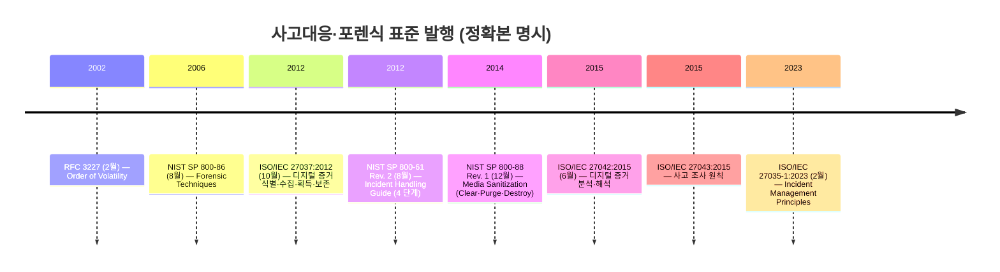
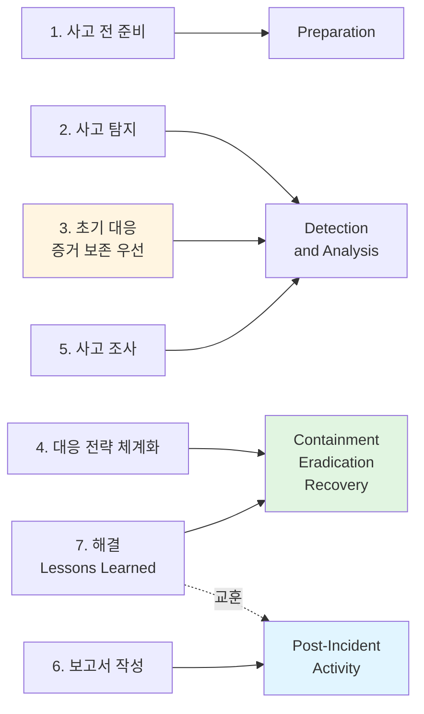
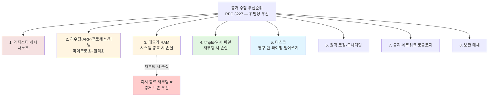
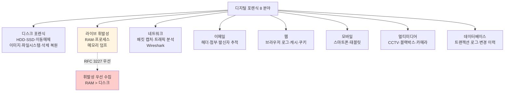
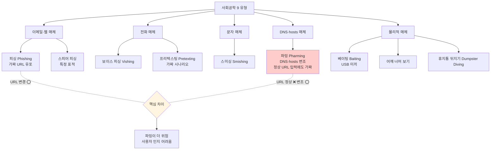

# 04. 사고대응·디지털 포렌식 — 만화책처럼 읽는 7단계·5원칙·8분야·9유형

> **이 문서를 읽는 법**: *왜 사고 발생 시 즉시 재부팅하면 안 되는지*, *왜 디스크보다 RAM 을 먼저 수집하는지*, *왜 분석을 사본에서만 하는지*, *왜 파밍이 피싱보다 위험한지* — 사고 발생부터 법정 제출까지의 *시간순* 으로 따라가면 모든 시험 함정이 풀립니다.
> 정확한 정의·수치·표준 번호·법령 조문은 정확본을 참조: [[cs/information-security/05.management-and-law/04.incident-response-and-forensics|정확본 04. 침해사고 대응 및 디지털 포렌식]]

> **독자 가정**: *백엔드/풀스택 개발자, 사고대응·포렌식 처음.* 이미 익숙한 개념 (`로그 보존`, `해시 검증`, `메모리 덤프`, `wireshark 패킷 캡처`) 을 다리로 씁니다.

> **연결 단원**: 본 단원은 [[cs/information-security/05.management-and-law/03.controls-implementation|03 보호대책]] §2-5 *침해사고 예방·대응 (관리적)* 의 *기술·법적 측면*. 신고 의무는 [[cs/information-security/05.management-and-law/07.security-laws|07 법제]]·[[cs/information-security/05.management-and-law/08.privacy-law|08 개인정보보호법]] cross-ref. 사회공학은 [[cs/information-security/01.system-security/06.system-attacks|정확본 01-06 시스템 공격]] cross-ref.

---

## 🎯 시작 전에 — 이미 보고 있는 사고대응

| 매일 보는 것 | 사실은 이 단원의 |
|---|---|
| 운영 사고 발생 시 비상연락망 | CIRT — 사고대응 조직 |
| "사고 발생 시 시스템 끄지 마세요" | 초기 대응 — 증거 보존 우선 |
| 메모리 덤프 + 디스크 이미지 | 휘발성 우선 수집 (RFC 3227) |
| SHA-256 해시 비교 | 무결성 입증 (5대 원칙) |
| 사고 후 증거물 봉인 + 인수인계 | 연계보관성 (Chain of Custody) |
| Write Blocker 케이블 | 원본 보존 — 쓰기 방지 |
| 침해사고 KISA 신고 | 정통망법 §48-3 의무 |
| 개인정보 유출 시 본인 통지 | 개보법 §34 의무 |
| 사후 회의 (Postmortem) | Lessons Learned (NIST §3.4.1) |
| 피싱 메일 차단 | 사회공학 유형 1 |
| DNS 캐시 변조로 가짜 사이트 | 파밍 — DNS·hosts 변조 |

> **이 단원의 본질**: 사고대응은 *해커를 잡는 것 ❌* — *법정 증거능력 보장 + 재발 방지*. 시험은 (1) **침해사고 정의 (정통망법 §2 ①항 7호)** (2) **한국 7단계 vs NIST 4단계** (3) **신고 의무 3 법령 (정통망법 §48-3 / 기반보호법 §13 / 개보법 §34)** (4) **포렌식 8 분야** (5) **5대 원칙 (정당성·재현성·신속성·연계보관성·무결성)** (6) **5단계 절차** (7) **안티 포렌식 + NIST SP 800-88 (Clear·Purge·Destroy)** (8) **사회공학 9 유형 + 파밍 vs 피싱** *8 핵심*을 묻는다.

---

## 📖 에피소드 1 — 침해사고 정의: 3 법령 비교 + NIST 7 카테고리

### 장면 1. 한국 법령상 침해사고 — *정통망법 §2 ①항 7호*

> **침해사고 (Information Security Incident)** : "*해킹·컴퓨터바이러스·논리폭탄·메일폭탄·서비스 거부 또는 고출력 전자기파* 등의 방법으로 정보통신망 또는 이와 관련된 정보시스템을 *공격하는 행위로 인하여 발생한 사태*."

[정보통신망 이용촉진 및 정보보호 등에 관한 법률] §2 ①항 7호 의 정의.

### 장면 2. 3 법령의 침해사고 정의 비교

| 법령 | 조문 | 정의 |
|---|---|---|
| **정보통신망법** | §2 ①항 7호 | 해킹·바이러스·논리폭탄·메일폭탄·DoS·전자기파 등 *전자적 침해행위* 로 인한 사태 |
| **정보통신기반보호법** | §2 (전자적 침해행위) | 해킹·바이러스·논리폭탄 등으로 *정보통신기반시설을 공격* 하여 정보·시스템에 영향을 미치는 행위 |
| **개인정보보호법** | §34 (개인정보 유출 등) | 개인정보가 *분실·도난·유출·위변조·훼손* 되는 사고 |

### 장면 3. NIST SP 800-61 Rev. 2 §2.1 — 침해사고 7 카테고리

| 카테고리 | 영문 | 사례 |
|---|---|---|
| **외부·이동매체** | External/Removable Media | 감염된 USB·CD 를 통한 악성코드 침투 |
| **침투** | Attrition | 무차별 공격 — DDoS·BoF·BAT·Brute-force |
| **웹** | Web | 웹 어플리케이션을 통한 공격 — XSS·SQLi |
| **이메일** | Email | 피싱·악성첨부파일·악성링크 |
| **부적절한 사용** | Improper Usage | 정책 위반·내부자 악의 |
| **분실·도난 장비** | Loss/Theft | 노트북·이동매체 분실 |
| **기타** | Other | 위 분류에 속하지 않는 사고 |

### 시험 함정

- "침해사고 정의는 [개인정보보호법]" → ❌ **틀림**. *정통망법 §2 ①항 7호* 정의.
- "정통망법의 침해사고 정의 조항?" → §2 *①항 7호*.
- "전자적 침해행위 용어는 어디?" → [정보통신기반보호법] §2.
- "개인정보 유출 사고는 어디 정의?" → [개인정보보호법] *§34* 별도 조항.

---

## 📖 에피소드 2 — 한국 7단계: 사고 전 준비부터 해결까지

### 장면 1. KISA 침해사고 대응 매뉴얼 — 7 단계

| 단계 | 활동 | 산출물 |
|---|---|---|
| **1. 사고 전 준비** | 정책·조직·도구·교육·훈련 | 사고대응 정책서, CIRT 조직, 비상연락망 |
| **2. 사고 탐지** | 보안장비·로그·신고 등으로 사고 인지 | 사고 인지 보고 |
| **3. 초기 대응** | 사고 사실 확인·*증거 보존*·임시 조치 | 초기 대응 보고서 |
| **4. 대응 전략 체계화** | 사고 영향 평가·대응 우선순위·조직 동원 결정 | 대응 전략서 |
| **5. 사고 조사** | 원인 분석·피해 범위 파악·*증거 수집* | 사고 조사 보고서 |
| **6. 보고서 작성** | 사고 경위·원인·대응·재발방지 대책 | 침해사고 종합 보고서 |
| **7. 해결** | 시스템 복구·개선 조치·재발 방지·*교훈 도출 (Lessons Learned)* | 시정조치 결과서 |

### 장면 2. 단계별 시간 민감도

| 단계 | 시간 민감도 |
|---|---|
| 사고 전 준비 | *평시* |
| 사고 탐지 | *즉시* |
| **초기 대응** | *1 시간 이내* 권장 |
| 대응 전략 체계화 | *24 시간 이내* |
| 사고 조사 | 사고 규모에 따라 |
| 보고서 작성 | *법정 신고 의무에 따라* |
| 해결 | 잔존 위협 제거 후 |

### 장면 3. *초기 대응의 최우선* — 증거 보존

> **시험 1순위 함정**: 초기 대응의 *최우선은 증거 보존*. *임의 종료·재부팅 금지* — 휘발성 데이터 (RAM) 가 사라진다.

### 시험 함정

- "한국 침해사고 대응 절차는 5단계" → ❌ **틀림**. *7 단계*.
- "사고 발생 시 즉시 재부팅" → ❌ **틀림**. *증거 보존 우선* — 임의 종료·재부팅 금지.
- "초기 대응 권장 시간?" → 1 시간 이내.
- "Lessons Learned 가 들어가는 단계?" → 7 단계 (해결).

---

## 📖 에피소드 3 — NIST 4단계 + Containment 단기·장기 + Lessons Learned

### 장면 1. NIST SP 800-61 Rev. 2 §3 — 4 단계 사이클

NIST SP 800-61 Rev. 2 (2012.8) 는 침해사고 대응을 *4 단계 사이클* 로 정의. 한국 7 단계와 본질적으로 동일하나 *상위 단계로 단순화*.

| 단계 | 한국 7단계 매핑 | 활동 |
|---|---|---|
| **Preparation** (준비) | 1 단계 | 정책·조직·도구·교육·훈련. 평시 활동 |
| **Detection and Analysis** (탐지 및 분석) | 2·3·5 단계 | 사고 탐지·검증·우선순위·범위 파악 |
| **Containment, Eradication, and Recovery** (격리·제거·복구) | 4·7 단계 | 사고 격리·악성코드 제거·시스템 복구 |
| **Post-Incident Activity** (사후 활동) | 6·7 단계 | 보고서·교훈·정책 개선·증거 보관 |

### 장면 2. *Containment 단기 vs 장기* (NIST §3.3.1)

| 격리 유형 | 영문 | 목적 | 사례 |
|---|---|---|---|
| **단기 격리** | Short-term Containment | *즉시 피해 확산 차단* | 네트워크 분리·계정 잠금·서비스 차단 |
| **장기 격리** | Long-term Containment | *시스템 복구 전까지 운영 유지* | 임시 패치·우회 경로·격리 환경 운영 |

### 장면 3. Lessons Learned 회의 (NIST §3.4.1) — 6 질문

> **사후 활동의 핵심 = Lessons Learned 회의**. 다음 6 질문에 답해야 한다.

- 정확히 무슨 일이 일어났는가? *시간순으로 정리*.
- 직원과 관리진은 사고에 *얼마나 잘 대응* 했는가? *정책·절차가 따르졌는가?*
- 다음 번에 *다른 행동* 을 해야 할 것은 무엇인가?
- *시정 조치* 는 무엇이며 누가 책임지는가?
- *향후 유사 사고를 어떻게 방지* 할 것인가?
- *추가 도구·자원* 이 필요한가?

### 장면 4. *Containment·Eradication·Recovery* 의미 분해

| 단어 | 의미 |
|---|---|
| **Containment** | *격리* — 피해 확산 차단 |
| **Eradication** | *악성코드 제거* — 잔존 위협 박멸 |
| **Recovery** | *복구* — 정상 운영 재개 |

### 시험 함정

- "NIST 절차는 5 단계" → ❌ **틀림**. *4 단계*.
- "NIST 4 단계의 *순서*?" → Preparation → Detection&Analysis → Containment·Eradication&Recovery → Post-Incident Activity.
- "Containment 의 의미?" → *격리* (Eradication 은 제거, Recovery 는 복구).
- "Lessons Learned 가 속하는 NIST 단계?" → Post-Incident Activity.

---

## 📖 에피소드 4 — 신고 의무 3 법령: 정통망법·기반보호법·개보법

### 장면 1. 정통망법 §48-3 — 침해사고 신고

[정보통신망 이용촉진 및 정보보호 등에 관한 법률] §48-3 은 정보통신서비스 제공자에게 *침해사고 발생 시 신고 의무* 를 부과.

| 항목 | 내용 |
|---|---|
| **의무자** | 정보통신서비스 제공자 |
| **신고 사유** | 침해사고 발생 사실의 *인지* |
| **신고 대상** | 과학기술정보통신부 장관 또는 *한국인터넷진흥원 (KISA)* |
| **신고 방법** | KISA 인터넷침해사고대응센터 (KrCERT/CC) 신고 채널 |
| **신고 시기** | *"지체 없이"* — 시행령 별도 명시 사항 (조문 본문에 구체적 시간 미명시 — 작성 시점에 시행령 직접 확인 필요) |
| **비신고 시 처벌** | 정보통신망법 §76 의 과태료 부과 사유에 해당할 수 있음 — 처분 기준은 시행령 |

### 장면 2. 정보통신기반보호법 §13 — 침해사고 통지

[정보통신기반 보호법] §13 은 *주요정보통신기반시설 관리기관* 에 통지 의무를 부과.

| 항목 | 내용 |
|---|---|
| **의무자** | 주요정보통신기반시설 관리기관 |
| **통지 사유** | *전자적 침해행위* 발생 인지 |
| **통지 대상** | 관계 중앙행정기관의 장, *수사기관*, KISA |
| **통지 시기** | "지체 없이" |

### 장면 3. 개인정보보호법 §34 — 개인정보 유출 통지·신고

[개인정보보호법] §34 는 *개인정보 유출 사고 시* 통지·신고 의무를 부과 ([[cs/information-security/05.management-and-law/08.privacy-law|08 단원 §9]] 에서 상세).

| 항목 | 내용 |
|---|---|
| **의무자** | 개인정보처리자 |
| **통지 대상** | **정보주체** (유출된 개인정보의 주인) |
| **신고 대상** | **개인정보보호위원회** 또는 한국인터넷진흥원 |
| **통지·신고 시기** | "지체 없이" — *1,000 명 이상 또는 민감정보·고유식별정보 유출 시* 신고 의무 |
| **통지 내용** | 유출 항목·시점·경위·피해 최소화 방법·구제 절차·담당부서 연락처 |

### 장면 4. *침해사고 신고 vs 개인정보 유출 신고* — 시험 빈출 1순위

| 비교 항목 | 침해사고 신고 (정통망법 §48-3) | 개인정보 유출 신고 (개보법 §34) |
|---|---|---|
| **대상 사고** | 해킹·DDoS·악성코드 등 정보통신망 침해 | 개인정보의 분실·도난·유출·위변조·훼손 |
| **신고 대상** | 과기정통부·KISA | *개인정보보호위원회* 또는 KISA |
| **통지 대상** | (없음 — 신고만) | **정보주체 통지 의무** |
| **시간 기준** | 지체 없이 | 지체 없이 (특정 규모 이상 신고) |
| **법적 근거** | 정보통신망법 §48-3 | 개인정보보호법 §34 |

### 시험 함정

- "침해사고 신고 = 개인정보보호위원회" → ❌ **틀림**. *KISA·과기정통부* (정통망법 §48-3). 위원회는 개보법 §34.
- "정통망법 침해사고 신고 조항?" → *§48-3*.
- "정보통신기반시설 통지 조항?" → *§13*.
- "개인정보 유출 시 정보주체 통지 의무?" → ⭕ (개보법 §34).

---

## 📖 에피소드 5 — 디지털 포렌식 정의 + 8 분야

### 장면 1. 디지털 포렌식의 정체

> **디지털 포렌식 (Digital Forensics)** : 침해사고 발생 시 *법적으로 유효한 증거* 를 디지털 기기로부터 *수집·분석·보관·제출* 하는 등의 일련의 과정을 다루는 *과학 분야*.

ISO/IEC 27037:2012 는 "디지털 증거의 *식별·수집·획득·보존*" 으로 정의. *법정 증거능력* 을 보장하기 위한 엄격한 과학적·법적 절차.

### 장면 2. 8 분야 — *시험 빈출*

| 분야 | 대상 | 핵심 기술 |
|---|---|---|
| **디스크 포렌식** | HDD·SSD·이동매체 | 이미지 획득 (DD·EnCase·FTK), 파일 시스템 분석, 삭제 파일 복원 |
| **휘발성 데이터 포렌식 (라이브 포렌식)** | RAM·실행 중 프로세스 | 메모리 덤프, 프로세스·네트워크 연결 분석 |
| **네트워크 포렌식** | 네트워크 트래픽 | 패킷 캡처 (Wireshark), 트래픽 분석, 통신 흐름 재구성 |
| **이메일 포렌식** | 이메일 서버·클라이언트 | 헤더 분석, 첨부파일 추출, 발신자 추적 |
| **웹 포렌식** | 브라우저 로그·캐시·쿠키 | 브라우저 사용 이력 분석, 캐시 복원 |
| **모바일 포렌식** | 스마트폰·태블릿 | 물리적·논리적 추출, 앱 데이터 분석 |
| **멀티미디어 포렌식** | CCTV·블랙박스·카메라 | 영상 분석, 화질 개선, 위변조 검증 |
| **데이터베이스 포렌식** | DB 서버 | 트랜잭션 로그, 변경 이력, 삭제 데이터 |

### 장면 3. *라이브 포렌식 = 휘발성 데이터 포렌식*

> **라이브 포렌식 (Live Forensics)** = *휘발성 데이터 포렌식*. 시스템 종료 시 사라지는 RAM·프로세스·네트워크 연결 정보를 *실행 중에* 수집.

### 시험 함정

- "디지털 포렌식의 핵심 목적?" → *법정 증거능력 보장*.
- "라이브 포렌식 = ?" → *휘발성 데이터 포렌식*.
- "CCTV·블랙박스 포렌식?" → *멀티미디어 포렌식*.
- "8 분야의 *처음 2*?" → 디스크·라이브 (휘발성).

---

## 📖 에피소드 6 — RFC 3227: 휘발성 우선순위 8 단계

### 장면 1. RFC 3227 의 정체

> **RFC 3227** (Guidelines for Evidence Collection and Archiving, IETF 2002.2) — *휘발성이 높은 순* 으로 증거 수집의 우선순위를 정의한 *Order of Volatility*.

### 장면 2. 휘발성 우선순위 8 단계

| 순위 | 데이터 유형 | 수명 |
|---|---|---|
| **1** | 레지스터, 캐시 | *나노초* |
| **2** | 라우팅 테이블, ARP 캐시, 프로세스 테이블, 커널 통계 | *마이크로초~밀리초* |
| **3** | 메모리 (RAM) | *시스템 종료 시 손실* |
| **4** | 임시 파일 시스템 (tmpfs, /tmp) | *재부팅 시 손실* |
| **5** | 디스크 | *영구* (단 와이핑·덮어쓰기로 손실) |
| **6** | 원격 로깅·모니터링 데이터 | 보존 정책에 따라 |
| **7** | 물리 구성·네트워크 토폴로지 | 영구 |
| **8** | 보관용 매체 | 영구 |

### 장면 3. *휘발성 우선의 원칙*

> **시험 1순위 함정**: *휘발성이 높은 데이터를 먼저 수집해야 한다*. **디스크 이미지보다 메모리 덤프가 우선** — 시스템을 즉시 끄면 RAM 데이터 손실.

### 장면 4. *재부팅 = RAM·tmpfs 손실*

> 사고 발생 후 *임의 재부팅* 시 휘발성 단계 1·2·3·4 (레지스터·ARP·RAM·tmpfs) 의 증거가 *모두 사라진다*. 초기 대응의 *증거 보존 우선* 원칙의 근거.

### 시험 함정

- "휘발성 데이터는 디스크보다 나중에 수집" → ❌ **틀림**. *휘발성 우선* (RFC 3227).
- "RFC 3227 의 정체?" → *휘발성 우선순위* (Order of Volatility).
- "RFC 3227 발행 시점?" → 2002.2.
- "RAM 의 휘발성 순위?" → *3 위*.

---

## 📖 에피소드 7 — 디지털 포렌식 5 대 원칙: 정당성·재현성·신속성·연계보관성·무결성

### 장면 1. 5 대 원칙 — *시험 1순위*

5과목.txt 의 표준 5 대 원칙. 모든 한국 디지털 증거 수집 절차의 *기본*.

| 원칙 | 영문 | 정의 |
|---|---|---|
| **정당성의 원칙** | Legitimacy | 증거 수집·분석 절차가 *적법* 해야 한다. *영장 없이 수집한 증거는 증거능력을 상실* |
| **재현성의 원칙** | Reproducibility | *동일한 조건에서 동일한 결과* 가 도출되어야 한다 |
| **신속성의 원칙** | Promptness | *휘발성 데이터의 손실을 막기 위해 신속히* 수행 |
| **연계보관성의 원칙** | Chain of Custody | 법정 제출까지 증거물 *관리 주체들 간의 연속적인 승계 내역* 을 기록함으로써 디지털 증거가 *최초 수집된 상태로 유지* 되어야 함 |
| **무결성의 원칙** | Integrity | 수집된 증거가 *변경되지 않았음을 입증* (해시값 비교) |

### 장면 2. 5 대 원칙 위반 시 결과

| 원칙 위반 | 결과 |
|---|---|
| **정당성 위반** | 증거능력 상실 (위법수집 증거배제) — *형사소송법 §308-2* |
| **재현성 위반** | 분석 결과 *신뢰성 의심* |
| **신속성 위반** | 휘발성 데이터 손실 — *증거 가치 저하* |
| **연계보관성 위반** | 증거 변조·오염 가능성 — *증거능력 상실* |
| **무결성 위반** | 증거 변경 — *증거능력 상실* |

### 장면 3. *외우는 한 줄*

> **정당성·재현성·신속성·연계보관성·무결성** = *적법 + 같은 결과 + 빨리 + 끊김 없음 + 안 변함*.

### 시험 함정

- "5 대 원칙 = 정당성·재현성·신속성·증거력" → ❌ **틀림**. 마지막은 *연계보관성·무결성* (증거력 ❌).
- "해시값 비교의 목적?" → *무결성 입증*.
- "Chain of Custody 의 한국어?" → *연계보관성*.
- "위법 수집 증거의 결과?" → *증거능력 상실* (정당성 위반).

---

## 📖 에피소드 8 — 연계보관성 기록 + 형사소송법 §308-2 + 진정성 입증

### 장면 1. 연계보관성 (Chain of Custody) 기록 6 항목

ISO/IEC 27037:2012 §6.4 + NIST SP 800-86 §6.2 의 요구사항.

| 기록 항목 |
|---|
| **수집 일시 / 장소** |
| **수집자** (이름·소속) |
| **수집 방법 / 도구** |
| **증거의 식별 정보** (시리얼 번호·해시값) |
| **보관·이동의 모든 변경 이력** (수령자·일시·장소) |
| **변경의 사유** |

### 장면 2. 형사소송법 §308-2 — 위법수집 증거배제

> **[형사소송법] §308-2**: "*적법한 절차에 따르지 아니하고 수집한 증거는 증거로 할 수 없다*."

디지털 증거도 동일하게 적용 — *정당성의 원칙 위반 시 증거능력 부정*.

### 장면 3. 디지털 증거의 진정성 입증 — *3 요건*

대법원 판례 (대법원 *2007도7257* 외) 에 따르면 디지털 증거의 진정성은 다음 요건의 *종합적 판단* 으로 입증.

| 요건 | 의미 |
|---|---|
| **무결성** | 해시값 일치 |
| **동일성** | *원본과 사본의 동일성* |
| **신뢰성** | 수집·분석 절차의 신뢰성 |
| **원본 또는 그와 동일성·무결성이 보장된 사본** | 법정 제출 가능 |

### 시험 함정

- "위법수집 증거배제 = 형사소송법 §307" → ❌ **틀림**. *§308-2*.
- "연계보관성 위반은 증거 가치만 저하" → ❌ **틀림**. *증거능력 상실 가능*.
- "디지털 증거의 진정성 *3 요건*?" → 무결성 + 동일성 + 신뢰성.
- "대법원 판례 번호?" → 2007도7257 외 (정확본 명시).

---

## 📖 에피소드 9 — 디지털 포렌식 5 단계 + ISO 27037·27042·27043 분담 + Write Blocker

### 장면 1. 5 단계 절차 — *시험 빈출*

| 단계 | 활동 |
|---|---|
| **1. 사전 준비** | 도구·교육·법적 권한 확보. 평시 활동 |
| **2. 증거 수집** | 현장 도착·식별·획득·*해시 산출* |
| **3. 보관 및 이송** | 봉인·운반·보관소 입고. *연계보관성 기록* |
| **4. 조사 및 분석** | *사본에 대해 분석*. 원본은 원본대로 보존 |
| **5. 보고서 작성** | *객관적·재현 가능한* 보고서. 분석 도구·방법 명시 |

### 장면 2. ISO 27037·27042·27043 분담 — *3 표준*

| 단계 | 표준 | 역할 |
|---|---|---|
| **식별·수집·획득·보존** | ISO/IEC 27037:2012 (2012.10) | 1·2·3 단계 |
| **분석·해석** | ISO/IEC 27042:2015 (2015.6) | 4·5 단계 |
| **사고 조사 원칙** | ISO/IEC 27043:2015 | 전반 원칙 |

### 장면 3. 증거 수집의 4 원칙

- **원본 우선 보존**: *원본 매체에 직접 접근·분석 금지*.
- **이미지 사본 분석**: *비트 단위 (bit-by-bit) 사본* 을 만들어 분석.
- **해시값 검증**: 원본 → 이미지 변환 시·분석 전후로 *해시값 (SHA-256 등) 으로 무결성 검증*.
- **쓰기 방지 (Write Blocker) 사용**: 원본 매체는 *쓰기 방지 장치를 거쳐 접근*.

### 장면 4. *분석은 원본이 아닌 사본* — 시험 1순위

> **분석은 원본 매체에서 ❌, 사본 (이미지) 에서 수행**. 원본 보존이 *연계보관성·무결성의 전제*.

### 시험 함정

- "분석은 원본 매체에서 수행" → ❌ **틀림**. *사본 (이미지)* 분석.
- "원본 보존을 위한 필수 장치?" → *Write Blocker* (쓰기 방지).
- "ISO/IEC 27037 의 영역?" → *식별·수집·획득·보존* (1·2·3 단계).
- "ISO/IEC 27042 의 영역?" → *분석·해석* (4·5 단계).

---

## 📖 에피소드 10 — 안티 포렌식 — 은폐 (암호화·스테가노·파일 위장)

### 장면 1. 안티 포렌식의 정체

> **안티 포렌식 (Anti-Forensics)** : 디지털 데이터를 *조작·삭제·난독화* 하여 디지털 포렌식을 *방해* 하는 행위.

크게 *은폐 (Hiding)* 와 *파괴 (Destruction)* 로 분류.

### 장면 2. 데이터 은폐 3 기법

| 기법 | 설명 |
|---|---|
| **데이터 암호화** | 증거 데이터를 *암호화* 하여 분석 방해 |
| **스테가노그래피** | *기밀정보를 미디어 파일 (이미지·오디오) 안에 숨기는 기술* |
| **파일 위장** | *확장자 변경, 매직 넘버 조작* |

### 장면 3. *스테가노그래피 ≠ 암호화* — 시험 함정

| 비교 | 암호화 | 스테가노그래피 |
|---|---|---|
| **목적** | 내용을 *읽지 못하게* | 정보의 *존재 자체를 숨김* |
| **결과물** | 암호문 (의심 가능) | 정상 미디어처럼 보임 |
| **탐지 난이도** | 암호문 식별 가능 | *존재 자체 탐지 어려움* |

### 시험 함정

- "스테가노그래피 = 암호화" → ❌ **틀림**. 스테가노 = *미디어 안에 숨김* (암호화 ≠ 스테가노).
- "파일 위장의 방법?" → *확장자 변경 + 매직 넘버 조작*.
- "암호화와 스테가노의 *근본 차이*?" → 암호화 = 못 읽게 / 스테가노 = *존재 숨김*.

---

## 📖 에피소드 11 — 안티 포렌식 — 파괴 + NIST SP 800-88 (Clear·Purge·Destroy)

### 장면 1. 데이터 파괴 3 기법

| 기법 | 설명 |
|---|---|
| **디스크 와이핑** | 디스크 전체를 *무작위 데이터로 덮어쓰기* (DoD 5220.22-M, NIST SP 800-88) |
| **디스크 디가우징** | *강한 자기장으로 디스크 자기 신호 소거* (HDD 한정) |
| **물리적 파괴** | *드릴·파쇄·소각* |

### 장면 2. NIST SP 800-88 Rev. 1 (2014.12) — 매체 정보 위생 3 수준

| 수준 | 방법 | 회복 가능성 |
|---|---|---|
| **Clear** | 일반 소거 (포맷·삭제) | *일반 도구로 회복 가능* |
| **Purge** | 와이핑·디가우징 | *전문 도구로도 회복 어려움* |
| **Destroy** | 물리적 파괴 | *회복 불가능* |

### 장면 3. *디가우징은 HDD 만* — 시험 함정

> **디가우징은 자기 매체에만 효과적** — *HDD 한정*. SSD 는 자기 매체가 아니므로 디가우징 불가. SSD 는 *암호화 키 폐기* 또는 *물리적 파괴* 사용.

### 시험 함정

- "NIST SP 800-88 등급?" → *Clear < Purge < Destroy* (회복 가능성 역순).
- "디가우징 = SSD 에도 효과적" → ❌ **틀림**. *HDD 한정* (자기 매체).
- "Purge 와 Destroy 의 차이?" → Purge = 와이핑·디가우징 (전문 도구로도 어려움) / Destroy = 물리 파괴 (회복 불가).

---

## 📖 에피소드 12 — 사회공학 9 유형: 피싱부터 휴지통 뒤지기까지

### 장면 1. 사회공학의 정체

> **사회공학 (Social Engineering)** : *사람들 사이의 신뢰관계를 바탕으로* 사람들을 속여 *정상적인 보안 절차를 무너뜨리고 비기술적인 수단으로 정보를 탈취* 하는 행위.

### 장면 2. 9 유형 — *시험 빈출*

| 공격 | 영문 | 설명 | 매체 |
|---|---|---|---|
| **피싱** | Phishing | 정상 기관을 가장한 이메일·웹사이트로 정보 탈취 | 이메일·웹 |
| **스피어 피싱** | Spear Phishing | *특정 개인·조직을 표적* 으로 한 정교한 피싱 | 이메일 |
| **보이스 피싱** | Vishing | *전화* 로 정보 탈취 | 전화 |
| **스미싱** | Smishing | *SMS·MMS* 로 정보 탈취 | 문자 |
| **파밍** | Pharming | 희생자가 *정상적인 도메인 주소를 입력* 하여 접속해도 *가짜 사이트로 접속이 유도* 되어 개인정보·금융정보 등을 탈취하는 형태의 공격 | DNS·hosts 파일 변조 |
| **베이팅** | Baiting | *USB·이동매체에 악성코드를 심고 호기심 유발* | 물리적 매체 |
| **프리텍스팅** | Pretexting | *가짜 시나리오로 신뢰 획득* | 전화·대면 |
| **어깨 너머 보기** | Shoulder Surfing | *입력 화면을 어깨 너머로 관찰* | 물리적 |
| **휴지통 뒤지기** | Dumpster Diving | *폐기 문서·매체에서 정보 수집* | 물리적 |

### 장면 3. 매체별 분류

| 매체 | 공격 |
|---|---|
| **이메일·웹** | 피싱·스피어 피싱 |
| **전화** | 보이스 피싱·프리텍스팅 |
| **문자** | 스미싱 |
| **DNS·hosts** | 파밍 |
| **물리적** | 베이팅·어깨 너머·휴지통 뒤지기 |

### 시험 함정

- "베이팅 = USB 미끼" → ⭕.
- "휴지통 뒤지기 (Dumpster Diving) 대응?" → *종이 매체 파쇄*.
- "스피어 피싱 vs 피싱?" → 스피어 = *특정 개인·조직 표적*.
- "프리텍스팅 = ?" → *가짜 시나리오로 신뢰 획득*.

---

## 📖 에피소드 13 — 파밍 vs 피싱: DNS 변조 vs 가짜 URL

### 장면 1. 파밍의 *위험성* — 정상 URL 입력해도 가짜 사이트

> **파밍 (Pharming)** = *DNS·hosts 파일 변조*. **희생자가 정상 도메인을 입력해도** *가짜 사이트로 접속*. URL 변경 ❌ — *사용자 인지 어려움*.

### 장면 2. 파밍 vs 피싱 — 시험 1순위

| 비교 항목 | 피싱 | 파밍 |
|---|---|---|
| **공격 방법** | *가짜 URL* 을 메일·SMS 로 유포 | *DNS·hosts 파일 변조* 로 정상 URL 입력 시에도 가짜 사이트 |
| **사용자 인지** | 가짜 URL *인지 가능* | *정상 URL 입력이므로 인지 어려움* |
| **대응** | URL 확인, 출처 확인 | *DNS 보안 (DNSSEC), 호스트 파일 검증* |

### 장면 3. *URL 변경 여부* — 핵심 차이

> **피싱**: URL 자체가 가짜 (예: `naver.co.kr` 대신 `naver-secure.com`).
>
> **파밍**: URL 은 정상 (`naver.com` 그대로). *DNS 응답이 가짜 IP* 로 변조되어 가짜 사이트 접속.

### 장면 4. 파밍 대응 기술

| 대응 | 설명 |
|---|---|
| **DNSSEC** | DNS 응답에 *디지털 서명* 추가하여 변조 탐지 |
| **호스트 파일 검증** | 로컬 hosts 파일 *변경 모니터링* |
| **HTTPS 인증서 검증** | 가짜 사이트는 정상 인증서 보유 어려움 |

### 시험 함정

- "파밍 = 가짜 URL 유포" → ❌ **틀림**. *DNS·hosts 변조* (정상 URL 입력 시에도 가짜).
- "피싱 vs 파밍 *URL 변경 여부*?" → 피싱 = URL 가짜 / 파밍 = *URL 정상*.
- "파밍의 대응 기술?" → DNSSEC + 호스트 파일 검증.
- "파밍이 피싱보다 위험한 이유?" → *사용자 인지 어려움*.

---

## 📑 종합 비교 (에피소드 2·3·5·7·9 정리)

사고대응·포렌식 *6 핵심 영역* 종합.

| 영역 | 핵심 |
|---|---|
| **한국 7 단계** | 사고 전 준비 → 탐지 → 초기대응 → 전략 체계화 → 조사 → 보고서 → 해결 |
| **NIST 4 단계** | Preparation → Detection&Analysis → Containment·Eradication&Recovery → Post-Incident Activity |
| **신고 의무 3 법령** | 정통망법 §48-3 (KISA) / 기반보호법 §13 (관계기관·KISA) / 개보법 §34 (정보주체 + 위원회) |
| **포렌식 8 분야** | 디스크·라이브·네트워크·이메일·웹·모바일·멀티미디어·DB |
| **5 대 원칙** | 정당성·재현성·신속성·연계보관성·무결성 |
| **5 단계 절차** | 사전 준비 → 증거 수집 → 보관 및 이송 → 조사 및 분석 → 보고서 작성 |

> **읽는 법**: 사고 발생 → 한국 7 단계 (또는 NIST 4 단계) 로 *대응* → 법정 신고 (3 법령) → 디지털 포렌식 (8 분야 / 5 원칙 / 5 단계) 로 증거 확보. 안티 포렌식·사회공학은 *공격자 측면* 의 변수.

---

## 🗺️ 마인드맵 1 — 사고대응·포렌식 표준 발행 시간선



---

## 🗺️ 마인드맵 2 — 한국 7 단계 vs NIST 4 단계 매핑



---

## 🗺️ 마인드맵 3 — RFC 3227 휘발성 우선순위



---

## 🗺️ 마인드맵 4 — 디지털 포렌식 8 분야



---

## 🗺️ 마인드맵 5 — 사회공학 9 유형 + 파밍 vs 피싱



---

## 🗂️ 키워드 클러스터

### 표준 발행 시점

```
RFC 3227 (2002.2)               — Order of Volatility (8 단계)
NIST SP 800-86 (2006.8)         — Forensic Techniques into Incident Response
ISO/IEC 27037:2012 (2012.10)    — 식별·수집·획득·보존 (1·2·3 단계)
NIST SP 800-61 Rev. 2 (2012.8)  — Incident Handling Guide (4 단계)
NIST SP 800-88 Rev. 1 (2014.12) — Media Sanitization (Clear·Purge·Destroy)
ISO/IEC 27042:2015 (2015.6)     — 분석·해석 (4·5 단계)
ISO/IEC 27043:2015              — 사고 조사 원칙
ISO/IEC 27035-1:2023 (2023.2)   — Incident Management Principles
```

### 침해사고 정의 — 3 법령

```
정통망법 §2 ①항 7호    — 해킹·바이러스·논리폭탄·메일폭탄·DoS·전자기파
기반보호법 §2          — 전자적 침해행위 (정보통신기반시설 공격)
개인정보보호법 §34     — 개인정보 분실·도난·유출·위변조·훼손
```

### 한국 7 단계 vs NIST 4 단계

```
한국 7 단계
  1. 사고 전 준비       — 정책·CIRT·도구·교육·훈련
  2. 사고 탐지          — 보안장비·로그·신고
  3. 초기 대응          — 증거 보존 우선 (1 시간 이내)
  4. 대응 전략 체계화    — 영향 평가·우선순위 (24 시간 이내)
  5. 사고 조사          — 원인·범위·증거 수집
  6. 보고서 작성        — 경위·원인·재발 방지
  7. 해결              — 시스템 복구·Lessons Learned

NIST 4 단계 (SP 800-61 Rev. 2)
  Preparation
  Detection and Analysis
  Containment, Eradication, and Recovery
  Post-Incident Activity
```

### 신고 의무 3 법령

```
정통망법 §48-3       — 침해사고 신고 / KISA·과기정통부 / 지체 없이
기반보호법 §13       — 침해사고 통지 / 관계기관·수사기관·KISA / 지체 없이
개보법 §34          — 개인정보 유출 통지·신고 / 정보주체 + 위원회·KISA / 지체 없이 (1,000명 이상)
```

### 디지털 포렌식 8 분야

```
디스크         — HDD·SSD·이동매체 / DD·EnCase·FTK
라이브 (휘발성) — RAM·프로세스 / 메모리 덤프
네트워크       — 패킷 캡처 (Wireshark)
이메일         — 헤더·첨부·발신자 추적
웹            — 브라우저 로그·캐시·쿠키
모바일         — 스마트폰·태블릿
멀티미디어      — CCTV·블랙박스·카메라
데이터베이스    — 트랜잭션 로그·변경 이력
```

### 5 대 원칙 + 위반 결과

```
정당성     — 적법 절차 / 위반 시 증거능력 상실 (형사소송법 §308-2)
재현성     — 동일 조건 동일 결과 / 위반 시 신뢰성 의심
신속성     — 휘발성 손실 방지 / 위반 시 증거 가치 저하
연계보관성  — Chain of Custody / 위반 시 증거능력 상실
무결성     — 해시값 일치 / 위반 시 증거능력 상실
```

### 5 단계 절차 + ISO 분담

```
1. 사전 준비           — 도구·교육·법적 권한
2. 증거 수집           — 식별·획득·해시 산출      } ISO/IEC 27037:2012
3. 보관 및 이송         — 봉인·운반·연계보관성 기록
4. 조사 및 분석         — 사본 분석 (원본 보존)    } ISO/IEC 27042:2015
5. 보고서 작성         — 객관적·재현 가능

전반 원칙              — ISO/IEC 27043:2015
원본 보존 필수 장치     — Write Blocker
해시 알고리즘 예시      — SHA-256
```

### 안티 포렌식 — 은폐 + 파괴

```
은폐 Hiding
  데이터 암호화          — 암호문 (의심 가능)
  스테가노그래피         — 미디어 안에 숨김 (존재 자체 숨김)
  파일 위장             — 확장자·매직 넘버 조작

파괴 Destruction
  디스크 와이핑          — 무작위 데이터 덮어쓰기 (DoD 5220.22-M, NIST SP 800-88)
  디스크 디가우징        — 자기장 소거 (HDD 한정)
  물리적 파괴            — 드릴·파쇄·소각

NIST SP 800-88 — 매체 위생 3 수준
  Clear   — 일반 소거 (회복 가능)
  Purge   — 와이핑·디가우징 (전문 도구로도 어려움)
  Destroy — 물리 파괴 (회복 불가)
```

### 사회공학 9 유형 + 매체 분류

```
이메일·웹    — 피싱 (Phishing) · 스피어 피싱 (Spear Phishing)
전화        — 보이스 피싱 (Vishing) · 프리텍스팅 (Pretexting)
문자        — 스미싱 (Smishing)
DNS·hosts   — 파밍 (Pharming)
물리적      — 베이팅 (Baiting) · 어깨 너머 보기 (Shoulder Surfing) · 휴지통 뒤지기 (Dumpster Diving)
```

### 파밍 vs 피싱

```
피싱 — 가짜 URL 을 메일·SMS 로 유포 (URL 변경 ⭕)
파밍 — DNS·hosts 변조 (URL 정상 입력에도 가짜 사이트 접속)
       사용자 인지 어려움 → 더 위험
       대응: DNSSEC + 호스트 파일 검증
```

### 디지털 증거 진정성 입증 (대법원 2007도7257 외)

```
무결성  — 해시값 일치
동일성  — 원본과 사본의 동일성
신뢰성  — 수집·분석 절차의 신뢰성
원본 또는 동일성·무결성이 보장된 사본
형사소송법 §308-2 — 위법수집증거의 배제
```

---

## 🃏 회상 30문항

> 답을 가린 뒤 자가 채점. 틀린 것만 정확본으로 깊이 학습.

**A. 침해사고 정의·분류 (1~5)**
1. 한국 침해사고 정의 법령·조항?
2. 정통망법 §2 ①항 7호 의 침해사고 *6 사례*?
3. 정보통신기반보호법 §2 의 용어?
4. 개인정보 유출 사고 정의 조항?
5. NIST SP 800-61 침해사고 7 카테고리?

**B. 대응 절차 (6~10)**
6. 한국 침해사고 대응 *7 단계*?
7. NIST SP 800-61 Rev. 2 *4 단계*?
8. 초기 대응의 *최우선*?
9. Containment 의 의미와 단기·장기 격리?
10. Lessons Learned 가 속하는 NIST 단계?

**C. 신고 의무 (11~14)**
11. 침해사고 신고 *법적 근거*?
12. 정보통신기반시설 통지 *법적 근거*?
13. 개인정보 유출 통지의 *2 가지 대상*?
14. 침해사고 신고 vs 개인정보 유출 신고의 *신고 대상* 차이?

**D. 디지털 포렌식 정의·분야 (15~18)**
15. 디지털 포렌식의 *목적*?
16. 디지털 포렌식 *8 분야*?
17. 라이브 포렌식 = ?
18. RFC 3227 의 정체와 *RAM 의 휘발성 순위*?

**E. 5 원칙·5 단계 (19~24)**
19. 디지털 포렌식 *5 대 원칙*?
20. 정당성 위반의 결과와 법적 근거?
21. 무결성 입증 방법?
22. 디지털 포렌식 *5 단계*?
23. ISO 27037 vs ISO 27042 의 영역?
24. 원본 보존을 위한 필수 장치?

**F. 안티 포렌식·사회공학 (25~30)**
25. 안티 포렌식 *2 분류*?
26. NIST SP 800-88 *3 수준*?
27. 디가우징의 *적용 매체*?
28. 사회공학 *9 유형*?
29. 파밍의 *공격 방법*?
30. 피싱과 파밍의 *URL 변경 여부 차이*?

---

## ⚠️ 시험 함정 모음

| 함정 | 정답 |
|---|---|
| 침해사고는 [개인정보보호법] 에 정의 | ❌ [정통망법] *§2 ①항 7호* 정의 |
| NIST SP 800-61 절차는 5 단계 | ❌ *4 단계* (Preparation·Detection&Analysis·Containment·Post-Incident) |
| 한국 침해사고 대응 절차는 5 단계 | ❌ *7 단계* |
| 사고 발생 시 즉시 시스템 재부팅 | ❌ *증거 보존 우선* — 임의 종료·재부팅 금지 |
| 휘발성 데이터는 디스크보다 나중 수집 | ❌ *휘발성 우선* (RFC 3227) — RAM 먼저 |
| 5 대 원칙 = 정당성·재현성·신속성·증거력 | ❌ 마지막은 *연계보관성·무결성* (증거력 ❌) |
| 분석은 원본 매체에서 수행 | ❌ *사본 (이미지)* 분석. 원본 보존 |
| 디가우징은 SSD 에도 효과적 | ❌ *HDD 한정* (자기 매체) |
| 스테가노그래피 = 암호화 | ❌ 스테가노 = 미디어 안에 *숨김* (암호화는 별개) |
| 파밍 = 가짜 URL 유포 | ❌ 파밍 = *DNS·hosts 변조* (정상 URL 입력 시에도 가짜) |
| 침해사고 신고 = 개인정보보호위원회 | ❌ 침해사고 신고 = *KISA·과기정통부* (정통망법 §48-3). 위원회는 개보법 §34 |
| 위법수집 증거배제는 형사소송법 §307 | ❌ *§308-2* |
| 연계보관성 위반은 증거 가치만 저하 | ❌ *증거능력 상실* 가능 |
| Containment = 악성코드 제거 | ❌ Containment = *격리*. Eradication = 제거. Recovery = 복구 |
| ISO/IEC 27037 = 분석·해석 | ❌ ISO/IEC 27037 = *식별·수집·획득·보존*. 27042 = 분석·해석 |
| Clear < Destroy < Purge | ❌ *Clear < Purge < Destroy* (회복 가능성 역순) |
| 베이팅 = 피싱의 일종 | ❌ *USB 미끼* (물리적 매체) |
| 휴지통 뒤지기 = 해킹 기법 | ❌ *사회공학* (Dumpster Diving — 폐기물 수집) |
| 디지털 증거 진정성 = 무결성만 | ❌ *무결성 + 동일성 + 신뢰성* (3 요건) |
| 정통망법 §48-3 의 신고 대상은 위원회 | ❌ *과기정통부·KISA* |
| RFC 3227 의 RAM 우선순위는 1 | ❌ *3* (1 = 레지스터·캐시) |
| Lessons Learned = 한국 6 단계 | ❌ 한국 *7 단계 (해결)* / NIST *Post-Incident Activity* |
| 멀티미디어 포렌식 = 음악 분석 | ❌ *CCTV·블랙박스·카메라* (영상 분석·위변조 검증) |

---

## 🔗 정확본 매핑표

| 본 노트 에피소드 | 정확본 § |
|---|---|
| 에피소드 1 (침해사고 정의 + 3 법령 + NIST 7 카테고리) | [[cs/information-security/05.management-and-law/04.incident-response-and-forensics#§1. 침해사고의 정의\|정확본 §1-1·§1-2]] |
| 에피소드 2 (한국 7 단계) | [[cs/information-security/05.management-and-law/04.incident-response-and-forensics#§2. 침해사고 대응 절차 — 한국 7단계\|정확본 §2-1·§2-2]] |
| 에피소드 3 (NIST 4 단계 + Containment + Lessons Learned) | [[cs/information-security/05.management-and-law/04.incident-response-and-forensics#§3. NIST SP 800-61 Rev. 2 — 4단계 절차\|정확본 §3-1·§3-2·§3-3]] |
| 에피소드 4 (신고 의무 3 법령) | [[cs/information-security/05.management-and-law/04.incident-response-and-forensics#§4. 침해사고 신고 의무\|정확본 §4-1·§4-2·§4-3·§4-4]] |
| 에피소드 5 (포렌식 정의 + 8 분야) | [[cs/information-security/05.management-and-law/04.incident-response-and-forensics#§5. 디지털 포렌식의 정의와 분야\|정확본 §5·§5-1]] |
| 에피소드 6 (RFC 3227 휘발성 우선순위) | [[cs/information-security/05.management-and-law/04.incident-response-and-forensics#§5-2. 휘발성 vs 비휘발성 — 수집 우선순위\|정확본 §5-2]] |
| 에피소드 7 (5 대 원칙 + 위반 결과) | [[cs/information-security/05.management-and-law/04.incident-response-and-forensics#§6. 디지털 포렌식 5대 원칙\|정확본 §6-1·§6-2]] |
| 에피소드 8 (연계보관성 + §308-2 + 진정성 입증) | [[cs/information-security/05.management-and-law/04.incident-response-and-forensics#§6-3. 연계보관성 (Chain of Custody) 의 기록 항목\|정확본 §6-3·§7-1·§7-2]] |
| 에피소드 9 (5 단계 + ISO 27037·27042·27043 + Write Blocker) | [[cs/information-security/05.management-and-law/04.incident-response-and-forensics#§8. 디지털 포렌식 5단계 절차\|정확본 §8-1·§8-2·§8-3]] |
| 에피소드 10 (안티 포렌식 — 은폐) | [[cs/information-security/05.management-and-law/04.incident-response-and-forensics#§9-1. 안티 포렌식 기법\|정확본 §9-1]] |
| 에피소드 11 (안티 포렌식 — 파괴 + NIST SP 800-88) | [[cs/information-security/05.management-and-law/04.incident-response-and-forensics#§9-2. NIST SP 800-88 — 매체 정보 위생\|정확본 §9-2]] |
| 에피소드 12 (사회공학 9 유형) | [[cs/information-security/05.management-and-law/04.incident-response-and-forensics#§10-1. 사회공학 공격 유형\|정확본 §10-1]] |
| 에피소드 13 (파밍 vs 피싱) | [[cs/information-security/05.management-and-law/04.incident-response-and-forensics#§10-2. 파밍 vs 피싱\|정확본 §10-2]] |

---

## 📅 학습 흐름 (8주차 시험 대비 기준)

```
[1주]   에피소드 1 (침해사고 정의 + 3 법령) — 만화책 통독, *§2 ①항 7호* 외움
[2주]   에피소드 2·3 (한국 7 단계 + NIST 4 단계) — 매핑 표 외움 + *증거 보존 우선* 외움
[3주]   에피소드 4 (신고 의무 3 법령) — *§48-3 / §13 / §34* 비교 외움
[4주]   에피소드 5·6 (포렌식 정의 + 8 분야 + RFC 3227) — 8 분야 외움, *RAM > 디스크*
[5주]   에피소드 7·8 (5 대 원칙 + 형사소송법 §308-2) — 정당성·재현성·신속성·연계보관성·무결성 외움
[6주]   에피소드 9 (5 단계 + ISO 27037·27042·27043) — *원본 보존·사본 분석* 외움
[7주]   에피소드 10·11 (안티 포렌식 — 은폐·파괴 + NIST SP 800-88) — *Clear·Purge·Destroy* 외움
[8주]   에피소드 12·13 (사회공학 9 + 파밍 vs 피싱) — *URL 변경 여부* 외움 + 회상 30
```

---

> **다음 단원**: [[cs/information-security/05.management-and-law/05.certifications|05. 인증제도]] — 본 단원 §2 의 *침해사고 대응 7 단계* 가 *ISMS-P 인증기준 영역 1·2 의 관리체계 + 보호대책 요구사항* 으로 통합. *ISMS-P 3 영역 21 분야 102 통제 + ISO/IEC 27001:2022 + CC EAL 7 단계 + KCMVP + GS + PIA*.
