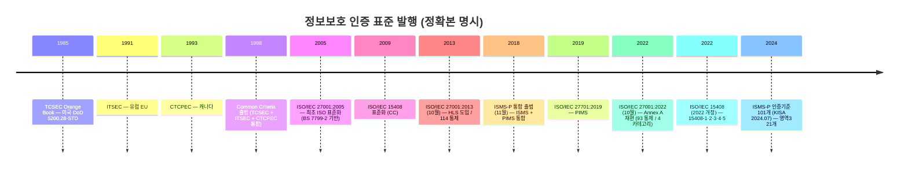
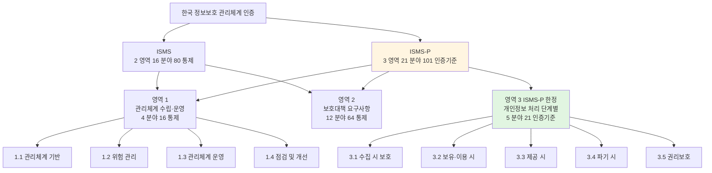
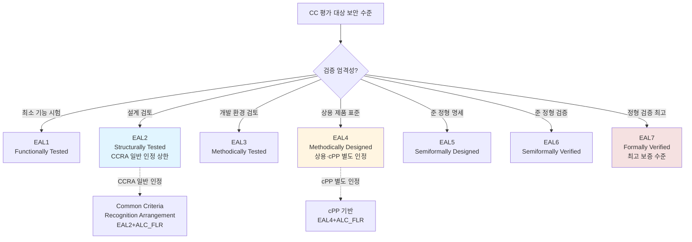
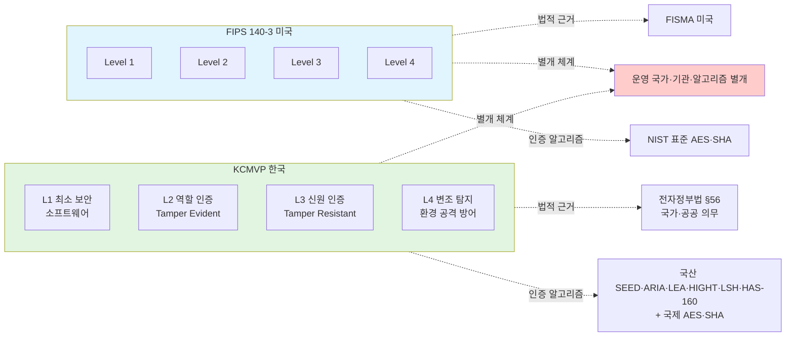
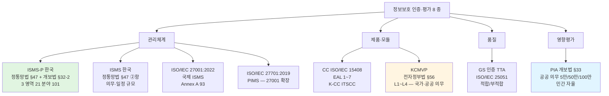

# 05. 정보보호 인증제도 — 만화책처럼 읽는 ISMS-P·ISO 27001·CC EAL·KCMVP·PIA

> **이 문서를 읽는 법**: *왜 ISMS 와 ISMS-P 가 다른지*, *왜 ISO/IEC 27001:2022 가 통제를 93 개로 줄였는지*, *왜 CC 의 EAL 이 1~7 단계인지*, *왜 KCMVP 와 FIPS 140-3 이 별개 체계인지* — 인증의 *역사적 흐름과 영역 분리* 를 따라가면 모든 시험 함정이 풀립니다.
> 정확한 정의·수치·표준 번호·법령 조문은 정확본을 참조: [[cs/information-security/05.management-and-law/05.certifications|정확본 05. 정보보호 인증제도]]

> **독자 가정**: *백엔드/풀스택 개발자, 인증 처음.* 이미 익숙한 개념 (`ISO 인증 마크`, `보안 제품 인증 등급`, `소프트웨어 품질 등급`) 을 다리로 씁니다.

> **연결 단원**: 본 단원은 [[cs/information-security/05.management-and-law/01.security-management-overview|01]]·[[cs/information-security/05.management-and-law/02.risk-assessment|02]]·[[cs/information-security/05.management-and-law/03.controls-implementation|03]]·[[cs/information-security/05.management-and-law/04.incident-response-and-forensics|04]] 의 *모든 개념을 종합한 인증 체계*. ISMS-P 인증기준 영역 1 = 01·02 / 영역 2 = 03·04 / 영역 3 = [[cs/information-security/05.management-and-law/08.privacy-law|08 개인정보보호법]] 와 매핑.

---

## 🎯 시작 전에 — 이미 보고 있는 인증

| 매일 보는 것 | 사실은 이 단원의 |
|---|---|
| 사이트 하단 ISMS-P 인증 마크 | 정통망법 §47 + 개보법 §32-2 |
| ISO 27001 글로벌 인증 마크 | ISO/IEC 27001:2022 |
| 보안 제품의 EAL 등급 | CC (ISO/IEC 15408) EAL 1~7 |
| 공공기관 보안 솔루션 KCMVP 인증 | 전자정부법 §56 + L1~L4 |
| 공공기관 **개인정보파일** 도입·변경 시 사전 침해 위험 분석 | PIA (개보법 §33, 시행령 §35) |
| GS 인증 마크 | TTA / ISO/IEC 25051 (SW 품질) |
| 27701 PIMS 인증 (해외) | ISO/IEC 27701:2019 (개인정보보호 확장) |
| 인증 유효기간 만료 알림 | 3년 + 연 1회 사후관리 |
| 인증 심사원 출장 | ISMS-P 심사원 (KISA 양성) |

> **이 단원의 본질**: 인증은 *문서 작성 ❌* — *법적 의무 + 국제 신뢰성 + 제품 보안 검증* 의 *3 축*. 시험은 (1) **ISMS-P 3 영역 21 분야 101 인증기준 + 법적 근거** (2) **ISMS 의무대상 (IDC 규모 무관 + 시행령 §49)** (3) **인증 6 단계(학습용) + 3년 유효기간** (4) **ISO/IEC 27001:2022 (93 통제) vs 27701 (PIMS)** (5) **CC EAL 1~7 + CCRA EAL2** (6) **KCMVP L1~L4 + 전자정부법 §56** (7) **GS vs CC 차이** (8) **PIA 공공·개인정보파일 §33 + §35** *8 핵심*을 묻는다.

---

## 📖 에피소드 1 — ISMS-P 정체: 2018.11 통합 출범

### 장면 1. ISMS-P 의 정체

> **ISMS-P (Information Security Management System – Personal information)** : *정보보호 및 개인정보보호 관리체계 인증*. 정보보호 및 개인정보보호를 위한 *일련의 조치와 활동* 이 인증기준에 적합함을 *한국인터넷진흥원 (KISA) 또는 인증기관* 이 증명하는 제도.

### 장면 2. 통합 출범 — *2018년 11월*

> **시험 핵심**: ISMS-P 는 **2018년 11월** ISMS 와 *PIMS (개인정보보호 관리체계)* 가 *통합* 되어 출범. 통합 이전에는 ISMS 와 PIMS 가 *분리 운영*.

### 장면 3. 법적 근거 — *2 법령 + 1 고시*

| 인증 | 법적 근거 | 소관 부처 |
|---|---|---|
| **ISMS** (정보보호 관리체계) | [정보통신망 이용촉진 및 정보보호 등에 관한 법률] *§47* | 과학기술정보통신부 |
| **개인정보보호 관리체계** | [개인정보 보호법] *§32-2* | 개인정보보호위원회 |
| **통합 운영** | 「정보보호 및 개인정보보호 관리체계 인증 등에 관한 고시」 | KISA (인증기관) |

### 장면 4. *영문 풀이*

> **ISMS-P** = **Information Security Management System – Personal information**. *Personal information* 부분이 *개인정보보호 영역 추가*.

### 시험 함정

- "ISMS-P 의 법적 근거는 개인정보보호법만" → ❌ **틀림**. *정통망법 §47 + 개보법 §32-2*.
- "ISMS-P 출범 시점?" → *2018년 11월*.
- "ISMS-P 통합 이전?" → ISMS + PIMS 분리 운영.
- "인증기관?" → *KISA 또는 지정 인증기관*.

---

## 📖 에피소드 2 — ISMS vs ISMS-P + 영역 1 (관리체계 4 분야)

### 장면 1. ISMS vs ISMS-P 구분 — *시험 빈출*

| 구분 | ISMS | ISMS-P |
|---|---|---|
| **영문** | Information Security Management System | Information Security Management System – Personal information |
| **적용 범위** | 정보보호 영역만 | 정보보호 + *개인정보보호* (개인정보 처리 단계 포함) |
| **인증기준 영역** | *2 개 영역* | *3 개 영역* (개인정보 영역 추가) |
| **적합 대상** | 개인정보 처리가 *적은 조직* | 개인정보 처리가 *많은 조직* |

### 장면 2. ISMS-P 인증기준 — *3 영역 21 분야 101 인증기준*

> **KISA ISMS-P 인증제도 안내서 (2024.07)** 기준. ISMS **80** / ISMS-P **101** (영역 3 = **21**).

| 영역 | 분야 수 | 인증기준 수 | ISMS 적용 | ISMS-P 적용 |
|---|---|---|---|---|
| **1. 관리체계 수립 및 운영** | 4 | 16 | ⭕ | ⭕ |
| **2. 보호대책 요구사항** | 12 | 64 | ⭕ | ⭕ |
| **3. 개인정보 처리 단계별 요구사항** | 5 | 21 | – | ⭕ |
| **합계 (ISMS-P)** | **21** | **101** | – | 101 |
| **합계 (ISMS, 영역 1+2)** | 16 | 80 | 80 | – |

### 장면 3. 영역 1 — 관리체계 수립 및 운영 (4 분야 16)

| 분야 | 핵심 통제 |
|---|---|
| **1.1 관리체계 기반 마련** | 경영진 참여, 최고책임자 지정, 조직 구성, 범위 설정, 정책 수립, 자원 할당 |
| **1.2 위험 관리** | 정보자산 식별, 현황 분석, *위험 평가*, 보호대책 선정 |
| **1.3 관리체계 운영** | 보호대책 구현, 보호대책 공유, 운영현황 관리 |
| **1.4 관리체계 점검 및 개선** | *법규 준수 검토*, 관리체계 점검, 개선 |

> 영역 1 은 [[cs/information-security/05.management-and-law/01.security-management-overview|01 정보보호 관리 개요]] + [[cs/information-security/05.management-and-law/02.risk-assessment|02 위험관리]] 의 직접 매핑.

### 시험 함정

- "ISMS-P 인증기준 영역 수?" → *3 개*.
- "ISMS = ISMS-P" → ❌ **틀림**. ISMS = 영역 1+2 / ISMS-P = 영역 1+2+3.
- "영역 1 분야 수?" → *4*.
- "ISMS-P 인증기준 합계?" → *101* (ISMS 80 + 영역 3 21).

---

## 📖 에피소드 3 — ISMS-P 영역 2: 보호대책 12 분야 64 통제

### 장면 1. 영역 2 의 정체

영역 2 (보호대책 요구사항) 는 [[cs/information-security/05.management-and-law/03.controls-implementation|03 보호대책 구현]] + [[cs/information-security/05.management-and-law/04.incident-response-and-forensics|04 사고대응]] 의 *모든 통제 영역* 을 12 분야로 정리.

### 장면 2. 12 분야

| 분야 | 핵심 통제 |
|---|---|
| **2.1 정책·조직·자산관리** | 정책 수립·운영, 조직 구성, 자산 관리 |
| **2.2 인적 보안** | 인사규정, 교육·훈련, 외부자 보안, *퇴직* |
| **2.3 외부자 보안** | 외부자 보안 요구사항, 계약 시 보안, 외부자 보안 이행 관리 |
| **2.4 물리 보안** | *보호구역 지정*, 출입통제, 정보시스템 보호, 보호설비 운영 |
| **2.5 인증 및 권한관리** | 사용자 계정관리, 사용자 식별, 사용자 인증, 비밀번호 관리, 특수계정·권한관리, *접근권한 검토* |
| **2.6 접근통제** | 네트워크·정보시스템·응용프로그램·DB·무선·원격·인터넷 접속 통제 |
| **2.7 암호화 적용** | 암호정책 적용, 암호키 관리 |
| **2.8 정보시스템 도입·개발 보안** | 보안 요구사항 정의·검토·시험, *시험과 운영 환경 분리*, 시험 데이터 보안, 소스 프로그램 관리, 운영환경 이관 |
| **2.9 시스템 및 서비스 운영관리** | 변경관리, 성능·장애관리, 백업·복구관리, *로그 및 접속기록 관리*, 시간 동기화, *정보자산의 재사용·폐기* |
| **2.10 시스템 및 서비스 보안관리** | 보안시스템 운영, *클라우드 보안*, 공개 서버 보안, 전자거래·핀테크 보안, 정보전송 보안, 업무용 단말기기 보안, 보조저장매체 관리, 패치관리, 악성코드 통제 |
| **2.11 사고 예방 및 대응** | 사고 예방·대응체계 구축, *취약점 점검·조치*, 이상행위 분석·모니터링, 사고 대응 훈련·개선, 사고 대응·복구 |
| **2.12 재해복구** | *재해·재난 대비 안전조치*, 재해복구 시험·개선 |

### 장면 3. *영역 2 의 시험 핵심*

> **2.5 (인증·권한)·2.6 (접근통제)·2.7 (암호화)** 가 *기술적 보호대책의 핵심 3*. **2.11 (사고 대응)** 은 [[cs/information-security/05.management-and-law/04.incident-response-and-forensics|04 단원]] 의 침해사고 대응을 통제 영역으로 통합.

### 시험 함정

- "영역 2 분야 수?" → *12*.
- "영역 2 인증기준 수?" → *64*.
- "사고 대응은 어느 분야?" → *2.11*.
- "재해복구는 어느 분야?" → *2.12*.

---

## 📖 에피소드 4 — ISMS-P 영역 3: 개인정보 처리 5 분야 (ISMS-P 한정)

### 장면 1. 영역 3 의 정체

영역 3 (개인정보 처리 단계별 요구사항) 은 *ISMS-P 만* 적용 — *ISMS 에는 없는 영역*. [[cs/information-security/05.management-and-law/08.privacy-law|08 개인정보보호법]] 의 처리 절차 (수집 → 보유 → 제공 → 파기 → 권리보호) 와 직접 매핑.

### 장면 2. 5 분야 (3.1 ~ 3.5)

| 분야 | 핵심 통제 |
|---|---|
| **3.1 개인정보 수집 시 보호조치** | 동의, 수집 제한, *주민번호 처리 제한*, 민감정보·고유식별정보 처리 제한, 간접수집, *영상정보처리기기*, 마케팅 목적 수집, *14세 미만 아동* 처리 |
| **3.2 개인정보 보유 및 이용 시 보호조치** | 현황관리, 품질보장, 표시제한·이용 시 보호조치, *이용자 단말기 접근 보호*, *목적 외 이용·제공* |
| **3.3 개인정보 제공 시 보호조치** | *제3자 제공*, 업무위탁 정보주체 고지, 영업양수에 따른 이전, *국외이전* |
| **3.4 개인정보 파기 시 보호조치** | *파기*, 처리목적 달성 후 보유 시 조치, *휴면 이용자 관리* |
| **3.5 정보주체 권리보호** | *처리방침 공개*, 정보주체 권리보장, 이용내역 통지 |

### 장면 3. *5 분야 외우는 한 줄*

> **수집 → 보유·이용 → 제공 → 파기 → 권리보호** = 개인정보 *생애주기 5 단계*.

### 시험 함정

- "영역 3 분야 수?" → *5* (3.1~3.5).
- "영역 3 은 ISMS 에도 적용?" → ❌ **틀림**. *ISMS-P 만* 적용.
- "14세 미만 아동의 개인정보는 어느 분야?" → *3.1* (수집).
- "휴면 이용자 관리는 어느 분야?" → *3.4* (파기).

---

## 📖 에피소드 5 — ISMS 의무대상 + ISMS/ISMS-P 선택

### 장면 1. ISMS 의무인증의 법적 근거

> [정보통신망법] *§47 ②항* + 시행령 *§49* — **ISP·IDC·일정 규모 ISP** 등에게 **ISMS 인증** *의무화*.

### 장면 2. 의무대상 분류

| 분류 | 기준 |
|---|---|
| **ISP** — §49 ① | 전기통신사업법에 따른 *기간통신사업자* 등, 시행령이 정하는 정보통신망·시설 보유 |
| **IDC** — **법 §47 ② 2호** | **집적정보통신시설 설치·운영자 — 매출·이용자 규모 *무관* 의무** |
| **일정 규모 ISP** — §49 ② | (1) 매출·세입 *1,500억+* **상급종합병원·재학생 1만+ 학교** 중 ICT 매출 *100억+* (2) ICT 부문 *전년 매출 100억+* (3) *일평균 이용자 100만+* |
| **VIDC** (재판매형 IDC) | §49 ② 각 호 **준용** |

> *주의*: **100억·100만·1,500억** 은 **IDC가 아니라 §49 ② ISP** 기준. IDC = **규모 무관**.

### 장면 3. ISMS-P — *의무 대상은 ISMS 또는 ISMS-P 택1*

> **ISMS-P 는 법상 단독 의무가 아님**. **ISMS 의무 대상**은 **ISMS 또는 ISMS-P 중 선택**하여 의무 충족. **비의무 대상**에게만 **자율(선택) 인증**. 개인정보 처리량이 많으면 ISMS-P 선택이 일반적.

> *향후*: **2027.7** ISMS-P 의무 확대 추진 (하위법령 확정 전 — 시험은 현행법과 구분).

### 장면 4. 비의무대상의 자율 인증

의무대상이 아닌 조직도 *자율적으로 ISMS·ISMS-P 인증을 신청 가능*. 이 경우 *동일한 인증기준이 적용*.

### 장면 5. 미이행 처벌

의무인증 미이행 시 *과태료* — [정보통신망법] *§76*.

### 시험 함정

- "ISMS 의무인증 = 모든 정보통신서비스 제공자" → ❌ **틀림**. *일정 규모 이상* (시행령 §49) + **IDC (규모 무관)**.
- "IDC = 매출 100억 이상" → ❌ **틀림**. **IDC = 규모 무관**. 100억은 §49 ② ISP.
- "ISMS 의무인증 법적 근거?" → *§47 ②항* + 시행령 *§49*.
- "ISMS-P = 무조건 자율" → ❌ **틀림**. **ISMS 의무 대상**은 ISMS **또는** ISMS-P **택1**.
- "의무인증 미이행 시 처벌?" → *과태료* (§76).

---

## 📖 에피소드 6 — 인증 6 단계 + 3 년 유효 + 연 1 회 사후관리

### 장면 1. 인증 6 단계 절차

| 단계 | 활동 | 산출물 |
|---|---|---|
| **1. 신청** | 조직이 KISA·인증기관에 인증 신청 | 신청서, 운영명세서, ISMS-P 운영 증빙 |
| **2. 계약 및 예비점검** | 인증기관 선정·계약, *예비점검 (선택)* | 인증 계약서 |
| **3. 심사 (인증심사)** | 인증기관의 *심사원이 현장 심사* — 결함 식별 | 심사 보고서 |
| **4. 결함 보완** | 식별된 결함을 *조직이 보완* (보완 조치 기간 *일반적 30~40일*) | 보완조치 결과 |
| **5. 인증위원회 심의** | *인증위원회* 가 심사 결과·보완조치 검토 | 인증위원회 심의 결과 |
| **6. 인증서 발급** | 인증위원회 *의결 후* 인증서 발급 | 인증서 |

> *KISA 공식 절차 (세분화)*: 신청 → 계약 → **심사계획 통보** → 인증심사 → 보완조치 → **심사결과 보고서** → 인증위원회 → **인증결과 통보** → 발급. 위 6단계는 **시험 학습용 요약**.

### 장면 2. 인증 유효기간 + 사후관리

| 항목 | 내용 |
|---|---|
| **인증 유효기간** | **3 년** |
| **사후관리 심사** | **연 1 회** (1·2 차 사후관리) |
| **갱신 심사** | *유효기간 만료 전* 갱신 신청 → 재심사 |
| **인증 취소** | *중대한 보안사고·허위 사실·결함 미보완* 시 |

### 장면 3. ISMS-P 심사원 자격 3 등급

| 등급 | 자격 요건 (개략) |
|---|---|
| **심사원보** | 정보보호 또는 개인정보보호 분야 1 년 이상 + KISA 양성과정 수료 |
| **심사원** | 심사원보로서 *일정 횟수 이상의 심사 참여* + 평가 통과 |
| **선임심사원** | 심사원으로서 일정 횟수 이상의 심사 참여 + 평가 통과 |

### 시험 함정

- "인증 유효기간은 5 년" → ❌ **틀림**. **3 년**.
- "사후관리 심사는 격년" → ❌ **틀림**. *연 1 회*.
- "인증 6 단계의 마지막?" → *인증서 발급* (인증위원회 의결 후).
- "심사원 등급 3 종?" → 심사원보·심사원·선임심사원.

---

## 📖 에피소드 7 — ISO/IEC 27001 변천 + 7 개 절 PDCA 매핑

### 장면 1. ISO/IEC 27001 의 정체

> **ISO/IEC 27001** : *정보보호 관리체계 (ISMS) 의 요구사항* 을 정의한 **국제 표준**.

### 장면 2. 3 버전 변천

| 버전 | 발행 연도 | 주요 변경 |
|---|---|---|
| **ISO/IEC 27001:2005** | 2005 | 최초 ISO 표준화 (BS 7799-2 기반) |
| **ISO/IEC 27001:2013** | 2013.10 | *HLS (High Level Structure) 도입*, 통제 *114 개* |
| **ISO/IEC 27001:2022** | **2022.10** | Annex A 통제 *재편성 (93 개)*, *4 개 카테고리* |

### 장면 3. ISO/IEC 27001:2022 본문 7 개 절 + PDCA 매핑

| 절 | 제목 | PDCA 매핑 |
|---|---|---|
| §0~§3 | 서문·범위·인용·용어 | – |
| **§4** | 조직의 환경 (Context of the organization) | Plan |
| **§5** | 리더십 (Leadership) | Plan |
| **§6** | 계획 (Planning) | Plan |
| **§7** | 지원 (Support) | Do |
| **§8** | 운영 (Operation) | Do |
| **§9** | 성과평가 (Performance evaluation) | Check |
| **§10** | 개선 (Improvement) | Act |

ISO/IEC 27001:2022 §6.1.3 은 **Annex A 의 93 개 통제** (ISO/IEC 27002:2022 의 통제) 를 *SoA 로 작성* 할 것을 요구 ([[cs/information-security/05.management-and-law/02.risk-assessment|02 단원 §8]] 참조).

### 장면 4. 27001:2013 vs 27001:2022 — 시험 빈출

| 비교 항목 | 27001:2013 | 27001:2022 |
|---|---|---|
| **본문 절 수** | 7 개 절 (§4~§10) | 7 개 절 (§4~§10) |
| **Annex A 카테고리 수** | *14 개* | *4 개* |
| **Annex A 통제 수** | **114 개** | **93 개** |
| **신규 통제** | – | *11 개 신설* (Threat Intelligence, Cloud, Data Masking 등) |

### 시험 함정

- "ISO/IEC 27001:2022 통제 수 = 114 개" → ❌ **틀림**. *93 개*. 27001:2013 = 114 개.
- "27001:2022 발행 시점?" → *2022.10*.
- "27001:2022 의 Annex A 카테고리?" → *4 개* (조직·인적·물리·기술).
- "ISO/IEC 27001:2022 의 신규 통제 사례?" → Threat Intelligence, Cloud, Data Masking.

---

## 📖 에피소드 8 — ISMS-P vs ISO 27001 + ISO 27701 (PIMS)

### 장면 1. ISMS-P vs ISO/IEC 27001:2022 — 6 차원 비교

| 비교 항목 | ISMS-P | ISO/IEC 27001:2022 |
|---|---|---|
| **인증 주체** | KISA·국내 인증기관 | 국제 인증기관 (KAB·UKAS 등 인정) |
| **적용 국가** | *한국* | *전 세계* |
| **법적 근거** | 정통망법 §47, 개보법 §32-2 | *자율* (계약·요구) |
| **인증기준** | *3 개 영역 21 분야 101 인증기준* | 7 개 절 §4~§10 + Annex A 93 개 통제 |
| **개인정보보호 통합** | *통합* (영역 3) | *별도* (ISO/IEC 27701 PIMS) |
| **유효기간** | 3 년 | 3 년 |

### 장면 2. *별개 체계* — 한국 vs 국제

> **ISMS-P 와 ISO/IEC 27001 은 별개 인증** — *한국·국제 별개 체계*. 한 조직이 *둘 다 받을 수도 있음*.

### 장면 3. ISO/IEC 27701 — PIMS

> **ISO/IEC 27701:2019** = **PIMS** (Privacy Information Management System) = *ISO/IEC 27001 의 개인정보보호 확장*.

ISMS-P 의 영역 3 (개인정보 처리) 와 *유사한 영역* 을 다루지만 *별개 표준*.

### 시험 함정

- "ISO/IEC 27701 = ISMS" → ❌ **틀림**. *PIMS* (개인정보보호 관리체계).
- "ISMS-P 와 ISO/IEC 27001 의 관계?" → *별개 체계*.
- "ISO 27701 의 정체?" → *ISO/IEC 27001 의 개인정보보호 확장*.
- "ISMS-P 의 영역 3 ↔ ISO 27701?" → 유사 영역 (별개 표준).

---

## 📖 에피소드 9 — CC (ISO/IEC 15408) 역사 + 핵심 개념 6 (TOE·PP·ST·SFR·SAR·EAL)

### 장면 1. CC 의 정체

> **공통평가기준 (CC, Common Criteria for Information Technology Security Evaluation, ISO/IEC 15408)** : *정보보호 제품의 보안성을 평가* 하기 위한 **국제 표준**.

### 장면 2. CC 의 역사 — *4 표준 통합*

CC 는 미국 *TCSEC (1985)*, 유럽 *ITSEC (1991)*, 캐나다 *CTCPEC (1993)* 의 통합으로 *1998 년 출범* 했으며, *2009 년 ISO/IEC 15408* 로 표준화.

| 표준 | 발행 |
|---|---|
| **TCSEC** (Orange Book) | *미국 DoD 5200.28-STD, 1985* |
| **ITSEC** | *유럽 EU, 1991* |
| **CTCPEC** | *캐나다, 1993* |
| **Common Criteria** v2.x → v3.x | 1998~ |
| **ISO/IEC 15408** (CC) | 2009 (현행: 15408-1·2·3·4·5, *2022 개정*) |

### 장면 3. ISO/IEC 15408 시리즈 5 부

| 표준 | 제목 |
|---|---|
| **ISO/IEC 15408-1** | 개요·일반 모델 |
| **ISO/IEC 15408-2** | 보안 *기능* 컴포넌트 |
| **ISO/IEC 15408-3** | 보안 *보증* 컴포넌트 |
| **ISO/IEC 15408-4** | 평가 방법 (CEM 통합) |
| **ISO/IEC 15408-5** | 사전정의 보안 요구사항 패키지 |

### 장면 4. CC 평가 핵심 개념 6 — *시험 빈출*

| 용어 | 영문 | 정의 |
|---|---|---|
| **TOE** | Target of Evaluation | *평가 대상 제품 또는 시스템* |
| **PP** | Protection Profile | 보호 프로파일 — *특정 제품 유형* 에 대한 *표준 보안 요구사항* |
| **ST** | Security Target | 보안 목표서 — *특정 TOE 의 보안 요구사항 명세* |
| **SFR** | Security Functional Requirements | 보안 *기능* 요구사항 |
| **SAR** | Security Assurance Requirements | 보안 *보증* 요구사항 |
| **EAL** | Evaluation Assurance Level | *평가 보증 수준* (1~7) |

### 시험 함정

- "CC 의 표준 번호 = ISO/IEC 27001" → ❌ **틀림**. *ISO/IEC 15408*.
- "CC 의 평가 대상 = ST" → ❌ **틀림**. *TOE* (Target of Evaluation). ST 는 *보안 목표서*.
- "PP vs ST 차이?" → PP = *제품 유형의 표준 요구사항* / ST = *특정 TOE 의 명세*.
- "CC 의 4 통합 표준?" → TCSEC + ITSEC + CTCPEC → CC.

---

## 📖 에피소드 10 — EAL 1~7 단계 + CCRA 인정 EAL2 + 한국 K-CC

### 장면 1. EAL 7 단계 — *시험 빈출*

EAL 은 *평가의 엄격성·신뢰성 수준* 을 *1~7 단계* 로 나눈다.

| EAL | 의미 | 검증 수준 |
|---|---|---|
| **EAL1** | Functionally Tested (기능 시험) | 최소한의 기능 시험 |
| **EAL2** | Structurally Tested (구조 시험) | 설계 정보 검토 + 시험 |
| **EAL3** | Methodically Tested and Checked (체계적 시험 및 점검) | 개발 환경 검토 추가 |
| **EAL4** | Methodically Designed, Tested and Reviewed (체계적 설계·시험·검토) | *상용 제품*에서 자주 적용 — **cPP 기반은 CCRA 별도 인정** |
| **EAL5** | Semiformally Designed and Tested (준 정형적 설계·시험) | 준 정형 명세 |
| **EAL6** | Semiformally Verified Design and Tested (준 정형 검증) | 준 정형 검증 |
| **EAL7** | Formally Verified Design and Tested (정형적 검증) | *정형 명세·검증 — 최고 보증 수준* |

### 장면 2. CCRA 상호인정 — *EAL2 까지*

> **CCRA 일반 상호인정 = EAL1~2 + ALC_FLR**. **cPP 기반**은 **EAL4 + ALC_FLR** 까지 **별도** 인정. EAL4 ≠ CCRA 일반 상한.

### 장면 3. 한국 CC — K-CC + KCMVP + 보안적합성 검증

한국에서는 *IT 보안인증사무국 (ITSCC)* 이 운영하는 **K-CC (한국 공통평가기준 인증제도)** 가 있으며, *국가용 보안제품에 대해 별도 인증*.

| 인증 | 운영기관 | 대상 |
|---|---|---|
| **K-CC** | *IT 보안인증사무국 (ITSCC), 국가정보원* | 국가·공공기관 도입 보안제품 |
| **KCMVP** | KISA, 국가정보원 | 암호모듈 |
| **국가용 보안제품 적합성 검증** | *국가정보원* | 국가·공공기관 도입 |

### 시험 함정

- "EAL 은 1~5 단계" → ❌ **틀림**. *1~7 단계*.
- "EAL4 의 의미?" → *상용 제품* 보증 수준 (CCRA 일반 상한 **아님**).
- "EAL7 의 검증 방식?" → *정형 검증* (Formally Verified).
- "CCRA 일반 상호인정?" → *EAL2 + ALC_FLR*.
- "CCRA 일반 상한 = EAL4" → ❌ **틀림**. *EAL2*.
- "K-CC 운영기관?" → *ITSCC, 국가정보원*.

---

## 📖 에피소드 11 — KCMVP: 전자정부법 §56 + L1~L4 + vs FIPS 140-3

### 장면 1. KCMVP 의 정체

> **KCMVP (Korea Cryptographic Module Validation Program)** : 국가·공공기관에서 사용되는 *암호모듈* 의 *안전성과 구현 적합성* 을 검증하기 위한 *한국의 인증제도*.

### 장면 2. 법적 근거 — 전자정부법 §56

> KCMVP 는 *[전자정부법] §56*, 시행령, 「사이버안보 업무규정」, 「암호모듈 시험·검증지침」, **KS X ISO/IEC 19790·24759** 에 근거. *국가·공공기관은 KCMVP 검증 암호모듈 의무 사용*.

### 장면 3. 검증 대상 3 영역

| 검증 대상 | 사례 |
|---|---|
| **암호 알고리즘** | SEED, ARIA, LEA, HIGHT, LSH, HAS-160 (4과목 05·06 cross-ref) |
| **암호모듈 구현** | 소프트웨어 / 하드웨어 / 펌웨어 형태의 암호 구현 |
| **키 관리** | 키 생성·분배·저장·폐기 |

### 장면 4. KCMVP 검증 수준 *L1~L4* — 시험 빈출

KCMVP 는 *L1·L2·L3·L4* *4 단계* 이며, 단계가 올라갈수록 *물리적·논리적 보호 요구사항이 강화*. FIPS 140-3 와 *유사한 구조*.

| 수준 | 보호 수준 | 적용 대상 |
|---|---|---|
| **L1** | *최소 보안* (소프트웨어 구현 가능) | 일반 시스템 |
| **L2** | *역할 기반 인증, 변조 흔적 (Tamper Evident)* | 일반 시스템·주요 정보 |
| **L3** | *신원 기반 인증, 변조 저항 (Tamper Resistant)* | 중요 정보 시스템 |
| **L4** | *변조 탐지·자동 응답, 환경 공격 방어* | 최고 등급 보안 |

### 장면 5. KCMVP vs FIPS 140-3 — 별개 체계

| 비교 항목 | KCMVP | FIPS 140-3 |
|---|---|---|
| **운영 국가** | 한국 | 미국 |
| **운영기관** | *KISA, 국가정보원* | *NIST, CCCS* |
| **인증 알고리즘** | SEED·ARIA·LEA 등 *국산* + AES·SHA 등 국제 | AES·SHA 등 *NIST 표준* |
| **검증 수준** | L1~L4 | Level 1~4 |
| **법적 근거** | 전자정부법 §56 | FISMA |

> **별개 체계**. 한 모듈이 *두 인증을 모두 받을 수도 있음*.

### 시험 함정

- "KCMVP = FIPS 140-3" → ❌ **틀림**. *별개 체계* (한국·미국).
- "KCMVP 검증 수준은 1~3" → ❌ **틀림**. *L1~L4*.
- "KCMVP 법적 근거?" → *전자정부법 §56*.
- "국가·공공기관의 KCMVP 사용?" → *의무*.
- "KCMVP 검증 알고리즘?" → SEED·ARIA·LEA·HIGHT·LSH·HAS-160 (국산) + AES·SHA (국제).

---

## 📖 에피소드 12 — GS vs CC + 7 인증·평가 비교

### 장면 1. 7 인증·평가 비교

| 인증 | 대상 | 운영기관 | 표준·법적 근거 |
|---|---|---|---|
| **ISMS-P** | 정보보호 + 개인정보보호 *관리체계* | KISA | 정통망법 §47, 개보법 §32-2 |
| **ISO/IEC 27001** | 정보보호 관리체계 (국제) | 국제 인증기관 | ISO/IEC 27001:2022 |
| **ISO/IEC 27701 (PIMS)** | 개인정보보호 관리체계 (국제) | 국제 인증기관 | ISO/IEC 27701:2019 |
| **CC (K-CC)** | 정보보호 *제품* 보안성 | ITSCC, 국가정보원 | ISO/IEC 15408 |
| **KCMVP** | *암호모듈* | KISA, 국가정보원 | 전자정부법 §56 |
| **GS 인증** | *소프트웨어 품질* (보안 외 기능·신뢰성·효율성) | TTA | 산업표준화법 |
| **PIA** | 공공기관 **개인정보파일** 영향평가 | 한국인터넷진흥원 등 평가기관 | 개보법 §33, 시행령 §35 |
| **보안적합성 검증** | 국가·공공기관 도입 보안제품 | 국가정보원 | 국가정보 보안기본지침 |

### 장면 2. GS vs CC — *시험 빈출 함정*

| 비교 항목 | GS (Good Software) 인증 | CC 인증 |
|---|---|---|
| **평가 대상** | 소프트웨어 (*보안 + 기능·신뢰성·효율성·이식성*) | *정보보호 제품* |
| **평가 기준** | ISO/IEC 25051 (소프트웨어 *품질 요구사항·시험*) | ISO/IEC 15408 (*보안* 요구사항) |
| **운영기관** | 한국정보통신기술협회 (*TTA*) | ITSCC (한국), 인정 평가기관 (해외) |
| **보증 수준** | 등급 없음 (*적합/부적합*) | *EAL 1~7* |

### 장면 3. *GS 는 보안 인증이 아니다* — 시험 1순위 함정

> **GS 인증 ≠ 보안 인증**. GS 는 *소프트웨어 품질 종합 인증* (보안은 그 중 일부 영역). *보안 전용 인증은 CC*.

### 시험 함정

- "GS 인증 = 보안 인증" → ❌ **틀림**. *소프트웨어 품질 인증* (보안 + 기능·신뢰성·효율성 종합).
- "GS 인증의 평가 기준?" → *ISO/IEC 25051*.
- "GS 인증 운영기관?" → *TTA* (한국정보통신기술협회).
- "GS vs CC 보증 수준?" → GS = *적합/부적합* / CC = *EAL 1~7*.

---

## 📖 에피소드 13 — PIA: 개보법 §33 + 시행령 §35 의무대상

### 장면 1. PIA 의 정체

> **PIA (Privacy Impact Assessment, 개인정보 영향평가)** : **공공기관**의 장이 **개인정보파일**을 *도입·변경* 운용할 때 침해 우려를 *사전 분석·평가*하고 개선사항을 도출하는 제도.

### 장면 2. 법적 근거 — *개보법 §33*

> [개인정보보호법] **§33** — **공공기관** + 시행령 **§35** 기준 **개인정보파일** → 영향평가 후 **개보위 제출** *의무*.

### 장면 3. PIA 의무대상 — *공공기관·개인정보파일* (시행령 §35)

[개인정보보호법 시행령] **§35** 의 의무대상.

| 분류 | 기준 (§35 각 호) |
|---|---|
| **민감·고유식별** | **5만 명** 이상 정보주체 **개인정보파일** |
| **연계** | 연계 결과 **50만 명** 이상 포함 **개인정보파일** |
| **대규모 일반** | **100만 명** 이상 정보주체 **개인정보파일** |

> *주의*: 위 수치는 시행령 §35 의 현행본 기준이며, *정기 개정으로 변동* 될 수 있다. 작성 시점에 국가법령정보센터에서 직접 확인.

> **민간 기업은 PIA 가 의무는 아니나, 자율적으로 수행 가능**.

### 장면 4. PIA 절차 3 단계

KISA 「개인정보 영향평가 수행 안내서」 의 표준 절차.

| 단계 | 활동 |
|---|---|
| **1. 사전 준비** | 평가팀 구성, 평가 범위·일정 결정 |
| **2. 영향평가 수행** | *개인정보 흐름 분석*, 침해 요인 분석, 위험 평가, 개선 계획 수립 |
| **3. 이행 점검** | 개선사항 이행 모니터링 |

### 장면 5. *3 핵심 산출물*

> 개인정보 *흐름도* + *위험 평가* + *개선 계획*.

### 시험 함정

- "PIA 는 모든 기업의 의무" → ❌ **틀림**. *공공기관* 의 일정 규모 이상 의무 (개보법 §33). *민간은 자율*.
- "PIA 법적 근거?" → *개보법 §33* + 시행령 *§35*.
- "PIA 의무대상 *3 기준*?" → 5 만 (민감·고유식별) / 50 만 (연계) / 100 만 (처리).
- "PIA 의 핵심 산출물?" → 개인정보 흐름도 + 위험 평가 + 개선 계획.

---

## 📑 종합 비교 (에피소드 1·5·7·9·11·13 정리)

8 인증·평가 *법적 근거 + 운영기관 + 적용 대상* 종합.

| 인증 | 법적 근거 | 운영기관 | 적용 대상 | 키워드 |
|---|---|---|---|---|
| **ISMS-P** | 정통망법 §47 + 개보법 §32-2 | KISA | 정보보호 + 개인정보보호 관리체계 | 3 영역 21 분야 **101** / 3 년 / 연 1 회 |
| **ISMS** | 정통망법 §47 ②항 + 시행령 §49 | KISA | 일정 규모 정보통신서비스 제공자 | 2 영역 16 분야 80 통제 / 의무 |
| **ISO/IEC 27001:2022** | 자율 (계약·요구) | 국제 인증기관 | 국제 ISMS 표준 | §4~§10 + Annex A 93 통제 (4 카테고리) |
| **ISO/IEC 27701:2019** | 자율 | 국제 인증기관 | PIMS (27001 확장) | 개인정보보호 관리체계 |
| **CC (ISO/IEC 15408)** | 자율·국가별 운영 | ITSCC (한국), CCRA 인정 | 정보보호 *제품* | EAL 1~7 / TOE·PP·ST·SFR·SAR |
| **KCMVP** | 전자정부법 §56 | KISA, 국가정보원 | *암호모듈* | L1~L4 / 국가·공공 의무 |
| **GS** | 산업표준화법 | TTA | *소프트웨어 품질* | 적합/부적합 / ISO/IEC 25051 |
| **PIA** | 개보법 §33 + 시행령 §35 | 평가기관 (KISA 등) | **공공·개인정보파일** | 5만/50만/100만 / 민간 자율 |

> **읽는 법**: *관리체계* (ISMS-P / 27001 / 27701) → *제품* (CC) → *암호모듈* (KCMVP) → *소프트웨어 품질* (GS) → *영향평가* (PIA) 의 *5 영역 분리*. 시험은 *각 인증의 대상·기관·법적 근거* 매핑을 묻는다.

---

## 🗺️ 마인드맵 1 — 인증 표준 발행 시간선



---

## 🗺️ 마인드맵 2 — ISMS vs ISMS-P 영역 분리



---

## 🗺️ 마인드맵 3 — CC EAL 7 단계 결정 트리



---

## 🗺️ 마인드맵 4 — KCMVP vs FIPS 140-3 + L1~L4



---

## 🗺️ 마인드맵 5 — 8 인증·평가 분류



---

## 🗂️ 키워드 클러스터

### 표준 발행 시점

```
TCSEC Orange Book (1985)              — 미국 DoD 5200.28-STD
ITSEC (1991)                          — 유럽 EU
CTCPEC (1993)                         — 캐나다
Common Criteria 출범 (1998)
ISO/IEC 27001:2005                    — 최초 ISO 표준화
ISO/IEC 15408 표준화 (2009)
ISO/IEC 27001:2013 (2013.10)          — HLS 도입 / 114 통제
ISMS-P 통합 출범 (2018.11)            — ISMS + PIMS 통합
FIPS 140-3 (2019.3 / effective 2020.9) — Levels 1~4 (NIST·CCCS)
ISO/IEC 27701:2019                    — PIMS
ISO/IEC 27002:2022 (2022.2)           — 93 통제 / 4 카테고리 (Annex A 매핑)
ISO/IEC 27001:2022 (2022.10)          — Annex A 93 통제 / 4 카테고리
ISO/IEC 15408 (2022 개정)            — 15408-1·2·3·4·5
ISMS-P (KISA 2024.07)           — 101 인증기준 / 영역3 21
```

### ISMS vs ISMS-P 통제 수

```
ISMS    — 영역 1+2 = 16 분야 80 통제
ISMS-P  — 영역 1+2+3 = 21 분야 101 인증기준 (ISMS 80)

영역 1 (관리체계 수립·운영)         — 4 분야 16 (1.1·1.2·1.3·1.4)
영역 2 (보호대책 요구사항)           — 12 분야 64 (2.1~2.12)
영역 3 (개인정보 처리 단계별)        — 5 분야 21 (3.1~3.5) — ISMS-P 한정
```

### ISMS-P 영역 3 — 5 분야

```
3.1 수집 시 보호조치     — 동의·수집 제한·주민번호·민감정보·14세 미만
3.2 보유·이용 시 보호조치 — 현황·품질·표시제한·단말기 접근·목적 외 이용
3.3 제공 시 보호조치     — 제3자 제공·업무위탁·영업양수·국외이전
3.4 파기 시 보호조치     — 파기·보유 시 조치·휴면 이용자
3.5 정보주체 권리보호    — 처리방침 공개·권리보장·이용내역 통지
```

### ISMS 의무대상 (정통망법 §47 ②항 + 시행령 §49)

```
ISP   — §49 ① 기간통신사업자 등
IDC   — §47 ② 2호 집적정보통신시설 사업자 (규모 무관 의무)
§49 ② — 100억 ICT / 100만 이용자 / 1,500억+ 병원·학교
VIDC  — §49 ② 준용

ISMS 의무 대상  — ISMS 또는 ISMS-P 택1
비의무 대상 ISMS-P  — 자율 인증
미이행 처벌  — 정통망법 §76 과태료
```

### 인증 6 단계 + 유효기간

```
1. 신청
2. 계약 및 예비점검
3. 심사 (인증심사) — 결함 식별
4. 결함 보완 (30~40일 일반)
5. 인증위원회 심의
6. 인증서 발급

인증 유효기간    — 3 년
사후관리 심사    — 연 1 회 (1·2 차)
갱신 심사        — 만료 전
인증 취소        — 중대한 보안사고·허위·결함 미보완
심사원 등급      — 심사원보 → 심사원 → 선임심사원
```

### ISO/IEC 27001:2022 vs 27001:2013

```
27001:2013       — 14 카테고리 / 114 통제 / HLS 도입
27001:2022       — 4 카테고리 / 93 통제 / 11 신규 (Threat Intel·Cloud·Data Masking)

7 개 절 §4~§10 (PDCA 매핑):
  §4 Context     — Plan
  §5 Leadership  — Plan
  §6 Planning    — Plan
  §7 Support     — Do
  §8 Operation   — Do
  §9 Performance Evaluation — Check
  §10 Improvement — Act

Annex A 93 통제 (4 카테고리)  — ISO/IEC 27002:2022 의 통제
SoA 작성 의무                  — §6.1.3
```

### CC 핵심 6 개념

```
TOE  — Target of Evaluation (평가 대상)
PP   — Protection Profile (보호 프로파일 — 제품 유형 표준)
ST   — Security Target (보안 목표서 — 특정 TOE 명세)
SFR  — Security Functional Requirements (기능 요구사항)
SAR  — Security Assurance Requirements (보증 요구사항)
EAL  — Evaluation Assurance Level (1~7 단계)
```

### EAL 1~7 단계

```
EAL1 — Functionally Tested
EAL2 — Structurally Tested        (CCRA 일반 인정)
EAL3 — Methodically Tested
EAL4 — Methodically Designed      (상용 제품·cPP 별도 인정)
EAL5 — Semiformally Designed
EAL6 — Semiformally Verified
EAL7 — Formally Verified           (최고 보증 수준)
```

### 한국 CC + KCMVP + 보안적합성

```
K-CC            — ITSCC + 국가정보원 / 국가·공공 보안제품
KCMVP           — KISA + 국가정보원 / 암호모듈 / 전자정부법 §56 / L1~L4
보안적합성 검증  — 국가정보원 / 국가·공공 도입
```

### KCMVP 검증 알고리즘

```
국산   — SEED · ARIA · LEA · HIGHT · LSH · HAS-160
국제   — AES · SHA 등
```

### KCMVP L1~L4

```
L1 — 최소 보안 (소프트웨어)
L2 — 역할 기반 인증 + Tamper Evident
L3 — 신원 기반 인증 + Tamper Resistant
L4 — 변조 탐지·자동 응답 + 환경 공격 방어
```

### KCMVP vs FIPS 140-3

```
KCMVP      — 한국 / KISA·국가정보원 / 국산 + 국제 / L1~L4 / 전자정부법 §56
FIPS 140-3 — 미국 / NIST·CCCS / NIST 표준 / Level 1~4 / FISMA
별개 체계 — 한 모듈이 두 인증 모두 가능
```

### GS vs CC

```
GS  — TTA / ISO/IEC 25051 / 소프트웨어 품질 (보안 + 기능·신뢰성·효율성·이식성) / 적합·부적합
CC  — ITSCC / ISO/IEC 15408 / 정보보호 제품 / EAL 1~7
```

### PIA — 개보법 §33

```
법적 근거         — 개인정보보호법 §33 + 시행령 §35
의무대상 (공공)   — 5만 (민감·고유식별) / 50만 (연계) / 100만 (처리)
민간            — 자율
절차 3 단계      — 사전 준비 → 영향평가 수행 → 이행 점검
핵심 산출물      — 개인정보 흐름도 + 위험 평가 + 개선 계획
```

---

## 🃏 회상 30문항

> 답을 가린 뒤 자가 채점. 틀린 것만 정확본으로 깊이 학습.

**A. ISMS-P 정의·법적 근거 (1~5)**
1. ISMS-P 의 *영문 풀이*?
2. ISMS-P 통합 출범 시점?
3. ISMS-P 의 *2 법적 근거*?
4. ISMS-P 와 ISMS 의 영역 수 차이?
5. ISMS-P 인증기준 *3 영역 21 분야 101* 의 분리?

**B. ISMS-P 영역 (6~9)**
6. 영역 1 의 4 분야?
7. 영역 2 의 분야 수?
8. 영역 3 의 5 분야?
9. 영역 3 은 어느 인증에만 적용?

**C. 의무대상·인증 절차 (10~14)**
10. ISMS 의무인증 법적 근거?
11. 의무대상 *4 분류*?
12. ISMS 의무 대상의 ISMS vs ISMS-P?
13. 인증 *6 단계 절차*?
14. 인증 *유효기간 + 사후관리 주기*?

**D. ISO 27001 (15~18)**
15. ISO/IEC 27001:2022 발행 시점?
16. 27001:2013 vs 27001:2022 *통제 수* 차이?
17. 27001:2022 의 7 개 절 + PDCA 매핑?
18. ISO/IEC 27701 의 정체?

**E. CC + EAL (19~24)**
19. CC 의 4 통합 표준?
20. CC 의 ISO 번호?
21. CC 핵심 *6 개념*?
22. EAL *단계 수*?
23. EAL4 의 의미와 CCRA *일반* 상호인정 (EAL2)?
24. EAL7 의 검증 방식?

**F. KCMVP·GS·PIA (25~30)**
25. KCMVP 법적 근거?
26. KCMVP *검증 수준*?
27. KCMVP vs FIPS 140-3 의 관계?
28. GS 인증의 *평가 대상*?
29. GS 인증의 평가 기준 (ISO 번호)?
30. PIA 의무대상 *3 기준*?

---

## ⚠️ 시험 함정 모음

| 함정 | 정답 |
|---|---|
| ISMS-P 는 정보보호 관리체계만 인증 | ❌ *정보보호 + 개인정보보호* 통합 인증 |
| ISMS-P 의 법적 근거는 개인정보보호법만 | ❌ *정통망법 §47 + 개보법 §32-2* |
| ISMS 의무인증 = 모든 정보통신서비스 제공자 | ❌ *일정 규모 이상* (시행령 §49) |
| 인증 유효기간은 5 년 | ❌ *3 년* |
| 사후관리 심사는 격년 | ❌ *연 1 회* |
| ISO/IEC 27001:2022 통제 수는 114 개 | ❌ *93 개*. 27001:2013 = 114 개 |
| ISO/IEC 27701 = ISMS | ❌ *PIMS* (개인정보보호 관리체계) |
| EAL 은 1~5 단계 | ❌ *1~7 단계* |
| CC 의 표준 번호는 ISO/IEC 27001 | ❌ *ISO/IEC 15408* |
| KCMVP 와 FIPS 140-3 은 동일 인증 | ❌ *별개 체계* (한국·미국) |
| KCMVP 검증 수준은 1~3 | ❌ *L1~L4* |
| PIA 는 모든 기업의 의무 | ❌ *공공기관* 의 일정 규모 이상 의무 (개보법 §33). 민간은 자율 |
| GS 인증 = 보안 인증 | ❌ GS = *소프트웨어 품질* 인증 (보안 + 기능·신뢰성·효율성 등 종합) |
| ISMS 와 ISMS-P 는 동일 인증 | ❌ ISMS = 영역 1+2 / ISMS-P = 영역 1+2+3 |
| CC 의 평가 대상은 ST | ❌ *TOE* (Target of Evaluation). ST 는 *보안 목표서* |
| ISMS-P 출범은 2020년 | ❌ *2018년 11월* |
| KCMVP 법적 근거는 정통망법 | ❌ *전자정부법 §56* |
| CC 의 EAL4 는 최고 수준 | ❌ EAL7 이 최고. EAL4 는 *상용 제품* 보증 수준 |
| CCRA 일반 인정 = EAL4 | ❌ *EAL2 + ALC_FLR*. cPP 는 EAL4 별도 |
| CCRA 인정은 EAL7 까지 | ❌ *일반 = EAL2*. EAL7 은 상호인정 범위 밖 |
| IDC = 매출 100억 이상 | ❌ *IDC = 규모 무관*. 100억은 §49 ② ISP |
| ISMS-P = 무조건 자율 | ❌ **ISMS 의무 대상**은 ISMS **또는** ISMS-P **택1** |
| GS 의 평가 기준은 ISO/IEC 15408 | ❌ *ISO/IEC 25051*. CC 가 ISO/IEC 15408 |
| ISMS-P 의 영역 3 은 ISMS 에도 적용 | ❌ *ISMS-P 만* 적용 |
| PIA 법적 근거는 정통망법 | ❌ *개보법 §33* + 시행령 §35 |
| 인증 6 단계의 마지막은 심사 | ❌ *인증서 발급* (인증위원회 의결 후) |
| TOE = 보안 목표서 | ❌ TOE = *평가 대상*. ST 가 보안 목표서 |
| KCMVP 검증 알고리즘은 NIST 표준만 | ❌ *국산 (SEED·ARIA·LEA·HIGHT·LSH·HAS-160) + 국제 (AES·SHA)* |

---

## 🔗 정확본 매핑표

| 본 노트 에피소드 | 정확본 § |
|---|---|
| 에피소드 1 (ISMS-P 정체 + 2018.11 출범) | [[cs/information-security/05.management-and-law/05.certifications#§1. ISMS-P 인증제도\|정확본 §1·§1-1·§1-2]] |
| 에피소드 2 (ISMS vs ISMS-P + 영역 1) | [[cs/information-security/05.management-and-law/05.certifications#§2-1. 3개 영역\|정확본 §2-1·§2-2]] |
| 에피소드 3 (영역 2 — 12 분야 64) | [[cs/information-security/05.management-and-law/05.certifications#§2-3. 영역 2 — 보호대책 요구사항\|정확본 §2-3]] |
| 에피소드 4 (영역 3 — 5 분야 22) | [[cs/information-security/05.management-and-law/05.certifications#§2-4. 영역 3 — 개인정보 처리 단계별 요구사항 (ISMS-P 만)\|정확본 §2-4]] |
| 에피소드 5 (의무대상 + ISMS/ISMS-P 선택) | [[cs/information-security/05.management-and-law/05.certifications#§3. ISMS·ISMS-P 의무대상\|정확본 §3-1·§3-2·§3-3]] |
| 에피소드 6 (인증 6 단계 + 유효기간) | [[cs/information-security/05.management-and-law/05.certifications#§4. 인증 절차\|정확본 §4-1·§4-2·§4-3]] |
| 에피소드 7 (ISO 27001 변천 + 7 개 절) | [[cs/information-security/05.management-and-law/05.certifications#§5-1. ISO/IEC 27001 의 변천\|정확본 §5-1·§5-2·§5-4]] |
| 에피소드 8 (ISMS-P vs ISO 27001 + 27701) | [[cs/information-security/05.management-and-law/05.certifications#§5-3. ISMS-P vs ISO/IEC 27001 비교\|정확본 §5-3]] |
| 에피소드 9 (CC 역사 + 핵심 6 개념) | [[cs/information-security/05.management-and-law/05.certifications#§6-1. CC 의 역사\|정확본 §6-1·§6-2·§6-3]] |
| 에피소드 10 (EAL 1~7 + CCRA + K-CC) | [[cs/information-security/05.management-and-law/05.certifications#§6-4. EAL 7단계\|정확본 §6-4·§6-5]] |
| 에피소드 11 (KCMVP 전자정부법 §56 + L1~L4) | [[cs/information-security/05.management-and-law/05.certifications#§7. KCMVP — 암호모듈 검증\|정확본 §7-1·§7-2·§7-3·§7-4]] |
| 에피소드 12 (GS vs CC + 8 인증 비교) | [[cs/information-security/05.management-and-law/05.certifications#§8-1. 인증·평가 비교표\|정확본 §8-1·§8-2]] |
| 에피소드 13 (PIA 개보법 §33 + 시행령 §35) | [[cs/information-security/05.management-and-law/05.certifications#§9. PIA — 개인정보 영향평가\|정확본 §9-1·§9-2·§9-3]] |

---

## 📅 학습 흐름 (8주차 시험 대비 기준)

```
[1주]   에피소드 1·2 (ISMS-P 정체 + ISMS vs ISMS-P + 영역 1) — *2018.11* 출범 외움
[2주]   에피소드 3·4 (영역 2·영역 3 분야) — 12 분야 + 5 분야 외움
[3주]   에피소드 5·6 (의무대상 + 인증 6 단계) — *시행령 §49* + *3 년·연 1 회* 외움
[4주]   에피소드 7·8 (ISO 27001 변천 + ISO 27701) — *93 vs 114* + *PIMS* 외움
[5주]   에피소드 9 (CC 역사 + 6 개념) — *TCSEC·ITSEC·CTCPEC → CC* + *TOE·PP·ST* 외움
[6주]   에피소드 10 (EAL 1~7 + CCRA) — 7 단계 영문 + *EAL2 인정* 외움
[7주]   에피소드 11·12 (KCMVP + GS vs CC) — *전자정부법 §56·L1~L4* + *GS = SW 품질* 외움
[8주]   에피소드 13 (PIA + 회상 30) — *개보법 §33 + 5만/50만/100만* 외움
```

---

> **다음 단원**: [[cs/information-security/05.management-and-law/06.security-ethics|06. 정보보안 윤리]] — 본 단원 *영역 3 (개인정보 처리)* 의 *법적 의무* 가 06 단원의 *정보시스템 이용자·개인정보 취급자의 금지행위* (ACM·IEEE Code + 정통망법 §44·§44-7·§48·§70·§71 + 개보법 §59 + 정보통신기반보호법 §12 + 스토킹처벌법) 로 확장.
