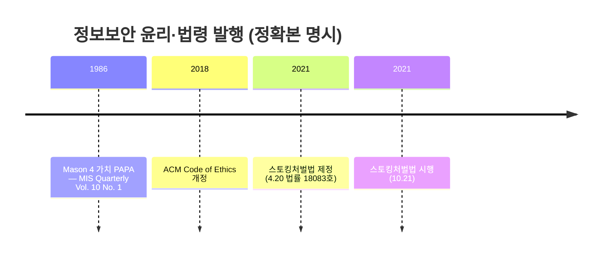
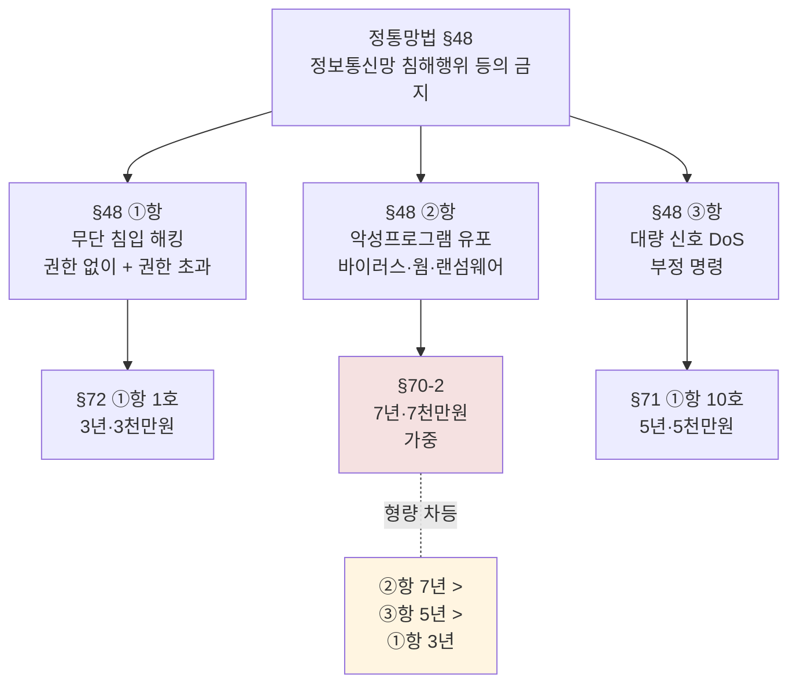
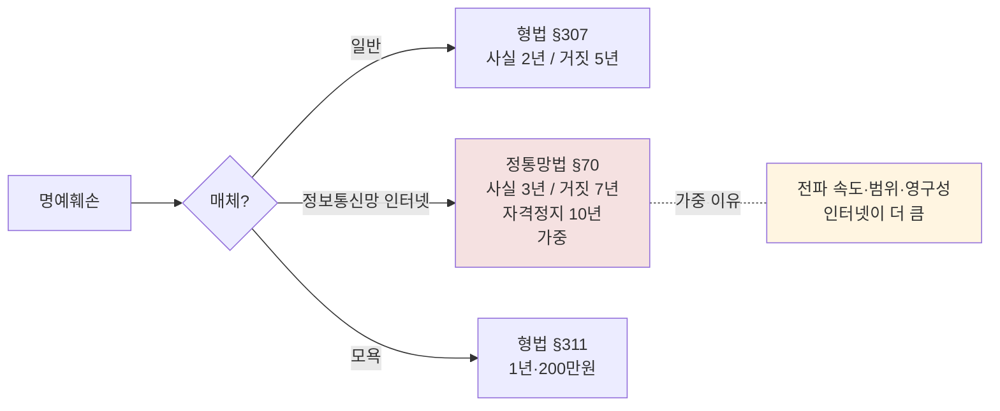
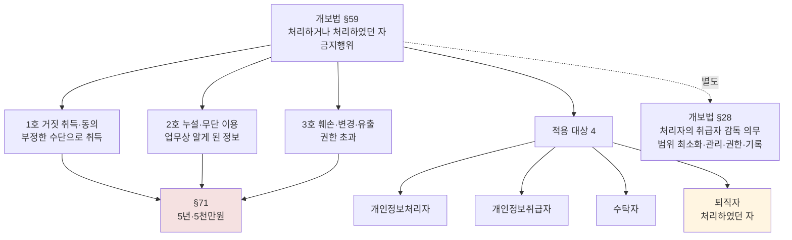
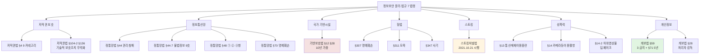

# 06. 정보보안 윤리 — 만화책처럼 읽는 PAPA·정통망법 §48·개보법 §59·스토킹처벌법

> **이 문서를 읽는 법**: *왜 정보윤리가 권고가 아닌 형사 처벌 영역인지*, *왜 정통망법 §48 ②항 (악성코드) 가 ①항 (해킹) 보다 가중 처벌인지*, *왜 정통망법 §70 명예훼손이 형법 §307 보다 가중인지*, *왜 개보법 §59 가 퇴직자에게도 적용되는지* — 법령 조문의 *형량 비교* 를 따라가면 모든 시험 함정이 풀립니다.
> 정확한 정의·수치·표준 번호·법령 조문은 정확본을 참조: [[cs/information-security/05.management-and-law/06.security-ethics|정확본 06. 정보보안 윤리]]

> **독자 가정**: *백엔드/풀스택 개발자, 법령 조문 처음.* 이미 익숙한 개념 (`코드 리뷰 시 라이선스 확인`, `DRM 우회 도구`, `악성코드 검사`, `회사 퇴직 시 NDA`) 을 다리로 씁니다.

> **연결 단원**: 본 단원은 [[cs/information-security/05.management-and-law/05.certifications|05 인증제도]] *영역 3 (개인정보 처리)* 의 *법적 의무* 와 직접 연결. 사회공학·파밍·스테가노그래피는 [[cs/information-security/05.management-and-law/04.incident-response-and-forensics|04 사고대응]] cross-ref. §17·§18 은 [[cs/information-security/05.management-and-law/08.privacy-law|08 개인정보보호법]] cross-ref.

---

## 🎯 시작 전에 — 이미 보고 있는 정보보안 윤리

| 매일 보는 것 | 사실은 이 단원의 |
|---|---|
| 사내 윤리 강령 + 행동 강령 | ACM Code 2018 / IEEE Code |
| GitHub 의 라이선스 명시 의무 | 저작권법 §4 (컴퓨터프로그램 저작물) |
| 음악·영상 스트리밍의 DRM | DRM (§2-4) |
| 영상 워터마크 (방송사 로고) | 디지털 워터마킹 — 저작권자 식별 |
| 영상 화질에 숨은 사용자 ID | 디지털 핑거프린팅 — 사용자 식별 |
| 네이버·카카오 댓글 명예훼손 신고 | 정통망법 §70 (가중 처벌) |
| 인터넷 게시물 권리 침해 신고 | 정통망법 §44 ①항 |
| 음란물·도박 사이트 차단 | 정통망법 §44-7 |
| 회사 퇴직 시 NDA 사후 적용 | 개보법 §59 ("처리하였던 자") |
| 스토킹·반복 메시지 신고 (2021.10~) | 스토킹처벌법 시행 |
| 딥페이크 합성영상 처벌 | 성폭력처벌법 §14-2 |

> **이 단원의 본질**: 정보보안 윤리는 *권고 ❌* — *형사 처벌 영역 + 자율적 윤리 영역 공존*. 시험은 (1) **PAPA 4 가치 (Mason 1986)** (2) **저작권법 §4 + §104-2 + DRM** (3) **워터마킹 vs 핑거프린팅 vs 스테가노그래피** (4) **정통망법 §44-7 (불법정보 9 호) + §70 (명예훼손)** (5) **정통망법 §48 3 금지행위 + 형량 차등 (§72·§70-2·§71)** (6) **기반보호법 §12·§28 (10년 가중)** (7) **스토킹처벌법 (2021.10.21)·성폭력처벌법 §14·§14-2** (8) **개보법 §59 (3 금지) + §71 + 퇴직자 포함** *8 핵심*을 묻는다.

---

## 📖 에피소드 1 — 정보윤리 4 가치 PAPA + ACM·IEEE Code

### 장면 1. 정보윤리의 정체

> **정보보안 윤리 (Information Security Ethics)** : 정보 사회에서 정보를 다루는 *모든 주체가 따라야 할 도덕적·법적 규범의 총체*.

### 장면 2. PAPA — Mason 1986 의 4 가치

리처드 메이슨 (Richard O. Mason) 의 *1986년 논문 "Four Ethical Issues of the Information Age"* (MIS Quarterly Vol. 10 No. 1, pp. 5-12) 에서 제시.

| 가치 | 영문 | 핵심 질문 |
|---|---|---|
| **사생활** | **P**rivacy | 개인의 어떤 정보를 누구에게, 어떤 조건으로 공개할 것인가 |
| **정확성** | **A**ccuracy | 정보의 정확성을 *누가 책임* 지는가 |
| **재산권** | **P**roperty | 정보의 *소유권* 은 누구에게 있는가 |
| **접근권** | **A**ccessibility | 누가 어떤 정보에 *어떤 조건으로 접근* 할 수 있는가 |

### 장면 3. ACM Code of Ethics — *2018 개정* 4 섹션

ACM (Association for Computing Machinery) Code of Ethics and Professional Conduct (*2018*) 의 4 섹션.

| 섹션 | 내용 |
|---|---|
| **1. 일반 윤리 원칙** (General Ethical Principles) | *사회와 인류의 복지 기여*, 해를 끼치지 않을 것, 정직, 공정, 사생활 존중, 기밀 유지 |
| **2. 전문가의 책임** (Professional Responsibilities) | *자신의 역량 안에서 일할 것*, 직업적 기준 준수, 시스템에 대한 책임 |
| **3. 전문가 리더십** (Professional Leadership Principles) | *사회적 책임*, 윤리·법규·기준 준수 |
| **4. 준수** (Compliance with the Code) | 코드 위반 시 책임 |

### 장면 4. IEEE Code of Ethics — 핵심 약속

IEEE Code of Ethics 의 약속.

- *안전·건강·복지·환경* 에 부합하는 결정
- *이해 충돌 회피* / 발견 시 공개
- *정직성·현실성* 에 기반한 진술
- *부패·뇌물 거부*
- 기술과 그 사회적 영향에 대한 이해 증진
- 자신과 타인의 *역량 개선*
- 정직한 비판과 *오류 수용·수정*
- *공정한 처우* (인종·종교·성별 등 차별 금지)
- 안전·재산·환경·평판에 대한 *위해 회피*
- *동료 지원*

### 시험 함정

- "PAPA = Privacy·Authority·Property·Access" → ❌ **틀림**. *Accuracy 와 Accessibility*.
- "ACM Code 발행 = 1992" → ❌ **틀림**. *2018* 개정.
- "PAPA 의 출처?" → *Richard O. Mason 1986* 논문 (MIS Quarterly).
- "ACM 의 4 섹션?" → 일반 윤리·전문가 책임·전문가 리더십·준수.

---

## 📖 에피소드 2 — 저작권법 §4: 9 카테고리 + 침해 5 유형

### 장면 1. 저작권법 §4 — 저작물 9 카테고리

[저작권법] §4 는 다음을 *저작물로 예시*.

| 카테고리 | 사례 |
|---|---|
| **어문저작물** | 소설·시·논문·강연 |
| **음악저작물** | 작곡·가사 |
| **연극저작물** | 무용·무언극 |
| **미술저작물** | 회화·서예·조각·공예·응용미술 |
| **건축저작물** | 건축물·건축모형·설계도서 |
| **사진저작물** | 사진 |
| **영상저작물** | 영화·드라마 |
| **도형저작물** | 지도·도표·설계도·약도·모형 |
| **컴퓨터프로그램저작물** | *소프트웨어* |

### 장면 2. *컴퓨터 프로그램도 저작물* — 시험 함정 1순위

> **시험 핵심**: [저작권법] §4 *8호* 는 컴퓨터프로그램저작물을 명시. *오픈소스 라이선스 위반·무단 복제 모두 저작권법 위반*.

### 장면 3. 디지털 저작권 침해 5 유형

| 침해 유형 | 사례 |
|---|---|
| **복제권 침해** | 무단 다운로드·CD 굽기·서버 업로드 |
| **공중송신권 침해** | 무단 스트리밍·웹 게시·P2P 공유 |
| **2차 저작물 작성권 침해** | 무단 번역·각색·재편집 |
| **동일성 유지권 침해** | 무단 변형·왜곡 |
| **복제 방지·보호기술 회피** | 기술적 보호조치 무력화 |

### 시험 함정

- "저작권법은 컴퓨터 프로그램을 보호하지 않는다" → ❌ **틀림**. *§4 8호* 명시.
- "저작권법 §4 의 카테고리 수?" → *9*.
- "P2P 무단 공유는 어느 침해?" → *공중송신권*.
- "무단 번역은?" → *2차 저작물 작성권 침해*.

---

## 📖 에피소드 3 — 기술적 보호조치 (TPM) §104-2 + DRM 5 요소

### 장면 1. 기술적 보호조치 (TPM) 의 정체

> **기술적 보호조치 (Technological Protection Measures, TPM)** : 저작물에 대한 *접근을 효과적으로 통제* 하거나 *저작권 등의 침해 행위를 효과적으로 방지·억제* 하기 위한 기술적 조치. [저작권법] §2 *정의 28호*.

### 장면 2. 저작권법 §104-2 — *2 가지 행위 금지*

| 행위 | 내용 |
|---|---|
| **보호조치 무력화** | *정당한 권한 없이* 보호조치를 *제거·변경·우회* |
| **무력화 도구 제공** | 무력화 도구를 *제조·수입·공중에게 양도·대여·전송·전시·제공·청약하거나 광고* |

### 장면 3. 위반 시 처벌 — [저작권법] §136

> 위반 시 [저작권법] §136 에 따라 *3 년 이하 징역 또는 3 천만원 이하 벌금*.

### 장면 4. DRM 의 정체 + 5 요소

> **DRM (Digital Rights Management)** : 디지털 콘텐츠의 *사용·복제·배포를 제어* 하기 위한 *기술적·법적 메커니즘*.

| 요소 | 기능 |
|---|---|
| **콘텐츠 식별** | 콘텐츠 ID·메타데이터·워터마킹 |
| **암호화** | *콘텐츠 자체 암호화* |
| **라이선스 관리** | 사용 권한 표현 (REL) 과 강제 |
| **사용자 인증** | 콘텐츠 접근 시 사용자 검증 |
| **사용 추적** | 사용 내역 모니터링·과금 |

### 시험 함정

- "TPM 의 출처?" → *[저작권법] §2 정의 28호*.
- "보호조치 무력화 도구 제공 위반?" → *§104-2* + 처벌 *§136* (3 년·3 천만원).
- "DRM 의 5 요소?" → 콘텐츠 식별·암호화·라이선스 관리·사용자 인증·사용 추적.

---

## 📖 에피소드 4 — 워터마킹 vs 핑거프린팅 vs 스테가노그래피

### 장면 1. 3 기법 비교 — *시험 빈출 1순위*

| 기술 | 정의 | 목적 |
|---|---|---|
| **디지털 워터마킹** | 콘텐츠에 *저작권자 정보* 를 삽입 | *저작권 식별·소유권 증명* |
| **디지털 핑거프린팅** (포렌식 워터마킹) | 콘텐츠에 *사용자별 고유 식별자* 를 삽입 | *불법 유통 시 유출자 추적* |
| **스테가노그래피** | *정보 자체를 미디어 안에 숨김* (보안 목적) | 비밀 통신 / 안티 포렌식 ([[cs/information-security/05.management-and-law/04.incident-response-and-forensics|05-04 §10 cross-ref]]) |

### 장면 2. *워터마킹 vs 핑거프린팅* — 한 줄 차이

> **워터마킹** = "**저작권자**" 정보 삽입.
>
> **핑거프린팅** = "**사용자별**" 고유 식별자 삽입.

방송사 로고 = *워터마킹* (저작권자 식별). 영상 화질에 숨은 *고객 ID* = *핑거프린팅* (사용자 식별 → 유출 추적).

### 장면 3. *스테가노그래피의 분리*

스테가노그래피는 *저작권 보호 ❌, 비밀 통신·안티 포렌식 목적*. 워터마킹·핑거프린팅과 *목적이 다르다*.

### 시험 함정

- "디지털 워터마킹 = 사용자 식별" → ❌ **틀림**. *저작권자 식별*. *핑거프린팅이 사용자 식별*.
- "포렌식 워터마킹의 다른 이름?" → *핑거프린팅*.
- "스테가노그래피의 목적?" → *비밀 통신 / 안티 포렌식* (저작권 ❌).

---

## 📖 에피소드 5 — 정통망법 §44 + §44-7: 불법정보 9 호

### 장면 1. 정통망법 §44 — 권리침해정보 유통 금지

[정보통신망법] §44 는 정보통신망을 통한 *타인의 권리를 침해하는 정보* 의 유통을 금지.

| 항 | 내용 |
|---|---|
| **§44 ①항** | 이용자는 *사생활 침해·명예훼손* 등 *타인의 권리를 침해하는 정보* 를 정보통신망을 통하여 *유통시켜서는 아니 된다* |
| **§44 ②항** | 정보통신서비스 제공자는 자신이 운영·관리하는 정보통신망에 위 정보가 *유통되지 아니하도록 노력* 하여야 한다 |

### 장면 2. 정통망법 §44-7 — 불법정보 9 호 *시험 빈출*

| 호 | 금지 정보 |
|---|---|
| **1호** | 음란한 부호·문언·음향·화상 또는 영상을 *배포·판매·임대·전시* |
| **2호** | *비방 목적*으로 *사실 또는 거짓의 사실*을 드러내어 *명예 훼손* |
| **3호** | *공포심·불안감 유발* 부호·문언·음향·화상·영상을 *반복적으로 도달* 하게 함 |
| **4호** | 정당한 사유 없이 정보통신시스템·데이터·프로그램을 *훼손·멸실·변경·위조·운용을 방해* |
| **5호** | *청소년보호법* 에 따른 청소년유해매체물 |
| **6호** | *사행행위 등 규제 및 처벌 특례법* 의 사행행위 정보 |
| **6의2~9호** | 개인정보 거래·국가기밀 누설·국가보안법 위반 등 국가법령상 금지된 정보 |

### 장면 3. 청소년보호법

[청소년보호법] 의 *청소년유해매체물* (음란·폭력·사행성 등) — *청소년보호위원회가 결정·고시*.

### 시험 함정

- "§44 와 §44-7 의 차이?" → §44 = *권리침해정보* (사생활·명예) / §44-7 = *불법정보 9 호*.
- "음란물 유통 금지 조항?" → *§44-7 ①항 1호*.
- "반복적 공포 유발 메시지?" → *§44-7 ①항 3호*.
- "청소년유해매체물의 결정 주체?" → *청소년보호위원회*.

---

## 📖 에피소드 6 — 정통망법 §70 명예훼손: 형법보다 가중

### 장면 1. 명예훼손 3 법령 비교 — *시험 1순위*

| 죄명 | 법령 | 형량 |
|---|---|---|
| **형법상 명예훼손** | [형법] §307 | *사실 적시* 2년 이하 / *허위 사실 적시* 5년 이하 |
| **형법상 모욕** | [형법] §311 | 1년 이하 / 200만원 이하 벌금 |
| **정통망법상 명예훼손** | [정통망법] §70 | *사실 적시* 3년 이하 / *거짓 사실 적시* 7년 이하 — *형법보다 가중* |

### 장면 2. *왜 가중 처벌인가*

> 정통망법 §70 의 명예훼손 처벌은 *정보통신망 (인터넷) 을 이용한 경우에 적용* 되며 *형법 §307 보다 가중* 처벌. 이유: *전파 속도·범위·영구성* 이 인터넷에서 훨씬 크다.

### 장면 3. §44-7 위반 처벌 차등

| 행위 | 벌칙 조문 | 형량 |
|---|---|---|
| **§44-7 ①항 1호** (음란물) | [정통망법] *§74* | 1년 이하 / 1천만원 이하 |
| **§44-7 ①항 2호** (명예훼손) | [정통망법] **§70** | 사실 3년 / *거짓 7년·자격정지 10년·벌금 5천만원* |
| **§44-7 ①항 3호** (반복 공포·불안) | [정통망법] *§74* | 1년 이하 / 1천만원 이하 |

> *주의*: 위 형량은 [정통망법] 현행본 기준 (2026.04.30) 이며, 시험 응시 시점에 *국가법령정보센터* 에서 직접 확인 필요. 명예훼손 형량 (§70) 은 *정기적으로 강화 개정* 되는 영역.

### 시험 함정

- "형법 §307 = 정통망법 §70 동일 형량" → ❌ **틀림**. *정통망법이 가중* (사실 3년 / 거짓 7년 vs 형법 사실 2년 / 거짓 5년).
- "정통망법 명예훼손 형법보다 *왜 가중*?" → *전파 속도·범위·영구성*.
- "§70 의 자격정지?" → *10년* (거짓 사실 적시).
- "음란물·반복 공포 유발의 처벌 조문?" → *§74* (1년·1천만원).

---

## 📖 에피소드 7 — 사이버 스토킹: 스토킹처벌법 (2021.10.21 시행)

### 장면 1. 스토킹처벌법의 정체

> **[스토킹범죄의 처벌 등에 관한 법률]** (스토킹처벌법) — *2021년 4월 20일 제정·공포* (법률 *제18083호*), *2021년 10월 21일 부터 시행*.

### 장면 2. 스토킹 행위 + 사이버 스토킹

| 항목 | 내용 |
|---|---|
| **시행일** | *2021.10.21* |
| **스토킹 행위 정의** | 상대방의 의사에 반하여 정당한 이유 없이 상대방 또는 그의 동거인·가족에 대하여 다음 행위를 하여 *불안감 또는 공포심을 일으키는* 것 |
| **사이버 스토킹** | *정보통신망을 이용* 하여 물건·글·말·부호·음향·그림·영상·화상을 *도달하게 하는 행위* |

### 장면 3. 처벌 — *기본 + 가중*

| 유형 | 처벌 |
|---|---|
| **스토킹범죄** | *3년 이하 징역 또는 3천만원 이하 벌금* |
| **흉기 등 휴대 시 가중** | *5년 이하 또는 5천만원 이하* |

### 시험 함정

- "스토킹처벌법 시행 = 2020년" → ❌ **틀림**. *2021.10.21*.
- "스토킹처벌법 제정일?" → *2021.4.20* (시행 *2021.10.21*).
- "스토킹처벌법 법률 번호?" → *제18083호*.
- "사이버 스토킹의 핵심?" → *정보통신망을 이용한 도달 행위*.

---

## 📖 에피소드 8 — 디지털 성폭력: 성폭력처벌법 §13·§14·§14-2

### 장면 1. 디지털 성폭력 3 죄

| 죄명 | 법령 |
|---|---|
| **카메라등이용촬영죄** | [성폭력범죄의 처벌 등에 관한 특례법] *§14* (불법 촬영물 *제작·유포*) |
| **허위영상물 등의 반포** | [성폭력처벌법] *§14-2* (*딥페이크 등 합성 영상물* 의 제작·유포) |
| **통신매체이용음란** | [성폭력처벌법] *§13* |

### 장면 2. *§14 vs §14-2* — 시험 함정 1순위

> **§14** = *카메라 등 이용 촬영* — 실제 촬영물.
>
> **§14-2** = *허위영상물 등의 반포* — *딥페이크 등 합성 영상물*. *2020년 신설 영역*.

### 시험 함정

- "카메라등이용촬영죄 = 형법" → ❌ **틀림**. *[성폭력처벌법] §14*.
- "딥페이크 합성영상 = §14" → ❌ **틀림**. *§14-2* (허위영상물 등의 반포).
- "통신매체이용음란?" → *[성폭력처벌법] §13*.
- "카메라등이용촬영의 적용?" → *제작 + 유포*.

---

## 📖 에피소드 9 — 사이버 사기 5 유형: 보이스피싱·스미싱·메모리해킹·파밍·몸캠피싱

### 장면 1. 5 유형 + 적용 법령

| 유형 | 영문 | 설명 | 적용 법령 |
|---|---|---|---|
| **보이스 피싱** | Vishing | *전화* 로 정보 탈취·송금 유도 | 형법 §347 (사기), [전기통신금융사기 피해 방지 및 피해금 환급에 관한 특별법] |
| **스미싱** | Smishing | *SMS·MMS* 로 악성 URL·정보 탈취 | 형법 §347, *정통망법 §48* (정보통신망 침해) |
| **메모리 해킹** | – | 인터넷뱅킹의 *메모리 변조* 로 송금 정보 탈취 | 형법 §347 |
| **파밍** | Pharming | *DNS·hosts 변조* 로 가짜 사이트 유도 ([[cs/information-security/05.management-and-law/04.incident-response-and-forensics|05-04 §13 cross-ref]]) | 형법 §347, *정통망법 §48* |
| **몸캠 피싱** | – | 영상통화로 *음란 영상 촬영 후 유포 협박* | 형법 §347, 성폭력처벌법 §14 |

### 장면 2. *형법 §347 — 사기죄가 공통*

> **5 유형 모두 형법 §347 (사기)** 적용. 추가로 *정보통신망 침해* 가 결합된 경우 *정통망법 §48* 동시 적용.

### 시험 함정

- "보이스 피싱 = 정통망법만" → ❌ **틀림**. *형법 §347 + 특별법*.
- "메모리 해킹 = 정통망법" → ❌ **틀림**. *형법 §347* (사기).
- "파밍·스미싱의 정통망법 조항?" → *§48* (정보통신망 침해).
- "몸캠 피싱의 *추가 적용 법령*?" → *성폭력처벌법 §14*.

---

## 📖 에피소드 10 — 정통망법 §48: 3 금지행위 + 형량 차등

### 장면 1. 정통망법 §48 의 정체

> **[정보통신망법] §48 (정보통신망 침해행위 등의 금지)** : 정보통신망의 *안전성·신뢰성을 보호* 하기 위해 정보시스템 이용자가 *절대 해서는 안 되는 행위* 를 정의한 *핵심 조문*.

### 장면 2. §48 ①항 — 무단 침입 (해킹)

> "*누구든지 정당한 접근권한 없이 또는 허용된 접근권한을 초과하여 정보통신망에 침입* 하여서는 아니 된다."

해킹·부정 접근의 가장 핵심 금지. *권한 없이 + 권한 초과* 두 형태 모두 금지.

### 장면 3. §48 ②항 — 악성프로그램 유포

> "누구든지 정당한 사유 없이 정보통신시스템·데이터·프로그램 등을 *훼손·멸실·변경·위조하거나 그 운용을 방해할 수 있는 프로그램 (이하 '악성프로그램')* 을 *전달·유포* 하여서는 아니 된다."

악성코드 (바이러스·웜·트로이목마·랜섬웨어·백도어) 전달·유포 금지.

### 장면 4. §48 ③항 — 대량 신호 등 (DoS) 금지

> "누구든지 정보통신망의 안정적 운영을 방해할 목적으로 *대량의 신호 또는 데이터* 를 보내거나 *부정한 명령* 을 처리하도록 하는 등의 방법으로 정보통신망에 장애가 발생하게 하여서는 아니 된다."

DoS·DDoS 공격, *부정 명령* (SQL Injection, Command Injection 등) 금지.

### 장면 5. *§48 3 금지행위 + 처벌 차등* — 시험 빈출 1순위

| 항 | 금지행위 | 처벌 조문 | 형량 |
|---|---|---|---|
| **①항** | 무단 침입 (해킹) | *§72 ①항 1호* | *3년 이하 / 3천만원 이하* |
| **②항** | 악성프로그램 전달·유포 | *§70-2* | **7년 이하 / 7천만원 이하** (단순 침입보다 *가중*) |
| **③항** | DoS 등 정보통신망 장애 | *§71 ①항 10호* | *5년 이하 / 5천만원 이하* |

### 장면 6. *왜 ②항이 가중인가*

> 악성프로그램 유포는 *불특정 다수 피해 + 자가 전파 가능성* 으로 *§48 ①항 단순 침입보다 사회적 피해가 크다*. 따라서 *§48 ②항 (7년) > §48 ③항 (5년) > §48 ①항 (3년)* 의 형량 차등.

### 시험 함정

- "§48 ②항 = DoS 금지" → ❌ **틀림**. *②항 = 악성프로그램*. *③항 = DoS*.
- "§48 ①항 = 7년 이하" → ❌ **틀림**. *①항 = 3년 (§72)*. *②항 = 7년 (§70-2)*.
- "악성프로그램 유포 처벌 조문?" → *§70-2*.
- "DoS 처벌 조문?" → *§71 ①항 10호*.
- "권한 초과 침입은?" → *§48 ①항* (권한 없이 + 권한 초과 모두).

---

## 📖 에피소드 11 — 기반보호법 §12·§28: 10 년 가중

### 장면 1. 정보통신기반보호법 §12 — 침해 금지 3 행위

[정보통신기반 보호법] §12 는 *주요정보통신기반시설* 에 대한 다음 행위를 금지.

| 호 | 금지행위 |
|---|---|
| **1호** | *접근권한을 가지지 아니하는 자의 침입* |
| **2호** | *데이터 무단 변경·삭제* |
| **3호** | *운용 방해* |

### 장면 2. 처벌 — [기반보호법] §28: *10 년 가중*

| 위반 행위 | 처벌 |
|---|---|
| §12 위반 (1호·2호·3호) | [기반보호법] *§28* — **10 년 이하 징역 또는 1 억원 이하 벌금** |

### 장면 3. *왜 정통망법 §48 보다 가중인가*

> 기반보호법 §12 의 처벌은 *[정통망법] §48 보다 가중* (10 년 이하). 이는 **주요정보통신기반시설이 국가 안보·경제에 미치는 영향이 크기 때문**.

### 장면 4. 형량 비교 정리

| 법령 | 조항 | 형량 |
|---|---|---|
| [정통망법] §48 ①항 | 무단 침입 — §72 | 3 년·3 천만원 |
| [정통망법] §48 ③항 | DoS — §71 ①항 10호 | 5 년·5 천만원 |
| [정통망법] §48 ②항 | 악성프로그램 — §70-2 | 7 년·7 천만원 |
| **[기반보호법] §12** | 주요시설 침입 — *§28* | **10 년·1 억원** |

### 시험 함정

- "주요정보통신기반시설 침입 = 정통망법 §72" → ❌ **틀림**. *[기반보호법] §28* (10 년).
- "기반보호법이 정통망법보다 가중되는 이유?" → *국가 안보·경제 영향*.
- "기반보호법 §12 의 3 금지?" → *침입·데이터 무단 변경·운용 방해*.

---

## 📖 에피소드 12 — 개보법 §59: 3 금지 + §71 5 년 처벌

### 장면 1. 개보법 §59 의 정체

> **[개인정보보호법] §59 (금지행위)** : *개인정보를 처리하거나 처리하였던 자* 는 다음 각 호의 어느 하나에 해당하는 행위를 *하여서는 아니 된다*.

### 장면 2. §59 의 3 대 금지행위 — *시험 빈출 1순위*

| 호 | 금지행위 |
|---|---|
| **1호** | *거짓이나 그 밖의 부정한 수단·방법* 으로 개인정보를 *취득* 하거나 *처리에 관한 동의를 받는* 행위 |
| **2호** | *업무상 알게 된 개인정보를 누설* 하거나 *권한 없이 다른 사람이 이용하도록 제공* 하는 행위 |
| **3호** | *정당한 권한 없이 또는 허용된 권한을 초과* 하여 *다른 사람의 개인정보를 훼손·멸실·변경·위조 또는 유출* 하는 행위 |

### 장면 3. §59 위반 시 처벌 — [개보법] §71

| 위반 유형 | 처벌 |
|---|---|
| **§59 1호** (거짓 취득·동의) | *5 년 이하 징역 또는 5 천만원 이하 벌금* |
| **§59 2호** (누설·무단 이용) | *5 년 이하 징역 또는 5 천만원 이하 벌금* |
| **§59 3호** (훼손·변경·유출) | *5 년 이하 징역 또는 5 천만원 이하 벌금* |

> *주의*: 위 형량은 [개인정보보호법] §71 의 작성 시점 현행본 기준이며, 정기 개정으로 변경 가능. 시험 응시 시점에 *국가법령정보센터에서 직접 확인 필요*.

### 장면 4. *§59 의 적용 대상* — 퇴직자 포함 ⚠️

§59 의 "개인정보를 처리하거나 *처리하였던 자*" 는 *4 주체* 를 포괄.

| 적용 대상 | 사례 |
|---|---|
| **개인정보처리자** | 개인정보를 처리하는 공공기관·법인·단체·개인 |
| **개인정보 취급자** | *처리자의 지휘·감독 하* 에 개인정보를 처리하는 임직원·파견근로자·시간제근로자 등 |
| **수탁자** | 개인정보 처리업무를 *위탁받은 자* |
| **퇴직자** | "처리하였던 자" — *퇴직 후에도 적용* |

### 시험 함정

- "§59 = 재직자만 적용" → ❌ **틀림**. *퇴직자 포함* ("처리하였던 자").
- "§59 = 개인정보처리자만" → ❌ **틀림**. *처리자·취급자·수탁자·퇴직자* 모두.
- "§59 위반 = 행정 처분만" → ❌ **틀림**. *형사 처벌* (§71 — 5년·5천만원).
- "거짓 동의 취득 = §59 2호" → ❌ **틀림**. *1호*.
- "누설 = §59 3호" → ❌ **틀림**. *2호*.
- "권한 초과 변경·유출 = §59?" → *3호*.

---

## 📖 에피소드 13 — §59 vs §17·§18 + §28 감독

### 장면 1. §59 vs §17·§18 — 성격 차이

§59 는 개인정보의 *부정한 취득·누설·유출* 을 금지하는 *일반 금지 조항*이며, §17 (제3자 제공) 와 §18 (목적 외 이용·제공) 는 개인정보의 *합법적 제공·이용의 요건* 을 정한 조항 ([[cs/information-security/05.management-and-law/08.privacy-law|08 단원 §3 cross-ref]]).

| 비교 항목 | §59 (금지행위) | §17·§18 (제공·이용) |
|---|---|---|
| **성격** | *금지* (소극적 의무) | *요건* (적극적 절차) |
| **위반 시** | 형사 처벌 | 형사·행정 처벌 + 손해배상 |
| **적용 대상** | *"처리하거나 처리하였던 자"* | 개인정보처리자 |

### 장면 2. 개보법 §28 — 개인정보취급자 감독

[개인정보보호법] **§28** (개인정보취급자에 대한 감독) 는 개인정보처리자가 개인정보취급자에 대해 다음 의무를 *이행할 것을 요구*.

| 의무 |
|---|
| 개인정보취급자 *범위 최소화 + 명단 관리* |
| *적절한 관리·감독* (정기 교육·감사) |
| 개인정보 처리 *권한 설정·제한* |
| 개인정보 처리 *기록 관리* |

### 장면 3. *§28 의 위치* — 처리자의 감독 의무

> **§59** = 개인정보 *취급자 측 금지행위*.
>
> **§28** = 개인정보 *처리자 측 감독 의무*.

### 시험 함정

- "§59 와 §17·§18 차이?" → 금지 (소극) vs 요건 (적극).
- "§28 의 의무 주체?" → *개인정보처리자* (취급자 ❌).
- "§28 의 4 의무?" → 범위 최소화·관리 감독·권한 설정·기록 관리.
- "취급자 감독 위반은 어느 조항?" → *§28*.

---

## 📑 종합 비교 (에피소드 6·7·10·11·12 정리)

7 핵심 법령 *조항·형량* 비교.

| 영역 | 법령·조항 | 형량 |
|---|---|---|
| **저작권 보호조치 무력화** | 저작권법 §104-2 → §136 | 3 년 이하 / 3 천만원 이하 |
| **음란물·반복 공포** | 정통망법 §44-7 ①항 1·3호 → §74 | 1 년 이하 / 1 천만원 이하 |
| **사이버 명예훼손** | 정통망법 §70 (사실/거짓) | 사실 3 년 / 거짓 *7 년·자격정지 10 년* |
| **무단 침입 (해킹)** | 정통망법 §48 ①항 → §72 ①항 1호 | 3 년 이하 / 3 천만원 이하 |
| **DoS·DDoS** | 정통망법 §48 ③항 → §71 ①항 10호 | 5 년 이하 / 5 천만원 이하 |
| **악성프로그램 유포** | 정통망법 §48 ②항 → §70-2 | **7 년** 이하 / 7 천만원 이하 |
| **주요시설 침입·운용방해** | 기반보호법 §12 → *§28* | **10 년** 이하 / *1 억원* 이하 |
| **스토킹범죄** | 스토킹처벌법 (2021.10.21 시행) | 3 년 이하 / 3 천만원 이하 (흉기 시 5년·5천만원) |
| **개인정보 §59 위반** | 개보법 §59 → §71 | 5 년 이하 / 5 천만원 이하 |

> **읽는 법**: 형량 *작은 것 → 큰 것* 순서. *기반보호법 §28 (10 년) > 정통망법 §70-2 (7 년) > 정통망법 §71 = 개보법 §71 (5 년) > 정통망법 §72 = 저작권법 §136 = 스토킹처벌법 (3 년) > 정통망법 §74 = 형법 §311 (1 년)*.

---

## 🗺️ 마인드맵 1 — 정보보안 윤리·법령 시간선



---

## 🗺️ 마인드맵 2 — 정통망법 §48 3 금지행위 + 형량 차등



---

## 🗺️ 마인드맵 3 — 명예훼손 형법 §307 vs 정통망법 §70



---

## 🗺️ 마인드맵 4 — 개보법 §59 3 금지 + 적용 대상



---

## 🗺️ 마인드맵 5 — 정보보안 윤리 7 법령 분류



---

## 🗂️ 키워드 클러스터

### 정보윤리 4 가치 PAPA (Mason 1986)

```
Privacy        — 사생활: 개인 정보의 공개 조건
Accuracy       — 정확성: 정보 정확성의 책임
Property       — 재산권: 정보의 소유권
Accessibility  — 접근권: 정보 접근의 조건

출처 — Richard O. Mason, MIS Quarterly Vol. 10 No. 1, March 1986, pp. 5-12
```

### ACM·IEEE Code

```
ACM Code of Ethics (2018)  — 4 섹션 (일반 윤리·전문가 책임·리더십·준수)
IEEE Code of Ethics        — 안전·이해 충돌·정직·부패 거부·역량·차별 금지·동료 지원
```

### 저작권법

```
§4 (저작물 9 카테고리)   — 어문·음악·연극·미술·건축·사진·영상·도형·컴퓨터프로그램
§2 정의 28호             — 기술적 보호조치 (TPM)
§104-2                   — 보호조치 무력화 + 무력화 도구 제공 금지
§136                     — 3년·3천만원

DRM 5 요소 — 콘텐츠 식별·암호화·라이선스 관리·사용자 인증·사용 추적
워터마킹 — 저작권자 식별
핑거프린팅 (포렌식 워터마킹) — 사용자 식별
스테가노그래피 — 비밀 통신·안티 포렌식
```

### 정통망법 §44·§44-7 — 정보 유통 금지

```
§44 ①항    — 권리침해정보 (사생활·명예훼손) 유통 금지
§44 ②항    — 정보통신서비스 제공자의 유통 방지 노력
§44-7 ①항 — 불법정보 유통금지 9 호
   1호 — 음란물 (배포·판매·임대·전시)
   2호 — 명예훼손 (사실/거짓 사실 적시)
   3호 — 반복적 공포·불안 유발
   4호 — 정보통신시스템 훼손·운용 방해
   5호 — 청소년유해매체물
   6호 — 사행행위 (사행행위 등 규제·처벌 특례법)
   6의2~9호 — 개인정보 거래·국가기밀 누설·국보법 위반
```

### 정통망법 §70·§74 처벌

```
§70 (명예훼손)       — 사실 3년 / 거짓 7년 + 자격정지 10년 + 5천만원
§74                  — §44-7 ①항 1호·3호 (음란·반복 공포) — 1년·1천만원

형법 §307 (명예훼손) — 사실 2년 / 거짓 5년
형법 §311 (모욕)     — 1년·200만원
정통망법 §70 가중 이유 — 전파 속도·범위·영구성
```

### 정통망법 §48 — 3 금지행위 + 형량 차등

```
§48 ①항 — 무단 침입 (해킹)        → §72 ①항 1호 / 3년·3천만원
§48 ②항 — 악성프로그램 유포       → §70-2  / 7년·7천만원 (가중)
§48 ③항 — DoS·DDoS·부정 명령     → §71 ①항 10호 / 5년·5천만원

형량 차등 — ②항 7년 > ③항 5년 > ①항 3년
②항 가중 이유 — 불특정 다수 피해 + 자가 전파
```

### 기반보호법 §12·§28 — 가중

```
§12 — 주요정보통신기반시설 침해 3 호
   1호 — 권한 없는 침입
   2호 — 데이터 무단 변경·삭제
   3호 — 운용 방해

§28 — 10년 이하 / 1억원 이하 (정통망법보다 가중)
가중 이유 — 국가 안보·경제 영향
```

### 스토킹처벌법

```
[스토킹범죄의 처벌 등에 관한 법률]
제정 — 2021.4.20 (법률 제18083호)
시행 — 2021.10.21
스토킹범죄 — 3년·3천만원
흉기 등 휴대 시 — 5년·5천만원

사이버 스토킹 — 정보통신망을 이용한 도달 행위
```

### 성폭력처벌법 — 디지털 성폭력

```
§13 — 통신매체이용음란
§14 — 카메라등이용촬영죄 (실제 촬영물)
§14-2 — 허위영상물 등의 반포 (딥페이크 등 합성 영상물)
```

### 사이버 사기 5 유형 + 적용 법령

```
보이스 피싱 (Vishing)  — 형법 §347 + 전기통신금융사기특별법
스미싱 (Smishing)      — 형법 §347 + 정통망법 §48
메모리 해킹           — 형법 §347
파밍 (Pharming)        — 형법 §347 + 정통망법 §48 (DNS·hosts 변조)
몸캠 피싱             — 형법 §347 + 성폭력처벌법 §14
```

### 개보법 §59 — 3 금지

```
§59 1호 — 거짓 취득·동의       (부정한 수단으로 취득)
§59 2호 — 누설·무단 이용       (업무상 알게 된 정보)
§59 3호 — 훼손·변경·유출       (권한 초과)

§71 — 5년 이하 / 5천만원 이하 (1·2·3호 모두)
```

### §59 적용 대상 4

```
개인정보처리자  — 공공기관·법인·단체·개인
개인정보취급자  — 처리자의 지휘·감독 하 임직원·파견·시간제
수탁자        — 처리업무 위탁받은 자
퇴직자        — "처리하였던 자" — 퇴직 후에도 적용
```

### §59 vs §17·§18 + §28 감독

```
§59 — 금지 (소극적 의무) — 형사 처벌
§17·§18 — 요건 (적극적 절차) — 형사·행정·손해배상
§28 — 처리자의 취급자 감독 의무 (범위 최소화·관리·권한·기록)
```

### 7 법령 형량 차등 (작은 것 → 큰 것)

```
1년·1천만원   — 정통망법 §74 (음란·반복 공포) / 형법 §311 (모욕)
3년·3천만원   — 정통망법 §72 ①항 1호 (해킹) / 저작권법 §136 (TPM 무력화) / 스토킹처벌법
5년·5천만원   — 정통망법 §71 ①항 10호 (DoS) / 개보법 §71 (§59 위반) / 스토킹처벌법 흉기
7년·7천만원   — 정통망법 §70-2 (악성프로그램)
거짓 명예훼손 — 정통망법 §70 (7년·자격정지 10년·5천만원)
10년·1억원   — 기반보호법 §28 (주요시설 침해)
```

---

## 🃏 회상 30문항

> 답을 가린 뒤 자가 채점. 틀린 것만 정확본으로 깊이 학습.

**A. 정보윤리·ACM·IEEE (1~5)**
1. PAPA 4 가치의 *영문 풀이*?
2. PAPA 의 *출처와 발표 연도*?
3. ACM Code 발행 연도?
4. ACM Code 의 *4 섹션*?
5. IEEE Code 의 핵심 약속 영역?

**B. 저작권법 (6~9)**
6. 저작권법 §4 의 카테고리 수?
7. 컴퓨터 프로그램은 저작권법으로 보호되는가?
8. 기술적 보호조치 (TPM) 의 출처 조항?
9. TPM 무력화 + 도구 제공 처벌 조문과 형량?

**C. 워터마킹·DRM (10~12)**
10. 디지털 워터마킹 vs 핑거프린팅의 *식별 대상* 차이?
11. DRM 의 *5 요소*?
12. 스테가노그래피의 목적 (워터마킹과 다른 점)?

**D. 정통망법 §44·§70 (13~16)**
13. §44 와 §44-7 의 차이?
14. §44-7 의 호 수?
15. 정통망법 §70 vs 형법 §307 *형량 차이*?
16. §44-7 ①항 1·3호의 처벌 조문?

**E. 정통망법 §48 (17~20)**
17. §48 의 3 금지행위?
18. §48 ②항 처벌 조문과 형량?
19. §48 ①항 vs ②항 *형량 차등*?
20. §48 ③항 적용 사례?

**F. 기반보호법·스토킹·성폭력 (21~24)**
21. 기반보호법 §12 의 처벌과 *가중 이유*?
22. 스토킹처벌법 시행일과 법률 번호?
23. 카메라등이용촬영죄의 법령·조항?
24. 딥페이크 합성영상은 §14 / §14-2 중?

**G. 사이버 사기·개보법 §59 (25~30)**
25. 사이버 사기 5 유형 모두에 *공통 적용되는 형법 조항*?
26. 개보법 §59 의 *3 호 금지행위*?
27. §59 위반 처벌 조문과 형량?
28. §59 적용 대상 *4 주체*?
29. 거짓 동의 취득은 §59 *몇 호*?
30. 개보법 §28 의 의무 주체와 *4 의무*?

---

## ⚠️ 시험 함정 모음

| 함정 | 정답 |
|---|---|
| PAPA = Privacy·Authority·Property·Access | ❌ *Accuracy* 와 *Accessibility* |
| ACM Code 발행 = 1992 | ❌ 현행 = *2018* 개정 |
| 저작권법은 컴퓨터 프로그램을 보호하지 않는다 | ❌ *§4 8호* 명시 |
| 디지털 워터마킹 = 사용자 식별 | ❌ 워터마킹 = *저작권자*. 핑거프린팅 = 사용자 |
| 정통망법 §48 ②항 = DoS 금지 | ❌ ②항 = *악성프로그램*. ③항 = DoS |
| 정통망법 §48 ①항 위반 = 7년 이하 | ❌ ①항 = *§72 / 3년*. ②항 = §70-2 / 7년 |
| 형법 §307 = 정통망법 §70 동일 형량 | ❌ *정통망법이 가중* (사실 3년 / 거짓 7년 vs 형법 사실 2년 / 거짓 5년) |
| 스토킹처벌법 시행 = 2020년 | ❌ *2021.10.21* |
| 카메라등이용촬영죄 = 형법 | ❌ *[성폭력처벌법] §14* |
| 딥페이크 합성영상 = §14 | ❌ *§14-2* (허위영상물 등의 반포) |
| 개보법 §59 는 재직자만 적용 | ❌ *퇴직자 포함* ("처리하였던 자") |
| 개보법 §59 = 개인정보처리자만 적용 | ❌ 처리자·취급자·수탁자·퇴직자 모두 |
| 개보법 §59 위반 = 행정 처분만 | ❌ *형사 처벌* (5년·5천만원, §71) |
| 거짓 동의 취득 = §59 2호 | ❌ *1호* |
| 누설 = §59 3호 | ❌ *2호*. 3호 = 훼손·유출 |
| 주요정보통신기반시설 침입 처벌 = 정통망법 §72 | ❌ *[기반보호법] §28* — 10년 (가중) |
| §44-7 음란물 처벌 = §70 | ❌ *§74* (1년). §70 = 명예훼손 |
| §48 ①항 = 권한 없이만 금지 | ❌ *권한 없이 + 권한 초과* 모두 |
| 메모리 해킹 = 정통망법 | ❌ *형법 §347 (사기)*. 정보통신망 침해 결합 시 §48 추가 |
| §28 의 의무 주체 = 취급자 | ❌ *개인정보처리자* |
| 정보윤리는 권고만 | ❌ 권고 + *형사 처벌* 영역 공존 |
| TPM 의 정의 출처 = §104-2 | ❌ *§2 정의 28호*. §104-2 는 무력화 금지 |
| 워터마킹 = 스테가노그래피 | ❌ 워터마킹 = *저작권자 식별*. 스테가노 = *비밀 통신* |
| 모욕 = 정통망법 §70 | ❌ 모욕 = *형법 §311*. 정통망법 §70 = 명예훼손 |
| 스토킹범죄 흉기 휴대 = 3년 | ❌ *5년·5천만원* (가중) |

---

## 🔗 정확본 매핑표

| 본 노트 에피소드 | 정확본 § |
|---|---|
| 에피소드 1 (PAPA + ACM·IEEE) | [[cs/information-security/05.management-and-law/06.security-ethics#§1. 정보보안 윤리의 개념\|정확본 §1-1·§1-2·§1-3]] |
| 에피소드 2 (저작권법 §4 + 침해 5) | [[cs/information-security/05.management-and-law/06.security-ethics#§2-1. 저작권법의 보호 대상\|정확본 §2-1·§2-2]] |
| 에피소드 3 (TPM §104-2 + DRM 5) | [[cs/information-security/05.management-and-law/06.security-ethics#§2-3. 기술적 보호조치 (TPM)\|정확본 §2-3·§2-4]] |
| 에피소드 4 (워터마킹 vs 핑거프린팅 vs 스테가노) | [[cs/information-security/05.management-and-law/06.security-ethics#§2-5. 디지털 워터마킹·핑거프린팅\|정확본 §2-5]] |
| 에피소드 5 (§44 + §44-7 9 호 + 청소년보호법) | [[cs/information-security/05.management-and-law/06.security-ethics#§3-1. 정통망법 §44 — 권리침해정보의 유통 금지\|정확본 §3-1·§3-2·§3-4]] |
| 에피소드 6 (§70 명예훼손 + §74 + §44-7 처벌) | [[cs/information-security/05.management-and-law/06.security-ethics#§3-3. 정통망법 §44-7 위반 시 처벌\|정확본 §3-3·§4-1]] |
| 에피소드 7 (스토킹처벌법) | [[cs/information-security/05.management-and-law/06.security-ethics#§4-2. 사이버 스토킹\|정확본 §4-2]] |
| 에피소드 8 (성폭력처벌법 §13·§14·§14-2) | [[cs/information-security/05.management-and-law/06.security-ethics#§4-3. 디지털 성폭력\|정확본 §4-3]] |
| 에피소드 9 (사이버 사기 5 유형) | [[cs/information-security/05.management-and-law/06.security-ethics#§4-4. 사이버 사기\|정확본 §4-4]] |
| 에피소드 10 (정통망법 §48 3 금지 + 형량) | [[cs/information-security/05.management-and-law/06.security-ethics#§5. 정보시스템 이용자의 금지행위 — [정통망법] §48\|정확본 §5-1·§5-2·§5-3·§5-4]] |
| 에피소드 11 (기반보호법 §12·§28 가중) | [[cs/information-security/05.management-and-law/06.security-ethics#§5-5. [정보통신기반 보호법] §12 — 침해 금지\|정확본 §5-5]] |
| 에피소드 12 (개보법 §59 3 금지 + §71) | [[cs/information-security/05.management-and-law/06.security-ethics#§6. 개인정보 취급자의 금지행위 — [개보법] §59\|정확본 §6-1·§6-2·§6-3]] |
| 에피소드 13 (§59 vs §17·§18 + §28 감독) | [[cs/information-security/05.management-and-law/06.security-ethics#§6-4. §59 vs §17·§18 차이\|정확본 §6-4·§6-5]] |

---

## 📅 학습 흐름 (8주차 시험 대비 기준)

```
[1주]   에피소드 1 (PAPA + ACM·IEEE) — 만화책 통독, *Mason 1986* 외움
[2주]   에피소드 2·3 (저작권법 §4 + TPM §104-2 + DRM 5) — *컴프 = 저작물* 외움
[3주]   에피소드 4 (워터마킹·핑거프린팅·스테가노) — *식별 대상 차이* 외움
[4주]   에피소드 5·6 (§44·§44-7 + §70 가중) — *형법 §307 vs §70* 비교 외움
[5주]   에피소드 7·8·9 (스토킹·성폭력·사이버 사기) — *2021.10.21* 외움 + §14 vs §14-2 외움
[6주]   에피소드 10 (정통망법 §48 3 금지) — *형량 차등 ②항 7년 > ③항 5년 > ①항 3년* 외움
[7주]   에피소드 11 (기반보호법 §12·§28 10 년 가중) — *국가 안보 영향* 외움
[8주]   에피소드 12·13 (개보법 §59·§28) — *퇴직자 포함* + 호별 매핑 외움 + 회상 30
```

---

> **다음 단원**: [[cs/information-security/05.management-and-law/07.security-laws|07. 정보보호 법제]] — 본 단원의 *정통망법 §48·기반보호법 §12·개보법 §59* 의 *법령 자체의 구조* 로 확장. *정통망법 (목적·적용·§47·§48·§48-3) + 정보통신기반보호법 + 전자서명법 (2020.6.9 전부개정·2020.12.10 시행) + 정보통신산업진흥법 + 통신비밀보호법*.
