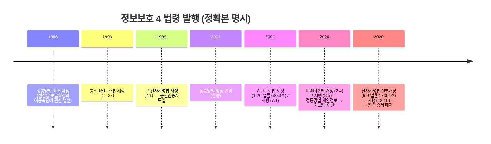
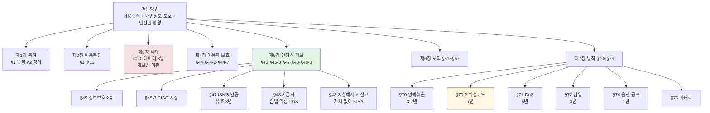
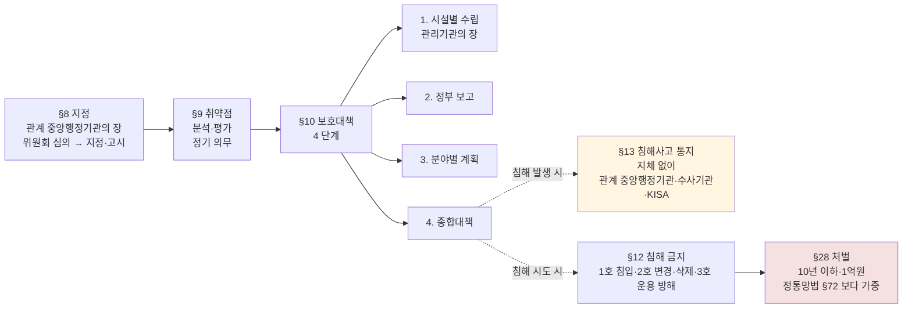
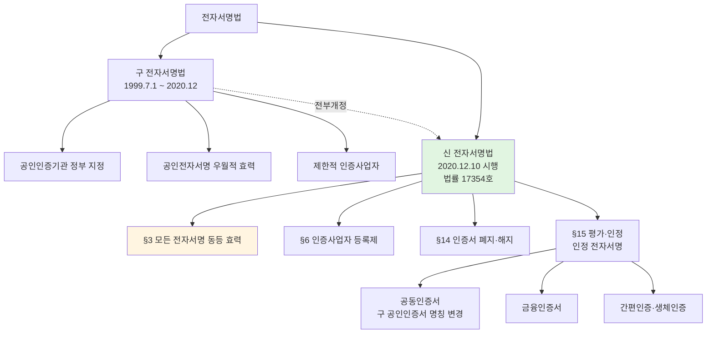
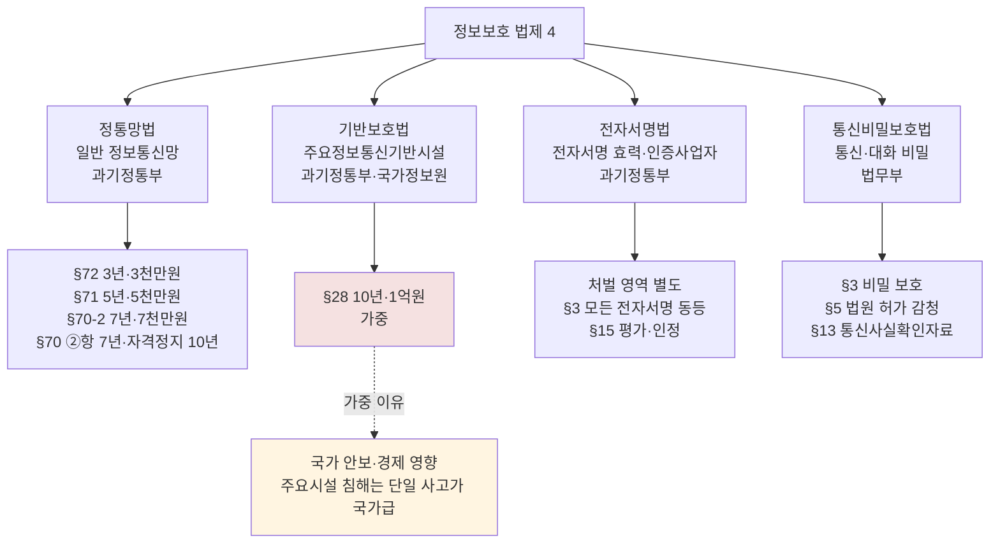

# 07. 정보보호 법제 — 만화책처럼 읽는 정통망법·기반보호법·전자서명법·통신비밀보호법

> **이 문서를 읽는 법**: *왜 정통망법과 기반보호법이 다른지*, *왜 2020 전부개정 전자서명법이 공인인증서를 폐지했는지*, *왜 정통망법 §47 ISMS 가 일정 규모 이상에만 의무인지*, *왜 기반보호법 §28 (10년) 이 정통망법 §72 (3년) 보다 가중인지* — 4 법령의 *제정 연혁과 보호 대상* 을 따라가면 모든 시험 함정이 풀립니다.
> 정확한 정의·수치·표준 번호·법령 조문은 정확본을 참조: [[cs/information-security/05.management-and-law/07.security-laws|정확본 07. 정보보호 관련 법제]]

> **독자 가정**: *백엔드/풀스택 개발자, 법령 조문 처음.* 이미 익숙한 개념 (`HTTPS 인증서`, `로그인 시 공동인증서·간편인증`, `KISA 침해사고 신고`, `법원 영장 통신 감청`) 을 다리로 씁니다.

> **연결 단원**: 본 단원은 [[cs/information-security/05.management-and-law/04.incident-response-and-forensics|04 사고대응]] §4 신고 의무·[[cs/information-security/05.management-and-law/05.certifications|05 인증제도]] §1·§3 ISMS-P·[[cs/information-security/05.management-and-law/06.security-ethics|06 윤리]] §5 정통망법 §48·§5-5 기반보호법 §12 의 *법령 자체 구조*. 본 단원에서 다루지 않는 *개인정보보호법은 [[cs/information-security/05.management-and-law/08.privacy-law|08 단원]]* 에서 별도 학습.

---

## 🎯 시작 전에 — 이미 보고 있는 4 법령

| 매일 보는 것 | 사실은 이 단원의 |
|---|---|
| KISA 침해사고 신고 채널 | 정통망법 §48-3 |
| 사이트 하단 "ISMS 인증" 마크 | 정통망법 §47 |
| CISO 임명 공시 | 정통망법 §45-3 |
| 사내 정보보호 정책 (정보보호조치) | 정통망법 §45 |
| 국가 핵심 인프라 (전력·금융·통신) 보호 | 기반보호법 §8 (주요정보통신기반시설) |
| 정기 취약점 점검 (분기·반기) | 기반보호법 §9 |
| 공동인증서·간편인증·금융인증서 동등 효력 | 전자서명법 §3 (2020 전부개정) |
| 인터넷뱅킹·전자세금계산서 전자서명 | 전자서명법 §3 ①항·§3 ②항 |
| 법원 영장 통신 감청 | 통신비밀보호법 §5 |
| 통신사실확인자료 (수사기관 요청) | 통신비밀보호법 §13 |

> **이 단원의 본질**: 정보보호 법제는 *조항 외우기 ❌* — *4 법령의 보호 대상·관할·처벌 차등의 분리*. 시험은 (1) **정통망법 §2 6 용어·§45·§45-3·§47·§48·§48-3·§70·벌칙** (2) **기반보호법 §8 지정·§9 취약점 평가·§10 보호대책·§12·§13·§28** (3) **전자서명법 2020.6.9 전부개정 / 2020.12.10 시행 / 법률 17354호 / §3 모든 전자서명 동등 / §15 평가·인정** (4) **통신비밀보호법 §3 비밀 보호·§5 법원 허가 감청·§13 통신사실확인자료** (5) **데이터 3법 (2020.2.4 / 2020.8.5)** *5 핵심*을 묻는다.

---

## 📖 에피소드 1 — 4 법령 개요 + §2 핵심 용어 17 개

### 장면 1. 4 법령 개요

| 법령 | 약칭 | 제정 | 핵심 |
|---|---|---|---|
| **정보통신망 이용촉진 및 정보보호 등에 관한 법률** | 정통망법 | *1986* (당시 「전산망 보급확장과 이용촉진에 관한 법률」) / 2001 현행 명칭 | 정보통신서비스 제공자 일반 규제 |
| **정보통신기반 보호법** | 기반보호법 | 2001.1.26 (법률 *제6383호*) / *2001.7.1 시행* | 주요정보통신기반시설 보호 |
| **전자서명법** | – | 1999.7.1 / *2020.6.9 전부개정 (법률 17354호) / 2020.12.10 시행* | 전자서명 효력·인정 전자서명 |
| **통신비밀보호법** | – | *1993.12.27 제정* | 통신·대화 비밀 보호·합법 감청 |

### 장면 2. 정통망법 §2 — 핵심 용어 6

| 용어 | 정의 (요약) |
|---|---|
| **정보통신망** | 「전기통신사업법」 제2조제2호에 따른 *전기통신설비를 이용하거나 전기통신설비와 컴퓨터 및 컴퓨터의 이용기술을 활용*하여 정보를 *수집·가공·저장·검색·송신·수신*하는 정보통신체제 |
| **정보통신서비스** | 「전기통신사업법」 제2조제6호에 따른 *전기통신역무*와 이를 이용하여 *정보를 제공하거나 정보의 제공을 매개*하는 것 |
| **정보통신서비스 제공자** | 「전기통신사업법」 제2조제8호에 따른 *전기통신사업자* + 영리를 목적으로 *전기통신역무를 이용하여 정보를 제공하거나 매개*하는 자 |
| **이용자** | 정보통신서비스 제공자가 제공하는 정보통신서비스를 *이용하는 자* |
| **전자우편** | *부호·문자·음성·화상·영상* 등을 송·수신하는 정보통신체제 |
| **침해사고** | *해킹·바이러스·논리폭탄·메일폭탄·DoS·전자기파* 등으로 정보통신망·정보시스템을 공격하는 *행위로 인하여 발생한 사태* |

### 장면 3. 기반보호법 §2 — 핵심 용어 3

| 용어 | 정의 (요약) |
|---|---|
| **정보통신기반시설** | *국가안전보장·행정·국방·치안·금융·통신·운송·에너지* 등의 업무와 관련된 *전자적 제어·관리시스템* + 「정보통신망법」 §2 ①항 1호의 정보통신망 |
| **주요정보통신기반시설** | 정보통신기반시설 중 *§8 에 따라 지정* 된 시설 |
| **전자적 침해행위** | 해킹·바이러스·DoS·전자기파 등으로 *정보통신기반시설을 공격*하여 정보·시스템에 영향을 미치는 행위 |

### 장면 4. 전자서명법 §2 — 핵심 용어 8 (2020 전부개정 기준)

| 용어 | 정의 (요약) |
|---|---|
| **전자문서** | 정보처리시스템에 의하여 *전자적 형태로 작성·송신·수신·저장*된 정보 |
| **전자서명** | *(가) 서명자의 신원 + (나) 서명자가 해당 전자문서에 서명하였다는 사실*을 나타내기 위해 전자문서에 첨부되거나 *논리적으로 결합된 전자적 형태의 정보* |
| **전자서명생성정보** | 전자서명을 생성하기 위해 이용하는 *전자적 정보* (사설키 등) |
| **전자서명검증정보** | 전자서명을 검증하기 위해 이용하는 *전자적 정보* (공개키 등) |
| **전자서명수단** | 전자서명생성정보가 들어 있는 *정보처리장치* (HSM·스마트카드 등) |
| **전자서명인증** | 전자서명생성정보가 *가입자에게 유일하게 속한다는 사실을 확인·증명*하는 행위 |
| **전자서명인증사업자** | 전자서명인증 업무를 *하는 자* |
| **전자서명인증서비스** | 전자서명인증사업자가 *가입자에게 제공*하는 전자서명인증과 관련된 서비스 |

### 시험 함정

- "정보통신망 정의 출처?" → *[정통망법] §2 ①항 1호*.
- "침해사고 정의?" → *[정통망법] §2 ①항 7호* (해킹·바이러스·DoS·전자기파).
- "주요정보통신기반시설 지정?" → *[기반보호법] §2 + §8*.
- "전자서명 정의의 *2 요건*?" → 서명자 신원 + 서명 사실.

---

## 📖 에피소드 2 — 정통망법 §1 목적 + 7 장 구조 + 데이터 3법

### 장면 1. 정통망법 §1 — *3 목적*

> "이 법은 *정보통신망의 이용을 촉진* 하고 *정보통신서비스를 이용하는 자의 개인정보를 보호* 함과 아울러 *정보통신망을 건전하고 안전하게 이용할 수 있는 환경을 조성* 하여 국민생활의 향상과 공공복리의 증진에 이바지함을 목적으로 한다."

### 장면 2. 정통망법 7 장 구조

| 장 | 제목 | 핵심 조문 |
|---|---|---|
| **제1장** | 총칙 | §1 목적, §2 정의 |
| **제2장** | 정보통신망의 이용촉진 | §3~§13 |
| **제3장** | (*삭제*, 2020 데이터 3법) | (구 개인정보 보호 — *[개인정보보호법] 으로 이관*) |
| **제4장** | 정보통신망에서의 이용자 보호 등 | *§44, §44-2, §44-7* (불법정보 유통 금지 등) |
| **제5장** | 정보통신망의 안정성 확보 등 | **§45·§45-3·§47·§48·§48-3** (정보보호조치·CISO·ISMS·침해사고 신고) |
| **제6장** | 보칙 | §51~§57 |
| **제7장** | 벌칙 | *§70~§76* |

### 장면 3. *데이터 3법* — 2020 개정의 핵심

> **데이터 3법** = *[정통망법] + [개인정보보호법] + [신용정보법]* 의 *2020.2.4 개정* (시행 *2020.8.5*).

| 변화 | 의미 |
|---|---|
| **정통망법 제3장 삭제** | 구 정통망법의 *개인정보 조항 다수* 가 *[개인정보보호법]* 으로 이관 |
| **개인정보보호법 통합** | 정통망법·신용정보법의 개인정보 영역을 *[개인정보보호법] 단일 법체계로 통합* |
| **가명정보 도입** | [개인정보보호법] §28-2~§28-7 신설 ([[cs/information-security/05.management-and-law/08.privacy-law|08 단원 §6]] cross-ref) |

### 시험 함정

- "정통망법 목적 = 이용촉진만" → ❌ **틀림**. *이용촉진 + 개인정보 보호 + 안전한 환경* (3 목적).
- "정통망법 제3장의 현재?" → *삭제* (2020 데이터 3법으로 [개보법] 이관).
- "데이터 3법 = 2020.8.5 개정" → ❌ **틀림**. *2020.2.4 개정 / 2020.8.5 시행*.
- "데이터 3법의 3 법령?" → 정통망법·개인정보보호법·신용정보법.

---

## 📖 에피소드 3 — 정통망법 §45·§45-3: 정보보호조치 + CISO

### 장면 1. §45 — 정보보호조치 *3 항*

| 항 | 내용 |
|---|---|
| **§45 ①항** | 정보통신서비스 제공자는 이용자의 *개인정보 등이 분실·도난·누출·위조·변조 또는 훼손되지 아니하도록* 안전성 확보에 필요한 *보호조치를 강구* |
| **§45 ②항** | *일정 규모 이상의 정보통신서비스 제공자는 정보보호 지침에 따른 안전성 확보* |
| **§45 ③항** | *과학기술정보통신부장관* 은 정보보호 지침을 정하여 고시 |

### 장면 2. §45-3 — CISO 지정 의무

[정통망법] §45-3 ([[cs/information-security/05.management-and-law/01.security-management-overview|05-01 §7-1 cross-ref]]).

| 항 | 내용 |
|---|---|
| **§45-3 ①항** | *일정 규모 이상의 정보통신서비스 제공자* 는 *정보보호 최고책임자* 를 지정하고 *과학기술정보통신부장관에게 신고* |
| **§45-3 ②항** | CISO 의 *자격·업무* |
| **§45-3 ③항** | 일정 규모 이상의 사업자는 CISO 가 *다른 직무 겸직 제한* |

### 장면 3. *§45 vs §45-3* — 분리

> **§45** = *조직 차원* 의 보호조치 의무.
>
> **§45-3** = *임원급 책임자 (CISO) 지정* 의무.

### 시험 함정

- "§45-3 = ISMS" → ❌ **틀림**. *§45-3 = CISO*. ISMS = *§47*.
- "CISO 지정 의무 법적 근거?" → *§45-3 ①항*.
- "CISO 의 신고 대상?" → *과학기술정보통신부장관*.
- "정보보호 지침 고시 주체?" → 과기정통부장관 (§45 ③항).

---

## 📖 에피소드 4 — 정통망법 §47: ISMS 인증 + 3 년 유효

### 장면 1. §47 — ISMS 인증 제도

[정통망법] §47 ([[cs/information-security/05.management-and-law/05.certifications|05-05 §1·§3 cross-ref]]).

| 항 | 내용 |
|---|---|
| **§47 ①항** | *과학기술정보통신부장관* 은 ISMS 인증 제도 운영 |
| **§47 ②항** | *일정 규모 이상의 정보통신서비스 제공자* 는 ISMS 인증 *의무* |
| **§47 ③항** | *인증의 유효기간 = 3년* |
| **§47 ④항~⑥항** | 인증기관·인증심사원·결과 통지 등 |

### 장면 2. ISMS 의무인증 대상 — *시행령 §49*

> **§47 ②항** + 시행령 §49 — *일정 규모 이상* (ISP·IDC·전년도 매출·이용자 수 일정 기준·의료기관·고등교육법상 학교).

### 장면 3. *§47 ③항 — 3 년 유효기간*

> **시험 함정**: ISMS 인증 유효기간은 *§47 ③항* 에 명시 — *3 년*. 이후 갱신 심사 ([[cs/information-security/05.management-and-law/05.certifications|05-05 §4 cross-ref]]).

### 시험 함정

- "정통망법 = 모든 정보통신서비스 제공자 ISMS 의무" → ❌ **틀림**. *일정 규모 이상* (§47 ②항 + 시행령 §49).
- "ISMS 인증 유효기간?" → *3 년* (§47 ③항).
- "ISMS 운영 주체?" → *과기정통부장관* (§47 ①항).

---

## 📖 에피소드 5 — 정통망법 §48 + §48-3: 3 금지 + 침해사고 신고

### 장면 1. §48 — 3 대 금지행위

[정통망법] §48 ([[cs/information-security/05.management-and-law/06.security-ethics|05-06 §10 cross-ref]]).

| 항 | 금지행위 | 처벌 |
|---|---|---|
| **§48 ①항** | *무단 침입 (해킹)* | §72 ①항 1호 — 3년·3천만원 |
| **§48 ②항** | *악성프로그램 전달·유포* | §70-2 — 7년·7천만원 |
| **§48 ③항** | *DoS 등 정보통신망 장애 유발* | §71 ①항 10호 — 5년·5천만원 |

### 장면 2. §48-3 — 침해사고 신고 의무

[정통망법] §48-3 ([[cs/information-security/05.management-and-law/04.incident-response-and-forensics|05-04 §4-1 cross-ref]]).

| 항 | 내용 |
|---|---|
| **§48-3 ①항** | 정보통신서비스 제공자는 침해사고 발생 사실을 인지한 경우 *지체 없이 KISA 또는 과기정통부에 신고* |
| **§48-3 ②항** | 신고를 받은 기관은 *침해사고 분석·대응 지원* |

### 장면 3. *형량 차등* — 시험 빈출

> **②항 7년 > ③항 5년 > ①항 3년** — 악성프로그램 전달이 *불특정 다수 피해 + 자가 전파* 로 가장 가중.

### 시험 함정

- "§48 ③항 = 악성코드" → ❌ **틀림**. *③항 = DoS*. *②항 = 악성프로그램*.
- "침해사고 신고 의무 법적 근거?" → *§48-3 ①항*.
- "침해사고 신고 시기?" → *지체 없이*.
- "신고 대상?" → KISA 또는 과기정통부.

---

## 📖 에피소드 6 — 정통망법 §70·§70-2·§71·§72·§74·§76 벌칙

### 장면 1. 벌칙 7 조항 형량 — *시험 빈출 1순위*

| 죄명 | 조문 | 형량 |
|---|---|---|
| **사실 적시 명예훼손** | §70 ①항 | 3년 이하 / 3천만원 이하 |
| **거짓 사실 적시 명예훼손** | §70 ②항 | *7년 이하 / 5천만원 이하 / 자격정지 10년* |
| **악성프로그램 전달·유포** (§48 ②항) | §70-2 | 7년 이하 / 7천만원 이하 |
| **정보통신망 장애 유발** (§48 ③항) | §71 ①항 10호 | 5년 이하 / 5천만원 이하 |
| **무단 침입** (§48 ①항) | §72 ①항 1호 | 3년 이하 / 3천만원 이하 |
| **음란물·반복적 공포·불안 유발** (§44-7 ①항 1·3호) | §74 | 1년 이하 / 1천만원 이하 |
| **과태료** (지정·신고·보고 의무 위반 등) | §76 | 사안별 차등 |

> *주의*: 위 형량은 작성 시점 (2026.04.30) 의 [정통망법] 현행본 기준이며, *정기 개정으로 변경 가능*. 시험 응시 시점에 *국가법령정보센터에서 직접 확인 필요*.

### 장면 2. *형법 §307 vs 정통망법 §70* — 가중 비교

| 비교 | 형법 §307 | 정통망법 §70 |
|---|---|---|
| 사실 적시 | 2년 이하 | *3년 이하* (가중) |
| 거짓 사실 적시 | 5년 이하 | *7년 이하* (가중) + *자격정지 10년* |

### 시험 함정

- "정통망법 §70 = 형법 §307 동일" → ❌ **틀림**. *정통망법이 가중*.
- "악성프로그램 처벌 조문?" → *§70-2* (7년).
- "DoS 처벌 조문?" → *§71 ①항 10호* (5년).
- "음란물 처벌 조문?" → *§74* (1년).
- "과태료 조문?" → *§76*.

---

## 📖 에피소드 7 — 기반보호법 §1·§8: 주요시설 지정

### 장면 1. §1 목적

> "이 법은 *전자적 침해행위에 대비* 하여 *주요정보통신기반시설의 보호에 관한 대책을 수립·시행* 함으로써 동 시설을 *안정적으로 운용* 하도록 하여 *국가의 안전과 국민생활의 안정을 보장* 함을 목적으로 한다."

### 장면 2. 법령 개요

| 항목 | 내용 |
|---|---|
| **정식 명칭** | 정보통신기반 보호법 |
| **약칭** | 기반보호법 |
| **제정** | *2001.1.26* (법률 *제6383호*) / *2001.7.1 시행* |
| **소관 부처** | 과학기술정보통신부, 국가정보원 (분야별) |

### 장면 3. §8 — 주요정보통신기반시설 지정 4 단계

| 단계 | 활동 |
|---|---|
| **1. 추천 또는 신청** | *관계 중앙행정기관의 장이 추천* / 시설 관리기관이 신청 |
| **2. 심의·평가** | *정보통신기반보호위원회* 의 심의 |
| **3. 지정** | *관계 중앙행정기관의 장* 의 지정 + 고시 |
| **4. 정기 점검** | 지정 후에도 정기적으로 점검 |

### 장면 4. *지정 권한* — 관계 중앙행정기관의 장 (대통령 ❌)

> **시험 함정**: 주요정보통신기반시설의 *지정 권한은 관계 중앙행정기관의 장* — 대통령 ❌. 분야별 (금융·전력·통신 등) 로 *해당 부처 장관* 이 지정.

### 시험 함정

- "주요시설 지정 권한 = 대통령" → ❌ **틀림**. *관계 중앙행정기관의 장* (§8).
- "기반보호법 제정·시행?" → 2001.1.26 / 2001.7.1.
- "기반보호법 법률 번호?" → *제6383호*.
- "지정 절차?" → 추천·신청 → 위원회 심의 → 지정 → 정기 점검.

---

## 📖 에피소드 8 — 기반보호법 §9·§10·§12·§13·§28

### 장면 1. §9 — 취약점 분석·평가 *정기 의무*

[기반보호법] §9.

| 항 | 내용 |
|---|---|
| **§9 ①항** | *정기적으로 취약점을 분석·평가* 하고 결과를 *관계 중앙행정기관의 장에게 통보* |
| **§9 ②항** | 분석·평가의 *방법·절차 등은 시행령* |
| **§9 ③항** | *분석·평가 수행기관* — KISA, 한국전자통신연구원, 정보보호 전문서비스 기업 등 |

### 장면 2. §10 — 보호대책 4 단계

| 단계 | 활동 |
|---|---|
| **1. 보호대책 수립** | *관리기관의 장* 이 시설별 보호대책 수립 |
| **2. 정부 보고** | 관계 중앙행정기관의 장에게 *제출* |
| **3. 정부 종합** | 관계 중앙행정기관의 장이 *분야별 보호계획* 수립 |
| **4. 종합대책** | *정부가 종합계획* 수립·시행 |

### 장면 3. §12 — 침해 금지

[기반보호법] §12 ([[cs/information-security/05.management-and-law/06.security-ethics|05-06 §11 cross-ref]]).

| 호 | 금지행위 |
|---|---|
| **1호** | *접근권한을 가지지 아니하는 자의 침입* |
| **2호** | *데이터 무단 변경·삭제* |
| **3호** | *운용 방해* |

### 장면 4. §13 — 침해사고 통지

[기반보호법] §13 ([[cs/information-security/05.management-and-law/04.incident-response-and-forensics|05-04 §4-2 cross-ref]]) — 침해사고 발생 시 관리기관의 장은 *지체 없이 관계 중앙행정기관의 장·수사기관·KISA 에 통지*.

### 장면 5. §28 — 침해 처벌 *10 년 가중*

| 위반 행위 | 처벌 |
|---|---|
| §12 위반 | [기반보호법] *§28* — *10 년 이하 징역 또는 1 억원 이하 벌금* |

> **정통망법 §72 (3 년) 보다 가중** — 국가 안보·경제 영향이 크기 때문.

### 시험 함정

- "기반보호법 침해 처벌 = 정통망법과 동일" → ❌ **틀림**. *§28 — 10 년 이하* (정통망법 §72 = 3년 보다 가중).
- "취약점 분석·평가 의무 조문?" → *§9*.
- "취약점 분석·평가 수행기관?" → *KISA·한국전자통신연구원·정보보호 전문서비스 기업*.
- "기반보호법 침해사고 통지 조문?" → *§13*.
- "통지 대상?" → 관계 중앙행정기관·수사기관·KISA (정통망법 §48-3 의 KISA·과기정통부 와 다름).

---

## 📖 에피소드 9 — 정통망법 vs 기반보호법: 5 차원 비교

### 장면 1. 5 차원 비교

| 비교 항목 | 정통망법 | 기반보호법 |
|---|---|---|
| **보호 대상** | *일반 정보통신망* + 정보통신서비스 제공자 | *주요정보통신기반시설* (지정된 핵심 시설) |
| **침해 처벌** | *§72 (3년 이하 / 3천만원)* | *§28 (10년 이하 / 1억원)* — **가중** |
| **침해사고 신고** | *§48-3* (지체 없이 KISA·과기정통부) | *§13* (지체 없이 관계 중앙행정기관·수사기관·KISA) |
| **취약점 분석·평가** | §45 (자율) | *§9 (의무)* |
| **의무 강도** | *자율 + 일정 규모 이상 의무* | *지정 시 의무* |

### 장면 2. *왜 분리된 법령인가*

> **정통망법** = *민간 정보통신서비스 일반*.
>
> **기반보호법** = *국가 안보·경제에 중대한 시설*. 침해 시 영향이 *국가 단위* 이므로 *별도 가중 처벌·정기 점검 의무* 필요.

### 장면 3. *지정 여부 차이*

> 기반보호법은 *§8 지정* 을 거친 시설에만 적용. 일반 정보통신망은 정통망법 적용.

### 시험 함정

- "기반보호법은 모든 정보통신망에 적용" → ❌ **틀림**. *주요정보통신기반시설 (지정된 시설) 한정*.
- "취약점 분석·평가 의무?" → *기반보호법 §9* (정통망법 §45 는 자율).
- "침해사고 통지 vs 신고?" → 기반보호법 §13 (통지) / 정통망법 §48-3 (신고) — 표현 차이도 시험 출제.

---

## 📖 에피소드 10 — 전자서명법: 1999 제정 + 2020 전부개정

### 장면 1. 법령 개요

| 항목 | 내용 |
|---|---|
| **정식 명칭** | 전자서명법 |
| **최초 제정** | *1999.7.1* (구 전자서명법 — *공인인증서* 제도 도입) |
| **2020 전부개정** | **2020.6.9 전부개정** (법률 **제17354호**) / **2020.12.10 시행** |
| **소관 부처** | 과학기술정보통신부 |

### 장면 2. *2020 전부개정* 5 차원 변화 — *시험 1순위*

| 변화 | 구 전자서명법 (1999~2020.12) | 신 전자서명법 (2020.12~ 현행) |
|---|---|---|
| **공인인증서 제도** | *존재* (공인인증기관·공인인증서) | **폐지** (다양한 전자서명 수단을 *동등하게 인정*) |
| **인증사업자 자격** | *정부가 지정* 한 공인인증기관 | *시장 경쟁* — 평가·인정제 |
| **전자서명 효력** | *공인전자서명만 우월적 효력* | *모든 전자서명* 이 본인 서명·날인과 *동등한 법적 효력* |
| **평가·인정** | 정부 지정 | *평가기관의 평가 + 과기정통부 인정* |

### 장면 3. *공인인증서 폐지의 의미*

> **공인인증서가 사라진 것이 아니다 — 우월적 효력이 폐지된 것**. 공인인증서는 이제 *공동인증서* 라는 이름으로 *다른 인증서 (금융인증서·간편인증·생체인증) 와 동등한 지위* 에서 사용된다.

### 시험 함정

- "전자서명법 전부개정 시행 = 2020.6.9" → ❌ **틀림**. *2020.6.9 = 전부개정 공포일* / *2020.12.10 = 시행일*.
- "전자서명법 법률 번호?" → *제17354호*.
- "공인인증서 = 인정 전자서명" → ❌ **틀림**. *공인인증서는 폐지*. *인정 전자서명은 신 법 §15* 의 평가·인정 받은 전자서명.
- "공인인증서가 사라졌나?" → *우월적 효력만 폐지* (제도 자체 폐지).

---

## 📖 에피소드 11 — 전자서명법 §3: 모든 전자서명 동등

### 장면 1. §1 목적

> "이 법은 *전자문서 및 전자거래의 안전성과 신뢰성* 을 확보하고 그 *이용을 활성화* 하기 위하여 *전자서명에 관한 기본적인 사항* 을 정함으로써 *국가사회의 정보화를 촉진* 하고 *국민생활의 편익을 증진* 함을 목적으로 한다."

### 장면 2. §3 — 전자서명의 효력 — *시험 핵심*

| 항 | 내용 |
|---|---|
| **§3 ①항** | **전자서명은 서명·서명날인 또는 기명날인의 효력을 가진다.** 다만, 다른 법률에 특별한 규정이 있는 경우는 제외 |
| **§3 ②항** | 법령의 규정에 따라 *서명·서명날인 또는 기명날인이 필요한 경우* 전자서명이 있을 때에는 그 *서명·서명날인 또는 기명날인이 있는 것으로 본다* |

### 장면 3. *§3 ①항의 의미* — 모든 전자서명이 손글씨와 동등

> **모든 전자서명** 이 손글씨 서명·날인과 *동등한 법적 효력* 을 가진다는 *핵심 조항*. 구 법의 *공인전자서명 우월적 효력은 폐지*.

### 장면 4. 공인 vs 인정 전자서명 — 4 차원 비교

| 비교 항목 | 구 공인전자서명 | 신 인정 전자서명 |
|---|---|---|
| **법적 근거** | 구 [전자서명법] §3 ②항·§5 | 신 [전자서명법] *§15* |
| **우월적 효력** | *존재* | *폐지* (모든 전자서명 동등) |
| **인정 방식** | *정부 지정* (공인인증기관) | *평가·인정* (시장 경쟁) |
| **운영 기관** | 과거 KISA·금융결제원·NICE 평가정보 등 | *다수 사업자* (공동인증서·금융인증서·간편인증 등) |

### 시험 함정

- "§3 ①항 = 공인전자서명만 효력" → ❌ **틀림**. *모든 전자서명* 이 동등.
- "§3 ②항의 의미?" → 법령상 서명·날인 필요 시 *전자서명으로 갈음*.
- "신 인정 전자서명 법적 근거?" → *§15* (신 법).
- "공인 vs 인정 *인정 방식*?" → 정부 지정 (구) vs 평가·인정 (신).

---

## 📖 에피소드 12 — 전자서명법 §6~§15: 인증사업자 + 평가·인정

### 장면 1. 인증사업자 9 조문

| 조문 | 내용 |
|---|---|
| **§6 (인증사업자 등록)** | 전자서명인증 업무를 하려는 자는 *과기정통부장관에게 등록* |
| **§7 (인증업무준칙 등)** | 인증사업자의 *인증업무 수행 기준* |
| **§8 (가입자 보호조치)** | 가입자 정보의 *안전성·정확성* |
| **§9~§13** | 운영·중단·승계 등 |
| **§14 (인증서의 폐지·해지)** | 인증서 폐지 사유 ([[cs/information-security/04.security-general/04.digital-signature-pki|정확본 04-04 §4-3 CRL·OCSP cross-ref]]) |

### 장면 2. §15 — 평가·인정 4 단계

| 단계 | 활동 |
|---|---|
| **1. 평가 신청** | 인증사업자가 *평가기관에 평가 신청* |
| **2. 평가 수행** | 평가기관이 *인증업무 운영 평가* |
| **3. 인정 신청** | 평가 통과 사업자가 *과기정통부장관에 인정 신청* |
| **4. 인정** | *과기정통부장관의 인정* (인정 사실 공고) |

### 장면 3. 4과목 04 §6 한국 PKI 운영 cross-ref

| 측면 | 4과목 04 §6 | 5과목 07 §4 |
|---|---|---|
| **디지털서명 알고리즘** | RSA·ECDSA·EdDSA (FIPS 186-5) | (해당 없음) |
| **인증서 구조** | X.509 v3 (RFC 5280) | (해당 없음) |
| **한국 법령 시점** | (간단 언급) | *2020.6.9 전부개정 / 2020.12.10 시행 상세* |
| **인정 전자서명** | (간단 언급) | *§15 평가·인정 절차 상세* |

### 시험 함정

- "인증사업자 등록 대상?" → *과기정통부장관*.
- "§15 평가·인정 4 단계?" → 평가 신청 → 평가 수행 → 인정 신청 → 인정.
- "인증서 폐지·해지 조문?" → *§14* (CRL·OCSP cross-ref).

---

## 📖 에피소드 13 — 통신비밀보호법 + 정보통신산업진흥법

### 장면 1. 통신비밀보호법 — 1993.12.27 제정

| 항목 | 내용 |
|---|---|
| **정식 명칭** | 통신비밀보호법 |
| **제정** | *1993.12.27* |
| **소관 부처** | *법무부* |

### 장면 2. 통신비밀보호법 §3·§5·§13 — 핵심 3 조문

| 조문 | 내용 |
|---|---|
| **§3 (통신·대화 비밀의 보호)** | *누구든지 이 법과 형사소송법 또는 군사법원법의 규정에 의하지 아니하고는* 우편물의 검열·전기통신의 감청 또는 통신사실확인자료의 제공을 하거나 *공개되지 아니한 타인 간의 대화를 녹음 또는 청취* 하지 못한다 |
| **§5 (범죄수사 통신제한조치)** | *법원 허가에 의한 감청* |
| **§13 (통신사실확인자료 제공)** | *검사·사법경찰관* 의 통신사실확인자료 요청 |

### 장면 3. *합법 감청의 요건* — 시험 함정

> **통신비밀보호법 §5** 는 *법원 허가* 에 의한 감청을 *합법* 으로 인정. *법원 영장 없는 무단 감청은 §3 위반*.

### 장면 4. 정보통신산업진흥법

| 항목 | 내용 |
|---|---|
| **정식 명칭** | 정보통신산업 진흥법 |
| **소관 부처** | 과학기술정보통신부 |
| **주요 내용** | *정보통신산업의 진흥, 정보보호산업의 진흥, 정보통신기술 개발 지원* |

5과목 시험에서는 *보조적* 으로 다루어진다.

### 시험 함정

- "통신비밀보호법 = 모든 감청 금지" → ❌ **틀림**. *법원 허가 (§5)* 에 의한 감청은 합법.
- "통신비밀보호법 §3 의 보호 대상?" → 우편물·전기통신·대화.
- "통신비밀보호법 소관 부처?" → *법무부*.
- "통신사실확인자료 요청 주체?" → *검사·사법경찰관* (§13).
- "정보통신산업진흥법 소관?" → *과기정통부*.

---

## 📑 종합 비교 (에피소드 1·9·10·13 정리)

4 법령의 *제정·소관·핵심 조문·처벌* 종합.

| 법령 | 제정 / 개정 | 소관 부처 | 핵심 조문 | 가장 무거운 처벌 |
|---|---|---|---|---|
| **정통망법** | 1986 / 2001 명칭 변경 / 2020 데이터 3법 | 과기정통부 / *방송통신위원회 (분야별)* | §44·§44-7·§45·§45-3·§47·§48·§48-3·§70·§70-2·§71·§72·§74·§76 | *§70-2 7 년·7 천만원* (악성프로그램) / 거짓 명예훼손 *§70 ②항 7 년·자격정지 10 년* |
| **기반보호법** | *2001.1.26 (법률 6383호) / 2001.7.1 시행* | 과기정통부, 국가정보원 | §8·§9·§10·§12·§13·§28 | *§28 10 년·1 억원* (가장 가중) |
| **전자서명법** | 1999.7.1 / **2020.6.9 전부개정 (법률 17354호) / 2020.12.10 시행** | 과기정통부 | §3·§6·§7·§8·§14·§15 | (해당 없음 — 인증사업자 규제) |
| **통신비밀보호법** | *1993.12.27* | *법무부* | §3·§5·§13 | (별도 조항) |
| **정보통신산업진흥법** | – | 과기정통부 | (보조 법령) | – |

> **읽는 법**: 처벌 *작은 것 → 큰 것* — 정통망법 §72·§74 (1~3년) < 정통망법 §71 (5년) < 정통망법 §70-2·§70 ②항 (7년) < *기반보호법 §28 (10년·1억원)*.

---

## 🗺️ 마인드맵 1 — 4 법령 발행 시간선



---

## 🗺️ 마인드맵 2 — 정통망법 7 장 구조 + 핵심 조문



---

## 🗺️ 마인드맵 3 — 기반보호법 4 단계 보호대책 흐름



---

## 🗺️ 마인드맵 4 — 전자서명법: 구법 vs 신법



---

## 🗺️ 마인드맵 5 — 4 법령 비교 + 처벌 차등



---

## 🗂️ 키워드 클러스터

### 4 법령 발행 시점

```
정통망법              — 1986 최초 제정 (전산망 보급확장과 이용촉진에 관한 법률)
                     — 2001 현행 명칭 변경 (정보통신망 이용촉진 및 정보보호 등에 관한 법률)
                     — 2020.2.4 데이터 3법 개정 / 2020.8.5 시행 (개인정보 조항 → 개보법)

기반보호법            — 2001.1.26 제정 (법률 제6383호) / 2001.7.1 시행

전자서명법            — 1999.7.1 구법 제정 (공인인증서 도입)
                     — 2020.6.9 전부개정 (법률 제17354호) / 2020.12.10 시행 (공인인증서 폐지)

통신비밀보호법         — 1993.12.27 제정

정보통신산업진흥법     — 보조 법령
```

### 정통망법 §2 — 6 핵심 용어

```
정보통신망          — 전기통신설비 + 컴퓨터·이용기술 (§2 ①항 1호)
정보통신서비스       — 전기통신역무 + 정보 제공·매개
정보통신서비스 제공자 — 전기통신사업자 + 영리 매개자
이용자             — 정보통신서비스 이용자
전자우편           — 부호·문자·음성·화상·영상 송수신
침해사고           — 해킹·바이러스·논리폭탄·메일폭탄·DoS·전자기파 (§2 ①항 7호)
```

### 정통망법 7 장 + 핵심 조문

```
제1장 총칙              — §1 목적·§2 정의
제2장 이용촉진          — §3~§13
제3장 (삭제, 2020)      — 개인정보 → 개보법
제4장 이용자 보호        — §44·§44-2·§44-7
제5장 안정성 확보        — §45·§45-3·§47·§48·§48-3
제6장 보칙             — §51~§57
제7장 벌칙             — §70~§76

§45     정보보호조치
§45-3   CISO 지정·신고 (과기정통부)
§47     ISMS 인증 (유효 3년 / §47 ③항)
§48 ①   무단 침입 (해킹) → §72 ①항 1호 / 3년·3천만원
§48 ②   악성프로그램 유포 → §70-2 / 7년·7천만원 (가중)
§48 ③   DoS·정보통신망 장애 → §71 ①항 10호 / 5년·5천만원
§48-3   침해사고 신고 (지체 없이 KISA·과기정통부)
§70 ①   사실 적시 명예훼손 / 3년·3천만원
§70 ②   거짓 사실 적시 명예훼손 / 7년·자격정지 10년·5천만원
§74     음란·반복 공포 / 1년·1천만원
§76     과태료
```

### 기반보호법 핵심 조문

```
§1     목적 — 전자적 침해행위 대비, 주요시설 보호, 국가 안전 보장
§2     정의 — 정보통신기반시설·주요정보통신기반시설·전자적 침해행위
§8     주요시설 지정 — 관계 중앙행정기관의 장 (대통령 ❌)
        절차 4 단계: 추천·신청 → 위원회 심의 → 지정·고시 → 정기 점검
§9     취약점 분석·평가 (정기 의무)
        수행기관: KISA·한국전자통신연구원·정보보호 전문서비스 기업
§10    보호대책 4 단계 — 시설별 수립 → 정부 보고 → 분야별 계획 → 종합대책
§12    침해 금지 — 1호 침입·2호 변경·삭제·3호 운용 방해
§13    침해사고 통지 — 지체 없이 관계 중앙행정기관·수사기관·KISA
§28    처벌 — 10년 이하 / 1억원 이하 (정통망법 §72 보다 가중)
```

### 정통망법 vs 기반보호법

```
보호 대상            — 일반 정보통신망 vs 주요정보통신기반시설
침해 처벌            — §72 (3년·3천만원) vs §28 (10년·1억원) 가중
침해사고 신고/통지    — §48-3 (KISA·과기정통부) vs §13 (관계 중앙행정·수사기관·KISA)
취약점 평가          — §45 자율 vs §9 정기 의무
의무 강도            — 자율+일정 규모 vs 지정 시 의무
```

### 전자서명법 — 2020 전부개정 5 차원 변화

```
공인인증서 제도      — 존재 → 폐지
인증사업자 자격      — 정부 지정 → 시장 경쟁 (평가·인정)
전자서명 효력        — 공인전자서명만 우월 → 모든 전자서명 동등
평가·인정           — 정부 지정 → 평가기관·과기정통부 인정

법령 정확성:
  2020.6.9         — 전부개정 공포일 (법률 제17354호)
  2020.12.10       — 시행일

§3 ①항 — 전자서명은 서명·서명날인 또는 기명날인의 효력
§3 ②항 — 법령상 서명·날인 필요 시 전자서명으로 갈음
```

### 전자서명법 §6~§15 인증사업자

```
§6     인증사업자 등록 (과기정통부)
§7     인증업무준칙
§8     가입자 보호조치
§9~§13 운영·중단·승계
§14    인증서 폐지·해지 (CRL·OCSP cross-ref)
§15    평가·인정 4 단계 (평가 신청 → 수행 → 인정 신청 → 인정)
```

### 공인 vs 인정 전자서명

```
공인전자서명 (구)     — 정부 지정 공인인증기관 / 우월적 효력
인정 전자서명 (신)    — §15 평가·인정 / 모든 전자서명 동등
운영 기관 (신)        — 공동인증서·금융인증서·간편인증·생체인증
```

### 통신비밀보호법 §3·§5·§13

```
§3 통신·대화 비밀의 보호 — 우편물·전기통신·대화
§5 범죄수사 통신제한조치  — 법원 허가 감청
§13 통신사실확인자료      — 검사·사법경찰관 요청

소관 부처              — 법무부 (다른 3 법령은 과기정통부)
제정                  — 1993.12.27
```

### 데이터 3법 (2020.2.4 / 2020.8.5)

```
3 법령 — 정통망법 + 개인정보보호법 + 신용정보법
주요 변화:
  정통망법 제3장 삭제   — 개인정보 조항 → 개보법
  가명정보 도입         — 개보법 §28-2~§28-7
  통합 법체계          — 개보법 단일 법체계로 통합
```

### 4 법령 처벌 차등 (작은 것 → 큰 것)

```
1년·1천만원   — 정통망법 §74 (음란·공포)
3년·3천만원   — 정통망법 §72 (해킹)
5년·5천만원   — 정통망법 §71 (DoS)
7년·7천만원   — 정통망법 §70-2 (악성프로그램)
거짓 명예훼손  — 정통망법 §70 ②항 (7년·자격정지 10년·5천만원)
10년·1억원   — 기반보호법 §28 (가중) — 4 법령 중 최고
```

---

## 🃏 회상 30문항

> 답을 가린 뒤 자가 채점. 틀린 것만 정확본으로 깊이 학습.

**A. 4 법령 개요 + §2 용어 (1~5)**
1. 정통망법 §2 핵심 용어 *6 종*?
2. 기반보호법 §2 핵심 용어 *3 종*?
3. 전자서명법 §2 핵심 용어 *8 종*?
4. 정통망법 *최초 제정 연도 + 명칭*?
5. 기반보호법 *법률 번호*?

**B. 정통망법 (6~12)**
6. 정통망법 §1 *3 목적*?
7. 정통망법 *7 장 구조*?
8. 데이터 3법 *개정·시행일*?
9. §45 vs §45-3 차이?
10. ISMS 인증 유효기간 *조항*?
11. §48 *3 금지행위*?
12. §70 ②항 거짓 명예훼손 형량?

**C. 기반보호법 (13~17)**
13. 주요정보통신기반시설 *지정 권한자*?
14. §9 취약점 분석·평가 *수행기관*?
15. §10 보호대책 *4 단계*?
16. §13 침해사고 통지 *대상*?
17. §28 처벌과 *가중 이유*?

**D. 정통망법 vs 기반보호법 (18~20)**
18. 보호 대상 차이?
19. 침해사고 신고 vs 통지 *조문 차이*?
20. 취약점 평가 *의무 강도*?

**E. 전자서명법 (21~26)**
21. 전자서명법 *최초 제정 연도*?
22. 전부개정 *공포일·시행일·법률 번호*?
23. 2020 전부개정 *5 차원 변화*?
24. §3 ①항의 의미?
25. §15 평가·인정 *4 단계*?
26. 공인 vs 인정 전자서명 *법적 근거*?

**F. 통신비밀보호법·산업진흥법 (27~30)**
27. 통신비밀보호법 *제정일·소관 부처*?
28. §3 의 보호 대상?
29. §5 합법 감청의 *요건*?
30. §13 통신사실확인자료 *요청 주체*?

---

## ⚠️ 시험 함정 모음

| 함정 | 정답 |
|---|---|
| 정통망법은 모든 정보통신서비스 제공자에 ISMS 의무 | ❌ *일정 규모 이상* (§47 ②항 + 시행령 §49) |
| 정통망법 §45-3 = ISMS | ❌ §45-3 = *CISO* 지정. ISMS = §47 |
| 정통망법 §48 ③항 = 악성코드 | ❌ ③항 = *DoS*. ②항 = 악성프로그램 |
| 기반보호법은 모든 정보통신망에 적용 | ❌ *주요정보통신기반시설* (지정된 시설) 한정 |
| 주요정보통신기반시설 지정 권한 = 대통령 | ❌ *관계 중앙행정기관의 장* (§8) |
| 기반보호법 침해 처벌 = 정통망법과 동일 | ❌ *§28 — 10 년 이하* (정통망법 §72 = 3년 보다 가중) |
| 전자서명법 전부개정 시행일 = 2020.6.9 | ❌ *2020.6.9 = 전부개정 공포일* / *2020.12.10 = 시행일* |
| 공인인증서 = 인정 전자서명 | ❌ 공인인증서는 *2020 전부개정으로 폐지*. 인정 전자서명은 신 법 §15 |
| 전자서명법 §3 ①항 = 공인전자서명만 효력 | ❌ *모든 전자서명* 이 서명·날인과 동등 |
| 통신비밀보호법은 합법 감청을 모두 금지 | ❌ *법원 허가* (§5) 에 의한 감청은 합법 |
| 데이터 3법 = 2020.8.5 개정 | ❌ *2020.2.4 개정 / 2020.8.5 시행* |
| 정통망법 §70 명예훼손 = 형법 §307 동일 | ❌ *정통망법이 가중* (사실 3년 / 거짓 7년 vs 형법 사실 2년 / 거짓 5년) |
| 기반보호법 제정 = 정통망법보다 빠름 | ❌ 정통망법 *1986* / 기반보호법 *2001.1.26* |
| 통신비밀보호법 소관 = 과기정통부 | ❌ *법무부* |
| 정통망법 제3장 = 개인정보 보호 | ❌ *2020 데이터 3법으로 삭제·이관* |
| 전자서명법 법률 번호 = 6383호 | ❌ *17354호*. 6383호 = 기반보호법 |
| 통신사실확인자료 요청 = 법원 | ❌ *검사·사법경찰관* (§13) |
| §13 (기반보호법) = 통신사실확인자료 | ❌ 기반보호법 §13 = *침해사고 통지*. 통신사실확인자료 = *통신비밀보호법 §13* |
| ISMS 인증 유효기간 = 5년 | ❌ *3년* (§47 ③항) |
| 침해사고 신고 = §48 | ❌ *§48-3*. §48 은 3 금지행위 |
| 4 법령 모두 과기정통부 소관 | ❌ *통신비밀보호법은 법무부* |
| 음란물 처벌 = §70 | ❌ 음란물 = *§74* (1년). §70 = 명예훼손 |
| 인정 전자서명 법적 근거 = 구 §3 ②항 | ❌ *신 §15* (평가·인정) |

---

## 🔗 정확본 매핑표

| 본 노트 에피소드 | 정확본 § |
|---|---|
| 에피소드 1 (4 법령 개요 + §2 17 용어) | [[cs/information-security/05.management-and-law/07.security-laws#§1. 정보보호 법제 용어의 정의\|정확본 §1-1·§1-2·§1-3]] |
| 에피소드 2 (정통망법 §1 + 7 장 + 데이터 3법) | [[cs/information-security/05.management-and-law/07.security-laws#§2-1. 법령 개요\|정확본 §2-1·§2-2·§2-3]] |
| 에피소드 3 (§45 + §45-3 CISO) | [[cs/information-security/05.management-and-law/07.security-laws#§2-4. 핵심 조문 1 — §45 정보보호조치\|정확본 §2-4·§2-5]] |
| 에피소드 4 (§47 ISMS) | [[cs/information-security/05.management-and-law/07.security-laws#§2-6. 핵심 조문 3 — §47 정보보호 관리체계 인증 (ISMS)\|정확본 §2-6]] |
| 에피소드 5 (§48 + §48-3 신고) | [[cs/information-security/05.management-and-law/07.security-laws#§2-7. 핵심 조문 4 — §48 정보통신망 침해행위 등의 금지\|정확본 §2-7·§2-8]] |
| 에피소드 6 (§70~§76 벌칙 7 조항) | [[cs/information-security/05.management-and-law/07.security-laws#§2-9. 정통망법 벌칙 요약\|정확본 §2-9]] |
| 에피소드 7 (기반보호법 §1·§8) | [[cs/information-security/05.management-and-law/07.security-laws#§3-1. 법령 개요\|정확본 §3-1·§3-2·§3-3·§3-4]] |
| 에피소드 8 (§9·§10·§12·§13·§28) | [[cs/information-security/05.management-and-law/07.security-laws#§3-5. 핵심 조문 2 — §9 취약점 분석·평가\|정확본 §3-5·§3-6·§3-7]] |
| 에피소드 9 (정통망법 vs 기반보호법) | [[cs/information-security/05.management-and-law/07.security-laws#§3-8. 정통망법 vs 기반보호법 비교\|정확본 §3-8]] |
| 에피소드 10 (전자서명법 1999 + 2020 전부개정) | [[cs/information-security/05.management-and-law/07.security-laws#§4-1. 법령 개요와 2020 전부개정\|정확본 §4-1·§4-2]] |
| 에피소드 11 (§3 효력 + 공인 vs 인정) | [[cs/information-security/05.management-and-law/07.security-laws#§4-3. 핵심 조문 1 — §1 목적\|정확본 §4-3·§4-4·§4-7]] |
| 에피소드 12 (§6~§15 인증사업자 + 평가·인정) | [[cs/information-security/05.management-and-law/07.security-laws#§4-5. 핵심 조문 3 — 전자서명인증사업자\|정확본 §4-5·§4-6·§4-8]] |
| 에피소드 13 (통신비밀보호법 + 산업진흥법) | [[cs/information-security/05.management-and-law/07.security-laws#§5-1. 정보통신산업진흥법\|정확본 §5-1·§5-2]] |

---

## 📅 학습 흐름 (8주차 시험 대비 기준)

```
[1주]   에피소드 1 (4 법령 개요 + §2 17 용어) — 만화책 통독, *6+3+8 용어* 외움
[2주]   에피소드 2 (정통망법 §1 + 7 장 + 데이터 3법) — *제3장 삭제 + 2020.2.4/8.5* 외움
[3주]   에피소드 3·4 (§45·§45-3·§47) — *§45 보호조치 / §45-3 CISO / §47 ISMS* 분리 외움
[4주]   에피소드 5·6 (§48 3 금지 + §48-3 + 벌칙 7) — *형량 차등 + §74 1년·§70-2 7년* 외움
[5주]   에피소드 7·8 (기반보호법 §1~§28) — *§8 지정·§9 평가·§10 4 단계·§28 10 년* 외움
[6주]   에피소드 9 (정통망법 vs 기반보호법 5 차원) — 비교 표 통째 외움
[7주]   에피소드 10·11·12 (전자서명법 §3·§15 + 인증사업자) — *2020.6.9 전부개정 / 2020.12.10 시행 / 17354호* 외움
[8주]   에피소드 13 (통신비밀보호법 + 산업진흥법) — *§3·§5·§13 + 법무부* 외움 + 회상 30
```

---

> **다음 단원**: [[cs/information-security/05.management-and-law/08.privacy-law|08. 개인정보보호법]] — 본 단원 §2-3 *데이터 3법* 으로 정통망법에서 이관된 *개인정보 영역* 의 *법령 자체 구조*. *§15·§16·§17·§18·§28-2~§28-7·§29·§30·§32-2·§33·§34·§35·§36·§37·§39·§59 등 17 조항 + 8 용어 + 표준 처리방침 + PIA + 위원회*. 5과목 출제 비중 *최상*.
