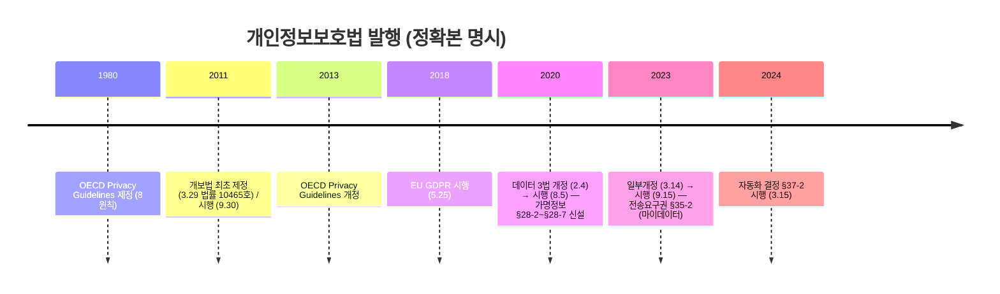
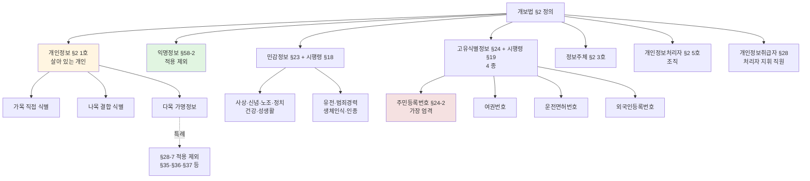
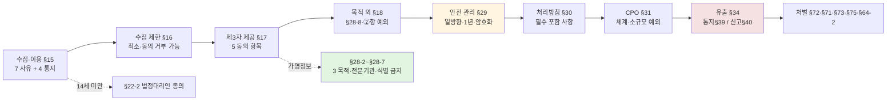
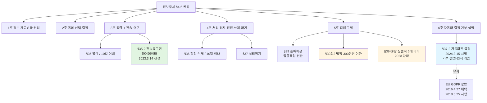
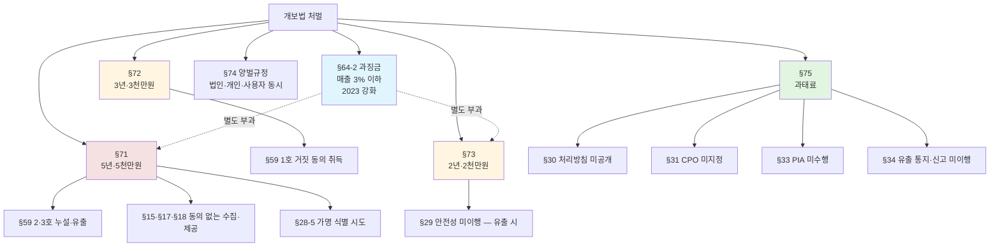

# 08. 개인정보보호법 — 만화책처럼 읽는 §15·§17·§18·§28-2·§29·§30·§31·§35·§37-2·§39·§59·§64-2

> **이 문서를 읽는 법**: *왜 가명정보가 익명정보와 다른지*, *왜 §17 동의 항목이 §15 보다 1개 더 많은지*, *왜 CPO는 원칙 체계이되 소규모는 대표자 간주인지*, *왜 자동화 결정 권리가 2024.3.15 부터 시행되는지*, *왜 정보주체 통지는 모든 유출이고 신고는 1천 명 이상부터인지* — 17 조항의 *의무 주체·시점·적용 대상* 을 따라가면 모든 시험 함정이 풀립니다.
> 정확한 정의·수치·표준 번호·법령 조문은 정확본을 참조: [[cs/information-security/05.management-and-law/08.privacy-law|정확본 08. 개인정보보호 관련 법제]]

> **독자 가정**: *백엔드/풀스택 개발자, 개인정보보호법 처음.* 이미 익숙한 개념 (`회원가입 동의 화면`, `개인정보 처리방침 페이지`, `유출 사고 본인 통지`, `마이데이터 이전`) 을 다리로 씁니다.

> **연결 단원**: 본 단원은 [[cs/information-security/05.management-and-law/05.certifications|05 인증제도]] *영역 3 (개인정보 처리)* 의 *법령 자체 구조*. CPO 는 [[cs/information-security/05.management-and-law/01.security-management-overview|01 §7-2]] / 유출 신고는 [[cs/information-security/05.management-and-law/04.incident-response-and-forensics|04 §4-3]] / PIA 는 [[cs/information-security/05.management-and-law/05.certifications|05 §9]] / §59 는 [[cs/information-security/05.management-and-law/06.security-ethics|06 §6]] / 데이터 3법은 [[cs/information-security/05.management-and-law/07.security-laws|07 §2-3]] cross-ref. **5과목 출제 비중 최상**.

---

## 🎯 시작 전에 — 이미 보고 있는 개인정보보호법

| 매일 보는 것 | 사실은 이 단원의 |
|---|---|
| 회원가입 시 *동의 받기* | §15 ①항 1호 + 4 통지 항목 |
| 회원가입 *최소 정보* (필수·선택 분리) | §16 ①·②·③항 |
| 제3자 제공 동의 (받는 자 명시) | §17 ②항 5 항목 |
| 마케팅 목적 별도 동의 | §18 (목적 외 이용·제공) |
| 14세 미만 *법정대리인* 동의 | §22-2 |
| 마이데이터 (계좌·진료 이전) | §35-2 전송요구권 (2023 신설) |
| 본인 정보 열람·정정 신청 | §35·§36 — 10 일 이내 |
| AI 결정 거부·설명 요구 | §37-2 자동화 결정 (2024.3.15 시행) |
| 사이트 하단 *개인정보 처리방침* | §30 — 7 필수 항목 |
| CPO 임명 공시 | §31 |
| 비밀번호 해시 저장 | §29 + 「안전성 확보조치 기준」 (일방향 의무) |
| 유출 시 *본인 통지 + 위원회 신고* | §34 ①·③항 + 시행령 §39(통지)·§40(신고) |
| 가명정보 결합 (통계청 데이터) | §28-2~§28-7 (2020 데이터 3법) |

> **이 단원의 본질**: 개인정보보호법은 *조항 외우기 ❌* — *정보주체 권리 + 처리자 의무 + 안전성 확보 + 위반 처벌* 의 *4 축*. 시험은 (1) **§2 정의 8 종 (개인정보·가명·익명·민감·고유식별·정보주체·처리자·취급자)** (2) **§3 8 원칙 + OECD 매핑** (3) **§15·§16·§17·§18·§22-2** (4) **§28-2~§28-7 가명정보 특례** (5) **§29 안전성·§30 처리방침·§31 CPO** (6) **§35·§35-2·§36·§37·§37-2·§39 권리** (7) **§33 PIA·§34 유출** (8) **§7~§14 위원회·§72·§71·§73·§75·§64-2 처벌** *8 핵심*을 묻는다.

---

## 📖 에피소드 1 — 법령 개요 + 개정 4 단계 + 9 장 구조

### 장면 1. 법령 개요

| 항목 | 내용 |
|---|---|
| **정식 명칭** | 개인정보 보호법 |
| **약칭** | 개보법, *PIPA* |
| **최초 제정** | *2011.3.29* (법률 *제10465호*) / *2011.9.30 시행* |
| **소관 부처** | *개인정보보호위원회* |

### 장면 2. 4 단계 개정 이력 — *시험 빈출*

| 개정 | 공포일 | 시행일 | 핵심 변경 |
|---|---|---|---|
| **제정** | *2011.3.29* | 2011.9.30 | 한국 최초 *통합 개인정보보호법* — 공공·민간 모두 적용 |
| **데이터 3법** (전부개정) | *2020.2.4* | **2020.8.5** | **가명정보 도입** (§28-2~§28-7), 정통망법 개인정보 조항 흡수, *위원회 중앙행정기관화* |
| **일부개정** | **2023.3.14** | **2023.9.15** | *전송요구권 §35-2 (마이데이터)*, 처벌 정비, 과징금 강화 |
| **자동화 결정 §37-2 시행** | 2023.3.14 | **2024.3.15** | *자동화된 결정에 대한 정보주체의 권리* §37-2 시행 |

### 장면 3. §1 법의 목적

> "이 법은 *개인정보의 처리 및 보호에 관한 사항* 을 정함으로써 *개인의 자유와 권리를 보호* 하고, 나아가 *개인의 존엄과 가치를 구현* 함을 목적으로 한다."

### 장면 4. 법의 9 장 구조

| 장 | 제목 | 핵심 조문 |
|---|---|---|
| **제1장** | 총칙 | §1~§6 (목적·정의·원칙) |
| **제2장** | 개인정보 보호정책의 수립 등 | §7~§14 (개인정보보호위원회·기본계획) |
| **제3장** | 개인정보의 처리 | §15~§28 (수집·이용·제공·위탁·파기) |
| **제3장의2** | *가명정보의 처리에 관한 특례* | §28-2~§28-7 (*2020 신설*) |
| **제4장** | 개인정보의 안전한 관리 | §29~§34 (안전성·처리방침·CPO·영향평가·유출) |
| **제5장** | 정보주체의 권리 보장 | §35~§39-15 (열람·정정·삭제·처리정지·전송요구·자동결정·손해배상) |
| **제6장** | 개인정보 분쟁조정위원회 | §40~§50 |
| **제7장** | 개인정보 단체소송 | §51~§57 |
| **제8장** | 보칙 | §58~§69 |
| **제9장** | 벌칙 | §70~§76 |

### 시험 함정

- "개보법 = 데이터 3법 단일" → ❌ **틀림**. 개보법 + 정통망법 + 신용정보법.
- "데이터 3법 시행?" → *2020.2.4 공포 / 2020.8.5 시행*.
- "전송요구권 신설?" → *2023.3.14 일부개정* (시행 2023.9.15).
- "자동화 결정 §37-2 시행?" → *2024.3.15* (개정은 2023.3.14).
- "개보법 최초 제정?" → *2011.3.29* (법률 제10465호).

---

## 📖 에피소드 2 — §2 정의: 개인정보 vs 가명정보 vs 익명정보

### 장면 1. §2 1호 — 개인정보의 정의

> **개인정보** : *살아 있는 개인* 에 관한 정보로서 다음 각 목 중 하나.
> *가목.* 성명, 주민등록번호 및 영상 등을 통하여 *개인을 알아볼 수 있는 정보*
> *나목.* 해당 정보만으로는 알아볼 수 없더라도 *다른 정보와 쉽게 결합하여 알아볼 수 있는 정보*. 이 경우 쉽게 결합 여부는 *다른 정보의 입수 가능성·시간·비용·기술* 등을 합리적으로 고려
> *다목.* 가목 또는 나목을 *§2 1의2호의 가명처리* 결과 *추가 정보의 사용·결합 없이는 특정 개인을 알아볼 수 없는 정보* (가명정보)

### 장면 2. *살아 있는 개인* — 시험 1순위

> **시험 함정**: 개인정보의 대상은 *살아 있는 개인* — *사망자는 개보법의 대상이 아니다*.

### 장면 3. 가명정보 vs 익명정보 — *적용 차이*

| 구분 | 정의 | 개보법 적용 |
|---|---|---|
| **가명정보** (§2 1의2호 + §2 1호 다목) | *추가 정보의 사용·결합 없이는* 특정 개인을 알아볼 수 없는 정보. *가명처리의 결과물* | *적용 대상* (개인정보) |
| **익명정보** (§58-2) | *시간·비용·기술 등을 합리적으로 고려할 때* 다른 정보를 사용하여도 *더 이상 개인을 알아볼 수 없는 정보* | **적용 제외** |

### 장면 4. *가명 = 적용 / 익명 = 제외* — 핵심

> 가명정보는 통계작성·과학적 연구·공익적 기록보존 등 *목적 한정으로 정보주체 동의 없이 처리 가능* (§28-2). 익명정보는 *개인정보 자체가 아니므로 자유롭게 처리 가능*.

### 시험 함정

- "개인정보 = 사망자 정보 포함" → ❌ **틀림**. *살아 있는 개인* (§2 1호).
- "가명정보 = 익명정보" → ❌ **틀림**. *가명 = 적용 대상 / 익명 = 적용 제외*.
- "익명정보의 법적 근거?" → *§58-2*.
- "쉽게 결합 여부 판단 기준?" → 입수 가능성·시간·비용·기술.

---

## 📖 에피소드 3 — §2 정의: 민감정보·고유식별정보·주민등록번호

### 장면 1. 민감정보 §23 + 시행령 §18

> **민감정보** : *사상·신념, 노동조합·정당의 가입·탈퇴, 정치적 견해, 건강, 성생활* 등에 관한 정보, 그 밖에 *정보주체의 사생활을 현저히 침해할 우려* 가 있는 개인정보로서 대통령령으로 정하는 정보.

### 장면 2. 시행령 §18 추가 민감정보 4 종

| 추가 민감정보 | 법적 근거 |
|---|---|
| **유전정보** | – |
| **범죄경력자료** | [형의 실효 등에 관한 법률] §2 5호 |
| **생체인식정보** | 신체적·생리적·행동적 특징 — *특정 개인을 알아볼 목적의 기술적 수단으로 생성* |
| **인종·민족 정보** | – |

### 장면 3. 고유식별정보 §24 + 시행령 §19 — *4 종*

| 고유식별정보 | 법적 근거 |
|---|---|
| **주민등록번호** | [주민등록법] |
| **여권번호** | [여권법] |
| **운전면허번호** | [도로교통법] |
| **외국인등록번호** | [출입국관리법] |

### 장면 4. *주민등록번호 §24-2* — 가장 엄격

> **시험 1순위**: 주민등록번호는 §24-2 의 *가장 엄격한 요건* — *법률·시행령에 명시된 경우* 또는 *정보주체의 보호를 위해 명백히 필요한 경우* 만 처리 가능.

### 장면 5. 처리 요건 비교

| 정보 유형 | 처리 요건 |
|---|---|
| 민감정보 (§23) | *별도 동의* 또는 *법령 명시·법령 허용* |
| 고유식별정보 (§24) | *별도 동의* 또는 *법령 명시* |
| 주민등록번호 (§24-2) | *법률·시행령 명시* 또는 *명백히 필요한 경우* (가장 엄격) |

### 시험 함정

- "민감정보 = §24" → ❌ **틀림**. *민감정보 = §23* / 고유식별 = §24 / 주민등록번호 = §24-2.
- "고유식별정보 4 종?" → 주민등록·여권·운전면허·외국인등록번호.
- "생체인식정보 = 민감정보" → ⭕ (시행령 §18).
- "주민등록번호 = 고유식별정보 + §24-2" → ⭕.

---

## 📖 에피소드 4 — §2 정의: 정보주체·처리자·취급자·처리

### 장면 1. 정보주체·처리자·취급자 — *시험 빈출 함정*

| 용어 | 정의 (§2) | 사례 |
|---|---|---|
| **정보주체** (§2 3호) | 처리되는 정보에 의하여 알아볼 수 있는 사람으로서 그 정보의 *주체가 되는 사람* | 회원가입한 이용자, 환자, 직원 |
| **개인정보처리자** (§2 5호) | 업무를 목적으로 *개인정보파일을 운용하기 위하여 스스로 또는 다른 사람을 통하여 개인정보를 처리* 하는 *공공기관·법인·단체 및 개인 등* | 회사·병원·학교·정부기관 |
| **개인정보취급자** (§28) | 개인정보처리자의 *지휘·감독을 받아* 개인정보를 처리하는 *임직원·파견근로자·시간제근로자 등* | 개인정보 시스템 운영자, 콜센터 직원 |
| **처리** (§2 2호) | 개인정보의 *수집·생성·연계·연동·기록·저장·보유·가공·편집·검색·출력·정정·복구·이용·제공·공개·파기·그 밖에 이와 유사한 행위* | – |

### 장면 2. *처리자 ≠ 취급자* — 핵심 구분

> **시험 1순위**: *개인정보처리자 = 사용자 (조직)* / *개인정보취급자 = 처리자의 지휘 하의 직원*. 둘은 *완전히 다른 주체*.

### 장면 3. 처리 17 행위

> *수집·생성·연계·연동·기록·저장·보유·가공·편집·검색·출력·정정·복구·이용·제공·공개·파기 + 유사 행위*. 광범위 정의 — 거의 *모든 활용 행위* 가 처리.

### 시험 함정

- "정보주체 = 개인정보처리자" → ❌ **틀림**. *정보주체 = 정보의 주체* / *처리자 = 운용 조직*.
- "개인정보처리자 = 개인정보취급자" → ❌ **틀림**. *처리자 = 조직* / *취급자 = 직원*.
- "처리의 정의 출처?" → *§2 2호*.
- "처리자의 출처?" → *§2 5호*.

---

## 📖 에피소드 5 — §3 8 원칙 + OECD 8 원칙 매핑

### 장면 1. §3 — 한국 8 원칙

| 호 | 원칙 |
|---|---|
| **1호** | 처리 목적을 명확하게 하고 *목적에 필요한 범위에서 최소한* 의 개인정보만 *적법하고 정당* 하게 수집 |
| **2호** | 처리 목적에 *적합* 하게 처리하고 *목적 외 활용 금지* |
| **3호** | 처리 목적에 필요한 범위에서 *정확성·완전성·최신성* 보장 |
| **4호** | 권리 침해 가능성과 위험 정도를 고려하여 *안전하게 관리* |
| **5호** | *처리방침 등 공개* + 열람청구권 등 정보주체의 권리 보장 |
| **6호** | *사생활 침해를 최소화* 하는 방법으로 처리 |
| **7호** | 가능한 경우 *익명·가명 처리 우선* (목적 달성 가능 범위) |
| **8호** | 책임과 의무 준수 + *신뢰* 받기 위한 노력 |

### 장면 2. OECD 8 원칙 (*1980 제정 / 2013 개정*) 매핑

[OECD Guidelines on the Protection of Privacy and Transborder Flows of Personal Data] (1980 / 2013) 의 8 원칙을 한국법으로 수용.

| OECD 8 원칙 | 영문 | 개보법 §3 매핑 |
|---|---|---|
| 수집제한 | Collection Limitation | 1호 (최소 수집·적법·정당) |
| 정보 정확성 | Data Quality | 3호 (정확성·완전성·최신성) |
| 목적 명확화 | Purpose Specification | 1호·2호 (목적 명확화·목적 외 사용 금지) |
| 이용 제한 | Use Limitation | 2호 (목적 외 활용 금지) |
| 안전성 확보 | Security Safeguards | 4호 (안전한 관리) |
| 공개 | Openness | 5호 (처리방침 등 공개) |
| 개인 참여 | Individual Participation | 5호 (정보주체 권리 보장) |
| 책임 | Accountability | 8호 (책임·의무 준수) |

### 시험 함정

- "개보법 §3 = 7 원칙" → ❌ **틀림**. *8 원칙*.
- "OECD 8 원칙 발행?" → *1980 제정 / 2013 개정*.
- "익명·가명 처리 우선 원칙?" → *§3 7호*.
- "최소 수집 원칙?" → *§3 1호*.

---

## 📖 에피소드 6 — §15·§16·§17·§18·§22-2 수집·이용·제공

### 장면 1. §15 — 수집·이용 7 사유

| 호 | 적법 사유 |
|---|---|
| **1호** | *정보주체의 동의* |
| **2호** | 법률에 특별한 규정 / 법령상 의무 이행을 위해 불가피 |
| **3호** | 공공기관이 *법령상 소관 업무 수행을 위해 불가피* |
| **4호** | *계약의 이행 또는 체결을 위한 절차* |
| **5호** | *급박한 생명·신체·재산의 이익* + 사전 동의 불가 |
| **6호** | *정당한 이익* + 정보주체 권리보다 명백히 우선 |
| **7호** | *공중위생 등 공공의 안전과 안녕* + 긴급 필요 |

### 장면 2. §15 ②항 — 동의 시 *4 통지 항목*

| 통지 항목 |
|---|
| 1. 개인정보의 *수집·이용 목적* |
| 2. *수집하려는 개인정보의 항목* |
| 3. *보유·이용 기간* |
| 4. *동의를 거부할 권리 + 거부 시 불이익* |

### 장면 3. §16 — 수집 제한 *3 항*

| 항 | 내용 |
|---|---|
| **§16 ①항** | 수집하는 경우 *목적에 필요한 최소한* 의 개인정보 수집 |
| **§16 ②항** | 동의를 받아 수집 시 *최소한 외 정보 수집에는 동의하지 않을 수 있음* 을 알리고 동의 |
| **§16 ③항** | 정보주체가 *최소한 외 정보 수집 동의 거부* 를 이유로 *재화·서비스 제공 거부 금지* |

### 장면 4. §17 — 제3자 제공 — *5 동의 항목*

| 항목 |
|---|
| 1. *받는 자* |
| 2. *받는 자의 이용 목적* |
| 3. *제공 항목* |
| 4. *받는 자의 보유·이용 기간* |
| 5. *동의 거부권·불이익* |

> **§17 의 동의 항목은 §15 보다 *1개 많다* (받는 자 추가)** = 5 항목.

### 장면 5. §18 — 목적 외 이용·제공 (②항 10호, 4호 삭제)

| 항 | 내용 |
|---|---|
| **§18 ①항** | §15 ①항의 범위를 초과하여 이용하거나 §17 ①항 및 §28-8 ①항의 범위를 초과하여 제3자에게 제공 *금지* |
| **§18 ②항** | 1~3호(동의·법률·급박) 및 5~10호(공공기관 한정: 업무·조약·범죄수사·법원·형 집행 등). **4호(통계·연구)는 2020 삭제** — 통계·과학연구·공익기록보존은 **§28-2 가명정보** 특례 |

### 장면 6. §22-2 — 14세 미만 아동의 *법정대리인 동의*

> 만 *14세 미만 아동* 의 개인정보 처리 시 *법정대리인의 동의* 를 받아야 하며 *법정대리인의 동의 여부 확인* 의무. 법정대리인 동의를 받기 위한 *최소한 정보는 아동으로부터 직접 수집 가능* (예: 법정대리인 성명·연락처).

### 장면 7. §15 vs §17 vs §18 — 시험 빈출

| 비교 항목 | §15 (수집·이용) | §17 (제공) | §18 (목적 외) |
|---|---|---|---|
| **적용 단계** | 처리자가 직접 수집·이용 | *제3자에게 전달* | 수집 목적과 *다른 용도* |
| **동의 항목** | *4 항목* | *5 항목* (받는 자 추가) | 별도 동의 + 추가 제한 |
| **적법 사유 수** | 7 사유 | 2 사유 (동의 + §15 일부) | ②항 10호(4호 삭제) — 공공기관 한정 5~10호 |

### 시험 함정

- "§17 동의 항목 = 4 개" → ❌ **틀림**. *5 개* ("받는 자" 추가).
- "§16 ③항 = 동의 거부 시 서비스 거부 가능" → ❌ **틀림**. *서비스 거부 금지*.
- "14세 미만 동의 = 본인" → ❌ **틀림**. *법정대리인* (§22-2).
- "§18 = 목적 외 이용 자유" → ❌ **틀림**. *원칙적 금지* + *②항 예외 한정*. 통계·연구는 **§28-2**.

---

## 📖 에피소드 7 — 가명정보 특례 §28-2~§28-7 (2020 신설)

### 장면 1. §28-2 — 가명정보 처리 *3 목적*

> "개인정보처리자는 *통계작성·과학적 연구·공익적 기록보존* 등을 위하여 *정보주체의 동의 없이* 가명정보를 처리할 수 있다."

| 가능 목적 |
|---|
| *통계작성* (상업적 목적 포함) |
| *과학적 연구* (산업적 연구 포함) |
| *공익적 기록보존* |

### 장면 2. §28-3 — 결합은 *지정 전문기관* 만

| 항 | 내용 |
|---|---|
| **§28-3 ①항** | 서로 다른 처리자 간 가명정보 결합은 *개인정보보호위원회 또는 관계 중앙행정기관의 장이 지정하는 전문기관* 이 수행 |
| **§28-3 ②항** | 결합 정보 *외부 반출* 시 *전문기관의 장의 승인* 필수 |

### 장면 3. §28-4 — 안전조치의무 3 항목

| 의무 |
|---|
| 가명정보의 *기술적·관리적·물리적* 안전조치 |
| 처리 *목적·기간·조치 등 기록·보관* |
| **추가 정보의 분리 보관·관리** |

### 장면 4. §28-5 — *식별 시도 금지* 시험 1순위

| 항 | 내용 |
|---|---|
| **§28-5 ①항** | *누구든지 특정 개인을 알아보기 위한 목적으로 가명정보를 처리하여서는 아니 됨* |
| **§28-5 ②항** | 처리 과정에서 *특정 개인을 알아볼 수 있는 정보가 생성된 경우 즉시 처리 중지 + 지체 없이 회수·파기* |

### 장면 5. §28-6 — 과징금

> 가명정보 특례 위반 시 *매출액의 3 % 이하* 과징금 부과 가능.

### 장면 6. §28-7 — 적용 제외 7 조항

가명정보에 대해서는 다음 조항의 *적용 제외*.

| 적용 제외 조항 | 의미 |
|---|---|
| §20 | 정보주체 이외로부터 수집한 출처 통지 |
| §21 | 개인정보의 파기 |
| §27 | 영업양도 등에 따른 이전 제한 |
| **§34 ①항** | 유출 등의 통지 (일부 제외) |
| **§35** | 개인정보의 *열람* |
| **§36** | 개인정보의 *정정·삭제* |
| **§37** | 개인정보의 *처리정지* 등 |

> **시험 핵심**: 가명정보는 *통상의 개인정보 권리 (열람·정정·삭제·처리정지) 가 적용되지 않는다*.

### 시험 함정

- "가명정보 = 정보주체 동의 필요" → ❌ **틀림**. *§28-2 3 목적 시 동의 없이*.
- "가명정보 결합 = 자유" → ❌ **틀림**. *지정 전문기관* 수행 (§28-3).
- "가명정보 식별 시도 = 가능" → ❌ **틀림**. *§28-5 ①항 누구든지 금지*.
- "가명정보 열람·정정·삭제 = 적용" → ❌ **틀림**. *§28-7 적용 제외*.
- "§28-6 과징금 상한?" → *매출액의 3 %*.

---

## 📖 에피소드 8 — §29 안전성 + §31 CPO

### 장면 1. §29 — 안전성 확보조치

> "개인정보처리자는 개인정보가 *분실·도난·유출·위조·변조 또는 훼손* 되지 아니하도록 *내부 관리계획 수립·접속기록의 보관 등* 대통령령으로 정하는 바에 따라 *기술적·관리적 및 물리적 조치* 를 하여야 한다."

### 장면 2. 「개인정보의 안전성 확보조치 기준」 (개인정보보호위원회 고시) 7 영역

| 영역 | 핵심 통제 |
|---|---|
| **내부 관리계획** | 보호조직, 보호책임자 지정, 처리방침, 위험분석, 점검·훈련 |
| **접근 권한의 관리** | 권한 부여·변경·말소 *기록 보관* (5 년 또는 시행령 기준), 비밀번호 작성 규칙 |
| **접근 통제** | 안전한 인증, 외부 접근 통제, 무선망 보호, *망분리* (일정 규모 이상) |
| **개인정보의 암호화** | 정보통신망 *전송* 암호화, *고유식별정보 저장* 암호화, *비밀번호 = 일방향 (해시)* |
| **접속기록의 보관·점검** | *1 년 이상* (시행령 기준), 위·변조 방지, 정기 점검 |
| **악성프로그램 방지** | 백신·보안 업데이트 |
| **물리적 안전조치** | 보호구역 지정, 매체 통제, 출력·복사 통제 |

> *주의*: 위 기준의 구체적 수치 (보관 기간·암호화 적용 범위·망분리 의무 규모 등) 는 「개인정보의 안전성 확보조치 기준」 고시의 정기 개정으로 변경. 시험 응시 시점에 *개인정보보호위원회에서 직접 확인*.

### 장면 3. *비밀번호 일방향 (해시)* — 시험 1순위

> **시험 함정**: 비밀번호는 *일방향 암호화 (해시)* 의무. *양방향 암호화 ❌*. 일방향 = 복호화 불가.

### 장면 4. §31 — CPO 지정 의무

> "개인정보처리자는 개인정보의 처리에 관한 업무를 *총괄해서 책임* 질 *개인정보 보호책임자* 를 지정하여야 한다. **다만**, 종업원 수·매출액 등 **시행령 §32 기준 소규모 처리자** 는 지정하지 아니할 수 있다."

> §31 ②항: 위 단서에 해당하여 별도 지정하지 않는 경우 **사업주 또는 대표자가 CPO** 가 된다.

### 장면 5. §31 ③항 — CPO 7 업무

| 호 | 업무 |
|---|---|
| **1호** | 개인정보 보호 *계획의 수립 및 시행* |
| **2호** | 개인정보 처리 *실태 및 관행의 정기적 조사 및 개선* |
| **3호** | *불만의 처리 및 피해 구제* |
| **4호** | 개인정보 *유출 및 오·남용 방지를 위한 내부통제시스템 구축* |
| **5호** | 개인정보 *보호 교육 계획의 수립 및 시행* |
| **6호** | *개인정보파일의 보호 및 관리·감독* |
| **7호** | 그 밖에 대통령령으로 정한 업무 |

### 장면 6. CISO vs CPO — 시험 빈출

| 비교 항목 | CISO | CPO |
|---|---|---|
| **법적 근거** | [정통망법] §45-3 | *[개인정보보호법] §31* |
| **보호 대상** | 정보보호 일반 (CIA) | *개인정보* |
| **임명 의무자** | 일정 규모 이상 정보통신서비스 제공자 | **원칙** CPO 체계 / **소규모 예외** 시 **대표자 간주** (§31 ①항 단서·②항, 시행령 §32) |
| **신고 의무** | 과기정통부 신고 | (지정만, 일반 신고 의무 아님) |
| **자격 요건** | 정보보호·정보기술 분야 경력 (시행령) | *사업주·대표자·임원* 등 (시행령 §32) |

### 시험 함정

- "비밀번호 양방향 암호화" → ❌ **틀림**. *일방향 (해시)* 의무.
- "안전성 확보조치 = 정통망법" → ❌ **틀림**. *개보법 §29 + 시행령 §30 + 안전성 확보조치 기준 고시*.
- "접속기록 보관 = 6 개월" → ❌ **틀림**. *1 년 이상* (시행령 기준).
- "CPO 일정 규모 이상만" → ❌ **틀림**. *원칙 CPO 체계* — **소규모는 별도 지정 예외**, 미지정 시 **대표자가 CPO**.
- "CPO = 모든 처리자 별도 지정" → ❌ **틀림**. 시행령 §32 **소규모 예외** + §31 ②항 **대표자 간주**.
- "CPO 업무 수?" → *7 개*.

---

## 📖 에피소드 9 — §30 처리방침: 7 필수 항목

### 장면 1. §30 ①항 — 처리방침 수립·공개 의무

> "개인정보처리자는 다음 각 호의 사항이 포함된 *개인정보의 처리 방침* 을 정하여야 한다. 이 경우 *공공기관은 §32 에 따라 등록 대상이 되는 개인정보파일에 대하여 처리방침을 정한다*."

### 장면 2. §30 ①항 — *7 필수 항목* 시험 빈출

| 호 | 항목 |
|---|---|
| **1호** | 개인정보의 *처리 목적* |
| **2호** | *처리 및 보유 기간* |
| **3호** | *제3자 제공* 에 관한 사항 (해당 시) |
| **3의2호** | *파기절차 및 파기방법* |
| **4호** | *위탁* 에 관한 사항 (해당 시) |
| **4의2호** | *정보주체와 법정대리인의 권리·의무 및 행사방법* |
| **5호** | *개인정보 보호책임자의 성명* 또는 부서·연락처 |
| **6호** | 인터넷 접속정보파일 등 개인정보를 *자동으로 수집하는 장치* (쿠키 등) 의 설치·운영 및 그 거부 (해당 시) |
| **7호** | 그 밖에 대통령령으로 정한 사항 |

### 장면 3. §30 ②항 — 공개 방법

처리방침은 다음 방법으로 *정보주체가 쉽게 확인할 수 있도록* 공개.

| 공개 방법 |
|---|
| 개인정보처리자의 *인터넷 홈페이지에 게재* |
| 홈페이지가 없는 경우, 사업장 등 *정보주체에게 보일 수 있는 곳에 게시 또는 비치* (시행령 §31) |

### 장면 4. 「표준 개인정보 처리방침」

「표준 개인정보 처리방침」 (개인정보보호위원회 고시) 은 *처리방침 작성을 위한 표준 양식* 을 제공.

### 시험 함정

- "처리방침 필수 항목 = 5 개" → ❌ **틀림**. *7 개* (§30 ①항).
- "처리방침 = §31" → ❌ **틀림**. *§30* (§31 = CPO).
- "처리방침 공개 방법?" → 홈페이지 게재 또는 사업장 게시.
- "표준 처리방침 운영 주체?" → *개인정보보호위원회 고시*.

---

## 📖 에피소드 10 — 정보주체 권리 §4·§35·§35-2·§36·§37·§37-2

### 장면 1. §4 정보주체의 권리 6 호

| 호 | 권리 |
|---|---|
| **1호** | 정보를 *제공받을 권리* |
| **2호** | *동의 여부·범위 선택·결정* |
| **3호** | *처리 여부 확인 + 열람 (사본의 발급 포함) + 전송 요구* |
| **4호** | *처리 정지·정정·삭제·파기 요구* |
| **5호** | *피해 구제* |
| **6호** | *완전히 자동화된 처리에 따른 결정 거부 + 설명 요구* |

### 장면 2. §35 — 열람권 *10 일 이내*

| 항 | 내용 |
|---|---|
| **§35 ①항** | 처리자에게 *열람 요구 가능* |
| **§35 ②항** | 공공기관은 *개인정보보호위원회에도* 열람 요구 가능 |
| **§35 ③항** | 처리자는 요구를 받은 날부터 **10 일 이내** 에 열람 가능하도록 함 |
| **§35 ④항** | 일정 사유 시 열람 *제한·거절* (법률·국가안보·공공이익) |

### 장면 3. §35-2 — *전송요구권 (마이데이터)* — *2023 신설*

[개인정보보호법] §35-2 (*2023.3.14 일부개정 신설*).

> 정보주체는 처리자에 대하여 *본인에 관한 개인정보를 본인 또는 본인이 지정한 다른 처리자나 개인정보관리 전문기관에게 전송할 것을 요구* 할 수 있다.

> **마이데이터 (MyData)** 의 법적 근거 — 정보주체가 자신의 개인정보를 *다른 사업자로 이동* 시킬 수 있는 권리.

### 장면 4. §36 — 정정·삭제 *10 일*

| 항 | 내용 |
|---|---|
| **§36 ①항** | 처리자에게 *정정·삭제* 요구 가능 (단 다른 법령에서 수집 대상 명시 시 *삭제 요구 불가*) |
| **§36 ②항** | 처리자는 *10 일 이내* 조사·결과 통지 |

### 장면 5. §37 — 처리정지

| 항 | 내용 |
|---|---|
| **§37 ①항** | 처리자에 대하여 *처리 정지 요구* |
| **§37 ②항** | 일정 사유 시 *처리정지 거절 가능* (법률·생명·신체·재산·공공기관 소관업무) |
| **§37 ③항** | 거절 시 *사유 통지* |

### 장면 6. §37-2 — *자동화된 결정에 대한 권리* — *2024.3.15 시행*

[개인정보보호법] §37-2 (2023.3.14 일부개정으로 신설, *2024.3.15 시행*).

> 정보주체는 *완전히 자동화된 시스템 (인공지능 기술 적용 시스템 포함) 으로 개인정보를 처리하여 이루어지는 결정* 으로서 자신의 *권리 또는 의무에 중대한 영향을 미치는 경우* 에는 해당 결정을 *거부* 하거나 그에 대한 *설명 등* 을 요구할 수 있다.

| 권리 | 내용 |
|---|---|
| **거부권** | 자동화 결정 자체의 거부 |
| **설명요구권** | 결정의 기준·근거 등에 대한 설명 요구 |
| **인적 개입 요구** | 자동화 결정에 *사람의 개입* 요구 |

EU GDPR §22 (*Article 22 — Automated individual decision-making, including profiling*, 2016.4.27 채택 / 2018.5.25 시행) 와 *유사한 권리*.

### 시험 함정

- "열람 처리 기한 = 30 일" → ❌ **틀림**. *10 일 이내* (§35 ③항).
- "전송요구권 = 2020 신설" → ❌ **틀림**. *2023.3.14 신설* (§35-2).
- "자동화 결정 권리 = 2023 시행" → ❌ **틀림**. *2024.3.15 시행* (§37-2). 개정은 2023.3.14.
- "정정·삭제 = 모든 정보 가능" → ❌ **틀림**. 다른 법령 *수집 대상 명시* 시 삭제 불가.

---

## 📖 에피소드 11 — §39 손해배상 + §33 PIA + §34 유출

### 장면 1. §39 손해배상 — 시험 빈출

| 항 | 내용 |
|---|---|
| **§39 ①항** | 처리자가 법 위반으로 손해 발생 시 *일반 손해배상* 청구 가능. 처리자는 *고의 또는 과실이 없음을 입증* 하지 않으면 책임 면제 불가 (*입증책임 전환*) |
| **§39 ③항** | **징벌적 손해배상** — *고의·중대한 과실* 로 유출 등 시 *손해액의 5 배* 를 넘지 않는 범위 (2023 강화) |
| **§39 ④항** | 제3항 배상액 산정 시 법원이 고려할 *8 가지 사항* |
| **§39의2 ①항** | **법정손해배상** — 1인당 **300 만원 이하** 상당액 청구 가능 (*실제 손해액 입증 곤란 시*) |

### 장면 2. §33 — PIA 의무

> "공공기관의 장은 대통령령으로 정하는 기준에 해당하는 *개인정보파일* 의 운용으로 인하여 *정보주체의 개인정보 침해가 우려* 되는 경우에는 *영향평가를 하고 그 결과를 개인정보보호위원회에 제출* 하여야 한다."

### 장면 3. PIA 의무 대상 (시행령 §35) — 5 만/50 만/100 만

| 분류 | 기준 |
|---|---|
| **1호** | *5만 명 이상* 의 정보주체에 관한 *민감정보 또는 고유식별정보* 의 처리가 수반되는 개인정보파일 |
| **2호** | 다른 개인정보파일과 연계 시 *50만 명 이상* 의 정보주체에 관한 개인정보가 포함되는 개인정보파일 |
| **3호** | *100만 명 이상* 의 정보주체에 관한 개인정보파일 |

> **공공기관 의무**. *민간은 자율*.

### 장면 4. §34 ①항 — 정보주체 통지 5 항목

> "개인정보처리자는 개인정보가 *분실·도난·유출* (이하 '유출 등') 되었음을 알게 되었을 때에는 **지체 없이** 해당 정보주체에게 다음 각 호의 사항을 알려야 한다."

| 호 | 통지 항목 |
|---|---|
| **1호** | *유출 등이 된 개인정보의 항목* |
| **2호** | *유출 등이 된 시점과 그 경위* |
| **3호** | *피해 최소화 방법* |
| **4호** | 처리자의 *대응조치 및 피해 구제절차* |
| **5호** | 정보주체에게 피해가 발생한 경우 *신고 등을 접수할 수 있는 담당부서 및 연락처* |

### 장면 5. §34 ③항 — 위원회·KISA 신고 (시행령 §40)

[개인정보 보호법 시행령] §40 의 신고 대상 규모. (*2023.9.12 개정 — 통지=§39, 신고=§40*)

| 분류 | 기준 |
|---|---|
| **1호** | *1 천 명 이상* 의 정보주체에 관한 개인정보 유출 |
| **2호** | *민감정보 또는 고유식별정보* 유출 (규모 무관) |
| **3호** | 처리시스템 또는 개인정보 취급자가 처리에 사용하는 정보기기 등에 대한 *외부로부터의 불법적인 접근* 에 의해 개인정보가 유출 등이 된 경우 (규모 무관) |

### 장면 6. *통지 vs 신고 차이* — 시험 1순위

> **§34 ①항 통지** = *모든 유출* (규모 무관) → 정보주체. (시행령 **§39**)
>
> **§34 ③항 신고** = *1 천 명 이상 / 민감·고유 / 외부 침해* → 위원회·KISA. (시행령 **§40**)

### 시험 함정

- "법정손해배상 = 1 천만원" → ❌ **틀림**. *300 만원 이하* (**§39의2**).
- "법정손해배상 = §39 ③항" → ❌ **틀림**. §39 ③항 = **징벌적 5 배**.
- "징벌적 손해배상 = 3 배" → ❌ **틀림**. *5 배 이하* (**§39 ③항**, 2023 강화).
- "징벌적 손해배상 = §39 ④항" → ❌ **틀림**. **§39 ③항**.
- "유출 신고 기준 = 시행령 §39" → ❌ **틀림**. **통지=§39 / 신고=§40**.
- "유출 시 정보주체 통지 = 1천 명 이상" → ❌ **틀림**. *통지 = 모든 유출*. 신고가 1천 명 이상.
- "PIA 민간 의무" → ❌ **틀림**. *공공기관 의무*. 민간은 자율.
- "§39 ①항 = 정보주체 입증" → ❌ **틀림**. *입증책임 전환* (처리자가 무과실 입증).

---

## 📖 에피소드 12 — §7~§14 개인정보보호위원회

### 장면 1. §7 — 위원회의 *지위* (2020 격상)

> "개인정보 보호에 관한 사무를 *독립적으로 수행* 하기 위하여 **국무총리 소속** 으로 개인정보보호위원회를 둔다. 보호위원회는 「정부조직법」 §2 에 따른 **중앙행정기관** 으로 본다."

> **2020 데이터 3법 개정으로 보호위원회는 *중앙행정기관* 으로 격상**. 이전: *대통령 소속 합의제 행정기관*.

### 장면 2. §7-2 — *9 명 구성*

| 구성 | 인원 |
|---|---|
| **위원장** | *1 명* (장관급) |
| **부위원장** | *1 명* (차관급) |
| **위원** | *7 명* |
| **총** | **9 명** |

### 장면 3. §7-8 — 소관 사무 *8 호*

| 호 | 사무 |
|---|---|
| **1호** | 개인정보 *법령의 개선* |
| **2호** | 개인정보 *정책·제도·계획* 수립·집행 |
| **3호** | *권리침해 조사 및 처분* |
| **4호** | 개인정보 *고충처리·권리구제 + 분쟁의 조정* |
| **5호** | *국제기구·외국 기구와의 교류·협력* |
| **6호** | 법령·정책·실태 *조사·연구·교육·홍보* |
| **7호** | *기술 개발 지원·전문인력 양성* |
| **8호** | 그 밖에 법령에 따른 사무 |

### 장면 4. *국무총리 소속 + 중앙행정기관* — 시험 함정

> **위원회 = *국무총리 소속***. 대통령 소속 ❌. *중앙행정기관* (정부조직법 §2).

### 시험 함정

- "보호위원회 = 대통령 소속" → ❌ **틀림**. *국무총리 소속 중앙행정기관* (2020 데이터 3법 격상).
- "위원 수 = 7 명" → ❌ **틀림**. *총 9 명* (위원장 1 + 부위원장 1 + 위원 7).
- "위원회 격상 시점?" → *2020 데이터 3법*.
- "위원회 소관 사무 호 수?" → *8 호*.

---

## 📖 에피소드 13 — 처벌: §72·§71·§73·§75·§64-2 + §74 양벌

### 장면 1. 처벌 9 조항 — 시험 빈출 1순위

| 위반 행위 | 조문 | 형량 |
|---|---|---|
| **§59 1호 위반** (거짓 동의 취득) | *§72 2호* | *3 년 이하 / 3 천만원 이하* |
| **§59 2·3호 위반** (누설·이용·유출 등) | *§71 9·10호* | 5 년 이하 / 5 천만원 이하 |
| **§15·§17·§18 위반** (동의 없는 수집·이용·제공) | *§64-2* | **과징금** 매출 3% 이하 (2023 — **주된 제재**) |
| **§17·§18 악질적 위반** | *§71* | 5 년 이하 / 5 천만원 이하 |
| **§28-5 ①항 위반** (가명정보 식별 시도) | *§71* | 5 년 이하 / 5 천만원 이하 |
| **§29 위반** (안전성 확보조치 미이행 — 유출 시) | *§73* | *2 년 이하 / 2 천만원 이하* |
| **§30 위반** (처리방침 미공개) | *§75* | *과태료* |
| **§31 위반** (CPO 미지정) | *§75* | 과태료 |
| **§33 위반** (PIA 미수행, 공공기관) | *§75* | 과태료 |
| **§34 위반** (유출 통지·신고 미이행) | *§75* | 과태료 |
| **§74 (양벌규정)** | *§74* | *법인·개인·사용자에게 동시 처벌* |

### 장면 2. §64-2 — *과징금 매출 3 % 이하* (2023 강화)

> "개인정보보호위원회는 처리자가 다음 각 호의 어느 하나에 해당하는 경우에는 *전체 매출액의 100분의 3 (3%) 이하* 에 해당하는 금액을 *과징금* 으로 부과할 수 있다."

> *주의*: 과징금 상한 (전체 매출액의 *3 %*) 은 *2023.3.14 개정으로 강화* 된 수치이며, 시험 응시 시점에 [개인정보보호법] §64-2 현행본 직접 확인 필요.

### 장면 3. *형량 차등 외우는 한 줄*

> **§59 1호 = §72 (3 년·3 천만원) / §59 2·3호·§28-5 = §71 (5 년·5 천만원) / §15·§17·§18 = §64-2 과징금 (매출 3%) > §29 = §73 (2 년·2 천만원) > §30·§31·§33·§34 = §75 (과태료)**.
>
> **별도 — §64-2 과징금 매출 3 % 이하** (2023 강화).

### 장면 4. §74 양벌규정 — 시험 함정

> *법인·개인·사용자에게 동시 처벌*. 행위자뿐 아니라 *조직 책임자도 처벌*.

### 시험 함정

- "§59 위반 = 모두 §71" → ❌ **틀림**. *1호만 §72* (3 년·3 천만원). *2·3호 = §71* (5 년·5 천만원).
- "§15·§17·§18 위반 = §71 5년" → ❌ **틀림**. **§64-2 과징금** (매출 3%)이 주된 제재.
- "§29 위반 = §71" → ❌ **틀림**. *§73* (2 년·2 천만원).
- "처리방침 미공개 = §71" → ❌ **틀림**. *§75 과태료*.
- "과징금 상한 = 1 %" → ❌ **틀림**. *3 %* (§64-2, 2023 강화).
- "양벌규정 = 행위자만" → ❌ **틀림**. *법인·개인·사용자 동시*.

---

## 📑 종합 비교 (에피소드 6·7·8·10·11·13 정리)

개보법 *17 핵심 조항 + 4 영역* 종합.

| 영역 | 핵심 조항 | 핵심 |
|---|---|---|
| **수집·이용·제공** | §15·§16·§17·§18·§22-2 | 7·3·5 / §18=§28-8·②항 10호 / §17 = 5 동의 / 14 세 미만 법정대리인 |
| **가명정보** | §28-2~§28-7 | 3 목적 동의 없이 / 결합 = 지정 전문기관 / 식별 시도 금지 / 7 조항 적용 제외 |
| **안전성·CPO·처리방침** | §29·§30·§31 | 비밀번호 일방향 / §30 ①항 필수 포함(1~7호+3의2·4의2) / CPO 체계·소규모 예외 |
| **권리** | §35·§35-2·§36·§37·§37-2·§39·§39의2 | 10 일 / 마이데이터 (2023) / 자동화 결정 (2024.3.15) / §39의2 300만·§39 ③ 5배 |
| **PIA·유출·위원회** | §33·§34·§7~§14 | 공공 5만/50만/100만 / 통지(§39) 모든·신고(§40) 1천 / 국무총리 소속 9 명 |
| **처벌** | §59 1호=§72 (3년) / §59 2·3호=§71 (5년) / §15·§17·§18=§64-2 / §29=§73 / §75 과태료 |

> **읽는 법**: 처리자의 *생애주기 의무* — 수집(§15) → 제공(§17) → 안전 관리(§29) → 처리방침 공개(§30) → CPO 지정(§31) → 권리 응대(§35~§37) → 유출 시 통지·신고(§34) → 위반 시 처벌(§72·§71·§73·§75·§64-2). 정보주체는 *6 권리* (§4) 행사.

---

## 🗺️ 마인드맵 1 — 개인정보보호법 시간선



---

## 🗺️ 마인드맵 2 — §2 정의 8 종 분류



---

## 🗺️ 마인드맵 3 — 개인정보 처리 흐름 + 적용 조항



---

## 🗺️ 마인드맵 4 — 정보주체 6 권리 (§4) + 처리 기한



---

## 🗺️ 마인드맵 5 — 처벌 차등 매트릭스



---

## 🗂️ 키워드 클러스터

### 개정 4 단계 발행 시점

```
최초 제정         — 2011.3.29 (법률 제10465호) / 2011.9.30 시행
데이터 3법       — 2020.2.4 공포 / 2020.8.5 시행 (가명정보 §28-2~§28-7 신설)
일부개정         — 2023.3.14 공포 / 2023.9.15 시행 (전송요구권 §35-2)
자동화 결정 §37-2 — 2023.3.14 개정 / 2024.3.15 시행

OECD Privacy Guidelines  — 1980 제정 / 2013 개정
EU GDPR §22             — 2016.4.27 채택 / 2018.5.25 시행
```

### §2 정의 8 종

```
개인정보 §2 1호       — 살아 있는 개인 / 가목 직접 / 나목 결합 / 다목 가명
가명정보 §2 1의2호    — 추가 정보 결합 없이 식별 불가 / 적용 대상
익명정보 §58-2        — 적용 제외
민감정보 §23          — 사상·신념·노조·정치·건강·성생활 + 시행령 §18 (유전·범죄경력·생체·인종)
고유식별정보 §24      — 4 종 (주민등록·여권·운전면허·외국인등록)
주민등록번호 §24-2    — 가장 엄격 (법률·시행령 명시 또는 명백히 필요)
정보주체 §2 3호       — 정보의 주체
개인정보처리자 §2 5호 — 운용 조직 (공공기관·법인·단체·개인)
개인정보취급자 §28    — 처리자의 지휘 직원
처리 §2 2호           — 17 행위 (수집·생성·연계·연동·기록·저장·보유·가공·편집·검색·출력·정정·복구·이용·제공·공개·파기)
```

### §3 8 원칙 + OECD 매핑

```
1호 최소수집·적법·정당     ← Collection Limitation
2호 목적 적합·외 활용 금지  ← Purpose Specification + Use Limitation
3호 정확성·완전성·최신성    ← Data Quality
4호 안전 관리              ← Security Safeguards
5호 처리방침 공개·권리 보장 ← Openness + Individual Participation
6호 사생활 침해 최소화
7호 익명·가명 처리 우선
8호 책임·신뢰              ← Accountability
```

### §15·§16·§17·§18·§22-2 처리

```
§15 수집·이용 7 사유   — 동의·법률·공공·계약·급박·정당이익·공중위생
§15 ②항 4 통지        — 목적·항목·기간·거부권
§16 ①·②·③항          — 최소수집·동의 거부 가능·서비스 거부 금지
§17 제3자 제공 5 동의  — 받는 자·이용목적·항목·기간·거부권
§18 목적 외           — §17·§28-8 범위 초과 금지 / ②항 예외(4호 삭제·통계=§28-2)
§22-2 14세 미만        — 법정대리인 동의 + 동의 확인
```

### §28-2~§28-7 가명정보 특례

```
§28-2 — 통계작성·과학적 연구·공익적 기록보존 — 동의 없이
§28-3 — 결합 = 지정 전문기관 / 외부 반출 시 전문기관장 승인
§28-4 — 안전조치 (기술·관리·물리 + 기록 + 추가 정보 분리 보관)
§28-5 — 누구든지 특정 개인 식별 시도 금지 / 식별 가능 정보 생성 시 즉시 중지·파기
§28-6 — 과징금 매출 3% 이하
§28-7 — 적용 제외 (§20·§21·§27·§34 ①항·§35·§36·§37)
```

### §29 안전성 + 「안전성 확보조치 기준」 7 영역

```
1. 내부 관리계획     — 보호조직·CPO·처리방침·위험분석·점검·훈련
2. 접근 권한 관리    — 권한 부여·변경·말소 기록 보관 + 비밀번호 규칙
3. 접근 통제         — 안전한 인증·외부 접근·무선망·망분리 (일정 규모)
4. 암호화           — 정보통신망 전송·고유식별 저장·비밀번호 일방향(해시)
5. 접속기록 보관·점검 — 1년 이상·위·변조 방지·정기 점검
6. 악성프로그램 방지   — 백신·보안 업데이트
7. 물리적 안전조치    — 보호구역·매체 통제·출력·복사 통제
```

### §30 처리방침 7 필수 항목

```
1호    처리 목적
2호    처리 및 보유 기간
3호    제3자 제공 (해당 시)
3의2호 파기절차 및 파기방법
4호    위탁 (해당 시)
4의2호 정보주체와 법정대리인의 권리·의무 및 행사방법
5호    CPO 성명·부서·연락처
6호    자동 수집 장치 (쿠키 등) 설치·운영·거부 (해당 시)
7호    그 밖에 대통령령으로 정한 사항
```

### §31 CPO 7 업무

```
1호 보호 계획 수립·시행
2호 처리 실태 정기 조사·개선
3호 불만 처리·피해 구제
4호 유출·오·남용 방지 내부통제시스템 구축
5호 보호 교육 계획 수립·시행
6호 개인정보파일 보호·관리·감독
7호 그 밖에 대통령령으로 정한 업무
```

### CISO vs CPO

```
CISO — [정통망법] §45-3 / 일정 규모 정보통신서비스 제공자 / 과기정통부 신고 / 정보보호 일반
CPO  — [개인정보보호법] §31 / 원칙 CPO 체계 / 소규모 예외·대표자 간주 / 시행령 §32
```

### 정보주체 권리 §35~§39

```
§4    6 권리 (총칙)
§35   열람권 — 10 일 이내
§35-2 전송요구권 (마이데이터) — 2023.3.14 신설
§36   정정·삭제 — 10 일 이내 (다른 법령 수집 대상 시 삭제 ❌)
§37   처리정지
§37-2 자동화된 결정 — 2024.3.15 시행 (거부·설명·인적 개입)
§39 ①  입증책임 전환 (일반 손해배상)
§39 ③  징벌적 손해배상 — 5 배 이하 (2023 강화)
§39의2 법정손해배상 — 1인당 300 만원 이하
```

### §33 PIA 시행령 §35

```
공공기관 의무 / 민간 자율 / 결과 → 개인정보보호위원회 제출

1호 — 5 만 명 이상 민감·고유식별
2호 — 50 만 명 이상 연계
3호 — 100 만 명 이상 처리
```

### §34 유출 통지·신고

```
§34 ①항 통지   — 정보주체 / 모든 유출 (규모 무관) / 지체 없이 / 시행령 §39
§34 ③항 신고   — 위원회·KISA / 시행령 §40 (1 천 명 이상 / 민감·고유 / 외부 침해)

통지 5 항목   — 항목·시점·피해 최소화·대응조치·연락처
```

### §7~§14 위원회

```
§7    국무총리 소속 / 「정부조직법」 §2 중앙행정기관 (2020 격상)
§7-2  9 명 (위원장 1 + 부위원장 1 + 위원 7)
§7-8  소관 사무 8 호 (법령·정책·조사·분쟁조정·국제협력·홍보·기술·기타)
```

### 처벌 차등

```
§72  3 년·3 천만원 — §59 1호 (거짓 동의 취득)
§71  5 년·5 천만원 — §59 2·3호 / §17·§18 악질적 / §28-5
§64-2 과징금     — §15·§17·§18 등 (매출 3 % 이하, 2023 — 주된 제재)
§73  2 년·2 천만원 — §29 안전성 미이행 (유출 시)
§75  과태료        — §30·§31·§33·§34
§74  양벌규정      — 법인·개인·사용자 동시
```

---

## 🃏 회상 30문항

> 답을 가린 뒤 자가 채점. 틀린 것만 정확본으로 깊이 학습.

**A. 개정·정의 (1~5)**
1. 개보법 *최초 제정·시행일*?
2. 데이터 3법 *공포·시행일*?
3. 자동화 결정 §37-2 *시행일*?
4. 개인정보 정의의 *3 목 (가·나·다)*?
5. 가명정보 vs 익명정보의 *적용 차이*?

**B. 민감·고유식별 (6~9)**
6. 민감정보의 법적 근거 *조항*?
7. 시행령 §18 *추가 민감정보 4 종*?
8. 고유식별정보 *4 종*?
9. 주민등록번호의 *가장 엄격 조항*?

**C. 처리·8 원칙 (10~12)**
10. 정보주체 vs 처리자 vs 취급자 *3 주체* 차이?
11. 개보법 §3 *8 원칙*?
12. OECD Privacy Guidelines *발행·개정*?

**D. 수집·이용·제공 (13~17)**
13. §15 수집·이용 *7 사유*?
14. §15 ②항 *4 통지 항목*?
15. §17 제3자 제공 *5 동의 항목*?
16. §16 ③항의 의미?
17. 14세 미만 아동 동의 *조항·주체*?

**E. 가명정보·CPO·처리방침·안전성 (18~22)**
18. §28-2 가명정보 처리 *3 목적*?
19. §28-7 적용 제외 *주요 조항*?
20. CPO 지정 의무 *대상 범위*?
21. §30 처리방침 *7 필수 항목*?
22. 비밀번호 저장의 *암호화 방식*?

**F. 권리·PIA·유출 (23~27)**
23. §35 열람·§36 정정·삭제 *처리 기한*?
24. §35-2 전송요구권의 *별칭*?
25. §39의2·§39 ③항 손해배상 *상한·배수*?
26. PIA *공공·민간 의무 차이*?
27. §34 통지 vs 신고 *기준 차이*?

**G. 위원회·처벌 (28~30)**
28. 보호위원회 *소속·인원*?
29. §72·§71·§73·§75 형량 *4 단계*?
30. §64-2 과징금 *상한*?

---

## ⚠️ 시험 함정 모음

| 함정 | 정답 |
|---|---|
| 개인정보 = 사망자 정보 포함 | ❌ *살아 있는 개인* (§2 1호) |
| 가명정보 = 익명정보 | ❌ 가명 = 적용 대상 / *익명 = 적용 제외* (§58-2) |
| 민감정보 = §24 | ❌ *민감정보 = §23* / 고유식별 = §24 / 주민등록번호 = §24-2 |
| 14세 미만 아동 동의 = 본인 | ❌ *법정대리인* (§22-2) |
| §17 동의 항목 = 4 개 | ❌ *5 개* ("받는 자" 추가) |
| 가명정보는 정보주체 동의 필요 | ❌ *§28-2 3 목적 시 동의 없이* |
| 가명정보 결합 = 자유 | ❌ *지정 전문기관* (§28-3) |
| 가명정보에 열람·정정·삭제권 적용 | ❌ *§28-7 적용 제외* |
| CPO = 모든 처리자 별도 지정 | ❌ *소규모 예외* (§31 단서·시행령 §32) — 미지정 시 **대표자=CPO** |
| CPO 지정 = 일정 규모 이상만 | ❌ *원칙 CPO 체계* — 소규모는 예외·대표자 간주 |
| 처리방침 필수 항목 = 7개만 | ❌ §30 ①항 **1~7호 + 3의2·4의2** + 시행령·표준지침 |
| 처리방침 필수 항목 = 5 개 | ❌ *7 호 + 3의2·4의2* (§30 ①항) |
| 안전성 확보조치 = 정통망법 | ❌ *[개인정보보호법] §29 + 안전성 확보조치 기준 고시* |
| 비밀번호 양방향 암호화 | ❌ *일방향 (해시)* 의무 |
| 열람 처리 기한 = 30 일 | ❌ *10 일 이내* (§35 ③항) |
| 전송요구권 = 2020 신설 | ❌ *2023.3.14 신설* (§35-2) |
| 자동화 결정 권리 = 2023 시행 | ❌ 2023.3.14 개정 / *2024.3.15 시행* (§37-2) |
| 법정손해배상 = 1 천만원 | ❌ *300 만원 이하* (**§39의2**) |
| 법정손해배상 = §39 ③항 | ❌ **§39의2** (300만). §39 ③항 = 징벌적 5배 |
| 징벌적 손해배상 = 3 배 | ❌ *5 배 이하* (**§39 ③항**, 2023 강화) |
| 징벌적 손해배상 = §39 ④항 | ❌ **§39 ③항** |
| 유출 신고 = 시행령 §39 | ❌ **통지=§39 / 신고=§40** |
| §15·§17·§18 위반 = §71 5년 | ❌ **§64-2 과징금** (매출 3%) 주된 제재 |
| PIA 민간 의무 | ❌ *공공기관* 의무 (§33). 민간은 자율 |
| 유출 시 정보주체 통지 = 1 천 명 이상 | ❌ *통지 = 모든 유출* (§34 ①항 + 시행령 §39). *신고=§40* |
| 보호위원회 = 대통령 소속 | ❌ *국무총리 소속 중앙행정기관* (2020 데이터 3법 격상) |
| 보호위원회 위원 수 = 7 명 | ❌ *9 명* (위원장 1 + 부위원장 1 + 위원 7) |
| 과징금 상한 = 매출 1 % | ❌ *3 %* (§64-2, 2023 강화) |
| §59 위반 = 모두 §71 5년 | ❌ *1호만 §72* (3 년·3 천만원). *2·3호 = §71* (5 년·5 천만원) |
| §29 위반 = §71 | ❌ *§73* (2 년 / 2 천만원) |
| 처리방침 미공개 = §71 | ❌ *§75 과태료* |
| 양벌규정 = 행위자만 처벌 | ❌ *법인·개인·사용자 동시* (§74) |
| §39 ①항 = 정보주체 입증책임 | ❌ *입증책임 전환* (처리자가 무과실 입증) |
| §16 ③항 = 동의 거부 시 서비스 거부 가능 | ❌ *서비스 거부 금지* |

---

## 🔗 정확본 매핑표

| 본 노트 에피소드 | 정확본 § |
|---|---|
| 에피소드 1 (개정·9 장 구조) | [[cs/information-security/05.management-and-law/08.privacy-law#§1. 개인정보보호법 개요와 연혁\|정확본 §1-1·§1-2·§1-3·§1-4]] |
| 에피소드 2 (개인정보·가명·익명) | [[cs/information-security/05.management-and-law/08.privacy-law#§2-1. 개인정보 (§2 1호)\|정확본 §2-1·§2-2]] |
| 에피소드 3 (민감·고유식별·주민등록) | [[cs/information-security/05.management-and-law/08.privacy-law#§2-3. 민감정보 (§23)\|정확본 §2-3·§2-4]] |
| 에피소드 4 (정보주체·처리자·취급자) | [[cs/information-security/05.management-and-law/08.privacy-law#§2-5. 정보주체·개인정보처리자·개인정보취급자\|정확본 §2-5]] |
| 에피소드 5 (§3 8 원칙 + OECD) | [[cs/information-security/05.management-and-law/08.privacy-law#§3. 개인정보 처리 원칙 — §3\|정확본 §3-1·§3-2]] |
| 에피소드 6 (§15·§16·§17·§18·§22-2) | [[cs/information-security/05.management-and-law/08.privacy-law#§4. 개인정보의 수집·이용·제공\|정확본 §4-1·§4-2·§4-3·§4-4·§4-5·§4-6]] |
| 에피소드 7 (§28-2~§28-7) | [[cs/information-security/05.management-and-law/08.privacy-law#§5. 가명정보 특례 — §28-2~§28-7 (2020 데이터 3법 신설)\|정확본 §5-1~§5-6]] |
| 에피소드 8 (§29·§31 CPO) | [[cs/information-security/05.management-and-law/08.privacy-law#§8. 안전성 확보조치 — §29\|정확본 §8·§6]] |
| 에피소드 9 (§30 처리방침 7) | [[cs/information-security/05.management-and-law/08.privacy-law#§7. 개인정보 처리방침 — §30\|정확본 §7-1·§7-2·§7-3·§7-4]] |
| 에피소드 10 (§4·§35·§35-2·§36·§37·§37-2) | [[cs/information-security/05.management-and-law/08.privacy-law#§9. 정보주체의 권리\|정확본 §9-1~§9-6]] |
| 에피소드 11 (§39·§33 PIA·§34 유출) | [[cs/information-security/05.management-and-law/08.privacy-law#§9-7. §39 — 손해배상책임\|정확본 §9-7·§10·§11]] |
| 에피소드 12 (§7~§14 위원회) | [[cs/information-security/05.management-and-law/08.privacy-law#§12. 개인정보보호위원회 — §7~§14\|정확본 §12-1·§12-2·§12-3]] |
| 에피소드 13 (§72·§71·§73·§75·§64-2 처벌) | [[cs/information-security/05.management-and-law/08.privacy-law#§13. 처벌 조문\|정확본 §13·§13-1]] |

---

## 📅 학습 흐름 (8주차 시험 대비 기준)

```
[1주]   에피소드 1·2 (개정 4 단계 + 개인정보·가명·익명) — *2020.8.5 / 2023.9.15 / 2024.3.15* 외움
[2주]   에피소드 3·4 (민감·고유식별·주민등록 + 정보주체·처리자·취급자) — *§23 vs §24 vs §24-2* + 4 종 외움
[3주]   에피소드 5 (§3 8 원칙 + OECD 매핑) — 8 원칙 외움
[4주]   에피소드 6 (§15·§16·§17·§18·§22-2) — *§17 = 5 동의 항목* 외움
[5주]   에피소드 7 (§28-2~§28-7 가명정보) — *3 목적 + 적용 제외 7 조항* 외움
[6주]   에피소드 8·9 (§29·§30·§31) — *비밀번호 일방향 + §30 필수 포함 + CPO 예외* 외움
[7주]   에피소드 10·11 (§35~§39·§39의2 + §33·§34) — *10 일 / §39의2 300만·§39 ③ 5배 / 통지§39·신고§40* 외움
[8주]   에피소드 12·13 (§7 위원회·처벌) — *§59 1호=§72·2·3호=§71 / §15·§17·§18=§64-2 / 매출 3 %* 외움 + 회상 30
```

---

> **5과목 종료**: 8 단원 모두 학습 완료. 5과목 (정보보안 관리 및 법규) 의 *모든 영역* — 정보보호 관리체계 (01) → 위험관리 (02) → 보호대책 (03) → 사고대응·포렌식 (04) → 인증제도 (05) → 정보보안 윤리 (06) → 정보보호 법제 (07) → 개인정보보호법 (08) — 을 *만화책 학습 노트* 로 흡수 완료. 정확본과 1:1 매핑되며, 시험 응시 시점에 *국가법령정보센터·개인정보보호위원회·KISA* 의 현행본을 직접 확인하여 *정기 개정 사항* 반영 필수.
