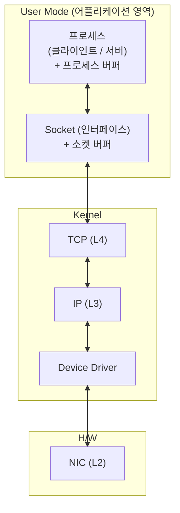
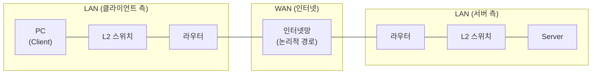
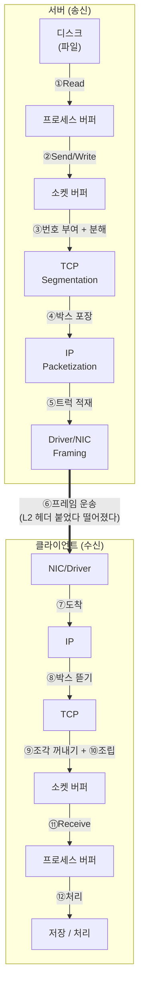

# 패킷의 생성에서 소멸까지 (Packet Lifecycle)

> 출처: YouTube [IT 인프라] 04. 패킷의 생성에서 소멸까지 (스크립트 원본: `04.packet-lifecycle.md`)
> 선수 학습: [03. 택배를 알면 패킷이 보인다](03.packet.md) — 본 강의는 03편의 비유적 설명을 호스트 내부 동작 수준으로 디테일하게 풀어낸 후속편이다.

핵심 명제: **패킷의 생성과 소멸은 호스트의 3계층(User / Kernel / H/W)을 위에서 아래로, 다시 아래에서 위로 통과하는 여정이다.** 계층마다 데이터의 단위 명칭이 바뀌고(Application data → Segment → Packet → Frame), TCP/IP 통신은 순서와 응답(ACK)으로 안정성을 보장하며, 윈도우 사이즈로 흐름을 제어한다.

---

## 1. 호스트의 내부 구조

엔드포인트(PC, 서버)는 모두 동일한 3계층 구조를 가진다.



### 1.1 계층별 데이터 단위

| 위치 | 계층 | 데이터 단위 | 비고 |
|------|------|------------|------|
| User (Process) | Application | Application Data | read/write로 다루는 원본 데이터 |
| Kernel | TCP (L4) | **Segment** | TCP가 부여하는 단위 |
| Kernel | IP (L3) | **Packet** | IP가 부여하는 단위 (라우터가 보는 단위) |
| Kernel/HW | Driver / NIC (L2) | **Frame** | MAC 주소가 붙은 단위 |

> 통신의 본질은 **프로세스 간 통신**이다. 같은 머신 내라면 IPC, 원격이면 TCP 소켓 통신이다.

### 1.2 버퍼

- **프로세스 버퍼**: 어플리케이션 메모리. 크기는 **개발자가 규정**하므로 외부에서 정확히 알 수 없다.
- **소켓 버퍼**: 소켓의 본질은 파일이며, 파일 입출력을 위한 버퍼가 별도로 존재한다. 윈도우의 경우 약 **8KB** 수준이지만 OS·구현마다 다르므로 절대값을 외울 필요는 없다.

> **소켓 버퍼의 위치는 구현 의존적이다.** 강의에서는 그림상 User Mode 쪽에 그렸지만, 실제로는 Kernel 측에 위치할 수도 있다. 윈도우의 경우 정확히는 커널 측이 맞다고 강의는 명시한다. 이 그림에서 User에 표시된 Socket은 인터페이스를 가리키며, 실제 버퍼 위치는 별도 사안이다.

### 1.3 MAC 주소의 위치

- **물리적 위치**: NIC (네트워크 인터페이스 카드)
- **설정 주체**: 디바이스 드라이버
- 결과: NIC가 가진 값을 드라이버에서 다른 값으로 **수정 가능**

---

## 2. 통신 경로 — LAN과 WAN



| 구간 | 명칭 | 가장 중요한 정보 | 의미 |
|------|------|----------------|------|
| 엔드포인트 ↔ 라우터 | **LAN** (Local Area Network) | **MAC 주소 (L2)** | 물리적으로 닿아 있는 영역 |
| 라우터 ↔ 라우터(인터넷) | **WAN** (Wide Area Network) | IP 주소 (L3) | 논리적으로 설명되는 영역 |

> - 라우터까지의 영역에서는 MAC 주소가 적정하게 맞아 떨어져야 한다. 그게 어긋나면 다 소용없다.
> - 위 그림은 기본 시나리오다. 실제로는 라우터 위에 또 다른 라우터가 나오는 구성도 있고 더 복잡할 수 있다(강의의 단서).

---

## 3. 시나리오 — 서버에서 클라이언트로 파일 다운로드

전제: 서버 디스크에 이미지/영상 같은 파일이 있고, 그것이 PC로 다운로드되는 상황. 통신은 TCP 소켓 통신.



### 3.1 발신 측 (서버) — ① ~ ⑤

| 단계 | 동작 | 단위 변화 | 비유 |
|------|------|----------|------|
| ① **Read** | 디스크 파일의 일부를 읽어 프로세스 버퍼에 적재 | File → Application Data | 퍼즐 조각을 떼어 옴 |
| ② **Send (Write)** | `send()` 함수로 프로세스 버퍼 → 소켓 버퍼로 이동 | (이동만) | 퍼즐을 다음 작업대로 옮김 |
| ③ **Segmentation** | TCP가 각 조각에 번호를 부여하고 잘게 분해 | Data → **Segment** | 퍼즐 조각에 번호표 붙이기 |
| ④ **Packetization** | IP 헤더로 포장 | Segment → **Packet** | 박스에 넣고 송장 부착 |
| ⑤ **Framing** | 드라이버/NIC가 프레임으로 감싸 송출 | Packet → **Frame** | 박스를 트럭에 적재 |

### 3.2 운송 — ⑥ (라우터/게이트웨이 통과)

- 프레임의 L2 헤더는 매 홉마다 **떼어졌다 붙었다**를 반복한다 (택배의 간선 상·하차에 비유 — 트럭을 갈아탐).
- IP 헤더(송장)는 종단까지 **유지**된다 → 패킷의 `목적지 IP`가 길찾기의 기준.
- 이 구간에 설치된 라우터·방화벽 같은 장비를 **인라인 장비**라 부른다. 이들이 보는 단위는 **패킷**이다.

### 3.3 수신 측 (PC) — ⑦ ~ ⑫

| 단계 | 동작 | 단위 변화 | 비고 |
|------|------|----------|------|
| ⑦ **도착** | 패킷이 목적지 NIC에 도달 | Frame 수신 | |
| ⑧ **Decapsulation (Frame→Packet)** | L2 헤더 제거, IP 계층으로 전달 | Frame → Packet | "박스 뜯기" |
| ⑨ **세그먼트 추출** | 패킷에서 세그먼트를 꺼냄 | Packet → Segment | |
| ⑩ **Reassembly** | 번호 순서대로 조립 | Segment → Data | **분해보다 조립이 더 어렵다** (순서 보정 필요) |
| ⑪ **Receive** | 소켓 버퍼 → 프로세스 버퍼로 가져감 | (이동만) | 어플리케이션이 `recv()` 호출. **이동은 곧 비우기** — 소켓 버퍼가 비워지면 그만큼 윈도우 사이즈가 늘어난다 |
| ⑫ **처리** | 파일 저장, 영상 처리 등 | (소비) | 어플리케이션 영역 |

> **순서 보정의 필요성**: 1번 다음 2번이 와야 하는데 3번이 먼저 도착할 수 있다. TCP는 순번을 따져 올바른 순서로 조립한다 — 이것이 TCP가 "신뢰성 있는" 이유 중 하나다.

> **수신 중에도 OS는 동시에 수신한다**: 어플리케이션이 ⑫ 처리 중인 동안에도 OS는 계속해서 새 데이터를 소켓 버퍼에 쌓아 올린다. 이 두 흐름의 속도 차가 윈도우 사이즈 증감을 결정한다 (§5.3 참조).

### 3.4 단위의 변화 한 장 요약

```
송신                                                     수신
─────────────────────────────────────────────────────────────────────
Application Data
   ↓ TCP                                                   ↑ TCP
[ TCP_H | Data ]  (Segment)                  [ TCP_H | Data ]
   ↓ IP                                                    ↑ IP
[ IP_H | TCP_H | Data ]  (Packet)    [ IP_H | TCP_H | Data ]
   ↓ Driver/NIC                                            ↑ Driver/NIC
[ MAC_H | IP_H | TCP_H | Data ]  (Frame)
   →→→→→→→→→→  네트워크 운송 (홉마다 MAC 헤더 갱신)  →→→→→→→→→→
```

---

## 4. 커널의 역할

> "수신의 주체는 커널이다."

커널의 주요 일:

1. **스케줄링** — 무엇을 언제 할지 순서 결정
2. **입출력** — 네트워크에서 날아온 정보를 소켓 버퍼에 쌓아 올리는 주체
3. **제어** — 시스템 전반의 제어 체계

송·수신 동안 어플리케이션은 `send()` / `recv()`를 호출할 뿐, 실제 분해·조립·재전송·흐름 제어는 모두 커널 내부(TCP/IP 스택)에서 이루어진다. **소켓을 만드는 개발자는 이 동작을 직접 경험하지 않는다 — 이론으로 알 뿐이다.**

---

## 5. ACK와 윈도우 사이즈

### 5.1 ACK 메커니즘

- TCP는 **순서**가 있고 **응답**으로 안정성을 보장한다.
- 수신자가 1번, 2번 세그먼트를 잘 받았다면 → ACK의 번호는 **3** ("1, 2 받았으니 다음은 3을 보내라"는 의미).
- 송신자는 ACK 번호 = 3을 보고 3번 세그먼트를 전송한다.

기본 룰 (단순화):

> **MSS 크기 세그먼트 두 개가 도착하면 ACK 한 개로 응답한다.**

ACK 발송 시점:

1. ⑨ 패킷 박스 뜯기 → ⑩ 세그먼트 조립 → ⑪ 소켓 버퍼에서 프로세스로 퍼올리기까지 진행
2. 그 결과 소켓 버퍼의 **남은 크기(= 윈도우 사이즈)** 가 계산됨
3. 이 윈도우 사이즈를 담아 ACK 패킷이 송신자에게 발송됨

실제로는 **ACK 타이머(지연 ACK)**, **재전송 타이머(retransmission timer)** 등이 결합되어 더 정교하게 동작한다. 강의 단계에서는 "두 개 오면 하나 간다"로만 외운다 — 정교한 타이머 동작은 OS 커널 내부에서 이뤄지므로 소켓을 다루는 개발자가 직접 경험할 일이 거의 없다.

### 5.2 Window Size

- 정의: **소켓 버퍼의 여유 공간**.
- ACK 패킷 안에 **윈도우 사이즈 정보가 포함**되어 송신자에게 통보된다.
- 적어도 **1460 B(MSS) 이상** 비어 있어야 다음 풀 사이즈 세그먼트가 들어갈 수 있다.

```
소켓 버퍼
┌────────────────┬──────────────────────┐
│  수신 적재된    │   여유 공간           │ ← 이 크기가 Window Size
│  데이터         │  (Window Size)       │
└────────────────┴──────────────────────┘
                        ↑
                ACK 시 송신자에게 통보
```

### 5.3 Zero Window

- **윈도우 사이즈 = 0인 상태** → 소켓 버퍼가 가득 참.
- 발생 흐름:
  1. 어플리케이션의 처리 속도가 수신 속도보다 느려짐
  2. 소켓 버퍼에서 데이터가 빠져나가는 속도 < 들어오는 속도
  3. 여유 공간이 점점 줄어들다 0에 도달
- 결과: **송신자는 보내고 싶어도 보낼 수 없다.**

> "TCP는 배려한다" — 수신자 사정을 봐가며 보낸다. 강제로 밀어넣지 않는다.

### 5.4 RTT와 TCP 속도 한계

- **RTT (Round Trip Time)**: 패킷이 왕복하는 시간 (ping의 왕복 시간).
- 예: PC ↔ 서버 RTT = 40 ms일 때
  - 송신자가 세그먼트 두 개를 거의 동시에(예: 2 ms 간격) 보냄
  - ACK가 돌아올 때까지 최소 40 ms 대기
  - 결과: 다음 송신까지의 실효 간격이 약 **38 ms**로 길어짐 — "두 개 보내고 항상 wait"
- TCP는 본질적으로 **느린 프로토콜**이며, 이 한계 때문에 속도를 보정하기 위한 다양한 TCP 변종이 등장했다.

> **혼잡 제어 로직은 본 강의에서 의도적으로 배제되었다.** 강의자는 "혼잡 제어 로직 나오고 뭐 나오고 한도 끝도 없다"는 이유로 RTT/속도 보정의 깊은 메커니즘은 다루지 않는다. 본 문서도 그 범위를 따른다.

---

## 6. 인라인 장비와 캡처 도구의 위치

| 대상 | 보는 단위 | 위치 |
|------|----------|------|
| 라우터 / 방화벽 등 인라인 장비 | **Packet** | 네트워크 경로 상 |
| WinPCap (캡처 라이브러리) | **Frame** | 호스트의 **디바이스 드라이버 위치** |

WinPCap은 드라이버 단계에 위치하므로, 프레임이 만들어지는(또는 도착한) 직후의 **프레임 단위까지 캡처**할 수 있다.

---

## 7. 진단 — 느림의 원인은 어디에 있는가

| 관찰된 증상 | 1차 의심 지점 | 이유 |
|------------|-------------|------|
| Zero Window 발생 | **어플리케이션** | 처리 지연으로 소켓 버퍼가 차서 발생. 네트워크/OS 탓이 아님 |
| 어플리케이션 처리 지연의 후보 원인 | 레이스 컨디션, 데드락 등 | 어플리케이션 내부 결함 |

> Zero Window를 보고 네트워크에서 원인을 찾으면 잘못 짚는 것이다. **네트워크 캡처와 어플리케이션 로그를 함께** 봐야 진단이 가능하다.

---

## 8. 정리 — 한 장 요약

```
[User] Process ─ Socket
─────────────────────────
[Kernel] TCP (Segment)
         IP  (Packet)
         Driver
─────────────────────────
[H/W] NIC (Frame, MAC)

송신: Read → Send → Segment → Packet → Frame → 운송
수신: 도착 → Frame해제 → Packet해제 → Segment조립 → Receive → 처리
흐름제어: ACK 번호 = 다음 기대 시퀀스, ACK에 Window Size 동봉
지연제어: Zero Window → 송신 정지 (수신자 배려)
```

핵심 명제 6가지:

1. 호스트는 **User / Kernel / H/W** 3계층이며, 네트워크 통신은 이 계층을 위→아래(송신), 아래→위(수신)로 통과한다.
2. 데이터 단위는 계층마다 다르다 — **TCP=Segment, IP=Packet, Driver/NIC=Frame**.
3. **MAC 주소는 NIC에 있지만 드라이버에서 설정**되며 수정 가능하다.
4. **LAN의 핵심은 MAC, WAN은 IP**. 라우터까지가 LAN, 라우터 너머가 WAN.
5. TCP는 **순서 + ACK**로 안정성을 보장하고, **Window Size**로 흐름을 제어한다. ACK에 Window Size가 동봉된다.
6. **Zero Window는 어플리케이션 처리 지연의 신호**다 — 네트워크 탓이 아니다.

---

## 부록 — 용어 색인

| 약어 | 풀네임 | 의미 |
|------|--------|------|
| MSS | Maximum Segment Size | TCP 세그먼트가 담을 수 있는 페이로드 최대 크기 (이더넷 기준 1460 B) |
| MTU | Maximum Transmission Unit | 한 번에 전송 가능한 최대 크기 (이더넷 1500 B) |
| ACK | Acknowledgment | 수신 확인 응답. 다음 기대 시퀀스 번호를 담는다 |
| RTT | Round Trip Time | 패킷이 송·수신 호스트 사이를 한 번 왕복하는 시간 |
| NIC | Network Interface Card | 호스트의 네트워크 인터페이스 카드 |
| LAN | Local Area Network | 엔드포인트 ~ 라우터 구간 |
| WAN | Wide Area Network | 라우터 너머의 광역 네트워크 |
| IPC | Inter-Process Communication | 같은 머신 내 프로세스 간 통신 |
| Zero Window | — | 윈도우 사이즈가 0이 되어 송신이 정지된 상태 |
