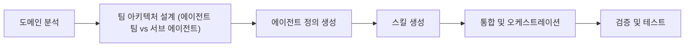

# 클로드 코드 에이전트 팀·하네스 메타 스킬

## 1. 문서가 다루는 대상

「하네스 구성해줘」와 같은 요청 한마디로 도메인에 맞는 전문 에이전트 팀을 설계하고, 에이전트가 사용할 스킬까지 자동 생성하는 **메타 스킬**에 관한 설명이다.

## 2. 능력 범위

6가지 아키텍처 패턴을 지원한다.

에이전트 간 오케스트레이션을 포함한다.

에러 핸들링 프로토콜을 포함한다.

## 3. 아키텍처 패턴

**파이프라인**은 순차 의존 작업에 적합한 패턴이다.

**팬아웃/팬인**은 병렬 독립 작업에 적합한 패턴이다.

**전문가 풀**은 상황별 선택 호출에 적합한 패턴이다.

**생성-검증**은 생성 후 품질 검수에 적합한 패턴이다.

**감독자**는 중앙 에이전트가 동적 분배하는 상황에 적합한 패턴이다.

**계층적 위임**은 상위에서 하위로 재귀적 위임이 필요한 경우에 적합한 패턴이다.

## 4. 워크플로우(6단계)

다음 여섯 단계로 진행된다.

1. 도메인 분석
2. 팀 아키텍처 설계(에이전트 팀 vs 서브 에이전트)
3. 에이전트 정의 생성
4. 스킬 생성
5. 통합 및 오케스트레이션
6. 검증 및 테스트

## 5. 실행 모드

실행 모드는 두 가지이다.

### 5.1 에이전트 팀(기본)

TeamCreate + SendMessage + TaskCreate 방식이다.

2개 이상의 에이전트와 협업이 필요할 때 권장된다.

### 5.2 서브 에이전트

Agent 도구를 직접 호출한다.

단발성 작업이며 에이전트 간 통신이 불필요할 때 적합하다.

## 6. 생성 산출물과 경로

하네스 실행 시 `.claude/agents/`에 에이전트 정의 파일이 자동 생성된다. 예로 analyst.md, builder.md, qa.md가 있다.

`.claude/skills/`에 스킬 파일이 자동 생성된다.

## 7. 사용 환경

클로드 코드에서 에이전트 팀 기능을 쓰려면 `CLAUDE_CODE_EXPERIMENTAL_AGENT_TEAMS=1` 설정이 필요하다.

## 8. 팀 구성 예시

다음은 생성할 수 있는 팀 구성 예시이다. 각 항목은 요청 문맥과 역할을 서술한다.

### 8.1 딥 리서치

리서치 하네스 구성이 요청된다. 어떤 주제든 여러 각도에서 조사할 수 있는 에이전트 팀이 필요하다. 웹 검색, 학술 자료, 커뮤니티 반응을 다루며, 교차 검증 후 종합 보고서를 작성하는 팀이다.

### 8.2 웹사이트 제작

풀스택 웹사이트 개발 하네스 구성이 요청된다. 디자인, 프론트엔드(React/Next.js), 백엔드(API), QA 테스트를 와이어프레임부터 배포까지 파이프라인으로 조율하는 팀이다.

### 8.3 웹툰 제작

웹툰 에피소드 제작 하네스 구성이 요청된다. 스토리 작성, 캐릭터 디자인 프롬프트, 패널 레이아웃 기획, 대사 편집 에이전트가 필요하며, 서로의 작업물을 스타일 일관성 관점에서 리뷰해야 한다.

### 8.4 유튜브 콘텐츠 기획

유튜브 콘텐츠 제작 하네스 구성이 요청된다. 트렌드 조사, 대본 작성, 제목/태그 SEO 최적화, 썸네일 컨셉 기획을 감독자 에이전트가 조율하는 팀이다.

### 8.5 코드 리뷰

종합 코드 리뷰 하네스 구성이 요청된다. 아키텍처, 보안 취약점, 성능 병목, 코드 스타일을 병렬로 감사하는 에이전트들이 결과를 하나의 리포트로 통합하는 팀이다.

### 8.6 기술 문서 작성

해당 코드베이스에서 API 문서를 자동 생성하는 하네스 구성이 요청된다. 엔드포인트 분석, 설명 작성, 사용 예제 생성, 완성도 리뷰를 파이프라인으로 처리하는 팀이다.

### 8.7 데이터 파이프라인 설계

데이터 파이프라인 설계 하네스 구성이 요청된다. 스키마 설계, ETL 로직, 데이터 검증 규칙, 모니터링 설정을 계층적으로 위임하는 에이전트 팀이다.

### 8.8 마케팅 캠페인

마케팅 캠페인 제작 하네스 구성이 요청된다. 타겟 시장 조사, 광고 카피 작성, 비주얼 컨셉 디자인, A/B 테스트 계획을 반복적 품질 리뷰와 함께 진행하는 팀이다.

## 9. revfactory/harness-100

revfactory/harness-100은 10개 도메인, 100개의 프로덕션 레디 에이전트 팀 하네스를 한영 200패키지로 공개한 것이다.

각 하네스에는 4–5명의 전문 에이전트, 오케스트레이터 스킬, 도메인 특화 스킬이 포함된다.

콘텐츠 제작·소프트웨어 개발·데이터/AI·비즈니스 전략·교육·법률·헬스케어 등 1,808개 마크다운 파일로 구성된다.

이 구성물은 모두 Harness 플러그인으로 생성된다.
