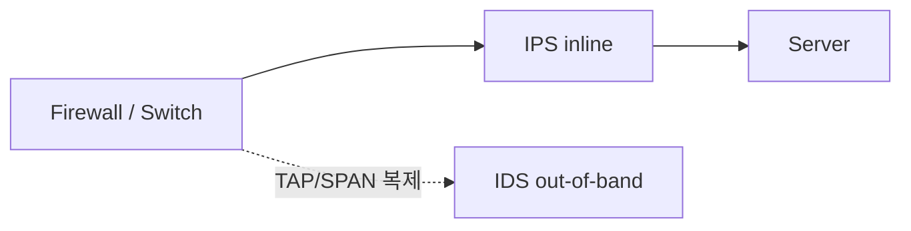

## Definition


# 라우터·NAT·방화벽·로드밸런서·IDS·IPS의 역할과 네트워크 배치

라우팅·NAT/PAT·방화벽·로드밸런싱·IDS·IPS는 각각 다른 질문에 답하는 **논리 기능**이다. 하나의 물리 장비가 여러 기능을 함께 수행할 수 있고, 각 기능을 별도 장비로 분리할 수도 있으므로 장비 이름보다 실제 패킷 경로와 처리 책임을 따라가야 한다.

### Definition

### 먼저 분리해야 하는 두 층: 기능과 장비

네트워크 구성도를 읽을 때 가장 먼저 **논리 기능(function)** 과 **물리·가상 장비(appliance/instance)** 를 분리한다.

- 논리 기능은 패킷에 대해 수행하는 책임이다. 예: 경로 선택, 주소 변환, 허용·차단, 서버 선택.
- 장비는 그 기능을 실행하는 물리 장비, 가상 머신, 클라우드 서비스 또는 호스트 커널이다.
- 가정용 공유기는 보통 스위치·무선 AP·라우터·NAT/PAT·상태 기반 방화벽을 한 장비에 묶는다.
- 기업용 NGFW는 라우팅·방화벽·NAT/PAT·VPN·IPS를 함께 제공할 수 있다.
- 반대로 대규모·고성능·규제 환경에서는 라우터, 방화벽, NAT, IPS, 로드밸런서를 각각 분리할 수 있다.

따라서 “라우터인가, NAT 장비인가?”라는 질문은 물리 장비 기준으로는 둘 다일 수 있다. 정확한 질문은 **“이 지점에서 라우팅과 주소 변환 중 어떤 기능이 활성화되어 있는가?”** 이다.

### 기능별로 답하는 질문

| 기능 | 답하는 질문 | 주 입력 | 대표 결과 | 일반적인 위치 |
|---|---|---|---|---|
| 라우팅 | 목적지까지 어느 next hop·인터페이스로 보낼 것인가? | 목적지 IP, 라우팅·포워딩 테이블 | 다음 홉으로 전달 또는 폐기 | 서로 다른 IP 네트워크 사이 |
| NAT/PAT | 패킷의 어느 IP·포트를 무엇으로 바꿀 것인가? | 원본 tuple, NAT 규칙, 변환 상태 | IP·포트와 checksum 변환 | 주소 영역의 경계 |
| 방화벽 | 이 통신을 허용할 것인가? | 방향, IP, 프로토콜, 포트, 세션 상태, 정책 | allow, drop, reject, log | 신뢰 수준이 다른 망 사이 |
| 로드밸런싱 | 정상 대상 중 어느 서버가 요청을 처리할 것인가? | VIP/listener, 대상 pool, 상태 검사, 선택 정책 | 대상 서버 선택·전달 또는 새 연결 생성 | 서버 pool 앞 |
| IDS | 이 트래픽이 침입 징후인가? | 복제 패킷·세션·로그·탐지 규칙 | 경보·기록·연동 | TAP/SPAN 등 out-of-band 관찰 지점 |
| IPS | 이 트래픽을 통과시킬 것인가, 공격으로 차단할 것인가? | 실제 inline 트래픽·탐지 규칙 | 전달, drop, reset | 실제 트래픽 경로 inline |

이 구분은 기능의 **주 책임**을 설명한다. 실제 제품은 예외적으로 다른 기능도 제공할 수 있으므로 제품 이름만으로 동작을 단정하지 않는다.

### 패킷을 추적할 때 쓰는 공통 단위

TCP/UDP 통신은 보통 다음 5-tuple로 식별한다.

```text
(source IP, source port, destination IP, destination port, protocol)
```

예를 들어 다음 두 표기는 서로 다른 관찰 지점에서 본 동일 세션일 수 있다.

```text
NAT 이전:  TCP 10.10.1.20:53000 → 198.51.100.80:443
NAT 이후:  TCP 203.0.113.10:41001 → 198.51.100.80:443
```

분석할 때는 `원본(original) tuple`, `변환 후(translated) tuple`, `관찰 지점`, `시간`, `세션 ID`를 함께 기록해야 한다.

### Mechanism

### 1. 정상적인 전달 흐름부터 본다

호스트는 먼저 목적지 IP가 자신의 서브넷에 속하는지 판단한다.

1. 같은 서브넷이면 ARP/이웃 탐색으로 목적지의 링크 계층 주소를 구해 직접 전송한다.
2. 다른 서브넷이면 IP 패킷의 최종 목적지 IP는 유지한 채, 프레임을 기본 게이트웨이로 보낸다.
3. 라우터는 목적지 IP와 포워딩 테이블을 비교하여 일반적으로 가장 구체적인 경로인 longest prefix match를 선택한다.
4. 경로 중간에 NAT·방화벽·IPS·로드밸런서가 있으면 각 장비가 자신의 기능과 정책을 적용한다.


라우팅은 **목적지로 가는 길을 선택**하고 NAT는 **주소 표현을 변환**한다. 독립 NAT 장비도 변환한 패킷을 다음 홉으로 전달해야 하므로 라우팅 또는 투명 브리지 동작을 함께 가질 수 있지만, 두 기능의 책임은 동일하지 않다.

### 2. 내부에서 외부로 나가는 PAT

내부 호스트가 인터넷 서버에 연결하는 전형적인 흐름은 다음과 같다.

```text
내부 호스트                  NAT/PAT 경계                     외부 서버
10.10.1.20:53000  ──▶  203.0.113.10:41001  ──▶  198.51.100.80:443
```

1. 내부 호스트가 `10.10.1.20:53000 → 198.51.100.80:443/TCP` 패킷을 기본 게이트웨이로 보낸다.
2. 경계 장비가 라우팅·보안 정책상 외부 전송이 가능한지 판단한다.
3. PAT가 source IP·source port를 `203.0.113.10:41001`로 변환하고 대응 관계를 상태로 저장한다.
4. 응답 `198.51.100.80:443 → 203.0.113.10:41001`이 돌아오면 변환 상태를 역조회한다.
5. 장비가 destination을 `10.10.1.20:53000`으로 복원하여 내부 호스트에 전달한다.

```text
PAT 상태의 핵심 대응
10.10.1.20:53000 ↔ 203.0.113.10:41001
```

RFC 3022가 설명하는 전통적 NAPT에서도 내부 tuple과 외부 tuple의 binding은 첫 outbound 세션에서 만들어질 수 있고, 이후 패킷은 세션·binding 조회를 거쳐 양방향 변환된다. TCP/UDP에서는 주소·포트 변경에 맞춰 관련 checksum도 조정된다.

### 3. 외부에서 내부 서비스로 들어오는 흐름

외부에서 먼저 시작하는 연결은 기존 outbound PAT 상태가 없으므로 정적 NAT, DNAT, port forwarding 또는 공개 VIP 같은 명시적 구성이 필요하다.

다음은 방화벽이 DNAT를 수행하고 로드밸런서가 실제 서버를 선택하는 한 가지 예다.

```text
Client                 Public service          DMZ VIP                 Real server
198.51.100.25:51514 → 203.0.113.20:443 → 172.16.10.10:443 → 10.20.0.11:8443
```

| 단계 | 기능 | 관찰되는 핵심 값 | 판단·처리 |
|---:|---|---|---|
| 1 | Edge router | 목적지 `203.0.113.20` | 공개 대역을 경계 장비 next hop으로 전달 |
| 2 | Firewall | 원본 또는 제품 정책이 참조하는 tuple | 외부에서 공개 HTTPS로 들어오는 세션을 정책에 따라 허용·차단 |
| 3 | DNAT | `203.0.113.20:443 → 172.16.10.10:443` | 공개 서비스 주소를 DMZ의 load balancer VIP로 변환 |
| 4 | IPS | 실제 inline 세션 | 공격 여부를 검사하고 정상은 전달, 공격은 차단 |
| 5 | Load balancer | listener/VIP와 backend pool | 정상 대상 중 `10.20.0.11:8443`을 선택 |
| 6 | Server | load balancer가 전달하거나 새로 만든 연결 | 요청 처리 후 설계된 반환 경로로 응답 |
| 7 | Stateful devices | 기존 NAT·방화벽·LB 세션 상태 | 역방향 변환·정책 처리를 거쳐 client에 응답 |

여기에는 목적이 다른 두 매핑이 있다.

```text
주소 영역 연결을 위한 NAT:
203.0.113.20:443 ↔ 172.16.10.10:443

처리 대상을 고르는 load balancing:
172.16.10.10:443 ↔ 10.20.0.11:8443
```

두 기능 모두 헤더를 바꿀 수 있지만 NAT의 주 목적은 주소 영역 간 변환이고, 로드밸런서의 주 목적은 여러 대상 중 정상 서버를 선택해 가용성과 처리 용량을 제공하는 것이다.

### 4. 방화벽 정책과 NAT의 처리 순서는 고정 공식이 아니다

분리된 장비에서는 물리적 순서를 구성도에서 확인할 수 있다.

```text
구성 A: Internet → Firewall → NAT → Private network
구성 B: Internet → NAT → Firewall → Private network
```

- 구성 A의 방화벽은 인바운드에서 대체로 변환 전 공개 주소를 관찰한다.
- 구성 B의 방화벽은 인바운드에서 대체로 변환 후 내부 주소를 관찰한다.
- 다만 장비의 인터페이스, 정책 모델, 라우팅 모드에 따라 세부 관찰값은 달라질 수 있다.

하나의 NGFW가 방화벽과 NAT를 모두 수행할 때 내부 처리 순서는 벤더·제품·정책 유형에 따라 다르다. 어떤 제품은 DNAT 후 경로·보안 정책을 평가하고 나중에 SNAT하며, 어떤 제품은 정책에서 원본과 변환 후 객체를 별도로 표현한다. 따라서 “방화벽이 항상 NAT 전/후에 검사한다”는 문장을 일반 법칙으로 외우면 안 된다.

실제 장비에서는 다음을 확인한다.

- 정책이 original 주소와 translated 주소 중 무엇을 참조하는가
- DNAT·SNAT가 경로 선택과 보안 정책의 어느 단계에 적용되는가
- 세션 테이블과 로그가 변환 전·후 tuple을 모두 제공하는가
- 응답이 같은 stateful 장비를 다시 통과하는 대칭 경로인가

### 5. 로드밸런서는 구현 방식에 따라 패킷과 연결을 다르게 다룬다

- **L4 NAT/proxy 방식**은 IP·TCP/UDP 수준의 listener에서 backend를 선택하고 주소·포트를 변환하거나 연결을 중계한다.
- **L7 reverse proxy 방식**은 client 연결을 load balancer에서 종료하고, HTTP 등의 응용 정보를 판단하여 backend에 별도 연결을 만든다.
- **DSR(Direct Server Return)** 은 요청이 load balancer를 거쳐도 응답이 서버에서 client로 직접 나가도록 설계할 수 있다.
- **SNAT 사용 구성**은 backend가 응답을 반드시 load balancer로 돌려보내기 쉽지만, 별도 전달 정보나 로그가 없으면 서버가 원래 client IP를 직접 보지 못할 수 있다.

특히 L7 proxy는 다음 두 연결을 구분해야 한다.

```text
Client ←── client-side connection ──→ Load balancer
Load balancer ←── server-side connection ──→ Backend
```

따라서 client 쪽과 server 쪽의 source IP·port, TLS 상태, timeout이 서로 다를 수 있다.

### 6. IDS와 IPS는 트래픽 경로 참여 여부가 다르다



- IDS는 보통 TAP/SPAN으로 받은 복제본을 관찰한다. 경보·기록·SIEM/SOAR·방화벽 연동은 할 수 있지만, out-of-band 센서 자체가 원본 패킷을 확실히 drop하는 위치는 아니다.
- IPS는 원본 트래픽이 통과하는 inline 위치에 있으므로 직접 전달·drop·reset할 수 있다. 대신 장비 장애와 오탐이 정상 통신에 영향을 줄 수 있다.
- 일부 제품은 IDS/IPS 모드를 모두 지원한다. 이 경우 제품명이 아니라 실제 interface mode와 정책 action을 확인한다.

### 7. 관찰 위치가 달라지면 동일 세션의 주소와 내용도 달라진다

```text
Internet
   │  외부 sensor: 공개 VIP와 변환 전 tuple 관찰
[Firewall / NAT]
   │  DMZ sensor: 변환된 VIP 관찰
[Load balancer / TLS termination]
   │  서버망 sensor: backend tuple, 경우에 따라 복호화된 HTTP 관찰
[Web server]
```

NAT 전 IDS는 공개 주소를, NAT 후 IDS는 사설 주소를 볼 수 있다. TLS 종료 전 센서는 암호화된 payload만 볼 수 있고, 승인된 TLS 종료 뒤 센서는 평문 응용 데이터를 볼 수도 있다. 그러므로 서로 다른 로그를 연결할 때 IP 하나만으로 동일 세션 여부를 판단하지 않는다.

```text
시간 → 프로토콜 → 원본/변환 tuple → NAT session → LB request/connection ID
     → IDS/IPS signature → firewall action → server request ID
```

### Variants

### 통합형: 가정·소규모 환경

```text
Internet
   │
[공유기]
   ├─ Router
   ├─ NAT/PAT
   ├─ Stateful Firewall
   ├─ Ethernet Switch
   └─ Wireless AP
   │
Internal hosts
```

여러 기능이 한 상자에 있으므로 사용자는 흔히 “라우터가 포트 매핑한다”고 표현한다. 더 정확하게는 **라우터로 판매되는 복합 장비 안의 NAT/PAT 기능이 포트 매핑을 수행**하는 것이다.

### 경계 NGFW 통합형: 일반적인 기업 구성

```text
Internet
   │
[ISP / Edge Router]
   │
[NGFW: Firewall + NAT/PAT + IPS + VPN]
   │
[DMZ Switch]
   │
[Load Balancer / WAF]
   │
Web servers
   │
[Internal Firewall]
   │
Application / DB networks
```

Edge router는 ISP 연결과 인터넷 경로를, NGFW는 신뢰 경계의 세션 정책·주소 변환·침입 차단을, load balancer는 서비스 VIP와 backend 선택을 담당한다. IDS 센서는 외부·DMZ·내부의 필요한 관찰 지점에서 TAP/SPAN 트래픽을 받을 수 있다.

### 완전 분리형

```text
Internet
   │
[Edge Router]
   │
[Firewall]
   │
[NAT/PAT Appliance]
   │
[IPS]
   │
[DMZ Load Balancer]
   │
Servers
```

라우터와 NAT 장비를 별도로 두는 것은 기술적으로 가능하다. 다만 다음 조건을 충족해야 한다.

1. 공개·사설 대역에 대한 route가 각 장비에서 이어져야 한다.
2. NAT 대상 트래픽이 반드시 translator를 통과해야 한다.
3. stateful NAT·방화벽·IPS·LB가 있는 경우 응답도 필요한 상태 장비로 돌아와야 한다.
4. 각 정책과 로그가 변환 전·후 어느 주소를 사용하는지 운영자가 알아야 한다.
5. 장애 시 우회 경로가 보안·NAT 상태를 건너뛰지 않아야 한다.

분리 순서가 반드시 위와 같아야 하는 것은 아니다. NAT를 firewall 앞에 둘 수도 있고 뒤에 둘 수도 있으며, firewall이나 IPS가 L3 routed mode가 아니라 L2 transparent mode로 배치될 수도 있다. 순서는 보안 정책에서 보고 싶은 주소, 공인 주소 소유·라우팅, 성능, 고가용성, 로그 상관분석 요구에 따라 결정한다.

### NAT의 대표 형태

| 형태 | 변환 단위 | 대표 용도 |
|---|---|---|
| Static NAT | 내부 IP ↔ 외부 IP의 고정 1:1 관계 | 특정 시스템에 고정된 외부 주소 제공 |
| Dynamic NAT | 내부 IP를 외부 주소 pool에서 동적으로 1:1 선택 | 제한된 공인 주소 pool 사용 |
| NAPT/PAT | 내부 IP·port ↔ 외부 IP·port | 여러 내부 세션이 한두 공인 IP를 공유 |
| Static DNAT/port forwarding | 공개 IP·port → 내부 IP·port | 외부에서 내부 공개 서비스로 진입 |

`SNAT`과 `DNAT`은 패킷에서 어느 쪽 주소를 바꾸는지 설명하는 표현이다. outbound 인터넷 접속에서는 source 변환이 흔하고, inbound 공개 서비스에서는 destination 변환이 흔하지만, 실제 설계에는 hairpin NAT, twice NAT 등 더 복잡한 조합도 존재한다.

### 방화벽·IPS의 routed mode와 transparent mode

- **Routed/L3 mode**에서는 장비 인터페이스가 서로 다른 IP 네트워크에 참여하고 경로 선택에도 관여한다.
- **Transparent/L2 mode**에서는 장비가 브리지처럼 inline에 들어가면서 보안 검사를 수행할 수 있다.
- 모드가 투명하다고 해서 정책이나 장애 영향까지 없는 것은 아니다. 실제 데이터 경로에 inline이면 차단·지연·장애 영향을 줄 수 있다.

### IDS 센서의 대표 관찰 지점

| 위치 | 잘 보이는 것 | 사각지대·주의점 |
|---|---|---|
| 경계 방화벽 외부 | 인터넷 스캔·차단 전 공격량·공개 주소 | 잡음이 많고 내부 변환 주소를 바로 알기 어려움 |
| 방화벽 내부·DMZ | 허용된 트래픽·변환 후 VIP·DMZ 공격 | 방화벽에서 차단된 시도는 보이지 않을 수 있음 |
| 로드밸런서 뒤 | 실제 backend 트래픽·서버 대상 공격 | client 주소가 SNAT되거나 proxy 정보에만 남을 수 있음 |
| 내부망 east-west | 내부 확산·서버 간 이상 통신 | 전체 구간 가시성을 위해 여러 sensor가 필요할 수 있음 |

한 위치가 모든 목적에 최적인 것은 아니다. 중요한 경계에는 여러 관찰 지점을 두고 공통 시간·세션 정보로 상관분석한다.

### Trade-offs

### 통합과 분리의 선택

| 관점 | 기능 통합 장비 | 기능 분리 장비 |
|---|---|---|
| 구성 복잡도 | 상대적으로 낮음 | route·정책·상태·HA 연계가 복잡함 |
| 로그 상관관계 | 한 세션 로그에서 원본·변환 정보를 보기 쉬울 수 있음 | 여러 장비의 시간·tuple을 별도로 연결해야 함 |
| 장애 영향 | 한 장비 장애가 여러 기능에 동시에 영향 | 기능별 장애 격리가 가능하지만 장비·경로 수 증가 |
| 성능 확장 | 장비 전체 용량에 묶일 수 있음 | 병목 기능만 독립 확장 가능 |
| 정책 일관성 | 방화벽과 NAT 정책을 한 곳에서 관리 가능 | 장비 간 객체·정책 불일치 위험 |
| 전문 기능 | 범용 통합 성능과 기능에 의존 | 전용 NAT·IPS·LB의 특화 기능 활용 가능 |
| 운영 비용 | 장비·운영 지점이 적음 | 장비, 라이선스, HA, 관제 비용 증가 |

분리 자체가 더 안전하거나 통합 자체가 더 단순하다고 단정할 수는 없다. **정확한 route, 최소 허용 정책, 대칭 반환 경로, 상태 동기화, 로그 연결, 장애 설계**가 보장되는지가 더 중요하다.

### inline 보안과 out-of-band 탐지

| 선택 | 장점 | 위험·보완점 |
|---|---|---|
| IDS out-of-band | 원본 통신 장애 위험이 낮고 관찰·분석에 유리 | 복제 누락, 과부하, 원본 패킷 직접 차단 한계 |
| IPS inline | 공격 패킷을 직접 차단 가능 | 오탐·장애가 정상 통신에 영향; HA와 bypass 정책 필요 |

IPS의 장애 정책도 요구사항에 따라 다르다.

- `fail-open`은 장비 장애 시 통신을 우선하지만 보안 검사가 우회될 수 있다.
- `fail-close`는 검사를 우선하지만 장비 장애가 서비스 중단으로 이어질 수 있다.

### 반환 경로와 source 주소 보존

NAT, stateful firewall, proxy load balancer는 세션 상태를 사용하므로 반환 경로가 특히 중요하다.

- 비대칭 경로로 응답이 다른 stateful 장비에 도착하면 세션이 없어 폐기될 수 있다.
- load balancer가 SNAT하면 반환 경로는 단순해지지만 서버의 client IP 가시성이 줄 수 있다.
- client IP를 보존하면 분석에는 유리하지만 backend route가 load balancer를 향하도록 설계하거나 DSR 조건을 충족해야 할 수 있다.
- L7 proxy에서는 승인된 `Forwarded`·`X-Forwarded-For`·PROXY protocol 같은 전달 정보와 신뢰 경계를 별도로 관리해야 한다. 외부가 임의로 보낸 같은 이름의 헤더를 그대로 신뢰해서는 안 된다.

### 이 세션에서 드러난 오해를 바로잡는 표

| 혼동하기 쉬운 생각 | 정확한 이해 |
|---|---|
| 라우터는 항상 포트 매핑을 한다 | 라우터의 본질은 경로 선택이다. 같은 장비에 NAT/PAT 기능이 활성화됐을 때 그 기능이 포트를 변환한다. |
| NAT 장비와 라우터는 반드시 같은 장비다 | 분리할 수 있다. 독립 NAT 장비를 경로에 넣고 양방향 route·상태 경로를 맞추면 된다. |
| NAT는 방화벽이므로 내부망을 보호한다 | NAT는 주소 변환이다. 예상치 않은 직접 진입을 줄이는 부수 효과가 있어도 접근통제는 방화벽 정책으로 별도 보장해야 한다. |
| Port forwarding과 PAT는 같은 방향의 동작이다 | 일반적인 outbound PAT는 내부 세션이 동적 mapping을 만들고, port forwarding은 외부에서 시작할 수 있도록 정적 inbound mapping을 둔다. |
| 로드밸런서는 단지 또 하나의 NAT다 | 일부 L4 방식은 NAT를 사용하지만 핵심 책임은 정상 backend 선택과 트래픽 분산이다. L7 방식은 두 연결을 중계한다. |
| IDS가 공격 패킷을 직접 막는다 | 일반 IDS는 복제 트래픽을 관찰한다. 연동 차단은 가능하지만 원본 경로에서 직접 drop하는 주 역할은 inline IPS다. |
| 방화벽과 NAT의 순서는 언제나 같다 | 별도 장비의 물리 순서와 통합 장비의 내부 처리 순서는 설계·제품에 따라 다르다. 원본/변환 주소를 정책과 로그에서 확인해야 한다. |
| 구성도에 적힌 장비 이름으로 실제 기능을 알 수 있다 | 인터페이스 모드, route, NAT 규칙, 보안 정책, session table, LB listener/pool, TAP/SPAN 연결을 확인해야 한다. |

### 논리적으로 구성도를 읽는 순서

구성도나 장애 상황을 받으면 다음 순서를 반복한다.

1. **영역 표시**: Internet, external, DMZ, internal, application, DB, management 등 신뢰 경계를 나눈다.
2. **주소 표시**: 각 interface·subnet·gateway·public IP·VIP·backend IP를 적는다.
3. **경로 추적**: source에서 destination까지 forward path와 return path를 각각 그린다.
4. **변환 표시**: 어느 지점에서 어느 original tuple이 translated tuple로 바뀌는지 적는다.
5. **정책 표시**: firewall·ACL·IPS가 어느 tuple과 방향을 검사하는지 적는다.
6. **서버 선택 표시**: listener/VIP, algorithm·rule, health check, backend pool을 연결한다.
7. **관찰 지점 표시**: IDS TAP/SPAN, TLS 종료, 로그 생성 지점을 적는다.
8. **상태 확인**: NAT, firewall, IPS, LB의 session/state와 timeout을 확인한다.
9. **응답 역추적**: 같은 상태 장비를 필요한 순서로 되돌아오는지 확인한다.
10. **로그 대조**: 시간, original/translated tuple, action, request/session ID를 연결한다.

이 순서를 사용하면 “어느 장비가 무엇을 했는가”를 장비 이름이 아니라 관찰 가능한 패킷 변화와 정책 결과로 설명할 수 있다.

### Open Questions

이 문서의 기능 구분은 일반 원리다. 실제 환경의 정답을 결정하려면 다음 항목을 구성과 로그에서 확인해야 한다.

### 실제 배치 확인 질문

- 기본 게이트웨이는 어느 장비이며 실제 포워딩 테이블은 무엇인가?
- 라우터·방화벽·NAT·IPS가 물리적으로 분리되어 있는가, 한 장비의 기능으로 통합되어 있는가?
- 방화벽과 IPS는 routed mode인가, transparent/bridge mode인가?
- 공인 IP 대역은 어느 장비 인터페이스에 설정되어 있고, ISP·edge router는 그 대역을 어디로 route하는가?
- NAT 정책은 static NAT, dynamic NAT, PAT, DNAT 중 무엇이며 mapping·session timeout은 얼마인가?
- 방화벽 정책은 original tuple과 translated tuple 중 무엇을 기준으로 표현되는가?
- load balancer는 L4, L7 proxy, DSR 중 어느 방식이며 SNAT·client IP 전달은 어떻게 처리하는가?
- TLS는 어느 지점에서 종료되고, 각 IDS/IPS가 payload를 실제로 볼 수 있는가?
- IDS는 어느 TAP/SPAN source를 받고 있으며 oversubscription·packet loss가 없는가?
- IPS 장애 시 fail-open/fail-close와 HA 동작은 무엇인가?
- forward path와 return path가 동일한 stateful 경계를 필요한 순서로 통과하는가?

이 값은 벤더, 제품 버전, cloud/on-premises 구조, HA 구성에 따라 달라지므로 일반 설명만으로 채우지 않는다.

### 스스로 설명할 수 있어야 하는 확인 문제

1. `10.0.0.10:53000`이 `203.0.113.5:41000`으로 바뀌었다면 라우팅과 PAT 중 어느 기능이 각 필드를 결정했는가?
2. 외부 IDS에는 `203.0.113.20`, 서버 로그에는 `10.20.0.11`만 보일 때 동일 요청임을 어떤 값으로 연결할 것인가?
3. 방화벽을 통과했는데 서버에 도달하지 않는다면 route, DNAT, IPS, LB health, backend policy, return route를 어떤 순서로 확인할 것인가?
4. router와 NAT appliance가 분리됐다면 public route와 private route가 각각 어디를 가리켜야 하는가?
5. load balancer가 client IP를 SNAT할 때 서버 로그와 보안 정책에는 어떤 변화가 생기는가?

답을 만들 때는 항상 `경로 선택 → 주소 변환 → 허용·차단 → 서버 선택 → 탐지·차단 → 반환 경로 → 로그 상관분석` 순서로 설명한다.

### Sources

- `wiki/domains/information-security/drafts/study/info-sec-engineer-network-security-study.md` ^[extracted] — 라우팅, NAT, 방화벽, IDS/IPS 배치와 패킷·로그 판독에 대한 domain-local 학습 기준.
- [RFC 3022: Traditional IP Network Address Translator](https://www.rfc-editor.org/rfc/rfc3022.html) ^[extracted] — Basic NAT와 NAPT, outbound binding, 양방향 변환 및 헤더·checksum 처리의 근거.
- [RFC 4787: Network Address Translation Behavioral Requirements for UDP](https://www.rfc-editor.org/rfc/rfc4787.html) ^[extracted] — 내부·외부 주소/포트 tuple mapping과 NAT session의 용어 근거.
- [NIST SP 800-41 Rev. 1: Guidelines on Firewalls and Firewall Policy](https://csrc.nist.gov/pubs/sp/800/41/r1/final) ^[extracted] — 서로 다른 보안 수준의 네트워크·호스트 사이 트래픽 흐름을 통제하는 방화벽 정의와 정책 근거.
- [NIST SP 800-94: Guide to Intrusion Detection and Prevention Systems](https://csrc.nist.gov/pubs/sp/800/94/final) ^[extracted] — IDS/IPS의 탐지·방지 역할과 배치·운영 구분의 근거. 2007년 발행 문서이며 NIST 페이지의 2022 planning note상 개정 초안은 폐기되었으므로 제품 세부가 아니라 안정적인 역할 구분에 한정해 사용했다.
- [Cisco: Configure Route Selection for Routers](https://www.cisco.com/c/en/us/support/docs/ip/enhanced-interior-gateway-routing-protocol-eigrp/8651-21.html) ^[extracted] — 라우팅 테이블에 설치된 경로 중 longest prefix match로 포워딩 경로를 선택하는 설명의 근거.
- [NGINX: HTTP Load Balancing](https://docs.nginx.com/nginx/admin-guide/load-balancer/http-load-balancer/) ^[extracted] — listener/reverse proxy가 upstream server group으로 요청을 분산하는 L7 load balancing 설명의 근거.
- [AWS: How Elastic Load Balancing works](https://docs.aws.amazon.com/elasticloadbalancing/latest/userguide/how-elastic-load-balancing-works.html) ^[extracted] — listener가 client 트래픽을 받아 health 상태가 정상인 등록 대상에 전달하는 load balancer 역할의 교차 근거.

## Mechanism

## Variants

## Trade-offs

## Open Questions

## Claims

| id | primary | claim | status | evidence | notes |
|---|---|---|---|---|---|


## Relations

| type | target | notes |
|---|---|---|


## Sources

- `raw/sources/clipping/008abad49a00903f1c040c46f1543972e26f7ce52fea8adb6c4c4dfec423a4a4/744711d533280a69f6f3ed253b0af89f3a08a91bb59d25401e7b219dfb9e63ba/manifest.json`
