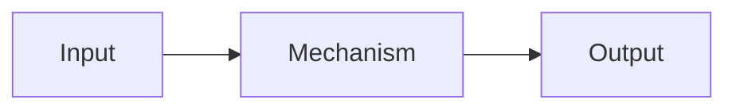

[1-2 문장 summary — frontmatter summary 와 동일 / 풀어쓴 버전]

## Definition

[개념의 본질 1-2 문단]

## Mechanism

[작동 원리. 다이어그램 권장]

## Variants

[변형·확장·관련 기법. 표 또는 불릿]

## Trade-offs

| 측면 | 장점 | 단점 |
|---|---|---|
| ... | ... | ... |

## Open Questions

- [미해결 모순·후속 조사 주제]

## Sources

- [[source path]] ^[extracted] — 1-line context
